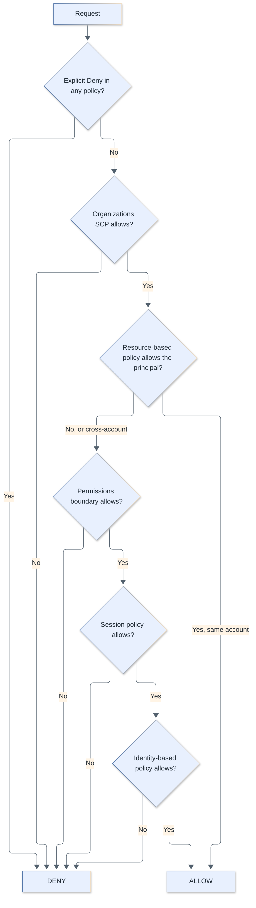
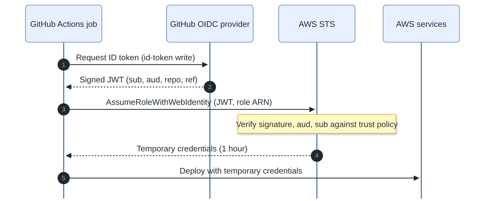
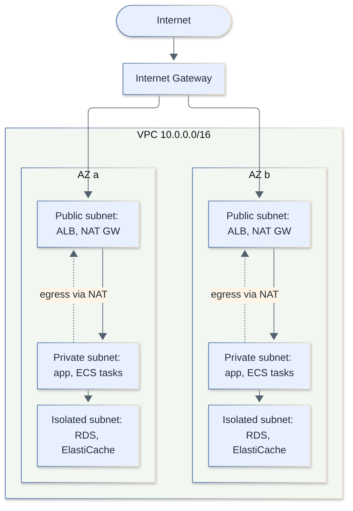
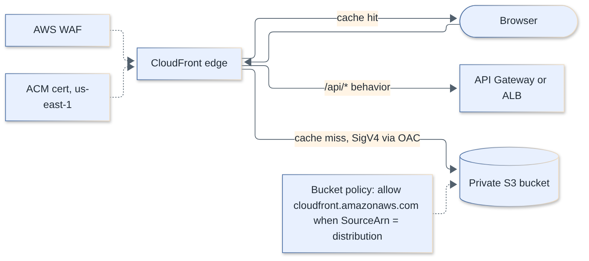
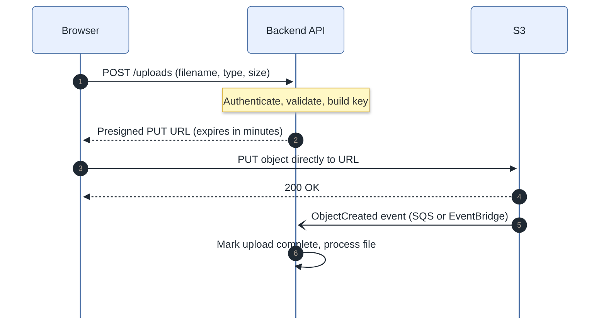
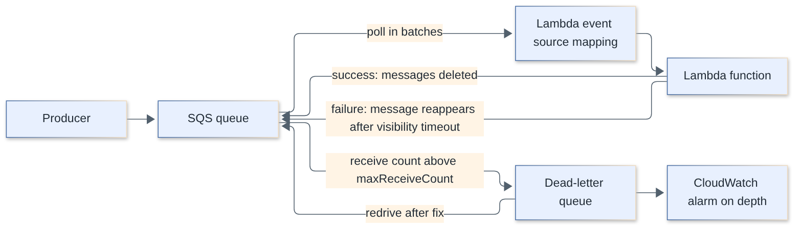
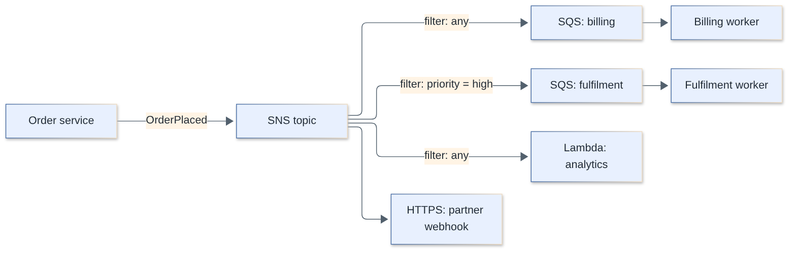
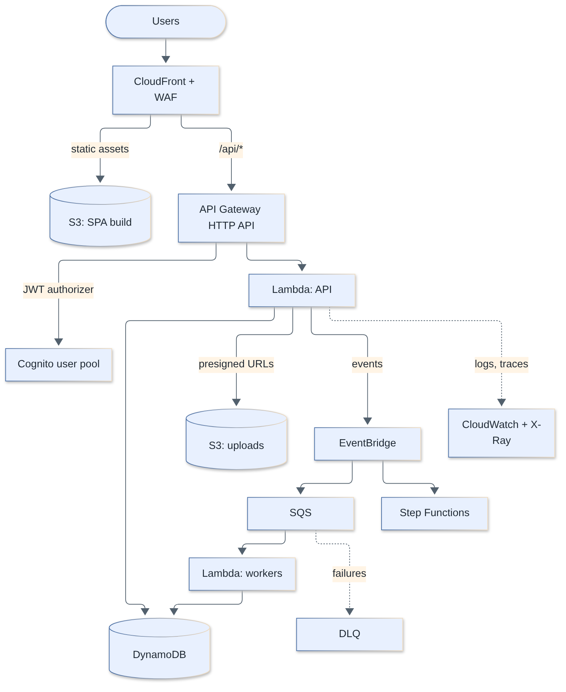
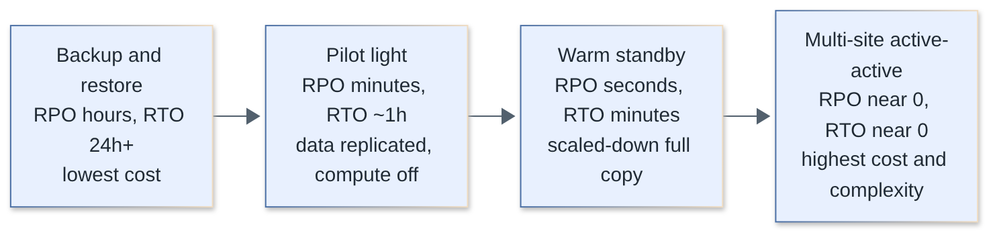

# AWS Interview Questions

Questions and complete answers on Amazon Web Services for fullstack engineers: IAM and security, networking, compute (EC2, ECS/EKS, Lambda), storage and databases (S3, RDS/Aurora, DynamoDB), messaging, observability and IaC, and architecture, disaster recovery and cost. Code examples use IAM policy JSON, AWS CLI, AWS SDK for JavaScript v3, AWS CDK (TypeScript) and CloudFormation/GitHub Actions YAML.

**Levels:** `🟢 Junior` · `🟡 Middle` · `🔴 Senior`

## Table of contents

**Fundamentals**

1. [What are Regions, Availability Zones and edge locations?](#1-what-are-regions-availability-zones-and-edge-locations)
2. [What is the shared responsibility model?](#2-what-is-the-shared-responsibility-model)
3. [What are the pillars of the AWS Well-Architected Framework?](#3-what-are-the-pillars-of-the-aws-well-architected-framework)

**IAM and Security**

4. [What are IAM users, groups, roles and policies?](#4-what-are-iam-users-groups-roles-and-policies)
5. [How does IAM policy evaluation work?](#5-how-does-iam-policy-evaluation-work)
6. [How do STS AssumeRole and cross-account access work?](#6-how-do-sts-assumerole-and-cross-account-access-work)
7. [How do workloads get AWS credentials: instance profiles, task roles, IRSA and EKS Pod Identity?](#7-how-do-workloads-get-aws-credentials-instance-profiles-task-roles-irsa-and-eks-pod-identity)
8. [How do you let GitHub Actions deploy to AWS without storing access keys (OIDC)?](#8-how-do-you-let-github-actions-deploy-to-aws-without-storing-access-keys-oidc)
9. [What are SCPs, permissions boundaries and IAM Identity Center, and how do they fit together?](#9-what-are-scps-permissions-boundaries-and-iam-identity-center-and-how-do-they-fit-together)
10. [How does KMS envelope encryption work?](#10-how-does-kms-envelope-encryption-work)
11. [Secrets Manager vs Parameter Store: when do you use which?](#11-secrets-manager-vs-parameter-store-when-do-you-use-which)
12. [What do AWS WAF and Shield protect against, and where do they attach?](#12-what-do-aws-waf-and-shield-protect-against-and-where-do-they-attach)
13. [What is Amazon Cognito and how do user pools differ from identity pools?](#13-what-is-amazon-cognito-and-how-do-user-pools-differ-from-identity-pools)

**Networking**

14. [How is a VPC laid out: subnets, route tables, internet gateway and NAT gateway?](#14-how-is-a-vpc-laid-out-subnets-route-tables-internet-gateway-and-nat-gateway)
15. [What is the difference between security groups and network ACLs?](#15-what-is-the-difference-between-security-groups-and-network-acls)
16. [What are VPC endpoints (gateway vs interface) and PrivateLink?](#16-what-are-vpc-endpoints-gateway-vs-interface-and-privatelink)
17. [What are Route 53 routing policies and when do you use each?](#17-what-are-route-53-routing-policies-and-when-do-you-use-each)
18. [ALB vs NLB vs API Gateway: how do you choose, and what is the difference between HTTP and REST APIs?](#18-alb-vs-nlb-vs-api-gateway-how-do-you-choose-and-what-is-the-difference-between-http-and-rest-apis)
19. [How do you serve a private S3 bucket through CloudFront with Origin Access Control?](#19-how-do-you-serve-a-private-s3-bucket-through-cloudfront-with-origin-access-control)

**Compute**

20. [EC2 instance types, Graviton and purchasing options: what should you know?](#20-ec2-instance-types-graviton-and-purchasing-options-what-should-you-know)
21. [How does EC2 Auto Scaling work?](#21-how-does-ec2-auto-scaling-work)
22. [ECS vs EKS vs Fargate vs Lambda vs App Runner: how do you choose?](#22-ecs-vs-eks-vs-fargate-vs-lambda-vs-app-runner-how-do-you-choose)
23. [What are Lambda cold starts, SnapStart and the key Lambda limits?](#23-what-are-lambda-cold-starts-snapstart-and-the-key-lambda-limits)
24. [How does Lambda concurrency work: reserved vs provisioned concurrency, scaling and throttling?](#24-how-does-lambda-concurrency-work-reserved-vs-provisioned-concurrency-scaling-and-throttling)

**Storage and Databases**

25. [What are S3 storage classes and lifecycle rules, and how consistent is S3?](#25-what-are-s3-storage-classes-and-lifecycle-rules-and-how-consistent-is-s3)
26. [How do S3 presigned URLs and multipart uploads work for large browser uploads?](#26-how-do-s3-presigned-urls-and-multipart-uploads-work-for-large-browser-uploads)
27. [EBS vs EFS vs S3 (and instance store): when do you use each?](#27-ebs-vs-efs-vs-s3-and-instance-store-when-do-you-use-each)
28. [RDS vs Aurora, and read replicas vs Multi-AZ: how do they differ?](#28-rds-vs-aurora-and-read-replicas-vs-multi-az-how-do-they-differ)
29. [What are Aurora Serverless v2 and RDS Proxy, and how do they help serverless apps?](#29-what-are-aurora-serverless-v2-and-rds-proxy-and-how-do-they-help-serverless-apps)
30. [How do DynamoDB keys, GSIs and LSIs work?](#30-how-do-dynamodb-keys-gsis-and-lsis-work)
31. [DynamoDB on-demand vs provisioned capacity: how do throttling and hot partitions work?](#31-dynamodb-on-demand-vs-provisioned-capacity-how-do-throttling-and-hot-partitions-work)
32. [What is single-table design in DynamoDB, and when is it a bad idea?](#32-what-is-single-table-design-in-dynamodb-and-when-is-it-a-bad-idea)
33. [What are DynamoDB Streams, TTL, conditional writes and transactions used for?](#33-what-are-dynamodb-streams-ttl-conditional-writes-and-transactions-used-for)
34. [How do you use ElastiCache (Valkey/Redis, Memcached) as a cache, and which caching strategy fits?](#34-how-do-you-use-elasticache-valkeyredis-memcached-as-a-cache-and-which-caching-strategy-fits)

**Integration and Messaging**

35. [SQS standard vs FIFO queues: what are the differences?](#35-sqs-standard-vs-fifo-queues-what-are-the-differences)
36. [How do SQS visibility timeout, retries and dead-letter queues work with Lambda?](#36-how-do-sqs-visibility-timeout-retries-and-dead-letter-queues-work-with-lambda)
37. [How does SNS fan-out work, and how does it combine with SQS?](#37-how-does-sns-fan-out-work-and-how-does-it-combine-with-sqs)
38. [What is Amazon EventBridge and how do you use it for event-driven architectures?](#38-what-is-amazon-eventbridge-and-how-do-you-use-it-for-event-driven-architectures)
39. [Kinesis vs SQS vs MSK (Kafka): how do you choose?](#39-kinesis-vs-sqs-vs-msk-kafka-how-do-you-choose)
40. [What is AWS Step Functions and when do you use Standard vs Express workflows?](#40-what-is-aws-step-functions-and-when-do-you-use-standard-vs-express-workflows)

**Observability and IaC**

41. [What do CloudWatch, CloudTrail and AWS Config each do?](#41-what-do-cloudwatch-cloudtrail-and-aws-config-each-do)
42. [How do X-Ray and OpenTelemetry provide distributed tracing on AWS?](#42-how-do-x-ray-and-opentelemetry-provide-distributed-tracing-on-aws)
43. [CloudFormation vs CDK vs Terraform: how do you choose, and how do you handle drift?](#43-cloudformation-vs-cdk-vs-terraform-how-do-you-choose-and-how-do-you-handle-drift)

**Architecture and Cost**

44. [How would you design a fullstack web app on AWS using serverless services?](#44-how-would-you-design-a-fullstack-web-app-on-aws-using-serverless-services)
45. [How do you structure a multi-account AWS environment (Organizations, Control Tower, landing zone)?](#45-how-do-you-structure-a-multi-account-aws-environment-organizations-control-tower-landing-zone)
46. [What are the disaster recovery strategies on AWS, and how do RPO and RTO drive the choice?](#46-what-are-the-disaster-recovery-strategies-on-aws-and-how-do-rpo-and-rto-drive-the-choice)
47. [How do you reduce AWS costs, and why do data transfer costs surprise teams?](#47-how-do-you-reduce-aws-costs-and-why-do-data-transfer-costs-surprise-teams)
48. [What causes common AWS outages and quota problems, and how do you design for them?](#48-what-causes-common-aws-outages-and-quota-problems-and-how-do-you-design-for-them)

## Fundamentals

### 1. What are Regions, Availability Zones and edge locations?

`🟢 Junior` · `#fundamentals` `#global-infrastructure`

A **Region** is a geographic area with multiple isolated data centers (for example `eu-west-1`). An **Availability Zone (AZ)** is one or more discrete data centers inside a Region with independent power, cooling and networking. **Edge locations** (CloudFront and Route 53 points of presence) are many more, smaller sites close to users used for caching and DNS.

| Concept | What it is | Why you care |
|---|---|---|
| Region | Independent cluster of AZs; services, data and quotas are Region-scoped | Latency, data residency (GDPR), pricing differences, service availability |
| AZ | Isolated failure domain inside a Region, connected by low-latency links | Deploy across at least 2-3 AZs for high availability |
| Edge location / Regional edge cache | CloudFront PoPs, Global Accelerator, Route 53 | Lower latency, offload origin |
| Local Zone / Wavelength / Outposts | Extensions of a Region closer to users or on-prem | Single-digit-ms latency, hybrid |

Key facts:

- **Data does not leave a Region** unless you replicate it or the service is global.
- **AZ names are per-account** (`eu-west-1a` in your account may map to a different physical AZ than in mine). Use **AZ IDs** (`euw1-az1`) when coordinating across accounts.
- A few services are **global** (IAM, Route 53, CloudFront, Organizations), though their control planes live in a specific Region (mostly `us-east-1`).
- Multi-AZ protects against a data center failure; **multi-Region** protects against a Region failure and is much more expensive and complex.

```bash
aws ec2 describe-availability-zones --region eu-west-1 \
  --query 'AvailabilityZones[].[ZoneName,ZoneId]' --output table
```

> **Follow-up:** "How do you choose a Region?" Latency to users, compliance/data residency, service and instance availability, and price, in that order. Default to the Region closest to your users that has the services you need.

[↑ Back to top](#table-of-contents)

---

### 2. What is the shared responsibility model?

`🟢 Junior` · `#fundamentals` `#security`

AWS is responsible for the security **of** the cloud (hardware, data centers, hypervisor, managed-service internals). You are responsible for security **in** the cloud (your data, identity and access, configuration, network rules, application code). The split moves depending on how managed the service is.

| Service type | Example | AWS manages | You manage |
|---|---|---|---|
| IaaS | EC2 | Hardware, hypervisor, network fabric | Guest OS patching, firewall (security groups), app, data, IAM |
| Container / managed platform | RDS, ECS on Fargate, EKS | Plus OS and DB engine patching (RDS), host fleet (Fargate) | DB users and parameters, container images, task roles, network exposure, data |
| Serverless / abstract | S3, DynamoDB, Lambda | Plus runtime patching, scaling, availability | IAM policies, bucket policies, encryption choices, code and dependencies, data classification |

Typical customer-side failures: public S3 buckets, over-broad IAM, leaked access keys, unpatched EC2, open security groups (`0.0.0.0/0` on SSH or DB ports), unencrypted data, no logging. These are configuration errors, not AWS breaches.

> **Follow-up:** "Who patches an RDS instance?" AWS applies engine and OS patches in your maintenance window, but you choose the window and engine version, and you own schema, users, parameters, backups policy and network access.

[↑ Back to top](#table-of-contents)

---

### 3. What are the pillars of the AWS Well-Architected Framework?

`🟢 Junior` · `#fundamentals` `#architecture`

Six pillars, a structured set of best practices for reviewing a workload: **Operational Excellence, Security, Reliability, Performance Efficiency, Cost Optimization, Sustainability**.

| Pillar | Core idea | Example practices |
|---|---|---|
| Operational Excellence | Run and improve by learning from operations | IaC, small reversible changes, runbooks, game days, post-incident reviews |
| Security | Protect data and systems | Least privilege, strong identity, encryption, traceability (CloudTrail), automate security |
| Reliability | Recover from failure and meet demand | Multi-AZ, health checks, retries with backoff, tested backups, quotas monitoring |
| Performance Efficiency | Use resources efficiently as demand changes | Right instance family, caching, serverless, benchmarks |
| Cost Optimization | Deliver value at lowest price | Right-sizing, Savings Plans, Spot, tagging, turn off idle resources |
| Sustainability | Minimize environmental impact | Graviton, right-sizing, managed services with higher utilization, efficient storage tiers |

Tools: the **Well-Architected Tool** (questionnaire per workload, with lenses such as Serverless and SaaS) and **Trusted Advisor**. Pillars involve trade-offs: more reliability (multi-Region) costs more; more security controls may slow delivery.

> **Follow-up:** "Which pillar do you prioritize?" It depends on the workload and business risk; a payment system leads with security and reliability, an internal batch tool with cost. State the trade-off explicitly.

[↑ Back to top](#table-of-contents)

---

## IAM and Security

### 4. What are IAM users, groups, roles and policies?

`🟢 Junior` · `#iam` `#security`

IAM (Identity and Access Management) controls **who** (principal) can do **what** (action) on **which resources**, under **which conditions**. A **user** is a long-lived identity with credentials, a **group** is a collection of users, a **role** is an identity assumed temporarily (no permanent credentials), and a **policy** is the JSON document that grants or denies permissions.

- **Users**: access keys and passwords are long-lived and leak-prone. For humans prefer **IAM Identity Center** (SSO, short-lived credentials); for machines prefer roles.
- **Roles**: assumed by AWS services (EC2, Lambda, ECS tasks), other accounts, federated users (OIDC/SAML). Credentials are temporary and rotated automatically.
- **Identity-based policies** attach to users, groups or roles. **Resource-based policies** attach to resources (S3 bucket, SQS queue, KMS key, Lambda) and name a `Principal`.
- **Managed policies** (AWS managed or customer managed, reusable) vs **inline policies** (embedded, one-to-one).
- **Root user**: the account owner with unrestricted access. Enable MFA, delete its access keys, use it only for the few tasks that require it.

```json
{
  "Version": "2012-10-17",
  "Statement": [
    {
      "Sid": "ReadUploadsBucket",
      "Effect": "Allow",
      "Action": ["s3:GetObject", "s3:ListBucket"],
      "Resource": [
        "arn:aws:s3:::acme-uploads",
        "arn:aws:s3:::acme-uploads/*"
      ],
      "Condition": { "Bool": { "aws:SecureTransport": "true" } }
    }
  ]
}
```

Note the two resource ARNs: `ListBucket` applies to the bucket, `GetObject` to objects in it. Forgetting one is a classic cause of `AccessDenied`.

> **Follow-up:** "Why avoid IAM users for applications?" Static keys get committed, logged and never rotated. A role gives short-lived credentials delivered by the platform (instance profile, task role, execution role).

[↑ Back to top](#table-of-contents)

---

### 5. How does IAM policy evaluation work?

`🟡 Middle` · `#iam` `#security`

Requests are **denied by default**. An explicit `Deny` in any applicable policy always wins. Otherwise, access needs an `Allow` and must not be blocked by any guardrail (SCP, permissions boundary, session policy).



Order of thinking:

1. **Explicit deny** anywhere (identity, resource, SCP, RCP, boundary, session) means denied.
2. **Organizations SCPs** (and RCPs) must allow the action: they never grant, only cap.
3. **Resource-based policy**: within the **same account**, an allow here naming the principal is enough on its own (except for some services such as KMS, which require the key policy to permit it).
4. **Permissions boundary** and **session policy** (passed at `AssumeRole`) cap what identity policies can grant.
5. **Identity-based policy** must allow.
6. Otherwise: implicit deny.

**Cross-account** access needs both sides: the resource policy (or role trust policy) in the target account must allow the principal, **and** the caller's identity policy must allow the action.

```json
{
  "Version": "2012-10-17",
  "Statement": [{
    "Sid": "DenyUnencryptedTransport",
    "Effect": "Deny",
    "Principal": "*",
    "Action": "s3:*",
    "Resource": ["arn:aws:s3:::acme-uploads", "arn:aws:s3:::acme-uploads/*"],
    "Condition": { "Bool": { "aws:SecureTransport": "false" } }
  }]
}
```

Debugging tools: the **IAM policy simulator**, **CloudTrail** `errorMessage` (newer messages state which policy type denied), and **IAM Access Analyzer** policy validation.

> **Follow-up:** "Identity policy allows `s3:GetObject` but the call fails. Why?" Likely an explicit deny (bucket policy, SCP, VPC endpoint policy), a permissions boundary, missing KMS permission on an SSE-KMS object, or wrong resource ARN.

[↑ Back to top](#table-of-contents)

---

### 6. How do STS AssumeRole and cross-account access work?

`🟡 Middle` · `#iam` `#sts`

`sts:AssumeRole` exchanges the caller's identity for **temporary credentials** (access key, secret key, session token) for a role. The role has two policies: a **trust policy** (who may assume it) and **permission policies** (what it may do).

Flow for cross-account access (account `111111111111` assumes a role in `222222222222`):

1. Account B creates `DeployRole` with a trust policy naming account A (or a specific role).
2. Account A's principal needs `sts:AssumeRole` permission on that role ARN.
3. The principal calls `AssumeRole` and uses the returned credentials until they expire.

```json
{
  "Version": "2012-10-17",
  "Statement": [{
    "Effect": "Allow",
    "Principal": { "AWS": "arn:aws:iam::111111111111:role/ci-runner" },
    "Action": "sts:AssumeRole",
    "Condition": { "StringEquals": { "sts:ExternalId": "partner-7f3a" } }
  }]
}
```

```ts
import { STSClient, AssumeRoleCommand } from '@aws-sdk/client-sts';
import { S3Client } from '@aws-sdk/client-s3';

const sts = new STSClient({ region: 'eu-west-1' });
const { Credentials } = await sts.send(new AssumeRoleCommand({
  RoleArn: 'arn:aws:iam::222222222222:role/DeployRole',
  RoleSessionName: 'ci-deploy',
  DurationSeconds: 3600,
}));
const s3 = new S3Client({
  credentials: {
    accessKeyId: Credentials!.AccessKeyId!,
    secretAccessKey: Credentials!.SecretAccessKey!,
    sessionToken: Credentials!.SessionToken,
  },
});
```

Details that come up:

- Session duration: default 1 hour; up to the role's `MaxSessionDuration` (1-12 h). **Role chaining** (role assumes role) is capped at 1 hour.
- **ExternalId** protects against the **confused deputy** problem when a third-party SaaS assumes a role in your account.
- Use `aws:PrincipalOrgID` and `RoleSessionName`/`sts:SourceIdentity` for auditing in CloudTrail.
- In the CLI, prefer profiles with `role_arn` and `source_profile` or SSO instead of hand-written calls.

> **Follow-up:** "Where do the credentials come from in the SDK?" The default credential provider chain: env vars, SSO/shared profile, container credentials (ECS/EKS), then EC2 instance metadata (IMDSv2). You rarely pass credentials in code.

[↑ Back to top](#table-of-contents)

---

### 7. How do workloads get AWS credentials: instance profiles, task roles, IRSA and EKS Pod Identity?

`🔴 Senior` · `#iam` `#eks` `#containers`

Every compute option has a mechanism that delivers **temporary role credentials** to the workload, so no static keys are needed. On EKS the choice is between **IRSA** (IAM Roles for Service Accounts, OIDC-based) and **EKS Pod Identity** (newer, simpler).

| Platform | Mechanism |
|---|---|
| EC2 | Instance profile (role) via IMDSv2; require IMDSv2 and hop limit 1 |
| Lambda | Execution role |
| ECS / Fargate | **Task role** (what the app uses) vs **task execution role** (what the agent uses to pull images, write logs, fetch secrets) |
| EKS (IRSA) | Cluster OIDC provider; ServiceAccount annotated with a role; pod gets a projected JWT and calls `AssumeRoleWithWebIdentity` |
| EKS (Pod Identity) | Pod Identity Agent add-on (DaemonSet); associate role with namespace + ServiceAccount; no OIDC provider or annotation |

**IRSA**: trust policy references the cluster's OIDC provider with a `sub` condition (`system:serviceaccount:<ns>:<sa>`). Needs one OIDC provider per cluster and role trust policy edited per cluster.

**Pod Identity**: trust policy uses the service principal `pods.eks.amazonaws.com` (with `sts:AssumeRole` and `sts:TagSession`), so one role can be reused across many clusters. Associations are made through the EKS API, and pods get **session tags** (cluster, namespace, service account) usable in ABAC conditions. It does not work on Fargate pods or outside EKS (use IRSA there, or EKS Anywhere with IRSA).

```bash
# Pod Identity: associate role to a service account
aws eks create-pod-identity-association \
  --cluster-name prod \
  --namespace payments \
  --service-account payments-api \
  --role-arn arn:aws:iam::111111111111:role/payments-api
```

```yaml
# IRSA: annotate the service account instead
apiVersion: v1
kind: ServiceAccount
metadata:
  name: payments-api
  namespace: payments
  annotations:
    eks.amazonaws.com/role-arn: arn:aws:iam::111111111111:role/payments-api
```

Recommendation for new clusters: **Pod Identity**, unless you need Fargate pods or cross-account role setups that rely on IRSA. Always one role per workload, never the node role, and block pod access to the node's IMDS.

> **Follow-up:** "Why is using the node instance role for pods dangerous?" Every pod on the node inherits its permissions, so one compromised pod gets everything. Per-workload roles isolate blast radius.

[↑ Back to top](#table-of-contents)

---

### 8. How do you let GitHub Actions deploy to AWS without storing access keys (OIDC)?

`🟡 Middle` · `#iam` `#ci-cd` `#oidc`

Configure AWS to trust GitHub's OIDC identity provider. Each workflow run gets a short-lived signed JWT from GitHub, exchanges it at STS via `AssumeRoleWithWebIdentity` and receives temporary credentials. No long-lived secrets exist in GitHub.



Setup:

1. Create an IAM OIDC provider for `https://token.actions.githubusercontent.com` with audience `sts.amazonaws.com`.
2. Create a role whose trust policy restricts the **`sub` claim** to your repo and branch/environment. This condition is the security boundary; without it any GitHub repo could assume the role.
3. In the workflow grant `id-token: write` and use the configure-credentials action.

```json
{
  "Version": "2012-10-17",
  "Statement": [{
    "Effect": "Allow",
    "Principal": {
      "Federated": "arn:aws:iam::111111111111:oidc-provider/token.actions.githubusercontent.com"
    },
    "Action": "sts:AssumeRoleWithWebIdentity",
    "Condition": {
      "StringEquals": {
        "token.actions.githubusercontent.com:aud": "sts.amazonaws.com",
        "token.actions.githubusercontent.com:sub": "repo:acme/web:environment:production"
      }
    }
  }]
}
```

```yaml
permissions:
  id-token: write   # request the OIDC token
  contents: read

jobs:
  deploy:
    runs-on: ubuntu-latest
    environment: production
    steps:
      - uses: actions/checkout@v4
      - uses: aws-actions/configure-aws-credentials@v4
        with:
          role-to-assume: arn:aws:iam::111111111111:role/gha-deploy
          aws-region: eu-west-1
      - run: aws s3 sync ./dist s3://acme-web --delete
```

Best practices: separate roles for plan vs apply and per environment, least-privilege permissions on the role, match `sub` on environment (so required reviewers gate it) rather than `repo:acme/web:*`, and short session duration. GitHub's CA no longer needs thumbprint pinning when creating the provider.

> **Follow-up:** "Is `StringLike` with `repo:acme/*` fine?" Only if every repo in the org is trusted for that role. Prefer exact repo and ref/environment.

[↑ Back to top](#table-of-contents)

---

### 9. What are SCPs, permissions boundaries and IAM Identity Center, and how do they fit together?

`🔴 Senior` · `#iam` `#organizations` `#governance`

They are different layers of control. **SCPs** (service control policies) cap permissions for whole accounts or OUs in AWS Organizations. **Permissions boundaries** cap what a specific IAM user/role can ever be granted, which enables safe delegation. **IAM Identity Center** gives humans SSO access to many accounts through permission sets that become roles.

| Control | Scope | Grants permissions? | Typical use |
|---|---|---|---|
| SCP | Org / OU / account (not the management account) | No, only a maximum | Deny regions, deny leaving the org, protect CloudTrail, deny root usage |
| RCP (resource control policy) | Org / OU / account resources | No, only a maximum | Enforce org-wide resource guardrails (e.g., S3 only accessed by org principals, TLS only) |
| Permissions boundary | One user or role | No | Let developers create roles, but only within a boundary |
| Session policy | One assumed-role session | No | Narrow a role for a particular session |
| Identity Center permission set | Human users per account | Yes (creates roles) | Workforce SSO with MFA |

Example SCP (deny all actions outside approved Regions, with global services exempted):

```json
{
  "Version": "2012-10-17",
  "Statement": [{
    "Sid": "DenyOutsideEU",
    "Effect": "Deny",
    "NotAction": ["iam:*", "organizations:*", "route53:*", "cloudfront:*", "support:*", "sts:*"],
    "Resource": "*",
    "Condition": {
      "StringNotEquals": { "aws:RequestedRegion": ["eu-west-1", "eu-central-1"] }
    }
  }]
}
```

**IAM Identity Center** (successor to AWS SSO): connect an IdP (Okta, Entra ID, Google) via SAML/SCIM or use its own directory, define **permission sets** (for example `ReadOnly`, `Developer`, `Admin`), assign groups to accounts, and users get short-lived credentials via `aws sso login`. It removes the need for per-account IAM users. It also supports ABAC through user attributes.

Least privilege at scale: start from broad managed policies in sandbox, use **IAM Access Analyzer** to generate policies from CloudTrail activity, find **unused access** and external sharing, and review with **last-accessed** data. Use conditions (`aws:PrincipalOrgID`, `aws:SourceVpce`, MFA, tags) to tighten.

> **Follow-up:** "Why can an SCP not give access?" SCPs are filters. The account's IAM policies must still allow the action. An SCP of `Allow *` grants nothing by itself.

[↑ Back to top](#table-of-contents)

---

### 10. How does KMS envelope encryption work?

`🟡 Middle` · `#kms` `#encryption` `#security`

KMS keeps a **KMS key** (formerly CMK) inside HSMs and never exports it. For anything beyond 4 KB you use **envelope encryption**: ask KMS for a **data key**, encrypt the data locally with the plaintext data key, then store the **encrypted** data key next to the ciphertext and discard the plaintext key. To decrypt, send the encrypted data key to KMS, get the plaintext key back, decrypt locally.

Why: the large data never travels to KMS (`Encrypt` is limited to 4 KB), you get one KMS call per object instead of per byte, and access to every object is still controlled and audited through the KMS key.

```ts
import { KMSClient, GenerateDataKeyCommand, DecryptCommand } from '@aws-sdk/client-kms';
import { createCipheriv, createDecipheriv, randomBytes } from 'node:crypto';

const kms = new KMSClient({});
const KeyId = 'alias/app-data';

export async function encrypt(plaintext: Buffer) {
  const { Plaintext, CiphertextBlob } = await kms.send(
    new GenerateDataKeyCommand({ KeyId, KeySpec: 'AES_256' }),
  );
  const iv = randomBytes(12);
  const cipher = createCipheriv('aes-256-gcm', Plaintext!, iv);
  const data = Buffer.concat([cipher.update(plaintext), cipher.final()]);
  Plaintext!.fill(0); // wipe the plaintext key
  return { data, iv, tag: cipher.getAuthTag(), encryptedKey: CiphertextBlob! };
}

export async function decrypt(p: Awaited<ReturnType<typeof encrypt>>) {
  const { Plaintext } = await kms.send(new DecryptCommand({ CiphertextBlob: p.encryptedKey }));
  const decipher = createDecipheriv('aes-256-gcm', Plaintext!, p.iv);
  decipher.setAuthTag(p.tag);
  return Buffer.concat([decipher.update(p.data), decipher.final()]);
}
```

Key facts:

- **Key types**: AWS owned (invisible, free), AWS managed (`aws/s3`, created per service, cannot edit policy), **customer managed** (you control key policy, rotation, deletion; about $1/month plus request costs).
- Access is the **key policy** plus IAM/grants; the key policy is the root of trust, and IAM alone is not enough unless the policy delegates to IAM.
- **Rotation**: automatic rotation of customer managed symmetric keys (default yearly, period configurable) keeps old key material to decrypt old data.
- **Multi-Region keys** let you decrypt in another Region without cross-Region calls (DR, global tables).
- Services (S3 SSE-KMS, EBS, RDS) do envelope encryption for you. **S3 Bucket Keys** reduce KMS request costs. KMS requests have per-Region quotas, so high-throughput SSE-KMS can throttle.
- For application-level encryption prefer the **AWS Encryption SDK** over hand-rolling as above.

> **Follow-up:** "What happens if you delete a KMS key?" Data encrypted under it becomes unrecoverable. Deletion has a mandatory 7-30 day waiting period; disable the key first and watch for failures.

[↑ Back to top](#table-of-contents)

---

### 11. Secrets Manager vs Parameter Store: when do you use which?

`🟢 Junior` · `#secrets` `#security`

Use **Secrets Manager** for secrets that need **automatic rotation** (database credentials, API keys) and cross-Region replication. Use **Systems Manager Parameter Store** for configuration and low-risk or rarely changed secrets where you want a free or cheap hierarchical key-value store.

| | Secrets Manager | Parameter Store |
|---|---|---|
| Purpose | Secrets lifecycle | Config and simple secrets |
| Rotation | Built in (Lambda-based; managed rotation for RDS/Aurora, Redshift, DocumentDB) | None native (build your own) |
| Cost | About $0.40 per secret per month plus API calls | Standard tier free; Advanced about $0.05 per parameter per month |
| Size | 64 KB | 4 KB standard, 8 KB advanced |
| Encryption | Always KMS | `String`, `StringList`, `SecureString` (KMS) |
| Cross-Region replication | Yes | No |
| Resource policy | Yes | No (advanced tier policies for expiry) |
| Hierarchy | Names with `/` allowed | First class (`/prod/api/db-url`, `GetParametersByPath`) |

```ts
import { SecretsManagerClient, GetSecretValueCommand } from '@aws-sdk/client-secrets-manager';

const sm = new SecretsManagerClient({});
let cached: { value: string; at: number } | undefined;

export async function getDbUrl() {
  if (cached && Date.now() - cached.at < 5 * 60_000) return cached.value; // cache 5 min
  const { SecretString } = await sm.send(new GetSecretValueCommand({ SecretId: 'prod/db' }));
  cached = { value: SecretString!, at: Date.now() };
  return cached.value;
}
```

Practices: **never** put secrets in environment variables baked into images or in CloudFormation/Terraform plain text. ECS and Lambda can inject secrets from both stores at start. **Cache** values (SDK or the Lambda Parameters and Secrets extension) to avoid latency and throttling, and re-fetch on auth failure to survive rotation. Rotation using alternating users avoids downtime.

> **Follow-up:** "Can you reference a Secrets Manager secret from Parameter Store?" Yes, `/aws/reference/secretsmanager/<name>` lets you read a secret through the Parameter Store API.

[↑ Back to top](#table-of-contents)

---

### 12. What do AWS WAF and Shield protect against, and where do they attach?

`🟡 Middle` · `#security` `#waf` `#ddos`

**AWS WAF** is a layer-7 web application firewall that filters HTTP(S) requests with rules (SQL injection, XSS, bad bots, rate limits, geo/IP). **AWS Shield** protects against DDoS: **Shield Standard** is automatic and free for all customers (L3/L4); **Shield Advanced** is a paid subscription with enhanced detection, DDoS response team and cost protection.

WAF attaches to a **Web ACL** associated with: CloudFront, ALB, API Gateway REST API (not HTTP API), AppSync, Cognito user pools, App Runner and Verified Access. It does not attach to an NLB or HTTP API.

Rules:

- **AWS Managed Rule Groups**: Core rule set, Known bad inputs, SQL database, Admin protection, IP reputation, plus paid Bot Control, Account Takeover Prevention, Fraud Control.
- **Rate-based rules**: block an IP (or key such as header/API key) exceeding N requests per window, the simplest defense against credential stuffing and scraping.
- Custom rules by IP set, geo, header, URI, body, regex.
- **Actions**: Allow, Block, Count, CAPTCHA, Challenge. Roll new rules out in **Count** mode first and inspect logs (to S3, CloudWatch Logs or Firehose).
- Capacity is measured in **WCUs** (default limit 1,500 per web ACL).

```ts
import * as wafv2 from 'aws-cdk-lib/aws-wafv2';

new wafv2.CfnWebACL(this, 'Acl', {
  scope: 'CLOUDFRONT', // must be created in us-east-1
  defaultAction: { allow: {} },
  visibilityConfig: { cloudWatchMetricsEnabled: true, metricName: 'acl', sampledRequestsEnabled: true },
  rules: [{
    name: 'RateLimit',
    priority: 0,
    action: { block: {} },
    statement: { rateBasedStatement: { limit: 1000, aggregateKeyType: 'IP' } },
    visibilityConfig: { cloudWatchMetricsEnabled: true, metricName: 'rate', sampledRequestsEnabled: true },
  }],
});
```

Defense in depth: put CloudFront + WAF in front, keep origins private (security group allowing only CloudFront managed prefix list, or VPC origins), add Shield Advanced for critical internet-facing apps, and use **Network Firewall** for VPC egress filtering.

> **Follow-up:** "Does WAF stop a volumetric DDoS?" No. Absorbing volumetric floods is Shield and the CloudFront/Route 53 edge network. WAF handles L7 abuse and application attacks.

[↑ Back to top](#table-of-contents)

---

### 13. What is Amazon Cognito and how do user pools differ from identity pools?

`🟡 Middle` · `#cognito` `#auth` `#security`

Cognito provides customer identity for apps. A **user pool** is a user directory plus an OIDC identity provider: sign-up/sign-in, MFA and passkeys, social/SAML/OIDC federation, and it issues **JWTs**. An **identity pool** (federated identities) exchanges a token (from a user pool or another IdP) for **temporary AWS credentials** so the client can call AWS services directly.

| | User pool | Identity pool |
|---|---|---|
| Answers | Who is this user (authentication) | What AWS access does this identity get (authorization) |
| Output | ID, access and refresh tokens (JWT) | Temporary STS credentials for an IAM role |
| Typical use | Login for your web/mobile app, API auth | Browser uploads straight to S3, IoT, direct AWS SDK calls |

Typical fullstack flow: SPA redirects to the Cognito hosted UI/managed login (Authorization Code + PKCE), gets tokens, sends the **access token** as `Authorization: Bearer` to **API Gateway** (native JWT authorizer on HTTP API, Cognito authorizer on REST API) or an **ALB** (built-in authenticate-cognito action). The backend verifies the signature against the pool's JWKS.

```ts
import { CognitoJwtVerifier } from 'aws-jwt-verify';

const verifier = CognitoJwtVerifier.create({
  userPoolId: 'eu-west-1_AbCdEf123',
  tokenUse: 'access',
  clientId: '1h57kf5cpq17m0eml12EXAMPLE',
});

export async function authenticate(token: string) {
  return verifier.verify(token); // throws if invalid, expired or wrong audience
}
```

Features to know: **Lambda triggers** (pre sign-up, post confirmation, pre token generation to add custom claims), groups for RBAC, app clients with or without secret (SPAs use none), refresh token rotation, advanced security (compromised credentials, adaptive auth) on higher feature plans, and pricing by monthly active users with Lite, Essentials and Plus tiers.

Trade-offs: low ops and cheap, but limited UI/flow customization, hard to migrate users out (password hashes cannot be exported; plan migration triggers), some attributes are immutable after creation. Alternatives: Auth0, Clerk, Keycloak, or self-built.

> **Follow-up:** "Which token goes to your API, ID or access token?" The access token for authorization to an API; the ID token describes the user to the client app and should not be used to call APIs.

[↑ Back to top](#table-of-contents)

---

## Networking

### 14. How is a VPC laid out: subnets, route tables, internet gateway and NAT gateway?

`🟢 Junior` · `#vpc` `#networking`

A **VPC** is your private, isolated virtual network in a Region, defined by an IPv4 CIDR block (for example `10.0.0.0/16`). You split it into **subnets**, each living in exactly **one AZ**. What makes a subnet "public" is its **route table**, not a flag: a public subnet has a route `0.0.0.0/0 -> Internet Gateway (IGW)`, a private subnet does not.



| Component | Role |
|---|---|
| Internet Gateway | Horizontally scaled, free; two-way internet access for resources with public IPs |
| NAT Gateway | Lets private resources **initiate** outbound connections (package downloads, third-party APIs); inbound from internet is not possible. Classic **zonal** mode lives in one public subnet of one AZ; the newer **regional** mode (late 2025) is one resource that spans AZs automatically |
| Route table | Per-subnet rules: `10.0.0.0/16 local`, `0.0.0.0/0 igw-...` or `nat-...` |
| Egress-only IGW | IPv6 equivalent of NAT (outbound only) |
| Isolated subnet | No route to the internet at all (databases) |

Standard layout for a web app: ALB in **public** subnets, app tasks/instances in **private** subnets, databases in **isolated** subnets, spread across at least two AZs, with one zonal NAT gateway per AZ (or a regional NAT gateway) so an AZ failure does not take down egress for the others.

Gotchas:

- **NAT gateways are expensive**: in us-east-1 roughly $0.045 per hour per gateway plus $0.045 per GB processed (rates vary by Region; check the VPC pricing page). Route S3 and DynamoDB traffic through **gateway endpoints** and use VPC endpoints for other AWS APIs to avoid NAT data charges.
- AWS reserves 5 IPs per subnet; plan CIDRs so VPCs that must connect later (peering, Transit Gateway) **do not overlap**.
- Since 2024, **every public IPv4 address costs about $0.005 per hour** in us-east-1, including those attached to ALBs and NAT gateways.
- Subnet IP exhaustion (EKS pods consume VPC IPs, Lambda in VPC ENIs) is a real outage cause; use sufficiently large subnets or custom networking.

```bash
aws ec2 create-vpc --cidr-block 10.0.0.0/16
aws ec2 create-route --route-table-id rtb-123 \
  --destination-cidr-block 0.0.0.0/0 --nat-gateway-id nat-123
```

> **Follow-up:** "Does an instance in a public subnet automatically reach the internet?" Only if it also has a public or Elastic IP **and** the subnet routes to an IGW **and** security groups/NACLs allow the traffic.

[↑ Back to top](#table-of-contents)

---

### 15. What is the difference between security groups and network ACLs?

`🟢 Junior` · `#vpc` `#security`

A **security group (SG)** is a **stateful** firewall at the network interface (ENI) level with allow rules only. A **network ACL (NACL)** is a **stateless** firewall at the **subnet** level with ordered allow and deny rules.

| | Security group | Network ACL |
|---|---|---|
| Level | ENI / instance / task / Lambda ENI | Subnet |
| State | Stateful (return traffic automatically allowed) | Stateless (must allow both directions and ephemeral ports) |
| Rules | Allow only | Allow and deny |
| Evaluation | All rules evaluated together | Lowest rule number first, first match wins |
| Default | Deny all inbound, allow all outbound | Default NACL allows all |
| Can reference | Other SGs, prefix lists, CIDRs | CIDRs only |

Best practice: rely on SGs as the main control and chain them by reference, for example `db-sg` allows 5432 **from `app-sg`** instead of a CIDR range. Use NACLs sparingly, mainly as a coarse backstop or to **explicitly block** a CIDR (SGs cannot deny).

```bash
aws ec2 authorize-security-group-ingress \
  --group-id sg-db \
  --protocol tcp --port 5432 \
  --source-group sg-app
```

Never open SSH/RDP or database ports to `0.0.0.0/0`. Prefer **SSM Session Manager** (no inbound ports, IAM-authenticated, logged) over bastion hosts.

> **Follow-up:** "Why does a NACL rule for inbound 443 still break the connection?" Statelessness: the response goes out on an ephemeral port (1024-65535), which needs an explicit outbound allow.

[↑ Back to top](#table-of-contents)

---

### 16. What are VPC endpoints (gateway vs interface) and PrivateLink?

`🟡 Middle` · `#vpc` `#privatelink` `#networking`

VPC endpoints let resources in a VPC reach AWS services **privately**, without an internet gateway or NAT. **Gateway endpoints** (S3 and DynamoDB only) are route-table entries and are **free**. **Interface endpoints** are ENIs with private IPs powered by **AWS PrivateLink**, support most services, and cost per hour plus per GB.

| | Gateway endpoint | Interface endpoint (PrivateLink) |
|---|---|---|
| Services | S3, DynamoDB | Most AWS APIs (SQS, SNS, KMS, Secrets Manager, ECR, STS...), S3 too, and third-party/your own services |
| Implementation | Prefix-list route in route table | ENI in your subnets, private DNS name |
| Cost | Free | About $0.01/hour per AZ plus data processing |
| Security | Endpoint policy, bucket policy with `aws:SourceVpce` | Endpoint policy plus security groups |
| Reachable from on-prem / peered VPC | No | Yes |

**PrivateLink as a product**: a provider exposes a service behind an **NLB** (or Gateway Load Balancer) as an *endpoint service*; consumers create an interface endpoint to it in their own VPC. Traffic stays on the AWS network, only that service is exposed (not the whole network), and **overlapping CIDRs are fine**. It is the standard way for SaaS vendors and for sharing internal services across accounts.

Why it matters in practice:

- **Cost**: an S3 gateway endpoint can remove the biggest NAT data-processing charge.
- **Security**: lock a bucket to your VPC with a policy.
- Private subnets that pull images from ECR need endpoints for `ecr.api`, `ecr.dkr` and S3 (gateway), plus `logs` for CloudWatch.

```json
{
  "Version": "2012-10-17",
  "Statement": [{
    "Effect": "Deny",
    "Principal": "*",
    "Action": "s3:*",
    "Resource": ["arn:aws:s3:::acme-private", "arn:aws:s3:::acme-private/*"],
    "Condition": { "StringNotEquals": { "aws:SourceVpce": "vpce-0abc123" } }
  }]
}
```

Compare with **VPC peering** (non-transitive, no overlapping CIDRs, exposes whole network) and **Transit Gateway** (hub-and-spoke routing for many VPCs and on-prem).

> **Follow-up:** "A private-subnet Lambda cannot reach SQS. What do you check?" Route to NAT or an interface endpoint for `sqs`, private DNS enabled on the endpoint, endpoint SG allowing 443 from the Lambda SG, and endpoint policy.

[↑ Back to top](#table-of-contents)

---

### 17. What are Route 53 routing policies and when do you use each?

`🟡 Middle` · `#route53` `#dns` `#availability`

Route 53 is AWS's authoritative DNS service. Beyond simple records it offers **routing policies** that decide which answer to return, optionally driven by **health checks**.

| Policy | Behavior | Use case |
|---|---|---|
| Simple | One record, possibly multiple values returned randomly | Single resource |
| Weighted | Split traffic by weight | Canary / blue-green, gradual migration |
| Latency | Lowest network latency Region | Multi-Region active-active |
| Failover | Primary/secondary based on health check | Active-passive DR |
| Geolocation | By user country/continent | Compliance, localization |
| Geoproximity | By distance with adjustable bias | Shift load between Regions |
| IP-based | By client CIDR | Route known ISPs/networks |
| Multivalue answer | Up to 8 healthy records | Poor-man's load balancing |

Key concepts:

- **Alias records** point to AWS resources (CloudFront, ALB, S3 website, API Gateway, another record), work at the **zone apex** (`example.com`), are free to query, and follow resource IP changes. `CNAME` cannot exist at the apex.
- **Health checks** probe endpoints (HTTP/HTTPS/TCP), other health checks or CloudWatch alarms; combine with failover. Alias records can use *Evaluate Target Health*.
- **TTL** controls how long resolvers cache; lower it *before* planned migrations. Some resolvers ignore low TTLs.
- **Public vs private hosted zones** (private zones resolve only inside associated VPCs), and **Route 53 Resolver** endpoints for hybrid DNS.
- For fast, reliable regional failover rely on the **data plane** (health checks and records, or Application Recovery Controller routing controls), not on editing records in the console during an incident.

```bash
aws route53 change-resource-record-sets --hosted-zone-id Z123 --change-batch '{
  "Changes": [{
    "Action": "UPSERT",
    "ResourceRecordSet": {
      "Name": "api.example.com", "Type": "A",
      "SetIdentifier": "eu", "Region": "eu-west-1",
      "AliasTarget": { "HostedZoneId": "Z32O12XQLNTSW2",
        "DNSName": "eu-alb-123.eu-west-1.elb.amazonaws.com",
        "EvaluateTargetHealth": true }
    }
  }]
}'
```

> **Follow-up:** "DNS failover is not instant. Why?" Health check detection time (interval times failure threshold) plus resolver and client caching of the TTL.

[↑ Back to top](#table-of-contents)

---

### 18. ALB vs NLB vs API Gateway: how do you choose, and what is the difference between HTTP and REST APIs?

`🟡 Middle` · `#load-balancing` `#api-gateway` `#networking`

Use an **ALB** for HTTP(S) routing to your own compute, an **NLB** for TCP/UDP/TLS with extreme performance or static IPs, and **API Gateway** when you want a managed API front door (auth, throttling, usage plans, direct Lambda integration) with pay-per-request pricing.

| | ALB | NLB | API Gateway |
|---|---|---|---|
| Layer | 7 (HTTP/1.1, HTTP/2, gRPC, WebSocket) | 4 (TCP, UDP, TLS) | 7 (REST, HTTP, WebSocket APIs) |
| Routing | Host, path, header, query, method | Port/protocol | Routes/resources |
| Targets | EC2, IP, ECS, **Lambda** | EC2, IP, ALB | Lambda, HTTP, AWS services, VPC Link |
| Static IP | No (use Global Accelerator) | Yes, Elastic IP per AZ | No |
| Built-in auth | OIDC / Cognito | No (TLS only) | IAM, Cognito/JWT, Lambda authorizers |
| Pricing | Hourly + LCU | Hourly + NLCU | Per request |
| Typical use | Web apps, microservices on ECS/EKS | Gaming, IoT, databases, PrivateLink backing, TLS passthrough | Public serverless APIs, partner APIs |

**API Gateway HTTP API vs REST API**:

| | HTTP API | REST API |
|---|---|---|
| Price (us-east-1, first tier; check the pricing page) | About $1.00 per million requests | About $3.50 per million |
| Latency | Lower | Higher |
| Auth | IAM, **native JWT authorizer** (Cognito, any OIDC), Lambda authorizer | IAM, Cognito authorizer, Lambda authorizer, client certs |
| API keys + usage plans | No | Yes |
| Request validation / mapping templates (VTL) | No | Yes |
| Caching | No | Yes (built-in cache) |
| WAF integration | No (put CloudFront in front) | Yes |
| Private (VPC-only) API | Via VPC Link to private resources | Yes, private endpoints |
| Endpoint types | Regional | Edge-optimized, Regional, Private |

Default to **HTTP API** for simple Lambda/proxy APIs; choose **REST API** for usage plans, per-client throttling, caching, WAF, validation or private APIs. Integration timeout is about 29-30 seconds by default (REST can be raised above 29 s through a Service Quotas request for Regional and private APIs only, not edge-optimized, and it may cost you Region-level throttle quota), payload limit 10 MB. For long work respond with 202 and process asynchronously.

Other combinations: **ALB in front of Lambda** is cheaper at sustained high RPS than API Gateway (no per-request fee), and **NLB -> ALB** gives static IPs with L7 routing. Remember ALB idle timeout (60 s default) versus your app keep-alive, and that cross-zone load balancing is on by default for ALB but off for NLB.

> **Follow-up:** "Why do you get random 502s from an ALB?" Often the target closes keep-alive connections earlier than the ALB idle timeout. Set app keep-alive timeout higher than the ALB's.

[↑ Back to top](#table-of-contents)

---

### 19. How do you serve a private S3 bucket through CloudFront with Origin Access Control?

`🟡 Middle` · `#cloudfront` `#s3` `#cdn` `#security`

Keep the S3 bucket **private** (Block Public Access on), create a CloudFront distribution with the bucket as origin and an **Origin Access Control (OAC)**, and add a bucket policy that allows only the CloudFront service principal for that specific distribution. CloudFront signs each origin request with SigV4.



```json
{
  "Version": "2012-10-17",
  "Statement": [{
    "Sid": "AllowCloudFrontOAC",
    "Effect": "Allow",
    "Principal": { "Service": "cloudfront.amazonaws.com" },
    "Action": "s3:GetObject",
    "Resource": "arn:aws:s3:::acme-web/*",
    "Condition": {
      "StringEquals": {
        "AWS:SourceArn": "arn:aws:cloudfront::111111111111:distribution/E123ABC"
      }
    }
  }]
}
```

```ts
import * as cloudfront from 'aws-cdk-lib/aws-cloudfront';
import * as origins from 'aws-cdk-lib/aws-cloudfront-origins';

new cloudfront.Distribution(this, 'Cdn', {
  defaultBehavior: {
    origin: origins.S3BucketOrigin.withOriginAccessControl(bucket), // creates OAC + policy
    viewerProtocolPolicy: cloudfront.ViewerProtocolPolicy.REDIRECT_TO_HTTPS,
    cachePolicy: cloudfront.CachePolicy.CACHING_OPTIMIZED,
  },
  defaultRootObject: 'index.html',
  errorResponses: [{ httpStatus: 403, responseHttpStatus: 200, responsePagePath: '/index.html' }], // SPA routing
});
```

Why OAC over the legacy **OAI**: supports all Regions, SSE-KMS encrypted objects, dynamic methods (PUT/DELETE), and short-lived credentials with better security.

Related fundamentals:

- **Behaviors** route path patterns (`/api/*`, `/static/*`) to different origins (S3, ALB, API Gateway) with different **cache policies**, **origin request policies** and **response headers policies**.
- Cache key design: include only what varies the response (headers, cookies, query strings), otherwise hit ratio collapses.
- **Invalidations** (`/*`) cost after the first 1,000 paths per month; prefer **fingerprinted file names** (`app.3f9a.js`) with long TTL and a short TTL for `index.html`.
- **Signed URLs/cookies** for private content; **CloudFront Functions** (cheap, viewer request/response JS, sub-ms) vs **Lambda@Edge** (heavier logic, more triggers).
- ACM certificates used by CloudFront must be issued in **us-east-1**. Attach **WAF** at the distribution. **VPC origins** let CloudFront reach private ALBs or EC2 without public IPs.
- Data transfer from S3 to CloudFront is free, and CloudFront egress is generally cheaper than direct S3 egress.

> **Follow-up:** "A SPA deep link returns 403 XML. Why?" The object does not exist, and with OAC and no `s3:ListBucket` S3 returns 403 rather than 404. Map 403/404 to `/index.html` for client-side routing.

[↑ Back to top](#table-of-contents)

---

## Compute

### 20. EC2 instance types, Graviton and purchasing options: what should you know?

`🟢 Junior` · `#ec2` `#compute` `#cost`

An instance type name encodes **family, generation, attributes and size**: `m7g.xlarge` is general purpose (`m`), 7th generation, Graviton (`g`), `xlarge`. Choose the family by workload shape, then choose the purchasing option by how predictable your usage is.

| Family | Optimized for | Examples |
|---|---|---|
| T (t3, t4g) | Burstable general purpose (CPU credits) | Dev, small sites |
| M | General purpose, balanced | App servers |
| C | Compute | Batch, encoding, game servers |
| R / X | Memory | Caches, in-memory DBs |
| I / D | Local NVMe / dense storage | Databases, data warehouses |
| P / G / Inf / Trn | GPU and ML accelerators | Training, inference |

Attribute letters: `g` Graviton (Arm), `a` AMD, `i` Intel, `d` local NVMe, `n` enhanced networking, `e` extra memory/storage.

**Graviton** (AWS-designed Arm CPUs) typically gives better price-performance than comparable x86 (AWS cites up to around 40%, with lower power use). Most Node.js, Java, Go, Python workloads run unchanged; you need Arm builds of native dependencies and **multi-arch container images** (`docker buildx --platform linux/amd64,linux/arm64`). It also applies to RDS/Aurora, ElastiCache, Lambda (`arm64`) and Fargate.

**Purchasing options**

| Option | Discount | Commitment | Best for |
|---|---|---|---|
| On-Demand | none | None, per-second billing | Spiky, new or short workloads |
| Compute Savings Plan | up to ~66% | $/hour for 1 or 3 years; applies to EC2, Fargate, Lambda across families/Regions | Steady baseline, flexibility |
| EC2 Instance Savings Plan | up to ~72% | 1 or 3 years, one family in a Region | Stable fleet |
| Reserved Instances | up to ~72% | 1 or 3 years, instance attributes (Convertible lets you change) | Legacy; Savings Plans usually simpler |
| Spot | up to ~90% | None, can be reclaimed with a **2-minute warning** | Stateless, fault-tolerant, batch, CI, containers |
| Capacity Reservation / Dedicated Hosts | none / varies | Capacity guarantee / licensing, compliance | Guaranteed capacity, BYOL |

Typical mix: Savings Plans for the always-on baseline, On-Demand for variable load, Spot (diversified across many instance types and AZs) for fault-tolerant work.

```bash
aws ec2 run-instances --image-id resolve:ssm:/aws/service/ami-amazon-linux-latest/al2023-ami-kernel-default-arm64 \
  --instance-type t4g.small --iam-instance-profile Name=app-profile \
  --metadata-options HttpTokens=required
```

> **Follow-up:** "What if a T instance runs out of CPU credits?" In standard mode it is throttled to baseline; in unlimited mode (default for T3/T4g) it keeps bursting and you pay surplus charges. Sustained load belongs on M or C.

[↑ Back to top](#table-of-contents)

---

### 21. How does EC2 Auto Scaling work?

`🟢 Junior` · `#ec2` `#auto-scaling` `#availability`

An **Auto Scaling group (ASG)** keeps a number of identical instances (min, desired, max) running across AZs from a **launch template**, replaces unhealthy ones, and scales the desired capacity based on policies. Behind an ALB it gives self-healing, elastic capacity.

Parts:

- **Launch template**: AMI, instance type(s), security groups, instance profile, user data. Versioned.
- **Health checks**: EC2 status by default; enable **ELB health checks** so an instance failing the application check is replaced.
- **Scaling policies**
  - **Target tracking** (recommended): hold a metric near a target, for example average CPU 50% or **ALB `RequestCountPerTarget`**.
  - **Step / simple**: thresholds from CloudWatch alarms.
  - **Scheduled**: known peaks (business hours).
  - **Predictive**: forecasts from history for cyclical load.
- **Warm-up and cooldown** avoid flapping while new instances boot.
- **Mixed instances policy**: several instance types and an On-Demand/Spot split, with **capacity rebalancing** to proactively replace Spot instances at risk.
- **Instance refresh** for rolling AMI updates, **lifecycle hooks** for drain/initialization, **warm pools** for faster scale-out.

```ts
import * as autoscaling from 'aws-cdk-lib/aws-autoscaling';

const asg = new autoscaling.AutoScalingGroup(this, 'Asg', {
  vpc, minCapacity: 2, maxCapacity: 10,
  instanceType: new ec2.InstanceType('m7g.large'),
  machineImage: ecs.EcsOptimizedImage.amazonLinux2023(ecs.AmiHardwareType.ARM),
  healthChecks: autoscaling.HealthChecks.withAdditionalChecks({ additionalTypes: [autoscaling.AdditionalHealthCheckType.ELB] }),
});
asg.scaleOnCpuUtilization('Cpu', { targetUtilizationPercent: 50 });
```

For queue workers, scale on **backlog per instance** (queue depth divided by instances) rather than CPU. Scaling is also available for ECS services, DynamoDB, Aurora replicas and Lambda provisioned concurrency through Application Auto Scaling.

> **Follow-up:** "Why can scaling be too slow?" Boot plus app warm-up time (minutes) versus a sudden spike. Remedies: lower the target, warm pools, pre-baked AMIs, scheduled/predictive scaling, or move to containers/Lambda.

[↑ Back to top](#table-of-contents)

---

### 22. ECS vs EKS vs Fargate vs Lambda vs App Runner: how do you choose?

`🔴 Senior` · `#compute` `#containers` `#serverless` `#architecture`

Pick the **most managed option that fits the workload**. Lambda for event-driven and spiky short work, **ECS on Fargate** as the default for containers without cluster ops, **EKS** when you need Kubernetes (ecosystem, portability, existing skills), and EC2-backed capacity when you need GPUs, special hardware or lowest unit cost at steady load.

| Option | Model | Strengths | Limits / cost |
|---|---|---|---|
| **Lambda** | Functions, event-driven, scale to zero | No servers, per-ms billing, huge event ecosystem | 15 min max, cold starts, statelessness, concurrency and per-request costs at constant high load |
| **ECS on Fargate** | Containers, serverless compute | No nodes to patch, simple, deep AWS integration, Graviton and Spot supported | Pricier per vCPU than well-packed EC2, fewer knobs, no privileged containers/GPUs |
| **ECS on EC2** | Containers on your instances | Cheaper at scale, GPUs, daemon tasks | You patch and scale the fleet |
| **EKS** (EC2, Fargate or **Auto Mode**) | Managed Kubernetes | Portable API, CRDs, Helm, operators, huge ecosystem | Control plane about $0.10/hour per cluster, upgrade burden, complexity; Auto Mode manages nodes for you |
| **ECS Express Mode** | Container image + two roles -> Fargate service behind an ALB | App Runner-like simplicity with the full ECS feature set | Newer; container images only |
| **App Runner** | Source/image to HTTPS service | Minimal config, autoscaling, built-in LB and TLS | **Closed to new customers since April 30, 2026**, no new features; AWS points to ECS Express Mode |
| **Lambda Managed Instances** | Lambda programming model on EC2 instances you pick (Nov 2025) | Lambda DX with EC2 pricing options, multi-concurrency per environment | EC2 price plus about 15% management fee; for steady, predictable load |
| **Elastic Beanstalk / Lightsail** | PaaS-like / simple VPS | Fast start | Legacy / limited, rarely the best 2026 choice |

Decision cues:

1. **Request-driven glue, webhooks, cron, event processing** -> Lambda.
2. **Long-running HTTP service, WebSockets, steady traffic, background workers** -> ECS Fargate.
3. **Platform team, multi-cloud intent, Kubernetes tooling (Argo CD, Istio, operators)** -> EKS.
4. **Constant high utilization and cost pressure** -> containers on EC2 with Savings Plans or Spot, bin-packed.
5. **Spiky container workloads needing scale to zero** -> Lambda container images or Fargate with scheduled scaling.

Cost intuition: Lambda is cheapest for low or bursty traffic and gets expensive for sustained load around the clock; Fargate costs more than EC2 per vCPU but saves operational time; EKS adds control plane and platform engineering overhead. Always **Graviton** where possible.

```bash
# Smallest path to a running container service
aws ecs create-service --cluster prod --service-name api \
  --task-definition api:12 --desired-count 2 --launch-type FARGATE \
  --network-configuration 'awsvpcConfiguration={subnets=[subnet-a,subnet-b],securityGroups=[sg-app]}' \
  --load-balancers targetGroupArn=arn:aws:elasticloadbalancing:...,containerName=api,containerPort=3000
```

> **Follow-up:** "When does Lambda stop being cost-effective?" Roughly when a function runs near-continuously at high concurrency; compare the monthly Lambda bill to the same load on Fargate or EC2 Savings Plans.

[↑ Back to top](#table-of-contents)

---

### 23. What are Lambda cold starts, SnapStart and the key Lambda limits?

`🟡 Middle` · `#lambda` `#serverless` `#performance`

A **cold start** is the extra latency when Lambda creates a new execution environment: download code, start the runtime, run your **init code** (imports, SDK clients, DB connections), then invoke the handler. Warm invocations reuse the environment and skip it. Mitigations: smaller packages, lazy imports, more memory (more CPU), **arm64**, **SnapStart**, and **provisioned concurrency**.

Ways to reduce impact:

| Technique | Effect |
|---|---|
| Move SDK clients and config **outside the handler** | Init once per environment |
| Bundle and tree-shake (esbuild), avoid huge dependencies | Faster download and load |
| Increase memory | Proportionally more CPU, often cheaper overall |
| `arm64` (Graviton) | Faster and about 20% cheaper per ms |
| **SnapStart** | Snapshots the initialized environment and resumes from it. Java 11+, Python 3.12+ and .NET 8+ managed runtimes (container image support was added in 2026); typically cuts Java cold starts from seconds to hundreds of ms. Watch uniqueness (random seeds, connections) with runtime hooks; restore and snapshot cache have charges |
| **Provisioned concurrency** | Pre-initialized environments, no cold starts up to the configured amount, billed continuously |
| Avoid VPC attachment unless needed | VPC cold starts are small since Hyperplane ENIs, but private resources still need endpoints/NAT |

Note that the init phase is billed like duration (including for ZIP functions), so heavy init costs money as well as latency.

**Important limits** (verify current quotas, many are adjustable):

| Limit | Value |
|---|---|
| Max timeout | 15 minutes |
| Memory | 128 MB to 10,240 MB (vCPU scales with it, up to 6) |
| Ephemeral `/tmp` | 512 MB default, up to 10,240 MB |
| Payload, synchronous invoke | 6 MB request and response (each) |
| Payload, async invoke | 1 MB (raised from 256 KB in late 2025) |
| Deployment package | 50 MB zipped (direct), 250 MB unzipped with layers; container image up to 10 GB |
| Environment variables | 4 KB total |
| Account concurrency | 1,000 per Region is the usual default (soft limit; new accounts may start lower, so check Service Quotas) |

**Response streaming**: with the Node.js managed runtime (`awslambda.streamifyResponse`) and **function URLs** (or supported integrations), Lambda can stream the response body progressively, improving time-to-first-byte (SSR, LLM output) and exceeding the 6 MB buffered limit (the default maximum streamed response is 200 MB, raised from 20 MB in mid-2025).

```ts
// Node.js 22 runtime, response streaming via function URL
export const handler = awslambda.streamifyResponse(async (event, responseStream) => {
  const out = awslambda.HttpResponseStream.from(responseStream, {
    statusCode: 200,
    headers: { 'Content-Type': 'text/plain' },
  });
  for (let i = 0; i < 5; i++) {
    out.write(`chunk ${i}\n`);
    await new Promise((r) => setTimeout(r, 500));
  }
  out.end();
});
```

> **Follow-up:** "Does provisioned concurrency remove all cold starts?" Only up to the provisioned amount; spillover traffic still cold starts. Scale it with Application Auto Scaling on a schedule or utilization.

[↑ Back to top](#table-of-contents)

---

### 24. How does Lambda concurrency work: reserved vs provisioned concurrency, scaling and throttling?

`🔴 Senior` · `#lambda` `#serverless` `#scaling`

**Concurrency** is the number of execution environments handling requests at the same moment: roughly `requests per second x average duration in seconds`. Each environment handles one request at a time. The account has a Region-wide pool (1,000 by default); you can carve it up per function with **reserved** concurrency and pre-warm with **provisioned** concurrency.

| | Unreserved | Reserved concurrency | Provisioned concurrency |
|---|---|---|---|
| What it does | Shared pool | **Guarantees and caps** a function's slice of the account pool | Keeps N environments initialized |
| Cost | Pay per use | Free | Hourly fee for warm capacity plus invoke cost |
| Solves | - | Noisy neighbors; **protect a downstream DB** (cap) | Cold start latency |
| Set on | - | Function | Version or alias |

Scaling behavior: each function can add up to **1,000 new execution environments every 10 seconds** (bounded by the account limit), so a sudden 10,000 RPS spike does not instantly succeed. When the limit is hit, synchronous callers get **429 TooManyRequestsException**; asynchronous invokes are retried (up to 6 hours) and then go to a DLQ or on-failure destination.

By trigger type:

- **API Gateway / ALB / function URL (sync)**: client sees throttles; use retries with backoff and jitter on the client.
- **SQS event source mapping**: Lambda polls and scales up gradually; set **maximum concurrency** on the mapping to avoid starving other functions and to cap downstream load, size the queue **visibility timeout at least 6x the function timeout**, and report partial failures with `ReportBatchItemFailures`.
- **Kinesis/DynamoDB streams**: concurrency is bounded by shards (times the parallelization factor, up to 10 per shard).
- **Async (SNS, S3, EventBridge)**: internal queue with automatic retries (2 by default).

```bash
aws lambda put-function-concurrency --function-name worker --reserved-concurrent-executions 50

aws lambda put-provisioned-concurrency-config --function-name api \
  --qualifier live --provisioned-concurrent-executions 20
```

Design implications:

- **Lambda scales faster than databases.** Put **RDS Proxy** between Lambda and relational databases, or cap with reserved concurrency; prefer DynamoDB for spiky workloads.
- Make handlers **idempotent**: at-least-once delivery and retries mean duplicates happen.
- Use CloudWatch metrics `ConcurrentExecutions`, `Throttles`, `ClaimedAccountConcurrency` and alarm on throttles; request quota increases ahead of launches.
- Setting reserved concurrency to **0** is a quick kill switch for a misbehaving function.

> **Follow-up:** "Reserved concurrency of 100 on function A and 900 left in the account. What does function B get?" At most the unreserved remainder (about 900 minus other reservations, and AWS requires at least 100 unreserved), shared with all unreserved functions.

[↑ Back to top](#table-of-contents)

---

## Storage and Databases

### 25. What are S3 storage classes and lifecycle rules, and how consistent is S3?

`🟢 Junior` · `#s3` `#storage`

S3 is regional object storage designed for 99.999999999% (11 nines) durability, with **strong read-after-write consistency** for all operations (PUT, overwrite, DELETE, LIST) since December 2020. You choose a **storage class** by access pattern and use **lifecycle rules** to move or expire objects automatically.

| Class | Access pattern | Retrieval | Notes |
|---|---|---|---|
| Standard | Frequent | ms | Default |
| Intelligent-Tiering | Unknown or changing | ms (optional archive tiers) | Auto-moves between tiers per object, small monitoring fee, no retrieval fee |
| Standard-IA | Infrequent, needs ms access | ms | 30-day minimum, 128 KB minimum billable size, retrieval fee |
| One Zone-IA | Infrequent, re-creatable | ms | Single AZ, lower cost |
| Glacier Instant Retrieval | Rare, but ms access | ms | 90-day minimum |
| Glacier Flexible Retrieval | Archive | minutes to hours | 90-day minimum |
| Glacier Deep Archive | Long-term archive | hours | 180-day minimum, cheapest |
| Express One Zone | Latency-critical (single-digit ms) | ms | Directory buckets, single AZ, for ML/analytics hot data |

```json
{
  "Rules": [{
    "ID": "logs-tiering",
    "Status": "Enabled",
    "Filter": { "Prefix": "logs/" },
    "Transitions": [
      { "Days": 30, "StorageClass": "STANDARD_IA" },
      { "Days": 90, "StorageClass": "GLACIER" }
    ],
    "Expiration": { "Days": 365 },
    "NoncurrentVersionExpiration": { "NoncurrentDays": 30 },
    "AbortIncompleteMultipartUpload": { "DaysAfterInitiation": 7 }
  }]
}
```

Things to know:

- Always add **AbortIncompleteMultipartUpload**, or abandoned parts are billed forever.
- **Versioning** keeps old versions (protection against overwrite/delete) and needs lifecycle rules for noncurrent versions.
- **Strong consistency** means a new object is immediately visible to GET and LIST, and an overwritten object returns the latest data, with no "eventual consistency" workarounds. There is still no cross-object transaction and no atomic rename.
- **Conditional writes** add compare-and-set semantics: `If-None-Match: *` makes a PUT succeed only if the key does not exist (lock files, idempotent uploads, leader election), and `If-Match: <etag>` makes it succeed only if the object is unchanged. A failed condition returns `412 Precondition Failed` (or `409 Conflict` when a concurrent request races).
- Request rates scale per prefix (at least 3,500 writes and 5,500 reads per second per prefix), so random key prefixes are no longer needed.
- New buckets have **Block Public Access** on, ACLs disabled (bucket owner enforced) and default encryption SSE-S3.
- Newer purpose-built options: **S3 Tables** (managed Apache Iceberg tables) and **S3 Vectors** (vector storage for embeddings); you rarely need them for a typical web app.

```ts
import { S3Client, PutObjectCommand } from '@aws-sdk/client-s3';

const s3 = new S3Client({});
try {
  await s3.send(new PutObjectCommand({
    Bucket: 'acme-state', Key: 'locks/deploy.lock', Body: 'owner=ci-42',
    IfNoneMatch: '*', // create only if absent
  }));
} catch (e: any) {
  if (e.$metadata?.httpStatusCode === 412) console.log('lock already held');
  else throw e;
}
```

> **Follow-up:** "Why did old advice say to randomize key prefixes?" Early S3 partitioned by key prefix; it now auto-scales per prefix, so prefixes just organize data.

[↑ Back to top](#table-of-contents)

---

### 26. How do S3 presigned URLs and multipart uploads work for large browser uploads?

`🟡 Middle` · `#s3` `#uploads` `#security`

A **presigned URL** is a time-limited URL signed (SigV4) with the signer's credentials, letting someone without AWS credentials do one specific operation (`GET` or `PUT`) on one key. For uploads, the backend authorizes the user and issues the URL, and the **browser uploads directly to S3**, so large files never pass through your servers.



```ts
import { S3Client, PutObjectCommand } from '@aws-sdk/client-s3';
import { getSignedUrl } from '@aws-sdk/s3-request-presigner';
import { randomUUID } from 'node:crypto';

const s3 = new S3Client({});

export async function createUploadUrl(userId: string, contentType: string) {
  const key = `uploads/${userId}/${randomUUID()}`;
  const url = await getSignedUrl(
    s3,
    new PutObjectCommand({ Bucket: 'acme-uploads', Key: key, ContentType: contentType }),
    { expiresIn: 300 }, // 5 minutes
  );
  return { url, key };
}
```

```ts
// Browser
await fetch(url, { method: 'PUT', headers: { 'Content-Type': file.type }, body: file });
```

Security details:

- The URL carries the permissions of the **signer**; if signed by a role, it dies when the role session expires (max 7 days with IAM user keys). Use short expiries.
- Sign **Content-Type** (and checksum) so clients cannot change them. A presigned **POST** with a policy can also enforce `content-length-range` and a key prefix; a plain presigned PUT cannot limit size.
- Validate after upload (S3 event -> virus scan, size and type checks) and keep unvalidated objects in a quarantine prefix. Configure **CORS** on the bucket for browser PUTs.
- Never trust the client-supplied filename for the key.

**Multipart upload**: splits an object into parts (5 MiB to 5 GiB each, up to 10,000 parts, objects up to 5 TiB). Required above 5 GB for a single PUT and recommended above about 100 MB. Benefits: **parallel** parts, **resume/retry** of failed parts only, and starting before the file is complete. Flow: `CreateMultipartUpload`, presign each `UploadPart`, then `CompleteMultipartUpload` with the part ETags (or checksums). Use `@aws-sdk/lib-storage` `Upload` on servers, and clean up incomplete uploads with a lifecycle rule. **Transfer Acceleration** routes uploads via the nearest edge location.

> **Follow-up:** "How do you stop a user uploading a 50 GB file with a presigned PUT?" Use presigned POST with `content-length-range`, or validate after upload with an S3 event and delete oversized objects, plus per-user quotas.

[↑ Back to top](#table-of-contents)

---

### 27. EBS vs EFS vs S3 (and instance store): when do you use each?

`🟢 Junior` · `#storage` `#ebs` `#efs` `#s3`

**EBS** is block storage (a virtual disk) for one EC2 instance in one AZ. **EFS** is a managed shared NFS file system accessible from many instances/containers across AZs. **S3** is object storage accessed over HTTP, practically unlimited, not a file system. **Instance store** is fast local disk that disappears when the instance stops.

| | EBS | EFS | S3 |
|---|---|---|---|
| Type | Block | File (NFS v4, POSIX) | Object (HTTP API) |
| Scope | Single AZ, attached to one instance (io2 Multi-Attach is an exception) | Regional, multi-AZ, thousands of clients | Regional, global namespace per bucket |
| Latency | Lowest (sub-ms to ms) | Low ms | Tens of ms (single-digit on Express One Zone) |
| Scales | Provisioned size (up to 64 TiB) | Elastic, automatic | Unlimited |
| Typical use | Boot volumes, databases on EC2 | Shared content, CMS uploads, ML data, Lambda/Fargate shared files | Static assets, uploads, backups, data lakes |
| Pricing | Provisioned GB (+ IOPS/throughput) | Per GB used (tiers) | Per GB, plus requests and transfer |

Notes:

- EBS volume types: **gp3** (default, 3,000 IOPS and 125 MB/s baseline, tune IOPS/throughput independently of size, cheaper than gp2), **io2 Block Express** (high IOPS, durable), **st1/sc1** (throughput HDD). Snapshots are incremental and stored in S3; use them for backup and AZ/Region moves. Encrypt by default.
- EFS has storage classes (Standard, IA, Archive), elastic and provisioned throughput, and works with Lambda and Fargate. It costs several times more per GB than S3.
- Stateless apps should store user files in **S3**, not on local disk or EFS.
- **FSx** (Windows File Server, Lustre, ONTAP, OpenZFS) covers specific protocols and workloads.

> **Follow-up:** "Why can't two EC2 instances in different AZs mount the same EBS volume?" EBS is AZ-scoped and single-attach by design. Use EFS or S3, or replicate at the application layer.

[↑ Back to top](#table-of-contents)

---

### 28. RDS vs Aurora, and read replicas vs Multi-AZ: how do they differ?

`🟡 Middle` · `#rds` `#aurora` `#availability`

**RDS** is managed MySQL, PostgreSQL, MariaDB, SQL Server, Oracle and Db2 on instances with EBS storage. **Aurora** is AWS's cloud-native MySQL/PostgreSQL-compatible engine with a **distributed storage layer** (6 copies across 3 AZs, auto-grows to 128 TiB), faster failover and up to 15 low-lag replicas. **Multi-AZ** is for **availability**, **read replicas** are for **read scaling**; they solve different problems.

| | RDS Multi-AZ (instance) | RDS Multi-AZ DB cluster | RDS read replica | Aurora |
|---|---|---|---|---|
| Purpose | HA / durability | HA + readable standbys | Read scaling, cross-Region DR | HA and read scaling built in |
| Replication | Synchronous to standby | Semi-synchronous, 2 readable standbys | Asynchronous (replica lag) | Shared storage; replicas lag in ms |
| Readable standby | No | Yes | Yes | Yes (reader endpoint) |
| Failover | Automatic, typically 60-120 s | Typically well under a minute (check the RDS docs for current figures) | Manual promotion | Automatic, typically under 60 s and often under 30 s |
| Cross-Region | No | No | Yes | Aurora Global Database |

```bash
# Multi-AZ Postgres with automated backups
aws rds create-db-instance --db-instance-identifier app-db \
  --engine postgres --db-instance-class db.m7g.large \
  --allocated-storage 100 --storage-type gp3 \
  --multi-az --backup-retention-period 7 --storage-encrypted \
  --master-username app --manage-master-user-password

# Read replica
aws rds create-db-instance-read-replica --db-instance-identifier app-db-ro \
  --source-db-instance-identifier app-db
```

Practical points:

- The application sees **one writer endpoint**; on failover DNS flips, so honor DNS TTL and retry connections (or use **RDS Proxy**, Aurora cluster endpoints and the AWS JDBC/PG wrappers).
- Reads from replicas can be **stale**; route read-your-writes traffic to the writer.
- Aurora instances cost more than comparable RDS instances, but replicas and storage can lower total cost; **I/O-Optimized** pricing helps I/O-heavy workloads. Aurora **Global Database** replicates across Regions with typically about 1 s lag for DR (managed failover).
- Backups: automated (point-in-time recovery up to 35 days) plus manual snapshots; **test restores**.
- Choose RDS PostgreSQL for portability and simplicity, Aurora when you need fast failover, many replicas, Global Database or serverless scaling. **Aurora DSQL** (GA 2025) is a different, serverless distributed SQL (PostgreSQL-compatible) option for multi-Region active-active.

> **Follow-up:** "Does Multi-AZ give you a read replica?" Classic Multi-AZ instance no: the standby is not readable. Multi-AZ DB cluster and Aurora do expose readable nodes.

[↑ Back to top](#table-of-contents)

---

### 29. What are Aurora Serverless v2 and RDS Proxy, and how do they help serverless apps?

`🔴 Senior` · `#aurora` `#rds` `#serverless` `#scaling`

**Aurora Serverless v2** scales database capacity in fine-grained **ACU** (Aurora Capacity Unit, about 2 GiB RAM each) steps within a min/max range, in seconds and without disconnecting clients, so you pay for what the instance uses. **RDS Proxy** is a managed connection pooler that sits between clients (especially Lambda) and the database, absorbing connection storms and speeding failover.

Aurora Serverless v2:

- Capacity range configured per cluster (for example 0.5 to 64 ACU). Since late 2024 it can also **scale to 0 ACU with auto-pause** when idle (resume takes a few seconds, so it suits dev/test or infrequent workloads, not latency-critical production).
- Works as a normal Aurora instance class `db.serverless`; you can mix serverless and provisioned instances in one cluster (for example provisioned writer, serverless readers).
- **v1 has been retired** (end of life in March 2025); v2 supports Multi-AZ, read replicas and Global Database.
- Good for variable, unpredictable, multi-tenant or dev/test loads. At steady high load, provisioned instances with reserved pricing are usually cheaper.

RDS Proxy:

- Pools and **multiplexes** connections, so thousands of short-lived Lambda environments do not exhaust `max_connections`.
- Keeps client connections through failover, cutting its impact (the proxy re-routes to the new writer).
- Supports **IAM authentication** and Secrets Manager credentials, TLS enforcement, and a read-only endpoint.
- Caveat: **pinning** (session state such as `SET`, temp tables, some prepared statements) ties a client connection to one backend connection, reducing multiplexing. It is billed per vCPU-hour of the database.

```ts
import { Signer } from '@aws-sdk/rds-signer';
import { Pool } from 'pg';

const signer = new Signer({ hostname: process.env.PROXY_HOST!, port: 5432, username: 'app', region: 'eu-west-1' });

const pool = new Pool({
  host: process.env.PROXY_HOST,
  user: 'app',
  database: 'app',
  ssl: true,
  max: 1, // one connection per Lambda environment
  password: () => signer.getAuthToken(), // IAM auth token, valid 15 min
});
```

Alternatives for serverless apps: **DynamoDB** (no connections), the **RDS Data API**, or Aurora **DSQL**. Rule of thumb: Lambda -> RDS Proxy -> Aurora/RDS, with a small pool per environment and reserved concurrency as a ceiling.

> **Follow-up:** "Does RDS Proxy make queries faster?" No; it saves connection setup and protects the DB. It adds a small latency hop and cost.

[↑ Back to top](#table-of-contents)

---

### 30. How do DynamoDB keys, GSIs and LSIs work?

`🟡 Middle` · `#dynamodb` `#nosql` `#data-modeling`

DynamoDB is a serverless key-value and document store with single-digit-ms latency. Every item has a **primary key**: either a **partition key** (hash) or a **partition key + sort key** (composite). The partition key decides which physical partition stores the item, so choose a **high-cardinality** key with evenly spread access. The sort key orders items within a partition and enables range queries.

```ts
import { DynamoDBClient } from '@aws-sdk/client-dynamodb';
import { DynamoDBDocumentClient, QueryCommand } from '@aws-sdk/lib-dynamodb';

const ddb = DynamoDBDocumentClient.from(new DynamoDBClient({}));

// Orders of a customer in a date range (PK = customerId, SK = orderKey = date#orderId)
const { Items } = await ddb.send(new QueryCommand({
  TableName: 'Orders',
  KeyConditionExpression: 'customerId = :c AND begins_with(orderKey, :p)',
  ExpressionAttributeValues: { ':c': 'C#42', ':p': '2026-' },
  ScanIndexForward: false, // newest first
  Limit: 20,
}));
```

**Query vs Scan**: `Query` reads one partition by key and is efficient; `Scan` reads the whole table and is expensive. Design access patterns first, then keys.

| | GSI (global secondary index) | LSI (local secondary index) |
|---|---|---|
| Keys | Any partition + sort key | Same partition key, different sort key |
| Created | Any time | **Only at table creation** |
| Capacity | Own throughput (own WCU/RCU in provisioned mode) | Shares the table's |
| Consistency | **Eventually consistent** reads only | Strongly consistent reads available |
| Limit | 20 per table by default | 5 per table; 10 GB per partition key value (item collection) |
| Writes | Asynchronously replicated; an under-provisioned GSI can throttle base-table writes | Synchronous |

Other facts: item size limit **400 KB**; `Query` returns at most 1 MB per page (paginate with `LastEvaluatedKey`); reads can be **strongly consistent** (2x the cost of eventual) on the table and LSIs; use **sparse indexes** (only items with the index attribute appear) for things like "open orders"; project only needed attributes into an index to save cost; prefer key conditions over `FilterExpression`, which is applied after reading (you still pay for the items read).

Unlike SQL, you cannot do ad-hoc joins or arbitrary queries; if access patterns are unknown or analytical, consider Aurora/RDS, or export to S3 and query with Athena.

> **Follow-up:** "Why use a composite sort key like `2026-10-08#9001`?" It sorts chronologically and lets `begins_with` or `BETWEEN` fetch ranges or sub-entity types in one query.

[↑ Back to top](#table-of-contents)

---

### 31. DynamoDB on-demand vs provisioned capacity: how do throttling and hot partitions work?

`🟡 Middle` · `#dynamodb` `#capacity` `#performance`

**On-demand** mode bills per request and scales automatically with no capacity planning; **provisioned** mode lets you set read/write capacity units (optionally with auto scaling) and is cheaper at steady, predictable load. For new or unpredictable workloads start with on-demand (AWS cut on-demand prices by 50% in November 2024, making it the cheaper choice for many workloads), and move stable high-traffic tables to provisioned with reserved capacity.

| | On-demand | Provisioned |
|---|---|---|
| Billing | Per read/write request unit | Per RCU/WCU-hour, reserved capacity discounts |
| Scaling | Instant up to previous peak and beyond (a new table handles thousands of requests per second; traffic growing much faster than its previous peak can briefly throttle) | Auto scaling reacts in minutes; can throttle on sudden spikes |
| Best for | Spiky, unknown, dev/test, serverless | Steady, forecastable, cost-sensitive |
| Safeguards | Optional max throughput limits and **warm throughput** pre-warming | Min/max, target utilization |

Units: 1 **RCU** = one strongly consistent read per second of up to 4 KB (eventually consistent is half, transactional double). 1 **WCU** = one write of up to 1 KB per second.

**Throttling and hot partitions**: a single partition supports up to about **3,000 RCU and 1,000 WCU per second**. Even in on-demand mode, concentrating traffic on one partition key (a "hot key", for example `status = ACTIVE` or a celebrity user) throttles with `ProvisionedThroughputExceededException`, although adaptive capacity absorbs moderate skew.

Fixes:

- Pick high-cardinality keys; avoid time-only keys.
- **Write sharding**: append a random or calculated suffix (`ORDER#2026-10-08#7`) and query all shards (scatter-gather).
- Cache hot reads with **DAX** or ElastiCache; batch writes.
- Use exponential backoff with jitter (the SDKs do by default), and alarm on `ThrottledRequests` and `ReadThrottleEvents`.

```bash
aws dynamodb update-table --table-name Orders --billing-mode PROVISIONED \
  --provisioned-throughput ReadCapacityUnits=100,WriteCapacityUnits=50
# Capacity mode switches are rate-limited per table; check current quotas.
```

Cost levers: Standard-IA table class for rarely read data, TTL to delete old items for free, projecting fewer attributes into GSIs, eventually consistent reads, and compressing large attributes.

> **Follow-up:** "On-demand never throttles, right?" Not strictly: it can throttle on a hot partition, on traffic far above its previous peak, at account/table quotas, or at a max throughput limit you configured.

[↑ Back to top](#table-of-contents)

---

### 32. What is single-table design in DynamoDB, and when is it a bad idea?

`🔴 Senior` · `#dynamodb` `#data-modeling` `#architecture`

Single-table design stores **multiple entity types in one table**, using generic key attributes (`PK`, `SK`) and overloaded GSIs so that related items share a partition and can be fetched with **one `Query`** (a pre-joined read). It trades flexibility and readability for fewer round trips and lower latency/cost.

Example modeling customers and orders:

| PK | SK | Attributes |
|---|---|---|
| `CUSTOMER#42` | `PROFILE` | name, email |
| `CUSTOMER#42` | `ORDER#2026-10-08#9001` | total, status |
| `CUSTOMER#42` | `ORDER#2026-10-09#9002` | total, status |
| `ORDER#9001` | `ITEM#1` | sku, qty |

A single `Query` with `PK = CUSTOMER#42` returns the profile plus orders. A GSI (`GSI1PK = status`, `GSI1SK = createdAt`) serves "all open orders".

```ts
// Entities and keys live in one place, never scattered through the app
const keys = {
  customer: (id: string) => ({ PK: `CUSTOMER#${id}`, SK: 'PROFILE' }),
  order: (cid: string, date: string, oid: string) => ({ PK: `CUSTOMER#${cid}`, SK: `ORDER#${date}#${oid}` }),
};
```

Process: list **access patterns** first, then design keys and indexes so each is served by one Query/GetItem. Use a library such as **ElectroDB** or **DynamoDB-Toolbox** to manage key construction.

Benefits: fewer requests (one round trip for aggregates), transactions across entities in one table, one set of capacity to tune. Costs: hard to understand and evolve, ad-hoc and analytical queries are painful, new access patterns mean backfills, shared throttling, and stream consumers see mixed entities.

When **multiple tables** are better: independent entities with separate access patterns and lifecycles (different TTL/backup/capacity/permissions), microservice boundaries where each service owns its table, teams new to DynamoDB, or when access patterns are still unknown. AWS guidance is not "always single table": model for access patterns, and use single table when joins matter for latency.

> **Follow-up:** "How do you add a new access pattern later?" Add a GSI and backfill the index attributes (scan and update items), or export to S3 and rebuild with a new key schema.

[↑ Back to top](#table-of-contents)

---

### 33. What are DynamoDB Streams, TTL, conditional writes and transactions used for?

`🔴 Senior` · `#dynamodb` `#streams` `#consistency`

These are DynamoDB's tools for **event-driven reactions, expiry and correctness under concurrency**.

**Streams** are an ordered (per item) change log of inserts, updates and deletes, retained **24 hours**, consumable by Lambda (event source mapping with batching, retries and bisect-on-error) or via **Kinesis Data Streams** for DynamoDB for longer retention and fan-out. Use for outbox-style events, search index sync, aggregates, audit. Handlers must be **idempotent**; records are delivered at least once.

**TTL** deletes items after the epoch-seconds timestamp in a designated attribute, at no write cost, typically within a couple of days of expiry (so filter expired items in reads if exactness matters). Deletions appear in streams (tagged as TTL deletes). Use for sessions, caches, temporary data.

**Conditional writes** make a write succeed only if a condition on the existing item holds. This is optimistic concurrency and uniqueness without locks:

```ts
import { UpdateCommand, PutCommand } from '@aws-sdk/lib-dynamodb';

// Uniqueness: create only if absent
await ddb.send(new PutCommand({
  TableName: 'Users',
  Item: { PK: 'EMAIL#a@b.com', userId: 'u1' },
  ConditionExpression: 'attribute_not_exists(PK)',
}));

// Optimistic locking with a version attribute
await ddb.send(new UpdateCommand({
  TableName: 'Orders',
  Key: { PK: 'ORDER#9001', SK: 'META' },
  UpdateExpression: 'SET #s = :new, version = version + :one',
  ConditionExpression: 'version = :expected AND #s = :old',
  ExpressionAttributeNames: { '#s': 'status' },
  ExpressionAttributeValues: { ':new': 'PAID', ':old': 'PENDING', ':expected': 3, ':one': 1 },
}));
// On ConditionalCheckFailedException: reload and retry, or surface a conflict
```

**Transactions** (`TransactWriteItems`, `TransactGetItems`) give all-or-nothing across up to 100 items (4 MB total) in one or more tables in the same Region and account, with serializable isolation, at **2x capacity cost**. Use for balance transfers, inventory plus order. Idempotency via `ClientRequestToken` (10-minute window).

Also relevant: **atomic counters** (`ADD`), **idempotency keys** stored with a condition and TTL, **Global Tables** (multi-Region active-active; default multi-Region eventual consistency with last-writer-wins, and a **multi-Region strong consistency** mode, GA June 2025, fixed at creation, for zero RPO), **point-in-time recovery** (35 days) and **on-demand backups**.

> **Follow-up:** "Do conditional writes cost when they fail?" Yes, a failed conditional write still consumes write capacity; use `ReturnValuesOnConditionCheckFailure` to get the existing item without an extra read.

[↑ Back to top](#table-of-contents)

---

### 34. How do you use ElastiCache (Valkey/Redis, Memcached) as a cache, and which caching strategy fits?

`🟡 Middle` · `#elasticache` `#caching` `#redis`

ElastiCache is managed in-memory caching: **Valkey** (open-source Redis fork, priced lower than Redis OSS), **Redis OSS** and **Memcached**, in node-based clusters or **ElastiCache Serverless**. Use it to cut database load and latency, and for sessions, rate limiting, leaderboards and queues.

| | Valkey / Redis | Memcached |
|---|---|---|
| Data structures | Strings, hashes, lists, sets, sorted sets, streams, pub/sub | Strings only |
| Persistence, replication, Multi-AZ failover | Yes | No |
| Threads | Mostly single-threaded per shard (I/O threads) | Multi-threaded |
| Use | Default choice | Simple, large, multi-threaded key-value cache |

**Strategies**

| Strategy | How | Pros / cons |
|---|---|---|
| **Cache-aside (lazy loading)** | App checks cache, on miss reads DB and fills cache | Only caches requested data, resilient to cache loss; first request is slow, stale until TTL |
| Write-through | Write to cache and DB together | Fresh reads; extra write latency, caches unread data |
| Write-behind | Write cache, flush later | Fast writes; risk of data loss |
| TTL + jitter | Expire entries with randomized TTL | Limits staleness and mass expiry |

```ts
import { createClient } from 'redis';

const cache = createClient({ url: process.env.CACHE_URL, socket: { tls: true } });
await cache.connect();

export async function getProduct(id: string) {
  const key = `product:${id}`;
  const hit = await cache.get(key);
  if (hit) return JSON.parse(hit);

  const row = await db.product.findUnique({ where: { id } });
  if (row) await cache.set(key, JSON.stringify(row), { EX: 300 + Math.floor(Math.random() * 60) });
  return row;
}
```

Problems to address: **cache stampede** (many misses at once: request coalescing, locks, early refresh), **invalidation** (delete on write, short TTL, versioned keys), **hot keys**, and eviction policy (`allkeys-lru`). Security: private subnets, security groups, **in-transit TLS**, at-rest encryption, AUTH/IAM auth. For HA use replication groups with Multi-AZ automatic failover; for scale use cluster mode (sharding).

The cache is an optimization, not the source of truth; the app must still work (more slowly) if it is down. For DynamoDB specifically, **DAX** is a drop-in write-through read cache.

> **Follow-up:** "Why add jitter to TTLs?" So keys created together do not expire together, avoiding synchronized misses that hammer the database.

[↑ Back to top](#table-of-contents)

---

## Integration and Messaging

### 35. SQS standard vs FIFO queues: what are the differences?

`🟢 Junior` · `#sqs` `#messaging`

**Standard** queues give nearly unlimited throughput with **at-least-once** delivery and **best-effort ordering**. **FIFO** queues guarantee **ordering per message group** and **exactly-once processing** (deduplication), with lower throughput.

| | Standard | FIFO |
|---|---|---|
| Throughput | Nearly unlimited | 300 msg/s per API action (3,000 with batching); **high throughput mode** scales to tens of thousands per second |
| Delivery | At least once (duplicates possible) | Exactly-once processing within the 5-minute dedup window |
| Ordering | Best effort | Strict per `MessageGroupId` |
| Name | Any | Must end in `.fifo` |
| Use | Background jobs, buffering, fan-out target | Payments, state machines, per-entity event ordering |

Core SQS facts:

- Message size up to **1 MiB** (was 256 KiB); retention 1 minute to **14 days** (default 4 days); a message is deleted only when the consumer calls `DeleteMessage`.
- Use **long polling** (`WaitTimeSeconds` up to 20) to cut empty receives and cost; batch send/receive/delete up to 10 messages.
- Encrypt with SSE-SQS (default) or SSE-KMS.
- **Delay queues** and per-message delay (up to 15 minutes) for deferred processing.

```ts
import { SQSClient, SendMessageCommand } from '@aws-sdk/client-sqs';

const sqs = new SQSClient({});
await sqs.send(new SendMessageCommand({
  QueueUrl: process.env.ORDERS_QUEUE_URL!,
  MessageBody: JSON.stringify({ orderId: '9001' }),
  MessageGroupId: 'customer-42',        // ordering scope (FIFO only)
  MessageDeduplicationId: 'order-9001', // or enable content-based dedup
}));
```

FIFO design tip: ordering is only within a group and a group is processed by **one consumer at a time**, so use many groups (for example per customer or per entity) to keep parallelism; one group id for everything creates a throughput bottleneck.

Even with FIFO, make consumers **idempotent**: a processing failure and redelivery, or a producer outside the dedup window, can still repeat work.

> **Follow-up:** "SQS or SNS or EventBridge?" SQS is a queue (one consumer group pulls), SNS pushes to many subscribers, EventBridge routes events by content between many sources and targets.

[↑ Back to top](#table-of-contents)

---

### 36. How do SQS visibility timeout, retries and dead-letter queues work with Lambda?

`🟡 Middle` · `#sqs` `#lambda` `#reliability`

When a consumer receives a message, SQS hides it for the **visibility timeout** (default 30 s, max 12 h). If the consumer deletes it in time, it is done; if not, the message becomes visible again and is redelivered. Each delivery increments `ApproximateReceiveCount`, and once it exceeds **`maxReceiveCount`** the message moves to a **dead-letter queue (DLQ)**.



Rules of thumb:

- Set visibility timeout **longer than the max processing time** (for Lambda, at least **6x the function timeout** plus batching window), otherwise messages are processed twice while still running.
- Use `ChangeMessageVisibility` to extend for long jobs, or **heartbeat**.
- DLQ type must match (FIFO with FIFO). Set DLQ retention longer than the source queue (the original enqueue time is kept, so the clock keeps running), and **alarm on `ApproximateNumberOfMessagesVisible > 0`** for the DLQ.
- **DLQ redrive** (console/API `StartMessageMoveTask`) moves messages back to the source after a fix.
- Poison messages: validate, log the message id, and let them go to DLQ instead of retrying forever.

With **Lambda event source mapping**, Lambda polls the queue, invokes the function with a batch, and deletes the whole batch if the function succeeds. If it throws, the entire batch returns. Avoid reprocessing successful messages with **partial batch responses**:

```ts
import type { SQSEvent, SQSBatchResponse } from 'aws-lambda';

export const handler = async (event: SQSEvent): Promise<SQSBatchResponse> => {
  const batchItemFailures: SQSBatchResponse['batchItemFailures'] = [];
  for (const record of event.Records) {
    try {
      await process(JSON.parse(record.body)); // must be idempotent
    } catch (err) {
      console.error({ messageId: record.messageId, err });
      batchItemFailures.push({ itemIdentifier: record.messageId });
    }
  }
  return { batchItemFailures };
};
```

```yaml
# CloudFormation / SAM
Queue:
  Type: AWS::SQS::Queue
  Properties:
    VisibilityTimeout: 180            # 6x the 30 s function timeout
    RedrivePolicy:
      deadLetterTargetArn: !GetAtt Dlq.Arn
      maxReceiveCount: 5
Fn:
  Type: AWS::Serverless::Function
  Properties:
    Timeout: 30
    Events:
      Q:
        Type: SQS
        Properties:
          Queue: !GetAtt Queue.Arn
          BatchSize: 10
          FunctionResponseTypes: [ReportBatchItemFailures]
          ScalingConfig: { MaximumConcurrency: 20 }
```

Set `MaximumConcurrency` to protect downstream systems. Without partial batch responses, one bad message poisons its whole batch and can push good messages to the DLQ.

> **Follow-up:** "Why do messages land in the DLQ with no error in code?" Usually a visibility timeout shorter than processing time, or function timeouts/throttles, causing receive counts to rise without a clean failure.

[↑ Back to top](#table-of-contents)

---

### 37. How does SNS fan-out work, and how does it combine with SQS?

`🟡 Middle` · `#sns` `#sqs` `#messaging` `#pub-sub`

**SNS** is a pub/sub service: a publisher sends one message to a **topic** and SNS pushes copies to all **subscribers** (SQS queues, Lambda, HTTP(S), email, SMS, mobile push, Firehose). **Fan-out** with SQS gives each consumer its own durable queue, so they process independently at their own pace with their own retries and DLQs.



Why SNS + SQS instead of SNS directly to Lambda: queues buffer spikes, give retry/DLQ semantics per consumer, allow consumers to be slow or down, and let you add consumers without changing the publisher.

Key features:

- **Message filtering**: a **filter policy** on each subscription (on message attributes or payload) so subscribers only get relevant messages, which removes `if` logic and cost.
- **Raw message delivery** to SQS/HTTP skips the SNS envelope.
- **FIFO topics** (with FIFO queues) preserve order and dedup for fan-out.
- **Delivery retries and subscription DLQ** for failed deliveries (a DLQ attached to the *subscription*).
- Topic **access policy** must allow SNS to send to the queue (`sqs:SendMessage` with `aws:SourceArn` of the topic).
- Message size is 256 KB by default; larger payloads up to 1 MiB are opt-in through the topic's `MaximumMessageSize` attribute (a recent addition; check the SNS docs), otherwise use the extended client / S3 pointer. Encryption with KMS.

```ts
import * as sns from 'aws-cdk-lib/aws-sns';
import * as subs from 'aws-cdk-lib/aws-sns-subscriptions';
import * as sqs from 'aws-cdk-lib/aws-sqs';

const topic = new sns.Topic(this, 'OrderEvents');
const billing = new sqs.Queue(this, 'Billing');
const fulfilment = new sqs.Queue(this, 'Fulfilment');

topic.addSubscription(new subs.SqsSubscription(billing, { rawMessageDelivery: true }));
topic.addSubscription(new subs.SqsSubscription(fulfilment, {
  rawMessageDelivery: true,
  filterPolicy: { priority: sns.SubscriptionFilter.stringFilter({ allowlist: ['high'] }) },
}));
```

```ts
import { SNSClient, PublishCommand } from '@aws-sdk/client-sns';

await new SNSClient({}).send(new PublishCommand({
  TopicArn: process.env.TOPIC_ARN!,
  Message: JSON.stringify({ orderId: '9001' }),
  MessageAttributes: { priority: { DataType: 'String', StringValue: 'high' } },
}));
```

Delivery is at least once, so consumers must be idempotent. SNS has no replay: if you need event history/replay, use EventBridge archive or Kinesis.

> **Follow-up:** "When EventBridge instead of SNS?" EventBridge for content-based routing across many AWS/SaaS sources with schemas, archive/replay and cross-account buses; SNS for very high-throughput simple fan-out and mobile/SMS/email delivery.

[↑ Back to top](#table-of-contents)

---

### 38. What is Amazon EventBridge and how do you use it for event-driven architectures?

`🟡 Middle` · `#eventbridge` `#event-driven` `#messaging`

EventBridge is a serverless **event bus**: producers put JSON events on a bus, **rules** match events by pattern, and matching events are delivered to **targets** (Lambda, SQS, SNS, Step Functions, API destinations, other buses, 20+ services). It also receives events from AWS services (for example EC2 state changes, S3 notifications, CloudTrail) and SaaS partners.

Building blocks:

| Feature | Purpose |
|---|---|
| Event bus (default, custom, partner) | Isolation and cross-account/Region routing |
| Rule + event pattern | Content-based filtering (prefix, numeric, exists, anything-but) |
| Targets (up to 5 per rule) with retry and DLQ | At-least-once delivery, retries up to 24 h, SQS DLQ for failures |
| Input transformer | Reshape event before target |
| **Scheduler** | Cron/rate and one-time schedules at scale (successor of scheduled rules) |
| **Pipes** | Point-to-point source (SQS, Kinesis, DynamoDB streams) -> filter -> enrich -> target |
| Archive and replay | Store events and replay for recovery or testing |
| Schema registry | Discover schemas, generate code bindings |
| API destinations | Call external HTTP APIs with auth and rate limit |

```ts
import { EventBridgeClient, PutEventsCommand } from '@aws-sdk/client-eventbridge';

await new EventBridgeClient({}).send(new PutEventsCommand({
  Entries: [{
    EventBusName: 'app-bus',
    Source: 'shop.orders',
    DetailType: 'OrderPlaced',
    Detail: JSON.stringify({ orderId: '9001', total: 120, country: 'DE' }),
  }],
}));
```

```json
{
  "source": ["shop.orders"],
  "detail-type": ["OrderPlaced"],
  "detail": { "total": [{ "numeric": [">", 100] }], "country": ["DE", "FR"] }
}
```

Design guidance: define a stable **event envelope** and version it (`detail.version`), keep events small (the limit is 1 MB per `PutEvents` request since early 2026, previously 256 KB; pass references for big payloads), make consumers idempotent and handle out-of-order delivery, use the **outbox pattern** to avoid dual writes (write DB + event atomically via DynamoDB streams or a transactional outbox table with Pipes), and attach DLQs and alarms to targets.

Compared with SNS: richer filtering and many native sources, archive/replay and schema registry, but lower throughput ceilings and slightly higher latency (typically sub-second); compared with SQS: EventBridge routes, SQS buffers.

> **Follow-up:** "How do you avoid losing an event if the target is down?" Rule target retry policy plus an SQS DLQ; for critical flows target an SQS queue (durable buffer) instead of invoking compute directly.

[↑ Back to top](#table-of-contents)

---

### 39. Kinesis vs SQS vs MSK (Kafka): how do you choose?

`🔴 Senior` · `#kinesis` `#sqs` `#msk` `#streaming`

Use **SQS** for task queues (competing consumers, delete after processing), **Kinesis Data Streams** for AWS-native ordered streams that multiple consumers read and replay, and **MSK** (managed Kafka) when you need the Kafka ecosystem, very high throughput or portability.

| | SQS | Kinesis Data Streams | Amazon MSK |
|---|---|---|---|
| Model | Queue; message removed once processed | Log; records retained, many readers | Kafka log (topics, partitions, consumer groups) |
| Ordering | FIFO per group only | Per shard (partition key) | Per partition |
| Retention | Up to 14 days, deleted on consume | 24 h default, up to 365 days | Configurable (including tiered storage) |
| Replay | No | Yes (reread by sequence/timestamp) | Yes |
| Consumers | One logical consumer group per queue | Multiple (shared 2 MB/s per shard, or **enhanced fan-out** 2 MB/s each) | Many consumer groups |
| Scaling | Automatic | Shards (1 MB/s or 1,000 records/s in, 2 MB/s out each) or **on-demand mode** | Brokers/partitions; MSK Serverless and Express brokers |
| Ops | None | Low | Higher (Kafka concepts, partitions, versions) |
| Cost model | Per request | Per shard-hour + PUT payload (or per GB on-demand) | Per broker-hour + storage |

Choosing:

- **Decoupling work, retries, DLQ, load leveling** -> SQS. Cheap, zero ops, per-message retry.
- **Clickstreams, IoT telemetry, logs, CDC, event sourcing, real-time analytics, multiple independent consumers, replay** -> Kinesis (simple, AWS-native, Lambda/Firehose/Flink integrations).
- **Existing Kafka apps and tooling (Kafka Connect, Streams, Schema Registry), very high throughput, multi-cloud** -> MSK.
- **Delivery to S3/Redshift/OpenSearch without custom code** -> **Kinesis Data Firehose** (now Amazon Data Firehose).

Operational concerns: a **hot shard/partition** caps throughput (choose partition keys that spread), a slow or failing record blocks a shard in Lambda stream processing (use `BisectBatchOnFunctionError`, `MaximumRetryAttempts`, on-failure destination), and consumers must handle duplicates. In a stream, ordering and throughput trade off through the partitioning key.

```bash
aws kinesis create-stream --stream-name clicks --stream-mode-details StreamMode=ON_DEMAND

aws kinesis put-record --stream-name clicks \
  --partition-key user-42 --data "$(echo '{"page":"/home"}' | base64)"
```

> **Follow-up:** "Why not use SQS for event sourcing?" Messages are deleted after consumption and there is no replay, so you lose history. A retained log (Kinesis/Kafka) or S3 plus Athena fits.

[↑ Back to top](#table-of-contents)

---

### 40. What is AWS Step Functions and when do you use Standard vs Express workflows?

`🔴 Senior` · `#step-functions` `#orchestration` `#serverless`

Step Functions is a managed **state machine** service for orchestrating multi-step workflows (sagas, ETL, approvals, retries) defined in **Amazon States Language (ASL)**. It handles state, retries, timeouts, parallelism and error handling declaratively, so your Lambdas stay small and stateless. Workflows are called **state machines**; runs are **executions**.

| | Standard | Express |
|---|---|---|
| Max duration | Up to **1 year** | 5 minutes |
| Execution semantics | **Exactly-once** workflow execution | At-least-once (async), at-most-once (sync) |
| Throughput | About thousands of starts per second | Over 100,000 per second |
| History | Full visual execution history for 90 days | CloudWatch Logs only |
| Pricing | Per **state transition** | Per request + duration and memory |
| Use | Long-running, human approval, order sagas, auditable flows | High-volume short workflows, stream/IoT processing, API backends |

State types: `Task`, `Choice`, `Parallel`, `Map` (inline, or **Distributed Map** for up to thousands of parallel child executions over S3 data), `Wait`, `Pass`, `Succeed`, `Fail`. **Service integrations** call 200+ AWS services directly (DynamoDB, SQS, SNS, ECS, Bedrock...) with no Lambda glue. Integration patterns: request-response, **run a job (`.sync`)** and **callback with task token (`.waitForTaskToken`)** for human or external steps. Data transforms support **JSONata** in addition to JSONPath.

```json
{
  "StartAt": "ChargeCard",
  "States": {
    "ChargeCard": {
      "Type": "Task",
      "Resource": "arn:aws:states:::lambda:invoke",
      "Parameters": { "FunctionName": "charge-card", "Payload.$": "$" },
      "Retry": [{ "ErrorEquals": ["States.TaskFailed"], "IntervalSeconds": 2, "MaxAttempts": 3, "BackoffRate": 2 }],
      "Catch": [{ "ErrorEquals": ["States.ALL"], "Next": "RefundAndFail" }],
      "Next": "ReserveStock"
    },
    "ReserveStock": {
      "Type": "Task",
      "Resource": "arn:aws:states:::dynamodb:updateItem",
      "Parameters": {
        "TableName": "Stock",
        "Key": { "sku": { "S.$": "$.sku" } },
        "UpdateExpression": "SET qty = qty - :n",
        "ConditionExpression": "qty >= :n",
        "ExpressionAttributeValues": { ":n": { "N.$": "States.Format('{}', $.qty)" } }
      },
      "Catch": [{ "ErrorEquals": ["States.ALL"], "Next": "RefundAndFail" }],
      "End": true
    },
    "RefundAndFail": { "Type": "Fail", "Error": "OrderFailed" }
  }
}
```

When to use: multi-step flows with compensation (saga), long waits (days), fan-out/fan-in, rate-limited batch over large datasets, or replacing "Lambda calling Lambda". When not to: simple linear glue (use the code), ultra-low-latency, high-frequency tiny steps on Standard (cost per transition), or logic better kept in code.

Gotchas: payload limit **256 KB** per state (pass S3 references), idempotent tasks (retries), use `Retry` with backoff and jitter, put timeouts on every Task (`TimeoutSeconds`) and heartbeats for long ones, **redrive** failed executions from the point of failure. Lambda **durable functions** (2025) now offer a code-first alternative for in-function workflows.

> **Follow-up:** "Orchestration or choreography?" Step Functions orchestrates (central, visible, explicit compensation); EventBridge/SNS choreography decouples services but makes the overall flow harder to see and debug. Use orchestration within a bounded context, events between contexts.

[↑ Back to top](#table-of-contents)

---

## Observability and IaC

### 41. What do CloudWatch, CloudTrail and AWS Config each do?

`🟢 Junior` · `#observability` `#cloudwatch` `#cloudtrail`

**CloudWatch** answers "how is my system performing?" (metrics, logs, alarms, dashboards). **CloudTrail** answers "who did what in my account?" (API audit log). **AWS Config** answers "what does my configuration look like, and is it compliant over time?"

| Service | Question | Data |
|---|---|---|
| CloudWatch Metrics | Is it healthy? | Time series (CPU, `Invocations`, `5XXError`), namespaces and dimensions, 1-minute standard, 1-second high-resolution |
| CloudWatch Logs | What happened inside? | Log groups and streams; **Logs Insights** queries; metric filters |
| CloudWatch Alarms | Wake someone up | State OK / ALARM / INSUFFICIENT_DATA, composite alarms, actions to SNS, Auto Scaling, ECS |
| CloudTrail | Who called which API? | Management events (90-day event history, free), data events (S3 objects, Lambda; paid), delivered to S3/CloudWatch Logs, **CloudTrail Lake** for SQL queries |
| AWS Config | Resource configuration and drift from rules | Config history, rules (managed/custom), conformance packs |

Practices:

- **Set log retention**: log groups default to *never expire*, a silent cost. Ingestion (about $0.50/GB in us-east-1) is usually the biggest CloudWatch cost; log less, use structured JSON, and use the Infrequent Access class where suitable.
- Emit **custom metrics cheaply** with **Embedded Metric Format (EMF)**: a structured log line that CloudWatch turns into metrics.
- Alarm on **symptoms** (error rate, latency p99, queue age, DLQ depth) rather than only causes (CPU), and always configure `TreatMissingData`.
- Enable an **organization trail** to an S3 bucket in a log-archive account with log file validation; alert on root login, console login without MFA and IAM changes.
- **Application Signals**, **Synthetics** (canaries), **RUM** and **Container/Lambda Insights** add application-level views.

```bash
aws logs put-retention-policy --log-group-name /aws/lambda/api --retention-in-days 30

aws cloudwatch put-metric-alarm --alarm-name api-5xx \
  --namespace AWS/ApiGateway --metric-name 5xx --dimensions Name=ApiId,Value=abc123 \
  --statistic Sum --period 60 --evaluation-periods 5 --datapoints-to-alarm 3 \
  --threshold 10 --comparison-operator GreaterThanOrEqualToThreshold \
  --treat-missing-data notBreaching --alarm-actions arn:aws:sns:eu-west-1:111111111111:oncall
```

```text
# Logs Insights: slowest Lambda invocations
filter @type = "REPORT"
| stats avg(@duration), max(@duration), pct(@duration, 99) by bin(5m)
```

> **Follow-up:** "How do you find who deleted an S3 bucket?" CloudTrail event `DeleteBucket` (management event) in Event history or the org trail: it shows principal, source IP and time.

[↑ Back to top](#table-of-contents)

---

### 42. How do X-Ray and OpenTelemetry provide distributed tracing on AWS?

`🟡 Middle` · `#observability` `#tracing` `#opentelemetry`

A **trace** follows one request across services, made of **spans** with timing and metadata, tied together by a propagated trace id. On AWS you can send traces to **AWS X-Ray** (now surfaced through CloudWatch), and the recommended instrumentation is **OpenTelemetry** (OTel) via **AWS Distro for OpenTelemetry (ADOT)** or the vendor-neutral OTel SDK, because AWS put the X-Ray SDKs and daemon into maintenance mode on 25 February 2026 (end of support 25 February 2027) in favor of OTel.

How it works in practice:

- **Lambda**: enable **active tracing** (`Tracing: Active`) for segments around invocation and init, or add the ADOT/OTel layer for in-function spans (AWS SDK, HTTP, DB).
- **ECS/EKS/EC2**: run an **OTel Collector** (sidecar or DaemonSet) that receives OTLP from your app and exports to X-Ray/CloudWatch, Prometheus, Grafana Tempo, Datadog, etc.
- **API Gateway, ALB, SNS, SQS, Step Functions** can propagate/produce trace headers (`X-Amzn-Trace-Id`, W3C `traceparent`).
- You get a **service map**, latency distribution, error/fault breakdown and trace-to-log correlation; **sampling** (default 1 request per second plus 5%) controls cost.
- **CloudWatch Application Signals** builds SLOs and service-level metrics from the same telemetry.

```ts
// Node.js: OpenTelemetry auto-instrumentation exporting OTLP to a local collector
import { NodeSDK } from '@opentelemetry/sdk-node';
import { OTLPTraceExporter } from '@opentelemetry/exporter-trace-otlp-http';
import { getNodeAutoInstrumentations } from '@opentelemetry/auto-instrumentations-node';

new NodeSDK({
  serviceName: 'orders-api',
  traceExporter: new OTLPTraceExporter({ url: 'http://localhost:4318/v1/traces' }),
  instrumentations: [getNodeAutoInstrumentations()],
}).start();
```

```yaml
# Minimal collector config fragment
receivers:
  otlp:
    protocols: { http: {}, grpc: {} }
exporters:
  awsxray: {}
service:
  pipelines:
    traces: { receivers: [otlp], exporters: [awsxray] }
```

Choosing OTel avoids lock-in: instrument once, change the backend later. Remember to **propagate context over async boundaries** (SQS message attributes carry `AWSTraceHeader` for X-Ray; with OTel you propagate `traceparent` yourself in the message), include **trace ids in structured logs**, and keep sampling policy consistent across services (head-based vs tail-based in the collector).

> **Follow-up:** "Why is my trace broken after SQS?" The producer did not inject trace context into message attributes, or the consumer did not extract it, so a new trace starts. Add context propagation at both ends.

[↑ Back to top](#table-of-contents)

---

### 43. CloudFormation vs CDK vs Terraform: how do you choose, and how do you handle drift?

`🟡 Middle` · `#iac` `#cloudformation` `#cdk` `#terraform`

**CloudFormation** is AWS's native declarative IaC (YAML/JSON stacks). **CDK** lets you write infrastructure in TypeScript/Python/Java and **synthesizes to CloudFormation**. **Terraform** (and OpenTofu) is a multi-cloud declarative tool with its own state file and provider ecosystem.

| | CloudFormation | AWS CDK | Terraform / OpenTofu |
|---|---|---|---|
| Language | YAML/JSON | General-purpose language | HCL |
| Runs on | AWS service (managed state, rollback) | Generates CloudFormation | CLI with state backend (S3 + locking) |
| Abstraction | Low (resources) | High (L2/L3 constructs with sane defaults, grants) | Modules |
| Multi-cloud / SaaS | No | No (CDK for Terraform exists) | Yes |
| State | AWS-managed | AWS-managed (via CFN) | You manage (S3 backend, lock) |
| Rollback | Automatic on failure | Automatic (CFN) | None (re-apply) |
| New AWS feature support | Day-one or near | Via L1 immediately, L2 later | Provider lag possible |

A CDK example (typed, with least-privilege grants):

```ts
import { Stack, StackProps, RemovalPolicy } from 'aws-cdk-lib';
import * as dynamodb from 'aws-cdk-lib/aws-dynamodb';
import * as lambda from 'aws-cdk-lib/aws-lambda';
import * as nodejs from 'aws-cdk-lib/aws-lambda-nodejs';
import { Construct } from 'constructs';

export class ApiStack extends Stack {
  constructor(scope: Construct, id: string, props?: StackProps) {
    super(scope, id, props);

    const table = new dynamodb.TableV2(this, 'Orders', {
      partitionKey: { name: 'PK', type: dynamodb.AttributeType.STRING },
      sortKey: { name: 'SK', type: dynamodb.AttributeType.STRING },
      billing: dynamodb.Billing.onDemand(),
      pointInTimeRecoverySpecification: { pointInTimeRecoveryEnabled: true },
      removalPolicy: RemovalPolicy.RETAIN,
    });

    const fn = new nodejs.NodejsFunction(this, 'Api', {
      entry: 'src/handler.ts',
      runtime: lambda.Runtime.NODEJS_22_X,
      architecture: lambda.Architecture.ARM_64,
      environment: { TABLE: table.tableName },
    });
    table.grantReadWriteData(fn); // generates a scoped IAM policy
  }
}
```

```bash
npx cdk bootstrap aws://111111111111/eu-west-1   # once per account/Region
npx cdk diff                                     # review IAM and resource changes
npx cdk deploy --require-approval broadening
```

**Choosing**: AWS-only shop with developers who like code and want fast, safe defaults -> CDK. Platform teams spanning clouds or SaaS (Datadog, GitHub, Cloudflare), or wanting one tool for everything -> Terraform/OpenTofu. Simple or regulated environments preferring no build step or using Service Catalog/StackSets -> CloudFormation directly. Do not mix tools managing the same resources.

**Drift** is a difference between declared and actual infrastructure (someone changed a security group in the console). CloudFormation **drift detection** (per stack, on demand or via Config rule) reports properties that differ; `terraform plan` shows drift as a diff against refreshed state. Handle it by **reverting the manual change by redeploying**, or accepting it by updating code (or `terraform import` / CloudFormation **import** for resources created manually). Prevent drift: restrict console write access (SCPs, read-only roles for humans), deploy only from CI with OIDC roles, and run scheduled plan/drift checks.

Safe deployment practices: **change sets / `cdk diff` / `terraform plan`** in PRs, `DeletionPolicy: Retain` (or `RETAIN`) on stateful resources, termination protection, stack policies, separating stateful (databases, buckets) and stateless (compute) stacks, and avoiding logical-id changes (renames replace resources).

> **Follow-up:** "A CloudFormation stack is stuck in `UPDATE_ROLLBACK_FAILED`. What now?" Fix the cause (often a resource changed manually or a deleted dependency), then run `continue-update-rollback`, optionally skipping the stuck resources.

[↑ Back to top](#table-of-contents)

---

## Architecture and Cost

### 44. How would you design a fullstack web app on AWS using serverless services?

`🔴 Senior` · `#architecture` `#serverless` `#design`

A common serverless fullstack shape: **CloudFront + S3** for the SPA/static assets, **API Gateway (HTTP API) + Lambda** for the backend, **DynamoDB** (or Aurora Serverless) for data, **Cognito** for authentication, **S3 presigned URLs** for uploads, and **SQS/EventBridge/Step Functions** for asynchronous work.



Request flow:

1. User loads the SPA from **CloudFront** (cached from a private S3 bucket via OAC); **WAF** filters traffic.
2. The SPA signs the user in with **Cognito** (Authorization Code + PKCE) and calls `/api/*` with the access token.
3. API Gateway validates the JWT, invokes a **Lambda**, which reads/writes **DynamoDB** with a least-privilege role.
4. Slow or fan-out work is emitted as an event to **EventBridge/SQS**; workers (Lambda) process with retries and a **DLQ**. Multi-step flows use **Step Functions**.
5. Uploads: backend returns a presigned URL, the browser PUTs to S3, an S3 event triggers processing.

Design decisions to discuss:

| Concern | Choice and reasoning |
|---|---|
| SSR (Next.js) | Lambda + CloudFront with response streaming, or containers on Fargate; compare cost and cold starts (SST/OpenNext are common) |
| Data | DynamoDB for known access patterns and spikes; Aurora + RDS Proxy for relational/reporting needs |
| Auth | Cognito for low-ops; verify JWTs at the edge of the API, authorize resources in code |
| Consistency | Idempotent handlers, outbox pattern, conditional writes |
| Security | WAF, private buckets, least-privilege roles per function, KMS, secrets in Secrets Manager, no public DB |
| Observability | Structured logs with correlation id, X-Ray/OTel traces, alarms on DLQ depth, p99 latency, throttles |
| Cost | Pay-per-use; watch API Gateway per-request cost, NAT gateways if Lambda is in a VPC, CloudWatch Logs ingestion |
| Delivery | IaC (CDK/SAM/SST), CI with OIDC role, per-environment accounts, canary/linear Lambda deployments with alarms (CodeDeploy) |
| Limits | 29-30 s API timeout (async pattern for long tasks), 6 MB payloads, concurrency quotas |

When to **not** go serverless: sustained high-throughput or latency-critical services (ECS Fargate is cheaper and steadier), long-lived connections, or heavy local-state workloads. Hybrid is normal: serverless edge and async work, containers for the core service.

```ts
// Least privilege wiring in CDK
const api = new apigwv2.HttpApi(this, 'Api', {
  defaultAuthorizer: new authorizers.HttpJwtAuthorizer('Jwt', issuerUrl, { jwtAudience: [clientId] }),
});
api.addRoutes({
  path: '/orders',
  methods: [apigwv2.HttpMethod.POST],
  integration: new integrations.HttpLambdaIntegration('Orders', ordersFn),
});
ordersTable.grantWriteData(ordersFn);
queue.grantSendMessages(ordersFn);
```

> **Follow-up:** "How do you handle a request that takes 2 minutes?" Return `202 Accepted` with a job id, process asynchronously (SQS/Step Functions), and let the client poll or receive a push (WebSocket API, AppSync subscription, SSE via Fargate, or webhook).

[↑ Back to top](#table-of-contents)

---

### 45. How do you structure a multi-account AWS environment (Organizations, Control Tower, landing zone)?

`🔴 Senior` · `#governance` `#organizations` `#control-tower` `#architecture`

Use **multiple accounts** as the primary isolation and billing boundary, managed with **AWS Organizations**, and bootstrap it with **AWS Control Tower** (a managed **landing zone**) so security baselines, logging and guardrails exist from day one. An account is a hard boundary for IAM, quotas, blast radius and cost, much stronger than tagging or VPCs.

Typical structure:

```text
Root
├── Security OU      -> Log Archive account, Audit/Security Tooling account
├── Infrastructure OU -> Network account (Transit Gateway, egress), Shared services
├── Workloads OU
│   ├── Prod OU      -> app-a-prod, app-b-prod
│   └── NonProd OU   -> app-a-dev, app-a-staging
├── Sandbox OU       -> per-developer accounts with budgets
└── Management account  (billing and Organizations only, no workloads)
```

What Control Tower and Organizations give you:

- **Account Factory** (and Account Factory for Terraform) to vend baseline-configured accounts quickly, via self-service.
- **Guardrails/controls**: preventive ones are **SCPs**, detective ones are **Config rules**; plus proactive CloudFormation hooks.
- **Centralized logging**: organization CloudTrail and Config delivered to the Log Archive account (immutable, restricted), with **GuardDuty, Security Hub, Inspector, Macie** delegated to the security account.
- **IAM Identity Center** for workforce access to every account with permission sets; no IAM users.
- **Consolidated billing** with cost allocation tags, one Savings Plan covering all accounts, **Budgets** and cost anomaly detection per account.
- **Resource Access Manager (RAM)** to share subnets, Transit Gateway or Route 53 resolver rules; **Service Catalog**/StackSets for baseline stacks.

Example preventive SCPs: deny leaving the organization, deny disabling CloudTrail/GuardDuty/Config, deny unapproved Regions, deny creating IAM users/access keys, deny root user actions in member accounts, require encryption.

```bash
# Create a new member account in an OU
aws organizations create-account --email prod-a@acme.com --account-name app-a-prod
aws organizations move-account --account-id 222222222222 \
  --source-parent-id r-ab12 --destination-parent-id ou-ab12-prod
```

Trade-offs and tips: more accounts means more cross-account plumbing (roles, networking, per-account quotas), so invest in automation (Account Factory customizations, StackSets, CI roles assumed via OIDC). Keep **network** centralized (Transit Gateway, shared egress/inspection VPC, PrivateLink) but avoid a single giant shared VPC. Start with a few OUs and accounts per environment and per workload group; do not over-split before you have a vending process. Control Tower has Region/OU constraints and drift of its own, so manage changes through its tooling or **Landing Zone Accelerator** for customization.

> **Follow-up:** "Why not one account per environment with tags?" Tags do not enforce isolation: one IAM mistake or quota exhaustion in a shared account affects prod, and cost and security attribution is weaker than a separate account boundary.

[↑ Back to top](#table-of-contents)

---

### 46. What are the disaster recovery strategies on AWS, and how do RPO and RTO drive the choice?

`🔴 Senior` · `#disaster-recovery` `#reliability` `#multi-region`

**RPO** (recovery point objective) is how much data you can afford to lose (time since last good copy); **RTO** (recovery time objective) is how long you can be down. AWS describes four strategies on a spectrum of cost versus recovery speed: **backup and restore, pilot light, warm standby, multi-site active-active**.



| Strategy | RPO / RTO | What runs in the DR Region | Cost |
|---|---|---|---|
| Backup and restore | Hours / 24 h or more | Only backups (AWS Backup, snapshots, S3 CRR); rebuild with IaC | Lowest |
| Pilot light | Minutes / tens of minutes to hours | Data continuously replicated; core DB live, app tier defined but **off** | Low |
| Warm standby | Seconds to minutes / minutes | Fully functional scaled-down copy; scale up on failover | Medium |
| Multi-site active-active | Near zero / near zero | Full capacity in 2+ Regions serving traffic | Highest |

Building blocks:

- **Data**: S3 Cross-Region Replication, **Aurora Global Database** (about 1 s lag, managed switchover/failover), **DynamoDB global tables**, RDS cross-Region read replicas or snapshot copy, **AWS Backup** with cross-Region/cross-account copies and Vault Lock.
- **Compute and config**: everything as IaC so the DR stack can be created or scaled; AMIs/ECR images replicated; **AWS Elastic Disaster Recovery** for lift-and-shift servers; KMS multi-Region keys; secrets replication.
- **Traffic**: Route 53 failover/latency/weighted records with health checks, **Application Recovery Controller** routing controls and readiness checks, or **Global Accelerator**.
- **Static stability and the data plane**: during a regional event, control planes (console, create/modify APIs, IAM and Route 53 control plane in us-east-1) may be impaired. Design failover to need only **data plane** actions (health checks, pre-provisioned capacity), not new resource creation.

Multi-Region active-active adds hard problems: **write conflicts and replication lag** (single-writer vs multi-writer, last-writer-wins), cross-Region data transfer costs, global uniqueness of IDs, duplicated operations and observability, and **failback**. Many teams stop at warm standby, or at **multi-AZ** which already covers most failures, and get the next nine from stateless design and good deployments rather than from a second Region.

Practices: define RPO/RTO per **workload tier** with the business, **test failover regularly** (game days, a DR runbook, Fault Injection Service), automate it, and monitor replication lag as an SLO. Backups that were never restored are not backups.

```bash
# Promote the secondary Region of an Aurora Global Database (managed failover)
aws rds failover-global-cluster --global-cluster-identifier app-global \
  --target-db-cluster-identifier arn:aws:rds:eu-central-1:111111111111:cluster:app-eu
```

> **Follow-up:** "Multi-AZ vs multi-Region?" Multi-AZ gives high availability within a Region (data center failure, seconds-to-minutes recovery); multi-Region gives disaster recovery from a Region-wide failure. Most workloads need the first, few need the second.

[↑ Back to top](#table-of-contents)

---

### 47. How do you reduce AWS costs, and why do data transfer costs surprise teams?

`🔴 Senior` · `#cost` `#finops` `#architecture`

Cost control is a loop: **make costs visible** (tags, accounts, Cost Explorer, CUR), **eliminate waste**, **right-size**, **commit** for the steady baseline, and **design out expensive patterns**, especially data transfer, NAT and logs.

Visibility and governance: enforce **cost allocation tags** (`team`, `service`, `env`) via SCP/tag policies, use **AWS Budgets** and **Cost Anomaly Detection** with alerts, separate accounts per environment, and review the bill monthly. **Compute Optimizer** and **Trusted Advisor** suggest right-sizing.

Common savings:

| Area | Action |
|---|---|
| Compute | Graviton (about 20% cheaper), right-size, **Savings Plans** for baseline, **Spot** for fault-tolerant work, scale down off-hours, Lambda memory tuning |
| Storage | S3 lifecycle and Intelligent-Tiering, delete incomplete multipart uploads and old versions, gp2 to **gp3**, delete unattached EBS and old snapshots |
| Database | Right-size, Aurora vs RDS comparison, Serverless v2 for variable load, DynamoDB on-demand vs provisioned, TTL |
| Observability | Log retention, sampling, fewer high-cardinality custom metrics |
| Idle resources | Unused load balancers, NAT gateways, Elastic IPs (public IPv4 now billed hourly), dev environments |

**Data transfer** is the hidden line item. Rough pricing model (us-east-1 examples; rates vary by Region, check the pricing pages):

| Traffic | Typical cost |
|---|---|
| Inbound from internet | Free |
| Within the same AZ (private IP) | Free |
| **Cross-AZ** | About $0.01/GB **each direction** |
| Cross-Region | About $0.02/GB |
| Outbound to internet | About $0.09/GB (tiered, with a free monthly allowance) |
| **NAT gateway** processing | About $0.045/GB **on top** of the above, plus hourly charge |
| S3 -> CloudFront | Free; CloudFront egress is cheaper than direct EC2/S3 egress |
| Gateway endpoint (S3, DynamoDB) | Free, avoids NAT charges |

Ways to cut it:

- Use **S3 and DynamoDB gateway endpoints** so that traffic does not traverse NAT. This is often the quickest 5-figure win.
- Put **CloudFront** in front of public content (cheaper egress, offload origin).
- Keep chatty services **in the same AZ** when feasible (zone-aware routing in EKS, `TopologyAwareRouting`), balancing with HA needs; avoid cross-AZ replication you do not need.
- **Compress**, cache, paginate, and avoid shipping large payloads between Regions/services; pull container images through ECR endpoints or cache.
- Prefer **PrivateLink** or Transit Gateway designs only after weighing hourly plus per-GB cost.

```bash
aws ce get-cost-and-usage --time-period Start=2026-09-01,End=2026-10-01 \
  --granularity MONTHLY --metrics UnblendedCost \
  --group-by Type=DIMENSION,Key=USAGE_TYPE \
  --filter '{"Dimensions":{"Key":"SERVICE","Values":["Amazon Elastic Compute Cloud - Compute"]}}'
```

Look for usage types like `DataTransfer-Regional-Bytes` (cross-AZ) and `NatGateway-Bytes`. Always weigh savings against reliability (do not remove multi-AZ to save 1%), and engineering time against bill size.

> **Follow-up:** "Your bill doubled and nothing was deployed. What do you check?" Cost Explorer grouped by service and usage type, Cost Anomaly Detection, CloudWatch Logs ingestion, NAT/data transfer spikes, a runaway Lambda or retry loop, new public IPv4 charges, and unexpected Regions (CloudTrail).

[↑ Back to top](#table-of-contents)

---

### 48. What causes common AWS outages and quota problems, and how do you design for them?

`🔴 Senior` · `#reliability` `#limits` `#architecture`

Most incidents come from a small set of causes: **quotas and throttling**, **single points of failure** (one AZ or one Region, NAT, one DB), **retry storms**, **bad deployments or config**, **dependency failures** (DNS, IAM, regional control planes) and **capacity exhaustion** (IPs, ENIs, instance capacity). Design assuming each of these will happen.

| Failure | Symptom | Mitigation |
|---|---|---|
| API throttling (429, `ThrottlingException`) | Intermittent SDK errors | Exponential backoff **with jitter**, SDK retry modes, caching/batching API calls, quota increases |
| Lambda concurrency exhausted | 429s, async backlog | Reserved concurrency, queue buffering, quota increase before launches |
| DynamoDB hot partition | `ProvisionedThroughputExceededException` on one key | Better key design, write sharding, DAX, on-demand |
| Connection exhaustion | RDS `too many connections` | RDS Proxy, small pools, backpressure |
| Subnet IP / ENI exhaustion | Cannot scale pods/Lambda in VPC | Larger CIDRs, secondary CIDR/custom networking, IPv6 |
| NAT port exhaustion | Timeouts to one external host (a NAT gateway supports about 55,000 simultaneous connections per destination IP, port and protocol) | Multiple NATs/IPs, connection reuse, endpoints |
| S3 request rate | `503 Slow Down` | Spread across prefixes, retry with backoff |
| EC2 `InsufficientInstanceCapacity` | Scale-out fails | Multiple instance types and AZs, mixed instances, capacity reservations |
| One AZ down | Partial outage | Multi-AZ everywhere (ALB, ASG, DB, NAT per AZ), tested failover |
| Regional dependency (for example a DNS or database service issue in us-east-1) | Wide cascading failures | Static stability, avoid hard dependencies on global control planes during recovery, multi-Region for critical paths, graceful degradation |
| Bad deploy / config | Errors after release | Canary and blue-green, auto-rollback on alarms, feature flags |

The 19-20 October 2025 us-east-1 event (a latent race condition in DynamoDB's DNS management left the regional endpoint with an empty record, cascading into EC2 launches, NLB health checks, Lambda and other services) is a good illustration: even AWS-managed building blocks can fail regionally, and teams with **no regional fallback, no graceful degradation and global control-plane dependencies** suffered most. Lessons: identify your **critical path dependencies**, set sensible timeouts and circuit breakers, degrade features instead of failing, keep runbooks that do not depend on the failing service, and know the **AWS Health Dashboard** and Service Quotas.

```ts
import { DynamoDBClient } from '@aws-sdk/client-dynamodb';

// SDK v3: adaptive retries with client-side rate limiting
const ddb = new DynamoDBClient({
  retryMode: 'adaptive',
  maxAttempts: 5,
});
```

```bash
# Check and raise a quota ahead of a launch
aws service-quotas get-service-quota --service-code lambda --quota-code L-B99A9384
aws service-quotas request-service-quota-increase \
  --service-code lambda --quota-code L-B99A9384 --desired-value 5000
```

Design principles: **retries only at one layer** (avoid multiplicative retries), **timeouts everywhere**, **idempotency** so retries are safe, **bulkheads** (separate queues/functions/accounts per tenant or criticality), **load shedding** (return fast 503 instead of queueing), **observability on saturation** (quota usage metrics, `ThrottledRequests`, queue age) and regular **game days** with AWS Fault Injection Service. Treat quotas as part of capacity planning, request increases early (some take days), and alarm at 70-80% of the limit.

> **Follow-up:** "What is static stability?" A system keeps working through a dependency failure using what it already has (pre-provisioned capacity, cached config, existing connections) instead of needing to call a control plane or launch new resources during the failure.

[↑ Back to top](#table-of-contents)
