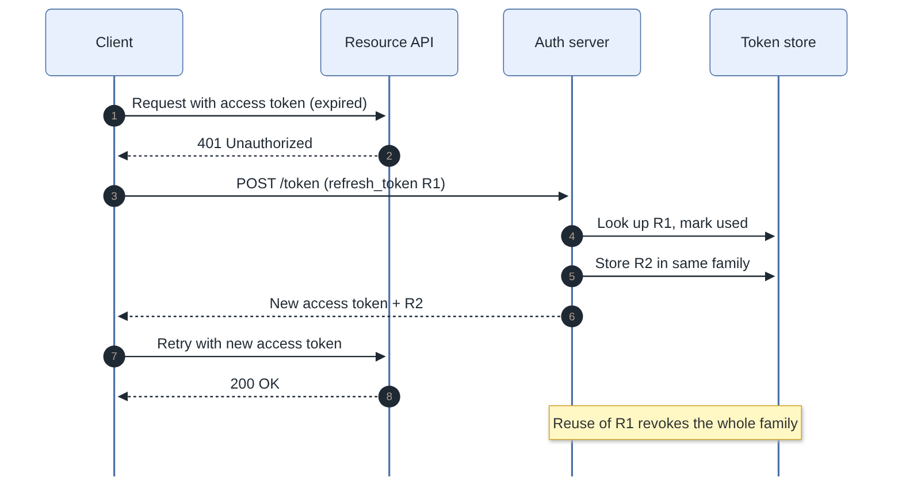
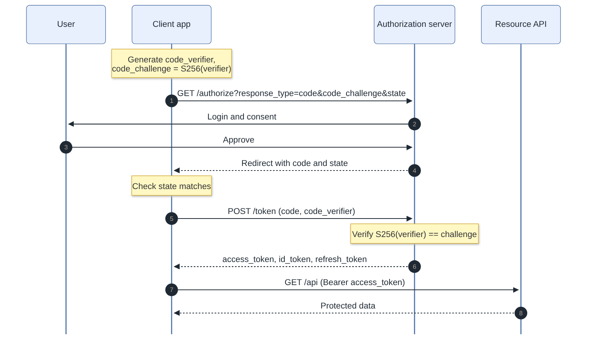
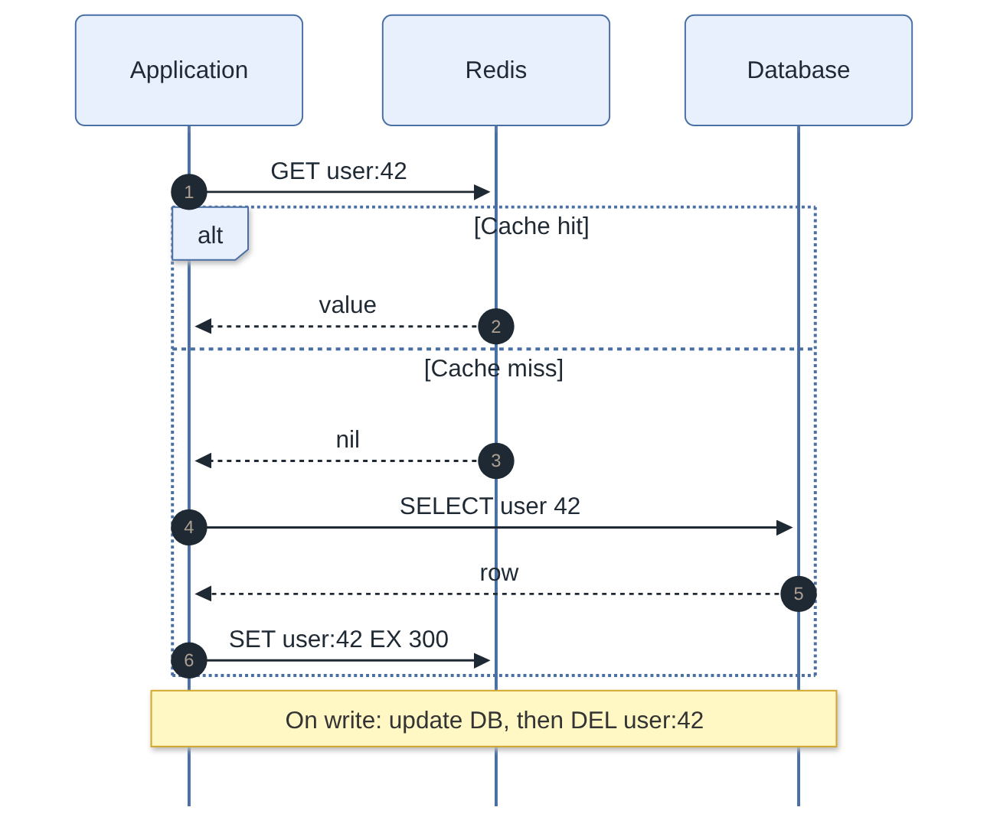
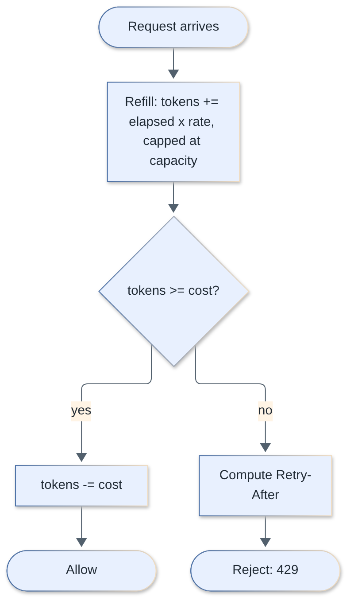
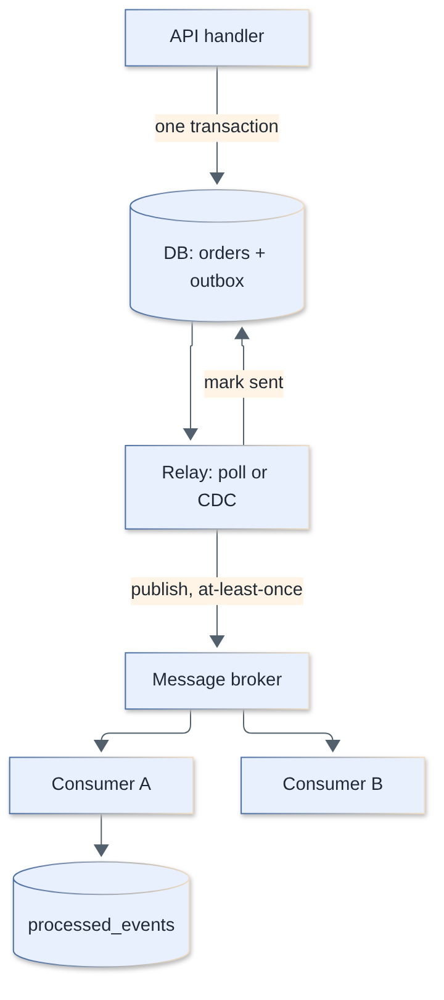
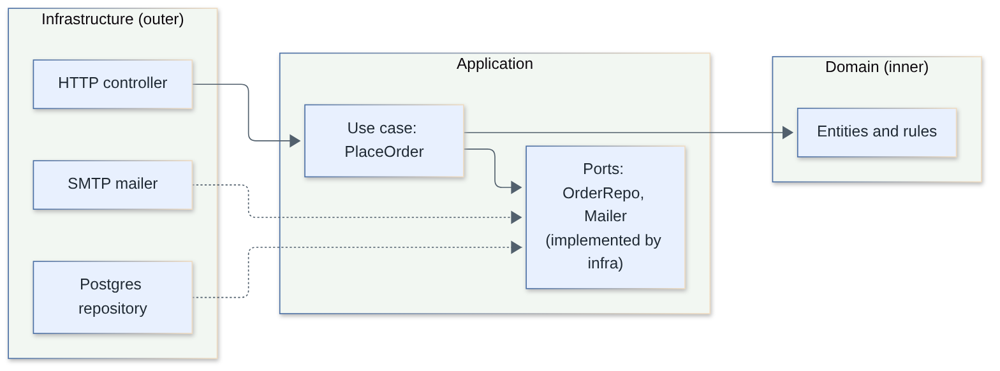
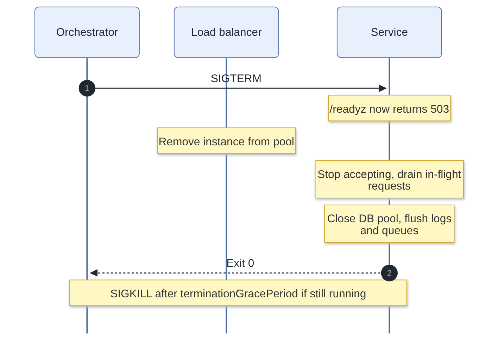
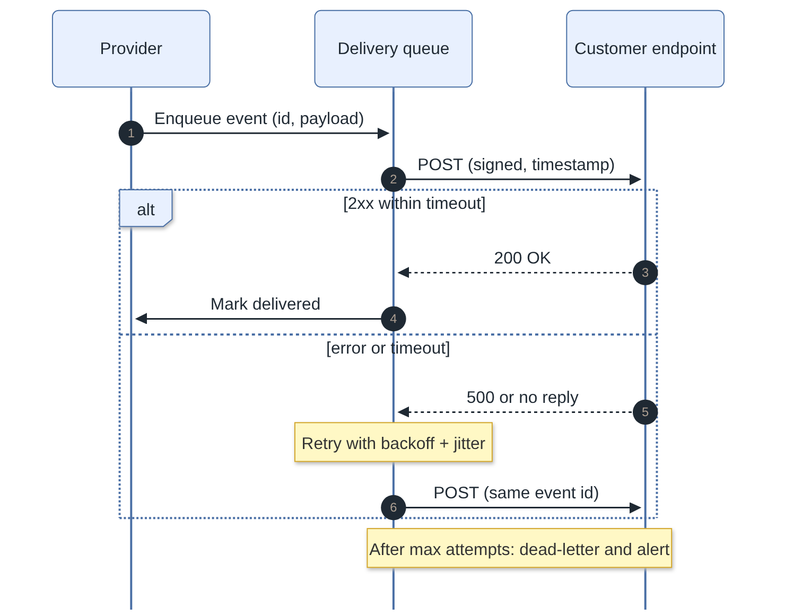
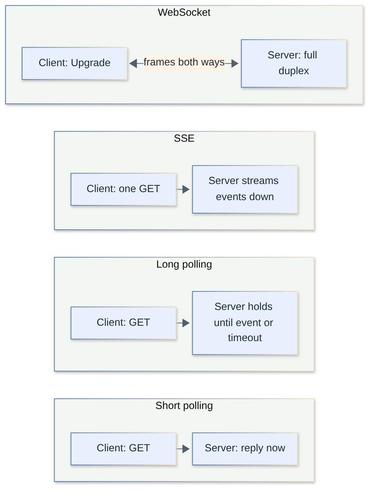

# Backend Interview Questions

Language-agnostic backend engineering fundamentals: HTTP, auth, caching, queues, concurrency, resilience, architecture and real-time. Code examples use TypeScript/Node unless another language illustrates better.

**Levels:** `🟢 Junior` · `🟡 Middle` · `🔴 Senior`

## Table of contents


**HTTP and networking**

1. [What are the main HTTP methods, and what do "safe" and "idempotent" mean?](#1-what-are-the-main-http-methods-and-what-do-safe-and-idempotent-mean) — 🟢
2. [Which HTTP status codes should every backend developer know, and when do you use them?](#2-which-http-status-codes-should-every-backend-developer-know-and-when-do-you-use-them) — 🟢
3. [How do you make a non-idempotent operation like `POST /payments` safe to retry?](#3-how-do-you-make-a-non-idempotent-operation-like-post-payments-safe-to-retry) — 🔴
4. [What is HTTP keep-alive, and how do HTTP/1.1, HTTP/2 and HTTP/3 differ?](#4-what-is-http-keep-alive-and-how-do-http11-http2-and-http3-differ) — 🟡
5. [What is a reverse proxy and a load balancer, and why put one in front of your app?](#5-what-is-a-reverse-proxy-and-a-load-balancer-and-why-put-one-in-front-of-your-app) — 🟡

**Authentication and authorization**

6. [What is the difference between authentication and authorization?](#6-what-is-the-difference-between-authentication-and-authorization) — 🟢
7. [How should passwords be stored?](#7-how-should-passwords-be-stored) — 🟢
8. [Sessions vs JWT: how do they compare, and which should you choose?](#8-sessions-vs-jwt-how-do-they-compare-and-which-should-you-choose) — 🟡
9. [How do refresh tokens work, how do you rotate them, and how do you revoke JWT-based access?](#9-how-do-refresh-tokens-work-how-do-you-rotate-them-and-how-do-you-revoke-jwt-based-access) — 🔴
10. [Explain OAuth 2.0 and OpenID Connect, and the Authorization Code flow with PKCE.](#10-explain-oauth-20-and-openid-connect-and-the-authorization-code-flow-with-pkce) — 🟡
11. [What are RBAC and ABAC, and when do you need more than roles?](#11-what-are-rbac-and-abac-and-when-do-you-need-more-than-roles) — 🟡
12. [What is CSRF, and how do cookie flags and SameSite protect against it?](#12-what-is-csrf-and-how-do-cookie-flags-and-samesite-protect-against-it) — 🟡

**Caching**

13. [What caching strategies exist: cache-aside, read-through, write-through, write-behind?](#13-what-caching-strategies-exist-cache-aside-read-through-write-through-write-behind) — 🟡
14. [How do you handle TTLs, cache invalidation and eviction?](#14-how-do-you-handle-ttls-cache-invalidation-and-eviction) — 🔴
15. [What is a cache stampede (thundering herd) and how do you prevent it?](#15-what-is-a-cache-stampede-thundering-herd-and-how-do-you-prevent-it) — 🔴

**Rate limiting**

16. [Which rate limiting algorithms exist, and how do you choose?](#16-which-rate-limiting-algorithms-exist-and-how-do-you-choose) — 🟡
17. [Implement a token bucket rate limiter.](#17-implement-a-token-bucket-rate-limiter) — 🔴

**Queues, background jobs and async processing**

18. [Why use a message queue, and what are the main building blocks?](#18-why-use-a-message-queue-and-what-are-the-main-building-blocks) — 🟢
19. [What do at-most-once, at-least-once and exactly-once delivery mean, and how do you build idempotent consumers?](#19-what-do-at-most-once-at-least-once-and-exactly-once-delivery-mean-and-how-do-you-build-idempotent-consumers) — 🔴
20. [What is a dead-letter queue, and how should failures and retries be handled in queue consumers?](#20-what-is-a-dead-letter-queue-and-how-should-failures-and-retries-be-handled-in-queue-consumers) — 🟡
21. [What is the transactional outbox pattern and what problem does it solve?](#21-what-is-the-transactional-outbox-pattern-and-what-problem-does-it-solve) — 🔴
22. [How do background jobs and cron work, and what goes wrong when you run multiple instances?](#22-how-do-background-jobs-and-cron-work-and-what-goes-wrong-when-you-run-multiple-instances) — 🟡

**Concurrency**

23. [What is a race condition? Show a lost update and how to fix it.](#23-what-is-a-race-condition-show-a-lost-update-and-how-to-fix-it) — 🟢
24. [Compare optimistic and pessimistic locking. When do you use each?](#24-compare-optimistic-and-pessimistic-locking-when-do-you-use-each) — 🟡
25. [How do distributed locks work, and what are their pitfalls?](#25-how-do-distributed-locks-work-and-what-are-their-pitfalls) — 🔴

**Data handling**

26. [Offset vs cursor pagination: what are the differences and when to use each?](#26-offset-vs-cursor-pagination-what-are-the-differences-and-when-to-use-each) — 🟡
27. [How do you handle file uploads: direct upload, streaming and presigned URLs?](#27-how-do-you-handle-file-uploads-direct-upload-streaming-and-presigned-urls) — 🟡
28. [How do you validate input and protect against injection?](#28-how-do-you-validate-input-and-protect-against-injection) — 🟢

**Operability**

29. [What is structured logging and what makes logs useful in production?](#29-what-is-structured-logging-and-what-makes-logs-useful-in-production) — 🟢
30. [What are good error handling strategies in a backend service?](#30-what-are-good-error-handling-strategies-in-a-backend-service) — 🟡
31. [How should configuration and secrets be managed?](#31-how-should-configuration-and-secrets-be-managed) — 🟢
32. [What is the Twelve-Factor App, and which factors matter most in practice?](#32-what-is-the-twelve-factor-app-and-which-factors-matter-most-in-practice) — 🟡

**Architecture**

33. [What is layered architecture, and what belongs in each layer?](#33-what-is-layered-architecture-and-what-belongs-in-each-layer) — 🟢
34. [What is middleware and how is it used in a backend framework?](#34-what-is-middleware-and-how-is-it-used-in-a-backend-framework) — 🟢
35. [What is dependency injection and why does it matter?](#35-what-is-dependency-injection-and-why-does-it-matter) — 🟡
36. [Explain clean and hexagonal (ports and adapters) architecture, and their trade-offs.](#36-explain-clean-and-hexagonal-ports-and-adapters-architecture-and-their-trade-offs) — 🔴
37. [Why do backends need to be stateless, and how do you scale them horizontally?](#37-why-do-backends-need-to-be-stateless-and-how-do-you-scale-them-horizontally) — 🟢

**Resilience**

38. [How do retries with exponential backoff and jitter work, and when should you not retry?](#38-how-do-retries-with-exponential-backoff-and-jitter-work-and-when-should-you-not-retry) — 🔴
39. [How should you set timeouts, and why are they essential?](#39-how-should-you-set-timeouts-and-why-are-they-essential) — 🟡
40. [How do you implement graceful shutdown?](#40-how-do-you-implement-graceful-shutdown) — 🟡
41. [What are health checks, and how do liveness, readiness and startup probes differ?](#41-what-are-health-checks-and-how-do-liveness-readiness-and-startup-probes-differ) — 🟢
42. [What are backpressure, load shedding and circuit breakers, and how do they protect a service under overload?](#42-what-are-backpressure-load-shedding-and-circuit-breakers-and-how-do-they-protect-a-service-under-overload) — 🔴

**Webhooks and real-time**

43. [How do you sign and verify webhooks securely?](#43-how-do-you-sign-and-verify-webhooks-securely) — 🟡
44. [How do you design reliable webhook delivery as a provider (retries, ordering, failure handling)?](#44-how-do-you-design-reliable-webhook-delivery-as-a-provider-retries-ordering-failure-handling) — 🔴
45. [Polling, long polling, SSE and WebSockets: how do they differ and when do you pick each?](#45-polling-long-polling-sse-and-websockets-how-do-they-differ-and-when-do-you-pick-each) — 🟡
46. [How do you scale WebSocket servers, and what are the production gotchas?](#46-how-do-you-scale-websocket-servers-and-what-are-the-production-gotchas) — 🔴

---

## HTTP and networking

### 1. What are the main HTTP methods, and what do "safe" and "idempotent" mean?

`🟢 Junior` · `#http` `#idempotency`

**Safe** methods don't change server state (`GET`, `HEAD`, `OPTIONS`). **Idempotent** methods can be repeated and leave the server in the same state as one call (`GET`, `HEAD`, `PUT`, `DELETE`, `OPTIONS`). `POST` and (usually) `PATCH` are neither.

| Method | Purpose | Safe | Idempotent | Body in request |
|---|---|---|---|---|
| `GET` | Read a resource | yes | yes | no (semantics undefined) |
| `HEAD` | Same as GET, headers only | yes | yes | no |
| `POST` | Create / run an action | no | no | yes |
| `PUT` | Replace a resource entirely | no | yes | yes |
| `PATCH` | Partially modify | no | not guaranteed | yes |
| `DELETE` | Remove | no | yes | usually no |
| `OPTIONS` | Capabilities / CORS preflight | yes | yes | no |

Idempotent describes the **server-side effect**, not the response: the first `DELETE /users/1` returns `204`, the second `404`, but the end state is the same. Idempotency matters because networks fail: a client that did not receive a response may safely retry an idempotent request, but retrying a `POST` may create a duplicate (see question 3).

`PATCH` with `{"op":"increment"}` is not idempotent; `PATCH` with `{"name":"Bob"}` is. Never perform writes in `GET`: crawlers, prefetchers and caches assume it is safe.

> **Follow-up:** Can a `GET` have a body? Technically allowed but its semantics are undefined; many proxies drop it. Use `POST` (or the newer `QUERY` method where supported) for large queries.

[↑ Back to top](#table-of-contents)

### 2. Which HTTP status codes should every backend developer know, and when do you use them?

`🟢 Junior` · `#http` `#status-codes`

Status codes are grouped by class: `2xx` success, `3xx` redirect, `4xx` the client's fault, `5xx` the server's fault. Pick the most specific code, because clients, caches, retry logic and monitoring all key off it.

| Code | Meaning | Typical use |
|---|---|---|
| 200 OK | Success with body | GET, PUT result |
| 201 Created | Resource created | POST; add `Location` header |
| 202 Accepted | Queued, not done yet | Async processing |
| 204 No Content | Success, no body | DELETE, PUT |
| 301 / 308 | Permanent redirect | 308 keeps the method |
| 302 / 307 | Temporary redirect | 307 keeps the method |
| 304 Not Modified | Cache validated | Conditional GET (`ETag`) |
| 400 Bad Request | Malformed request | Invalid JSON |
| 401 Unauthorized | **Not authenticated** | Missing/expired token |
| 403 Forbidden | Authenticated, **not allowed** | Missing permission |
| 404 Not Found | No such resource | Also used to hide existence |
| 409 Conflict | State conflict | Duplicate, version mismatch |
| 410 Gone | Permanently removed | |
| 412 Precondition Failed | `If-Match` failed | Optimistic concurrency |
| 422 Unprocessable Content | Well-formed but semantically invalid | Validation errors |
| 429 Too Many Requests | Rate limited | Send `Retry-After` |
| 500 Internal Server Error | Unhandled bug | |
| 502 Bad Gateway | Upstream returned garbage | Proxy -> app |
| 503 Service Unavailable | Overloaded / shutting down | Send `Retry-After` |
| 504 Gateway Timeout | Upstream too slow | |

Common mistakes: returning `200` with `{ "error": ... }` in the body (breaks monitoring and client retry logic), using `401` when you mean `403`, and using `500` for client validation failures.

```ts
app.get("/orders/:id", async (req, res) => {
  const order = await repo.find(req.params.id);
  if (!order) return res.status(404).json({ error: "order_not_found" });
  if (order.userId !== req.user.id) return res.status(403).json({ error: "forbidden" });
  res.json(order);
});
```

> **Follow-up:** 401 vs 403? 401 = "I don't know who you are" (and should carry `WWW-Authenticate`); 403 = "I know who you are, and you can't do this".

[↑ Back to top](#table-of-contents)

### 3. How do you make a non-idempotent operation like `POST /payments` safe to retry?

`🔴 Senior` · `#idempotency` `#reliability`

Have the client send a unique **`Idempotency-Key`** header per logical operation. The server stores the key together with the result; a repeat with the same key returns the stored response instead of executing again.

Why it is needed: a client times out after sending `POST /payments`. It cannot tell whether the server never received it, processed it, or processed it but lost the response. Without a key, a retry may charge twice.

Design points:

1. **Atomic claim.** Insert the key with a unique constraint *before* doing work; the second concurrent request loses the race instead of both running.
2. **Fingerprint the request.** Store a hash of the body; same key with a different body returns `422`/`409` (client bug).
3. **Store the response** (status + body) so retries get an identical answer, including errors that are deterministic.
4. **In-progress state.** A concurrent duplicate while the first is running returns `409` (or waits).
5. **Same transaction** as the business write whenever possible, so "key recorded" and "money moved" cannot diverge.
6. **TTL** (e.g. 24 h) to bound storage.

```ts
// Postgres: CREATE TABLE idempotency_keys (
//   key text PRIMARY KEY, request_hash text NOT NULL,
//   response jsonb, status text NOT NULL DEFAULT 'in_progress',
//   created_at timestamptz NOT NULL DEFAULT now());
async function withIdempotency(db: Pool, key: string, hash: string, work: () => Promise<unknown>) {
  const ins = await db.query(
    `INSERT INTO idempotency_keys (key, request_hash) VALUES ($1, $2)
     ON CONFLICT (key) DO NOTHING`, [key, hash]);
  if (ins.rowCount === 0) {
    const { rows } = await db.query(`SELECT * FROM idempotency_keys WHERE key = $1`, [key]);
    const row = rows[0];
    if (row.request_hash !== hash) throw new HttpError(422, "key_reused_with_different_body");
    if (row.status === "in_progress") throw new HttpError(409, "request_in_progress");
    return row.response; // replay stored result
  }
  const result = await work();
  await db.query(
    `UPDATE idempotency_keys SET response = $2, status = 'done' WHERE key = $1`,
    [key, JSON.stringify(result)]);
  return result;
}
```

Gotchas: if `work()` crashes after the external side effect but before the update, the row stays `in_progress` forever. Fix by running the business write and the update in one DB transaction, and by passing the same key downstream to providers that support it (Stripe does). Scope keys per user/tenant so one client cannot replay another's key.

> **Follow-up:** Idempotency key vs natural key? If the operation has a natural unique identifier (e.g. `order_id` the client generates), a unique constraint alone gives idempotency without a separate table.

[↑ Back to top](#table-of-contents)

### 4. What is HTTP keep-alive, and how do HTTP/1.1, HTTP/2 and HTTP/3 differ?

`🟡 Middle` · `#http` `#performance` `#protocols`

**Keep-alive** reuses one TCP (and TLS) connection for many requests, avoiding a new handshake per request. It is the default in HTTP/1.1. HTTP/2 multiplexes many streams over one connection; HTTP/3 does the same over QUIC (UDP) and removes TCP head-of-line blocking.

| | HTTP/1.1 | HTTP/2 | HTTP/3 |
|---|---|---|---|
| Format | Text | Binary frames | Binary frames |
| Transport | TCP | TCP (+TLS in practice) | QUIC over UDP (TLS 1.3 built in) |
| Concurrency | 1 request at a time per connection; browsers open ~6 connections per host | Many multiplexed streams on 1 connection | Same, streams independent |
| Header compression | none | HPACK | QPACK |
| Head-of-line blocking | at HTTP level | removed at HTTP level, **still at TCP level** (one lost packet stalls all streams) | removed (loss only stalls its stream) |
| Handshake | TCP + TLS (2-3 RTT) | TCP + TLS | 1 RTT, 0-RTT on resumption |
| Connection migration | no | no | yes (connection ID survives IP change) |
| Spec | RFC 9112 | RFC 9113 | RFC 9114 |

Practical implications for backends:

- With HTTP/1.1 keep-alive, **pool connections** to upstreams (`http.Agent({ keepAlive: true })`); otherwise every call pays TCP+TLS setup and exhausts ephemeral ports (`TIME_WAIT`).
- Idle keep-alive timeouts must be **longer on the client/LB than on the server**, or you get random `ECONNRESET`: the server closes a connection just as the client reuses it. A classic: AWS ALB idle timeout (60 s) vs Node's `server.keepAliveTimeout` (5 s default), so set the Node timeout above the load balancer's.
- HTTP/2 makes domain sharding and sprite hacks obsolete; one connection is usually best. gRPC requires HTTP/2.
- Most teams terminate HTTP/2 or HTTP/3 at the edge (CDN/LB) and speak HTTP/1.1 to the app. HTTP/3 is discovered through `Alt-Svc` after a first HTTP/1.1/2 visit, with fallback because UDP is sometimes blocked.
- HTTP/2 server push is effectively dead (removed from browsers); use `103 Early Hints` or preload.

```ts
import http from "node:http";
const agent = new http.Agent({ keepAlive: true, maxSockets: 50 });
// reuse for outbound calls; for the server side:
const server = http.createServer(handler);
server.keepAliveTimeout = 65_000; // > typical 60s LB idle timeout
server.headersTimeout = 66_000;   // keep above keepAliveTimeout
```

> **Follow-up:** Why can HTTP/2 be slower than HTTP/1.1 on a lossy mobile network? All streams share one TCP connection, so one lost packet blocks every stream; HTTP/3 fixes this.

[↑ Back to top](#table-of-contents)

### 5. What is a reverse proxy and a load balancer, and why put one in front of your app?

`🟡 Middle` · `#networking` `#scaling`

A **reverse proxy** accepts client requests on behalf of your servers and forwards them (nginx, Envoy, HAProxy, a cloud LB). A **load balancer** is a reverse proxy that spreads traffic across several instances. Both let you scale horizontally, terminate TLS, and keep app servers off the public internet.

What they typically do:

- **TLS termination**, HTTP/2/3 at the edge, compression.
- **Load balancing algorithms**: round robin, least connections, consistent hashing (for cache locality), weighted.
- **Health checks** to eject bad instances.
- **Rate limiting, request size limits, timeouts**, static file/caching, WAF.
- **L4 vs L7**: L4 balances TCP connections (fast, protocol-agnostic); L7 understands HTTP (path/header routing, retries).

Gotchas:

- The app sees the proxy's IP. Trust `X-Forwarded-For` / `X-Forwarded-Proto` / the standard `Forwarded` header **only** from known proxies, otherwise clients can spoof their IP and bypass rate limits. In Express: `app.set("trust proxy", <hop count or CIDR>)`.
- **Sticky sessions** hide statefulness; prefer stateless apps (question 8) with external session storage.
- Proxy timeouts (idle, request) must be coordinated with app timeouts (question 39).
- The LB is itself a single point of failure unless redundant (managed LBs are).

> **Follow-up:** Forward vs reverse proxy? A forward proxy represents clients (outbound, e.g. corporate proxy); a reverse proxy represents servers.

[↑ Back to top](#table-of-contents)

## Authentication and authorization

### 6. What is the difference between authentication and authorization?

`🟢 Junior` · `#auth`

**Authentication (authN)** answers "who are you?", verifying identity (password, passkey, OTP, token). **Authorization (authZ)** answers "what may you do?", deciding if that identity can perform an action on a resource. AuthN comes first; both must be enforced **on the server** for every request.

| | Authentication | Authorization |
|---|---|---|
| Question | Who are you? | What can you access? |
| Failure code | 401 | 403 |
| Examples | Login, SSO, MFA, API key check | Roles, permissions, ownership checks |
| Output | Identity (`sub`, session) | Allow / deny decision |

```ts
// authN middleware: establishes identity
async function authenticate(req, res, next) {
  const token = req.headers.authorization?.replace(/^Bearer /, "");
  try { req.user = await verifyJwt(token); next(); }
  catch { res.status(401).json({ error: "unauthenticated" }); }
}
// authZ: decides per resource, not just per route
async function updatePost(req, res) {
  const post = await posts.get(req.params.id);
  if (post.authorId !== req.user.sub && !req.user.roles.includes("admin"))
    return res.status(403).json({ error: "forbidden" });
  // ...
}
```

The most common authZ bug is **BOLA/IDOR** (OWASP API #1): checking that the user is logged in but not that *this* object is theirs. Always scope queries by owner (`WHERE id = $1 AND owner_id = $2`) and never trust IDs from the client alone.

> **Follow-up:** Where should authZ live? In the service/domain layer or a policy engine, not only in route middleware, so every entry point (HTTP, queue consumer, cron) enforces it.

[↑ Back to top](#table-of-contents)

### 7. How should passwords be stored?

`🟢 Junior` · `#security` `#passwords`

Never store plaintext or a fast hash (MD5, SHA-256). Store the output of a **slow, salted, memory-hard password hashing function**: **Argon2id** is the current first choice; **scrypt** or **bcrypt** are acceptable. Each hash gets a unique random salt, stored inside the hash string.

Why: attackers who steal the database run offline guesses at billions per second against fast hashes. A password hash is deliberately expensive (CPU and memory), so each guess costs real resources, and the salt defeats rainbow tables and makes identical passwords hash differently.

| Algorithm | Notes |
|---|---|
| Argon2id | Memory-hard, resists GPU/ASIC; OWASP baseline of 19 MiB memory, 2 iterations, parallelism 1 (or stronger equivalents) |
| scrypt | Memory-hard, built into Node's `crypto` |
| bcrypt | Old but solid; work factor >= 10; **truncates input at 72 bytes** |
| PBKDF2 | Only when FIPS compliance is required; very high iterations |
| SHA-256 / MD5 | Not password hashes, never use |

```ts
import { scrypt, randomBytes, timingSafeEqual } from "node:crypto";
import { promisify } from "node:util";
const scryptAsync = promisify(scrypt);

export async function hashPassword(pw: string) {
  const salt = randomBytes(16);
  const key = (await scryptAsync(pw, salt, 64, { N: 2 ** 17, r: 8, p: 1, maxmem: 256 * 1024 * 1024 })) as Buffer;
  return `scrypt$${salt.toString("base64")}$${key.toString("base64")}`;
}
export async function verifyPassword(pw: string, stored: string) {
  const [, s, k] = stored.split("$");
  const key = (await scryptAsync(pw, Buffer.from(s, "base64"), 64, { N: 2 ** 17, r: 8, p: 1, maxmem: 256 * 1024 * 1024 })) as Buffer;
  return timingSafeEqual(key, Buffer.from(k, "base64"));
}
```

Practical points: store the algorithm and parameters with the hash so you can **rehash on login** when raising cost; use constant-time comparison; add rate limiting and lockout/backoff to login; check against breached-password lists; hashing is CPU-heavy, so use the async variants (they run in the libuv thread pool) and cap concurrent logins; consider a server-side pepper held outside the DB (in a KMS/secret manager); prefer **passkeys/WebAuthn** or delegating to an identity provider where possible.

> **Follow-up:** Why isn't SHA-256 + salt enough? It is still extremely fast on GPUs; salt only stops precomputation, not brute force.

[↑ Back to top](#table-of-contents)

### 8. Sessions vs JWT: how do they compare, and which should you choose?

`🟡 Middle` · `#auth` `#sessions` `#jwt`

A **session** stores state on the server (in Redis/DB) and gives the client an opaque ID in a cookie. A **JWT** is a signed, self-contained token the server can verify without a lookup. Sessions are simple and instantly revocable; JWTs are stateless for verification but hard to revoke. For a classic web app, server-side sessions are usually the better default.

| | Server session (cookie) | JWT (self-contained) |
|---|---|---|
| State | Server store lookup per request | None for verification |
| Revocation | Delete the session: immediate | Hard: valid until `exp` unless you add a denylist |
| Size | ~32-byte ID | Hundreds of bytes to KB, sent on every request |
| Scaling | Shared store (Redis) needed | Any instance verifies with the public key / secret |
| Cross-service/domain | Awkward (cookie scope) | Easy: Bearer header, services verify independently |
| Stale data | Always fresh | Claims (roles) stale until expiry |
| Typical use | Browser apps, same site | APIs, mobile, service-to-service, third-party |
| Main risks | CSRF, session fixation | XSS token theft, algorithm confusion, long-lived tokens |

Guidance:

- Browser + same domain: **session cookie** (`HttpOnly; Secure; SameSite=Lax`). Simple, revocable, no token in JS.
- Many services / mobile / third parties: **short-lived JWT access token (5-15 min)** plus a **rotating refresh token** (question 9).
- "JWT is stateless" is partly a myth the moment you need logout, ban or role change; you then add state (a denylist or token version), which brings back a lookup.
- JWTs are **signed, not encrypted**: never put secrets in the payload.

JWT verification checklist: pin the allowed algorithms (reject `none` and RS/HS confusion), check `exp`, `nbf`, `iss`, `aud`, verify the signature with the right key (use `kid` + JWKS for rotation).

```ts
import { jwtVerify, createRemoteJWKSet } from "jose";
const jwks = createRemoteJWKSet(new URL("https://auth.example.com/.well-known/jwks.json"));
const { payload } = await jwtVerify(token, jwks, {
  issuer: "https://auth.example.com",
  audience: "orders-api",
  algorithms: ["RS256"],
});
```

> **Follow-up:** Where should the JWT live in a browser? An `HttpOnly` cookie is safest against XSS; `localStorage` is readable by any injected script.

[↑ Back to top](#table-of-contents)

### 9. How do refresh tokens work, how do you rotate them, and how do you revoke JWT-based access?

`🔴 Senior` · `#auth` `#jwt` `#refresh-tokens`

Issue a **short-lived access token** (minutes) and a **long-lived, opaque refresh token** stored server-side. When the access token expires, the client trades the refresh token for a new pair. With **rotation**, every refresh token is single-use: using it returns a new one and invalidates the old. Reuse of an old token signals theft, so you revoke the whole token family.



Design:

- Refresh token = random 256-bit value; store only its **hash** (like a password) with `user_id`, `family_id`, `expires_at`, `used_at`, `revoked_at`, device info.
- On refresh: look up by hash; if `used_at` is set, **reuse detected** and revoke the family and force re-login; otherwise mark used and issue the next token in the same family. Do it in a transaction/atomic update so two parallel refreshes cannot both succeed.
- Absolute lifetime (e.g. 30-90 days) plus an idle timeout.
- Browsers: put the refresh token in an `HttpOnly; Secure; SameSite` cookie scoped to the refresh path only.

```ts
async function refresh(presented: string) {
  const hash = sha256(presented);
  const result = await db.tx(async (tx) => {
    const t = await tx.oneOrNone(
      `UPDATE refresh_tokens SET used_at = now()
       WHERE token_hash = $1 AND used_at IS NULL AND revoked_at IS NULL AND expires_at > now()
       RETURNING id, user_id, family_id`, [hash]);
    if (!t) {
      // unknown, expired, or REUSED: revoke the family if we can identify it.
      // Return instead of throwing so this write is committed, not rolled back.
      await tx.none(
        `UPDATE refresh_tokens SET revoked_at = now()
         WHERE family_id = (SELECT family_id FROM refresh_tokens WHERE token_hash = $1)`, [hash]);
      return null;
    }
    const next = randomToken();
    await tx.none(
      `INSERT INTO refresh_tokens (token_hash, user_id, family_id, expires_at)
       VALUES ($1, $2, $3, now() + interval '30 days')`, [sha256(next), t.user_id, t.family_id]);
    return { accessToken: signAccessToken(t.user_id), refreshToken: next };
  });
  if (!result) throw new HttpError(401, "invalid_refresh_token");
  return result;
}
```

**Revoking access tokens** options:

| Approach | Trade-off |
|---|---|
| Very short TTL (5-15 min) | Simple; bounded window; more refreshes |
| Denylist of `jti` in Redis until `exp` | Immediate; reintroduces a lookup (but tiny, TTL-bounded) |
| Per-user `token_version` / `revoked_before` timestamp checked against a cache | Revoke all of a user's tokens at once |
| Opaque tokens + introspection (RFC 7662) | Full control; a call per request (cache briefly) |

Production gotchas: **network retries** can make a legitimate client resend an already-rotated token, so add a small grace window (e.g. 10-30 s, return the same successor) to avoid false-positive lockouts; multi-tab apps race on refresh, so serialize refresh on the client (single-flight); log reuse events as security alerts.

> **Follow-up:** Why rotate if the refresh token is already secret? Rotation limits the value of a stolen token and turns silent theft into a detectable event.

[↑ Back to top](#table-of-contents)

### 10. Explain OAuth 2.0 and OpenID Connect, and the Authorization Code flow with PKCE.

`🟡 Middle` · `#oauth2` `#oidc` `#pkce`

**OAuth 2.0** is a framework for *delegated authorization*: a user lets an app access their resources at another service without giving it their password. **OpenID Connect (OIDC)** is an identity layer on top that adds an **ID token** (a JWT about the user) so the app can do *login*. For browser, mobile and SPA clients (and recommended for all clients) use **Authorization Code + PKCE**.

Roles: *resource owner* (user), *client* (your app), *authorization server* (issues tokens), *resource server* (API).



Steps:

1. Client creates a random **`code_verifier`** and sends `code_challenge = BASE64URL(SHA256(verifier))` with `code_challenge_method=S256`, plus a random **`state`** (CSRF protection) and, for OIDC, `scope=openid profile` and a **`nonce`**.
2. User authenticates and consents at the authorization server; it redirects back with a one-time **`code`**.
3. Client verifies `state`, then calls `POST /token` with the `code` and the original `code_verifier` (front channel carries only the code; token request is back channel).
4. Server checks that the verifier hashes to the stored challenge, then returns `access_token`, `id_token` (OIDC), optionally `refresh_token`.

PKCE ensures that a stolen authorization code is useless without the verifier, which matters for public clients that cannot keep a secret. The OAuth 2.0 Security Best Current Practice (RFC 9700) recommends PKCE for all clients and deprecates the **Implicit** flow and the **Password** grant.

```ts
import { randomBytes, createHash } from "node:crypto";
const b64url = (b: Buffer) => b.toString("base64url");
const verifier = b64url(randomBytes(32));
const challenge = b64url(createHash("sha256").update(verifier).digest());
const url = new URL("https://auth.example.com/authorize");
url.search = new URLSearchParams({
  response_type: "code", client_id: "web", redirect_uri: "https://app.example.com/cb",
  scope: "openid profile email", state: b64url(randomBytes(16)),
  code_challenge: challenge, code_challenge_method: "S256",
}).toString();
```

| Token | Audience | Purpose |
|---|---|---|
| ID token | The client app | Proves who the user is (OIDC); don't send to APIs |
| Access token | Resource server (API) | Authorizes API calls |
| Refresh token | Authorization server | Gets new access tokens |

Pitfalls: exact-match `redirect_uri` registration (open redirect risk), validate ID token `iss`, `aud`, `exp`, `nonce` and signature, never use OAuth alone for "login" without OIDC, and prefer a battle-tested library or provider instead of implementing the server yourself. Other grants: **Client Credentials** for machine-to-machine; **Device Code** for TVs/CLIs.

> **Follow-up:** Why not the Implicit flow? Tokens travel in the URL fragment (leak via history/referrers, no code exchange); Code + PKCE has none of those weaknesses.

[↑ Back to top](#table-of-contents)

### 11. What are RBAC and ABAC, and when do you need more than roles?

`🟡 Middle` · `#authorization` `#rbac` `#abac`

**RBAC** (role-based) grants permissions to roles and assigns roles to users ("editors can publish"). **ABAC** (attribute-based) decides from attributes of the user, resource, action and context ("a doctor can read records of patients in their own hospital during working hours"). Start with RBAC; add attribute/ownership checks when roles alone become too coarse.

| | RBAC | ABAC | ReBAC (relationship-based) |
|---|---|---|---|
| Model | user -> role -> permissions | policy over attributes | graph of relations (owner, member, viewer) |
| Strengths | Simple, auditable | Fine-grained, contextual | Sharing models (Google Drive style) |
| Weaknesses | Role explosion, no per-object rules | Harder to reason about / test | Needs a relation store (e.g. Zanzibar-style systems) |

```ts
type Perm = "post:read" | "post:write" | "post:delete";
const rolePerms: Record<string, Perm[]> = {
  viewer: ["post:read"],
  editor: ["post:read", "post:write"],
  admin: ["post:read", "post:write", "post:delete"],
};
const can = (user: User, perm: Perm, post?: Post) => {
  const allowed = user.roles.some((r) => rolePerms[r]?.includes(perm));
  if (!allowed) return false;
  // ABAC-style refinement: editors only edit their own posts
  if (perm === "post:write" && user.roles.includes("editor") && !user.roles.includes("admin"))
    return post?.authorId === user.id;
  return true;
};
```

Best practices: check **permissions**, not role names, in code (`can(user, "post:delete")`), so roles can change without code changes; deny by default; centralize decisions in one policy module or engine (OPA/Rego, Cedar, Casbin, OpenFGA); also enforce tenant isolation in queries; cache permission sets per request, not forever; log decisions for audit.

> **Follow-up:** Where do you put roles in a JWT? As claims for coarse checks, but beware staleness; do fine-grained and sensitive checks against fresh server data.

[↑ Back to top](#table-of-contents)

### 12. What is CSRF, and how do cookie flags and SameSite protect against it?

`🟡 Middle` · `#security` `#cookies` `#csrf`

**CSRF** (cross-site request forgery) tricks a logged-in user's browser into sending a state-changing request to your site, and the browser automatically attaches the session cookie. Defenses: `SameSite` cookies, anti-CSRF tokens, checking `Origin`/`Fetch-Metadata` headers, and never changing state on `GET`.

Cookie flags:

| Flag | Effect |
|---|---|
| `HttpOnly` | JavaScript cannot read it (limits XSS token theft) |
| `Secure` | Sent over HTTPS only |
| `SameSite=Strict` | Never sent on cross-site requests |
| `SameSite=Lax` | Sent on top-level GET navigations only (modern browser default) |
| `SameSite=None; Secure` | Always sent: needed for third-party embeds, CSRF-exposed |
| `__Host-` prefix | Forces `Secure`, `Path=/`, no `Domain` (blocks subdomain overwrite) |
| `Max-Age` / `Expires` | Lifetime |

```ts
res.cookie("__Host-sid", sessionId, {
  httpOnly: true, secure: true, sameSite: "lax", path: "/", maxAge: 1000 * 60 * 60 * 8,
});
```

`SameSite` is "same-site" (registrable domain), not "same-origin", so a vulnerable sibling subdomain can still attack; keep a second layer. Layered defense: SameSite=Lax + `Origin` header check on unsafe methods + double-submit or synchronizer CSRF token for sensitive forms. APIs that use `Authorization: Bearer` headers (not cookies) are not CSRF-prone, because the browser does not attach them automatically (they are exposed to XSS instead).

> **Follow-up:** CSRF vs CORS? CORS restricts which origins can *read* responses; it doesn't stop a cross-site form post from being *sent*.

[↑ Back to top](#table-of-contents)

## Caching

### 13. What caching strategies exist: cache-aside, read-through, write-through, write-behind?

`🟡 Middle` · `#caching` `#redis`

**Cache-aside** (lazy loading) is the default: the app checks the cache, on a miss loads from the DB and populates the cache. The other patterns differ in who talks to the DB and when writes reach it.



| Strategy | Read path | Write path | Pros | Cons |
|---|---|---|---|---|
| Cache-aside | App: cache -> DB on miss -> fill | Write DB, **invalidate** cache | Simple, only hot data cached, cache failure is survivable | First request slow; stale window; stampede risk |
| Read-through | Cache library loads from DB on miss | as cache-aside | App code simpler | Needs provider support |
| Write-through | Always hits cache | Write cache **and** DB synchronously | Cache always fresh | Higher write latency; caches data never read |
| Write-behind (write-back) | Hits cache | Write cache, flush to DB **asynchronously** | Very fast writes, batching | Data loss if cache dies before flush; complex ordering |
| Refresh-ahead | Cache refreshes hot keys before TTL | any | No miss latency | Wasted work, complexity |

```ts
async function getUser(id: string): Promise<User> {
  const key = `user:${id}`;
  const cached = await redis.get(key);
  if (cached) return JSON.parse(cached);
  const user = await db.users.findById(id);
  if (user) await redis.set(key, JSON.stringify(user), "EX", 300);
  return user;
}
async function updateUser(id: string, patch: Partial<User>) {
  await db.users.update(id, patch);
  await redis.del(`user:${id}`); // invalidate, don't update (see next question)
}
```

Why invalidate instead of updating the cache on write? Two concurrent writers can set the cache out of order and leave a stale value behind, whereas deleting is idempotent and the next read re-fills from the source of truth. Remember to cache negative results (short TTL) to guard against repeated misses for non-existent keys ("cache penetration"), and always treat the cache as optional: if Redis is down, fall back to the DB (with protection so the DB does not collapse).

> **Follow-up:** When is write-behind appropriate? Counters/metrics/analytics where losing a few seconds of data is acceptable; never for money.

[↑ Back to top](#table-of-contents)

### 14. How do you handle TTLs, cache invalidation and eviction?

`🔴 Senior` · `#caching` `#invalidation` `#redis`

Use **TTL as the safety net** (every entry eventually expires) and **explicit invalidation on write** for freshness. Eviction is separate: it is what the cache does when memory is full. Phil Karlton's "two hard things" joke exists because it is difficult to know every place a cached value depends on.

Invalidation techniques:

| Technique | How | Trade-off |
|---|---|---|
| TTL only | Entries expire by time | Simple; stale up to TTL |
| Delete on write | `DEL key` after DB commit | Small race window; need to know all keys |
| Versioned keys / namespaces | `user:42:v7`, bump version to invalidate groups | No scans; old entries age out |
| Tags / sets | Track keys per entity in a Redis set | Extra writes, manual cleanup |
| Event-driven (CDC / pub-sub) | DB change stream triggers deletes | Decoupled, more infra |
| Stale-while-revalidate | Serve stale, refresh in background | Great latency; bounded staleness |

Race to know: *read-miss racing with a write*. Reader loads old row from the DB, writer updates DB and deletes the cache, reader then writes the old row into the cache, leaving stale data until TTL. Mitigations: short TTLs, delayed double-delete, or versioned writes (`SET ... only if version is newer`).

Redis eviction when `maxmemory` is reached is controlled by `maxmemory-policy`:

| Policy | Evicts |
|---|---|
| `noeviction` (default) | Nothing; writes fail with OOM |
| `allkeys-lru` / `allkeys-lfu` | Any key, least recently / frequently used (good for pure caches) |
| `volatile-lru` / `volatile-lfu` / `volatile-ttl` | Only keys with a TTL |
| `allkeys-random` / `volatile-random` | Random |

Production gotchas: add **jitter** to TTLs (`ttl * (0.9 + Math.random() * 0.2)`) so keys created together do not expire together; never use `KEYS *` in production (blocks the single-threaded server; use `SCAN`); do not use a cache as primary storage unless persistence and eviction are configured for it; cap value sizes; namespace keys per service and environment; and monitor hit ratio, evictions and latency.

> **Follow-up:** HTTP caching vs app caching? HTTP caching (`Cache-Control`, `ETag`, CDN) avoids even reaching the server; use both, with `private` for user-specific responses.

[↑ Back to top](#table-of-contents)

### 15. What is a cache stampede (thundering herd) and how do you prevent it?

`🔴 Senior` · `#caching` `#reliability`

A stampede happens when a hot key expires and **many concurrent requests miss at once**, all recompute the value and hit the database together, which can overload it and cascade into an outage. Prevent it by letting only one caller rebuild (request coalescing / locking), serving stale data while refreshing, and spreading expirations with jitter.

Defenses:

1. **Single-flight (in-process coalescing)**: concurrent misses on one instance share one in-flight promise.
2. **Distributed lock** (`SET lock:key token NX PX 5000`): one instance across the fleet rebuilds; others wait briefly or serve stale.
3. **Stale-while-revalidate / soft TTL**: store `{value, softExpiresAt}` with a longer hard TTL; after the soft expiry one caller refreshes while others get the old value.
4. **Probabilistic early expiration** (XFetch): each reader refreshes slightly early with probability that grows near expiry.
5. **TTL jitter** to avoid synchronized mass expiry; **pre-warm** known hot keys.
6. **Negative caching** and bloom filters for non-existent keys (penetration).

```ts
const inflight = new Map<string, Promise<unknown>>();

async function singleFlight<T>(key: string, load: () => Promise<T>): Promise<T> {
  const existing = inflight.get(key);
  if (existing) return existing as Promise<T>;
  const p = load().finally(() => inflight.delete(key));
  inflight.set(key, p);
  return p;
}

async function getProduct(id: string) {
  const key = `product:${id}`;
  const hit = await redis.get(key);
  if (hit) return JSON.parse(hit);
  return singleFlight(key, async () => {
    const row = await db.products.findById(id);
    await redis.set(key, JSON.stringify(row), "EX", 300 + Math.floor(Math.random() * 60));
    return row;
  });
}
```

Release a Redis lock safely with a compare-and-delete Lua script (only delete if the value still equals your token), and always give the lock a TTL shorter than the worst-case rebuild so a crashed holder does not block everyone. Also set a DB-side protection (connection pool limits, timeouts) because caches eventually fail.

> **Follow-up:** Why single-flight alone is insufficient on N instances? It dedupes per process; with 50 pods you still send up to 50 queries, hence a distributed lock or stale-while-revalidate.

[↑ Back to top](#table-of-contents)

## Rate limiting

### 16. Which rate limiting algorithms exist, and how do you choose?

`🟡 Middle` · `#rate-limiting` `#algorithms`

Rate limiting caps how many requests a client may make in a time window, protecting from abuse, noisy neighbors and cost blowups. Pick **token bucket** for APIs that should allow bursts at a steady average rate, **sliding window** for accurate "N per period" limits, and **fixed window** only when approximation is fine.

| Algorithm | How it works | Pros | Cons |
|---|---|---|---|
| Fixed window | Counter per time bucket (`INCR` + `EXPIRE`) | Trivial, cheap | Boundary burst: up to 2x limit around window edge |
| Sliding window log | Store timestamps, count those in last N sec | Exact | Memory O(requests) |
| Sliding window counter | Weighted sum of current and previous window counts | Cheap, smooth | Approximation |
| Token bucket | Bucket refills at rate r up to capacity b; request spends a token | Allows bursts, O(1) state | Two parameters to tune |
| Leaky bucket | Queue drained at constant rate | Smooth output | Delays/queue, no bursts |
| Concurrency limit | Cap in-flight requests | Protects slow endpoints | Different from rate |

Design decisions:

- **Key**: IP (spoofable behind proxies, shared by NAT), API key, user ID, tenant, or route-specific combinations. Authenticated endpoints should limit per user; login endpoints per IP **and** per account.
- **Where**: edge/gateway (cheap, coarse), then app layer (business-aware).
- **Distributed state**: Redis with atomic Lua scripts. Local in-memory limiters multiply the limit by instance count.
- **Response**: `429 Too Many Requests` with `Retry-After`; many APIs also send `RateLimit-*` headers (an IETF draft standard).
- **Fail open vs closed** when the limiter store is down: open for general APIs, closed for abuse-sensitive endpoints such as login/SMS.
- Different tiers (free/paid) and per-route costs (`cost` of an expensive search = 10 tokens).

> **Follow-up:** Why is fixed window flawed? A client can send `limit` requests at the end of one window and `limit` at the start of the next, doubling the intended rate within a second.

[↑ Back to top](#table-of-contents)

### 17. Implement a token bucket rate limiter.

`🔴 Senior` · `#rate-limiting` `#redis` `#concurrency`

A token bucket stores two values per key: `tokens` and `lastRefill`. On each request, add `elapsed * rate` tokens (cap at capacity), then spend `cost` tokens if available. State is O(1) per client, and the algorithm allows bursts up to `capacity` with a sustained rate of `rate`.



In-memory version (single process, good for tests and understanding):

```ts
class TokenBucket {
  private tokens: number;
  private last: number;
  constructor(private capacity: number, private refillPerSec: number, now = Date.now()) {
    this.tokens = capacity;
    this.last = now;
  }
  take(cost = 1, now = Date.now()): { allowed: boolean; retryAfterMs: number } {
    const elapsed = (now - this.last) / 1000;
    this.tokens = Math.min(this.capacity, this.tokens + elapsed * this.refillPerSec);
    this.last = now;
    if (this.tokens >= cost) {
      this.tokens -= cost;
      return { allowed: true, retryAfterMs: 0 };
    }
    const retryAfterMs = Math.ceil(((cost - this.tokens) / this.refillPerSec) * 1000);
    return { allowed: false, retryAfterMs };
  }
}
```

Distributed version: read-modify-write across instances is a race, so run it **atomically inside Redis with Lua** (Redis executes a script without interleaving other commands):

```ts
import type { Redis } from "ioredis";

const LUA = `
local key = KEYS[1]
local capacity = tonumber(ARGV[1])
local rate = tonumber(ARGV[2])      -- tokens per second
local now = tonumber(ARGV[3])       -- ms
local cost = tonumber(ARGV[4])
local data = redis.call('HMGET', key, 'tokens', 'ts')
local tokens = tonumber(data[1])
local ts = tonumber(data[2])
if tokens == nil then tokens = capacity; ts = now end
tokens = math.min(capacity, tokens + math.max(0, now - ts) / 1000 * rate)
local allowed = 0
if tokens >= cost then tokens = tokens - cost; allowed = 1 end
redis.call('HSET', key, 'tokens', tokens, 'ts', now)
redis.call('PEXPIRE', key, math.ceil(capacity / rate * 1000) * 2)
return { allowed, math.floor(tokens) }
`;

export async function limit(redis: Redis, id: string, capacity = 20, rate = 5, cost = 1) {
  const [allowed, remaining] = (await redis.eval(
    LUA, 1, `rl:${id}`, capacity, rate, Date.now(), cost)) as [number, number];
  return { allowed: allowed === 1, remaining };
}

// Express middleware
app.use(async (req, res, next) => {
  const r = await limit(redis, req.user?.id ?? req.ip);
  res.set("RateLimit-Remaining", String(r.remaining));
  if (!r.allowed) { res.set("Retry-After", "1"); return res.status(429).json({ error: "rate_limited" }); }
  next();
});
```

Production gotchas:

- Use **one clock**. Passing the app server's `Date.now()` means clock skew between instances distorts refills; use Redis `TIME` inside the script (acceptable from Redis 5+, where scripts replicate effects) when skew matters.
- Set `PEXPIRE` so idle clients do not leak keys.
- In Redis Cluster, all keys touched by a script must hash to the same slot (single key here, fine).
- Decide fail-open/closed on Redis errors and add a short timeout so the limiter does not become your latency bottleneck.
- Hot keys (one huge tenant) concentrate load on one shard; consider local pre-limiting with a small bucket plus a global one.
- Return accurate `Retry-After` to stop clients from retry storms.

> **Follow-up:** How does this differ from sliding window? Token bucket permits bursts up to capacity then throttles to the refill rate; sliding window strictly bounds counts in any trailing window.

[↑ Back to top](#table-of-contents)

## Queues, background jobs and async processing

### 18. Why use a message queue, and what are the main building blocks?

`🟢 Junior` · `#queues` `#async`

A message queue lets one part of the system hand work to another **asynchronously**: the producer enqueues a message and returns immediately, and a consumer processes it later. This decouples services, smooths traffic spikes, lets you retry failures and scale workers independently.

Typical uses: sending emails, image/video processing, report generation, calling slow third parties, fan-out of events to several services.

| Concept | Meaning |
|---|---|
| Producer / consumer | Publishes / processes messages |
| Queue (point-to-point) | Each message handled by **one** consumer in a group (work distribution) |
| Topic / pub-sub | Each message delivered to **every** subscribed group |
| Ack / nack | Consumer confirms success or failure; unacked messages are redelivered |
| Visibility timeout / lease | Message is hidden while being processed, reappears if not acked |
| Dead-letter queue | Where messages go after too many failures |
| Ordering | Usually only per partition/key, not global |
| Backpressure | Queue depth grows when consumers are slower than producers |

| Tool | Flavor |
|---|---|
| RabbitMQ | Smart broker, routing, acks, per-message |
| SQS | Managed queue, at-least-once (FIFO variant available) |
| Kafka | Distributed log, partitions, consumer offsets, replay |
| Redis-based (BullMQ) | Simple jobs queue on Redis |

```ts
// API: respond fast, defer slow work
app.post("/signup", async (req, res) => {
  const user = await users.create(req.body);
  await queue.add("send-welcome-email", { userId: user.id });
  res.status(201).json(user);
});
// worker
worker.process("send-welcome-email", async ({ userId }) => mailer.sendWelcome(userId));
```

Downsides: eventual consistency, harder debugging, need for monitoring (queue depth, age of oldest message, failure rate), and every consumer must be idempotent (next question).

> **Follow-up:** Queue vs Kafka-style log? A queue deletes messages after ack; a log retains them so multiple consumers can read and replay at their own offsets.

[↑ Back to top](#table-of-contents)

### 19. What do at-most-once, at-least-once and exactly-once delivery mean, and how do you build idempotent consumers?

`🔴 Senior` · `#queues` `#idempotency` `#reliability`

**At-most-once** may lose messages (ack before processing); **at-least-once** never loses but may deliver duplicates (ack after processing); **exactly-once** *delivery* is effectively impossible over an unreliable network, so the practical goal is **exactly-once *effect*** = at-least-once delivery + idempotent processing.

Why duplicates happen: a consumer processes a message, crashes before acking, and the broker redelivers; visibility timeouts expire on slow jobs; producers retry on timeout; consumer-group rebalances replay uncommitted offsets.

| Semantic | Ack timing | Failure outcome | Use for |
|---|---|---|---|
| At-most-once | before processing | Lost message | Metrics, non-critical logs |
| At-least-once | after processing | Duplicate | Default for most systems |
| Exactly-once effect | after + dedup | Safe | Payments, inventory |

Idempotent consumer techniques:

1. **Dedup table**: record `message_id` in the **same transaction** as the business change.
2. **Natural idempotency**: `UPSERT`, `SET status = 'shipped'` (not `quantity = quantity - 1`).
3. **Conditional updates / versions**: apply only if the state allows (`WHERE status = 'pending'`).
4. **Idempotency key passed downstream** to external APIs.

```ts
async function handle(msg: { id: string; orderId: string }) {
  await db.tx(async (tx) => {
    const ins = await tx.query(
      `INSERT INTO processed_messages (id) VALUES ($1) ON CONFLICT DO NOTHING`, [msg.id]);
    if (ins.rowCount === 0) return;           // duplicate: already processed, just ack
    await tx.query(`UPDATE orders SET status = 'paid' WHERE id = $1`, [msg.orderId]);
  });
  // ack only after commit
}
```

Gotchas: the dedup record and the effect must commit atomically, otherwise a crash between them re-opens the window; side effects outside the database (emails, HTTP calls) cannot join the transaction, so use idempotency keys or an outbox; the dedup table needs a retention policy; and **ordering** is not guaranteed on retries, so design handlers to tolerate out-of-order events (compare versions/timestamps). Kafka offers transactions and idempotent producers for exactly-once *within Kafka*, but effects in your database still need idempotent handling.

> **Follow-up:** Why not just ack first to avoid duplicates? Then a crash mid-processing silently loses the message, which is usually worse.

[↑ Back to top](#table-of-contents)

### 20. What is a dead-letter queue, and how should failures and retries be handled in queue consumers?

`🟡 Middle` · `#queues` `#error-handling` `#dlq`

A **dead-letter queue (DLQ)** holds messages that could not be processed successfully after a set number of attempts, so they stop blocking the main queue and can be inspected, fixed and replayed. Combine retries with backoff for *transient* errors and the DLQ for *permanent* ones.

Classify failures:

| Failure type | Examples | Action |
|---|---|---|
| Transient | Timeout, 503, deadlock, rate limit | Retry with exponential backoff + jitter |
| Permanent | Invalid payload, missing entity, validation error | Send to DLQ immediately (no point retrying) |
| Poison message | Crashes the consumer every time | Cap attempts, then DLQ |

Practices:

- **Max attempts** (e.g. 5) with growing delay (delay queues, SQS visibility timeout, RabbitMQ TTL + DLX, BullMQ `backoff`).
- Keep **headers/metadata** on dead-lettered messages: error, stack, attempt count, original queue, timestamp.
- **Alert on DLQ depth > 0**; a DLQ nobody watches is a silent data-loss bucket.
- Provide **redrive** tooling (SQS supports redrive to source) after fixing the bug.
- Do not retry in a tight loop; one stuck message at the head of a strictly ordered queue blocks everything behind it ("head-of-line blocking"). Park it in a retry/DLQ topic.
- Set DLQ retention longer than the main queue's.

```ts
import { Queue, Worker, UnrecoverableError } from "bullmq";

const connection = { host: "localhost", port: 6379 }; // or an ioredis instance (Workers need maxRetriesPerRequest: null)
const queue = new Queue("emails", { connection });
await queue.add("welcome", { userId }, {
  attempts: 5,
  backoff: { type: "exponential", delay: 2000 },
  removeOnComplete: true,
  removeOnFail: false, // keep failed jobs for inspection
});
new Worker("emails", async (job) => {
  if (!job.data.userId) throw new UnrecoverableError("bad payload"); // skip retries
  await sendEmail(job.data);
}, { connection });
```

> **Follow-up:** How do you replay a DLQ safely? Only after fixing the cause, in small batches, with idempotent handlers, since some of those messages may have partially succeeded.

[↑ Back to top](#table-of-contents)

### 21. What is the transactional outbox pattern and what problem does it solve?

`🔴 Senior` · `#outbox` `#reliability` `#events`

The **dual-write problem**: you update the database *and* publish an event, but there is no transaction spanning both, so a crash between them loses the event or publishes an event for a rolled-back change. The **outbox pattern** writes the event into an `outbox` table **in the same DB transaction** as the business change; a separate relay then publishes outbox rows to the broker with at-least-once delivery.



```ts
// 1. business change + event in ONE transaction
await db.tx(async (tx) => {
  await tx.query(`INSERT INTO orders (id, user_id, total) VALUES ($1,$2,$3)`, [id, userId, total]);
  await tx.query(
    `INSERT INTO outbox (id, aggregate, type, payload) VALUES (gen_random_uuid(), 'order', 'order.created', $1)`,
    [JSON.stringify({ orderId: id, userId, total })]);
});

// 2. relay: poll, publish, mark sent. SKIP LOCKED lets several relays run safely
async function relayOnce() {
  await db.tx(async (tx) => {
    const { rows } = await tx.query(
      `SELECT id, type, payload FROM outbox WHERE sent_at IS NULL
       ORDER BY created_at LIMIT 100 FOR UPDATE SKIP LOCKED`);
    for (const r of rows) await broker.publish(r.type, r.payload, { messageId: r.id });
    if (rows.length)
      await tx.query(`UPDATE outbox SET sent_at = now() WHERE id = ANY($1)`, [rows.map((r) => r.id)]);
  });
}
```

Delivery is **at-least-once**: if the relay crashes after publishing but before marking, the event is published again, so consumers dedupe by the message ID (question 19).

Relay options:

| Option | Pros | Cons |
|---|---|---|
| Polling publisher | Easy, no extra infra | Latency (poll interval), DB load, ordering care |
| CDC (Debezium reading the WAL) | Low latency, no polling load, ordering by log | Extra infrastructure to run |
| Postgres `LISTEN/NOTIFY` as a wake-up hint + polling | Low latency, simple | Notifications can be lost, so still poll |

Production gotchas: **ordering** (per aggregate only; partition by aggregate ID so related events stay ordered); **cleanup** (delete or archive sent rows, partition by date) or the table bloats and polls get slow; index on `(sent_at IS NULL, created_at)`; a long-running transaction in the relay holds locks, so keep batches small; schema evolution of payloads (version your events); and monitor outbox lag (age of oldest unsent row). The mirror image for inbound messages is the **inbox** (dedup table).

> **Follow-up:** Why not publish after commit in application code? A crash or broker outage after the commit loses the event permanently with no way to detect it.

[↑ Back to top](#table-of-contents)

### 22. How do background jobs and cron work, and what goes wrong when you run multiple instances?

`🟡 Middle` · `#jobs` `#cron` `#scheduling`

A **background job** is work done outside the request/response cycle, either triggered (enqueued by an event) or scheduled (**cron**: "every day at 02:00"). The main trap is that if your app runs on N instances and each runs its own scheduler, the job fires N times.

Approaches:

| Approach | Notes |
|---|---|
| OS cron / Kubernetes `CronJob` | One execution per schedule; process isolation; set `concurrencyPolicy: Forbid` |
| In-app scheduler (node-cron) | Simple, **runs on every instance** unless guarded |
| Queue-based scheduler (BullMQ repeatable/job schedulers, Quartz, Sidekiq, Celery beat) | Schedule is one entry in Redis/DB; any worker runs it once |
| Cloud scheduler (EventBridge, Cloud Scheduler) | Enqueue/HTTP-trigger your service; managed |
| Leader election / distributed lock | One instance owns scheduling |

Requirements for a good job:

- **Idempotent** and safe to re-run (jobs will occasionally run twice or be retried).
- **Overlap protection**: if a run takes longer than the interval, skip or queue the next one.
- **Chunking** and checkpoints for long jobs (process in batches of 1000 keyed by ID; resume from the last ID).
- **Timeouts**, retries with backoff, and a DLQ.
- Time zones and **DST**: store schedules in UTC or explicit zones; "02:30" may not exist or may occur twice on DST change days.
- **Observability**: record start, end, duration, result; alert when a job did *not* run (a "dead man's switch" / heartbeat), which is the failure you will not otherwise notice.
- Graceful shutdown: finish or hand back the current job on SIGTERM.

```ts
// Guarding an in-app scheduler with a Postgres advisory lock: only one instance runs it
async function runNightlyReport() {
  const { rows } = await db.query(`SELECT pg_try_advisory_lock($1) AS got`, [42]);
  if (!rows[0].got) return;                    // another instance is running it
  try { await buildReport(); }
  finally { await db.query(`SELECT pg_advisory_unlock($1)`, [42]); }
}
```

Beware: advisory locks are tied to the **session**, so with pooled connections you must run lock and unlock on the same connection (check out one client for the duration).

> **Follow-up:** Cron vs delayed job? Cron is calendar-based and recurring; a delayed job fires once after a delay (e.g. "cancel unpaid order in 30 minutes") and should be stored durably, not in a `setTimeout`.

[↑ Back to top](#table-of-contents)

## Concurrency

### 23. What is a race condition? Show a lost update and how to fix it.

`🟢 Junior` · `#concurrency` `#race-conditions`

A **race condition** is when the result depends on the timing/interleaving of concurrent operations. The classic backend example is the **lost update**: two requests read the same value, both modify it in memory, and the second write overwrites the first.

```ts
// BUG: read-modify-write across two statements
app.post("/items/:id/buy", async (req, res) => {
  const { stock } = await db.one(`SELECT stock FROM items WHERE id = $1`, [req.params.id]);
  if (stock < 1) return res.status(409).end();
  await db.none(`UPDATE items SET stock = $2 WHERE id = $1`, [req.params.id, stock - 1]);
  res.sendStatus(204);
});
// Two simultaneous requests with stock = 1 both read 1, both "buy": oversold.
```

Fixes, from simplest:

```sql
-- 1. Make it one atomic statement (the DB serializes row updates)
UPDATE items SET stock = stock - 1 WHERE id = $1 AND stock > 0;  -- check rowCount

-- 2. Lock the row for the transaction (pessimistic)
BEGIN; SELECT stock FROM items WHERE id = $1 FOR UPDATE; ... UPDATE ...; COMMIT;

-- 3. Version check (optimistic): UPDATE ... WHERE id = $1 AND version = $2
```

Even in single-threaded Node.js you can have races: every `await` yields to other requests, and **multiple instances** share the database. Also watch for check-then-act on uniqueness (`if (!exists) insert`): use a unique constraint instead and handle the violation. Other common races: double-clicked submit buttons, two workers claiming one job, and concurrent token refresh.

> **Follow-up:** Does a transaction alone fix this? Not at the default `READ COMMITTED` level for read-then-write patterns; you need an atomic statement, a lock, or a stricter isolation level with retry on serialization failure.

[↑ Back to top](#table-of-contents)

### 24. Compare optimistic and pessimistic locking. When do you use each?

`🟡 Middle` · `#concurrency` `#locking` `#databases`

**Pessimistic locking** takes a lock up front (`SELECT ... FOR UPDATE`) so others wait; **optimistic locking** assumes conflicts are rare, does the work without locks, and checks at write time that nothing changed (a version column), retrying or failing on conflict. Use optimistic for low-contention, user-facing edits; pessimistic when contention is high or the cost of a retry/failure is large.

| | Pessimistic | Optimistic |
|---|---|---|
| Mechanism | Row/table lock held through the transaction | Version/ETag compared at write |
| Conflict handling | Others **wait** (or `NOWAIT`/`SKIP LOCKED`) | Writer **fails** and retries or tells user |
| Best when | High contention, short critical sections, e.g. stock decrement, job claiming | Low contention, long think-time (user editing a form) |
| Risks | Deadlocks, long lock waits, held connections | Starvation under heavy contention, retry storms |
| Holds DB connection during user think time? | Yes (bad) | No |

Optimistic locking with a version column:

```ts
async function updateProfile(id: string, expectedVersion: number, patch: { name: string }) {
  const res = await db.query(
    `UPDATE profiles SET name = $3, version = version + 1
     WHERE id = $1 AND version = $2`, [id, expectedVersion, patch.name]);
  if (res.rowCount === 0) throw new HttpError(409, "stale_version"); // client reloads & retries
}
```

At the HTTP layer expose it with `ETag` / `If-Match` (answer `412 Precondition Failed`) or a `version` field.

Pessimistic tools: `SELECT ... FOR UPDATE`, `FOR UPDATE NOWAIT`, `FOR UPDATE SKIP LOCKED` (the right primitive for job-queue claiming in Postgres), advisory locks. Lock rows in a **consistent order** to avoid deadlocks, keep transactions short, and set `lock_timeout`.

> **Follow-up:** Third option? Serializable isolation lets the database detect conflicts for you, but you must retry on serialization errors (SQLSTATE `40001`).

[↑ Back to top](#table-of-contents)

### 25. How do distributed locks work, and what are their pitfalls?

`🔴 Senior` · `#concurrency` `#redis` `#distributed-locks`

A distributed lock gives mutual exclusion across processes/machines (e.g. "only one worker rebuilds this report"). The common implementation is a Redis key set with `NX` and a TTL, released only by its owner. **A lock with a TTL cannot guarantee mutual exclusion on its own** (pauses and clock issues break it), so for correctness-critical work add a **fencing token** or use the database's own constraints.

Basic Redis lock:

```ts
import { randomUUID } from "node:crypto";
import type { Redis } from "ioredis";

async function withLock<T>(redis: Redis, name: string, ttlMs: number, fn: () => Promise<T>): Promise<T | null> {
  const token = randomUUID();
  const ok = await redis.set(`lock:${name}`, token, "PX", ttlMs, "NX");
  if (ok !== "OK") return null;                        // someone else holds it
  try { return await fn(); }
  finally {
    // compare-and-delete atomically: never delete someone else's lock
    await redis.eval(
      `if redis.call('get', KEYS[1]) == ARGV[1] then return redis.call('del', KEYS[1]) else return 0 end`,
      1, `lock:${name}`, token);
  }
}
```

Failure modes:

1. **TTL expires while holder is still working** (GC pause, slow I/O, network stall): a second process takes the lock and both run.
2. **Clock/failover**: a single Redis lock is lost if the primary fails before replicating the key (async replication). Redlock (multi-node quorum) tries to address this; it is debated (Martin Kleppmann's critique argues it depends on timing assumptions), so do not use it for safety-critical correctness.
3. Releasing someone else's lock (no owner token).
4. Forgetting to renew (use a watchdog that extends the TTL while the work is alive) or never expiring (crash leaves a deadlock).

**Fencing tokens**: the lock service issues a monotonically increasing number with each grant; the protected resource rejects writes with a lower number than it has already seen, so a stale holder is harmless. This needs the *resource* (DB/storage) to participate, e.g. `UPDATE ... WHERE fence < $token`.

Choosing:

| Need | Use |
|---|---|
| Efficiency only (avoid duplicate work, ok if rarely twice) | Redis `SET NX PX` |
| Correctness with a Postgres DB | Row locks / advisory locks / unique constraints (transactional, release on crash) |
| Strong coordination (leader election) | etcd / ZooKeeper / Consul with leases and fencing |
| Prefer avoiding locks | Idempotent operations, single-writer queue per key (partition by key) |

> **Follow-up:** Is a lock always the right answer? Often a unique constraint, an atomic conditional update, or routing all work for a key to one consumer is simpler and safer than any distributed lock.

[↑ Back to top](#table-of-contents)

## Data handling

### 26. Offset vs cursor pagination: what are the differences and when to use each?

`🟡 Middle` · `#pagination` `#performance`

**Offset pagination** (`LIMIT 20 OFFSET 40`) is simple and supports "jump to page N" but gets slower as the offset grows and skips/duplicates rows when data changes between requests. **Cursor (keyset) pagination** continues "after the last item you saw" using an indexed, unique sort key, giving stable results and constant-time pages.

| | Offset | Cursor / keyset |
|---|---|---|
| Query | `ORDER BY id LIMIT 20 OFFSET 10000` | `WHERE (created_at, id) < ($1,$2) ORDER BY created_at DESC, id DESC LIMIT 20` |
| Cost for deep page | O(offset): DB reads and discards rows | O(page size) with an index |
| Stable under inserts/deletes | No (duplicates/skips) | Yes |
| Jump to arbitrary page | Yes | No (next/prev only) |
| Total count | Easy (`COUNT(*)`, itself slow on big tables) | Usually omitted or approximate |
| Best for | Admin tables, small datasets | Feeds, infinite scroll, APIs, big tables |

Keyset implementation: sort by a **unique, indexed, deterministic** key (tie-break with `id`), fetch `limit + 1` rows to know if there is a next page, and return an **opaque cursor** (base64 of the last row's sort values) so clients cannot depend on its structure.

```ts
// index: CREATE INDEX ON posts (created_at DESC, id DESC);
async function listPosts(limit = 20, cursor?: string) {
  const c = cursor ? JSON.parse(Buffer.from(cursor, "base64url").toString()) : null;
  const { rows } = await db.query(
    `SELECT id, title, created_at FROM posts
     WHERE ($1::timestamptz IS NULL OR (created_at, id) < ($1, $2))
     ORDER BY created_at DESC, id DESC
     LIMIT $3`, [c?.createdAt ?? null, c?.id ?? null, limit + 1]);
  const hasMore = rows.length > limit;
  const items = rows.slice(0, limit);
  const last = items.at(-1);
  const nextCursor = hasMore && last
    ? Buffer.from(JSON.stringify({ createdAt: last.created_at, id: last.id })).toString("base64url")
    : null;
  return { items, nextCursor };
}
```

Gotchas: sorting by a non-unique column without a tie-breaker drops/duplicates rows; changing the sort order requires a matching index; cap `limit` server-side (e.g. max 100); validate/sign the cursor if it holds anything sensitive. API response conventions are covered in the API topic.

> **Follow-up:** Need page numbers and total count at scale? Use approximate counts (`pg_class.reltuples`, cached counts) or drop page numbers in favor of cursors.

[↑ Back to top](#table-of-contents)

### 27. How do you handle file uploads: direct upload, streaming and presigned URLs?

`🟡 Middle` · `#uploads` `#s3` `#streaming`

Don't buffer uploads in your API's memory. Either **stream** them through the server to storage, or, better for large files, let the client upload **directly to object storage (S3/GCS/R2) with a presigned URL** so bytes never touch your servers, and your API only issues the URL and records metadata.

| Approach | Flow | Pros | Cons |
|---|---|---|---|
| Buffer in memory (`multer` memoryStorage) | whole file in RAM | trivial | OOM risk, DoS |
| Stream via API | request stream -> storage stream | validate/scan inline, no disk | consumes API bandwidth and connections |
| Presigned URL (PUT / POST policy) | client -> storage directly | Scales, cheap, resumable via multipart | Validation must happen after upload |

Presigned flow: (1) client asks `POST /uploads` with filename, type, size; (2) server authorizes, generates a **random object key** (never trust the filename), returns a short-lived signed URL; (3) client `PUT`s the file to storage; (4) client (or a storage event notification) tells the API the upload is complete; (5) server verifies (size, type), optionally scans for malware, and then marks the file usable.

```ts
import { S3Client, PutObjectCommand } from "@aws-sdk/client-s3";
import { getSignedUrl } from "@aws-sdk/s3-request-presigner";
import { randomUUID } from "node:crypto";

const s3 = new S3Client({ region: "eu-central-1" });
app.post("/uploads", requireAuth, async (req, res) => {
  const { contentType, size } = req.body;
  if (!["image/png", "image/jpeg"].includes(contentType) || size > 10_000_000)
    return res.status(422).json({ error: "invalid_file" });
  const key = `uploads/${req.user.id}/${randomUUID()}`;
  const url = await getSignedUrl(
    s3, new PutObjectCommand({ Bucket: "my-bucket", Key: key, ContentType: contentType }),
    { expiresIn: 300 });
  res.json({ url, key }); // client: fetch(url, { method: "PUT", headers: {"Content-Type": contentType}, body: file })
});
```

A presigned `PUT` cannot enforce a maximum size on its own; use a presigned **POST policy** (`createPresignedPost` with a `content-length-range` condition) when you need size limits, or verify after upload and delete oversize objects. Large files: **multipart upload** (parallel, resumable parts). Streaming through the server in Node:

```ts
import { pipeline } from "node:stream/promises";
import { createWriteStream } from "node:fs";
app.put("/files/:name", async (req, res) => {
  await pipeline(req, createWriteStream(safePath(req.params.name))); // backpressure handled
  res.sendStatus(201);
});
```

Security: validate by sniffing magic bytes, not just the `Content-Type` header; enforce size limits at the proxy and app; store outside the web root with random names; serve user content from a separate domain (or with `Content-Disposition: attachment`); scan for malware; keep buckets private and serve through signed URLs/CDN; configure bucket CORS for browser uploads.

> **Follow-up:** Upload succeeded but the client never calls "complete"? Use storage event notifications and a cleanup job for orphaned objects/lifecycle rules for unconfirmed uploads.

[↑ Back to top](#table-of-contents)

### 28. How do you validate input and protect against injection?

`🟢 Junior` · `#security` `#validation`

Treat all external input (body, query, headers, files, webhooks, queue messages) as untrusted. **Validate its shape at the boundary** with a schema, **use parameterized queries** instead of string concatenation, and **encode output for its context**. Validation reduces bugs; parameterization and encoding are what actually stop injection.

```ts
import { z } from "zod";
const CreateUser = z.object({
  email: z.string().email().max(254),
  age: z.number().int().min(13).max(120).optional(),
  role: z.enum(["user", "editor"]).default("user"), // never accept "admin" from clients
}).strict();                                        // reject unknown fields (mass assignment)

app.post("/users", async (req, res) => {
  const parsed = CreateUser.safeParse(req.body);
  if (!parsed.success) return res.status(422).json({ errors: parsed.error.flatten() });
  // parameterized query: input is data, never SQL
  await db.query(`INSERT INTO users (email, age, role) VALUES ($1,$2,$3)`,
    [parsed.data.email, parsed.data.age ?? null, parsed.data.role]);
  res.sendStatus(201);
});
```

| Attack | Defense |
|---|---|
| SQL injection | Parameterized queries / ORM; never concatenate; least-privilege DB user |
| NoSQL injection (`{"$ne": null}`) | Validate types (strings, not objects) |
| XSS | Output encoding, CSP, templating that escapes by default |
| Command injection | Avoid shell; `execFile` with an args array |
| Path traversal (`../../etc/passwd`) | Resolve and check path stays inside base dir; use IDs not names |
| SSRF (server fetches user-supplied URL) | Allowlist hosts, block private/link-local ranges and metadata IPs, no redirects |
| Mass assignment | Explicit allowlist of fields (`strict()` schemas), never `Object.assign(model, body)` |
| ReDoS / huge payloads | Body size limits, safe regexes, depth limits |

Validate **and** limit: max body size, max array length, string length. Validate at the edge with 400/422 and a useful message; do not echo raw input into errors/logs unsanitized.

> **Follow-up:** Isn't escaping quotes enough for SQL? No; use parameters so the database never parses input as code. Escaping is error-prone and encoding-dependent.

[↑ Back to top](#table-of-contents)

## Operability

### 29. What is structured logging and what makes logs useful in production?

`🟢 Junior` · `#logging` `#observability`

**Structured logging** emits each log event as machine-parseable data (usually one JSON object per line) instead of free text, so you can filter and aggregate by field (`userId`, `requestId`, `status`) in your log platform. Useful logs have levels, timestamps, a **correlation/request ID**, and context, and they never contain secrets or PII.

```ts
import pino from "pino";
import { randomUUID } from "node:crypto";
import { AsyncLocalStorage } from "node:async_hooks";

const als = new AsyncLocalStorage<{ log: pino.Logger }>();
const root = pino({ level: process.env.LOG_LEVEL ?? "info",
                    redact: ["req.headers.authorization", "*.password", "*.token"] });

app.use((req, res, next) => {
  const reqId = (req.headers["x-request-id"] as string) ?? randomUUID();
  res.setHeader("x-request-id", reqId);
  const log = root.child({ reqId });
  als.run({ log }, () => {
    const start = performance.now();
    res.on("finish", () => log.info(
      { method: req.method, path: req.route?.path ?? req.path, status: res.statusCode,
        ms: Math.round(performance.now() - start) }, "request completed"));
    next();
  });
});
// anywhere in the call chain: als.getStore()?.log.info({ orderId }, "order placed");
```

Output (one line): `{"level":30,"time":1760000000000,"reqId":"...","method":"GET","path":"/orders/:id","status":200,"ms":12,"msg":"request completed"}`

Guidelines:

| Do | Don't |
|---|---|
| Log to stdout, let the platform ship it (12-factor) | Write and rotate your own log files in containers |
| Use levels consistently: `error` (needs action), `warn`, `info`, `debug` | Log everything at `info`, or errors as `info` |
| Include request/trace IDs and propagate them across services | Log without a way to correlate |
| Log route templates (`/orders/:id`), not raw URLs with IDs, for aggregation | Put high-cardinality data in metric labels |
| Redact secrets, tokens, card numbers, PII | Log request bodies wholesale |
| Log one structured line per request plus important domain events | Log inside tight loops |

Logs are one pillar of observability next to **metrics** (aggregated numbers: RED/USE) and **traces** (request path across services, e.g. OpenTelemetry). Sample or rate-limit noisy logs: cost and performance matter.

> **Follow-up:** Why a request ID? To reconstruct everything that happened for one request across logs and services; trace IDs from W3C `traceparent` serve the same purpose.

[↑ Back to top](#table-of-contents)

### 30. What are good error handling strategies in a backend service?

`🟡 Middle` · `#errors` `#reliability`

Separate **expected (operational) errors**, which you translate into proper responses, from **programmer errors/bugs**, which you log, return as a generic `500`, and fix. Handle errors **in one central place**, give clients a stable machine-readable code, and never leak stack traces or internals.

Strategy:

1. Define typed errors carrying an HTTP status and a stable `code` (`NotFoundError`, `ConflictError`, `ValidationError`).
2. Throw from domain/service code; **translate to HTTP once** in a global error handler (keep the domain free of HTTP details when using clean architecture).
3. Return a consistent error shape (e.g. RFC 9457 *Problem Details*: `type`, `title`, `status`, `detail`, plus extensions).
4. Log errors with context at the point they are handled, once (avoid log-and-rethrow at every layer, which spams duplicates).
5. Don't swallow errors (`catch {}`); wrap with `cause` to keep the chain.
6. In async code make sure rejections reach the handler (Express 5 forwards rejected promises from async handlers; Express 4 needs a wrapper).

```ts
class AppError extends Error {
  constructor(public status: number, public code: string, message: string, options?: ErrorOptions) {
    super(message, options);
  }
}
class NotFoundError extends AppError {
  constructor(what: string) { super(404, "not_found", `${what} not found`); }
}

app.get("/orders/:id", async (req, res) => {
  const order = await orders.find(req.params.id);
  if (!order) throw new NotFoundError("order"); // Express 5: async errors propagate
  res.json(order);
});

// central handler (registered last)
app.use((err: unknown, req: Request, res: Response, _next: NextFunction) => {
  if (err instanceof AppError) {
    return res.status(err.status).type("application/problem+json")
      .json({ type: `https://api.example.com/errors/${err.code}`, title: err.message, status: err.status });
  }
  req.log.error({ err }, "unhandled error");                 // full detail in logs only
  res.status(500).type("application/problem+json")
    .json({ title: "Internal Server Error", status: 500, requestId: req.id });
});

process.on("unhandledRejection", (e) => { logger.fatal({ err: e }, "unhandled rejection"); process.exit(1); });
```

Further points: an uncaught exception or unhandled rejection leaves the process in unknown state, so log and **exit and let the supervisor restart** (after graceful drain); distinguish retryable from non-retryable errors (see retries and queues); return `Result`-style values for expected business outcomes where exceptions would be control flow; capture errors in a tracker (Sentry etc.) with request context; and make error responses and logs share a request ID so support can find the cause.

> **Follow-up:** Exceptions vs result types? Exceptions suit exceptional paths and keep happy-path code clean; result types make failure explicit for expected outcomes (validation, "insufficient funds"). Pick one convention per layer.

[↑ Back to top](#table-of-contents)

### 31. How should configuration and secrets be managed?

`🟢 Junior` · `#config` `#secrets` `#security`

Keep configuration **out of the code**, read it from the **environment**, validate it **at startup** (fail fast), and keep secrets out of git, images and logs. Config that differs per environment (URLs, feature toggles, credentials) is injected; the same build artifact runs everywhere.

```ts
import { z } from "zod";
const Env = z.object({
  NODE_ENV: z.enum(["development", "test", "production"]).default("development"),
  PORT: z.coerce.number().int().default(3000),
  DATABASE_URL: z.string().url(),
  JWT_PUBLIC_KEY: z.string().min(1),
  STRIPE_SECRET_KEY: z.string().startsWith("sk_"),
});
export const config = Env.parse(process.env); // throws at boot if misconfigured
```

| Kind | Examples | Where |
|---|---|---|
| Non-secret config | Port, log level, feature flags, API base URLs | Env vars / config map / flag service |
| Secrets | DB passwords, API keys, signing keys | Secret manager (AWS Secrets Manager, GCP Secret Manager, Vault, Kubernetes Secrets with encryption at rest) injected at runtime |
| Local dev | `.env` file, **gitignored**; commit `.env.example` | dotenv / `node --env-file=.env` |

Rules:

- Never commit secrets; add secret scanning (gitleaks, GitHub push protection) to CI. If one leaks, **rotate it**, deleting the commit is not enough.
- Don't bake secrets into Docker image layers or send them as build args.
- Least privilege: separate credentials per service and environment, short-lived credentials (IAM roles/workload identity) over static keys.
- Support **rotation** without redeploy where possible (reload on change, or two valid keys during a rollover, `kid` for JWT keys).
- Don't log config objects; redact on print. Environment variables can leak via crash dumps, `/proc`, child processes and debug endpoints.
- Feature flags are config too: treat changes as deployments (audit, gradual rollout).

> **Follow-up:** Env vars vs mounted secret files? Files (Kubernetes secret volume, Docker secrets) are less likely to leak through process listings and logs and can be updated in place.

[↑ Back to top](#table-of-contents)

### 32. What is the Twelve-Factor App, and which factors matter most in practice?

`🟡 Middle` · `#12-factor` `#cloud-native`

The **Twelve-Factor App** is a methodology for building portable, scalable, cloud-friendly services: one codebase, explicit dependencies, config in the environment, stateless processes, logs as streams, disposable processes. It is the baseline assumption for containers and Kubernetes.

| # | Factor | In practice |
|---|---|---|
| I | Codebase | One repo per app (or per deployable in a monorepo), many deploys |
| II | Dependencies | Lockfile, no reliance on system packages; container image |
| III | Config | Environment, not code (question 31) |
| IV | Backing services | DB, cache, queue are attached resources via URL; swap without code change |
| V | Build, release, run | Immutable artifact + config = release; strictly separated stages |
| VI | Processes | **Stateless, share-nothing**; state in DB/Redis, not memory or local disk |
| VII | Port binding | App exports HTTP by listening on a port |
| VIII | Concurrency | Scale out via more processes; separate process types (web, worker) |
| IX | Disposability | Fast startup, **graceful shutdown**, crash-safe jobs |
| X | Dev/prod parity | Same backing services in dev and prod (Docker Compose) |
| XI | Logs | Treat logs as event streams to stdout |
| XII | Admin processes | One-off tasks (migrations) run as separate processes in the same environment |

Why statelessness (VI) is the big one: any instance can serve any request, so you can autoscale, roll deploys, and survive crashes. Things that break it: in-memory sessions, local file uploads, in-process caches that must stay consistent, in-memory job schedules, WebSocket state without a shared bus, and sticky sessions.

Modern additions often discussed (the "beyond 12-factor" ideas): health endpoints, observability, API-first design, security and authentication as first-class concerns, and telemetry.

> **Follow-up:** Is it ok to keep any state in memory? Yes for caches that can be rebuilt (and are only optimizations), but never for the source of truth.

[↑ Back to top](#table-of-contents)

## Architecture

### 33. What is layered architecture, and what belongs in each layer?

`🟢 Junior` · `#architecture` `#layers`

Layered architecture splits code by responsibility: **controller (HTTP) -> service (business logic) -> repository (data access)**. Each layer depends only on the one below it. It keeps HTTP, business rules and SQL out of each other, making code easier to test and change.

| Layer | Responsibility | Should NOT |
|---|---|---|
| Controller / route | Parse/validate request, call a service, shape the response, map errors to status codes | Contain business rules or SQL |
| Service / use case | Business logic, orchestration, transactions, authorization checks | Know about `req`/`res` or HTTP status codes |
| Repository / DAO | Queries and persistence for one aggregate | Contain business decisions |
| Domain model | Entities, value objects, invariants | Depend on frameworks |

```ts
// controller
router.post("/orders", async (req, res) => {
  const input = CreateOrder.parse(req.body);
  const order = await orderService.place(req.user.id, input);
  res.status(201).json(order);
});
// service
class OrderService {
  constructor(private orders: OrderRepo, private stock: StockRepo) {}
  async place(userId: string, input: CreateOrderInput) {
    if (!(await this.stock.reserve(input.items))) throw new ConflictError("out_of_stock");
    return this.orders.insert({ userId, ...input, status: "pending" });
  }
}
// repository
class PgOrderRepo implements OrderRepo {
  constructor(private db: Pool) {}
  async insert(o: NewOrder) { /* parameterized INSERT ... RETURNING */ }
}
```

Common problems: **anemic domain model** (all logic in services, entities are bags of fields), "fat controllers", leaking ORM entities through the API, services calling each other in cycles, and passing `req` down into services. Layers are about dependency direction; it is a pragmatic default, and clean/hexagonal architecture (question 36) refines it.

> **Follow-up:** Where do transactions start? In the service/use-case layer, which knows the unit of work; repositories join the current transaction.

[↑ Back to top](#table-of-contents)

### 34. What is middleware and how is it used in a backend framework?

`🟢 Junior` · `#http` `#middleware`

**Middleware** is a function that runs between receiving a request and producing a response. It can inspect or modify the request/response, end the request early, or pass control to the next function. Chained together, middleware implements cross-cutting concerns (logging, auth, parsing, rate limiting, CORS, error handling) outside your route handlers.

```ts
import express from "express";
const app = express();

app.use(express.json({ limit: "100kb" }));       // 1. parse body (with size limit)
app.use(requestId);                               // 2. attach request id
app.use(rateLimiter);                             // 3. throttle
app.use("/api", authenticate);                    // 4. authN only for /api
app.get("/api/me", (req, res) => res.json(req.user)); // route handler
app.use(errorHandler);                            // last: error middleware (4 args)

function timing(req, res, next) {
  const start = process.hrtime.bigint();
  res.on("finish", () => console.log(req.method, req.url, Number(process.hrtime.bigint() - start) / 1e6, "ms"));
  next();
}
```

Key points:

- **Order matters**: parsers before handlers, auth before protected routes, error handler last.
- Must either call `next()`, send a response, or pass an error (`next(err)`); forgetting hangs the request.
- Same concept with different names: Koa (onion model with `await next()`), Fastify (hooks/plugins), NestJS (middleware, guards, interceptors, pipes), Django middleware, ASP.NET pipeline.
- Keep business logic out of middleware; use it for cross-cutting, request-scoped concerns.

> **Follow-up:** Middleware vs guards/interceptors (NestJS)? They are specialized stages in the request lifecycle with access to execution context, so authz belongs in guards and response mapping in interceptors.

[↑ Back to top](#table-of-contents)

### 35. What is dependency injection and why does it matter?

`🟡 Middle` · `#architecture` `#di` `#testing`

**Dependency injection (DI)** means a component receives the collaborators it needs (database, mailer, clock) from the outside instead of creating them itself. It decouples code from concrete implementations, which makes it easy to **swap implementations and test with fakes**. DI is the practical way to follow the Dependency Inversion Principle.

```ts
// Without DI: hard-wired, untestable without a real DB and SMTP
class SignupService {
  private db = new Pool({ connectionString: process.env.DATABASE_URL });
  async signup(email: string) { /* uses this.db and a global mailer */ }
}

// With constructor injection: depends on abstractions
interface UserRepo { create(email: string): Promise<User>; }
interface Mailer { sendWelcome(to: string): Promise<void>; }

class SignupService {
  constructor(private users: UserRepo, private mailer: Mailer, private clock: () => Date = () => new Date()) {}
  async signup(email: string) {
    const user = await this.users.create(email);
    await this.mailer.sendWelcome(user.email);
    return user;
  }
}

// Composition root: the ONE place where the object graph is wired
const pool = new Pool({ connectionString: config.DATABASE_URL });
const service = new SignupService(new PgUserRepo(pool), new SmtpMailer(config.SMTP_URL));

// Test: no mocks library needed
const sent: string[] = [];
const svc = new SignupService({ create: async (e) => ({ id: "1", email: e }) }, { sendWelcome: async (t) => { sent.push(t); } });
await svc.signup("a@b.com");
```

| Style | Notes |
|---|---|
| Manual (pure) DI in a composition root | Simplest, explicit, great for most Node/TS apps |
| DI container (NestJS, tsyringe, InversifyJS, Spring) | Auto-wiring via decorators/tokens; scopes (singleton, request) |
| Service locator | Looks up deps from a global registry; hides dependencies, usually an anti-pattern |

Gotchas: avoid injecting the container itself; avoid circular dependencies (a design smell); mind **lifetimes** (a request-scoped object injected into a singleton captures one request's state); and don't over-abstract: introduce an interface when you have a real second implementation or need a seam for tests, not for every class.

> **Follow-up:** DI vs Inversion of Control? IoC is the general principle (framework calls your code); DI is one technique for it (dependencies are provided, not created).

[↑ Back to top](#table-of-contents)

### 36. Explain clean and hexagonal (ports and adapters) architecture, and their trade-offs.

`🔴 Senior` · `#architecture` `#clean-architecture` `#hexagonal`

Both put the **domain and use cases at the center** and make frameworks, databases and external services replaceable details on the outside. The **dependency rule**: source-code dependencies point inward only; the core defines **ports** (interfaces) and the outer layer provides **adapters** that implement them. Business logic can then be tested without a database, HTTP or queue.



| Term | Hexagonal | Clean architecture |
|---|---|---|
| Inner | Application core | Entities + Use cases |
| Inbound boundary | Driving ports + adapters (HTTP controller, CLI, queue consumer) | Controllers / presenters |
| Outbound boundary | Driven ports + adapters (repository, mailer, payment gateway) | Gateways / repositories implementing interfaces owned by use cases |

```ts
// domain/order.ts: pure, no imports from frameworks
export class Order {
  private constructor(readonly id: string, readonly lines: Line[], private _status: "new" | "paid") {}
  static create(id: string, lines: Line[]) {
    if (lines.length === 0) throw new DomainError("order_empty");
    return new Order(id, lines, "new");
  }
  total() { return this.lines.reduce((s, l) => s + l.price * l.qty, 0); }
  pay() { if (this._status === "paid") throw new DomainError("already_paid"); this._status = "paid"; }
}

// application/ports.ts: OWNED by the core
export interface OrderRepository { save(o: Order): Promise<void>; byId(id: string): Promise<Order | null>; }
export interface PaymentGateway { charge(amount: number, token: string): Promise<void>; }

// application/pay-order.ts: use case
export class PayOrder {
  constructor(private orders: OrderRepository, private payments: PaymentGateway) {}
  async execute(orderId: string, token: string) {
    const order = await this.orders.byId(orderId);
    if (!order) throw new NotFound("order");
    await this.payments.charge(order.total(), token);
    order.pay();
    await this.orders.save(order);
  }
}
// infrastructure/: PgOrderRepository, StripePaymentGateway, ExpressController implement/call the ports.
```

Benefits: fast, framework-free unit tests; swap Postgres/Stripe/queue implementations; business rules readable in one place; enforced boundaries help large teams.

Trade-offs and production gotchas:

- **More files, mapping code and indirection** (entity <-> DTO <-> DB row). For a CRUD service it is overkill; start layered (question 33) and extract when domain logic grows.
- Letting ORM entities or framework types leak into the core silently destroys the benefit; enforce with lint rules/module boundaries (e.g. dependency-cruiser, ESLint boundaries, separate packages).
- Transactions across repositories need a *unit of work* port that does not leak the DB client.
- Don't create an interface per class by reflex: ports should reflect what the *core needs*, not mirror the adapter's API.
- Beware the "premature abstraction" of swapping databases; the real payoff is testability and clarity.

> **Follow-up:** Hexagonal vs clean vs onion? They are variations of the same idea (domain at the center, dependencies inward); differences are mostly in naming and prescribed ring structure.

[↑ Back to top](#table-of-contents)

### 37. Why do backends need to be stateless, and how do you scale them horizontally?

`🟢 Junior` · `#scaling` `#stateless`

A **stateless** server keeps no per-client data between requests in its own memory or disk, so any instance can handle any request. That lets you add or remove instances behind a load balancer freely (**horizontal scaling**), do rolling deployments, and survive instance crashes. State lives in shared stores: database, Redis, object storage.

| Concern | Stateful anti-pattern | Stateless approach |
|---|---|---|
| Sessions | In-process memory map | Redis/DB session store, or signed tokens |
| Uploads | Local disk | Object storage (S3) |
| Caching | Per-instance cache needing consistency | Shared Redis; local caches only as short-TTL optimizations |
| Scheduled jobs | `setInterval` in each instance | Single scheduler/queue (question 22) |
| WebSocket connections | Sticky to one box, no cross-instance messaging | Pub/sub backplane (question 46) |
| Rate limits | In-memory counters | Shared counters (question 17) |

Scaling out vs up: **vertical** = bigger machine (simple, has a ceiling, single point of failure); **horizontal** = more machines (needs statelessness and a load balancer). The database is usually the first bottleneck: use connection pooling, read replicas, caching and query tuning before sharding (see databases topic).

> **Follow-up:** Are sticky sessions acceptable? As a stopgap yes, but they cause uneven load and lose state on instance failure.

[↑ Back to top](#table-of-contents)

## Resilience

### 38. How do retries with exponential backoff and jitter work, and when should you not retry?

`🔴 Senior` · `#resilience` `#retries`

Retry **transient** failures (timeouts, connection resets, `429`, `502/503/504`) with a delay that **grows exponentially** and has **random jitter**, up to a limit. Backoff gives the failing dependency time to recover; jitter prevents all clients from retrying at the same instant ("retry storm"). Never retry non-idempotent operations without an idempotency key, and never retry permanent errors (`400`, `401`, `403`, `404`, `422`).

Delay formulas for attempt `n` (base `b`, cap `c`):

| Strategy | Delay |
|---|---|
| Exponential | `min(c, b * 2^n)` |
| Full jitter | `random(0, min(c, b * 2^n))` (good default; lowest contention per AWS analysis) |
| Equal jitter | `d/2 + random(0, d/2)` |
| Decorrelated jitter | `min(c, random(b, prev * 3))` |

```ts
async function retry<T>(
  fn: (attempt: number, signal: AbortSignal) => Promise<T>,
  { retries = 4, baseMs = 200, capMs = 10_000, totalTimeoutMs = 30_000 } = {},
): Promise<T> {
  const deadline = Date.now() + totalTimeoutMs;
  for (let attempt = 0; ; attempt++) {
    try {
      return await fn(attempt, AbortSignal.timeout(5_000)); // per-attempt timeout
    } catch (err) {
      if (attempt >= retries || !isRetryable(err)) throw err;
      let delay = Math.random() * Math.min(capMs, baseMs * 2 ** attempt); // full jitter
      if (err instanceof HttpError && err.retryAfterMs) delay = Math.max(delay, err.retryAfterMs); // honor Retry-After
      if (Date.now() + delay > deadline) throw err;
      await new Promise((r) => setTimeout(r, delay));
    }
  }
}
const isRetryable = (e: unknown) =>
  e instanceof HttpError ? [429, 502, 503, 504].includes(e.status) : isNetworkError(e);
```

Production gotchas:

- **Retry amplification**: if each of 3 layers retries 3 times, the bottom service sees 27x load during an outage. Retry at **one layer** (usually the edge-most caller), or use a **retry budget** (e.g. retries <= 10% of requests) and propagate "do not retry" hints.
- Combine with **timeouts** (every attempt needs one), a **total deadline**, and a **circuit breaker** to stop hammering a dead dependency (question 42).
- Idempotency: only safe if the operation is idempotent or carries an idempotency key (question 3).
- Honor `Retry-After`.
- Log attempts with a count; surface retry metrics.
- Prefer retrying at the queue level (delayed redelivery) for background work rather than blocking a worker.

> **Follow-up:** Why jitter if the backoff already grows? Without it, clients that failed together retry together at 200 ms, 400 ms, 800 ms...: synchronized waves that keep the dependency down.

[↑ Back to top](#table-of-contents)

### 39. How should you set timeouts, and why are they essential?

`🟡 Middle` · `#resilience` `#timeouts`

**Every network call needs a timeout**, because without one a slow dependency ties up your sockets, threads or event-loop work, pools exhaust, and one slow service cascades into a full outage. Set timeouts at each layer, make inner timeouts shorter than outer ones, and propagate a **deadline** through the call chain.

Where to set them:

| Layer | Timeout |
|---|---|
| Outbound HTTP | connect + total request timeout |
| Database | `statement_timeout`, `lock_timeout`, pool acquire timeout, `idle_in_transaction_session_timeout` |
| Redis/queue clients | command timeout |
| Server | request/headers timeout, keep-alive timeout, max body read time (slowloris protection) |
| Load balancer / gateway | idle and request timeouts |
| Whole operation | overall deadline, cancel remaining work when exceeded |

```ts
// Outbound call with timeout and caller cancellation
async function fetchJson(url: string, parentSignal?: AbortSignal) {
  const signal = parentSignal
    ? AbortSignal.any([parentSignal, AbortSignal.timeout(3_000)])
    : AbortSignal.timeout(3_000);
  const res = await fetch(url, { signal });
  if (!res.ok) throw new HttpError(res.status);
  return res.json();
}

// Cancel downstream work when the client disconnects
app.get("/report", async (req, res) => {
  const ac = new AbortController();
  req.on("close", () => ac.abort());
  res.json(await buildReport({ signal: ac.signal }));
});
```

Guidelines: derive timeouts from measured latency (e.g. p99 x 1.5-2) rather than guesses; budget them so `client timeout > server timeout > DB timeout` (otherwise the client gives up while the server keeps working and may then execute the request anyway); propagate a remaining-time budget between services (gRPC deadlines, an `X-Request-Deadline` header); and remember a timeout only means "I stopped waiting", not "the operation did not happen", so writes need idempotency.

> **Follow-up:** Timeouts and cancellation: does `AbortSignal.timeout()` stop the work on the server? No, only your wait (and the socket); the remote may still finish, so make operations idempotent.

[↑ Back to top](#table-of-contents)

### 40. How do you implement graceful shutdown?

`🟡 Middle` · `#resilience` `#deployment` `#kubernetes`

On `SIGTERM` the service should **stop receiving new work, finish in-flight work, release resources, and exit** before the platform sends `SIGKILL`. Without it, every deploy or autoscale-down drops requests, corrupts half-done jobs and loses messages.



Sequence:

1. Receive `SIGTERM` (Kubernetes, Docker `stop`, systemd).
2. Flip **readiness to failing** so the load balancer stops routing new requests. Endpoint removal is asynchronous, so wait a few seconds (a `preStop` sleep or an internal delay) while traffic drains.
3. Stop accepting connections; let in-flight requests finish (`server.close()`), close idle keep-alive sockets.
4. Stop consuming from queues and finish/ack the current message; stop cron schedulers.
5. Close DB pools, Redis and flush logs/telemetry.
6. Exit `0`. Enforce a hard timeout shorter than the platform's grace period (Kubernetes `terminationGracePeriodSeconds`, 30 s by default).

```ts
let shuttingDown = false;
app.get("/readyz", (_req, res) => res.status(shuttingDown ? 503 : 200).end());

const server = app.listen(config.PORT);

async function shutdown(signal: string) {
  if (shuttingDown) return;
  shuttingDown = true;
  logger.info({ signal }, "shutting down");
  const force = setTimeout(() => { logger.error("forced exit"); process.exit(1); }, 25_000);
  force.unref();
  await new Promise((r) => setTimeout(r, 5_000));          // let LB notice readiness=503
  await new Promise<void>((resolve, reject) => {
    server.close((err) => (err ? reject(err) : resolve())); // waits for in-flight requests
    server.closeIdleConnections();                          // free idle keep-alive sockets
  });
  await worker.close();                                     // stop queue consumer after current job
  await Promise.allSettled([pool.end(), redis.quit()]);
  process.exit(0);
}
process.on("SIGTERM", () => void shutdown("SIGTERM"));
process.on("SIGINT", () => void shutdown("SIGINT"));
```

Gotchas:

- PID 1 in containers: a shell wrapper (`sh -c`, `npm start`) may not forward signals; use `exec`, `node` directly as the entrypoint, or a minimal init (`tini`, `docker run --init`).
- Long-lived connections (WebSockets, SSE) never finish by themselves: notify clients (close code 1001 "going away") so they reconnect elsewhere, and cap drain time.
- Requests that arrive during the readiness propagation gap still need to succeed, which is why you keep serving for a few seconds.
- Jobs longer than the grace period must be resumable/idempotent anyway, since SIGKILL can still happen (OOM, node crash).
- Set keep-alive/idle timeouts so draining does not hang indefinitely.

> **Follow-up:** What about zero-downtime deploys overall? Rolling or blue/green with readiness gates, backward-compatible DB migrations (expand/contract), and graceful shutdown together.

[↑ Back to top](#table-of-contents)

### 41. What are health checks, and how do liveness, readiness and startup probes differ?

`🟢 Junior` · `#health` `#kubernetes` `#observability`

A **health check** is an endpoint the platform polls to decide what to do with an instance. **Liveness** asks "is the process stuck? restart it", **readiness** asks "can it take traffic right now?" (remove from load balancer if not), and **startup** gives slow-booting apps time before the other probes apply.

| Probe | Question | On failure | What to check |
|---|---|---|---|
| Liveness `/livez` | Is the process alive and not deadlocked? | **Restart** container | Only the process itself (event loop responds). **Not** dependencies |
| Readiness `/readyz` | Can I serve requests now? | **Remove from traffic**, no restart | DB/cache connectivity, warmed caches, not shutting down |
| Startup | Has the app finished booting? | Keep waiting, restart after limit | Migrations, config loaded, caches primed |

```ts
app.get("/livez", (_req, res) => res.status(200).send("ok")); // cheap: no I/O

app.get("/readyz", async (_req, res) => {
  if (shuttingDown) return res.status(503).json({ status: "shutting_down" });
  const checks = await Promise.allSettled([
    withTimeout(pool.query("SELECT 1"), 500),
    withTimeout(redis.ping(), 500),
  ]);
  const ok = checks.every((c) => c.status === "fulfilled");
  res.status(ok ? 200 : 503).json({ status: ok ? "ok" : "degraded" });
});
```

```yaml
# Kubernetes
livenessProbe:  { httpGet: { path: /livez,  port: 3000 }, periodSeconds: 10, failureThreshold: 3 }
readinessProbe: { httpGet: { path: /readyz, port: 3000 }, periodSeconds: 5,  failureThreshold: 2 }
startupProbe:   { httpGet: { path: /livez,  port: 3000 }, periodSeconds: 3,  failureThreshold: 30 }
```

Key pitfall: **putting dependency checks in liveness**. If the database blips, every pod fails liveness, gets restarted, and the whole fleet crash-loops, turning a partial outage into a total one. Keep readiness checks fast and bounded by timeouts, don't make them expensive (cache results for a second or two), keep them unauthenticated but non-sensitive (no versions/secrets), and expose deeper diagnostics separately.

> **Follow-up:** Should readiness fail when an optional dependency is down? Usually no: degrade gracefully and report it in metrics; fail readiness only when the instance really cannot serve its core function.

[↑ Back to top](#table-of-contents)

### 42. What are backpressure, load shedding and circuit breakers, and how do they protect a service under overload?

`🔴 Senior` · `#resilience` `#backpressure` `#circuit-breaker`

These are complementary tools for staying up when demand exceeds capacity or a dependency fails. **Backpressure** slows producers down, **load shedding** deliberately rejects excess work so the rest succeeds, and a **circuit breaker** stops calling a failing dependency so it can recover and your threads are not wasted on doomed calls.

| Mechanism | Idea | Example |
|---|---|---|
| Backpressure | Signal producers to slow down; bounded queues/buffers | Node stream `write()` returning `false`, bounded worker queue, TCP windows, consumer `prefetch` |
| Load shedding | Reject early with `503` + `Retry-After` when overloaded; prioritize critical traffic | Max in-flight requests, queue length cap, CPU/event-loop-lag threshold |
| Rate limiting | Per-client fairness (question 16) | 429 |
| Bulkhead | Isolate resources per dependency/tenant so one cannot starve the rest | Separate pools/concurrency limits |
| Circuit breaker | After N failures, **open** (fail fast) -> after cooldown **half-open** (probe) -> **closed** on success | opossum, resilience4j, Polly |
| Timeouts + retries with budget | See questions 38-39 | |
| Graceful degradation | Serve cached/partial data or a fallback | Show stale prices, hide recommendations |

```ts
// Minimal circuit breaker
class CircuitBreaker {
  private failures = 0;
  private openedAt = 0;
  private state: "closed" | "open" | "half" = "closed";
  constructor(private threshold = 5, private cooldownMs = 10_000) {}
  async call<T>(fn: () => Promise<T>): Promise<T> {
    if (this.state === "open") {
      if (Date.now() - this.openedAt < this.cooldownMs) throw new Error("circuit_open");
      this.state = "half"; // allow one probe
    }
    try {
      const r = await fn();
      this.failures = 0; this.state = "closed";
      return r;
    } catch (e) {
      if (++this.failures >= this.threshold || this.state === "half") {
        this.state = "open"; this.openedAt = Date.now();
      }
      throw e;
    }
  }
}

// Load shedding: cap concurrent work
let inFlight = 0;
app.use((req, res, next) => {
  if (inFlight >= 200) { res.set("Retry-After", "2"); return res.status(503).json({ error: "overloaded" }); }
  inFlight++;
  res.on("close", () => inFlight--);
  next();
});
```

Production insights:

- Unbounded queues turn overload into **latency and memory growth** (Little's law: queue wait grows without bound), then OOM. Prefer bounded queues and fail fast: a fast error beats a slow timeout.
- The breaker's failure signal should be a **rate over a window** (e.g. 50% errors in 10 s with a minimum volume) rather than a raw consecutive count, and should count timeouts.
- A breaker needs a **fallback** plan (cache, default, queue for later), otherwise it only changes the error message.
- Shed by priority: health checks and paying/critical endpoints last; drop expensive or low-value requests first.
- In Node watch **event loop lag** (`perf_hooks.monitorEventLoopDelay`) as an overload signal.
- Test it: chaos/load tests with a slow dependency, because these code paths rarely run.

> **Follow-up:** Why can retries make an outage worse? They multiply load on an already struggling service; a breaker and retry budget cap that amplification.

[↑ Back to top](#table-of-contents)

## Webhooks and real-time

### 43. How do you sign and verify webhooks securely?

`🟡 Middle` · `#webhooks` `#security` `#hmac`

A webhook is an HTTP callback from a provider to your endpoint, which is public, so you must prove the request really came from the provider and was not tampered with or replayed. Providers sign the **raw body plus a timestamp** with a shared secret using **HMAC-SHA256**; the receiver recomputes the signature, compares in **constant time**, and rejects old timestamps.

Sender:

```ts
import { createHmac } from "node:crypto";
function sign(secret: string, body: string, ts = Math.floor(Date.now() / 1000)) {
  const sig = createHmac("sha256", secret).update(`${ts}.${body}`).digest("hex");
  return { "X-Signature": `t=${ts},v1=${sig}` };
}
```

Receiver:

```ts
import { createHmac, timingSafeEqual } from "node:crypto";

app.post("/webhooks/provider",
  express.raw({ type: "application/json" }),        // RAW bytes: do not JSON.parse before verifying
  (req, res) => {
    const header = req.get("X-Signature") ?? "";
    const parts = Object.fromEntries(header.split(",").map((p) => p.split("=") as [string, string]));
    const ts = Number(parts.t);
    if (!ts || Math.abs(Date.now() / 1000 - ts) > 300) return res.sendStatus(400); // replay window
    const expected = createHmac("sha256", process.env.WEBHOOK_SECRET!)
      .update(`${ts}.${req.body.toString("utf8")}`).digest();
    const given = Buffer.from(parts.v1 ?? "", "hex");
    if (given.length !== expected.length || !timingSafeEqual(given, expected)) return res.sendStatus(401);

    const event = JSON.parse(req.body.toString("utf8"));
    // enqueue for async processing, dedupe by event.id, then ack quickly
    queue.add("webhook", event, { jobId: event.id }).catch(console.error);
    res.sendStatus(200);
  });
```

Checklist:

- Verify against the **raw body** exactly as sent; re-serialized JSON differs byte-wise and fails verification.
- **Constant-time compare** (`timingSafeEqual`) after checking equal length (it throws on mismatched lengths).
- Include a **timestamp** in the signed payload and reject outside a tolerance (about 5 minutes) to stop replay; also **dedupe by event ID**, since providers deliver at-least-once.
- Support **secret rotation** (accept two secrets/signatures during the overlap).
- Respond `2xx` fast and process asynchronously: providers time out after seconds and will retry.
- Defense in depth: HTTPS only, optional IP allowlist, per-endpoint secrets, treat the payload as untrusted input, and re-fetch the resource from the provider API for critical decisions instead of trusting the body.
- Asymmetric signatures (Ed25519/RSA) let you publish a public key so receivers can't forge events; HMAC secrets are shared by both parties.

> **Follow-up:** Why not just use a secret URL or basic auth? They offer no integrity protection or replay resistance and leak easily in logs; signatures cover the payload.

[↑ Back to top](#table-of-contents)

### 44. How do you design reliable webhook delivery as a provider (retries, ordering, failure handling)?

`🔴 Senior` · `#webhooks` `#reliability` `#retries`

Treat each delivery as a **durable job**: persist the event, enqueue a delivery attempt, `POST` with a short timeout, and on failure retry with exponential backoff and jitter for a bounded period (hours to days). Guarantee **at-least-once** delivery, include a stable event ID so receivers can dedupe, and disable or alert on endpoints that fail persistently.



Design:

| Concern | Approach |
|---|---|
| Durability | Write the event in the same transaction as the state change (outbox, question 21); never fire-and-forget in the request path |
| Delivery | Worker POSTs with `Content-Type`, signature, `Event-Id`, `Event-Type`, timestamp; timeout 5-10 s |
| Success | Any `2xx`. Treat `3xx`, `4xx` (except 408/429), `5xx`, and timeouts as failures per policy (many providers retry all non-2xx) |
| Retry schedule | Exponential with jitter, e.g. 1m, 5m, 30m, 2h, 6h, 12h, up to ~3 days; honor `Retry-After` |
| Poison/dead endpoints | After max attempts mark delivery failed; **auto-disable endpoint** after sustained failure and email the owner |
| Visibility | Delivery log UI/API with attempts, status, response snippet, and a manual **replay** button |
| Ordering | Not guaranteed with retries and parallel workers; include sequence numbers/timestamps and tell consumers to fetch current state; or serialize per endpoint at the cost of head-of-line blocking |
| Isolation | Per-tenant/endpoint queues and concurrency limits so a slow customer cannot starve others (bulkhead) |
| Security | Signed payloads (question 43), SSRF protection when customers register URLs |

SSRF is the big one for providers: validate registered URLs, **resolve DNS and block private/loopback/link-local/metadata addresses at connect time** (not just at registration, because of DNS rebinding), disable redirects or re-validate them, and send from a dedicated egress network.

```ts
const SCHEDULE_MS = [60e3, 5*60e3, 30*60e3, 2*3600e3, 6*3600e3, 12*3600e3];
async function deliver(d: Delivery) {
  try {
    const res = await fetch(d.url, { method: "POST", body: d.body, headers: d.headers,
      signal: AbortSignal.timeout(8_000), redirect: "manual" });
    if (res.status >= 200 && res.status < 300) return markDelivered(d);
    throw new Error(`status ${res.status}`);
  } catch (err) {
    const next = SCHEDULE_MS[d.attempt];
    if (next === undefined) return markFailed(d, err);          // exhausted: DLQ + alert + maybe disable endpoint
    const jitter = next * (0.8 + Math.random() * 0.4);
    await scheduleRetry(d.id, d.attempt + 1, new Date(Date.now() + jitter));
  }
}
```

As a consumer you mirror this: verify, ack fast, dedupe by event ID, process asynchronously, and expect replays and out-of-order delivery. Also build **reconciliation** (periodic API sync) because no webhook system is perfectly reliable.

> **Follow-up:** Why not retry forever? Dead endpoints accumulate backlog and cost; bounded retries plus disable-and-notify plus manual replay is kinder to everyone.

[↑ Back to top](#table-of-contents)

### 45. Polling, long polling, SSE and WebSockets: how do they differ and when do you pick each?

`🟡 Middle` · `#realtime` `#websockets` `#sse`

All four push or pull updates to clients. **Polling** repeatedly asks; **long polling** holds the request open until there is data; **Server-Sent Events (SSE)** is a one-way server-to-client stream over plain HTTP; **WebSockets** are a persistent full-duplex channel. Choose the simplest one that satisfies the direction and latency requirements.



| | Polling | Long polling | SSE | WebSocket |
|---|---|---|---|---|
| Direction | Client -> server | Client -> server (held) | Server -> client | Both |
| Latency | Up to the interval | Near real time | Real time | Real time |
| Protocol | HTTP | HTTP | HTTP (`text/event-stream`) | Upgrade to WS (own framing) |
| Auto-reconnect | n/a | manual | Built in (`EventSource`, `Last-Event-ID`) | Manual (or library like Socket.IO) |
| Proxy/CDN friendliness | Excellent | Good | Good (disable buffering) | Needs WS-aware infra |
| Binary data | Yes | Yes | No (text) | Yes |
| Server cost | Many short requests | Many held requests | One open connection each | One open connection each |
| Use for | Low-frequency status, simple jobs | Legacy fallback | Notifications, live feeds, progress, LLM token streaming | Chat, games, collaborative editing, bidirectional high-frequency |

SSE example:

```ts
app.get("/events", (req, res) => {
  res.writeHead(200, {
    "Content-Type": "text/event-stream",
    "Cache-Control": "no-cache",
    Connection: "keep-alive",
    "X-Accel-Buffering": "no",                 // nginx: disable response buffering
  });
  const lastId = Number(req.get("Last-Event-ID") ?? 0);
  for (const ev of eventsSince(lastId)) res.write(`id: ${ev.id}\ndata: ${JSON.stringify(ev)}\n\n`); // replay missed
  const onEvent = (ev: Ev) => res.write(`id: ${ev.id}\ndata: ${JSON.stringify(ev)}\n\n`);
  bus.on("event", onEvent);
  const ping = setInterval(() => res.write(": ping\n\n"), 25_000); // keep intermediaries from idling out
  req.on("close", () => { clearInterval(ping); bus.off("event", onEvent); });
});
// client: const es = new EventSource("/events"); es.onmessage = (e) => console.log(JSON.parse(e.data));
```

WebSocket example (using `ws`):

```ts
import { WebSocketServer } from "ws";
const wss = new WebSocketServer({ server });
wss.on("connection", (ws, req) => {
  ws.on("message", (data) => { /* validate, authorize, handle */ ws.send(JSON.stringify({ ok: true })); });
  ws.on("error", console.error);
});
```

Rules of thumb: need only server -> client updates? **SSE** (simpler, works through HTTP infra, auto-reconnect). Need bidirectional low-latency? **WebSocket**. Infrequent updates and tolerance for delay? **Polling** with sensible intervals and `ETag`/`304`. Notes: browsers cap HTTP/1.1 connections per host (about 6) which limits many SSE streams, so HTTP/2 fixes that; `EventSource` can't set custom headers (use cookies or a short-lived token in the query string); authenticate WebSocket on the upgrade request (or first message) and re-validate long-lived connections.

> **Follow-up:** Alternatives for server push to mobile/offline clients? Push notifications (APNs/FCM) or webhooks for server-to-server.

[↑ Back to top](#table-of-contents)

### 46. How do you scale WebSocket servers, and what are the production gotchas?

`🔴 Senior` · `#realtime` `#websockets` `#scaling`

WebSocket connections are **long-lived and stateful** (each lives on one specific server process), so scaling means handling connection limits per node, routing messages between nodes with a **pub/sub backplane**, and surviving reconnect storms. Keep the connection layer thin and the business logic in stateless services.

Architecture:

- Load balancer with WebSocket support, idle timeouts raised above your ping interval, and (for libraries with HTTP fallback like Socket.IO) sticky sessions.
- A **backplane** (Redis pub/sub, NATS, Kafka) so an event produced on node A reaches clients connected to node B. Each node subscribes to channels relevant to its connected users/rooms.
- Presence and routing state (who is connected where) in Redis with TTL refreshed by heartbeats.
- Often a separate **gateway service** that only terminates sockets and forwards messages to backend services.

```ts
// Node A and B each run this; Redis fans messages out to all nodes
import { Redis } from "ioredis";
import type { WebSocket } from "ws";
const pub = new Redis(), sub = new Redis();
const rooms = new Map<string, Set<WebSocket>>();
await sub.subscribe("chat");
sub.on("message", (_ch, raw) => {
  const { room, payload } = JSON.parse(raw);
  for (const ws of rooms.get(room) ?? []) if (ws.readyState === ws.OPEN) ws.send(payload);
});
function broadcast(room: string, payload: string) { pub.publish("chat", JSON.stringify({ room, payload })); }
```

Gotchas and trade-offs:

| Problem | Mitigation |
|---|---|
| **Dead connections** (NAT/mobile drop silently, no close event) | Protocol-level ping/pong with timeout; terminate on missed pong |
| **Reconnect storm** after deploy/outage (all clients reconnect at once) | Client reconnects with exponential backoff + jitter; rolling restarts; connection rate limits |
| **Slow consumers** buffering unbounded data | Check `ws.bufferedAmount`, drop/disconnect slow clients, bounded queues (backpressure) |
| **Memory / FD limits** | Tune ulimit `nofile`, memory per connection; plan capacity per node (tens of thousands is feasible, measure it) |
| **Auth** | Authenticate on handshake (cookie or short-lived ticket), re-validate on token expiry, authorize each subscribe/message |
| **Missed messages** while disconnected | Sequence numbers/cursor, resume with "since id" from a durable log, not just in-memory pub/sub (Redis pub/sub is fire-and-forget) |
| **Message ordering & duplicates** | Per-room sequence numbers; idempotent client handling |
| **Deploys drop all sockets** | Graceful close with code 1001, staggered drain (question 40) |
| **Abuse** | Per-connection message rate limits, max message size, origin check on handshake |
| **Proxies** | Raise idle timeout (e.g. nginx `proxy_read_timeout`), send `Upgrade`/`Connection` headers |

Consider whether you need to run it yourself: managed realtime services (Ably, Pusher, AWS API Gateway WebSocket, Cloudflare Durable Objects) trade cost and lock-in for operational simplicity.

> **Follow-up:** Why not Redis pub/sub as the source of truth for chat history? It does not persist or replay; use a database or log for history and pub/sub only for live fan-out.

[↑ Back to top](#table-of-contents)

