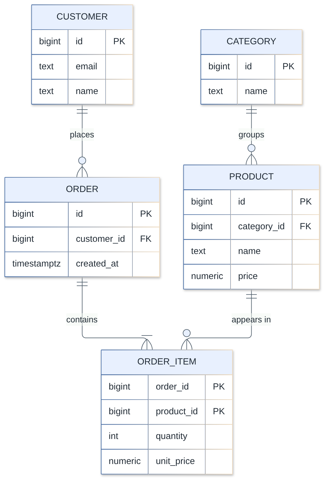
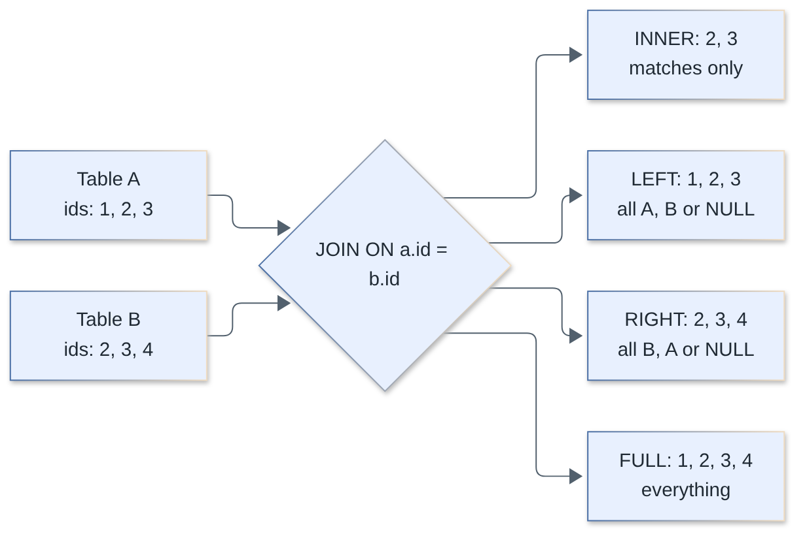
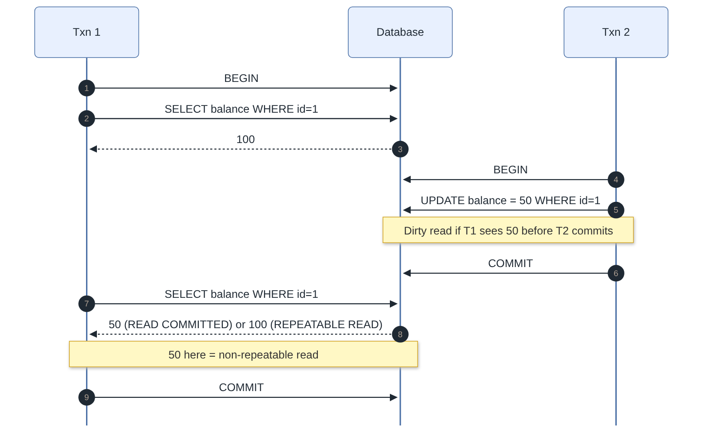
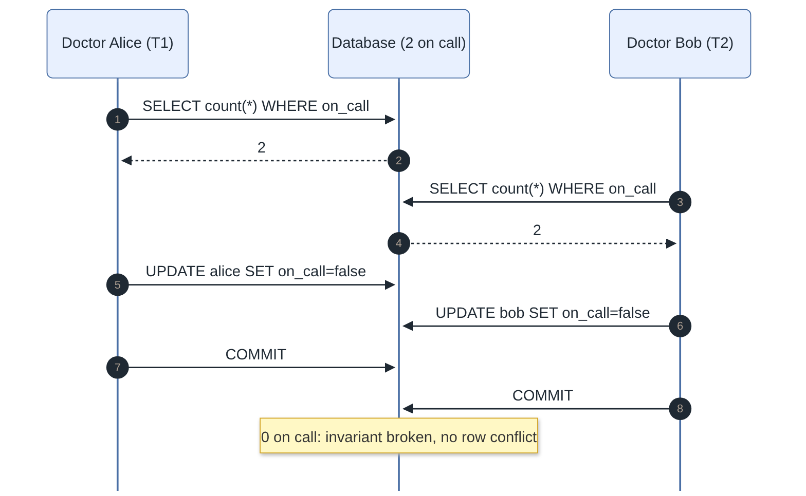
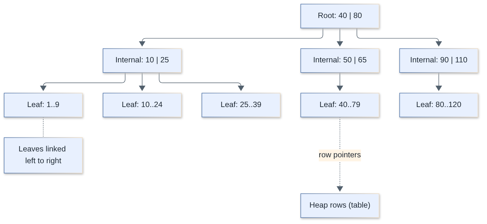
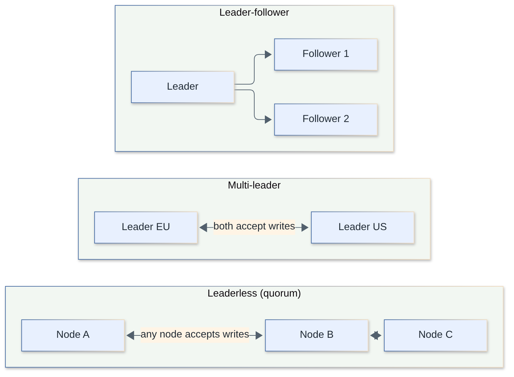
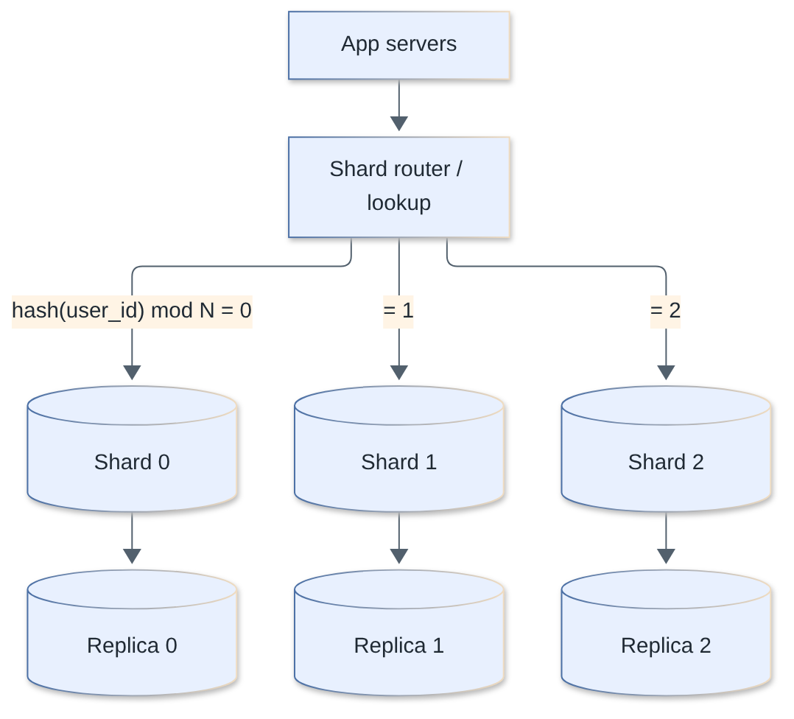
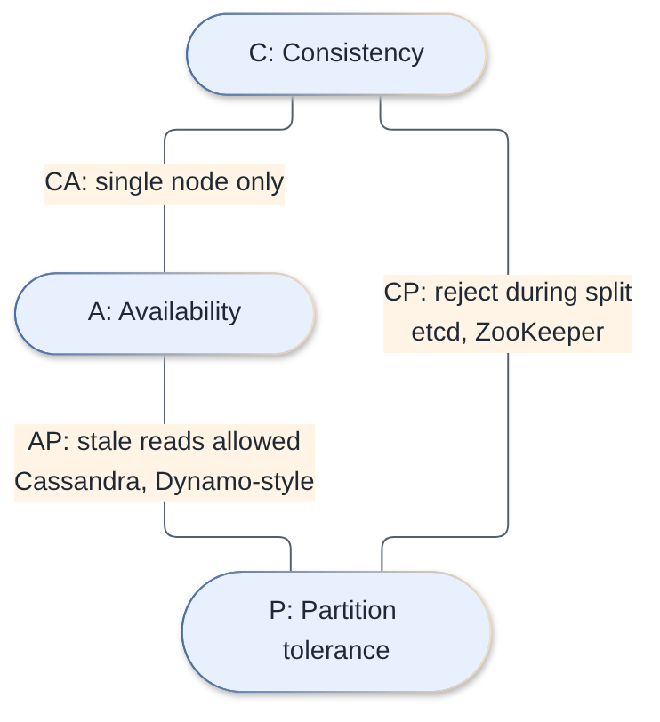
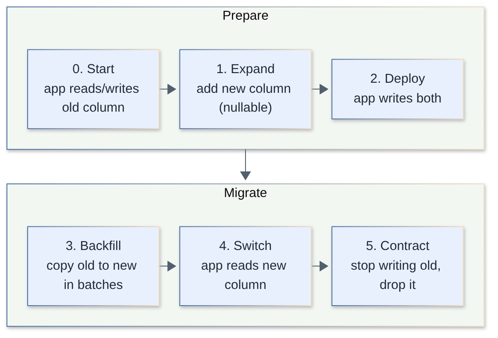

# Databases Interview Questions

Database-agnostic fundamentals for fullstack interviews: relational design, SQL, transactions, indexing, scaling, and operations. PostgreSQL-specific internals live in the separate [`postgres/`](../postgres/) topic.

**Levels:** `🟢 Junior` · `🟡 Middle` · `🔴 Senior`

## Table of contents

- **Relational Model & Keys**
  1. [What is the relational model and what are tables, rows, columns and constraints?](#1-what-is-the-relational-model-and-what-are-tables-rows-columns-and-constraints)
  2. [What is the difference between a primary key and a foreign key? What are referential actions?](#2-what-is-the-difference-between-a-primary-key-and-a-foreign-key-what-are-referential-actions)
  3. [Natural keys vs surrogate keys: which would you choose?](#3-natural-keys-vs-surrogate-keys-which-would-you-choose)
  4. [UUID vs bigint vs UUIDv7 as primary keys: trade-offs?](#4-uuid-vs-bigint-vs-uuidv7-as-primary-keys-trade-offs)
- **Normalization**
  5. [What is normalization? Explain 1NF, 2NF and 3NF.](#5-what-is-normalization-explain-1nf-2nf-and-3nf)
  6. [What is BCNF and how does it differ from 3NF?](#6-what-is-bcnf-and-how-does-it-differ-from-3nf)
  7. [When should you denormalize?](#7-when-should-you-denormalize)
- **SQL Essentials**
  8. [What are the different types of JOINs?](#8-what-are-the-different-types-of-joins)
  9. [What is the difference between WHERE and HAVING, and how does GROUP BY work?](#9-what-is-the-difference-between-where-and-having-and-how-does-group-by-work)
  10. [What is the difference between UNION and UNION ALL?](#10-what-is-the-difference-between-union-and-union-all)
  11. [How does NULL behave in SQL?](#11-how-does-null-behave-in-sql)
  12. [Subqueries vs CTEs: when do you use each?](#12-subqueries-vs-ctes-when-do-you-use-each)
  13. [What are window functions and how do they differ from GROUP BY?](#13-what-are-window-functions-and-how-do-they-differ-from-group-by)
- **Classic SQL Coding Questions**
  14. [Find the Nth highest salary](#14-find-the-nth-highest-salary)
  15. [Find and delete duplicate rows](#15-find-and-delete-duplicate-rows)
  16. [Calculate running totals and moving averages](#16-calculate-running-totals-and-moving-averages)
  17. [Get the top N rows per group](#17-get-the-top-n-rows-per-group)
  18. [Gaps and islands: find consecutive streaks and missing ids](#18-gaps-and-islands-find-consecutive-streaks-and-missing-ids)
- **Transactions & Concurrency**
  19. [What is ACID?](#19-what-is-acid)
  20. [What are transaction isolation levels and which anomalies does each allow?](#20-what-are-transaction-isolation-levels-and-which-anomalies-does-each-allow)
  21. [What are lost update and write skew, and how do you prevent them?](#21-what-are-lost-update-and-write-skew-and-how-do-you-prevent-them)
  22. [Locking vs MVCC: how do databases handle concurrent access?](#22-locking-vs-mvcc-how-do-databases-handle-concurrent-access)
  23. [What is a deadlock and how do you handle it?](#23-what-is-a-deadlock-and-how-do-you-handle-it)
- **Indexes & Query Performance**
  24. [What is a database index and how does a B-tree index work? Hash vs B-tree?](#24-what-is-a-database-index-and-how-does-a-b-tree-index-work-hash-vs-b-tree)
  25. [How do composite indexes work and why does column order matter?](#25-how-do-composite-indexes-work-and-why-does-column-order-matter)
  26. [What are covering, partial and unique indexes, and what is selectivity?](#26-what-are-covering-partial-and-unique-indexes-and-what-is-selectivity)
  27. [When do indexes hurt, and why might the database ignore your index?](#27-when-do-indexes-hurt-and-why-might-the-database-ignore-your-index)
  28. [How do you read a query plan (EXPLAIN) and what is the query execution pipeline?](#28-how-do-you-read-a-query-plan-explain-and-what-is-the-query-execution-pipeline)
- **Application Data Access**
  29. [What is the N+1 query problem and how do you fix it?](#29-what-is-the-n1-query-problem-and-how-do-you-fix-it)
  30. [ORM vs query builder vs raw SQL: how do you choose?](#30-orm-vs-query-builder-vs-raw-sql-how-do-you-choose)
  31. [What is connection pooling and why do you need it?](#31-what-is-connection-pooling-and-why-do-you-need-it)
- **Replication & Distributed Databases**
  32. [How does database replication work? Sync vs async, leader-follower vs multi-leader](#32-how-does-database-replication-work-sync-vs-async-leader-follower-vs-multi-leader)
  33. [What are read replicas, and how do you deal with replication lag?](#33-what-are-read-replicas-and-how-do-you-deal-with-replication-lag)
  34. [Partitioning vs sharding: what are the strategies?](#34-partitioning-vs-sharding-what-are-the-strategies)
  35. [What problems does sharding introduce, and how do you handle them?](#35-what-problems-does-sharding-introduce-and-how-do-you-handle-them)
  36. [Explain the CAP theorem and PACELC](#36-explain-the-cap-theorem-and-pacelc)
  37. [What consistency models exist (strong, eventual, causal, read-your-writes)?](#37-what-consistency-models-exist-strong-eventual-causal-read-your-writes)
  38. [How do you handle transactions across services or shards? (2PC vs saga)](#38-how-do-you-handle-transactions-across-services-or-shards-2pc-vs-saga)
- **SQL vs NoSQL & Redis**
  39. [SQL vs NoSQL: what are the types of NoSQL databases and when to use each?](#39-sql-vs-nosql-what-are-the-types-of-nosql-databases-and-when-to-use-each)
  40. [How would you choose a database for a new system? (polyglot persistence)](#40-how-would-you-choose-a-database-for-a-new-system-polyglot-persistence)
  41. [What are common Redis use cases and what are its limitations?](#41-what-are-common-redis-use-cases-and-what-are-its-limitations)
- **Schema & Operations**
  42. [How do you run schema migrations with zero downtime? (expand/contract)](#42-how-do-you-run-schema-migrations-with-zero-downtime-expandcontract)
  43. [How do backups and point-in-time recovery (PITR) work?](#43-how-do-backups-and-point-in-time-recovery-pitr-work)
  44. [OLTP vs OLAP: what is the difference?](#44-oltp-vs-olap-what-is-the-difference)
  45. [How do you implement soft deletes, and what are the trade-offs?](#45-how-do-you-implement-soft-deletes-and-what-are-the-trade-offs)
  46. [What are the multi-tenancy patterns for a SaaS database?](#46-what-are-the-multi-tenancy-patterns-for-a-saas-database)

## Relational Model & Keys

### 1. What is the relational model and what are tables, rows, columns and constraints?

`🟢 Junior` · `#fundamentals` `#relational`

The relational model stores data as **relations** (tables) made of **rows** (tuples) and **columns** (attributes), where each column has a type and rows are identified by keys. Relationships between tables are expressed through **values** (foreign keys), not pointers, and you query with a declarative language (SQL): you say *what* you want and the optimizer decides *how*.

Key ideas:

- **Schema first**: structure and types are declared up front; the database enforces them.
- **Constraints** keep data valid regardless of which application writes it: `NOT NULL`, `UNIQUE`, `PRIMARY KEY`, `FOREIGN KEY`, `CHECK`, `DEFAULT`.
- **Set-based operations**: a query takes sets of rows and returns a set of rows (selection, projection, join, union...).
- **Data independence**: you can add an index or change the physical layout without rewriting queries.

```sql
CREATE TABLE users (
  id         bigint GENERATED ALWAYS AS IDENTITY PRIMARY KEY,
  email      text NOT NULL UNIQUE,
  age        int  CHECK (age >= 0),
  created_at timestamptz NOT NULL DEFAULT now()
);
```

Why constraints matter: application-level validation can be bypassed by a second service, a migration script or a bug. A constraint in the database is the only guarantee that holds for *every* writer.

> **Follow-up:** What is the difference between a table and a view? A table stores rows; a view is a stored query (a materialized view stores its result and must be refreshed).

[↑ Back to top](#table-of-contents)

### 2. What is the difference between a primary key and a foreign key? What are referential actions?

`🟢 Junior` · `#keys` `#constraints`

A **primary key (PK)** uniquely identifies each row in a table (unique and not null; one per table, possibly composite). A **foreign key (FK)** is a column (or set of columns) in one table that must match a PK/unique key in another table, which enforces **referential integrity**: you cannot reference a parent row that does not exist.

```sql
CREATE TABLE customers (id bigint PRIMARY KEY, name text NOT NULL);

CREATE TABLE orders (
  id          bigint PRIMARY KEY,
  customer_id bigint NOT NULL REFERENCES customers(id) ON DELETE RESTRICT,
  total       numeric(12,2) NOT NULL
);
```

Referential actions define what happens when the parent row is deleted or its key is updated:

| Action | Effect on child rows |
|---|---|
| `NO ACTION` / `RESTRICT` | Reject the parent change (`RESTRICT` checks immediately and cannot be deferred) |
| `CASCADE` | Delete / update the children too |
| `SET NULL` | Set the FK column to `NULL` (column must be nullable) |
| `SET DEFAULT` | Set the FK column to its default |

Practical notes:

- A PK creates a unique index automatically. A **FK column is *not* automatically indexed** in PostgreSQL (MySQL/InnoDB does create one). Index FK columns you join on or delete parents by, otherwise parent deletes scan the child table.
- `CASCADE` is convenient but dangerous on large trees (a single delete can remove millions of rows and hold locks). Prefer `RESTRICT` for business-critical data.
- Some teams drop FKs in very high-scale sharded systems because cross-shard FKs are impossible; that trades integrity for scalability and must be compensated in code.

> **Follow-up:** Can a FK be NULL? Yes, unless the column is `NOT NULL`; a NULL FK means "no parent" and is not checked.

[↑ Back to top](#table-of-contents)

### 3. Natural keys vs surrogate keys: which would you choose?

`🟡 Middle` · `#keys` `#schema-design`

A **natural key** is an attribute that already identifies the entity in the real world (email, ISBN, country code). A **surrogate key** is an artificial identifier with no business meaning (auto-increment integer, UUID). Default to a **surrogate PK**, and enforce the natural key with a `UNIQUE` constraint.

| | Natural key | Surrogate key |
|---|---|---|
| Meaning | Business data | None |
| Stability | Can change (emails, names, even "immutable" IDs get reissued) | Never changes |
| Size / join cost | Often wide (text, composite) | Small and fixed |
| Updates | Need cascading updates to every FK | Not needed |
| Readability | Self-describing | Requires a join to understand |
| Privacy | Leaks in URLs/logs | Opaque |

```sql
CREATE TABLE countries (
  iso_code char(2) PRIMARY KEY,      -- natural key is fine: tiny, stable, standardized
  name     text NOT NULL
);

CREATE TABLE users (
  id    bigint GENERATED ALWAYS AS IDENTITY PRIMARY KEY,  -- surrogate
  email text NOT NULL UNIQUE                              -- natural key still enforced
);
```

When natural keys are fine: small, standardized, truly immutable lookup tables (ISO country/currency codes) and join tables whose composite PK is the pair of FKs.

Gotchas: surrogate keys do **not** remove duplicates by themselves; without a unique constraint on the natural key you can insert the same real-world entity twice.

> **Follow-up:** Composite PK or surrogate for a join table? A composite PK `(user_id, role_id)` is natural and prevents duplicates; add a surrogate only if other tables must reference the link row itself.

[↑ Back to top](#table-of-contents)

### 4. UUID vs bigint vs UUIDv7 as primary keys: trade-offs?

`🟡 Middle` · `#keys` `#performance`

`bigint` identity keys are small (8 bytes), sequential and index-friendly, but guessable and awkward across multiple writers. **UUIDv4** is globally unique and can be generated anywhere, but it is 16 bytes and random, which scatters inserts across the whole B-tree. **UUIDv7** (standardized in RFC 9562) puts a millisecond timestamp in the high bits, so it is globally unique *and* roughly time-ordered, giving most of the locality of a sequence.

| | `bigint` identity | UUIDv4 | UUIDv7 |
|---|---|---|---|
| Size | 8 bytes | 16 bytes | 16 bytes |
| Insert locality | Excellent (append at right edge) | Poor (random page splits, cache misses) | Good (mostly appends) |
| Generated by | The database | Anywhere | Anywhere |
| Guessable / enumerable | Yes (IDOR risk if used unchecked) | No | Mostly no, but leaks creation time |
| Merge across shards/DBs | Collisions | Safe | Safe |
| Sort by creation time | Yes | No | Yes (ms precision) |

```sql
-- PostgreSQL 18+ has a native uuidv7(); older versions need an extension or app-side generation
CREATE TABLE events (
  id      uuid PRIMARY KEY DEFAULT uuidv7(),
  payload jsonb NOT NULL
);
```

Guidance:

- Single database, internal IDs only: `bigint` identity is simplest and smallest. Every secondary index in InnoDB (and every FK) repeats the PK, so a 16-byte key is paid for many times.
- IDs generated by clients, edge nodes, or multiple databases (offline sync, sharding, event sourcing): UUIDv7.
- Public identifiers: authorize every access by owner regardless of key type. Opaque IDs are not security.
- In InnoDB the PK is the clustered index, so random UUIDs cause page splits and fragmentation; in PostgreSQL (heap tables) the effect is milder but still hurts index size, cache hit rate and WAL volume.

> **Follow-up:** Isn't a UUIDv7 timestamp a privacy leak? It reveals creation time to ms precision; if that matters, keep a separate random public ID.

[↑ Back to top](#table-of-contents)

## Normalization

### 5. What is normalization? Explain 1NF, 2NF and 3NF.

`🟢 Junior` · `#normalization` `#schema-design`

Normalization is organizing tables so each fact is stored **once**, which prevents update, insert and delete anomalies. The normal forms are cumulative rules:

| Form | Rule | Violation example |
|---|---|---|
| **1NF** | Atomic values, no repeating groups or arrays-in-a-cell | `phones = '555-1, 555-2'` |
| **2NF** | 1NF + no *partial* dependency: every non-key column depends on the **whole** composite key | `order_items(order_id, product_id, product_name)`: `product_name` depends only on `product_id` |
| **3NF** | 2NF + no *transitive* dependency: non-key columns depend on the key, **"the whole key, and nothing but the key"** | `employees(id, dept_id, dept_name)`: `dept_name` depends on `dept_id`, not on `id` |

Un-normalized table and its anomalies:

```text
orders(order_id, customer_name, customer_email, product_name, product_price, qty)
```

- **Update anomaly**: a customer changes email, you must update every order row.
- **Insert anomaly**: you cannot store a product that has never been ordered.
- **Delete anomaly**: deleting the last order of a product loses the product's price.

Normalized result:



```sql
CREATE TABLE customers  (id bigint PRIMARY KEY, email text UNIQUE NOT NULL, name text NOT NULL);
CREATE TABLE products   (id bigint PRIMARY KEY, name text NOT NULL, price numeric(12,2) NOT NULL);
CREATE TABLE orders     (id bigint PRIMARY KEY, customer_id bigint NOT NULL REFERENCES customers(id));
CREATE TABLE order_items (
  order_id   bigint REFERENCES orders(id),
  product_id bigint REFERENCES products(id),
  quantity   int NOT NULL CHECK (quantity > 0),
  unit_price numeric(12,2) NOT NULL,     -- deliberate snapshot of price at purchase time
  PRIMARY KEY (order_id, product_id)
);
```

Note `unit_price` in `order_items` looks like duplication but is a **different fact** (the price *at purchase time*), not a copy of the current product price.

> **Follow-up:** Is 3NF always the goal? It is the usual target for OLTP; see [when to denormalize](#7-when-should-you-denormalize).

[↑ Back to top](#table-of-contents)

### 6. What is BCNF and how does it differ from 3NF?

`🟡 Middle` · `#normalization` `#theory`

**Boyce-Codd Normal Form** is a stricter 3NF: for every non-trivial functional dependency `X → Y`, `X` must be a **superkey**. 3NF allows an exception when `Y` is a prime attribute (part of some candidate key); BCNF does not.

Classic example: students book a course with an instructor; each instructor teaches exactly one course, a student has one instructor per course.

```text
enrollment(student, course, instructor)
Candidate keys: (student, course) and (student, instructor)
FDs: (student, course) -> instructor,   instructor -> course
```

`instructor -> course` has a determinant (`instructor`) that is **not** a superkey, so the table violates BCNF, yet it is in 3NF because `course` is part of a candidate key. Anomaly: if instructor Smith switches course, every enrollment row must change. Fix by decomposing:

```sql
CREATE TABLE instructor_course (instructor text PRIMARY KEY, course text NOT NULL);
CREATE TABLE enrollment (
  student    text,
  instructor text REFERENCES instructor_course(instructor),
  PRIMARY KEY (student, instructor)
);
```

Trade-off: BCNF decomposition can lose the ability to enforce some dependencies with a simple constraint (here `(student, course) -> instructor` can no longer be checked without a join). That is why 3NF is the practical default and BCNF is applied when the anomaly is real. 4NF/5NF deal with multi-valued and join dependencies and rarely come up in practice.

> **Follow-up:** Is every BCNF table in 3NF? Yes. BCNF is strictly stronger.

[↑ Back to top](#table-of-contents)

### 7. When should you denormalize?

`🟡 Middle` · `#normalization` `#performance`

Denormalize **deliberately, after measuring**, when read cost of joins/aggregations is a proven bottleneck and the data is read far more often than written. Start normalized; denormalize the specific hot path.

Common techniques:

| Technique | Example | Cost |
|---|---|---|
| Duplicate a column | `orders.customer_name` copied to avoid a join | Must update copies on change |
| Precomputed aggregate | `posts.comment_count`, `accounts.balance` | Must keep in sync (trigger, app, job) |
| Summary / rollup table | `daily_sales(day, total)` filled by a job | Staleness |
| Materialized view | Refresh on a schedule | Staleness, refresh cost |
| JSON column / document | Embed address snapshot in the order | Harder to query and constrain |
| Star schema for analytics | Wide fact + dimension tables | Redundancy by design |

```sql
-- Keep the counter correct inside the same transaction as the write
BEGIN;
INSERT INTO comments (post_id, body) VALUES (42, 'nice');
UPDATE posts SET comment_count = comment_count + 1 WHERE id = 42;
COMMIT;
```

Risks: data drift (copies diverge), write amplification, and more complex code. Mitigations: keep a single source of truth, derive copies via triggers or the outbox/CDC pipeline, add a reconciliation job, and document which columns are derived.

Before denormalizing, try: proper indexes, query rewrite, covering indexes, caching, a read replica, or a materialized view.

> **Follow-up:** Is snapshotting the price in `order_items` denormalization? No, that is a legitimately different fact (price at time of sale).

[↑ Back to top](#table-of-contents)

## SQL Essentials

### 8. What are the different types of JOINs?

`🟢 Junior` · `#sql` `#joins`

A JOIN combines rows from two tables based on a condition. `INNER` keeps only matching pairs; `LEFT`/`RIGHT` also keep unmatched rows from one side (filled with `NULL`); `FULL` keeps unmatched rows from both; `CROSS` is the Cartesian product.



Sample data:

```text
customers: (1,Ann) (2,Bob) (3,Cy)         orders: (10,cust=1) (11,cust=1) (12,cust=3) (13,cust=99)
```

```sql
-- INNER: Ann (x2), Cy
SELECT c.name, o.id FROM customers c JOIN orders o ON o.customer_id = c.id;

-- LEFT: also Bob with NULL order
SELECT c.name, o.id FROM customers c LEFT JOIN orders o ON o.customer_id = c.id;

-- Anti-join: customers WITHOUT orders (Bob)
SELECT c.name FROM customers c LEFT JOIN orders o ON o.customer_id = c.id WHERE o.id IS NULL;

-- FULL: also the orphan order 13
SELECT c.name, o.id FROM customers c FULL JOIN orders o ON o.customer_id = c.id;
```

| Join | Returns |
|---|---|
| INNER | Rows matching in both |
| LEFT OUTER | All left + matching right (else NULL) |
| RIGHT OUTER | All right + matching left (rewrite as LEFT by swapping) |
| FULL OUTER | All rows from both |
| CROSS | Every combination (`n x m`) |
| SELF | A table joined to itself (employee/manager) |
| SEMI (`EXISTS`) / ANTI (`NOT EXISTS`) | Filter by existence, no duplication of left rows |

Gotchas:

- Put filters on the **right** table of a LEFT JOIN in the `ON` clause, not `WHERE`; a `WHERE o.total > 10` turns it into an inner join because `NULL > 10` is not true.
- A join on a non-unique key **multiplies rows**; `SUM()` after such a join double counts. Aggregate first or use `EXISTS`.
- MySQL has no `FULL JOIN`; emulate with `LEFT JOIN ... UNION ... RIGHT JOIN`.

> **Follow-up:** Which join algorithms do databases use? Nested loop (small / indexed inner), hash join (large unsorted equi-joins), merge join (both inputs sorted).

[↑ Back to top](#table-of-contents)

### 9. What is the difference between WHERE and HAVING, and how does GROUP BY work?

`🟢 Junior` · `#sql` `#aggregation`

`WHERE` filters **rows before** grouping; `HAVING` filters **groups after** aggregation. `GROUP BY` collapses rows with the same grouping values into one row per group so you can apply aggregates (`COUNT`, `SUM`, `AVG`, `MIN`, `MAX`).

Logical evaluation order: `FROM/JOIN` → `WHERE` → `GROUP BY` → `HAVING` → `SELECT` (incl. window functions) → `DISTINCT` → `ORDER BY` → `LIMIT`.

```sql
-- Departments with at least 2 employees earning >= 70, and their average salary
SELECT dept, COUNT(*) AS n, AVG(salary) AS avg_salary
FROM employees
WHERE salary >= 70           -- row filter, can use an index
GROUP BY dept
HAVING COUNT(*) >= 2         -- group filter, needs the aggregate
ORDER BY dept;
```

Rules and gotchas:

- Every selected column must be in `GROUP BY` or inside an aggregate (standard SQL; PostgreSQL enforces it, and allows columns functionally dependent on the PK).
- Put conditions that don't need aggregates in `WHERE`: it reduces rows before the expensive grouping.
- `COUNT(*)` counts rows, `COUNT(col)` skips NULLs, `COUNT(DISTINCT col)` counts distinct non-NULL values.
- Because of evaluation order, you cannot use a `SELECT` alias in `WHERE` (but most engines allow it in `GROUP BY`/`ORDER BY`).
- `GROUP BY ROLLUP/CUBE/GROUPING SETS` produce subtotals in one pass.

> **Follow-up:** Can you use HAVING without GROUP BY? Yes, the whole result is treated as a single group.

[↑ Back to top](#table-of-contents)

### 10. What is the difference between UNION and UNION ALL?

`🟢 Junior` · `#sql` `#sets`

`UNION` appends two result sets and **removes duplicates**; `UNION ALL` appends them **keeping duplicates** and is faster because it skips the dedup (sort or hash) step. Default to `UNION ALL` unless you need distinct rows.

```sql
SELECT 1 UNION     SELECT 1;   -- 1 row
SELECT 1 UNION ALL SELECT 1;   -- 2 rows

-- Typical use: merge identical-shaped tables or sources
SELECT id, 'web'    AS source FROM web_orders
UNION ALL
SELECT id, 'mobile' AS source FROM mobile_orders;
```

Rules: both queries must return the same number of columns with compatible types; column names come from the first query. Related operators: `INTERSECT` (rows in both) and `EXCEPT` (PostgreSQL/SQL Server; `MINUS` in Oracle) (rows in the first but not the second). `INTERSECT`/`EXCEPT` are also set-distinct by default; `ALL` variants keep duplicates.

> **Follow-up:** When is `UNION` (distinct) actually wrong? When the same legitimate row can appear twice (two identical payments) and you want to keep both.

[↑ Back to top](#table-of-contents)

### 11. How does NULL behave in SQL?

`🟢 Junior` · `#sql` `#null`

`NULL` means "unknown/missing", not zero or empty string. SQL uses **three-valued logic** (TRUE, FALSE, UNKNOWN): any comparison with `NULL` (including `NULL = NULL`) yields UNKNOWN, and `WHERE` keeps only rows where the condition is TRUE.

```sql
SELECT NULL = NULL;            -- NULL (unknown)
SELECT NULL IS NULL;           -- true
SELECT NULL IS DISTINCT FROM NULL;  -- false (null-safe comparison; MySQL: <=>)
SELECT 5 + NULL;               -- NULL
SELECT COALESCE(NULL, 0);      -- 0
```

Truth table highlights: `TRUE AND UNKNOWN = UNKNOWN`, `FALSE AND UNKNOWN = FALSE`, `TRUE OR UNKNOWN = TRUE`, `NOT UNKNOWN = UNKNOWN`.

The traps interviewers love:

| Situation | Behavior |
|---|---|
| `WHERE col <> 'x'` | Rows where `col` is NULL are **excluded** |
| `NOT IN (subquery)` | If the subquery returns any NULL, the result is **empty** (see [Q12](#12-subqueries-vs-ctes-when-do-you-use-each)) |
| Aggregates | `SUM/AVG/MIN/MAX/COUNT(col)` ignore NULLs; `COUNT(*)` does not; `SUM` of no rows is NULL |
| `UNIQUE` constraint | Multiple NULLs are allowed in most databases (PostgreSQL 15+ has `UNIQUE NULLS NOT DISTINCT`; SQL Server allows only one) |
| `GROUP BY` / `DISTINCT` | Treat all NULLs as one group / equal |
| `ORDER BY` | NULL position differs: PostgreSQL puts NULLs **last** for ASC (use `NULLS FIRST/LAST`), MySQL puts them first |
| Oracle | Empty string `''` is stored as NULL |

> **Follow-up:** Should columns be nullable by default? No. Prefer `NOT NULL` plus a default, and use NULL only for genuinely unknown/optional values.

[↑ Back to top](#table-of-contents)

### 12. Subqueries vs CTEs: when do you use each?

`🟡 Middle` · `#sql` `#cte` `#subquery`

A **subquery** is a query nested inside another (in `WHERE`, `FROM`, or `SELECT`); a **CTE** (`WITH name AS (...)`) names a subquery up front so you can read it top-to-bottom and reuse it. Use CTEs for readability, multi-step logic and **recursion**; they are not automatically faster or slower.

```sql
-- Subquery
SELECT name FROM employees
WHERE salary > (SELECT AVG(salary) FROM employees);

-- CTE: same result, steps named
WITH dept_avg AS (
  SELECT dept, AVG(salary) AS avg_salary FROM employees GROUP BY dept
)
SELECT e.name, e.salary, d.avg_salary
FROM employees e JOIN dept_avg d USING (dept)
WHERE e.salary > d.avg_salary;
```

Types of subqueries:

- **Scalar** (one value), **row/table** (in `FROM`, a "derived table"), **`IN`/`EXISTS`** (membership).
- **Correlated**: references the outer query and is conceptually re-evaluated per outer row (optimizers often decorrelate it into a join).

`EXISTS` vs `IN` vs `NOT IN`:

```sql
-- a(x): 1,2   b(y): 1,NULL
SELECT * FROM a WHERE x NOT IN (SELECT y FROM b);        -- EMPTY: x <> NULL is UNKNOWN
SELECT * FROM a WHERE NOT EXISTS (SELECT 1 FROM b WHERE b.y = a.x);  -- 2  (correct)
```

Always prefer `NOT EXISTS` over `NOT IN` when the subquery column can be NULL.

Recursive CTE (hierarchies, graph traversal):

```sql
WITH RECURSIVE tree AS (
  SELECT id, name, manager_id, 1 AS depth FROM employees WHERE manager_id IS NULL
  UNION ALL
  SELECT e.id, e.name, e.manager_id, t.depth + 1
  FROM employees e JOIN tree t ON e.manager_id = t.id
)
SELECT * FROM tree ORDER BY depth, id;
```

Performance notes: in PostgreSQL 12+ a non-recursive, side-effect-free CTE referenced once is **inlined** like a subquery; if referenced multiple times it is materialized (control with `MATERIALIZED` / `NOT MATERIALIZED`). In older versions CTEs were always optimization fences. MySQL 8+ and SQL Server generally inline. Always check with `EXPLAIN`.

> **Follow-up:** CTE or temp table? A temp table can be indexed and analyzed, which wins for huge intermediate results reused many times.

[↑ Back to top](#table-of-contents)

### 13. What are window functions and how do they differ from GROUP BY?

`🟡 Middle` · `#sql` `#window-functions`

A window function computes a value **across a set of related rows (the window) while keeping every input row**, whereas `GROUP BY` collapses rows into one per group. Syntax: `function() OVER (PARTITION BY ... ORDER BY ... frame)`.

```sql
SELECT name, dept, salary,
       AVG(salary)  OVER (PARTITION BY dept)                    AS dept_avg,
       ROW_NUMBER() OVER (ORDER BY salary DESC, id)             AS rn,
       RANK()       OVER (ORDER BY salary DESC)                 AS rk,
       DENSE_RANK() OVER (ORDER BY salary DESC)                 AS drk,
       LAG(salary)  OVER (PARTITION BY dept ORDER BY salary)    AS prev_in_dept
FROM employees;
```

With salaries 200, 200, 100, 90 the ranking functions differ on ties:

| salary | ROW_NUMBER | RANK | DENSE_RANK |
|---|---|---|---|
| 200 | 1 | 1 | 1 |
| 200 | 2 | 1 | 1 |
| 100 | 3 | 3 | 2 |
| 90 | 4 | 4 | 3 |

Function families:

- **Ranking**: `ROW_NUMBER`, `RANK`, `DENSE_RANK`, `NTILE`, `PERCENT_RANK`.
- **Value/offset**: `LAG`, `LEAD`, `FIRST_VALUE`, `LAST_VALUE`, `NTH_VALUE`.
- **Aggregates as windows**: `SUM`, `AVG`, `COUNT`, `MIN`, `MAX` with `OVER`.

Frames: `ROWS BETWEEN 2 PRECEDING AND CURRENT ROW` (physical rows) vs `RANGE` (value-based, peers included). With `ORDER BY` and no explicit frame the default is `RANGE BETWEEN UNBOUNDED PRECEDING AND CURRENT ROW`, so tied rows share the same running total, and `LAST_VALUE` surprisingly returns the current row's peer; specify the frame when it matters.

Gotchas: window functions run **after** `WHERE/GROUP BY/HAVING`, so you cannot filter on them directly; wrap in a subquery/CTE (or use `QUALIFY` in Snowflake/BigQuery).

> **Follow-up:** Can you nest window functions? No; compute one in a subquery and window over it.

[↑ Back to top](#table-of-contents)

## Classic SQL Coding Questions

All solutions below were run against PostgreSQL; sample data is tiny so you can verify by hand.

```sql
CREATE TABLE employees (id int PRIMARY KEY, name text, dept text, salary int);
INSERT INTO employees VALUES
 (1,'Ann','eng',100),(2,'Bob','eng',200),(3,'Cy','eng',200),
 (4,'Di','ops',90),(5,'Ed','ops',80),(6,'Flo','ops',70),(7,'Gus','hr',50);
```

### 14. Find the Nth highest salary

`🟡 Middle` · `#sql-coding` `#window-functions`

Use `DENSE_RANK()` (so ties count once) and filter on the rank; return NULL when fewer than N distinct salaries exist. For N = 2 on the data above the answer is **100** (200 is first, shared by Bob and Cy).

```sql
-- 1) Window function: generalizes to any N, handles ties
SELECT DISTINCT salary
FROM (
  SELECT salary, DENSE_RANK() OVER (ORDER BY salary DESC) AS r
  FROM employees
) t
WHERE r = 2;

-- 2) OFFSET: distinct values, skip N-1. Wrap in a scalar subquery to get NULL (not "no row") if missing
SELECT (SELECT DISTINCT salary FROM employees
        ORDER BY salary DESC LIMIT 1 OFFSET 1) AS second_highest;

-- 3) Second highest only, portable
SELECT MAX(salary) FROM employees
WHERE salary < (SELECT MAX(salary) FROM employees);
```

Why `DENSE_RANK` and not `ROW_NUMBER`/`RANK`: `ROW_NUMBER` would return 200 as "second" (second row), `RANK` skips (ranks 1,1,3), so there is no rank 2 at all. Per department: add `PARTITION BY dept`.

> **Follow-up:** How do you do it without window functions or LIMIT? Correlated subquery: `WHERE (SELECT COUNT(DISTINCT s2.salary) FROM employees s2 WHERE s2.salary > e.salary) = N - 1` (slow: O(n^2)).

[↑ Back to top](#table-of-contents)

### 15. Find and delete duplicate rows

`🟢 Junior` · `#sql-coding` `#data-quality`

Find duplicates with `GROUP BY ... HAVING COUNT(*) > 1`; delete them by keeping one row per group (usually the lowest id) using a self-join or `ROW_NUMBER()`.

```sql
CREATE TABLE users (id serial PRIMARY KEY, email text);
INSERT INTO users (email) VALUES ('a@x'),('b@x'),('a@x'),('a@x'),('c@x'),('b@x');

-- Which emails are duplicated?  -> a@x (3), b@x (2)
SELECT email, COUNT(*) FROM users GROUP BY email HAVING COUNT(*) > 1;

-- Delete, keeping the smallest id per email (PostgreSQL)
DELETE FROM users u
USING users v
WHERE u.email = v.email AND u.id > v.id;

-- Portable alternative with a window function
DELETE FROM users
WHERE id IN (
  SELECT id FROM (
    SELECT id, ROW_NUMBER() OVER (PARTITION BY email ORDER BY id) AS rn FROM users
  ) t WHERE rn > 1
);
```

After the first delete the table keeps ids 1 (`a@x`), 2 (`b@x`), 5 (`c@x`). **Prevent it** with a constraint so it can't happen again:

```sql
ALTER TABLE users ADD CONSTRAINT users_email_key UNIQUE (email);
```

For tables with no id column in PostgreSQL you can use the system column `ctid`; in other engines, use a temp table / `CREATE TABLE AS SELECT DISTINCT`. Always run the `SELECT` version first and delete in batches on large tables.

> **Follow-up:** How to dedupe case-insensitively? Group by `lower(email)` and enforce with a unique index on `lower(email)` (or `citext`).

[↑ Back to top](#table-of-contents)

### 16. Calculate running totals and moving averages

`🟡 Middle` · `#sql-coding` `#window-functions`

Use an aggregate as a window function with `ORDER BY` (running total) or an explicit `ROWS` frame (moving average). This replaces slow self-joins or correlated subqueries.

```sql
CREATE TABLE sales (day date, amount int);
INSERT INTO sales VALUES ('2026-01-01',10),('2026-01-02',20),('2026-01-03',5),('2026-01-04',15);

SELECT day, amount,
       SUM(amount) OVER (ORDER BY day)                                        AS running_total,
       ROUND(AVG(amount) OVER (ORDER BY day
             ROWS BETWEEN 2 PRECEDING AND CURRENT ROW), 2)                    AS moving_avg_3
FROM sales;
```

```text
    day     | amount | running_total | moving_avg_3
 2026-01-01 |     10 |            10 |        10.00
 2026-01-02 |     20 |            30 |        15.00
 2026-01-03 |     5  |            35 |        11.67
 2026-01-04 |     15 |            50 |        13.33
```

Variants: add `PARTITION BY account_id` for a running balance per account; for a **calendar-aware** window (last 7 days regardless of gaps) use `RANGE BETWEEN INTERVAL '6 days' PRECEDING AND CURRENT ROW` (PostgreSQL 11+) after ordering by the date. Make the order **deterministic** (add a unique tiebreaker) or ties with the default `RANGE` frame will share the same total.

> **Follow-up:** Percent of total? `amount * 100.0 / SUM(amount) OVER ()`.

[↑ Back to top](#table-of-contents)

### 17. Get the top N rows per group

`🟡 Middle` · `#sql-coding` `#window-functions`

Rank rows inside each group with `ROW_NUMBER()` (or `RANK`/`DENSE_RANK` if ties should all be included) and keep rank <= N. For the top 2 earners per department:

```sql
SELECT dept, name, salary
FROM (
  SELECT dept, name, salary,
         ROW_NUMBER() OVER (PARTITION BY dept ORDER BY salary DESC, id) AS rn
  FROM employees
) t
WHERE rn <= 2
ORDER BY dept, salary DESC;
```

```text
 dept | name | salary
 eng  | Bob  |    200
 eng  | Cy   |    200
 hr   | Gus  |     50
 ops  | Di   |     90
 ops  | Ed   |     80
```

Alternative with `LATERAL`, which is often faster when there is an index on `(dept, salary DESC)` and few groups, because it can stop after N rows per group:

```sql
SELECT d.dept, e.name, e.salary
FROM (SELECT DISTINCT dept FROM employees) d
CROSS JOIN LATERAL (
  SELECT name, salary FROM employees e
  WHERE e.dept = d.dept ORDER BY salary DESC, id LIMIT 2
) e;
```

Choosing the function: `ROW_NUMBER` gives exactly N rows (arbitrary among ties unless you add a tiebreaker); `RANK` / `DENSE_RANK` can return more than N when there are ties. `QUALIFY rn <= 2` removes the subquery in Snowflake/BigQuery/DuckDB. MySQL 8+ supports window functions; MySQL 5.7 needs user variables or correlated subqueries.

> **Follow-up:** Only the single latest row per group? PostgreSQL: `SELECT DISTINCT ON (dept) ... ORDER BY dept, salary DESC`.

[↑ Back to top](#table-of-contents)

### 18. Gaps and islands: find consecutive streaks and missing ids

`🔴 Senior` · `#sql-coding` `#window-functions`

"Islands" are runs of consecutive values; "gaps" are the holes between them. The key trick for islands: subtract a **row number** from the value; consecutive values give the same constant, so that difference becomes a group key.

Longest login streaks per user:

```sql
CREATE TABLE logins (user_id int, d date);
INSERT INTO logins VALUES
 (1,'2026-01-01'),(1,'2026-01-02'),(1,'2026-01-03'),
 (1,'2026-01-07'),(1,'2026-01-08'),(1,'2026-01-10');

SELECT user_id, MIN(d) AS start_date, MAX(d) AS end_date, COUNT(*) AS days
FROM (
  SELECT user_id, d,
         d - (DENSE_RANK() OVER (PARTITION BY user_id ORDER BY d))::int AS grp
  FROM logins
) t
GROUP BY user_id, grp
ORDER BY start_date;
```

```text
 user_id | start_date | end_date   | days
       1 | 2026-01-01 | 2026-01-03 |    3
       1 | 2026-01-07 | 2026-01-08 |    2
       1 | 2026-01-10 | 2026-01-10 |    1
```

Why it works: dates 1,2,3 minus ranks 1,2,3 are all `Dec 31`; 7,8 minus 4,5 are all `Jan 3`, etc. `DENSE_RANK` (over distinct dates) protects against duplicate dates; use `DISTINCT` first or `DENSE_RANK` if duplicates are possible.

Gaps in an integer id sequence with `LEAD`:

```sql
CREATE TABLE ids (id int);
INSERT INTO ids VALUES (1),(2),(3),(7),(8),(10);

SELECT id + 1 AS gap_start, next_id - 1 AS gap_end
FROM (SELECT id, LEAD(id) OVER (ORDER BY id) AS next_id FROM ids) t
WHERE next_id - id > 1;
--  gap_start | gap_end :  4 | 6   and   9 | 9
```

Variants: islands by status changes (compare `LAG(status)` to flag a change, then running `SUM` of the flags gives the island id), session-ization of events with a time gap threshold (`WHEN ts - LAG(ts) > interval '30 min'` starts a new session), and finding missing dates with `generate_series` + anti-join.

> **Follow-up:** Is a sequence gap a bug? No. Sequences/identity columns skip values on rollback and crashes; never rely on gap-free ids (use a counter table with locking if law requires gap-free invoice numbers).

[↑ Back to top](#table-of-contents)

## Transactions & Concurrency

### 19. What is ACID?

`🟢 Junior` · `#transactions` `#acid`

ACID is the set of guarantees a transactional database gives: **Atomicity** (all or nothing), **Consistency** (a transaction moves the database from one valid state to another), **Isolation** (concurrent transactions don't see each other's partial work), **Durability** (once committed, data survives crashes).

| Property | Meaning | How it is typically implemented |
|---|---|---|
| Atomicity | A transaction fully commits or fully rolls back | Undo log / MVCC old versions, rollback |
| Consistency | Constraints (PK, FK, CHECK, UNIQUE) hold before and after | Constraint checks; the app defines the invariants |
| Isolation | Concurrent transactions behave as if (to a configurable degree) serial | Locks and/or MVCC, see [Q20](#20-what-are-transaction-isolation-levels-and-which-anomalies-does-each-allow) |
| Durability | Committed data is not lost on crash or power failure | Write-ahead log (WAL) flushed to disk (`fsync`) before commit returns |

```sql
BEGIN;
UPDATE accounts SET balance = balance - 100 WHERE id = 1;
UPDATE accounts SET balance = balance + 100 WHERE id = 2;
COMMIT;   -- or ROLLBACK; if anything failed, neither update persists
```

Notes:

- The "C" is the odd one out: atomicity, isolation and durability are database features, but consistency also depends on the application declaring correct invariants.
- Durability has knobs: PostgreSQL `synchronous_commit = off` or MySQL `innodb_flush_log_at_trx_commit` != 1 trade a small window of lost commits for speed. Replication adds another dimension: is a commit durable on *one* node or on a quorum?
- BASE (basically available, soft state, eventually consistent) is the informal opposite used for many NoSQL systems.

> **Follow-up:** Does `ROLLBACK` undo sequence values? No; sequences are non-transactional, so gaps appear.

[↑ Back to top](#table-of-contents)

### 20. What are transaction isolation levels and which anomalies does each allow?

`🟡 Middle` · `#transactions` `#isolation`

Isolation levels trade correctness for concurrency. The SQL standard defines four levels by which anomalies they permit: **Read Uncommitted**, **Read Committed**, **Repeatable Read**, **Serializable**.

Anomalies:

- **Dirty read**: reading another transaction's *uncommitted* change.
- **Non-repeatable read**: reading the same row twice and getting different values because another transaction committed in between.
- **Phantom read**: re-running a range query and getting different *rows* (inserted/deleted by a committed transaction).
- **Lost update** and **write skew**: see [Q21](#21-what-are-lost-update-and-write-skew-and-how-do-you-prevent-them) (not in the standard's table, but real).



| Level | Dirty read | Non-repeatable read | Phantom | Write skew |
|---|---|---|---|---|
| Read Uncommitted | Possible (standard) | Possible | Possible | Possible |
| Read Committed | No | Possible | Possible | Possible |
| Repeatable Read (standard) | No | No | Possible | Possible |
| Serializable | No | No | No | No |

Real engines deviate from the table:

| Engine | Default | Notes |
|---|---|---|
| PostgreSQL | Read Committed | Read Uncommitted behaves as Read Committed (no dirty reads ever). Repeatable Read is **snapshot isolation**: no phantoms, but write skew is possible. Serializable uses SSI and may abort with `40001` (retry). |
| MySQL InnoDB | Repeatable Read | Snapshot reads for plain `SELECT`; locking reads and writes use gap/next-key locks, which prevent many phantoms. |
| SQL Server | Read Committed (locking) | Can use row versioning (`READ_COMMITTED_SNAPSHOT`, `SNAPSHOT`). Azure SQL Database defaults to RCSI. |
| Oracle | Read Committed | `SERIALIZABLE` is actually snapshot isolation. |

```sql
-- Session A                                -- Session B
BEGIN ISOLATION LEVEL REPEATABLE READ;
SELECT balance FROM acct WHERE id = 1;  -- 100
                                            UPDATE acct SET balance = 50 WHERE id = 1; COMMIT;
SELECT balance FROM acct WHERE id = 1;  -- still 100 (snapshot)
COMMIT;
-- Under READ COMMITTED the second SELECT would return 50 (non-repeatable read).
```

Choosing: Read Committed is a fine default for most OLTP; use Repeatable Read for consistent multi-statement reports; use Serializable (with a retry loop) when correctness invariants span multiple rows and you don't want to reason about locks.

> **Follow-up:** Does a higher level always mean slower? Usually more blocking or more aborts/retries, not necessarily lower throughput on low-contention workloads.

[↑ Back to top](#table-of-contents)

### 21. What are lost update and write skew, and how do you prevent them?

`🔴 Senior` · `#transactions` `#concurrency` `#isolation`

Both are anomalies that survive Read Committed (and, for write skew, Snapshot/Repeatable Read in PostgreSQL). **Lost update**: two transactions read the same value, compute a new one, and the second write silently overwrites the first. **Write skew**: two transactions read overlapping data, make decisions on it, and write to *different* rows, jointly violating an invariant that neither alone breaks.

**Lost update**

```sql
-- both sessions: SELECT stock -> 10; app computes 10 - 1; UPDATE stock = 9   => one decrement lost
```

Fixes, in order of preference:

```sql
-- 1) Atomic update in one statement (best)
UPDATE products SET stock = stock - 1 WHERE id = 7 AND stock > 0;

-- 2) Pessimistic lock the row you read
BEGIN;
SELECT stock FROM products WHERE id = 7 FOR UPDATE;
UPDATE products SET stock = stock - 1 WHERE id = 7;
COMMIT;

-- 3) Optimistic concurrency with a version column; 0 rows updated = conflict, retry
UPDATE products SET stock = 9, version = version + 1 WHERE id = 7 AND version = 3;
```

PostgreSQL Repeatable Read and Serializable also detect it automatically (second writer gets `could not serialize access due to concurrent update`).

**Write skew** (on-call doctors; the rule is "at least one doctor on call"):



```sql
-- Both transactions run this concurrently, both see count = 2, both proceed
BEGIN;
SELECT count(*) FROM doctors WHERE on_call;          -- 2
UPDATE doctors SET on_call = false WHERE name = 'alice';
COMMIT;                                              -- and Bob does the same => 0 on call
```

Fixes:

- Run at **Serializable** (PostgreSQL SSI, MySQL via locking reads) and retry on serialization failures.
- Lock what you read: `SELECT ... FROM doctors WHERE on_call FOR UPDATE` (locks the rows; does not stop a new matching row from being inserted, which is the phantom variant).
- **Materialize the conflict**: lock a dedicated row (e.g., the shift row) so both transactions collide.
- Encode the invariant in the database when possible: `UNIQUE`, exclusion constraints (`EXCLUDE USING gist` for overlapping bookings), triggers.

> **Follow-up:** Why doesn't `SELECT FOR UPDATE` fix the booking-overlap phantom? There is no row to lock yet for the new booking; use an exclusion constraint or a serializable transaction.

[↑ Back to top](#table-of-contents)

### 22. Locking vs MVCC: how do databases handle concurrent access?

`🔴 Senior` · `#transactions` `#mvcc` `#locking`

**Locking** (pessimistic) blocks conflicting access: readers take shared locks, writers exclusive locks. **MVCC** (multi-version concurrency control) keeps multiple versions of each row so readers see a consistent snapshot without blocking writers, and writers don't block readers. Most modern engines (PostgreSQL, MySQL InnoDB, Oracle, SQL Server in snapshot mode) use MVCC for reads **plus** locks for write-write conflicts.

| | Lock-based (2PL) | MVCC |
|---|---|---|
| Readers vs writers | Block each other | Don't block |
| Write vs write on same row | Block | Block (second waits or aborts) |
| Cost | Lock manager overhead, deadlocks | Storage for old versions, cleanup (vacuum/purge) |
| Strictest isolation | Serializable via range locks | Snapshot isolation; serializable needs extra tracking (SSI) |
| Long-running transactions | Hold locks, block others | Keep old versions alive (bloat, replication conflicts) |

How MVCC works conceptually: each row version carries the id of the transaction that created it (and the one that deleted it). A transaction gets a **snapshot** (which transaction ids were committed when it started, or when the statement started in Read Committed) and sees only versions visible to that snapshot. PostgreSQL stores old versions in the table itself (cleaned by `VACUUM`); InnoDB keeps them in undo logs (cleaned by purge).

Explicit locks you should know:

```sql
SELECT * FROM jobs WHERE status = 'new' ORDER BY id
FOR UPDATE SKIP LOCKED LIMIT 1;     -- work-queue pattern: skip rows locked by other workers

SELECT * FROM accounts WHERE id = 1 FOR UPDATE NOWAIT;  -- fail immediately instead of waiting
```

Lock granularity: row, page, table; modes: shared/exclusive, intention locks, and in InnoDB **gap / next-key locks** (lock the gap in an index range to prevent phantoms in Repeatable Read). Optimistic concurrency (version column) is an application-level technique that avoids holding locks during user think time.

Operational pitfall: a forgotten `idle in transaction` session under MVCC keeps old row versions alive, bloating tables and blocking schema changes; set `idle_in_transaction_session_timeout`.

> **Follow-up:** Does MVCC mean no locks? No; row locks still serialize concurrent writers, and DDL takes strong table locks.

[↑ Back to top](#table-of-contents)

### 23. What is a deadlock and how do you handle it?

`🟡 Middle` · `#transactions` `#locking`

A deadlock occurs when two (or more) transactions each hold a lock the other needs, so neither can proceed. The database detects the cycle (a wait-for graph) and **aborts one transaction as the victim** with an error; the application must retry it.

```sql
-- Session 1                          -- Session 2
BEGIN;                                BEGIN;
UPDATE acct SET b=b-10 WHERE id=1;    UPDATE acct SET b=b-10 WHERE id=2;
UPDATE acct SET b=b+10 WHERE id=2;    UPDATE acct SET b=b+10 WHERE id=1;
-- waits for session 2's lock         -- waits for session 1's lock => deadlock
-- ERROR: deadlock detected (PostgreSQL 40P01)  /  ERROR 1213 (MySQL)
```

Prevention (the real answer):

1. **Consistent lock ordering**: always touch rows/tables in the same order (e.g., sort ids ascending before updating).
2. **Keep transactions short** and do no network calls or user interaction inside them.
3. **Lock early** with `SELECT ... FOR UPDATE` on all rows you will modify, in a defined order.
4. Use proper **indexes**: without an index on the filtered column, a statement may lock far more rows (InnoDB locks every row it scans), increasing deadlock odds.
5. Lower isolation or use `SKIP LOCKED` / `NOWAIT` for queues.
6. **Retry** on deadlock/serialization errors with backoff; deadlocks are expected under load, not purely bugs.

```sql
-- Order-safe transfer
UPDATE acct SET b = b + CASE id WHEN 1 THEN -10 ELSE 10 END
WHERE id IN (1, 2);   -- single statement; engines lock rows in a consistent internal order
```

Diagnose: PostgreSQL logs deadlock details (after `deadlock_timeout`, default 1s); MySQL `SHOW ENGINE INNODB STATUS` (latest deadlock section); SQL Server deadlock graph / Extended Events.

> **Follow-up:** Deadlock vs lock wait timeout? A timeout is just a long wait (blocking); a deadlock is a cycle that can never resolve without aborting someone.

[↑ Back to top](#table-of-contents)

## Indexes & Query Performance

### 24. What is a database index and how does a B-tree index work? Hash vs B-tree?

`🟢 Junior` · `#indexes` `#performance`

An index is a separate, sorted data structure that lets the database find rows without scanning the whole table (like a book index). The default type, the **B-tree** (really a B+tree), keeps keys sorted in a balanced tree, so lookups, range scans and ordered output are **O(log n)** and typically take 3-4 page reads even for hundreds of millions of rows.



How a lookup for key 57 proceeds: root (`40 | 80`) routes to the middle child, the internal node routes to the leaf holding 40..79, the leaf yields a pointer to the row (or the row itself in a clustered index). Leaves are **linked**, so `WHERE x BETWEEN 40 AND 79` walks the leaf chain sequentially; and `ORDER BY` on the indexed column needs no sort.

| Index type | Supports | Not good for |
|---|---|---|
| **B-tree** (default) | `=`, `<`, `>`, `BETWEEN`, `ORDER BY`, prefix `LIKE 'abc%'` | `LIKE '%abc'`, arbitrary function of the column |
| **Hash** | Equality only, O(1) | Ranges, sorting. (PostgreSQL hash indexes are crash-safe since v10; B-tree is usually just as good) |
| **GIN / inverted** | Arrays, JSONB, full-text | Plain range queries |
| **GiST / R-tree** | Geometry, ranges, nearest-neighbour | |
| **Bitmap** (Oracle) | Low-cardinality columns in OLAP | High-write OLTP |
| **LSM-tree** (RocksDB, Cassandra) | Write-heavy, sequential writes | Read amplification |

```sql
CREATE INDEX idx_users_email ON users (email);
CREATE UNIQUE INDEX idx_users_email_ci ON users (lower(email));  -- expression index

SELECT * FROM users WHERE email = 'a@x.com';   -- index lookup instead of seq scan
```

Clustered vs non-clustered: in InnoDB and SQL Server (by default) the table **is** the clustered PK index (rows stored in PK order) and secondary indexes store the PK value; in PostgreSQL the table is a heap and all indexes point to heap tuples.

Trade-off: every index speeds reads but slows `INSERT/UPDATE/DELETE`, uses disk and memory, and must be maintained.

> **Follow-up:** Why do B-trees suit disks? High fan-out (hundreds of keys per page) keeps the tree very shallow, minimizing page reads.

[↑ Back to top](#table-of-contents)

### 25. How do composite indexes work and why does column order matter?

`🟡 Middle` · `#indexes` `#performance`

A composite (multi-column) index is sorted by the first column, then the second within equal first values, and so on, like a phone book sorted by last name, then first name. It can efficiently serve queries that use a **leftmost prefix** of its columns.

```sql
CREATE INDEX idx_orders_cust_status_date ON orders (customer_id, status, created_at);

-- Uses the index well
WHERE customer_id = 5
WHERE customer_id = 5 AND status = 'paid'
WHERE customer_id = 5 AND status = 'paid' AND created_at > now() - interval '7 days'
WHERE customer_id = 5 ORDER BY status, created_at        -- already sorted, no sort step

-- Cannot seek efficiently (first column missing)
WHERE status = 'paid'
WHERE created_at > now() - interval '7 days'
```

Rules of thumb for ordering columns:

1. **Equality** columns first, then **range** columns, since a range column ends the useful seek: in `(a, b, c)` with `a = ? AND b > ? AND c = ?`, the `c` condition can only filter inside the scanned range, not narrow it.
2. Then columns needed for `ORDER BY`/`GROUP BY` to avoid sorting.
3. Among equality columns, put the most commonly queried (and, secondarily, most selective) first, so the index serves the most query shapes.
4. Don't create `(a)` **and** `(a, b)`; the second covers the first.

Sort direction matters when mixing: an index `(a ASC, b DESC)` matches `ORDER BY a, b DESC`.

Some engines can do a limited **skip scan** when the leading column has few distinct values (Oracle, MySQL 8.0.13+, PostgreSQL 18), but don't rely on it; design the index for the query.

> **Follow-up:** Index on `(a, b)` vs two separate indexes on `a` and `b`? Separate indexes can be combined (bitmap AND / index merge) but a composite is usually much faster for queries that filter on both.

[↑ Back to top](#table-of-contents)

### 26. What are covering, partial and unique indexes, and what is selectivity?

`🟡 Middle` · `#indexes` `#performance`

A **covering index** contains every column a query needs, so the database answers from the index alone without visiting the table (an *index-only scan*). A **partial** (filtered) index indexes only the rows matching a predicate. **Selectivity** is the fraction of rows a predicate matches; indexes pay off when the predicate is selective (few rows).

```sql
-- Covering: INCLUDE adds payload columns without making them part of the sort key (PostgreSQL 11+, SQL Server)
CREATE INDEX idx_orders_cust ON orders (customer_id) INCLUDE (status, total);
SELECT status, total FROM orders WHERE customer_id = 5;     -- Index Only Scan

-- Partial: tiny index just for the hot subset (PostgreSQL, SQLite, SQL Server "filtered")
CREATE INDEX idx_jobs_pending ON jobs (created_at) WHERE status = 'pending';

-- Partial unique: soft-delete-friendly uniqueness
CREATE UNIQUE INDEX uq_users_email ON users (email) WHERE deleted_at IS NULL;
```

Selectivity and cardinality:

- High-cardinality columns (email, id) are great index candidates. A boolean/status column has low selectivity: `WHERE is_active = true` matching 95% of rows is faster as a sequential scan, the planner will ignore the index.
- But a low-cardinality column can still be worth a **partial** index when the *rare* value is what you query (`WHERE status = 'failed'`).
- The planner relies on **statistics** (`ANALYZE` in PostgreSQL, `ANALYZE TABLE` in MySQL); stale stats cause bad plans.

Engine notes: PostgreSQL index-only scans also need the visibility map to be current (autovacuum); MySQL has no `INCLUDE`, so covering means putting the extra columns at the end of the key (an InnoDB secondary index already carries the PK, so queries needing only indexed columns + PK are covered); MySQL lacks partial indexes (use generated columns or a different design).

> **Follow-up:** Downsides of covering indexes? Larger index, more write cost, and wide `INCLUDE` columns can exceed page limits.

[↑ Back to top](#table-of-contents)

### 27. When do indexes hurt, and why might the database ignore your index?

`🟡 Middle` · `#indexes` `#performance`

Indexes hurt **writes** (every insert/update/delete must update every index), consume disk and buffer cache, and slow down bulk loads. The planner may also skip an index because a full scan is cheaper or because the query isn't **sargable** (search-ARGument-able).

Common reasons an index is not used:

| Cause | Example | Fix |
|---|---|---|
| Function on the column | `WHERE lower(email) = 'a@x'` | Expression index on `lower(email)` or rewrite |
| Implicit type cast | `WHERE varchar_col = 123` | Match types (`'123'`) |
| Leading wildcard | `LIKE '%smith'` | Trigram (`pg_trgm`) GIN index / full-text search |
| Wrong column order | `(a, b)` index, query filters only `b` | New index or reorder |
| Low selectivity | `WHERE active = true` (95% rows) | Partial index or accept seq scan |
| `OR` across columns | `WHERE a = 1 OR b = 2` | Separate indexes (bitmap OR) or `UNION` |
| Arithmetic on column | `WHERE price * 1.2 > 100` | `WHERE price > 100 / 1.2` |
| Stale statistics | After big data change | `ANALYZE` |
| Tiny table | Few pages | Seq scan is cheaper, fine |
| `OFFSET` pagination | `LIMIT 20 OFFSET 1000000` | Keyset pagination |

```sql
-- Non-sargable
SELECT * FROM orders WHERE date_trunc('day', created_at) = '2026-01-01';
-- Sargable
SELECT * FROM orders WHERE created_at >= '2026-01-01' AND created_at < '2026-01-02';

-- Keyset pagination (uses the index, O(1) per page instead of O(offset))
SELECT * FROM orders WHERE (created_at, id) < ($1, $2) ORDER BY created_at DESC, id DESC LIMIT 20;
```

Index hygiene: drop unused and duplicate indexes (PostgreSQL `pg_stat_user_indexes.idx_scan = 0`), don't index every column "just in case", and measure with `EXPLAIN` on production-like data.

> **Follow-up:** Write-heavy table with 10 indexes: what do you do? Audit with usage stats, drop redundant ones, consider partial indexes, and batch inserts.

[↑ Back to top](#table-of-contents)

### 28. How do you read a query plan (EXPLAIN) and what is the query execution pipeline?

`🟡 Middle` · `#query-planning` `#performance`

A query goes through **parse → rewrite/analyze → plan (optimizer) → execute**. The cost-based optimizer enumerates plans (access paths, join order, join algorithm) and picks the cheapest according to table **statistics**. `EXPLAIN` shows the chosen plan; `EXPLAIN ANALYZE` also **runs** it and shows actual times and row counts.

```sql
EXPLAIN (ANALYZE, BUFFERS)
SELECT c.name, SUM(o.total)
FROM orders o JOIN customers c ON c.id = o.customer_id
WHERE o.created_at >= '2026-01-01'
GROUP BY c.name;
```

What to look for:

| Plan node | Meaning | Watch for |
|---|---|---|
| Seq Scan | Reads the whole table | On big tables with a selective filter |
| Index Scan / Index Only Scan | Seeks via index (+ heap fetch) | Many random heap fetches |
| Bitmap Index/Heap Scan | Collect many index hits, fetch in physical order | Fine for medium selectivity |
| Nested Loop | For each outer row probe inner | Good with inner index; terrible with large inner seq scan |
| Hash Join | Build hash on smaller side | Spills to disk if too large (`work_mem`) |
| Merge Join | Both sides sorted | Needs sorted inputs |
| Sort / HashAggregate | Order/group | `Sort Method: external merge` = spilled to disk |

Diagnostic checklist:

1. **Estimated vs actual rows** (`rows=10` vs `actual rows=500000`) is the biggest red flag: stale/insufficient statistics, correlated columns, or non-sargable predicates.
2. Seq scans on large tables with selective filters: missing index.
3. Large `Rows Removed by Filter`: index doesn't match the predicate.
4. High `Buffers: read` (disk) vs `hit` (cache).
5. Repeated loops (`loops=100000`) in a nested loop.

`EXPLAIN ANALYZE` executes the statement; for `INSERT/UPDATE/DELETE` wrap it in a transaction you roll back: `BEGIN; EXPLAIN ANALYZE UPDATE ...; ROLLBACK;`. MySQL: `EXPLAIN` / `EXPLAIN ANALYZE` (8.0.18+), look at `type` (`ALL` = full scan), `key`, `rows`, `Extra` (`Using filesort`, `Using temporary`). SQL Server: actual execution plan; Oracle: `DBMS_XPLAN`.

> **Follow-up:** Why does the same query get different plans? Different parameter values change selectivity estimates; prepared statements may switch between generic and custom plans.

[↑ Back to top](#table-of-contents)

## Application Data Access

### 29. What is the N+1 query problem and how do you fix it?

`🟢 Junior` · `#orm` `#performance`

The N+1 problem is running **1 query to fetch a list, then N more queries** (one per item) to fetch related data, instead of one or two queries in total. It is invisible with 10 rows in development and crushes latency with 10,000 in production, because each query has a network round trip.

```ts
// N+1: 1 query for posts + N queries for authors
const posts = await prisma.post.findMany();               // SELECT * FROM "Post"
for (const post of posts) {
  post.author = await prisma.user.findUnique({ where: { id: post.authorId } }); // N times
}

// Fix 1: eager load (JOIN or a single IN query)
const posts2 = await prisma.post.findMany({ include: { author: true } });
```

Fixes:

| Technique | When |
|---|---|
| **Eager loading** (`JOIN`, `include`, `joinedload`, `Preload`) | You always need the relation |
| **Batching with `IN`** (`WHERE id IN (...)`) | Separate query for related rows, avoids row multiplication of wide joins |
| **DataLoader** (batch + cache per request) | GraphQL resolvers, where fields are resolved independently |
| **Hand-written JOIN / aggregation** | Reports; need only a few columns |
| Denormalized/cached value | Hot read paths |

```sql
-- What you want the database to see: 2 queries, or one join
SELECT * FROM posts;
SELECT * FROM users WHERE id IN (1, 2, 3, ...);
```

Gotchas: joining a one-to-many relation multiplies parent rows (cartesian blow-up with several collections), so for multiple collections use separate `IN` queries. Detect N+1 by logging queries, counting queries per request in tests, APM traces, or tools like `pg_stat_statements` (huge call counts for tiny queries).

> **Follow-up:** Does lazy loading cause it? Yes, lazy-loaded relations accessed in a loop are the classic source.

[↑ Back to top](#table-of-contents)

### 30. ORM vs query builder vs raw SQL: how do you choose?

`🟡 Middle` · `#orm` `#architecture`

Use an **ORM** for productivity on CRUD-heavy domains, a **query builder** when you want typed, composable SQL without hiding it, and **raw SQL** for complex reporting, performance-critical paths and database-specific features. Most real projects mix them.

| | ORM (Prisma, TypeORM, Hibernate, SQLAlchemy ORM) | Query builder (Knex, Kysely, jOOQ, Drizzle's SQL-like API) | Raw SQL (`pg`, `psycopg`, JDBC) |
|---|---|---|---|
| Abstraction | Objects/entities, relations, migrations | SQL as code, composable | None |
| Productivity on CRUD | High | Medium | Low |
| Control over SQL | Low-medium | High | Total |
| Type safety | Generated types (varies) | Strong (Kysely, jOOQ) | Manual / codegen (sqlc, pgtyped) |
| Complex queries (window functions, CTEs, lateral) | Often awkward, escape hatch needed | Good | Best |
| Risk | N+1, inefficient generated queries, leaky abstraction | Little | SQL injection if concatenated, boilerplate |
| Portability | Good across DBs | Medium | Low |

Practical guidance:

- **Always parameterize**; never concatenate user input into SQL (any layer). `` $queryRaw`SELECT ... WHERE id = ${id}` `` in Prisma is parameterized; `$queryRawUnsafe` with string building is not.
- Know what SQL your ORM emits (enable query logging) and check plans for hot queries.
- ORMs give you transactions, migrations and mapping; they don't absolve you from understanding indexes, joins and isolation.
- Keep a clean escape hatch: repositories that can drop to raw SQL for reports and bulk operations (`INSERT ... SELECT`, `UPDATE ... FROM`), where per-row ORM loops are 100x slower.

```ts
// Parameterized raw query (node-postgres)
const { rows } = await pool.query(
  'SELECT id, email FROM users WHERE email = $1 AND deleted_at IS NULL', [email]);
```

> **Follow-up:** Active Record vs Data Mapper? Active Record puts persistence methods on the entity (Rails, TypeORM option); Data Mapper keeps entities plain and persistence separate (Hibernate, TypeORM repositories, SQLAlchemy).

[↑ Back to top](#table-of-contents)

### 31. What is connection pooling and why do you need it?

`🟡 Middle` · `#connections` `#performance`

A connection pool keeps a set of open database connections and **reuses** them, because opening a connection (TCP + TLS + auth + session setup) is expensive and database servers cannot handle thousands of concurrent connections (in PostgreSQL each connection is a backend process using memory; too many causes context-switch overhead and contention).

```ts
import { Pool } from 'pg';
const pool = new Pool({ max: 10, idleTimeoutMillis: 30_000, connectionTimeoutMillis: 2_000 });

const { rows } = await pool.query('SELECT 1');       // borrows, runs, returns the connection
// For transactions you must hold ONE client for the whole transaction:
const client = await pool.connect();
try { await client.query('BEGIN'); /* ... */ await client.query('COMMIT'); }
catch (e) { await client.query('ROLLBACK'); throw e; }
finally { client.release(); }                         // forgetting this leaks the pool
```

Two levels of pooling:

1. **In-app pool** (`pg.Pool`, HikariCP, SQLAlchemy `QueuePool`): per process.
2. **External pooler / proxy** (PgBouncer, PgCat, RDS Proxy, ProxySQL): multiplexes thousands of client connections onto a few server connections; essential for serverless and many app replicas.

PgBouncer modes: **session** (a server connection per client session), **transaction** (connection assigned per transaction, the usual choice for scale), **statement**. Transaction mode breaks session-level state: `SET` variables, `LISTEN/NOTIFY`, session advisory locks, temp tables, and (in older versions) prepared statements; recent PgBouncer versions (1.21+) support protocol-level prepared statements in transaction mode.

Sizing:

- Bigger is not better. A common heuristic (HikariCP's guidance) is roughly `cores * 2 + effective spindle count` active connections on the database server for throughput; tune by load testing.
- Total = `app instances x pool size` must stay under the database's `max_connections`. 50 pods x pool of 20 = 1,000 connections: use a pooler.
- Set timeouts: acquire timeout, statement timeout, idle-in-transaction timeout.

Symptoms of pool trouble: requests hanging waiting for a connection (pool exhausted by slow queries or leaked clients), `too many connections` errors.

> **Follow-up:** Why do serverless functions need a proxy? Each invocation may open its own connection; thousands of short-lived functions would exhaust `max_connections`.

[↑ Back to top](#table-of-contents)

## Replication & Distributed Databases

### 32. How does database replication work? Sync vs async, leader-follower vs multi-leader

`🟡 Middle` · `#replication` `#availability`

Replication copies data from one node to others to provide **high availability**, **read scaling** and **geographic locality**. In the common leader-follower (primary-replica) setup, the leader accepts writes and ships its change log (WAL / binlog) to followers, which replay it.



| Topology | Writes go to | Pros | Cons |
|---|---|---|---|
| **Leader-follower** | One leader | Simple, no write conflicts, easy failover | Write scalability limited to one node; replica lag |
| **Multi-leader** | Several leaders (often one per region) | Low-latency local writes, tolerates region outage | **Write conflicts** need resolution (LWW, CRDTs, custom merge); complex |
| **Leaderless (quorum)** | Any replica (Dynamo, Cassandra) | High availability, no failover | Eventual consistency, read repair / anti-entropy, quorum tuning |

Synchronous vs asynchronous:

| | Synchronous | Asynchronous |
|---|---|---|
| Commit returns after | Follower(s) confirmed the write | Leader wrote locally |
| Durability on leader loss | No data loss (RPO = 0) | Recent commits may be lost |
| Latency | Higher (network round trip), blocked if follower is down | Lowest |
| Availability | A dead sync follower can stall writes | Unaffected |

Typical compromise: **semi-synchronous** / quorum commit, e.g., PostgreSQL `synchronous_standby_names = 'ANY 1 (s1, s2)'` or MySQL semi-sync / Group Replication, so one of several replicas must acknowledge.

Physical (byte-level WAL shipping, identical replica) vs **logical** replication (row changes, per-table, cross-version, usable for CDC and zero-downtime upgrades).

Failover: detect leader failure (heartbeat/consensus), **promote** a replica (the most up to date), repoint clients, and fence the old leader to avoid **split brain**. Tools: Patroni, repmgr, RDS Multi-AZ, Orchestrator.

> **Follow-up:** How do you resolve multi-leader write conflicts? Avoid them (partition ownership by key/region), or use last-write-wins (loses data), version vectors, application merge, or CRDTs.

[↑ Back to top](#table-of-contents)

### 33. What are read replicas, and how do you deal with replication lag?

`🔴 Senior` · `#replication` `#consistency`

Read replicas serve read-only queries to scale reads and offload analytics. With asynchronous replication they are **eventually consistent**: a replica may be milliseconds to minutes behind the leader. That creates anomalies a user can see:

| Anomaly | Example | Mitigation |
|---|---|---|
| **Read-your-writes** violated | User posts a comment, reloads, comment is missing | Route that user's reads to the leader for N seconds after a write, or track the commit LSN/GTID and read from a replica that has reached it |
| **Monotonic reads** violated | Page shows new data, refresh shows older data (hit a lagging replica) | Pin a user/session to one replica |
| **Consistent prefix** violated | See an answer before the question (causally related writes on different shards) | Keep causally related data on one shard/partition |

```ts
// Sketch: route reads after a recent write to the primary
const useReplica = !session.lastWriteAt || Date.now() - session.lastWriteAt > 5_000;
const db = useReplica ? replicaPool : primaryPool;
```

Practices:

- **Monitor lag** (`pg_stat_replication`, `pg_last_xact_replay_timestamp()`, MySQL `Seconds_Behind_Source`) and alert; stop routing to replicas beyond a threshold.
- Send **critical reads** (checkout, balances, anything immediately after a write, auth) to the primary.
- Long-running queries on a PostgreSQL hot standby can conflict with WAL replay (cancelled queries or delayed replay: `hot_standby_feedback`, `max_standby_streaming_delay`).
- Don't treat replicas as backups: a bad `DELETE` replicates instantly (use PITR; or a delayed replica).
- A replica can be promoted on failover, but with async replication unreplicated commits are lost.
- Most ORMs/proxies (Rails multiple DBs, Django routers, ProxySQL, Pgpool-II, RDS Proxy reader endpoints) support read/write splitting but not read-your-writes automatically.

> **Follow-up:** Does adding replicas scale writes? No. Every replica must apply every write; to scale writes you shard or partition.

[↑ Back to top](#table-of-contents)

### 34. Partitioning vs sharding: what are the strategies?

`🔴 Senior` · `#scaling` `#sharding` `#partitioning`

**Partitioning** splits one logical table into smaller physical pieces, usually **within a single database server** (queries and maintenance touch fewer pages). **Sharding** is horizontal partitioning **across multiple servers**, each holding a subset of the data (a shard) and handling its share of reads **and writes**. Shard only when one node can't handle the write throughput or data size after vertical scaling, indexing, caching and replicas.



Partitioning strategies (single node, native in PostgreSQL/MySQL):

```sql
CREATE TABLE events (
  id bigint, created_at timestamptz NOT NULL, payload jsonb
) PARTITION BY RANGE (created_at);

CREATE TABLE events_2026_10 PARTITION OF events
  FOR VALUES FROM ('2026-10-01') TO ('2026-11-01');
-- Benefits: partition pruning, cheap retention (DROP/DETACH old partition instead of DELETE),
-- smaller indexes, parallel maintenance.
```

Sharding strategies:

| Strategy | How | Pros | Cons |
|---|---|---|---|
| **Range** | `user_id 1-1M -> shard A` | Efficient range scans, simple | Hot spots (newest range gets all writes) |
| **Hash** | `hash(key) mod N` | Even distribution | Range queries scatter; changing N reshuffles almost everything |
| **Consistent hashing** (+ virtual nodes) | Keys on a ring | Adding a node moves only ~1/N of keys | More complex routing |
| **Directory / lookup table** | Mapping table key to shard | Flexible, rebalance per tenant | Lookup is a SPOF / bottleneck, needs caching |
| **Geo** | By region/country | Data residency, latency | Uneven load |

Choosing a **shard key** is the most important decision: high cardinality, even distribution, present in nearly every query (so it routes to one shard), and stable. Good: `tenant_id`, `user_id`. Bad: `created_at` (hot shard), `country` (skew), low-cardinality status.

Tools: Vitess (MySQL), Citus (PostgreSQL), MongoDB sharding, Cassandra/DynamoDB (built-in partitioning), application-level routing.

> **Follow-up:** Why shard by `tenant_id` in a SaaS? Almost every query is scoped to a tenant, so it hits one shard and joins stay local.

[↑ Back to top](#table-of-contents)

### 35. What problems does sharding introduce, and how do you handle them?

`🔴 Senior` · `#sharding` `#distributed-systems`

Sharding buys write scalability but gives up much of what a single relational database provides for free. Problems and mitigations:

| Problem | Why | Mitigation |
|---|---|---|
| **Cross-shard queries/joins** | Data is on different nodes | Choose a shard key that keeps related data together; denormalize; scatter-gather with limits; replicate small reference tables to every shard; send analytics to a warehouse |
| **Cross-shard transactions** | No single transaction manager | Avoid; sagas with compensating actions, outbox, 2PC when unavoidable ([Q38](#38-how-do-you-handle-transactions-across-services-or-shards-2pc-vs-saga)) |
| **Hot shards / hot keys** | Skewed keys (one huge tenant, celebrity user) | Better key, split hot tenants, add a salt/suffix to spread a key, caching |
| **Resharding** | `mod N` forces mass data movement | Consistent hashing; many **logical shards** mapped to few physical nodes (start with e.g. 1024 logical shards, move whole shards); online migration with dual writes + backfill |
| **Global unique IDs** | Auto-increment collides across shards | Snowflake-style IDs, UUIDv7/ULID, ID-range allocation per shard |
| **Global unique constraints** | `UNIQUE(email)` only checks one shard | Lookup table keyed by email, or shard by email |
| **Operations** | N backups, N schema migrations, N upgrades | Automation, schema-change tooling across shards, uniform shard templates |
| **Rebalancing under load** | Copying while serving | Throttled background copy, change-data-capture to catch up, cutover |

Consistent hashing in one paragraph: hash both nodes and keys onto a ring; a key belongs to the next node clockwise. Adding or removing a node only remaps the keys between it and its predecessor. **Virtual nodes** (many ring positions per physical node) even out the distribution.

```text
Request -> router computes shard = lookup(hash(tenant_id)) -> shard connection pool -> single-shard query
```

Alternatives to consider **before** sharding: bigger instance, read replicas, caching, archiving old data, table partitioning, moving analytics out, or a natively distributed database (CockroachDB, Spanner, YugabyteDB, TiDB, Vitess-managed).

> **Follow-up:** How do you reshard with no downtime? Create the new shard, copy data while capturing changes (logical replication/CDC), verify, then switch routing for that key range and drain the old.

[↑ Back to top](#table-of-contents)

### 36. Explain the CAP theorem and PACELC

`🔴 Senior` · `#distributed-systems` `#cap`

**CAP**: in a distributed data store, when a **network partition** occurs you must choose between **Consistency** (linearizable: every read sees the latest write, or an error) and **Availability** (every non-failing node answers, possibly with stale data). Partition tolerance is not optional in a real network, so the real choice is **CP vs AP *during a partition***.



| Type | During a partition | Examples (default behavior) |
|---|---|---|
| **CP** | Minority side refuses requests / errors | etcd, ZooKeeper, HBase, MongoDB (majority writes, primary-only reads), Spanner |
| **AP** | All nodes answer; replicas may diverge, reconcile later | Cassandra, Riak, DynamoDB (eventually consistent reads by default), CouchDB |
| "CA" | Only meaningful without partitions: a single-node RDBMS | Single PostgreSQL/MySQL instance |

Common misunderstandings:

- CAP's "consistency" is **linearizability**, not ACID's "consistency". CAP's "availability" means *every* request to a non-failed node gets a response, a stricter notion than "99.99% uptime".
- It is not "pick 2 of 3 forever": the trade-off only bites **during** a partition. Many systems are tunable per request (Cassandra consistency levels, DynamoDB strongly-consistent reads).

**PACELC** extends it: if there is a **P**artition, choose **A** or **C**; **E**lse (normal operation), choose **L**atency or **C**onsistency. It captures that even without partitions, replication forces a latency-vs-consistency trade-off.

| System | PACELC | Meaning |
|---|---|---|
| DynamoDB / Cassandra (default) | PA/EL | Available during partitions; low latency over consistency otherwise |
| Spanner, VoltDB | PC/EC | Consistent always, pays latency (e.g., TrueTime commit wait, cross-region quorum) |
| MongoDB (default) | PA/EC (as usually classified) | Classification depends on read/write concerns |

Classifications are simplifications and depend on configuration; justify any placement by the settings in use.

```text
Cassandra: R + W > N  => strong consistency for that read/write pair  (N=3, W=2, R=2)
```

> **Follow-up:** Is a single-leader PostgreSQL cluster CP or AP? During a partition, if the old leader keeps accepting writes while another is promoted you lose consistency (split brain); a properly fenced setup chooses consistency over availability for the minority side.

[↑ Back to top](#table-of-contents)

### 37. What consistency models exist (strong, eventual, causal, read-your-writes)?

`🔴 Senior` · `#distributed-systems` `#consistency`

A consistency model defines **which values a read may return** given the writes that happened. From strongest to weakest:

| Model | Guarantee | Cost / example |
|---|---|---|
| **Linearizability** (strong) | Operations appear to take effect atomically at a single point in time, respecting real-time order | Needs coordination (consensus/leader reads); etcd, Spanner |
| **Sequential** | All nodes see the same order of operations, not necessarily real-time | Slightly cheaper |
| **Causal** | If A caused B, everyone sees A before B; unrelated writes may be seen in any order | No global coordination; MongoDB causal sessions, COPS |
| **Read-your-writes** (session) | You always see your own writes | Sticky sessions / version tokens |
| **Monotonic reads** | Time never goes backward for a client | Pin to a replica |
| **Eventual** | If writes stop, all replicas converge | Cheapest, highest availability; Cassandra, DynamoDB default, DNS |

Note the **database isolation** levels ([Q20](#20-what-are-transaction-isolation-levels-and-which-anomalies-does-each-allow)) describe *multi-object transactions on one logical copy*, while consistency models describe *single-object visibility across replicas*. **Strict serializability** = serializable + linearizable (Spanner calls this external consistency).

Making eventual consistency workable:

- **Idempotent** operations and de-duplication keys.
- Conflict resolution: last-write-wins (timestamps; loses writes and is clock-sensitive), version vectors, **CRDTs** (counters, sets that merge deterministically), app-level merge.
- **Read repair** and anti-entropy (Merkle trees) in leaderless stores.
- Quorums: `R + W > N` guarantees a read overlaps the latest successful write quorum, but sloppy quorums, clock skew or concurrent writes can still return stale values.

Pick per use case: money and inventory need strong consistency; likes, view counts, timelines, and caches tolerate eventual.

> **Follow-up:** What guarantees does a read from a PostgreSQL async replica give? Eventual (and typically monotonic only if you pin to one replica); no read-your-writes unless you route accordingly.

[↑ Back to top](#table-of-contents)

### 38. How do you handle transactions across services or shards? (2PC vs saga)

`🔴 Senior` · `#distributed-transactions` `#architecture`

A single ACID transaction cannot span independent databases or services. The two main answers are **two-phase commit (2PC)** for atomic commit across participants, and **sagas** (a sequence of local transactions with compensating actions) for eventual consistency. In practice, prefer designs that avoid distributed transactions, then sagas + the outbox pattern.

| | 2PC / XA | Saga |
|---|---|---|
| Atomicity | All commit or all abort | Eventually consistent; failures undone by compensations |
| Isolation | Held via locks while prepared | **None** between steps (intermediate states visible) |
| Availability | Coordinator failure can **block** participants holding locks | High; each step is a local commit |
| Latency | 2 round trips + locks held | Asynchronous |
| Fit | Within one DB cluster, XA-capable systems | Microservices, long-running business flows |

2PC: phase 1 the coordinator asks all participants to **prepare** (durably promise to commit); phase 2 it sends **commit** (or abort) if all voted yes. The blocking problem: if the coordinator dies between phases, prepared participants must wait holding locks.

Saga example: `CreateOrder -> ReserveStock -> ChargePayment -> Ship`. If payment fails: `ReleaseStock` then `CancelOrder`. Coordination styles: **choreography** (services react to events) or **orchestration** (a central coordinator drives steps). Compensations must be idempotent and may be semantic ("refund"), not a literal rollback.

The **transactional outbox** solves the "update the DB *and* publish a message" dual-write problem:

```sql
BEGIN;
UPDATE orders SET status = 'paid' WHERE id = 42;
INSERT INTO outbox (aggregate_id, type, payload) VALUES (42, 'OrderPaid', '{"id":42}');
COMMIT;  -- a relay (poller or CDC such as Debezium) publishes outbox rows to the broker, at-least-once
```

Consumers must be **idempotent** (deduplicate by event id / idempotency key) because delivery is at-least-once.

> **Follow-up:** Why not just publish to Kafka after the commit? The process can crash between commit and publish (or the reverse), leaving the DB and broker inconsistent.

[↑ Back to top](#table-of-contents)

## SQL vs NoSQL & Redis

### 39. SQL vs NoSQL: what are the types of NoSQL databases and when to use each?

`🟢 Junior` · `#nosql` `#architecture`

Use a **relational database by default**: strong consistency, transactions, flexible querying and mature tooling. Choose a NoSQL type when a specific requirement (scale pattern, data shape, latency, schema flexibility) fits it better. "NoSQL" is not one thing; there are four main families:

| Type | Model | Examples | Best for | Weak at |
|---|---|---|---|---|
| **Document** | JSON-like documents | MongoDB, Couchbase, Firestore | Aggregated entities read/written as a whole (catalogs, CMS, profiles), evolving schema | Many-to-many relations, multi-document transactions (supported but costlier) |
| **Key-value** | `key -> value` | Redis, DynamoDB, Memcached | Cache, sessions, counters, rate limits, simple lookups at huge scale | Querying by anything except the key |
| **Wide-column** | Rows with dynamic columns grouped by partition key | Cassandra, HBase, Bigtable, ScyllaDB | Massive write throughput, time-series, event logs, known access patterns | Ad hoc queries, joins; data modelled per query |
| **Graph** | Nodes + edges | Neo4j, Amazon Neptune | Relationship traversals (social graph, fraud rings, recommendations, knowledge graphs) | Bulk aggregations |
| (Also) **Search** / **Time-series** / **Vector** | Inverted index / time-partitioned / ANN | Elasticsearch/OpenSearch, TimescaleDB/InfluxDB, pgvector/Pinecone | Full-text search, metrics, embeddings | Being the system of record |

SQL vs NoSQL in short:

| | Relational | Typical NoSQL |
|---|---|---|
| Schema | Enforced | Flexible / on read |
| Joins | Native | Limited or none (denormalize / embed) |
| Transactions | Full ACID | Varies; often single-record |
| Scaling | Vertical + replicas; sharding is harder | Designed for horizontal scale |
| Modelling | By entities, query later | By access pattern first |
| Consistency | Strong by default | Often tunable / eventual |

Modern relational databases blur the line: PostgreSQL has `jsonb` (indexable with GIN), full-text search, and `pgvector`; MongoDB supports multi-document ACID transactions. "We need to scale" alone is rarely a reason to leave a well-tuned PostgreSQL.

```sql
-- Document-style flexibility inside a relational DB
CREATE TABLE products (id bigint PRIMARY KEY, name text, attrs jsonb);
CREATE INDEX ON products USING gin (attrs);
SELECT * FROM products WHERE attrs @> '{"color":"red"}';
```

> **Follow-up:** Schemaless means no schema? There is always a schema, the question is whether the database or your application code enforces it.

[↑ Back to top](#table-of-contents)

### 40. How would you choose a database for a new system? (polyglot persistence)

`🔴 Senior` · `#architecture` `#nosql` `#design`

Start from **requirements**, not technology: data shape, access patterns, consistency needs, scale (size, QPS, read/write ratio), latency, team expertise and operational cost. Default to one boring relational database as the system of record; add specialized stores only for workloads it demonstrably can't serve, accepting the operational and consistency cost of each one (**polyglot persistence**).

Decision questions:

1. **Do you need multi-row transactions and constraints?** (payments, inventory, bookings) -> relational.
2. **What are the access patterns?** Ad hoc/analytical queries and joins -> relational/warehouse; lookup by key -> key-value; known partition-key queries at massive scale -> wide-column/DynamoDB; traversals -> graph; full-text -> search engine.
3. **Scale and write volume**: sustained millions of writes/s or multi-region active-active -> distributed stores (Cassandra, DynamoDB, Spanner/CockroachDB).
4. **Consistency needs**: can stale reads be tolerated? ([Q36](#36-explain-the-cap-theorem-and-pacelc), [Q37](#37-what-consistency-models-exist-strong-eventual-causal-read-your-writes))
5. **Data shape**: highly variable nested documents vs. normalized entities.
6. **Operations**: managed service available? Backup/PITR, failover, expertise on the team.

Example: an e-commerce platform

| Concern | Store | Why |
|---|---|---|
| Orders, payments, inventory | PostgreSQL | ACID, constraints |
| Sessions, cart cache, rate limits | Redis | Sub-ms, TTL |
| Product search | Elasticsearch/OpenSearch | Relevance, facets |
| Clickstream analytics | ClickHouse / BigQuery / warehouse | Columnar scans |
| Product catalog (variable attrs) | PostgreSQL `jsonb` or MongoDB | Flexible schema |

Risks of polyglot: data **synchronization** (use outbox/CDC from the system of record, treat others as derived and rebuildable), more things to operate and monitor, no cross-store transactions. Keep one **source of truth** per piece of data.

> **Follow-up:** When would you pick MongoDB over PostgreSQL? Documents are aggregate-shaped, schema evolves rapidly, and access is by document key with little need for joins or cross-document transactions; even then `jsonb` is often enough.

[↑ Back to top](#table-of-contents)

### 41. What are common Redis use cases and what are its limitations?

`🟡 Middle` · `#redis` `#caching`

Redis is an in-memory data structure server with sub-millisecond latency, used as a **cache, session store, rate limiter, queue, leaderboard, lock/coordination primitive and pub/sub or stream broker**. Commands execute on a single thread (atomic per command), so operations like `INCR` are naturally safe.

| Use case | Structure / commands |
|---|---|
| Cache (cache-aside) | `GET/SET key val EX 300` |
| Sessions | String/Hash + TTL |
| Counters, rate limiting | `INCR` + `EXPIRE` (fixed window) or sorted set (sliding window) |
| Leaderboards | Sorted set: `ZADD`, `ZREVRANGE`, `ZRANK` |
| Queues / background jobs | List (`LPUSH`/`BRPOP`), **Streams** with consumer groups (BullMQ builds on Redis) |
| Pub/sub | `PUBLISH/SUBSCRIBE` (fire-and-forget, no persistence) |
| Distributed lock | `SET lock:x <token> NX PX 30000` + release via Lua script checking the token |
| Unique counts | HyperLogLog (`PFADD/PFCOUNT`), bitmaps, Bloom filters (module) |
| Geo | `GEOADD`, `GEOSEARCH` |

Cache-aside pattern:

```ts
async function getUser(id: string) {
  const cached = await redis.get(`user:${id}`);
  if (cached) return JSON.parse(cached);
  const user = await db.user.findUnique({ where: { id } });
  if (user) await redis.set(`user:${id}`, JSON.stringify(user), { EX: 300 });
  return user;
}
// On update: DELETE the key (don't update it) to reduce races, and always set a TTL.
```

Things that bite:

- **Cache invalidation** and stampedes (many requests rebuild an expired hot key): add jitter to TTLs, request coalescing/locks, or serve-stale-while-revalidate.
- **Memory is finite**: configure `maxmemory` and an eviction policy (`allkeys-lru`, `volatile-ttl`, `noeviction`, ...). Use `SCAN`, never `KEYS *`, in production.
- **Persistence is optional and weaker** than a database: RDB snapshots (periodic) and AOF (append-only log, `appendfsync everysec` loses up to ~1s). Don't treat it as the only copy of important data unless you accept that.
- **Replication is asynchronous**, so failover can lose writes; Redis Cluster shards by hash slots and multi-key operations must stay in one slot (hash tags).
- Locks across failovers are not fully safe (the Redlock debate); use fencing tokens for correctness-critical locking, or the database.
- Big values/keys and slow commands block the single thread.

> **Follow-up:** Redis vs Memcached? Redis has rich data structures, persistence, replication and scripting; Memcached is a simple multi-threaded string cache.

[↑ Back to top](#table-of-contents)

## Schema & Operations

### 42. How do you run schema migrations with zero downtime? (expand/contract)

`🔴 Senior` · `#migrations` `#operations` `#zero-downtime`

Make every schema change **backward compatible** with the code currently running, and split risky changes into separate deploys using the **expand/contract** (parallel change) pattern. During a rolling deploy old and new application versions run against the same database at once, so the schema must work for both.



Example: rename `users.name` to `users.full_name`.

```sql
-- 1. EXPAND: additive, backward compatible
ALTER TABLE users ADD COLUMN full_name text;

-- 2. Deploy app that WRITES BOTH columns (reads old). Then BACKFILL in small batches
UPDATE users SET full_name = name
WHERE id BETWEEN 1 AND 10000 AND full_name IS NULL;   -- loop with commits, throttle, repeat

-- 3. Deploy app that READS the new column (still writes both for rollback safety)
-- 4. CONTRACT (a later release, after verification): stop writing old column, then
ALTER TABLE users DROP COLUMN name;
```

Dangerous operations and safe alternatives (PostgreSQL flavored):

| Risk | Why it hurts | Safe approach |
|---|---|---|
| `CREATE INDEX` | Blocks writes on the table | `CREATE INDEX CONCURRENTLY` |
| `ALTER TABLE ... ADD COLUMN ... DEFAULT x` | Old versions rewrote the table | PostgreSQL 11+ adds a non-volatile default as metadata-only (fast); MySQL 8 `ALGORITHM=INSTANT` for many cases |
| `SET NOT NULL` | Full scan under `ACCESS EXCLUSIVE` lock | Add `CHECK (col IS NOT NULL) NOT VALID`, `VALIDATE CONSTRAINT`, then `SET NOT NULL` (PostgreSQL 12+ skips the scan) |
| Add FK / CHECK | Validation scans the table while blocking writes | `ADD CONSTRAINT ... NOT VALID` then `VALIDATE CONSTRAINT` (lighter lock) |
| Change column type | Table rewrite | New column + backfill + swap |
| Waiting on a lock queue | A DDL waiting for a lock **blocks every query behind it** | `SET lock_timeout = '3s'` and retry |
| Large backfill | Long transaction, replication lag, bloat | Batches, sleeps, monitor lag |
| Drop column/table | Old app versions still use it | Only after no code references it (contract phase) |

Practices: migrations in version control and run by a tool (Flyway, Liquibase, Prisma Migrate, Alembic, Atlas, Rails, goose); forward-only with a separate rollback plan (rolling back data changes is usually not feasible); separate **schema** deploys from **code** deploys; test on production-sized data; for MySQL use online DDL, `gh-ost` or `pt-online-schema-change`; for PostgreSQL consider `pg_repack`/`pgroll`-style tools.

> **Follow-up:** Why are "deploy and migrate in one step" releases risky? Rolling deploys mean old code runs against the new schema (or vice versa) for minutes, and a failed deploy can't undo a destructive migration.

[↑ Back to top](#table-of-contents)

### 43. How do backups and point-in-time recovery (PITR) work?

`🔴 Senior` · `#backups` `#operations` `#disaster-recovery`

A backup strategy is defined by two targets: **RPO** (how much data you can afford to lose) and **RTO** (how long you can be down). **PITR** lets you restore to any moment (e.g., 5 minutes before an accidental `DELETE`) by restoring a **base backup** and replaying the **transaction log** (PostgreSQL WAL, MySQL binlog) up to a target timestamp.

| Backup type | How | Pros | Cons |
|---|---|---|---|
| **Logical** | `pg_dump`, `mysqldump`: SQL/rows | Portable across versions, per-table | Slow to dump and restore on big DBs, no PITR by itself |
| **Physical** | File-level copy (`pg_basebackup`, Percona XtraBackup, snapshots) | Fast restore of large DBs, basis for PITR and new replicas | Same major version / architecture |
| **Snapshot** (EBS/LVM/cloud) | Volume snapshot | Quick | Needs consistency (filesystem freeze or the DB's backup mode) |
| **Continuous log archiving** | Ship WAL/binlog to object storage | RPO of seconds, enables PITR | Must be monitored |

PostgreSQL PITR outline:

```bash
# Continuous: archive_mode = on, archive_command copies each WAL segment to object storage
# Periodically: pg_basebackup -D /backups/base_2026-10-08 -Ft -z -X none
# Recovery: restore base backup, then in postgresql.conf:
#   restore_command = 'cp /wal_archive/%f %p'
#   recovery_target_time = '2026-10-08 14:29:00+00'
# create recovery.signal and start the server; it replays WAL to that time and stops
```

Rules that separate real strategies from hopes:

1. **Test restores regularly**; an untested backup is not a backup. Measure the actual RTO.
2. Follow **3-2-1**: 3 copies, 2 media types, 1 offsite/another account or region; make backups immutable/protected from the same credentials that can delete production (ransomware, mistaken deletes).
3. **Replication is not a backup** (it replicates mistakes instantly, [Q33](#33-what-are-read-replicas-and-how-do-you-deal-with-replication-lag)); but a delayed replica or PITR can help.
4. Encrypt backups, monitor archive lag and backup age, and check backup size trends.
5. Restore into a **new** instance first and verify, then cut over or copy back the lost rows.
6. Managed services (RDS, Cloud SQL, Aurora) provide automated snapshots + PITR (retention windows are limited and configured per instance).

> **Follow-up:** How do you recover one accidentally dropped table without losing the last hour of other writes? PITR into a separate instance at the moment before the drop, export that table, import it into production.

[↑ Back to top](#table-of-contents)

### 44. OLTP vs OLAP: what is the difference?

`🟡 Middle` · `#architecture` `#analytics`

**OLTP** (online transaction processing) handles many small, concurrent reads/writes of individual records (orders, payments) with low latency and strong consistency. **OLAP** (online analytical processing) runs few, large, read-heavy queries that scan and aggregate millions of rows (reports, dashboards, ML features).

| | OLTP | OLAP |
|---|---|---|
| Workload | Short transactions, point lookups, inserts/updates | Long scans, aggregations, joins |
| Data model | Normalized (3NF) | Denormalized: **star/snowflake schema** (fact + dimension tables) |
| Storage | **Row-oriented** (whole row together) | **Column-oriented** (each column stored contiguously, compressed, vectorized) |
| Indexes | B-tree heavily | Few; zone maps, partition pruning, sort keys |
| Concurrency | Thousands of users | Tens of analysts/queries |
| Data volume | GB-TB, current state | TB-PB, history |
| Examples | PostgreSQL, MySQL, Oracle | Snowflake, BigQuery, Redshift, ClickHouse, DuckDB |

Why columnar wins for analytics: `SELECT avg(price) FROM sales` reads only the `price` column (not 50 others), compresses well (similar values together) and processes in vectorized batches.

```sql
-- Star schema query
SELECT d.month, p.category, SUM(f.amount) AS revenue
FROM fact_sales f
JOIN dim_date d    ON d.id = f.date_id
JOIN dim_product p ON p.id = f.product_id
GROUP BY d.month, p.category;
```

Don't run heavy analytics on the production OLTP primary: it competes for IO/CPU and locks/bloat. Instead feed a warehouse via **ETL/ELT** or CDC (Debezium, logical replication), or use a read replica for light reporting. **HTAP** systems (TiDB, SingleStore, Aurora zero-ETL, Postgres + columnar extensions) try to serve both. Typical modern stack: OLTP DB -> CDC -> object storage / warehouse (Parquet, Iceberg) -> BI.

> **Follow-up:** Why are single-row inserts slow in columnar stores? Each row touches every column file; they prefer batched/bulk loads.

[↑ Back to top](#table-of-contents)

### 45. How do you implement soft deletes, and what are the trade-offs?

`🟡 Middle` · `#schema-design` `#data-lifecycle`

A soft delete marks a row as deleted (`deleted_at timestamptz NULL`) instead of removing it, so data can be restored, audited or retained for legal reasons. Every read must then exclude deleted rows, which is the main source of bugs.

```sql
ALTER TABLE users ADD COLUMN deleted_at timestamptz;

-- "Delete"
UPDATE users SET deleted_at = now() WHERE id = 42 AND deleted_at IS NULL;

-- All reads must filter
SELECT * FROM users WHERE deleted_at IS NULL;

-- Uniqueness must ignore deleted rows (partial unique index), so the email can be re-registered
CREATE UNIQUE INDEX uq_users_email_active ON users (email) WHERE deleted_at IS NULL;

-- Hide deleted rows from accidental use
CREATE VIEW active_users AS SELECT * FROM users WHERE deleted_at IS NULL;
```

Trade-offs and pitfalls:

| Issue | Detail | Mitigation |
|---|---|---|
| Forgotten filters | A missed `deleted_at IS NULL` leaks deleted data | Views, ORM default scopes/global filters, Row Level Security |
| Unique constraints | Deleted rows still occupy unique values | Partial unique indexes |
| Foreign keys | Children of a soft-deleted parent still reference it; `ON DELETE CASCADE` doesn't fire | Cascade the soft delete in app/trigger |
| Table bloat / slower queries | Deleted rows accumulate; indexes include them | Partial indexes `WHERE deleted_at IS NULL`, periodic purge/archival |
| Privacy (GDPR "erasure") | Soft-deleted personal data is still personal data | Hard-delete or anonymize after a retention window |
| Booleans | `is_deleted` loses *when* | Use a timestamp (and optionally `deleted_by`) |

Alternatives: move deleted rows to an **archive/audit table** (trigger or `DELETE ... RETURNING` into `users_archive`), keep an **append-only history/temporal table** or event log, or use a `status` enum when "deleted" is one of several lifecycle states. Prefer hard deletes plus backups when you don't truly need restore/undo.

> **Follow-up:** How do you restore a soft-deleted row whose unique value was re-used? You can't without resolving the conflict; this is why restores need a business rule (rename, reject, or merge).

[↑ Back to top](#table-of-contents)

### 46. What are the multi-tenancy patterns for a SaaS database?

`🔴 Senior` · `#multi-tenancy` `#architecture` `#security`

There are three main models, differing in isolation vs. cost and operational effort: **shared schema** (all tenants in the same tables with a `tenant_id`), **schema-per-tenant**, and **database-per-tenant**. Most SaaS products start with shared schema and move large or regulated tenants to dedicated databases (a hybrid "pool and silo" model).

| | Shared schema (`tenant_id`) | Schema per tenant | Database per tenant |
|---|---|---|---|
| Isolation | Logical only (bugs can leak) | Medium | Strongest |
| Cost / density | Cheapest, thousands-millions of tenants | Moderate; catalog bloat at 10k+ schemas | Highest, per-DB overhead |
| Migrations | Once | N times | N times |
| Noisy neighbor | Likely | Possible | Contained |
| Per-tenant backup/restore, data residency | Hard | Moderate | Easy |
| Customization per tenant | Hard | Possible | Easy |
| Cross-tenant analytics | Easy | Harder | Hardest |

Shared-schema best practices (PostgreSQL):

```sql
CREATE TABLE invoices (
  tenant_id bigint NOT NULL,
  id        bigint GENERATED ALWAYS AS IDENTITY,
  total     numeric(12,2) NOT NULL,
  PRIMARY KEY (tenant_id, id)                       -- tenant first: keeps a tenant's rows together
);
CREATE INDEX ON invoices (tenant_id, created_at);   -- every index leads with tenant_id

-- Enforce isolation in the database, not just in code
ALTER TABLE invoices ENABLE ROW LEVEL SECURITY;
CREATE POLICY tenant_isolation ON invoices
  USING (tenant_id = current_setting('app.tenant_id')::bigint);
-- per request/transaction: SET LOCAL app.tenant_id = '42';
```

Notes:

- Row Level Security (RLS) is bypassed by superusers and table owners (unless `FORCE ROW LEVEL SECURITY`), and `current_setting` plus connection pooling in transaction mode requires `SET LOCAL` inside the transaction ([Q31](#31-what-is-connection-pooling-and-why-do-you-need-it)).
- Composite foreign keys `(tenant_id, parent_id)` stop a row from referencing another tenant's parent.
- Noisy neighbors: per-tenant rate limits, quotas, query timeouts; move whales to their own shard/database.
- `tenant_id` is the natural **shard key** ([Q34](#34-partitioning-vs-sharding-what-are-the-strategies)), so shared-schema designs shard well.
- Migrations: schema-per-tenant needs orchestration (batches, per-tenant state, partial failure handling).

> **Follow-up:** How do you prevent cross-tenant leaks in a shared schema? Defense in depth: RLS, mandatory tenant scoping in the data layer (no raw unscoped queries), composite FKs, and automated tests that attempt cross-tenant access.

[↑ Back to top](#table-of-contents)
