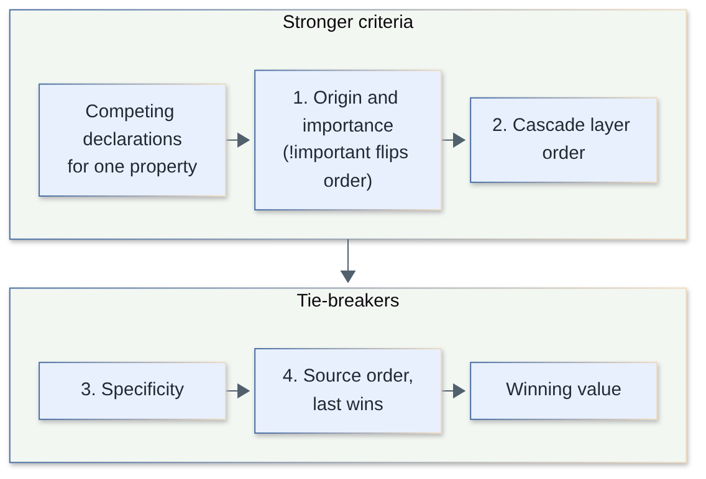
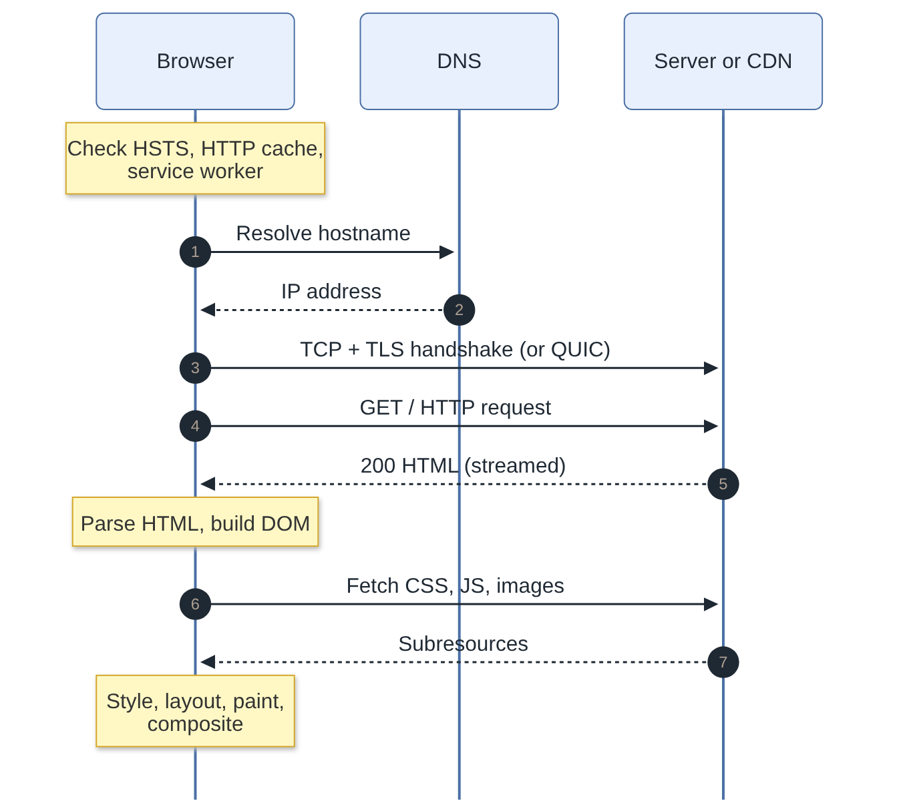
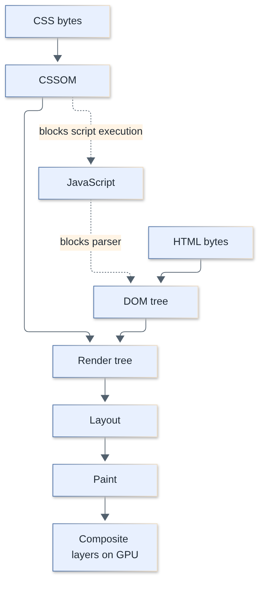
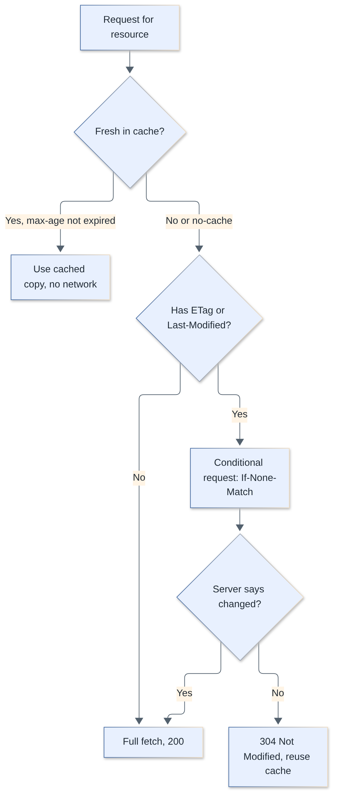
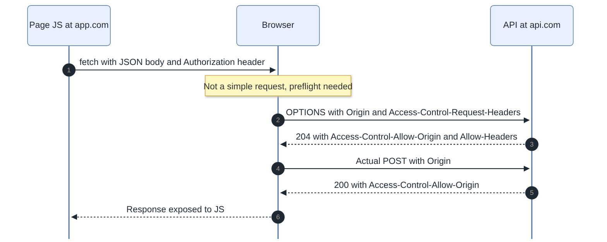
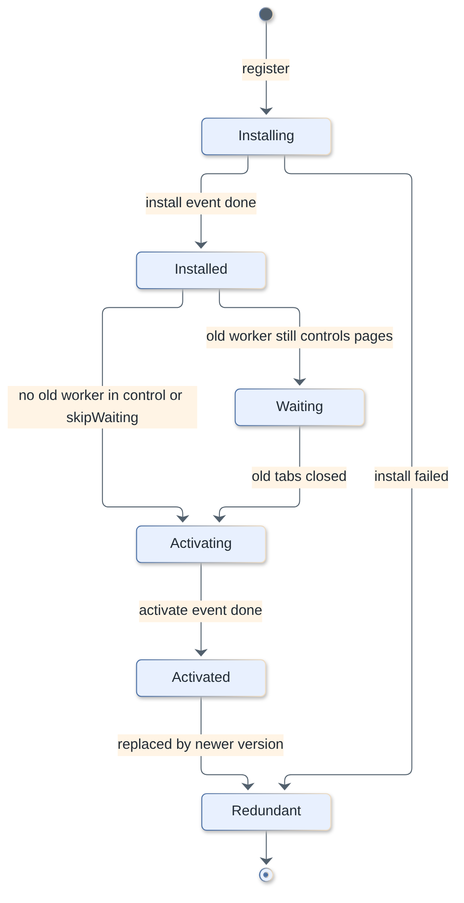
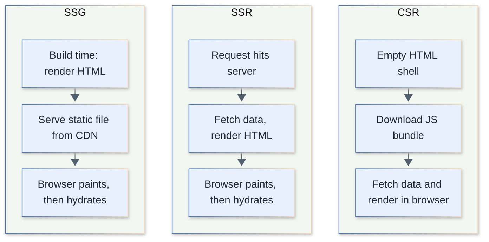

# Frontend Interview Questions

Core frontend knowledge for fullstack interviews: HTML, CSS, how the browser works, performance, storage, accessibility, security from the browser side, offline/PWA, and build tooling. Pure JavaScript language questions and React live in their own topics.

**Levels:** `🟢 Junior` · `🟡 Middle` · `🔴 Senior`

## Table of contents

1. [What is semantic HTML and why does it matter?](#1-what-is-semantic-html-and-why-does-it-matter)
2. [How do HTML forms work? What should you know about inputs and validation?](#2-how-do-html-forms-work-what-should-you-know-about-inputs-and-validation)
3. [What is the difference between script, async, defer and type="module"?](#3-what-is-the-difference-between-script-async-defer-and-typemodule)
4. [Which `<head>` tags and meta tags matter for every page?](#4-which-head-tags-and-meta-tags-matter-for-every-page)
5. [How do `srcset`, `sizes` and `<picture>` work for responsive images?](#5-how-do-srcset-sizes-and-picture-work-for-responsive-images)
6. [Explain the CSS box model and `box-sizing`.](#6-explain-the-css-box-model-and-box-sizing)
7. [What is the difference between `block`, `inline` and `inline-block`?](#7-what-is-the-difference-between-block-inline-and-inline-block)
8. [How do specificity and the cascade decide which rule wins?](#8-how-do-specificity-and-the-cascade-decide-which-rule-wins)
9. [What are CSS cascade layers (`@layer`) and when would you use them?](#9-what-are-css-cascade-layers-layer-and-when-would-you-use-them)
10. [Explain CSS `position` values.](#10-explain-css-position-values)
11. [What is a stacking context and why does `z-index` sometimes not work?](#11-what-is-a-stacking-context-and-why-does-z-index-sometimes-not-work)
12. [What is a Block Formatting Context (BFC) and how does margin collapsing work?](#12-what-is-a-block-formatting-context-bfc-and-how-does-margin-collapsing-work)
13. [Flexbox vs Grid: when do you use which?](#13-flexbox-vs-grid-when-do-you-use-which)
14. [What are the CSS units and when do you use `px`, `rem`, `em`, `%`, `vh`/`dvh`?](#14-what-are-the-css-units-and-when-do-you-use-px-rem-em--vhdvh)
15. [How do you build a responsive layout?](#15-how-do-you-build-a-responsive-layout)
16. [What are container queries and how do they differ from media queries?](#16-what-are-container-queries-and-how-do-they-differ-from-media-queries)
17. [How do you center an element horizontally and vertically?](#17-how-do-you-center-an-element-horizontally-and-vertically)
18. [What are CSS custom properties and how are they different from preprocessor variables?](#18-what-are-css-custom-properties-and-how-are-they-different-from-preprocessor-variables)
19. [What happens when you type a URL into the browser and press Enter?](#19-what-happens-when-you-type-a-url-into-the-browser-and-press-enter)
20. [What is the critical rendering path?](#20-what-is-the-critical-rendering-path)
21. [What is the difference between reflow (layout), repaint and compositing? What is layout thrashing?](#21-what-is-the-difference-between-reflow-layout-repaint-and-compositing-what-is-layout-thrashing)
22. [How do event bubbling, capturing and delegation work?](#22-how-do-event-bubbling-capturing-and-delegation-work)
23. [How does the browser main thread work, and how do you deal with long tasks?](#23-how-does-the-browser-main-thread-work-and-how-do-you-deal-with-long-tasks)
24. [What are Core Web Vitals?](#24-what-are-core-web-vitals)
25. [How does lazy loading work for images and code?](#25-how-does-lazy-loading-work-for-images-and-code)
26. [What is code splitting and how do you do it?](#26-what-is-code-splitting-and-how-do-you-do-it)
27. [How does HTTP caching work (`Cache-Control`, ETag)?](#27-how-does-http-caching-work-cache-control-etag)
28. [What are `preload`, `prefetch`, `preconnect` and `dns-prefetch`?](#28-what-are-preload-prefetch-preconnect-and-dns-prefetch)
29. [Your page has poor INP. How do you diagnose and fix it in production?](#29-your-page-has-poor-inp-how-do-you-diagnose-and-fix-it-in-production)
30. [How do you design cache busting and avoid deploy skew in a SPA or SSR app?](#30-how-do-you-design-cache-busting-and-avoid-deploy-skew-in-a-spa-or-ssr-app)
31. [Cookies vs localStorage vs sessionStorage vs IndexedDB: what's the difference?](#31-cookies-vs-localstorage-vs-sessionstorage-vs-indexeddb-whats-the-difference)
32. [What are the important cookie attributes?](#32-what-are-the-important-cookie-attributes)
33. [Where should you store authentication tokens in a browser app?](#33-where-should-you-store-authentication-tokens-in-a-browser-app)
34. [What are the accessibility basics every frontend developer should know?](#34-what-are-the-accessibility-basics-every-frontend-developer-should-know)
35. [What is ARIA and when should you (not) use it?](#35-what-is-aria-and-when-should-you-not-use-it)
36. [How do you manage focus in modals, menus and single-page app navigation?](#36-how-do-you-manage-focus-in-modals-menus-and-single-page-app-navigation)
37. [What is CORS and how does it work from the browser's side?](#37-what-is-cors-and-how-does-it-work-from-the-browsers-side)
38. [How do you defend against XSS in the browser, and what does Content Security Policy do?](#38-how-do-you-defend-against-xss-in-the-browser-and-what-does-content-security-policy-do)
39. [What is a service worker and what is its lifecycle?](#39-what-is-a-service-worker-and-what-is-its-lifecycle)
40. [What caching strategies exist for service workers and what goes wrong with updates?](#40-what-caching-strategies-exist-for-service-workers-and-what-goes-wrong-with-updates)
41. [What is a Progressive Web App?](#41-what-is-a-progressive-web-app)
42. [What are Web Components?](#42-what-are-web-components)
43. [What do bundlers like Vite and webpack do, and how do they differ?](#43-what-do-bundlers-like-vite-and-webpack-do-and-how-do-they-differ)
44. [What is tree shaking and why does it sometimes not work?](#44-what-is-tree-shaking-and-why-does-it-sometimes-not-work)
45. [CSR vs SSR vs SSG: what are the differences and trade-offs?](#45-csr-vs-ssr-vs-ssg-what-are-the-differences-and-trade-offs)
46. [What is hydration and what are its costs? What are islands and streaming?](#46-what-is-hydration-and-what-are-its-costs-what-are-islands-and-streaming)
47. [What are micro-frontends and when are they worth it?](#47-what-are-micro-frontends-and-when-are-they-worth-it)
48. [What is progressive enhancement and how does it differ from graceful degradation?](#48-what-is-progressive-enhancement-and-how-does-it-differ-from-graceful-degradation)

---

## HTML

### 1. What is semantic HTML and why does it matter?

`🟢 Junior` · `#html` `#a11y` `#seo`

Semantic HTML means choosing elements by their **meaning** (`<nav>`, `<main>`, `<button>`, `<h1>`) rather than by how they look (`<div>` and `<span>` for everything). It gives free accessibility, keyboard behavior, SEO signals and more maintainable markup.

What you get for free from semantic elements:

- **Accessibility:** screen readers expose landmarks (`<header>`, `<nav>`, `<main>`, `<footer>`), heading outline and roles. A `<button>` is focusable, activates on Enter/Space and is announced as a button. A `<div onclick>` is none of those.
- **Behavior:** `<a href>` supports middle-click, "open in new tab", prefetching; `<form>` supports Enter-to-submit and built-in validation; `<details>` gives a disclosure widget without JS.
- **SEO and tooling:** crawlers, reader mode and browser extensions use headings and landmarks.

```html
<!-- Bad -->
<div class="btn" onclick="save()">Save</div>

<!-- Good -->
<button type="button" onclick="save()">Save</button>

<header>…</header>
<nav aria-label="Primary">…</nav>
<main>
  <article>
    <h1>Title</h1>
    <section>
      <h2>Part one</h2>
    </section>
  </article>
  <aside>Related</aside>
</main>
<footer>…</footer>
```

> **Follow-up:** When is `<div>` fine? When there is no suitable semantic element and you need a generic container for layout or styling.

[↑ Back to top](#table-of-contents)

### 2. How do HTML forms work? What should you know about inputs and validation?

`🟢 Junior` · `#html` `#forms`

A `<form>` collects named controls and submits them to `action` using `method` (GET puts fields in the query string, POST in the body). Every control needs a `name` to be submitted and a `<label>` to be usable.

```html
<form action="/signup" method="post" novalidate>
  <label for="email">Email</label>
  <input id="email" name="email" type="email" required autocomplete="email" />

  <label>
    Age
    <input name="age" type="number" min="18" max="120" />
  </label>

  <label for="pw">Password</label>
  <input id="pw" name="pw" type="password" minlength="8" required
         autocomplete="new-password" />

  <button type="submit">Create account</button>
</form>
```

Key points:

- **Labels:** `for`/`id` or wrapping. Clicking the label focuses the control; screen readers announce it. Placeholder is **not** a label.
- **Input types** (`email`, `tel`, `number`, `date`, `url`) change the mobile keyboard and enable built-in validation. Use `inputmode` and `autocomplete` to improve UX.
- **Constraint validation:** `required`, `pattern`, `min`/`max`, `minlength`. Read state via `input.validity` and `form.checkValidity()`; style with `:user-invalid` / `:invalid`.
- **Always validate on the server too.** Client-side validation is UX, not security.
- `<button>` inside a form defaults to `type="submit"`; use `type="button"` for non-submit buttons.
- `FormData` lets you read a form in JS: `new FormData(form)`.

> **Follow-up:** `GET` vs `POST`? GET is idempotent and cacheable, data is visible in the URL; POST is for state changes and larger bodies.

[↑ Back to top](#table-of-contents)

### 3. What is the difference between script, async, defer and type="module"?

`🟡 Middle` · `#html` `#performance` `#loading`

A plain `<script src>` blocks HTML parsing while it downloads and executes. `defer` downloads in parallel and runs after parsing, in order. `async` downloads in parallel and runs as soon as it arrives, in any order. Module scripts are deferred by default.

| | Download | Execution | Order preserved | Waits for DOM parse |
|---|---|---|---|---|
| `<script>` | blocks parser | immediately | yes | no (blocks) |
| `async` | parallel | as soon as downloaded (pauses parser) | no | no |
| `defer` | parallel | after parsing, before `DOMContentLoaded` | yes | yes |
| `type="module"` | parallel | like `defer` | dependency order | yes |
| `module` + `async` | parallel | as soon as module graph is ready | no | no |

```html
<!-- Analytics: independent, order does not matter -->
<script async src="/analytics.js"></script>

<!-- App code that needs the DOM and ordering -->
<script defer src="/vendor.js"></script>
<script defer src="/app.js"></script>

<script type="module" src="/main.js"></script>
```

Gotchas:

- `async`/`defer` have no effect on **inline** classic scripts.
- `async` scripts can run before or after `DOMContentLoaded`, so they must not depend on other scripts.
- Put scripts in `<head>` with `defer` rather than at the end of `<body>`: the browser discovers and starts downloading them earlier.
- Module scripts are strict mode, have their own scope, and are fetched with CORS.

> **Follow-up:** Does `defer` delay `DOMContentLoaded`? Yes, it fires after deferred scripts have executed; `async` scripts do not delay it.

[↑ Back to top](#table-of-contents)

### 4. Which `<head>` tags and meta tags matter for every page?

`🟢 Junior` · `#html` `#meta` `#seo`

At minimum: `<!doctype html>` (standards mode), `<meta charset="utf-8">`, the viewport meta tag, a `<title>`, and a meta description. Social/OG tags and canonical links are added for sharing and SEO.

```html
<!doctype html>
<html lang="en">
<head>
  <meta charset="utf-8" />
  <meta name="viewport" content="width=device-width, initial-scale=1" />
  <title>Product name - Brand</title>
  <meta name="description" content="One-sentence summary shown in search results." />
  <link rel="canonical" href="https://example.com/product" />
  <meta property="og:title" content="Product name" />
  <meta property="og:image" content="https://example.com/og.png" />
  <meta name="theme-color" content="#0b5fff" />
  <link rel="icon" href="/favicon.svg" type="image/svg+xml" />
</head>
```

- **Doctype:** without it browsers use *quirks mode* with legacy box model behaviors.
- **charset:** must appear within the first 1024 bytes; otherwise text may be decoded wrongly.
- **viewport:** without it mobile browsers render at ~980px and scale down. Avoid `user-scalable=no` / `maximum-scale=1`, which breaks zoom accessibility.
- **`lang` on `<html>`:** drives screen-reader pronunciation, hyphenation and translation prompts.
- `robots` meta (`noindex`) controls indexing per page.

[↑ Back to top](#table-of-contents)

### 5. How do `srcset`, `sizes` and `<picture>` work for responsive images?

`🟡 Middle` · `#html` `#images` `#performance`

`srcset` gives the browser a list of candidates with their widths (or pixel densities) and `sizes` says how wide the image will be displayed; the browser picks the best file. `<picture>` is for **art direction** and format fallbacks, where you decide which source is used.

```html
<!-- Resolution switching: same crop, different widths -->


<!-- Art direction + modern formats -->
<picture>
  <source media="(max-width: 600px)" srcset="/img/hero-square.avif" type="image/avif" />
  <source srcset="/img/hero-wide.avif" type="image/avif" />
  <source srcset="/img/hero-wide.webp" type="image/webp" />
  
</picture>
```

- `w` descriptors + `sizes`: the browser knows the layout width and device pixel ratio, so it chooses. `sizes` is evaluated before CSS loads, so it must describe layout honestly.
- Always set `width` and `height` (or CSS `aspect-ratio`) to reserve space and avoid layout shift.
- Order of `<source>` elements matters: the first match wins.
- Always provide `alt` (empty `alt=""` for decorative images).

> **Follow-up:** Which format? AVIF/WebP for photos with a JPEG fallback, SVG for icons and logos; serve via an image CDN that negotiates format with the `Accept` header.

[↑ Back to top](#table-of-contents)

## CSS

### 6. Explain the CSS box model and `box-sizing`.

`🟢 Junior` · `#css` `#layout`

Every element is a box made of **content, padding, border and margin** (inside out). With the default `box-sizing: content-box`, `width` applies to the content only; with `border-box`, `width` includes padding and border.

```css
.card { width: 300px; padding: 20px; border: 2px solid; }
/* content-box: total width = 300 + 40 + 4 = 344px */
/* border-box:  total width = 300px, content shrinks to 256px */

*, *::before, *::after { box-sizing: border-box; } /* common reset */
```

- Padding is inside the background; margin is outside and transparent.
- Vertical margins between block siblings can **collapse** (see question 12). Padding never collapses.
- Percent padding/margin resolve against the containing block's **width**, even vertically.
- `outline` does not take space; `box-shadow` does not affect layout.

[↑ Back to top](#table-of-contents)

### 7. What is the difference between `block`, `inline` and `inline-block`?

`🟢 Junior` · `#css` `#layout`

`block` starts on a new line and fills the available width; `inline` flows within text and ignores `width`/`height` and vertical margin; `inline-block` flows inline but accepts width, height and all margins/padding.

| | New line | Width/height | Vertical margin | Example |
|---|---|---|---|---|
| `block` | yes | yes | yes | `div`, `p`, `h1` |
| `inline` | no | ignored | ignored (padding paints but does not push) | `span`, `a`, `strong` |
| `inline-block` | no | yes | yes | `button`, `img` (replaced) |
| `none` | removed from layout and a11y tree | - | - | - |

Related: `display: none` removes the box from layout and the accessibility tree; `visibility: hidden` keeps the space but hides it; `opacity: 0` keeps it interactive and in the a11y tree. Modern layouts mostly use `flex` and `grid` instead of `inline-block` hacks, and `display: contents` removes the box but keeps children.

[↑ Back to top](#table-of-contents)

### 8. How do specificity and the cascade decide which rule wins?

`🟡 Middle` · `#css` `#cascade`

The browser picks a winner per property by comparing: **origin and `!important`**, then **cascade layer**, then **specificity**, then **source order** (last wins). Specificity is a tuple: inline style, IDs, classes/attributes/pseudo-classes, elements/pseudo-elements.



```css
p                  { color: black; }  /* 0,0,0,1 */
.note              { color: blue; }   /* 0,0,1,0 */
p.note             { color: green; }  /* 0,0,1,1 */
#intro .note       { color: red; }    /* 0,1,1,0 */
/* inline style="color: pink" beats all of them without !important */
```

Details people get wrong:

- Specificity is compared left to right, not summed: 11 classes never beat 1 ID.
- `:is()`, `:not()`, `:has()` take the specificity of their **most specific argument**; `:where()` always contributes **zero**, ideal for resetting/defaults.
- `*`, combinators and `:where()` add nothing.
- **Inheritance** is separate from the cascade: inherited properties (`color`, `font-*`) pass to children only if no rule targets the child. `inherit`, `initial`, `unset`, `revert` control it explicitly.
- `!important` should be a last resort: it flips layer/origin order and forces future overrides into more `!important`.

Practical rule: keep specificity low and flat (single classes, BEM or CSS modules), and use layers or `:where()` to manage override order.

[↑ Back to top](#table-of-contents)

### 9. What are CSS cascade layers (`@layer`) and when would you use them?

`🟡 Middle` · `#css` `#cascade` `#architecture`

`@layer` lets you declare named groups of styles whose priority is decided by **layer order**, before specificity is even considered. They solve "third-party CSS or a reset beats my styles because of specificity".

```css
@layer reset, vendor, components, utilities;   /* order = priority, last is highest */

@layer reset      { * { margin: 0; } }
@layer vendor     { .btn { background: gray; } }
@layer components { button { background: royalblue; } }   /* wins over .btn, despite lower specificity */
@layer utilities  { .hidden { display: none; } }

/* Import third-party CSS into a layer */
@import url("lib.css") layer(vendor);
```

Rules:

- A later layer beats an earlier one regardless of selector specificity.
- **Unlayered styles beat all layered styles** (for normal declarations), so "legacy" CSS stays on top unless you layer it too.
- `!important` **reverses** layer order: an `!important` in an earlier layer beats one in a later layer, and layered important beats unlayered important.
- Nested layers: `@layer framework.base { }`.

Typical use: wrap a design system, Tailwind-style utilities or vendor CSS so app styles can override them without specificity wars. Gotcha: forgetting that unlayered code wins can make a newly layered stylesheet seem "broken".

[↑ Back to top](#table-of-contents)

### 10. Explain CSS `position` values.

`🟢 Junior` · `#css` `#layout`

`position` decides how an element is placed relative to normal flow: `static` (default), `relative`, `absolute`, `fixed`, `sticky`.

| Value | In flow? | Offsets relative to |
|---|---|---|
| `static` | yes | ignored |
| `relative` | yes (space kept) | its own normal position; becomes anchor for absolute children |
| `absolute` | no | nearest **positioned** ancestor (or the initial containing block) |
| `fixed` | no | the viewport (unless an ancestor has `transform`, `filter`, etc.) |
| `sticky` | yes | scroll container; acts relative until a threshold, then sticks |

```css
.badge-wrap { position: relative; }
.badge      { position: absolute; top: -8px; right: -8px; }

.header     { position: sticky; top: 0; }  /* needs a threshold */
```

Gotchas: `sticky` fails if an ancestor has `overflow: hidden/auto` (it sticks inside that scroll container) or if the parent is too short; a `transform` on an ancestor makes `fixed` children position relative to that ancestor; positioned elements participate in stacking via `z-index`.

[↑ Back to top](#table-of-contents)

### 11. What is a stacking context and why does `z-index` sometimes not work?

`🟡 Middle` · `#css` `#z-index`

A stacking context is an isolated 3D layering scope. `z-index` only compares siblings **within the same stacking context**; a child can never escape its parent's context, so `z-index: 9999` inside a low-level context still sits below a higher sibling context.

A new stacking context is created by, among others:

- the root `<html>`
- `position: relative|absolute` with `z-index` other than `auto`; `position: fixed|sticky`
- `opacity` below 1, `transform`, `filter`, `perspective`, `clip-path`, `mask`
- `isolation: isolate`, `mix-blend-mode` other than normal, `will-change` for those properties
- `contain: layout|paint`; flex/grid children with `z-index` other than `auto`

```html
<div style="position:relative; z-index:1">   <!-- context A -->
  <div style="position:absolute; z-index:9999">Modal?</div>
</div>
<div style="position:relative; z-index:2">   <!-- context B, paints above everything in A -->
  Content
</div>
```

Debugging: find the ancestor that accidentally created a context (often `transform` or `opacity` for an animation). Fixes: render modals/tooltips in a portal at the end of `<body>`, use `isolation: isolate` on component roots to contain their z-indexes, and use a small, named z-index scale (CSS variables) instead of arbitrary numbers. The native `<dialog>` and Popover API use the **top layer**, which sits above all stacking contexts.

[↑ Back to top](#table-of-contents)

### 12. What is a Block Formatting Context (BFC) and how does margin collapsing work?

`🔴 Senior` · `#css` `#layout` `#bfc`

A BFC is a region where block boxes are laid out independently: floats are contained inside it, margins do not collapse across its boundary, and it does not overlap floats. **Margin collapsing** is the rule that adjoining vertical margins of block boxes in the same BFC merge into one (the larger wins, or sum for positive/negative mixes).

Margins collapse between:

1. adjacent siblings,
2. a parent and its first/last child when nothing (padding, border, clearance, BFC) separates them,
3. an empty block's own top and bottom margins.

```css
/* Parent margin "leaks" through: child's margin-top collapses with the parent's */
.parent { background: #eee; }
.child  { margin-top: 40px; }       /* parent appears shifted 40px, not child inside it */

/* Fixes: create a BFC or separate the margins */
.parent { display: flow-root; }     /* cleanest way to create a BFC */
/* or padding-top: 1px, border, overflow: auto, display: flex/grid on parent */
```

Elements that establish a BFC: root, floats, absolutely positioned boxes, `display: inline-block`, `flow-root`, `flex`/`grid` items' contents (they form independent formatting contexts), `overflow` other than `visible`, `contain: layout|content|paint`.

Production gotchas:

- The old clearfix and `overflow: hidden` hacks to contain floats work because they create a BFC; `overflow: hidden` clips shadows and focus rings, so prefer `display: flow-root`.
- Margins **never collapse** in flex and grid containers, which is a common surprise when migrating a layout from block to flex (spacing suddenly doubles).
- Modern spacing is cleaner with `gap` or a "stack" pattern that uses one-direction margins, avoiding collapse reasoning altogether.
- A float next to a BFC box: the BFC box will not wrap under the float, a classic two-column trick that predates flexbox.

> **Follow-up:** Do horizontal margins collapse? No, only vertical (block-axis) margins do.

[↑ Back to top](#table-of-contents)

### 13. Flexbox vs Grid: when do you use which?

`🟡 Middle` · `#css` `#layout` `#flexbox` `#grid`

**Flexbox is one-dimensional** (a row or a column; content drives size) and **Grid is two-dimensional** (rows and columns together; layout drives content). Use flex for components (nav bars, button groups, centering), grid for page and card-grid layouts. They combine well.

| | Flexbox | Grid |
|---|---|---|
| Dimensions | 1D | 2D |
| Sizing approach | content-out | layout-in (tracks defined first) |
| Alignment | main/cross axis | both axes on cells and the whole grid |
| Overlap/placement | limited | explicit placement, named areas, overlap |
| Wrapping | `flex-wrap`, rows don't align with each other | rows and columns stay aligned |
| Typical use | toolbars, inline groups, vertical centering | page layout, dashboards, galleries |

```css
/* Flex: space items, let one grow */
.toolbar { display: flex; gap: 8px; align-items: center; }
.toolbar .spacer { flex: 1; }

/* Grid: responsive card grid with no media queries */
.cards {
  display: grid;
  grid-template-columns: repeat(auto-fill, minmax(240px, 1fr));
  gap: 16px;
}

/* Grid: named areas */
.page {
  display: grid;
  grid-template-areas: "header header" "sidebar main" "footer footer";
  grid-template-columns: 240px 1fr;
}
```

Gotchas:

- Flex items have `min-width: auto`, so long content refuses to shrink. Fix with `min-width: 0` (or `overflow: hidden`) on the item. Same for grid `1fr` columns; use `minmax(0, 1fr)`.
- `flex: 1` is `1 1 0%`; `flex: auto` is `1 1 auto`.
- `auto-fill` keeps empty tracks; `auto-fit` collapses them.
- Subgrid (`grid-template-columns: subgrid`) lets nested grids align to the parent's tracks.

[↑ Back to top](#table-of-contents)

### 14. What are the CSS units and when do you use `px`, `rem`, `em`, `%`, `vh`/`dvh`?

`🟢 Junior` · `#css` `#units`

Use `rem` for type and spacing that should respect the user's font-size setting, `px` for hairlines and borders, `%`/`fr` for fluid layout, `em` for sizes relative to the component's own font size, and viewport units for full-screen sections.

| Unit | Relative to | Use |
|---|---|---|
| `px` | CSS pixel (not device pixel) | borders, shadows |
| `rem` | root font size | typography, spacing, media queries |
| `em` | current element's font size (compounds when nested) | padding on buttons that scale with font |
| `%` | depends on property (parent width for `width`; parent height needs a definite height) | fluid widths |
| `vw`/`vh` | 1% of viewport width/height | hero sections |
| `dvh`/`svh`/`lvh` | dynamic/small/large viewport height | mobile browsers where the URL bar resizes the viewport |
| `ch` | width of the "0" glyph | readable line length: `max-width: 65ch` |
| `fr` | fraction of free grid space | grid tracks |

```css
html { font-size: 100%; }            /* respect user preference, don't set 62.5% hacks lightly */
.hero { min-height: 100dvh; }        /* 100vh overflows behind the mobile URL bar */
h1 { font-size: clamp(1.75rem, 1rem + 3vw, 3rem); }  /* fluid type */
```

Gotchas: `em` compounds through nesting; `100vh` on mobile includes area hidden by browser UI (use `dvh`/`svh`); media queries in `px` ignore user font-size changes while `em`/`rem` media queries respect them.

[↑ Back to top](#table-of-contents)

### 15. How do you build a responsive layout?

`🟡 Middle` · `#css` `#responsive`

Start mobile-first with a fluid layout, add the viewport meta tag, and use media queries only where the design actually breaks. Prefer intrinsic techniques (`flex-wrap`, `grid auto-fit`, `clamp()`, `min()`) that adapt without breakpoints.

```css
/* Mobile-first: base styles for small screens */
.layout { display: grid; gap: 1rem; padding: 1rem; }

@media (min-width: 48em) {                /* ~768px at default font size */
  .layout { grid-template-columns: 240px 1fr; }
}

img { max-width: 100%; height: auto; }

/* Respect user preferences, not just size */
@media (prefers-reduced-motion: reduce) { * { animation: none !important; } }
@media (prefers-color-scheme: dark)     { :root { color-scheme: dark; } }
@media (hover: hover) and (pointer: fine) { .menu:hover { display: block; } }
```

Checklist:

- `<meta name="viewport" content="width=device-width, initial-scale=1">`.
- Mobile-first (`min-width`) keeps base CSS simple; desktop-first (`max-width`) forces overrides.
- Choose breakpoints by content, not by device names.
- Fluid typography and spacing with `clamp()`.
- Responsive images (`srcset`), `aspect-ratio`, and tap targets of at least ~44px.
- Test with real devices; capability queries (`hover`, `pointer`) beat width guesses for touch vs mouse.
- For component-level responsiveness, see container queries (next question).

[↑ Back to top](#table-of-contents)

### 16. What are container queries and how do they differ from media queries?

`🟡 Middle` · `#css` `#responsive` `#components`

Media queries respond to the **viewport**; container queries respond to the **size of an ancestor container**. That makes a component adapt to where it is placed (sidebar vs main column) rather than to the screen.

```css
.card-wrap {
  container-type: inline-size;   /* establishes a size container */
  container-name: card;
}

.card { display: grid; gap: 8px; }

@container card (min-width: 400px) {
  .card { grid-template-columns: 120px 1fr; }   /* horizontal layout when there is room */
}

.title { font-size: clamp(1rem, 4cqi, 1.5rem); } /* cq units: relative to the container */
```

Key points:

- A container must opt in with `container-type` (`inline-size` is the common choice). Queries target the nearest matching ancestor, never the element itself.
- `container-type: inline-size` applies containment: the container can't size itself from its content's inline size, which can cause "collapsed to zero width" surprises.
- Units: `cqw`, `cqi`, `cqh`, etc.
- Use media queries for global concerns (page layout, user preferences) and container queries for reusable components in design systems.
- Check current browser support (including style queries, which are less widely supported than size queries) before relying on newer features.

[↑ Back to top](#table-of-contents)

### 17. How do you center an element horizontally and vertically?

`🟢 Junior` · `#css` `#layout`

The shortest modern way is `display: grid; place-items: center` on the parent. Flexbox with `justify-content` and `align-items` also works.

```css
.parent-grid { display: grid; place-items: center; min-height: 100vh; }

.parent-flex { display: flex; justify-content: center; align-items: center; }

/* Block with known width, horizontal only */
.box { width: 600px; margin-inline: auto; }

/* Absolute centering without knowing size */
.abs { position: absolute; inset: 0; margin: auto; width: 200px; height: 100px; }
/* or */
.abs2 { position: absolute; top: 50%; left: 50%; transform: translate(-50%, -50%); }

/* Text */
.text { text-align: center; }
```

Note: `margin: auto` centers vertically in flex/grid containers too, and the `transform` trick can blur text on subpixel positions.

[↑ Back to top](#table-of-contents)

### 18. What are CSS custom properties and how are they different from preprocessor variables?

`🟡 Middle` · `#css` `#variables` `#theming`

Custom properties (`--name`) are real runtime values that participate in the cascade and inheritance and can be changed with JS or media queries. Sass/Less variables are replaced at **compile time** and don't exist in the browser.

```css
:root {
  --bg: #fff;
  --fg: #111;
  --space: 8px;
}
@media (prefers-color-scheme: dark) {
  :root { --bg: #111; --fg: #eee; }
}
body { background: var(--bg); color: var(--fg); padding: calc(var(--space) * 2); }
.btn { --btn-bg: royalblue; background: var(--btn-bg, gray); } /* fallback */
```

```js
document.documentElement.style.setProperty('--space', '12px');
getComputedStyle(el).getPropertyValue('--space');
```

- Scoped per element: override on `.card` and all descendants change. This enables theming and component APIs.
- Inherited by default; can be typed and animated with `@property` (syntax, inherits, initial-value).
- Invalid values are only discovered at use time ("invalid at computed-value time"), so typos silently fall back to `unset`.
- Can't be used in media query conditions or as selectors.

[↑ Back to top](#table-of-contents)

## Browser internals

### 19. What happens when you type a URL into the browser and press Enter?

`🟡 Middle` · `#browser` `#networking`

The browser resolves the URL, finds the server (DNS), opens a secure connection (TCP + TLS, or QUIC for HTTP/3), sends an HTTP request, streams the HTML response, parses it into the DOM while discovering subresources, and then runs style, layout, paint and composite to show pixels.



Step by step:

1. **Input parsing:** search query vs URL; HSTS list may upgrade `http` to `https`.
2. **Caches:** service worker, HTTP cache, DNS cache, existing connections (connection reuse).
3. **DNS:** browser cache, OS cache, resolver, recursive lookup. Returns IPs (A/AAAA).
4. **Connection:** TCP handshake, TLS handshake (certificate validation, ALPN negotiates HTTP/2 or HTTP/3). HTTP/3 uses QUIC over UDP with built-in TLS 1.3.
5. **Request:** `GET / HTTP/…` with cookies, `Accept`, etc. May hit a CDN edge, load balancer, then app server; redirects (301/302) restart parts of this.
6. **Response:** status, headers, HTML body streamed. The parser starts before the full document arrives.
7. **Parsing and subresources:** build the DOM; the preload scanner finds CSS/JS/images early. CSS builds the CSSOM; synchronous scripts block the parser.
8. **Render:** render tree, layout, paint, composite (see next question). `DOMContentLoaded` fires after parsing (and deferred scripts); `load` after all resources.
9. **After load:** JS runs, fetches data, hydrates, lazy-loads.

> **Follow-up:** How do you speed it up? CDN, `preconnect`, HTTP caching, compression (Brotli), smaller critical CSS, early hints, avoiding redirects.

[↑ Back to top](#table-of-contents)

### 20. What is the critical rendering path?

`🟡 Middle` · `#browser` `#rendering` `#performance`

It is the sequence the browser follows to turn HTML, CSS and JS into pixels: build the DOM and CSSOM, combine them into a render tree, run layout, paint, and composite. Optimizing it means getting the first meaningful paint sooner by shrinking and unblocking the resources it depends on.



- **DOM:** incremental, built as HTML streams in.
- **CSSOM:** CSS is **render-blocking**: the browser won't paint until it has the CSS it needs (to avoid a flash of unstyled content).
- **JS:** a classic `<script>` is **parser-blocking**, and it also waits for pending CSS because the script might read styles. Hence CSS before JS and `defer`/`async` for scripts.
- **Render tree:** only visible nodes (`display: none` excluded, `visibility: hidden` included).
- **Layout:** compute geometry. **Paint:** produce draw commands for layers. **Composite:** GPU combines layers.

Optimizations:

- Inline small critical CSS, load the rest non-blocking (`media` trick or `rel=preload` as style).
- Minify, compress (Brotli/gzip), remove unused CSS and JS.
- `defer` scripts, avoid synchronous third-party tags in `<head>`.
- Preload key resources (LCP image, fonts), `preconnect` to critical origins.
- Reduce the number of critical round trips and bytes before first render.

[↑ Back to top](#table-of-contents)

### 21. What is the difference between reflow (layout), repaint and compositing? What is layout thrashing?

`🟡 Middle` · `#browser` `#rendering` `#performance`

**Reflow** recomputes element geometry, **repaint** redraws pixels, **compositing** only moves/blends already painted layers on the GPU. Changing a layout property (`width`, `top`) triggers layout, paint and composite; changing a paint-only property (`color`, `background`) skips layout; changing `transform` or `opacity` can be compositor-only, which is why animations should use them.

| Change | Layout | Paint | Composite |
|---|---|---|---|
| `width`, `height`, `margin`, `top`, `font-size`, DOM insert | yes | yes | yes |
| `color`, `background`, `box-shadow`, `visibility` | no | yes | yes |
| `transform`, `opacity` (on own layer) | no | no | yes |

**Layout thrashing** happens when you interleave DOM writes and layout-reading properties in a loop; each read forces the browser to synchronously recalculate layout.

```js
// Bad: read, write, read, write... forces layout every iteration
items.forEach(el => {
  el.style.width = el.parentElement.offsetWidth / 2 + 'px';
});

// Good: batch reads, then writes
const widths = items.map(el => el.parentElement.offsetWidth);
items.forEach((el, i) => { el.style.width = widths[i] / 2 + 'px'; });
```

Properties that force layout when read: `offsetWidth/Height`, `clientWidth`, `getBoundingClientRect()`, `scrollTop`, `getComputedStyle(...)` for layout-dependent values.

Other tips: animate `transform`/`opacity`, batch DOM changes with `DocumentFragment` or class toggles, use `requestAnimationFrame` for visual updates, `content-visibility: auto` and `contain` to limit layout scope, and `will-change` sparingly (every layer costs memory).

[↑ Back to top](#table-of-contents)

### 22. How do event bubbling, capturing and delegation work?

`🟢 Junior` · `#browser` `#dom` `#events`

An event goes through three phases: **capture** (window down to the target), **target**, then **bubble** (back up to window). Event delegation attaches one listener to a parent and uses `event.target` to handle many children, including ones added later.

```js
list.addEventListener('click', (e) => {
  const item = e.target.closest('li[data-id]');   // closest handles clicks on nested children
  if (!item || !list.contains(item)) return;
  console.log('clicked', item.dataset.id);
});

el.addEventListener('click', handler, { capture: true });  // capture phase
el.addEventListener('scroll', onScroll, { passive: true }); // promise not to preventDefault
el.addEventListener('click', once, { once: true });
```

- `e.target` is the element that started the event; `e.currentTarget` is the element the listener is on.
- `stopPropagation()` stops further propagation; `stopImmediatePropagation()` also stops other listeners on the same element; `preventDefault()` cancels default behavior (not propagation).
- Some events don't bubble (`focus`, `blur`, `mouseenter`); use `focusin`/`focusout` for delegation.
- Delegation saves memory and handles dynamic content, but it is poor for events you need to stop early or that do not bubble.
- `passive: true` lets the browser scroll without waiting for your handler, improving scroll performance and INP.

[↑ Back to top](#table-of-contents)

### 23. How does the browser main thread work, and how do you deal with long tasks?

`🔴 Senior` · `#browser` `#performance` `#event-loop`

Most page work runs on **one main thread**: JS execution, style, layout, paint preparation and input handling are all queued on it. Any task that runs longer than ~50ms is a **long task**; it delays input handling and rendering and directly hurts INP.

Each frame (~16.7ms at 60Hz) the event loop may run: tasks (timers, events, network callbacks), microtasks (promises) after each task, then, if it's time to render, `requestAnimationFrame` callbacks, style, layout, paint. A busy task blocks all of it.

Strategies:

1. **Do less:** avoid unnecessary re-renders, large DOM (thousands of nodes), expensive selectors, heavy JSON parsing at startup.
2. **Break up work** and yield so input can be processed:

```js
// Yield to the event loop between chunks
const yieldToMain = () => new Promise(r => setTimeout(r, 0));

async function processAll(items) {
  let last = performance.now();
  for (const item of items) {
    process(item);
    if (performance.now() - last > 40) {   // keep tasks under ~50ms
      await yieldToMain();
      last = performance.now();
    }
  }
}
```

   Newer scheduling APIs (`scheduler.yield()`, `scheduler.postTask()`, `isInputPending()`) exist in some browsers; feature-detect and fall back to `setTimeout`/`MessageChannel`.
3. **Move off the main thread:** Web Workers for parsing, compression, search indexing, crypto; OffscreenCanvas for rendering. Cost: structured-clone copying (use `Transferable` objects) and no DOM access.
4. **Defer non-critical work:** `requestIdleCallback` (not available in all browsers), lazy init after first paint, code splitting.
5. **Virtualize** long lists; use `content-visibility: auto`.

Production gotchas:

- Microtask loops (`await` chains that never yield to a macrotask) still starve rendering.
- Third-party scripts (tags, chat widgets, A/B testing) are a top source of long tasks; load them late or in a worker approach (e.g. Partytown-like) and measure with the Long Tasks / Long Animation Frames data in RUM.
- Workers are not free: spawn cost, messaging overhead, and debugging complexity. Measure before moving work.
- Hydration of a big SSR page is one long task unless split (see question 46).

> **Follow-up:** Why does `setTimeout(fn, 0)` not run immediately? It queues a task after current work, and nested timers are clamped to a minimum delay (about 4ms) in browsers.

[↑ Back to top](#table-of-contents)

## Web performance

### 24. What are Core Web Vitals?

`🟡 Middle` · `#performance` `#cwv`

Core Web Vitals are Google's field-measured user-experience metrics: **LCP** (loading), **INP** (responsiveness) and **CLS** (visual stability). They are assessed at the **75th percentile** of real user page loads, separately for mobile and desktop.

| Metric | Measures | Good | Poor |
|---|---|---|---|
| **LCP** Largest Contentful Paint | when the largest visible element (image, hero text block) renders | ≤ 2.5 s | > 4 s |
| **INP** Interaction to Next Paint | latency of interactions (click, tap, key) across the page visit, reported as roughly the worst one | ≤ 200 ms | > 500 ms |
| **CLS** Cumulative Layout Shift | unexpected layout movement | ≤ 0.1 | > 0.25 |

INP replaced FID (First Input Delay), which only measured the delay before the first interaction's handler started; INP covers all interactions and includes processing and presentation time.

How to improve:

- **LCP:** fast TTFB (CDN, caching, SSR/SSG), preload/`fetchpriority="high"` the LCP image, do **not** lazy-load it, right-sized modern image formats, avoid render-blocking CSS/JS, avoid client-only rendering of the hero.
- **INP:** shorter tasks, less JS, yield to main, debounce heavy handlers, avoid forced layouts, virtualize long lists, keep the DOM small.
- **CLS:** `width`/`height` or `aspect-ratio` on media, reserve space for ads/embeds/banners, `font-display` with size-adjusted fallbacks, animate with `transform`, don't insert content above existing content.

Measure: **field data** via CrUX/RUM (`web-vitals` library, PageSpeed Insights) is what counts; **lab data** (Lighthouse, DevTools) is for debugging.

[↑ Back to top](#table-of-contents)

### 25. How does lazy loading work for images and code?

`🟢 Junior` · `#performance` `#images` `#loading`

Lazy loading defers loading something until it is needed. For images and iframes, add `loading="lazy"`; for JS, use dynamic `import()`. Never lazy-load above-the-fold content, especially the LCP image.

```html

<iframe src="https://example.com/embed" loading="lazy" title="Embedded map"></iframe>

<!-- LCP image: do the opposite -->

```

```js
// Lazy-load code on interaction
button.addEventListener('click', async () => {
  const { openEditor } = await import('./editor.js');
  openEditor();
});

// Custom lazy loading with IntersectionObserver
const io = new IntersectionObserver((entries) => {
  for (const e of entries) if (e.isIntersecting) { load(e.target); io.unobserve(e.target); }
}, { rootMargin: '200px' });
```

- Always reserve space (`width`/`height`) to avoid layout shift when lazy content appears.
- `rootMargin` (and the browser's built-in distance threshold) starts loading slightly before the element is visible.
- Lazy images need a non-JS path for SEO: native `loading="lazy"` is crawlable; JS-only `data-src` swaps may not be.

[↑ Back to top](#table-of-contents)

### 26. What is code splitting and how do you do it?

`🟡 Middle` · `#performance` `#bundling`

Code splitting breaks one big bundle into smaller chunks loaded on demand, so users download only what the current page needs. Bundlers create split points at dynamic `import()` calls and for shared/vendor code.

```js
// Route-based splitting (framework-agnostic)
const routes = {
  '/settings': () => import('./pages/settings.js'),
  '/reports':  () => import('./pages/reports.js'),
};
async function navigate(path) {
  const page = await routes[path]();
  page.render(document.querySelector('#app'));
}
```

Approaches:

- **Route-based:** the best default; one chunk per page.
- **Component-based:** heavy widgets (charts, editors, maps, markdown) loaded on demand or when visible.
- **Vendor/shared chunks:** stable libraries get their own long-cached file so app deploys don't invalidate them.
- **Prefetch:** once the main work is done, prefetch likely next routes (`<link rel="prefetch">`, bundler magic comments, or on link hover/visibility).

Trade-offs and gotchas:

- Too many tiny chunks create request waterfalls; each lazy chunk delays the interaction that needs it. Watch the **import chain**: A imports B imports C sequentially. Preload known-needed chunks (`modulepreload`).
- Loading states and error handling are needed (chunk load fails after a deploy, see question 30).
- Check results with a bundle analyzer; the biggest wins are usually replacing a heavy dependency (moment, lodash full import) rather than splitting it.
- HTTP/2 and HTTP/3 multiplexing reduce the cost of many files, but not the cost of waterfalls.

[↑ Back to top](#table-of-contents)

### 27. How does HTTP caching work (`Cache-Control`, ETag)?

`🟡 Middle` · `#performance` `#caching` `#http`

Responses carry `Cache-Control` telling the browser (and CDNs) how long they're **fresh**. Once stale, the browser **revalidates** with a conditional request (`If-None-Match` + `ETag`, or `If-Modified-Since`) and the server answers `304 Not Modified` without a body if nothing changed.



| Header/directive | Meaning |
|---|---|
| `max-age=N` | fresh for N seconds in any cache |
| `s-maxage=N` | like `max-age` but for shared caches (CDN) |
| `no-cache` | may store, but **must revalidate** before use |
| `no-store` | do not store at all (sensitive data) |
| `public` / `private` | shared caches allowed / only the browser |
| `immutable` | will not change during freshness, skip revalidation on reload |
| `stale-while-revalidate=N` | serve stale instantly while refreshing in the background |
| `Vary: Accept-Encoding` | cache key also depends on those request headers |

Common recipes:

```http
# Hashed static assets (app.3f9c2a.js)
Cache-Control: public, max-age=31536000, immutable

# HTML document: always check, cheap 304s
Cache-Control: no-cache

# Private API data
Cache-Control: private, max-age=0, must-revalidate

# CDN-cached page, quickly refreshed
Cache-Control: public, s-maxage=60, stale-while-revalidate=300
```

Gotchas: `no-cache` does not mean "don't cache"; the heuristic freshness applies if you send no `Cache-Control` but `Last-Modified` (avoid relying on it); a missing `Vary` can serve the wrong variant (e.g. compressed vs uncompressed, or language); cached HTML pointing to deleted hashed assets breaks the site (see question 30).

[↑ Back to top](#table-of-contents)

### 28. What are `preload`, `prefetch`, `preconnect` and `dns-prefetch`?

`🟡 Middle` · `#performance` `#resource-hints`

They are hints that tell the browser about resources earlier than it would discover them. `preconnect` warms up a connection to an origin, `preload` fetches a **current page** resource with high priority, `prefetch` fetches a **future navigation** resource at low priority, `dns-prefetch` only resolves DNS.

```html
<link rel="preconnect" href="https://cdn.example.com" crossorigin />
<link rel="dns-prefetch" href="https://analytics.example.com" />

<!-- LCP image and a font that CSS would discover late -->
<link rel="preload" as="image" href="/hero.avif" fetchpriority="high" />
<link rel="preload" as="font" type="font/woff2" href="/fonts/inter.woff2" crossorigin />

<!-- ES module and its dependencies -->
<link rel="modulepreload" href="/assets/app.js" />

<!-- Likely next page -->
<link rel="prefetch" href="/checkout.js" as="script" />
```

- **Fonts need `crossorigin`** on preload even if same-origin, otherwise the file is fetched twice.
- A preload that is not used within a few seconds triggers a console warning and wastes bandwidth.
- Too many `preconnect`s compete for bandwidth and sockets; keep to a few critical origins.
- `fetchpriority="high|low"` adjusts priority of an individual ``, `<link>`, `<script>`.
- Server-side `103 Early Hints` can send hints before the final response is ready.

[↑ Back to top](#table-of-contents)

### 29. Your page has poor INP. How do you diagnose and fix it in production?

`🔴 Senior` · `#performance` `#inp` `#rum`

Start from **field data** to find which pages and interactions are slow, reproduce with throttled CPU in DevTools, break the interaction into its three parts (input delay, processing time, presentation delay), and fix the dominant one. Then verify in RUM, because lab numbers on a developer laptop will not match mid-range Android devices.

Process:

1. **Find it in the field:** collect with the `web-vitals` library (attribution build) and send to your analytics: INP value, the interaction target selector, event type, and the long-animation-frame/script attribution. CrUX shows the page-level distribution but not the culprit.
2. **Reproduce:** DevTools Performance panel, 4x-6x CPU throttle, record the interaction; inspect the Interactions track.
3. **Classify the cost:**
   - *Input delay:* main thread was busy when the user clicked (long task from hydration, a third-party script, a timer). Fix: break up tasks, defer start-up work, remove or delay third parties.
   - *Processing time:* your handlers are slow (heavy state updates, big re-renders, sync XHR, JSON parsing). Fix: do the minimum work synchronously (update UI first, defer analytics and secondary work), batch, memoize, virtualize.
   - *Presentation delay:* layout/paint after the handler is expensive (huge DOM, expensive CSS, forced layout). Fix: reduce DOM size, `content-visibility`, avoid layout thrash.
4. **Ship, then verify** with a percentile chart per release, not an average. INP is judged at p75.

```js
button.addEventListener('click', async () => {
  showSpinner();                 // 1. paint feedback immediately
  await new Promise(requestAnimationFrame);
  setTimeout(() => {             // 2. then run heavy / non-urgent work in a later task
    heavyWork();
    sendAnalytics();
  }, 0);
});
```

Production gotchas:

- INP is the worst (roughly) interaction across the whole session, so one rare slow path (a modal with a huge list) can dominate the p75.
- Hydration-time interactions are the typical offenders in SSR apps: users click before the page is interactive.
- Third parties and extensions you don't control are present in field data but not in your lab runs.
- Optimizing the average won't help; target the tail (p75/p95) on low-end devices.
- Set a performance budget and a CI check (bundle size, Lighthouse CI) to prevent regressions.

[↑ Back to top](#table-of-contents)

### 30. How do you design cache busting and avoid deploy skew in a SPA or SSR app?

`🔴 Senior` · `#performance` `#caching` `#deployment`

Fingerprint every static asset with a content hash and cache it for a year as `immutable`; serve the HTML entry point with `no-cache` so it always points to the latest hashes. **Deploy skew** is when a client holding an old HTML/JS requests assets or APIs from a newer (or already deleted) deployment; you handle it by keeping old assets available and making the client resilient.

Baseline setup:

```http
/assets/app.8c1f2e.js    Cache-Control: public, max-age=31536000, immutable
/index.html              Cache-Control: no-cache
/sw.js                   Cache-Control: no-cache
```

Failure modes in production:

1. **Deleted chunks:** user opened the app yesterday, you deploy and delete the old files, user navigates to a lazy route and `import()` fails with 404 (or HTML served by a SPA fallback, giving "Unexpected token <"). Mitigations:
   - Keep the previous N versions of assets on the origin/CDN (don't delete on deploy; garbage-collect after days).
   - Catch chunk load errors and do one hard reload (guard against loops):

```js
window.addEventListener('vite:preloadError', () => location.reload()); // Vite emits this on failed dynamic imports
// generic: wrap import() in retry; on failure reload once using a sessionStorage flag
```

   - Don't let the SPA fallback rewrite missing `/assets/*` to `index.html`; return a real 404.
2. **API contract drift:** old client talks to a new API. Use backward-compatible, additive API changes, versioned endpoints, and ship a version header so the server can ask clients to refresh.
3. **CDN caching HTML:** a stale `index.html` at the edge points to missing assets or old ones forever. Purge the HTML/entry on deploy, or use short `s-maxage` + `stale-while-revalidate`.
4. **Service worker serving a stale shell:** the old worker keeps the old app until updated (see question 40).
5. **Framework-level skew:** server components or server actions identified by build IDs can break across versions; frameworks offer "deployment ID" pinning and you should configure it for multi-instance rolling deploys.
6. **Partial rollout:** with rolling deploys, requests from one page load can hit different versions; asset paths must be available on all instances (shared object storage/CDN, not each container's disk).

Detection: a version check (poll `/version.json` or compare a build ID header) can display "New version available, refresh". Track chunk-load errors in error monitoring, since they spike after each deploy.

> **Follow-up:** Why not hash the HTML? URLs of documents are the entry points users bookmark; they must stay stable so the HTML must be revalidated, not fingerprinted.

[↑ Back to top](#table-of-contents)

## Browser storage

### 31. Cookies vs localStorage vs sessionStorage vs IndexedDB: what's the difference?

`🟢 Junior` · `#storage` `#cookies`

Cookies are small key/value pairs **sent to the server on every request**; `localStorage` and `sessionStorage` are synchronous string key/value stores that stay in the browser (persistent vs per tab); IndexedDB is an asynchronous, transactional object database for large structured data.

| | Cookies | localStorage | sessionStorage | IndexedDB |
|---|---|---|---|---|
| Capacity | ~4 KB each | ~5 MB typical | ~5 MB typical | large (quota-based, often hundreds of MB+) |
| Lifetime | session or `Expires`/`Max-Age` | until cleared | until tab/window closes | until cleared (subject to eviction) |
| Sent to server | yes, automatically | no | no | no |
| Scope | domain/path (+ attrs) | origin | origin + tab | origin |
| API | `document.cookie` / `Set-Cookie` | sync, strings | sync, strings | async, structured data, indexes |
| Accessible from JS | unless `HttpOnly` | yes | yes | yes (also in workers) |
| Good for | session IDs, server-needed state | UI preferences, small cache | wizard state, per-tab drafts | offline data, large blobs, caches |

```js
localStorage.setItem('theme', 'dark');
const theme = localStorage.getItem('theme');
localStorage.setItem('user', JSON.stringify({ id: 1 })); // strings only

sessionStorage.setItem('draft', text);

// IndexedDB with raw API is verbose; usually wrapped (e.g. idb library)
const req = indexedDB.open('app', 1);
req.onupgradeneeded = () => req.result.createObjectStore('notes', { keyPath: 'id' });
```

Gotchas: `localStorage` is synchronous and blocks the main thread on large reads; it is unavailable in workers and may throw in private modes or when quota is exceeded (wrap in try/catch); everything is readable by any script on the page (XSS), so **don't store secrets**; storage can be evicted by the browser under pressure unless `navigator.storage.persist()` is granted; the `storage` event lets other tabs react to `localStorage` changes.

[↑ Back to top](#table-of-contents)

### 32. What are the important cookie attributes?

`🟡 Middle` · `#storage` `#cookies` `#security`

A cookie is set by `Set-Cookie` and controlled by attributes: `HttpOnly` (no JS access), `Secure` (HTTPS only), `SameSite` (cross-site sending policy), `Domain`/`Path` (scope) and `Max-Age`/`Expires` (lifetime).

```http
Set-Cookie: __Host-sid=abc123; Path=/; Secure; HttpOnly; SameSite=Lax; Max-Age=3600
```

| Attribute | Effect |
|---|---|
| `HttpOnly` | invisible to `document.cookie`; limits XSS token theft |
| `Secure` | only sent over HTTPS |
| `SameSite=Strict` | never sent on cross-site requests, including top-level navigation from another site |
| `SameSite=Lax` | sent on cross-site top-level GET navigations, not on cross-site subrequests (images, fetch, POST forms); the default in modern browsers when unspecified |
| `SameSite=None` | sent cross-site; **requires `Secure`**; needed for embedded/third-party use |
| `Domain=example.com` | also sent to subdomains; omit to scope to the exact host |
| `Path` | URL path prefix |
| `Max-Age` / `Expires` | persistent vs session cookie |
| `__Host-` prefix | enforces `Secure`, `Path=/` and no `Domain`, preventing subdomain overwrite |

Concepts:

- **Site vs origin:** *same-site* compares the registrable domain (`app.example.com` and `api.example.com` are same-site); *same-origin* needs scheme + host + port to match. SameSite is about **site**.
- `SameSite=Lax` mitigates most CSRF but does not replace CSRF tokens for sensitive actions, and `Lax` still allows GET navigations; never perform state changes on GET.
- Third-party cookies are being restricted by browsers; do not build features that depend on cross-site cookies without checking current browser policy.
- With `fetch`, cookies are sent cross-origin only with `credentials: 'include'` and a CORS response that allows credentials (question 37).

[↑ Back to top](#table-of-contents)

### 33. Where should you store authentication tokens in a browser app?

`🔴 Senior` · `#storage` `#security` `#auth`

The safest common default is a **server-set session cookie** (`HttpOnly; Secure; SameSite=Lax/Strict`) so JavaScript can never read the credential. Storing long-lived tokens in `localStorage` exposes them to any XSS. The trade-off is that cookies are sent automatically, so you must handle CSRF.

| Option | XSS exposure | CSRF exposure | Notes |
|---|---|---|---|
| `localStorage` / `sessionStorage` | token stolen and reused anywhere | none (not auto-sent) | simple, but a successful XSS is catastrophic |
| In-memory variable | token readable by XSS while the page lives, but not persisted | none | lost on reload; needs a refresh mechanism |
| `HttpOnly` cookie | attacker can't read it, but XSS can still make authenticated requests **from the victim's browser** | yes, mitigate with SameSite + CSRF token/Origin checks | best default |

Recommended patterns:

1. **Session cookie / BFF (backend-for-frontend):** the browser holds only an opaque `HttpOnly` cookie to your own backend; the backend holds OAuth/API tokens server-side and proxies calls. Most robust for SPAs.
2. **Short-lived access token in memory + refresh token in an `HttpOnly`, `SameSite`, path-scoped cookie:** silent refresh on load. Rotate refresh tokens and detect reuse.
3. Avoid putting tokens in URLs (leaks via history, referrer, logs).

Trade-offs a senior should call out:

- `HttpOnly` doesn't stop XSS, it stops **exfiltration**. An attacker with script execution can still act as the user in that session. Real defense is preventing XSS (CSP, output encoding, Trusted Types) and keeping tokens short-lived.
- Cookies need CSRF defenses: `SameSite`, `Origin`/`Sec-Fetch-Site` checks, anti-CSRF tokens for state-changing requests; custom headers (like `Authorization`) are implicitly CSRF-safe because cross-site forms can't set them.
- Cross-domain setups (API on another site) fight with third-party cookie restrictions; keep API on the same site (a subdomain is fine) or use a BFF/reverse proxy.
- JWTs are not inherently better for browsers; they complicate revocation. If you use them, keep them short-lived.
- Logout must clear server state, not only the client copy.

[↑ Back to top](#table-of-contents)

## Accessibility

### 34. What are the accessibility basics every frontend developer should know?

`🟢 Junior` · `#a11y` `#wcag`

Use semantic HTML, make everything operable by keyboard, give non-text content text alternatives, keep sufficient color contrast, and don't rely on color alone. These cover most real-world problems and map to WCAG's four principles: Perceivable, Operable, Understandable, Robust.

Checklist:

- **Images:** meaningful `alt`; `alt=""` for decorative.
- **Forms:** every input has a `<label>`; errors are announced and linked (`aria-describedby`), not conveyed by color alone.
- **Keyboard:** all interactive elements reachable with Tab, activated with Enter/Space, visible focus indicator (`:focus-visible`), no keyboard traps.
- **Contrast:** WCAG AA requires 4.5:1 for normal text and 3:1 for large text and UI components.
- **Structure:** one `<h1>`, logical headings, landmarks, `lang` attribute, descriptive link text (not "click here").
- **Motion/zoom:** respect `prefers-reduced-motion`; layout must work at 200% zoom and 320px width; don't disable pinch zoom.
- **Media:** captions for video, transcripts for audio.
- **Touch targets:** large enough (WCAG 2.2 sets a minimum target size criterion).

```html
<a class="skip" href="#main">Skip to content</a>
<button aria-label="Close dialog"><svg aria-hidden="true">…</svg></button>
<label for="q">Search</label><input id="q" type="search" />
```

Test with: keyboard only, a screen reader (VoiceOver, NVDA), axe/Lighthouse automated checks (they catch roughly a third of issues, not all), and browser accessibility tree inspector.

[↑ Back to top](#table-of-contents)

### 35. What is ARIA and when should you (not) use it?

`🟡 Middle` · `#a11y` `#aria`

ARIA (Accessible Rich Internet Applications) is a set of attributes that add roles, states and properties to the accessibility tree when native HTML can't express them. The **first rule of ARIA: don't use ARIA if a native element does the job**; ARIA changes semantics only, not behavior or keyboard support.

Categories:

- **Roles:** `role="dialog"`, `tablist`, `tab`, `tabpanel`, `menu`, `alert`.
- **States** (change often): `aria-expanded`, `aria-selected`, `aria-checked`, `aria-pressed`, `aria-disabled`, `aria-busy`.
- **Properties:** `aria-label`, `aria-labelledby`, `aria-describedby`, `aria-controls`, `aria-live`.

```html
<!-- Native first -->
<button>Save</button>             <!-- not <div role="button" tabindex="0"> -->

<!-- Disclosure with ARIA state kept in sync by JS -->
<button aria-expanded="false" aria-controls="faq1">What is your policy?</button>
<div id="faq1" hidden>…</div>

<!-- Live region announces updates without moving focus -->
<div role="status" aria-live="polite">3 results found</div>

<!-- Icon-only button needs a name -->
<button aria-label="Search"><svg aria-hidden="true">…</svg></button>
```

Rules of thumb:

- If you add a role, you take on the **keyboard interaction contract** from the ARIA Authoring Practices (e.g. tabs use arrow keys, roving `tabindex`).
- `aria-label` overrides content; `aria-hidden="true"` removes from the a11y tree (never put on focusable elements).
- No ARIA is better than bad ARIA: wrong roles make things worse.
- Accessible name computation: `aria-labelledby` > `aria-label` > native label/content > `title`.
- `aria-live`: `polite` for non-urgent, `assertive` sparingly; the live region must exist in the DOM before content changes.

[↑ Back to top](#table-of-contents)

### 36. How do you manage focus in modals, menus and single-page app navigation?

`🟡 Middle` · `#a11y` `#focus` `#spa`

Move focus to the new context when it opens, keep it inside while it is modal, and return it to the trigger when closing. In SPAs, route changes don't reload the page, so you must move focus and announce the new page yourself.

Modal dialog checklist:

1. On open, move focus to the dialog (or its first focusable/heading).
2. Keep Tab inside (focus trap) and make the background inert.
3. Escape closes it.
4. On close, restore focus to the element that opened it.

```html
<dialog id="dlg">
  <h2>Confirm</h2>
  <button id="close">Close</button>
</dialog>
```

```js
const opener = document.querySelector('#open');
opener.addEventListener('click', () => dlg.showModal()); // focus moves in, background becomes inert, Esc works
dlg.addEventListener('close', () => opener.focus());      // return focus
```

Native `<dialog>.showModal()` handles trap, inert background, Esc and top-layer stacking; prefer it over custom implementations. For other cases the `inert` attribute disables interaction and focus for a subtree.

SPA navigation:

- After a route change, move focus to the new `<h1>` (`tabindex="-1"` plus `.focus()`) or the main region, and update `document.title`.
- Provide a skip link and a live region announcing the navigation if needed.

Other rules:

- Never use positive `tabindex`; use `0` (add to tab order) or `-1` (focusable by script only).
- Roving tabindex for composite widgets (tabs, toolbars, menus): one tab stop, arrows move within.
- Don't remove outlines without a replacement: style `:focus-visible`.
- Avoid focus loss when removing the focused element (focus falls to `<body>`): move it to a sensible neighbor first.

[↑ Back to top](#table-of-contents)

## Security from the browser side

### 37. What is CORS and how does it work from the browser's side?

`🟡 Middle` · `#cors` `#security` `#http`

CORS (Cross-Origin Resource Sharing) is a mechanism by which a **server opts in** to letting JavaScript from another origin read its responses. The browser enforces it; the server just sends headers. Without it, the **same-origin policy** blocks cross-origin reads (the request may still reach the server, but JS can't see the response).



- **Origin** = scheme + host + port.
- **Simple requests** (GET/HEAD/POST with only safelisted headers and `Content-Type` of `text/plain`, `multipart/form-data` or `application/x-www-form-urlencoded`) are sent directly; the browser checks `Access-Control-Allow-Origin` on the response.
- **Preflighted requests** (methods like PUT/DELETE, custom headers like `Authorization`, `Content-Type: application/json`) first send an `OPTIONS` request with `Access-Control-Request-Method/Headers`. The server must answer with `Access-Control-Allow-*`. Cache it with `Access-Control-Max-Age` (browsers cap the value).
- **Credentials:** cookies cross-origin need `fetch(url, { credentials: 'include' })` **and** `Access-Control-Allow-Credentials: true` with a specific (not `*`) `Access-Control-Allow-Origin`.
- Reading custom response headers requires `Access-Control-Expose-Headers`.

```js
fetch('https://api.example.com/items', {
  method: 'POST',
  headers: { 'Content-Type': 'application/json', Authorization: 'Bearer …' }, // triggers preflight
  credentials: 'include',
  body: JSON.stringify({ name: 'x' }),
});
```

```http
# Preflight response
Access-Control-Allow-Origin: https://app.example.com
Access-Control-Allow-Methods: GET, POST, PUT, DELETE
Access-Control-Allow-Headers: Content-Type, Authorization
Access-Control-Allow-Credentials: true
Access-Control-Max-Age: 600
Vary: Origin
```

Common mistakes:

- **CORS is not server security:** `curl` and other servers ignore it, and the request still executes (state-changing requests still need auth/CSRF protection).
- Reflecting any `Origin` with credentials enabled is equivalent to disabling the protection; use an allowlist and `Vary: Origin`.
- Error responses (401/500, redirects) and the preflight must **also** carry CORS headers, otherwise the browser reports a misleading CORS error that hides the real status.
- Preflight can't be redirected and shouldn't require authentication.
- `mode: 'no-cors'` gives an opaque response you can't read; it doesn't fix CORS.
- In development, use a dev-server proxy; in production, prefer same-origin hosting or a reverse proxy.

> **Follow-up:** Why does `Access-Control-Allow-Origin: *` fail with cookies? Wildcard is forbidden with credentials because it would let any site make authenticated reads.

[↑ Back to top](#table-of-contents)

### 38. How do you defend against XSS in the browser, and what does Content Security Policy do?

`🔴 Senior` · `#security` `#xss` `#csp`

XSS happens when attacker-controlled data runs as script in your origin. Defend in layers: avoid dangerous sinks, encode output by context, sanitize when you must render HTML, and add a **CSP** as damage control that restricts which scripts can run.

Types: **stored** (persisted payload), **reflected** (in the URL/response), **DOM-based** (client-side code writes untrusted data into a sink).

```js
// Dangerous sinks
el.innerHTML = userInput;            // runs HTML (event handlers like )
el.insertAdjacentHTML('beforeend', userInput);
document.write(userInput);
eval(userInput); setTimeout(userInput);  // string forms
a.href = userInput;                  // javascript: URLs

// Safe
el.textContent = userInput;
a.href = new URL(userInput, location.origin).protocol === 'https:' ? userInput : '#';

// If HTML is required: sanitize with a vetted library
el.innerHTML = DOMPurify.sanitize(userHtml);
```

CSP via response header:

```http
Content-Security-Policy:
  default-src 'self';
  script-src 'self' 'nonce-r4nd0m' 'strict-dynamic';
  style-src 'self' 'unsafe-inline';
  img-src 'self' data: https:;
  connect-src 'self' https://api.example.com;
  object-src 'none'; base-uri 'self'; frame-ancestors 'none';
  require-trusted-types-for 'script'
```

Production considerations:

- **Allowlist-based CSPs** (listing CDN hosts) are easy to bypass; **nonce/hash + `strict-dynamic`** policies are stronger. Nonces must be unique per response, so pages can't be statically cached with a fixed nonce (use hashes or edge injection).
- Avoid `'unsafe-inline'` and `'unsafe-eval'` for scripts; they void the protection. Inline styles are a lower risk but still a vector.
- Roll out with `Content-Security-Policy-Report-Only` and a `report-to`/`report-uri` endpoint; third-party tags and browser extensions create noisy reports.
- **Trusted Types** forces dangerous sinks to receive typed objects from a policy, which catches DOM XSS at the sink (support varies between browsers, treat it as defense in depth).
- Frameworks escape by default (JSX, templates); XSS comes from escape hatches (`dangerouslySetInnerHTML`, `v-html`, `[innerHTML]`) and markdown renderers.
- Third-party scripts have full access to your page. Use Subresource Integrity (`integrity="sha384-..."`) for static CDN files, minimize vendors, and consider sandboxed iframes.
- Pair with `HttpOnly` cookies, `X-Content-Type-Options: nosniff`, and `frame-ancestors`/clickjacking protection.

> **Follow-up:** Is CSP a replacement for escaping? No: it limits impact if escaping fails; fix the injection too.

[↑ Back to top](#table-of-contents)

## Service workers, PWA and web components

### 39. What is a service worker and what is its lifecycle?

`🟡 Middle` · `#service-worker` `#pwa` `#offline`

A service worker is a JavaScript worker that sits between your page and the network as a programmable proxy. It runs on its own thread, has no DOM access, requires HTTPS (localhost is exempt), and can intercept `fetch`, cache responses, receive push messages and do background sync.



```js
// main.js
if ('serviceWorker' in navigator) {
  navigator.serviceWorker.register('/sw.js', { scope: '/' });
}
```

```js
// sw.js
const CACHE = 'shell-v1';

self.addEventListener('install', (event) => {
  event.waitUntil(caches.open(CACHE).then(c => c.addAll(['/', '/app.css', '/app.js', '/offline.html'])));
});

self.addEventListener('activate', (event) => {
  event.waitUntil(
    caches.keys().then(keys => Promise.all(keys.filter(k => k !== CACHE).map(k => caches.delete(k))))
  );
});

self.addEventListener('fetch', (event) => {
  if (event.request.method !== 'GET') return;
  event.respondWith(
    caches.match(event.request).then(hit => hit || fetch(event.request))
  );
});
```

Lifecycle:

1. **Register** triggers download.
2. **Install:** pre-cache the app shell. Fails if `waitUntil` promise rejects.
3. **Waiting:** a new version waits while an old one still controls open tabs.
4. **Activate:** clean up old caches. `skipWaiting()` and `clients.claim()` can speed it up but risk the new worker controlling pages loaded by old code.
5. **Fetch/message/push** events run while active; the browser may terminate an idle worker and start it again, so **never keep state in global variables**.

Scope is determined by the script location (`/sw.js` controls `/`, `/app/sw.js` controls `/app/`).

[↑ Back to top](#table-of-contents)

### 40. What caching strategies exist for service workers and what goes wrong with updates?

`🔴 Senior` · `#service-worker` `#caching` `#pwa`

Pick a strategy per resource type: **cache-first** for versioned static assets, **network-first** for HTML and fresh data, **stale-while-revalidate** for things that tolerate staleness (avatars, feeds), plus network-only or cache-only for edge cases. The hard part is not the strategies, it is updating safely and not trapping users on an old version.

| Strategy | Behavior | Good for | Risk |
|---|---|---|---|
| Cache first | cache, fall back to network | hashed JS/CSS, fonts, images | stale forever if URL not versioned |
| Network first | network, fall back to cache | HTML, API reads | slow on bad networks without a timeout |
| Stale-while-revalidate | return cache, update in background | semi-fresh content | user sees old data once |
| Network only | no cache | auth, payments, POST | no offline |
| Cache only | precached only | app shell | must be precached correctly |

```js
// Stale-while-revalidate
self.addEventListener('fetch', (event) => {
  const { request } = event;
  if (request.method !== 'GET') return;
  event.respondWith((async () => {
    const cache = await caches.open('swr-v1');
    const cached = await cache.match(request);
    const network = fetch(request).then(res => {
      if (res.ok) cache.put(request, res.clone());   // clone: a body can be read once
      return res;
    }).catch(() => cached);
    return cached || network;
  })());
});
```

Production gotchas:

- **Update flow:** the browser checks `sw.js` byte-for-byte (on navigation, at most roughly every 24h). Serve `sw.js` with `Cache-Control: no-cache`; if it is cached for long, nobody gets updates. The new worker waits until all tabs close, so users can stay on old code for days. Show a "reload to update" prompt and call `skipWaiting()` only on user consent.
- **Mixed versions:** `skipWaiting()` + `clients.claim()` can make a worker with new cached assets control a page loaded with old HTML. With precached hashed assets this is usually fine; with API contract changes it is not.
- **Caching the HTML shell** with cache-first makes deploy skew permanent (question 30). Use network-first for navigations.
- **Cache growth:** caches have no automatic eviction by size/age; implement expiry and clean old versions on `activate`. Browsers can evict storage under pressure.
- **Opaque responses** (`no-cors` cross-origin) are padded in storage quota and can mask error responses; don't cache them blindly. Cache only `res.ok` and never cache `206` partial responses carelessly.
- **Auth and personalized data:** never cache user-specific responses in a shared cache key; clear caches on logout.
- **The kill switch:** ship a way to unregister a broken worker (a `sw.js` that deletes caches and calls `registration.unregister()`), because a buggy service worker can brick a site. Test with DevTools "Update on reload" and offline mode.
- Libraries (Workbox) implement these strategies, expiration and precaching, so you rarely hand-roll them.

[↑ Back to top](#table-of-contents)

### 41. What is a Progressive Web App?

`🟢 Junior` · `#pwa` `#manifest`

A PWA is a website that uses modern web capabilities to feel like an app: it is **installable** (via a web app manifest), works **offline or on flaky networks** (service worker), and can use features like push notifications. It's still a normal website served over HTTPS, with no app-store requirement.

```json
{
  "name": "Task Tracker",
  "short_name": "Tasks",
  "start_url": "/?source=pwa",
  "display": "standalone",
  "background_color": "#ffffff",
  "theme_color": "#0b5fff",
  "icons": [
    { "src": "/icons/192.png", "sizes": "192x192", "type": "image/png" },
    { "src": "/icons/512.png", "sizes": "512x512", "type": "image/png" },
    { "src": "/icons/maskable.png", "sizes": "512x512", "type": "image/png", "purpose": "maskable" }
  ]
}
```

```html
<link rel="manifest" href="/manifest.webmanifest" />
```

- **Pillars:** HTTPS, manifest, service worker, responsive design.
- Installability criteria differ across browsers; the manifest must at least provide name, icons and a start URL, and some browsers require a service worker with a fetch handler.
- Capability gaps vs native apps vary by platform (push, background sync, file system, badging); check support, especially on iOS, before promising a feature.
- Benefits: no store review, instant updates, one codebase. Costs: limited device APIs and discoverability.

[↑ Back to top](#table-of-contents)

### 42. What are Web Components?

`🟡 Middle` · `#web-components` `#shadow-dom`

Web Components are browser-native standards for reusable, framework-independent custom elements, built from three parts: **Custom Elements** (define a new tag and lifecycle), **Shadow DOM** (encapsulated DOM and styles), and **HTML templates/slots** (inert markup and content projection).

```js
class UserCard extends HTMLElement {
  static observedAttributes = ['name'];

  constructor() {
    super();
    this.attachShadow({ mode: 'open' });
  }
  connectedCallback() { this.render(); }
  attributeChangedCallback() { this.render(); }

  render() {
    this.shadowRoot.innerHTML = `
      <style>
        :host { display: block; border: 1px solid var(--card-border, #ccc); padding: 8px; }
        ::slotted(p) { margin: 0; }
      </style>
      <h3 part="title"></h3>
      <slot></slot>`;
    this.shadowRoot.querySelector('h3').textContent = this.getAttribute('name') ?? '';
  }
}
customElements.define('user-card', UserCard);   // name must contain a hyphen
```

```html
<user-card name="Ada"><p>Engineer</p></user-card>
```

Key points:

- **Lifecycle:** `constructor`, `connectedCallback`, `disconnectedCallback`, `attributeChangedCallback`, `adoptedCallback`.
- **Style encapsulation:** outer CSS doesn't leak in and inner CSS doesn't leak out. Theming goes through CSS custom properties (which inherit through the boundary) and `::part()`.
- **Events:** use `CustomEvent` with `composed: true` and `bubbles: true` to cross the shadow boundary.
- **Attributes vs properties:** attributes are strings; reflect to properties for rich data.
- **Trade-offs:** great for design-system primitives shared across frameworks. Pain points: SSR needs Declarative Shadow DOM, form participation requires `ElementInternals`, accessibility across shadow boundaries (ID references like `for`/`aria-labelledby` don't cross), and framework integration for props/events varies. Libraries like Lit remove the boilerplate.

[↑ Back to top](#table-of-contents)

## Build tools and rendering strategies

### 43. What do bundlers like Vite and webpack do, and how do they differ?

`🟡 Middle` · `#build` `#vite` `#webpack`

A bundler resolves the module graph from entry points, transforms files (TypeScript, JSX, CSS), and emits optimized assets for the browser (minified, split, hashed). **webpack** bundles everything up front in dev and prod; **Vite** serves source files as native ES modules in dev (no full bundle) and bundles for production.

| | Vite | webpack |
|---|---|---|
| Dev server start | very fast: serves modules on demand over native ESM | bundles the app first (slower on large apps, mitigated by caching) |
| Dependencies | pre-bundled once (CJS to ESM) | part of the bundle |
| HMR | per-module over ESM | per-module, depends on bundle size |
| Production | a single optimized bundler build | the same engine as dev |
| Config | small, convention-based | large, highly configurable (loaders, plugins, Module Federation) |

```js
// vite.config.js
import { defineConfig } from 'vite';

export default defineConfig({
  server: { proxy: { '/api': 'http://localhost:3000' } },
  build: { sourcemap: true, target: 'es2020' },
});
```

Notes:

- Historically Vite used esbuild in dev (dependency pre-bundling) and Rollup for production builds. Recent major versions (Vite 8) have moved to a Rolldown-based unified pipeline, so check the docs of the version you use rather than assuming.
- Dev vs prod differences are the main risk: the dev server (unbundled) and the production build are different pipelines, so always test the production build (`vite build && vite preview`).
- Environment variables exposed to client code (`VITE_` prefix in Vite) are **public**, never put secrets there.
- Typical outputs: hashed filenames, code-split chunks, minified CSS/JS, source maps, asset manifest.
- Transpilation vs polyfills: Babel/SWC/esbuild transform syntax according to `target`/browserslist; polyfills for missing APIs are separate.

[↑ Back to top](#table-of-contents)

### 44. What is tree shaking and why does it sometimes not work?

`🔴 Senior` · `#build` `#bundling` `#performance`

Tree shaking is dead-code elimination for ES modules: the bundler follows static `import`/`export` statements and drops exports that are never used. It relies on the **static structure** of ESM and on knowing a module has **no side effects**.

```js
// math.js
export const add = (a, b) => a + b;
export const unused = () => console.log('never imported'); // removed in prod

// app.js
import { add } from './math.js';
console.log(add(1, 2));
```

Why it fails in practice:

- **CommonJS** (`require`, `module.exports`) is dynamic, so it can't be statically analyzed. Prefer packages that ship ESM.
- **Side effects:** a module with top-level effects (polyfills, registering things, CSS imports) can't be dropped just because its exports are unused. Libraries declare purity with `"sideEffects": false` (or a list of files) in `package.json`. Wrong flags either keep dead code or delete needed code (for example CSS imports vanish).
- **Barrel files** (`index.js` that re-exports everything) can drag in the whole library if the bundler can't prove modules are pure; import from the specific path or use packages with proper `sideEffects`.
- **Classes and object-style APIs** (`import _ from 'lodash'; _.map(...)`) are not shakeable; use `lodash-es` or per-method imports.
- **Transpiling to CommonJS** (Babel preset-env `modules: "commonjs"`) before the bundler sees the code defeats shaking; let the bundler handle modules.
- Top-level calls such as `export const x = createThing()` may be seen as having effects unless annotated with `/*#__PURE__*/`.
- Dev builds typically don't shake; check the production output.

```json
{
  "name": "my-lib",
  "type": "module",
  "sideEffects": ["*.css"],
  "exports": { ".": "./dist/index.js" }
}
```

How to verify: bundle analyzer (`rollup-plugin-visualizer`, `webpack-bundle-analyzer`), look for unexpectedly large modules, and inspect the production chunk for supposedly unused code. Tree shaking removes unused code but doesn't reduce what you *use*, so replacing a heavy dependency or lazy loading often gives larger wins.

[↑ Back to top](#table-of-contents)

### 45. CSR vs SSR vs SSG: what are the differences and trade-offs?

`🟡 Middle` · `#rendering` `#ssr` `#ssg`

**CSR** sends an empty shell and builds the page in the browser with JS; **SSR** renders HTML on the server for each request; **SSG** renders HTML once at build time and serves static files. SSR/SSG give faster first paint and better SEO, CSR is simpler to host and good for app-like, logged-in experiences.



| | CSR | SSR | SSG |
|---|---|---|---|
| HTML generated | in browser | on server per request | at build time |
| First content (FCP/LCP) | slow (JS + data fetch first) | fast, but TTFB depends on server | fastest (CDN) |
| SEO / link previews | weak unless crawler renders JS | good | good |
| Data freshness | always fresh | fresh per request | stale until rebuild or revalidate |
| Server cost | minimal | CPU per request | none at runtime |
| Interactivity | after JS loads | after hydration | after hydration |
| Good for | dashboards, internal tools | personalized, dynamic public pages | docs, marketing, blogs |

Related strategies:

- **ISR / stale-while-revalidate rendering:** static pages regenerated in the background after a time or on demand.
- **Streaming SSR:** send the shell immediately and stream slow parts.
- **Edge rendering:** run SSR near users, with constraints on runtime and data access.
- Many apps are hybrid: choose per route (static marketing pages, SSR product pages, CSR dashboard).

Decision guide: public, SEO-relevant, and mostly static means SSG; public, personalized or frequently changing means SSR (+ caching); behind login with rich interactivity means CSR (or SSR for faster first load). Always consider caching: SSR behind a CDN with `s-maxage` gets most of the SSG benefits.

[↑ Back to top](#table-of-contents)

### 46. What is hydration and what are its costs? What are islands and streaming?

`🔴 Senior` · `#rendering` `#hydration` `#performance`

**Hydration** is the client-side step where JS attaches event handlers and state to server-rendered HTML so it becomes interactive. The cost: the browser downloads, parses and runs the same component code the server already ran, and the page looks interactive but isn't until hydration finishes, hurting INP.

Costs and failure modes:

- **Double work:** HTML is sent, then the JS for the same UI plus the serialized state (embedded JSON) is sent, increasing page weight.
- **Uncanny valley:** visible but unresponsive UI; clicks before hydration are lost or delayed, creating poor INP/rage clicks.
- **One big task:** hydrating the whole tree can block the main thread for hundreds of ms on mid-range phones.
- **Hydration mismatch:** server and client render different output (time, random, `window` checks, locale), causing errors, re-renders or flashes. Avoid non-deterministic render output; defer client-only values until after mount.
- **Personalization vs caching:** SSR HTML that varies per user can't be shared in a CDN; separate static shell and user-specific data.

Approaches to reduce it:

| Technique | Idea | Trade-off |
|---|---|---|
| Code splitting + lazy hydration | hydrate components when visible/idle/interacted | complexity, delayed interactivity |
| Selective/progressive hydration | hydrate parts independently, prioritize what the user touches | framework support required |
| Islands architecture | static HTML by default, JS only for interactive "islands" | great for content sites; shared state between islands is harder |
| Server Components | components that run only on the server and ship no client JS | new mental model; boundaries and serialization limits |
| Resumability | serialize enough state to continue without re-running component code on load | different programming constraints, fewer ecosystem libs |
| Streaming SSR | flush HTML in chunks as data resolves, with Suspense-like boundaries | headers/status are already sent; error handling and SEO caveats |

Production considerations:

- Measure hydration with real-user INP and long-task data; test on throttled CPUs.
- Streaming means the HTTP status is committed early, so a late error can't change it to 500; plan fallbacks.
- Ship less JS first: islands/server components help only when the interactive surface is small.
- Don't default to SSR + hydration when SSG or a plain static page with a bit of JS would do.

> **Follow-up:** Why can SSR hurt INP? Because the server HTML paints early, users interact before hydration finishes, and hydration produces long tasks.

[↑ Back to top](#table-of-contents)

### 47. What are micro-frontends and when are they worth it?

`🔴 Senior` · `#architecture` `#micro-frontends`

Micro-frontends split a large frontend into independently built and deployed pieces owned by separate teams, composed into one product. They solve **organizational** scaling problems (team autonomy, independent releases), not technical ones, and they carry real runtime and consistency costs.

Composition options:

| Approach | How | Notes |
|---|---|---|
| Build-time packages | each team publishes an npm package, a shell app installs them | simple, but lockstep releases |
| Runtime module loading | Module Federation / ESM import maps load remotes at runtime | independent deploys, shared dependency negotiation |
| iframes | each micro-frontend isolated | strongest isolation, poor UX: sizing, routing, a11y, performance |
| Server-side composition / edge includes | HTML fragments stitched on server or CDN | good for content/SEO, less app-like |
| Web Components | custom elements as the integration contract | framework-agnostic, plumbing needed |

Trade-offs and gotchas:

- **Duplicate dependencies** (multiple React versions/runtimes) bloat bundles; sharing them couples versions again.
- **Consistency:** design system, routing, auth, and error handling must be centrally governed or UX fragments.
- **Performance:** extra network hops (remote entry loading), waterfalls, multiple frameworks booting. Measure the CWV impact.
- **Cross-app communication:** prefer coarse contracts (URL, events, a small shared state surface) over shared global state.
- **Operational complexity:** versioning contracts between shell and remotes, integration testing, observability across fragments, and failure isolation when a remote is down.
- **Global singletons:** CSS leakage, global event listeners, and `window` collisions across apps.

When it is justified: many teams (generally more than ~5 to 10 working in one codebase), distinct domains with different release cadences, or migrating a legacy app incrementally (strangler pattern). Alternatives to try first: a well-structured monorepo with module boundaries, code ownership rules, a shared design system, and independent CI per package. If a single team owns the app, micro-frontends are overhead.

[↑ Back to top](#table-of-contents)

### 48. What is progressive enhancement and how does it differ from graceful degradation?

`🟢 Junior` · `#html` `#resilience` `#compatibility`

Progressive enhancement starts with a baseline that works everywhere (semantic HTML, links and forms) and layers CSS and JavaScript on top for capable browsers. Graceful degradation starts with the full-featured experience and tries to keep it working when features are missing.

```html
<!-- Baseline works without JS: a real form to a real URL -->
<form action="/search" method="get">
  <input name="q" type="search" />
  <button>Search</button>
</form>
<script type="module">
  // Enhancement: intercept and fetch results without reload
  const form = document.querySelector('form');
  form.addEventListener('submit', async (e) => {
    e.preventDefault();
    const res = await fetch('/search?' + new URLSearchParams(new FormData(form)));
    document.querySelector('#results').innerHTML = await res.text(); // trusted server-rendered HTML
  });
</script>
```

Why it matters:

- JS can fail: slow networks, blocked third parties, extension conflicts, a bad deploy. A baseline keeps links and forms working.
- Feature detection beats browser sniffing: `if ('IntersectionObserver' in window)`, CSS `@supports (display: grid)`.
- CSS naturally degrades: unknown properties and selectors are ignored, so declare a fallback first and the modern value after.

```css
.box { width: 50%; width: min(50%, 600px); }
@supports (container-type: inline-size) { .wrap { container-type: inline-size; } }
```

It is also the principle behind SSR with hydration, link-based navigation in SPAs, and accessible forms. In practice, decide your supported browsers (browserslist, analytics) and what must work without JS, rather than aiming for universal support.

[↑ Back to top](#table-of-contents)
