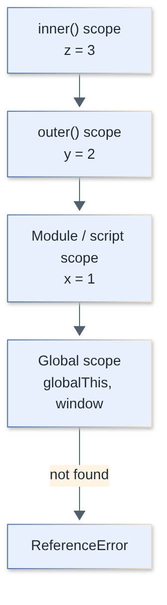
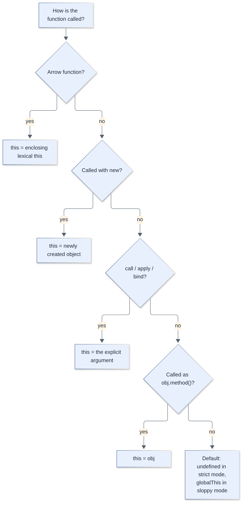
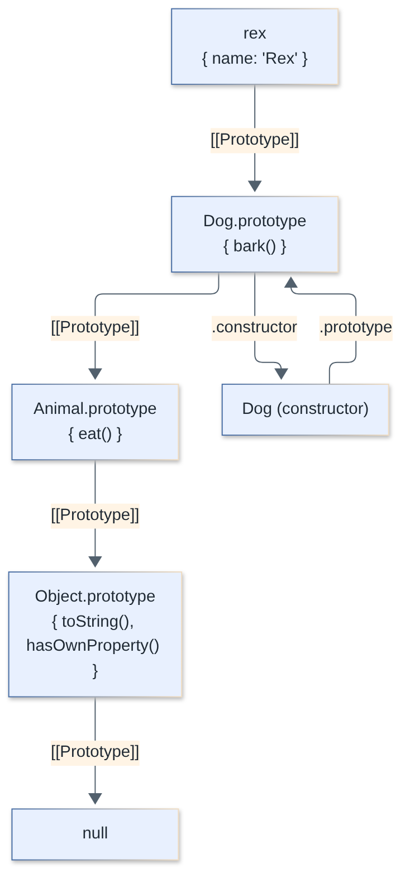
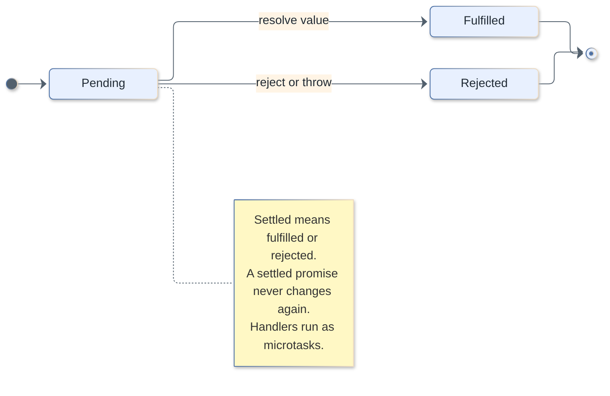
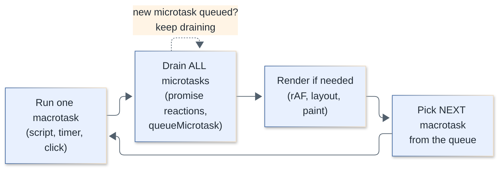
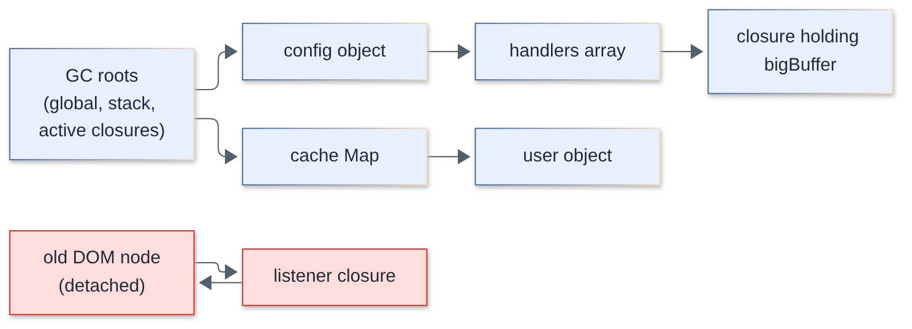
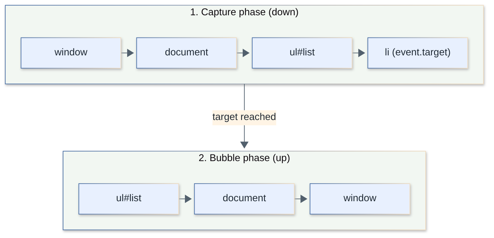

# JavaScript Interview Questions

Core JavaScript for fullstack interviews: the language itself (types, scope, `this`, prototypes), asynchronous execution, modules, memory, and the browser APIs you meet daily. TypeScript and Node-specific APIs live in their own topics.

**Levels:** `🟢 Junior` · `🟡 Middle` · `🔴 Senior`

## Table of contents

**Types, Coercion & Basics**

1. [What are JavaScript's data types, and why is `typeof null` `"object"`?](#1-what-are-javascripts-data-types-and-why-is-typeof-null-object)
2. [`==` vs `===`: how does type coercion work?](#2--vs--how-does-type-coercion-work)
3. [`var` vs `let` vs `const`: what are hoisting and the temporal dead zone?](#3-var-vs-let-vs-const-what-are-hoisting-and-the-temporal-dead-zone)
4. [`null` vs `undefined`, and what is truthy or falsy?](#4-null-vs-undefined-and-what-is-truthy-or-falsy)
5. [Which modern syntax features should every developer know (`?.`, `??`, destructuring, spread)?](#5-which-modern-syntax-features-should-every-developer-know---destructuring-spread)
6. [Primitives vs references: how are values passed, and what does `const`/`Object.freeze` really guarantee?](#6-primitives-vs-references-how-are-values-passed-and-what-does-constobjectfreeze-really-guarantee)
7. [Shallow vs deep copy: how do you clone objects correctly?](#7-shallow-vs-deep-copy-how-do-you-clone-objects-correctly)
8. [Why is `0.1 + 0.2 !== 0.3`, and when do you need `BigInt`?](#8-why-is-01--02--03-and-when-do-you-need-bigint)
9. [What are Symbols and what are they used for?](#9-what-are-symbols-and-what-are-they-used-for)

**Scope & Closures**

10. [What is a closure?](#10-what-is-a-closure)
11. [Why does a `var` loop with `setTimeout` print the same number, and how does `let` fix it?](#11-why-does-a-var-loop-with-settimeout-print-the-same-number-and-how-does-let-fix-it)
12. [What is currying? Implement `curry`.](#12-what-is-currying-implement-curry)
13. [Implement `memoize`. What are its pitfalls?](#13-implement-memoize-what-are-its-pitfalls)

**Functions & `this`**

14. [How is `this` determined?](#14-how-is-this-determined)
15. [Arrow functions vs regular functions](#15-arrow-functions-vs-regular-functions)
16. [`call` vs `apply` vs `bind`](#16-call-vs-apply-vs-bind)
17. [Implement `Function.prototype.bind` from scratch](#17-implement-functionprototypebind-from-scratch)
18. [What does this `this` puzzle print?](#18-what-does-this-this-puzzle-print)

**Prototypes & Classes**

19. [How does the prototype chain work?](#19-how-does-the-prototype-chain-work)
20. [How do ES6 classes relate to prototypes? What do they add?](#20-how-do-es6-classes-relate-to-prototypes-what-do-they-add)
21. [Implement `new` and `instanceof` from scratch](#21-implement-new-and-instanceof-from-scratch)
22. [Inheritance vs composition: what goes wrong with deep class hierarchies?](#22-inheritance-vs-composition-what-goes-wrong-with-deep-class-hierarchies)

**Asynchronous JavaScript**

23. [What is a Promise and what are its states?](#23-what-is-a-promise-and-what-are-its-states)
24. [How does the event loop work (macrotasks vs microtasks)?](#24-how-does-the-event-loop-work-macrotasks-vs-microtasks)
25. [What is the output order of this async snippet?](#25-what-is-the-output-order-of-this-async-snippet)
26. [How do `async`/`await` and error handling work together?](#26-how-do-asyncawait-and-error-handling-work-together)
27. [`Promise.all` vs `allSettled` vs `race` vs `any`](#27-promiseall-vs-allsettled-vs-race-vs-any)
28. [Implement `Promise.all` from scratch](#28-implement-promiseall-from-scratch)
29. [Sequential vs parallel async work: how do you limit concurrency?](#29-sequential-vs-parallel-async-work-how-do-you-limit-concurrency)
30. [Async error handling in production: unhandled rejections, timeouts, cancellation](#30-async-error-handling-in-production-unhandled-rejections-timeouts-cancellation)
31. [Implement a minimal Promise from scratch](#31-implement-a-minimal-promise-from-scratch)
32. [What are iterators and generators?](#32-what-are-iterators-and-generators)
33. [What are async iterators and `for await...of`?](#33-what-are-async-iterators-and-for-awaitof)

**Utilities & Collections**

34. [Implement `debounce` and `throttle`](#34-implement-debounce-and-throttle)
35. [`map`, `filter`, `reduce` and the `sort` pitfalls](#35-map-filter-reduce-and-the-sort-pitfalls)
36. [`Map`/`Set` vs plain objects/arrays](#36-mapset-vs-plain-objectsarrays)
37. [`WeakMap`, `WeakSet`, `WeakRef`: what are they for?](#37-weakmap-weakset-weakref-what-are-they-for)
38. [How does garbage collection work, and what causes memory leaks?](#38-how-does-garbage-collection-work-and-what-causes-memory-leaks)

**Modules**

39. [ES Modules vs CommonJS](#39-es-modules-vs-commonjs)
40. [Dynamic `import()`, circular dependencies, and tree-shaking](#40-dynamic-import-circular-dependencies-and-tree-shaking)

**Metaprogramming**

41. [Property descriptors, getters/setters, `freeze` vs `seal`](#41-property-descriptors-getterssetters-freeze-vs-seal)
42. [What are `Proxy` and `Reflect`?](#42-what-are-proxy-and-reflect)

**Browser & DOM**

43. [Event bubbling vs capturing](#43-event-bubbling-vs-capturing)
44. [What is event delegation?](#44-what-is-event-delegation)
45. [How do you keep the main thread responsive?](#45-how-do-you-keep-the-main-thread-responsive)
46. [Cookies vs `localStorage` vs `sessionStorage` vs IndexedDB](#46-cookies-vs-localstorage-vs-sessionstorage-vs-indexeddb)

**Errors & Tricky Output**

47. [Predict the output: classic gotchas](#47-predict-the-output-classic-gotchas)
48. [How does error handling work (`try`/`catch`/`finally`, custom errors, `cause`)?](#48-how-does-error-handling-work-trycatchfinally-custom-errors-cause)

---

## Types, Coercion & Basics

### 1. What are JavaScript's data types, and why is `typeof null` `"object"`?

`🟢 Junior` · `#types` `#fundamentals`

JavaScript has **7 primitive types** (`string`, `number`, `bigint`, `boolean`, `undefined`, `symbol`, `null`) and **one structural type**, `object` (arrays, functions, dates, maps and so on are all objects). `typeof null === "object"` is a historical bug from the first engine implementation that can never be fixed without breaking the web.

Primitives are immutable and compared by value; objects are compared by reference.

```js
typeof "a";          // "string"
typeof 1;            // "number"
typeof 1n;           // "bigint"
typeof undefined;    // "undefined"
typeof Symbol();     // "symbol"
typeof null;         // "object"   <- historical bug
typeof [];           // "object"
typeof function(){}; // "function" (callable object; not a separate type)
typeof NaN;          // "number"
typeof notDeclared;  // "undefined" (no ReferenceError for typeof on undeclared names)
```

Reliable checks:

```js
Array.isArray([]);                       // true
value === null;                          // null check
Object.prototype.toString.call(new Date()); // "[object Date]"
Number.isNaN(NaN);                       // true (global isNaN("abc") is also true: it coerces)
```

Primitives have wrapper objects (`String`, `Number`) that the engine creates temporarily when you access a property (`"abc".length`). Never use `new String()` explicitly: `typeof new String("a")` is `"object"`.

[↑ Back to top](#table-of-contents)

### 2. `==` vs `===`: how does type coercion work?

`🟢 Junior` · `#coercion` `#equality`

`===` (strict equality) compares type and value with no conversion. `==` (loose equality) converts operands to a common type first using a complicated algorithm. Default to `===`; the one idiomatic use of `==` is `x == null`, which matches both `null` and `undefined`.

| Expression | Result | Why |
|---|---|---|
| `1 == "1"` | `true` | string converted to number |
| `0 == ""` | `true` | `""` becomes `0` |
| `0 == "0"` | `true` | |
| `"" == "0"` | `false` | both strings: compared as strings |
| `null == undefined` | `true` | special rule |
| `null == 0` | `false` | `null` only loosely equals `undefined` |
| `NaN == NaN` | `false` | NaN is never equal to anything |
| `[] == false` | `true` | `[]` becomes `""` becomes `0`; `false` becomes `0` |
| `[1,2] == "1,2"` | `true` | array becomes its `toString()` |
| `{} == "[object Object]"` | `true` | object becomes string |

Simplified `==` rules: same type behaves like `===`; `null`/`undefined` equal only each other; boolean becomes number; string vs number converts the string to number; object vs primitive calls `ToPrimitive` (`valueOf`/`toString`).

`+` is the other classic: if either operand is a string (after `ToPrimitive`), it concatenates.

```js
1 + "2";    // "12"
"3" - 1;    // 2   (- only does numbers)
[] + {};    // "[object Object]"
true + 1;   // 2
```

Three kinds of "equal" exist in the language:

| | `NaN` vs `NaN` | `+0` vs `-0` |
|---|---|---|
| `===` | false | true |
| `Object.is` | true | false |
| `SameValueZero` (used by `includes`, `Map`, `Set`) | true | true |

> **Follow-up:** Why does `[NaN].indexOf(NaN)` return `-1` but `[NaN].includes(NaN)` return `true`? `indexOf` uses `===`; `includes` uses SameValueZero.

[↑ Back to top](#table-of-contents)

### 3. `var` vs `let` vs `const`: what are hoisting and the temporal dead zone?

`🟢 Junior` · `#scope` `#hoisting`

`var` is function-scoped and initialised to `undefined` when hoisted. `let` and `const` are block-scoped and hoisted but **uninitialised** until their declaration runs; touching them earlier throws a `ReferenceError` (the *temporal dead zone*, TDZ). `const` additionally forbids reassignment of the binding.

| | `var` | `let` | `const` |
|---|---|---|---|
| Scope | function | block | block |
| Hoisted | yes, initialised to `undefined` | yes, but in TDZ | yes, but in TDZ |
| Reassign | yes | yes | no |
| Redeclare in same scope | yes | no | no |
| Becomes `globalThis` property (top-level script) | yes | no | no |

```js
console.log(a); // undefined  (var hoisted)
var a = 1;

console.log(b); // ReferenceError: Cannot access 'b' before initialization
let b = 2;

sayHi();        // works: function declarations are hoisted with their body
function sayHi() { console.log("hi"); }

sayBye();       // TypeError: sayBye is not a function (var hoisted as undefined)
var sayBye = function () {};
```

"Hoisting" is not code moving up: during the creation phase of an execution context the engine registers declarations in the scope; the difference is only in how they are initialised. `typeof` on a TDZ variable also throws, so `typeof` is no longer always safe.

Practical rule: `const` by default, `let` when you must reassign, never `var`.



> **Follow-up:** Are classes hoisted? Yes, same as `let`: they exist in the TDZ until the `class` statement is evaluated.

[↑ Back to top](#table-of-contents)

### 4. `null` vs `undefined`, and what is truthy or falsy?

`🟢 Junior` · `#types` `#fundamentals`

`undefined` means "no value has been assigned" (the engine's default); `null` means "intentionally empty" (set by a developer). Exactly eight values are **falsy**: `false`, `0`, `-0`, `0n`, `""`, `null`, `undefined`, `NaN`. Everything else is truthy, including `"0"`, `"false"`, `[]` and `{}`.

```js
let x;                 // undefined
function f(a) { return a; }
f();                   // undefined (missing argument)
({}).missing;          // undefined (missing property)
JSON.stringify({ a: undefined, b: null }); // '{"b":null}'  (undefined dropped)

Boolean([]);           // true
Boolean("0");          // true
Boolean(NaN);          // false
```

Gotcha: `||` treats every falsy value as "missing", which breaks legitimate `0` or `""`. Use `??` (see Q5), which only reacts to `null`/`undefined`.

```js
const port = config.port || 3000; // port 0 becomes 3000 (bug)
const port2 = config.port ?? 3000; // port 0 stays 0
```

[↑ Back to top](#table-of-contents)

### 5. Which modern syntax features should every developer know (`?.`, `??`, destructuring, spread)?

`🟢 Junior` · `#es6+` `#syntax`

The everyday set: optional chaining `?.`, nullish coalescing `??`, logical assignment (`||=`, `&&=`, `??=`), destructuring with defaults, spread/rest, template literals, and shorthand properties.

```js
const user = { profile: { name: "Ann" }, tags: [] };

// Optional chaining: short-circuits to undefined instead of throwing
user.address?.city;        // undefined
user.getRole?.();          // undefined (method may not exist)
user.tags?.[0];            // undefined

// Nullish coalescing: fallback only for null/undefined
0 ?? 10;      // 0
"" ?? "n/a";  // ""
null ?? 10;   // 10

// Logical assignment
user.nick ??= "anon";      // assigns only if nullish
user.visits ||= 1;         // assigns if falsy

// Destructuring with rename and default
const { profile: { name }, role = "guest" } = user;

// Rest / spread
const [first, ...others] = [1, 2, 3];
const merged = { ...{ a: 1, b: 2 }, b: 3 };   // { a: 1, b: 3 } (later wins)
Math.max(...[3, 9, 4]);                       // 9

// Mixing ?? with || or && requires parentheses (syntax error otherwise)
(a ?? b) || c;
```

`?.` only guards the part directly before it: `a?.b.c` still throws if `a.b` is `undefined`. Overusing `?.` can hide real bugs (a required value that silently becomes `undefined`).

[↑ Back to top](#table-of-contents)

### 6. Primitives vs references: how are values passed, and what does `const`/`Object.freeze` really guarantee?

`🟡 Middle` · `#types` `#immutability`

JavaScript is always **pass-by-value**, but for objects the value is a *reference* ("call by sharing"): the function gets a copy of the reference, so it can mutate the shared object but cannot rebind the caller's variable. `const` freezes the *binding*, not the value; `Object.freeze` makes an object shallowly immutable.

```js
function mutate(o) { o.x = 1; }       // visible to caller
function reassign(o) { o = { x: 2 }; } // invisible to caller

const obj = {};
mutate(obj);   // obj is { x: 1 }
reassign(obj); // obj is still { x: 1 }

const arr = [1];
arr.push(2);   // fine: binding unchanged
// arr = [];   // TypeError: Assignment to constant variable.
```

`Object.freeze` is shallow and silent in sloppy mode:

```js
"use strict";
const cfg = Object.freeze({ db: { host: "a" }, port: 1 });
cfg.port = 2;        // TypeError in strict mode (silently ignored in sloppy mode)
cfg.db.host = "b";   // allowed: nested object not frozen
Object.isFrozen(cfg); // true
```

Deep-freeze recursively when needed, or better, treat data as immutable by convention and produce new values (`{ ...state, x }`, `arr.with(i, v)`, `toSorted()`). Immutability makes change detection cheap (`prev !== next`), which is why React/Redux rely on it.

[↑ Back to top](#table-of-contents)

### 7. Shallow vs deep copy: how do you clone objects correctly?

`🟡 Middle` · `#objects` `#copying`

A **shallow copy** (`{...obj}`, `Object.assign`, `arr.slice()`) copies the top level only; nested objects stay shared. A **deep copy** duplicates everything; use `structuredClone()` (built into modern browsers and Node) rather than `JSON.parse(JSON.stringify(x))`.

```js
const a = { n: 1, nested: { x: 1 } };
const shallow = { ...a };
shallow.nested.x = 99;
a.nested.x; // 99  <- shared!

const deep = structuredClone(a);
deep.nested.x = 5;
a.nested.x; // still 99
```

| Capability | `{...obj}` | `JSON` round-trip | `structuredClone` |
|---|---|---|---|
| Nested objects | shared | copied | copied |
| `Date` | shared ref | becomes string | stays `Date` |
| `Map` / `Set` | shared ref | becomes `{}` / `{}` | cloned |
| `undefined` values | kept | dropped | kept |
| Functions, symbol values | kept | dropped | throw `DataCloneError` |
| `NaN` / `Infinity` | kept | becomes `null` | kept |
| Circular references | n/a | throws | supported |
| Class instances (prototype) | keeps own props, loses prototype | loses prototype | loses prototype (plain object) |
| `BigInt` | kept | throws | kept |

```js
const circ = { name: "c" }; circ.self = circ;
structuredClone(circ).self.name; // "c" (cycle preserved)

structuredClone({ fn() {} });    // DataCloneError
```

Production notes: `structuredClone` copies are not free (large state trees in hot paths are slow); prefer structural sharing (copy only the changed path) as Immer or Redux Toolkit do. Class instances need a custom `clone()` or reconstruction because the prototype is lost.

> **Follow-up:** Does `structuredClone` keep getters? It reads the value of the getter and stores a plain data property.

[↑ Back to top](#table-of-contents)

### 8. Why is `0.1 + 0.2 !== 0.3`, and when do you need `BigInt`?

`🟢 Junior` · `#numbers` `#bigint`

`number` is an IEEE-754 64-bit double; `0.1` and `0.2` have no exact binary representation, so their sum is `0.30000000000000004`. Compare with a tolerance (`Number.EPSILON`) or use integers (cents). Use `BigInt` for integers beyond `Number.MAX_SAFE_INTEGER` (2^53 - 1).

```js
0.1 + 0.2;                       // 0.30000000000000004
Math.abs(0.1 + 0.2 - 0.3) < Number.EPSILON; // true

// Money: work in integer cents, format at the edge
const cents = 1999 + 1;          // 2000
(cents / 100).toFixed(2);        // "20.00"

Number.MAX_SAFE_INTEGER;         // 9007199254740991
9007199254740992 === 9007199254740993; // true (precision lost)

const big = 9007199254740993n;   // BigInt literal
big + 1n;                        // 9007199254740994n
// big + 1;                      // TypeError: cannot mix BigInt and other types
Number(big);                     // lossy conversion
```

`BigInt` cannot be mixed with `number`, does not work with `Math.*`, and `JSON.stringify` throws on it (serialize as string). Typical uses: 64-bit database IDs, cryptography, blockchain amounts.

[↑ Back to top](#table-of-contents)

### 9. What are Symbols and what are they used for?

`🟡 Middle` · `#symbols` `#metaprogramming`

A `Symbol` is a unique, immutable primitive used as a collision-free property key. Symbol-keyed properties are skipped by `for...in`, `Object.keys` and `JSON.stringify`. **Well-known symbols** (`Symbol.iterator`, `Symbol.toPrimitive`, `Symbol.hasInstance`, `Symbol.toStringTag`, `Symbol.asyncIterator`) let your objects hook into language behaviour.

```js
const id = Symbol("id");
const user = { name: "Ann", [id]: 42 };

Object.keys(user);                    // ["name"]
JSON.stringify(user);                 // '{"name":"Ann"}'
Object.getOwnPropertySymbols(user);   // [Symbol(id)]
Symbol("a") === Symbol("a");          // false

// Global registry: same key gives the same symbol (even across realms)
Symbol.for("app.key") === Symbol.for("app.key"); // true

// Customising conversion
const money = {
  amount: 5,
  [Symbol.toPrimitive](hint) {
    return hint === "string" ? `$${this.amount}` : this.amount;
  },
};
`${money}`;   // "$5"
money * 2;    // 10

// Making an object iterable
const range = {
  from: 1, to: 3,
  *[Symbol.iterator]() { for (let i = this.from; i <= this.to; i++) yield i; },
};
[...range]; // [1, 2, 3]
```

Use cases: hidden/"private-ish" metadata keys on third-party objects, protocol hooks (iteration, async iteration, coercion, `instanceof`), and enum-like constants. Symbols are not truly private (reflection exposes them); use `#private` fields for real privacy (Q20).

[↑ Back to top](#table-of-contents)

## Scope & Closures

### 10. What is a closure?

`🟢 Junior` · `#closures` `#scope`

A closure is a function bundled with a reference to the **lexical environment** in which it was created, so it can keep reading and writing the outer variables even after the outer function has returned.

```js
function makeCounter() {
  let count = 0;                // private state
  return {
    inc: () => ++count,
    get: () => count,
  };
}

const c = makeCounter();
c.inc(); c.inc();
c.get(); // 2  (count lives on; nothing else can touch it)
```

Every function carries a hidden `[[Environment]]` pointer. When a variable is not found locally, lookup walks the **scope chain** outward (see diagram in Q3). Closures power data privacy, factories, callbacks, memoization, partial application, and React hooks.

Cost: captured variables cannot be garbage collected while the closure is reachable. Engines only retain variables the closure (or a sibling closure) actually references, but a long-lived closure over a large object is a classic leak (Q38).

> **Follow-up:** Is a closure created by every function? Technically yes; in practice we say "closure" when a function uses variables from an enclosing scope.

[↑ Back to top](#table-of-contents)

### 11. Why does a `var` loop with `setTimeout` print the same number, and how does `let` fix it?

`🟡 Middle` · `#closures` `#scope` `#output`

`var` has one function-wide binding, so all callbacks close over the *same* `i`, which is already `3` when the timers fire. `let` creates a **fresh binding per iteration**, so each callback sees its own `i`.

```js
for (var i = 0; i < 3; i++) setTimeout(() => console.log(i), 0);
// 3 3 3

for (let j = 0; j < 3; j++) setTimeout(() => console.log(j), 0);
// 0 1 2
```

Pre-ES6 fix: an IIFE creating a new scope per iteration.

```js
for (var i = 0; i < 3; i++) {
  (function (n) { setTimeout(() => console.log(n), 0); })(i);
}
// 0 1 2
```

Note `let` copies the value into the new iteration's binding *before* running the increment, which is why `i++` does not affect already-created closures.

[↑ Back to top](#table-of-contents)

### 12. What is currying? Implement `curry`.

`🟡 Middle` · `#functional` `#closures` `#coding`

Currying transforms `f(a, b, c)` into `f(a)(b)(c)`. Partial application fixes some arguments up front and returns a function for the rest. A generic `curry` uses `fn.length` (declared parameter count) and keeps collecting arguments until enough have arrived.

```js
function curry(fn) {
  return function curried(...args) {
    if (args.length >= fn.length) return fn.apply(this, args);
    return (...next) => curried.apply(this, [...args, ...next]);
  };
}

const add = (a, b, c) => a + b + c;
const c = curry(add);
c(1)(2)(3);   // 6
c(1, 2)(3);   // 6
c(1)(2, 3);   // 6

// Practical use: reusable specialised functions
const log = curry((level, ts, msg) => `[${level}] ${ts}: ${msg}`);
const error = log("ERROR");
error("12:00")("disk full"); // "[ERROR] 12:00: disk full"
```

Limitations: `fn.length` ignores default and rest parameters (`(a, b = 1) => ...` has length 1), so variadic functions need an explicit arity argument: `curry(fn, arity)`.

[↑ Back to top](#table-of-contents)

### 13. Implement `memoize`. What are its pitfalls?

`🔴 Senior` · `#closures` `#performance` `#coding`

`memoize` caches results keyed by arguments so repeated calls with the same input skip the work. The cache lives in a closure.

```js
function memoize(fn, resolver = (...args) => JSON.stringify(args)) {
  const cache = new Map();
  return function (...args) {
    const key = resolver(...args);
    if (cache.has(key)) return cache.get(key);
    const result = fn.apply(this, args);
    cache.set(key, result);
    return result;
  };
}

const slowSquare = (n) => { console.log("computing", n); return n * n; };
const fast = memoize(slowSquare);
fast(4); // logs "computing 4", returns 16
fast(4); // returns 16 from cache, no log
```

Pitfalls to discuss:

- **Only for pure functions.** Results that depend on time, randomness, or mutable external state go stale.
- **Key generation.** `JSON.stringify` is slow, order-sensitive for object keys, and fails on functions, cycles and `BigInt`; two different objects with equal content share a key (usually desired, sometimes not). For a single primitive argument use it directly as the key.
- **Unbounded growth is a memory leak.** Add an LRU/size limit or TTL. For object arguments use a `WeakMap` keyed by the object so entries vanish with the object (Q37).
- **Async functions.** Cache the *promise*, not the resolved value, to dedupe concurrent calls; but evict it on rejection or you will cache the failure forever.

```js
function memoizeAsync(fn) {
  const cache = new Map();
  return (key, ...args) => {
    if (!cache.has(key)) {
      const p = fn(key, ...args).catch((e) => { cache.delete(key); throw e; });
      cache.set(key, p);
    }
    return cache.get(key);
  };
}
```

[↑ Back to top](#table-of-contents)

## Functions & `this`

### 14. How is `this` determined?

`🟢 Junior` · `#this` `#functions`

`this` is decided by **how a function is called**, not where it is defined (except arrow functions, which inherit it lexically). Priority, highest first: `new` > explicit (`call`/`apply`/`bind`) > implicit (`obj.method()`) > default (`undefined` in strict mode, otherwise `globalThis`).



```js
"use strict";
function who() { return this; }

const obj = { who };
obj.who() === obj;              // implicit: the object before the dot
who() === undefined;            // default (strict)
who.call(42);                   // 42: explicit (primitive stays a primitive in strict mode)
new who() instanceof who;       // true: new creates a fresh object

// Losing `this`: detaching a method
const m = obj.who;
m() === undefined;              // implicit binding is lost
```

Common ways `this` gets lost: passing a method as a callback (`setTimeout(obj.method)`, `arr.map(obj.method)`, event handlers), destructuring a method, and nested regular functions inside methods. Fixes: arrow function wrappers, `.bind(obj)`, or class fields with arrow functions.

In a DOM event handler (`addEventListener` with a regular function), `this` is `event.currentTarget`.

[↑ Back to top](#table-of-contents)

### 15. Arrow functions vs regular functions

`🟢 Junior` · `#functions` `#this`

Arrow functions have no own `this`, `arguments`, `super` or `new.target`; they capture `this` from the enclosing scope, cannot be constructors, and cannot be generators. Regular functions get all of these per call.

| | Regular function | Arrow function |
|---|---|---|
| `this` | dynamic (call-site) | lexical (from definition) |
| `arguments` object | yes | no (use rest `...args`) |
| Usable with `new` | yes | no (`TypeError`) |
| Has `prototype` | yes | no |
| `call`/`apply`/`bind` can change `this` | yes | no (ignored) |
| Hoisted (declarations) | yes | no (it is an expression) |
| Can be a generator | yes (`function*`) | no |

```js
class Timer {
  seconds = 0;
  start() {
    setInterval(() => { this.seconds++; }, 1000); // arrow: `this` is the Timer
  }
}

const o = {
  name: "o",
  arrow: () => this?.name,        // `this` is the outer scope, not `o`
  method() { return this.name; }, // "o"
};
```

Do not use arrows as object methods that need `this`, as prototype methods, or as constructors. They are ideal for callbacks and short inline functions. Because each class-field arrow is created per instance, it costs memory and cannot be overridden through the prototype or spied on there; use it only when you need a bound handler (typical in React class components).

[↑ Back to top](#table-of-contents)

### 16. `call` vs `apply` vs `bind`

`🟡 Middle` · `#this` `#functions`

All three set `this` explicitly. `call(thisArg, a, b)` invokes immediately with positional args; `apply(thisArg, [a, b])` invokes immediately with an argument array; `bind(thisArg, a)` returns a **new function** with `this` (and optionally leading args) permanently fixed.

```js
function greet(greeting, punct) { return `${greeting}, ${this.name}${punct}`; }
const ann = { name: "Ann" };

greet.call(ann, "Hi", "!");      // "Hi, Ann!"
greet.apply(ann, ["Hi", "!"]);   // "Hi, Ann!"
const g = greet.bind(ann, "Hello");
g("?");                          // "Hello, Ann?"   (partial application)

// A bound function cannot be re-bound
g.call({ name: "Bob" }, "?");    // still "Hello, Ann?"

// Borrowing methods
Math.max.apply(null, [1, 5, 3]); // 5 (today: Math.max(...arr))
Array.prototype.slice.call({ 0: "a", 1: "b", length: 2 }); // ["a", "b"]
```

`bind` also affects `new`: a bound function used with `new` ignores the bound `this` but keeps the bound arguments. Bound functions have the name `bound fn`, which shows up in stack traces.

[↑ Back to top](#table-of-contents)

### 17. Implement `Function.prototype.bind` from scratch

`🟡 Middle` · `#this` `#coding`

`bind` returns a function that calls the original with a fixed `this` plus pre-filled arguments. The tricky parts are merging arguments and supporting `new` on the bound function (where the bound `this` must be ignored and the prototype chain preserved).

```js
Function.prototype.myBind = function (context, ...boundArgs) {
  const fn = this;
  if (typeof fn !== "function") throw new TypeError("Bind must be called on a function");

  function bound(...callArgs) {
    // `new bound()` -> this is an instance of bound; ignore `context`
    const isNew = this instanceof bound;
    return fn.apply(isNew ? this : context, [...boundArgs, ...callArgs]);
  }

  // Keep the prototype chain so `new bound() instanceof fn` works
  if (fn.prototype) bound.prototype = Object.create(fn.prototype);
  return bound;
};

function Point(x, y) { this.x = x; this.y = y; }
const YAxis = Point.myBind(null, 0);
const p = new YAxis(5);
p;                    // Point { x: 0, y: 5 }
p instanceof Point;   // true

function show() { return this.v; }
show.myBind({ v: 7 })(); // 7
```

Real `bind` also sets `name`/`length` on the result and is not re-bindable; for interviews, `this` + args + `new` handling is the expected depth.

[↑ Back to top](#table-of-contents)

### 18. What does this `this` puzzle print?

`🟡 Middle` · `#this` `#output`

Each line demonstrates one rule: a detached method loses `this`; an arrow captures `this` from where it was defined; a regular function inside a method gets the default binding.

```js
"use strict";
const obj = {
  name: "obj",
  regular() { return this?.name; },
  arrow: () => typeof this,             // `this` of the module scope
  nested() {
    function inner() { return this; }   // plain call: default binding
    const arrowInner = () => this.name; // lexical: obj
    return [inner(), arrowInner()];
  },
};

console.log(obj.regular());       // "obj"
const detached = obj.regular;
console.log(detached());          // undefined  (this is undefined; ?. avoids throwing)
console.log((0, obj.regular)());  // undefined  (comma operator returns the bare function)
console.log(obj.nested());        // [ undefined, 'obj' ]
console.log(obj.arrow());         // "object" in a CommonJS module (this === module.exports); "undefined" in an ES module
```

Without `?.`, `detached()` would throw `TypeError: Cannot read properties of undefined (reading 'name')`. In sloppy mode it would instead read `globalThis.name`.

`(obj.regular)()` (just parentheses) still works because the parenthesised reference keeps its `obj.` base; `(0, obj.regular)()` does not, because the comma operator yields the plain function value.

[↑ Back to top](#table-of-contents)

## Prototypes & Classes

### 19. How does the prototype chain work?

`🟡 Middle` · `#prototypes` `#inheritance`

Every object has an internal `[[Prototype]]` link to another object (or `null`). When you read a property that is not an own property, the engine follows the chain upward until it finds it or reaches `null`. Inheritance in JavaScript is delegation along this chain.



```js
function Animal(name) { this.name = name; }
Animal.prototype.eat = function () { return `${this.name} eats`; };

function Dog(name) { Animal.call(this, name); }       // inherit instance fields
Dog.prototype = Object.create(Animal.prototype);      // inherit methods
Dog.prototype.constructor = Dog;                      // restore constructor
Dog.prototype.bark = function () { return "Woof"; };

const rex = new Dog("Rex");
rex.eat();                                   // "Rex eats" (found on Animal.prototype)
Object.getPrototypeOf(rex) === Dog.prototype; // true
rex.hasOwnProperty("eat");                   // false
Object.hasOwn(rex, "name");                  // true  (preferred over hasOwnProperty)
rex instanceof Animal;                       // true
```

Key points:

- `obj.__proto__` is the legacy accessor for `[[Prototype]]`; use `Object.getPrototypeOf` / `Object.setPrototypeOf`. `F.prototype` is the object assigned to instances created with `new F()`; they are different things.
- **Writes don't walk the chain**: assigning `rex.eat = ...` creates an own property that *shadows* the inherited one.
- `for...in` includes inherited enumerable properties; `Object.keys` does not.
- `Object.create(null)` makes a dictionary with no prototype (no `toString`, safe from keys like `__proto__` or `constructor`).
- Mutating prototypes at runtime (`setPrototypeOf`) deoptimises engine inline caches; avoid it in hot code.

> **Follow-up:** What is at the end of the chain? `Object.prototype`, whose prototype is `null`.

[↑ Back to top](#table-of-contents)

### 20. How do ES6 classes relate to prototypes? What do they add?

`🟡 Middle` · `#classes` `#prototypes`

`class` is syntax over constructor functions and prototypes: methods are placed on `Class.prototype`, `extends` wires the chain, `typeof class {}` is `"function"`. It adds guardrails: must be called with `new`, methods are non-enumerable, bodies are strict mode, classes are in the TDZ, plus `super`, `static`, accessors and true private fields.

```js
class Account {
  #balance = 0;                       // private field (hard privacy)
  static count = 0;                   // static field
  static { Account.count = 0; }       // static initialisation block

  constructor(owner) { this.owner = owner; Account.count++; }

  deposit(n) { this.#balance += n; return this; }
  get balance() { return this.#balance; }
  #audit() { /* private method */ }
  static create(owner) { return new Account(owner); }
}

class Savings extends Account {
  constructor(owner, rate) {
    super(owner);                     // must run before touching `this`
    this.rate = rate;
  }
  deposit(n) { return super.deposit(n * 1.01); }
}

const s = new Savings("Ann", 0.02);
s.deposit(100).balance;               // 101
s.#balance;                           // SyntaxError (outside the class)
Account("x");                         // TypeError: Class constructor Account cannot be invoked without 'new'
```

| | Constructor function | `class` |
|---|---|---|
| Callable without `new` | yes (silent bugs) | no, throws |
| Hoisting | function declarations hoisted | TDZ like `let` |
| Methods enumerable | yes (if assigned to prototype) | no |
| Private members | closures/conventions | `#private` (engine-enforced) |
| Inheritance | manual `Object.create` | `extends` / `super` |

Gotchas: class fields (`x = 1`) are per-instance (created in the constructor, not on the prototype); a method passed as a callback loses `this` (Q14); `#private` is brand-checked, so a `Proxy` wrapping an instance cannot access the target's private fields through `this`.

[↑ Back to top](#table-of-contents)

### 21. Implement `new` and `instanceof` from scratch

`🔴 Senior` · `#prototypes` `#coding`

`new F(...args)` does four things: create an object whose prototype is `F.prototype`, run `F` with `this` set to it, and return the constructor's result if it is an object, otherwise the new object. `instanceof` walks the left operand's prototype chain looking for `F.prototype`.

```js
function myNew(Constructor, ...args) {
  const obj = Object.create(Constructor.prototype);   // 1 + 2: link prototype
  const result = Constructor.apply(obj, args);        // 3: run constructor
  const isObject = result !== null && (typeof result === "object" || typeof result === "function");
  return isObject ? result : obj;                     // 4: explicit object return wins
}

function myInstanceOf(value, Constructor) {
  if (value === null || (typeof value !== "object" && typeof value !== "function")) return false;
  const target = Constructor.prototype;
  let proto = Object.getPrototypeOf(value);
  while (proto !== null) {
    if (proto === target) return true;
    proto = Object.getPrototypeOf(proto);
  }
  return false;
}

function Person(name) { this.name = name; }
Person.prototype.hi = function () { return "hi " + this.name; };

const p = myNew(Person, "Ann");
p.hi();                         // "hi Ann"
myInstanceOf(p, Person);        // true
myInstanceOf(p, Object);        // true
myInstanceOf([], Array);        // true
myInstanceOf(Object.create(null), Object); // false
```

Real `instanceof` first checks `Constructor[Symbol.hasInstance]`, which classes can override with a static method; it can also be fooled by objects from other realms (iframes): `iframeArray instanceof Array` is `false`, which is why `Array.isArray` exists. A fuller `myNew` should also forward `new.target` (use `Reflect.construct(Constructor, args)`).

[↑ Back to top](#table-of-contents)

### 22. Inheritance vs composition: what goes wrong with deep class hierarchies?

`🔴 Senior` · `#classes` `#design` `#trade-offs`

Prefer **composition** ("has-a", assembling behaviour from small functions/objects) over deep inheritance ("is-a"). Inheritance couples subclasses to parent internals (the *fragile base class* problem), forces a single taxonomy, and makes behaviour hard to trace across a chain.

```js
// Inheritance: a Robot that can't eat is forced into Animal's shape
class Animal { eat() {} sleep() {} }
class Robot extends Animal { /* inherits eat/sleep it doesn't want */ }

// Composition: pick capabilities
const canWalk = (s) => ({ walk: () => `${s.name} walks` });
const canSwim = (s) => ({ swim: () => `${s.name} swims` });

function createDuck(name) {
  const state = { name };
  return Object.assign(state, canWalk(state), canSwim(state));
}
createDuck("Don").swim(); // "Don swims"

// Mixins for classes: a function returning a subclass
const Serializable = (Base) => class extends Base {
  toJSON() { return { ...this }; }
};
class User extends Serializable(Object) {}
```

Real-world problems with inheritance:

- **Fragile base class:** a change in `Parent.save()` (e.g. now calls `this.validate()`) silently changes every subclass that overrides `validate`.
- **Overridden methods called from the parent constructor** see an uninitialised subclass (`this.field` is still `undefined` because subclass fields are assigned after `super()` returns).
- **Hard to test and reuse:** you can't reuse one method without taking the whole hierarchy.
- Built-in subclassing (`extends Array`, `extends Error`) works in modern engines but interacts with `Symbol.species`; methods like `map` return instances of the subclass, which may surprise you.

Rule of thumb: inheritance for a genuine, stable "is-a" with one or two levels; composition, dependency injection, or mixins for everything else. React made the same call: hooks and component composition replaced class inheritance.

[↑ Back to top](#table-of-contents)

## Asynchronous JavaScript

### 23. What is a Promise and what are its states?

`🟢 Junior` · `#promises` `#async`

A Promise is an object representing the eventual result of an asynchronous operation. It is **pending** until it **settles** as either **fulfilled** (with a value) or **rejected** (with a reason), and once settled it never changes.



```js
const p = new Promise((resolve, reject) => {
  setTimeout(() => resolve("done"), 100);   // executor runs synchronously
});

p.then((v) => v.toUpperCase())              // each .then returns a NEW promise
 .then((v) => { throw new Error("boom"); }) // throw -> rejected promise
 .catch((e) => "recovered")                 // returning a value -> fulfilled again
 .finally(() => console.log("cleanup"));    // runs either way; passes the value through
```

Key rules:

- `.then(onFulfilled, onRejected)` always returns a new promise, enabling **chaining**. Returning a promise from a handler makes the chain wait for it (promise "flattening").
- Handlers always run **asynchronously** (as microtasks), even if the promise is already settled. This guarantees consistent ordering ("no Zalgo").
- A thrown error inside a handler or the executor becomes a rejection. Calling `resolve` after the first `resolve`/`reject` is ignored.
- Resolving with a thenable (an object with `.then`) adopts its state.
- Promises are **eager**: the executor runs immediately when constructed, and they cannot be cancelled (see Q30).

Why promises over callbacks: flat chains instead of "callback hell", centralised error propagation, composability (`Promise.all`), and a standard async contract.

[↑ Back to top](#table-of-contents)

### 24. How does the event loop work (macrotasks vs microtasks)?

`🟡 Middle` · `#event-loop` `#async`

JavaScript runs on a single thread with a **call stack**. Async work (timers, network, user events) is handled by the host (browser/runtime), which queues callbacks. The event loop repeatedly takes **one macrotask**, runs it to completion, then drains the **entire microtask queue**, optionally renders, and moves on.



| | Macrotasks (task queue) | Microtasks |
|---|---|---|
| Sources | `setTimeout`, `setInterval`, DOM events, I/O, `MessageChannel` | promise reactions (`then`/`catch`/`finally`, `await` continuations), `queueMicrotask`, `MutationObserver` |
| Processed | one per loop iteration | all of them, until the queue is empty, after the current task |
| Can starve rendering | long tasks block the next frame | an endless microtask chain blocks rendering and even the next macrotask |

```js
setTimeout(() => console.log("timeout"), 0);
Promise.resolve().then(() => console.log("microtask"));
console.log("sync");
// sync, microtask, timeout
```

Important details:

- `setTimeout(fn, 0)` is a **minimum** delay: it runs after the current task, all microtasks, and (in browsers) timers are clamped (nested timers get a minimum of about 4 ms; background tabs are throttled harder).
- `requestAnimationFrame` callbacks run just before a repaint, in the render step of the loop, not as microtasks.
- Microtasks queued by microtasks run in the same drain, so `Promise.resolve().then(function loop(){ Promise.resolve().then(loop) })` freezes the page.
- Heavy synchronous code (a big `for` loop, `JSON.parse` of 50 MB) blocks everything: input, timers, rendering. See Q45.

> **Follow-up:** Is `await` blocking? No; it suspends the async function and yields to the loop; the rest of the function is queued as a microtask once the awaited promise settles.

[↑ Back to top](#table-of-contents)

### 25. What is the output order of this async snippet?

`🟡 Middle` · `#event-loop` `#output` `#promises`

Order: synchronous code first, then all microtasks in the order they were queued, then macrotasks. Output: `1 5 7 3 4 6 2`.

```js
console.log("1");

setTimeout(() => console.log("2"), 0);

Promise.resolve().then(() => console.log("3"));

queueMicrotask(() => console.log("4"));

(async () => {
  console.log("5");          // async function body runs synchronously until first await
  await null;
  console.log("6");          // continuation queued as a microtask
})();

console.log("7");
// 1 5 7 3 4 6 2
```

Walkthrough:

1. Synchronous pass prints `1`, schedules the timeout, queues microtasks `3`, `4`, enters the async function (prints `5`), where `await null` queues the continuation as microtask `6`, then prints `7`.
2. The stack is empty, so microtasks run in FIFO order: `3`, `4`, `6`.
3. The macrotask (`setTimeout`) runs last: `2`.

Chains interleave one step at a time:

```js
Promise.resolve().then(() => console.log("a1")).then(() => console.log("a2"));
Promise.resolve().then(() => console.log("b1")).then(() => console.log("b2"));
// a1 b1 a2 b2   (a2 is only queued after a1 finishes, i.e. behind b1)
```

[↑ Back to top](#table-of-contents)

### 26. How do `async`/`await` and error handling work together?

`🟡 Middle` · `#async-await` `#errors`

An `async` function always returns a promise; `await` pauses it until a promise settles, returning the value or throwing the rejection reason, so ordinary `try`/`catch`/`finally` works. It is syntactic sugar over promises (and generators).

```js
async function load(id) {
  try {
    const res = await fetch(`/api/users/${id}`);
    if (!res.ok) throw new Error(`HTTP ${res.status}`); // fetch does NOT reject on 404/500
    return await res.json();
  } catch (err) {
    console.error("load failed", err);
    throw err;                 // rethrow unless you can really recover
  } finally {
    hideSpinner();
  }
}
```

Common mistakes:

```js
// 1. Missing `await` inside try: the rejection escapes the catch
async function a() {
  try { return failingAsync(); }        // returns the promise; catch never sees the error
  catch (e) { console.log("caught"); }
}
async function b() {
  try { return await failingAsync(); }  // "caught" is logged
  catch (e) { console.log("caught"); }
}

// 2. Accidental serial execution of independent work
const user = await getUser();
const posts = await getPosts();          // waits for user for no reason
const [u, p] = await Promise.all([getUser(), getPosts()]); // parallel

// 3. forEach does not await callbacks
items.forEach(async (i) => { await save(i); });   // fires all, returns immediately
for (const i of items) await save(i);             // sequential
await Promise.all(items.map(save));               // parallel

// 4. Floating promise: no await, no catch -> unhandled rejection
save(item);   // add `await` or `.catch(...)`, or `void save(item).catch(report)`
```

Top-level `await` is available in ES modules. An `await` on a non-promise value still yields (one microtask tick).

[↑ Back to top](#table-of-contents)

### 27. `Promise.all` vs `allSettled` vs `race` vs `any`

`🟡 Middle` · `#promises` `#concurrency`

All four take an iterable and run the promises concurrently; they differ in when they settle and what they return.

| Method | Fulfills when | Rejects when | Result |
|---|---|---|---|
| `Promise.all` | **all** fulfill | **first** rejection (fail-fast) | array of values, in input order |
| `Promise.allSettled` | **all** settle | never | array of `{status, value \| reason}` |
| `Promise.race` | **first** settles fulfilled | first settles rejected | that one value/reason |
| `Promise.any` | **first** fulfills | **all** reject | first value; rejects with `AggregateError` |

```js
const ok = (v, ms) => new Promise((r) => setTimeout(() => r(v), ms));
const bad = (e, ms) => new Promise((_, r) => setTimeout(() => r(new Error(e)), ms));

await Promise.all([ok("a", 10), ok("b", 20)]);              // ["a", "b"]
await Promise.all([ok("a", 10), bad("x", 5)]);              // rejects: Error x
await Promise.allSettled([ok("a", 10), bad("x", 5)]);
// [{status:"fulfilled", value:"a"}, {status:"rejected", reason:Error x}]  (input order)
await Promise.race([ok("slow", 50), ok("fast", 5)]);        // "fast"
await Promise.any([bad("x", 5), ok("b", 20)]);              // "b"
await Promise.any([bad("x", 5), bad("y", 6)]);              // AggregateError
```

Choosing: `all` when every result is required; `allSettled` for batch jobs where partial failure is acceptable (and you still want to report each); `race` for timeouts ("fetch vs timer"); `any` for redundancy (hit several mirrors, take the first success).

Gotchas: the losing promises in `all`/`race` **keep running** (nothing is cancelled), and after the first rejection the others' later rejections are swallowed by `all` (no unhandled-rejection noise). Empty input: `all([])` fulfills with `[]`, `race([])` never settles, `any([])` rejects.

[↑ Back to top](#table-of-contents)

### 28. Implement `Promise.all` from scratch

`🟡 Middle` · `#promises` `#coding`

Return a new promise; wrap each input in `Promise.resolve` (inputs may be plain values or thenables); store results by **index** so order is preserved regardless of completion order; resolve when a counter reaches the total; reject on the first rejection.

```js
function promiseAll(iterable) {
  return new Promise((resolve, reject) => {
    const items = Array.from(iterable);          // supports any iterable
    const results = new Array(items.length);
    let remaining = items.length;

    if (remaining === 0) return resolve(results); // empty input resolves immediately

    items.forEach((item, i) => {
      Promise.resolve(item).then((value) => {
        results[i] = value;                       // index keeps input order
        if (--remaining === 0) resolve(results);
      }, reject);                                 // first rejection wins; later calls are no-ops
    });
  });
}

const sleep = (v, ms) => new Promise((r) => setTimeout(() => r(v), ms));
await promiseAll([sleep("a", 30), 42, sleep("c", 10)]);  // ["a", 42, "c"]
await promiseAll([]);                                    // []
await promiseAll([sleep(1, 10), Promise.reject(new Error("no"))]).catch((e) => e.message); // "no"
```

Points interviewers look for: using a counter (not `results.length`, which lies with sparse writes), preserving order, `Promise.resolve` for non-promises, handling empty input, and not forgetting that a synchronous exception from iterating is turned into a rejection by the `Promise` constructor. Variation: `allSettled` just records `{status, value}` / `{status, reason}` in both handlers and never rejects.

[↑ Back to top](#table-of-contents)

### 29. Sequential vs parallel async work: how do you limit concurrency?

`🔴 Senior` · `#promises` `#concurrency` `#coding`

Sequential (`await` in a loop) is safe but slow; unbounded `Promise.all(items.map(fn))` is fast but can fire thousands of requests at once, exhausting sockets, memory, rate limits, or the database pool. The production answer is a **bounded concurrency pool**.

```js
async function mapLimit(items, limit, fn) {
  const results = new Array(items.length);
  let next = 0;

  async function worker() {
    while (true) {
      const i = next++;                 // safe: no await between read and increment
      if (i >= items.length) return;
      results[i] = await fn(items[i], i);
    }
  }

  const workers = Array.from({ length: Math.min(limit, items.length) }, worker);
  await Promise.all(workers);           // rejects on first failure
  return results;
}

// at most 3 requests in flight
const pages = await mapLimit(urls, 3, (u) => fetch(u).then((r) => r.json()));
```

Design decisions to discuss:

| Concern | Choice |
|---|---|
| One failure | `Promise.all` workers: fail fast (but other in-flight tasks continue). For "collect all errors", catch inside `fn` and store `{ok, error}` per item |
| Ordering | results by index (as above); completion order is non-deterministic |
| Cancellation | pass an `AbortSignal` and stop workers when aborted |
| Retries / backoff | wrap `fn` in a retry helper with exponential backoff plus jitter; only retry idempotent calls |
| Rate limits (per second) | concurrency is not rate: use a token bucket for requests/sec |
| Shared resource | match the limit to the downstream capacity (DB pool size, API quota), not the CPU count |

Sequential with `reduce` (when order and dependency matter): `items.reduce((p, x) => p.then(() => fn(x)), Promise.resolve())`, or simply `for...of` with `await`.

[↑ Back to top](#table-of-contents)

### 30. Async error handling in production: unhandled rejections, timeouts, cancellation

`🔴 Senior` · `#errors` `#async` `#production`

A rejected promise with no handler by the end of the microtask checkpoint raises an **unhandled rejection**: browsers fire `window` `unhandledrejection`; modern Node terminates the process by default. Promises cannot be cancelled and `fetch` does not reject on HTTP errors, so production code needs explicit timeouts, cancellation via `AbortController`, and a last-resort global handler.

```js
// 1. Cancellation + timeout with AbortSignal (fetch honours it)
const controller = new AbortController();
const timeout = AbortSignal.timeout(5000);                   // aborts after 5s
const signal = AbortSignal.any([controller.signal, timeout]); // combine: user cancel OR timeout

try {
  const res = await fetch("/api/data", { signal });
  if (!res.ok) throw new Error(`HTTP ${res.status}`);
  return await res.json();
} catch (err) {
  if (err.name === "AbortError") return null;       // user cancelled
  if (err.name === "TimeoutError") throw new Error("Request timed out");
  throw err;
}

// 2. Timeout wrapper for anything that is not abortable
function withTimeout(promise, ms) {
  let id;
  const timer = new Promise((_, reject) => {
    id = setTimeout(() => reject(new Error(`Timeout after ${ms}ms`)), ms);
  });
  return Promise.race([promise, timer]).finally(() => clearTimeout(id)); // don't leak the timer
}

// 3. Last-resort reporting (browser)
window.addEventListener("unhandledrejection", (e) => {
  report(e.reason);
  e.preventDefault();       // suppress console error if reported
});
```

Production gotchas:

- `Promise.race` timeouts do not stop the underlying work; the request still consumes resources and may complete a side effect (a payment) after you reported failure. Use real cancellation plus **idempotency keys** server-side.
- `async` code inside `setTimeout`/event callbacks is outside the surrounding `try`/`catch`: errors thrown there are not caught by a `try` that merely *started* the timer.
- Swallowing errors (`.catch(() => {})`) hides outages; log with context, then rethrow or return an explicit fallback.
- Retrying: only idempotent operations, with backoff and jitter, and a retry budget, or a degraded dependency gets a retry storm.
- Preserve causes when wrapping: `throw new Error("load profile failed", { cause: err })` (Q48).
- A rejected promise created *before* a handler is attached (e.g. stored in a variable and awaited much later) can trigger a false "unhandled" warning; attach handlers synchronously or use `allSettled`.

[↑ Back to top](#table-of-contents)

### 31. Implement a minimal Promise from scratch

`🔴 Senior` · `#promises` `#coding`

A promise is a state machine (`pending`/`fulfilled`/`rejected`), a stored value, and a list of callbacks registered while pending. `then` returns a new promise, runs handlers **asynchronously** via `queueMicrotask`, and the resolution procedure must adopt thenables.

```js
class MyPromise {
  #state = "pending";
  #value;
  #handlers = [];

  constructor(executor) {
    const resolve = (v) => this.#settle("fulfilled", v);
    const reject = (r) => this.#settle("rejected", r);
    try { executor(resolve, reject); } catch (e) { reject(e); }
  }

  #settle(state, value) {
    if (this.#state !== "pending") return;       // settle once only
    if (state === "fulfilled" && value && typeof value.then === "function") {
      // adopt thenable state (guard against self-resolution)
      if (value === this) return this.#settle("rejected", new TypeError("Chaining cycle"));
      let called = false;
      try {
        value.then(
          (v) => { if (!called) { called = true; this.#settle("fulfilled", v); } },
          (r) => { if (!called) { called = true; this.#settle("rejected", r); } },
        );
      } catch (e) { if (!called) this.#settle("rejected", e); }
      return;
    }
    this.#state = state;
    this.#value = value;
    this.#handlers.forEach((h) => this.#run(h));
    this.#handlers = [];
  }

  #run({ onFulfilled, onRejected, resolve, reject }) {
    queueMicrotask(() => {                       // handlers are always async
      const cb = this.#state === "fulfilled" ? onFulfilled : onRejected;
      if (typeof cb !== "function") {            // pass-through when no handler
        return this.#state === "fulfilled" ? resolve(this.#value) : reject(this.#value);
      }
      try { resolve(cb(this.#value)); } catch (e) { reject(e); }
    });
  }

  then(onFulfilled, onRejected) {
    return new MyPromise((resolve, reject) => {
      const handler = { onFulfilled, onRejected, resolve, reject };
      if (this.#state === "pending") this.#handlers.push(handler);
      else this.#run(handler);
    });
  }

  catch(onRejected) { return this.then(undefined, onRejected); }
  finally(fn) {
    return this.then(
      (v) => MyPromise.resolve(fn()).then(() => v),
      (r) => MyPromise.resolve(fn()).then(() => { throw r; }),
    );
  }
  static resolve(v) { return v instanceof MyPromise ? v : new MyPromise((res) => res(v)); }
  static reject(r) { return new MyPromise((_, rej) => rej(r)); }
}

new MyPromise((res) => setTimeout(() => res(1), 10))
  .then((v) => v + 1)
  .then((v) => new MyPromise((res) => res(v * 10)))   // returned promise is flattened
  .then((v) => { console.log(v); throw new Error("x"); }) // 20
  .catch((e) => console.log("caught", e.message))          // caught x
  .finally(() => console.log("finally"));                  // finally
```

This is simplified (the Promises/A+ spec has more edge cases, e.g. `then` getters accessed once, and rejecting with a thenable does not unwrap it), but it demonstrates the essentials: state machine, deferred callbacks, async scheduling, chaining by returning a new promise, and flattening.

[↑ Back to top](#table-of-contents)

### 32. What are iterators and generators?

`🟡 Middle` · `#generators` `#iterators`

An **iterator** is an object with `next()` returning `{ value, done }`. An object is **iterable** if it has a `[Symbol.iterator]()` method returning an iterator; `for...of`, spread, destructuring, `Array.from`, `Map`, `Set` all consume iterables. A **generator** (`function*`) is a function that can pause at `yield` and resume, giving you iterators with almost no boilerplate and **lazy** evaluation.

```js
function* idGen() {
  let id = 1;
  while (true) yield id++;        // infinite, but lazy: computed only on demand
}

const ids = idGen();
ids.next();   // { value: 1, done: false }
ids.next();   // { value: 2, done: false }

function* take(n, iter) {
  let i = 0;
  for (const v of iter) { if (i++ >= n) return; yield v; }
}
[...take(3, idGen())];            // [1, 2, 3]

// Two-way communication: the value passed to next() is the result of `yield`
function* conversation() {
  const name = yield "Name?";
  const age = yield `Hi ${name}, age?`;
  return `${name} is ${age}`;
}
const c = conversation();
c.next();        // { value: "Name?", done: false }
c.next("Ann");   // { value: "Hi Ann, age?", done: false }
c.next(30);      // { value: "Ann is 30", done: true }

// Delegation and cleanup
function* all() { yield* [1, 2]; yield* "ab"; }  // [1, 2, "a", "b"]
```

Details: `return()` and `throw()` on a generator let consumers stop early (`break` in `for...of` calls `return()`, so `finally` blocks in the generator run: good for closing resources). Generators are single-use; once `done`, they stay done. Historical note: generators + a runner (`co`) were the basis for `async`/`await`.

Use cases: lazy pipelines over large/infinite sequences, custom iteration of tree structures (`yield*` recursion), state machines, and pagination.

[↑ Back to top](#table-of-contents)

### 33. What are async iterators and `for await...of`?

`🔴 Senior` · `#generators` `#async` `#streams`

An async iterable has `[Symbol.asyncIterator]()` returning an object whose `next()` returns a **promise** of `{ value, done }`. `for await...of` consumes it, awaiting each step. **Async generators** (`async function*`) make producing them easy and model any stream of values arriving over time: paginated APIs, server-sent events, file/stream chunks.

```js
async function* fetchPages(url) {
  let next = url;
  while (next) {
    const res = await fetch(next);
    const body = await res.json();
    yield* body.items;                 // yield each item lazily
    next = body.nextPage;              // undefined ends the loop
  }
}

for await (const item of fetchPages("/api/items")) {
  if (item.id === targetId) break;     // break calls return(): no more pages fetched
  process(item);
}
```

Why it matters in practice:

- **Backpressure for free:** the producer only advances when the consumer asks for the next value (the loop body is `await`ed), unlike event emitters which push regardless.
- **Early exit cleanup:** `break`/`throw` calls the iterator's `return()`, so `finally` blocks can release connections or file handles.
- Many stream APIs (`ReadableStream` in current browsers/runtimes, Node streams) are async iterable, though support for iterating web streams directly varies by browser; check compatibility.
- `for await` over a plain array of promises awaits them *sequentially* in order (it does not run anything concurrently, the promises already started): use `Promise.all` for concurrency.

Pitfall: a slow consumer plus an eager producer (one that buffers) can still blow up memory; make the producer pull-based as above. Errors thrown in the generator surface at the `for await` loop and are catchable with `try`/`catch`.

[↑ Back to top](#table-of-contents)

## Utilities & Collections

### 34. Implement `debounce` and `throttle`

`🟡 Middle` · `#utilities` `#performance` `#coding`

**Debounce** delays a call until the input has been quiet for `wait` ms (search-as-you-type, resize end, autosave). **Throttle** guarantees at most one call per `wait` ms while events keep firing (scroll, mousemove, drag).

```js
function debounce(fn, wait, { leading = false } = {}) {
  let timer, lastArgs, lastThis;

  function debounced(...args) {
    lastArgs = args; lastThis = this;
    const callNow = leading && !timer;
    clearTimeout(timer);
    timer = setTimeout(() => {
      timer = null;
      if (!leading) fn.apply(lastThis, lastArgs);
    }, wait);
    if (callNow) fn.apply(this, args);
  }

  debounced.cancel = () => { clearTimeout(timer); timer = null; };
  debounced.flush = () => {                // run the pending call immediately
    if (timer) { clearTimeout(timer); timer = null; fn.apply(lastThis, lastArgs); }
  };
  return debounced;
}

function throttle(fn, wait) {
  let last = 0, timer, lastArgs, lastThis;

  function run() { last = Date.now(); timer = null; fn.apply(lastThis, lastArgs); }

  function throttled(...args) {
    lastArgs = args; lastThis = this;
    const remaining = wait - (Date.now() - last);
    if (remaining <= 0) {                  // leading edge: call now
      clearTimeout(timer);
      run();
    } else if (!timer) {                   // trailing edge: make sure the last call isn't lost
      timer = setTimeout(run, remaining);
    }
  }

  throttled.cancel = () => { clearTimeout(timer); timer = null; };
  return throttled;
}

// Usage
input.addEventListener("input", debounce((e) => search(e.target.value), 300));
window.addEventListener("scroll", throttle(updateProgress, 100));
```

| | Debounce | Throttle |
|---|---|---|
| Fires | after events stop | at a steady rate during events |
| Guarantee | runs once after a burst | runs at most once per interval |
| Use for | search input, validation, autosave, window resize end | scroll/mousemove handlers, rate-limiting clicks, analytics sampling |
| Risk | never fires if events never pause | may drop intermediate values |

Production notes: always keep a reference so you can `cancel` on unmount (React: a debounced function recreated every render defeats debouncing; use `useMemo`/`useRef` and clean up in `useEffect`); for visual updates prefer `requestAnimationFrame` over a time-based throttle; keep `this`/arguments intact as above.

[↑ Back to top](#table-of-contents)

### 35. `map`, `filter`, `reduce` and the `sort` pitfalls

`🟢 Junior` · `#arrays` `#fundamentals`

`map` transforms each element (same length), `filter` keeps elements passing a test, `reduce` folds the array into one value. None mutate the original. `sort` **does mutate** and, by default, sorts elements as **strings**.

```js
const nums = [1, 2, 3, 4];
nums.map((n) => n * 2);                      // [2, 4, 6, 8]
nums.filter((n) => n % 2 === 0);             // [2, 4]
nums.reduce((sum, n) => sum + n, 0);         // 10  (always pass an initial value)

// reduce can build anything
const byId = users.reduce((acc, u) => ({ ...acc, [u.id]: u }), {}); // O(n^2) with spread; mutate acc for large arrays

[10, 9, 1].sort();                           // [1, 10, 9]  (lexicographic!)
[10, 9, 1].sort((a, b) => a - b);            // [1, 9, 10]

[].reduce((a, b) => a + b);                  // TypeError: no initial value
["1", "2", "3"].map(parseInt);               // [1, NaN, NaN]  (map passes (value, index): parseInt("2", 1) is NaN)
```

Other essentials: `find`/`findIndex`/`findLast` (first/last match), `some`/`every`, `flat`/`flatMap`, `includes`, `Array.from({length: n}, fn)`. Non-mutating copies of the mutating methods exist in current engines: `toSorted`, `toReversed`, `toSpliced`, `with`.

```js
const arr = [3, 1, 2];
const sorted = arr.toSorted((a, b) => a - b); // [1, 2, 3]; arr unchanged
```

`sort` is stable in modern engines (equal elements keep their order). Comparators must return a number, not a boolean (`(a, b) => a > b` is broken). `forEach` cannot be stopped with `break`/`return` and ignores promises; use `for...of`, `some`, or `every` when you need early exit.

[↑ Back to top](#table-of-contents)

### 36. `Map`/`Set` vs plain objects/arrays

`🟢 Junior` · `#collections` `#data-structures`

Use `Map` for key-value data with arbitrary or frequently changing keys, and `Set` for unique values. Plain objects are best for fixed-shape records.

| | `Object` | `Map` |
|---|---|---|
| Key types | strings and symbols (others coerced to strings) | **any** value (objects, functions, `NaN`) |
| Order | integer-like keys ascending first, then insertion order | strict insertion order |
| Size | `Object.keys(o).length` (O(n)) | `map.size` |
| Inherited keys | yes (`"toString"`, `__proto__` risk) | none |
| Iteration | `for...in` / `Object.entries` | directly iterable |
| Frequent add/delete | not optimised for it | optimised |
| JSON | `JSON.stringify` works | not serialisable directly (`[...map]`) |

```js
const m = new Map();
const keyObj = {};
m.set(keyObj, "meta").set("a", 1);
m.get(keyObj);            // "meta"
m.size;                   // 2
for (const [k, v] of m) { /* ... */ }

const unique = [...new Set([1, 2, 2, 3, 3])]; // [1, 2, 3]
new Set([NaN, NaN]).size;                      // 1 (SameValueZero)

// Set operations
const a = new Set([1, 2, 3]), b = new Set([2, 3, 4]);
const intersection = new Set([...a].filter((x) => b.has(x)));  // {2, 3}
const union = new Set([...a, ...b]);                            // {1, 2, 3, 4}
```

`Set.has` / `Map.get` are O(1) on average versus O(n) for `array.includes`/`find`: convert to a `Set`/`Map` for repeated lookups (e.g. indexing a list by id before joining two lists turns O(n*m) into O(n+m)). Object keys are compared by reference: `new Set([{}, {}]).size` is `2`.

[↑ Back to top](#table-of-contents)

### 37. `WeakMap`, `WeakSet`, `WeakRef`: what are they for?

`🔴 Senior` · `#memory` `#collections`

`WeakMap`/`WeakSet` hold their **keys (objects) weakly**: if nothing else references the key, the entry can be garbage collected. They let you attach data to objects you don't own without leaking them. `WeakRef` holds a weak pointer to an object; `FinalizationRegistry` lets you run a callback after an object is collected.

```js
// Private/associated metadata without modifying or leaking the object
const meta = new WeakMap();
function track(el) { meta.set(el, { clicks: 0 }); }
// When `el` is removed from the DOM and unreferenced, its entry is collectable.

// Memoize per-object results
const cache = new WeakMap();
function expensive(obj) {
  if (!cache.has(obj)) cache.set(obj, compute(obj));
  return cache.get(obj);
}

// WeakRef-based cache for large, re-creatable values
const refs = new Map();           // key -> WeakRef(value)
function getImage(key) {
  const cached = refs.get(key)?.deref();      // undefined if collected
  if (cached) return cached;
  const img = loadImage(key);
  refs.set(key, new WeakRef(img));
  return img;
}
```

Limits of the Weak* family:

- `WeakMap` keys must be objects (or non-registered symbols); **not iterable** and no `size`, because contents depend on GC timing.
- A `WeakMap` value strongly referencing its own key keeps nothing alive by itself (ephemeron semantics), but a value that references an *unrelated* strongly held object keeps that alive.
- `WeakRef.deref()` may return the object or `undefined`, and timing is non-deterministic. The spec advises against relying on it for correctness; **never use finalizers for essential cleanup** (they may not run at all, e.g. when the page closes). Use explicit `dispose`/`AbortSignal`/`try`...`finally`.
- Within a single synchronous job, a deref'd object stays alive until the end of that job.

Prefer `WeakMap` for associations; reach for `WeakRef` only for caches where a miss is acceptable.

[↑ Back to top](#table-of-contents)

### 38. How does garbage collection work, and what causes memory leaks?

`🔴 Senior` · `#memory` `#gc` `#performance`

JavaScript engines free memory automatically using **reachability**: any value reachable from a GC root (globals, the live call stack, active closures) is kept; everything else is collected (mark-and-sweep; reference counting alone cannot handle cycles). V8 additionally uses a **generational** heap (short-lived objects in a young generation collected cheaply, survivors promoted) with incremental/concurrent marking to limit pauses. A **leak** is memory that is still *reachable* but no longer *needed*.



Common leak sources and fixes:

| Leak | Example | Fix |
|---|---|---|
| Accidental globals | `function f(){ leaked = [] }` (sloppy mode) | `"use strict"`, `const`/`let`, linting |
| Forgotten timers | `setInterval(poll, 1000)` never cleared | `clearInterval` on teardown |
| Event listeners | `window.addEventListener(...)` in a component never removed | `removeEventListener`, `{ signal }` option, `{ once: true }` |
| Detached DOM nodes | node removed from page but referenced in an array/closure | null the reference; `WeakRef`/`WeakMap` |
| Closures capturing big data | long-lived callback closes over a huge object | narrow the closure's captured variables |
| Unbounded caches/Maps | `cache.set(id, data)` forever | LRU/TTL, `WeakMap` |
| Subscriptions | observable/emitter `.on` without `.off` | return an unsubscribe function, call it on teardown |

```js
// Leak: listener + closure keeps the (large) component alive
function mount(el, data) {
  const onResize = () => render(el, data);
  window.addEventListener("resize", onResize);
  return () => window.removeEventListener("resize", onResize);   // cleanup contract
}

// Cleaner: one AbortController removes everything at once
const ac = new AbortController();
window.addEventListener("resize", onResize, { signal: ac.signal });
window.addEventListener("scroll", onScroll, { signal: ac.signal });
// teardown:
ac.abort();
```

How to find leaks: Chrome DevTools Memory tab: take a heap snapshot, perform the suspect action several times, take another, and compare ("Objects allocated between snapshots", the **three-snapshot technique**); look at *retainers* to see what holds an object. The Performance monitor's JS heap size should return to baseline after GC. Signs in production: monotonically growing RSS/heap, long GC pauses, eventual out-of-memory crash. You cannot force GC from page code (`gc()` is exposed only with flags); be suspicious of code that tries.

[↑ Back to top](#table-of-contents)

## Modules

### 39. ES Modules vs CommonJS

`🟡 Middle` · `#modules` `#esm`

ES Modules (`import`/`export`) are the language standard: statically analysable, asynchronously loaded, with **live bindings**. CommonJS (`require`/`module.exports`) is Node's original synchronous, runtime-evaluated system.

| | ESM | CommonJS |
|---|---|---|
| Syntax | `import x from "./x.js"`, `export` | `const x = require("./x")`, `module.exports` |
| Loading | static, async, parsed before execution | dynamic, synchronous at `require` time |
| Exports | **live bindings** (read-only views) | copy of the value at require time (object reference for objects) |
| Tree-shaking | yes (static structure) | hard/limited |
| Top-level `await` | yes | no |
| `this` at top level | `undefined` | `module.exports` |
| `__dirname`, `require` | not available (use `import.meta.url`) | available |
| Strict mode | always | opt-in |
| Conditional/dynamic load | `import()` (returns a promise) | `require()` anywhere |
| Browser support | native `<script type="module">` | needs bundler |

```js
// counter.mjs
export let count = 0;
export function inc() { count++; }

// main.mjs
import { count, inc } from "./counter.mjs";
console.log(count); // 0
inc();
console.log(count); // 1   <- live binding updated
// count = 5;       // TypeError: imports are read-only
```

```js
// CommonJS: exports are copied at require time for primitives
// counter.cjs
let count = 0;
module.exports = { count, inc() { count++; } };
// main.cjs
const c = require("./counter.cjs");
c.inc();
console.log(c.count); // 0  <- stale copy
```

Interop notes: ESM can `import` CommonJS (module.exports becomes the default export; named exports are detected heuristically), while `require`-ing ESM used to throw `ERR_REQUIRE_ESM`. Node now supports `require(esm)` without a flag (since v22.12 and v20.19), as long as the ES module graph has no top-level `await`. Bun supports it as well. In Node, the format is chosen by file extension (`.mjs`/`.cjs`) or the `"type"` field in `package.json`. Relative ESM imports need the full file extension in Node.

[↑ Back to top](#table-of-contents)

### 40. Dynamic `import()`, circular dependencies, and tree-shaking

`🔴 Senior` · `#modules` `#bundling` `#performance`

`import()` loads a module on demand and returns a promise, enabling **code splitting**. **Tree-shaking** removes unused exports at build time and relies on ESM's static structure plus side-effect annotations. **Circular imports** work in ESM through live bindings, but you will see `ReferenceError` (TDZ) or `undefined` if you use a binding before the cycle has finished evaluating.

```js
// Lazy-load a heavy dependency only when needed
button.addEventListener("click", async () => {
  const { renderChart } = await import("./chart.js");  // separate chunk
  renderChart(data);
});

// Conditional / computed loading
const { default: locale } = await import(`./locales/${lang}.js`);
```

**Tree-shaking prerequisites and gotchas:**

- Use ESM named exports; `export default { a, b }` of a big object defeats shaking (the object is one value).
- Mark packages side-effect-free with `"sideEffects": false` (or a file list) in `package.json`; otherwise bundlers must keep modules whose top-level code *might* do something.
- Importing from a barrel file (`index.js` re-exporting hundreds of modules) can pull in or slow down everything if side effects can't be ruled out; import from the specific path in hot bundles.
- CommonJS dependencies (`lodash`) don't shake; use `lodash-es` or per-method imports.
- Transpiling ESM to CJS (Babel preset) before the bundler sees it kills shaking.

**Circular dependencies:**

```js
// a.mjs
import { b } from "./b.mjs";
export const a = "A";
console.log("in a, b =", b);

// b.mjs
import { a } from "./a.mjs";
export const b = "B";
console.log("in b, a =", a);   // ReferenceError: Cannot access 'a' before initialization
// (if main imports a.mjs first: b.mjs evaluates first, while a is still in the TDZ)
```

In CommonJS the same cycle yields a *partially filled* `module.exports` (`undefined` properties) instead of an error, which is harder to notice. Fixes: extract the shared piece to a third module, use dependency injection, defer access to inside functions (called after load), or lazy `import()`. Detect cycles in CI with a tool such as `madge` or an ESLint `import/no-cycle` rule.

Other production concerns: top-level `await` blocks the importing module graph; dynamic import paths built from user input are a security risk; preload chunks you will certainly need (`<link rel="modulepreload">`) to avoid waterfalls.

[↑ Back to top](#table-of-contents)

## Metaprogramming

### 41. Property descriptors, getters/setters, `freeze` vs `seal`

`🟡 Middle` · `#objects` `#metaprogramming`

Every property has a **descriptor**: data properties have `value`, `writable`, `enumerable`, `configurable`; accessor properties have `get`/`set` instead of `value`/`writable`. `Object.defineProperty` configures them; properties created by assignment default to all `true`, but those created with `defineProperty` default to `false`.

```js
const o = {};
Object.defineProperty(o, "id", { value: 1, writable: false, enumerable: false, configurable: false });
o.id = 2;                     // ignored (TypeError in strict mode)
Object.keys(o);               // []  (not enumerable)
Object.getOwnPropertyDescriptor(o, "id");
// { value: 1, writable: false, enumerable: false, configurable: false }

const temp = {
  _c: 20,
  get f() { return this._c * 1.8 + 32; },
  set f(v) { this._c = (v - 32) / 1.8; },
};
temp.f = 212;
temp._c;                      // 100
```

| Operation | Add props | Delete props | Change values | Reconfigure |
|---|---|---|---|---|
| `Object.preventExtensions` | no | yes | yes | yes |
| `Object.seal` | no | no | yes | no |
| `Object.freeze` | no | no | no | no |

All three are shallow and irreversible. Getters/setters are useful for computed/validated properties and are how `class` accessors work; they are on the prototype, so `JSON.stringify` and spread do not copy a class getter (spread copies only own enumerable properties; and it *reads* own getters, storing the value).

[↑ Back to top](#table-of-contents)

### 42. What are `Proxy` and `Reflect`?

`🔴 Senior` · `#proxy` `#metaprogramming`

A `Proxy` wraps a target object and intercepts fundamental operations (get, set, has, deleteProperty, ownKeys, apply, construct, and more) through **traps**. `Reflect` exposes the same operations as functions with matching signatures, so a trap can forward the default behaviour correctly.

```js
function reactive(target, onChange) {
  return new Proxy(target, {
    get(t, key, receiver) {
      return Reflect.get(t, key, receiver);
    },
    set(t, key, value, receiver) {
      const old = t[key];
      const ok = Reflect.set(t, key, value, receiver);   // must return true in strict mode
      if (ok && old !== value) onChange(key, old, value);
      return ok;
    },
    deleteProperty(t, key) {
      onChange(key, t[key], undefined);
      return Reflect.deleteProperty(t, key);
    },
  });
}

const state = reactive({ count: 0 }, (k, o, n) => console.log(`${String(k)}: ${o} -> ${n}`));
state.count++;        // count: 0 -> 1

// Validation
const user = new Proxy({}, {
  set(t, k, v) {
    if (k === "age" && !Number.isInteger(v)) throw new TypeError("age must be an integer");
    t[k] = v;
    return true;
  },
});

// Negative array indices
const neg = (arr) => new Proxy(arr, {
  get: (t, k, r) => Reflect.get(t, typeof k === "string" && /^-\d+$/.test(k) ? t.length + +k : k, r),
});
neg([1, 2, 3])[-1];   // 3
```

Why `Reflect` and `receiver`: it handles getters/setters and inheritance correctly (`this` inside a getter should be the proxy, not the raw target), and returns booleans instead of throwing so traps stay consistent.

Real uses: reactivity systems (Vue 3 builds its reactivity on Proxy), validation, API clients (`api.users.get()` via dynamic `get`), logging/tracing, mocking in tests, immutable-draft libraries (Immer).

Trade-offs and gotchas:

- **Performance:** every access goes through a trap; avoid proxies on hot paths and giant arrays.
- **Identity:** `proxy !== target`; keep a `WeakMap` to avoid creating multiple proxies for the same object, and be careful with `Set`/`Map`/`Date` and objects with **internal slots or `#private` fields**: methods called with `this` = proxy throw `TypeError`. Bind methods to the target in `get`.
- **Invariants:** a trap cannot lie about non-configurable, non-writable properties (the engine throws).
- **Cannot be polyfilled** faithfully, and `JSON.stringify`, `structuredClone` throws a `DataCloneError` when given a proxy, and devtools show the proxy, not the target.
- Revocable proxies (`Proxy.revocable`) support access-control patterns.

[↑ Back to top](#table-of-contents)

## Browser & DOM

### 43. Event bubbling vs capturing

`🟢 Junior` · `#dom` `#events`

When an event fires on an element, it travels in three phases: **capturing** (window down to the target's parent), **target**, then **bubbling** (back up to window). `addEventListener` listens in the bubbling phase by default; pass `true` or `{ capture: true }` to listen during capture.



```js
list.addEventListener("click", () => console.log("ul capture"), true);
list.addEventListener("click", () => console.log("ul bubble"));
li.addEventListener("click", () => console.log("li"));
// click on <li>: ul capture, li, ul bubble
```

| API | Effect |
|---|---|
| `event.target` | the element the event originated on |
| `event.currentTarget` | the element whose listener is running now |
| `event.stopPropagation()` | stops further propagation to other elements |
| `event.stopImmediatePropagation()` | also stops other listeners on the same element |
| `event.preventDefault()` | cancels default action (link navigation, form submit); does not stop propagation |
| `{ once: true }` | auto-remove after first call |
| `{ passive: true }` | promise not to call `preventDefault` (lets the browser scroll without waiting; use for `touchstart`/`wheel`) |

Not all events bubble: `focus`/`blur`, `mouseenter`/`mouseleave`, `load` do not (use `focusin`/`focusout`, `mouseover`/`mouseout`). Avoid `stopPropagation` as a habit: it breaks delegated handlers and analytics higher up.

[↑ Back to top](#table-of-contents)

### 44. What is event delegation?

`🟡 Middle` · `#dom` `#events` `#performance`

Event delegation attaches **one listener to a common ancestor** and uses event bubbling plus `event.target` to work out which child triggered it. It saves memory (one listener, not hundreds) and automatically works for elements added later.

```js
const list = document.querySelector("#todo-list");

list.addEventListener("click", (event) => {
  const button = event.target.closest("button.delete");   // handles clicks on inner icons/spans
  if (!button || !list.contains(button)) return;
  const li = button.closest("li");
  li.remove();
});

// Dynamically added items need no extra wiring
list.insertAdjacentHTML("beforeend", "<li>New <button class='delete'>x</button></li>");
```

Gotchas:

- Use `closest()` rather than comparing `event.target` directly: the target may be a nested child (`<svg>` inside the button).
- Only works for events that bubble (not `focus`, `blur`, `mouseenter`); use `focusin`/`focusout`, or capture phase.
- Any `stopPropagation` between the target and the ancestor breaks it.
- Delegating at `document` level for high-frequency events (`mousemove`) wastes work; delegate to the nearest stable container.
- Frameworks do this for you: React attaches its listeners at the root container and dispatches synthetic events itself.

[↑ Back to top](#table-of-contents)

### 45. How do you keep the main thread responsive?

`🔴 Senior` · `#performance` `#browser` `#event-loop`

The browser's main thread runs JavaScript, style, layout, and paint, so any task longer than about 50 ms ("long task") delays input handling and hurts metrics like INP (Interaction to Next Paint). Strategies: do less work, split work into chunks that yield, move it off-thread, and avoid layout thrashing.

```js
// 1. Chunk work and yield so input/rendering can run between chunks
async function processAll(items) {
  const CHUNK = 500;
  for (let i = 0; i < items.length; i += CHUNK) {
    items.slice(i, i + CHUNK).forEach(processItem);
    await new Promise((r) => setTimeout(r, 0));   // yield to the event loop (a macrotask)
  }
}
// Note: `await Promise.resolve()` does NOT help: microtasks don't let the browser render.

// 2. Offload CPU-heavy work to a Web Worker
const worker = new Worker(new URL("./hash-worker.js", import.meta.url), { type: "module" });
worker.postMessage(bigBuffer, [bigBuffer]);       // transfer instead of copying
worker.onmessage = (e) => show(e.data);

// 3. Visual updates in rAF, batched
let ticking = false;
window.addEventListener("scroll", () => {
  if (ticking) return;
  ticking = true;
  requestAnimationFrame(() => { updateUI(window.scrollY); ticking = false; });
});

// 4. Avoid layout thrashing: batch reads, then writes
const heights = els.map((el) => el.offsetHeight);       // all reads
els.forEach((el, i) => { el.style.height = heights[i] + 10 + "px"; }); // all writes
```

| Tool | Use for |
|---|---|
| Web Worker | CPU-bound work (parsing, hashing, image processing); no DOM access; data is copied or transferred |
| `requestAnimationFrame` | visual updates synced to the next frame |
| `requestIdleCallback` | low-priority background work (not available in all browsers; provide a `setTimeout` fallback) |
| Chunking + yielding | work that must touch the DOM or can't move off-thread |
| `debounce`/`throttle` (Q34) | taming high-frequency events |
| Virtualisation | rendering only visible rows of huge lists |
| Defer/lazy-load | code splitting, `defer`/`async` scripts, `import()` |

Measure first: the Chrome DevTools Performance panel (long tasks in red), `PerformanceObserver` with `longtask`, and real-user monitoring of INP. A Worker has startup and messaging cost, so it only pays off for work that takes tens of milliseconds or more.

[↑ Back to top](#table-of-contents)

### 46. Cookies vs `localStorage` vs `sessionStorage` vs IndexedDB

`🟢 Junior` · `#browser` `#storage`

Pick by lifetime, size, and whether the server needs the value. Cookies are sent with every request to their domain; the Web Storage APIs are client-only and synchronous; IndexedDB is the asynchronous store for large structured data.

| | Cookies | `localStorage` | `sessionStorage` | IndexedDB |
|---|---|---|---|---|
| Lifetime | until `Expires`/`Max-Age` (session otherwise) | until cleared | until the tab closes | until cleared |
| Capacity | about 4 KB each | about 5 MB per origin (browser-dependent) | about 5 MB | large (typically a fraction of disk; quota-managed) |
| Sent to server | yes, automatically | no | no | no |
| API | string (`document.cookie`) / `Set-Cookie` header | sync key-value strings | sync key-value strings | async, transactional, structured data and Blobs |
| Shared across tabs | yes | yes | no (per tab) | yes |
| Accessible in Web Workers | no | no | no | yes |
| Readable by JavaScript | unless `HttpOnly` | yes | yes | yes |

```js
localStorage.setItem("theme", "dark");
localStorage.getItem("theme");                      // "dark"
localStorage.setItem("user", JSON.stringify(user)); // only strings: serialise objects
```

Security and gotchas: anything readable by JS is exposed to **XSS**, so do not store session tokens in `localStorage`; use `HttpOnly; Secure; SameSite` cookies for authentication (and watch CSRF). Storage APIs are synchronous and block the main thread, so don't write large values often. They can throw (`QuotaExceededError`, disabled storage in private modes), so wrap in `try`/`catch`. The `storage` event lets other tabs react to changes.

[↑ Back to top](#table-of-contents)

## Errors & Tricky Output

### 47. Predict the output: classic gotchas

`🟡 Middle` · `#output` `#gotchas`

A mixed bag of questions interviewers love. Work through each before reading the answer.

```js
// 1. Hoisting and function vs var
console.log(typeof foo, typeof bar);
function foo() {}
var bar = function () {};
// "function" "undefined"

// 2. Function declarations win over var, but assignment overwrites
var x = 1;
function x() {}
console.log(typeof x);
// "number"   (hoisted function is overwritten by `x = 1` at runtime;
//             in an ES module this redeclaration is a SyntaxError, so it only runs in classic scripts)

// 3. Coercion
console.log([] + [], [] + {}, 1 + "1" - 1, "b" + "a" + +"a" + "a");
// "" "[object Object]" 10 "baNaNa"

// 4. Equality of NaN and objects
console.log(NaN === NaN, [NaN].includes(NaN), {} === {}, [1] == 1);
// false true false true

// 5. Array holes and length
const a = [1, 2, 3];
a[10] = 11;
console.log(a.length, a[5]);
// 11 undefined   (7 empty slots)

// 6. Closures in object methods
const counter = { n: 0, inc() { return ++this.n; } };
const { inc } = counter;
try { inc(); } catch (e) { console.log(e.constructor.name); }
// TypeError in strict mode / modules; in sloppy mode it silently sets globalThis.n (NaN)

// 7. Chained comparison
console.log(3 > 2 > 1, 1 < 2 < 3);
// false true   ((3 > 2) is true, then true > 1 is 1 > 1: false)

// 8. Default parameters and TDZ
function f(a = b, b = 1) { return [a, b]; }
try { f(); } catch (e) { console.log(e.name); }
// ReferenceError   (b is still in the TDZ when evaluating a's default)

// 9. Labeled output of typeof
console.log(typeof null, typeof undefined, typeof NaN, typeof class {});
// "object" "undefined" "number" "function"

// 10. Sorting and parseInt
console.log([3, 20, 100].sort(), ["1", "7", "11"].map(parseInt));
// [100, 20, 3]   [1, NaN, 3]
```

The skill being tested is explaining *why* (hoisting order, `ToPrimitive`, TDZ, lexicographic sort, `map` passing the index as a radix), not memorising results.

[↑ Back to top](#table-of-contents)

### 48. How does error handling work (`try`/`catch`/`finally`, custom errors, `cause`)?

`🟢 Junior` · `#errors` `#fundamentals`

`throw` raises any value (always throw `Error` objects so you get a stack trace). `try` runs code, `catch` handles a thrown error, and `finally` always runs (even after `return`). Subclass `Error` for domain-specific types, and use the `cause` option to chain the original error.

```js
class ValidationError extends Error {
  constructor(message, field, options) {
    super(message, options);        // options: { cause }
    this.name = "ValidationError";
    this.field = field;
  }
}

function parseUser(json) {
  try {
    const data = JSON.parse(json);
    if (!data.email) throw new ValidationError("Email required", "email");
    return data;
  } catch (err) {
    if (err instanceof ValidationError) throw err;           // domain error: let it through
    throw new Error("Invalid user payload", { cause: err }); // wrap and keep the original
  } finally {
    console.log("parse attempted");                          // always runs
  }
}

try { parseUser("{bad json"); }
catch (e) { console.log(e.message, "<-", e.cause.name); }    // Invalid user payload <- SyntaxError
```

Gotchas:

- `finally` with its own `return` **overrides** a `return` or `throw` from `try`/`catch`: avoid returning from `finally`.
- `try`/`catch` only catches errors thrown *synchronously* in its block (or awaited rejections inside an `async` function); it does not catch errors in a later `setTimeout` callback or an un-awaited promise (Q26, Q30).
- Built-in types: `TypeError`, `RangeError`, `ReferenceError`, `SyntaxError`, `AggregateError`; check with `instanceof` (or `name`), not the message text.
- `catch` without binding is allowed: `catch { ... }`.
- Catch narrowly and handle or rethrow; empty `catch` blocks hide bugs. Report with context (what operation, which IDs), not just `console.log(err)`.
- Browser global handlers: `window.onerror` (sync errors) and `unhandledrejection` (promises).

[↑ Back to top](#table-of-contents)
