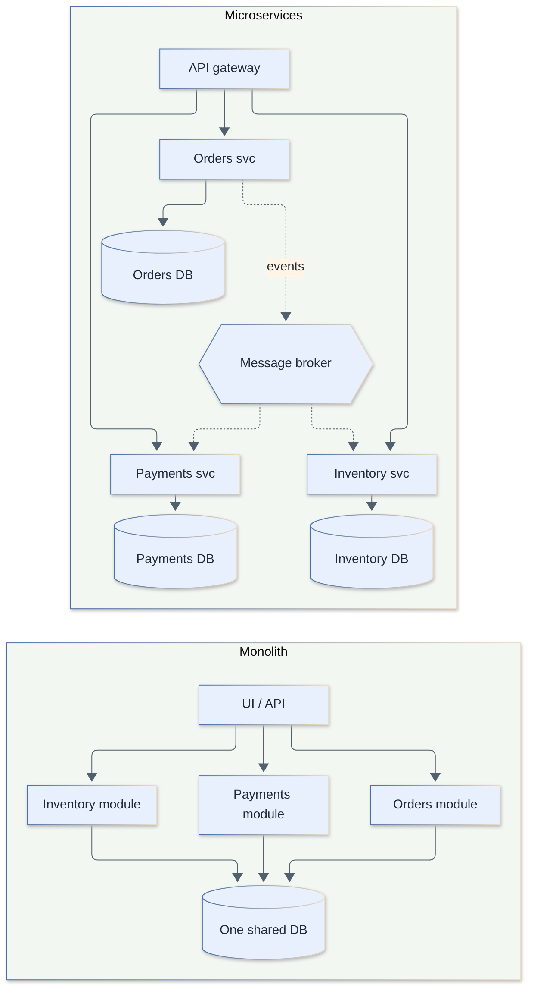
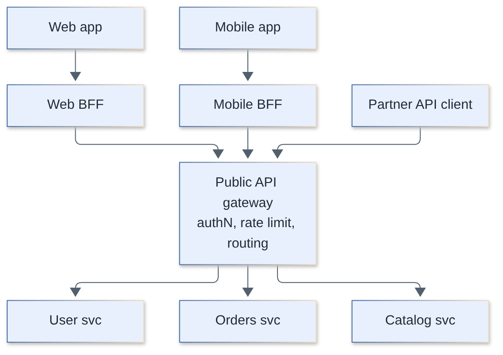
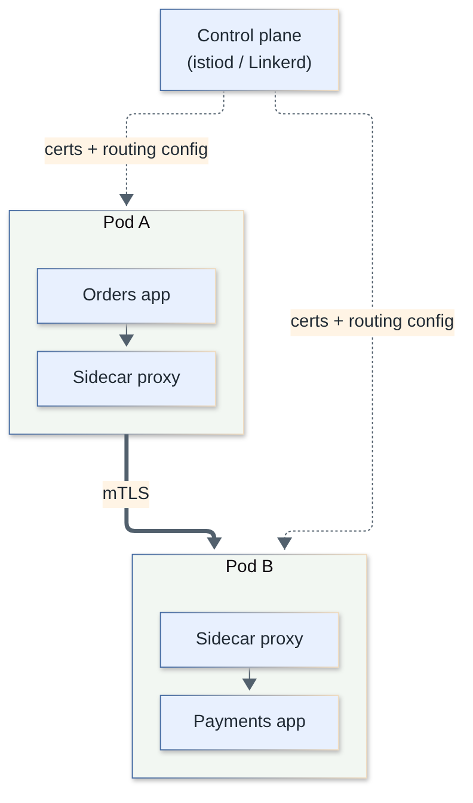
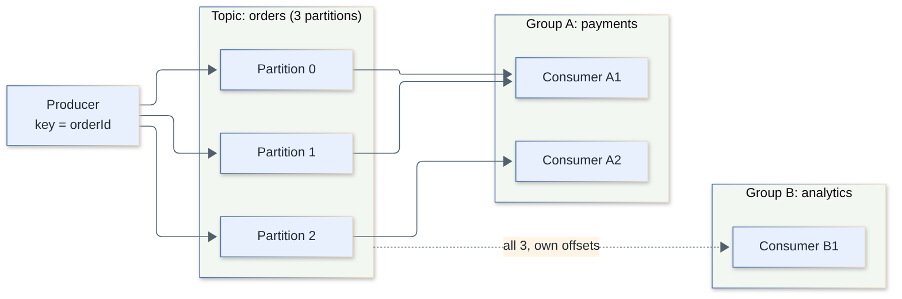
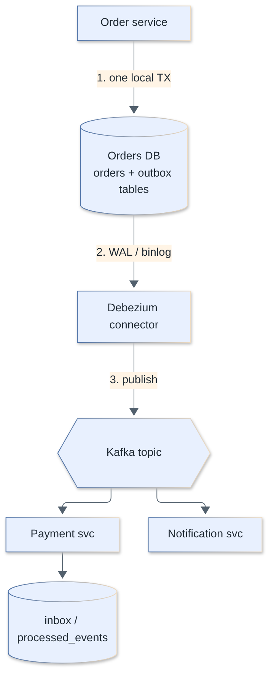
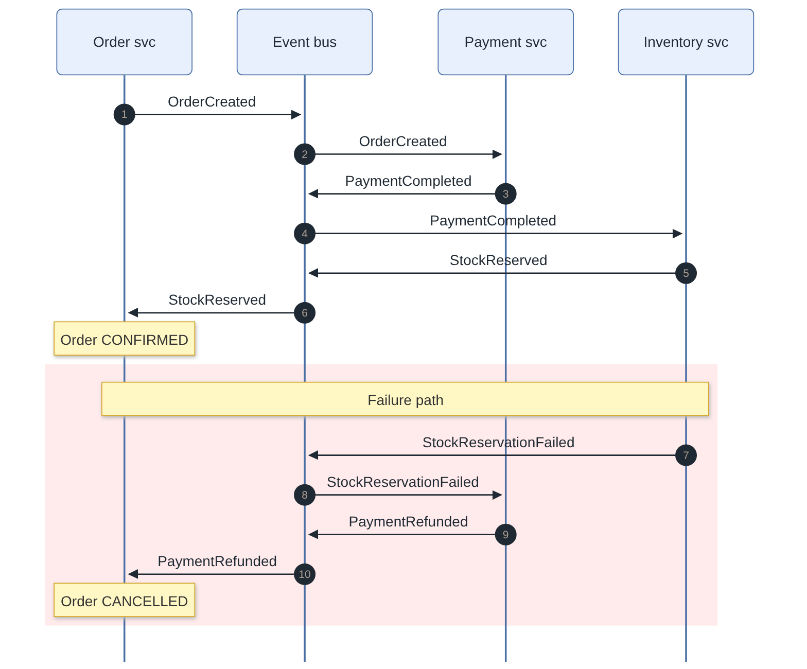
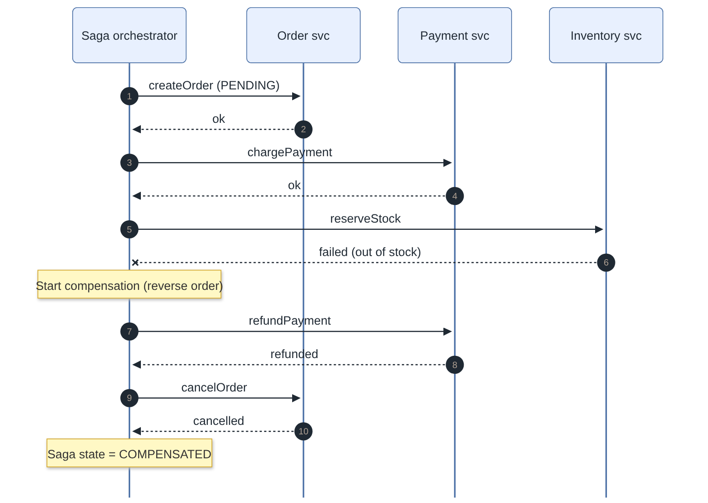
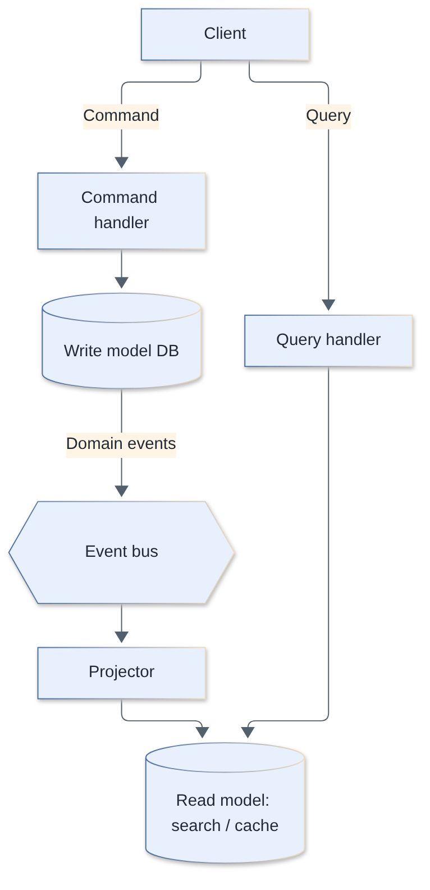
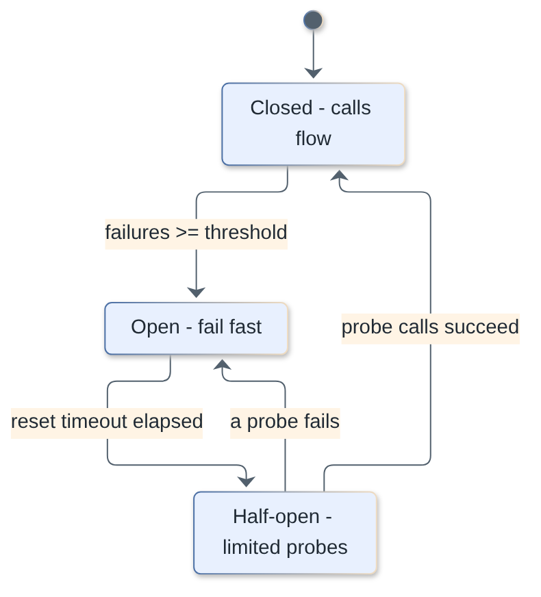
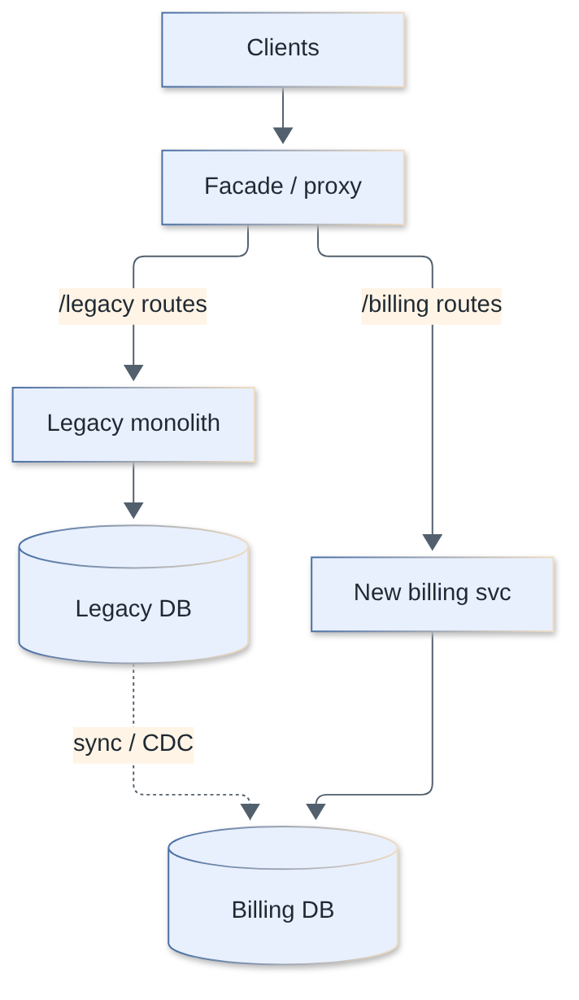

# Microservices Interview Questions

Questions and answers on microservices architecture: service boundaries, communication, messaging, distributed transactions, resilience, observability and migration. Each answer starts with a short version you can say out loud, then goes deeper.

**Levels:** `🟢 Junior` · `🟡 Middle` · `🔴 Senior`

## Table of contents


**Fundamentals**

1. [1. What is a microservices architecture and how does it differ from a monolith?](#1-what-is-a-microservices-architecture-and-how-does-it-differ-from-a-monolith)
2. [2. What are the benefits and drawbacks of microservices?](#2-what-are-the-benefits-and-drawbacks-of-microservices)
3. [3. Modular monolith vs microservices: when should you NOT use microservices?](#3-modular-monolith-vs-microservices-when-should-you-not-use-microservices)

**Service Boundaries & Data Ownership**

4. [4. How do you define service boundaries? (DDD bounded contexts and aggregates)](#4-how-do-you-define-service-boundaries-ddd-bounded-contexts-and-aggregates)
5. [5. What is context mapping, and how does Conway's law affect boundaries?](#5-what-is-context-mapping-and-how-does-conways-law-affect-boundaries)
6. [6. Why does each microservice get its own database, and how do you handle joins and reporting?](#6-why-does-each-microservice-get-its-own-database-and-how-do-you-handle-joins-and-reporting)
7. [7. How do you query data that lives in several services? (API composition vs replicated read models)](#7-how-do-you-query-data-that-lives-in-several-services-api-composition-vs-replicated-read-models)

**Service Communication**

8. [8. Synchronous vs asynchronous communication between services: when to use which?](#8-synchronous-vs-asynchronous-communication-between-services-when-to-use-which)
9. [9. REST vs gRPC for service-to-service calls?](#9-rest-vs-grpc-for-service-to-service-calls)
10. [10. Commands vs events, and event notification vs event-carried state transfer?](#10-commands-vs-events-and-event-notification-vs-event-carried-state-transfer)
11. [11. What is service discovery and how does it work?](#11-what-is-service-discovery-and-how-does-it-work)
12. [12. What are an API gateway and the BFF pattern?](#12-what-are-an-api-gateway-and-the-bff-pattern)
13. [13. What is a service mesh? Sidecar vs ambient mode?](#13-what-is-a-service-mesh-sidecar-vs-ambient-mode)

**Messaging & Event-Driven Architecture**

14. [14. Kafka vs RabbitMQ vs SQS/SNS: how do you choose?](#14-kafka-vs-rabbitmq-vs-sqssns-how-do-you-choose)
15. [15. How do Kafka partitions and consumer groups work, and what are the ordering guarantees?](#15-how-do-kafka-partitions-and-consumer-groups-work-and-what-are-the-ordering-guarantees)
16. [16. What delivery guarantees exist, and how do you build an idempotent consumer?](#16-what-delivery-guarantees-exist-and-how-do-you-build-an-idempotent-consumer)
17. [17. Is "exactly-once" delivery real? What does Kafka's exactly-once semantics actually guarantee?](#17-is-exactly-once-delivery-real-what-does-kafkas-exactly-once-semantics-actually-guarantee)
18. [18. What are the transactional outbox and inbox patterns?](#18-what-are-the-transactional-outbox-and-inbox-patterns)
19. [19. What is CDC (Debezium) and how does it compare to a polling outbox relay?](#19-what-is-cdc-debezium-and-how-does-it-compare-to-a-polling-outbox-relay)
20. [20. How do you handle failures in message consumers: retries, DLQs, poison messages and backpressure?](#20-how-do-you-handle-failures-in-message-consumers-retries-dlqs-poison-messages-and-backpressure)

**Distributed Transactions, CQRS & Consistency**

21. [21. Why not use two-phase commit (2PC) across services? What is the alternative?](#21-why-not-use-two-phase-commit-2pc-across-services-what-is-the-alternative)
22. [22. Saga: choreography vs orchestration](#22-saga-choreography-vs-orchestration)
23. [23. Implement a saga orchestrator with compensations.](#23-implement-a-saga-orchestrator-with-compensations)
24. [24. What is CQRS and when is it worth the cost?](#24-what-is-cqrs-and-when-is-it-worth-the-cost)
25. [25. What is event sourcing and what are its costs?](#25-what-is-event-sourcing-and-what-are-its-costs)
26. [26. How do you deal with eventual consistency in the UX, and what is read-your-writes?](#26-how-do-you-deal-with-eventual-consistency-in-the-ux-and-what-is-read-your-writes)

**Resilience**

27. [27. Why do you need timeouts and retries between services?](#27-why-do-you-need-timeouts-and-retries-between-services)
28. [28. How do you implement retries with exponential backoff and jitter? What is a retry storm?](#28-how-do-you-implement-retries-with-exponential-backoff-and-jitter-what-is-a-retry-storm)
29. [29. How does a circuit breaker work? Implement one.](#29-how-does-a-circuit-breaker-work-implement-one)
30. [30. What are bulkheads, rate limiting and fallbacks?](#30-what-are-bulkheads-rate-limiting-and-fallbacks)
31. [31. What causes cascading failures and how do you prevent them?](#31-what-causes-cascading-failures-and-how-do-you-prevent-them)

**Observability & Testing**

32. [32. What are the pillars of observability and why do health checks matter?](#32-what-are-the-pillars-of-observability-and-why-do-health-checks-matter)
33. [33. How do distributed tracing and correlation IDs work?](#33-how-do-distributed-tracing-and-correlation-ids-work)
34. [34. What is the testing strategy for microservices? Explain contract testing (Pact).](#34-what-is-the-testing-strategy-for-microservices-explain-contract-testing-pact)
35. [35. How do you evolve schemas and APIs without breaking consumers? (schema registry, compatibility)](#35-how-do-you-evolve-schemas-and-apis-without-breaking-consumers-schema-registry-compatibility)

**Evolution & Delivery**

36. [36. How do you version service APIs?](#36-how-do-you-version-service-apis)
37. [37. What does deployment independence require? (CI/CD, canary, feature flags)](#37-what-does-deployment-independence-require-cicd-canary-feature-flags)
38. [38. How do you migrate from a monolith with the strangler fig pattern?](#38-how-do-you-migrate-from-a-monolith-with-the-strangler-fig-pattern)
39. [39. Shared libraries vs code duplication across services?](#39-shared-libraries-vs-code-duplication-across-services)

**Security & Pitfalls**

40. [40. How do you secure service-to-service communication? (mTLS, zero trust, JWT propagation)](#40-how-do-you-secure-service-to-service-communication-mtls-zero-trust-jwt-propagation)
41. [41. What are the common microservices anti-patterns?](#41-what-are-the-common-microservices-anti-patterns)
42. [42. Your microservices system is slow and fragile. How do you diagnose it, and when would you consolidate services?](#42-your-microservices-system-is-slow-and-fragile-how-do-you-diagnose-it-and-when-would-you-consolidate-services)

---

## Fundamentals

### 1. What is a microservices architecture and how does it differ from a monolith?

`🟢 Junior` · `#fundamentals` `#architecture`

A microservices architecture structures an application as a set of small, independently deployable services, each owning one business capability and its own data, communicating over the network. A monolith is a single deployable unit where all modules run in one process and usually share one database.

The key word is *independently deployable*. If you cannot release service A without coordinating with service B, you do not have microservices, you have a distributed monolith (see Q41).

| | Monolith | Microservices |
|---|---|---|
| Deployment | One artifact | One artifact per service |
| Scaling | Whole app together | Per service |
| Data | Usually one shared DB | Database per service |
| Calls between modules | In-process function call | Network call (can fail, be slow) |
| Transactions | ACID across modules | Eventual consistency, sagas |
| Tech stack | One | Can differ per service |
| Operational cost | Low | High (CI/CD, observability, networking) |
| Team coupling | High as it grows | Low if boundaries are right |



> **Follow-up:** *What is the main thing you give up?* In-process calls and ACID transactions: every call becomes a remote call with latency and partial failure, and cross-service consistency becomes your problem.

[↑ Back to top](#table-of-contents)

### 2. What are the benefits and drawbacks of microservices?

`🟢 Junior` · `#fundamentals` `#trade-offs`

Benefits: independent deployment and scaling, team autonomy, fault isolation, and freedom to pick the right tech per service. Drawbacks: distributed-systems complexity (network failures, latency, consistency), heavy operational overhead, harder testing and debugging, and data management across services.

**Benefits in practice**

- Teams ship on their own cadence, without a release train.
- A memory leak in the recommendations service does not have to take down checkout (if you built bulkheads and timeouts).
- Hot paths (search, pricing) scale on their own, instead of scaling the whole monolith.
- Smaller codebases are easier to understand and rewrite.

**Costs people underestimate**

- The 8 fallacies of distributed computing become real: the network is not reliable, latency is not zero.
- You need service discovery, an API gateway, tracing, centralized logging, per-service CI/CD, secrets management, and on-call for many services.
- No cross-service joins and no ACID: you need sagas, outbox, idempotency.
- Local development and end-to-end testing get harder.
- Organizational cost: you need teams mature enough to own services end-to-end ("you build it, you run it").

Microservices primarily solve an *organizational scaling* problem (many teams stepping on each other), not a technical performance problem.

> **Follow-up:** *Does microservices improve performance?* Usually the opposite for a single request (network hops). It improves scalability and team throughput, not latency.

[↑ Back to top](#table-of-contents)

### 3. Modular monolith vs microservices: when should you NOT use microservices?

`🟡 Middle` · `#architecture` `#trade-offs`

A modular monolith is one deployable with strict internal module boundaries (own schema or tables, public interfaces only, no reaching into another module's internals). Prefer it by default; move to microservices only when you have a concrete reason that modularity cannot solve, such as independent scaling, independent release cadence for many teams, or different runtime requirements.

**Do NOT use microservices when**

- The team is small (rule of thumb: fewer than ~10-20 engineers) and one team owns everything.
- The domain is not understood yet. Wrong boundaries are far more expensive to fix across the network than across modules.
- You have no DevOps maturity: no CI/CD, no observability, no automated infra.
- It is an early-stage product where speed of iteration matters most.
- The only motivation is "Netflix does it" or CV-driven design.

**Modular monolith done right**

- Each module owns its tables; other modules access them only through the module's public API (or events).
- Enforce boundaries in tooling: ESLint `no-restricted-imports`, `dependency-cruiser`, Nx module-boundary rules, separate packages in a workspace.
- Modules communicate via interfaces or in-process events, so extracting one later means swapping the transport.

```ts
// orders/public-api.ts - the ONLY thing other modules may import
export interface OrdersApi {
  getOrderSummary(id: string): Promise<OrderSummary>;
}
// payments/ imports `OrdersApi`, never `orders/internal/*`
```

| | Modular monolith | Microservices |
|---|---|---|
| Deploy | One unit | Many |
| Refactor boundaries | IDE rename / move | Cross-repo, cross-team, API versioning |
| Consistency | ACID possible | Eventual |
| Ops cost | Low | High |
| Path to split | Easy if boundaries enforced | n/a |

Real-world note: several well-known companies publicly moved some systems back from microservices to a (modular) monolith to cut cost and complexity. The lesson is not "microservices bad" but "match architecture to team size and problem".

> **Follow-up:** *How do you know a module is ready to extract?* It has a stable narrow interface, its own data with no cross-module joins, a distinct scaling/release need, and an owning team.

[↑ Back to top](#table-of-contents)

## Service Boundaries & Data Ownership

### 4. How do you define service boundaries? (DDD bounded contexts and aggregates)

`🟡 Middle` · `#ddd` `#design`

Draw boundaries around business capabilities, using DDD bounded contexts: a context is a boundary within which a model and its language (ubiquitous language) are consistent. A service usually maps to one bounded context (or a subdomain), and transactional consistency is limited to a single aggregate.

**Key DDD concepts**

- **Bounded context**: "Customer" means different things in Sales (lead, pricing tier), Billing (payer, tax id) and Support (ticket requester). Each context has its own model; do not build one giant shared `Customer`.
- **Aggregate**: a cluster of entities/value objects treated as one consistency unit, with a single *aggregate root* as entry point. Invariants are enforced inside one aggregate within one transaction.
- **Rule of thumb**: one transaction = one aggregate. Aggregates reference each other by ID, never by object reference.
- **Event Storming** workshops are the practical technique: map domain events, commands, aggregates, then see where language changes: those are context boundaries.

**Signals of good boundaries**

- High cohesion inside, low coupling outside; most changes touch one service.
- A service can be described without "and".
- Few synchronous calls needed to complete a typical use case.
- Boundaries match team ownership (Conway's law, Q5).

**Signals of bad boundaries**: changing one feature requires changing and deploying 3 services together; services share tables; circular dependencies; "CRUD services" per database table (an anemic, entity-per-service split).

```ts
// Aggregate: invariants enforced inside one transaction
class Order {
  private lines: OrderLine[] = [];
  constructor(readonly id: string, readonly customerId: string /* ID reference only */) {}
  addLine(sku: string, qty: number, price: number) {
    if (qty <= 0) throw new Error("qty must be > 0");
    this.lines.push({ sku, qty, price });
  }
  get total() { return this.lines.reduce((s, l) => s + l.qty * l.price, 0); }
}
```

> **Follow-up:** *Should the service be as small as an aggregate?* Usually no. A service contains one or several related aggregates of a bounded context; "nano-services" create chatty, coupled systems.

[↑ Back to top](#table-of-contents)

### 5. What is context mapping, and how does Conway's law affect boundaries?

`🔴 Senior` · `#ddd` `#organization`

A context map documents how bounded contexts relate (upstream/downstream, who conforms to whom). Conway's law says systems mirror the communication structure of the organization that builds them, so you should shape teams deliberately ("inverse Conway maneuver") to get the architecture you want.

**Context mapping patterns**

| Pattern | Meaning | When |
|---|---|---|
| Shared kernel | Two contexts share a small piece of model/code | Tightly cooperating teams; costly coordination |
| Customer / supplier | Downstream's needs influence upstream's plan | Teams with a working relationship |
| Conformist | Downstream adopts the upstream model as is | Upstream is external/powerful (e.g. a payment provider) |
| Anti-corruption layer (ACL) | Translation layer protects your model from a foreign one | Integrating with legacy or third-party systems |
| Open host service + published language | Upstream exposes a well-documented, stable API/schema | One upstream, many consumers |
| Separate ways | No integration | Cost of integration > benefit |
| Partnership | Teams succeed or fail together, coordinate releases | Small number of tightly aligned teams |

**ACL example**: a legacy ERP returns `{ CUST_NO, CUST_NM, STAT: "A" }`. A thin adapter maps it to your `Customer { id, name, status: "active" }` so legacy naming never leaks into the domain.

```ts
interface LegacyCustomer { CUST_NO: string; CUST_NM: string; STAT: "A" | "I" }
const toCustomer = (l: LegacyCustomer): Customer => ({
  id: l.CUST_NO,
  name: l.CUST_NM,
  status: l.STAT === "A" ? "active" : "inactive",
});
```

**Conway's law in practice**: if three teams must change one service for every feature, either the boundary or the team split is wrong. Align service ownership with stream-aligned teams, and keep cognitive load per team bounded (Team Topologies).

**Failure modes**: sharing a "common domain model" library across contexts (couples release cycles), skipping the ACL and letting a legacy model infect new services.

> **Follow-up:** *Shared kernel vs published language?* Shared kernel shares code/model (tight coupling, both sides change it together); published language is a versioned contract the upstream owns and consumers read.

[↑ Back to top](#table-of-contents)

### 6. Why does each microservice get its own database, and how do you handle joins and reporting?

`🟢 Junior` · `#data` `#database-per-service`

Each service owns its data and is the only one allowed to access it directly, so services can change their schema and storage tech independently and are not coupled through the database. Other services get the data through the owning service's API or events. Cross-service joins are replaced by API composition, replicated read models, or a data warehouse for reporting.

**What "own" means**: it can be a separate schema, separate DB instance, or separate cluster. The rule is access control: no other service has credentials to query those tables.

**Why not a shared DB**

- Schema changes become cross-team breaking changes.
- Hidden coupling: you cannot tell who depends on a column.
- A heavy query by one service degrades all.
- Forces everything onto one storage technology.

**Handling cross-service needs**

| Need | Approach |
|---|---|
| Show order + customer name | API composition (call both) or store a local copy of `customerName` from events |
| Cross-service search/list | CQRS read model / search index fed by events |
| Reporting/analytics | Stream events or CDC into a warehouse/lake |
| Transaction across services | Saga (Q21-23) |

> **Follow-up:** *Does DB-per-service mean a DB server per service?* No. Separate schemas on a shared cluster are acceptable early, provided access is strictly enforced and nobody joins across schemas.

[↑ Back to top](#table-of-contents)

### 7. How do you query data that lives in several services? (API composition vs replicated read models)

`🔴 Senior` · `#data` `#cqrs` `#consistency`

Either compose at request time (a gateway/BFF/aggregator calls each service and merges) or pre-compute a denormalized read model by consuming events from the services. Composition is simple but couples availability and latency; read models are fast and resilient but eventually consistent and cost more to build.

| | API composition | Replicated read model (CQRS view) |
|---|---|---|
| Freshness | Real time | Eventually consistent |
| Latency | Sum/max of downstream calls | Single local read |
| Availability | Product of all downstream availabilities | Independent of upstreams at read time |
| Pagination/sort/filter across services | Painful, in-memory | Native in the view's DB |
| Complexity | Low | Higher: projections, backfill, schema evolution |

**Availability math**: calling 5 services each at 99.9% gives about 99.5% (0.999^5) before retries, and tail latency is dominated by the slowest call. Composition therefore needs timeouts, parallel calls, and partial-response fallbacks.

**Replicated data (event-carried state transfer)**: Orders keeps `customers_cache(id, name, tier)` updated from `CustomerUpdated` events. It reads locally. Failure modes: missed or out-of-order events (use versions/timestamps, `WHERE incoming.version > stored.version`), initial backfill (snapshot topic or a bootstrap API), and GDPR deletes that must propagate to every copy.

**Rule of thumb**: compose for simple, low-fan-out, must-be-fresh lookups; build a read model for list/search/dashboards or when fan-out is high.

> **Follow-up:** *What about GraphQL federation?* It is API composition with a schema layer: great for client ergonomics, but it has the same availability and N+1 fan-out issues, so you still need dataloaders, timeouts, and caching.

[↑ Back to top](#table-of-contents)

## Service Communication

### 8. Synchronous vs asynchronous communication between services: when to use which?

`🟢 Junior` · `#communication`

Synchronous (HTTP/gRPC request-response): the caller waits for the answer; simple but couples availability and latency. Asynchronous (messages/events via a broker): the caller publishes and moves on; decouples services in time and improves resilience, but adds eventual consistency and operational complexity.

| | Synchronous | Asynchronous |
|---|---|---|
| Coupling | Temporal: callee must be up now | Callee can be down, processes later |
| Latency | Caller waits | Caller returns immediately |
| Failure handling | Timeouts, retries, circuit breakers | Retries, DLQ, idempotency |
| Debugging | Easier (stack-like trace) | Harder (flow across brokers) |
| Fits | Queries, need an answer now (price, auth check) | Commands that can complete later, notifications, fan-out, integration events |

**Guidelines**

- Use sync for queries where the user needs the data now.
- Use async for state-changing workflows between services (order placed -> reserve stock -> notify), so one slow/down service does not block the rest.
- A chain of synchronous calls A -> B -> C -> D multiplies latency and failure probability: avoid long chains.
- Mixing is normal: sync at the edge (client -> gateway -> service), async between services.

> **Follow-up:** *Can async communication still be request/reply?* Yes: send a command with a `replyTo` queue and `correlationId`, but you now own timeouts and orphaned replies; often better to return 202 Accepted and let the client poll or receive a push.

[↑ Back to top](#table-of-contents)

### 9. REST vs gRPC for service-to-service calls?

`🟡 Middle` · `#communication` `#grpc` `#rest`

REST/JSON is ubiquitous, human-readable and great for public APIs. gRPC (HTTP/2 + Protocol Buffers) gives a strict typed contract, compact binary payloads, streaming, deadlines and code generation, which suits internal, high-throughput, polyglot service-to-service calls.

| | REST/JSON | gRPC |
|---|---|---|
| Transport | HTTP/1.1 or 2 | HTTP/2 |
| Payload | JSON (text) | Protobuf (binary, smaller, faster to parse) |
| Contract | OpenAPI (optional) | `.proto` (mandatory, codegen) |
| Streaming | SSE/WebSocket workaround | Native client/server/bidi streaming |
| Browser support | Native | Needs gRPC-Web + proxy |
| Debuggability | curl, browser | Needs grpcurl/tooling |
| Deadlines/cancellation | DIY | Built in, propagates across calls |
| Caching/CDN | HTTP caching works | Not cacheable by default |

```proto
syntax = "proto3";
service PricingService {
  rpc GetPrice (PriceRequest) returns (PriceReply);
}
message PriceRequest { string sku = 1; }
message PriceReply   { int64 amount_minor = 1; string currency = 2; }
```

**Gotchas**

- gRPC load balancing: long-lived HTTP/2 connections stick to one backend with L4 balancers; use client-side/L7 balancing (or a mesh) so requests spread across pods.
- Protobuf evolution rules: never reuse or renumber field tags; add new fields as optional; reserve removed tags.
- Always set deadlines (gRPC) / timeouts (REST); propagate the remaining deadline downstream.

Typical choice: REST (or GraphQL) at the public edge, gRPC internally where performance/typing matters, events for async integration.

> **Follow-up:** *Why not use Protobuf field numbers freely?* The tag number is the wire identity. Reusing a number for a different type corrupts old readers silently; use `reserved`.

[↑ Back to top](#table-of-contents)

### 10. Commands vs events, and event notification vs event-carried state transfer?

`🟡 Middle` · `#events` `#messaging`

A command is a request to do something, addressed to one handler, and can be rejected (`ReserveStock`). An event is a fact that already happened, broadcast to any number of subscribers who the publisher does not know (`StockReserved`). Event notification carries minimal data (an ID) and receivers call back for details; event-carried state transfer includes the data receivers need, so they never call back.

| | Command | Event |
|---|---|---|
| Tense | Imperative: `ChargeCard` | Past: `CardCharged` |
| Receivers | Exactly one | Zero to many |
| Sender knows receiver | Yes | No |
| Can be rejected | Yes | No (it already happened) |
| Coupling | Higher | Lower |

**Event styles**

| Style | Payload | Pros | Cons |
|---|---|---|---|
| Event notification | `{ orderId }` | Small, simple, data stays owned by source | Consumers call back: coupling, load, and the data may have changed since |
| Event-carried state transfer (ECST) | Full/relevant state `{ orderId, items, total, customer }` | Consumers autonomous, work if source is down | Bigger messages, data duplication, schema is a public contract |
| Domain event (event sourcing) | Business fact | Audit, replay | Requires discipline in modeling |

```ts
// Notification
{ type: "OrderPlaced", orderId: "o-1" }

// Event-carried state transfer
{
  type: "OrderPlaced", orderId: "o-1", version: 7,
  customer: { id: "c-9", email: "a@b.com" },
  items: [{ sku: "X", qty: 2, price: 1500 }],
  total: 3000, occurredAt: "2026-10-08T10:00:00Z"
}
```

Pitfalls: events named as commands in disguise (`SendEmailEvent`), "fat" events that leak internal DB structure, and omitting `version`/`occurredAt`, which makes out-of-order handling impossible.

> **Follow-up:** *Which should you pick by default?* ECST when consumers need the data and you want them decoupled at runtime; notification when payloads are sensitive/huge or consumers rarely need the details.

[↑ Back to top](#table-of-contents)

### 11. What is service discovery and how does it work?

`🟢 Junior` · `#infrastructure` `#discovery`

Service discovery lets services find each other's network addresses dynamically, since instances start, stop and move constantly. Services register in (or are discovered via) a registry, and callers look up healthy instances by name.

**Two models**

- **Client-side discovery**: the client queries a registry (Consul, Eureka) and load balances itself.
- **Server-side discovery**: the client calls a stable name/load balancer, which picks an instance (AWS ALB, Kubernetes Service).

**In Kubernetes** (most common today) discovery is built in: a `Service` gives a stable virtual IP and a DNS name (`payments.shop.svc.cluster.local`); kube-proxy/eBPF dataplane routes to ready pods; readiness probes remove unhealthy pods from endpoints. You rarely need Consul/Eureka unless you span clusters or non-K8s workloads.

```ts
// In k8s the "discovery" is just DNS
const res = await fetch("http://payments.shop.svc.cluster.local/charge", { method: "POST" });
```

Gotchas: DNS caching (stale endpoints after a deploy), health checks that only test "process is up" instead of "can serve", and gRPC connection stickiness (Q9).

> **Follow-up:** *Where does the service mesh fit?* It moves discovery, load balancing, retries and mTLS into the proxy layer (Q13).

[↑ Back to top](#table-of-contents)

### 12. What are an API gateway and the BFF pattern?

`🟡 Middle` · `#gateway` `#bff`

An API gateway is the single entry point for external clients: it routes requests to services and handles cross-cutting concerns (authentication, rate limiting, TLS termination, caching, request logging). A Backend-for-Frontend (BFF) is a gateway tailored to one client type (web, mobile) that aggregates and shapes data for that UI.



| | API gateway | BFF |
|---|---|---|
| Audience | All external clients | One client experience |
| Responsibility | Routing, authN/Z, throttling, TLS | Aggregation, response shaping, client-specific logic |
| Owned by | Platform team | Frontend team of that client |
| Examples | Kong, AWS API Gateway, Envoy/Istio gateway, Apigee | Node/GraphQL service per client |

**Why BFF**: the mobile app wants a compact payload with 1 call, the web dashboard wants rich data; one generic API either over-fetches or forces chatty clients. A BFF lets each frontend team evolve its API without negotiating with every backend service.

**Pitfalls**

- Gateway becomes a bottleneck / single point of failure: run it redundantly and keep it stateless.
- Business logic creeping into the gateway (it becomes a "god" service); keep it to edge concerns.
- A single shared BFF for all clients re-creates the generic-API problem.
- Do not rely on the gateway alone for security: services must still authorize requests (Q40).

> **Follow-up:** *Gateway vs service mesh?* Gateway handles north-south traffic (client to cluster); mesh handles east-west (service to service).

[↑ Back to top](#table-of-contents)

### 13. What is a service mesh? Sidecar vs ambient mode?

`🔴 Senior` · `#service-mesh` `#istio` `#security`

A service mesh is an infrastructure layer that handles service-to-service traffic concerns (mTLS, retries, timeouts, load balancing, traffic shifting, telemetry) outside application code, via a data plane of proxies configured by a control plane. In sidecar mode each pod gets its own proxy; in Istio's ambient mode, node-level L4 proxies (ztunnel) handle mTLS and identity, with optional per-namespace L7 waypoint proxies for advanced routing.



**What you get**: automatic mTLS with workload identity (SPIFFE), uniform metrics/traces, canary/traffic splitting, fault injection, retries/timeouts/circuit breaking by policy, and authorization policies.

| | Sidecar (Istio, Linkerd) | Ambient (Istio) |
|---|---|---|
| Proxy placement | One Envoy/proxy per pod | ztunnel per node (L4) + optional waypoint (L7) |
| Overhead | CPU/memory per pod, extra hops | Lower per-pod overhead |
| App changes | Sidecar injection, pod restart on upgrade | No pod restarts to adopt/upgrade |
| L7 features | Always available | Only where a waypoint is deployed |
| Maturity | Longest track record | Ambient reached GA (stable) in Istio 1.24 (Nov 2024) |

Linkerd uses lightweight purpose-built sidecar proxies and favors simplicity; Istio is more featureful and more complex.

**Trade-offs and failure modes**

- Added latency (a hop or two) and resource cost; one more complex system to operate and upgrade.
- A mis-configured mesh (bad retry policy, wrong mTLS mode) can take down traffic cluster-wide.
- Retries in the mesh *and* in the app multiply (3 x 3 = 9 attempts): pick one layer.
- Mesh does not remove the need for application-level idempotency, timeouts and fallbacks.

**When to adopt**: many services, a strict zero-trust/mTLS requirement, or need for uniform traffic management. With a handful of services, a library plus ingress is usually enough.

> **Follow-up:** *Why mTLS via the mesh instead of in the app?* Certificate issuance, rotation and identity are handled for every workload uniformly, with no per-language TLS code.

[↑ Back to top](#table-of-contents)

## Messaging & Event-Driven Architecture

### 14. Kafka vs RabbitMQ vs SQS/SNS: how do you choose?

`🟡 Middle` · `#messaging` `#kafka` `#rabbitmq` `#aws`

Kafka is a distributed, partitioned, replicated *log*: consumers track offsets, messages are retained and replayable, and it excels at high-throughput streaming and event backbones. RabbitMQ is a *smart broker*: flexible routing via exchanges, messages are removed once acknowledged, great for task queues and complex routing. SQS is a fully managed queue (SNS adds pub/sub fan-out); minimal ops, good for decoupling on AWS.

| | Kafka | RabbitMQ | SQS (+SNS) |
|---|---|---|---|
| Model | Append-only partitioned log | Exchanges -> queues, push to consumers | Managed queue; SNS topic fans out to queues |
| Retention | Time/size-based, or compaction; replay possible | Deleted after ack (Streams feature adds log semantics) | Up to 14 days, deleted after processing |
| Ordering | Per partition | Per queue (broken by competing consumers/requeues) | Standard: best effort; FIFO: per message group |
| Throughput | Very high (partitioned) | Moderate-high | Very high (Standard), limited per FIFO group |
| Routing | By topic/partition key | Rich (direct, topic, fanout, headers) | SNS filter policies |
| Consumer model | Pull, consumer groups | Push with prefetch | Pull with visibility timeout |
| Replay/reprocess | Yes (reset offsets) | No (unless streams) | No (DLQ redrive only) |
| Ops burden | High (self-managed) or managed (MSK, Confluent) | Medium | None |
| Dedup/"exactly-once" | Idempotent producer + transactions (inside Kafka) | None built in | FIFO queues dedupe within a 5-minute window |

**Rules of thumb**

- Event backbone, event sourcing, stream processing, replay, multiple independent consumer groups: Kafka.
- Work queues, request/reply, complex routing, per-message TTL and priorities: RabbitMQ.
- On AWS with modest needs and zero ops: SNS fan-out to SQS queues per subscriber, with a DLQ each.

Note: Kafka 4.0 (March 2025) removed ZooKeeper; clusters run in KRaft mode only, which simplifies operations.

> **Follow-up:** *Why not use the database as a queue?* Fine at low scale (e.g. `SELECT ... FOR UPDATE SKIP LOCKED`), but you own polling, retries, cleanup and you load the primary DB.

[↑ Back to top](#table-of-contents)

### 15. How do Kafka partitions and consumer groups work, and what are the ordering guarantees?

`🟡 Middle` · `#kafka` `#ordering`

A topic is split into partitions; each partition is an ordered, append-only log. Kafka guarantees order only within a partition. Messages with the same key go to the same partition, so per-key order holds. Within a consumer group, each partition is assigned to at most one consumer, so parallelism is capped by the number of partitions; different groups each receive all messages independently.



**Key facts**

- **Partition key** (e.g. `orderId`) -> hash -> partition. All events of one order stay in order.
- **Consumer group**: scaling out consumers beyond the partition count leaves extras idle. Adding partitions later changes the key-to-partition mapping, so ordering for existing keys breaks across the change.
- **Offsets**: the consumer commits the position it has processed; after a crash, a consumer resumes from the last committed offset (messages after it are redelivered: at-least-once).
- **Rebalances**: when consumers join/leave, partitions are reassigned and processing pauses briefly; long processing exceeding `max.poll.interval.ms` gets a consumer kicked out of the group.
- **Retention**: `retention.ms` / `retention.bytes` delete old segments; **log compaction** keeps the latest value per key (good for state/changelog topics).
- **Replication**: each partition has a leader and followers; `acks=all` + `min.insync.replicas` determines durability.
- **Hot partitions**: a skewed key (one huge tenant) overloads one partition.

```ts
// kafkajs: key guarantees per-order ordering
await producer.send({
  topic: "orders",
  messages: [{ key: order.id, value: JSON.stringify(event) }],
});

const consumer = kafka.consumer({ groupId: "payments" });
await consumer.subscribe({ topic: "orders" });
await consumer.run({
  autoCommit: false,
  eachMessage: async ({ topic, partition, message }) => {
    await handle(message);                       // must be idempotent
    await consumer.commitOffsets([{ topic, partition, offset: (BigInt(message.offset) + 1n).toString() }]);
  },
});
```

> **Follow-up:** *How do you preserve order while processing in parallel?* Process partitions in parallel but messages within a partition (or within a key) sequentially; do not fan out one partition's messages to a worker pool without per-key serialization.

[↑ Back to top](#table-of-contents)

### 16. What delivery guarantees exist, and how do you build an idempotent consumer?

`🟡 Middle` · `#messaging` `#idempotency` `#reliability`

Brokers offer at-most-once (may lose), at-least-once (may duplicate), and "exactly-once" only in limited scopes. In practice you choose at-least-once delivery and make consumers idempotent, so processing the same message twice has the same effect as once.

| Guarantee | How | Risk |
|---|---|---|
| At-most-once | Ack/commit before processing | Message lost on crash |
| At-least-once | Ack/commit after processing | Duplicates on crash, retry, or rebalance |
| Exactly-once effect | At-least-once + idempotent processing | Needs deliberate design |

**Idempotency techniques**

1. **Natural idempotency**: `SET status = 'SHIPPED'`, upsert by key (not `balance = balance + 10`).
2. **Dedup table (inbox)**: record `message_id` in the *same DB transaction* as the business change; a unique constraint rejects duplicates.
3. **Idempotency key on APIs**: client sends `Idempotency-Key`; server stores the response and replays it.
4. **Versioning**: ignore events with version <= stored version.

```ts
// Idempotent consumer: dedup record + business effect in ONE transaction
async function handlePaymentRequested(db: Pool, msg: { id: string; orderId: string; amount: number }) {
  const client = await db.connect();
  try {
    await client.query("BEGIN");
    const ins = await client.query(
      "INSERT INTO processed_messages (message_id) VALUES ($1) ON CONFLICT DO NOTHING",
      [msg.id],
    );
    if (ins.rowCount === 0) {            // already processed -> skip, still ack
      await client.query("ROLLBACK");
      return;
    }
    await client.query(
      "INSERT INTO payments (order_id, amount, status) VALUES ($1, $2, 'AUTHORIZED')",
      [msg.orderId, msg.amount],
    );
    await client.query("COMMIT");
  } catch (e) {
    await client.query("ROLLBACK");
    throw e;                              // broker will redeliver
  } finally {
    client.release();
  }
}
```

Critical detail: the dedup insert and the side effect must commit atomically. If the side effect is an external call (charging a card), pass an idempotency key to that provider too, since you cannot put it in your transaction.

> **Follow-up:** *How long do you keep dedup records?* At least as long as the broker's max redelivery/retention window (plus margin); then purge with a TTL job.

[↑ Back to top](#table-of-contents)

### 17. Is "exactly-once" delivery real? What does Kafka's exactly-once semantics actually guarantee?

`🔴 Senior` · `#kafka` `#reliability` `#semantics`

Exactly-once *delivery* over an unreliable network is impossible in general (the Two Generals problem): a sender that gets no ack cannot know whether the message arrived. What exists is exactly-once *processing effects*: at-least-once delivery combined with idempotency or atomic transactions. Kafka's EOS covers only read-process-write cycles entirely inside Kafka.

**What Kafka provides**

- **Idempotent producer** (`enable.idempotence=true`; default in modern clients): the broker dedupes producer retries per partition using producer ID + sequence numbers. No duplicates caused by producer retries within a session.
- **Transactions**: a producer atomically writes to multiple partitions/topics *and* commits consumed offsets in one transaction. Consumers with `isolation.level=read_committed` only see committed messages.
- **Kafka Streams**: `processing.guarantee=exactly_once_v2` wires this up for stream processing.

**What it does NOT cover**

- A side effect outside Kafka (DB write, HTTP call, email) is not part of the Kafka transaction: it can happen twice if you crash between the effect and the offset commit.
- Duplicates created by your own application (user double-click, upstream retry with a new message id).
- Consumers that are not `read_committed`.

```ts
// EOS inside Kafka: consume -> transform -> produce + commit offsets atomically
const txn = await producer.transaction();         // kafkajs transactional producer
try {
  await txn.send({ topic: "payments-authorized", messages: [{ key, value: out }] });
  await txn.sendOffsets({
    consumerGroupId: "payments", topics: [{ topic: "orders", partitions: [{ partition, offset: nextOffset }] }],
  });
  await txn.commit();
} catch (e) { await txn.abort(); throw e; }
```

**Interview answer**: "I design for at-least-once plus idempotent handlers (inbox table / idempotency keys). Kafka transactions give exactly-once for Kafka-to-Kafka pipelines, but the moment I touch an external system I need idempotency there."

> **Follow-up:** *SQS FIFO claims exactly-once processing?* It dedupes sends with the same deduplication ID within a 5-minute window and preserves order per message group, but consumers can still see redelivery after visibility timeout expiry, so handlers still need idempotency.

[↑ Back to top](#table-of-contents)

### 18. What are the transactional outbox and inbox patterns?

`🟡 Middle` · `#outbox` `#reliability` `#messaging`

The dual-write problem: updating your DB and publishing an event are two systems, so a crash between them loses or invents events. The transactional outbox fixes this by writing the event into an `outbox` table in the same local transaction as the business change; a separate relay publishes outbox rows to the broker (at-least-once). The inbox is the consumer-side mirror: record processed message IDs transactionally to dedupe.



```sql
CREATE TABLE outbox (
  id           uuid PRIMARY KEY,
  aggregate_id text        NOT NULL,
  type         text        NOT NULL,
  payload      jsonb       NOT NULL,
  created_at   timestamptz NOT NULL DEFAULT now(),
  published_at timestamptz
);
CREATE INDEX outbox_unpublished ON outbox (created_at) WHERE published_at IS NULL;
```

```ts
// 1. Business write + outbox row in ONE transaction
async function placeOrder(db: Pool, order: Order) {
  const c = await db.connect();
  try {
    await c.query("BEGIN");
    await c.query("INSERT INTO orders (id, customer_id, total) VALUES ($1,$2,$3)", [order.id, order.customerId, order.total]);
    await c.query(
      "INSERT INTO outbox (id, aggregate_id, type, payload) VALUES (gen_random_uuid(), $1, 'OrderPlaced', $2)",
      [order.id, JSON.stringify(order)],
    );
    await c.query("COMMIT");
  } catch (e) { await c.query("ROLLBACK"); throw e; } finally { c.release(); }
}

// 2. Polling relay (safe with multiple instances thanks to SKIP LOCKED)
async function relayOnce(db: Pool, producer: Producer, batch = 100) {
  const c = await db.connect();
  try {
    await c.query("BEGIN");
    const { rows } = await c.query(
      `SELECT id, aggregate_id, type, payload FROM outbox
       WHERE published_at IS NULL ORDER BY created_at LIMIT $1 FOR UPDATE SKIP LOCKED`, [batch]);
    if (rows.length) {
      await producer.send({
        topic: "orders",
        messages: rows.map(r => ({
          key: r.aggregate_id,
          value: JSON.stringify(r.payload),
          headers: { "event-id": r.id, "event-type": r.type },   // consumers dedupe on event-id
        })),
      });
      await c.query("UPDATE outbox SET published_at = now() WHERE id = ANY($1)", [rows.map(r => r.id)]);
    }
    await c.query("COMMIT");
  } catch (e) { await c.query("ROLLBACK"); throw e; } finally { c.release(); }
}
setInterval(() => relayOnce(pool, producer).catch(console.error), 500);
```

If the relay crashes after `send` but before the `UPDATE`, rows are re-sent: **duplicates are expected**, hence the inbox/idempotent consumer (Q16) keyed by `event-id`.

**Caveats**: ordering (publish in `created_at`/sequence order, key by aggregate); outbox table growth (delete or partition published rows); polling latency vs DB load (alternative: CDC, Q19); `ORDER BY created_at` is not strictly commit order under concurrent transactions, so use a sequence/LSN-based approach when strict global order matters.

> **Follow-up:** *Why not publish to Kafka inside the DB transaction?* Kafka cannot participate in the DB transaction (no XA in practice); if the commit fails after publishing, you have published a phantom event.

[↑ Back to top](#table-of-contents)

### 19. What is CDC (Debezium) and how does it compare to a polling outbox relay?

`🔴 Senior` · `#cdc` `#debezium` `#outbox`

Change Data Capture reads the database's transaction log (Postgres WAL via logical decoding, MySQL binlog) and turns committed row changes into events, without polling queries. Debezium, running on Kafka Connect, is the standard open-source implementation; with its outbox event router it publishes outbox-table inserts to Kafka topics.

| | Polling relay | CDC (Debezium) |
|---|---|---|
| Latency | Polling interval | Near real-time (log tailing) |
| DB load | Repeated queries | Minimal (reads log) |
| Ordering | Approximate, `created_at` | Commit order from the log |
| Ops | Your code, simple | Kafka Connect + connector + DB config (replication slots) |
| Delivery | At-least-once | At-least-once |
| Tight to DB type | No | Yes (connector per DB) |

**Outbox + Debezium**: write rows to `outbox`; Debezium's `EventRouter` SMT routes each row to a topic (by `aggregate type`), uses `aggregate_id` as the message key, and the row id as an event id header. The outbox rows can be deleted right after insert since the log already captured them.

**Failure modes to know**

- **Replication slot bloat (Postgres)**: if the connector is down, the slot retains WAL and can fill the disk. Monitor slot lag; set `max_slot_wal_keep_size`.
- **Schema changes** in captured tables break consumers; use a schema registry and compatible changes.
- **Duplicates after connector restart** (at-least-once): consumers stay idempotent.
- **Snapshots** of large tables on initial start are heavy.
- Capturing business tables directly (instead of an outbox) leaks your internal schema as a public contract.

> **Follow-up:** *Why not just consume the DB changes as the integration events?* They expose internal table structure and reflect row changes, not business intent; the outbox lets you emit meaningful domain events.

[↑ Back to top](#table-of-contents)

### 20. How do you handle failures in message consumers: retries, DLQs, poison messages and backpressure?

`🔴 Senior` · `#messaging` `#reliability` `#dlq`

Classify the error: transient (timeout, deadlock) -> retry with backoff; permanent (invalid payload, business rule violation) -> do not retry, send to a dead-letter queue (DLQ) with context. Keep one bad message from blocking a partition, and make sure retries do not break ordering assumptions or overload the broken dependency.

**Patterns**

- **Immediate in-process retry** with limited attempts and backoff for transient errors.
- **Retry topics / delay queues**: on failure, publish to `orders.retry.1m`, `orders.retry.10m`, then `orders.dlq`. This unblocks the main partition but loses strict ordering for that key.
- **DLQ**: store original message, error, stack, attempt count, headers. Alert on DLQ depth; build a *redrive* tool (SQS supports DLQ redrive natively).
- **Poison message**: one that always crashes the consumer. Without a max attempt count it blocks the partition forever (Kafka) or loops (queue).
- **Backpressure**: consumers pull at their own pace (Kafka, SQS); with push brokers use prefetch limits (RabbitMQ `prefetch`). Pause consumption when downstream is saturated; autoscale on lag (KEDA).
- **Ordering vs liveness trade-off**: blocking on a failing message preserves order but halts the partition; skipping to DLQ keeps liveness but can apply later events first. Pick per use case (payments ledger: block and alert; notifications: DLQ).

```ts
async function process(msg: Msg, attempt = 0): Promise<void> {
  try {
    await handler(msg);
  } catch (err) {
    if (isPermanent(err) || attempt >= 5) {
      await dlq.send({ original: msg, error: String(err), attempts: attempt });
      return;                                // commit offset, move on
    }
    await sleep(backoffWithJitter(attempt));
    return process(msg, attempt + 1);
  }
}
```

**Monitor**: consumer lag, DLQ size, age of oldest message, redelivery rate.

> **Follow-up:** *What if the DLQ itself fills up?* It signals a systemic bug; page someone, and consider pausing the consumer rather than discarding messages.

[↑ Back to top](#table-of-contents)

## Distributed Transactions, CQRS & Consistency

### 21. Why not use two-phase commit (2PC) across services? What is the alternative?

`🟡 Middle` · `#transactions` `#saga` `#2pc`

2PC (XA) has a coordinator ask all participants to *prepare* (lock and promise), then *commit* if all agreed. It gives atomicity but blocks on locks, makes the coordinator a single point of failure, requires every resource to support XA, and kills availability and throughput. The microservices alternative is a saga: a sequence of local transactions, each with a compensating action that semantically undoes it.

| | 2PC | Saga |
|---|---|---|
| Consistency | Atomic, isolated | Eventual; no isolation |
| Locks | Held across the network during prepare | Only local, short |
| Availability | All participants must be up | Steps progress independently |
| Coordinator failure | Participants blocked in-doubt | Saga state persisted, resumes |
| Broker/NoSQL/HTTP support | Rarely supported | Works with anything |
| Rollback | Automatic | Manual compensations you must write |
| Complexity | In the infrastructure | In your application |

Per the CAP/latency reality of distributed systems, microservices usually trade strict atomicity for availability. 2PC is still reasonable inside one trust boundary with few homogeneous databases (e.g. XA between two Postgres instances you own) and low volume, but it is rare across services.

> **Follow-up:** *What does "lack of isolation" in sagas cause?* Other transactions see intermediate state (an order that is PENDING, money debited but stock not yet reserved). Counter with semantic locks (status flags), commutative updates, and reread-value checks.

[↑ Back to top](#table-of-contents)

### 22. Saga: choreography vs orchestration

`🟡 Middle` · `#saga` `#transactions` `#orchestration`

A saga is a long-running business transaction made of local transactions across services; if a step fails, previously completed steps are undone by compensating transactions. In choreography, services react to each other's events with no central controller. In orchestration, a central orchestrator tells each participant what to do next and drives compensation.

**Example: place an order** (Order -> Payment -> Inventory)

Choreography:



Orchestration with compensation:



| | Choreography | Orchestration |
|---|---|---|
| Control | Decentralized, implicit | Central, explicit state machine |
| Coupling | Low between services, but flow is spread out | Services coupled to orchestrator's commands |
| Visibility | Hard: flow is implicit in event subscriptions | Easy: one place shows saga state |
| Cyclic dependencies | Risk as it grows | Avoided |
| Best for | Simple flows, 2-4 steps | Complex flows, many steps/branches, timeouts |
| Failure points | None central | Orchestrator must be durable/HA |

**Compensation facts**

- Compensations are *semantic* undo: `RefundPayment`, `ReleaseStock`, `CancelOrder`; not rollbacks. Some actions cannot be undone (email sent): put them last or use a "pivot" step design.
- Compensations must be **idempotent** and retryable; they must succeed eventually.
- Order steps: *compensatable steps* first, then the *pivot* (point of no return), then *retriable* steps that must eventually succeed.
- Persist saga state so a crashed orchestrator resumes.

> **Follow-up:** *What if the compensation itself fails?* Retry with backoff indefinitely, then alert a human (manual intervention queue); never silently drop it.

[↑ Back to top](#table-of-contents)

### 23. Implement a saga orchestrator with compensations.

`🔴 Senior` · `#saga` `#typescript` `#orchestration`

An orchestrated saga is a persisted state machine: run steps in order, record progress after each, and on failure run compensations of the completed steps in reverse order. Every step and compensation must be idempotent, because the orchestrator can crash and re-run them.

```ts
type SagaStatus = "RUNNING" | "COMPENSATING" | "COMPLETED" | "COMPENSATED" | "FAILED";

interface SagaStep<Ctx> {
  name: string;
  execute(ctx: Ctx, idempotencyKey: string): Promise<void>;
  compensate?(ctx: Ctx, idempotencyKey: string): Promise<void>;
}

interface SagaState {
  id: string;
  status: SagaStatus;
  completed: string[];              // steps already executed, in order
}

interface SagaStore {
  load(id: string): Promise<SagaState | null>;
  save(state: SagaState): Promise<void>;   // durable (DB), ideally with optimistic version
}

async function withRetry<T>(fn: () => Promise<T>, attempts = 5): Promise<T> {
  let last: unknown;
  for (let i = 0; i < attempts; i++) {
    try { return await fn(); }
    catch (e) { last = e; await new Promise(r => setTimeout(r, Math.random() * 2 ** i * 200)); }
  }
  throw last;
}

class SagaOrchestrator<Ctx> {
  constructor(private steps: SagaStep<Ctx>[], private store: SagaStore) {}

  async run(sagaId: string, ctx: Ctx): Promise<SagaStatus> {
    const state: SagaState =
      (await this.store.load(sagaId)) ?? { id: sagaId, status: "RUNNING", completed: [] };

    if (state.status === "RUNNING") {
      for (const step of this.steps) {
        if (state.completed.includes(step.name)) continue;      // resume after crash
        try {
          await withRetry(() => step.execute(ctx, `${sagaId}:${step.name}`));
          state.completed.push(step.name);
          await this.store.save(state);
        } catch {
          state.status = "COMPENSATING";
          await this.store.save(state);
          break;
        }
      }
      if (state.status === "RUNNING") {
        state.status = "COMPLETED";
        await this.store.save(state);
        return state.status;
      }
    }

    if (state.status === "COMPENSATING") {
      for (const name of [...state.completed].reverse()) {
        const step = this.steps.find(s => s.name === name)!;
        if (step.compensate) {
          // compensations must eventually succeed: retry, then escalate
          await withRetry(() => step.compensate!(ctx, `${sagaId}:${name}:undo`), 10);
        }
        state.completed = state.completed.filter(n => n !== name);
        await this.store.save(state);
      }
      state.status = "COMPENSATED";
      await this.store.save(state);
    }
    return state.status;
  }
}

// Usage
const placeOrder = new SagaOrchestrator<{ orderId: string; amount: number }>([
  { name: "createOrder",  execute: (c, k) => orders.create(c.orderId, k),        compensate: (c, k) => orders.cancel(c.orderId, k) },
  { name: "chargePayment", execute: (c, k) => payments.charge(c.orderId, c.amount, k), compensate: (c, k) => payments.refund(c.orderId, k) },
  { name: "reserveStock", execute: (c, k) => inventory.reserve(c.orderId, k) },   // pivot / last
], sagaStore);
```

**Production concerns this sketch omits**

- Run steps via messages (commands + replies) rather than awaiting HTTP calls, so a step can take minutes; store the correlation id and handle replies idempotently.
- Per-step timeouts and a "stuck saga" sweeper.
- Optimistic locking on `SagaState` so two orchestrator instances do not run the same saga.
- Crash window: a step may have executed but `save` not yet happened; hence idempotency keys on every call.
- Workflow engines (Temporal, AWS Step Functions, Camunda) give durable execution, timers and retries out of the box; prefer them over a hand-rolled engine for non-trivial flows.

> **Follow-up:** *How do you handle a step that times out (unknown outcome)?* Treat it as failed only after querying/idempotently retrying; the compensation (`refund`) must be safe even if the charge never happened.

[↑ Back to top](#table-of-contents)

### 24. What is CQRS and when is it worth the cost?

`🔴 Senior` · `#cqrs` `#architecture`

CQRS (Command Query Responsibility Segregation) separates the model that handles writes (commands) from the model that serves reads (queries), so each can be optimized and scaled independently. The read side is typically a denormalized projection updated from events from the write side, which makes it eventually consistent.



**Levels of CQRS**

1. Separate command and query *code paths* on one database (cheap, often enough).
2. Separate read models in the same DB (views, materialized views).
3. Separate stores: write in Postgres, read in Elasticsearch/Redis/Mongo, synced by events (the full, costly version).

**When it pays off**: very different read/write shapes or loads (read-heavy dashboards, search), complex domain on the write side, need for multiple tailored views, or cross-service queries (Q7).

**Costs**

- Eventual consistency between write and read: "I saved but don't see it" (Q26).
- Projection code, replay/rebuild tooling, versioned read-model schemas.
- Two models to keep in sync; duplicate data; more infra to operate.
- Failure modes: lagging or stuck projection, lost/out-of-order events leading to a drifted read model, rebuild taking hours.

**Anti-pattern**: applying CQRS everywhere on simple CRUD. It adds complexity without benefit. Use it selectively on the contexts that need it.

```ts
// Projection: idempotent, version-guarded upsert into the read model
async function onOrderPlaced(e: OrderPlaced) {
  await readDb.query(
    `INSERT INTO order_view (order_id, customer_name, total, version)
     VALUES ($1,$2,$3,$4)
     ON CONFLICT (order_id) DO UPDATE
       SET customer_name=$2, total=$3, version=$4
       WHERE order_view.version < $4`,
    [e.orderId, e.customer.name, e.total, e.version],
  );
}
```

> **Follow-up:** *Is CQRS the same as event sourcing?* No. They combine well but are independent: you can do CQRS with plain tables and event sourcing without separate read models.

[↑ Back to top](#table-of-contents)

### 25. What is event sourcing and what are its costs?

`🔴 Senior` · `#event-sourcing` `#architecture`

Event sourcing stores state as an append-only sequence of domain events instead of the current row; current state is derived by replaying events (optionally from a snapshot). You gain a complete audit log, time travel, and the ability to build new projections from history. You pay in complexity: schema evolution of events, eventual consistency of read models, and harder querying.

```ts
type AccountEvent =
  | { type: "Opened"; id: string }
  | { type: "Deposited"; amount: number }
  | { type: "Withdrawn"; amount: number };

const apply = (balance: number, e: AccountEvent) =>
  e.type === "Deposited" ? balance + e.amount :
  e.type === "Withdrawn" ? balance - e.amount : balance;

const state = (events: AccountEvent[]) => events.reduce(apply, 0);

// Command handler: load events -> decide -> append with optimistic concurrency
async function withdraw(id: string, amount: number) {
  const { events, version } = await store.load(id);
  if (state(events) < amount) throw new Error("insufficient funds");
  await store.append(id, [{ type: "Withdrawn", amount }], /* expectedVersion */ version);
}
```

**Benefits**: audit trail by construction, debugging by replay, temporal queries, many projections from one source of truth, natural fit for event-driven integration.

**Costs and failure modes**

- **Event schema evolution**: events are immutable and live forever; you need upcasters/versioning (Q35). Bad event design is permanent.
- **Querying**: need projections for anything but "load by ID" (so CQRS is nearly mandatory).
- **Replay time**: long streams need snapshots; rebuilding projections takes time.
- **GDPR / right to erasure** conflicts with immutability: use crypto-shredding (encrypt PII with per-subject keys and delete the key) or keep PII out of events.
- **Concurrency**: optimistic concurrency per aggregate stream; contention on hot aggregates.
- **Team learning curve** and tooling (EventStoreDB/KurrentDB, Postgres-based stores, Axon, Marten).
- Event sourcing is *not* the same as publishing events to Kafka; it is a persistence strategy.

**When to use**: domains where history is the value (ledgers, trading, audit-heavy workflows). **Avoid** for general CRUD.

> **Follow-up:** *How do you fix a wrong event?* You never edit it; append a compensating event (`WithdrawalReversed`) or, in a controlled migration, rewrite the stream to a new version.

[↑ Back to top](#table-of-contents)

### 26. How do you deal with eventual consistency in the UX, and what is read-your-writes?

`🟡 Middle` · `#consistency` `#ux`

With async flows and read models, a user may act and then not see the result yet. Design for it: show optimistic/pending state, return enough data from the write, and use techniques that give read-your-writes consistency (a user always sees their own writes), such as reading from the primary or waiting until the projection catches up to a version token.

**Techniques**

- **Return the created resource** from the command (`201` + body) and have the UI render it directly rather than refetching from a lagging read model.
- **Optimistic UI**: update local state immediately, reconcile on confirmation, roll back on failure.
- **Pending states**: `status: PENDING` with a spinner or "Processing your order" and a push notification (WebSocket/SSE) when finished. Use `202 Accepted` + a status URL for long operations.
- **Version/token-based waits**: the command returns `version: 42`; the query passes `?minVersion=42` and the read side waits (briefly) or falls back to the write model until the projection reaches it.
- **Sticky reads**: route a user's reads to the primary for N seconds after a write (or by session cookie).
- **Idempotent re-submission** protection (disable button + idempotency key) so users do not double-submit when nothing seems to happen.
- **Set expectations**: "may take a few minutes to appear" for reports.

```ts
// Read side that honors a minimum version (read-your-writes)
async function getOrder(id: string, minVersion?: number) {
  const deadline = Date.now() + 2000;
  while (true) {
    const row = await readDb.findOrder(id);
    if (!minVersion || (row && row.version >= minVersion)) return row;
    if (Date.now() > deadline) return writeDb.findOrder(id); // fallback to source of truth
    await new Promise(r => setTimeout(r, 50));
  }
}
```

Other consistency guarantees to name: monotonic reads (don't go backwards in time), causal consistency, and session consistency.

> **Follow-up:** *Where is strong consistency still required?* Money movements, inventory oversell prevention, uniqueness constraints; solve inside one service/aggregate, not across services.

[↑ Back to top](#table-of-contents)

## Resilience

### 27. Why do you need timeouts and retries between services?

`🟢 Junior` · `#resilience` `#timeouts`

Any network call can hang or fail. Without a timeout, a slow dependency ties up your threads/connections until you are also down. A retry recovers from transient failures, but only if the operation is safe to repeat (idempotent) and retries are bounded.

**Rules**

- Always set a timeout on every outbound call (connect and total). Default of "none" or "infinite" is a latent outage.
- Choose timeouts from the dependency's observed p99, not a round number. Total budget of the caller must exceed the sum of its downstream timeouts, otherwise inner retries are wasted.
- Retry only transient errors (timeouts, 503, connection reset), not 4xx.
- Retry only idempotent operations (GET, PUT, or POST with an idempotency key).
- Limit attempts (2-3) and add backoff and jitter (Q28).

```ts
const controller = new AbortController();
const t = setTimeout(() => controller.abort(), 800);   // 800 ms budget
try {
  const res = await fetch("http://pricing/price/42", { signal: controller.signal });
  if (!res.ok) throw new Error(`HTTP ${res.status}`);
} finally {
  clearTimeout(t);
}
```

Node 18+ also supports `AbortSignal.timeout(800)`.

> **Follow-up:** *What happens if you retry a non-idempotent POST?* You may charge twice; use idempotency keys.

[↑ Back to top](#table-of-contents)

### 28. How do you implement retries with exponential backoff and jitter? What is a retry storm?

`🟡 Middle` · `#resilience` `#retries` `#backoff`

Exponential backoff waits longer after each failure (e.g. 100 ms, 200 ms, 400 ms); jitter randomizes the wait so many clients do not retry in lockstep. Without them, a brief outage turns into a retry storm: all clients retry at the same instants and keep the recovering service down.

**Backoff strategies** (AWS-style): *full jitter* `sleep = random(0, min(cap, base * 2^attempt))` is a good default.

```ts
const sleep = (ms: number) => new Promise(r => setTimeout(r, ms));

async function retry<T>(
  fn: (attempt: number) => Promise<T>,
  { retries = 3, baseMs = 100, capMs = 5000, isRetryable = (_: unknown) => true } = {},
): Promise<T> {
  for (let attempt = 0; ; attempt++) {
    try {
      return await fn(attempt);
    } catch (err) {
      if (attempt >= retries || !isRetryable(err)) throw err;
      const delay = Math.random() * Math.min(capMs, baseMs * 2 ** attempt); // full jitter
      await sleep(delay);
    }
  }
}
```

**Retry amplification**: with 3 layers each doing 3 attempts, one user request can generate 27 calls to the bottom service. Mitigations:

- Retry at **one** layer only (usually the closest to the failure or the edge).
- **Retry budgets**: allow retries only up to ~10% of total traffic (Envoy/Finagle style).
- Honor `Retry-After` and propagate a deadline so no one retries after the caller has given up.
- Combine with a circuit breaker that stops retries when the dependency is clearly down.

> **Follow-up:** *Why is jitter needed if backoff already spaces retries?* Backoff alone keeps clients synchronized (they all failed at the same time, so all retry at the same time); jitter desynchronizes them.

[↑ Back to top](#table-of-contents)

### 29. How does a circuit breaker work? Implement one.

`🟡 Middle` · `#resilience` `#circuit-breaker`

A circuit breaker wraps calls to a dependency and tracks failures. When failures exceed a threshold it *opens* and fails fast without calling the dependency, giving it time to recover and protecting your resources. After a reset timeout it goes *half-open* and allows a few probe calls: success closes it, failure re-opens it.



```ts
type State = "CLOSED" | "OPEN" | "HALF_OPEN";

class CircuitBreaker {
  private state: State = "CLOSED";
  private failures = 0;
  private openedAt = 0;
  private probesInFlight = 0;

  constructor(
    private opts = { failureThreshold: 5, resetTimeoutMs: 10_000, halfOpenMaxProbes: 1 },
  ) {}

  async exec<T>(fn: () => Promise<T>, fallback?: () => T | Promise<T>): Promise<T> {
    if (this.state === "OPEN") {
      if (Date.now() - this.openedAt >= this.opts.resetTimeoutMs) {
        this.state = "HALF_OPEN";
        this.probesInFlight = 0;
      } else {
        return this.reject(fallback);
      }
    }
    if (this.state === "HALF_OPEN") {
      if (this.probesInFlight >= this.opts.halfOpenMaxProbes) return this.reject(fallback);
      this.probesInFlight++;
    }

    try {
      const result = await fn();
      this.onSuccess();
      return result;
    } catch (err) {
      this.onFailure();
      if (fallback) return fallback();
      throw err;
    }
  }

  private onSuccess() { this.failures = 0; this.state = "CLOSED"; this.probesInFlight = 0; }

  private onFailure() {
    this.failures++;
    if (this.state === "HALF_OPEN" || this.failures >= this.opts.failureThreshold) {
      this.state = "OPEN";
      this.openedAt = Date.now();
    }
  }

  private reject<T>(fallback?: () => T | Promise<T>) {
    if (fallback) return Promise.resolve(fallback());
    return Promise.reject(new Error("circuit open"));
  }
}

// usage
const breaker = new CircuitBreaker();
const price = await breaker.exec(() => pricingClient.get(sku), () => cachedPrice(sku));
```

This sketch counts consecutive failures and ignores timeouts-as-failures nuances. Production libraries (`opossum`, `cockatiel` for Node; Resilience4j on the JVM; Polly on .NET) use a **rolling window with error percentage** and minimum request volume, so one failure among 2 calls does not trip it.

**Tuning and pitfalls**

- Count timeouts and 5xx as failures; do not count 4xx.
- One breaker per dependency (or per endpoint/host), not one global.
- Open breakers should alert; a silently open breaker with a fallback hides an outage.
- Combine with timeouts (otherwise slow calls never fail) and a meaningful fallback (cache, default, degrade feature).
- A mesh can do outlier detection/ejection at the proxy level.

> **Follow-up:** *Why half-open with limited probes?* Letting full traffic return immediately would re-overload a recovering dependency.

[↑ Back to top](#table-of-contents)

### 30. What are bulkheads, rate limiting and fallbacks?

`🟡 Middle` · `#resilience` `#bulkhead` `#rate-limiting`

Bulkhead isolates resources (thread/connection pools, concurrency slots) per dependency so one failing dependency cannot exhaust everything. Rate limiting caps request rates to protect a service from overload or abuse. A fallback provides a degraded but useful response when a call fails.

**Bulkhead**: name comes from ship compartments. Give each downstream its own concurrency limit; excess calls are rejected immediately instead of queuing forever.

```ts
class Bulkhead {
  private active = 0;
  constructor(private maxConcurrent: number) {}
  async run<T>(fn: () => Promise<T>): Promise<T> {
    if (this.active >= this.maxConcurrent) throw new Error("bulkhead full");
    this.active++;
    try { return await fn(); } finally { this.active--; }
  }
}
const recommendations = new Bulkhead(10);   // slow recs can use only 10 slots
const payments = new Bulkhead(50);
```

**Rate limiting algorithms**

| Algorithm | Behavior | Notes |
|---|---|---|
| Fixed window | N requests per window | Burst at window edges |
| Sliding window | Smoother count over rolling time | More memory/compute |
| Token bucket | Tokens refill at rate r, burst up to capacity b | Common, allows bursts |
| Leaky bucket | Constant outflow rate | Smooths traffic |

Apply at the gateway (per client/API key) and inside services (per tenant); return `429` + `Retry-After`. In a multi-instance setup, shared counters need Redis (or approximate local limits). Related: **load shedding** (drop low-priority work when saturated) and **adaptive concurrency limits**.

**Fallback strategies**: serve cached/stale data, default values (generic recommendations), skip a non-essential feature, queue the request for later. Always make fallback paths tested and cheap: a fallback that calls another remote service just moves the failure.

| Pattern | Protects against |
|---|---|
| Timeout | Hanging calls |
| Retry | Transient failure |
| Circuit breaker | Sustained failure |
| Bulkhead | Resource exhaustion by one dependency |
| Rate limiter | Overload/abuse |
| Fallback | Bad user experience when above trigger |

> **Follow-up:** *Rate limiter vs bulkhead?* Rate limiter caps incoming rate; bulkhead caps concurrent in-flight work to a given dependency.

[↑ Back to top](#table-of-contents)

### 31. What causes cascading failures and how do you prevent them?

`🔴 Senior` · `#resilience` `#failure-modes`

A cascading failure starts with one slow or failing component and spreads: callers block waiting, exhaust their threads/connections/memory, become slow themselves, and their callers fail in turn. Retries then add load to the already struggling component. Prevent it with timeouts, bounded concurrency, circuit breakers, load shedding, backoff, and graceful degradation.

**Typical chain**

1. DB gets slow -> Service C latency rises.
2. Service B's calls to C pile up (no timeout) -> B's worker pool is exhausted.
3. A retries B aggressively -> more load.
4. Everything is down, even features that never needed C. Recovery is hard because the thundering herd hits again as services restart.

**Defenses (defense in depth)**

| Layer | Mechanism |
|---|---|
| Per call | Timeouts + propagated deadlines |
| Per dependency | Bulkheads, circuit breakers |
| Retries | Backoff + jitter, budgets, retry at one layer |
| Server | Load shedding (fail fast with 503 when queue is long), rate limits, admission control |
| Queues | Bounded queues; prefer rejecting to unbounded buffering |
| Async decoupling | Broker absorbs spikes; consumers scale on lag |
| Caching | Serve stale on error (`stale-if-error`), request coalescing |
| Startup | Warm caches, gradual ramp-up, avoid all instances restarting at once |
| Autoscaling | Helps, but is slow; do not rely on it for spikes |

**Testing**: chaos engineering (inject latency/failures), load tests that include dependency slowness (not just outright failure: slow is worse than down), game days. Look at *metastable failures*: systems that stay broken after the trigger is gone because retries/queues sustain overload; the fix is to shed load and break feedback loops.

**Design question**: "Which dependencies are critical vs optional?" Optional ones (recommendations, ads) must be wrapped so their failure never fails the page.

> **Follow-up:** *Why is slow worse than down?* A down dependency fails fast (connection refused) and trips breakers; a slow one holds resources for the whole timeout.

[↑ Back to top](#table-of-contents)

## Observability & Testing

### 32. What are the pillars of observability and why do health checks matter?

`🟢 Junior` · `#observability` `#monitoring`

Observability is being able to understand a system's internal state from its outputs. The three pillars are logs (discrete events), metrics (aggregated numbers over time) and traces (the path of one request across services). Health checks tell the platform whether an instance is alive and ready to serve traffic.

| Pillar | Answers | Example tools |
|---|---|---|
| Logs | What happened in this instance? | Loki, ELK, CloudWatch |
| Metrics | Is the system healthy overall? Trends, alerts | Prometheus, Grafana, Datadog |
| Traces | Where was time spent across services? | OpenTelemetry, Jaeger, Tempo |

**Good practice**

- Structured JSON logs with `traceId`, `service`, `level`; never log secrets/PII.
- Metrics: RED for services (Rate, Errors, Duration) and USE for resources (Utilization, Saturation, Errors); alert on SLO burn rate, not on every blip.
- OpenTelemetry as the vendor-neutral instrumentation standard.
- **Liveness probe**: "is the process stuck? restart me". **Readiness probe**: "can I serve traffic now?" (dependencies warmed, migrations done). Keep liveness cheap and independent of dependencies, or a DB blip restarts all pods.

```ts
app.get("/healthz", (_req, res) => res.sendStatus(200));                 // liveness
app.get("/readyz", async (_req, res) => {                                // readiness
  const ok = await db.query("SELECT 1").then(() => true, () => false);
  res.sendStatus(ok ? 200 : 503);
});
```

> **Follow-up:** *Metric vs log for "how many 500s per minute"?* A metric: cheap, aggregated, alertable; logs are for the detail behind a specific failure.

[↑ Back to top](#table-of-contents)

### 33. How do distributed tracing and correlation IDs work?

`🟡 Middle` · `#observability` `#tracing` `#opentelemetry`

Each incoming request gets a trace ID; every service creates spans (timed operations) under it and passes the trace context to the next hop in a header, so a backend can reassemble the full request tree. A correlation ID is the simpler cousin: one ID attached to all logs for a business flow. With OpenTelemetry, trace context travels in the W3C `traceparent` header.

`traceparent: 00-<trace-id 32 hex>-<parent-span-id 16 hex>-<flags>`

**Propagation across async boundaries**: put the trace context in message headers (Kafka headers, AMQP properties), and on the consumer start a span *linked to* (or a child of) the producer's span. Batch consumers usually use span links.

```ts
import { context, propagation, trace } from "@opentelemetry/api";

// Producer: inject current context into message headers
const headers: Record<string, string> = {};
propagation.inject(context.active(), headers);
await producer.send({ topic: "orders", messages: [{ key, value, headers }] });

// Consumer: extract and continue the trace
const parent = propagation.extract(context.active(), message.headers as Record<string, string>);
const tracer = trace.getTracer("payments");
await context.with(parent, () =>
  tracer.startActiveSpan("process OrderPlaced", async span => {
    try { await handle(message); } finally { span.end(); }
  }),
);
```

**Practicalities**

- Auto-instrumentation covers HTTP/gRPC/DB clients; you add custom spans for business steps.
- **Sampling**: head sampling (decide at start, cheap) vs tail sampling (keep slow/error traces, needs a collector). 100% tracing is expensive at scale.
- Put `traceId` in every log line and in error responses so support can find the trace.
- Link metrics to traces via exemplars.

**Failure modes**: a service that drops the header breaks the trace into pieces; clock skew distorts span timings; high-cardinality attributes explode costs.

> **Follow-up:** *Trace ID vs request ID?* Trace ID is generated at the edge and propagated, spanning all hops; a request ID may be per-hop or per-service. In practice, reuse the trace ID as the correlation ID.

[↑ Back to top](#table-of-contents)

### 34. What is the testing strategy for microservices? Explain contract testing (Pact).

`🟡 Middle` · `#testing` `#contract-testing` `#pact`

Test most logic in fast unit and component tests of a single service (with dependencies stubbed), verify service boundaries with contract tests, and keep only a few end-to-end tests for critical journeys. Contract testing proves that a consumer and provider agree on an API/message format without running them together.

**Layers**

| Layer | Scope | Speed | Count |
|---|---|---|---|
| Unit | Domain logic | ms | Many |
| Component / integration | One service + real DB (Testcontainers), other services stubbed | seconds | Medium |
| Contract | Consumer expectations vs provider | seconds | One set per integration |
| End-to-end | Whole system, critical paths | minutes, flaky | Few |
| Production checks | Synthetic monitoring, canary analysis, feature flags | continuous | A few |

**Consumer-driven contract testing with Pact**

1. Consumer test records its expectations against a Pact mock provider, generating a *pact file* (contract).
2. The pact is published to a Pact Broker (or PactFlow).
3. Provider CI verifies the contract by replaying it against the real provider (with provider states for setup).
4. `can-i-deploy` checks that a version is compatible with what is deployed in an environment before releasing.

```ts
// Consumer side (pact-js)
const provider = new PactV3({ consumer: "orders-web", provider: "catalog-service" });

provider
  .given("product 42 exists")
  .uponReceiving("a request for product 42")
  .withRequest({ method: "GET", path: "/products/42" })
  .willRespondWith({
    status: 200,
    headers: { "Content-Type": "application/json" },
    body: { id: "42", name: MatchersV3.string("Keyboard"), price: MatchersV3.integer(5900) },
  });

await provider.executeTest(async mock => {
  const product = await new CatalogClient(mock.url).get("42");
  expect(product.id).toBe("42");
});
```

Pact also supports **message pacts** for async (event) contracts. Alternatives: schema compatibility checks (OpenAPI diff, Buf breaking checks for protobuf, schema registry) and provider-driven contracts (Spring Cloud Contract).

**Pitfalls**: contracts that over-specify (assert on every field the consumer does not use), stale provider states, and treating contract tests as functional tests of the provider.

> **Follow-up:** *Why not just run E2E tests?* They are slow, flaky, need all services deployed together, and tell you something broke but not which team's change did it; contracts localize failures and allow independent deployment.

[↑ Back to top](#table-of-contents)

### 35. How do you evolve schemas and APIs without breaking consumers? (schema registry, compatibility)

`🔴 Senior` · `#schema` `#compatibility` `#kafka`

Make only backward- and forward-compatible changes, enforce them automatically, and use a multi-step "expand and contract" rollout for anything else. For events, a schema registry stores versioned schemas (Avro, Protobuf, JSON Schema) and rejects incompatible changes at publish time.

**Compatibility modes** (Confluent Schema Registry terms; the default is BACKWARD)

| Mode | Meaning | Allowed safely |
|---|---|---|
| BACKWARD | New schema can read data written with old schema | Delete fields, add optional fields (with defaults) |
| FORWARD | Old schema can read data written with new schema | Add fields, delete optional fields |
| FULL | Both | Add/remove optional fields with defaults |
| *_TRANSITIVE | Checked against all prior versions, not just the last | Needed when old data stays in the topic (replay!) |
| NONE | No check | Not recommended |

Upgrade order matters: BACKWARD -> upgrade **consumers first**; FORWARD -> upgrade **producers first**; FULL -> any order.

**Safe vs breaking changes**

- Safe: add an optional field, add a new event type, add a new enum value *if consumers tolerate unknown values*.
- Breaking: rename or remove a required field, change a type, change semantics, reuse a protobuf tag, tighten validation.

**Practices**

- *Tolerant reader*: consumers ignore unknown fields, and do not fail on unknown enum values.
- *Expand and contract (parallel change)*: add new field/version -> migrate consumers -> stop writing old -> remove later.
- *Breaking event change*: publish a new event type or new topic (`OrderPlaced.v2`), dual-publish during migration, then retire v1.
- Event upcasting for stored events (event sourcing).
- Automate: Buf `breaking`, OpenAPI diff, registry compatibility check in CI, Pact.

```json
// Avro: adding a field with a default is backward compatible
{ "type": "record", "name": "OrderPlaced", "fields": [
  { "name": "orderId", "type": "string" },
  { "name": "currency", "type": "string", "default": "USD" }
]}
```

Real failure mode: a "harmless" rename breaks a consumer you did not know existed; topic data retained for weeks still carries the old schema, which is why transitive compatibility and consumer inventory matter.

> **Follow-up:** *How do you find out who consumes an event?* Consumer group listings, schema registry subject usage, Pact broker, and tracing; and treat events as public APIs with a documented owner.

[↑ Back to top](#table-of-contents)

## Evolution & Delivery

### 36. How do you version service APIs?

`🟡 Middle` · `#api` `#versioning`

Prefer additive, backward-compatible evolution so most changes need no new version; when a breaking change is unavoidable, version explicitly (URL `/v2/...`, header, or media type) and run old and new versions side by side until consumers migrate, then deprecate with a sunset date.

| Strategy | Example | Pros | Cons |
|---|---|---|---|
| URI path | `/v2/orders` | Visible, easy routing, cache-friendly | URL churn |
| Header / media type | `Accept: application/vnd.shop.v2+json` | Clean URLs | Harder to test, less discoverable |
| Query param | `?version=2` | Simple | Easy to forget, cache issues |
| No versioning, additive only | Add fields, never remove | Least overhead | Needs discipline, tolerant readers |

**Process**: publish a deprecation notice and a `Sunset`/`Deprecation` header, track usage per version (metrics by consumer), set a removal date, and only then delete. Avoid maintaining more than 2 live versions.

For gRPC/protobuf use package versions (`shop.orders.v1`) and Buf breaking-change detection. Events: version in the event type or schema registry (Q35).

> **Follow-up:** *Version the whole system or each service?* Each service/API independently; a global "release version" re-couples teams and creates a distributed monolith.

[↑ Back to top](#table-of-contents)

### 37. What does deployment independence require? (CI/CD, canary, feature flags)

`🟡 Middle` · `#deployment` `#cicd`

Independent deployment means any team can ship its service at any time without coordinating with others. That requires backward-compatible contracts, per-service pipelines, automated tests (including contract tests), and progressive-delivery tools so a bad release has a small blast radius and is easy to roll back.

**Enablers**

- **Per-service pipeline** (build, test, scan, deploy) and ideally one repo/path per service; trunk-based development.
- **Backward-compatible changes**: DB migrations by expand-and-contract; APIs and events additive (Q35, Q36).
- **Contract tests + `can-i-deploy`** instead of integration environments gated by a global release.
- **Progressive delivery**: rolling updates, blue-green, canary (1% -> 10% -> 100% with automated analysis, e.g. Argo Rollouts, Flagger).
- **Feature flags** decouple deploy from release; dark launches and kill switches.
- **Observability and automated rollback** on SLO breach.

**Database migrations** must be compatible with both the old and new code during rollout: add column (nullable) -> deploy code writing both -> backfill -> deploy code reading new -> drop old column in a later release.

**Smell**: "release trains", a shared staging environment that everything must pass in lockstep, or a deploy order document: you have a distributed monolith.

> **Follow-up:** *Blue-green vs canary?* Blue-green switches all traffic between two full environments (fast rollback, double capacity); canary shifts traffic gradually and compares metrics (safer, needs good observability).

[↑ Back to top](#table-of-contents)

### 38. How do you migrate from a monolith with the strangler fig pattern?

`🔴 Senior` · `#migration` `#strangler-fig`

Place a facade (proxy/gateway) in front of the monolith and incrementally route one capability at a time to a new service; the new system grows around the old one until the monolith can be retired. It avoids a risky big-bang rewrite and delivers value at each step.



**Steps**

1. Introduce the facade (API gateway, reverse proxy, or BFF) routing everything to the monolith.
2. Pick a seam: a capability with clear boundaries and high business value or high change rate (not the most tangled core first).
3. Build the new service, with its own database; use an **anti-corruption layer** so the monolith's model does not leak.
4. **Data migration**: sync data via CDC/dual-writes (ideally one-way) so both stay consistent during transition; decide the single source of truth per entity at each stage.
5. Route traffic gradually (by path, user cohort, percentage); shadow traffic and compare results; keep rollback.
6. Remove the old code and tables once traffic is zero.

**Hard parts / failure modes**

- **Shared database**: the monolith's tables are the real integration surface; untangling joins and foreign keys is the bulk of the work.
- **Dual writes** introduce inconsistency; prefer outbox/CDC and a clear owner.
- Transactions that spanned the seam now need sagas.
- Migration stalls midway ("two half systems") if there is no business pressure to finish; keep an explicit decommission plan.
- Start by making the monolith modular (a *branch by abstraction* approach) before extracting.

> **Follow-up:** *Why not rewrite from scratch?* Big-bang rewrites need feature parity on a moving target, deliver no value until the end, and routinely overrun; strangling delivers incrementally and is reversible.

[↑ Back to top](#table-of-contents)

### 39. Shared libraries vs code duplication across services?

`🟡 Middle` · `#design` `#coupling`

Share only stable, technical, domain-agnostic code (logging, auth/JWT verification, tracing setup, HTTP client defaults) as versioned libraries; never share domain models or business logic, because that couples services' release cycles. Accept some duplication ("a little copying is better than a little dependency") when it keeps services independent.

| Share via library | Duplicate / own per service |
|---|---|
| Logging, tracing, metrics setup | Domain entities and DTOs |
| Auth token validation | Business rules |
| Resilience wrappers/HTTP client defaults | Database access / schemas |
| Generated API clients from contracts (proto/OpenAPI) | Anything that changes with a single feature |

**Why shared domain libs hurt**: changing a shared `Order` type forces rebuilding and redeploying every consumer; versions drift; a bug fix requires a coordinated rollout, the classic path to a distributed monolith.

**Safer alternatives**

- Generate clients/types from the contract (`.proto`, OpenAPI, schema registry) rather than hand-sharing models.
- Sidecars/mesh/platform for cross-cutting concerns, so no per-language libs are needed.
- Internal platform ("paved road") with templates for new services.
- If you must share, use semantic versioning, keep it small, and don't force upgrades (consumers upgrade at their own pace, with the old version still supported).

> **Follow-up:** *DRY across services?* DRY applies inside a service. Across service boundaries, coupling cost usually exceeds duplication cost.

[↑ Back to top](#table-of-contents)

## Security & Pitfalls

### 40. How do you secure service-to-service communication? (mTLS, zero trust, JWT propagation)

`🔴 Senior` · `#security` `#mtls` `#zero-trust`

Treat the internal network as untrusted (zero trust): authenticate every caller, encrypt all traffic with mutual TLS (each side presents a certificate that proves workload identity), and authorize every request at the service rather than trusting the perimeter. For end-user context, propagate a signed token (JWT) and validate it in each service, using a separate service identity for the calling workload.

**Layers**

- **mTLS** between services: both sides verify certificates. Identities are issued and rotated automatically (SPIFFE/SPIRE, or by a mesh such as Istio/Linkerd, cert-manager). Short-lived certs reduce the damage of leaks.
- **Authorization policies**: "only `orders` may call `POST /charge` on `payments`" (mesh `AuthorizationPolicy`, OPA, or in-code checks). Default deny.
- **User identity propagation**: the gateway validates the external token and forwards it (or exchanges it) so downstream services can authorize *on behalf of the user*. Do not just pass `X-User-Id` headers that any internal caller could forge.
- **Token exchange (OAuth2 RFC 8693)** / on-behalf-of: issue a narrowly-scoped, short-lived token with a limited audience for each downstream hop instead of forwarding the broad user token ("confused deputy" risk).
- **Service tokens (client credentials)** for machine-to-machine calls with no user.
- **Secrets**: from a vault/secret manager; never in images or repos; rotate.
- **Network policies**, egress control, and least-privilege IAM per service.

```ts
// Each service validates the JWT itself (don't trust the perimeter)
import { jwtVerify, createRemoteJWKSet } from "jose";
const jwks = createRemoteJWKSet(new URL("https://auth.example.com/.well-known/jwks.json"));

export async function authenticate(authHeader?: string) {
  const token = authHeader?.replace(/^Bearer /, "");
  if (!token) throw new Error("unauthenticated");
  const { payload } = await jwtVerify(token, jwks, {
    issuer: "https://auth.example.com",
    audience: "payments-service",          // reject tokens meant for other services
  });
  return payload;                          // sub, scope, ...
}
```

**Failure modes**: trusting internal headers set by the gateway when a pod can be called directly; long-lived or over-broad tokens leaked through logs; expired certs causing outages (automate rotation and alert on expiry); JWTs that cannot be revoked before expiry (keep them short-lived).

> **Follow-up:** *Does mTLS replace authorization?* No: mTLS authenticates *which workload* is calling and encrypts; you still need authorization (what it may do) and user-level checks.

[↑ Back to top](#table-of-contents)

### 41. What are the common microservices anti-patterns?

`🟢 Junior` · `#anti-patterns` `#architecture`

The main ones are the distributed monolith (services that must be deployed together), a shared database between services, chatty services (too many fine-grained calls), and nano-services (too small to be useful). They give you the costs of distribution without the benefits.

| Anti-pattern | Symptom | Fix |
|---|---|---|
| **Distributed monolith** | Coordinated releases, lockstep versions, one failure takes down all | Fix boundaries, async events, contract tests, independent deploys |
| **Shared database** | Services read/write each other's tables | Database per service, APIs/events for access |
| **Chatty services** | One request triggers dozens of synchronous calls | Merge services, coarse-grained APIs, batching, read models |
| **Nano-services / entity services** | One service per table, CRUD only | Align to business capabilities |
| **Long synchronous chains** | A -> B -> C -> D per request | Async, aggregate data locally, collapse chain |
| **No ownership** | Orphaned services, no on-call | Clear team owner per service |
| **Shared domain library** | Every change rebuilds everything | Generate from contracts, duplicate models |
| **Missing observability** | "Which service is slow?" | Tracing, structured logs, SLOs |
| **Premature microservices** | Day-1 split with unknown domain | Start modular monolith |
| **Golden hammer events** | Everything async, flows impossible to follow | Use sync where an answer is needed |

**Quick test for a distributed monolith**: can you deploy one service on a Tuesday without telling anyone else? If not, it is one.

> **Follow-up:** *Is a shared database ever acceptable?* Temporarily, during a strangler migration, or read-only reporting replicas; not as the permanent integration mechanism.

[↑ Back to top](#table-of-contents)

### 42. Your microservices system is slow and fragile. How do you diagnose it, and when would you consolidate services?

`🔴 Senior` · `#architecture` `#diagnosis` `#trade-offs`

Measure first: use distributed traces and dependency maps to find where latency and errors originate, then classify the root cause (chatty call chains, wrong boundaries, missing resilience, a hot shared dependency, or an under-provisioned infrastructure). Fix the cheapest structural issue; if two services always change and deploy together, merging them is a legitimate fix.

**Diagnosis checklist**

1. **Traces**: look at the critical path of slow requests. Count the hops, fan-out, serial vs parallelizable calls, N+1 patterns between services.
2. **Metrics**: per-dependency p50/p95/p99, error rates, saturation (pools, CPU, queue depth), consumer lag. Check the tail, not the mean.
3. **Failure analysis**: do outages propagate? Missing timeouts, unbounded retries, shared pools (Q31).
4. **Coupling metrics**: how often do changes span multiple repos? Release coordination frequency? Do incidents involve "service X changed, service Y broke"?
5. **Data**: services that join each other's data through APIs all day suggest the data should live together.

**Common fixes**

| Finding | Action |
|---|---|
| Chatty serial calls | Parallelize, batch, coarser API, local read model |
| Slow tail from one dependency | Timeouts, hedged requests, cache, fallback, bulkhead |
| Retry storms | Single retry layer, jitter, budgets |
| Services always change together | Merge them (a "macro-service"), or re-draw boundary |
| Shared DB contention | Split ownership or move reads to replicas/read model |
| Too many tiny services for team size | Consolidate toward a modular monolith |
| Sync chain on write path | Introduce events/outbox, make non-critical work async |

**Trade-off discussion**: consolidation is not failure; boundaries drawn with incomplete knowledge are normal. Treat architecture as evolvable: use fitness metrics (deployment frequency, change failure rate, lead time, cross-team dependencies), and be willing to merge or split as the domain and organization change.

> **Follow-up:** *How do you set expectations with leadership?* Frame it in business metrics (lead time, incident count, cloud spend) and move incrementally with measurable before/after numbers.

[↑ Back to top](#table-of-contents)
