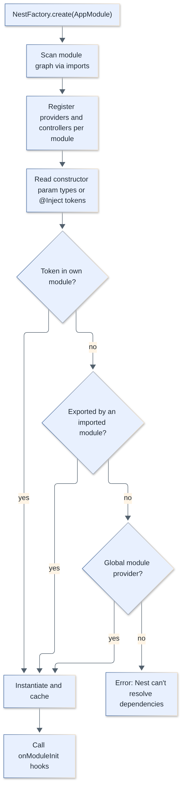
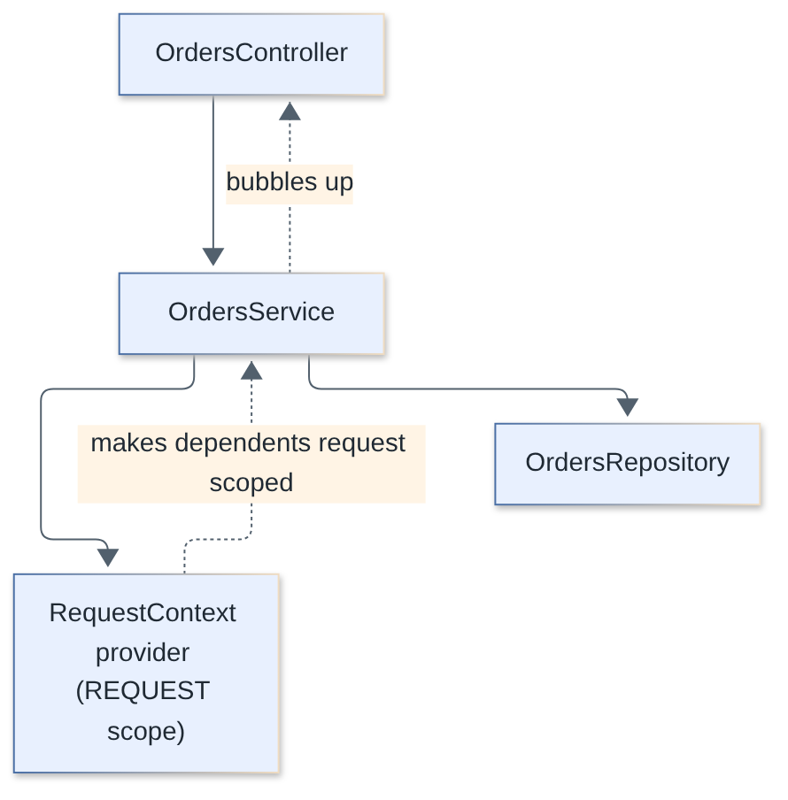
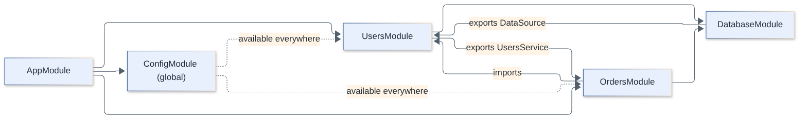
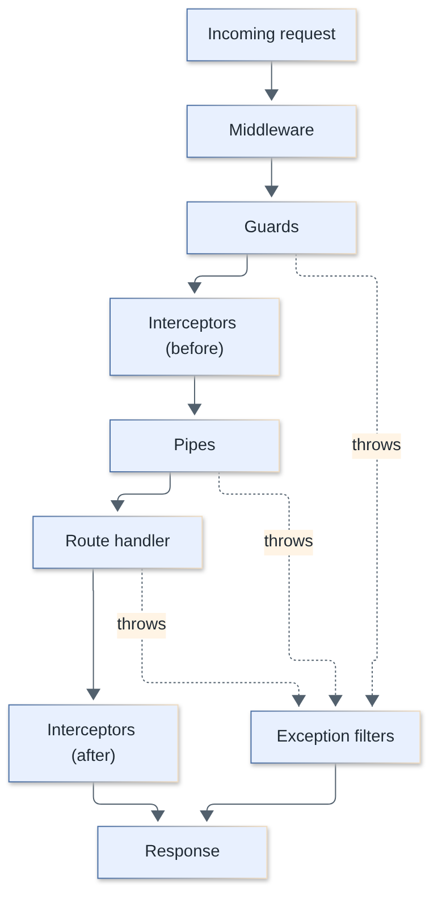
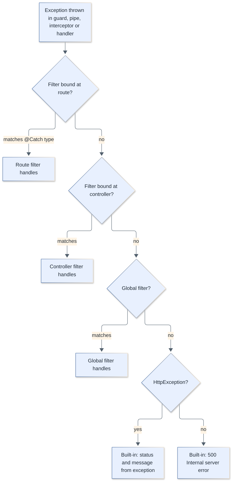
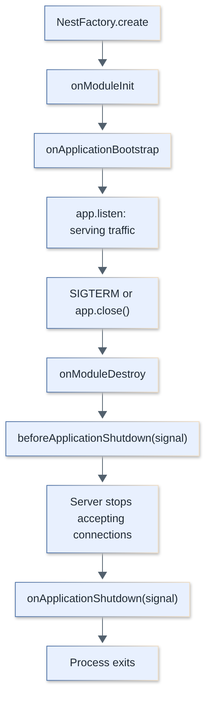
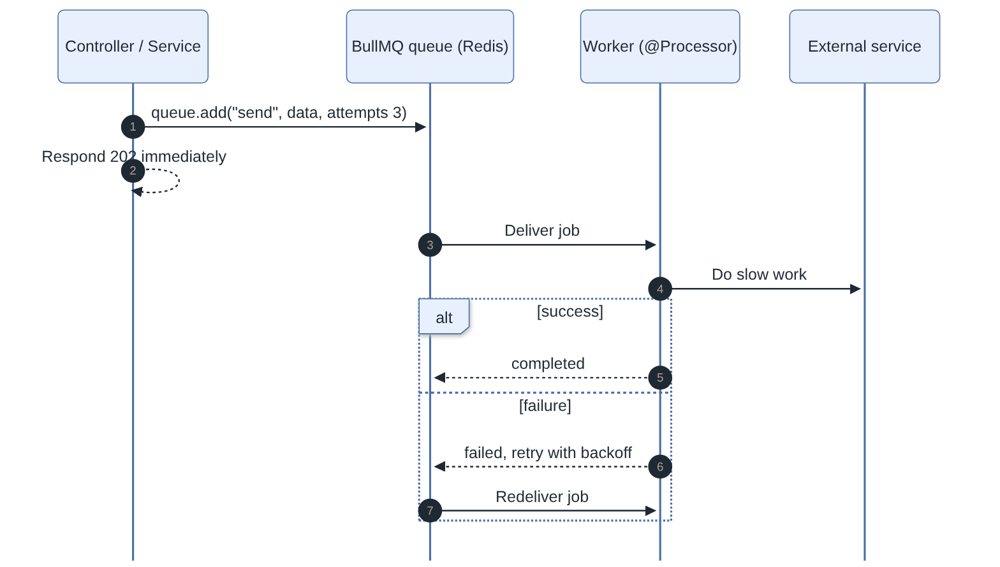
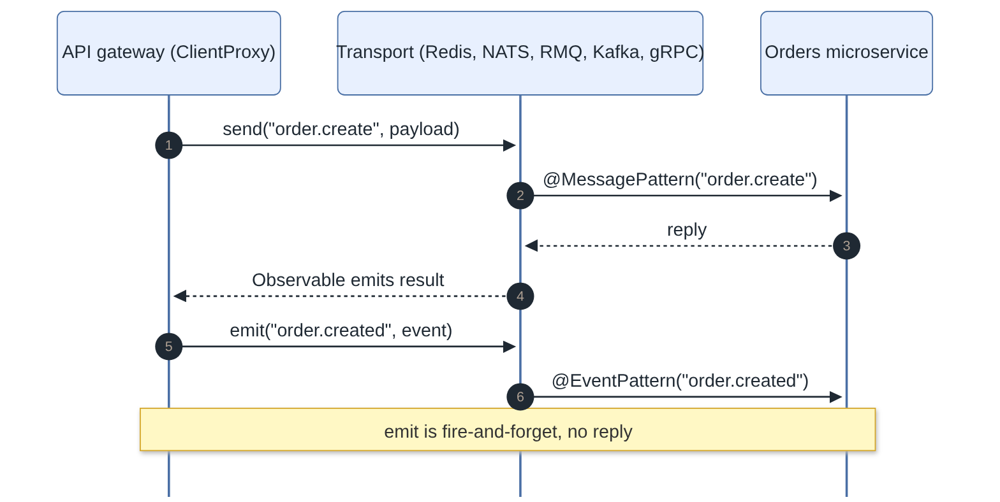

# NestJS Interview Questions

Questions and complete answers on NestJS for fullstack engineers: modules and dependency injection, the request lifecycle, validation, authentication, data access, queues, microservices, testing and production practices. Code examples target NestJS 12 (ESM-only packages, Express 5 by default, Standard Schema validation) with TypeScript, Vitest/Jest, supertest, TypeORM/Prisma and BullMQ.

**Levels:** `🟢 Junior` · `🟡 Middle` · `🔴 Senior`

## Table of contents

**Fundamentals**

1. [What is NestJS and what problems does it solve?](#1-what-is-nestjs-and-what-problems-does-it-solve)
2. [What are modules, controllers and providers in NestJS?](#2-what-are-modules-controllers-and-providers-in-nestjs)
3. [NestJS vs Express vs Fastify: how do they relate and when do you choose Nest?](#3-nestjs-vs-express-vs-fastify-how-do-they-relate-and-when-do-you-choose-nest)
4. [What does the Nest CLI do, and how is a project structured?](#4-what-does-the-nest-cli-do-and-how-is-a-project-structured)
5. [How do decorators and metadata power NestJS?](#5-how-do-decorators-and-metadata-power-nestjs)
6. [How do platform adapters work, and what should you know about Express 5 and Fastify?](#6-how-do-platform-adapters-work-and-what-should-you-know-about-express-5-and-fastify)
7. [What changed in NestJS 12 and how do you migrate from v11?](#7-what-changed-in-nestjs-12-and-how-do-you-migrate-from-v11)

**Dependency Injection**

8. [What is dependency injection in NestJS and how does the IoC container resolve dependencies?](#8-what-is-dependency-injection-in-nestjs-and-how-does-the-ioc-container-resolve-dependencies)
9. [What custom provider types exist: useClass, useValue, useFactory and useExisting?](#9-what-custom-provider-types-exist-useclass-usevalue-usefactory-and-useexisting)
10. [What are injection scopes (DEFAULT, REQUEST, TRANSIENT) and how does scope bubbling work?](#10-what-are-injection-scopes-default-request-transient-and-how-does-scope-bubbling-work)
11. [What is the cost of request-scoped providers, and what are durable providers?](#11-what-is-the-cost-of-request-scoped-providers-and-what-are-durable-providers)
12. [What are circular dependencies in NestJS and how do you solve them?](#12-what-are-circular-dependencies-in-nestjs-and-how-do-you-solve-them)
13. [How do module encapsulation, exports, re-exports and global modules work?](#13-how-do-module-encapsulation-exports-re-exports-and-global-modules-work)
14. [What are dynamic modules, and how do forRoot, forRootAsync, register and forFeature differ?](#14-what-are-dynamic-modules-and-how-do-forroot-forrootasync-register-and-forfeature-differ)
15. [What is ConfigurableModuleBuilder and why use it?](#15-what-is-configurablemodulebuilder-and-why-use-it)

**Request Lifecycle**

16. [What is the NestJS request lifecycle and in what order do its components run?](#16-what-is-the-nestjs-request-lifecycle-and-in-what-order-do-its-components-run)
17. [How does middleware work in NestJS, and when should you use it instead of a guard or interceptor?](#17-how-does-middleware-work-in-nestjs-and-when-should-you-use-it-instead-of-a-guard-or-interceptor)
18. [What are guards and ExecutionContext, and how do you write one?](#18-what-are-guards-and-executioncontext-and-how-do-you-write-one)
19. [What are interceptors and what are typical use cases?](#19-what-are-interceptors-and-what-are-typical-use-cases)
20. [What are pipes and how do you write a custom one?](#20-what-are-pipes-and-how-do-you-write-a-custom-one)
21. [How do exception filters work and how do you write a custom one?](#21-how-do-exception-filters-work-and-how-do-you-write-a-custom-one)

**Validation and Serialization**

22. [How do ValidationPipe, class-validator and class-transformer work together?](#22-how-do-validationpipe-class-validator-and-class-transformer-work-together)
23. [How does Standard Schema validation work in NestJS 12 (Zod, Valibot, ArkType)?](#23-how-does-standard-schema-validation-work-in-nestjs-12-zod-valibot-arktype)
24. [How does serialization work with ClassSerializerInterceptor, and how do you avoid leaking fields?](#24-how-does-serialization-work-with-classserializerinterceptor-and-how-do-you-avoid-leaking-fields)

**Authentication and Security**

25. [How do you implement JWT authentication in NestJS with Passport (or without it)?](#25-how-do-you-implement-jwt-authentication-in-nestjs-with-passport-or-without-it)
26. [How do you implement RBAC and public routes with custom decorators and Reflector?](#26-how-do-you-implement-rbac-and-public-routes-with-custom-decorators-and-reflector)
27. [How do you harden a NestJS API: helmet, CORS, rate limiting and more?](#27-how-do-you-harden-a-nestjs-api-helmet-cors-rate-limiting-and-more)

**Data**

28. [TypeORM vs Prisma vs MikroORM: how do they integrate with NestJS and how do you choose?](#28-typeorm-vs-prisma-vs-mikroorm-how-do-they-integrate-with-nestjs-and-how-do-you-choose)
29. [How do you handle database transactions in NestJS?](#29-how-do-you-handle-database-transactions-in-nestjs)

**Advanced Features**

30. [How do you create custom decorators in NestJS?](#30-how-do-you-create-custom-decorators-in-nestjs)
31. [What are lifecycle hooks and how do you implement graceful shutdown in NestJS?](#31-what-are-lifecycle-hooks-and-how-do-you-implement-graceful-shutdown-in-nestjs)
32. [How do you manage configuration with ConfigModule?](#32-how-do-you-manage-configuration-with-configmodule)
33. [How does caching work in NestJS (CacheModule, CacheInterceptor, Redis)?](#33-how-does-caching-work-in-nestjs-cachemodule-cacheinterceptor-redis)
34. [How do you schedule tasks in NestJS, and what goes wrong with multiple instances?](#34-how-do-you-schedule-tasks-in-nestjs-and-what-goes-wrong-with-multiple-instances)
35. [How do events work in NestJS (EventEmitter2), and when do you use them?](#35-how-do-events-work-in-nestjs-eventemitter2-and-when-do-you-use-them)
36. [How do you run background jobs with BullMQ queues in NestJS?](#36-how-do-you-run-background-jobs-with-bullmq-queues-in-nestjs)
37. [How do NestJS microservices and transports work, and what are hybrid applications?](#37-how-do-nestjs-microservices-and-transports-work-and-what-are-hybrid-applications)
38. [How does GraphQL work in NestJS: code-first vs schema-first, and how do you avoid N+1?](#38-how-does-graphql-work-in-nestjs-code-first-vs-schema-first-and-how-do-you-avoid-n1)
39. [How do WebSocket gateways work in NestJS, and how do you authenticate and scale them?](#39-how-do-websocket-gateways-work-in-nestjs-and-how-do-you-authenticate-and-scale-them)
40. [What is the NestJS CQRS module and when does it make sense?](#40-what-is-the-nestjs-cqrs-module-and-when-does-it-make-sense)

**Testing**

41. [How do you unit test providers and controllers with Test.createTestingModule?](#41-how-do-you-unit-test-providers-and-controllers-with-testcreatetestingmodule)
42. [How do you write end-to-end tests with supertest and keep them close to production?](#42-how-do-you-write-end-to-end-tests-with-supertest-and-keep-them-close-to-production)

**Production and Architecture**

43. [How do you optimize the performance of a NestJS application?](#43-how-do-you-optimize-the-performance-of-a-nestjs-application)
44. [How do you structure a large NestJS codebase: monorepo, workspaces and modular boundaries?](#44-how-do-you-structure-a-large-nestjs-codebase-monorepo-workspaces-and-modular-boundaries)
45. [How does logging work in NestJS and how do you set up structured logging with Pino?](#45-how-does-logging-work-in-nestjs-and-how-do-you-set-up-structured-logging-with-pino)
46. [How do you document a NestJS API with OpenAPI (Swagger)?](#46-how-do-you-document-a-nestjs-api-with-openapi-swagger)
47. [How do you implement health checks with Terminus, and how do liveness and readiness differ?](#47-how-do-you-implement-health-checks-with-terminus-and-how-do-liveness-and-readiness-differ)

## Fundamentals

### 1. What is NestJS and what problems does it solve?

`🟢 Junior` · `#fundamentals`

NestJS is an opinionated, TypeScript-first Node.js framework for building server-side applications. It sits on top of an HTTP server (Express by default, Fastify optionally) and adds an Angular-inspired architecture: modules, dependency injection and decorators.

Express and Fastify give you routing and middleware but no structure; every team invents its own layout, wiring and conventions. Nest standardizes that:

- **Architecture**: feature modules, controllers (transport layer) and providers (business logic).
- **Dependency injection**: a built-in IoC container, so classes declare what they need and Nest wires it.
- **Cross-cutting building blocks**: middleware, guards, interceptors, pipes and exception filters with a defined order.
- **Transport-agnostic**: the same structure serves HTTP, GraphQL, WebSockets and microservice transports (Redis, NATS, RabbitMQ, Kafka, gRPC).
- **Ecosystem**: official packages for config, TypeORM/Mongoose, Swagger, queues, caching, scheduling, CQRS, health checks and testing.

```ts
// main.ts
import { NestFactory } from '@nestjs/core';
import { AppModule } from './app.module.js'; // ESM: relative imports carry the .js extension

async function bootstrap() {
  const app = await NestFactory.create(AppModule);
  await app.listen(process.env.PORT ?? 3000);
}
await bootstrap();
```

Trade-offs: more boilerplate and "decorator magic" than a plain Express app, a learning curve (DI, module system), and slower cold start, which matters in serverless.

> **Follow-up:** "Is Nest a replacement for Express?" No. Nest is a layer above it. Express/Fastify still handle HTTP; Nest provides structure around them.

[↑ Back to top](#table-of-contents)

---

### 2. What are modules, controllers and providers in NestJS?

`🟢 Junior` · `#fundamentals` `#architecture`

A **module** groups related code into a feature unit, a **controller** maps incoming requests to handler methods, and a **provider** is any injectable class (usually a service holding business logic) that Nest instantiates and injects.

```ts
// users.service.ts: a provider
@Injectable()
export class UsersService {
  private users: User[] = [];
  findAll() { return this.users; }
  findOne(id: number) {
    const user = this.users.find((u) => u.id === id);
    if (!user) throw new NotFoundException(`User ${id} not found`);
    return user;
  }
}

// users.controller.ts: handles HTTP
@Controller('users')
export class UsersController {
  constructor(private readonly users: UsersService) {}

  @Get()
  findAll() { return this.users.findAll(); }

  @Get(':id')
  findOne(@Param('id', ParseIntPipe) id: number) { return this.users.findOne(id); }

  @Post()
  create(@Body() dto: CreateUserDto) { /* ... */ }
}

// users.module.ts
@Module({
  controllers: [UsersController],
  providers: [UsersService],
  exports: [UsersService], // visible to modules that import UsersModule
})
export class UsersModule {}
```

| Piece | Responsibility | Decorator |
|---|---|---|
| Module | Boundary of a feature; declares what it owns, imports and exports | `@Module()` |
| Controller | Routing, extracting params/body, returning the result; no business logic | `@Controller()`, `@Get()`, `@Post()` |
| Provider | Business logic, data access, integrations; injectable | `@Injectable()` |

Route decorators (`@Get`, `@Post`, `@Param`, `@Query`, `@Body`, `@Headers`) declare routes and parameter extraction. Return values are serialized automatically (objects to JSON, status 200, 201 for `@Post`). Keep controllers thin; they should only translate HTTP to a service call.

> **Follow-up:** "What happens if you use `@Res()` in a handler?" You take over the response (Express-style) and Nest's automatic response handling and interceptors that map the return value are disabled, unless you use `@Res({ passthrough: true })`.

[↑ Back to top](#table-of-contents)

---

### 3. NestJS vs Express vs Fastify: how do they relate and when do you choose Nest?

`🟢 Junior` · `#fundamentals` `#comparison`

Express and Fastify are HTTP libraries; NestJS is an application framework that runs on top of either of them. The question is not "Nest or Express" but "do I want a framework imposing structure, or a minimal library?".

| | Express | Fastify | NestJS |
|---|---|---|---|
| Level | Minimal HTTP library | HTTP framework with schemas and plugins | Application framework over Express/Fastify |
| Structure | None | Plugin-based encapsulation | Modules + DI + decorators |
| TypeScript | Add-on | Good | First-class (written in it) |
| Validation | Bring your own | JSON Schema built in | Pipes (class-validator, Zod) |
| DI | None | Decorators only | Full IoC container |
| Best for | Small services, prototypes | Raw performance, schema-first APIs | Large teams, long-lived, many features |

Choose Nest when you have a big codebase or team that benefits from enforced conventions, need several transports (HTTP + queue consumers + WebSockets) in one codebase, or want testability through DI. Choose plain Fastify/Express for tiny services, edge or serverless functions where cold start matters, or when the team dislikes decorators and reflection.

Nest's own abstraction over the HTTP layer is the reason you can swap Express for Fastify with a one-line change (`new FastifyAdapter()`), as long as you do not depend on platform-specific objects.

> **Follow-up:** "What is the performance cost of Nest?" DI is resolved once at bootstrap, so per-request overhead is small (a few percent over the bare adapter). Real costs come from request-scoped providers, validation and serialization, not from Nest itself.

[↑ Back to top](#table-of-contents)

---

### 4. What does the Nest CLI do, and how is a project structured?

`🟢 Junior` · `#cli` `#tooling`

`@nestjs/cli` scaffolds projects and generates code (schematics), runs the dev server with watch mode, and builds the app. It is configured through `nest-cli.json`.

```bash
npm i -g @nestjs/cli
nest new shop                  # scaffold
nest generate resource orders  # module + controller + service + DTOs + entity + spec
nest g module billing          # single schematic (g = generate)
nest start --watch             # dev
nest build                     # compile to dist/
```

Typical layout:

```text
src/
  main.ts            # bootstrap: NestFactory.create, global pipes, listen
  app.module.ts      # root module
  users/
    users.module.ts
    users.controller.ts
    users.service.ts
    dto/create-user.dto.ts
    entities/user.entity.ts
    users.controller.spec.ts
test/
  app.e2e-spec.ts
nest-cli.json
```

Organize **by feature, not by layer** (`users/`, `orders/`, not `controllers/`, `services/`).

New in v12: `nest new` asks whether to generate a **CommonJS or an ESM** project. ESM projects use **Vitest**, CommonJS projects use Jest, and every generated project uses **oxlint**. Existing projects keep their tooling.

Builders: `tsc` is the default compiler. You can switch to **SWC** for much faster builds and restarts. For monorepos **Rspack** is the default bundler; the `--webpack`/`webpackConfigPath` options are deprecated in favor of `--builder rspack`.

```json
{
  "$schema": "https://json.schemastore.org/nest-cli",
  "collection": "@nestjs/schematics",
  "sourceRoot": "src",
  "compilerOptions": { "builder": "swc", "typeCheck": true }
}
```

SWC does not type-check by itself, so use `--type-check` / `typeCheck: true` (or a separate `tsc --noEmit` in CI). That flag also runs CLI plugins (such as the Swagger plugin) and writes a metadata file the app loads at runtime. Entity files with circular imports may need `Relation<T>` wrappers because SWC emits decorator metadata differently from `tsc`.

> **Follow-up:** "What does `nest g resource` give you over `nest g controller`?" A full CRUD skeleton (module, controller, service, DTOs, entity, tests) and, optionally, GraphQL resolvers or microservice handlers.

[↑ Back to top](#table-of-contents)

---

### 5. How do decorators and metadata power NestJS?

`🟡 Middle` · `#fundamentals` `#decorators`

Nest decorators do not contain logic; they **attach metadata** to classes, methods and parameters using `reflect-metadata`. At bootstrap, Nest reads that metadata to build routes, resolve dependencies and apply guards, pipes and interceptors.

Two TypeScript compiler options make this work:

```json
{ "compilerOptions": { "experimentalDecorators": true, "emitDecoratorMetadata": true } }
```

`emitDecoratorMetadata` makes the compiler emit `design:paramtypes` for decorated classes. That is how Nest knows `constructor(private users: UsersService)` needs a `UsersService`: it reads the constructor parameter types at runtime.

```ts
// What SetMetadata / Reflector do under the hood
export const ROLES_KEY = 'roles';
export const Roles = (...roles: string[]) => SetMetadata(ROLES_KEY, roles);
// later, in a guard:
const roles = this.reflector.getAllAndOverride<string[]>(ROLES_KEY, [
  context.getHandler(),
  context.getClass(),
]);
```

Consequences and gotchas:

- **Interfaces and type aliases do not exist at runtime**, so they cannot be injection tokens. Use a class, a string/`Symbol` token with `@Inject(TOKEN)`, or an abstract class.
- **`import type { UsersService }`** (or `isolatedModules` rewriting imports as type-only) erases the class reference, the metadata becomes `Object`, and Nest fails with "can't resolve dependencies". Import providers as values.
- Decorators run at class-definition time, in order: parameter, method/property, then class decorators.
- These are the legacy (`experimentalDecorators`) decorators; Nest does not use the TC39 standard decorators. The tsconfig generated by the v12 CLI still sets `experimentalDecorators` and `emitDecoratorMetadata` (together with `isolatedModules`).

> **Follow-up:** "Why does constructor injection of an interface fail?" The interface is erased, so `design:paramtypes` records `Object`; there is nothing to look up. Provide a token and use `@Inject`.

[↑ Back to top](#table-of-contents)

---

### 6. How do platform adapters work, and what should you know about Express 5 and Fastify?

`🟡 Middle` · `#fundamentals` `#platforms`

Nest talks to the HTTP server through an `HttpAdapter` abstraction. `@nestjs/platform-express` (Express 5) is the default; `@nestjs/platform-fastify` is the alternative. Your controllers, guards and pipes are the same on both; only code that touches the raw request/response differs.

```ts
import { NestFactory } from '@nestjs/core';
import { FastifyAdapter, NestFastifyApplication } from '@nestjs/platform-fastify';

const app = await NestFactory.create<NestFastifyApplication>(AppModule, new FastifyAdapter());
await app.listen(3000, '0.0.0.0'); // bind 0.0.0.0 in containers; Fastify defaults to localhost
```

Platform-specific gotchas when switching to Fastify:

- Express middleware (`helmet`, `compression`, `cors`) must be replaced by `@fastify/*` equivalents.
- `@Req()`/`@Res()` give `FastifyRequest`/`FastifyReply`, not Express objects; code using `res.json()` or `res.cookie()` must change.
- Class middleware works through `@fastify/middie`, which Nest registers for you.

Express 5 specifics that surface in Nest code:

- **Wildcards.** Plain Express 5 requires named wildcards. Nest ships a compatibility layer, so an unnamed trailing `*` (`@Get('abcd/*')`) still works. An asterisk in the **middle** of a route must be named (`'ab{*splat}cd'`), and Fastify does not support mid-route wildcards at all. In middleware `forRoutes`, `'abcd/*splat'` matches `abcd/1` but not `abcd/`; wrap it in braces (`'abcd/{*splat}'`) to match the bare path too. `splat` is just a name.
- **Query parser.** Express 5 defaults to the simple parser, so `?filter[where][name]=John` is not parsed into nested objects. Opt in with `app.set('query parser', 'extended')` (needs `qs`); on Fastify use the `querystringParser` option.
- Regex characters in route strings are no longer supported.

> **Follow-up:** "How do you reach the underlying Express/Fastify instance?" `app.getHttpAdapter().getInstance()`, but it ties you to a platform; prefer Nest abstractions.

[↑ Back to top](#table-of-contents)

---

### 7. What changed in NestJS 12 and how do you migrate from v11?

`🟡 Middle` · `#fundamentals` `#v12` `#migration`

NestJS 12 is mostly about the **module system and tooling**: all `@nestjs/*` packages are now **ESM-only**, TypeScript 6 is required by the CLI, and new projects default to ESM, Vitest and oxlint. Application code mostly keeps working, because a CommonJS app can still consume ESM packages through `require(esm)`. The migration is largely mechanical and automated by `nest upgrade`.

| Area | What changed in v12 |
|---|---|
| Node.js (run an app) | 20.19+ or 22.12+ (the versions where `require(esm)` is unflagged); 21.x is unsupported |
| Node.js (CLI: `new`, `generate`, `upgrade`) | 22.22.3+, 24.15+ or 26+ |
| Module system | Packages are ESM-only; ESM projects need `.js` extensions on relative imports, `import.meta.dirname` instead of `__dirname`, `"type": "module"` |
| TypeScript | v6 required by CLI and schematics; tsconfig with `module`/`moduleResolution: nodenext` |
| Tooling | `nest new` offers CJS or ESM; ESM gets Vitest, all get oxlint; Rspack replaces webpack (deprecated flags) |
| Testing | `@nestjs/testing` unchanged; Jest 30 can load the ESM-only packages only on Node 24.9+ |
| Validation | `StandardSchemaValidationPipe` and `StandardSchemaSerializerInterceptor` (Zod, Valibot, ArkType); `@nestjs/config` `validationSchema` accepts Standard Schema, Joi must be v18, library settings move to `validationOptions.libraryOptions`; `ValidationPipe` gets `errorFormat: 'list' | 'grouped'` |
| Behavior changes | Lifecycle hooks are called by component hierarchy level (order can change); `ConsoleLogger` structured params on by default (`structuredParams: false` restores old output); refined pipe signatures (`ArgumentMetadata` is generic); Express adapter drains in-flight requests on shutdown |
| Transports and GraphQL | NATS uses `@nats-io/*` packages; GraphQL packages go to v14 (`playground` becomes `graphiql`, `graphql-ws` replaces `subscriptions-transport-ws`) |
| Observability and reliability | `@nestjs/observe` SDK; docs chapters for outbox, resilience and workflows |

```bash
npm i -g @nestjs/cli@latest   # first: the upgrade command ships with the CLI
nest upgrade --dry-run        # preview
nest upgrade                  # bump @nestjs/* majors, TypeScript 6, Jest 30, rewrite nest-cli.json, config, GraphQL, NATS...
```

`nest upgrade` refuses to run on a Node without `require(esm)`, prints notes for what it cannot migrate (hook order, pipe signatures, logging params), and **does not** convert your project to ESM, Vitest or oxlint; adopt those on your own schedule.

Practical migration order: upgrade Node and run the test suite on the new version; run `nest upgrade`; fix compile errors from TypeScript 6 and pipe signatures; review code that depends on hook order between related providers; check log consumers for the new `params` field; then, separately, move to ESM (`.js` imports, `nodenext` tsconfig, `"type": "module"`) if you want it.

> **Follow-up:** "Do I have to convert to ESM to upgrade?" No. A CommonJS app keeps working via `require(esm)` on a supported Node; ESM is the default for new projects only.

[↑ Back to top](#table-of-contents)

---

## Dependency Injection

### 8. What is dependency injection in NestJS and how does the IoC container resolve dependencies?

`🟢 Junior` · `#di` `#ioc`

With DI, a class declares its collaborators in its constructor and the framework supplies them, instead of the class creating them with `new`. Nest's **IoC container** scans your modules at bootstrap, builds a dependency graph from constructor metadata, and instantiates each provider once (singleton by default), in dependency order.



Resolution rules for a token requested inside module `M`:

1. Look in `M`'s own `providers`.
2. Look in providers **exported** by modules that `M` imports.
3. Look in **global** modules.
4. Otherwise throw: `Nest can't resolve dependencies of the OrdersService (?)`.

```ts
@Injectable()
export class OrdersService {
  constructor(
    private readonly users: UsersService,                // class token
    @Inject('PAYMENT_GATEWAY') private readonly pay: PaymentGateway, // custom token
    @Optional() private readonly audit?: AuditService,   // no error if missing
  ) {}
}
```

Why it matters: swapping implementations (real vs fake in tests), no manual wiring, and a single shared instance for stateful things like DB pools. Async providers (`useFactory` returning a promise) are awaited before dependents are created.

The two most common "can't resolve dependencies" causes: the provider is not listed in any `providers` array of the consuming module (or its imports), or the module that owns it forgot to `exports` it.

> **Follow-up:** "How is this different from a service locator?" Classes do not ask a registry for dependencies; dependencies are pushed in via the constructor, so they are visible in the signature and easy to replace in tests.

[↑ Back to top](#table-of-contents)

---

### 9. What custom provider types exist: useClass, useValue, useFactory and useExisting?

`🟡 Middle` · `#di` `#providers`

A custom provider is an object `{ provide: TOKEN, useXxx: ... }` that tells the container how to create the value for a token. The token can be a class, a string or a `Symbol`.

| Form | Meaning | Typical use |
|---|---|---|
| `useClass` | Instantiate this class (DI applies to its constructor) | Swap implementation per environment |
| `useValue` | Use this exact value, no instantiation | Constants, config objects, test mocks |
| `useFactory` | Call a function (may be async) with `inject`ed deps | Clients that need config, async setup |
| `useExisting` | Alias: another token resolves to the same instance | Expose one provider under several tokens |

```ts
export const PAYMENT = Symbol('PAYMENT');

@Module({
  providers: [
    { provide: PAYMENT, useClass: process.env.NODE_ENV === 'test' ? FakePayment : StripePayment },
    { provide: 'API_VERSION', useValue: 'v2' },
    {
      provide: REDIS,
      inject: [ConfigService],
      useFactory: async (cfg: ConfigService) => {
        const client = new Redis(cfg.getOrThrow('REDIS_URL'));
        await client.ping(); // awaited before dependents are built
        return client;
      },
    },
    { provide: 'ALIAS', useExisting: PAYMENT },
  ],
  exports: [PAYMENT, REDIS],
})
export class InfraModule {}

// consumer
constructor(@Inject(PAYMENT) private readonly payment: PaymentPort) {}
```

Tips: define the port as an **abstract class** if you want to inject without `@Inject` (abstract classes survive compilation, interfaces do not). `useFactory` can also take `{ token, optional: true }` entries in `inject`. To export a custom provider, export its token (or the whole provider object).

> **Follow-up:** "When do you prefer `useFactory` over `useClass`?" When construction needs runtime configuration or async work (connect, load keys), or you must pick between implementations based on injected config.

[↑ Back to top](#table-of-contents)

---

### 10. What are injection scopes (DEFAULT, REQUEST, TRANSIENT) and how does scope bubbling work?

`🟡 Middle` · `#di` `#scopes`

Scope controls provider lifetime. **DEFAULT** (singleton): one instance for the app. **REQUEST**: a new instance per incoming request, garbage-collected afterwards. **TRANSIENT**: a new instance for every consumer that injects it.

```ts
@Injectable({ scope: Scope.REQUEST })
export class RequestContext {
  constructor(@Inject(REQUEST) readonly request: Request) {}
}

@Injectable({ scope: Scope.TRANSIENT })
export class ScopedLogger {
  constructor(@Inject(INQUIRER) private parent: object) {} // who injected me
}
```

**Scope bubbling**: if a provider depends on a request-scoped provider, it becomes request-scoped too, and so does everything that depends on *it*, up to the controller. One request-scoped leaf can silently turn a whole chain of singletons into per-request objects.



Rules to remember:

- Transient providers do **not** bubble: each consumer gets its own instance, but consumers stay singleton.
- Injecting `REQUEST` in a provider makes it request-scoped (the request object only exists per request).
- Guards, interceptors and middleware that inject request-scoped providers become request-scoped as well.
- In singletons you cannot constructor-inject a request-scoped provider without making them request-scoped; use `ModuleRef.resolve(Type, contextId)` for manual resolution (`get()` only works for static providers).
- Outside HTTP (e.g. microservices, queues) there is no `REQUEST`; use `ContextIdFactory.create()` and `moduleRef.registerRequestByContextId`.

Prefer **AsyncLocalStorage** (e.g. `nestjs-cls`) for per-request data such as user id or correlation id: singletons stay singletons and you read the context on demand.

> **Follow-up:** "Why is `@Inject(REQUEST)` in a service dangerous?" It makes the service and all its dependents request-scoped, increasing allocations and GC, and lifecycle hooks such as `onModuleInit` are not called for request-scoped providers.

[↑ Back to top](#table-of-contents)

---

### 11. What is the cost of request-scoped providers, and what are durable providers?

`🔴 Senior` · `#di` `#scopes` `#performance`

Every request re-creates the request-scoped subtree: instances, and re-resolution of the dependency subgraph per request. This costs CPU and memory, adds GC pressure and lowers throughput (benchmarks often show noticeable drops for large subtrees). Request scope also bubbles to controllers, so Nest must build a controller instance per request.

Mitigations, in order of preference:

1. **Avoid request scope.** Use AsyncLocalStorage to carry request-specific data (`nestjs-cls`), or pass context as method arguments.
2. **Keep the scoped subtree small.** Isolate the request-scoped provider in a leaf and have singletons receive per-request data via parameters.
3. **Durable providers** for multi-tenancy: instead of one instance per request, you group requests by a key (e.g. tenant id) and share one instance per group.

```ts
// 1) decide the "context id" per request (here, per tenant)
const tenants = new Map<string, ContextId>();

export class AggregateByTenantContextIdStrategy implements ContextIdStrategy {
  attach(contextId: ContextId, request: Request) {
    const tenantId = request.headers['x-tenant-id'] as string;
    if (!tenantId) return () => contextId; // no tenant: plain per-request behavior
    let tenantSubTreeId = tenants.get(tenantId);
    if (!tenantSubTreeId) {
      tenantSubTreeId = ContextIdFactory.create();
      tenants.set(tenantId, tenantSubTreeId);
    }
    return {
      // durable trees share the tenant's context id; others stay per-request
      resolve: (info: HostComponentInfo) =>
        info.isTreeDurable ? tenantSubTreeId : contextId,
      payload: { tenantId }, // injected as REQUEST into durable providers
    };
  }
}

// main.ts
ContextIdFactory.apply(new AggregateByTenantContextIdStrategy());

// 2) mark the provider durable
@Injectable({ scope: Scope.REQUEST, durable: true })
export class TenantDb { constructor(@Inject(REQUEST) private payload: TenantPayload) {} }
```

Durable providers are right when per-tenant state is expensive to build (connection to a tenant DB) and identical for all requests of that tenant. They are wrong for anything truly per-user or per-request.

> **Follow-up:** "How do you measure the impact?" Load test with and without the scoped provider (autocannon/k6) and compare p99 and heap allocations; the difference tells you whether to refactor.

[↑ Back to top](#table-of-contents)

---

### 12. What are circular dependencies in NestJS and how do you solve them?

`🔴 Senior` · `#di` `#modules`

A circular dependency means A needs B and B needs A, either between **providers** or between **modules**. Nest cannot instantiate either first. It throws `Nest can't resolve dependencies ... (?)` or the confusing `undefined` injection caused by circular *file* imports.

Quick fix: `forwardRef()` on both sides, which defers resolution of the reference.

```ts
@Injectable()
export class CatsService {
  constructor(
    @Inject(forwardRef(() => OwnersService)) private owners: OwnersService,
  ) {}
}

@Injectable()
export class OwnersService {
  constructor(
    @Inject(forwardRef(() => CatsService)) private cats: CatsService,
  ) {}
}

// modules cycle too:
@Module({ imports: [forwardRef(() => OwnersModule)] })
export class CatsModule {}
```

Limitations and better designs:

- `forwardRef` is a workaround; in constructors the other instance exists but should not be used *during* construction. Order of `onModuleInit` is undefined for the pair.
- It does not mix with request-scoped providers in a clean way (the whole cycle bubbles up).
- Circular **file imports** (barrel `index.ts` files, entities referencing each other) can produce `undefined` at decoration time. Fix by importing directly, using `forwardRef`, or `Relation<T>` for TypeORM.

Refactoring options, preferred over `forwardRef`:

1. Extract the shared logic into a third service/module both depend on.
2. Invert one side with **events** (`EventEmitter2`): publish `order.paid` instead of calling `InvoicesService`.
3. Use `ModuleRef.get(Type, { strict: false })` lazily at call time, not in the constructor.
4. Reconsider boundaries: a cycle usually means two modules are really one.

> **Follow-up:** "How can you tell it is a module cycle and not a provider cycle?" The error message names the module path; `nest start --debug` or the graph tool (`@nestjs/devtools-integration`) shows the module graph.

[↑ Back to top](#table-of-contents)

---

### 13. How do module encapsulation, exports, re-exports and global modules work?

`🟢 Junior` · `#modules` `#di`

Modules **encapsulate** their providers: a provider is private to its module unless the module `exports` it, and another module only sees it by `imports`-ing the owner. A module can **re-export** modules it imported, and `@Global()` makes a module's exports available everywhere without importing.



```ts
@Module({
  providers: [UsersService, PasswordHasher],
  exports: [UsersService], // PasswordHasher stays private
})
export class UsersModule {}

@Module({ imports: [UsersModule] })           // gets UsersService
export class OrdersModule {}

// re-export: consumers of CoreModule also get DatabaseModule's exports
@Module({
  imports: [DatabaseModule, LoggerModule],
  exports: [DatabaseModule, LoggerModule],
})
export class CoreModule {}

@Global()
@Module({ providers: [ConfigService], exports: [ConfigService] })
export class AppConfigModule {}
```

Guidelines:

- Modules are **singletons**: importing `UsersModule` in five places shares one instance (and one `UsersService`).
- A global module still must be registered once (usually in `AppModule`).
- Use `@Global()` sparingly (config, logger, DB connection). Overusing it hides dependencies and makes modules hard to reason about and test.
- Providers listed in `providers` of **two** modules are instantiated twice (two instances); share via export instead.
- Prefer a **shared module** for stateless utilities over re-declaring them.

> **Follow-up:** "Why does a module not see a provider imported by a module it imports?" Imports are not transitive. Only what the imported module *exports* is visible, so re-export if you want to pass it through.

[↑ Back to top](#table-of-contents)

---

### 14. What are dynamic modules, and how do forRoot, forRootAsync, register and forFeature differ?

`🟡 Middle` · `#modules` `#dynamic-modules`

A dynamic module is a module returned from a static method, so it can be **configured by the importer**. The method returns a `DynamicModule` object that extends the base `@Module()` metadata.

Naming convention (by Nest docs and ecosystem):

| Method | Meaning |
|---|---|
| `forRoot()` | Configure once for the whole app (e.g. DB connection) |
| `register()` | Configure per consumer; each import can differ |
| `forFeature()` | Extend a root-configured module for one feature (e.g. register entities/queues) |
| `*Async()` | Same, but options come from `useFactory` / `useClass` / `useExisting` with `inject` and `imports` |

```ts
@Module({})
export class MailModule {
  static forRoot(options: MailOptions): DynamicModule {
    return {
      module: MailModule,
      global: options.isGlobal ?? false,
      providers: [
        { provide: MAIL_OPTIONS, useValue: options },
        MailService,
      ],
      exports: [MailService],
    };
  }

  static forRootAsync(opts: {
    imports?: any[];
    inject?: any[];
    useFactory: (...args: any[]) => Promise<MailOptions> | MailOptions;
  }): DynamicModule {
    return {
      module: MailModule,
      imports: opts.imports ?? [],
      providers: [
        { provide: MAIL_OPTIONS, inject: opts.inject ?? [], useFactory: opts.useFactory },
        MailService,
      ],
      exports: [MailService],
    };
  }
}

// usage
MailModule.forRootAsync({
  inject: [ConfigService],
  useFactory: (cfg: ConfigService) => ({ host: cfg.getOrThrow('SMTP_HOST') }),
});
```

Why async: options often depend on `ConfigService`, secrets managers or other providers that do not exist when the static decorator metadata is evaluated at import time. Static `forRoot({ url: process.env.X })` reads env too early if `.env` is not loaded yet.

Gotchas: forgetting `exports`; non-global dynamic modules imported in several places creating multiple instances if called with different options (that is by design for `register`); the returned `module` property must be the class itself.

> **Follow-up:** "What does `TypeOrmModule.forFeature([User])` do that `forRoot` does not?" It registers repository providers for the listed entities in the importing module, using the connection created by `forRoot`.

[↑ Back to top](#table-of-contents)

---

### 15. What is ConfigurableModuleBuilder and why use it?

`🔴 Senior` · `#modules` `#dynamic-modules` `#library-design`

`ConfigurableModuleBuilder` generates the boilerplate of a configurable dynamic module (`register`/`registerAsync`, or `forRoot`/`forRootAsync`, with `useFactory`/`useClass`/`useExisting`) from an options interface, so you do not hand-write it for every library module.

```ts
// mail.module-definition.ts
import { ConfigurableModuleBuilder } from '@nestjs/common';

export interface MailOptions { host: string; port: number }

export const {
  ConfigurableModuleClass,
  MODULE_OPTIONS_TOKEN,
  OPTIONS_TYPE,
  ASYNC_OPTIONS_TYPE,
} = new ConfigurableModuleBuilder<MailOptions>()
  .setClassMethodName('forRoot')                // forRoot + forRootAsync
  .setExtras({ isGlobal: false }, (definition, extras) => ({
    ...definition,
    global: extras.isGlobal,                    // extra flag outside the options
  }))
  .build();

// mail.module.ts
@Module({ providers: [MailService], exports: [MailService] })
export class MailModule extends ConfigurableModuleClass {}

// mail.service.ts
@Injectable()
export class MailService {
  constructor(@Inject(MODULE_OPTIONS_TOKEN) private readonly opts: MailOptions) {}
}

// usage: sync, async, and `isGlobal` all work
MailModule.forRoot({ host: 'smtp', port: 25, isGlobal: true });
MailModule.forRootAsync({
  inject: [ConfigService],
  useFactory: (c: ConfigService) => ({ host: c.getOrThrow('SMTP_HOST'), port: 25 }),
});
```

Benefits: consistent, well-typed API across your internal packages; `OPTIONS_TYPE` and `ASYNC_OPTIONS_TYPE` types let you write custom `forRoot` wrappers; extras like `isGlobal` and `setFactoryMethodName()` (for `useClass` option factories) are built in. Default method name is `register`, so call `setClassMethodName('forRoot')` to follow the `forRoot` convention.

Use it when you publish shared modules (internal platform libs, monorepo `libs/`). For one-off app modules a plain `forRoot` is fine.

> **Follow-up:** "How do you validate options at startup?" Inject `MODULE_OPTIONS_TOKEN` in a provider and validate in the constructor or `onModuleInit` (Zod/class-validator), failing fast on boot.

[↑ Back to top](#table-of-contents)

---

## Request Lifecycle

### 16. What is the NestJS request lifecycle and in what order do its components run?

`🟡 Middle` · `#lifecycle`

Order: **middleware, guards, interceptors (before), pipes, route handler, interceptors (after), exception filters** (only when something throws). Each stage can be bound globally, per controller or per route, and binding level affects order within a stage.



| Stage | Purpose | Sees | Binding order |
|---|---|---|---|
| Middleware | Raw request prep (logging, request id, cookies) | `req`, `res`, `next` | Global, then module-level |
| Guards | Allow or deny (authn/authz) | `ExecutionContext` (handler + class metadata) | Global, controller, route |
| Interceptors (pre) | Wrap the call: logging, timing, caching | `ExecutionContext`, `CallHandler` | Global, controller, route |
| Pipes | Validate and transform arguments | The argument value + metadata | Global, controller, route, then param |
| Handler | Your code | | |
| Interceptors (post) | Map the response, timeout, cache write | Response stream (RxJS) | Reverse: route, controller, global |
| Exception filters | Turn exceptions into responses | The exception + host | Route first, then controller, then global |

```ts
// Bound at all levels
app.useGlobalGuards(new AuthGuard());               // global (no DI), prefer APP_GUARD
@UseGuards(RolesGuard) @Controller('orders') class OrdersController {
  @UseInterceptors(LoggingInterceptor)
  @UsePipes(new ValidationPipe())
  @Post() create(@Body() dto: CreateOrderDto) {}
}
```

Key points interviewers look for:

- Global bindings registered with `app.useGlobalX()` **cannot use DI** (they are created outside any module). Register through a module with the `APP_GUARD`, `APP_PIPE`, `APP_INTERCEPTOR`, `APP_FILTER` tokens to get DI.
- Guards run *after* middleware, so they can rely on `req.user` set there, but they run *before* pipes, so they must not trust unvalidated input.
- Exceptions thrown in guards, pipes, interceptors and handlers all go to exception filters.
- Interceptors wrap everything from guards onwards; they run both before and after the handler.

> **Follow-up:** "Why do guards run before pipes?" Authorization should reject a request before spending effort validating or transforming its payload (and before leaking validation details to unauthorized callers).

[↑ Back to top](#table-of-contents)

---

### 17. How does middleware work in NestJS, and when should you use it instead of a guard or interceptor?

`🟢 Junior` · `#middleware` `#lifecycle`

Nest middleware is the same concept as Express middleware (`(req, res, next)`), run **before** guards and route handlers. Use it for request-level plumbing that does not need to know which handler will execute: request ids, logging, cookie/body parsing, CORS-like headers.

```ts
// class middleware: can inject providers
@Injectable()
export class RequestIdMiddleware implements NestMiddleware {
  constructor(private readonly clock: ClockService) {}
  use(req: Request, res: Response, next: NextFunction) {
    req.headers['x-request-id'] ??= randomUUID();
    res.setHeader('x-request-id', req.headers['x-request-id'] as string);
    next();
  }
}

// functional middleware
export function logger(req: Request, _res: Response, next: NextFunction) {
  console.log(`${req.method} ${req.originalUrl}`);
  next();
}

@Module({ controllers: [CatsController] })
export class AppModule implements NestModule {
  configure(consumer: MiddlewareConsumer) {
    consumer
      .apply(RequestIdMiddleware, logger)
      .exclude({ path: 'health', method: RequestMethod.GET })
      .forRoutes({ path: '{*splat}', method: RequestMethod.ALL }); // Express 5 wildcard
  }
}
```

Choosing the right tool:

| Need | Use |
|---|---|
| Decide if a request may proceed, based on handler metadata (roles, public) | **Guard** |
| Run code before and after the handler, transform result, timeout | **Interceptor** |
| Validate/transform a parameter | **Pipe** |
| Low-level request mutation unrelated to routing | **Middleware** |

Middleware cannot access `ExecutionContext` or handler metadata (it does not know which handler will run), which is why authorization belongs in guards. `app.use(...)` global middleware has no DI; class middleware registered via `configure()` does. Express 5 requires named wildcards (`'abcd/*splat'`); braces make the wildcard optional so the bare path matches too (`'abcd/{*splat}'`). Nest's compatibility layer still accepts a trailing unnamed `*`, but a wildcard in the middle of a path must be named.

> **Follow-up:** "Can middleware be applied to a specific HTTP method only?" Yes: `forRoutes({ path: 'cats', method: RequestMethod.POST })`.

[↑ Back to top](#table-of-contents)

---

### 18. What are guards and ExecutionContext, and how do you write one?

`🟡 Middle` · `#guards` `#execution-context`

A guard implements `CanActivate` and returns a boolean (or promise/observable) deciding whether the request proceeds. Returning `false` yields `403 Forbidden`; throw `UnauthorizedException` to produce `401`. Guards have access to `ExecutionContext`, which tells them exactly which class and handler are about to run.

```ts
@Injectable()
export class ApiKeyGuard implements CanActivate {
  constructor(private readonly config: ConfigService) {}

  canActivate(context: ExecutionContext): boolean {
    const req = context.switchToHttp().getRequest<Request>();
    const key = req.header('x-api-key');
    if (key !== this.config.getOrThrow('API_KEY')) {
      throw new UnauthorizedException('Invalid API key');
    }
    return true;
  }
}
```

`ExecutionContext` extends `ArgumentsHost`, which abstracts the transport so the same guard/filter/interceptor can serve different protocols:

| Method | Use |
|---|---|
| `getType()` | `'http'`, `'rpc'`, `'ws'` (or `'graphql'`) |
| `switchToHttp()` / `switchToRpc()` / `switchToWs()` | Typed access to request/response, payload/context, client/data |
| `getClass()` | The controller class (for class-level metadata) |
| `getHandler()` | The method about to run (for method-level metadata) |
| `getArgs()` | Raw argument array |

```ts
// Transport-agnostic helper
function getRequest(ctx: ExecutionContext) {
  switch (ctx.getType<string>()) {
    case 'http': return ctx.switchToHttp().getRequest();
    case 'graphql': return GqlExecutionContext.create(ctx).getContext().req;
    case 'ws': return ctx.switchToWs().getClient().handshake;
    default: return undefined;
  }
}
```

Bind guards with `@UseGuards(...)` (class or route) or globally via `{ provide: APP_GUARD, useClass: JwtAuthGuard }`. Order of multiple guards: global, controller, route, and left to right in the list; first to deny stops the chain.

> **Follow-up:** "`ExecutionContext` vs `ArgumentsHost`?" `ArgumentsHost` only gives the arguments (used by exception filters); `ExecutionContext` adds `getClass()` and `getHandler()` (used by guards and interceptors).

[↑ Back to top](#table-of-contents)

---

### 19. What are interceptors and what are typical use cases?

`🟡 Middle` · `#interceptors` `#rxjs`

An interceptor implements `NestInterceptor.intercept(context, next)` and wraps the handler call. `next.handle()` returns an **RxJS Observable** of the handler's result; code before it runs pre-handler, and operators piped onto it run post-handler. It can transform the result, transform exceptions, add behavior, or skip the handler entirely.

```ts
// Timing + response envelope
@Injectable()
export class EnvelopeInterceptor<T> implements NestInterceptor<T, { data: T; ms: number }> {
  intercept(ctx: ExecutionContext, next: CallHandler<T>) {
    const start = Date.now();
    return next.handle().pipe(map((data) => ({ data, ms: Date.now() - start })));
  }
}

// Timeout, translating the RxJS error
@Injectable()
export class TimeoutInterceptor implements NestInterceptor {
  intercept(_: ExecutionContext, next: CallHandler) {
    return next.handle().pipe(
      timeout(5000),
      catchError((err) =>
        throwError(() => (err instanceof TimeoutError ? new RequestTimeoutException() : err)),
      ),
    );
  }
}

// Short-circuit (cache): handler never runs
intercept(ctx: ExecutionContext, next: CallHandler) {
  const hit = this.cache.get(keyOf(ctx));
  return hit !== undefined ? of(hit) : next.handle().pipe(tap((v) => this.cache.set(keyOf(ctx), v)));
}
```

Typical uses: logging/metrics, response mapping (`ClassSerializerInterceptor`), caching (`CacheInterceptor`), timeouts, retry (`retry()`), attaching a transaction to the request, and mapping domain errors to HTTP errors.

Gotchas:

- If you use `@Res()` without `passthrough`, response-mapping interceptors are bypassed.
- A `timeout` does not cancel the underlying work (e.g. a DB query); it only stops waiting. Pair with `AbortSignal` or query timeouts.
- Interceptors apply to streaming (`StreamableFile`, SSE) handlers differently; mapping a stream needs care.
- Response mapping runs *after* the handler, in reverse binding order (route, controller, global).

> **Follow-up:** "Interceptor vs middleware for logging?" Interceptors know the handler and can log the result/duration with the controller/route name; middleware sees only the raw HTTP exchange but runs for requests that never reach a route (404s).

[↑ Back to top](#table-of-contents)

---

### 20. What are pipes and how do you write a custom one?

`🟢 Junior` · `#pipes` `#validation`

A pipe transforms or validates an argument right before the handler receives it. If it throws, the handler never runs and an exception filter produces the response (400 for the built-in pipes).

Built-in pipes: `ValidationPipe`, `ParseIntPipe`, `ParseFloatPipe`, `ParseBoolPipe`, `ParseArrayPipe`, `ParseUUIDPipe`, `ParseEnumPipe`, `ParseDatePipe`, `ParseFilePipe`, `DefaultValuePipe`.

```ts
@Get(':id')
findOne(
  @Param('id', ParseUUIDPipe) id: string,
  @Query('page', new DefaultValuePipe(1), ParseIntPipe) page: number,
) {}

// custom pipe
@Injectable()
export class TrimPipe implements PipeTransform<unknown, unknown> {
  transform(value: unknown, metadata: ArgumentMetadata) {
    if (typeof value === 'string') return value.trim();
    if (metadata.type === 'body' && value && typeof value === 'object') {
      return Object.fromEntries(
        Object.entries(value).map(([k, v]) => [k, typeof v === 'string' ? v.trim() : v]),
      );
    }
    return value;
  }
}

@Post() create(@Body(TrimPipe) dto: CreateUserDto) {}
```

`ArgumentMetadata` tells the pipe where the value came from (`type`: `body | query | param | custom`), the declared TypeScript class (`metatype`) and the decorator argument (`data`).

Binding levels: parameter, method (`@UsePipes`), controller, global (`app.useGlobalPipes` or `APP_PIPE`). A pipe at method/controller level runs for every parameter of the handler, including ones where you did not expect it, so keep it type-aware.

Pass the class (`ParseIntPipe`) to let Nest instantiate it with DI, or an instance (`new ParseIntPipe({ errorHttpStatusCode: 406 })`) to configure it.

> **Follow-up:** "Why does `@Param('id') id: number` still give a string?" TypeScript types vanish at runtime. Without `ParseIntPipe` or `ValidationPipe({ transform: true })`, the value is the raw string.

[↑ Back to top](#table-of-contents)

---

### 21. How do exception filters work and how do you write a custom one?

`🟡 Middle` · `#exception-filters` `#errors`

Nest has a built-in global exception layer: `HttpException` (and subclasses like `NotFoundException`) become responses with their status; any other thrown value becomes `500 { statusCode: 500, message: 'Internal server error' }`. A custom **exception filter** (`@Catch()` + `ExceptionFilter`) lets you control the response shape, map domain errors to HTTP, and report to monitoring.



```ts
@Catch() // catch everything
export class AllExceptionsFilter implements ExceptionFilter {
  private readonly logger = new Logger(AllExceptionsFilter.name);
  constructor(private readonly httpAdapterHost: HttpAdapterHost) {}

  catch(exception: unknown, host: ArgumentsHost) {
    const { httpAdapter } = this.httpAdapterHost; // platform-agnostic
    const ctx = host.switchToHttp();

    const status = exception instanceof HttpException ? exception.getStatus() : 500;
    if (status >= 500) this.logger.error(exception);

    httpAdapter.reply(
      ctx.getResponse(),
      {
        statusCode: status,
        path: httpAdapter.getRequestUrl(ctx.getRequest()),
        message: exception instanceof HttpException ? exception.getResponse() : 'Internal server error',
      },
      status,
    );
  }
}

// DI-friendly global registration
{ provide: APP_FILTER, useClass: AllExceptionsFilter }

// domain error mapping
@Catch(InsufficientFundsError)
export class InsufficientFundsFilter implements ExceptionFilter {
  catch(e: InsufficientFundsError, host: ArgumentsHost) {
    host.switchToHttp().getResponse().status(HttpStatus.UNPROCESSABLE_ENTITY).json({ error: e.code });
  }
}
```

Rules:

- Filters are matched by the `@Catch()` argument; the **most specific binding wins** (route, then controller, then global) and only one filter handles the exception.
- Services should throw domain errors or `HttpException`s; mapping to HTTP can live in a filter so the domain stays transport-free.
- Extend `BaseExceptionFilter` to reuse default behavior and only add side effects (e.g. Sentry).
- For microservices use `RpcExceptionFilter`/`RpcException`; for WebSockets `WsException`.
- Filters catch exceptions from guards, pipes, interceptors and handlers; they do not see errors after the response has been sent.

> **Follow-up:** "How do you get the same JSON error shape for validation errors?" `ValidationPipe` throws `BadRequestException` with a `message` array; a filter can normalize it, or pass `exceptionFactory` to the pipe.

[↑ Back to top](#table-of-contents)

---

## Validation and Serialization

### 22. How do ValidationPipe, class-validator and class-transformer work together?

`🟢 Junior` · `#validation` `#dto`

`ValidationPipe` takes the incoming plain object, converts it into a DTO class instance with **class-transformer**, runs the **class-validator** decorators on it, and throws `400 Bad Request` with all error messages if validation fails. DTOs must be **classes** (not interfaces), otherwise there is no runtime metadata.

```ts
// create-user.dto.ts
export class CreateUserDto {
  @IsEmail() email: string;
  @IsString() @MinLength(8) password: string;
  @IsOptional() @IsInt() @Min(18) age?: number;

  @ValidateNested({ each: true })
  @Type(() => AddressDto)             // required for nested transformation
  addresses: AddressDto[];
}

// main.ts: apply globally
app.useGlobalPipes(
  new ValidationPipe({
    whitelist: true,                 // strip properties without decorators
    forbidNonWhitelisted: true,      // reject instead of stripping silently
    transform: true,                 // return DTO instances, convert primitives
    transformOptions: { enableImplicitConversion: false },
  }),
);
```

Important options:

| Option | Effect |
|---|---|
| `whitelist` | Removes properties that have no validation decorator (stops mass assignment) |
| `forbidNonWhitelisted` | With `whitelist`, throws on extra properties |
| `transform` | Handler receives a real DTO instance; also converts `@Param`/`@Query` primitives to the declared type |
| `enableImplicitConversion` | Converts by TS type without `@Type`; convenient but can surprise (`"false"` to `true`) |
| `stopAtFirstError` | Only the first failed constraint per property |
| `disableErrorMessages` | Hide details in production |
| `errorFormat` (v12) | `'list'` or `'grouped'`: shape of the validation error response |

Gotchas: nested objects need `@ValidateNested()` **and** `@Type()`; `transform` is off by default, so without it the handler gets a plain object, not a DTO instance; DTO property initializers and `@Exclude` interplay; update DTOs should use `PartialType(CreateUserDto)` from `@nestjs/mapped-types` (or `@nestjs/swagger`) to inherit validation rules.

Always enable `whitelist: true` globally; without it clients can set fields you never intended (`isAdmin: true`).

v12 also ships schema-based validation (`StandardSchemaValidationPipe`), covered in the next question; `ValidationPipe` and class-validator remain fully supported.

> **Follow-up:** "Why is `@Query('page') page: number` a string?" Query values are strings; use `transform: true` plus a declared type, or `ParseIntPipe`.

[↑ Back to top](#table-of-contents)

---

### 23. How does Standard Schema validation work in NestJS 12 (Zod, Valibot, ArkType)?

`🟡 Middle` · `#validation` `#standard-schema` `#zod`

class-validator ties validation to decorators on classes, which duplicates type information and needs class-transformer for conversion. NestJS 12 adds first-class **schema-based validation**: `StandardSchemaValidationPipe` accepts any schema implementing the [Standard Schema](https://standardschema.dev/) spec (Zod, Valibot, ArkType). The schema is the single source of truth: it validates at runtime and its inferred type is the handler parameter's type. No decorators, no reflection.

```ts
// create-user.dto.ts
import { z } from 'zod';

export const createUserSchema = z.object({
  email: z.email(),
  password: z.string().min(8),
  displayName: z.string().max(50).optional(),
});
export type CreateUserDto = z.infer<typeof createUserSchema>;

// main.ts: bind once, globally
app.useGlobalPipes(new StandardSchemaValidationPipe());

// users.controller.ts: attach the schema to the parameter
@Post()
create(@Body({ schema: createUserSchema }) dto: CreateUserDto) {
  return this.users.create(dto);
}
```

Details:

- The pipe validates **only parameters that declare a `schema`** and passes every other value through unchanged, so binding it globally is safe, and you can mix it with `ValidationPipe` during a migration.
- The `schema` option is supported by `@Body()`, `@Query()`, `@Param()`, `@MessageBody()` (gateways) and `@Payload()` (microservices). Pass only the schema to validate the whole object, or after a property name to validate one value.
- On failure the response is `400 Bad Request`; each message is prefixed with the path of the invalid property.
- Response side: `StandardSchemaSerializerInterceptor` with `@SerializeOptions({ schema })` (see the serialization question). Config side: `ConfigModule.forRoot({ validationSchema })` accepts the same schemas.
- Coercion and defaults live in the schema (`z.coerce.number()`), not in `transform` options.

| | class-validator + transformer | Standard Schema (Zod etc.) |
|---|---|---|
| Source of truth | Class + decorators | Schema; type inferred |
| Reflection / `emitDecoratorMetadata` | Required | Not required |
| Reuse on the frontend | Awkward | Share the schema package |
| Library lock-in | One library | Any Standard Schema library |
| Swagger auto-generation | Native via the `@nestjs/swagger` plugin | The docs do not describe an equivalent; community packages such as `nestjs-zod` fill the gap |

Choose a schema library when you share validation with a frontend or want inference without duplicated classes. Keep class-validator when you rely on `@nestjs/swagger` auto-generation and mapped types.

> **Follow-up:** "Does a Zod schema replace `whitelist`?" By default `z.object()` strips undeclared keys (`strict()` rejects them), so the same mass-assignment protection comes from the schema itself.

[↑ Back to top](#table-of-contents)

---

### 24. How does serialization work with ClassSerializerInterceptor, and how do you avoid leaking fields?

`🟡 Middle` · `#serialization` `#security`

`ClassSerializerInterceptor` runs `instanceToPlain` (class-transformer) on the handler's return value, honoring `@Exclude()`, `@Expose()` and `@Transform()` on the class. It is the standard way to hide fields such as `passwordHash` from responses.

```ts
export class UserEntity {
  id: number;
  email: string;

  @Exclude() passwordHash: string;

  @Expose() get displayName() { return this.email.split('@')[0]; }

  @Transform(({ value }: { value: Date }) => value.toISOString())
  createdAt: Date;

  constructor(partial: Partial<UserEntity>) { Object.assign(this, partial); }
}

@Controller('users')
@UseInterceptors(ClassSerializerInterceptor)
export class UsersController {
  @Get(':id')
  async findOne(@Param('id') id: number) {
    return new UserEntity(await this.users.findOne(id)); // must be a class instance
  }

  @SerializeOptions({ type: UserEntity })     // transform plain objects into the class
  @Get() findAll() { return this.users.findAllRaw(); }
}

// global
{ provide: APP_INTERCEPTOR, useClass: ClassSerializerInterceptor }
```

Gotchas:

- It only works on **class instances**. Plain objects (Prisma results, `lean()` Mongoose docs, raw queries) are untouched unless you use `@SerializeOptions({ type })` or `plainToInstance`.
- It does not work if you use `@Res()` without passthrough.
- Prefer an **allow-list**: `@SerializeOptions({ strategy: 'excludeAll' })` plus `@Expose()` on public fields, so a newly added column is not exposed by accident.
- Excluding on the ORM entity couples persistence and API shapes; a dedicated **response DTO** (`UserResponseDto`) plus a mapper is clearer and safer, and also drives accurate Swagger output.
- Serialization runs after the handler, so a handler that logs the entity still sees the secret field.

**Schema-based alternative (v12).** `StandardSchemaSerializerInterceptor` runs the handler's return value through a Standard Schema and sends the schema's output; because `z.object()` strips undeclared properties, the schema is an allow-list by construction. For arrays it applies the item schema to each element. `null`, `undefined`, primitives and `StreamableFile` pass through unchanged.

```ts
const userResponseSchema = z.object({ id: z.number(), firstName: z.string(), lastName: z.string() });

@Controller('users')
@UseInterceptors(StandardSchemaSerializerInterceptor)
export class UsersController {
  @Get(':id')
  @SerializeOptions({ schema: userResponseSchema }) // handler schema overrides a class-level one
  findOne(@Param('id', ParseIntPipe) id: number) { return this.users.findOne(id); } // may include password
}
// global: app.useGlobalInterceptors(new StandardSchemaSerializerInterceptor(app.get(Reflector)));
```

Unlike `ClassSerializerInterceptor`, it also works on plain objects (Prisma rows, raw queries).

> **Follow-up:** "Why not just delete `password` in the service?" It is easy to forget on another code path; a global allow-list serialization makes leaking the default impossible rather than a per-endpoint chore.

[↑ Back to top](#table-of-contents)

---

## Authentication and Security

### 25. How do you implement JWT authentication in NestJS with Passport (or without it)?

`🟡 Middle` · `#auth` `#jwt` `#passport`

Two common approaches: `@nestjs/passport` with `passport-jwt` (strategy + `AuthGuard('jwt')`), or the lighter `@nestjs/jwt` with a hand-written guard that verifies the token. Both end with a guard that sets `request.user`.

Passport approach:

```ts
// jwt.strategy.ts
@Injectable()
export class JwtStrategy extends PassportStrategy(Strategy) {
  constructor(config: ConfigService) {
    super({
      jwtFromRequest: ExtractJwt.fromAuthHeaderAsBearerToken(),
      ignoreExpiration: false,
      secretOrKey: config.getOrThrow<string>('JWT_SECRET'),
    });
  }
  // called with the verified payload; return value becomes req.user
  async validate(payload: { sub: string; roles: string[] }) {
    return { userId: payload.sub, roles: payload.roles };
  }
}

@Injectable()
export class JwtAuthGuard extends AuthGuard('jwt') {}

// auth.service.ts: issue tokens
async login(user: User) {
  return { access_token: await this.jwt.signAsync({ sub: user.id, roles: user.roles }) };
}

// module
JwtModule.registerAsync({
  inject: [ConfigService],
  useFactory: (c: ConfigService) => ({ secret: c.getOrThrow('JWT_SECRET'), signOptions: { expiresIn: '15m' } }),
});
```

Without Passport (fewer abstractions, easier to reason about):

```ts
@Injectable()
export class JwtGuard implements CanActivate {
  constructor(private readonly jwt: JwtService) {}
  async canActivate(ctx: ExecutionContext) {
    const req = ctx.switchToHttp().getRequest<Request>();
    const [type, token] = req.headers.authorization?.split(' ') ?? [];
    if (type !== 'Bearer' || !token) throw new UnauthorizedException();
    try {
      req['user'] = await this.jwt.verifyAsync(token);
    } catch {
      throw new UnauthorizedException();
    }
    return true;
  }
}
```

Other Passport strategies (`passport-local` for username/password, OAuth/Google, API keys) follow the same shape: a strategy class + a guard. Use `passport-local` only at the login route; use JWT guards elsewhere.

Production practices: short-lived access tokens (5-15 min) with rotating refresh tokens stored hashed and revocable, `HttpOnly; Secure; SameSite` cookies for browsers instead of localStorage, asymmetric keys (RS256/ES256) when other services verify tokens, hash passwords with argon2 or bcrypt, and explicit `algorithms` on verify.

> **Follow-up:** "Passport or not?" Passport buys many ready strategies and a uniform shape; it adds indirection and callback-style legacy. For plain JWT, a 20-line guard is simpler.

[↑ Back to top](#table-of-contents)

---

### 26. How do you implement RBAC and public routes with custom decorators and Reflector?

`🟡 Middle` · `#auth` `#rbac` `#reflector`

Attach metadata to handlers with a custom decorator, read it in a guard with `Reflector`. The same pattern implements "secure by default, opt out with `@Public()`".

```ts
// roles.decorator.ts
export const Roles = Reflector.createDecorator<Role[]>();           // typed (Nest 10+)
export const Public = () => SetMetadata(IS_PUBLIC_KEY, true);
export const IS_PUBLIC_KEY = 'isPublic';

// jwt-auth.guard.ts: global, with public opt-out
@Injectable()
export class JwtAuthGuard extends AuthGuard('jwt') {
  constructor(private readonly reflector: Reflector) { super(); }

  canActivate(ctx: ExecutionContext) {
    const isPublic = this.reflector.getAllAndOverride<boolean>(IS_PUBLIC_KEY, [
      ctx.getHandler(),
      ctx.getClass(),
    ]);
    return isPublic ? true : super.canActivate(ctx);
  }
}

// roles.guard.ts
@Injectable()
export class RolesGuard implements CanActivate {
  constructor(private readonly reflector: Reflector) {}
  canActivate(ctx: ExecutionContext): boolean {
    const required = this.reflector.getAllAndOverride(Roles, [ctx.getHandler(), ctx.getClass()]);
    if (!required?.length) return true;
    const { user } = ctx.switchToHttp().getRequest();
    return required.some((r) => user?.roles?.includes(r));
  }
}

// app.module.ts: order matters: authenticate, then authorize
providers: [
  { provide: APP_GUARD, useClass: JwtAuthGuard },
  { provide: APP_GUARD, useClass: RolesGuard },
]

@Roles([Role.Admin])
@Delete(':id') remove(@Param('id') id: string) {}

@Public() @Post('login') login() {}
```

Notes:

- `getAllAndOverride` takes the first defined value (handler overrides class); `getAllAndMerge` concatenates (handler + class roles).
- Global guards run in registration order, so authentication must be registered before authorization.
- Roles in the JWT can be stale until expiry; for sensitive actions load permissions from the DB or use a short token lifetime.
- RBAC answers "what can this role do"; for ownership rules ("only the author can edit") add resource-level checks (ABAC), e.g. with CASL (`@casl/ability`) and a policies guard.

> **Follow-up:** "Why default-deny with `@Public()` instead of `@UseGuards` on every controller?" Forgetting a decorator then fails safe (locked) instead of open.

[↑ Back to top](#table-of-contents)

---

### 27. How do you harden a NestJS API: helmet, CORS, rate limiting and more?

`🟡 Middle` · `#security` `#throttler`

Layer standard HTTP protections at bootstrap, throttle requests with a guard, validate everything and keep secrets out of the code.

```ts
// main.ts
const app = await NestFactory.create<NestExpressApplication>(AppModule);
app.use(helmet());                                  // security headers (@fastify/helmet on Fastify)
app.enableCors({ origin: ['https://app.example.com'], credentials: true });
app.set('trust proxy', 1);                          // correct client IP behind a proxy/LB
app.useGlobalPipes(new ValidationPipe({ whitelist: true, forbidNonWhitelisted: true }));
app.enableShutdownHooks();

// rate limiting: @nestjs/throttler (ttl is in milliseconds since v5)
@Module({
  imports: [
    ThrottlerModule.forRoot({
      throttlers: [{ name: 'default', ttl: 60_000, limit: 100 }], // ttl in ms; or ttl: minutes(1)
      // storage: new ThrottlerStorageRedisService(redis), // required with several instances
    }),
  ],
  providers: [{ provide: APP_GUARD, useClass: ThrottlerGuard }],
})
export class AppModule {}

@Throttle({ default: { limit: 5, ttl: 60_000 } })  // stricter on login
@Post('login') login() {}

@SkipThrottle() @Get('health') health() {}
```

Checklist:

- **Throttler storage**: the default is in-memory per process; behind several replicas you need a shared store (Redis).
- **`trust proxy`**: without it every request looks like it came from the proxy IP, so the throttler limits everyone together.
- **CORS**: never `origin: true` with `credentials: true` in production.
- **Body size limits** and request timeouts; disable `x-powered-by` (Helmet does).
- **Validation with `whitelist`**, parameterized queries (ORMs do this), and no raw SQL string concatenation.
- **CSRF** matters if you use cookie auth (SameSite cookies or CSRF tokens).
- **Secrets** from env or a secret manager via `ConfigModule`, never committed; do not log tokens or PII.
- Run `npm audit` and pin/lock dependencies.

> **Follow-up:** "How do you rate-limit per user rather than per IP?" Subclass `ThrottlerGuard` and override `getTracker(req)` to return `req.user.id` (fallback to IP).

[↑ Back to top](#table-of-contents)

---

## Data

### 28. TypeORM vs Prisma vs MikroORM: how do they integrate with NestJS and how do you choose?

`🔴 Senior` · `#data` `#orm` `#comparison`

All three work well; they differ in integration style and model. **TypeORM** has an official `@nestjs/typeorm` module (decorator entities, repositories, Data Mapper or Active Record). **Prisma** has no official module: you wrap `PrismaClient` in a provider; it is schema-first with generated types. **MikroORM** has `@mikro-orm/nestjs` and implements Unit of Work and Identity Map.

```ts
// TypeORM
TypeOrmModule.forRootAsync({
  inject: [ConfigService],
  useFactory: (c: ConfigService) => ({
    type: 'postgres', url: c.getOrThrow('DATABASE_URL'),
    autoLoadEntities: true, synchronize: false, // never true in production
  }),
});
// feature module: TypeOrmModule.forFeature([User])
constructor(@InjectRepository(User) private readonly repo: Repository<User>) {}

// Prisma: a provider wrapping the client
@Injectable()
export class PrismaService extends PrismaClient implements OnModuleInit {
  async onModuleInit() { await this.$connect(); }
}
@Module({ providers: [PrismaService], exports: [PrismaService] })
export class PrismaModule {}

// MikroORM
MikroOrmModule.forRoot({ /* config */ });
MikroOrmModule.forFeature([User]);   // inject EntityRepository / EntityManager
```

| | TypeORM | Prisma | MikroORM |
|---|---|---|---|
| Model definition | Decorated classes | `schema.prisma` + generated client | Decorated classes or `defineEntity` |
| Nest integration | Official, deep (`forFeature`, repos) | DIY service | Official-community module |
| Type safety | Moderate (query builder weaker) | Excellent, generated | Very good |
| Patterns | Active Record or Data Mapper | Plain query client | Unit of Work, Identity Map, Data Mapper |
| Migrations | Built-in CLI | Prisma Migrate (very good) | Built-in |
| Request context | Not needed | Not needed | Needs a request context (middleware/`@CreateRequestContext`) for the identity map |
| Complex queries | Query builder, raw SQL | Raw SQL escape hatch, some limits | Query builder, raw SQL |

Choose Prisma for DX and type safety on CRUD-heavy apps; MikroORM for rich domain models with transactional Unit of Work; TypeORM when you want the tightest Nest integration and Active Record, accepting weaker typing and a history of maintenance and bug-fix pace concerns. Drizzle (via a custom provider) is another popular choice.

Whatever you use: hide the ORM behind repositories/services so controllers never touch it, and keep migrations in CI.

> **Follow-up:** "Why `synchronize: true` is dangerous?" It alters the live schema to match entities on boot, which can drop columns/data; use migrations.

[↑ Back to top](#table-of-contents)

---

### 29. How do you handle database transactions in NestJS?

`🔴 Senior` · `#data` `#transactions`

Open the transaction in the service that owns the unit of work and make sure **every** query in it uses the transactional connection. The trap in Nest: an injected repository/client uses the default connection, so a call that "forgets" the transaction runs outside it.

```ts
// TypeORM: callback style (auto commit/rollback)
async placeOrder(dto: PlaceOrderDto) {
  return this.dataSource.transaction(async (manager) => {
    const order = await manager.save(Order, { userId: dto.userId, total: dto.total });
    await manager.decrement(Stock, { sku: dto.sku }, 'qty', dto.qty);
    return order;
  });
}

// TypeORM: explicit QueryRunner
const qr = this.dataSource.createQueryRunner();
await qr.connect();
await qr.startTransaction();
try {
  await qr.manager.save(order);
  await qr.commitTransaction();
} catch (e) {
  await qr.rollbackTransaction();
  throw e;
} finally {
  await qr.release(); // always return the connection to the pool
}

// Prisma: interactive transaction
await this.prisma.$transaction(
  async (tx) => {
    const order = await tx.order.create({ data: { userId } });
    await tx.stock.update({ where: { sku }, data: { qty: { decrement: 1 } } });
    return order;
  },
  { maxWait: 2000, timeout: 5000, isolationLevel: 'Serializable' },
);
```

Patterns to propagate the transaction through layers:

1. **Pass `manager`/`tx` as a parameter** to repository methods. Explicit, no magic, verbose.
2. **CLS-based transactions** (`@nestjs-cls/transactional`, with adapters for Prisma, TypeORM, Drizzle): a `@Transactional()` decorator stores the transaction in AsyncLocalStorage and repositories pick it up automatically. Less plumbing, but hidden coupling and need to understand propagation.
3. **Unit of Work** (MikroORM): `em.flush()` commits tracked changes atomically.

Rules: keep transactions short, never call slow external APIs or await user input inside; publish events/emails **after commit** (or use an outbox) so you do not announce changes that roll back; set isolation level and use optimistic locking (`@VersionColumn`) or `SELECT ... FOR UPDATE` for contended rows; make retried operations idempotent.

> **Follow-up:** "How do you test code that uses transactions?" Integration tests against a real database (Testcontainers), rolling back or truncating between tests; mocking transactions rarely proves anything.

[↑ Back to top](#table-of-contents)

---

## Advanced Features

### 30. How do you create custom decorators in NestJS?

`🟡 Middle` · `#decorators` `#custom`

There are three kinds: **param decorators** (extract data from the request), **metadata decorators** (tag handlers for guards/interceptors), and **composed decorators** (bundle several decorators into one).

```ts
// 1) param decorator: typed access to the authenticated user
export const CurrentUser = createParamDecorator(
  (field: keyof AuthUser | undefined, ctx: ExecutionContext) => {
    const user = ctx.switchToHttp().getRequest().user as AuthUser;
    return field ? user?.[field] : user;
  },
);

@Get('me')
me(@CurrentUser() user: AuthUser, @CurrentUser('id') id: string) {}

// 2) metadata decorator (typed, Nest 10+)
export const Permissions = Reflector.createDecorator<string[]>();
// read: reflector.get(Permissions, context.getHandler())

// 3) composition
export function Auth(...roles: Role[]) {
  return applyDecorators(
    Roles(roles),
    UseGuards(JwtAuthGuard, RolesGuard),
    ApiBearerAuth(),
    ApiUnauthorizedResponse({ description: 'Unauthorized' }),
  );
}

@Auth(Role.Admin)
@Delete(':id') remove() {}
```

Details worth knowing:

- Param decorators receive `(data, ctx)`; `data` is whatever you pass in the parentheses. They must use `ExecutionContext` and `ctx.getType()` if the same decorator is used under HTTP and GraphQL/RPC.
- Pipes can be applied to custom param decorators: `@CurrentUser(new ValidationPipe({ validateCustomDecorators: true }))`.
- Decorators are plain functions: no DI. If you need a service, do the work in a guard or interceptor and have the decorator only read what they stored (e.g. `request.user`).
- `SetMetadata('key', value)` is the untyped primitive; `Reflector.createDecorator` gives type-safe keys.

> **Follow-up:** "Why can't a decorator inject a service?" Decorators run at class-definition time, before the container exists. Put logic in a provider-backed guard/interceptor.

[↑ Back to top](#table-of-contents)

---

### 31. What are lifecycle hooks and how do you implement graceful shutdown in NestJS?

`🔴 Senior` · `#lifecycle` `#shutdown` `#production`

Providers, controllers and modules can implement hooks that run at defined points: `OnModuleInit`, `OnApplicationBootstrap` at startup; `OnModuleDestroy`, `BeforeApplicationShutdown`, `OnApplicationShutdown` at shutdown. **Shutdown hooks only run if you call `app.enableShutdownHooks()`** (so Nest listens to `SIGTERM`/`SIGINT`) or call `app.close()` yourself.



```ts
@Injectable()
export class KafkaConsumer implements OnModuleInit, OnModuleDestroy {
  async onModuleInit() { await this.consumer.connect(); }

  // stop taking new work, finish in-flight, release resources
  async onModuleDestroy() {
    await this.consumer.stop();
    await this.consumer.disconnect();
  }
}

// main.ts
const app = await NestFactory.create(AppModule);
app.enableShutdownHooks();          // SIGTERM handling (Kubernetes sends SIGTERM)
await app.listen(3000);
```

Graceful shutdown sequence on `SIGTERM`:

1. Readiness probe starts failing (use Terminus plus a flag set in `onModuleDestroy`) so the load balancer stops routing.
2. `onModuleDestroy`: stop consumers, schedulers, close queues.
3. `beforeApplicationShutdown(signal)`: wait for in-flight work; the HTTP server closes after this stage.
4. `onApplicationShutdown(signal)`: close DB pools and Redis connections.
5. Process exits; set `terminationGracePeriodSeconds` longer than your slowest request, and add a hard timeout fallback.

Notes: init hooks `await` async work, so slow `onModuleInit` delays startup (and `listen`). Request-scoped providers do not get lifecycle hooks. **Ordering:** Nest calls `onModuleInit` and `onApplicationBootstrap` module by module, from the most deeply imported modules (and global modules) to the root module, awaiting each module's hooks before the next; shutdown hooks run in the **reverse** order. v12 changed the mechanism so hooks are called by component hierarchy level, which can reorder hooks between related providers and modules; do not rely on a specific order between peers, and re-check teardown logic and tests when upgrading. The Express adapter in v12 also drains in-flight requests on shutdown. Use `OnApplicationBootstrap` for work that needs *all* modules initialized (e.g. warming caches), `OnModuleInit` for per-module setup. Do not hang long-running loops in `onModuleInit`; fire and track them.

> **Follow-up:** "Why does my DB connection still receive queries after SIGTERM?" Because in-flight HTTP requests keep running; close the HTTP server first (`app.close()` stops accepting new connections and waits for existing ones) and only then close pools, which is exactly what the hook order does.

[↑ Back to top](#table-of-contents)

---

### 32. How do you manage configuration with ConfigModule?

`🟢 Junior` · `#config`

`@nestjs/config` loads environment variables (from `.env` and `process.env`), validates them, and exposes them through an injectable `ConfigService`.

```ts
// app.module.ts
ConfigModule.forRoot({
  isGlobal: true,                       // no need to import elsewhere
  cache: true,                          // faster repeated reads
  envFilePath: ['.env.local', '.env'],
  load: [databaseConfig],
  validationSchema: z.object({               // Standard Schema (Zod, Valibot, ArkType); fails fast on boot
    NODE_ENV: z.enum(['development', 'production', 'test']).default('development'),
    PORT: z.coerce.number().default(3000),
    DATABASE_URL: z.string().url(),
  }),
});

// typed namespaced config
export const databaseConfig = registerAs('database', () => ({
  url: process.env.DATABASE_URL!,
  poolSize: Number(process.env.DB_POOL ?? 10),
}));

@Injectable()
export class Repo {
  constructor(@Inject(databaseConfig.KEY) private db: ConfigType<typeof databaseConfig>) {}
}

// plain access, typed
constructor(private readonly config: ConfigService<Env, true>) {}
const port = this.config.get('PORT', { infer: true });
const secret = this.config.getOrThrow('JWT_SECRET');
```

Good practice:

- **Validate** env at startup so a missing `DATABASE_URL` crashes the boot, not the first request. Since v12 `validationSchema` accepts any Standard Schema library; Zod is the recommended default. Existing Joi schemas still work on **Joi 18+**, and library-specific settings move under `validationOptions.libraryOptions` (Joi keeps `allowUnknown: true` and `abortEarly: false` unless you override them).
- Use `getOrThrow` for required values; `get` returns `undefined` silently.
- Use `forRootAsync`-style factories (`inject: [ConfigService]`) in other modules; do not read `process.env` at module-evaluation time, because `.env` may not be loaded yet.
- Do not commit `.env`; in production inject from the platform/secret manager. Environment values are strings: convert numbers/booleans explicitly (Zod `coerce`).
- Namespaced config via `registerAs` keeps related settings together and typed.

> **Follow-up:** "Why does `process.env.X` inside a decorator argument come out `undefined`?" Decorators run at import time, before `ConfigModule.forRoot()` loads `.env`; resolve values through DI (`useFactory`) instead.

[↑ Back to top](#table-of-contents)

---

### 33. How does caching work in NestJS (CacheModule, CacheInterceptor, Redis)?

`🟡 Middle` · `#caching` `#redis`

`@nestjs/cache-manager` provides a `CacheModule` backed by `cache-manager` stores (in-memory by default, Redis via Keyv). You use it declaratively with `CacheInterceptor` or imperatively by injecting `CACHE_MANAGER`.

```ts
// Keyv stores; TTL in milliseconds. First store is the default, the rest are fallbacks
import { Keyv } from 'keyv';
import { KeyvCacheableMemory } from 'cacheable';
import { createKeyv } from '@keyv/redis';

CacheModule.registerAsync({
  isGlobal: true,
  inject: [ConfigService],
  useFactory: (c: ConfigService) => ({
    stores: [
      new Keyv({ store: new KeyvCacheableMemory({ ttl: 60_000, lruSize: 5000 }) }),
      createKeyv(c.getOrThrow('REDIS_URL')),
    ],
  }),
});

// declarative: caches GET handler responses by URL
@UseInterceptors(CacheInterceptor)
@CacheTTL(60_000)
@Get('products') findAll() {}

// imperative: cache-aside
async getProduct(id: string) {
  const key = `product:${id}`;
  const hit = await this.cache.get<Product>(key);
  if (hit) return hit;
  const product = await this.repo.findOneByOrFail({ id });
  await this.cache.set(key, product, 60_000);
  return product;
}
// invalidation on write
await this.cache.del(`product:${id}`);
```

Things to know:

- `CacheInterceptor` only caches **GET** HTTP handlers, keyed by the URL (including query string). It ignores user identity, so never apply it to per-user responses unless you override `trackBy` to include the user.
- TTL is in **milliseconds**. With no `ttl` entries never expire (same as `0`); pass `0` per key to store without expiry.
- The default in-memory store is a Keyv instance that serializes values to JSON: class instances come back as plain objects and `Date` values as strings. Cache only JSON-serializable data.
- The default store is per-process memory, which is inconsistent across replicas; add a Redis store (`@keyv/redis`) for shared caches.
- Cache stampede: use request coalescing/locking or jittered TTLs for hot keys.
- Cache invalidation is the hard part: prefer explicit key deletion or event-driven invalidation to long TTLs for mutable data.
- Do not cache values containing secrets or permission-dependent data under a shared key.

> **Follow-up:** "CacheInterceptor vs cache-aside in the service?" The interceptor is quick for public, URL-keyed GET responses; the service-level approach gives you control over keys, TTLs and invalidation, and also works for non-HTTP callers.

[↑ Back to top](#table-of-contents)

---

### 34. How do you schedule tasks in NestJS, and what goes wrong with multiple instances?

`🟡 Middle` · `#scheduling` `#cron`

`@nestjs/schedule` offers `@Cron`, `@Interval` and `@Timeout` decorators backed by the `cron` library, plus a `SchedulerRegistry` to manage jobs dynamically.

```ts
// app.module.ts: ScheduleModule.forRoot()

@Injectable()
export class ReportsTasks {
  private readonly logger = new Logger(ReportsTasks.name);

  @Cron(CronExpression.EVERY_DAY_AT_MIDNIGHT, { name: 'daily-report', timeZone: 'UTC' })
  async daily() { await this.reports.generate(); }

  @Interval('poll-rates', 30_000)
  poll() { /* every 30 s */ }

  @Timeout('warmup', 5_000)
  warmup() { /* once, 5 s after start */ }
}

// dynamic control
const job = this.registry.getCronJob('daily-report');
job.stop();
```

The big pitfall: **the scheduler runs in every application instance.** With 3 replicas, a daily job runs three times. Solutions:

| Approach | How |
|---|---|
| Distributed lock | Acquire a Redis lock (Redlock/`SET NX PX`) or Postgres advisory lock at the start; skip if held |
| Queue-based scheduling | BullMQ repeatable jobs/job schedulers: exactly one worker picks each run, with retries and visibility |
| Dedicated scheduler process | One replica (or a separate deployment) runs the cron module; others do not import `ScheduleModule` |
| Platform cron | Kubernetes `CronJob` or cloud scheduler calling a protected endpoint or running a one-off command |

Other gotchas: long-running jobs overlapping with the next tick (guard with a flag/lock); exceptions in an async job must be caught/logged or they surface only as unhandled rejections; use `timeZone` explicitly; jobs are lost if the process is down at fire time (no catch-up), so use a durable queue for must-run work.

> **Follow-up:** "How do you make a job idempotent?" Use a deterministic job id or a business key (e.g. `report:2026-10-08`) with a unique constraint, so a duplicate run is a no-op.

[↑ Back to top](#table-of-contents)

---

### 35. How do events work in NestJS (EventEmitter2), and when do you use them?

`🟡 Middle` · `#events` `#decoupling`

`@nestjs/event-emitter` wraps `EventEmitter2` to publish and subscribe to **in-process** events. It decouples modules (e.g. `OrdersService` does not need to know about emails or analytics) and is a clean way to break circular dependencies.

```ts
// app.module.ts: EventEmitterModule.forRoot({ wildcard: true })

export class OrderCreatedEvent {
  constructor(readonly orderId: string, readonly userId: string) {}
}

@Injectable()
export class OrdersService {
  constructor(private readonly events: EventEmitter2) {}
  async create(dto: CreateOrderDto) {
    const order = await this.repo.save(dto);
    this.events.emit('order.created', new OrderCreatedEvent(order.id, dto.userId));
    return order;
  }
}

@Injectable()
export class NotificationsListener {
  @OnEvent('order.created', { async: true })
  async onOrderCreated(e: OrderCreatedEvent) { await this.mail.sendReceipt(e.userId); }

  @OnEvent('order.*') onAnyOrderEvent(e: unknown) {}
}
```

Limits you must state:

- **In-memory and in-process**: events are lost on crash and not visible to other instances. For cross-service or durable events, use a broker (Kafka/RabbitMQ/NATS) or a queue (BullMQ).
- Listeners run synchronously in emit order unless `{ async: true }`; a slow sync listener delays the emitter. `@OnEvent` has `suppressErrors` (default `true`): errors thrown by a listener are logged instead of rethrown, so they never reach the emitter or an exception filter; set it to `false` to rethrow.
- `emit` is fire-and-forget; use `emitAsync` to await listeners.
- Emit **after** the transaction commits, not inside it, or listeners may observe uncommitted or rolled-back data. For guaranteed delivery use the transactional outbox pattern.
- Event names as magic strings drift; centralize them as constants or enums and type the payload classes.

> **Follow-up:** "Events vs a queue for sending the welcome email?" Events are fine for lightweight in-process side effects; a queue gives retries, rate limiting, persistence and horizontal workers for email.

[↑ Back to top](#table-of-contents)

---

### 36. How do you run background jobs with BullMQ queues in NestJS?

`🔴 Senior` · `#queues` `#bullmq` `#redis`

`@nestjs/bullmq` integrates BullMQ (Redis-backed queues). The API enqueues a job and responds immediately; a `@Processor` worker consumes it with retries, backoff, concurrency and rate limiting.



```ts
// module
@Module({
  imports: [
    BullModule.forRootAsync({
      inject: [ConfigService],
      useFactory: (c: ConfigService) => ({ connection: { url: c.getOrThrow('REDIS_URL') } }),
    }),
    BullModule.registerQueue({ name: 'emails' }),
  ],
  providers: [EmailsProcessor, EmailsService],
})
export class EmailsModule {}

// producer
@Injectable()
export class EmailsService {
  constructor(@InjectQueue('emails') private readonly queue: Queue) {}
  enqueueWelcome(userId: string) {
    return this.queue.add('welcome', { userId }, {
      jobId: `welcome:${userId}`,                  // dedupe / idempotency
      attempts: 5,
      backoff: { type: 'exponential', delay: 2000 },
      removeOnComplete: 1000,                      // keep last N
      removeOnFail: 5000,
    });
  }
}

// consumer
@Processor('emails', { concurrency: 10 })
export class EmailsProcessor extends WorkerHost {
  async process(job: Job<{ userId: string }>) {
    await this.mailer.sendWelcome(job.data.userId); // throw to trigger retry
  }

  @OnWorkerEvent('failed')
  onFailed(job: Job, err: Error) { this.logger.error(`Job ${job.id} failed: ${err.message}`); }
}
```

Design points:

- **At-least-once delivery**: a job can run twice (worker crash, stalled job), so handlers must be **idempotent**.
- Set `attempts` + `backoff`; failed jobs after the last attempt stay in the failed set (inspect, retry, or alert) which acts as a dead-letter store.
- Payloads should be small and serializable (ids, not entities).
- **Run workers separately** from the API (a second entrypoint with `NestFactory.createApplicationContext`) to scale and deploy them independently and protect HTTP latency.
- Use flows (`FlowProducer`) for parent/child jobs, `delay` for scheduled work, rate limiter for third-party quotas, and Bull Board for observability.
- Redis persistence/eviction: configure `maxmemory-policy noeviction`, or jobs can be evicted.

> **Follow-up:** "How do you stop duplicate enqueue on double-click?" Deterministic `jobId` so BullMQ ignores a second job with an existing id (while it is still retained).

[↑ Back to top](#table-of-contents)

---

### 37. How do NestJS microservices and transports work, and what are hybrid applications?

`🔴 Senior` · `#microservices` `#transports` `#hybrid`

Nest's microservice layer abstracts a **transport** (TCP, Redis, NATS, MQTT, RabbitMQ, Kafka, gRPC) behind decorators. A service listens with `@MessagePattern` (request/response) and `@EventPattern` (fire-and-forget event); a client calls it via `ClientProxy`.



```ts
// orders-service main.ts
const app = await NestFactory.createMicroservice<MicroserviceOptions>(AppModule, {
  transport: Transport.NATS,
  options: { servers: ['nats://nats:4222'], queue: 'orders' }, // queue group = load balancing
});
await app.listen();

// handlers
@Controller()
export class OrdersController {
  @MessagePattern({ cmd: 'order.create' })
  create(@Payload() dto: CreateOrderDto) { return this.orders.create(dto); } // replies

  @EventPattern('payment.completed')
  onPaid(@Payload() e: PaymentCompleted) { return this.orders.markPaid(e.orderId); } // no reply
}

// gateway: register client
ClientsModule.registerAsync([{
  name: 'ORDERS', inject: [ConfigService],
  useFactory: (c: ConfigService) => ({ transport: Transport.NATS, options: { servers: [c.getOrThrow('NATS_URL')] } }),
}]);

constructor(@Inject('ORDERS') private readonly client: ClientProxy) {}
const order = await lastValueFrom(this.client.send({ cmd: 'order.create' }, dto).pipe(timeout(5000)));
this.client.emit('order.created', event);
```

Details:

- `send()` returns a **cold** Observable: nothing is sent until you subscribe (`lastValueFrom`). Always add a `timeout`. Treat `emit()` the same way: it also returns an Observable, so subscribe or convert it (`lastValueFrom`) when you need to know the publish succeeded.
- Errors cross the wire via `RpcException`; use `RpcExceptionFilter` to shape them. Validation pipes work, but HTTP exceptions do not translate automatically.
- v12 notes: the NATS transport uses the `@nats-io/*` packages (the legacy `nats` package is replaced), `GrpcExceptionFilter` maps errors to proper gRPC status codes, and on Kafka `@MessagePattern`/`@EventPattern` accept a `RegExp`.
- Transport choice: **Kafka** for ordered, replayable event streams; **RabbitMQ** for work queues and routing (manual ack with `noAck: false`); **NATS/Redis** for lightweight request/reply; **gRPC** for typed, low-latency RPC with protobuf contracts.
- Delivery semantics depend on the broker; design handlers for at-least-once and idempotency.

**Hybrid application**: one process serves HTTP and also consumes from a transport.

```ts
const app = await NestFactory.create(AppModule);
app.connectMicroservice<MicroserviceOptions>(
  { transport: Transport.RMQ, options: { urls: [url], queue: 'orders' } },
  { inheritAppConfig: true }, // otherwise global pipes/filters/guards/interceptors are not applied
);
await app.startAllMicroservices();
await app.listen(3000);
```

By default connected microservices inherit **no** global pipes, interceptors, guards or filters, neither those from `useGlobal*()` nor those registered with `APP_PIPE`, `APP_GUARD`, `APP_INTERCEPTOR`, `APP_FILTER`. Set `inheritAppConfig: true`, and call the `useGlobal*()` methods **before** `connectMicroservice()`, because the microservice registers its handlers immediately.

> **Follow-up:** "When not to use microservices?" When one team owns a domain and a modular monolith suffices. Network calls bring latency, partial failure and operational cost; the transports solve messaging, not those problems.

[↑ Back to top](#table-of-contents)

---

### 38. How does GraphQL work in NestJS: code-first vs schema-first, and how do you avoid N+1?

`🔴 Senior` · `#graphql` `#dataloader`

`@nestjs/graphql` runs on Apollo (`@nestjs/apollo`) or Mercurius (Fastify). **Code-first**: you write TypeScript classes with decorators and the SDL is generated. **Schema-first**: you write `.graphql` files and Nest generates TypeScript types from them.

```ts
// code-first
GraphQLModule.forRoot<ApolloDriverConfig>({
  driver: ApolloDriver,
  autoSchemaFile: join(process.cwd(), 'src/schema.gql'), // or true for in-memory
});

@ObjectType()
export class Author {
  @Field(() => ID) id: string;
  @Field() name: string;
  @Field(() => [Post]) posts: Post[];
}

@Resolver(() => Author)
export class AuthorsResolver {
  @Query(() => Author, { nullable: true })
  author(@Args('id', { type: () => ID }) id: string) { return this.authors.findOne(id); }

  @ResolveField(() => [Post])
  posts(@Parent() author: Author, @Context('loaders') loaders: Loaders) {
    return loaders.postsByAuthor.load(author.id); // batched
  }
}
```

| | Code-first | Schema-first |
|---|---|---|
| Source of truth | TS classes | `.graphql` SDL |
| Types stay in sync | Automatic | Generated via `definitions` option |
| Good for | TS-only teams, refactoring | Contract-first, multiple teams/languages |
| Cost | Decorator boilerplate | Generated types step |

**N+1**: a `@ResolveField` that queries per parent runs one query per item. Fix with **DataLoader**, which batches and caches `load(id)` calls within one request tick. The loader must be **per request** (create it in the GraphQL `context` factory, or a request-scoped provider) so cache does not leak between users.

Other practices: guards, interceptors and filters work, but you read the request via `GqlExecutionContext.create(ctx).getContext()`; add query depth/complexity limits and disable introspection and GraphiQL in production (v12 packages are v14: the `playground` option is now `graphiql`, and subscriptions use `graphql-ws` instead of `subscriptions-transport-ws`); persisted queries; return typed errors; federation if you split subgraphs.

> **Follow-up:** "Why not request-scoped resolvers for the loaders?" They work but bring the scope-bubbling cost; creating loaders in the context function keeps resolvers singletons.

[↑ Back to top](#table-of-contents)

---

### 39. How do WebSocket gateways work in NestJS, and how do you authenticate and scale them?

`🔴 Senior` · `#websockets` `#gateways`

A **gateway** is a provider decorated with `@WebSocketGateway()` that handles WebSocket events using the same DI, guards, pipes, interceptors and filters as controllers. The underlying library is Socket.IO (`IoAdapter`, default via `@nestjs/platform-socket.io`) or raw `ws` (`WsAdapter`).

```ts
@WebSocketGateway({ namespace: 'chat', cors: { origin: 'https://app.example.com' } })
export class ChatGateway implements OnGatewayConnection, OnGatewayDisconnect {
  @WebSocketServer() server: Server;

  handleConnection(client: Socket) {
    // authenticate here: guards do NOT run for connection handlers
    try {
      client.data.user = this.jwt.verify(client.handshake.auth.token);
      client.join(`user:${client.data.user.sub}`);
    } catch {
      client.disconnect(true);
    }
  }
  handleDisconnect(client: Socket) {}

  @UseGuards(WsJwtGuard)
  @UsePipes(new ValidationPipe({ whitelist: true }))
  @SubscribeMessage('message')
  onMessage(@MessageBody() dto: SendMessageDto, @ConnectedSocket() client: Socket) {
    this.server.to(`room:${dto.roomId}`).emit('message', { from: client.data.user.sub, text: dto.text });
    return { ok: true }; // acknowledgement to the sender
  }
}
```

Points to cover:

- **Auth**: verify the token at handshake (`handleConnection` or a Socket.IO middleware in `afterInit`); guards only protect `@SubscribeMessage` handlers. Re-check authorization per message for sensitive actions.
- **Errors**: throw `WsException`, not `HttpException`; HTTP exception filters do not apply.
- **Scaling**: each instance only knows its own sockets. Use the **Redis adapter** (`@socket.io/redis-adapter`) via a custom `IoAdapter` so `server.to(room).emit` reaches clients on other instances, and sticky sessions (or WebSocket-only transport) at the load balancer.
- **Graceful shutdown** and heartbeat/ping timeouts; limit payload size and rate-limit events per socket.
- Do not hold large state per connection in memory; store presence in Redis.
- Server-Sent Events (`@Sse()`) are simpler for one-way streams.

> **Follow-up:** "Why do broadcasts miss some users after scaling to two pods?" Without a shared adapter each pod broadcasts only to its local sockets.

[↑ Back to top](#table-of-contents)

---

### 40. What is the NestJS CQRS module and when does it make sense?

`🔴 Senior` · `#cqrs` `#architecture`

`@nestjs/cqrs` provides in-process **CommandBus**, **QueryBus** and **EventBus** to separate writes (commands that change state, return little) from reads (queries that return data without side effects), with handlers as small classes, plus **sagas** and `AggregateRoot` for domain events.

```ts
// command + handler
export class CreateOrderCommand {
  constructor(readonly userId: string, readonly items: Item[]) {}
}

@CommandHandler(CreateOrderCommand)
export class CreateOrderHandler implements ICommandHandler<CreateOrderCommand, string> {
  constructor(private readonly repo: OrderRepository, private readonly publisher: EventPublisher) {}

  async execute(cmd: CreateOrderCommand) {
    const order = this.publisher.mergeObjectContext(Order.create(cmd.userId, cmd.items));
    await this.repo.save(order);
    order.commit();                      // publishes the aggregate's events
    return order.id;
  }
}

// query + handler
@QueryHandler(GetOrderQuery)
export class GetOrderHandler implements IQueryHandler<GetOrderQuery> {
  execute(q: GetOrderQuery) { return this.readRepo.findById(q.id); }
}

// event handler and saga
@EventsHandler(OrderCreatedEvent)
export class SendReceipt implements IEventHandler<OrderCreatedEvent> {
  handle(e: OrderCreatedEvent) { /* ... */ }
}

@Injectable()
export class OrderSagas {
  @Saga()
  paid = (events$: Observable<any>) =>
    events$.pipe(ofType(PaymentCompletedEvent), map((e) => new ShipOrderCommand(e.orderId)));
}

// controller
await this.commandBus.execute(new CreateOrderCommand(userId, items));
const order = await this.queryBus.execute(new GetOrderQuery(id));
```

Register it with `CqrsModule.forRoot()` (or `forRootAsync()`); options include custom command/event/query publishers, `eventIdProvider` and `rethrowUnhandled`. Exceptions thrown in event handlers and sagas are logged and pushed to the `UnhandledExceptionBus` stream, not to HTTP exception filters, unless `rethrowUnhandled` is set.

When it helps: complex domains where write and read models differ, many side effects triggered by domain events, teams that want one small class per use case, and a path to event sourcing. When it hurts: simple CRUD (lots of ceremony for no gain), and a misconception that CQRS implies separate databases or event sourcing; it does not.

Caveats: the buses are **in-memory**, so events are not durable across processes or crashes. For reliable cross-service events add an outbox plus a broker. Command handlers should be idempotent and keep their transaction boundary explicit.

> **Follow-up:** "CQRS vs plain services?" Plain services are enough until read and write needs diverge; adopt CQRS per module where complexity justifies it, not across the whole app.

[↑ Back to top](#table-of-contents)

---

## Testing

### 41. How do you unit test providers and controllers with Test.createTestingModule?

`🟢 Junior` · `#testing` `#unit` `#vitest`

`Test.createTestingModule()` builds a mini Nest module for the test where you list real providers and replace their dependencies with mocks. It uses the same DI container, so you test wiring as well as logic. `@nestjs/testing` is test-runner agnostic; in v12 generated ESM projects use **Vitest** (CommonJS projects use Jest), and the examples below use Vitest. The API is identical with Jest (`jest.fn()` instead of `vi.fn()`).

```ts
import { describe, it, expect, beforeEach, vi } from 'vitest';
import { Test } from '@nestjs/testing';
import { getRepositoryToken } from '@nestjs/typeorm';

describe('UsersService', () => {
  let service: UsersService;
  const repo = { findOneBy: vi.fn(), save: vi.fn() };

  beforeEach(async () => {
    vi.resetAllMocks();
    const moduleRef = await Test.createTestingModule({
      providers: [
        UsersService,
        { provide: getRepositoryToken(User), useValue: repo }, // replace the dependency
      ],
    }).compile();

    service = moduleRef.get(UsersService);
  });

  it('throws NotFoundException when the user is missing', async () => {
    repo.findOneBy.mockResolvedValue(null);
    await expect(service.findOne(1)).rejects.toThrow(NotFoundException);
  });
});
```

Vitest transpiles with esbuild, which does not emit `emitDecoratorMetadata`, so constructor injection by type would fail. Add the SWC plugin to `vitest.config.ts` (and a `.swcrc` with `legacyDecorator` and `decoratorMetadata`), and use the default import `import request from 'supertest'` in e2e tests:

```ts
import swc from 'unplugin-swc';
import { defineConfig } from 'vitest/config';

export default defineConfig({
  test: { globals: true, root: './' },
  plugins: [swc.vite()],
});
```

If you stay on Jest 30, note it can load the ESM-only v12 packages only on Node 24.9+ (older Node fails with `ERR_REQUIRE_ASYNC_MODULE`).

Useful APIs:

| API | Purpose |
|---|---|
| `.overrideProvider(X).useValue(mock)` | Replace a provider from imported modules |
| `.overrideGuard(AuthGuard).useValue({ canActivate: () => true })` | Bypass guards in controller tests |
| `.useMocker(factory)` | Auto-mock any unresolved dependency (e.g. with `@golevelup/ts-jest`'s `createMock`) |
| `moduleRef.get(X)` | Get a singleton |
| `await moduleRef.resolve(X)` | Get a **request-scoped/transient** provider (`get` throws for these) |
| `moduleRef.close()` | Run shutdown hooks and release resources in `afterEach/afterAll` |

Practices: unit-test services by mocking only their direct collaborators; controllers need little logic, so test them via e2e rather than heavy mocking; do not test the framework (decorators, routing) in unit tests; prefer fakes/in-memory implementations for repositories over long chains of `mockResolvedValueOnce`.

> **Follow-up:** "Why not just `new UsersService(mockRepo)`?" That works for simple services and is faster. The testing module is valuable when you rely on DI features: custom tokens, scopes, guards or lifecycle.

[↑ Back to top](#table-of-contents)

---

### 42. How do you write end-to-end tests with supertest and keep them close to production?

`🟡 Middle` · `#testing` `#e2e` `#supertest`

Build the whole app (or a slice) from `AppModule`, call `createNestApplication()`, `init()` it, and fire real HTTP requests at `app.getHttpServer()` with supertest, without binding a port. Override only external edges (payment gateway, email).

```ts
// src/setup-app.ts: shared by main.ts and tests
export function setupApp(app: INestApplication) {
  app.useGlobalPipes(new ValidationPipe({ whitelist: true, transform: true }));
  app.useGlobalFilters(new AllExceptionsFilter(app.get(HttpAdapterHost)));
}

// test/orders.e2e-spec.ts
// Vitest (globals) or Jest
describe('Orders (e2e)', () => {
  let app: INestApplication;

  beforeAll(async () => {
    const moduleRef = await Test.createTestingModule({ imports: [AppModule] })
      .overrideProvider(PaymentGateway).useClass(FakePaymentGateway)
      .compile();

    app = moduleRef.createNestApplication();
    setupApp(app);                       // same global config as production
    await app.init();
  });

  afterAll(() => app.close());

  it('POST /orders validates the body', () =>
    request(app.getHttpServer()).post('/orders').send({ items: [] }).expect(400));

  it('POST /orders creates an order', async () => {
    const res = await request(app.getHttpServer())
      .post('/orders')
      .set('Authorization', `Bearer ${token}`)
      .send({ items: [{ sku: 'A', qty: 1 }] })
      .expect(201);
    expect(res.body).toMatchObject({ id: expect.any(String), status: 'pending' });
  });
});
```

Keys to realistic e2e tests:

- **Apply the same global pipes, filters, interceptors and prefix as `main.ts`**; `createNestApplication()` does not run `bootstrap()`, so forgetting this is the top reason tests pass while production differs. Extract a `setupApp()` function, or register them through `APP_*` providers so they come with the module.
- Use a **real database** (Testcontainers/docker compose), run migrations, and isolate tests with transactions or truncation; avoid mocking the ORM in e2e.
- Fake only third-party boundaries via `overrideProvider`.
- Close the app in `afterAll` to avoid open handles; use the default import `import request from 'supertest'` (supertest is CommonJS and a namespace import is not callable under ESM/Vitest). With Vitest, run e2e through a separate config (`include: ['**/*.e2e-spec.ts']`, SWC plugin) and `vitest run --config ./vitest.config.e2e.ts`.
- For Fastify, call `await app.getHttpAdapter().getInstance().ready()` after `init()`.
- Authenticate through a helper that obtains a real token (or override the auth guard) rather than hand-crafting `req.user`.

> **Follow-up:** "How do you run e2e in parallel?" One schema or database per Jest worker (e.g. suffix with `JEST_WORKER_ID`), otherwise tests share and corrupt state.

[↑ Back to top](#table-of-contents)

---

## Production and Architecture

### 43. How do you optimize the performance of a NestJS application?

`🔴 Senior` · `#performance` `#fastify`

Nest's per-request framework overhead is small; real wins come from the adapter, avoiding expensive Nest features on hot paths, and standard Node/DB tuning. Measure first (autocannon/k6 plus a CPU profile or flamegraph), then change one thing at a time.

Levers, roughly by impact:

1. **Fastify adapter**: noticeably higher raw throughput than Express, lower per-request allocations; a one-line swap if you avoid Express-specific objects. Gains shrink if your handlers are DB-bound.
2. **Avoid request-scoped providers** (they rebuild subtrees per request). Use AsyncLocalStorage for request context.
3. **Cheapen validation and serialization**: `class-validator`/`class-transformer` are reflection-heavy. Alternatives: Zod/typebox/`ajv` schemas, Fastify's `fast-json-stringify` response schemas, and no deep `plainToInstance` on large payloads.
4. **Database**: indexes, pagination, N+1 elimination, connection pool sizing, avoid fetching full entities when selecting columns suffices. This usually dominates.
5. **Cache** hot reads (Redis, in-memory L1) and put a CDN or reverse proxy in front for public GETs.
6. **Run multiple processes**: one Node process uses one core for JS. Use container replicas (preferred) or `cluster`/PM2; keep the app stateless.
7. **Offload heavy work**: CPU-bound tasks to `worker_threads`, slow I/O and fan-out to queues (BullMQ).
8. **Build and bootstrap**: SWC (or Rspack for bundled monorepos) for faster builds and startup; lazy-load rarely used modules (`LazyModuleLoader`) for serverless cold starts; compile to JS, not `ts-node`, in production.
9. **Logging**: Pino (async, JSON) instead of synchronous `console` logging; avoid logging bodies at high volume.
10. **Compression and HTTP/2** at the proxy/ingress, not inside Node.

```ts
const app = await NestFactory.create<NestFastifyApplication>(
  AppModule,
  new FastifyAdapter({ logger: false }),   // use the Nest/Pino logger instead
  { bufferLogs: true },
);
app.useLogger(app.get(Logger));            // nestjs-pino
await app.listen({ port: 3000, host: '0.0.0.0' });
```

Watch for event-loop lag (`perf_hooks.monitorEventLoopDelay`), heap growth, and p99 latency rather than average RPS.

> **Follow-up:** "Is Nest slow because of decorators?" No. Decorators and DI resolution happen at startup; the per-request path is routing, enhancers and your code.

[↑ Back to top](#table-of-contents)

---

### 44. How do you structure a large NestJS codebase: monorepo, workspaces and modular boundaries?

`🔴 Senior` · `#architecture` `#monorepo` `#modules`

Two separate questions: **repo layout** (one repo, multiple apps and shared libraries) and **code boundaries** (what may depend on what). Get the second right first; a modular monolith with strict boundaries is often better than microservices.

Nest CLI monorepo mode:

```bash
nest new platform                 # standalone
nest generate app billing         # converts to monorepo, creates apps/billing
nest generate library common      # libs/common, alias @app/common
nest start billing --watch
nest build billing
```

`nest-cli.json` gets `"monorepo": true` and a `projects` map with per-app `tsconfig`; shared libs are imported with path aliases (`@app/common`). In v12 Rspack is the default bundler for Nest CLI monorepos (webpack options are deprecated). For bigger setups use **Nx** or **Turborepo + pnpm workspaces**: caching, affected-only builds/tests, and enforceable dependency rules.

Modular boundaries:

- **Feature modules own their data and logic**; other modules use them only through exported services (a public API), never by reaching into internal files or another module's tables.
- Keep a thin `shared/common` library (utilities, base types); resist turning it into a dumping ground that everything depends on.
- Enforce rules with tooling: Nx `enforce-module-boundaries` tags, `eslint-plugin-boundaries`, `dependency-cruiser`, plus `madge` to catch cycles.
- Communicate between modules with explicit interfaces or **events**; circular `forwardRef` imports signal wrong boundaries.
- Layer inside a module only as much as needed (controller, service, repository); apply hexagonal/clean structure for complex domains.
- Per-app deployables can share libs but deploy independently; version shared libs carefully or publish internal packages.

```ts
// libs/billing/src/index.ts: the module's only public surface
export { BillingModule } from './billing.module';
export { BillingService } from './billing.service';
export type { InvoiceDto } from './dto/invoice.dto';
// internals (entities, repositories) are not exported
```

> **Follow-up:** "When do you split a module into a microservice?" When it needs independent scaling, release cadence or ownership, and its boundary (own data, async contracts) is already clean in the monolith.

[↑ Back to top](#table-of-contents)

---

### 45. How does logging work in NestJS and how do you set up structured logging with Pino?

`🟡 Middle` · `#logging` `#observability` `#pino`

Nest ships a `Logger` / `ConsoleLogger` with levels and context, replaceable through `app.useLogger()`. In production you want **structured JSON logs with request correlation**; the usual choice is `nestjs-pino` (Pino + `pino-http`).

```ts
// built-in
private readonly logger = new Logger(OrdersService.name);
this.logger.log('Order created', { orderId });      // log, error, warn, debug, verbose, fatal
// ConsoleLogger JSON mode (colors off, compact on); v12 attaches plain objects as structured params
const app = await NestFactory.create(AppModule, {
  logger: new ConsoleLogger({ json: true, logLevels: ['log', 'warn', 'error', 'fatal'] }),
});
// {"level":"log","pid":1,"timestamp":...,"message":"Order created","context":"OrdersService","params":{"orderId":"o1"}}
// new ConsoleLogger({ json: true, flattenParams: true }) spreads params into the root object

// main.ts: nestjs-pino
const app = await NestFactory.create(AppModule, { bufferLogs: true }); // buffer until logger is ready
app.useLogger(app.get(Logger));

// app.module.ts
LoggerModule.forRoot({
  pinoHttp: {
    level: process.env.LOG_LEVEL ?? 'info',
    genReqId: (req) => (req.headers['x-request-id'] as string) ?? randomUUID(),
    redact: ['req.headers.authorization', 'req.headers.cookie', 'req.body.password'],
    transport: process.env.NODE_ENV !== 'production' ? { target: 'pino-pretty' } : undefined,
  },
});

// usage: automatic request id on every line within a request
constructor(private readonly logger: PinoLogger) { this.logger.setContext(OrdersService.name); }
this.logger.info({ orderId }, 'Order created');
```

Practices:

- **JSON to stdout**; let the platform (Loki, ELK, Datadog) collect it. No file rotation inside containers.
- **Correlation id** per request (propagate `x-request-id` to downstream calls) and include user/tenant ids; `nestjs-pino` and `nestjs-cls` use AsyncLocalStorage so it works without request-scoped providers.
- **Redact** secrets and PII (`authorization`, cookies, passwords, card data).
- Use levels properly: `error` only for actionable failures; `debug` off in production.
- Log errors with the stack in an exception filter, once, at the edge, not in every layer.
- Avoid `console.log` (synchronous, unstructured); do not log full request/response bodies by default.
- v12 `ConsoleLogger` treats a plain object after the message as **structured params** of the same entry (previously a separate record); set `structuredParams: false` for the old behavior. For many services the built-in JSON logger is now enough; keep Pino when you need its speed, serializers and redaction.
- Pair logs with metrics and traces. v12 adds the `@nestjs/observe` SDK (`ObserveModule`, trace ids attached to console logs, optional log forwarding), which connects to a hosted Nest observability service using an app key and secret; the docs do not describe a vendor-neutral OpenTelemetry integration in that SDK, so use the standard OpenTelemetry Node SDK if you need that.

> **Follow-up:** "Why `bufferLogs: true`?" Logs emitted during bootstrap, before `useLogger` swaps the logger, would otherwise use the default format; buffering replays them through the custom logger.

[↑ Back to top](#table-of-contents)

---

### 46. How do you document a NestJS API with OpenAPI (Swagger)?

`🟢 Junior` · `#openapi` `#swagger` `#docs`

`@nestjs/swagger` generates an OpenAPI document from your controllers and DTO decorators and serves Swagger UI. Setup is in `main.ts`; the schema comes from `@ApiProperty` on DTOs (or the CLI plugin that infers them).

```ts
// main.ts
const config = new DocumentBuilder()
  .setTitle('Shop API')
  .setVersion('1.0')
  .addBearerAuth()
  .build();
const document = SwaggerModule.createDocument(app, config);
SwaggerModule.setup('docs', app, document);          // UI at /docs, JSON at /docs-json

// DTO
export class CreateUserDto {
  @ApiProperty({ example: 'ann@example.com' })
  @IsEmail() email: string;

  @ApiPropertyOptional({ minimum: 18 })
  @IsOptional() @IsInt() @Min(18) age?: number;
}

// controller
@ApiTags('users')
@ApiBearerAuth()
@Controller('users')
export class UsersController {
  @ApiOperation({ summary: 'Create user' })
  @ApiCreatedResponse({ type: UserResponseDto })
  @ApiBadRequestResponse({ description: 'Validation failed' })
  @Post() create(@Body() dto: CreateUserDto): Promise<UserResponseDto> {}
}
```

```json
// nest-cli.json: the plugin reads TypeScript types and class-validator decorators
{ "compilerOptions": { "plugins": ["@nestjs/swagger"] } }
```

Tips:

- **CLI plugin** removes most `@ApiProperty` boilerplate (types, optionality, validators, JSDoc comments). It matches files named `*.dto.ts`/`*.entity.ts` by default. With the SWC builder the CLI's AST transformer is not available: run `nest start -b swc --type-check`, which executes the plugins and writes a metadata file, or generate it yourself with `PluginMetadataGenerator` and load it with `await SwaggerModule.loadPluginMetadata(metadata)` before `createDocument()`.
- Use `PartialType`, `PickType`, `OmitType`, `IntersectionType` from **`@nestjs/swagger`** (not `@nestjs/mapped-types`) so Swagger metadata is inherited.
- Declare response DTOs so clients get accurate response types; combine with `ClassSerializerInterceptor`.
- Generate typed clients from the exported JSON (OpenAPI Generator, orval, openapi-typescript) in CI; fail the build on breaking diffs.
- Disable or protect Swagger UI in production if the API is not public.
- Document auth schemes, pagination envelopes and error shapes consistently (a generic `@ApiPaginatedResponse` composed decorator).

> **Follow-up:** "How do you keep docs from drifting?" Generate from code (plugin), publish the spec in CI, and run contract checks against it so a handler change that breaks the spec fails the pipeline.

[↑ Back to top](#table-of-contents)

---

### 47. How do you implement health checks with Terminus, and how do liveness and readiness differ?

`🟡 Middle` · `#health` `#terminus` `#kubernetes`

`@nestjs/terminus` exposes health endpoints that aggregate **indicators** (database, Redis, HTTP dependency, memory, disk) into a standard JSON response with `200` when all are up and `503` otherwise. **Liveness** answers "should this process be restarted?"; **readiness** answers "should it receive traffic right now?".

```ts
@Controller('health')
export class HealthController {
  constructor(
    private readonly health: HealthCheckService,
    private readonly db: TypeOrmHealthIndicator,   // PrismaHealthIndicator, MongooseHealthIndicator, ...
    private readonly memory: MemoryHealthIndicator,
    private readonly http: HttpHealthIndicator,
    private readonly redis: RedisHealthIndicator,  // custom, see below
  ) {}

  // liveness: cheap, no external dependencies
  @Get('live')
  @HealthCheck()
  live() { return this.health.check([() => this.memory.checkHeap('heap', 512 * 1024 * 1024)]); }

  // readiness: dependencies needed to serve requests
  @Get('ready')
  @HealthCheck()
  ready() {
    return this.health.check([
      () => this.db.pingCheck('database', { timeout: 300 }),
      () => this.redis.isHealthy('redis'),
      () => this.http.pingCheck('payments', 'https://payments.internal/health'),
    ]);
  }
}

// custom indicator (Terminus v12): return up()/down(), do not throw
@Injectable()
export class RedisHealthIndicator {
  constructor(private readonly indicator: HealthIndicatorService, private readonly redis: Redis) {}
  isHealthy(key: string) {
    return this.indicator
      .check(key)
      .attempt(async () => { await this.redis.ping(); }) // down automatically if it throws
      .withTimeout(1000);
  }
  // explicit form: const c = this.indicator.check(key); return bad ? c.down({ reason }) : c.up();
}
```

```yaml
# Kubernetes
livenessProbe:  { httpGet: { path: /health/live,  port: 3000 }, periodSeconds: 10, failureThreshold: 3 }
readinessProbe: { httpGet: { path: /health/ready, port: 3000 }, periodSeconds: 5 }
startupProbe:   { httpGet: { path: /health/live,  port: 3000 }, failureThreshold: 30, periodSeconds: 2 }
```

Rules of thumb:

- **Liveness must not depend on the database or other services**; otherwise a DB outage makes Kubernetes restart every pod and worsens it.
- Readiness may check dependencies but keep timeouts short and avoid expensive checks (they run every few seconds on every pod).
- Flip readiness to failing at the start of shutdown so traffic drains before the process stops.
- Keep health routes outside auth and rate limiting (`@Public()`, `@SkipThrottle()`) and out of access logs.
- Custom indicators inject `HealthIndicatorService` (provided by `TerminusModule`) and return `up()`/`down()`; throwing is no longer how an unhealthy state is reported in Terminus v12.

> **Follow-up:** "Why a separate startup probe?" Slow-booting apps (migrations, warmup) would be killed by the liveness probe before they are ready; the startup probe delays liveness checks until boot finishes.

[↑ Back to top](#table-of-contents)
