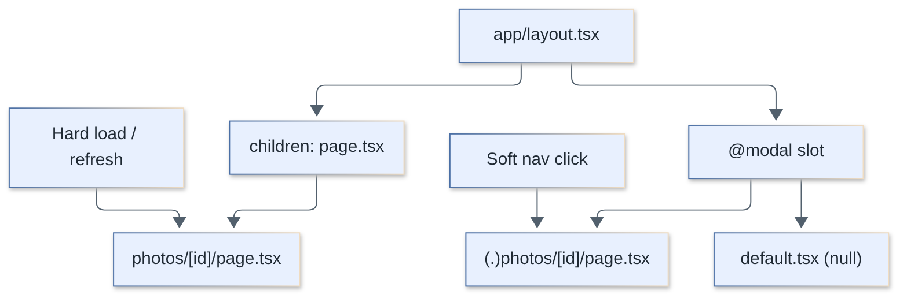
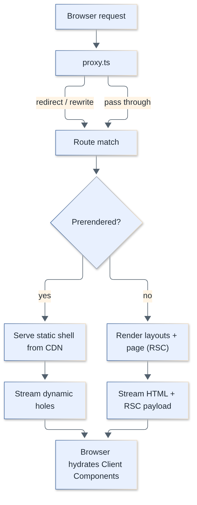
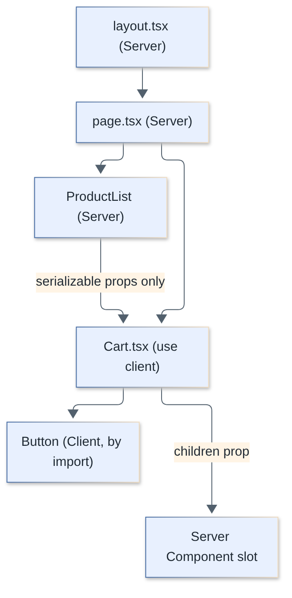
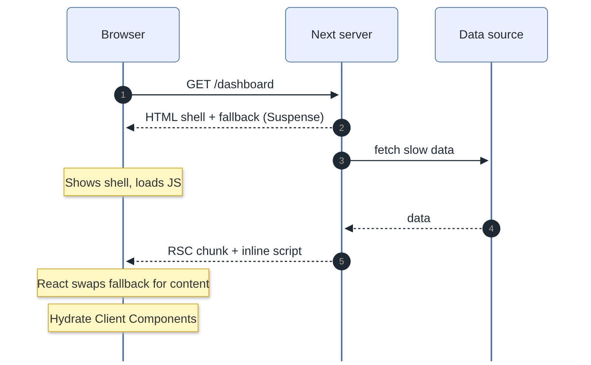
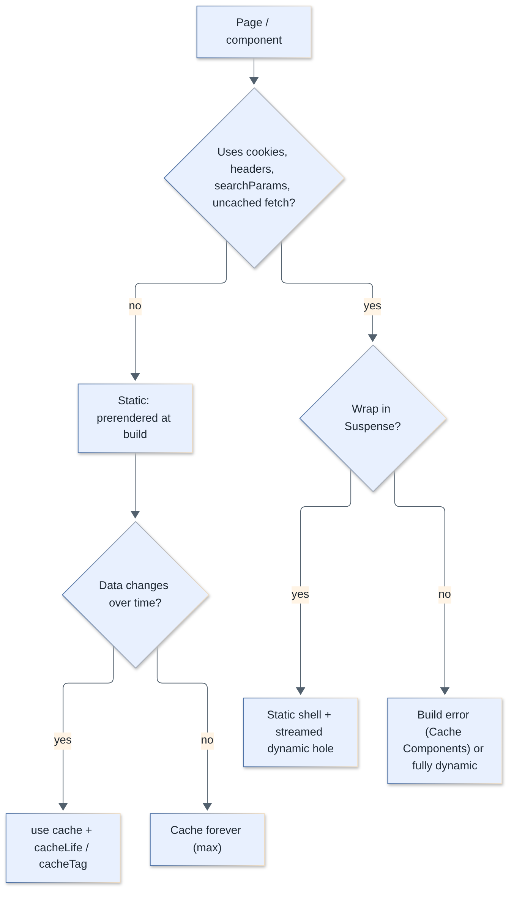
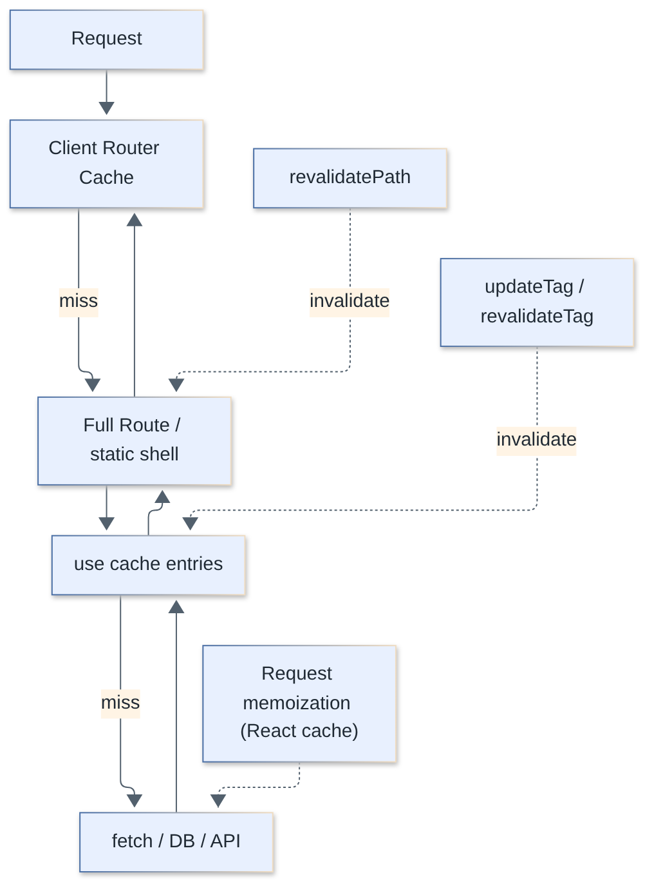
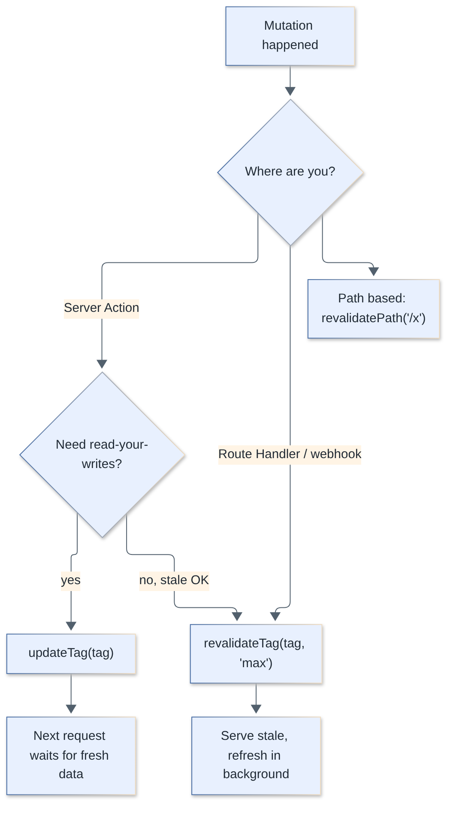
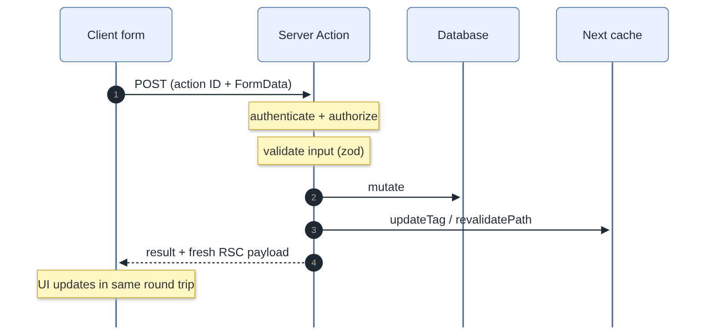

# Next.js Interview Questions

Questions and complete answers on Next.js (App Router), from fundamentals to caching internals and production concerns. Answers target **Next.js 16** (verified against the v16.2 docs); where behavior differs in 13/14/15 it is called out explicitly, because interviewers love to probe version differences.

**Level legend:** `🟢 Junior` · `🟡 Middle` · `🔴 Senior`

## Table of contents


**Fundamentals and Routing**

1. [What is Next.js and what does it add on top of React?](#1-what-is-nextjs-and-what-does-it-add-on-top-of-react)
2. [App Router vs Pages Router: what are the differences?](#2-app-router-vs-pages-router-what-are-the-differences)
3. [Which file conventions does the App Router use?](#3-which-file-conventions-does-the-app-router-use)
4. [How do dynamic segments, catch-all routes and route groups work?](#4-how-do-dynamic-segments-catch-all-routes-and-route-groups-work)
5. [How do `<Link>`, `useRouter` and prefetching work?](#5-how-do-link-userouter-and-prefetching-work)
6. [What is the difference between `layout.tsx` and `template.tsx`, and how do `loading`, `error` and `not-found` nest?](#6-what-is-the-difference-between-layouttsx-and-templatetsx-and-how-do-loading-error-and-not-found-nest)
7. [What are parallel routes and intercepting routes?](#7-what-are-parallel-routes-and-intercepting-routes)
8. [What is `proxy.ts` (formerly `middleware.ts`) and what should it do?](#8-what-is-proxyts-formerly-middlewarets-and-what-should-it-do)

**Server and Client Components**

9. [What are Server Components and Client Components?](#9-what-are-server-components-and-client-components)
10. [What exactly is the `'use client'` boundary and how do you keep Server Components inside Client Components?](#10-what-exactly-is-the-use-client-boundary-and-how-do-you-keep-server-components-inside-client-components)
11. [What can cross the Server to Client boundary (serialization rules)?](#11-what-can-cross-the-server-to-client-boundary-serialization-rules)
12. [How do you handle context providers, third-party libraries and server-only code?](#12-how-do-you-handle-context-providers-third-party-libraries-and-server-only-code)
13. [How does the RSC payload and streaming work under the hood?](#13-how-does-the-rsc-payload-and-streaming-work-under-the-hood)

**Rendering and Caching**

14. [What is the difference between static and dynamic rendering?](#14-what-is-the-difference-between-static-and-dynamic-rendering)
15. [How do Suspense, `loading.tsx` and streaming improve UX?](#15-how-do-suspense-loadingtsx-and-streaming-improve-ux)
16. [What do `generateStaticParams` and `dynamicParams` do?](#16-what-do-generatestaticparams-and-dynamicparams-do)
17. [What is ISR and how is it done now?](#17-what-is-isr-and-how-is-it-done-now)
18. [What are Cache Components and Partial Prerendering (PPR)?](#18-what-are-cache-components-and-partial-prerendering-ppr)
19. [How does `'use cache'` work in detail (keys, arguments, `cacheLife`, `cacheTag`, variants)?](#19-how-does-use-cache-work-in-detail-keys-arguments-cachelife-cachetag-variants)
20. [What are the caching layers in Next.js, and how did `fetch` caching change across versions?](#20-what-are-the-caching-layers-in-nextjs-and-how-did-fetch-caching-change-across-versions)
21. [`updateTag` vs `revalidateTag` vs `revalidatePath` vs `refresh`: when do you use which?](#21-updatetag-vs-revalidatetag-vs-revalidatepath-vs-refresh-when-do-you-use-which)

**Data Fetching, Mutations and APIs**

22. [What are the data fetching patterns and how do you avoid waterfalls?](#22-what-are-the-data-fetching-patterns-and-how-do-you-avoid-waterfalls)
23. [What are Server Actions?](#23-what-are-server-actions)
24. [How do you secure Server Actions?](#24-how-do-you-secure-server-actions)
25. [How do forms, pending state and optimistic updates work with Server Actions?](#25-how-do-forms-pending-state-and-optimistic-updates-work-with-server-actions)
26. [Route Handlers vs Server Actions: when do you use each?](#26-route-handlers-vs-server-actions-when-do-you-use-each)
27. [How do you implement authentication and authorization in the App Router?](#27-how-do-you-implement-authentication-and-authorization-in-the-app-router)
28. [How do you handle errors in the App Router?](#28-how-do-you-handle-errors-in-the-app-router)

**Optimization, SEO and Assets**

29. [How does the Metadata API work and how do you do SEO in Next.js?](#29-how-does-the-metadata-api-work-and-how-do-you-do-seo-in-nextjs)
30. [How does `next/image` work and why use it?](#30-how-does-nextimage-work-and-why-use-it)
31. [How does `next/font` work?](#31-how-does-nextfont-work)
32. [How do you optimize performance and Core Web Vitals in a Next.js app?](#32-how-do-you-optimize-performance-and-core-web-vitals-in-a-nextjs-app)
33. [How do you reduce client bundle size and lazy-load code?](#33-how-do-you-reduce-client-bundle-size-and-lazy-load-code)

**Configuration, Runtime and Deployment**

34. [How do environment variables work (`NEXT_PUBLIC_`)?](#34-how-do-environment-variables-work-next_public_)
35. [What are the Edge and Node.js runtimes, and what changed with `proxy`?](#35-what-are-the-edge-and-nodejs-runtimes-and-what-changed-with-proxy)
36. [What is Turbopack and how does it affect me?](#36-what-is-turbopack-and-how-does-it-affect-me)
37. [How do you self-host Next.js with Docker (standalone output)?](#37-how-do-you-self-host-nextjs-with-docker-standalone-output)
38. [Vercel vs self-hosting: what are the real differences, and what breaks with multiple instances?](#38-vercel-vs-self-hosting-what-are-the-real-differences-and-what-breaks-with-multiple-instances)

**Debugging, Migration and Pitfalls**

39. [What are hydration errors, what causes them, and how do you debug them?](#39-what-are-hydration-errors-what-causes-them-and-how-do-you-debug-them)
40. [What are the most common Next.js pitfalls and anti-patterns?](#40-what-are-the-most-common-nextjs-pitfalls-and-anti-patterns)
41. [What changed from Next 14 to 15 to 16 that you must know?](#41-what-changed-from-next-14-to-15-to-16-that-you-must-know)
42. [How would you architect a large production Next.js app (e-commerce) end to end?](#42-how-would-you-architect-a-large-production-nextjs-app-e-commerce-end-to-end)

---

## Fundamentals and Routing

### 1. What is Next.js and what does it add on top of React?

`🟢 Junior` · `#basics` `#framework`

Next.js is a full-stack React framework. React gives you the UI library; Next.js adds file-system routing, server rendering (SSR/SSG/streaming), React Server Components, data fetching and caching, API endpoints (Route Handlers), image/font/script optimization, a bundler (Turbopack), and deployment tooling.

| Concern | Plain React (Vite SPA) | Next.js |
|---|---|---|
| Routing | Add `react-router` | File-system routing, nested layouts |
| Rendering | Client only | Static, dynamic, streaming, partial prerender |
| Data fetching | Client (`useEffect`, TanStack Query) | Server Components, Server Actions |
| Backend | Separate service | Route Handlers, Server Actions |
| SEO | Hard (empty HTML shell) | HTML in the first response, Metadata API |
| Optimization | Manual | `next/image`, `next/font`, code splitting, prefetching |

Trade-off: you buy a lot of conventions and a server runtime (or a platform that emulates one). A purely client-side dashboard behind a login may not need it.

> **Follow-up:** When would you *not* pick Next.js? Highly interactive apps with no SEO needs and an existing backend (a Vite SPA is simpler), or when you cannot run a Node server or a compatible platform.

[↑ Back to top](#table-of-contents)

### 2. App Router vs Pages Router: what are the differences?

`🟢 Junior` · `#app-router` `#pages-router`

The **App Router** (`app/`, since 13.4) is built on React Server Components, nested layouts, streaming and Server Actions. The **Pages Router** (`pages/`) is the original router built on `getServerSideProps`/`getStaticProps` and client-rendered components. Both can coexist in one project; the App Router is the recommended default for new apps and the Pages Router is maintained but not where new features land.

| | Pages Router | App Router |
|---|---|---|
| Directory | `pages/` | `app/` |
| Components | All are Client Components (SSR + hydrate) | Server Components by default |
| Data fetching | `getServerSideProps`, `getStaticProps`, `getStaticPaths` | `async` components, `fetch`, ORM calls, `use cache` |
| Layouts | `_app.tsx` / per-page wrappers (remount on navigation) | Nested `layout.tsx` that persist across navigation |
| Loading/errors | Manual | `loading.tsx`, `error.tsx`, Suspense streaming |
| Mutations | API routes | Server Actions, Route Handlers |
| API endpoints | `pages/api/*` | `route.ts` |
| Metadata | `next/head` | Metadata API (`metadata`, `generateMetadata`) |

```tsx
// pages/blog/[slug].tsx  (Pages Router)
export const getServerSideProps = async ({ params }) => ({
  props: { post: await getPost(params!.slug as string) },
});
export default function Post({ post }: { post: Post }) {
  return <h1>{post.title}</h1>;
}

// app/blog/[slug]/page.tsx  (App Router)
export default async function Post({ params }: { params: Promise<{ slug: string }> }) {
  const { slug } = await params;
  const post = await getPost(slug);
  return <h1>{post.title}</h1>;
}
```

> **Follow-up:** How do you migrate incrementally? Move routes one at a time into `app/` (the same URL cannot exist in both routers); shared code (`components/`, `lib/`) is reused. Client-only components just need `'use client'`.

[↑ Back to top](#table-of-contents)

### 3. Which file conventions does the App Router use?

`🟢 Junior` · `#routing` `#conventions`

A folder defines a URL segment, and special files inside it define the UI for that segment. A segment is only publicly routable if it contains `page.tsx` or `route.ts`.

| File | Purpose |
|---|---|
| `layout.tsx` | Shared UI, persists across navigations, does not re-render when child routes change |
| `page.tsx` | The unique UI of a route; makes it public |
| `loading.tsx` | Instant fallback; wraps the page in a `<Suspense>` boundary |
| `error.tsx` | Error boundary for the segment (must be a Client Component) |
| `global-error.tsx` | Catches errors in the root layout (must render `<html>`/`<body>`) |
| `not-found.tsx` | UI for `notFound()` / unmatched URLs |
| `template.tsx` | Like layout but remounts on every navigation |
| `route.ts` | HTTP endpoint (Route Handler) |
| `default.tsx` | Fallback for a parallel-route slot |
| `proxy.ts` (root) | Runs before routes (called `middleware.ts` before Next 16) |
| `opengraph-image.tsx`, `sitemap.ts`, `robots.ts`, `manifest.ts`, `icon.tsx` | Metadata files |

```
app/
├── layout.tsx            # root layout (required: <html>, <body>)
├── page.tsx              # /
├── (marketing)/          # route group: no URL segment
│   └── about/page.tsx    # /about
├── dashboard/
│   ├── layout.tsx
│   ├── loading.tsx
│   ├── error.tsx
│   └── page.tsx          # /dashboard
└── blog/[slug]/page.tsx  # /blog/hello
```

Folders prefixed with `_` (`_components`) are private and not routable, so you can colocate code next to routes.

[↑ Back to top](#table-of-contents)

### 4. How do dynamic segments, catch-all routes and route groups work?

`🟡 Middle` · `#routing` `#params`

`[slug]` matches one segment, `[...slug]` matches one or more, `[[...slug]]` matches zero or more (optional catch-all). `(group)` folders organise code and let different subtrees have different layouts without changing the URL.

```tsx
// app/shop/[...categories]/page.tsx  -> /shop/a, /shop/a/b/c
export default async function Page({
  params,
}: {
  params: Promise<{ categories: string[] }>;
}) {
  const { categories } = await params; // ['a', 'b', 'c']
  return <p>{categories.join(' / ')}</p>;
}
```

**Important version change:** since Next 15, `params` and `searchParams` are **Promises** and must be awaited (`await params`, or `use(params)` in a Client Component). Next 15 still allowed synchronous access with a warning; Next 16 removed the synchronous compatibility, so un-migrated code fails. The codemod `npx @next/codemod@latest next-async-request-api .` does the migration. `cookies()`, `headers()` and `draftMode()` are async for the same reason.

Route groups: `app/(marketing)/layout.tsx` and `app/(app)/layout.tsx` give two root layouts (each must then render `<html>`). Gotcha: two groups cannot resolve to the same URL.

> **Follow-up:** Why did `params` become async? So Next can start rendering/prerendering the shell before the request-specific values are known, and detect dynamic access explicitly.

[↑ Back to top](#table-of-contents)

### 5. How do `<Link>`, `useRouter` and prefetching work?

`🟢 Junior` · `#navigation` `#prefetch`

`<Link>` does client-side navigation (no full page reload) and **prefetches** the target route when it enters the viewport (in production). Use `<Link>` for navigation, `useRouter()` for programmatic navigation after events, and `redirect()` on the server.

```tsx
// components/nav.tsx
'use client';
import Link from 'next/link';
import { usePathname, useRouter } from 'next/navigation';

export function Nav() {
  const pathname = usePathname();
  const router = useRouter();
  return (
    <nav>
      <Link href="/dashboard" aria-current={pathname === '/dashboard' ? 'page' : undefined}>
        Dashboard
      </Link>
      <Link href="/reports" prefetch={false}>Reports</Link>
      <button onClick={() => router.push('/settings')}>Settings</button>
    </nav>
  );
}
```

- Static routes: the whole route is prefetched. Dynamic routes: the shared layout down to the first `loading.tsx` is prefetched.
- `prefetch={false}` disables it (large lists of links); prefetching does not happen in `next dev`.
- Next 16 reworked the routing/prefetch pipeline (layout deduplication and incremental prefetching) so shared layouts are downloaded once; the API you write is unchanged.
- The client **Router Cache** stores visited/prefetched RSC payloads in memory for the session; `router.refresh()` drops it for the current route.

> **Follow-up:** `router.push` vs `redirect`? `redirect()` runs on the server (in Server Components, actions, handlers) and throws a special error; `router.push` is client-only.

[↑ Back to top](#table-of-contents)

### 6. What is the difference between `layout.tsx` and `template.tsx`, and how do `loading`, `error` and `not-found` nest?

`🟡 Middle` · `#layouts` `#boundaries`

A layout is mounted once and preserved (state, scroll, DOM) across navigations among its children; a template creates a **new instance** on every navigation (state reset, effects re-run, `key` changes). Use templates for enter animations, per-page analytics effects, or resetting form state.

Segments compose into a nested tree of boundaries:

```
layout.tsx
 └ template.tsx
    └ error.tsx          (React error boundary)
       └ loading.tsx     (Suspense boundary)
          └ not-found.tsx
             └ page.tsx
```

Consequences interviewers like:
- `error.tsx` does **not** catch errors thrown by the **same segment's** `layout.tsx` or `template.tsx`; the boundary is *inside* them. Put `error.tsx` in the parent segment, or use `global-error.tsx` for the root layout.
- `loading.tsx` only covers `page.tsx` and below, not its sibling layout. If the layout itself awaits slow data, nothing shows a fallback.
- A layout cannot receive `pathname`/`searchParams` (it does not re-render on navigation); use a Client Component with `usePathname()` for active links.
- Layouts cannot pass data to children; fetch in both places (requests are deduped with `React.cache` or `use cache`).

```tsx
// app/dashboard/error.tsx
'use client';
export default function Error({ error, reset }: { error: Error; reset: () => void }) {
  return (
    <div role="alert">
      <p>Something went wrong.</p>
      <button onClick={reset}>Try again</button>
    </div>
  );
}
```

[↑ Back to top](#table-of-contents)

### 7. What are parallel routes and intercepting routes?

`🟡 Middle` · `#routing` `#modals`

**Parallel routes** (`@slot` folders) render several pages in the same layout simultaneously, each with its own loading/error state, passed to the layout as props. **Intercepting routes** (`(.)`, `(..)`, `(..)(..)`, `(...)`) load another route's UI *inside the current layout* on soft navigation, while a hard load or refresh shows the real page. Together they implement URL-addressable modals (photo gallery, login dialog).



```tsx
// app/layout.tsx
export default function Layout({
  children,
  modal,
}: {
  children: React.ReactNode;
  modal: React.ReactNode;
}) {
  return (
    <html lang="en">
      <body>
        {children}
        {modal}
      </body>
    </html>
  );
}

// app/@modal/default.tsx  -> required: what the slot renders when it has no match
export default function Default() {
  return null;
}

// app/@modal/(.)photos/[id]/page.tsx  -> intercepts /photos/[id] on soft navigation
import { Modal } from '@/components/modal';
export default async function PhotoModal({ params }: { params: Promise<{ id: string }> }) {
  const { id } = await params;
  return <Modal></Modal>;
}
```

Notes:
- Intercepting conventions are based on **route segments**, not file system folders, so `@slot` folders are ignored when counting `(..)` levels.
- **Since Next 16, every parallel route slot requires an explicit `default.tsx`** (earlier versions silently fell back); the build fails without it. Return `null` or call `notFound()`.
- Closing the modal: `router.back()`.

[↑ Back to top](#table-of-contents)

### 8. What is `proxy.ts` (formerly `middleware.ts`) and what should it do?

`🔴 Senior` · `#proxy` `#middleware` `#auth`

It is code that runs **before a request is routed**, at the network boundary: redirect, rewrite, set headers/cookies, simple gating. **In Next 16 `middleware.ts` was renamed to `proxy.ts`** and the exported function from `middleware` to `proxy`; the `proxy` runtime is **Node.js and is not configurable**. The Edge runtime is not supported in `proxy`; if you need it, keep using the deprecated `middleware.ts`. A codemod does the rename: `npx @next/codemod@canary middleware-to-proxy .`. The config flag `skipMiddlewareUrlNormalize` became `skipProxyUrlNormalize`.

```ts
// proxy.ts (Next 16; in Next 15 this is middleware.ts exporting `middleware`)
import { NextRequest, NextResponse } from 'next/server';

export function proxy(request: NextRequest) {
  const hasSession = request.cookies.has('session');
  if (!hasSession && request.nextUrl.pathname.startsWith('/dashboard')) {
    return NextResponse.redirect(new URL('/login', request.url));
  }
  return NextResponse.next();
}

export const config = {
  matcher: ['/((?!api|_next/static|_next/image|favicon.ico).*)'],
};
```



Good uses: optimistic auth redirects (cookie presence / lightweight JWT verification), locale redirects, A/B rewrites, bot blocking, adding headers.

Bad uses: being the **only** authorization layer (CVE-2025-29927: a spoofed internal `x-middleware-subrequest` header skipped middleware entirely on self-hosted `next start`/standalone apps; fixed in 15.2.3, 14.2.25, 13.5.9, 12.3.5, so always re-check in the data layer), heavy DB queries, slow work on every request, data fetching that should be cached, and `revalidateTag` (not allowed in proxy).

> **Follow-up:** Why rename? "Middleware" suggested Express-style app logic; the team wanted to make clear this is a routing/network layer in front of the app, and to push logic into the data layer and Server Components.

[↑ Back to top](#table-of-contents)

---

## Server and Client Components

### 9. What are Server Components and Client Components?

`🟢 Junior` · `#rsc` `#client-components`

In the App Router **every component is a Server Component by default**: it renders only on the server, can be `async`, can read the DB/filesystem/secrets directly, and ships **zero JavaScript** to the browser. A **Client Component** (file starts with `'use client'`) is pre-rendered to HTML on the server too, but its JS is also sent to the browser and hydrated, so it can use state, effects, event handlers and browser APIs.

| | Server Component | Client Component |
|---|---|---|
| Directive | none (default) | `'use client'` |
| `async`/`await` | yes | no |
| `useState`, `useEffect`, handlers | no | yes |
| Browser APIs (`window`, `localStorage`) | no | yes |
| DB / secrets / server-only libs | yes | no |
| JS sent to client | none | yes (counts toward bundle) |
| Can import the other | imports both | imports Client only (Server only via `children`/props) |

```tsx
// app/products/page.tsx  (Server Component)
import { db } from '@/lib/db';
import { AddToCart } from './add-to-cart';

export default async function Products() {
  const products = await db.product.findMany();
  return products.map((p) => (
    <div key={p.id}>
      {p.name} <AddToCart productId={p.id} />
    </div>
  ));
}

// app/products/add-to-cart.tsx  (Client Component)
'use client';
import { useState } from 'react';
export function AddToCart({ productId }: { productId: string }) {
  const [added, setAdded] = useState(false);
  return <button onClick={() => setAdded(true)}>{added ? 'Added' : 'Add'}</button>;
}
```

Rule of thumb: keep components on the server and push `'use client'` down to the smallest interactive leaf.

[↑ Back to top](#table-of-contents)

### 10. What exactly is the `'use client'` boundary and how do you keep Server Components inside Client Components?

`🟡 Middle` · `#boundary` `#composition`

`'use client'` marks a **module boundary**: that file and everything it *imports* become part of the client bundle. You put it only on the entry file of a client subtree; you do not annotate each child. A Server Component can still be rendered *inside* a Client Component if it is passed as `children` or another prop, because the server renders it first and the client only receives the resulting slot.



```tsx
// components/modal.tsx
'use client';
import { useState } from 'react';

export function Modal({ children }: { children: React.ReactNode }) {
  const [open, setOpen] = useState(true);
  return open ? <dialog open>{children}<button onClick={() => setOpen(false)}>x</button></dialog> : null;
}

// app/page.tsx  (Server)
import { Modal } from '@/components/modal';
import { Recommendations } from './recommendations'; // async Server Component

export default function Page() {
  return (
    <Modal>
      <Recommendations /> {/* stays server-rendered, no JS shipped for it */}
    </Modal>
  );
}
```

Pitfall: importing a Server Component *inside* the Client file converts it into a Client Component (and async/DB code then fails to bundle). Also, components imported by a client module cannot use server-only APIs.

> **Follow-up:** Does `'use client'` mean "client only render"? No. Client Components are still SSR'd to HTML, then hydrated. To skip SSR use `next/dynamic` with `ssr: false` (inside a Client Component).

[↑ Back to top](#table-of-contents)

### 11. What can cross the Server to Client boundary (serialization rules)?

`🟡 Middle` · `#serialization` `#props`

Props passed from a Server to a Client Component are serialized into the RSC payload, so they must be serializable by React: primitives, `Date`, `Map`/`Set`, typed arrays, plain objects and arrays, `BigInt`, Promises (consumable with `use()`), JSX/elements, and **Server Actions** (functions marked `'use server'`). **Not allowed:** ordinary functions/callbacks, class instances, Symbols not registered, objects with prototypes from ORMs (e.g. Mongoose documents), DOM nodes.

```tsx
// app/page.tsx (Server)
import { Chart } from './chart';
import { saveFilter } from './actions';

export default async function Page() {
  const rows = await getRows();           // ok: plain data
  return (
    <Chart
      rows={rows}
      onSave={saveFilter}                 // ok: Server Action reference
      // onPoint={(p) => console.log(p)}  // ERROR: functions are not serializable
    />
  );
}
```

Practical advice:
- Pass only what the client needs (a DTO), not an entire DB row: everything passed is visible in the page payload (secrets, password hashes).
- Passing a Promise lets the Client Component `use(promise)` and stream the data in.
- Server to Client callbacks do not exist; the opposite direction (client calls server) is done through Server Actions.

[↑ Back to top](#table-of-contents)

### 12. How do you handle context providers, third-party libraries and server-only code?

`🟡 Middle` · `#context` `#server-only`

React Context and hooks only work in Client Components, so providers must be wrapped in a `'use client'` file and rendered near the root; children passed through stay server-rendered. Third-party libraries that use hooks without `'use client'` need a thin client wrapper.

```tsx
// app/providers.tsx
'use client';
import { ThemeProvider } from 'next-themes';
export function Providers({ children }: { children: React.ReactNode }) {
  return <ThemeProvider attribute="class">{children}</ThemeProvider>;
}

// app/layout.tsx (Server)
import { Providers } from './providers';
export default function RootLayout({ children }: { children: React.ReactNode }) {
  return (
    <html lang="en" suppressHydrationWarning>
      <body><Providers>{children}</Providers></body>
    </html>
  );
}
```

Guarding server-only code so it can never leak into a client bundle:

```ts
// lib/data.ts
import 'server-only'; // build error if imported from a Client Component
export async function getSecretReport() { /* DB + secrets */ }
```

`client-only` is the mirror package. React also offers `experimental_taintObjectReference` / `taintUniqueValue` (behind `experimental.taint`) to flag sensitive values. Because Server Components have no shared per-request context, share request-scoped data with `React.cache()`.

[↑ Back to top](#table-of-contents)

### 13. How does the RSC payload and streaming work under the hood?

`🔴 Senior` · `#rsc` `#streaming` `#internals`

On the server React renders the Server Component tree into the **RSC payload**, a compact streamed format describing the rendered tree: HTML-ish element descriptions, serialized props, and *references* to Client Components (module ID + chunk) instead of their code. Next uses it twice: (1) the server turns it into HTML for the first paint, (2) the browser receives the same payload to reconcile the React tree, hydrate Client Components and, on later navigations, to update the DOM without a reload.



Streaming means chunks are flushed as they become ready. A `<Suspense>` boundary lets React send the shell immediately with the fallback, and later send the resolved subtree plus a tiny inline script that swaps it in. This is why TTFB stays low even if one component is slow, and why `loading.tsx` works (it is an automatic Suspense boundary).

```tsx
// app/dashboard/page.tsx
import { Suspense } from 'react';

export default function Dashboard() {
  return (
    <>
      <h1>Dashboard</h1>               {/* in the shell */}
      <Suspense fallback={<p>Loading revenue...</p>}>
        <Revenue />                     {/* streams in later */}
      </Suspense>
    </>
  );
}
async function Revenue() {
  const data = await getRevenue(); // slow
  return <p>{data.total}</p>;
}
```

Gotchas: the HTTP status and headers are sent with the first chunk, so a `notFound()` or redirect after streaming has started cannot change the status (Next injects a `noindex` meta and a client redirect). Streaming is also affected by proxies that buffer responses (some nginx configs, compression); disable buffering for the Next upstream.

> **Follow-up:** What does hydration do with the payload? It attaches handlers to server-rendered HTML for each Client Component; Suspense boundaries hydrate independently and in priority order (selective hydration).

[↑ Back to top](#table-of-contents)

---

## Rendering and Caching

### 14. What is the difference between static and dynamic rendering?

`🟢 Junior` · `#rendering` `#ssg` `#ssr`

**Static rendering** produces HTML at build time (or on revalidation) and serves it from a CDN: fastest and cheapest. **Dynamic rendering** renders per request on the server because the output depends on request-time information (cookies, headers, search params, uncached data). Next chooses per route by what you use; there is no `getStaticProps` switch.

| Trigger | Result (without Cache Components) |
|---|---|
| Plain page, no request APIs, only cached data | Static |
| `cookies()`, `headers()`, `searchParams`, `connection()` | Dynamic |
| `export const dynamic = 'force-dynamic'` | Dynamic |
| `fetch(url, { cache: 'no-store' })` | Dynamic |
| `generateStaticParams` for dynamic segments | Static per listed param |

With **Cache Components** enabled (`cacheComponents: true`, Q18) the model flips: everything is dynamic by default and you explicitly opt into caching with `use cache`; the page is a **static shell plus streamed dynamic holes**.

```tsx
// app/page.tsx  -> static (no dynamic APIs)
export default function Home() {
  return <h1>Hello</h1>;
}

// app/me/page.tsx  -> dynamic: reads cookies
import { cookies } from 'next/headers';
export default async function Me() {
  const theme = (await cookies()).get('theme')?.value ?? 'light';
  return <p>{theme}</p>;
}
```

The build output (`next build`) tables each route as static or dynamic.

[↑ Back to top](#table-of-contents)

### 15. How do Suspense, `loading.tsx` and streaming improve UX?

`🟡 Middle` · `#streaming` `#suspense`

Instead of waiting for the slowest query before sending anything, split the page into independent async Server Components, wrap slow ones in `<Suspense>`, and the browser gets the shell instantly while sections stream in. `loading.tsx` is the segment-level version (and also appears instantly on client navigation, since the fallback is prefetched).

```tsx
// app/dashboard/page.tsx
import { Suspense } from 'react';
import { Stats, StatsSkeleton } from './stats';
import { Feed, FeedSkeleton } from './feed';

export default function Page() {
  return (
    <>
      <Suspense fallback={<StatsSkeleton />}><Stats /></Suspense>
      <Suspense fallback={<FeedSkeleton />}><Feed /></Suspense>
    </>
  );
}
```

Guidelines: place boundaries around the data-dependent part, not around the whole page; design skeletons that match final dimensions (avoid CLS); put `await` in the component that needs the data so siblings render in parallel. `loading.tsx` does not apply to the same segment's layout, and for SEO, content inside Suspense is still in the HTML stream (bots receive it) though a crawler that does not wait for the stream may only see the fallback, so keep critical SEO content (title, h1) in the shell.

[↑ Back to top](#table-of-contents)

### 16. What do `generateStaticParams` and `dynamicParams` do?

`🟡 Middle` · `#ssg` `#dynamic-routes`

`generateStaticParams` lists the param values to prerender at build time for a dynamic segment (replacement for `getStaticPaths`). Params not returned are rendered on demand on first request (and then cached) unless `dynamicParams = false`, which returns 404 for them.

```tsx
// app/blog/[slug]/page.tsx
export async function generateStaticParams() {
  const posts = await fetch('https://api.example.com/posts').then((r) => r.json());
  return posts.map((p: { slug: string }) => ({ slug: p.slug }));
}

export const dynamicParams = true; // default; false => 404 for unknown slugs
// (with Cache Components, route segment configs like dynamicParams are not supported;
//  see the cacheComponents docs - unlisted params just render on demand)

export default async function Post({ params }: { params: Promise<{ slug: string }> }) {
  const { slug } = await params;
  const post = await getPost(slug);
  return <article><h1>{post.title}</h1></article>;
}
```

Tips: prerender only the top N popular pages and let the rest render lazily; with nested segments the child's `generateStaticParams` receives the parent's `params`; the data fetch inside `generateStaticParams` and the page are deduplicated when they use the same cached fetch/function. Under Cache Components, if a route has no `generateStaticParams` and reads `params` outside `Suspense`, you get a build error telling you to wrap it or provide static params, since params are runtime data until supplied.

[↑ Back to top](#table-of-contents)

### 17. What is ISR and how is it done now?

`🟡 Middle` · `#isr` `#revalidation`

Incremental Static Regeneration serves a cached static page and regenerates it in the background after a time window or on demand, without rebuilding the whole site. Mechanism: stale-while-revalidate.

| Era | How you configure it |
|---|---|
| Pages Router | `getStaticProps` returning `revalidate: 60`; `res.revalidate('/path')` |
| App Router (13-16 without Cache Components) | `export const revalidate = 60` or `fetch(url, { next: { revalidate: 60, tags: ['posts'] } })`; `revalidatePath` / `revalidateTag` |
| App Router with Cache Components (16) | `'use cache'` + `cacheLife('minutes')` + `cacheTag('posts')`; invalidate with `updateTag` / `revalidateTag(tag, 'max')` |

```tsx
// app/posts/page.tsx  (Next 16, cacheComponents: true)
import { cacheLife, cacheTag } from 'next/cache';

export default async function Posts() {
  'use cache';
  cacheLife('hours');
  cacheTag('posts');
  const posts = await db.post.findMany();
  return <ul>{posts.map((p) => <li key={p.id}>{p.title}</li>)}</ul>;
}
```

Things to know: time-based revalidation is per cache entry; the first visitor after expiry still gets stale content (SWR) while it refreshes. On self-hosting, the cache lives on local disk/memory by default, so multi-instance deployments need a shared cache handler (Q38). Route-segment `revalidate` is incompatible with `cacheComponents` and must be migrated to `cacheLife`.

[↑ Back to top](#table-of-contents)

### 18. What are Cache Components and Partial Prerendering (PPR)?

`🔴 Senior` · `#cache-components` `#ppr` `#rendering`

**Cache Components** (`cacheComponents: true` in `next.config.ts`, introduced as `dynamicIO`/experimental PPR in 15 and the stable model in 16) make Next.js **dynamic by default** and let you opt in to caching per page, component or function with `'use cache'`. It implements **Partial Prerendering** as the default behavior: at build time Next prerenders a **static shell** (static parts + cached parts) and leaves **holes** for request-time content wrapped in `<Suspense>`, which stream in at request time. The old `experimental.ppr` flag and `experimental_ppr` route export were removed.



```ts
// next.config.ts
import type { NextConfig } from 'next';
const nextConfig: NextConfig = { cacheComponents: true };
export default nextConfig;
```

```tsx
// app/product/[id]/page.tsx
import { Suspense } from 'react';
import { cookies } from 'next/headers';
import { cacheLife, cacheTag } from 'next/cache';

export default async function Page({ params }: { params: Promise<{ id: string }> }) {
  const { id } = await params;             // runtime data, see note
  return (
    <>
      <ProductInfo id={id} />               {/* cached, part of the shell */}
      <Suspense fallback={<p>Loading cart...</p>}>
        <CartBadge />                       {/* request-time hole */}
      </Suspense>
    </>
  );
}

async function ProductInfo({ id }: { id: string }) {
  'use cache';
  cacheLife('hours');
  cacheTag(`product-${id}`);
  return <h1>{(await getProduct(id)).name}</h1>;
}

async function CartBadge() {
  const sid = (await cookies()).get('sid')?.value;  // dynamic data
  return <span>{await getCartCount(sid)}</span>;
}
```

Rules enforced at build/dev time: runtime APIs (`cookies`, `headers`, `searchParams`, `connection`, and unresolved `params`) and uncached I/O **must** be inside a Suspense boundary (or the component must be cached), otherwise you get an error like "Uncached data was accessed outside of Suspense". Route segment configs (`dynamic`, `revalidate`, `fetchCache`, `dynamicParams`, `runtime` in handlers) are not supported with it; `force-static` becomes `'use cache'` + `cacheLife('max')`.

| Strategy | Static shell | Fresh data | Result |
|---|---|---|---|
| SSG | whole page | none | CDN fast, stale |
| SSR | none | whole page | slow TTFB |
| ISR | whole page | on timer/event | fast, eventually fresh |
| PPR / Cache Components | shell + cached parts | holes streamed | fast shell + per-user data |

> **Follow-up:** Why is it a significant change? It removes the page-level static-vs-dynamic binary: one route can serve an instant CDN shell and still personalize.

[↑ Back to top](#table-of-contents)

### 19. How does `'use cache'` work in detail (keys, arguments, `cacheLife`, `cacheTag`, variants)?

`🔴 Senior` · `#use-cache` `#caching`

`'use cache'` can be placed at file, component or function level. Next caches the **return value** (for components: the rendered RSC output) keyed by the function identity (build ID + function ID), its **serializable arguments/props**, and any serializable values it closes over. Cache entries are stored by default in an in-memory handler per instance, and can also be used at build time to prerender.

```ts
// lib/products.ts
import { cacheLife, cacheTag } from 'next/cache';

export async function getProduct(id: string) {
  'use cache';
  cacheLife('hours');        // profile: seconds | minutes | hours | days | weeks | max
  cacheTag('products', `product-${id}`);
  return db.product.findUnique({ where: { id } });
}
```

Key rules:
- **Arguments must be serializable**, and so must the return value; non-serializable values (class instances, functions) can only be passed through if the cached function never inspects them (e.g. `children`).
- **No runtime request APIs inside**: `cookies()`, `headers()`, `searchParams` throw inside `'use cache'`. Read them outside and pass the values as arguments (they then become part of the key).
- `cacheLife` takes a profile name or an inline object (`{ stale, revalidate, expire }` in seconds) and also controls the client `stale` time via the Router Cache. Profiles can be customized in `cacheLife` in next config. If a cached function has a very short `revalidate`/`expire`, it is excluded from prerendering and becomes dynamic.
- `cacheTag` accepts several tags (limits: 128 tags, 256 chars each).
- **`'use cache: private'`** allows reading cookies/headers inside, with per-user caching only in the browser's memory (not shared on the server); useful for personalized-but-reusable data.
- **`'use cache: remote'`** stores in a remote/shared cache handler (important for serverless where memory is ephemeral) and is allowed to be used at request time in dynamic contexts.
- Nested caches: inner entries with shorter lifetimes shorten the outer entry's effective lifetime.
- `unstable_cache` is superseded by `'use cache'`.

Common bug: caching a function that reads user-specific data by closing over a variable the key does not capture, causing one user's data to be served to another. Make every input an argument.

[↑ Back to top](#table-of-contents)

### 20. What are the caching layers in Next.js, and how did `fetch` caching change across versions?

`🔴 Senior` · `#caching` `#fetch` `#history`



| Layer | Where | What | Duration |
|---|---|---|---|
| Request memoization | server, per request | dedupes identical `fetch` GETs and `React.cache` calls in one render | one request |
| Data cache / `use cache` | server (memory, disk, or custom handler) | results of `fetch` or cached functions/components | until revalidated/expired |
| Full route cache / static shell | server/CDN | prerendered HTML + RSC payload | until revalidation or redeploy |
| Router Cache | browser memory | visited/prefetched RSC payloads | session; page segments not reused by default since 15 (`experimental.staleTimes` re-enables) |

How the defaults changed (interviewers probe this):

| Version | `fetch` default | `GET` Route Handler | Page segments in Router Cache |
|---|---|---|---|
| Next 13/14 | `force-cache` (cached forever) | cached (static) | cached ~30s dynamic / 5min static |
| Next 15 | `no-store` (uncached) unless opted in with `cache: 'force-cache'` or `next: { revalidate }` | not cached; opt in with `dynamic = 'force-static'` | not reused by default; opt back in via `experimental.staleTimes` |
| Next 16 with Cache Components | no implicit caching; use `'use cache'`; `fetch` options `next.revalidate`/`tags` are not how you cache anymore | follows page model: dynamic at request time unless it uses `use cache` | same as 15 (see the `stale` value of `cacheLife` for cached content) |

`React.cache()` is still the tool for deduping the same call (ORM queries, not just `fetch`) within one render:

```ts
// lib/user.ts
import { cache } from 'react';
export const getUser = cache(async (id: string) => db.user.findUnique({ where: { id } }));
// layout.tsx and page.tsx can both call getUser(id): the DB is hit once per request
```

> **Follow-up:** Why did the team reverse the implicit caching? It was the most-complained-about behavior: data was stale unexpectedly and the opt-out was hard to discover. "Dynamic by default, opt in to cache" is explicit and debuggable.

[↑ Back to top](#table-of-contents)

### 21. `updateTag` vs `revalidateTag` vs `revalidatePath` vs `refresh`: when do you use which?

`🔴 Senior` · `#revalidation` `#server-actions`



| API | Allowed in | Behavior |
|---|---|---|
| `updateTag(tag)` | Server Actions only | Expires the tag immediately; the next request **waits for fresh data** (read-your-writes). Use after a user's own mutation |
| `revalidateTag(tag, 'max')` | Server Actions, Route Handlers (not Proxy / Client) | Marks stale; **stale-while-revalidate**: serves stale, refreshes in background |
| `revalidateTag(tag)` (one arg) | same | **Deprecated in 16**: the old "expire now" form; TypeScript errors unless you pass a profile |
| `revalidatePath('/x')` | Server Actions, Route Handlers | Invalidates the route's cached data; re-renders on next visit |
| `refresh()` (from `next/cache`) | Server Actions | Refreshes the client router for uncached/dynamic data without touching caches |
| `router.refresh()` | Client | Re-fetches the current route's RSC payload |

```ts
// app/actions.ts
'use server';
import { updateTag, revalidateTag } from 'next/cache';

export async function updateProfile(userId: string, data: FormData) {
  await db.user.update({ where: { id: userId }, data: parse(data) });
  updateTag(`user-${userId}`);       // user sees their change immediately
}

// app/api/webhook/route.ts
export async function POST() {
  revalidateTag('catalog', 'max');   // CMS webhook: SWR is fine
  return Response.json({ ok: true });
}
```

Gotchas: invalidating a tag does not eagerly re-render everything; the work happens when a page using it is visited. `revalidatePath` is coarse; prefer tags for precise invalidation (`cacheTag` on `use cache` functions or `next: { tags }` on legacy fetch). In multi-instance self-hosting, invalidation only reaches instances sharing the cache handler.

[↑ Back to top](#table-of-contents)

---

## Data Fetching, Mutations and APIs

### 22. What are the data fetching patterns and how do you avoid waterfalls?

`🟡 Middle` · `#data-fetching` `#performance`

Fetch in Server Components, next to where data is used. A **waterfall** is sequential awaits where requests do not depend on each other. Start independent requests together (`Promise.all`), or split into sibling async components inside Suspense so they fetch in parallel; use *preload* patterns for dependent requests.

```tsx
// BAD: sequential, total = a + b
const user = await getUser(id);
const posts = await getPosts(id);

// GOOD: parallel, total = max(a, b)
const [user, posts] = await Promise.all([getUser(id), getPosts(id)]);

// BETTER for UX: independent streaming
export default async function Page({ params }: { params: Promise<{ id: string }> }) {
  const { id } = await params;
  return (
    <>
      <Suspense fallback={<Skeleton />}><User id={id} /></Suspense>
      <Suspense fallback={<Skeleton />}><Posts id={id} /></Suspense>
    </>
  );
}
```

Hidden waterfalls: parent layout awaits, then child page awaits (layouts and pages render in parallel, so this is fine; the issue is a component that fetches, then renders a child that fetches). Use `React.cache` or `use cache` so the same data requested in multiple places is a single call. Client-side fetching is for truly client-driven data (infinite scroll, polling, mutations with optimistic UI) via SWR/TanStack Query, or by passing a Promise from the server and calling `use()`.

> **Follow-up:** Should you call your own Route Handler from a Server Component? No: call the function/ORM directly; an HTTP round trip to yourself adds latency and breaks at build time.

[↑ Back to top](#table-of-contents)

### 23. What are Server Actions?

`🟢 Junior` · `#server-actions` `#mutations`

Server Actions are async functions marked with `'use server'` that run on the server but can be invoked from the client (forms or event handlers). Next generates an endpoint and the client calls it with a POST; you never write the fetch.

```tsx
// app/todos/actions.ts
'use server';
import { updateTag } from 'next/cache';

export async function addTodo(formData: FormData) {
  const title = String(formData.get('title'));
  await db.todo.create({ data: { title } });
  updateTag('todos');
}

// app/todos/page.tsx
import { addTodo } from './actions';

export default function Page() {
  return (
    <form action={addTodo}>
      <input name="title" required />
      <button>Add</button>
    </form>
  );
}
```

Benefits: progressive enhancement (forms work before hydration), no API boilerplate, automatic cache invalidation + fresh UI in the same round trip. Limitations: POST only, actions from one client are executed **sequentially** (not for parallel data fetching), and you should treat them as mutations rather than queries.

[↑ Back to top](#table-of-contents)

### 24. How do you secure Server Actions?

`🔴 Senior` · `#security` `#server-actions`

**Every Server Action is a public HTTP endpoint**: anyone can POST to it with a crafted body, regardless of whether your UI shows the button. So each action must **authenticate, authorize, and validate** its input itself.



```ts
// app/posts/actions.ts
'use server';
import { z } from 'zod';
import { auth } from '@/lib/auth';
import { updateTag } from 'next/cache';

const Input = z.object({ postId: z.string().uuid(), title: z.string().min(1).max(200) });

export async function renamePost(raw: unknown) {
  const session = await auth();                          // 1. authentication
  if (!session?.user) throw new Error('Unauthorized');

  const { postId, title } = Input.parse(raw);            // 2. validation (types are not runtime checks)

  const post = await db.post.findUnique({ where: { id: postId } });
  if (post?.authorId !== session.user.id) {              // 3. authorization (avoid IDOR)
    throw new Error('Forbidden');
  }

  await db.post.update({ where: { id: postId }, data: { title } });
  updateTag(`post-${postId}`);
}
```

What Next does for you: unused actions are removed from the client bundle (no endpoint created); used actions get non-guessable, periodically rotated IDs; variables captured by closures are **encrypted** before going to the client; the `Origin` header is compared to `Host`/`X-Forwarded-Host` (CSRF), with extra trusted origins in `experimental.serverActions.allowedOrigins`. None of this is authorization.

Pitfalls:
- Relying on page-level checks or proxy only: the action is a separate entry point, re-check inside it (the data-security guide shows exactly this).
- Trusting hidden form fields (`userId`, `price`) from the client; derive them from the session.
- Exporting helper functions from a `'use server'` file: every export becomes an endpoint. Keep non-action helpers out.
- Leaking error details; return safe messages. Add rate limiting for abuse-prone actions.

> **Follow-up:** "IDs are unguessable so it's safe?" No: security by obscurity; IDs leak in the client bundle of any user who can see the form.

[↑ Back to top](#table-of-contents)

### 25. How do forms, pending state and optimistic updates work with Server Actions?

`🟡 Middle` · `#forms` `#react-19` `#optimistic`

Use React 19 hooks: `useActionState` for returned state/validation errors, `useFormStatus` (inside a child of the form) for the pending flag, and `useOptimistic` for instant UI that rolls back on failure. Actions called from forms keep working without JS (progressive enhancement).

```tsx
// app/contact/form.tsx
'use client';
import { useActionState } from 'react';
import { useFormStatus } from 'react-dom';
import { sendMessage } from './actions';

type State = { error?: string; ok?: boolean };

function Submit() {
  const { pending } = useFormStatus();
  return <button disabled={pending}>{pending ? 'Sending...' : 'Send'}</button>;
}

export function ContactForm() {
  const [state, action] = useActionState<State, FormData>(sendMessage, {});
  return (
    <form action={action}>
      <textarea name="message" />
      {state.error && <p role="alert">{state.error}</p>}
      <Submit />
    </form>
  );
}

// app/contact/actions.ts
'use server';
export async function sendMessage(_prev: { error?: string; ok?: boolean }, fd: FormData) {
  const msg = String(fd.get('message') ?? '').trim();
  if (!msg) return { error: 'Message is required' };
  await saveMessage(msg);
  return { ok: true };
}
```

Return validation errors as **values** (expected errors) instead of throwing; throw only for unexpected failures so `error.tsx` handles them. Use `redirect()` after success (call it outside `try/catch` because it works by throwing).

[↑ Back to top](#table-of-contents)

### 26. Route Handlers vs Server Actions: when do you use each?

`🟡 Middle` · `#route-handlers` `#api`

Use **Server Actions** for mutations triggered by your own UI. Use **Route Handlers** (`route.ts`) when you need a real HTTP API: webhooks, third-party or mobile clients, non-POST methods, streaming/files, OAuth callbacks, cron endpoints.

| | Server Action | Route Handler |
|---|---|---|
| Called by | your React UI | anyone (HTTP) |
| Verbs | POST | GET, POST, PUT, PATCH, DELETE, HEAD, OPTIONS |
| URL | opaque | stable, documented |
| Response | serialized result + UI refresh | any `Response` (JSON, stream, file) |
| Caching | n/a | `GET` not cached by default (Next 15+) |
| Typical use | forms, mutations | webhooks, public API, SSE |

```ts
// app/api/stripe/webhook/route.ts
import { NextRequest } from 'next/server';
import { revalidateTag } from 'next/cache';

export async function POST(req: NextRequest) {
  const body = await req.text();                       // raw body for signature check
  const sig = req.headers.get('stripe-signature');
  if (!verifySignature(body, sig)) return new Response('Bad signature', { status: 400 });
  await handleEvent(JSON.parse(body));
  revalidateTag('orders', 'max');
  return Response.json({ received: true });
}
```

Notes: a `route.ts` cannot live in the same segment as a `page.tsx`; in Next 15 `GET` handlers stopped being cached by default (opt in with `export const dynamic = 'force-static'`), and with Cache Components they follow the page model (dynamic unless they use `use cache`, and route segment configs are rejected). Params are async: `{ params }: { params: Promise<{ id: string }> }`. Do not fetch your own route handlers from Server Components.

[↑ Back to top](#table-of-contents)

### 27. How do you implement authentication and authorization in the App Router?

`🔴 Senior` · `#auth` `#security`

Three layers: (1) **authentication**: establish a session (Auth.js, Clerk, Better Auth, or custom stateless JWT / DB sessions in an HTTP-only, `Secure`, `SameSite` cookie); (2) **optimistic check** in `proxy.ts` for cheap redirects (cookie present/JWT valid, no DB); (3) **secure check close to the data** in a **Data Access Layer** (DAL) that every query/action goes through.

```ts
// lib/dal.ts
import 'server-only';
import { cache } from 'react';
import { cookies } from 'next/headers';
import { redirect } from 'next/navigation';

export const verifySession = cache(async () => {
  const token = (await cookies()).get('session')?.value;
  const session = token ? await decrypt(token) : null;
  if (!session?.userId) redirect('/login');
  return { userId: session.userId as string };
});

export async function getMyOrders() {
  const { userId } = await verifySession();
  return db.order.findMany({ where: { userId } }); // authorization baked into the query
}
```

Key points:
- **Do not rely on layouts for auth.** Layouts do not re-render on navigation, so a check there can be skipped; and a layout cannot protect a page that is rendered in parallel. Check in the page/data layer.
- Never pass the whole session/user object to Client Components; send a DTO.
- Server Actions and Route Handlers are separate entrypoints and need their own checks (Q24).
- Reading `cookies()` makes the route dynamic; if you want a static marketing shell, keep auth-dependent UI in a Suspense hole (Cache Components).
- Proxy-only auth is insufficient (Q8). Add CSRF protection for cookie-authed Route Handlers (Server Actions have origin checks).
- Role-based access: encode roles in the session, check them in the DAL (`assertRole('admin')`), and test with an "unauthorized user hits direct action URL" case.

> **Follow-up:** JWT vs DB sessions? JWT is stateless but hard to revoke; DB/Redis sessions allow instant revocation at the cost of a lookup (cache it with `React.cache` per request).

[↑ Back to top](#table-of-contents)

### 28. How do you handle errors in the App Router?

`🟡 Middle` · `#errors` `#boundaries`

Separate **expected errors** (validation, not found, conflicts) from **uncaught exceptions**. Model expected errors as return values (Server Actions: `useActionState`), call `notFound()` for missing resources, and let unexpected exceptions bubble to the nearest `error.tsx`.

```tsx
// app/blog/[slug]/page.tsx
import { notFound } from 'next/navigation';

export default async function Page({ params }: { params: Promise<{ slug: string }> }) {
  const { slug } = await params;
  const post = await getPost(slug);
  if (!post) notFound();               // renders not-found.tsx, sends 404
  return <article>{post.title}</article>;
}

// app/blog/not-found.tsx
export default function NotFound() {
  return <p>No such post.</p>;
}
```

- `error.tsx` must be `'use client'`, gets `error` and `reset`; in production the `error.message` of a server error is **sanitized** and replaced with a generic message plus a `digest` that you correlate with server logs.
- `global-error.tsx` replaces the root layout when it fails.
- Event handlers, async callbacks and `useEffect` errors are **not** caught by error boundaries; handle them manually.
- `redirect()` and `notFound()` throw special errors: do not swallow them with a bare `catch`; rethrow (or call them outside `try`).
- For logging use `instrumentation.ts` (`register`, `onRequestError`) to forward to Sentry/OpenTelemetry.

[↑ Back to top](#table-of-contents)

---

## Optimization, SEO and Assets

### 29. How does the Metadata API work and how do you do SEO in Next.js?

`🟡 Middle` · `#seo` `#metadata`

Export a static `metadata` object or an async `generateMetadata` from a `layout.tsx`/`page.tsx` (Server Components only). Next merges metadata down the tree, renders `<title>`, `<meta>`, Open Graph, canonical, etc., dedupes `generateMetadata` fetches with the page, and streams metadata for dynamic pages without blocking the first byte.

```tsx
// app/blog/[slug]/page.tsx
import type { Metadata } from 'next';

export async function generateMetadata(
  { params }: { params: Promise<{ slug: string }> },
): Promise<Metadata> {
  const { slug } = await params;
  const post = await getPost(slug);
  if (!post) return {};
  return {
    title: post.title,
    description: post.excerpt,
    alternates: { canonical: `/blog/${slug}` },
    openGraph: { title: post.title, images: [`/blog/${slug}/opengraph-image`] },
  };
}

// app/sitemap.ts
import type { MetadataRoute } from 'next';
export default async function sitemap(): Promise<MetadataRoute.Sitemap> {
  const posts = await getAllPosts();
  return posts.map((p) => ({ url: `https://example.com/blog/${p.slug}`, lastModified: p.updatedAt }));
}
```

SEO checklist: unique title/description per page, canonical URLs, `sitemap.ts` + `robots.ts`, `opengraph-image.tsx` for social cards, structured data as JSON-LD in a `<script type="application/ld+json">` rendered by the Server Component (escape `<` as `<`), real `404` status for missing pages (`notFound()`), semantic HTML, fast Core Web Vitals, `hreflang` via `alternates.languages`, and server-rendered content in the HTML. Set `metadataBase` in the root layout so relative URLs resolve.

[↑ Back to top](#table-of-contents)

### 30. How does `next/image` work and why use it?

`🟢 Junior` · `#image` `#performance`

`<Image>` serves optimized images: resizes per device via `srcset`, converts to modern formats (WebP/AVIF), lazy-loads by default, and reserves space to prevent layout shift (required `width`/`height`, or `fill`). Remote hosts must be allow-listed with `images.remotePatterns` to prevent abuse of the optimizer.

```tsx
// app/page.tsx
import Image from 'next/image';
import hero from './hero.jpg';   // static import: width/height/blur known automatically

export default function Page() {
  return (
    <>
      <Image src={hero} alt="Team at work" preload placeholder="blur" sizes="100vw" />
      <Image src="https://cdn.example.com/a.png" alt="" width={600} height={400} sizes="(max-width: 768px) 100vw, 600px" />
    </>
  );
}
```

```ts
// next.config.ts
const nextConfig = {
  images: { remotePatterns: [{ protocol: 'https', hostname: 'cdn.example.com', pathname: '/**' }] },
};
```

Tips: use `preload` only on the LCP image (since Next 16 the `priority` prop is deprecated in favor of `preload`; on 15 and earlier use `priority`); always set `sizes` for responsive images or the browser downloads the largest; `alt` is required. Optimization runs on the server (cost on Vercel is metered; on self-host install `sharp`, which is used automatically in recent versions). Use `unoptimized` or a custom `loader` for CDNs like Cloudinary. In Next 16 the default `images.qualities` is `[75]`, so a `quality` prop outside the configured list is not honored; list every quality you use. Other 16 defaults: `minimumCacheTTL` of 4 hours, `imageSizes` no longer includes 16.

[↑ Back to top](#table-of-contents)

### 31. How does `next/font` work?

`🟢 Junior` · `#fonts` `#performance`

`next/font` downloads Google Fonts (or loads local files) **at build time**, self-hosts them with your assets (no request to Google at runtime), inlines the `@font-face` CSS, applies `size-adjust` fallbacks to remove layout shift, and preloads only the used subsets.

```tsx
// app/layout.tsx
import { Inter } from 'next/font/google';
import localFont from 'next/font/local';

const inter = Inter({ subsets: ['latin'], display: 'swap', variable: '--font-inter' });
const brand = localFont({ src: './fonts/Brand.woff2', variable: '--font-brand' });

export default function RootLayout({ children }: { children: React.ReactNode }) {
  return (
    <html lang="en" className={`${inter.variable} ${brand.variable}`}>
      <body className="font-sans">{children}</body>
    </html>
  );
}
```

Variable fonts are preferred (one file, all weights). Declare the font in the root layout (or a shared module) so it is not duplicated. Avoid loading a font in every component, and avoid `<link>` tags to Google Fonts, which cost an extra connection and cause CLS.

[↑ Back to top](#table-of-contents)

### 32. How do you optimize performance and Core Web Vitals in a Next.js app?

`🟡 Middle` · `#performance` `#web-vitals`

Work through the metrics: **LCP** (largest content), **INP** (interaction responsiveness), **CLS** (layout shift), plus TTFB.

| Problem | Remedies |
|---|---|
| Slow LCP / TTFB | Static shell / Cache Components, CDN, stream with Suspense, `preload` (`priority` before 16) on LCP image, `next/font`, avoid blocking data in layouts |
| Large JS (bad INP) | Keep components server-side, push `'use client'` to leaves, `next/dynamic` for heavy widgets, avoid heavy libs in client (moment, lodash full), analyze with `@next/bundle-analyzer` (or Turbopack analyzer) |
| CLS | image dimensions, font fallbacks, skeletons sized like content, reserved ad/embed space |
| Slow data | parallel fetches, `use cache`, DB indexes, avoid N+1 |
| Third-party scripts | `next/script` with `strategy="afterInteractive"` / `lazyOnload`, or `@next/third-parties` |
| Navigation feel | `<Link>` prefetch, `loading.tsx`, optimistic UI |

```tsx
// components/heavy-chart-loader.tsx
'use client';
import dynamic from 'next/dynamic';

const Chart = dynamic(() => import('./chart'), {
  ssr: false,
  loading: () => <div style={{ height: 300 }} />,
});
export default Chart;
```

Also enable the React Compiler (`reactCompiler: true`, stable but opt-in in 16) to reduce re-renders, measure with real-user monitoring (`useReportWebVitals`, Vercel Speed Insights), and always profile a **production** build, not `next dev`.

[↑ Back to top](#table-of-contents)

### 33. How do you reduce client bundle size and lazy-load code?

`🟡 Middle` · `#bundle` `#code-splitting`

Next code-splits per route automatically; Server Components add nothing to the bundle. Remaining levers: shrink what is in Client Components, and lazy-load rarely used code.

- `next/dynamic` (or `React.lazy` + Suspense) for modals, charts, editors.
- Dynamic `import()` inside handlers for libraries used on interaction (`const { default: jsPDF } = await import('jspdf')`).
- Import specific modules instead of barrels; Next optimizes common packages via `experimental.optimizePackageImports`.
- Move formatting/markdown/syntax highlighting to Server Components so those libraries never ship.
- `server-only` to prevent accidental bundling; inspect with `@next/bundle-analyzer` or the Turbopack bundle analyzer; check the "First Load JS" column in `next build`.
- `ssr: false` is only allowed in Client Components, and removes the component from the server HTML (potential CLS and SEO loss).

[↑ Back to top](#table-of-contents)

---

## Configuration, Runtime and Deployment

### 34. How do environment variables work (`NEXT_PUBLIC_`)?

`🟢 Junior` · `#env` `#config`

Variables from `.env*` files and the process are available on the server via `process.env`. Only variables prefixed with `NEXT_PUBLIC_` are **inlined into the client bundle at build time**. Everything else is `undefined` in the browser.

```bash
# .env.local  (never commit)
DATABASE_URL=postgres://...          # server only
NEXT_PUBLIC_API_BASE=https://api.example.com   # exposed to the browser
```

Critical consequences:
- `NEXT_PUBLIC_*` values are **frozen at build**; changing them in a running container does nothing, you must rebuild. For one image deployed to many environments, serve config from the server (a Route Handler, props, or read non-public vars at runtime in a Server Component).
- Dynamic access like `process.env[name]` is not inlined on the client; use the literal `process.env.NEXT_PUBLIC_X`.
- Never put secrets in `NEXT_PUBLIC_`; it is shipped to every visitor.
- Load order: `process.env`, `.env.$(NODE_ENV).local`, `.env.local` (not in test), `.env.$(NODE_ENV)`, `.env`.
- Server-side env vars read in a dynamic route are evaluated at request time; in a statically prerendered route they are read at build time.
- Validate with a schema at startup (`zod`, `@t3-oss/env-nextjs`).

[↑ Back to top](#table-of-contents)

### 35. What are the Edge and Node.js runtimes, and what changed with `proxy`?

`🔴 Senior` · `#runtime` `#edge`

The **Node.js runtime** (default) has the full Node API and every npm package. The **Edge runtime** is a lightweight V8 isolate (Web APIs only: no `fs`, limited `crypto`/native modules, size limits) that starts fast and runs close to the user.

```ts
// app/api/geo/route.ts
export const runtime = 'edge';   // opt-in per route handler / page (not available with cacheComponents)

export function GET(req: Request) {
  return Response.json({ region: req.headers.get('x-vercel-ip-country') });
}
```

| | Node | Edge |
|---|---|---|
| APIs | all of Node | Web standard subset |
| DB drivers | any (pooling) | HTTP/serverless drivers only |
| Cold start | slower | very fast |
| Where | one region / your server | globally distributed (platform dependent) |
| Self-host | yes | limited support |

Trade-offs seniors mention: the Edge is not always faster end-to-end if your DB lives in one region (latency to the DB dominates); Node with a nearby DB and caching is often better. Route segment `runtime` config is not allowed with Cache Components. **Proxy in Next 16 is Node-only**; to keep running at the edge you must keep a `middleware.ts` (deprecated).

[↑ Back to top](#table-of-contents)

### 36. What is Turbopack and how does it affect me?

`🟡 Middle` · `#turbopack` `#build`

Turbopack is Next.js's Rust-based incremental bundler. **In Next 16 it is the default for both `next dev` and `next build`**; opt out with `next dev --webpack` / `next build --webpack`. It gives much faster dev startup and Fast Refresh and big build gains, and has an opt-in persistent file-system cache for dev (`experimental.turbopackFileSystemCacheForDev`).

Things to know when migrating:
- A custom `webpack` config in `next.config.js` is not used by Turbopack; build fails or warns, so port to `turbopack` config (loaders via `turbopack.rules`, aliases via `resolveAlias`) or run with `--webpack`.
- Behavior differences: CSS Modules ordering follows JS import order, the Sass `~` prefix is unsupported, `sassOptions.functions` is webpack-only.
- Other Next 16 build changes: Node.js >= 20.9 required (Node 18 dropped), `next lint` removed (run ESLint/Biome directly and drop the `eslint` option in config).
- `ts`/`tsx` transpile via SWC; plugins like `@next/bundle-analyzer` have Turbopack-compatible equivalents.

[↑ Back to top](#table-of-contents)

### 37. How do you self-host Next.js with Docker (standalone output)?

`🟡 Middle` · `#docker` `#self-hosting`

Set `output: 'standalone'`: `next build` traces dependencies and produces `.next/standalone` with a minimal `server.js` and only needed `node_modules`, making small images. You must copy `public/` and `.next/static` yourself (they are expected to be served by a CDN, but `server.js` can serve them).

```ts
// next.config.ts
import type { NextConfig } from 'next';
export default { output: 'standalone' } satisfies NextConfig;
```

```dockerfile
# Dockerfile
FROM node:22-alpine AS deps
WORKDIR /app
COPY package*.json ./
RUN npm ci

FROM node:22-alpine AS build
WORKDIR /app
COPY --from=deps /app/node_modules ./node_modules
COPY . .
ARG NEXT_PUBLIC_API_BASE
ENV NEXT_PUBLIC_API_BASE=$NEXT_PUBLIC_API_BASE
RUN npm run build

FROM node:22-alpine AS run
WORKDIR /app
ENV NODE_ENV=production PORT=3000 HOSTNAME=0.0.0.0
COPY --from=build /app/.next/standalone ./
COPY --from=build /app/.next/static ./.next/static
COPY --from=build /app/public ./public
USER node
EXPOSE 3000
CMD ["node", "server.js"]
```

Operational notes: `NEXT_PUBLIC_*` must be passed as build args; put a reverse proxy/CDN in front for static assets; set `HOSTNAME=0.0.0.0` in containers; add a health endpoint; ensure the proxy does not buffer streamed responses; for graceful shutdown handle `SIGTERM`; and install `sharp` for image optimization if not bundled.

[↑ Back to top](#table-of-contents)

### 38. Vercel vs self-hosting: what are the real differences, and what breaks with multiple instances?

`🔴 Senior` · `#deployment` `#vercel` `#cache-handler`

Vercel runs Next natively: automatic CDN for static assets and prerendered shells, serverless/fluid compute for dynamic routes, managed image optimization, ISR/`use cache` backed by a shared persistent cache, preview deployments, and instant rollbacks. Self-hosting (Node server, Docker, Kubernetes, SST/OpenNext on AWS, Cloudflare adapters) gives cost control and no vendor lock-in, but you own the pieces below.

| Concern | Vercel | Self-host |
|---|---|---|
| Static asset CDN | built-in | add CDN (CloudFront, Cloudflare) |
| Cache storage (ISR, `use cache`) | managed, shared | local disk/memory per instance, unless configured |
| Cache invalidation across replicas | automatic | you need a shared handler |
| Image optimization | managed (metered) | in-process, CPU heavy, cache on disk |
| Proxy/Edge | integrated | Node proxy only; edge unsupported |
| Skew protection / rollbacks | built-in | `deploymentId`, keep old assets, manual |
| Streaming | works | disable proxy buffering |

Multi-instance trap: default caches are per-process, so `revalidateTag` on instance A does not invalidate instance B, and instances serve different versions of cached pages. Fix with a **custom cache handler** (`cacheHandler` for the incremental/ISR cache and `cacheHandlers` for `'use cache'` entries in `next.config`, backed by Redis or object storage) and sticky-free design. Also: set the same `NEXT_SERVER_ACTIONS_ENCRYPTION_KEY` across replicas (otherwise encrypted closure variables and action IDs break between builds/instances), configure a `deploymentId` for version skew so clients on an old build keep working during rollout, and make sure build output is deterministic per release.

> **Follow-up:** Server Actions return "Failed to find Server Action" after a deploy. Why? The client holds action IDs from the previous build; use skew protection/`deploymentId` and keep old versions routable briefly.

[↑ Back to top](#table-of-contents)

---

## Debugging, Migration and Pitfalls

### 39. What are hydration errors, what causes them, and how do you debug them?

`🔴 Senior` · `#hydration` `#debugging`

A hydration error means the HTML rendered on the server differs from what React renders on the client's first pass ("Text content does not match server-rendered HTML", "Hydration failed because the initial UI does not match"). React then discards server DOM and re-renders on the client (slower, may flash, and can cause bugs).

Common causes and fixes:

| Cause | Fix |
|---|---|
| `Date.now()`, `Math.random()`, `new Date().toLocaleString()` in render | compute on server and pass down, or in `useEffect`; pin timezone/locale |
| `typeof window !== 'undefined'` branches in render | render the same first, then update in `useEffect` / `useSyncExternalStore` |
| Reading `localStorage`, `matchMedia` during render | defer to effect |
| Invalid HTML nesting (`<div>` in `<p>`, `<a>` in `<a>`, `<tr>` outside `<tbody>`) | fix markup |
| Browser extensions injecting DOM / attributes (Grammarly, dark-mode) | `suppressHydrationWarning` on `<html>` / that element (one level only), test in incognito |
| Theme libraries setting `class` on `<html>` | `suppressHydrationWarning` on `<html>` |
| CDN/proxy rewriting HTML (minify, injected scripts) | disable the transform |
| Stale cache served with mismatching assets | consistent deploys, skew protection |

```tsx
// components/clock.tsx
'use client';
import { useEffect, useState } from 'react';

export function Clock() {
  const [now, setNow] = useState<Date | null>(null);
  useEffect(() => setNow(new Date()), []);          // same output on server and first client render
  return <time>{now ? now.toLocaleTimeString() : '--:--'}</time>;
}
```

Debugging: read the error overlay; Next/React 19 show a **diff of server vs client HTML**, so look at the highlighted line. Check the browser console for the mismatching node, "View source" to see the server HTML versus the DOM, bisect by commenting out components, disable extensions, and verify HTML validity. For client-only widgets use `next/dynamic({ ssr: false })`.

[↑ Back to top](#table-of-contents)

### 40. What are the most common Next.js pitfalls and anti-patterns?

`🔴 Senior` · `#pitfalls` `#best-practices`

| Anti-pattern | Why it hurts | Better |
|---|---|---|
| `'use client'` at the top of `layout.tsx` / large trees | ships everything as JS, loses server benefits | push to small leaf components |
| `useEffect` + `fetch` for initial page data | waterfall, spinner, no SEO | fetch in a Server Component |
| Calling own Route Handler from a Server Component | extra hop, build-time failures | call the function directly |
| Auth only in layout or proxy | layouts do not re-run on navigation; proxy can be bypassed | check in DAL / actions |
| Unvalidated Server Actions | public endpoints | auth + schema validation + authz |
| Passing full DB rows/secrets as props | leaks into HTML/payload | DTOs |
| Sequential `await`s | waterfalls | `Promise.all`, Suspense |
| Reading `cookies()`/`searchParams` high in the tree | whole page becomes dynamic | isolate in Suspense / leaf |
| Putting `NEXT_PUBLIC_` on secrets, or expecting runtime change | leaks / stale | server-only var; rebuild |
| Forgetting `await params` (Next 15+) | runtime error / warning | `await params` |
| Caching a user-specific function (`use cache` without user as argument) | data leak across users | pass user id as argument or `use cache: private` |
| Using `revalidatePath('/')` everywhere | coarse, over-invalidates | tags |
| Swallowing `redirect()` in `try/catch` | redirect never happens | rethrow / call outside |
| Relying on in-memory cache across replicas | inconsistent pages | shared cache handler |
| `export *`/barrel files of mixed server/client code | accidental client bundling | `server-only` markers, separate entrypoints |
| Browser APIs in Server Components | build/runtime error | move to Client Component |
| `dynamic = 'force-dynamic'` sprinkled "to be safe" | loses static performance | use Suspense + `use cache` intentionally |

[↑ Back to top](#table-of-contents)

### 41. What changed from Next 14 to 15 to 16 that you must know?

`🔴 Senior` · `#migration` `#versions`

| Area | Next 14 | Next 15 | Next 16 |
|---|---|---|---|
| React | 18 | 19 | 19.2 (View Transitions, `useEffectEvent`) |
| `params`, `searchParams`, `cookies()`, `headers()` | sync | **async** (sync access deprecated with warnings) | async only |
| `fetch` default | cached | **uncached** | caching via `'use cache'` (Cache Components) |
| `GET` Route Handlers | cached | **uncached** by default | follows page model |
| Router Cache for pages | cached | not reused by default (`staleTimes` re-enables) | same as 15; routing/prefetch reworked (layout dedup, incremental prefetch) |
| Middleware | `middleware.ts` | `middleware.ts` | **`proxy.ts`** (Node runtime); `middleware` deprecated |
| PPR | n/a | experimental (`experimental.ppr`) | **`cacheComponents`**; `experimental.ppr` removed |
| `revalidateTag` | `(tag)` | `(tag)` | `(tag, profile)`; `updateTag` and `refresh` added |
| Bundler | webpack default | Turbopack dev stable | **Turbopack default** for dev and build |
| Parallel routes | optional `default.tsx` | optional | `default.tsx` **required** |
| Lint | `next lint` | `next lint` | `next lint` **removed** |
| Node | 18.17+ | 18.18+ | **20.9+** |

Tools: `npx @next/codemod@latest upgrade`, plus the targeted codemods `next-async-request-api` and `middleware-to-proxy`. When asked about a specific minor-level detail you are not sure about, say what you know and say you would check the upgrade guide: it signals seniority rather than guessing.

[↑ Back to top](#table-of-contents)

### 42. How would you architect a large production Next.js app (e-commerce) end to end?

`🔴 Senior` · `#architecture` `#system-design`

Answer by layer, explaining the reasoning and trade-offs.

1. **Rendering:** Cache Components. Product/category pages: static shell + `use cache` (`cacheLife('hours')`, `cacheTag('product-<id>')`) for catalog data; cart, price personalization and recommendations in Suspense holes; checkout fully dynamic.
2. **Routes:** route groups `(shop)`, `(account)`, `(checkout)` with separate layouts; parallel/intercepting routes for quick-view modals; `generateStaticParams` for top products only.
3. **Data:** a typed DAL (`server-only`) wrapping the DB/ORM; `React.cache` for per-request dedupe; DTO mapping; no data fetching in Client Components except live interactions (SWR/TanStack Query for cart polling).
4. **Mutations:** Server Actions for UI forms (add to cart, address), each with session check + zod validation + authorization; `updateTag` for read-your-writes; Route Handlers for payment/CMS webhooks calling `revalidateTag(tag, 'max')` after signature verification and idempotency checks.
5. **Auth/security:** HTTP-only session cookie; proxy for optimistic redirects, DAL for real checks; security headers/CSP via proxy or `next.config` headers; rate limiting at the edge/CDN; secrets only in server env.
6. **Performance:** `next/image` with `sizes`, `next/font`, bundle budgets in CI, RUM for CWV, `loading.tsx`, prefetching on important links, React Compiler.
7. **SEO:** `generateMetadata`, JSON-LD `Product` schema, sitemaps split by section, canonical for filter params, `hreflang`.
8. **Deploy/ops:** Vercel or Docker (`standalone`) behind a CDN; shared cache handler (Redis) for multi-replica; consistent `NEXT_SERVER_ACTIONS_ENCRYPTION_KEY`; `deploymentId`/skew protection; `instrumentation.ts` with OpenTelemetry/Sentry; preview environments; health checks and graceful shutdown.
9. **Testing:** unit tests for the DAL and actions, Playwright for flows, test that unauthorized users cannot call actions or read other users' data.

Trade-offs to volunteer: Cache Components adds mental overhead (keys, tags) but makes caching explicit; Vercel is fast to operate but metered; Node proxy removes edge latency tricks but simplifies the runtime.

[↑ Back to top](#table-of-contents)
