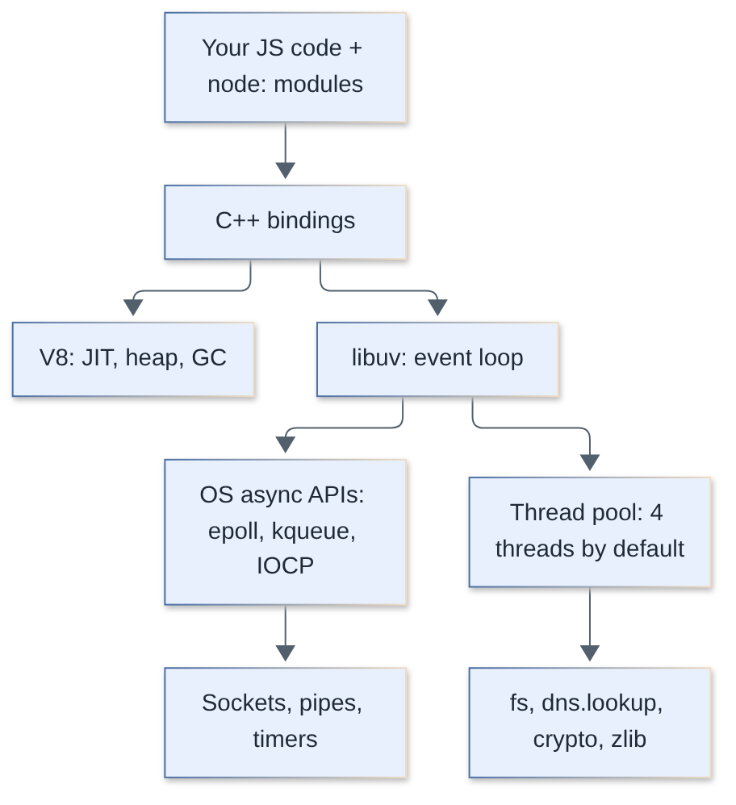
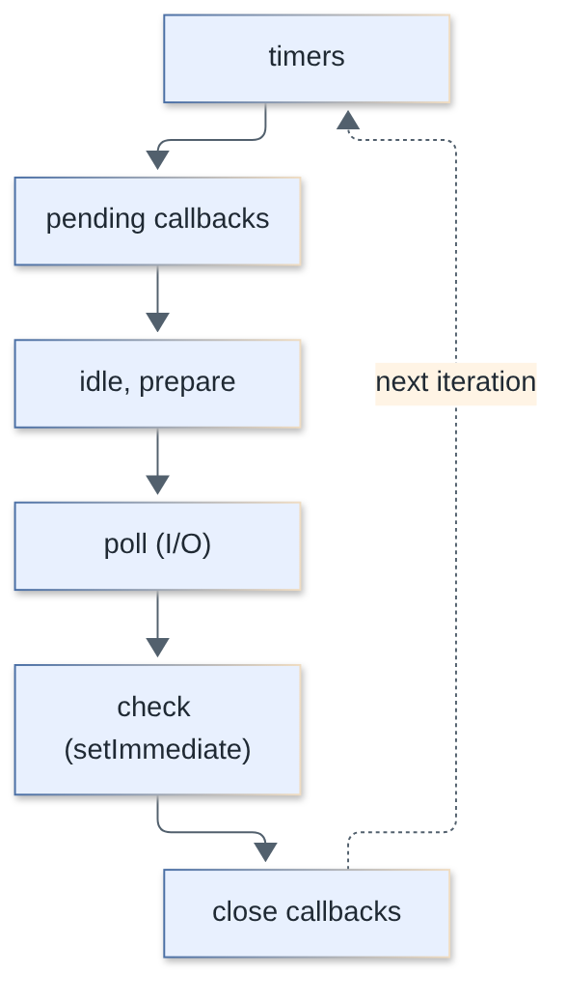
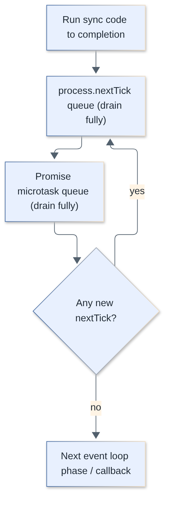
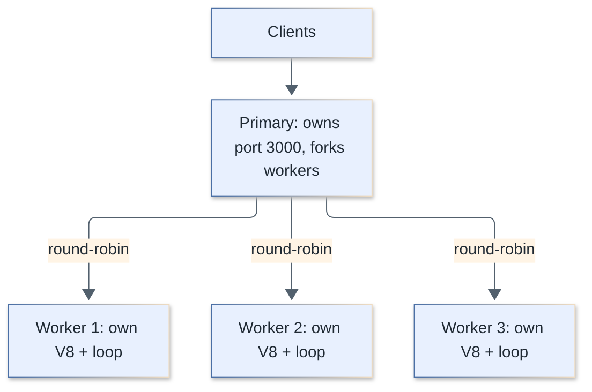
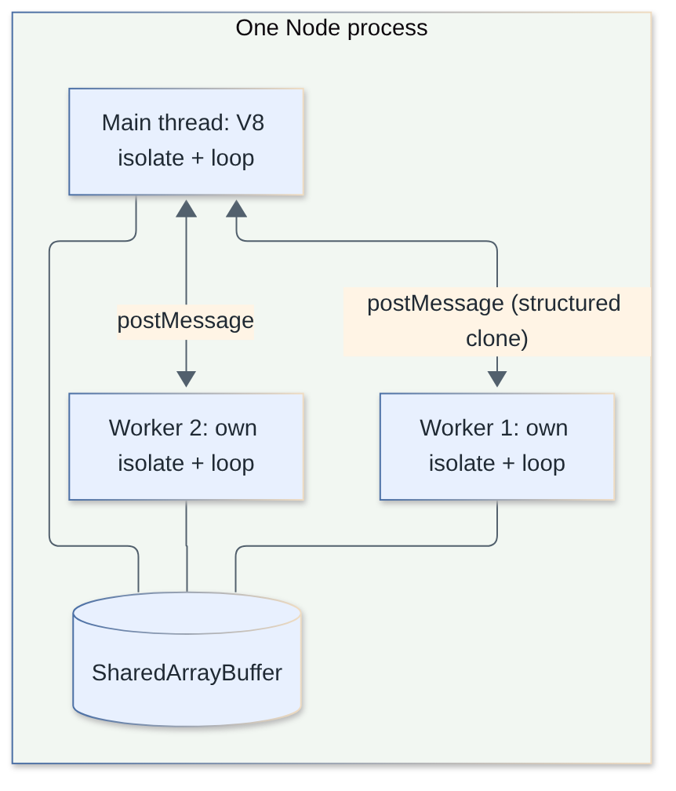
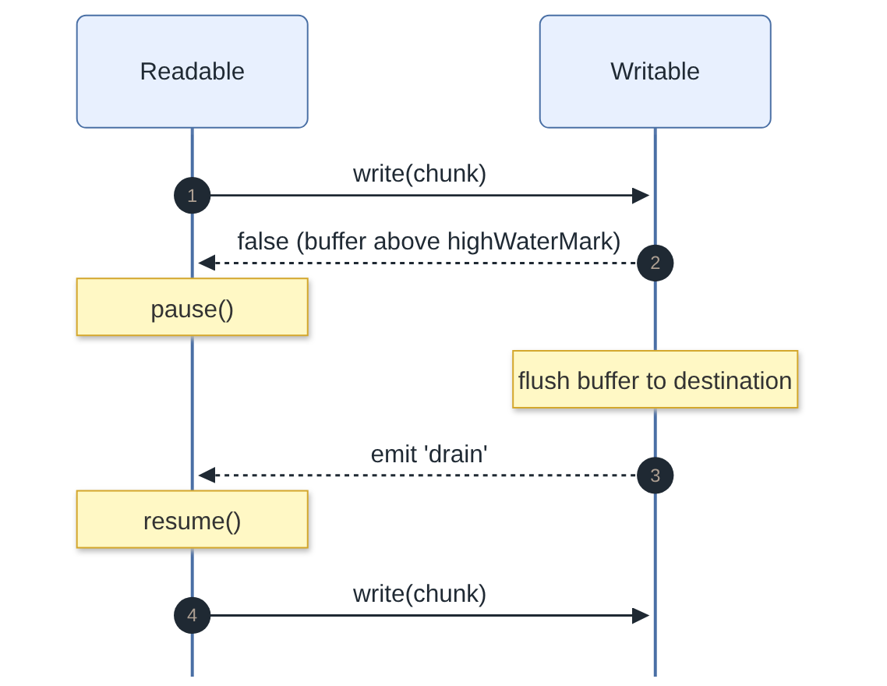
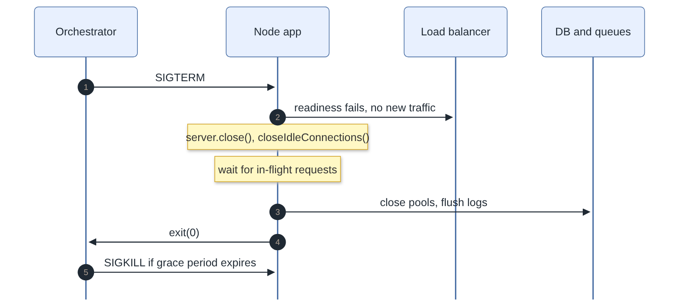

# Node.js Interview Questions

Questions and answers on Node.js internals, the event loop, concurrency, streams, tooling, security, frameworks and production operations. Version notes are accurate as of October 2026 (Node 24 is Active LTS until 2026-10-20 when it enters Maintenance, Node 26 becomes LTS on 2026-10-28, Node 22 is Maintenance LTS until 2027-04-30).

**Levels:** `🟢 Junior` · `🟡 Middle` · `🔴 Senior`

## Table of contents

**Architecture and runtime**

1. [What is Node.js and how is it built?](#1-what-is-nodejs-and-how-is-it-built)
2. [Is Node.js single-threaded?](#2-is-nodejs-single-threaded)
3. [Which Node.js versions should you run today, and what do LTS/Current mean?](#3-which-nodejs-versions-should-you-run-today-and-what-do-ltscurrent-mean)

**Event loop and asynchronous execution**

4. [Explain the Node.js event loop and its phases. How does it differ from the browser's?](#4-explain-the-nodejs-event-loop-and-its-phases-how-does-it-differ-from-the-browsers)
5. [What is the difference between `process.nextTick`, microtasks, `setImmediate` and `setTimeout`?](#5-what-is-the-difference-between-processnexttick-microtasks-setimmediate-and-settimeout)
6. [Predict the output: sync code, `nextTick`, promises, timers and immediates](#6-predict-the-output-sync-code-nexttick-promises-timers-and-immediates)
7. [Predict the output: nested `nextTick`/promises and I/O callbacks](#7-predict-the-output-nested-nexttickpromises-and-io-callbacks)
8. [What is the libuv thread pool and which operations use it?](#8-what-is-the-libuv-thread-pool-and-which-operations-use-it)
9. [What does it mean to block the event loop, and how do you detect and fix it?](#9-what-does-it-mean-to-block-the-event-loop-and-how-do-you-detect-and-fix-it)

**Concurrency and scaling model**

10. [`worker_threads` vs `child_process` vs `cluster`: when do you use each?](#10-worker_threads-vs-child_process-vs-cluster-when-do-you-use-each)
11. [How does the `cluster` module work, and how do you scale Node.js in production (PM2, containers, horizontal)?](#11-how-does-the-cluster-module-work-and-how-do-you-scale-nodejs-in-production-pm2-containers-horizontal)
12. [How do worker threads share data and what are the pitfalls?](#12-how-do-worker-threads-share-data-and-what-are-the-pitfalls)

**Streams and Buffers**

13. [What are the four types of streams in Node.js and why use them?](#13-what-are-the-four-types-of-streams-in-nodejs-and-why-use-them)
14. [What is backpressure in streams and how does Node handle it?](#14-what-is-backpressure-in-streams-and-how-does-node-handle-it)
15. [`pipe()` vs `stream.pipeline()`: which should you use and why?](#15-pipe-vs-streampipeline-which-should-you-use-and-why)
16. [What is a Buffer and how is it different from a string?](#16-what-is-a-buffer-and-how-is-it-different-from-a-string)

**EventEmitter and error handling**

17. [How does `EventEmitter` work and what is special about the `'error'` event?](#17-how-does-eventemitter-work-and-what-is-special-about-the-error-event)
18. [What does "MaxListenersExceededWarning: possible EventEmitter memory leak" mean?](#18-what-does-maxlistenersexceededwarning-possible-eventemitter-memory-leak-mean)
19. [How do you handle errors in callbacks, promises and async/await?](#19-how-do-you-handle-errors-in-callbacks-promises-and-asyncawait)
20. [What is the difference between operational errors and programmer errors?](#20-what-is-the-difference-between-operational-errors-and-programmer-errors)
21. [How do `uncaughtException` and `unhandledRejection` work, and what should you do in them?](#21-how-do-uncaughtexception-and-unhandledrejection-work-and-what-should-you-do-in-them)

**Modules and package management**

22. [CommonJS vs ES modules in Node.js: what are the differences?](#22-commonjs-vs-es-modules-in-nodejs-what-are-the-differences)
23. [How do CommonJS and ESM interoperate, and what is `require(esm)`?](#23-how-do-commonjs-and-esm-interoperate-and-what-is-requireesm)
24. [What do the `exports`, `main`, `type` and `imports` fields in `package.json` do?](#24-what-do-the-exports-main-type-and-imports-fields-in-packagejson-do)
25. [npm vs pnpm vs Yarn, and why do lockfiles matter?](#25-npm-vs-pnpm-vs-yarn-and-why-do-lockfiles-matter)
26. [How does semantic versioning work, and what do `^` and `~` mean?](#26-how-does-semantic-versioning-work-and-what-do--and--mean)

**Debugging and performance**

27. [How do you find and fix memory leaks in a Node.js service? (heap snapshots)](#27-how-do-you-find-and-fix-memory-leaks-in-a-nodejs-service-heap-snapshots)
28. [How do you profile a Node.js application (`--inspect`, `--cpu-prof`, clinic)?](#28-how-do-you-profile-a-nodejs-application---inspect---cpu-prof-clinic)

**Modern built-in platform APIs**

29. [How does `AbortController` work in Node.js and where is it used?](#29-how-does-abortcontroller-work-in-nodejs-and-where-is-it-used)
30. [What is `AsyncLocalStorage` and when would you use it?](#30-what-is-asynclocalstorage-and-when-would-you-use-it)
31. [How does Node's built-in test runner work, and when would you pick it over Jest or Vitest?](#31-how-does-nodes-built-in-test-runner-work-and-when-would-you-pick-it-over-jest-or-vitest)
32. [What is the built-in `fetch` in Node.js and how does it differ from the browser's?](#32-what-is-the-built-in-fetch-in-nodejs-and-how-does-it-differ-from-the-browsers)
33. [How do you implement graceful shutdown for a Node.js server?](#33-how-do-you-implement-graceful-shutdown-for-a-nodejs-server)
34. [What is the Node.js permission model?](#34-what-is-the-nodejs-permission-model)
35. [Can Node.js run TypeScript directly? What is type stripping?](#35-can-nodejs-run-typescript-directly-what-is-type-stripping)
36. [How should you handle configuration and environment variables in Node.js?](#36-how-should-you-handle-configuration-and-environment-variables-in-nodejs)

**Security**

37. [What is prototype pollution and how do you prevent it in Node.js?](#37-what-is-prototype-pollution-and-how-do-you-prevent-it-in-nodejs)
38. [What is ReDoS and how do you defend against it?](#38-what-is-redos-and-how-do-you-defend-against-it)
39. [What are the main dependency risks in the npm ecosystem and how do you mitigate them?](#39-what-are-the-main-dependency-risks-in-the-npm-ecosystem-and-how-do-you-mitigate-them)
40. [What are the essential security practices for a Node.js web API?](#40-what-are-the-essential-security-practices-for-a-nodejs-web-api)

**Web frameworks, HTTP and deployment**

41. [How does the Express middleware model work?](#41-how-does-the-express-middleware-model-work)
42. [Express vs Fastify vs NestJS: how do you choose?](#42-express-vs-fastify-vs-nestjs-how-do-you-choose)
43. [Why is Fastify faster and how do schemas, hooks and plugins work?](#43-why-is-fastify-faster-and-how-do-schemas-hooks-and-plugins-work)
44. [How do you build a minimal HTTP server with only Node core?](#44-how-do-you-build-a-minimal-http-server-with-only-node-core)
45. [How do you run Node.js correctly in Docker and Kubernetes?](#45-how-do-you-run-nodejs-correctly-in-docker-and-kubernetes)
46. [How do you convert callbacks to promises, and what are the promise-based core APIs?](#46-how-do-you-convert-callbacks-to-promises-and-what-are-the-promise-based-core-apis)

## Architecture and runtime

### 1. What is Node.js and how is it built?

`🟢 Junior` · `#runtime` `#v8` `#libuv`

Node.js is a JavaScript runtime built on Google's V8 engine and the libuv C library. V8 compiles and runs your JavaScript; libuv provides the event loop, asynchronous I/O and a thread pool; a C++ binding layer plus the `node:` core modules glue them together and expose APIs such as `fs`, `http` and `crypto`.

| Component | Role |
| --- | --- |
| V8 | Parses and JIT-compiles JS, manages the heap and garbage collection |
| libuv | Event loop, sockets, timers, file system, DNS, thread pool, cross-platform over epoll/kqueue/IOCP |
| C++ bindings | Expose libuv/OpenSSL/zlib/etc. to JS |
| Core modules (`node:fs`, `node:http`, ...) | JS API surface on top of the bindings |
| Others | OpenSSL (crypto/TLS), llhttp (HTTP parser), c-ares (DNS resolve), zlib, ICU, nghttp2 |

```js
// What you can see from JS
console.log(process.version);   // Node version
console.log(process.versions.v8);   // embedded V8
console.log(process.versions.uv);   // libuv
```



> **Follow-up:** Is Node the same as the browser's JS environment? No. Same language and engine family, but no DOM/`window`, and Node adds `fs`, `net`, `process`, `Buffer`, etc.

[↑ Back to top](#table-of-contents)

### 2. Is Node.js single-threaded?

`🟢 Junior` · `#runtime` `#concurrency`

Your JavaScript runs on a single main thread, but the Node process is not single-threaded: libuv's thread pool, V8's GC/compiler helper threads, and optional `worker_threads` all run in parallel. Node achieves concurrency (not CPU parallelism) for I/O by delegating work to the OS or to the thread pool and running callbacks on the main thread when it completes.

- One call stack, one event loop per thread: two JS callbacks never run at the same instant on the same thread, so no data races on plain JS variables.
- Consequence: a CPU-heavy synchronous function blocks every request (see question 9).
- True parallel JS needs `worker_threads`, `child_process` or `cluster` (question 10).

```js
const { threadId, isMainThread } = require('node:worker_threads');
console.log(isMainThread, threadId); // true 0
```

> **Follow-up:** How do 10 000 concurrent connections work then? The OS notifies libuv about readiness (epoll/kqueue); the loop runs small callbacks, never waiting on a socket.

[↑ Back to top](#table-of-contents)

### 3. Which Node.js versions should you run today, and what do LTS/Current mean?

`🟢 Junior` · `#releases` `#lts`

Run an even-numbered Active or Maintenance LTS release in production. Node releases a new major every six months (April and October); even majors become LTS in October and get about 30 months of support, odd majors are short-lived "Current" releases.

| Release | Status (as of 2026-10-08) |
| --- | --- |
| 20 | End-of-life (2026-04-30) |
| 22 "Jod" | Maintenance LTS, EOL 2027-04-30 |
| 24 "Krypton" | Active LTS until 2026-10-20, then Maintenance, EOL 2028-04-30 |
| 26 | Current, enters LTS 2026-10-28, EOL 2029-04-30 |
| 25 | End-of-life (2026-06-01) |

- Pin the version (`.nvmrc`, `engines` in `package.json`, Docker tag like `node:24-slim`) so dev, CI and prod match.
- Check the [official schedule](https://github.com/nodejs/Release) rather than memorising dates; they are the one thing that changes.

> **Follow-up:** Why not run odd versions in prod? They never get LTS and reach EOL after about 6 months.

[↑ Back to top](#table-of-contents)

## Event loop and asynchronous execution

### 4. Explain the Node.js event loop and its phases. How does it differ from the browser's?

`🟡 Middle` · `#event-loop` `#libuv`

The event loop is a libuv loop that repeatedly walks through fixed phases, running the callbacks queued for each phase, and sleeps in the poll phase when there is nothing to do. Node's loop has six phases; the browser's loop (defined by the HTML spec) has no such phases, just task queues, a microtask queue and a rendering step.



| Phase | What runs |
| --- | --- |
| timers | Expired `setTimeout` / `setInterval` callbacks |
| pending callbacks | Deferred system-level callbacks (e.g. some TCP errors) |
| idle, prepare | Internal only |
| poll | Retrieves new I/O events and runs their callbacks; blocks here waiting if nothing else is scheduled |
| check | `setImmediate` callbacks |
| close callbacks | `socket.on('close')`, `handle.close()` callbacks |

Between every individual callback (since Node 11) Node drains the `process.nextTick` queue, then the promise microtask queue.

| | Node.js | Browser |
| --- | --- | --- |
| Structure | 6 libuv phases | Task queues (per source), microtasks, render steps |
| Microtasks | After each callback; `nextTick` queue has priority over promises | After each task |
| `setImmediate`, `process.nextTick` | Yes | No (non-standard / absent) |
| Rendering / `requestAnimationFrame` | None | Part of the loop |
| Timers | `setTimeout` is clamped to >= 1 ms | Also clamped (>= 4 ms when nested 5+ deep, throttled in background tabs) |

```js
// A timer is a minimum delay, not a guarantee
const start = Date.now();
setTimeout(() => console.log('fired after', Date.now() - start, 'ms'), 10);
const t = Date.now(); while (Date.now() - t < 100); // blocks: timer fires ~100 ms late
```

> **Follow-up:** When does the loop exit? When there are no active handles/requests/timers left (`unref()`'d ones do not count).

[↑ Back to top](#table-of-contents)

### 5. What is the difference between `process.nextTick`, microtasks, `setImmediate` and `setTimeout`?

`🟡 Middle` · `#event-loop` `#microtasks`

`process.nextTick` runs right after the current operation, before promise microtasks and before the loop continues; promise callbacks / `queueMicrotask` run next; `setTimeout(fn, 0)` runs in the timers phase; `setImmediate` runs in the check phase, right after poll.

| API | Queue / phase | Priority |
| --- | --- | --- |
| `process.nextTick(fn)` | nextTick queue, drained after the current callback | 1st |
| `Promise.then`, `await`, `queueMicrotask(fn)` | Microtask queue (V8) | 2nd |
| `setTimeout(fn, 0)` | Timers phase | Next loop iteration |
| `setImmediate(fn)` | Check phase | After poll in the current iteration |



- Both nextTick and microtask queues are drained fully; a recursive `nextTick` can starve I/O forever (the loop never advances). Recursive `setImmediate` does not, because each iteration of the loop lets I/O through.
- From the main module `setTimeout(0)` vs `setImmediate` order is not deterministic (depends on process performance / whether 1 ms elapsed before the loop starts). Inside an I/O callback `setImmediate` always wins.
- Prefer `queueMicrotask` / promises for "run after current sync code"; `nextTick` is for Node internals, e.g. emitting events after a constructor returns so listeners can be attached.

```js
class Client extends require('node:events') {
  constructor() {
    super();
    process.nextTick(() => this.emit('ready')); // listeners attached after `new` still fire
  }
}
new Client().on('ready', () => console.log('ready'));
```

> **Follow-up:** Why is `nextTick` "dangerous"? It outranks I/O and promises, so a recursive nextTick starves the event loop. Docs recommend `setImmediate` or `queueMicrotask` in most cases.

[↑ Back to top](#table-of-contents)

### 6. Predict the output: sync code, `nextTick`, promises, timers and immediates

`🟡 Middle` · `#event-loop` `#output-prediction`

Synchronous logs first, then `nextTick`, then promise microtasks (`then` and `queueMicrotask` in registration order), and finally the macrotasks `setTimeout` / `setImmediate` (whose relative order is undetermined from the main module).

```js
console.log('1 sync');
setTimeout(() => console.log('2 timeout'), 0);
setImmediate(() => console.log('3 immediate'));
process.nextTick(() => console.log('4 nextTick'));
Promise.resolve().then(() => console.log('5 promise'));
queueMicrotask(() => console.log('6 queueMicrotask'));
console.log('7 sync end');
```

Output (verified on Node 23; run it a few times):

```text
1 sync
7 sync end
4 nextTick
5 promise
6 queueMicrotask
3 immediate     <- these two can swap between runs
2 timeout
```

Second example: `async/await` ordering. Code before the first `await` runs synchronously; the continuation is a microtask.

```js
async function a() { console.log('a start'); await b(); console.log('a end'); }
async function b() { console.log('b'); }
console.log('script start');
setTimeout(() => console.log('timeout'), 0);
a();
new Promise(r => { console.log('executor'); r(); }).then(() => console.log('then'));
console.log('script end');
```

```text
script start
a start
b
executor
script end
a end
then
timeout
```

Note: in an ES module (`.mjs`), the whole file is itself evaluated inside a promise job, so promise callbacks run before `nextTick`:

```js
// e.mjs
Promise.resolve().then(() => console.log('promise'));
process.nextTick(() => console.log('nextTick'));
// prints: promise, nextTick   (in CommonJS it is: nextTick, promise)
```

> **Follow-up:** Why does `a end` come before `then`? `a()` awaits an already-resolved promise first, so its continuation was queued as a microtask before the `.then` callback was registered.

[↑ Back to top](#table-of-contents)

### 7. Predict the output: nested `nextTick`/promises and I/O callbacks

`🔴 Senior` · `#event-loop` `#output-prediction`

Inside an I/O callback the next phase is check, so `setImmediate` always runs before `setTimeout(0)`; and the two microtask queues are drained alternately until both are empty, with `nextTick` always checked first.

```js
const fs = require('node:fs');
fs.readFile(__filename, () => {
  setTimeout(() => console.log('timeout'), 0);
  setImmediate(() => {
    console.log('immediate 1');
    process.nextTick(() => console.log('tick in immediate 1'));
  });
  setImmediate(() => console.log('immediate 2'));
});
```

```text
immediate 1
tick in immediate 1   <- queues drain between callbacks (Node >= 11)
immediate 2
timeout
```

Nested queues:

```js
Promise.resolve().then(() => {
  console.log('promise 1');
  process.nextTick(() => console.log('nextTick inside promise'));
}).then(() => console.log('promise 2'));

process.nextTick(() => {
  console.log('nextTick 1');
  Promise.resolve().then(() => console.log('promise inside nextTick'));
});
process.nextTick(() => console.log('nextTick 2'));
```

```text
nextTick 1
nextTick 2
promise 1
promise inside nextTick
promise 2
nextTick inside promise
```

Why: the nextTick queue is drained first (1, 2). Then the microtask queue drains completely, including microtasks added while draining (`promise 1`, `promise inside nextTick`, `promise 2`). A `nextTick` scheduled from inside a microtask only runs once the microtask queue is empty.

> **Follow-up:** How did this differ in Node < 11? `setImmediate`/timer callbacks ran as a batch and the microtask queues were drained only between phases, not between each callback.

[↑ Back to top](#table-of-contents)

### 8. What is the libuv thread pool and which operations use it?

`🟡 Middle` · `#libuv` `#performance`

libuv keeps a pool of 4 worker threads (configurable with `UV_THREADPOOL_SIZE`, max 1024) for operations that have no non-blocking OS API. The JS thread submits the job, a pool thread runs it, and the callback is queued back to the event loop.

| Uses the thread pool | Does not (non-blocking OS I/O or in-loop) |
| --- | --- |
| Most `fs` operations (`readFile`, `stat`, `writeFile`...) | TCP/UDP/HTTP/TLS sockets, pipes (epoll/kqueue/IOCP) |
| `dns.lookup` (`getaddrinfo`), used by `http`/`net` by default | `dns.resolve*` (c-ares, own sockets) |
| `crypto`: `pbkdf2`, `scrypt`, `randomBytes`, `randomFill`, `generateKeyPair` | Timers |
| `zlib` async compression | Child process pipes, signals |
| Native addons using `uv_queue_work` | `worker_threads` (own threads, not the pool) |

```js
const crypto = require('node:crypto');
const t = Date.now();
for (let i = 1; i <= 6; i++)
  crypto.pbkdf2('pw', 'salt', 300000, 64, 'sha512', () =>
    console.log(i, Date.now() - t, 'ms'));
// With 4 threads: four finish together, the last two ~2x later.
// UV_THREADPOOL_SIZE=8 node f.js -> all six finish in one wave (given enough cores)
```

Observed on a 16-core machine: calls 1-4 finished at ~110-133 ms, calls 5-6 at ~225 ms; with `UV_THREADPOOL_SIZE=8` all six finished at ~125-160 ms (timings vary).

- A saturated pool slows every `fs` call and `dns.lookup` too, a classic "random latency" cause.
- `UV_THREADPOOL_SIZE` must be set before the pool is first used (env var at startup; setting `process.env` late is unreliable).
- Do not set it far above the CPU count for CPU-bound crypto; it helps mostly for slow blocking I/O (network file systems, `dns.lookup`).

> **Follow-up:** Why can `dns.lookup` stall HTTP clients? It uses `getaddrinfo` on the pool; a slow resolver can consume all 4 threads. Mitigate with a bigger pool or a DNS cache/`dns.resolve`.

[↑ Back to top](#table-of-contents)

### 9. What does it mean to block the event loop, and how do you detect and fix it?

`🟡 Middle` · `#performance` `#event-loop`

Blocking means running long synchronous work on the main thread (big loops, `JSON.parse` of huge payloads, sync fs, catastrophic regex, `crypto.pbkdf2Sync`), during which no other request, timer or I/O callback can run. Detect it by measuring event loop delay; fix it by making work async, chunking it, or moving it to workers.

Detection:

```js
const { monitorEventLoopDelay } = require('node:perf_hooks');
const h = monitorEventLoopDelay({ resolution: 10 });
h.enable();
setInterval(() => {
  console.log('p99 delay ms', h.percentile(99) / 1e6, 'max', h.max / 1e6);
  h.reset();
}, 5000).unref();
```

- Export event loop lag (p99) as a metric (`prom-client` does by default) and alert on it.
- `node --cpu-prof` or Chrome DevTools / `clinic doctor` / `clinic flame` show which function holds the thread (flat wide bars in a flame graph).
- `--trace-sync-io` prints a stack trace whenever sync I/O is used after the first loop tick.
- Symptoms: p99 latency spikes across all routes, health checks time out while CPU is at 100% on one core.

Fixes:

| Cause | Fix |
| --- | --- |
| CPU-heavy computation | `worker_threads` pool (e.g. Piscina), separate service |
| Large JSON / big arrays | Stream-parse, paginate, process in chunks |
| `*Sync` APIs in request path | Use async/promises versions |
| Long loop | Yield between chunks with `setImmediate` (not `nextTick`) |
| Bad regex | Rewrite regex, input length limits, `re2` (question 38) |

```js
// Chunking a long loop so I/O can interleave
async function processAll(items) {
  for (let i = 0; i < items.length; i++) {
    handle(items[i]);
    if (i % 1000 === 0) await new Promise(setImmediate); // let the loop breathe
  }
}
```

> **Follow-up:** Is `await` in a loop enough to avoid blocking? No: `await` of an already-resolved value only yields to microtasks, which run before I/O. Yield via `setImmediate` for real fairness.

[↑ Back to top](#table-of-contents)

## Concurrency and scaling model

### 10. `worker_threads` vs `child_process` vs `cluster`: when do you use each?

`🟡 Middle` · `#concurrency` `#scaling`

Use `worker_threads` to parallelise CPU-bound work inside one process, `cluster` to run several copies of an HTTP server on one machine sharing a port, and `child_process` to run other programs or isolated processes (including other Node scripts).

| | `worker_threads` | `cluster` | `child_process` |
| --- | --- | --- | --- |
| Unit | Thread (own V8 isolate + event loop) | Process (forked Node) | Any OS process |
| Memory | Separate heaps; can share `SharedArrayBuffer` | Fully separate | Fully separate |
| Communication | `postMessage`, transferables, `Atomics` | IPC (`process.send`) | stdio pipes, IPC with `fork` |
| Startup / memory cost | Lower (tens of ms, MBs) | Higher (a full process) | Highest |
| Crash isolation | A fatal error can end the worker; native crash can kill process | One worker dies, others live | Full isolation |
| Typical use | Image resizing, hashing, parsing, ML inference | Use all cores for an HTTP server | Run `ffmpeg`, git, untrusted jobs, shell tools |

```js
// worker_threads: offload CPU work
const { Worker, isMainThread, parentPort, workerData } = require('node:worker_threads');
if (isMainThread) {
  const w = new Worker(__filename, { workerData: { n: 1e6 } });
  w.on('message', sum => console.log('sum', sum));
  w.on('error', console.error);
} else {
  let s = 0;
  for (let i = 0; i < workerData.n; i++) s += i;
  parentPort.postMessage(s);
}
```

```js
// child_process: prefer execFile/spawn (no shell) with an args array
const { execFile } = require('node:child_process');
execFile('git', ['rev-parse', 'HEAD'], (err, stdout) => console.log(stdout.trim()));
// exec() runs through a shell and buffers output (maxBuffer): injection risk with user input
```

- Workers are for CPU, not I/O: Node's async I/O already scales without them.
- Create a pool (Piscina) rather than one worker per task; spawning has a cost.
- In containers, many teams run one process per container and scale with replicas instead of `cluster` (question 11).

> **Follow-up:** `spawn` vs `exec` vs `execFile` vs `fork`? `spawn` streams stdio, no shell; `exec` shell + buffered output; `execFile` no shell + buffered; `fork` spawns a Node script with an IPC channel.

[↑ Back to top](#table-of-contents)

### 11. How does the `cluster` module work, and how do you scale Node.js in production (PM2, containers, horizontal)?

`🔴 Senior` · `#cluster` `#scaling` `#production`

`cluster` forks N worker processes from a primary; the primary owns the listening socket and distributes incoming connections (round-robin by default on Linux/macOS) to workers over IPC, so one app uses all cores. In production you generally scale at two levels: processes per host (cluster/PM2, or one container per core) and hosts behind a load balancer.



```js
const cluster = require('node:cluster');
const http = require('node:http');
const os = require('node:os');

if (cluster.isPrimary) {
  for (let i = 0; i < os.availableParallelism(); i++) cluster.fork();
  cluster.on('exit', (worker, code) => {
    console.log(`worker ${worker.process.pid} exited (${code}), restarting`);
    cluster.fork(); // add backoff / crash-loop limits in real code
  });
} else {
  http.createServer((req, res) => res.end(`pid ${process.pid}\n`)).listen(3000);
}
```

Options for scaling:

| Approach | Pros | Cons |
| --- | --- | --- |
| `cluster` / PM2 cluster mode (`pm2 start app.js -i max`) | Uses all cores, zero-downtime `pm2 reload`, process supervision | Extra layer; in-memory state not shared; PM2 duplicates what Kubernetes does |
| One process per container + orchestrator (Kubernetes, ECS) | Simple units, orchestrator restarts/scales, resource limits per pod | Needs CPU requests/limits sized for one core |
| Horizontal scaling behind a load balancer | Scales beyond one machine, redundancy | Requires stateless services |
| `worker_threads` pool inside a process | For CPU work only | Not for scaling connections |

Rules of thumb:

- Keep the app stateless: sessions in Redis, uploads in object storage, no in-process caches that must be consistent (or accept per-process caches).
- WebSockets/long-lived connections need sticky sessions at the LB or a shared pub/sub (Redis, NATS) for fan-out.
- Health/readiness endpoints, graceful shutdown (question 33), and autoscaling on event loop lag + CPU, not CPU alone.
- Node uses roughly 1 core per process for JS: request 1 vCPU per container and set `--max-old-space-size` below the memory limit.
- Use PM2 mainly on plain VMs; in Kubernetes avoid it (nested supervisors hide crashes from the orchestrator).

> **Follow-up:** Why can round-robin matter? Without it the OS may hand most connections to a few busy workers (Linux accept-thundering imbalance); `cluster.schedulingPolicy` controls it.

[↑ Back to top](#table-of-contents)

### 12. How do worker threads share data and what are the pitfalls?

`🔴 Senior` · `#worker-threads` `#concurrency`

Messages passed with `postMessage` are copied via structured clone (or transferred, for `ArrayBuffer`s and ports). For zero-copy sharing use `SharedArrayBuffer` with `Atomics` to synchronise. Each worker has its own heap, so large objects are copied unless transferred.



```js
const { Worker, isMainThread, workerData } = require('node:worker_threads');

if (isMainThread) {
  const sab = new SharedArrayBuffer(4);
  const counter = new Int32Array(sab);
  const workers = [1, 2].map(() => new Worker(__filename, { workerData: sab }));
  let done = 0;
  workers.forEach(w => w.on('exit', () => {
    if (++done === 2) console.log('counter =', Atomics.load(counter, 0)); // 2000
  }));
} else {
  const counter = new Int32Array(workerData);
  for (let i = 0; i < 1000; i++) Atomics.add(counter, 0, 1); // atomic, no lost updates
}
```

Pitfalls:

- Structured clone cannot copy functions, class instances keep no prototype methods, and big payloads are slow: transfer buffers (`postMessage(buf, [buf.buffer])`) so the sender loses access but no copy happens.
- Plain `counter[0]++` on shared memory is a race; use `Atomics`.
- A worker has its own module cache and globals; `process.env` is copied by default.
- Set `resourceLimits` (heap) and handle `'error'` and `'exit'`.
- Use a pool; thread creation costs tens of milliseconds and memory.

> **Follow-up:** Do workers use the libuv pool? Each worker has its own event loop, but still shares the process-wide libuv thread pool.

[↑ Back to top](#table-of-contents)

## Streams and Buffers

### 13. What are the four types of streams in Node.js and why use them?

`🟡 Middle` · `#streams`

Streams process data piece by piece instead of loading it all into memory. There are four kinds: Readable (source), Writable (sink), Duplex (both, independent sides, e.g. a TCP socket) and Transform (a Duplex whose output is computed from its input, e.g. gzip).

| Type | Example | Key methods/events |
| --- | --- | --- |
| Readable | `fs.createReadStream`, `http.IncomingMessage` | `read()`, `'data'`, `'end'`, `pipe()`, async iteration |
| Writable | `fs.createWriteStream`, `http.ServerResponse` | `write()`, `end()`, `'drain'`, `'finish'` |
| Duplex | `net.Socket` | both |
| Transform | `zlib.createGzip()`, `crypto.createCipheriv` | `_transform()` |

Why: constant memory regardless of file size, time to first byte, and composability.

```js
const fs = require('node:fs');
const http = require('node:http');

// BAD for big files: buffers the entire file in memory first
// http.createServer((req, res) => fs.readFile('big.iso', (e, d) => res.end(d)));

// GOOD: constant memory, handles backpressure
http.createServer((req, res) => {
  fs.createReadStream('big.iso').pipe(res);
}).listen(3000);
```

```js
// Readable streams are async iterables
for await (const chunk of fs.createReadStream('log.txt', { encoding: 'utf8' })) {
  process.stdout.write(chunk);
}
```

- Modes: flowing vs paused, binary vs `objectMode`. Default `highWaterMark` is 64 KiB for byte streams (non-Windows; 16 KiB on Windows) and 16 objects in object mode.
- Web Streams (`ReadableStream`, etc.) are also available globally; convert with `Readable.toWeb()` / `fromWeb()`.

> **Follow-up:** When not to stream? Small payloads where buffering is simpler and fast enough, or when you need the whole body (e.g. to verify a signature before parsing).

[↑ Back to top](#table-of-contents)

### 14. What is backpressure in streams and how does Node handle it?

`🟡 Middle` · `#streams` `#backpressure`

Backpressure is the signal a slow consumer sends to a fast producer to stop writing until it has caught up. `writable.write()` returns `false` when the internal buffer exceeds `highWaterMark`; the producer should stop, then resume on the `'drain'` event. `pipe()` and `pipeline()` do this automatically.



```js
const { Writable } = require('node:stream');
const w = new Writable({
  highWaterMark: 4,
  write(chunk, enc, cb) { setTimeout(cb, 1); }, // slow sink
});
console.log(w.write('abc'));   // true  (3 bytes buffered < 4)
console.log(w.write('de'));    // false (5 > 4): STOP writing
console.log(w.writableLength, w.writableNeedDrain); // 5 true
w.once('drain', () => console.log('drain: safe to write again'));
```

Manual handling (what `pipe` does for you):

```js
async function writeAll(writable, chunks) {
  const { once } = require('node:events');
  for (const c of chunks) {
    if (!writable.write(c)) await once(writable, 'drain'); // respect backpressure
  }
  writable.end();
}
```

- Ignoring `false` makes the buffer grow unbounded: memory blowup and eventually OOM (a frequent cause of "leaks" when reading a DB cursor and writing to a slow HTTP client).
- `highWaterMark` is a threshold, not a hard limit; `write()` still accepts data.
- Async iteration (`for await`) and `stream.Readable.from()` honour backpressure by design.

> **Follow-up:** Where does backpressure end up at the network level? The Writable (socket) stops draining, the kernel TCP window fills, and the remote sender is throttled by TCP flow control.

[↑ Back to top](#table-of-contents)

### 15. `pipe()` vs `stream.pipeline()`: which should you use and why?

`🔴 Senior` · `#streams` `#error-handling`

Use `pipeline()` (callback or `node:stream/promises`). `pipe()` does handle backpressure but does not forward errors or destroy the other streams, so a failure in one stage leaks file descriptors and leaves the rest open. `pipeline()` propagates errors, destroys all streams and signals completion.

```js
const { pipeline } = require('node:stream/promises');
const { Readable, Transform } = require('node:stream');
const zlib = require('node:zlib');
const fs = require('node:fs');

const upper = new Transform({
  transform(chunk, enc, cb) { cb(null, chunk.toString().toUpperCase()); },
});

// top-level await: ES module (or wrap in an async function)
try {
  await pipeline(
    Readable.from(['hello ', 'streams\n']),
    upper,
    zlib.createGzip(),
    fs.createWriteStream('/tmp/out.gz'),
    // { signal: abortController.signal } can cancel the whole chain
  );
  console.log(zlib.gunzipSync(fs.readFileSync('/tmp/out.gz')).toString()); // HELLO STREAMS
} catch (err) {
  console.error('pipeline failed, all streams destroyed', err);
}
```

| | `a.pipe(b)` | `pipeline(a, b, ...)` |
| --- | --- | --- |
| Backpressure | Yes | Yes |
| Error propagation | No (you need `.on('error')` on every stream) | Yes |
| Cleanup (destroy streams) | No | Yes |
| Completion signal | Manual (`'finish'`) | Promise/callback |
| Async generators as stages | No | Yes |
| `AbortSignal` | No | Yes |

```js
// async generator as a transform stage
await pipeline(
  fs.createReadStream('in.txt', 'utf8'),
  async function* (source) { for await (const c of source) yield c.toUpperCase(); },
  fs.createWriteStream('out.txt'),
);
```

> **Follow-up:** What happens to the HTTP response if the source file read fails mid-stream? With `pipeline(file, res)` the response is destroyed so the client sees an aborted transfer instead of a hung connection.

[↑ Back to top](#table-of-contents)

### 16. What is a Buffer and how is it different from a string?

`🟢 Junior` · `#buffer` `#binary`

A `Buffer` is a fixed-size chunk of raw bytes, a subclass of `Uint8Array`, with memory allocated outside the V8 heap. Use it for binary data (files, sockets, crypto); a string is text, and converting between them requires an encoding (UTF-8 by default).

```js
const b = Buffer.from('héllo', 'utf8');
console.log(b.length, 'héllo'.length); // 6 5   (é takes 2 bytes in UTF-8)
console.log(b);                        // <Buffer 68 c3 a9 6c 6c 6f>
console.log(b.toString('base64'));     // aMOpbGxv
console.log(b.toString('hex'));        // 68c3a96c6c6f

console.log(Buffer.alloc(3));                // <Buffer 00 00 00>   zero-filled, safe
console.log(Buffer.concat([Buffer.from('a'), Buffer.from('b')]).toString()); // ab

// subarray() shares memory, it does NOT copy
const big = Buffer.from('abc');
const view = big.subarray(0, 2);
view[0] = 0x7a;
console.log(big.toString()); // zbc
```

- `Buffer.alloc(n)` zero-fills; `Buffer.allocUnsafe(n)` may contain old memory and uses a pre-allocated pool for small sizes: faster but must be fully overwritten. `new Buffer()` is deprecated (security).
- Multi-byte characters can be split across chunks: `chunk.toString()` per chunk corrupts them. Use `stream.setEncoding('utf8')` or `StringDecoder`.

```js
const euro = Buffer.from('€');            // <Buffer e2 82 ac>
console.log(JSON.stringify(euro.subarray(0, 2).toString())); // "�" (broken)
```

- Compare secrets with `crypto.timingSafeEqual`, not `===`/`Buffer.compare`.
- Because the memory is off-heap, a Buffer-heavy leak shows in `rss`/`external` but not in `heapUsed` (question 27).

> **Follow-up:** Buffer vs `Uint8Array`/`TextEncoder` in new code? `Buffer` is Node-only; for portable code use `Uint8Array` + `TextEncoder`/`TextDecoder` (Buffer is still handy for base64/hex and Node APIs).

[↑ Back to top](#table-of-contents)

## EventEmitter and error handling

### 17. How does `EventEmitter` work and what is special about the `'error'` event?

`🟢 Junior` · `#events`

`EventEmitter` is Node's publish/subscribe primitive: `on(event, listener)` registers, `emit(event, ...args)` calls listeners synchronously in registration order. Special rule: emitting `'error'` with no listener throws the error (crashing the process if uncaught).

```js
const { EventEmitter } = require('node:events');
const e = new EventEmitter();

e.on('x', v => console.log('first', v));
e.once('x', v => console.log('once', v));   // auto-removed after first call
e.emit('x', 1);  // first 1, once 1
e.emit('x', 2);  // first 2

e.on('error', err => console.log('handled', err.message));
e.emit('error', new Error('boom'));         // handled boom

const e2 = new EventEmitter();
try { e2.emit('error', new Error('no listener')); }
catch (err) { console.log('thrown:', err.message); }  // thrown: no listener
```

- Listeners are **synchronous**: `emit` returns after all handlers ran. An exception in a listener propagates to the `emit()` caller.
- `off`/`removeListener`, `prependListener`, `listenerCount`, `events.once(emitter, 'x')` (promise), `events.on(emitter, 'x')` (async iterator).
- Many core classes (streams, `http.Server`, `net.Socket`, `child_process`) are emitters, always attach `'error'` handlers on them.
- `EventTarget` (web-style) also exists in Node; `AbortSignal` is one.

```js
const { once } = require('node:events');
const ee = new EventEmitter();
setTimeout(() => ee.emit('ready', 42), 10);
const [value] = await once(ee, 'ready'); // 42
```

> **Follow-up:** Are listeners async? No. To make them non-blocking, defer inside the listener (`setImmediate`, `queueMicrotask`) or use async functions (but their rejections will not be caught by `emit`).

[↑ Back to top](#table-of-contents)

### 18. What does "MaxListenersExceededWarning: possible EventEmitter memory leak" mean?

`🟡 Middle` · `#events` `#memory`

More than 10 listeners (the default) were added for the same event on one emitter, which usually means listeners are being added repeatedly without being removed, a real leak. Node only warns; it does not block. Fix the cause (remove listeners, use `once`, use an `AbortSignal`) before raising the limit with `setMaxListeners`.

```js
const { EventEmitter } = require('node:events');
const e = new EventEmitter();
for (let i = 0; i < 11; i++) e.on('x', () => {});
// (node) MaxListenersExceededWarning: Possible EventEmitter memory leak detected.
// 11 x listeners added to [EventEmitter]. MaxListeners is 10.
```

Typical causes and fixes:

```js
// BAD: adds a new listener on every request, on a long-lived emitter
app.get('/stream', (req, res) => {
  bus.on('update', d => res.write(d));            // never removed -> leak + writes to closed responses
});

// GOOD: remove on close
app.get('/stream', (req, res) => {
  const onUpdate = d => res.write(d);
  bus.on('update', onUpdate);
  req.on('close', () => bus.off('update', onUpdate));
});

// GOOD: for EventTarget (and AbortSignal) the { signal } option auto-removes the listener
target.addEventListener('update', onUpdate, { signal: ac.signal }); // removed on ac.abort()
```

- Each retained listener keeps its closure (and everything captured) alive: the emitter holds a strong reference to it.
- Run with `node --trace-warnings` to see where the extra listener was added.
- `emitter.setMaxListeners(n)` is legitimate for emitters that really have many consumers (e.g. a shared `AbortSignal` passed to 100 fetches).
- Find the leak with heap snapshots: look for retained closures and an emitter's `_events`.

> **Follow-up:** Why is the default 10? A heuristic that catches accidental accumulation early; it is per event name per emitter, set globally by `events.defaultMaxListeners`.

[↑ Back to top](#table-of-contents)

### 19. How do you handle errors in callbacks, promises and async/await?

`🟢 Junior` · `#errors` `#async`

Callbacks use the error-first convention (`cb(err, result)`); promises use `.catch()`; async functions use `try/catch` around `await`. Never throw inside an async callback expecting an outer `try/catch` to catch it: it will not.

```js
const fs = require('node:fs');
const fsp = require('node:fs/promises');

// 1. error-first callback
fs.readFile('missing.txt', (err, data) => {
  if (err) return console.error(err.code);  // ENOENT
  console.log(data);
});

// 2. promises
fsp.readFile('missing.txt').then(console.log).catch(e => console.error(e.code));

// 3. async/await
async function load() {
  try {
    return await fsp.readFile('missing.txt', 'utf8');
  } catch (e) {
    if (e.code === 'ENOENT') return '';   // handle what you expect...
    throw e;                              // ...rethrow what you don't
  }
}

// 4. a throw inside an async callback is NOT caught here
try { setTimeout(() => { throw new Error('lost'); }, 0); } catch {} // crashes the process
```

- `return promise` vs `return await promise`: inside `try`, you need `await` for the catch to work.
- Parallel work: `Promise.all` rejects on first failure (others keep running); `Promise.allSettled` collects all outcomes.
- Wrap callback APIs with `util.promisify` or use `node:fs/promises`, `node:timers/promises`.
- Use `Error` objects with `cause`: `throw new Error('save failed', { cause: err })`.
- Express 4 does not catch rejected promises from async handlers; Express 5 does (question 41).

> **Follow-up:** What happens with an `async` function that is called without `await`/`catch` and rejects? An unhandled rejection: by default the process crashes (question 21).

[↑ Back to top](#table-of-contents)

### 20. What is the difference between operational errors and programmer errors?

`🟡 Middle` · `#errors` `#reliability`

Operational errors are expected run-time failures in a correct program (DB down, timeout, ENOENT, invalid user input) and should be handled. Programmer errors are bugs (TypeError, calling with wrong args, undefined access) and cannot be reliably handled: log, then crash and let a supervisor restart.

| | Operational | Programmer |
| --- | --- | --- |
| Examples | `ECONNREFUSED`, `ETIMEDOUT`, 404 from upstream, validation failure | `undefined is not a function`, bad argument, off-by-one |
| Cause | Environment / input | Code defect |
| Response | Retry, fallback, return 4xx/5xx, report | Fix the code; crash and restart |
| Recoverable? | Yes | State may be corrupt, so no |

```js
class AppError extends Error {
  constructor(message, { status = 500, code = 'INTERNAL', operational = true, cause } = {}) {
    super(message, { cause });
    this.name = 'AppError';
    this.status = status;
    this.code = code;
    this.isOperational = operational;
  }
}

// central handler
function handle(err, res) {
  if (err.isOperational) return res.status(err.status).json({ code: err.code });
  console.error('BUG', err);          // programmer error: report...
  res.status(500).json({ code: 'INTERNAL' });
  process.exitCode = 1;               // ...and shut down gracefully (question 33)
  server.close();
}
```

- Fail fast: continuing after a programmer error risks data corruption or leaking resources.
- Validate at the boundary (zod, Ajv) so bad input becomes an operational 4xx, not a TypeError deep inside.
- Distinguish by type/`code`, not by message string.

> **Follow-up:** Is a failed DB query operational? The failure (connection lost) is; a malformed SQL string built by your code is a programmer error.

[↑ Back to top](#table-of-contents)

### 21. How do `uncaughtException` and `unhandledRejection` work, and what should you do in them?

`🔴 Senior` · `#errors` `#process`

Both are last-resort process events. Since Node 15, an unhandled promise rejection is treated like an uncaught exception (the process exits with code 1 by default). Use the handlers only to log, flush telemetry and shut down, not to resume normal operation.

```js
process.on('exit', code => console.log('exit code', code));
Promise.reject(new Error('nobody catches me'));
setTimeout(() => console.log('never printed'), 100);
// stderr: the stack trace; prints "exit code 1"; the timer never fires
```

```js
process.on('unhandledRejection', (reason, promise) => {
  // by default mode is 'throw': if you register a handler, it replaces the crash
  logger.error({ err: reason }, 'unhandledRejection');
  throw reason;           // convert to an uncaughtException so one place handles it
});

process.on('uncaughtException', (err, origin) => {  // origin: 'uncaughtException' | 'unhandledRejection'
  logger.fatal({ err, origin }, 'uncaughtException');
  // 1. stop accepting work, 2. flush logs, 3. exit non-zero
  server.close(() => process.exit(1));
  setTimeout(() => process.exit(1), 5000).unref();   // hard deadline
});
```

| Mechanism | Purpose |
| --- | --- |
| `uncaughtException` | A synchronous throw escaped to the loop. State is unknown, so exit |
| `unhandledRejection` | Promise rejected with no handler by the end of the microtask drain |
| `rejectionHandled` | A previously unhandled rejection later got a handler |
| `--unhandled-rejections=` | `throw` (default), `strict`, `warn`, `none`, `warn-with-error-code` |
| `uncaughtExceptionMonitor` | Observe without changing behaviour (good for reporting to Sentry) |

- Do not "swallow and continue": the app can be in an inconsistent state (half-written data, leaked locks).
- Always have a supervisor (Kubernetes, systemd, PM2) to restart the process.
- Error reporters (Sentry) hook these events; make sure they flush before exit.
- `EventEmitter` `'error'` with no listener ends as an `uncaughtException`.

> **Follow-up:** Why is `process.exit()` in the handler risky? It can truncate pending async writes (logs). Flush first, then exit with a timeout fallback.

[↑ Back to top](#table-of-contents)

## Modules and package management

### 22. CommonJS vs ES modules in Node.js: what are the differences?

`🟢 Junior` · `#modules` `#esm` `#commonjs`

CommonJS (`require` / `module.exports`) is Node's original, synchronous, runtime-evaluated module system. ES modules (`import` / `export`) are the language standard: statically analysable, asynchronous to load, with live bindings and top-level `await`. Node picks the system per file from the extension (`.cjs` / `.mjs`) or the nearest `package.json` `"type"` for `.js`.

| | CommonJS | ES modules |
| --- | --- | --- |
| Syntax | `const x = require('x')`, `module.exports` | `import x from 'x'`, `export` |
| Loading | Synchronous, executed on `require` | Async graph: parse, link, evaluate |
| Bindings | Copy of exported value (snapshot) | Live read-only binding |
| Top-level `await` | No | Yes |
| `__dirname`, `__filename`, `require` | Available | Not available: `import.meta.dirname`, `import.meta.filename`, `createRequire()` |
| Relative imports | Extension optional, `index.js` resolved | Full path with extension required |
| Strict mode | Opt-in | Always |
| JSON | `require('./a.json')` | `import a from './a.json' with { type: 'json' }` |
| Conditional/dynamic load | `require()` anywhere | `import()` expression (works in both systems) |

```js
// ESM (e.g. file.mjs)
import { readFileSync } from 'node:fs';
import { createRequire } from 'node:module';
const require = createRequire(import.meta.url); // get require() back when needed
console.log(import.meta.dirname, import.meta.filename);
const config = await import('./config.js'); // dynamic + top-level await
```

```js
// CommonJS: exports are a snapshot, so reassigning in the module is not seen by importers
let count = 0;
module.exports = { count, inc() { count++; } };
// require('./c').count is still 0 after inc(); in ESM `export let count` is live
```

- New projects: prefer ESM (`"type": "module"`); CJS remains fine for scripts and legacy code.
- `require()` caches modules in `require.cache`; ESM caches by URL and cannot be uncached.
- Circular dependencies behave differently (CJS: partially filled `exports`; ESM: TDZ errors for uninitialised bindings).

> **Follow-up:** How do you tell Node a `.js` file is ESM? Nearest `package.json` has `"type": "module"` (or use `.mjs`, or `--input-type=module` for stdin/`-e`).

[↑ Back to top](#table-of-contents)

### 23. How do CommonJS and ESM interoperate, and what is `require(esm)`?

`🟡 Middle` · `#modules` `#interop`

ESM can always `import` CommonJS (the CJS `module.exports` becomes the default export, with named exports detected heuristically). CommonJS can load ESM two ways: async `import()` (always worked), and `require()` of an ES module, unflagged since Node 22.12 and 20.19 and no longer experimental as of 24.15, provided the module graph has no top-level `await`.

```js
// lib.mjs
export const x = 1;
export default function hello() { return 'hi'; }
```

```js
// main.cjs
const m = require('./lib.mjs');            // works on Node >= 22.12 / 20.19 without a flag
console.log(m, m.default(), m.x);
// [Module: null prototype] { __esModule: true, default: [Function: hello], x: 1 } hi 1
import('./lib.mjs').then(n => console.log(Object.keys(n))); // [ 'default', 'x' ]  (works everywhere)
```

(Verified on Node 23.3, where an ExperimentalWarning was still printed; 22.13+/23.5+ no longer warn.)

| Direction | Mechanism | Notes |
| --- | --- | --- |
| ESM imports CJS | `import pkg from 'cjs-pkg'` | Default = `module.exports`; `import { a }` works only if Node's static lexer detects `exports.a`; use `import * as ns` / default + destructure otherwise |
| CJS loads ESM | `require()` (22.12+/20.19+) or `await import()` | `require()` throws `ERR_REQUIRE_ASYNC_MODULE` if the graph has top-level `await` |
| `require(esm)` result | Namespace object; default export under `.default` | `export { x as 'module.exports' }` lets an ESM module expose a single CJS-style value |

- `require(esm)` removed the main reason library authors shipped dual packages, reducing the **dual package hazard** (the same package loaded twice, once as CJS and once as ESM, with duplicated state and failing `instanceof`).
- Dual publishing is still done via `exports` conditions (question 24); if you do it, keep state in one place.
- Most tooling (bundlers, TS `module: "nodenext"`) follows the same resolution rules.

> **Follow-up:** Why can't `require` load an ESM with top-level `await`? `require` is synchronous and cannot suspend while the module's async evaluation completes.

[↑ Back to top](#table-of-contents)

### 24. What do the `exports`, `main`, `type` and `imports` fields in `package.json` do?

`🔴 Senior` · `#packages` `#modules`

`type` sets how `.js` files are interpreted (`"module"` or `"commonjs"`). `exports` defines a package's public entry points (with conditions for `import`/`require`/`types`) and **encapsulates** everything else; `main` is the legacy single entry; `imports` defines private `#aliases` inside your own package.

```json
{
  "name": "my-lib",
  "version": "2.1.0",
  "type": "module",
  "exports": {
    ".": {
      "types": "./dist/index.d.ts",
      "import": "./dist/index.js",
      "require": "./dist/index.cjs",
      "default": "./dist/index.js"
    },
    "./utils": "./dist/utils.js",
    "./package.json": "./package.json"
  },
  "imports": {
    "#db": { "node": "./src/db-node.js", "default": "./src/db-stub.js" }
  },
  "engines": { "node": ">=20.19" },
  "files": ["dist"],
  "bin": { "my-lib": "./dist/cli.js" }
}
```

- **Encapsulation:** with `exports`, `require('my-lib/dist/secret.js')` throws `ERR_PACKAGE_PATH_NOT_EXPORTED`. That is a feature (a private API stays private) but a breaking change when added later.
- **Condition order matters:** the first matching key wins. Put `types` first and `default` last.
- `exports` takes precedence over `main` in Node >= 12.7; keep `main` only for very old tooling.
- `imports` keys must start with `#`; used as `import db from '#db'`.
- `engines` is advisory (npm warns; strict with `engine-strict`), `files` limits what is published, `bin` creates CLI shims.
- `sideEffects`, `types`, `module` are for bundlers/TypeScript, not Node.

> **Follow-up:** How do you check what you would publish? `npm pack --dry-run` lists the tarball contents.

[↑ Back to top](#table-of-contents)

### 25. npm vs pnpm vs Yarn, and why do lockfiles matter?

`🟢 Junior` · `#npm` `#pnpm` `#dependencies`

All three install packages from the npm registry; they differ in how `node_modules` is laid out, speed and features. A lockfile (`package-lock.json`, `pnpm-lock.yaml`, `yarn.lock`) records the exact resolved version and integrity hash of every dependency (including transitive ones), so installs are reproducible.

| | npm | pnpm | Yarn (Berry) |
| --- | --- | --- | --- |
| Lockfile | `package-lock.json` | `pnpm-lock.yaml` | `yarn.lock` |
| Storage | Copies into each project's `node_modules` (hoisted, flat) | Global content-addressable store, hard links; strict nested `node_modules` | Plug'n'Play (no node_modules) or node_modules linker |
| Disk/speed | Baseline | Much less disk, fast installs | Fast, with a zero-installs option |
| Phantom dependencies | Possible (hoisting exposes undeclared deps) | Prevented (only declared deps are resolvable) | Prevented under PnP |
| Monorepo/workspaces | Workspaces | Workspaces + filtering (`--filter`) | Workspaces |
| Ships with Node | Yes | Via Corepack/installer | Via Corepack |

```bash
npm install            # resolves ranges, may update the lockfile
npm ci                 # CI/prod: deletes node_modules, installs exactly the lockfile, fails if package.json and lock disagree
pnpm install --frozen-lockfile   # same idea (default in CI)
npm ci --omit=dev      # production image
```

- Always commit the lockfile for applications; for libraries it is optional and not consumed by dependants.
- `npm install` in CI is a smell: it can change versions and hide drift.
- Lockfile review is a security control (unexpected registry URLs, new install scripts).
- Pin the package manager with the `packageManager` field + Corepack.

> **Follow-up:** What are phantom dependencies? Code that `require`s a package it never declared and works only because another dependency hoisted it; it breaks when the tree changes.

[↑ Back to top](#table-of-contents)

### 26. How does semantic versioning work, and what do `^` and `~` mean?

`🟢 Junior` · `#npm` `#semver`

Semver is `MAJOR.MINOR.PATCH`: major = breaking changes, minor = backwards-compatible features, patch = backwards-compatible fixes. In `package.json`, `^1.2.3` allows minor and patch updates (`>=1.2.3 <2.0.0`), `~1.2.3` allows only patch updates (`>=1.2.3 <1.3.0`).

| Range | Matches | Does not match |
| --- | --- | --- |
| `1.2.3` | exactly 1.2.3 | everything else |
| `~1.2.3` | 1.2.3 to 1.2.x | 1.3.0 |
| `^1.2.3` | 1.2.3 to 1.x.x | 2.0.0 |
| `^0.2.3` | 0.2.3 to 0.2.x (`>=0.2.3 <0.3.0`) | 0.3.0 |
| `^0.0.3` | only 0.0.3 | 0.0.4 |
| `>=1 <3`, `1.x`, `*` | ranges / wildcards | |
| `1.2.3-beta.1` | prerelease, only matched if the range itself names the same `major.minor.patch` prerelease | |

- Versions `0.x` are treated as unstable: caret is stricter.
- Semver is a promise, not a guarantee: patch releases do break things, which is why the lockfile and tests matter.
- `npm outdated`, `npm update` (within ranges), `npm install pkg@latest` (across majors); Renovate/Dependabot automate updates.
- `npm version patch|minor|major` bumps the version and creates a git tag.

> **Follow-up:** Why can two versions of the same package end up in `node_modules`? Different dependants require incompatible ranges, so the package manager nests a second copy.

[↑ Back to top](#table-of-contents)

## Debugging and performance

### 27. How do you find and fix memory leaks in a Node.js service? (heap snapshots)

`🔴 Senior` · `#memory` `#debugging` `#v8`

Confirm the leak (heap grows after repeated GC and does not return to baseline), capture heap snapshots at different times, diff them in Chrome DevTools to see which object type keeps growing and what retains it, then fix the retainer (unbounded cache, listener, closure, timer).

Step 1, observe:

```js
setInterval(() => {
  const m = process.memoryUsage();
  console.log({
    rssMB: (m.rss / 1e6) | 0,
    heapUsedMB: (m.heapUsed / 1e6) | 0,
    externalMB: (m.external / 1e6) | 0,   // Buffers / native memory
    arrayBuffersMB: (m.arrayBuffers / 1e6) | 0,
  });
}, 10_000).unref();
```

- Only `heapUsed` growing: JS objects leak (use heap snapshots).
- `rss`/`external`/`arrayBuffers` growing: Buffers, native addons, or fragmentation.
- A sawtooth (rises, GC drops it) is normal; a rising floor is a leak.

Step 2, capture:

```bash
node --inspect server.js              # attach Chrome DevTools (chrome://inspect) > Memory > Heap snapshot
node --heapsnapshot-signal=SIGUSR2 server.js   # kill -USR2 <pid> writes a .heapsnapshot file
node --heapsnapshot-near-heap-limit=3 server.js # auto-snapshot before running out of heap
node --max-old-space-size=1024 server.js        # explicit heap limit (default scales with available memory)
```

```js
require('node:v8').writeHeapSnapshot(); // programmatically, e.g. from an admin endpoint behind auth
```

Step 3, the "three snapshot" technique: take snapshot 1 after warm-up, run the suspected workload, take snapshot 2, repeat, take snapshot 3. In DevTools choose "Objects allocated between Snapshot 1 and Snapshot 2", look for constructors whose count keeps rising, and read the **Retainers** panel to see what holds them. `--heap-prof` or the "Allocation sampling" profiler shows where allocations come from.

Common leak sources:

| Cause | Example | Fix |
| --- | --- | --- |
| Unbounded cache/Map | `cache[userId] = data` forever | LRU with max size/TTL (`lru-cache`) |
| Listeners never removed | `emitter.on` per request (question 18) | `off`, `once`, `AbortSignal` |
| Closures holding big objects | Callback captures a request/response | Null out references, narrow captured scope |
| Timers | `setInterval` never cleared | `clearInterval`, `unref()` |
| Globals / module-level arrays | Appending logs/metrics | Bound the size |
| Unresolved promises | Pending forever, retaining context | Timeouts via `AbortSignal.timeout` |
| Streams without backpressure | Buffer grows (question 14) | `pipeline` |

```js
// Leak: unbounded module-level cache
const cache = new Map();
app.get('/user/:id', async (req, res) => {
  if (!cache.has(req.params.id)) cache.set(req.params.id, await db.getUser(req.params.id));
  res.json(cache.get(req.params.id));
});
// Fix: bounded cache, or WeakMap if keys are objects whose lifetime you do not control
```

- Taking a snapshot pauses the process and can need around 2x the heap in RAM; do it on one replica removed from the load balancer.
- `WeakMap`/`WeakRef`/`FinalizationRegistry` help for caches keyed by objects, but are not a replacement for explicit lifecycle.
- In Kubernetes an OOMKilled pod with a low `heapUsed` points to native/Buffer memory, or a memory limit lower than `--max-old-space-size` plus overhead.

> **Follow-up:** Shallow size vs retained size? Shallow is the object itself; retained is everything that would be freed if the object were collected. Sort by retained size to find the culprit.

[↑ Back to top](#table-of-contents)

### 28. How do you profile a Node.js application (`--inspect`, `--cpu-prof`, clinic)?

`🔴 Senior` · `#profiling` `#performance`

Start from symptoms: high CPU or event loop lag means a CPU profile (flame graph); growing memory means heap tools; latency without CPU means waiting on I/O (traces/metrics). Node ships a V8 CPU profiler, a sampling heap profiler and an inspector protocol; `clinic` and `0x` wrap them with nicer reports.

| Tool | Command | Use |
| --- | --- | --- |
| Inspector | `node --inspect app.js` then `chrome://inspect` | Interactive CPU/heap profiling, breakpoints, live attach |
| CPU profile to file | `node --cpu-prof app.js` writes `CPU.<date>.<pid>...cpuprofile` | Load in DevTools Performance or speedscope |
| Heap profile | `node --heap-prof app.js` | Where allocations occur |
| V8 tick profiler | `node --prof app.js` then `node --prof-process isolate-*.log` | Text report, includes native frames |
| clinic doctor | `clinic doctor -- node app.js` | Detects CPU / I/O / event loop / GC issue category |
| clinic flame / 0x | `clinic flame -- node app.js` | Flame graph of hot functions |
| clinic bubbleprof | `clinic bubbleprof -- node app.js` | Async flow / where time is waiting |
| GC tracing | `node --trace-gc app.js` | GC frequency and pauses |
| `perf_hooks` | `performance.mark/measure`, `monitorEventLoopDelay` | In-code timings and loop lag |

```bash
# Typical workflow: reproduce under load while profiling
node --cpu-prof --cpu-prof-dir=./prof server.js &
autocannon -c 100 -d 30 http://localhost:3000/slow-route   # generate load
kill -SIGINT %1                                            # profile is written on exit
# open ./prof/*.cpuprofile in Chrome DevTools > Performance, or speedscope.app
```

```js
const { performance, PerformanceObserver } = require('node:perf_hooks');
performance.mark('start');
await doWork();
performance.measure('doWork', 'start');
new PerformanceObserver(list => console.log(list.getEntries()[0].duration)).observe({ entryTypes: ['measure'] });
```

Reading a flame graph: wide frames at the top are where time is spent (self time); look for JSON (de)serialisation, regex, crypto, logging, ORM hydration, synchronous loops.

- Profile with production-like data and `NODE_ENV=production`; dev builds can hide the real hotspot.
- The inspector binds to `127.0.0.1` by default; never expose `--inspect=0.0.0.0` publicly (remote code execution). Use SSH tunnels / `kubectl port-forward`.
- In production prefer low-overhead sampling (continuous profilers such as Pyroscope/Datadog, OpenTelemetry traces) over ad-hoc profiling.
- For a hung process: `kill -USR1 <pid>` activates the inspector at runtime on Linux/macOS.

> **Follow-up:** Low CPU but high latency? The service is waiting: downstream calls, DB pool exhaustion, thread-pool saturation (question 8), or too few connections. Use traces, not a CPU profile.

[↑ Back to top](#table-of-contents)

## Modern built-in platform APIs

### 29. How does `AbortController` work in Node.js and where is it used?

`🟡 Middle` · `#abort` `#async`

`AbortController` gives you a standard, cross-API way to cancel async work: pass `controller.signal` to an API, call `controller.abort(reason)` later, and the operation rejects (or stops). It is supported by `fetch`, `fs/promises`, `timers/promises`, `events.once/on`, streams, `child_process`, `http.request`, `pipeline` and more.

```js
const ac = new AbortController();
const p = fetch('http://localhost:9/', { signal: ac.signal });
ac.abort(new Error('user cancelled'));
p.catch(e => console.log(e.name, '-', e.message)); // Error - user cancelled   (rejects with the abort reason)
```

Helpers:

```js
// Timeout in one line
const res = await fetch(url, { signal: AbortSignal.timeout(5000) }); // rejects with TimeoutError

// Combine: caller cancel OR timeout
const signal = AbortSignal.any([ac.signal, AbortSignal.timeout(5000)]);

// Cancelable sleep
const { setTimeout: sleep } = require('node:timers/promises');
await sleep(1000, null, { signal: AbortSignal.timeout(10) }).catch(e => console.log(e.name, e.code));
// AbortError ABORT_ERR

// Cancel a whole stream pipeline
await pipeline(src, transform, dest, { signal });
```

Use it in your own code:

```js
async function pollUntilDone(url, { signal }) {
  while (true) {
    signal.throwIfAborted();                    // check at safe points
    const r = await fetch(url, { signal });
    if ((await r.json()).done) return;
    await sleep(500, null, { signal });
  }
}
// Express: abort downstream work when the client disconnects
app.get('/report', async (req, res) => {
  const ac = new AbortController();
  res.on('close', () => { if (!res.writableFinished) ac.abort(); });
  res.json(await buildReport({ signal: ac.signal }));
});
```

- Abort is cooperative: only code that observes the signal stops; the abort of `fetch` closes the request but the server may still process it.
- A signal can be shared by many operations (watch `MaxListenersExceededWarning`; use `events.setMaxListeners`).
- `AbortSignal.timeout` timers do not keep the process alive.

> **Follow-up:** `AbortError` vs `TimeoutError`? A manual `abort()` yields `AbortError` (or your reason); `AbortSignal.timeout()` yields `TimeoutError`; check `err.name`.

[↑ Back to top](#table-of-contents)

### 30. What is `AsyncLocalStorage` and when would you use it?

`🔴 Senior` · `#async-hooks` `#observability`

`AsyncLocalStorage` (from `node:async_hooks`) provides context that follows the async execution flow, like thread-local storage but for async chains. Use it to carry request-scoped data (request ID, user, trace ID, DB transaction) through `await`s, timers and callbacks without passing it as a parameter.

```js
const { AsyncLocalStorage } = require('node:async_hooks');
const als = new AsyncLocalStorage();
const log = m => console.log(`[${als.getStore()?.id ?? '-'}] ${m}`);

async function handle(id) {
  await new Promise(r => setTimeout(r, 10 * (3 - id)));
  log('done');                 // still knows which "request" it belongs to
}
for (const id of [1, 2, 3]) als.run({ id }, () => { log('start'); handle(id); });
// [1] start  [2] start  [3] start  [3] done  [2] done  [1] done
```

HTTP middleware:

```js
const requestContext = new AsyncLocalStorage();
app.use((req, res, next) => {
  const store = { requestId: req.headers['x-request-id'] ?? crypto.randomUUID() };
  requestContext.run(store, next);        // everything downstream sees `store`
});
// anywhere deep in the code, no parameter drilling:
logger.info({ requestId: requestContext.getStore()?.requestId }, 'charging card');
```

- Used under the hood by OpenTelemetry context propagation, Sentry, Next.js request APIs, pino-http loggers.
- `als.run(store, fn)` scopes the store to `fn` and everything it spawns; `enterWith` mutates the current execution and is easy to misuse.
- Context can be lost with libraries that queue callbacks outside the async chain (connection pools, some event-emitter patterns). Bind explicitly with `AsyncResource.bind(fn)` or `AsyncLocalStorage.bind(fn)` / `snapshot()`.
- It has a small performance cost; measure on hot paths. The older low-level `async_hooks.createHook` API is experimental and not recommended for application code.
- Always handle the "no store" case (`getStore()` returns `undefined` outside `run`).

> **Follow-up:** Why not a module-level variable? Concurrent requests would overwrite each other's value; ALS keeps a separate store per async chain.

[↑ Back to top](#table-of-contents)

### 31. How does Node's built-in test runner work, and when would you pick it over Jest or Vitest?

`🟡 Middle` · `#testing`

`node:test` is a zero-dependency test runner (stable since Node 20) with `describe`/`it`/`test`, hooks, mocking, snapshots, watch mode and coverage. Run it with `node --test`. Pick it for libraries, services and CLIs where you want no dev-dependency tree; pick Vitest/Jest if you need their ecosystem (jsdom, rich matchers, UI, module mocking ergonomics).

```js
// math.test.js
const { test, describe, mock } = require('node:test');
const assert = require('node:assert/strict');

describe('math', () => {
  test('adds', () => assert.equal(1 + 1, 2));
  test('async', async () => {
    assert.deepEqual(await Promise.resolve({ a: 1 }), { a: 1 });
  });
  test('mock', () => {
    const fn = mock.fn(x => x * 2);
    fn(2);
    assert.equal(fn.mock.callCount(), 1);
  });
});
```

```bash
node --test                               # finds **/*.test.js, **/test/**, etc.
node --test --watch
node --test --experimental-test-coverage  # coverage (still flagged in v24 docs)
node --test --test-name-pattern="adds"
node --test --test-reporter=spec          # also tap, junit, lcov
```

Output when run (Node 23):

```text
▶ math
  ✔ adds (0.34ms)
  ✔ async (0.35ms)
  ✔ mock (0.25ms)
✔ math (1.5ms)
ℹ tests 3
ℹ pass 3
ℹ fail 0
```

| | `node:test` | Jest | Vitest |
| --- | --- | --- | --- |
| Dependencies | None | Many | Moderate (Vite) |
| ESM / TS | Native ESM; TS via type stripping (question 35) | Needs transforms | First-class |
| Mocking | `mock.fn`, `mock.method`, `mock.timers` | Rich (`jest.mock`) | Rich (`vi.mock`) |
| DOM testing | No | jsdom | jsdom/happy-dom/browser mode |
| Matchers | `node:assert` | `expect` | `expect` (Jest-compatible) |
| Test isolation | Process per file by default | Worker per file | Worker/thread per file |

> **Follow-up:** How do you test code with timers? `mock.timers.enable({ apis: ['setTimeout'] })` then `mock.timers.tick(1000)`.

[↑ Back to top](#table-of-contents)

### 32. What is the built-in `fetch` in Node.js and how does it differ from the browser's?

`🟢 Junior` · `#fetch` `#http`

`fetch` is a global in Node (added in 18, stable since 21) implemented by the bundled `undici` HTTP client. It follows the WHATWG Fetch API: `fetch`, `Request`, `Response`, `Headers`, `FormData`, streaming bodies, `AbortSignal` support. You no longer need `node-fetch` or `axios` for basic requests.

```js
const res = await fetch('https://api.example.com/items', {
  method: 'POST',
  headers: { 'content-type': 'application/json' },
  body: JSON.stringify({ name: 'x' }),
  signal: AbortSignal.timeout(5000),
});
if (!res.ok) throw new Error(`HTTP ${res.status}`);   // fetch does NOT reject on 404/500
const data = await res.json();
```

Differences / gotchas:

- It only rejects on network errors or abort, not on HTTP error statuses; always check `res.ok`.
- No CORS, no cookie jar, no HTTP cache in Node; forbidden-header rules don't apply.
- The body can only be consumed once; stream large bodies with `res.body` (a web `ReadableStream`; `Readable.fromWeb(res.body)` to bridge to Node streams) and always consume or cancel the body so the connection can be reused.
- Connection pooling/keep-alive is handled by undici's global dispatcher; for proxies, custom pools, mTLS or timeouts install `undici` and use `Agent`/`ProxyAgent` via the `dispatcher` option.
- No default timeout other than undici's connect/headers/body timeouts: set an `AbortSignal.timeout`.
- Node has no `XMLHttpRequest`; `http`/`https` modules remain for low-level control.

```js
// Stream a download to disk with backpressure
const { pipeline } = require('node:stream/promises');
const { Readable } = require('node:stream');
const res = await fetch(url);
await pipeline(Readable.fromWeb(res.body), require('node:fs').createWriteStream('out.bin'));
```

> **Follow-up:** Why does a script sometimes hang after a fetch? An unconsumed response body keeps the socket busy; read or cancel it (`await res.body?.cancel()`).

[↑ Back to top](#table-of-contents)

### 33. How do you implement graceful shutdown for a Node.js server?

`🔴 Senior` · `#production` `#signals`

On `SIGTERM` (sent by Kubernetes, Docker, systemd, PM2): stop accepting new connections, let in-flight requests finish, close dependencies (DB, queues), flush logs, then exit with a hard deadline as a fallback. Without it, deploys drop requests and corrupt in-progress work.



```js
const http = require('node:http');

const server = http.createServer((req, res) => setTimeout(() => res.end('ok'), 300));
server.listen(3000);

let shuttingDown = false;
async function shutdown(signal) {
  if (shuttingDown) return;           // ignore repeated signals
  shuttingDown = true;
  console.log('got', signal);

  const force = setTimeout(() => { console.error('forced exit'); process.exit(1); }, 10_000);
  force.unref();                      // do not keep the process alive for this timer

  server.close(async () => {          // fires when all connections ended
    try {
      await db.end();                 // close pools, consumers, flush logs
      process.exit(0);
    } catch (e) { process.exit(1); }
  });
  server.closeIdleConnections();      // drop keep-alive sockets that are idle (Node 18.2+)
  // after a grace period: server.closeAllConnections() for stragglers
}

process.on('SIGTERM', () => shutdown('SIGTERM'));
process.on('SIGINT', () => shutdown('SIGINT'));
```

Verified: with a request in flight when `SIGTERM` arrives, the output was `got SIGTERM`, `in-flight finished: ok`, `server closed`.

Details that matter:

- `server.close()` stops listening but waits for open keep-alive connections; since Node 19 it also closes idle ones automatically. Long-lived connections (WebSocket, SSE) must be closed or told to reconnect explicitly.
- Readiness first: fail the readiness probe (or deregister) at the start, and in Kubernetes add a short `preStop` sleep so the load balancer stops sending traffic before you close the listener.
- Keep the grace period (`terminationGracePeriodSeconds`, default 30 s) longer than your force-exit timer; after it the orchestrator sends `SIGKILL`.
- Close in reverse dependency order: HTTP server, then workers/consumers, then DB/cache pools, then telemetry.
- Make sure Node actually receives the signal: it must be PID 1 with a handler or run under an init such as `tini` (question 45), and not behind `npm start`/shell wrappers.
- Windows has no `SIGTERM` semantics; the handler pattern is for Linux containers.

> **Follow-up:** What about a queue worker? Stop fetching new messages, finish (or nack/requeue) the in-flight one, then close the connection.

[↑ Back to top](#table-of-contents)

### 34. What is the Node.js permission model?

`🟡 Middle` · `#security` `#permissions`

The permission model is an opt-in, process-level restriction: start Node with `--permission` and it denies file-system access, child processes, worker threads, native addons and WASI unless you grant them with `--allow-*` flags. It limits the blast radius of buggy or compromised code (including dependencies). It is stable (no longer experimental) since v23.5 / v22.13.

```bash
# Only allow reading ./src and writing ./tmp; spawning processes etc. is denied
node --permission --allow-fs-read=$PWD/src --allow-fs-write=$PWD/tmp app.js

node --permission --allow-fs-read=* --allow-child-process --allow-worker app.js
```

```js
const fs = require('node:fs');
try { fs.readFileSync('/etc/hostname'); }
catch (e) { console.log(e.code, e.permission, e.resource); }
// ERR_ACCESS_DENIED FileSystemRead /etc/hostname
console.log(process.permission.has('fs.read', __filename)); // true when granted
```

(Verified on Node 23.3, where the same behaviour was behind `--experimental-permission`.)

| Flag | Grants |
| --- | --- |
| `--allow-fs-read=<path>` / `--allow-fs-write=<path>` | File system access to paths (`*` wildcard supported) |
| `--allow-child-process` | `child_process` spawning |
| `--allow-worker` | `worker_threads` |
| `--allow-addons` | Native addons |
| `--allow-wasi` | WASI |

- It is a "seat belt", not a sandbox: it does not stop a determined attacker with native code, and it does not replace containers, seccomp or least-privilege OS users. Network access is not among the restrictions documented for Node 24.
- The entry script and its dependencies need read access, so grant the app directory.
- Roll out with `--permission-audit` first: it logs violations (via `diagnostics_channel`) without denying anything; permissions can also be set in a `node.config.json` file.

> **Follow-up:** How is it different from Deno's permissions? Deno is deny-by-default with prompts and network granularity; Node's model is opt-in and, as documented for v24, focused on fs/process/worker/addon/WASI.

[↑ Back to top](#table-of-contents)

### 35. Can Node.js run TypeScript directly? What is type stripping?

`🟡 Middle` · `#typescript` `#tooling`

Yes. Node can run `.ts` files by stripping type annotations (replacing them with whitespace) using a bundled parser, with no compile step and no source maps needed. It is enabled by default since v23.6 and v22.18 (no warning), and became stable in v24.12. It does not type-check, and supports only erasable syntax.

```ts
// app.ts
interface User { name: string }
const u: User = { name: 'x' };
console.log(u.name as string);
```

```bash
node app.ts                               # Node >= 22.18 / 23.6
node --experimental-strip-types app.ts    # older 22.x/23.x (verified on 23.3)
node --experimental-transform-types app.ts  # also transforms enums, namespaces, parameter properties
```

Rules and limits:

| Topic | Detail |
| --- | --- |
| Erasable syntax only | Types, interfaces, generics, `as`, `satisfies`, `import type`. Not allowed without transform flag: `enum`, runtime `namespace`, constructor parameter properties |
| Type checking | None; run `tsc --noEmit` in CI |
| Imports | Use real file extensions: `import { x } from './x.ts'`; type-only imports must use `import type` |
| `tsconfig.json` | Ignored (no `paths`, no JSX); enable `erasableSyntaxOnly` / `verbatimModuleSyntax` in TS >= 5.8 so the editor matches Node |
| `node_modules` | Types are not stripped for files inside `node_modules`; publish JS + `.d.ts` |
| Production | Still common to build with `tsc`/`tsup`/`esbuild` for output you control, but running `.ts` directly is now viable for scripts, tests (`node --test`) and small services |

When you still want `tsx`/`ts-node`: path aliases, decorators with emit, JSX, or older Node versions.

> **Follow-up:** Why the "erasable syntax" restriction? Stripping keeps column/line positions, so no source maps; syntax that emits runtime code needs real transformation.

[↑ Back to top](#table-of-contents)

### 36. How should you handle configuration and environment variables in Node.js?

`🟡 Middle` · `#config` `#production`

Read config from environment variables (12-factor), validate it once at startup, and fail fast if something is missing. Node can load `.env` files natively: `node --env-file=.env app.js` or `process.loadEnvFile()`, so `dotenv` is no longer required for simple cases.

```bash
node --env-file=.env app.js
node --env-file=.env --env-file=.env.local app.js   # later files override
node --env-file-if-exists=.env.local app.js         # no error if absent
```

```js
// config.js: validate once, export typed constants
process.loadEnvFile?.();                // loads ./.env (Node 21.7+/20.12+); optional
const required = name => {
  const v = process.env[name];
  if (!v) throw new Error(`Missing env var ${name}`);
  return v;
};
module.exports = Object.freeze({
  port: Number(process.env.PORT ?? 3000),     // env values are always strings
  databaseUrl: required('DATABASE_URL'),
  nodeEnv: process.env.NODE_ENV ?? 'development',
});
```

- `process.env.X` is always a string (`'false'` is truthy!); parse and validate with zod/envalid/Ajv.
- Do not commit `.env`; use a secret manager (Vault, AWS/GCP Secret Manager, Kubernetes secrets) in production and inject at runtime.
- Do not log full config (secrets).
- `NODE_ENV=production` enables optimisations in Express and many libraries; do not use it to switch business behaviour.
- Related CLI conveniences: `node --watch app.js` (restart on change), `node --run <script>` (runs a `package.json` script faster than `npm run`).

> **Follow-up:** Why validate at startup rather than on first use? A misconfigured instance should crash during deploy (and fail the rollout), not at 3 a.m. on the first request that needs the value.

[↑ Back to top](#table-of-contents)

## Security

### 37. What is prototype pollution and how do you prevent it in Node.js?

`🔴 Senior` · `#security` `#prototype-pollution`

Prototype pollution is when attacker-controlled input modifies `Object.prototype` (via keys like `__proto__`, `constructor.prototype`), so every object in the process suddenly gains attacker-chosen properties. It typically happens in recursive merge/set utilities and can lead to auth bypass, DoS or RCE.

```js
const merge = (t, s) => {
  for (const k in s) {
    if (typeof s[k] === 'object' && s[k] !== null) { t[k] ??= {}; merge(t[k], s[k]); }
    else t[k] = s[k];
  }
  return t;
};

// JSON.parse creates an OWN property named "__proto__"; for..in visits it,
// and t['__proto__'] resolves to Object.prototype
merge({}, JSON.parse('{"__proto__": {"isAdmin": true}}'));
console.log({}.isAdmin); // true  <- every object is now "admin"
```

Prevention:

```js
// 1. Block dangerous keys in any recursive merge/set
const BAD = new Set(['__proto__', 'constructor', 'prototype']);
for (const k of Object.keys(s)) { if (BAD.has(k)) continue; /* ... */ }

// 2. Use objects without a prototype, or Map, for dictionaries keyed by user input
const dict = Object.create(null);
const m = new Map();

// 3. Check own properties
if (Object.hasOwn(obj, key)) { /* ... */ }
```

| Defence | How |
| --- | --- |
| Validate input | Schema validation (Ajv `additionalProperties: false`, zod) before merging |
| Safe libraries | Keep `lodash`, `minimist`, `qs`, `merge` etc. patched (many CVEs historically in `merge`/`defaultsDeep`/`set`) |
| Runtime hardening | `node --disable-proto=delete` removes `Object.prototype.__proto__`; `Object.freeze(Object.prototype)` (can break libraries) |
| Data structures | `Map`, `Object.create(null)`, `structuredClone` for deep copies |
| Code review | Flag recursive merges, `obj[a][b] = c` with user-controlled `a`, `b` |

> **Follow-up:** Why is it more than a data bug? Polluted properties can flip checks like `if (user.isAdmin)` or reach gadgets in template engines/`child_process` options, escalating to RCE.

[↑ Back to top](#table-of-contents)

### 38. What is ReDoS and how do you defend against it?

`🟡 Middle` · `#security` `#regex` `#dos`

ReDoS (regular-expression denial of service) is a crafted input that makes a backtracking regex engine take exponential or polynomial time. Because JS runs on one thread, one such regex freezes the whole server. V8's regex engine backtracks, so patterns with nested or overlapping quantifiers are vulnerable.

```js
const re = /^(a+)+$/;           // nested quantifier: catastrophic on a near-match
for (const n of [20, 24, 28]) {
  const s = 'a'.repeat(n) + '!';  // fails at the very end, forcing massive backtracking
  const t = performance.now();
  re.test(s);
  console.log(n, Math.round(performance.now() - t), 'ms');
}
// observed: 20 -> 35 ms, 24 -> 59 ms, 28 -> 927 ms (steep growth; 40 chars would hang)
```

Dangerous shapes: `(a+)+`, `(a|aa)+`, `(.*)*`, `(\w+\s?)*$`, overlapping alternations followed by something that fails.

Defences:

- Limit input length before matching (headers, usernames, URLs): cheapest and most effective.
- Rewrite patterns to be unambiguous (`^a+$`), use possessive-like constructs via lookahead tricks, or avoid regex for simple parsing (`split`, `startsWith`, URL/`new URL`).
- Use a linear-time engine such as RE2 (`re2` npm package) for untrusted patterns or inputs.
- Lint with `eslint-plugin-regexp`, `safe-regex2`, or `recheck`.
- Run risky matching in a `worker_threads` worker with a timeout, so the main loop stays responsive.
- V8 has an experimental linear-time fallback engine behind a flag; treat it as an option to test, not a guarantee.
- Do not build regexes from user input without escaping it.

> **Follow-up:** How do you notice ReDoS in production? Event loop delay spikes and one core pinned at 100% on a single request (question 9).

[↑ Back to top](#table-of-contents)

### 39. What are the main dependency risks in the npm ecosystem and how do you mitigate them?

`🟡 Middle` · `#security` `#supply-chain` `#npm`

Dependencies are the biggest attack surface of a typical Node app: you run code from hundreds of transitive maintainers. Risks include known vulnerabilities, malicious packages (typosquatting, account takeover, compromised maintainers, self-propagating worms), install scripts and abandoned libraries.

| Risk | Example | Mitigation |
| --- | --- | --- |
| Known CVEs | Old `lodash`/`minimist` with prototype pollution | `npm audit`, Dependabot/Renovate, SCA tools (Snyk, Socket, OSV-Scanner) |
| Malicious install scripts | `postinstall` exfiltrates tokens | `npm ci --ignore-scripts`, allowlist build scripts (recent pnpm blocks dependency scripts by default) |
| Typosquatting / dependency confusion | `reqeusts`, or an internal package name taken on the public registry | Use scoped packages, configure registry scopes, review new deps |
| Maintainer account takeover / worm | A popular package publishes a malicious patch | Lockfile + `npm ci`, delay adopting brand-new releases, 2FA/trusted publishing for your own packages |
| Unpinned versions | `^` pulls a bad minor automatically | Commit the lockfile, pin in critical apps |
| Abandoned / unmaintained | No fixes for a CVE | Prefer maintained or built-in alternatives (`fetch`, `node:test`, `util.parseArgs`, `crypto.randomUUID`) |
| Bloat | `is-odd`-style micro-packages | Minimise dependencies; review the tree (`npm ls`, `npm explain`) |

```bash
npm ci --ignore-scripts          # install without running dependency lifecycle scripts
npm audit --omit=dev
npm audit signatures             # verify registry signatures and provenance attestations
npm ls --all | wc -l             # how big is your tree?
```

- Verify provenance: packages published with provenance (npm trusted publishing) link a release to its source and build.
- CI: least-privilege tokens, no long-lived npm tokens, separate build and publish jobs.
- Treat `npm audit` output with judgement: many findings are dev-only or unreachable; prioritise exploitable, internet-facing paths.
- Combine with the permission model (question 34) and container hardening to limit what a compromised package can do.

> **Follow-up:** What is the safest default for CI installs? `npm ci` from a reviewed lockfile, with scripts disabled except an allowlist.

[↑ Back to top](#table-of-contents)

### 40. What are the essential security practices for a Node.js web API?

`🟡 Middle` · `#security` `#http`

Validate all input at the boundary, use parameterised queries, set secure headers and sane timeouts/limits, authenticate and authorise every request, and never build shell commands or file paths from raw user input. Keep dependencies patched.

| Threat | Practice |
| --- | --- |
| Injection (SQL/NoSQL) | Parameterised queries / ORM; validate types (a JSON body can pass `{ "$ne": null }` to Mongo) |
| Command injection | `execFile`/`spawn` with an args array, never `exec` with string concatenation |
| Path traversal | `path.resolve(base, input)` and verify the result starts with `base`; prefer IDs over filenames |
| XSS / headers | `helmet` (Express) or `@fastify/helmet`; encode output; CSP |
| DoS | Body size limits (`express.json({ limit })`), `server.headersTimeout` / `requestTimeout`, rate limiting, ReDoS-safe regex, avoid sync CPU work |
| SSRF | Allowlist outbound hosts, block private IP ranges, no redirects to internal targets |
| AuthN/Z | Short-lived tokens, hashed passwords with scrypt/argon2/bcrypt (not SHA), check ownership on each resource (IDOR) |
| Secrets | Env/secret manager, never in repo or logs |
| CORS | Explicit origin allowlist, never `*` with credentials |
| Fingerprinting | `app.disable('x-powered-by')` |

```js
const path = require('node:path');
function safeJoin(base, userPath) {
  const full = path.resolve(base, userPath);
  if (full !== base && !full.startsWith(base + path.sep)) throw new Error('path traversal');
  return full;
}
safeJoin('/srv/uploads', '../etc/passwd'); // throws
```

```js
// Timing-safe comparison of secrets/tokens
const { timingSafeEqual } = require('node:crypto');
const ok = a.length === b.length && timingSafeEqual(Buffer.from(a), Buffer.from(b));
```

- Run as a non-root user, keep the OS image minimal, terminate TLS at a hardened proxy, and keep Node itself on a supported LTS line (question 3).
- Set `NODE_ENV=production` so error handlers do not leak stack traces to clients.

> **Follow-up:** Why can `exec('ls ' + userInput)` be exploited? The shell interprets `;`, `&&`, backticks and `$()` in the input.

[↑ Back to top](#table-of-contents)

## Web frameworks, HTTP and deployment

### 41. How does the Express middleware model work?

`🟢 Junior` · `#express` `#middleware`

Express is a thin routing layer over `http`. A request flows through an ordered chain of functions `(req, res, next)`; each either ends the response or calls `next()` to pass control on. Error-handling middleware has four parameters `(err, req, res, next)` and is reached when `next(err)` is called or a handler throws.

```js
const express = require('express');
const app = express();

app.use(express.json({ limit: '100kb' }));            // 1. body parser
app.use((req, res, next) => { req.t = Date.now(); next(); });  // 2. custom middleware (order matters)

app.get('/users/:id', async (req, res) => {           // 3. route handler
  const user = await getUser(req.params.id);
  if (!user) return res.status(404).json({ error: 'not found' });
  res.json(user);
});

app.get('/boom', async () => { throw new Error('async boom'); });

app.use((err, req, res, next) => {                    // 4. error middleware: LAST, 4 args
  res.status(500).json({ error: err.message });
});
app.listen(3000);
```

Verified with Express 5.2: `GET /boom` returned `500 {"error":"async boom"}`.

- Order is everything: middleware registered after a route does not run for it; the error handler goes last.
- Express 5 forwards rejected promises/async errors from handlers to `next(err)`; in Express 4 you needed `try/catch` + `next(err)` or a wrapper such as `express-async-errors`.
- `Router` groups routes and middleware; `app.use('/api', router)`.
- Forgetting to call `next()` or to send a response hangs the request.
- Compare to Koa: an "onion" model with `await next()` where code after `next()` runs on the way back; Express is linear.

> **Follow-up:** How do you add per-route middleware? `app.get('/admin', auth, handler)`: middleware functions are just earlier arguments in the chain.

[↑ Back to top](#table-of-contents)

### 42. Express vs Fastify vs NestJS: how do you choose?

`🟡 Middle` · `#frameworks` `#express` `#fastify` `#nestjs`

Express is the minimal, ubiquitous default with the biggest middleware ecosystem. Fastify is a performance- and schema-oriented framework with a plugin system. NestJS is an opinionated, Angular-style architecture framework (modules, DI, decorators) that runs on top of Express or Fastify.

| | Express 5 | Fastify 5 | NestJS |
| --- | --- | --- | --- |
| Philosophy | Minimal, unopinionated | Fast core, schema-first, encapsulated plugins | Full framework, DI, structure |
| Middleware model | Linear `(req, res, next)` chain | Hooks (`onRequest`, `preHandler`, ...) + plugins (`register`) with encapsulation | Guards, interceptors, pipes, filters, middleware on top of the adapter |
| Validation/serialisation | BYO (zod, Joi, express-validator) | Built-in JSON Schema (Ajv) + fast serialisation | Pipes with `class-validator`/zod |
| Performance | Adequate; slower in synthetic benchmarks | Typically notably faster in synthetic benchmarks | Adds DI/decorator overhead; Fastify adapter closes much of the gap |
| TypeScript | Types via `@types/express` | First-class types, type providers | Built for TS |
| Logging | BYO | `pino` built in | Built-in logger, pluggable |
| Learning curve | Lowest | Low to medium | Highest |
| Best for | Small/medium APIs, prototypes, teams that know it | High-throughput APIs, microservices, schema-driven APIs | Large teams/enterprise codebases needing consistency, many modules |

```js
// Same endpoint, three styles (sketch)
// Express
app.get('/ping', (req, res) => res.json({ ok: true }));
// Fastify
fastify.get('/ping', async () => ({ ok: true }));
// NestJS
@Controller() class AppController { @Get('ping') ping() { return { ok: true }; } }
```

Guidance:

- Real services are usually bound by DB/network, not by framework overhead; choose for team fit and structure first, benchmark your own workload second.
- Starting new, greenfield: Fastify (or NestJS with the Fastify adapter if you want structure). Existing Express app: stay unless you hit a concrete problem.
- Other modern options: Hono (portable across Node/Bun/edge), Koa, and bare `node:http` for tiny services.
- Avoid mixing paradigms: NestJS on Express gives you Express middleware compatibility; on Fastify you get speed but fewer Express middleware.

> **Follow-up:** What does NestJS add that you could not do yourself? Enforced architecture: a DI container, module boundaries and conventions that scale across large teams, at the cost of boilerplate and a learning curve.

[↑ Back to top](#table-of-contents)

### 43. Why is Fastify faster and how do schemas, hooks and plugins work?

`🔴 Senior` · `#fastify` `#performance`

Fastify avoids per-request work by compiling things ahead of time: routes go through a radix-tree router (`find-my-way`), request validation is compiled from JSON Schema by Ajv, and response serialisation is compiled by `fast-json-stringify`, which is much faster than `JSON.stringify` and also strips fields not in the schema. Encapsulated plugins provide structure without global middleware.

```js
const fastify = require('fastify')({ logger: true });  // pino, fast structured logs

fastify.get('/users/:id', {
  schema: {
    params: { type: 'object', properties: { id: { type: 'integer' } }, required: ['id'] },
    response: { 200: { type: 'object', properties: { id: { type: 'integer' }, name: { type: 'string' } } } },
  },
}, async (req) => ({ id: req.params.id, name: 'Ann', passwordHash: 'secret' }));

// fastify.inject('/users/7').body      -> {"id":7,"name":"Ann"}   (passwordHash stripped)
// fastify.inject('/users/abc').status  -> 400 "params/id must be integer"
```

Verified with Fastify 5.12: the response schema removed `passwordHash`, and invalid params returned 400 automatically.

```js
// Encapsulated plugin: decorators and hooks stay inside this scope
fastify.register(async function adminRoutes(app) {
  app.addHook('onRequest', async (req, reply) => { if (!isAdmin(req)) reply.code(403).send(); });
  app.get('/admin/stats', async () => ({ users: 42 }));
}, { prefix: '/api' });
```

Request lifecycle (simplified): `onRequest` > `preParsing` > body parse > `preValidation` > validation > `preHandler` > handler > `preSerialization` > serialisation > `onSend` > `onResponse`.

| Feature | Benefit |
| --- | --- |
| Schema validation + serialisation | Safety (no data leaks), speed, auto OpenAPI via `@fastify/swagger` |
| Plugin encapsulation | Scoped hooks/decorators, avoids Express-style global middleware ordering bugs |
| `decorate` | Typed shared services on `app`/`req`/`reply` |
| `inject()` | Test without opening a socket |
| Async-first | Handlers return values or promises; errors flow to `setErrorHandler` |

- Fastify 5 requires Node 20+.
- Use `fastify-plugin` (`fp`) to deliberately break encapsulation for shared plugins such as DB connections.
- Benchmarks matter little if handlers do slow DB work or blocking CPU; the gain is in framework overhead.

> **Follow-up:** Why does a response schema matter for security? It acts as an allowlist, so accidentally returned fields (hashes, internal IDs) are dropped.

[↑ Back to top](#table-of-contents)

### 44. How do you build a minimal HTTP server with only Node core?

`🟢 Junior` · `#http` `#core`

Use `node:http`: `http.createServer((req, res) => ...)` and `.listen(port)`. Route manually on `req.method` and the URL; read the body by iterating the request stream; always set status and headers and end the response.

```js
const http = require('node:http');

const server = http.createServer(async (req, res) => {
  const url = new URL(req.url, `http://${req.headers.host}`);

  if (req.method === 'GET' && url.pathname === '/health') {
    res.writeHead(200, { 'content-type': 'application/json' });
    return res.end(JSON.stringify({ ok: true }));
  }

  if (req.method === 'POST' && url.pathname === '/echo') {
    const chunks = [];
    for await (const c of req) chunks.push(c);           // req is a Readable stream
    res.writeHead(200, { 'content-type': 'application/json' });
    return res.end(Buffer.concat(chunks));
  }

  res.writeHead(404).end();
});

server.listen(3000, () => console.log('listening on 3000'));
```

Verified: `GET /health` returned `{ ok: true }`, `POST /echo` with `{"a":1}` returned the same body, an unknown path returned `404`.

What a framework adds on top, and what you must handle yourself:

- Body size limit (otherwise a client can stream gigabytes), JSON parse errors (`try/catch` around `JSON.parse`), content negotiation.
- Timeouts: `server.requestTimeout`, `headersTimeout`, `keepAliveTimeout`.
- Error handling: wrap the handler so a thrown error becomes a 500 and does not leave the response hanging.
- Graceful shutdown (question 33), CORS, auth, routing params.

```js
// Stream a file as the response (constant memory)
const { pipeline } = require('node:stream/promises');
await pipeline(require('node:fs').createReadStream('big.iso'), res);
```

> **Follow-up:** Are `req` and `res` streams? Yes: `req` is a Readable (`IncomingMessage`), `res` is a Writable (`ServerResponse`), so backpressure applies when piping.

[↑ Back to top](#table-of-contents)

### 45. How do you run Node.js correctly in Docker and Kubernetes?

`🔴 Senior` · `#docker` `#kubernetes` `#production`

Build a small multi-stage image on a supported LTS, run as a non-root user, make sure Node receives `SIGTERM` (use an init like `tini`, `exec` form, not `npm start`), size the heap to the container memory limit, and prefer replicas over `cluster` inside a container.

```dockerfile
# build stage
FROM node:24-slim AS build
WORKDIR /app
COPY package*.json ./
RUN npm ci
COPY . .
RUN npm run build

# runtime stage
FROM node:24-slim
ENV NODE_ENV=production
WORKDIR /app
COPY package*.json ./
RUN npm ci --omit=dev && npm cache clean --force
COPY --from=build /app/dist ./dist
USER node
EXPOSE 3000
# exec form: node is PID 1 (or run it under tini / `docker run --init`)
CMD ["node", "--max-old-space-size=384", "dist/server.js"]
```

Key points:

| Topic | Practice |
| --- | --- |
| PID 1 and signals | The process with PID 1 does not get default signal actions: without a `SIGTERM` handler Node ignores it and Docker waits for the timeout then `SIGKILL`s. Use handlers (question 33) and/or `tini`. Avoid `npm start` / shell form, which wraps Node in `sh`/npm and may not forward signals |
| Memory | Set `--max-old-space-size` to roughly 70-75% of the container limit (heap is not the only memory: Buffers, native, stacks); watch for `OOMKilled` |
| CPU | One Node process uses ~1 core of JS; request/limit around 1 vCPU, scale replicas horizontally (HPA). Use `worker_threads` for CPU tasks |
| Health | Liveness (process alive, cheap) vs readiness (can serve traffic; fails during shutdown/dependency outage); do not make liveness depend on the DB |
| Image | `-slim` or distroless, `.dockerignore` (node_modules, .git), pinned tag/digest, scan for CVEs |
| Config | Env vars/secrets from the orchestrator; no `.env` baked into images |
| Logs | JSON to stdout/stderr, not files |
| Deploys | `terminationGracePeriodSeconds` > shutdown deadline; `preStop` sleep to drain; rolling updates with `maxUnavailable: 0` |

- `cluster`/PM2 inside a container usually adds complexity: the orchestrator already restarts and scales pods (question 11).
- Alpine uses musl: some native modules (sharp, bcrypt builds) behave differently; `slim` (glibc) avoids surprises.
- Run `node --permission` or read-only root filesystems (`readOnlyRootFilesystem: true`) for defence in depth.

> **Follow-up:** Why does `docker stop` take exactly 10 seconds for some Node apps? The app ignores `SIGTERM` as PID 1, so Docker waits the default 10 s then sends `SIGKILL`.

[↑ Back to top](#table-of-contents)

### 46. How do you convert callbacks to promises, and what are the promise-based core APIs?

`🟡 Middle` · `#async` `#promises`

Use `util.promisify` for error-first callback functions, or prefer the promise versions of core APIs that already exist: `node:fs/promises`, `node:timers/promises`, `node:stream/promises`, `node:dns/promises`, `events.once`.

```js
const { promisify, callbackify } = require('node:util');
const fs = require('node:fs');
const readFile = promisify(fs.readFile);              // (path, opts) => Promise

const text = await readFile('a.txt', 'utf8');

// Native promise APIs: no promisify needed
const fsp = require('node:fs/promises');
const { setTimeout: sleep } = require('node:timers/promises');
const { pipeline } = require('node:stream/promises');
const { once } = require('node:events');

await sleep(100);
const [req] = await once(server, 'request');          // wait for an event as a promise

// legacy interop the other way
const cb = callbackify(async x => x * 2);
cb(21, (err, v) => console.log(v));                   // 42
```

```js
// Wrapping a non-standard callback API by hand
const wait = ms => new Promise(resolve => setTimeout(resolve, ms));
function legacy(opts, onSuccess, onError) { /* ... */ }
const legacyP = opts => new Promise((res, rej) => legacy(opts, res, rej));
```

- `promisify` relies on the error-first convention `(err, value)`; functions with multiple result values or custom signatures need `util.promisify.custom` or a manual wrapper.
- Do not mix `await` with `forEach` (it ignores returned promises); use `for...of` for sequential or `Promise.all(arr.map(...))` for parallel work, with a concurrency limit (`p-limit`, or batches) to avoid overloading a DB.
- `Promise.withResolvers()` (available in current Node versions) is handy for deferred promises.

```js
// bounded parallelism without a library
async function mapLimit(items, limit, fn) {
  const results = [];
  const it = items.entries();
  await Promise.all(Array.from({ length: limit }, async () => {
    for (const [i, item] of it) results[i] = await fn(item);   // workers pull from a shared iterator
  }));
  return results;
}
```

> **Follow-up:** Why is `async` inside `forEach` a bug? `forEach` does not await the callbacks, so the surrounding function finishes before the work does, and errors become unhandled rejections.

[↑ Back to top](#table-of-contents)
