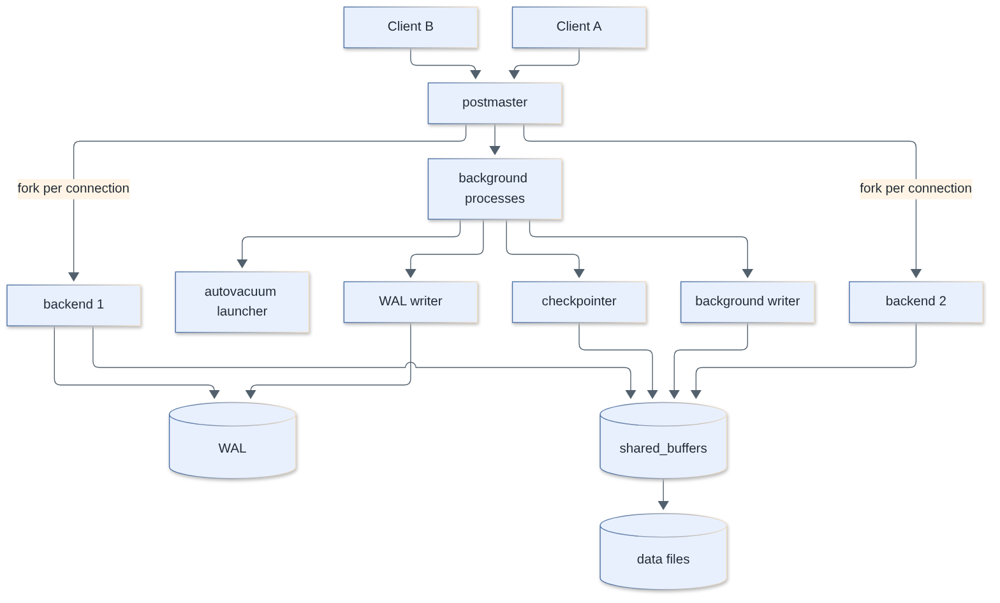
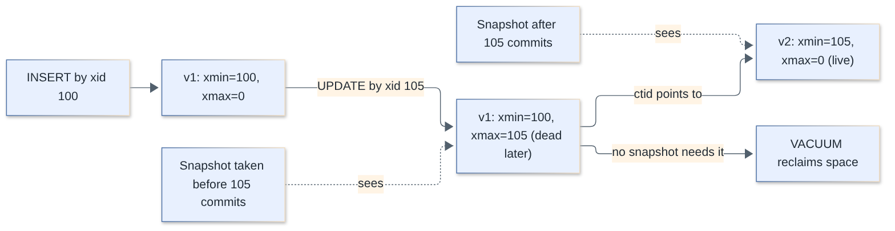
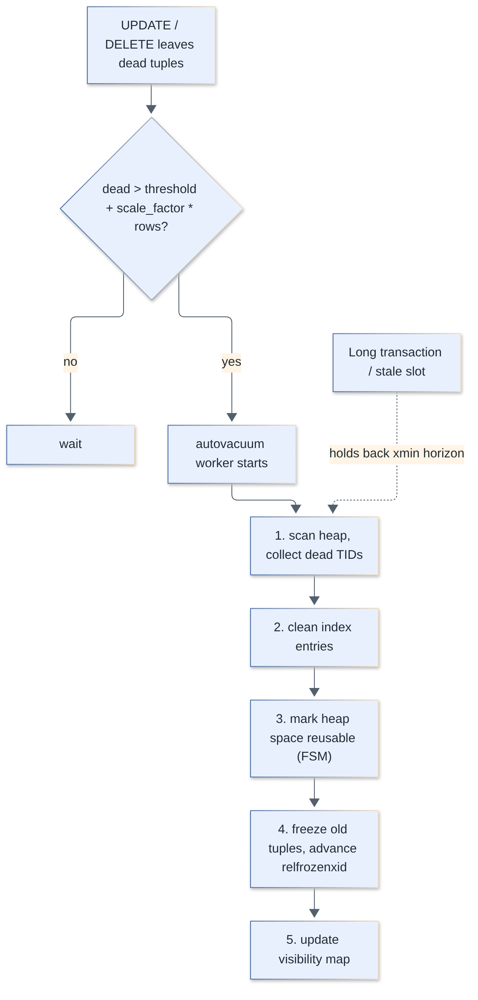
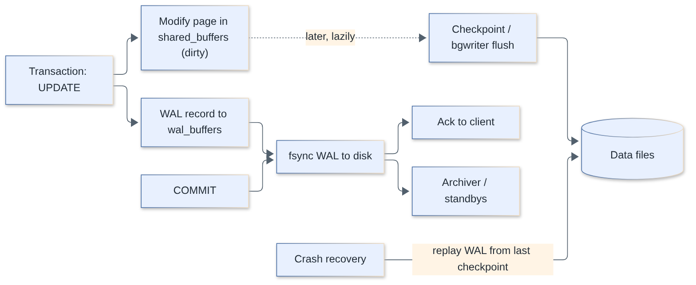
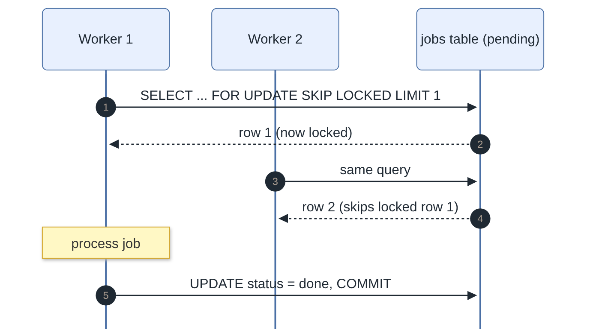
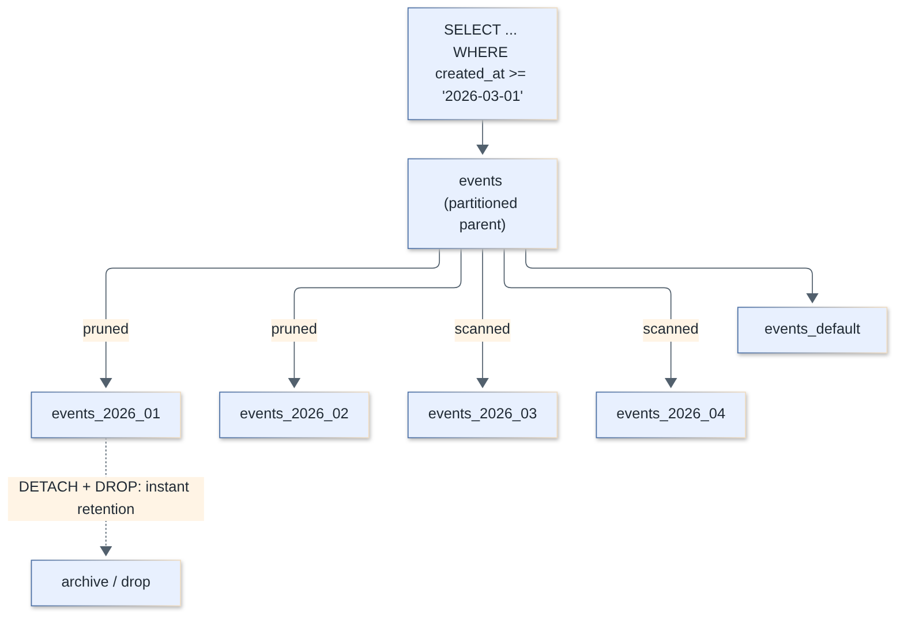
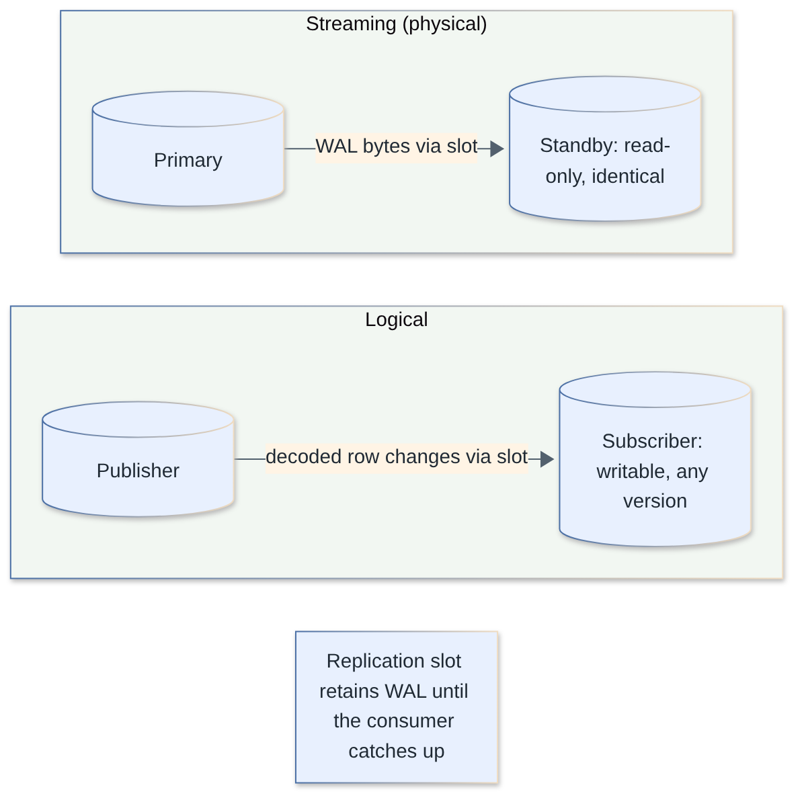
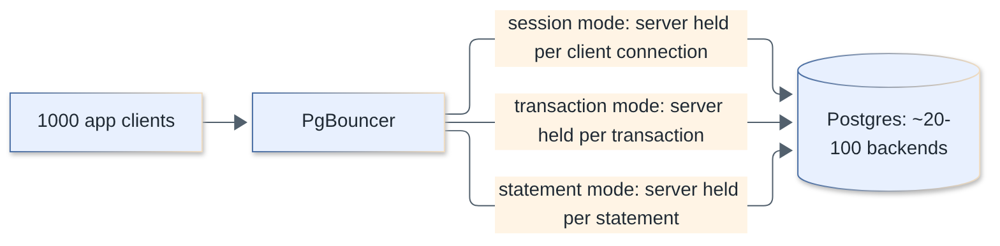

# PostgreSQL Interview Questions

PostgreSQL-specific interview questions with complete answers: internals (MVCC, WAL, vacuum), locking, indexing, query planning, SQL features, replication, and operations. General database theory (normalization, ACID basics, SQL fundamentals) lives in the [databases](../databases/) topic.

**Levels:** `🟢 Junior` · `🟡 Middle` · `🔴 Senior`

## Table of contents

- **[Data Types and SQL Features](#data-types-and-sql-features)**
  1. [Which PostgreSQL data types should you prefer for text, time, and money?](#1-which-postgresql-data-types-should-you-prefer-for-text-time-and-money)
  2. [What is the difference between `serial`, `IDENTITY`, and generated columns?](#2-what-is-the-difference-between-serial-identity-and-generated-columns)
  3. [How do UUID primary keys compare to bigint, and what is UUIDv7?](#3-how-do-uuid-primary-keys-compare-to-bigint-and-what-is-uuidv7)
  4. [How do `INSERT ... ON CONFLICT` (UPSERT) and `RETURNING` work?](#4-how-do-insert--on-conflict-upsert-and-returning-work)
  5. [What is the difference between `json` and `jsonb`, and which operators matter?](#5-what-is-the-difference-between-json-and-jsonb-and-which-operators-matter)
  6. [How do arrays work in PostgreSQL and when should you use them?](#6-how-do-arrays-work-in-postgresql-and-when-should-you-use-them)
  7. [How do CTEs behave: materialization, recursion, and writable CTEs?](#7-how-do-ctes-behave-materialization-recursion-and-writable-ctes)
  8. [What is `LATERAL` and when is it useful?](#8-what-is-lateral-and-when-is-it-useful)
  9. [How does full-text search work in PostgreSQL?](#9-how-does-full-text-search-work-in-postgresql)
- **[Architecture and Storage](#architecture-and-storage)**
  10. [Describe PostgreSQL's process architecture.](#10-describe-postgresqls-process-architecture)
  11. [What are `shared_buffers`, `work_mem`, and the other key memory settings?](#11-what-are-shared_buffers-work_mem-and-the-other-key-memory-settings)
  12. [How does MVCC work in PostgreSQL (xmin, xmax, tuple visibility)?](#12-how-does-mvcc-work-in-postgresql-xmin-xmax-tuple-visibility)
  13. [What are HOT updates and how do `fillfactor` and indexes affect them?](#13-what-are-hot-updates-and-how-do-fillfactor-and-indexes-affect-them)
  14. [What do VACUUM, VACUUM FULL, and autovacuum do?](#14-what-do-vacuum-vacuum-full-and-autovacuum-do)
  15. [How do you tune autovacuum and diagnose table bloat?](#15-how-do-you-tune-autovacuum-and-diagnose-table-bloat)
  16. [What is transaction ID wraparound and how do you prevent it?](#16-what-is-transaction-id-wraparound-and-how-do-you-prevent-it)
  17. [How does the Write-Ahead Log (WAL) work and what are checkpoints?](#17-how-does-the-write-ahead-log-wal-work-and-what-are-checkpoints)
  18. [How do you tune checkpoints and reduce WAL volume?](#18-how-do-you-tune-checkpoints-and-reduce-wal-volume)
- **[Transactions and Locking](#transactions-and-locking)**
  19. [What isolation levels does PostgreSQL support and how do they actually behave?](#19-what-isolation-levels-does-postgresql-support-and-how-do-they-actually-behave)
  20. [How does Serializable work (SSI) and how do you use it correctly?](#20-how-does-serializable-work-ssi-and-how-do-you-use-it-correctly)
  21. [What are the table-level and row-level lock modes?](#21-what-are-the-table-level-and-row-level-lock-modes)
  22. [How do `SELECT ... FOR UPDATE`, `NOWAIT`, and `SKIP LOCKED` work, and how do you build a job queue with them?](#22-how-do-select--for-update-nowait-and-skip-locked-work-and-how-do-you-build-a-job-queue-with-them)
  23. [What are advisory locks and when would you use them?](#23-what-are-advisory-locks-and-when-would-you-use-them)
  24. [How does PostgreSQL detect deadlocks and how do you avoid them?](#24-how-does-postgresql-detect-deadlocks-and-how-do-you-avoid-them)
  25. [How do you diagnose and fix blocking and lock queues in production?](#25-how-do-you-diagnose-and-fix-blocking-and-lock-queues-in-production)
- **[Indexing](#indexing)**
  26. [What is an index and what is PostgreSQL's default index type?](#26-what-is-an-index-and-what-is-postgresqls-default-index-type)
  27. [What index types does PostgreSQL offer and when do you use each?](#27-what-index-types-does-postgresql-offer-and-when-do-you-use-each)
  28. [How does multicolumn index order matter, and what changed with skip scan?](#28-how-does-multicolumn-index-order-matter-and-what-changed-with-skip-scan)
  29. [What are partial, expression, and covering (INCLUDE) indexes?](#29-what-are-partial-expression-and-covering-include-indexes)
  30. [How does `CREATE INDEX CONCURRENTLY` work and what can go wrong?](#30-how-does-create-index-concurrently-work-and-what-can-go-wrong)
  31. [How do you index JSONB columns?](#31-how-do-you-index-jsonb-columns)
- **[Query Planning and Performance](#query-planning-and-performance)**
  32. [How do you read `EXPLAIN` and `EXPLAIN (ANALYZE, BUFFERS)`?](#32-how-do-you-read-explain-and-explain-analyze-buffers)
  33. [Seq scan vs index scan vs bitmap scan vs index-only scan: when does the planner pick each?](#33-seq-scan-vs-index-scan-vs-bitmap-scan-vs-index-only-scan-when-does-the-planner-pick-each)
  34. [How do index-only scans and the visibility map work?](#34-how-do-index-only-scans-and-the-visibility-map-work)
  35. [Explain the join algorithms: nested loop, hash join, and merge join.](#35-explain-the-join-algorithms-nested-loop-hash-join-and-merge-join)
  36. [How do statistics and ANALYZE affect plans, and how do you fix bad row estimates?](#36-how-do-statistics-and-analyze-affect-plans-and-how-do-you-fix-bad-row-estimates)
  37. [What are generic vs custom plans for prepared statements, and why can they hurt?](#37-what-are-generic-vs-custom-plans-for-prepared-statements-and-why-can-they-hurt)
  38. [How do you use `pg_stat_statements` to find slow queries?](#38-how-do-you-use-pg_stat_statements-to-find-slow-queries)
  39. [A query or the whole database is slow. How do you diagnose it systematically?](#39-a-query-or-the-whole-database-is-slow-how-do-you-diagnose-it-systematically)
- **[Scaling and Operations](#scaling-and-operations)**
  40. [How does declarative partitioning work and what are its pitfalls?](#40-how-does-declarative-partitioning-work-and-what-are-its-pitfalls)
  41. [What is the difference between streaming (physical) replication and logical replication?](#41-what-is-the-difference-between-streaming-physical-replication-and-logical-replication)
  42. [What are replication slots and why can they take down a primary?](#42-what-are-replication-slots-and-why-can-they-take-down-a-primary)
  43. [How do you handle replication lag, read replicas, and synchronous commit trade-offs?](#43-how-do-you-handle-replication-lag-read-replicas-and-synchronous-commit-trade-offs)
  44. [Why are PostgreSQL connections expensive, and how does PgBouncer solve it?](#44-why-are-postgresql-connections-expensive-and-how-does-pgbouncer-solve-it)
  45. [How do you run schema migrations safely on a large, busy table?](#45-how-do-you-run-schema-migrations-safely-on-a-large-busy-table)
  46. [How does Row-Level Security (RLS) work?](#46-how-does-row-level-security-rls-work)
  47. [How do `LISTEN` / `NOTIFY` work and what are their limits?](#47-how-do-listen--notify-work-and-what-are-their-limits)
  48. [Which PostgreSQL extensions matter (pgvector, PostGIS, pg_trgm, TimescaleDB)?](#48-which-postgresql-extensions-matter-pgvector-postgis-pg_trgm-timescaledb)
  49. [How do backups work: `pg_dump` vs `pg_basebackup`, and what is PITR?](#49-how-do-backups-work-pg_dump-vs-pg_basebackup-and-what-is-pitr)
  50. [What notable features arrived in PostgreSQL 17 and 18?](#50-what-notable-features-arrived-in-postgresql-17-and-18)

## Data Types and SQL Features

### 1. Which PostgreSQL data types should you prefer for text, time, and money?

`🟢 Junior` · `#data-types` `#basics`

Use `text` for strings, `timestamptz` for points in time, `numeric` for money and exact decimals, `bigint` for ids that may grow, and `boolean`, `jsonb`, `uuid` where they fit. Avoid `timestamp` (without tz), `money`, `char(n)`, and `float` for exact values.

| Need | Prefer | Avoid | Why |
|------|--------|-------|-----|
| Strings | `text` (or `varchar(n)` if you need a real limit) | `char(n)` | In PG `text`, `varchar` and `varchar(n)` have the same storage and speed. `char(n)` pads with spaces and is slower. No performance reason to pick `varchar(255)`. |
| Instants | `timestamptz` | `timestamp` | `timestamptz` stores UTC internally and converts to the session `TimeZone` on output. `timestamp` silently ignores zones, which breaks across DST and servers. |
| Money | `numeric(12,2)` or integer minor units (cents) | `money`, `float8` | `float` has binary rounding errors (`0.1 + 0.2`). `money` depends on `lc_monetary` and has fixed precision. |
| Integer ids | `bigint` (identity) | `integer` for hot tables | `int4` tops out at 2,147,483,647; migrating a 2B-row table later is painful. |
| Flags / enums | `boolean`, native `enum` or `text` + `CHECK` | magic ints | Native enums are compact but adding/removing values is awkward; `CHECK` is flexible. |

```sql
CREATE TABLE payment (
  id         bigint GENERATED ALWAYS AS IDENTITY PRIMARY KEY,
  user_id    bigint NOT NULL,
  amount     numeric(12,2) NOT NULL CHECK (amount > 0),
  currency   text NOT NULL CHECK (char_length(currency) = 3),
  created_at timestamptz NOT NULL DEFAULT now()
);

SELECT 0.1::float8 + 0.2::float8 = 0.3::float8;   -- false
SELECT 0.1::numeric + 0.2::numeric = 0.3::numeric; -- true
```

> **Follow-up:** Does `varchar(n)` vs `text` change performance? No. Changing `varchar(n)` to a larger `n` (or to `text`) is a metadata-only change; shrinking it rewrites/validates the table.

[↑ Back to top](#table-of-contents)

### 2. What is the difference between `serial`, `IDENTITY`, and generated columns?

`🟢 Junior` · `#sequences` `#identity` `#generated-columns`

`serial` is legacy shorthand that creates a sequence and sets a `DEFAULT nextval(...)`. `GENERATED ... AS IDENTITY` is the SQL-standard replacement, with the sequence owned by the column and stricter semantics. Generated columns (`GENERATED ALWAYS AS (expr)`) are different: they compute a value from other columns.

| Feature | `serial` | `IDENTITY` | Generated column |
|---------|----------|------------|------------------|
| Standard SQL | No | Yes | Yes |
| Sequence ownership | Dependency via `OWNED BY` | Built in | None |
| Prevent manual values | No (`INSERT` can override) | `ALWAYS` rejects them unless `OVERRIDING SYSTEM VALUE` | Always computed |
| Permissions | Need `GRANT USAGE` on sequence | Handled with the table | n/a |
| Copy table (`LIKE`) | Shares the sequence default | Gets its own sequence with `INCLUDING IDENTITY` | Copied with `INCLUDING GENERATED` |

```sql
CREATE TABLE orders (
  id    bigint GENERATED ALWAYS AS IDENTITY PRIMARY KEY,
  qty   int NOT NULL,
  price numeric(10,2) NOT NULL,
  total numeric(12,2) GENERATED ALWAYS AS (qty * price) STORED
);
INSERT INTO orders (qty, price) VALUES (3, 9.99);   -- total = 29.97
```

Gotchas that matter in interviews:

- Sequences are **non-transactional**: a rolled-back insert still consumes a value, so ids have gaps. Never rely on gapless ids.
- Sequences are not replicated by logical replication, so after a failover/switch-over you must `setval` them above the max id.
- Generated columns: `STORED` is computed on write and occupies disk. In **PostgreSQL 18**, `VIRTUAL` (computed at read time, no storage) became the default if you omit the keyword; virtual columns cannot be indexed in 18, so use `STORED` or an expression index when you need that. Generated expressions must be immutable and cannot reference other generated columns or volatile functions.
- Pre-18 only `STORED` exists.

> **Follow-up:** How do you reset an identity after a bulk load? `SELECT setval(pg_get_serial_sequence('orders','id'), (SELECT max(id) FROM orders));` or `ALTER TABLE orders ALTER COLUMN id RESTART WITH 1000;`.

[↑ Back to top](#table-of-contents)

### 3. How do UUID primary keys compare to bigint, and what is UUIDv7?

`🟢 Junior` · `#uuid` `#primary-key` `#indexing`

UUIDv4 keys are random, so inserts land all over the B-tree, causing page splits, poor cache locality, and extra WAL. UUIDv7 puts a millisecond timestamp in the high bits, so new keys are roughly increasing like a bigint while staying globally unique. PostgreSQL 18 added a built-in `uuidv7()` function.

| Key | Size | Insert locality | Guessable | Generated where |
|-----|------|-----------------|-----------|-----------------|
| `bigint` identity | 8 B | Excellent (append) | Yes (enumerable) | DB only (sequence round trip) |
| UUIDv4 (`gen_random_uuid()`, core since PG13) | 16 B | Poor (random) | No | DB or client |
| UUIDv7 (`uuidv7()`, PG18) | 16 B | Good (time-ordered) | Leaks creation time | DB or client |

```sql
-- PostgreSQL 18+
CREATE TABLE event (
  id         uuid PRIMARY KEY DEFAULT uuidv7(),
  payload    jsonb NOT NULL
);

SELECT uuidv7();              -- e.g. 019a1f4e-3c52-7b1e-8d0a-6f2e9c1b4a77
SELECT uuid_extract_timestamp(uuidv7());

-- before 18: use a library/extension or generate client-side, otherwise
-- id uuid PRIMARY KEY DEFAULT gen_random_uuid()
```

Trade-offs: UUIDs are twice as wide, and every secondary index stores the PK (so indexes grow too). Use UUIDs when ids are generated client-side, merged across shards/systems, or must not be enumerable. Use `bigint` identity when a single database owns the ids. UUIDv7 reveals creation time, so do not use it as a secret token.

> **Follow-up:** Is a random UUID PK catastrophic? On small hot-in-memory tables no, but on large tables random inserts cause cache misses on index leaf pages and larger full-page-write WAL after each checkpoint.

[↑ Back to top](#table-of-contents)

### 4. How do `INSERT ... ON CONFLICT` (UPSERT) and `RETURNING` work?

`🟢 Junior` · `#upsert` `#returning` `#dml`

`ON CONFLICT` makes an insert atomic: if a unique/exclusion constraint is violated it either does nothing or updates the existing row. `RETURNING` hands back the affected rows' columns without a second query.

```sql
CREATE TABLE counter (key text PRIMARY KEY, hits int NOT NULL DEFAULT 0);

-- atomic increment-or-create, no race condition
INSERT INTO counter (key, hits) VALUES ('home', 1)
ON CONFLICT (key) DO UPDATE
   SET hits = counter.hits + EXCLUDED.hits
RETURNING key, hits;

-- idempotent insert
INSERT INTO counter (key) VALUES ('about')
ON CONFLICT DO NOTHING
RETURNING key;            -- returns no row if it already existed
```

Key points:

- `EXCLUDED` is the row you tried to insert. The conflict target must match a unique index (or use `ON CONFLICT ON CONSTRAINT name`).
- It is race-free under concurrency, unlike "SELECT then INSERT". Concurrent upserts on the same key serialize on the row lock.
- `DO NOTHING ... RETURNING` yields nothing for skipped rows; use a no-op `DO UPDATE SET key = EXCLUDED.key` if you must always get the row (but that creates a dead tuple each time).
- Every attempted `DO UPDATE` writes a new tuple version, which feeds bloat.
- `MERGE` (PG15) is the SQL-standard alternative with more conditions; PG17 added `RETURNING` with `merge_action()` and `WHEN NOT MATCHED BY SOURCE`. `MERGE` is not a safe replacement for `ON CONFLICT` under concurrent inserts, because it can still raise unique violations.
- PostgreSQL 18 added `OLD` and `NEW` in `RETURNING` for `INSERT`, `UPDATE`, `DELETE` and `MERGE`:

```sql
-- PG 18+: see before and after in one statement
UPDATE counter SET hits = hits + 1 WHERE key = 'home'
RETURNING old.hits AS before, new.hits AS after;
```

> **Follow-up:** How do you know if an upsert inserted or updated? Common trick: `RETURNING (xmax = 0) AS inserted` (relies on an implementation detail), or on PG 17+ use `MERGE ... RETURNING merge_action()`.

[↑ Back to top](#table-of-contents)

### 5. What is the difference between `json` and `jsonb`, and which operators matter?

`🟢 Junior` · `#jsonb` `#json`

`json` stores the exact input text and re-parses it on each access. `jsonb` stores a decomposed binary form: slightly slower to write, much faster to query, indexable, and it removes whitespace, duplicate keys (last wins) and key order. Use `jsonb` nearly always.

| Operator | Meaning | Example |
|----------|---------|---------|
| `->` | get field/element as `jsonb` | `data -> 'user'` |
| `->>` | get field as `text` | `data ->> 'email'` |
| `#>`, `#>>` | path lookup | `data #>> '{user,address,city}'` |
| `@>` | contains | `data @> '{"status":"paid"}'` |
| `<@` | is contained by | `'{"a":1}' <@ data` |
| `?`, `?\|`, `?&` | key exists / any / all | `data ? 'email'` |
| `\|\|` | concatenate / merge | `data \|\| '{"x":1}'` |
| `-`, `#-` | delete key / path | `data - 'tmp'` |
| `@?`, `@@` | jsonpath exists / predicate | `data @? '$.items[*] ? (@.qty > 5)'` |

```sql
CREATE TABLE doc (id bigint GENERATED ALWAYS AS IDENTITY PRIMARY KEY, data jsonb NOT NULL);
INSERT INTO doc (data) VALUES ('{"user":{"email":"a@x.io"},"tags":["a","b"],"status":"paid"}');

SELECT data -> 'user' ->> 'email'      FROM doc;           -- a@x.io
SELECT * FROM doc WHERE data @> '{"status":"paid"}';       -- index friendly
SELECT * FROM doc WHERE data -> 'tags' ? 'a';
UPDATE doc SET data = jsonb_set(data, '{user,email}', '"b@x.io"');
```

Gotchas:

- `data ->> 'x' = 'y'` cannot use a GIN index on `data`; `data @> '{"x":"y"}'` can (see the JSONB indexing question).
- Updating one key rewrites the entire jsonb value (and its TOAST entries if large). Huge documents with frequent small updates are a bloat/WAL problem; promote hot fields to real columns.
- Numbers keep arbitrary precision (`numeric`), no int/float distinction.
- PG17 added SQL/JSON functions such as `JSON_TABLE`, `JSON_QUERY`, `JSON_VALUE`, `JSON_EXISTS`.

> **Follow-up:** When should you not use JSONB? When fields are known, relational and constrained (FKs, NOT NULL, types). Hybrid design is common: typed columns for core attributes, `jsonb` for the long tail.

[↑ Back to top](#table-of-contents)

### 6. How do arrays work in PostgreSQL and when should you use them?

`🟢 Junior` · `#arrays` `#gin`

Any type can be an array column (`text[]`, `int[]`). They are 1-indexed, support `ANY`/`ALL`, containment operators, `unnest`, and GIN indexing. Use them for small, value-like lists that are always read and written together; use a join table when you need foreign keys or per-element attributes.

```sql
CREATE TABLE article (id bigint GENERATED ALWAYS AS IDENTITY PRIMARY KEY, tags text[] NOT NULL DEFAULT '{}');
INSERT INTO article (tags) VALUES ('{pg,index}'), (ARRAY['pg','jsonb']);

SELECT * FROM article WHERE 'pg' = ANY (tags);       -- membership (not index-assisted)
SELECT * FROM article WHERE tags @> ARRAY['pg'];      -- contains (GIN-assisted)
SELECT * FROM article WHERE tags && ARRAY['index','jsonb']; -- overlaps
SELECT unnest(tags) AS tag, count(*) FROM article GROUP BY 1;
SELECT array_agg(id ORDER BY id) FROM article;        -- aggregate rows into an array

CREATE INDEX article_tags_gin ON article USING gin (tags);
```

| Operator | Meaning |
|----------|---------|
| `@>` / `<@` | contains / contained by |
| `&&` | overlap |
| `= ANY(arr)` | element equals; typical for `WHERE id = ANY($1)` bind parameters |
| `\|\|` | concatenate / append |

Trade-offs: no foreign keys on elements, the whole array is rewritten when one element changes, and `NULL` elements behave surprisingly. Passing a single array parameter (`WHERE id = ANY($1::bigint[])`) is the idiomatic way to avoid dynamically building huge `IN (...)` lists and keeps one prepared statement shape.

> **Follow-up:** Array vs join table? Join table for relationships you query from both sides or constrain; array for denormalized, read-mostly tags.

[↑ Back to top](#table-of-contents)

### 7. How do CTEs behave: materialization, recursion, and writable CTEs?

`🟡 Middle` · `#cte` `#optimizer`

A CTE (`WITH`) names a subquery. Before PG12 every CTE was an optimization fence (always materialized). Since PG12, a non-recursive, side-effect-free CTE referenced once is inlined into the parent query like a subquery. You can force the behavior with `MATERIALIZED` / `NOT MATERIALIZED`.

```sql
-- inlined automatically (PG12+), so the predicate is pushed down
WITH recent AS (SELECT * FROM orders WHERE created_at > now() - interval '1 day')
SELECT * FROM recent WHERE user_id = 42;

-- force a fence: compute once, reuse (useful for expensive subquery referenced twice)
WITH expensive AS MATERIALIZED (
  SELECT user_id, sum(total) AS s FROM orders GROUP BY user_id
)
SELECT * FROM expensive e1 JOIN expensive e2 ON e1.user_id <> e2.user_id AND e1.s = e2.s;

-- recursive: org tree
WITH RECURSIVE tree AS (
  SELECT id, parent_id, name, 1 AS depth FROM employee WHERE parent_id IS NULL
  UNION ALL
  SELECT e.id, e.parent_id, e.name, t.depth + 1
  FROM employee e JOIN tree t ON e.parent_id = t.id
)
SELECT * FROM tree;

-- writable CTE: move rows atomically, always executed exactly once
WITH moved AS (
  DELETE FROM queue WHERE created_at < now() - interval '30 days' RETURNING *
)
INSERT INTO queue_archive SELECT * FROM moved;
```

Rules of thumb:

- Materialization **helps** when the CTE is referenced multiple times and is expensive, or when you want to stop the planner from picking a bad join order.
- Materialization **hurts** when the outer query filters rows that could have been pushed into the CTE.
- Data-modifying CTEs are always executed once, whether or not their output is read, and all sub-statements see the same snapshot (they cannot see each other's changes).
- A recursive CTE needs a termination condition. Add a depth guard or use `UNION` (dedupe) to avoid cycles; PG14 adds `CYCLE` and `SEARCH` clauses.

> **Follow-up:** How do you check what the planner did? `EXPLAIN` shows `CTE Scan on recent` when materialized, and no CTE node when inlined.

[↑ Back to top](#table-of-contents)

### 8. What is `LATERAL` and when is it useful?

`🟡 Middle` · `#lateral` `#joins`

`LATERAL` lets a subquery or function in the `FROM` clause reference columns of tables listed before it, like a correlated subquery that can return multiple rows and columns. It is the standard way to write "top N per group" and to call set-returning functions per row.

```sql
-- latest 3 orders for each of the 100 most recent users
SELECT u.id, u.email, o.id AS order_id, o.created_at
FROM (SELECT * FROM users ORDER BY created_at DESC LIMIT 100) u
CROSS JOIN LATERAL (
  SELECT id, created_at FROM orders
  WHERE orders.user_id = u.id
  ORDER BY created_at DESC
  LIMIT 3
) o;
```

With an index on `orders (user_id, created_at DESC)` this runs as 100 tiny index scans (a nested loop) rather than sorting all orders with `row_number()`.

```sql
-- set-returning function per row, keep rows that produce nothing with LEFT JOIN ... ON true
SELECT a.id, t.tag
FROM article a
LEFT JOIN LATERAL unnest(a.tags) AS t(tag) ON true;
```

Use it when the inner part depends on the outer row, needs `LIMIT` per outer row, or is a function over a column. Use window functions (`row_number() OVER (PARTITION BY ...)`) when you want top N for most groups, since LATERAL costs one probe per outer row.

> **Follow-up:** Difference from a correlated scalar subquery? A scalar subquery returns exactly one value; LATERAL can return many rows and columns.

[↑ Back to top](#table-of-contents)

### 9. How does full-text search work in PostgreSQL?

`🟡 Middle` · `#fts` `#tsvector` `#gin`

You convert text to a `tsvector` (normalized lexemes with positions), convert the query to a `tsquery`, and match with `@@`. A GIN index over the `tsvector` makes it fast. It is good for stemming, stop words and ranking inside a single database, but is not a full Elasticsearch replacement.

```sql
CREATE TABLE post (
  id    bigint GENERATED ALWAYS AS IDENTITY PRIMARY KEY,
  title text NOT NULL,
  body  text NOT NULL,
  tsv   tsvector GENERATED ALWAYS AS (
          setweight(to_tsvector('english', title), 'A') ||
          setweight(to_tsvector('english', body),  'B')
        ) STORED
);
CREATE INDEX post_tsv_idx ON post USING gin (tsv);

SELECT id, title, ts_rank(tsv, q) AS rank
FROM post, websearch_to_tsquery('english', 'postgres "full text" -mysql') q
WHERE tsv @@ q
ORDER BY rank DESC
LIMIT 10;
```

Notes:

- `to_tsvector('english', ...)` always pass the configuration explicitly; otherwise the expression depends on `default_text_search_config` and is not immutable (cannot be indexed).
- Query constructors: `plainto_tsquery`, `phraseto_tsquery`, `websearch_to_tsquery` (Google-like syntax, safest for user input), `to_tsquery` (raw operators, throws on bad syntax).
- GIN: faster reads, slower writes, larger; GiST: smaller, lossy, faster updates. GIN is the usual pick.
- `ts_rank` has to visit each matching row, so ranking millions of matches is slow. Add filters or limit the result set.
- For typo tolerance and `LIKE '%foo%'`, use `pg_trgm`. For vector/semantic search, `pgvector`. For heavy faceting and relevance tuning, a dedicated search engine.

> **Follow-up:** Why store `tsv` as a generated column? Keeps it in sync automatically; the alternative is a trigger (`tsvector_update_trigger`).

[↑ Back to top](#table-of-contents)


## Architecture and Storage

### 10. Describe PostgreSQL's process architecture.

`🟡 Middle` · `#architecture` `#processes`

PostgreSQL uses a **process-per-connection** model. A parent `postmaster` listens on the port, forks one backend process per client connection, and also starts fixed background processes (checkpointer, background writer, WAL writer, autovacuum launcher, etc.). All of them communicate through a shared memory segment (shared buffers, lock tables, WAL buffers).



| Process | Job |
|---------|-----|
| `postmaster` | Accepts connections, forks backends, restarts everything after a crash |
| backend (`postgres: user db ...`) | Runs one session's queries; reads/writes pages via shared buffers |
| `checkpointer` | Periodically flushes all dirty buffers and writes a checkpoint record |
| `background writer` | Trickles dirty pages out so backends rarely have to evict them |
| `WAL writer` | Flushes WAL buffers to disk asynchronously |
| `autovacuum launcher` + workers | Vacuum/analyze tables automatically |
| `archiver` | Ships completed WAL segments (if archiving is on) |
| `walsender` / `walreceiver` | Streaming replication on primary / standby |
| parallel query workers, logical replication workers | Spawned on demand as background workers |
| I/O workers (PG18, `io_method=worker`) | Execute asynchronous reads for backends |

```sql
SELECT pid, backend_type, state, wait_event_type, wait_event, left(query, 60) AS query
FROM pg_stat_activity
ORDER BY backend_type;
```

Consequences:

- A crash in one backend makes the postmaster restart all processes (shared memory may be corrupted), so a bad extension can take down the instance.
- Each connection costs an OS process plus memory (see the connection pooling question), which is why you pool.
- Cached data lives in two places: PostgreSQL `shared_buffers` and the OS page cache ("double buffering"), so `effective_cache_size` should reflect both.

> **Follow-up:** Why not threads? Historical design and isolation; a thread-based model is a long-running discussion in the community, not shipped in a stable release as of PostgreSQL 18.

[↑ Back to top](#table-of-contents)

### 11. What are `shared_buffers`, `work_mem`, and the other key memory settings?

`🟡 Middle` · `#memory` `#tuning`

`shared_buffers` is the shared page cache for all backends. `work_mem` is per-operation private memory for sorts and hashes. `maintenance_work_mem` is for VACUUM and index builds. `effective_cache_size` is not an allocation: it only tells the planner how much cache (PG + OS) it can expect.

| Setting | Default | Typical starting point | Notes |
|---------|---------|------------------------|-------|
| `shared_buffers` | 128MB | ~25% of RAM | Beyond ~40% rarely helps; the OS cache also holds data. Needs restart. |
| `work_mem` | 4MB | 16-64MB for OLTP | **Per sort/hash node, per parallel worker, per connection** |
| `maintenance_work_mem` | 64MB | 512MB-2GB | Used by `VACUUM`, `CREATE INDEX`; autovacuum uses `autovacuum_work_mem` or this |
| `effective_cache_size` | 4GB | 50-75% of RAM | Planner hint: higher makes index scans look cheaper |
| `wal_buffers` | -1 (auto, ~1/32 of shared_buffers, max 16MB) | auto | Rarely needs touching |
| `huge_pages` | try | `on` for big `shared_buffers` | Cuts page-table overhead |

Why `work_mem` is dangerous: worst-case memory is roughly `work_mem x nodes_per_query x parallel_workers x connections`. 500 connections x 64MB x several nodes can OOM the host. Raise it per session or per role for the heavy query instead:

```sql
SET LOCAL work_mem = '256MB';   -- inside a transaction for one analytic query
ALTER ROLE reporting SET work_mem = '128MB';
```

Spot spills in `EXPLAIN (ANALYZE, BUFFERS)`:

```text
Sort Method: external merge  Disk: 184320kB      -- spilled, work_mem too small
Hash Join ... Buckets: 65536  Batches: 16        -- Batches > 1 means spilled to disk
```

`hash_mem_multiplier` (default 2.0 since PG15) lets hash-based nodes use `work_mem x multiplier`.

> **Follow-up:** Does a bigger `shared_buffers` always help? No: double buffering, longer checkpoints, and slower startup warm-up. Measure with `pg_stat_database` hit ratio and `pg_buffercache`.

[↑ Back to top](#table-of-contents)

### 12. How does MVCC work in PostgreSQL (xmin, xmax, tuple visibility)?

`🟡 Middle` · `#mvcc` `#internals`

PostgreSQL never updates a row in place. An `UPDATE` marks the old tuple as deleted (sets its `xmax`) and inserts a **new tuple version** (with `xmin` = the updating transaction). Each transaction takes a snapshot and sees only the versions that were committed when the snapshot was taken. Readers never block writers and writers never block readers.



Every heap tuple header has:

| Field | Meaning |
|-------|---------|
| `xmin` | Transaction ID that created this version |
| `xmax` | Transaction ID that deleted/updated it (0 if live), also used for row locks |
| `ctid` | Physical location (page, offset); the old version's `ctid` points to the newer version |
| infomask hint bits | Cache whether `xmin`/`xmax` committed or aborted, so the commit log (`pg_xact`) need not be consulted again |

```sql
CREATE TABLE acct (id int PRIMARY KEY, bal int);
INSERT INTO acct VALUES (1, 100);

SELECT xmin, xmax, ctid, * FROM acct;
--  xmin | xmax | ctid  | id | bal
--   801 |    0 | (0,1) |  1 | 100

UPDATE acct SET bal = 90 WHERE id = 1;
SELECT xmin, xmax, ctid, * FROM acct;
--   802 |    0 | (0,2) |  1 |  90      -- new version; (0,1) is now dead
```

A tuple is visible to snapshot S if `xmin` committed before S and (`xmax` is 0, aborted, or not yet committed as of S). The snapshot is `(xmin, xmax, xip[])`: the oldest running xid, the next unassigned xid, and the list of in-progress xids.

Consequences:

- Dead tuples pile up until `VACUUM` removes them, so UPDATE-heavy tables bloat.
- `ROLLBACK` is instant: nothing to undo, the aborted `xmin` is simply never visible. (Contrast with Oracle/MySQL undo logs.)
- `SELECT count(*)` must check visibility per row, so it is slow on big tables (index-only scans mitigate this via the visibility map).
- A long-open transaction or snapshot pins the **xmin horizon**: vacuum cannot remove versions still visible to it.
- Row locks are stored in the tuple (`xmax`), not in a lock table, so locking millions of rows dirties pages.

> **Follow-up:** What are hint bits? Flags set lazily by the first reader after commit so later readers skip the `pg_xact` lookup; this is why a first `SELECT` after a bulk load can write to disk.

[↑ Back to top](#table-of-contents)

### 13. What are HOT updates and how do `fillfactor` and indexes affect them?

`🔴 Senior` · `#mvcc` `#hot` `#fillfactor` `#bloat`

A HOT (Heap-Only Tuple) update writes the new row version on the **same heap page** and does **not** create new index entries. It is possible only if the update changes no indexed column (PG16+ also allows it when only BRIN-style summarizing indexes are affected) and the page has room. HOT chains are pruned cheaply by regular page access, with no VACUUM needed.

Without HOT, every update inserts a new entry into **every** index on the table (write amplification, index bloat). With HOT, the old index entry points to the line pointer at the chain root, which redirects to the live version on the same page.

```sql
-- leave 20% free space on each heap page so updated rows can stay on-page
ALTER TABLE acct SET (fillfactor = 80);
VACUUM FULL acct;   -- or rewrite later; existing pages are not rebalanced automatically

SELECT relname, n_tup_upd, n_tup_hot_upd,
       round(100.0 * n_tup_hot_upd / nullif(n_tup_upd, 0), 1) AS hot_pct
FROM pg_stat_user_tables
ORDER BY n_tup_upd DESC LIMIT 10;
```

How to get more HOT updates:

1. **Do not index frequently updated columns** (`last_seen_at`, counters, `updated_at`). Move them to a narrow side table if you need an index on them.
2. **Lower `fillfactor`** (e.g. 70-90) on update-heavy tables; the default for heap tables is 100.
3. Keep rows small so more versions fit per 8 KB page.
4. Drop unused indexes (`pg_stat_user_indexes.idx_scan = 0`), since each index can disqualify HOT.

Trade-off: a low fillfactor wastes space and means more pages to read for scans. Index fillfactor (default 90 for B-tree) is a separate setting.

> **Follow-up:** How do you see pruning at work? Use the `pageinspect` extension (`heap_page_items`) to inspect line pointers (`lp_flags`: 1 normal, 2 redirect, 3 dead).

[↑ Back to top](#table-of-contents)

### 14. What do VACUUM, VACUUM FULL, and autovacuum do?

`🟢 Junior` · `#vacuum` `#autovacuum` `#bloat`

`VACUUM` removes dead tuples and marks their space reusable **inside the table file** (it does not normally shrink the file), updates the visibility map and free space map, and freezes old tuples. `VACUUM FULL` rewrites the whole table into a new file, returning space to the OS, but takes an `ACCESS EXCLUSIVE` lock. Autovacuum runs VACUUM and ANALYZE in the background automatically.



| | `VACUUM` | `VACUUM FULL` | `pg_repack` / `pg_squeeze` |
|--|----------|---------------|---------------------------|
| Locks | `SHARE UPDATE EXCLUSIVE` (reads/writes continue) | `ACCESS EXCLUSIVE` (blocks everything) | Brief exclusive locks only |
| Shrinks file | Only trailing empty pages | Yes | Yes |
| Extra disk | Little | Full copy of table + indexes | Full copy |
| Use | Routine | Rare, maintenance window | Online bloat removal |

```sql
VACUUM (VERBOSE, ANALYZE) orders;

SELECT relname, n_live_tup, n_dead_tup,
       last_autovacuum, last_autoanalyze
FROM pg_stat_user_tables
ORDER BY n_dead_tup DESC LIMIT 10;
```

Autovacuum triggers when `dead_tuples > autovacuum_vacuum_threshold (50) + autovacuum_vacuum_scale_factor (0.2) x reltuples`, i.e. 20% of the table is dead; there is also an insert-based trigger since PG13 so insert-only tables get frozen and have their visibility map set. Analyze triggers at 10% changed (`autovacuum_analyze_scale_factor = 0.1`).

Never disable autovacuum globally. It prevents bloat, keeps statistics fresh, and prevents transaction ID wraparound.

> **Follow-up:** Why doesn't the table file shrink after `DELETE` + `VACUUM`? Free space sits in the middle of the file; only fully empty pages at the end get truncated.

[↑ Back to top](#table-of-contents)

### 15. How do you tune autovacuum and diagnose table bloat?

`🔴 Senior` · `#autovacuum` `#bloat` `#tuning`

Tune autovacuum **per table** to run more often and faster on hot tables, and remove whatever stops it from cleaning (long transactions, abandoned replication slots, prepared transactions). Diagnose with `pg_stat_user_tables`, `pgstattuple`, and `pg_stat_progress_vacuum`.

**Why autovacuum falls behind**

1. The default 20% scale factor is huge on big tables: a 500M-row table accumulates 100M dead tuples before the trigger.
2. Cost-based throttling: `autovacuum_vacuum_cost_limit` (shared among all workers, effective 200) and `autovacuum_vacuum_cost_delay` (2 ms default since PG12) slow it down. Only 3 workers by default (`autovacuum_max_workers`).
3. **Something holds back the xmin horizon**, so vacuum runs but cannot remove tuples.

```sql
-- hot table: vacuum at 1% dead + fixed threshold, run faster
ALTER TABLE orders SET (
  autovacuum_vacuum_scale_factor = 0.01,
  autovacuum_vacuum_threshold    = 1000,
  autovacuum_analyze_scale_factor = 0.02,
  autovacuum_vacuum_cost_limit   = 2000   -- per-table speed-up
);

-- find what pins the horizon
SELECT pid, now() - xact_start AS xact_age, state, backend_xmin, left(query, 60)
FROM pg_stat_activity
WHERE backend_xmin IS NOT NULL
ORDER BY age(backend_xmin) DESC LIMIT 5;

SELECT slot_name, active, xmin, catalog_xmin, restart_lsn FROM pg_replication_slots;
SELECT gid, prepared, owner FROM pg_prepared_xacts;   -- orphaned 2PC

-- progress of a running vacuum
SELECT relid::regclass, phase, heap_blks_total, heap_blks_scanned, heap_blks_vacuumed
FROM pg_stat_progress_vacuum;
```

**Measuring bloat accurately**

```sql
CREATE EXTENSION pgstattuple;
SELECT * FROM pgstattuple('orders');   -- dead_tuple_percent, free_percent
SELECT * FROM pgstatindex('orders_pkey'); -- avg_leaf_density, leaf_fragmentation
```

Estimation queries from the community are cheaper but approximate; `pgstattuple_approx` is in between.

**Fixes**: tune thresholds, kill idle-in-transaction sessions (`idle_in_transaction_session_timeout`), drop stale slots, `REINDEX CONCURRENTLY` for bloated indexes, `pg_repack` for tables, partition and drop old data instead of mass `DELETE`, avoid update-heavy patterns (queue tables, counters) or give them low `fillfactor` + aggressive autovacuum.

PG17 raised the old 1 GB cap on vacuum's dead-tuple memory, so large `maintenance_work_mem` / `autovacuum_work_mem` now pays off with fewer index-scan passes.

> **Follow-up:** Autovacuum keeps cancelling itself on a table. Why? It yields to conflicting lock requests (e.g. `ALTER TABLE`); frequent DDL or lock waiters starve it. Anti-wraparound autovacuum does not yield.

[↑ Back to top](#table-of-contents)

### 16. What is transaction ID wraparound and how do you prevent it?

`🔴 Senior` · `#xid` `#wraparound` `#vacuum` `#freeze`

Transaction IDs are 32-bit and compared in a circular space: for any xid, about 2 billion are "in the past" and 2 billion "in the future". If an old tuple's xid is not **frozen** before the counter laps it, the tuple would suddenly appear to be in the future and vanish. To prevent that, PostgreSQL forces anti-wraparound vacuums and, as a last resort, **stops accepting writes**.

How it works:

- Vacuum **freezes** old tuples (marks them as always-visible, independent of xid), then advances `pg_class.relfrozenxid` and `pg_database.datfrozenxid`.
- `autovacuum_freeze_max_age` (default 200 million) triggers a forced "to prevent wraparound" autovacuum on any table whose `relfrozenxid` is older than that, even if autovacuum is disabled.
- `vacuum_failsafe_age` (default 1.6 billion) makes vacuum skip nonessential work (index cleanup, throttling) to finish quickly.
- Near the hard limit (a few million xids left) the server refuses new xid assignments with `database is not accepting commands that assign new transaction IDs`, and you must vacuum in single-user mode.

```sql
-- how close are we? (limit is ~2.1 billion; alarm at ~1 billion)
SELECT datname, age(datfrozenxid) AS xid_age,
       round(100.0 * age(datfrozenxid) / 2147483647, 1) AS pct_to_wrap
FROM pg_database ORDER BY 2 DESC;

SELECT c.oid::regclass AS tbl, age(c.relfrozenxid) AS xid_age
FROM pg_class c WHERE c.relkind IN ('r','m','t')
ORDER BY 2 DESC LIMIT 10;
```

Causes of a runaway xid age: autovacuum blocked or too slow on huge tables, long transactions, stale replication slots (`xmin`/`catalog_xmin`), orphaned prepared transactions, and `autovacuum = off`. Prevention: monitor `age(datfrozenxid)`, schedule manual `VACUUM (FREEZE)` for big insert-only tables in quiet windows, make autovacuum faster, and fix whatever pins the horizon. Multixact IDs (shared row locks) have their own wraparound, with `autovacuum_multixact_freeze_max_age`.

Only transactions that write consume an xid. Read-only transactions use virtual xids, so wraparound is driven by write rate.

> **Follow-up:** Why 64-bit xids don't exist in PG? Every tuple header would grow by 8 bytes; there have been long-running proposals but the 32-bit design plus freezing is what ships.

[↑ Back to top](#table-of-contents)

### 17. How does the Write-Ahead Log (WAL) work and what are checkpoints?

`🟡 Middle` · `#wal` `#checkpoint` `#durability`

Before a data page change is written to the table file, the change is first appended to the WAL, a sequential log. On `COMMIT`, PostgreSQL only has to `fsync` the WAL, not the scattered data pages. After a crash it replays WAL from the last checkpoint. A **checkpoint** flushes all dirty buffers to disk so recovery can start from there and old WAL can be recycled.



Write path:

1. A backend modifies the page in `shared_buffers` (page becomes dirty) and appends a WAL record to `wal_buffers`, tagged with an LSN.
2. At commit, the WAL up to that LSN is flushed (`synchronous_commit = on`). Only then is the client acknowledged.
3. The checkpointer / bgwriter later write dirty pages to data files, always after the WAL covering them was flushed (write-ahead rule).
4. Crash: redo from the last checkpoint's redo pointer.

| Parameter | Default | Meaning |
|-----------|---------|---------|
| `checkpoint_timeout` | 5min | Max time between checkpoints |
| `max_wal_size` | 1GB | Soft limit that triggers a checkpoint ("requested") |
| `checkpoint_completion_target` | 0.9 | Spread checkpoint writes over this fraction of the interval |
| `synchronous_commit` | on | `off` = may lose last ~3x`wal_writer_delay` of commits, but **no corruption** |
| `wal_level` | replica | `logical` needed for logical replication |
| `full_page_writes` | on | First change to a page after a checkpoint logs the whole 8 KB page (torn-page protection) |

```sql
SELECT checkpoints_timed, checkpoints_req,   -- PG17+: pg_stat_checkpointer (num_timed, num_requested)
       buffers_written
FROM pg_stat_bgwriter;                         -- on PG < 17

SELECT pg_current_wal_lsn(), pg_walfile_name(pg_current_wal_lsn());
```

WAL is also the foundation for replication, PITR, and logical decoding.

> **Follow-up:** Is `synchronous_commit = off` the same as `fsync = off`? No. The former risks losing the last few commits after a crash; `fsync = off` risks **corrupting the database**. Never use the latter in production.

[↑ Back to top](#table-of-contents)

### 18. How do you tune checkpoints and reduce WAL volume?

`🔴 Senior` · `#wal` `#checkpoint` `#tuning` `#full-page-writes`

Make checkpoints less frequent (larger `max_wal_size`, longer `checkpoint_timeout`), spread their I/O (`checkpoint_completion_target`), and cut full-page writes, which are the main WAL amplifier after each checkpoint. Verify with the checkpoint statistics instead of guessing.

Symptoms of a bad setup: periodic latency spikes every few minutes, log lines such as `checkpoints are occurring too frequently (12 seconds apart)`, and a high share of **requested** checkpoints (WAL volume hit `max_wal_size` before the timer).

```sql
-- PG 17+
SELECT num_timed, num_requested, write_time, sync_time, buffers_written
FROM pg_stat_checkpointer;
-- If num_requested >> num_timed: raise max_wal_size
```

```conf
max_wal_size = 16GB              # fewer forced checkpoints
checkpoint_timeout = 15min       # longer interval, longer crash recovery
checkpoint_completion_target = 0.9
wal_compression = lz4            # compress full-page images (CPU for I/O)
log_checkpoints = on
```

Why full-page writes matter: after a checkpoint, the first modification of each page logs the entire 8 KB image (protects against torn pages). Right after a checkpoint WAL volume spikes, then falls. Frequent checkpoints = many more FPIs, more WAL, more replication traffic. Random UUID inserts and updating many distinct pages make this worse.

Trade-offs:

- Longer checkpoint interval -> larger WAL retained and a longer **crash recovery** time.
- `wal_compression` costs CPU but often reduces WAL a lot.
- Bulk loads: `COPY` into a table created/truncated in the same transaction with `wal_level = minimal` skips WAL (uncommon since replicas need `replica`); unlogged tables skip WAL entirely but are truncated on crash and not replicated.
- Measure WAL generated with `pg_stat_wal` (`wal_bytes`, `wal_fpi`) or `pg_wal_lsn_diff`.

> **Follow-up:** Can you turn off `full_page_writes`? Only on filesystems/hardware that guarantee atomic 8 KB writes (e.g. some ZFS setups). Otherwise torn pages can corrupt data after a crash.

[↑ Back to top](#table-of-contents)


## Transactions and Locking

### 19. What isolation levels does PostgreSQL support and how do they actually behave?

`🟡 Middle` · `#transactions` `#isolation` `#mvcc`

PostgreSQL has three real levels: **Read Committed** (default), **Repeatable Read** (snapshot isolation), and **Serializable** (SSI). `Read Uncommitted` is accepted but behaves as Read Committed: dirty reads are impossible in PG.

| Level | Snapshot taken | Dirty read | Non-repeatable read | Phantom | Write skew | On conflict |
|-------|----------------|-----------|---------------------|---------|------------|-------------|
| Read Committed | Per **statement** | No | Possible | Possible | Possible | Waits on row lock, re-evaluates the row (EvalPlanQual) |
| Repeatable Read | At the first statement of the txn | No | No | **No** (stricter than SQL standard) | Possible | `ERROR 40001 could not serialize access due to concurrent update` |
| Serializable | Same as RR + predicate tracking | No | No | No | **No** | `ERROR 40001` (serialization failure) |

```sql
-- Session A (Read Committed)           -- Session B
BEGIN;
SELECT bal FROM acct WHERE id = 1;  -- 100
                                        UPDATE acct SET bal = 50 WHERE id = 1; COMMIT;
SELECT bal FROM acct WHERE id = 1;  -- 50  (non-repeatable read)
COMMIT;

-- Repeatable Read: second SELECT still returns 100.
BEGIN ISOLATION LEVEL REPEATABLE READ;
```

Practical points:

- **Lost updates** under Read Committed: `UPDATE acct SET bal = bal - 10` is safe (it locks and re-reads the latest committed row), but "SELECT then compute in app then UPDATE" is not. Use atomic `UPDATE`, `SELECT ... FOR UPDATE`, or Repeatable Read with retry.
- Repeatable Read / Serializable require **retry logic** for SQLSTATE `40001` (and `40P01` deadlock).
- Repeatable Read does not prevent write skew (two transactions read overlapping data and update different rows, violating an invariant). Serializable does.
- Long Repeatable Read transactions hold the xmin horizon, causing bloat.
- Set the default per role/db: `ALTER ROLE app SET default_transaction_isolation = 'repeatable read';`.

> **Follow-up:** Why does Read Committed `UPDATE ... WHERE status = 'new'` sometimes skip a row another transaction changed? After the other txn commits, PG re-checks the `WHERE` against the new version; rows no longer matching are skipped.

[↑ Back to top](#table-of-contents)

### 20. How does Serializable work (SSI) and how do you use it correctly?

`🔴 Senior` · `#transactions` `#serializable` `#ssi`

PostgreSQL implements Serializable Snapshot Isolation: transactions run with snapshot isolation, and the system tracks read/write dependencies using non-blocking predicate locks (`SIReadLock`). When it detects a dangerous structure (two consecutive rw-antidependencies forming a potential cycle) it aborts one transaction with `40001`. It guarantees results equal some serial order, with no blocking, but with false-positive aborts, so you must retry.

Classic write-skew example (on-call doctors, at least one must remain):

```sql
-- both sessions: BEGIN ISOLATION LEVEL SERIALIZABLE;
SELECT count(*) FROM doctor WHERE on_call;            -- both see 2
UPDATE doctor SET on_call = false WHERE name = 'alice'; -- session A
UPDATE doctor SET on_call = false WHERE name = 'bob';   -- session B
COMMIT;  -- the second commit fails:
-- ERROR:  could not serialize access due to read/write dependencies among transactions
-- HINT:   The transaction might succeed if retried.
```

Under Repeatable Read both commits succeed and zero doctors are on call.

Using it well:

```js
// retry wrapper (pseudo-Node)
async function withRetry(fn, max = 5) {
  for (let i = 0; i < max; i++) {
    try { return await db.tx({ isolation: 'serializable' }, fn); }
    catch (e) { if (e.code !== '40001' && e.code !== '40P01') throw e; await sleep(2 ** i * 10); }
  }
  throw new Error('too many serialization failures');
}
```

- Keep transactions **short** and **read-only where possible**. `BEGIN ISOLATION LEVEL SERIALIZABLE READ ONLY DEFERRABLE` waits for a safe snapshot and then never aborts or is aborted (good for long reports).
- Predicate locks start at tuple/page granularity and can be promoted to relation level when `max_pred_locks_per_transaction` is exceeded, increasing false positives. Good indexes keep predicate locks narrow, since sequential scans lock the whole relation.
- Not all alternatives need Serializable: a unique constraint, `SELECT ... FOR UPDATE` on a parent row, or an advisory lock can enforce the same invariant with less retry overhead.
- Serializable is not supported on hot standbys for writes (no writes there anyway), and cost is memory plus CPU for tracking.

> **Follow-up:** Serializable vs pessimistic locking? Serializable is optimistic: simpler application invariants, cost is retries under contention. Locks (`FOR UPDATE`) are predictable when you know the rows to lock.

[↑ Back to top](#table-of-contents)

### 21. What are the table-level and row-level lock modes?

`🟡 Middle` · `#locks` `#concurrency`

PostgreSQL has 8 table-level lock modes (taken automatically by statements and by `LOCK TABLE`) and 4 row-level modes (taken by `UPDATE`, `DELETE`, `SELECT ... FOR ...`). Ordinary `SELECT` only takes the weakest table lock, so reads never block writes. `ACCESS EXCLUSIVE` conflicts with everything and is what most schema changes need.

Table locks, weakest to strongest:

| Mode | Taken by | Conflicts with (summary) |
|------|----------|--------------------------|
| `ACCESS SHARE` | `SELECT` | only `ACCESS EXCLUSIVE` |
| `ROW SHARE` | `SELECT FOR UPDATE/SHARE` | `EXCLUSIVE`, `ACCESS EXCLUSIVE` |
| `ROW EXCLUSIVE` | `INSERT/UPDATE/DELETE/MERGE` | `SHARE` and stronger |
| `SHARE UPDATE EXCLUSIVE` | `VACUUM`, `ANALYZE`, `CREATE INDEX CONCURRENTLY`, some `ALTER TABLE` | itself and stronger (so only one vacuum/CIC per table) |
| `SHARE` | `CREATE INDEX` (non-concurrent) | blocks writes, allows reads |
| `SHARE ROW EXCLUSIVE` | `CREATE TRIGGER`, some `ALTER TABLE` | self-exclusive |
| `EXCLUSIVE` | `REFRESH MATERIALIZED VIEW CONCURRENTLY` | blocks all but plain reads |
| `ACCESS EXCLUSIVE` | `DROP`, `TRUNCATE`, `VACUUM FULL`, most `ALTER TABLE`, `LOCK TABLE` default | everything, including `SELECT` |

Row locks:

| Mode | Used by | Blocks |
|------|---------|--------|
| `FOR UPDATE` | `DELETE`, `UPDATE` of key columns, explicit | all other row locks |
| `FOR NO KEY UPDATE` | `UPDATE` not touching key columns | all except `FOR KEY SHARE` |
| `FOR SHARE` | explicit | updates and deletes, allows other shares |
| `FOR KEY SHARE` | foreign key checks on the referenced row | only `FOR UPDATE` |

`FOR KEY SHARE` / `FOR NO KEY UPDATE` exist so inserting child rows does not block non-key updates of the parent.

```sql
-- who holds / waits for what
SELECT l.pid, l.locktype, l.mode, l.granted, c.relname
FROM pg_locks l LEFT JOIN pg_class c ON c.oid = l.relation
WHERE l.pid <> pg_backend_pid() ORDER BY l.granted, l.pid;
```

Row locks live in tuple headers, not in memory, so there is no lock-escalation and no limit on the number of locked rows. Locks are held until the end of the transaction (except advisory session locks and savepoint rollback).

> **Follow-up:** Why is `ALTER TABLE` risky on a busy table even if fast? It queues for `ACCESS EXCLUSIVE`; every later query then queues behind it (see the diagnosing blocking question).

[↑ Back to top](#table-of-contents)

### 22. How do `SELECT ... FOR UPDATE`, `NOWAIT`, and `SKIP LOCKED` work, and how do you build a job queue with them?

`🟡 Middle` · `#locks` `#skip-locked` `#queue`

`FOR UPDATE` locks the selected rows so others cannot update them until you commit. `NOWAIT` errors immediately if a row is locked; `SKIP LOCKED` silently skips locked rows. `FOR UPDATE SKIP LOCKED LIMIT n` lets many workers pull distinct jobs concurrently without blocking each other, which is the standard PG job-queue pattern.



```sql
CREATE TABLE job (
  id         bigint GENERATED ALWAYS AS IDENTITY PRIMARY KEY,
  status     text NOT NULL DEFAULT 'pending',
  payload    jsonb NOT NULL,
  run_at     timestamptz NOT NULL DEFAULT now(),
  attempts   int NOT NULL DEFAULT 0
);
CREATE INDEX job_pending_idx ON job (run_at) WHERE status = 'pending';  -- partial index

-- each worker runs this in ONE transaction
BEGIN;
SELECT id, payload FROM job
WHERE status = 'pending' AND run_at <= now()
ORDER BY run_at
LIMIT 1
FOR UPDATE SKIP LOCKED;
-- ... process the job in the app ...
UPDATE job SET status = 'done' WHERE id = $1;
COMMIT;
```

Single-statement claim variant that does not hold a transaction open while working (needs a lease/visibility timeout):

```sql
UPDATE job SET status = 'running', attempts = attempts + 1, run_at = now() + interval '5 min'
WHERE id = (
  SELECT id FROM job
  WHERE status = 'pending' AND run_at <= now()
  ORDER BY run_at LIMIT 1
  FOR UPDATE SKIP LOCKED
)
RETURNING id, payload;
```

Design notes:

- If the worker crashes inside the transaction, the lock is released and the job is automatically available again (at-least-once; make handlers idempotent).
- Holding a transaction during long work pins the xmin horizon and a connection. Prefer the lease pattern for long jobs.
- Queue tables are update-heavy: tune autovacuum aggressively, use a partial index on pending rows, and delete or partition finished jobs.
- `SKIP LOCKED` gives an inconsistent view by design; do not use it for business reads.
- `FOR UPDATE` in a `JOIN` locks rows of all joined tables unless you add `OF table`.
- Ordering plus `SKIP LOCKED` is only approximate FIFO.
- At very high throughput or complex needs, consider PGMQ, Graphile Worker, or a real broker.

> **Follow-up:** `NOWAIT` vs `lock_timeout`? `NOWAIT` fails immediately for these rows; `lock_timeout` waits up to N ms. Use `NOWAIT` for "try or tell the user it's busy".

[↑ Back to top](#table-of-contents)

### 23. What are advisory locks and when would you use them?

`🟡 Middle` · `#locks` `#advisory-locks`

Advisory locks are application-defined locks on an arbitrary 64-bit integer (or two 32-bit ints) key, managed by PostgreSQL but with no meaning to it. Use them to serialize work that is not tied to a single row: cron job leader election, one migration runner, per-tenant critical sections, rate limiting.

| Function | Scope | Blocking |
|----------|-------|----------|
| `pg_advisory_lock(key)` | Session (until unlock or disconnect) | waits |
| `pg_try_advisory_lock(key)` | Session | returns boolean immediately |
| `pg_advisory_xact_lock(key)` | Transaction (auto-released at end) | waits |
| `pg_try_advisory_xact_lock(key)` | Transaction | returns boolean |
| `*_shared` variants | shared mode | multiple readers |

```sql
-- only one instance runs the nightly job
SELECT pg_try_advisory_lock(hashtext('nightly-report')) AS got_it;
-- got_it = false -> another instance is running; exit

-- per-account critical section, auto-released at COMMIT/ROLLBACK
BEGIN;
SELECT pg_advisory_xact_lock(hashtextextended('account:' || $1, 0));
-- read-modify-write safely here
COMMIT;
```

Pitfalls:

- **Session-level locks and transaction pooling don't mix**: PgBouncer in transaction mode may hand you a different server connection, so the lock is never released (or released by the wrong client). Use `xact` variants, or session pooling.
- Session locks survive `ROLLBACK`; forgetting to unlock leaks them until the connection ends.
- Keys are one global namespace per database; hash collisions between features are possible. Namespace with the two-int form `(classid, objid)`.
- They live in shared memory (`max_locks_per_transaction` x connections), so do not take millions.
- Inspect with `SELECT * FROM pg_locks WHERE locktype = 'advisory';`.

> **Follow-up:** Advisory lock vs `SELECT ... FOR UPDATE`? Advisory locks don't need a row to exist and avoid dirtying heap pages, but nothing enforces that all code paths take them.

[↑ Back to top](#table-of-contents)

### 24. How does PostgreSQL detect deadlocks and how do you avoid them?

`🟢 Junior` · `#deadlock` `#locks`

A deadlock is a cycle of transactions each waiting for a lock held by the next. PostgreSQL waits `deadlock_timeout` (default 1 s) on a lock, then runs a wait-for-graph check; if a cycle exists it aborts one transaction with `ERROR 40P01: deadlock detected`, and the rest proceed. The application should retry.

```sql
-- Session A                               -- Session B
BEGIN;                                     BEGIN;
UPDATE acct SET bal = bal-10 WHERE id=1;   UPDATE acct SET bal = bal-10 WHERE id=2;
UPDATE acct SET bal = bal+10 WHERE id=2;   -- waits for B
                                           UPDATE acct SET bal = bal+10 WHERE id=1;
                                           -- waits for A -> after ~1s:
-- ERROR:  deadlock detected
-- DETAIL: Process 4511 waits for ShareLock on transaction 902; blocked by process 4519.
--         Process 4519 waits for ShareLock on transaction 901; blocked by process 4511.
```

Prevention:

1. **Consistent lock ordering**: always touch rows in the same order (e.g. `ORDER BY id`, or `SELECT ... WHERE id = ANY($1) ORDER BY id FOR UPDATE` first).
2. Keep transactions short; do external calls (HTTP) outside them.
3. Lock the strongest mode first, rather than upgrading from `FOR SHARE` to `FOR UPDATE` later.
4. Batch updates in a deterministic order, use `SKIP LOCKED` for work queues.
5. Index foreign keys: missing FK indexes make cascading deletes lock/scan more and contribute to deadlocks.
6. Retry on `40P01`/`40001`.

Diagnose with `log_lock_waits = on` (logs waits longer than `deadlock_timeout`) and the deadlock detail in the server log. Do not raise `deadlock_timeout` blindly: it only delays detection.

> **Follow-up:** Can a single-row upsert deadlock? Yes: concurrent `INSERT ... ON CONFLICT` batches that touch the same keys in different order. Sort the batch by key.

[↑ Back to top](#table-of-contents)

### 25. How do you diagnose and fix blocking and lock queues in production?

`🔴 Senior` · `#locks` `#incident` `#lock-timeout`

Find the blocker with `pg_stat_activity` + `pg_blocking_pids()`, then decide to wait, cancel (`pg_cancel_backend`) or terminate (`pg_terminate_backend`) it. The classic outage is a **lock queue**: a quick `ALTER TABLE` waits behind a long-running transaction, and then every new query on the table queues behind the ALTER.

```sql
SELECT a.pid,
       pg_blocking_pids(a.pid)                  AS blocked_by,
       now() - a.xact_start                     AS xact_age,
       a.state, a.wait_event_type, a.wait_event,
       left(a.query, 80)                        AS query
FROM pg_stat_activity a
WHERE cardinality(pg_blocking_pids(a.pid)) > 0 OR a.state = 'idle in transaction'
ORDER BY a.xact_start;
```

Sequence of the lock-queue incident:

1. Session 1: a report query or an `idle in transaction` session holds `ACCESS SHARE` on `orders`.
2. Session 2: `ALTER TABLE orders ADD COLUMN ...` requests `ACCESS EXCLUSIVE`, waits for 1.
3. Sessions 3..N: ordinary `SELECT`/`INSERT` on `orders` conflict with the *queued* request and queue behind it. The site stalls although the ALTER does nothing yet.

Defenses:

```sql
SET lock_timeout = '3s';          -- ALTER gives up quickly instead of blocking everybody
SET statement_timeout = '15min';
ALTER TABLE orders ADD COLUMN note text;   -- retry in a loop on lock_timeout error

-- global safety nets
ALTER ROLE app SET idle_in_transaction_session_timeout = '30s';
ALTER ROLE app SET statement_timeout = '30s';
```

- Always set `lock_timeout` on DDL and retry with backoff.
- Kill idle-in-transaction sessions with a timeout; ORMs that open a transaction and then call remote services are the usual cause.
- Use `log_lock_waits = on`.
- `pg_locks` joined to `pg_stat_activity` shows lock type; `locktype = 'transactionid'` means waiting for another transaction's row lock, `relation` is a table lock.

> **Follow-up:** `pg_cancel_backend` vs `pg_terminate_backend`? Cancel aborts the current query only; terminate kills the connection (rolls back the transaction).

[↑ Back to top](#table-of-contents)

## Indexing

### 26. What is an index and what is PostgreSQL's default index type?

`🟢 Junior` · `#indexes` `#btree`

An index is a separate data structure that lets PostgreSQL find rows without scanning the whole table. The default (`CREATE INDEX`) is a **B-tree**, which supports equality and range (`=`, `<`, `>`, `BETWEEN`, `IN`), `ORDER BY`, `MIN/MAX`, and `LIKE 'prefix%'` (with a suitable operator class or `C` collation). Primary key and unique constraints create a unique B-tree automatically; foreign keys do **not**.

```sql
CREATE INDEX idx_orders_user_id ON orders (user_id);
CREATE UNIQUE INDEX idx_users_email ON users (lower(email));

EXPLAIN SELECT * FROM orders WHERE user_id = 42;
-- Index Scan using idx_orders_user_id on orders  (cost=0.43..8.45 rows=1 width=72)
--   Index Cond: (user_id = 42)
```

Trade-offs:

- Indexes speed up reads but slow `INSERT`/`UPDATE`/`DELETE` (every index is maintained), use disk and cache, and block HOT updates when indexed columns change.
- Index foreign key columns used in joins or cascades; otherwise deleting a parent row scans the child table.
- The planner may ignore an index on small tables or when a query returns a large fraction of rows (seq scan is cheaper).
- Find unused ones: `SELECT * FROM pg_stat_user_indexes WHERE idx_scan = 0;` (check on replicas too, and over a full business cycle).

> **Follow-up:** Does an index guarantee the query uses it? No, the planner chooses by estimated cost from statistics.

[↑ Back to top](#table-of-contents)

### 27. What index types does PostgreSQL offer and when do you use each?

`🟡 Middle` · `#indexes` `#gin` `#gist` `#brin`

Six built-in access methods: B-tree (default, general), Hash (equality only), GIN (many keys per row: jsonb, arrays, full-text), GiST (geometry, ranges, nearest-neighbour, exclusion constraints), SP-GiST (partitioned search spaces: tries, quadtrees), BRIN (huge naturally ordered tables).

| Type | Operators / use | Size | Notes |
|------|-----------------|------|-------|
| **B-tree** | `< <= = >= >`, `BETWEEN`, `ORDER BY`, prefix `LIKE` | Medium | Default. Unique constraints only here. Deduplication since PG13. |
| **Hash** | `=` only | Small for long keys | WAL-logged and crash-safe since PG10. Rarely better than B-tree. |
| **GIN** | `@>`, `?`, `&&`, `@@` on jsonb, arrays, tsvector, trigram | Large | Slow writes (pending list / `fastupdate`), very fast reads. |
| **GiST** | overlap, contains, nearest neighbour (`<->`), range types, PostGIS, exclusion constraints | Medium | Lossy: rechecks the heap. Supports `EXCLUDE USING gist`. |
| **SP-GiST** | Points, IP ranges, text prefixes (radix tree) | Medium | For non-balanced partitioned structures. |
| **BRIN** | Range comparisons on columns correlated with physical order (timestamps, serial ids) | Tiny (KBs) | Stores min/max per block range; useless if values are randomly distributed. |

```sql
CREATE INDEX ON events USING brin (created_at) WITH (pages_per_range = 32);   -- append-only 1B rows: ~100 KB
CREATE INDEX ON doc USING gin (data jsonb_path_ops);
CREATE INDEX ON place USING gist (location);                                  -- PostGIS / <-> KNN
CREATE EXTENSION pg_trgm;
CREATE INDEX ON customer USING gin (name gin_trgm_ops);                       -- LIKE '%ann%', similarity

-- no two bookings overlap for the same room
CREATE EXTENSION btree_gist;
ALTER TABLE booking ADD CONSTRAINT no_overlap
  EXCLUDE USING gist (room_id WITH =, tstzrange(start_at, end_at) WITH &&);
```

Picking: start with B-tree. Use GIN for "contains" over composite values, GiST for spatial/range/KNN, BRIN for very large append-only time-series, trigram GIN/GiST for fuzzy and infix text search. `pgvector` adds `hnsw` and `ivfflat` access methods for embeddings.

> **Follow-up:** Why does a BRIN index fail on random data? Each block range then contains nearly all values, so min/max filter nothing; BRIN relies on physical correlation (`pg_stats.correlation` near 1).

[↑ Back to top](#table-of-contents)

### 28. How does multicolumn index order matter, and what changed with skip scan?

`🟡 Middle` · `#indexes` `#composite` `#skip-scan`

In a B-tree on `(a, b, c)` entries are sorted by `a`, then `b`, then `c`. The index is most effective with equality on leading columns and at most a range on the next one. Put equality columns first, then the range/sort column; the column order must match your most common predicates. PostgreSQL 18 added **skip scan**, which can use such an index even when the leading column has no restriction, if that column has few distinct values.

```sql
CREATE INDEX ON orders (tenant_id, status, created_at);

-- great: equality, equality, range / order
SELECT * FROM orders WHERE tenant_id = 7 AND status = 'open' ORDER BY created_at DESC LIMIT 20;

-- before PG18: cannot use the index efficiently (no leading column)
SELECT * FROM orders WHERE status = 'open' AND created_at > now() - interval '1 day';
-- PG18: skip scan can iterate over each distinct tenant_id and probe (status, created_at),
--       worthwhile only when tenant_id has few distinct values
```

Rules of thumb:

- Equality columns before range columns. Columns after the first range predicate only act as filters inside the index.
- Put the more selective or more commonly filtered column first, but not at the cost of breaking `ORDER BY`: if `(a, b)` matches `WHERE a = ? ORDER BY b`, the sort is free.
- `ORDER BY a ASC, b DESC` needs an index declared the same way: `(a ASC, b DESC)`.
- Two single-column indexes can be combined via **BitmapAnd** but are usually slower than one composite index.
- A composite `(a, b)` makes a separate index on `(a)` redundant (but not on `(b)`).
- Wider indexes cost more to maintain; consider `INCLUDE` for payload columns instead.
- PG17 improved `IN (...)` lists on B-tree columns by reducing repeated descents.

> **Follow-up:** How to verify use? `EXPLAIN` shows `Index Cond:` for columns used to navigate, and a separate `Filter:` for conditions applied after.

[↑ Back to top](#table-of-contents)

### 29. What are partial, expression, and covering (INCLUDE) indexes?

`🟡 Middle` · `#indexes` `#partial-index` `#covering-index`

A **partial** index indexes only rows matching a `WHERE`; an **expression** index indexes a computed value; a **covering** index uses `INCLUDE` to store extra non-key columns so queries can be answered by an index-only scan.

```sql
-- partial: tiny index for the hot subset; also enforces conditional uniqueness
CREATE INDEX idx_orders_open ON orders (created_at) WHERE status = 'open';
CREATE UNIQUE INDEX uniq_active_email ON users (email) WHERE deleted_at IS NULL;

-- the query predicate must imply the index predicate
SELECT * FROM orders WHERE status = 'open' ORDER BY created_at LIMIT 50;  -- uses it

-- expression: make case-insensitive lookups indexable
CREATE INDEX idx_users_lower_email ON users (lower(email));
SELECT * FROM users WHERE lower(email) = 'a@x.io';   -- must use the same expression
CREATE INDEX idx_events_day ON events (date_trunc('day', created_at AT TIME ZONE 'UTC'));

-- covering: key on user_id, payload columns stored in the leaf
CREATE INDEX idx_orders_user_cov ON orders (user_id, created_at) INCLUDE (total, status);
EXPLAIN (ANALYZE, BUFFERS)
SELECT total, status FROM orders WHERE user_id = 42 AND created_at > '2026-01-01';
--  Index Only Scan using idx_orders_user_cov on orders (rows=312 ...)
--    Heap Fetches: 0
```

Notes:

- Partial index: smaller, faster to maintain, great for queues (`WHERE status='pending'`), soft deletes, and sparse flags. Parameterized queries (`status = $1`) may not match unless the plan is custom or the constant is literal.
- Expression index: the function must be `IMMUTABLE`; the planner also collects statistics on the expression.
- `INCLUDE` columns are not searchable or ordered, can be of any type, and do not count toward the unique key. `UNIQUE (id) INCLUDE (name)` keeps uniqueness on `id`.
- Index-only scans still need a mostly-set **visibility map** (so vacuum matters); see the index-only scan question.

> **Follow-up:** `INCLUDE (total)` vs adding `total` as the third key column? Key columns increase tree depth and are used for ordering/uniqueness; `INCLUDE` leaves internal pages smaller.

[↑ Back to top](#table-of-contents)

### 30. How does `CREATE INDEX CONCURRENTLY` work and what can go wrong?

`🔴 Senior` · `#indexes` `#concurrently` `#migrations`

`CREATE INDEX CONCURRENTLY` (CIC) builds the index without blocking writes: it takes only a `SHARE UPDATE EXCLUSIVE` lock, scans the table twice, and waits for transactions that could hold older snapshots before marking the index valid. It takes longer and uses more I/O than a plain build, and it cannot run inside a transaction block.

Phases: (1) catalog entry created as `indisvalid = false`, wait for existing writers; (2) first heap scan builds the index; (3) wait again, second scan merges tuples inserted meanwhile; (4) wait for all transactions older than the second snapshot, then mark valid.

```sql
CREATE INDEX CONCURRENTLY idx_orders_user ON orders (user_id);   -- not inside BEGIN...COMMIT

-- failure (deadlock, cancel, unique violation) leaves an INVALID index that still taxes writes
SELECT indexrelid::regclass, indisvalid
FROM pg_index WHERE NOT indisvalid;

DROP INDEX CONCURRENTLY idx_orders_user;           -- then retry
REINDEX INDEX CONCURRENTLY idx_orders_user;        -- PG12+: rebuild bloated/invalid index online
```

Gotchas:

- **Long-running transactions stall CIC** at the wait phases (it must wait for every older snapshot), so it can hang for hours. Check `pg_stat_progress_create_index` and `pg_stat_activity`.
- Failed CIC leaves an invalid index; a failed `UNIQUE` CIC still enforces uniqueness for new writes while invalid.
- Run one CIC per table at a time (self-conflicting lock).
- Replace a constraint index online: build a unique index concurrently, then `ALTER TABLE ... ADD CONSTRAINT ... PRIMARY KEY USING INDEX idx` (short lock).
- Migration tools (Rails/Flyway/Alembic) wrap migrations in transactions by default; disable that for the CIC migration.
- On a partitioned table, `CREATE INDEX CONCURRENTLY` on the parent is not supported; create it per partition concurrently, then create the parent index with `ON ONLY` and attach the child indexes.

> **Follow-up:** Why not always CIC? ~2x slower, double scan, and the invalid-index risk; on a table nobody is writing yet a plain `CREATE INDEX` is fine.

[↑ Back to top](#table-of-contents)

### 31. How do you index JSONB columns?

`🟡 Middle` · `#jsonb` `#gin` `#indexing`

Use a **GIN** index for containment/existence queries over arbitrary keys, and **B-tree expression indexes** for specific hot paths you filter or sort on. The two GIN operator classes are `jsonb_ops` (default, supports `@>`, `?`, `?|`, `?&`) and `jsonb_path_ops` (only `@>` and jsonpath `@?`/`@@`, but smaller and faster).

```sql
-- 1) whole-document containment
CREATE INDEX idx_doc_data ON doc USING gin (data jsonb_path_ops);
SELECT * FROM doc WHERE data @> '{"status":"paid","user":{"country":"DE"}}';

-- 2) key existence needs default jsonb_ops
CREATE INDEX idx_doc_data_ops ON doc USING gin (data);
SELECT * FROM doc WHERE data ? 'refund';

-- 3) specific field: B-tree expression index (supports =, <, ORDER BY, joins)
CREATE INDEX idx_doc_email ON doc ((data ->> 'email'));
SELECT * FROM doc WHERE data ->> 'email' = 'a@x.io';

-- 4) numeric field needs a cast in the index and in the query
CREATE INDEX idx_doc_amount ON doc (((data ->> 'amount')::numeric));

-- 5) index only part of the document
CREATE INDEX idx_doc_tags ON doc USING gin ((data -> 'tags'));
```

| Index | Supports | Size | Pick when |
|-------|----------|------|-----------|
| GIN `jsonb_ops` | `@> ? ?\| ?&` | Large | key-exists queries, unknown keys |
| GIN `jsonb_path_ops` | `@>`, `@?`, `@@` | Smaller | containment only |
| B-tree on `(data->>'k')` | `= < > ORDER BY` | Small | known hot key |

Remember: `WHERE data ->> 'status' = 'paid'` can't use a GIN index on the whole column; either use `@>` or build an expression index matching the query exactly. GIN has write overhead (`fastupdate` pending list, flushed by vacuum or when `gin_pending_list_limit` is hit), which can cause occasional latency spikes on insert-heavy tables.

> **Follow-up:** Many queries filter on 3-4 JSON keys with equality? Consider extracting them to real columns (or generated columns), which gets real statistics, constraints and cheaper indexes. JSONB values have no per-key statistics, so estimates are often poor.

[↑ Back to top](#table-of-contents)


## Query Planning and Performance

### 32. How do you read `EXPLAIN` and `EXPLAIN (ANALYZE, BUFFERS)`?

`🟢 Junior` · `#explain` `#performance`

`EXPLAIN` shows the plan the optimizer chose with **estimated** costs and row counts, without running the query. `EXPLAIN ANALYZE` actually executes it and adds **actual** time and rows. `BUFFERS` adds I/O: how many 8 KB pages came from cache (`hit`) vs disk/OS (`read`). Read the plan from the innermost, most-indented node outward.

```sql
EXPLAIN (ANALYZE, BUFFERS)
SELECT o.id, u.email
FROM orders o JOIN users u ON u.id = o.user_id
WHERE o.created_at > now() - interval '1 day' AND o.status = 'open';
```

```text
Nested Loop  (cost=0.85..412.30 rows=120 width=40) (actual time=0.041..3.210 rows=1180 loops=1)
  Buffers: shared hit=3650 read=22
  ->  Index Scan using idx_orders_open on orders o  (cost=0.43..95.10 rows=120 width=16)
                                                   (actual time=0.025..0.980 rows=1180 loops=1)
        Index Cond: (created_at > (now() - '1 day'::interval))
        Buffers: shared hit=1190 read=8
  ->  Index Scan using users_pkey on users u  (cost=0.42..2.64 rows=1 width=32)
                                              (actual time=0.001..0.001 rows=1 loops=1180)
        Index Cond: (id = o.user_id)
        Buffers: shared hit=2460 read=14
Planning Time: 0.210 ms
Execution Time: 3.390 ms
```

How to read it:

| Piece | Meaning |
|-------|---------|
| `cost=a..b` | Startup cost .. total cost in arbitrary planner units (not ms) |
| `rows=` (estimated) vs `actual rows=` | **Big mismatches (10x+) are the #1 clue** of bad statistics |
| `loops=N` | Node ran N times; actual time and rows are **per loop**, multiply by loops |
| `Buffers: shared hit/read` | Cache hits vs reads; `read` high = cold cache or big scan |
| `Rows Removed by Filter` | Rows fetched then thrown away; a missing index or poor selectivity |
| `Planning Time` | Parse + plan; large with many partitions or joins |

Tips:

- `ANALYZE` really runs `INSERT/UPDATE/DELETE`: wrap in `BEGIN; ... ROLLBACK;`.
- Add `SETTINGS, WAL, VERBOSE`, and `FORMAT JSON` for tools (explain.dalibo.com, pev2).
- Timing overhead can distort tiny nodes; `TIMING OFF` reduces it.
- Compare the plan on production-like data; plans change with table size and stats.

> **Follow-up:** Is a high-cost node the slow one? Not necessarily; trust `actual time x loops`, and compare estimated vs actual rows first.

[↑ Back to top](#table-of-contents)

### 33. Seq scan vs index scan vs bitmap scan vs index-only scan: when does the planner pick each?

`🟡 Middle` · `#explain` `#scans` `#planner`

The planner picks by estimated cost, mostly selectivity. **Seq Scan** reads the whole heap sequentially, best when many rows match. **Index Scan** follows an index and fetches heap rows one by one in index order, best for few rows or for ordered output. **Bitmap Index/Heap Scan** collects matching row locations, sorts them by page, then reads each page once, best for medium selectivity or combining indexes. **Index Only Scan** answers from the index alone when the visibility map says pages are all-visible.

| Scan | Best for | Reads heap | Ordered output | Notes |
|------|----------|------------|----------------|-------|
| Seq Scan | > ~5-20% of rows, tiny tables | all pages | no | Sequential I/O is cheap (`seq_page_cost = 1`) |
| Index Scan | Highly selective, `ORDER BY ... LIMIT` | random pages | yes | `random_page_cost = 4` default; 1.1 on SSD |
| Bitmap Heap Scan | Medium selectivity, `OR`/`AND` of indexes | each page once, physical order | no | Can go lossy when bitmap exceeds `work_mem` |
| Index Only Scan | Needed columns all in index | only non-all-visible pages | yes | Needs vacuum to keep visibility map set |
| Parallel Seq Scan | Large scans | all, split among workers | no | `max_parallel_workers_per_gather` |

```text
-- selective: index scan
Index Scan using orders_user_id_idx on orders (cost=0.43..8.45 rows=3 ...)

-- medium (~8% of rows): bitmap
Bitmap Heap Scan on orders (cost=210.33..4820.10 rows=80000 ...)
  Recheck Cond: (status = 'open')
  Heap Blocks: exact=3100
  ->  Bitmap Index Scan on orders_status_idx (rows=80000)

-- almost everything: seq scan wins
Seq Scan on orders (cost=0.00..18540.00 rows=950000 ...)
  Filter: (status <> 'archived')
```

Why the planner may ignore your index: low selectivity; stale stats (run `ANALYZE`); type mismatch or function on the column (`WHERE date(created_at) = ...` -> use a range or expression index); wrong collation/opclass for `LIKE`; `random_page_cost` too high for SSD; table is tiny; leading column of a composite is missing. Test with `SET enable_seqscan = off` **only as a diagnostic**, never in production.

> **Follow-up:** Why can a bitmap scan be better than an index scan at the same selectivity? It turns random heap access into one pass in physical order and visits each page once.

[↑ Back to top](#table-of-contents)

### 34. How do index-only scans and the visibility map work?

`🔴 Senior` · `#explain` `#index-only-scan` `#visibility-map`

Index entries have no MVCC information, so normally the executor must visit the heap to check tuple visibility. The **visibility map** (VM) holds 2 bits per heap page: *all-visible* and *all-frozen*. If a page is all-visible, the index-only scan can trust the index entry without a heap fetch. `VACUUM` sets these bits; any write to the page clears them.

```sql
VACUUM (ANALYZE) orders;   -- sets all-visible bits

EXPLAIN (ANALYZE, BUFFERS)
SELECT user_id, created_at FROM orders WHERE user_id BETWEEN 100 AND 200;
--  Index Only Scan using idx_orders_user_created on orders (actual time=0.03..4.8 rows=12000 loops=1)
--    Index Cond: ((user_id >= 100) AND (user_id <= 200))
--    Heap Fetches: 12000        <- poor: VM not set, so each row still hits the heap
```

After vacuum: `Heap Fetches: 0`. Observations:

- Heap Fetches high on write-heavy tables: autovacuum lag means index-only scans degrade to plain index scans (plus overhead).
- Insert-only tables benefit from the insert-triggered autovacuum (PG13+), which sets the VM.
- All columns used in `SELECT`, `WHERE` and `ORDER BY` must be in the index (key or `INCLUDE`). Expressions need to be in the index too.
- Only some access methods support it (B-tree, GiST for some opclasses, SP-GiST); GIN does not.
- The VM also lets `VACUUM` skip all-visible pages, so it is crucial for vacuum speed (all-frozen bit lets it skip freezing).

> **Follow-up:** How do you check VM coverage? `SELECT relpages, relallvisible FROM pg_class WHERE relname = 'orders';` or the `pg_visibility` extension.

[↑ Back to top](#table-of-contents)

### 35. Explain the join algorithms: nested loop, hash join, and merge join.

`🟡 Middle` · `#joins` `#explain` `#planner`

**Nested Loop**: for each outer row, probe the inner side (ideally with an index). Best when the outer side is small. **Hash Join**: build a hash table of the smaller input, then probe it with the larger one; needs only equality conditions and `work_mem`. **Merge Join**: both inputs sorted on the join key and merged; good for large pre-sorted inputs (e.g. from indexes) and non-trivial range-ish cases.

| Algorithm | Join condition | Cost shape | Best when | Watch for |
|-----------|----------------|------------|-----------|-----------|
| Nested Loop | any (incl. non-equi) | outer rows x inner probe | small outer, indexed inner | Catastrophic if outer rows underestimated (`rows=1` actually 1M) |
| Hash Join | equality only | read both once + hash memory | large unsorted inputs, no useful index | `Batches: >1` means spill to disk |
| Merge Join | equality (sort-compatible) | sort both (or use index order) | inputs already sorted, huge both sides | extra Sort nodes |

```text
Hash Join  (cost=3150.00..9200.40 rows=95000 width=48) (actual time=35..120 rows=94211 loops=1)
  Hash Cond: (o.user_id = u.id)
  ->  Seq Scan on orders o   (rows=95000)
  ->  Hash  (cost=1800.00..1800.00 rows=50000)
        Buckets: 65536  Batches: 1  Memory Usage: 3900kB
        ->  Seq Scan on users u (rows=50000)
```

Join order matters too: PG does dynamic-programming search over join orders up to `join_collapse_limit` / `from_collapse_limit` (8) and switches to the genetic optimizer `geqo` at `geqo_threshold` (12 tables).

Diagnosing: a nested loop with `loops=500000` and a node that estimated 1 row means the stats are wrong (see the statistics question). Fixes: `ANALYZE`, extended statistics, an index on the inner join column, raise `work_mem` for hash spills, rewrite to avoid correlated subqueries. Parallel hash joins exist for large inputs.

> **Follow-up:** Why is hash join disabled for `a.x < b.y`? Hashing only works with equality; for `<`/`>` conditions the planner falls back to a nested loop, so non-equi joins on big tables are inherently expensive.

[↑ Back to top](#table-of-contents)

### 36. How do statistics and ANALYZE affect plans, and how do you fix bad row estimates?

`🔴 Senior` · `#statistics` `#analyze` `#planner`

The planner's cost model depends on estimated row counts, which come from statistics gathered by `ANALYZE` into `pg_statistic` (viewable as `pg_stats`): number of distinct values, most common values (MCV) with frequencies, histogram bounds, null fraction, and physical correlation. It samples ~300 x `default_statistics_target` (100) rows per table. Bad estimates produce bad join orders, wrong join algorithms and wrong scan types.

```sql
SELECT attname, n_distinct, null_frac, most_common_vals, correlation
FROM pg_stats WHERE tablename = 'orders' AND attname = 'status';

EXPLAIN ANALYZE SELECT * FROM orders WHERE country = 'DE' AND city = 'Berlin';
-- Index Scan ... (cost=... rows=12 ...) (actual ... rows=48000 ...)   <- 4000x under-estimate
```

The planner assumes columns are **independent**, multiplying selectivities. `city = 'Berlin'` implies `country = 'DE'`, but the planner multiplies `P(DE) x P(Berlin)` and gets a tiny number. Fixes, in escalating order:

```sql
ANALYZE orders;                                              -- stale stats after bulk load?

ALTER TABLE orders ALTER COLUMN city SET STATISTICS 1000;    -- finer histogram/MCV for skewed columns
ANALYZE orders;

-- extended statistics: correlated columns
CREATE STATISTICS orders_geo (dependencies, ndistinct, mcv) ON country, city FROM orders;
ANALYZE orders;
```

| Extended stat | Fixes |
|---------------|-------|
| `dependencies` | functional dependency (`city -> country`) in `WHERE` equality |
| `ndistinct` | `GROUP BY a, b` cardinality estimates |
| `mcv` | multi-column most-common value combos, including ranges/`OR` |
| expression statistics (PG14+) | `CREATE STATISTICS s ON (lower(email)) FROM users` |

Other sources of bad estimates: stale stats (autoanalyze lagging after bulk loads, run `ANALYZE` manually), expressions on columns without stats, `jsonb` fields, parameter-dependent skew (see generic vs custom plans), temp tables (autovacuum cannot analyze them: run `ANALYZE` yourself), and CTE/subquery boundaries. Since PG18 `pg_upgrade` keeps planner statistics instead of requiring a full re-`ANALYZE`; on older versions, run `ANALYZE` right after a major upgrade or the instance will plan badly.

> **Follow-up:** How to make autoanalyze run more often? Lower `autovacuum_analyze_scale_factor` per table; it triggers at `threshold + scale x rows` changed.

[↑ Back to top](#table-of-contents)

### 37. What are generic vs custom plans for prepared statements, and why can they hurt?

`🔴 Senior` · `#prepared-statements` `#planner` `#plan-cache`

A prepared statement (`PREPARE`, or extended-protocol parameters used by most drivers) is parsed once. For the first 5 executions PostgreSQL plans with the actual parameter values (**custom plan**); afterwards it compares the **generic plan** (parameter-independent) cost to the average custom cost and may switch to the generic plan permanently for that session. A generic plan ignores skew: `status = $1` is planned as an average value.

Typical failure: a table where `status = 'archived'` is 99% of rows and `'open'` 0.01%. The generic plan picks a seq scan (or an index scan) that is wrong for the other value; latency spikes appear only after the 6th execution on a connection, which is confusing.

```sql
PREPARE q(text) AS SELECT * FROM orders WHERE status = $1 ORDER BY created_at LIMIT 20;
EXPLAIN (ANALYZE) EXECUTE q('open');     -- shows "Index Scan ..." (custom, with the literal)
-- after 5 runs:
EXPLAIN EXECUTE q('open');               -- may show "Filter: (status = $1)" = generic plan

SET plan_cache_mode = force_custom_plan;     -- always plan with values (default: auto)
-- or: force_generic_plan (plan once; can save planning time on huge-partition tables)
```

Mitigations: `ALTER ROLE app SET plan_cache_mode = 'force_custom_plan'` for skewed workloads, better statistics or partial indexes, avoid parameterizing the skewed column (inline a literal), and use `auto_explain` to capture the plan of the slow executions. Conversely, planning time is wasted for very fast queries with many partitions, where a generic plan with run-time pruning helps.

Pooling interplay: PgBouncer transaction mode historically broke named prepared statements (ERROR `prepared statement "S_1" does not exist`); versions 1.21+ can track protocol-level prepared statements (`max_prepared_statements`).

> **Follow-up:** How can you see which plan type ran? In `auto_explain` or `EXPLAIN` of an `EXECUTE`, generic plans show `$1` placeholders instead of literals.

[↑ Back to top](#table-of-contents)

### 38. How do you use `pg_stat_statements` to find slow queries?

`🟡 Middle` · `#pg-stat-statements` `#monitoring` `#performance`

`pg_stat_statements` is an extension that aggregates execution statistics per normalized query (literals replaced by `$1`): calls, total/mean/min/max time, rows, buffer hits/reads, WAL. Rank by **total time** to find where the database actually spends its time, then by mean/stddev for latency outliers.

```conf
# postgresql.conf (restart required)
shared_preload_libraries = 'pg_stat_statements'
pg_stat_statements.track = all
compute_query_id = auto
```

```sql
CREATE EXTENSION pg_stat_statements;

SELECT queryid,
       calls,
       round(total_exec_time::numeric, 0)  AS total_ms,
       round(mean_exec_time::numeric, 2)   AS mean_ms,
       round(stddev_exec_time::numeric, 2) AS stddev_ms,
       rows,
       round(100.0 * shared_blks_hit / nullif(shared_blks_hit + shared_blks_read, 0), 1) AS hit_pct,
       left(query, 80) AS query
FROM pg_stat_statements
ORDER BY total_exec_time DESC
LIMIT 10;

SELECT pg_stat_statements_reset();   -- start a fresh measuring window
```

How to use it:

- Highest `total_exec_time`: biggest overall load (a 2 ms query called 50M times can dominate).
- Highest `mean_exec_time` with low calls: individually slow, possibly analytical.
- High `shared_blks_read` per call: I/O heavy, missing index or cold data.
- `rows / calls` very large: over-fetching; N+1 patterns appear as huge `calls` of tiny queries.
- Pair with `auto_explain` (`auto_explain.log_min_duration`) to capture plans for slow executions, `log_min_duration_statement`, and `pg_stat_activity` for live queries.
- The names `total_exec_time`/`mean_exec_time` exist since PG13 (before: `total_time`).

> **Follow-up:** Why can't you see parameter values? Statements are normalized to avoid cardinality blow-up; use logging or `auto_explain` to see literals.

[↑ Back to top](#table-of-contents)

### 39. A query or the whole database is slow. How do you diagnose it systematically?

`🔴 Senior` · `#performance` `#diagnosis` `#troubleshooting`

Work from symptoms to cause: first establish whether the problem is **load, waiting, or a specific query**, then drill in. Do not guess and add indexes.

**1. What is happening right now?**

```sql
SELECT state, wait_event_type, wait_event, count(*)
FROM pg_stat_activity WHERE backend_type = 'client backend'
GROUP BY 1,2,3 ORDER BY 4 DESC;
```

| Observation | Likely cause |
|-------------|--------------|
| Many `active` + `Lock` waits | blocking transaction / lock queue |
| Many `idle in transaction` | app holding transactions open |
| `IO / DataFileRead` waits | cache misses, seq scans, too small cache |
| `LWLock` / `WALWrite` / `WALSync` | commit/WAL bottleneck, slow fsync |
| `Client / ClientRead` | app is slow, not the DB |
| connections near `max_connections` | no pooling |

**2. Which queries?** `pg_stat_statements` ordered by `total_exec_time`; slow query log (`log_min_duration_statement = 500ms`); `auto_explain`.

**3. Why is this query slow?** `EXPLAIN (ANALYZE, BUFFERS)`:

- Estimated vs actual rows far apart -> statistics (`ANALYZE`, extended stats).
- `Seq Scan` + `Rows Removed by Filter` huge -> index missing or unusable (function on column, type mismatch).
- `Sort Method: external merge Disk` / hash `Batches > 1` -> `work_mem`.
- `Heap Fetches` high on index-only scan -> vacuum lag.
- `Buffers: read` high -> cold cache, bloat, or too much data.
- Nested loop with enormous `loops` -> bad join choice from underestimates.
- Planning time dominates -> too many partitions/joins, or use prepared statements.

**4. Systemic causes**

```sql
SELECT relname, seq_scan, idx_scan, n_dead_tup, last_autovacuum FROM pg_stat_user_tables ORDER BY n_dead_tup DESC LIMIT 10; -- bloat/vacuum
SELECT datname, round(100.0*blks_hit/nullif(blks_hit+blks_read,0),2) AS cache_hit FROM pg_stat_database; -- cache
SELECT * FROM pg_stat_bgwriter;  -- (pg_stat_checkpointer on 17+) frequent forced checkpoints
SELECT slot_name, pg_size_pretty(pg_wal_lsn_diff(pg_current_wal_lsn(), restart_lsn)) AS retained FROM pg_replication_slots;
```

Also check: connection storms (add PgBouncer), long transactions pinning vacuum, N+1 queries from the ORM, unindexed foreign keys, host-level CPU/IO saturation (iostat), `random_page_cost` for SSD, replication lag on read replicas, and autovacuum run during peaks.

**5. Fix, measure, verify**: change one thing, re-run `EXPLAIN ANALYZE`, compare `pg_stat_statements` before/after (`pg_stat_statements_reset()`), and keep the regression test.

> **Follow-up:** Everything got slow after a deploy; what first? Compare `pg_stat_statements` top queries before/after, look for new query shapes or a plan flip (generic plan, stats), and check for new locks from migrations.

[↑ Back to top](#table-of-contents)


## Scaling and Operations

### 40. How does declarative partitioning work and what are its pitfalls?

`🔴 Senior` · `#partitioning` `#scaling` `#retention`

Declarative partitioning splits a logical table into physical child tables by `RANGE`, `LIST`, or `HASH` of a partition key. The planner **prunes** partitions that cannot match the query, and old data can be removed instantly with `DETACH`/`DROP` instead of a huge `DELETE` plus vacuum.



```sql
CREATE TABLE events (
  id         bigint GENERATED ALWAYS AS IDENTITY,
  created_at timestamptz NOT NULL,
  tenant_id  int NOT NULL,
  payload    jsonb,
  PRIMARY KEY (id, created_at)              -- PK/unique MUST include the partition key
) PARTITION BY RANGE (created_at);

CREATE TABLE events_2026_03 PARTITION OF events
  FOR VALUES FROM ('2026-03-01') TO ('2026-04-01');
CREATE TABLE events_default PARTITION OF events DEFAULT;

CREATE INDEX ON events (tenant_id, created_at);   -- cascades to partitions

EXPLAIN SELECT * FROM events WHERE created_at >= '2026-03-10' AND created_at < '2026-03-11';
--  Index Scan using events_2026_03_tenant_id_created_at_idx on events_2026_03 events
--  (only one partition appears: the others were pruned)

-- retention: instant, no vacuum
ALTER TABLE events DETACH PARTITION events_2026_01 CONCURRENTLY;   -- PG14+
DROP TABLE events_2026_01;
```

When it is worth it: tables of hundreds of GB or more, time-series/log data with retention, queries that almost always filter by the key, and maintenance (vacuum, reindex) that is easier per partition. It is **not** a general speed-up for small tables.

Pitfalls:

- **Unique constraints and primary keys must include the partition key**; there are no global indexes, so cross-partition uniqueness of `id` alone is not enforceable.
- Queries without the partition key scan all partitions; the planner cost grows with partition count (hundreds are fine, tens of thousands hurt planning time and memory).
- Foreign keys *to* partitioned tables are supported (PG12+), but keep them minimal; every partition adds lookup cost.
- Pruning needs the predicate in a comparable form; wrapping the key in a function (`date_trunc(...)`) defeats it. Parameterized queries rely on run-time pruning (shown as `Subplans Removed` in EXPLAIN).
- Create partitions ahead of time (cron, `pg_partman`), otherwise inserts land in `DEFAULT` or fail. A `DEFAULT` partition makes attaching new partitions slower (it must be scanned for conflicting rows).
- Choose `HASH` to spread write load or `LIST` for tenants/regions; `RANGE` on time for retention.
- `CREATE INDEX CONCURRENTLY` is not available on the parent (build per partition, then attach).

> **Follow-up:** Partitioning vs sharding? Partitioning stays on one server; it helps maintenance and pruning, not horizontal write scale. Sharding (Citus, app-level) spreads across servers.

[↑ Back to top](#table-of-contents)

### 41. What is the difference between streaming (physical) replication and logical replication?

`🟡 Middle` · `#replication` `#wal` `#logical`

**Streaming replication** ships the raw WAL stream to a standby that replays it byte-for-byte: an exact binary copy of the whole cluster, read-only (hot standby), same major version and architecture. **Logical replication** decodes WAL into row-level changes (INSERT/UPDATE/DELETE) per table through a publication/subscription model: the subscriber is a normal writable database and can run a different version or have different indexes.



| | Streaming (physical) | Logical |
|--|----------------------|---------|
| Unit | Whole cluster (all DBs) | Selected tables (publication), optional row filters/column lists |
| Standby is | Read-only | Writable independent DB |
| Versions | Same major | Cross-version (upgrades!) |
| DDL | Replicated (it's the same bytes) | **Not replicated**; apply schema changes yourself first |
| Sequences | Replicated | Not replicated by default |
| Use for | HA, failover, read replicas, backups | Zero-downtime major upgrades, CDC/ETL, selective sync, multi-region |
| `wal_level` | `replica` | `logical` |
| Overhead | Low | Higher (decoding), needs replica identity |

```sql
-- Streaming: on the primary
--   wal_level = replica, max_wal_senders = 10, a replication role, pg_hba entry
-- Standby: pg_basebackup -h primary -D /var/lib/postgresql/data -R -X stream

SELECT client_addr, state, sync_state,
       pg_wal_lsn_diff(pg_current_wal_lsn(), replay_lsn) AS replay_lag_bytes
FROM pg_stat_replication;

-- Logical
-- publisher:
CREATE PUBLICATION pub_orders FOR TABLE orders, order_items;
-- subscriber (tables must already exist):
CREATE SUBSCRIPTION sub_orders
  CONNECTION 'host=primary dbname=shop user=repl' PUBLICATION pub_orders;
```

Details: logical replication needs a **replica identity** (primary key by default) to identify rows for `UPDATE`/`DELETE`; tables without a PK need `REPLICA IDENTITY FULL` (expensive). PG17 added `pg_createsubscriber` (convert a physical standby into a logical subscriber), failover of logical slots to standbys, and `pg_upgrade` preserving logical slots.

Replication is **asynchronous by default**: a failover can lose recent commits unless you use synchronous replication.

> **Follow-up:** Replica vs backup? A replica faithfully replicates a `DROP TABLE` or bad `UPDATE` within seconds; you still need backups/PITR.

[↑ Back to top](#table-of-contents)

### 42. What are replication slots and why can they take down a primary?

`🔴 Senior` · `#replication` `#slots` `#wal` `#incident`

A replication slot makes the primary **retain WAL** until the consumer (a standby or logical subscriber/CDC tool like Debezium) confirms it. This prevents the consumer from falling irrecoverably behind, but if the consumer is down, slow, or abandoned, WAL accumulates in `pg_wal` until the disk fills and the primary crashes or stops accepting writes.

```sql
SELECT slot_name, slot_type, active, wal_status,
       pg_size_pretty(pg_wal_lsn_diff(pg_current_wal_lsn(), restart_lsn)) AS retained_wal,
       safe_wal_size
FROM pg_replication_slots;
--  slot_name | slot_type | active | wal_status | retained_wal
--  debezium  | logical   | f      | extended   | 412 GB        <- consumer is dead
```

Risks and mitigations:

| Risk | Detail | Mitigation |
|------|--------|------------|
| Disk full from retained WAL | Inactive/lagging slot | Alert on `retained_wal`; set `max_slot_wal_keep_size` (PG13+) so the slot is invalidated (`wal_status = lost`) instead of killing the primary |
| Vacuum blocked | Logical slots hold `catalog_xmin`; physical slots with `hot_standby_feedback` hold `xmin` | Monitor `xmin`/`catalog_xmin` age; drop abandoned slots |
| Abandoned slot after decommissioning a consumer | Retention forever | `SELECT pg_drop_replication_slot('name');` |
| Long transactions delay logical decoding | Large txns are decoded at commit | Keep txns small; `logical_decoding_work_mem`, streaming of in-progress txns |
| Slots not carried to the new primary on failover | Consumer loses position | PG17 failover slots (`failover = true` + `sync_replication_slots`), or tools like Patroni that manage slots |
| Heartbeat / low-traffic DB | Debezium slot LSN stalls on idle databases while other DBs write WAL | Write heartbeat rows regularly |

`max_replication_slots` limits how many exist. A restore of a standby from backup requires recreating its slot. After recreating a logical slot you must re-snapshot the data.

> **Follow-up:** Temporary vs permanent slots? Temporary slots (used by `pg_basebackup -X stream`) vanish at session end; permanent slots persist across restarts and are the dangerous ones.

[↑ Back to top](#table-of-contents)

### 43. How do you handle replication lag, read replicas, and synchronous commit trade-offs?

`🔴 Senior` · `#replication` `#ha` `#synchronous-commit` `#hot-standby`

Measure lag in both bytes and time; accept staleness on async replicas or pay latency for synchronous replication; and design reads that need read-your-writes to go to the primary (or wait for an LSN).

```sql
-- on the primary
SELECT application_name, state, sync_state,
       pg_wal_lsn_diff(pg_current_wal_lsn(), replay_lsn) AS bytes_behind,
       write_lag, flush_lag, replay_lag
FROM pg_stat_replication;

-- on a standby
SELECT now() - pg_last_xact_replay_timestamp() AS replay_delay;   -- misleading if no writes happen
```

`synchronous_commit` levels:

| Setting | Commit returns when | Durability / latency |
|---------|--------------------|----------------------|
| `off` | WAL not yet flushed locally | May lose last ~ms-s of commits on crash; no corruption; fastest |
| `local` | Flushed locally only | Ignores sync standbys |
| `remote_write` | Standby received and wrote (OS cache) | Survives primary crash, not standby OS crash |
| `on` | Standby **flushed** WAL to disk (if `synchronous_standby_names` set), else local flush | Zero data loss on failover with a sync standby; adds a network round trip |
| `remote_apply` | Standby **replayed** it | Read-your-writes on that standby; slowest |

```conf
synchronous_standby_names = 'ANY 1 (replica_a, replica_b)'   # quorum: tolerate one standby down
```

Pitfalls:

- With a single sync standby and no quorum, if the standby dies **writes hang** until you remove it from `synchronous_standby_names`. Use quorum (`ANY n`).
- **Hot standby query conflicts**: a long query on a standby conflicts with WAL replay (vacuum cleanup, locks). Either the query is cancelled (`canceling statement due to conflict with recovery`, controlled by `max_standby_streaming_delay`) or replay is delayed (lag grows). `hot_standby_feedback = on` avoids cancellations but makes the primary's vacuum retain dead tuples (bloat).
- Lag causes: slow standby disk, long-running replay conflicts, big transactions, `wal_level=logical` decoding, network.
- Read-after-write: route a user's reads to the primary for N seconds after a write, or capture `pg_current_wal_lsn()` on write and wait until the replica's `pg_last_wal_replay_lsn()` passes it.
- Failover: automated tools (Patroni, repmgr, cloud-managed) promote the most advanced standby; async failover can lose commits, and the old primary must be rewound (`pg_rewind`) before rejoining.

> **Follow-up:** What does `synchronous_commit = on` do when no `synchronous_standby_names` is set? It only waits for the local WAL flush, so it is not synchronous replication.

[↑ Back to top](#table-of-contents)

### 44. Why are PostgreSQL connections expensive, and how does PgBouncer solve it?

`🟡 Middle` · `#connections` `#pgbouncer` `#pooling`

Each connection is a dedicated OS process (several MB of private memory plus caches, catalog lookups, and per-backend state) and adds contention on shared structures (lock manager, procarray for snapshots). Throughput peaks at a small number of active connections (roughly 2-4x CPU cores) and then degrades through context switching; thousands of idle connections still cost memory and snapshot overhead. A **pooler** multiplexes many client connections onto a small number of server connections.



| Mode | Server connection assigned | Multiplexing | Breaks |
|------|----------------------------|--------------|--------|
| **Session** | For the whole client session | Low (only helps connection churn) | Nothing |
| **Transaction** | For one transaction | High (the usual choice) | Session state: `SET`, session advisory locks, `LISTEN/NOTIFY`, `WITH HOLD` cursors, temp tables, session-level prepared statements (older versions) |
| **Statement** | For one statement | Highest | Multi-statement transactions are not allowed |

```ini
; pgbouncer.ini
[databases]
shop = host=127.0.0.1 port=5432 dbname=shop

[pgbouncer]
pool_mode = transaction
max_client_conn = 5000
default_pool_size = 20         ; real server connections per (db,user)
max_prepared_statements = 200  ; protocol-level prepared statements in txn mode (PgBouncer 1.21+)
server_reset_query = DISCARD ALL   ; used in session mode
```

Practical guidance:

- Size the pool by cores and I/O (e.g. 20-50 server connections for a mid-size instance), not by the number of app instances. N app pods x pool size of 10 each can silently hit `max_connections`.
- In transaction mode use `SET LOCAL` (transaction-scoped), `pg_advisory_xact_lock`, and avoid session features; run migrations and `LISTEN` workers on a **direct** (or session-mode) connection.
- Alternatives: Pgpool-II (load balancing, more complex), Odyssey, PgCat, Supavisor, RDS Proxy, or built-in driver pools (they pool per-process, not across processes).
- Monitor `SHOW POOLS;`: `cl_waiting` > 0 means clients queue for server connections.
- `max_connections` should stay modest (100-500); raising it into the thousands is the anti-pattern.

> **Follow-up:** Why is pooling in the app (e.g. `pg.Pool`) not enough? With many app processes/serverless functions the sum of pools exceeds what PG handles; a central pooler caps the total.

[↑ Back to top](#table-of-contents)

### 45. How do you run schema migrations safely on a large, busy table?

`🔴 Senior` · `#migrations` `#ddl` `#lock-timeout` `#zero-downtime`

Know which operations need `ACCESS EXCLUSIVE` and rewrite the table, use `lock_timeout` + retries so a blocked DDL never queues the whole table behind it, build indexes concurrently, add constraints in two steps (`NOT VALID` then `VALIDATE`), and backfill in small batches. Use **expand/contract** so app and schema changes are separately deployable. DDL is transactional in PostgreSQL, so a failed migration rolls back cleanly (except `CONCURRENTLY` operations, which cannot run in a transaction).

| Change | Safe? | How |
|--------|-------|-----|
| `ADD COLUMN` nullable | Yes (instant) | Just do it |
| `ADD COLUMN ... DEFAULT <constant>` | Yes since PG11 (metadata-only fast default) | Volatile default (`random()`, `clock_timestamp()`) still rewrites the table; `now()` is stable, so fine |
| `ADD COLUMN ... NOT NULL` without default | Fails if rows exist | add nullable, backfill, then constrain |
| `SET NOT NULL` on existing column | Full scan under `ACCESS EXCLUSIVE` | Use a validated `CHECK` first (below) |
| `ALTER COLUMN TYPE` | Usually rewrites | Add new column, dual-write, backfill, swap. Some are binary-coercible (`varchar(n)` to `text`) and free |
| `CREATE INDEX` | Blocks writes | `CREATE INDEX CONCURRENTLY` |
| `ADD FOREIGN KEY` / `CHECK` | Scans table under lock | `NOT VALID`, then `VALIDATE CONSTRAINT` (weaker lock) |
| `DROP COLUMN` | Instant (marks dropped) | Stop app using it first |
| `RENAME` | Instant but breaks old code | expand/contract |

```sql
-- every migration session
SET lock_timeout = '3s';
SET statement_timeout = '0';          -- or generous; lock_timeout is what protects the site

-- SET NOT NULL without a long lock (PG12+ uses a validated CHECK to skip the scan)
ALTER TABLE orders ADD CONSTRAINT orders_total_nn CHECK (total IS NOT NULL) NOT VALID;
ALTER TABLE orders VALIDATE CONSTRAINT orders_total_nn;   -- scans, but only SHARE UPDATE EXCLUSIVE
ALTER TABLE orders ALTER COLUMN total SET NOT NULL;       -- instant, uses the constraint
ALTER TABLE orders DROP CONSTRAINT orders_total_nn;

-- foreign key in two steps
ALTER TABLE order_items ADD CONSTRAINT fk_order
  FOREIGN KEY (order_id) REFERENCES orders (id) NOT VALID;
ALTER TABLE order_items VALIDATE CONSTRAINT fk_order;

-- batched backfill (run from a script/job, commit per batch, sleep between)
UPDATE orders SET new_col = old_col
WHERE id IN (SELECT id FROM orders WHERE new_col IS NULL ORDER BY id LIMIT 5000);
```

Backfill rules: batch by primary key ranges, commit each batch, throttle, watch replication lag and autovacuum (every update creates dead tuples), and avoid one giant `UPDATE` that bloats the table and generates huge WAL. Add the trigger/dual-write first so new rows are already correct.

Always retry DDL on `lock_timeout` errors with backoff, and run migrations when no long transactions are running. Tools: `pgroll`, `reshape`, Squawk or `strong_migrations` (linters), `pg_repack`.

> **Follow-up:** Why can a "fast" `ALTER TABLE` take down production? It waits for `ACCESS EXCLUSIVE` behind a long query, and all later queries queue behind it (lock queue); `lock_timeout` prevents it.

[↑ Back to top](#table-of-contents)

### 46. How does Row-Level Security (RLS) work?

`🟡 Middle` · `#rls` `#security` `#multi-tenancy`

RLS lets you attach policies to a table so every query on it is automatically filtered (`USING`) and every write is checked (`WITH CHECK`) per role or session context. It is commonly used for multi-tenant isolation inside one schema.

```sql
CREATE TABLE document (
  id        bigint GENERATED ALWAYS AS IDENTITY PRIMARY KEY,
  tenant_id int NOT NULL,
  title     text NOT NULL
);
ALTER TABLE document ENABLE ROW LEVEL SECURITY;
ALTER TABLE document FORCE ROW LEVEL SECURITY;       -- apply to the table owner too

CREATE POLICY tenant_isolation ON document
  USING      (tenant_id = current_setting('app.tenant_id')::int)
  WITH CHECK (tenant_id = current_setting('app.tenant_id')::int);

-- per request, inside a transaction (safe with transaction pooling)
BEGIN;
SET LOCAL app.tenant_id = '42';
SELECT * FROM document;               -- only tenant 42's rows
COMMIT;
```

Key points:

- Without any policy, RLS is **deny-by-default** for non-owners: no rows visible.
- Table owners and roles with `BYPASSRLS` (and superusers) skip RLS unless `FORCE ROW LEVEL SECURITY` is set (superusers/`BYPASSRLS` still bypass). The application must connect as a normal, non-owner role.
- `USING` filters existing rows (SELECT/UPDATE/DELETE); `WITH CHECK` validates new/changed rows (INSERT/UPDATE). Policies are `PERMISSIVE` (OR-ed) or `RESTRICTIVE` (AND-ed).
- Use `SET LOCAL` or `set_config(..., true)` with pooling; a plain `SET` leaks into the next client on that server connection.
- Performance: policy expressions become part of every query; index the tenant column (usually first in composite indexes). Non-leakproof functions in policies can block index use and push-down; keep them simple.
- Side channels: unique-constraint violations and FK errors can reveal existence of hidden rows.
- RLS complements, not replaces, app-level authorization. `pg_dump` skips RLS unless run by a bypassing role (use `--enable-row-security` if intended).

> **Follow-up:** RLS vs schema-per-tenant? RLS keeps one schema and one set of migrations; schema-per-tenant gives stronger isolation and per-tenant restore but multiplies migrations and catalog size.

[↑ Back to top](#table-of-contents)

### 47. How do `LISTEN` / `NOTIFY` work and what are their limits?

`🟢 Junior` · `#listen-notify` `#pubsub` `#events`

`NOTIFY channel, 'payload'` sends a lightweight message to all sessions that previously ran `LISTEN channel`. Delivery happens when the sending transaction commits, and messages are not persisted: a listener that is disconnected misses them. It is good for "something changed, go look" wake-ups (cache invalidation, waking queue workers), not for reliable messaging.

```sql
-- listener session
LISTEN new_order;

-- sender (delivered only when this transaction commits)
BEGIN;
INSERT INTO orders (...) VALUES (...);
SELECT pg_notify('new_order', '{"id": 123}');
COMMIT;
-- listener receives: Asynchronous notification "new_order" with payload "{"id": 123}"
```

```sql
-- trigger-based
CREATE FUNCTION notify_order() RETURNS trigger LANGUAGE plpgsql AS $$
BEGIN PERFORM pg_notify('new_order', NEW.id::text); RETURN NEW; END $$;
CREATE TRIGGER trg_notify AFTER INSERT ON orders FOR EACH ROW EXECUTE FUNCTION notify_order();
```

Limits:

- Payload is limited to ~8000 bytes; send an id, not the data.
- Not durable, no replay, no acknowledgement. Combine with a table (outbox/queue) and treat NOTIFY as a hint to poll.
- Notifications with identical channel+payload within one transaction are de-duplicated.
- Commit of a transaction that notified takes a global lock briefly, so heavy NOTIFY traffic from many concurrent transactions limits write scalability.
- The notification queue is finite (8 GB); a stuck listener inside a long transaction can make the queue fill and then `NOTIFY` commits fail.
- Listeners need a persistent, **session-level** connection: incompatible with PgBouncer transaction pooling (connect directly or use session mode). It is not forwarded to streaming replicas.

> **Follow-up:** How is this different from Kafka/Redis pub/sub? NOTIFY is fire-and-forget within one database; no retention, consumer groups or backpressure.

[↑ Back to top](#table-of-contents)

### 48. Which PostgreSQL extensions matter (pgvector, PostGIS, pg_trgm, TimescaleDB)?

`🟡 Middle` · `#extensions` `#pgvector` `#postgis`

Extensions add types, functions, index methods, and background workers without forking the server. `CREATE EXTENSION name;` installs one per database (the binaries must already be on the host; managed services allow only a curated list).

| Extension | What it adds | Typical use |
|-----------|--------------|-------------|
| **pgvector** | `vector` type, distance operators (`<->` L2, `<=>` cosine, `<#>` inner product), `hnsw` and `ivfflat` indexes | Embeddings / semantic search / RAG |
| **PostGIS** | geometry/geography types, spatial functions, GiST/SP-GiST spatial indexes | Maps, geofencing, routing |
| **pg_trgm** | trigram similarity, `%` operator, GIN/GiST support for `LIKE '%x%'` and `ILIKE` | Fuzzy search, typo tolerance, autocomplete |
| **TimescaleDB** | hypertables (auto partitioning by time), compression, continuous aggregates, retention policies | Time-series, metrics, IoT |
| **pg_stat_statements** | query statistics | Performance monitoring |
| **pg_partman** | automated partition creation/retention | Time/ID partitioning |
| **btree_gist / btree_gin** | B-tree-like operators for GiST/GIN | Exclusion constraints, multicolumn GIN |
| **pg_cron** | cron scheduler inside the DB | Maintenance jobs |
| **postgres_fdw** | query other PG servers | Federation, migrations |

```sql
CREATE EXTENSION vector;
CREATE TABLE item (id bigint PRIMARY KEY, embedding vector(1536), body text);
CREATE INDEX ON item USING hnsw (embedding vector_cosine_ops);
SELECT id FROM item ORDER BY embedding <=> $1 LIMIT 10;      -- approximate nearest neighbours

CREATE EXTENSION pg_trgm;
CREATE INDEX ON customer USING gin (name gin_trgm_ops);
SELECT name FROM customer WHERE name ILIKE '%smith%' ORDER BY similarity(name, 'smyth') DESC LIMIT 5;

CREATE EXTENSION postgis;
SELECT name FROM shop WHERE ST_DWithin(geog, ST_MakePoint(13.40, 52.52)::geography, 1000);   -- within 1 km
```

Trade-offs: HNSW gives better recall/speed than IVFFlat but uses more memory and build time; ANN results are approximate (tune `hnsw.ef_search`). Extensions affect upgrades and availability on managed platforms, and a crash bug in a C extension can restart the instance. Check licensing (TimescaleDB has Apache and source-available Timescale License components).

> **Follow-up:** pgvector vs a dedicated vector DB? pgvector keeps vectors transactionally next to relational data and filters with SQL; dedicated engines scale better for very large (100M+) collections.

[↑ Back to top](#table-of-contents)

### 49. How do backups work: `pg_dump` vs `pg_basebackup`, and what is PITR?

`🔴 Senior` · `#backup` `#pitr` `#wal` `#disaster-recovery`

`pg_dump` is a **logical** backup (SQL or custom-format dump of one database; portable across versions and architectures, slow restore). `pg_basebackup` is a **physical** backup of the whole cluster's files (fast restore, same major version). **Point-in-time recovery (PITR)** combines a base backup with continuously archived WAL so you can restore to any moment, e.g. one second before a bad `DELETE`.

| | `pg_dump` / `pg_dumpall` | `pg_basebackup` + WAL archive |
|--|--------------------------|-------------------------------|
| Level | Logical (rows, DDL) | Physical (files) |
| Scope | One DB (or table/schema); `pg_dumpall` for globals/roles | Entire cluster |
| Consistency | Snapshot at start (MVCC), no downtime | Consistent with WAL replay |
| Restore speed | Slow (replay inserts, rebuild indexes) | Fast (copy files + replay WAL) |
| Cross-version | Yes (use for major upgrades/migrations) | No |
| PITR | No | **Yes** |
| Incremental | No | PG17+: `pg_basebackup --incremental` + `pg_combinebackup`, or pgBackRest/Barman |

```bash
# logical
pg_dump -Fc -j 4 -f shop.dump shop            # custom format, parallel jobs need -Fd (directory)
pg_restore -d shop_new -j 4 --clean shop.dump

# physical + WAL archiving
pg_basebackup -D /backups/base -X stream -c fast -P
```

```conf
# postgresql.conf: continuous archiving
archive_mode = on
archive_command = 'test ! -f /archive/%f && cp %p /archive/%f'   # use pgBackRest/WAL-G in practice
```

```bash
# PITR restore: put base backup in place, then
echo "restore_command = 'cp /archive/%f %p'" >> postgresql.auto.conf
echo "recovery_target_time = '2026-10-08 09:14:59+00'" >> postgresql.auto.conf
touch recovery.signal && pg_ctl start      # replays WAL up to the target, then promotes
```

Operational rules: automate with **pgBackRest** or **WAL-G** (compression, retention, parallelism, verification), store off-site, monitor archive failures (a failing `archive_command` makes WAL pile up), and **test restores regularly** (an untested backup is not a backup). Define RPO/RTO: PITR with WAL archiving gives RPO of seconds; replicas are HA, not backups. Delayed replicas (`recovery_min_apply_delay`) are a cheap guard against human error.

> **Follow-up:** How do you take a consistent dump of a huge DB quickly? `pg_dump -Fd -j N` uses synchronized snapshots across worker connections; but a physical backup is generally faster for TB-scale.

[↑ Back to top](#table-of-contents)

### 50. What notable features arrived in PostgreSQL 17 and 18?

`🟡 Middle` · `#versions` `#postgres-17` `#postgres-18`

PostgreSQL 17 (released 26 Sep 2024) and 18 (released 25 Sep 2025) are the current stable majors in this era (check postgresql.org for newer releases). Highlights per the official release notes:

| Version | Feature | Why it matters |
|---------|---------|----------------|
| 17 | Vacuum memory rework: no more 1 GB cap on dead-tuple memory | Fewer index passes on big tables |
| 17 | Incremental backup (`pg_basebackup --incremental`, `pg_combinebackup`, WAL summarization) | Smaller, faster backups |
| 17 | Logical replication: failover slots, `pg_createsubscriber`, `pg_upgrade` keeps slots | Easier HA and upgrades with logical replication |
| 17 | `JSON_TABLE`, `JSON_QUERY`, `JSON_VALUE`, `JSON_EXISTS` | SQL/JSON standard support |
| 17 | `MERGE ... RETURNING` with `merge_action()`, `WHEN NOT MATCHED BY SOURCE` | Richer upserts |
| 17 | Faster B-tree `IN (...)` lookups, parallel BRIN build, streaming I/O for seq scans | Performance |
| 17 | `pg_stat_checkpointer`, `transaction_timeout`, `COPY ... ON_ERROR ignore`, `MAINTAIN` privilege | Ops quality of life |
| 18 | **Asynchronous I/O** subsystem (`io_method` = `worker` (default), `io_uring`, or `sync`) | Faster seq scans, bitmap heap scans, vacuum |
| 18 | `uuidv7()` built in (and `uuidv4()` alias) | Time-ordered UUID keys |
| 18 | **Virtual generated columns** (now the default kind) | Computed at read time, no storage |
| 18 | **B-tree skip scan** | Multicolumn index usable without leading-column predicate |
| 18 | `OLD`/`NEW` in `RETURNING` for INSERT/UPDATE/DELETE/MERGE | Before/after in one statement |
| 18 | `pg_upgrade` keeps planner statistics | Less post-upgrade slowdown |
| 18 | Data checksums on by default for `initdb`; OAuth authentication; temporal constraints (`WITHOUT OVERLAPS`, `PERIOD`) | Safety and integration |
| 18 | MD5 password authentication deprecated | Move to SCRAM |

```sql
-- PG 18
SHOW io_method;                      -- worker
SELECT * FROM pg_aios LIMIT 5;       -- in-flight async I/O handles
```

Version caveats: AIO in 18 covers reads (sequential scans, bitmap heap scans, vacuum); it is not a rewrite of the whole I/O stack, and `io_uring` requires a Linux build with liburing. Data checksums default applies to newly initialized clusters. Every major upgrade requires `pg_upgrade` or dump/restore; each major version is supported for 5 years.

> **Follow-up:** How do you upgrade with minimal downtime? `pg_upgrade --link` (minutes) or logical replication to a new-version cluster then switch over.

[↑ Back to top](#table-of-contents)
