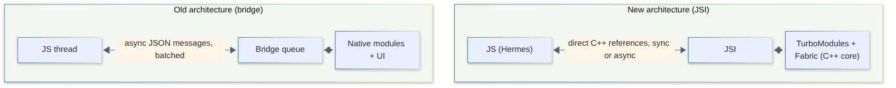
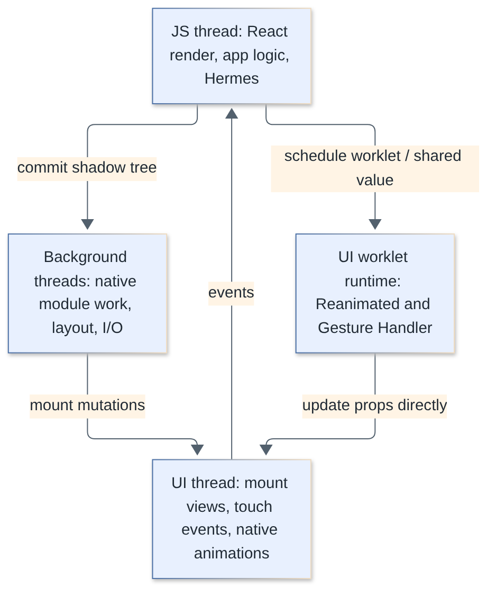
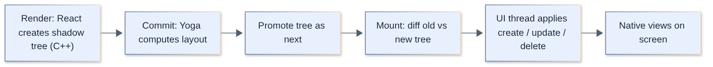
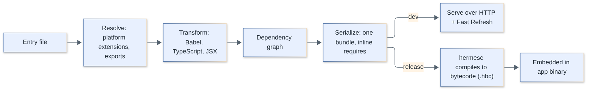
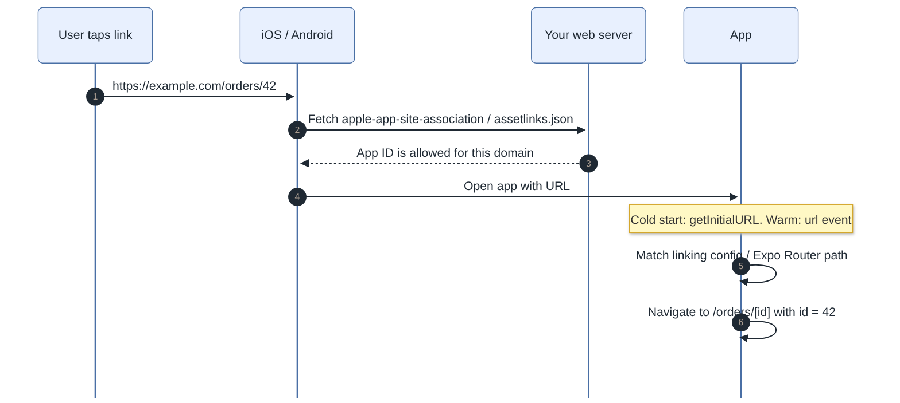
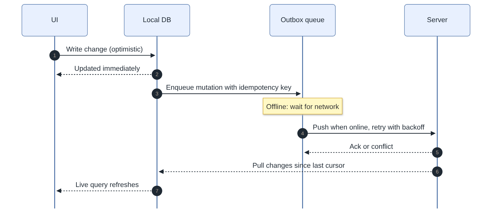
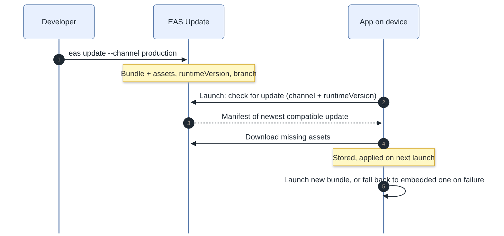
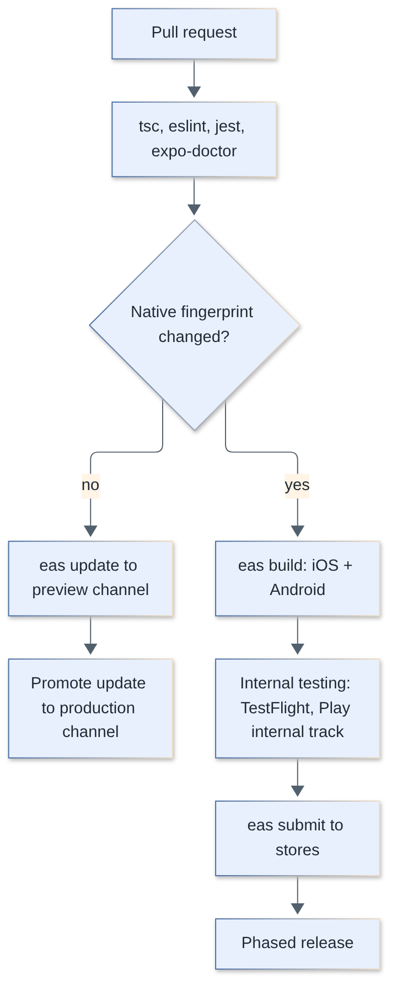

# React Native Interview Questions

Questions and complete answers on React Native for fullstack engineers: fundamentals, the New Architecture (JSI, Fabric, TurboModules, Codegen, Hermes), navigation, state and storage, performance, native modules, testing, release and security. Code examples use TypeScript, current React Native (New Architecture only) with the current Expo SDK, Expo Router, Reanimated, TanStack Query, plus Kotlin, Swift and Objective-C for native code.

**Levels:** `🟢 Junior` · `🟡 Middle` · `🔴 Senior`

## Table of contents


**Fundamentals**

1. [What is React Native and how is it different from a WebView-based hybrid app?](#1-what-is-react-native-and-how-is-it-different-from-a-webview-based-hybrid-app)
2. [How is React Native different from React for the web?](#2-how-is-react-native-different-from-react-for-the-web)
3. [Which core components does React Native provide and what do they map to?](#3-which-core-components-does-react-native-provide-and-what-do-they-map-to)
4. [How does styling work in React Native and how does Flexbox differ from the web?](#4-how-does-styling-work-in-react-native-and-how-does-flexbox-differ-from-the-web)
5. [How do you write platform-specific code?](#5-how-do-you-write-platform-specific-code)
6. [FlatList vs ScrollView vs SectionList: when do you use which?](#6-flatlist-vs-scrollview-vs-sectionlist-when-do-you-use-which)
7. [Expo vs bare React Native CLI: which should you choose in 2026?](#7-expo-vs-bare-react-native-cli-which-should-you-choose-in-2026)
8. [How do you debug a React Native app?](#8-how-do-you-debug-a-react-native-app)

**Architecture and Internals**

9. [What was wrong with the old bridge architecture and what changed in the New Architecture?](#9-what-was-wrong-with-the-old-bridge-architecture-and-what-changed-in-the-new-architecture)
10. [What are JSI, Fabric, TurboModules and Codegen?](#10-what-are-jsi-fabric-turbomodules-and-codegen)
11. [What threads does a React Native app use and how do they interact?](#11-what-threads-does-a-react-native-app-use-and-how-do-they-interact)
12. [How does the Fabric render pipeline work: render, commit and mount?](#12-how-does-the-fabric-render-pipeline-work-render-commit-and-mount)
13. [What is Hermes and why is it the default engine?](#13-what-is-hermes-and-why-is-it-the-default-engine)
14. [What does the Metro bundler do?](#14-what-does-the-metro-bundler-do)
15. [How does Yoga compute layout?](#15-how-does-yoga-compute-layout)

**Navigation**

16. [React Navigation vs Expo Router: how do they differ and how do you build an auth flow?](#16-react-navigation-vs-expo-router-how-do-they-differ-and-how-do-you-build-an-auth-flow)
17. [How do deep links, universal links and app links work?](#17-how-do-deep-links-universal-links-and-app-links-work)

**State, Data and Storage**

18. [How do you manage state in a React Native app?](#18-how-do-you-manage-state-in-a-react-native-app)
19. [AsyncStorage vs MMKV vs SecureStore vs SQLite: how do you choose a storage option?](#19-asyncstorage-vs-mmkv-vs-securestore-vs-sqlite-how-do-you-choose-a-storage-option)
20. [How do you use TanStack Query in React Native?](#20-how-do-you-use-tanstack-query-in-react-native)
21. [How do you design an offline-first React Native app?](#21-how-do-you-design-an-offline-first-react-native-app)

**Performance**

22. [How do you tune FlatList performance?](#22-how-do-you-tune-flatlist-performance)
23. [FlashList vs FlatList: what is the difference and when should you switch?](#23-flashlist-vs-flatlist-what-is-the-difference-and-when-should-you-switch)
24. [How do you find and prevent unnecessary re-renders?](#24-how-do-you-find-and-prevent-unnecessary-re-renders)
25. [How does Reanimated run animations on the UI thread with worklets?](#25-how-does-reanimated-run-animations-on-the-ui-thread-with-worklets)
26. [How does React Native Gesture Handler work and why use it instead of the built-in responder system?](#26-how-does-react-native-gesture-handler-work-and-why-use-it-instead-of-the-built-in-responder-system)
27. [How do you improve app startup time?](#27-how-do-you-improve-app-startup-time)
28. [How do you handle images efficiently in React Native?](#28-how-do-you-handle-images-efficiently-in-react-native)
29. [How do you profile and diagnose performance problems in a React Native app?](#29-how-do-you-profile-and-diagnose-performance-problems-in-a-react-native-app)

**Native Modules and Platform**

30. [How do you write a Turbo Native Module?](#30-how-do-you-write-a-turbo-native-module)
31. [What is the Expo Modules API and when do you use it instead of a Turbo Native Module?](#31-what-is-the-expo-modules-api-and-when-do-you-use-it-instead-of-a-turbo-native-module)
32. [What are config plugins, prebuild and Continuous Native Generation?](#32-what-are-config-plugins-prebuild-and-continuous-native-generation)
33. [How do runtime permissions work on iOS and Android and how do you handle them well?](#33-how-do-runtime-permissions-work-on-ios-and-android-and-how-do-you-handle-them-well)
34. [How do push notifications work in React Native?](#34-how-do-push-notifications-work-in-react-native)
35. [How do you run work in the background in React Native?](#35-how-do-you-run-work-in-the-background-in-react-native)

**Testing, Release and Operations**

36. [How do you unit and component test a React Native app with Jest and React Native Testing Library?](#36-how-do-you-unit-and-component-test-a-react-native-app-with-jest-and-react-native-testing-library)
37. [Detox vs Maestro vs Appium: how do you do end-to-end testing for React Native?](#37-detox-vs-maestro-vs-appium-how-do-you-do-end-to-end-testing-for-react-native)
38. [How do over-the-air updates work with EAS Update and what do store rules allow?](#38-how-do-over-the-air-updates-work-with-eas-update-and-what-do-store-rules-allow)
39. [How does code signing work for iOS and Android releases?](#39-how-does-code-signing-work-for-ios-and-android-releases)
40. [How do you set up CI/CD for React Native builds and releases?](#40-how-do-you-set-up-cicd-for-react-native-builds-and-releases)
41. [How do you set up crash reporting and error monitoring?](#41-how-do-you-set-up-crash-reporting-and-error-monitoring)
42. [How do you reduce the size of a React Native app?](#42-how-do-you-reduce-the-size-of-a-react-native-app)
43. [How do you handle app versioning, forced updates and React Native or Expo SDK upgrades?](#43-how-do-you-handle-app-versioning-forced-updates-and-react-native-or-expo-sdk-upgrades)

**Security**

44. [How do you store tokens and secrets securely in a React Native app?](#44-how-do-you-store-tokens-and-secrets-securely-in-a-react-native-app)
45. [How do you harden a React Native app: certificate pinning, root detection and obfuscation?](#45-how-do-you-harden-a-react-native-app-certificate-pinning-root-detection-and-obfuscation)

## Fundamentals

### 1. What is React Native and how is it different from a WebView-based hybrid app?

`🟢 Junior` · `#fundamentals`

React Native lets you build iOS and Android apps in JavaScript/TypeScript with React, rendering **real native views** (`UIView`, `android.view.View`), not HTML in a WebView. Your JS runs in an embedded engine (Hermes) and describes the UI; the framework turns it into native widgets.

| Approach | UI is rendered by | Logic runs in | Examples |
|---|---|---|---|
| Native | Platform widgets | Swift/Kotlin | UIKit/SwiftUI, Jetpack Compose |
| **React Native** | Platform widgets (created from JS description) | JS engine (Hermes) | RN, Expo |
| WebView hybrid | Browser engine (HTML/CSS) | JS in WebView | Cordova, Ionic/Capacitor |
| Own renderer | Framework draws every pixel (Skia/Impeller) | Dart | Flutter |

Consequences: native look, accessibility and gestures come "for free" because the controls are the platform's own; you can drop to native code when needed; but you depend on a JS-to-native boundary, so performance work focuses on keeping the JS thread free and the boundary cheap. The slogan is "learn once, write anywhere" rather than "write once, run anywhere": share most logic, but expect platform-specific polish.

> **Follow-up:** "Is the JavaScript compiled to native code?" No. JS is compiled to Hermes bytecode at build time and interpreted by Hermes at runtime; only the UI primitives are native.

[↑ Back to top](#table-of-contents)

---

### 2. How is React Native different from React for the web?

`🟢 Junior` · `#fundamentals` `#react`

Same React (components, hooks, state, effects, React 19 features such as `use`, Actions and `useOptimistic`), different **host components** and platform. There is no DOM, no CSS files, no `window`/`document`, and no URL-based navigation out of the box.

| Concern | React (web) | React Native |
|---|---|---|
| Primitives | `div`, `span`, `img`, `input` | `View`, `Text`, `Image`, `TextInput` |
| Events | `onClick`, `onChange` | `onPress`, `onChangeText` |
| Styling | CSS, classes, cascade | JS style objects, no cascade, Flexbox only |
| Text | Anywhere in the DOM | Only inside `<Text>` |
| Navigation | URLs, browser history | Navigator stack (React Navigation / Expo Router) |
| Storage | `localStorage`, cookies | AsyncStorage, MMKV, SecureStore |
| Bundler | webpack / Vite | Metro |
| Server Components | Yes (Next.js) | Not in production use; experimental in Expo Router |

You can share business logic, hooks, types and API clients between web and mobile (monorepo), and even UI via `react-native-web` or Expo's universal support, but a design that is great on the web rarely transfers one-to-one to touch screens.

```tsx
// Web
<div onClick={save} className="btn">Save</div>

// React Native
<Pressable onPress={save} style={styles.btn}>
  <Text>Save</Text>
</Pressable>
```

> **Follow-up:** "What stays identical?" The component model, hooks rules, reconciliation, context, Suspense and the whole non-DOM ecosystem (TanStack Query, Zustand, zod).

[↑ Back to top](#table-of-contents)

---

### 3. Which core components does React Native provide and what do they map to?

`🟢 Junior` · `#fundamentals` `#components`

Core components are thin wrappers over native views. The ones to know: `View` (container), `Text`, `Image`, `ScrollView`, `FlatList`/`SectionList`, `TextInput`, `Pressable`, `Switch`, `ActivityIndicator`, `Modal`, `KeyboardAvoidingView`, `StatusBar`.

| Component | iOS | Android |
|---|---|---|
| `View` | `UIView` | `ViewGroup` |
| `Text` | Text layout view | `TextView` |
| `Image` | `UIImageView` | `ImageView` |
| `ScrollView` | `UIScrollView` | `ScrollView` / `HorizontalScrollView` |
| `TextInput` | `UITextField` / `UITextView` | `EditText` |

Rules and gotchas:

- All text must be inside `<Text>`; a bare string in a `View` throws.
- Use `Pressable` for custom touchables; `TouchableOpacity` and friends are legacy. The built-in `Button` is intentionally minimal.
- The core `SafeAreaView` is deprecated (0.81); use `react-native-safe-area-context`.
- Accessibility is on you: set `accessibilityRole`, `accessibilityLabel`, and hit areas of at least 44x44 pt (`hitSlop` helps).

```tsx
import { View, Text, Pressable, StyleSheet } from 'react-native';

export function Counter({ count, onInc }: { count: number; onInc: () => void }) {
  return (
    <View style={styles.row}>
      <Text accessibilityRole="header">Count: {count}</Text>
      <Pressable onPress={onInc} accessibilityRole="button" hitSlop={8}>
        <Text>+1</Text>
      </Pressable>
    </View>
  );
}

const styles = StyleSheet.create({ row: { flexDirection: 'row', gap: 12 } });
```

> **Follow-up:** "Why not use `div`?" There is no DOM; the renderer only knows registered host components, so unknown tags have nothing to map to.

[↑ Back to top](#table-of-contents)

---

### 4. How does styling work in React Native and how does Flexbox differ from the web?

`🟢 Junior` · `#styling` `#layout`

Styles are plain JS objects (usually via `StyleSheet.create`) passed to the `style` prop, and layout is done with Flexbox (implemented by the Yoga engine). There is no cascade, no selectors, and no inheritance except for `Text` nested in `Text`.

Differences from CSS Flexbox:

| Property | Web default | React Native default |
|---|---|---|
| `flexDirection` | `row` | **`column`** |
| `alignContent` | `stretch` | `flex-start` |
| `flexShrink` | `1` | `0` |
| `position` | `static` | `relative` (and `absolute`; no `fixed`/`sticky`) |
| `box-sizing` | `content-box` | border-box-like |
| Units | px, em, rem, % | unitless density-independent points, `%` strings |

Other points:

- Shadows differ per platform: iOS uses `shadowColor/Offset/Opacity/Radius`, Android uses `elevation`. On the New Architecture the cross-platform `boxShadow` style is available.
- `gap`, `rowGap` and `columnGap` are supported. `flex: 1` means "fill the available space".
- Use `useWindowDimensions` and `useColorScheme` instead of media queries.
- Libraries: NativeWind (Tailwind classes), Unistyles, Tamagui, Restyle.

```tsx
const styles = StyleSheet.create({
  screen: { flex: 1, justifyContent: 'center', alignItems: 'center' },
  card: {
    padding: 16,
    borderRadius: 12,
    backgroundColor: 'white',
    boxShadow: '0 2px 8px rgba(0,0,0,0.15)', // New Architecture
  },
});
```

> **Follow-up:** "Why does my row layout appear stacked?" You forgot `flexDirection: 'row'`; the default is column.

[↑ Back to top](#table-of-contents)

---

### 5. How do you write platform-specific code?

`🟢 Junior` · `#platform`

Three tools: the `Platform` API for small branches, platform file extensions for whole files, and native code for real divergence.

```tsx
import { Platform, StyleSheet } from 'react-native';

const styles = StyleSheet.create({
  header: {
    paddingTop: Platform.OS === 'ios' ? 44 : 0,
    ...Platform.select({
      ios: { shadowOpacity: 0.2 },
      android: { elevation: 4 },
      default: {}, // web
    }),
  },
});

if (Platform.OS === 'android' && Number(Platform.Version) >= 33) {
  // Android 13+ only (Version is an API level number on Android, a string on iOS)
}
```

File extensions are resolved by Metro:

```
Button.tsx          // fallback
Button.ios.tsx      // iOS only
Button.android.tsx  // Android only
Button.native.tsx   // iOS + Android (not web)
Button.web.tsx      // web (Expo / react-native-web)
```

Import it as `import { Button } from './Button'` and the right file is picked at bundle time, so the other platform's code is not even in the bundle. Prefer extensions when the branches are large; prefer `Platform.select` for a few values. Keep a shared TypeScript interface so both files stay in sync.

> **Follow-up:** "Where does `Platform.OS === 'web'` come from?" From `react-native-web`/Expo; plain RN CLI projects only target ios and android.

[↑ Back to top](#table-of-contents)

---

### 6. FlatList vs ScrollView vs SectionList: when do you use which?

`🟢 Junior` · `#lists` `#performance`

`ScrollView` renders **all** children at once, so use it only for short, bounded content. `FlatList` is virtualized: it renders only items near the viewport and unmounts far-away rows to save memory, so use it for long or unbounded lists. `SectionList` is `FlatList` with sections and sticky headers.

```tsx
import { FlatList, Text } from 'react-native';

type User = { id: string; name: string };

export function Users({ data }: { data: User[] }) {
  return (
    <FlatList
      data={data}
      keyExtractor={(u) => u.id}
      renderItem={({ item }) => <Text>{item.name}</Text>}
      ListEmptyComponent={<Text>No users</Text>}
      onEndReached={() => { /* load next page */ }}
      onEndReachedThreshold={0.5}
    />
  );
}
```

Rules of thumb:

- Never `.map()` a long array inside a `ScrollView`: it mounts every row, spikes memory and delays first render.
- Never nest a vertical `FlatList` in a vertical `ScrollView` (it disables virtualization and warns). Use `ListHeaderComponent`/`ListFooterComponent` instead.
- Always provide a stable `keyExtractor` (not the array index when order changes).
- For very large or complex lists consider FlashList (see the performance section).

> **Follow-up:** "Pull to refresh?" `refreshing` + `onRefresh` props on the list.

[↑ Back to top](#table-of-contents)

---

### 7. Expo vs bare React Native CLI: which should you choose in 2026?

`🟢 Junior` · `#expo` `#tooling`

Start with **Expo**. The React Native team itself recommends using a framework, and Expo is the one most teams use. Expo is not "limited": with development builds and prebuild you can use any native library and write your own native code.

| | Expo (managed / CNG) | Community CLI (bare) |
|---|---|---|
| Native folders | Generated from config (`npx expo prebuild`), can be gitignored | Hand-maintained `ios/` and `android/` |
| Routing | Expo Router built in | You pick (React Navigation) |
| Builds | EAS Build in the cloud or local | Xcode / Gradle yourself |
| OTA | EAS Update | Self-hosted or none |
| Upgrades | Bump SDK + `npx expo install --fix` | Diff native templates by hand (Upgrade Helper) |
| Native libs | Any, via dev client + config plugins | Any |

Expo Go (the sandbox app) is only for quick prototypes; real apps use a **development build** (`expo-dev-client`) that contains your native dependencies. You can adopt Expo in an existing bare app incrementally (`npx install-expo-modules`).

Pick bare only if you have a heavy brownfield setup (RN embedded in an existing native app) or build tooling that cannot be expressed as config plugins; even then you can still use Expo modules and EAS.

> **Follow-up:** "What is CNG?" Continuous Native Generation: `ios/` and `android/` are build artifacts regenerated from `app.json` and config plugins, so upgrades are re-generation rather than merges.

[↑ Back to top](#table-of-contents)

---

### 8. How do you debug a React Native app?

`🟢 Junior` · `#debugging` `#tooling`

Use **React Native DevTools** (open with `j` in the Metro terminal or from the dev menu): it is a Chrome-DevTools-based frontend connected to Hermes, with Console, Sources (breakpoints), Components and Profiler tabs. It replaced the old remote-JS debugger, and Flipper is no longer supported.

Toolbox:

- **Dev menu**: shake the device, `Cmd+D` (iOS simulator), `Cmd+M` / `Ctrl+M` (Android emulator). Enables Fast Refresh, element inspector and perf monitor.
- **Fast Refresh**: preserves component state across edits; it resets when you edit a file that exports non-components.
- **LogBox**: in-app warnings and errors; errors in a release build are not shown, so wire up crash reporting.
- **Native logs**: Xcode console, `adb logcat`, Android Studio Logcat for crashes in native code. `console.log` output appears in DevTools, not the Metro terminal (log forwarding was removed in 0.77).
- **Network**: DevTools Network panel in recent versions, or Proxyman/Charles/Reactotron.
- **Release-only bugs**: reproduce with a release build (`npx expo run:ios --configuration Release`, `npx expo run:android --variant release`) and symbolicate with source maps.

```bash
npx expo start            # press j to open React Native DevTools
adb logcat *:E ReactNative:V ReactNativeJS:V
```

> **Follow-up:** "Why is my app slow in dev?" Dev mode runs unminified bundles with extra checks. Always measure performance in a release build.

[↑ Back to top](#table-of-contents)

---

## Architecture and Internals

### 9. What was wrong with the old bridge architecture and what changed in the New Architecture?

`🟡 Middle` · `#architecture` `#new-architecture`

The old architecture communicated between JS and native through an **asynchronous, batched, JSON-serialized bridge**. The New Architecture (default since 0.76, and the only option since 0.82) replaces it with **JSI**, direct synchronous-capable calls between JS and C++/native, plus Fabric (renderer), TurboModules (native modules) and Codegen (typed interfaces).



Problems of the bridge:

- **Serialization cost**: every argument and result became JSON, which is slow for large payloads.
- **Async only**: JS could not read a native value or layout synchronously, which caused flicker (measure, then re-render) and made gesture-driven UI laggy.
- **Eager module loading**: all native modules initialized at startup even if unused.
- **No type safety** at the boundary: wrong argument types crashed at runtime.
- **Congestion**: one queue shared by UI updates, events and module calls.

| | Old | New |
|---|---|---|
| JS/native link | Bridge (JSON, async) | JSI (C++ references) |
| Native modules | `NativeModules`, eager | TurboModules, lazy, sync or async |
| Renderer | Paper | Fabric, C++ shadow tree |
| Types | None | Codegen from TS/Flow specs |
| Concurrent React | No | Yes (Suspense, transitions) |

Libraries written for the old API mostly kept working through an **interop layer** during the migration. Since 0.82 the legacy runtime cannot be enabled, and each later release removes more legacy classes, so replace unmaintained libraries; check the React Native Directory for New Architecture support.

> **Follow-up:** "What is bridgeless mode?" The bridge object is removed completely; all JS-native communication goes through JSI. It is part of the default New Architecture runtime.

[↑ Back to top](#table-of-contents)

---

### 10. What are JSI, Fabric, TurboModules and Codegen?

`🟡 Middle` · `#architecture` `#new-architecture`

Four pieces of the New Architecture that build on each other.

- **JSI (JavaScript Interface)**: a C++ API that lets the JS engine hold references to C++ objects (`HostObject`s) and call C++ functions directly, with no serialization. It is engine-agnostic (Hermes by default).
- **Fabric**: the new rendering system. React's tree is mirrored in an immutable C++ shadow tree shared by all platforms; it enables synchronous layout reads, concurrent rendering and prioritized events.
- **TurboModules**: native modules exposed over JSI. They load **lazily** on first use, can expose sync methods, and use typed interfaces.
- **Codegen**: generates the C++/ObjC++/Java glue and base classes from a TypeScript (or Flow) spec at build time, so the JS-native contract is checked by the compiler.

```ts
// specs/NativeDeviceInfo.ts: the single source of truth
import type { TurboModule } from 'react-native';
import { TurboModuleRegistry } from 'react-native';

export interface Spec extends TurboModule {
  getModel(): string;                       // synchronous
  getFreeDiskBytes(): Promise<number>;      // asynchronous
}
export default TurboModuleRegistry.getEnforcing<Spec>('NativeDeviceInfo');
```

Codegen reads this, emits an abstract Kotlin class and an Objective-C++ protocol; you implement them natively. A mismatch between the spec and the implementation becomes a build error instead of a production crash.

Pitfall: synchronous methods block the calling thread (the JS thread), so use them only for fast, in-memory reads.

> **Follow-up:** "Are Fabric components also generated?" Yes, `codegenNativeComponent` specs generate view props, events and commands for native views.

[↑ Back to top](#table-of-contents)

---

### 11. What threads does a React Native app use and how do they interact?

`🟡 Middle` · `#architecture` `#threading`

Three kinds of threads matter: the **JS thread** (React, your app logic, Hermes), the **UI (main) thread** (native views, touch handling, mounting), and **background threads** (native module work, layout, I/O). Reanimated and Gesture Handler add a **UI worklet runtime** on the UI thread.



| Thread | Does | Symptom when blocked |
|---|---|---|
| JS | Render, state updates, business logic, JS timers, network callbacks | Taps feel delayed, JS-driven animations stutter, but native scrolling stays smooth |
| UI | Create/update native views, draw, gestures | Whole app freezes, scroll jank; ANR on Android after ~5 s |
| Background | Native modules, image decoding, disk, layout (Yoga) | Slow loads, not visible jank |

In the New Architecture the old dedicated "shadow thread" disappeared: render and layout run on whichever thread commits (normally JS, optionally a background thread for transitions), and only the final **mount** step runs on the UI thread. Synchronous layout (`useLayoutEffect` + `measure`) is now possible because JS can read the C++ tree directly.

Practical rules:

- Keep JS work under about 16 ms per frame for a 60 fps target (8 ms at 120 Hz). Move heavy computation to the server, native code or chunk it.
- Run animations and gestures on the UI thread (Reanimated worklets, native driver) so they survive a busy JS thread.
- Never do blocking I/O in a TurboModule's synchronous method.

> **Follow-up:** "How do you detect which thread is the bottleneck?" The Perf Monitor shows separate JS and UI fps; a low JS fps with a healthy UI fps means JS is the bottleneck.

[↑ Back to top](#table-of-contents)

---

### 12. How does the Fabric render pipeline work: render, commit and mount?

`🔴 Senior` · `#architecture` `#fabric`

Fabric renders in three phases: **render** (React produces immutable shadow nodes in C++), **commit** (layout is computed with Yoga and the new tree is promoted), and **mount** (the tree is diffed against the previous one and the resulting mutations are applied to native views on the UI thread).



1. **Render**: React executes components; the reconciler creates `ShadowNode`s through JSI. Nodes are immutable and structurally shared; updating a node clones it and its ancestors.
2. **Commit**: the root is laid out by Yoga, then the tree is promoted as the "next" tree. Commit hooks (e.g. Reanimated) can intervene here. Layout and commit may run off the UI thread.
3. **Mount**: the differ computes a minimal list of mutations (create, insert, remove, update props or layout) and the platform mounting layer executes them on the UI thread, in one batch to avoid tearing.

Why it matters:

- **Synchronous reads**: `measure`/`useLayoutEffect` can see layout before first paint, removing the "render, then measure, then re-render" flicker.
- **Concurrent React**: render phases can be interrupted or prioritized (transitions, Suspense, `useDeferredValue`) because the tree is immutable and committed atomically. React 19 features rely on this.
- **View flattening**: layout-only views (a `View` with only layout props) are removed from the native hierarchy, reducing native view count.
- **Event priority**: discrete events (taps) get higher priority than continuous ones (scroll).

> **Follow-up:** "What is the cost?" Deep trees still cost on every commit, so avoid unnecessary re-renders and giant component trees; Fabric makes the pipeline correct and flexible, not free.

[↑ Back to top](#table-of-contents)

---

### 13. What is Hermes and why is it the default engine?

`🔴 Senior` · `#hermes` `#performance`

Hermes is Meta's JavaScript engine built specifically for React Native on mobile. Its key idea is **ahead-of-time bytecode compilation**: JS is compiled to bytecode during the app build, so at launch the engine memory-maps precompiled bytecode instead of parsing and compiling source.

Benefits:

- **Faster startup (TTI)** and lower memory, which matters on low-end Android devices.
- **Smaller footprint** than JavaScriptCore-based setups, and a compact bytecode bundle on disk.
- **Hades GC**: concurrent generational garbage collector, fewer long pauses.
- First-class tooling: Chrome DevTools protocol debugging, sampling profiler, heap snapshots, source maps. It is also what React Native DevTools talks to.

Trade-offs:

- **No JIT**: peak CPU throughput for tight compute loops is lower than a JIT engine; offload heavy compute to native code, a worklet, or the server.
- Bytecode is **not encryption**; it can be disassembled (see security).
- Some rarely used language/Intl features historically lagged; check support for new syntax or `Intl` APIs before relying on them.
- **Hermes V1**, the next engine generation (opt-in in 0.82), became the default in 0.84. It brings further performance gains; on older versions you opt in per platform, and it is incompatible with precompiled iOS React Native builds there.

```bash
# Release builds run hermesc automatically (Gradle / Xcode build phase).
# Manual inspection of a bundle:
npx react-native bundle --platform android --dev false \
  --entry-file index.js --bundle-output out.bundle
node_modules/react-native/sdks/hermesc/linux64-bin/hermesc -emit-binary -out out.hbc out.bundle
```

> **Follow-up:** "Can I still use JSC?" It was moved out of core into a community package; nearly all new work (DevTools, Reanimated, perf) assumes Hermes.

[↑ Back to top](#table-of-contents)

---

### 14. What does the Metro bundler do?

`🟢 Junior` · `#metro` `#tooling`

Metro is React Native's JavaScript bundler. It resolves your imports, transforms code (JSX, TypeScript, Flow) with Babel, builds a dependency graph, and serializes it into a single bundle. In development it serves that bundle over HTTP and pushes updates for Fast Refresh; in release builds the bundle is compiled to Hermes bytecode and embedded in the app.



Key points:

- **Resolution** understands platform extensions (`.ios.ts`, `.android.ts`, `.native.ts`), `package.json` `exports`, symlinks and monorepos, and assets (images, fonts).
- **Transform** is cached and runs in parallel workers; clear it with `npx expo start -c` (or `--reset-cache`) when config or Babel changes look ignored.
- **Inline requires** (`inlineRequires: true`) defer `require()` until first use, improving startup.
- **Single bundle**: no browser-style code splitting by default; Expo supports async routes and experimental tree shaking.
- Customize in `metro.config.js`, for example extra file extensions or monorepo `watchFolders`.

```js
// metro.config.js (Expo)
const { getDefaultConfig } = require('expo/metro-config');

const config = getDefaultConfig(__dirname);
config.resolver.sourceExts.push('sql');      // allow importing .sql files
config.transformer.getTransformOptions = async () => ({
  transform: { inlineRequires: true },
});
module.exports = config;
```

> **Follow-up:** "Why `Unable to resolve module` after installing a package?" Stale cache or missing native rebuild; restart with `-c`, and rebuild if the package has native code.

[↑ Back to top](#table-of-contents)

---

### 15. How does Yoga compute layout?

`🔴 Senior` · `#architecture` `#layout`

Yoga is a cross-platform C++ Flexbox layout engine used by React Native (and others). Each shadow node holds a Yoga node; during commit, Yoga walks the tree, resolves sizes and positions in density-independent units, and writes the frame back to the shadow node. Native views then just receive final frames.

How it behaves:

- It implements a **subset of CSS Flexbox** with RN-specific defaults (column direction, `flexShrink: 0`), plus `gap`, `aspectRatio`, `position: absolute`, and `display: none | flex | contents`.
- It **caches measurements**: unchanged subtrees reuse results, so dirtying one node re-lays out only its path and affected siblings.
- **Text and images are leaf measure functions**: Yoga calls back into native text measurement to get intrinsic size, which is the most expensive part of layout.
- **Rounding** to physical pixels happens after layout to avoid hairline gaps.

Performance implications:

- Deep nesting multiplies work; prefer flat structures and let view flattening remove wrappers.
- Changing layout props every frame (animating `width`/`height`/`margin`) triggers layout on each frame; animate `transform` and `opacity` instead, which skip Yoga.
- Percent widths and `flexWrap` with measured text are costlier than fixed sizes.

```tsx
// Layout work every frame: re-runs Yoga
const w = useSharedValue(100);
const bad = useAnimatedStyle(() => ({ width: withTiming(w.value) }));

// Cheap: no layout pass
const s = useSharedValue(1);
const good = useAnimatedStyle(() => ({ transform: [{ scaleX: withTiming(s.value) }] }));
```

> **Follow-up:** "Why does the layout differ from the web for the same flex props?" Different defaults (column, no shrink, no `content-box`, `alignContent`) and no CSS grid, floats, or `calc()`.

[↑ Back to top](#table-of-contents)

---

## Navigation

### 16. React Navigation vs Expo Router: how do they differ and how do you build an auth flow?

`🟡 Middle` · `#navigation` `#expo-router`

**React Navigation** is the underlying navigation library: you declare navigators (stack, tabs, drawer) in code, either with the static API (`createStaticNavigation`) or the dynamic component API. **Expo Router** is a file-based router built on top of React Navigation: files in `app/` become routes, so you get deep linking, typed routes and web URLs automatically.

| | React Navigation | Expo Router |
|---|---|---|
| Route definition | Code (static or dynamic config) | File system (`app/orders/[id].tsx`) |
| Deep links | Manual `linking` config (static API can infer paths) | Automatic from file paths |
| Typed routes | Via static API / manual types | Generated (`experiments.typedRoutes`) |
| Web / SSR / API routes | Manual | Built in |
| Underlying engine | Itself | React Navigation (re-exported by `expo-router` in recent SDKs) |
| Good for | Existing apps, full control | New Expo apps (default template) |

```
app/
├── _layout.tsx          # root Stack, providers
├── (auth)/sign-in.tsx   # group: no URL segment
├── (app)/
│   ├── _layout.tsx      # Tabs
│   ├── index.tsx        # /
│   └── orders/[id].tsx  # /orders/42
└── +not-found.tsx
```

**Auth flow**: do not conditionally navigate imperatively; render different screen sets based on session state so the unauthenticated screens do not exist in the tree.

```tsx
// app/_layout.tsx (Expo Router, protected routes)
import { Stack } from 'expo-router';
import { useSession } from '@/auth';

export default function RootLayout() {
  const { session, isLoading } = useSession();
  if (isLoading) return null; // keep splash screen visible

  return (
    <Stack screenOptions={{ headerShown: false }}>
      <Stack.Protected guard={!!session}>
        <Stack.Screen name="(app)" />
      </Stack.Protected>
      <Stack.Protected guard={!session}>
        <Stack.Screen name="(auth)/sign-in" />
      </Stack.Protected>
    </Stack>
  );
}
```

When `session` changes, the guarded screens are removed and the user is redirected automatically; deep links into protected routes fall back to the first allowed screen. The same idea exists in React Navigation (`Stack.Protected`, or `if` in the static config).

Version note: keep Expo Router and React Navigation versions in sync via `npx expo install`. Recent Expo SDKs bundle the navigators in `expo-router` and re-export React Navigation APIs (for example `expo-router/react-navigation`), so check the migration guide for your SDK before importing `@react-navigation/*` directly in an Expo Router app.

> **Follow-up:** "Native stack or JS stack?" Prefer the native stack (used by Expo Router's `Stack`): it uses `UINavigationController`/Fragments for native transitions and gestures.

[↑ Back to top](#table-of-contents)

---

### 17. How do deep links, universal links and app links work?

`🟡 Middle` · `#navigation` `#deep-linking`

A deep link opens the app at a specific screen from a URL. **Custom schemes** (`myapp://orders/42`) are easy but unverified: any app can claim them. **Universal Links** (iOS) and **App Links** (Android) use normal `https://` URLs and the OS verifies that your domain authorizes your app, so they are secure and fall back to the website when the app is not installed.



Setup checklist:

1. **iOS**: host `https://example.com/.well-known/apple-app-site-association` (JSON, no redirects, `application/json`) and add the Associated Domains entitlement `applinks:example.com`.
2. **Android**: host `https://example.com/.well-known/assetlinks.json` with your package name and signing certificate SHA-256, and add an intent filter with `android:autoVerify="true"`.
3. **App**: map URLs to screens.

```json
// app.json (Expo): config plugins write the entitlement and intent filters
{
  "expo": {
    "scheme": "myapp",
    "ios": { "associatedDomains": ["applinks:example.com"] },
    "android": {
      "intentFilters": [{
        "action": "VIEW",
        "autoVerify": true,
        "data": [{ "scheme": "https", "host": "example.com", "pathPrefix": "/orders" }],
        "category": ["BROWSABLE", "DEFAULT"]
      }]
    }
  }
}
```

```tsx
// React Navigation: explicit linking config
const linking = {
  prefixes: ['https://example.com', 'myapp://'],
  config: { screens: { Order: 'orders/:id' } },
};
// <NavigationContainer linking={linking}> ... </NavigationContainer>
```

Expo Router derives all of this from the file tree. Gotchas: cold start delivers the URL via `Linking.getInitialURL()`, warm start via the `url` event (routers handle both); the AASA file is cached by Apple's CDN so changes are slow to propagate; dev builds and release builds have different signing SHA-256 on Android; treat URL params as untrusted input (validate IDs, never run actions like "transfer" directly from a link).

> **Follow-up:** "Deferred deep linking?" The link must survive an install; that needs a service (Branch, AppsFlyer) or the Play Install Referrer, plain universal links do not do it.

[↑ Back to top](#table-of-contents)

---

## State, Data and Storage

### 18. How do you manage state in a React Native app?

`🟢 Junior` · `#state`

Split state by kind and use the simplest tool for each. Most "global state" problems disappear when **server state** is moved to a data-fetching library.

| State kind | Tool |
|---|---|
| Local UI (input, toggle) | `useState`, `useReducer` |
| Rarely changing shared values (theme, auth user) | React Context |
| Client app state shared widely | Zustand, Jotai, Redux Toolkit |
| Server state (API data, caching, refetch) | TanStack Query (or RTK Query, SWR) |
| Form state | React Hook Form + zod |
| Navigation state | Router (do not duplicate it in a store) |
| Persisted settings | Store + persistence (MMKV / AsyncStorage) |

Context re-renders **every consumer** on any value change, so keep it for low-frequency data or split contexts. Store libraries with selectors re-render only components whose selected slice changed.

```tsx
import { create } from 'zustand';
import { persist, createJSONStorage } from 'zustand/middleware';
import { MMKV } from 'react-native-mmkv';

const mmkv = new MMKV();
const storage = {
  getItem: (k: string) => mmkv.getString(k) ?? null,
  setItem: (k: string, v: string) => mmkv.set(k, v),
  removeItem: (k: string) => mmkv.delete(k),
};

export const useSettings = create<{ dark: boolean; toggle: () => void }>()(
  persist((set) => ({ dark: false, toggle: () => set((s) => ({ dark: !s.dark })) }), {
    name: 'settings',
    storage: createJSONStorage(() => storage),
  }),
);

// Re-renders only when `dark` changes
const dark = useSettings((s) => s.dark);
```

Note: the MMKV constructor shown (`new MMKV()`) is the v3 API; newer major versions of `react-native-mmkv` (built on Nitro Modules) use a factory such as `createMMKV()`, so check the README for the version you install.

> **Follow-up:** "Redux still relevant?" Yes for large teams that want strict structure, devtools and middleware; Redux Toolkit removes most boilerplate.

[↑ Back to top](#table-of-contents)

---

### 19. AsyncStorage vs MMKV vs SecureStore vs SQLite: how do you choose a storage option?

`🟡 Middle` · `#storage` `#security`

Choose by data shape and sensitivity: **SecureStore/Keychain** for secrets, **MMKV** for fast key-value settings and caches, **AsyncStorage** for simple legacy-compatible key-value, **SQLite** for relational or large queryable data.

| | AsyncStorage | MMKV | SecureStore / Keychain | SQLite |
|---|---|---|---|---|
| Model | Async string key-value | Sync key-value (memory-mapped) | Small encrypted key-value | Relational, SQL |
| Speed | Slowest (async hop, disk) | Fastest, synchronous via JSI | Slower (crypto/OS call) | Good, indexed queries |
| Encryption | None | Optional (key must be stored somewhere safe) | OS-backed: iOS Keychain, Android Keystore | Optional (SQLCipher) |
| Size | ~6 MB default cap on Android | Large | Small values (iOS warns around 2 KB) | Large |
| Use for | Simple flags, migration compat | Settings, feature flags, query cache | Tokens, refresh tokens, keys | Offline data, lists, search |

Notes:

- AsyncStorage is **unencrypted** plain storage readable on a rooted/jailbroken device or via backups; never put tokens there.
- MMKV's encryption key protects the file, but the key itself must live in SecureStore/Keychain to be meaningful.
- `expo-secure-store` and `react-native-keychain` both wrap Keychain/Keystore; Keychain items can survive app uninstall on iOS, so clear them on first launch if needed.
- For SQL: `expo-sqlite`, `op-sqlite`, or higher-level options like Drizzle ORM over SQLite, WatermelonDB.

```ts
import * as SecureStore from 'expo-secure-store';
import { MMKV } from 'react-native-mmkv';

await SecureStore.setItemAsync('refreshToken', token, {
  keychainAccessible: SecureStore.WHEN_UNLOCKED_THIS_DEVICE_ONLY,
});

const cache = new MMKV({ id: 'cache' });
cache.set('lastSyncAt', Date.now());      // synchronous
const last = cache.getNumber('lastSyncAt');
```

> **Follow-up:** "Why is synchronous storage a big deal?" It lets you read persisted state before the first render (theme, auth gate) with no loading flash.

[↑ Back to top](#table-of-contents)

---

### 20. How do you use TanStack Query in React Native?

`🟡 Middle` · `#data-fetching` `#tanstack-query`

TanStack Query handles server state: caching, deduplication, background refetch, retries and mutations. The same API as on web, but you must wire its **focus** and **online** detection to React Native, because there is no browser `visibilitychange` or `navigator.onLine`.

```tsx
import { AppState, Platform } from 'react-native';
import NetInfo from '@react-native-community/netinfo';
import { focusManager, onlineManager, QueryClient } from '@tanstack/react-query';
import { useFocusEffect } from 'expo-router';
import { useCallback, useRef } from 'react';

// App foreground = window focus
AppState.addEventListener('change', (status) => {
  if (Platform.OS !== 'web') focusManager.setFocused(status === 'active');
});

// Network status = online
onlineManager.setEventListener((setOnline) =>
  NetInfo.addEventListener((s) => setOnline(!!s.isConnected)),
);

export const queryClient = new QueryClient({
  defaultOptions: { queries: { staleTime: 60_000, gcTime: 24 * 60 * 60_000 } },
});

// Refetch when a screen regains focus (stack navigation keeps screens mounted)
export function useRefreshOnFocus(refetch: () => void) {
  const first = useRef(true);
  useFocusEffect(
    useCallback(() => {
      if (first.current) { first.current = false; return; }
      refetch();
    }, [refetch]),
  );
}
```

Mobile-specific points:

- **Persistence**: `persistQueryClient` / `PersistQueryClientProvider` with an MMKV or AsyncStorage persister gives instant cached screens at launch; set `gcTime` at least as long as `maxAge`.
- **Offline**: with `networkMode: 'offlineFirst'` queries serve cache; mutations are paused offline and resumed with `queryClient.resumePausedMutations()` once online.
- **Lists**: `useInfiniteQuery` with `FlatList.onEndReached`.
- **Optimistic updates**: `onMutate` snapshot, `onError` rollback, `onSettled` invalidate.

> **Follow-up:** "`staleTime` vs `gcTime`?" `staleTime` is how long data counts as fresh (no refetch); `gcTime` is how long unused data stays in cache before deletion.

[↑ Back to top](#table-of-contents)

---

### 21. How do you design an offline-first React Native app?

`🔴 Senior` · `#offline` `#architecture` `#sync`

Treat the **local database as the source of truth** and the network as background synchronization. The UI reads and writes only locally; a sync layer reconciles with the server when connectivity allows.



Building blocks:

- **Local store**: SQLite (expo-sqlite, op-sqlite), WatermelonDB, or a sync engine (PowerSync, ElectricSQL, TinyBase). Realm's Device Sync was deprecated by MongoDB, so avoid starting new projects on it.
- **Outbox queue**: persist every mutation as an operation (`{id, type, payload, createdAt}`) and replay it in order with exponential backoff.
- **Idempotency keys**: the client generates a UUID per mutation; the server dedupes retries, so "request succeeded but response was lost" does not create duplicates. Use client-generated IDs (UUIDv7) for new rows.
- **Pull sync**: fetch changes since a cursor/version; apply deltas (tombstones for deletes).
- **Conflict resolution**: last-write-wins with server timestamps (simple, lossy), field-level merge, server-authoritative rejection with client rebase, or CRDTs for collaborative data. Pick per entity; money-like data should be server-authoritative.
- **Connectivity**: NetInfo is a hint, not truth; treat failed requests as the real signal.
- **UX**: show sync state, optimistic updates, and clear failure paths for permanently rejected operations.
- **Schema migrations**: the local DB lives on devices you cannot control; ship versioned, tested migrations and handle old clients with API versioning.

```ts
// Outbox sketch
async function enqueue(op: Omit<Op, 'id'>) {
  const id = crypto.randomUUID();
  await db.insert(outbox).values({ id, ...op, status: 'pending' });
  scheduleSync();
}

async function drain() {
  for (const op of await db.select().from(outbox).orderBy(outbox.createdAt)) {
    const res = await fetch('/api/ops', {
      method: 'POST',
      headers: { 'Idempotency-Key': op.id },
      body: JSON.stringify(op),
    });
    if (res.ok || res.status === 409) await db.delete(outbox).where(eq(outbox.id, op.id));
    else if (res.status >= 500) break; // retry later with backoff
  }
}
```

> **Follow-up:** "Why not just cache GET responses?" Caching gives read-only offline; offline-first also needs durable writes, ordering, and conflict handling.

[↑ Back to top](#table-of-contents)

---

## Performance

### 22. How do you tune FlatList performance?

`🟡 Middle` · `#lists` `#performance`

Make each row cheap to render and cheap to skip: stable keys, memoized items, fixed sizes where possible, and window settings that match your content.

```tsx
import { FlatList } from 'react-native';
import { memo, useCallback } from 'react';

const Row = memo(function Row({ item, onOpen }: { item: Product; onOpen: (id: string) => void }) {
  return <ProductCard product={item} onPress={() => onOpen(item.id)} />;
});

export function Products({ data }: { data: Product[] }) {
  const onOpen = useCallback((id: string) => router.push(`/products/${id}`), []);
  const renderItem = useCallback(({ item }: { item: Product }) => <Row item={item} onOpen={onOpen} />, [onOpen]);

  return (
    <FlatList
      data={data}
      renderItem={renderItem}
      keyExtractor={(p) => p.id}
      getItemLayout={(_, i) => ({ length: 96, offset: 96 * i, index: i })} // only for fixed height
      initialNumToRender={8}
      windowSize={7}
      maxToRenderPerBatch={8}
      removeClippedSubviews
    />
  );
}
```

Checklist:

- **`React.memo` the row** and keep `renderItem`/handlers referentially stable; do not create objects or arrow functions in props that change each render.
- **`keyExtractor`** with a stable ID.
- **`getItemLayout`** for fixed-size rows skips measurement and makes `scrollToIndex` exact.
- **Window tuning**: `windowSize` (default 21 viewports) lower = less memory but more blank areas on fast scroll; `initialNumToRender` (default 10) should cover the first screen only; `maxToRenderPerBatch` and `updateCellsBatchingPeriod` trade smoothness for blanking.
- **`removeClippedSubviews`** helps on long lists, but can cause bugs with some content; measure.
- **Keep rows light**: avoid heavy images, nested lists, and per-row subscriptions; resize images to display size.
- **`extraData`** only when the row depends on something besides `data`.
- Do not nest same-direction lists in `ScrollView`.
- Measure in a **release build**; dev mode exaggerates blanking.

> **Follow-up:** "Still janky with all this?" Move to FlashList, which recycles views instead of mounting and unmounting them.

[↑ Back to top](#table-of-contents)

---

### 23. FlashList vs FlatList: what is the difference and when should you switch?

`🟡 Middle` · `#lists` `#performance`

FlashList (Shopify) is a drop-in-style replacement for FlatList that **recycles** row views instead of unmounting and re-creating them, which gives much smoother scrolling and lower JS cost on long, heterogeneous lists. The current major, **v2**, is a ground-up rewrite for the New Architecture.

| | FlatList | FlashList v2 |
|---|---|---|
| Strategy | Virtualization: mount rows in a window, unmount outside | Recycling: reuse row components, update props |
| Blank areas on fast scroll | Common | Rare |
| Memory | Grows with `windowSize` | Small, steady |
| Mixed row types | Not special | `getItemType` keeps recycle pools per type |
| Size estimates | `getItemLayout` for fixed sizes | None needed: `estimatedItemSize` and related props are removed (v1 required them) |
| Platform | Any | New Architecture only; JS-only (no native module) |
| Extras | Basic | `masonry` prop (replaces `MasonryFlashList`), `onStartReached`, `maintainVisibleContentPosition` on by default (chat UIs) |
| Gotchas | Key/state follows the item | Component instances are reused, so local state in rows can show the wrong data |

```tsx
import { FlashList } from '@shopify/flash-list';

<FlashList
  data={messages}
  renderItem={({ item }) => <MessageRow message={item} />}
  keyExtractor={(m) => m.id}
  getItemType={(m) => (m.hasImage ? 'image' : 'text')}
  maintainVisibleContentPosition={{ startRenderingFromBottom: true }}
/>
```

Rules for recycling-safe rows: derive everything from props, reset local state when the item changes (or avoid it), and keep `key` on children stable. Switch when profiling shows FlatList dropping frames or blanking on long lists with complex rows; for short lists FlatList is fine. If you are still on v1 (for example on an older RN), expect `estimatedItemSize` to be mandatory. Alternatives with similar goals include Legend List.

> **Follow-up:** "Why can a recycled row show stale checkboxes?" Local `useState` survives recycling; store such state keyed by item ID outside the row.

[↑ Back to top](#table-of-contents)

---

### 24. How do you find and prevent unnecessary re-renders?

`🔴 Senior` · `#performance` `#react`

First **measure**: use the React DevTools Profiler (in React Native DevTools) and "Highlight updates" to see what renders and why, then fix the actual cause rather than sprinkling `memo` everywhere.

Common causes and fixes:

| Cause | Fix |
|---|---|
| State too high in the tree | Move state down (colocate), or lift content up as `children` |
| Context value changes every render | Memoize the value, split contexts, or use a selector store (Zustand, Jotai) |
| New object/array/function props each render | `useMemo`/`useCallback`, or move constants out of the component |
| Whole store subscription | Select a slice: `useStore((s) => s.count)` |
| Expensive derived data | `useMemo`, or compute in the selector/query `select` |
| Heavy update blocking input | `useTransition` / `useDeferredValue`, debounce |

**React Compiler**: with it enabled (it is stable and supported in Expo via `experiments.reactCompiler`), most `memo`/`useMemo`/`useCallback` become automatic as long as components follow the Rules of React (pure render, no mutation). It is not magic: it cannot fix state placed too high, and incorrectly impure code may be skipped or misbehave. Keep manual memoization for cases the compiler cannot see.

```tsx
// Before: every keystroke re-renders the whole screen
function Screen() {
  const [text, setText] = useState('');
  return (<><TextInput value={text} onChangeText={setText} /><HeavyList /></>);
}

// After: state colocated, HeavyList never re-renders on typing
function Screen() {
  return (<><SearchInput /><HeavyList /></>);
}
function SearchInput() {
  const [text, setText] = useState('');
  return <TextInput value={text} onChangeText={setText} />;
}
```

Also: avoid anonymous components inside render, use `key` correctly, and keep animation values out of React state (use shared values).

> **Follow-up:** "Does `React.memo` always help?" No. It adds a comparison cost and is useless if props change each render; use it on expensive, frequently re-rendered subtrees.

[↑ Back to top](#table-of-contents)

---

### 25. How does Reanimated run animations on the UI thread with worklets?

`🔴 Senior` · `#animations` `#reanimated`

Reanimated lets you define animations as **worklets**: small JS functions that are copied to a separate JS runtime on the UI thread and run there every frame. Because they do not depend on the (possibly busy) main JS thread, animations and gesture-driven updates stay at 60/120 fps.

Core concepts:

- **Shared values** (`useSharedValue`) hold state readable and writable from both runtimes.
- **`useAnimatedStyle`** is a worklet that maps shared values to style props; updates are applied directly to the native view, bypassing React re-renders.
- **Animation functions**: `withTiming`, `withSpring`, `withDecay`, `withRepeat`, `withSequence`.
- A function becomes a worklet with the `'worklet'` directive (the Babel plugin also auto-workletizes callbacks passed to Reanimated hooks).
- To call back into the React/JS runtime from a worklet you must hop threads: `scheduleOnRN` from `react-native-worklets` (Reanimated 4; it replaces `runOnJS` from Reanimated 3).

**Reanimated 4** (current major) is **New Architecture only** (Reanimated 3.x remains for legacy apps), moves the worklet engine into the separate **`react-native-worklets`** package (install both; Expo's `npx expo install` handles versions), and adds **CSS-style animations and transitions** (`animationName`, `transitionProperty`, keyframes) for declarative cases.

```tsx
import Animated, { useSharedValue, useAnimatedStyle, withSpring } from 'react-native-reanimated';
import { Gesture, GestureDetector } from 'react-native-gesture-handler';

export function Draggable() {
  const x = useSharedValue(0);
  const start = useSharedValue(0);

  const pan = Gesture.Pan()
    .onBegin(() => { start.value = x.value; })
    .onUpdate((e) => { x.value = start.value + e.translationX; })   // UI thread
    .onEnd(() => { x.value = withSpring(0); });

  const style = useAnimatedStyle(() => ({ transform: [{ translateX: x.value }] }));

  return (
    <GestureDetector gesture={pan}>
      <Animated.View style={[{ width: 80, height: 80, backgroundColor: 'tomato' }, style]} />
    </GestureDetector>
  );
}
```

```tsx
// Declarative CSS-style animation (Reanimated 4), no shared values needed
<Animated.View
  style={{ height: 80, width: open ? 200 : 80, transitionProperty: 'width', transitionDuration: 300 }}
/>
```

Guidelines: animate `transform` and `opacity` (no layout pass); never read `.value` during render (it forces a synchronous read from the UI runtime); use `useDerivedValue`/`useAnimatedStyle`; keep worklets small and avoid capturing large objects (captured values are copied).

> **Follow-up:** "Reanimated vs core `Animated` with `useNativeDriver`?" The native driver only supports a fixed set of non-layout props and pre-declared animation graphs; Reanimated runs arbitrary JS logic on the UI thread.

[↑ Back to top](#table-of-contents)

---

### 26. How does React Native Gesture Handler work and why use it instead of the built-in responder system?

`🟡 Middle` · `#animations` `#gestures`

Gesture Handler (RNGH) recognizes gestures (tap, pan, pinch, rotation, long press, fling) **natively**, using UIKit and Android touch systems, rather than going through the JS responder system. Recognition happens on the UI thread, so it is not delayed by JS work, and gestures can be composed and coordinated.

Why it beats the legacy `PanResponder`/touchables:

- Native recognizers with proper conflict resolution (scroll vs swipe, nested gestures).
- Callbacks can be worklets and drive Reanimated shared values with no thread hop.
- Composition: `Gesture.Simultaneous`, `Gesture.Exclusive`, `Gesture.Race`, and `requireExternalGestureToFail`.
- Components like `ReanimatedSwipeable` and drawer/swipe helpers.

Setup: wrap the app root in `GestureHandlerRootView` (Expo Router does this for you), then attach a gesture with `GestureDetector`.

```tsx
import { Gesture, GestureDetector, GestureHandlerRootView } from 'react-native-gesture-handler';
import { scheduleOnRN } from 'react-native-worklets';

function Photo({ onOpen, onLike }: { onOpen: () => void; onLike: () => void }) {
  const doubleTap = Gesture.Tap().numberOfTaps(2).onEnd(() => scheduleOnRN(onLike));
  const singleTap = Gesture.Tap().onEnd(() => scheduleOnRN(onOpen));

  // Single tap waits to be sure it is not a double tap
  const composed = Gesture.Exclusive(doubleTap, singleTap);
  return (
    <GestureDetector gesture={composed}>
      <Image source={src} />
    </GestureDetector>
  );
}

export default function App() {
  return <GestureHandlerRootView style={{ flex: 1 }}>{/* ... */}</GestureHandlerRootView>;
}
```

Pitfalls: callbacks run as worklets on the UI thread, so calling React state setters requires a thread hop (`scheduleOnRN`, formerly `runOnJS` in Reanimated 3) or `.runOnJS(true)` on the gesture to run callbacks on the JS thread; missing the root view makes gestures silently not fire on Android; a `GestureDetector` needs a single native child that can be flattened (wrap in `Animated.View` if needed). The RNGH API evolves between majors, so check the docs for your installed version.

> **Follow-up:** "Modals on Android?" Gestures inside RN `Modal` need their own `GestureHandlerRootView` because Modal creates a separate native root.

[↑ Back to top](#table-of-contents)

---

### 27. How do you improve app startup time?

`🔴 Senior` · `#performance` `#startup`

Startup has two halves: **native launch** (process, runtime, load libraries, create the RN host) and **JS launch** (load bundle, run module-level code, first render). Measure both in a release build on a low-end Android device before changing anything.

Native side:

- Keep **Hermes bytecode** (default in release), and keep the New Architecture's lazy TurboModules; do not initialize heavy SDKs (analytics, ads, Firebase extras) in `Application.onCreate`/`AppDelegate` before the first frame.
- Remove unused native modules and SDKs; each adds load time and binary size.
- Use a static native splash screen (`expo-splash-screen`) so the user sees something instantly.

JS side:

- **Inline requires** (`inlineRequires`) so modules load when first used; avoid big top-level side effects, large imports like `moment` or full `lodash`.
- **Lazy routes**: do not import every screen eagerly; Expo Router supports async routes, `React.lazy` works with Suspense.
- **Defer non-critical work**: analytics init, prefetching, feature-flag fetch, with `InteractionManager.runAfterInteractions` or after first render.
- **Hold the splash until ready**, but only for essentials (fonts, auth restore) and never indefinitely.
- **Read persisted state synchronously** (MMKV) to avoid loading spinners; hydrate the TanStack Query cache from persistence.
- Keep the first screen light (no giant lists, minimal images, avoid layout thrash).

```tsx
import * as SplashScreen from 'expo-splash-screen';
import { useFonts } from 'expo-font';
import { useEffect } from 'react';

SplashScreen.preventAutoHideAsync();

export default function Root() {
  const [loaded] = useFonts({ Inter: require('../assets/Inter.ttf') });
  useEffect(() => { if (loaded) SplashScreen.hideAsync(); }, [loaded]);
  if (!loaded) return null;
  return <App />;
}
```

Tools: Xcode Instruments (App Launch), Android Studio Profiler and `adb shell am start -W` for time-to-initial-display, Perfetto, Hermes sampling profiler, and Sentry/Firebase startup metrics in production. Track cold-start p50/p90 as a metric and guard it in CI.

> **Follow-up:** "TTID vs TTI?" TTID (initial display) is the first frame; TTI/TTFD is when the content is usable. Users judge the latter.

[↑ Back to top](#table-of-contents)

---

### 28. How do you handle images efficiently in React Native?

`🟡 Middle` · `#performance` `#images`

Decode images at (or near) the size you display, cache them, and show placeholders. Big, undecoded-at-full-size images are the top cause of memory spikes and out-of-memory crashes on Android.

Practices:

- Use **`expo-image`** (native SDWebImage on iOS and Glide on Android): disk and memory caching, `placeholder` with **blurhash/thumbhash**, transitions, modern formats (WebP, AVIF, SVG), `priority`, and `recyclingKey` for recycled list rows. The core `Image` has weaker caching control; `react-native-fast-image` is largely superseded.
- **Serve right-sized images** from a CDN with width/format params (`?w=600&fmt=webp`) for the device's pixel ratio, not 4000 px originals.
- **Local assets**: `@2x/@3x` variants or a single properly sized WebP/PNG; compress at build time.
- **Lists**: fixed `width/height` so layout does not jump, `recyclingKey`, and prefetch the next page (`Image.prefetch`).
- **Vectors**: use `react-native-svg` for icons; avoid giant SVGs.
- **Memory**: `resizeMode`/`contentFit` does not reduce decoded size, so the source size matters; avoid animating huge images.

```tsx
import { Image } from 'expo-image';

<Image
  source={{ uri: `${cdn}/p/${id}.jpg?w=600&fmt=webp` }}
  style={{ width: 300, height: 200 }}
  contentFit="cover"
  placeholder={{ blurhash }}
  transition={200}
  cachePolicy="memory-disk"
  recyclingKey={id}
/>
```

> **Follow-up:** "Why does the app crash on one Android phone while scrolling photos?" Decoded bitmaps of oversized images exhaust the heap; resize on the server and bound the cache.

[↑ Back to top](#table-of-contents)

---

### 29. How do you profile and diagnose performance problems in a React Native app?

`🔴 Senior` · `#performance` `#profiling`

Profile a **release-like build on a real mid/low-end device**, identify which thread is the bottleneck, then drill down with the right tool.

Workflow:

1. **Reproduce and measure**: Perf Monitor (JS fps vs UI fps), frame metrics, and a repeatable scenario.
2. **Which thread?** JS fps low: JS or React problem. UI fps low: too many native views, heavy layout, image decoding, or blocking native code.
3. **JS/React**: React Native DevTools Profiler (render counts and durations, "why did this render"), Hermes sampling profiler for CPU flame graphs, heap snapshot and allocation timeline for memory leaks.
4. **Native**: Xcode Instruments (Time Profiler, Allocations, Animation Hitches), Android Studio Profiler and **Perfetto/System Tracing** for frame timing, jank and ANRs.
5. **Black-box Android score**: Flashlight (runs e2e flows and reports a performance score, CPU, RAM).
6. **Production**: Sentry Performance, Firebase Performance, Android vitals / Xcode Organizer for startup, slow and frozen frames, ANR rate; add custom marks around key flows.

Common findings and fixes:

| Symptom | Likely cause | Fix |
|---|---|---|
| Typing lags | Large re-render on each keystroke | Colocate state, memoize, React Compiler |
| Scroll jank | Heavy rows, big images | FlashList, resize images, flatten views |
| Animation stutter | JS-thread animation | Reanimated/native driver, animate `transform` |
| Slow startup | Eager imports, SDK init | Inline requires, defer init |
| Memory growth | Leaks (listeners, timers, closures) | Cleanup in effects, heap snapshots |

```tsx
// Cheap, targeted instrumentation
import { Profiler } from 'react';
<Profiler id="Feed" onRender={(id, phase, actualMs) => { if (actualMs > 16) log(id, phase, actualMs); }}>
  <Feed />
</Profiler>
```

> **Follow-up:** "Why not profile in dev mode?" Dev builds add warnings, unminified code and no bytecode, so the numbers do not reflect production.

[↑ Back to top](#table-of-contents)

---

## Native Modules and Platform

### 30. How do you write a Turbo Native Module?

`🔴 Senior` · `#native-modules` `#turbomodules` `#codegen`

Define a typed **spec** in TypeScript, point Codegen at it in `package.json`, implement the generated interface in Kotlin and Objective-C++, and register it. Codegen produces the abstract base class (Android) and protocol (iOS), so a signature mismatch fails the build.

**1. Spec**

```ts
// specs/NativeSample.ts
import type { TurboModule } from 'react-native';
import { TurboModuleRegistry } from 'react-native';

export interface Spec extends TurboModule {
  multiply(a: number, b: number): number;            // synchronous
  getItem(key: string): Promise<string | null>;      // asynchronous
}
export default TurboModuleRegistry.getEnforcing<Spec>('NativeSample');
```

**2. Codegen config**

```json
{
  "codegenConfig": {
    "name": "AppSpecs",
    "type": "modules",
    "jsSrcsDir": "specs",
    "android": { "javaPackageName": "com.myapp.specs" },
    "ios": { "modulesProvider": { "NativeSample": "RCTNativeSample" } }
  }
}
```

**3. Android (Kotlin)**

```kotlin
package com.myapp

import com.facebook.react.bridge.Promise
import com.facebook.react.bridge.ReactApplicationContext
import com.myapp.specs.NativeSampleSpec

class NativeSampleModule(reactContext: ReactApplicationContext) : NativeSampleSpec(reactContext) {
  override fun getName() = NAME

  override fun multiply(a: Double, b: Double): Double = a * b

  override fun getItem(key: String, promise: Promise) {
    val prefs = reactApplicationContext.getSharedPreferences("sample", 0)
    promise.resolve(prefs.getString(key, null))
  }

  companion object { const val NAME = "NativeSample" }
}
// Register it in a BaseReactPackage (getModule / getReactModuleInfoProvider)
// and add the package in MainApplication's package list.
```

**4. iOS (Objective-C++)**

```objc
// RCTNativeSample.h
#import <AppSpecs/AppSpecs.h>
@interface RCTNativeSample : NSObject <NativeSampleSpec>
@end

// RCTNativeSample.mm
#import "RCTNativeSample.h"

@implementation RCTNativeSample
RCT_EXPORT_MODULE(NativeSample)

- (NSNumber *)multiply:(double)a b:(double)b { return @(a * b); }

- (void)getItem:(NSString *)key resolve:(RCTPromiseResolveBlock)resolve reject:(RCTPromiseRejectBlock)reject {
  resolve([[NSUserDefaults standardUserDefaults] stringForKey:key]);
}

- (std::shared_ptr<facebook::react::TurboModule>)getTurboModule:(const facebook::react::ObjCTurboModule::InitParams &)params {
  return std::make_shared<facebook::react::NativeSampleSpecJSI>(params);
}
@end
```

Notes: the iOS class must be Objective-C++ (`.mm`); call Swift from it if you prefer Swift for logic. Run `pod install` / a Gradle sync to trigger Codegen. Async work should leave the JS thread (a background queue or coroutine) and resolve the promise. Events to JS use `EventEmitter` in the spec. For cross-platform libraries, consider **Nitro Modules** or the **Expo Modules API** for less boilerplate.

> **Follow-up:** "Native module vs native component?" A module exposes functions/data; a component (Fabric view, via `codegenNativeComponent`) renders native UI inside the React tree.

[↑ Back to top](#table-of-contents)

---

### 31. What is the Expo Modules API and when do you use it instead of a Turbo Native Module?

`🟡 Middle` · `#expo` `#native-modules`

The Expo Modules API is a Swift and Kotlin DSL for writing native modules and views with far less boilerplate than TurboModules. You declare functions, properties, events and views; types are converted automatically, and it works with the New Architecture and in any RN app that has `expo-modules-core` installed.

Use it when you want cross-platform native code with a pleasant developer experience, especially for a local module or a library that targets Expo apps. Use raw TurboModules when you need to contribute to libraries that do not depend on Expo or need very custom C++ integration.

```kotlin
// android/src/main/java/expo/modules/sample/SampleModule.kt
package expo.modules.sample

import expo.modules.kotlin.modules.Module
import expo.modules.kotlin.modules.ModuleDefinition

class SampleModule : Module() {
  override fun definition() = ModuleDefinition {
    Name("Sample")

    Constants("PI" to Math.PI)

    Function("hello") { name: String -> "Hello $name" }

    AsyncFunction("sha256") { text: String ->
      java.security.MessageDigest.getInstance("SHA-256")
        .digest(text.toByteArray()).joinToString("") { "%02x".format(it) }
    }

    Events("onProgress")
  }
}
```

```swift
// ios/SampleModule.swift
import ExpoModulesCore

public class SampleModule: Module {
  public func definition() -> ModuleDefinition {
    Name("Sample")
    Constants(["PI": Double.pi])
    Function("hello") { (name: String) -> String in "Hello \(name)" }
    AsyncFunction("sha256") { (text: String) -> String in
      // CryptoKit SHA256 over text.data(using: .utf8)
      return ""
    }
    Events("onProgress")
  }
}
```

```ts
import { requireNativeModule } from 'expo-modules-core';
const Sample = requireNativeModule('Sample');
Sample.hello('RN');          // sync
await Sample.sha256('abc');  // async, runs off the JS thread
```

Scaffold with `npx create-expo-module@latest` (standalone library) or `--local` (module inside your app). Autolinking registers it; no manual package edits.

> **Follow-up:** "Does it replace Codegen?" It uses its own type conversion at runtime instead of Codegen specs, so you lose compile-time cross-checking with a TS spec but gain simplicity.

[↑ Back to top](#table-of-contents)

---

### 32. What are config plugins, prebuild and Continuous Native Generation?

`🟡 Middle` · `#expo` `#native-config`

**Prebuild** (`npx expo prebuild`) generates the `ios/` and `android/` projects from your `app.json`/`app.config.ts` plus **config plugins**. Treating those folders as generated output, regenerated on demand, is **Continuous Native Generation (CNG)**. **Config plugins** are functions that modify native config during prebuild (Info.plist, `AndroidManifest.xml`, entitlements, Gradle, Podfile) so you never hand-edit native files.

Why it matters:

- **Upgrades** are `bump SDK` then `npx expo prebuild --clean`, not manual three-way merges.
- **Reproducibility**: native config lives in reviewable JS/JSON, not scattered edits in Xcode.
- **Libraries ship their own plugins**, so installing a native package is one `plugins` line.
- **Fingerprints** of the native layer decide whether an OTA update is safe or a new build is needed.

```ts
// app.config.ts
import { ExpoConfig } from 'expo/config';

const config: ExpoConfig = {
  name: 'Shop',
  slug: 'shop',
  ios: { bundleIdentifier: 'com.acme.shop', infoPlist: { NSCameraUsageDescription: 'Scan product barcodes' } },
  android: { package: 'com.acme.shop' },
  plugins: [
    'expo-router',
    ['expo-build-properties', { android: { minSdkVersion: 26 }, ios: { deploymentTarget: '16.0' } }],
    './plugins/with-android-queries',     // your own plugin
  ],
};
export default config;
```

```ts
// plugins/with-android-queries.ts: a custom config plugin
import { ConfigPlugin, withAndroidManifest } from 'expo/config-plugins';

const withQueries: ConfigPlugin = (config) =>
  withAndroidManifest(config, (c) => {
    c.modResults.manifest.queries = [{ package: [{ $: { 'android:name': 'com.whatsapp' } }] }];
    return c;
  });
export default withQueries;
```

Rules: plugins must be **idempotent** (run on a clean project every time); once you hand-edit generated folders, `prebuild --clean` will overwrite those edits, so move them into plugins. Expo Go ignores plugins, which is why custom native config requires a development build.

> **Follow-up:** "Can I commit `ios/` and `android/`?" Yes (bare or hybrid workflow), but you lose regeneration; most teams gitignore them.

[↑ Back to top](#table-of-contents)

---

### 33. How do runtime permissions work on iOS and Android and how do you handle them well?

`🟢 Junior` · `#permissions` `#platform`

Both platforms require you to **declare** the permission statically and, for sensitive ones, **ask the user at runtime**. If you skip the declaration, iOS crashes the app or rejects the build, and Android silently denies.

- **iOS**: add a usage description string in `Info.plist` (`NSCameraUsageDescription`, `NSLocationWhenInUseUsageDescription`, ...). The system prompt is shown once; after a denial you can only send the user to Settings.
- **Android**: declare in `AndroidManifest.xml` (`<uses-permission>`); "dangerous" permissions (camera, location, notifications on Android 13+) need a runtime request. Users can choose "while using the app", "only this time", or deny; after repeated denial the request returns "blocked".

In Expo, library plugins write the declarations and each module exposes hooks.

```tsx
import { useCameraPermissions, CameraView } from 'expo-camera';
import { Linking, Button, Text } from 'react-native';

export function Scanner() {
  const [perm, requestPerm] = useCameraPermissions();

  if (!perm) return null;                                  // still loading
  if (!perm.granted) {
    return perm.canAskAgain ? (
      <Button title="Allow camera" onPress={requestPerm} />
    ) : (
      <>
        <Text>Camera access is blocked.</Text>
        <Button title="Open settings" onPress={() => Linking.openSettings()} />
      </>
    );
  }
  return <CameraView style={{ flex: 1 }} />;
}
```

```json
{ "expo": { "plugins": [["expo-camera", { "cameraPermission": "Scan product barcodes" }]] } }
```

Best practices: ask **in context** (when the feature is first used) after a short pre-prompt explaining why; handle every state (undetermined, granted, denied, blocked, limited photo access on iOS 14+); degrade gracefully; request the minimum scope; write honest purpose strings (App Review checks them). Bare RN: `PermissionsAndroid` for Android, or `react-native-permissions` for both.

> **Follow-up:** "Why does my permission prompt never appear?" On iOS a previous denial is remembered; reset on a simulator with `xcrun simctl privacy booted reset all`, or uninstall on Android.

[↑ Back to top](#table-of-contents)

---

### 34. How do push notifications work in React Native?

`🟡 Middle` · `#notifications` `#platform`

Your server sends a message to Apple's **APNs** (iOS) or Google's **FCM** (Android), addressed by a per-device **push token**. The OS delivers it, and your app handles taps and foreground arrival. Expo adds a push service that wraps both behind one API and token format.

Flow: app asks permission, obtains a token, sends it to your backend; backend sends via Expo Push API (`ExponentPushToken[...]`) or directly via FCM HTTP v1 / APNs with native tokens.

```tsx
import * as Notifications from 'expo-notifications';
import * as Device from 'expo-device';
import Constants from 'expo-constants';
import { Platform } from 'react-native';

// Foreground behavior: show a banner instead of silently dropping it
Notifications.setNotificationHandler({
  handleNotification: async () => ({
    shouldPlaySound: false, shouldSetBadge: false, shouldShowBanner: true, shouldShowList: true,
  }),
});

export async function registerForPush() {
  if (!Device.isDevice) return null;                      // simulators lack real tokens

  if (Platform.OS === 'android') {
    await Notifications.setNotificationChannelAsync('default', {
      name: 'Default', importance: Notifications.AndroidImportance.DEFAULT,
    });
  }
  const { status } = await Notifications.requestPermissionsAsync();   // Android 13+ POST_NOTIFICATIONS
  if (status !== 'granted') return null;

  const projectId = Constants.expoConfig?.extra?.eas?.projectId;
  const { data } = await Notifications.getExpoPushTokenAsync({ projectId });
  return data; // POST to your backend, keyed by user + device
}

// Tap handling (also covers cold start via getLastNotificationResponse)
Notifications.addNotificationResponseReceivedListener((r) => {
  router.push(r.notification.request.content.data.url as string);
});
```

Important details:

- **Credentials**: APNs key (or certificate) and an FCM v1 service account must be configured (`eas credentials`); iOS needs the Push Notifications capability and a physical device for real tokens.
- **Android channels** (8+) control sound/importance; users manage them in system settings.
- **Token lifecycle**: tokens change (reinstall, restore); refresh on each launch and delete on logout; remove tokens that the provider reports as invalid (`DeviceNotRegistered`).
- **Data-only/silent pushes** are best-effort: throttled by the OS and not delivered if the user force-quits on iOS.
- **Delivery receipts**: check Expo push receipts to find failures.
- Alternatives: `@react-native-firebase/messaging`, OneSignal, Braze.

> **Follow-up:** "Local vs remote notifications?" Local ones are scheduled by the app on-device (`scheduleNotificationAsync`) with no server; remote ones arrive via APNs/FCM.

[↑ Back to top](#table-of-contents)

---

### 35. How do you run work in the background in React Native?

`🔴 Senior` · `#background` `#platform`

Mobile OSes aggressively suspend apps, so background work is **opportunistic, not guaranteed**: you register work, and the OS decides when (and whether) to run it. Choose the mechanism by the job.

| Need | Mechanism |
|---|---|
| Periodic sync / refresh (best-effort, 15+ min) | `expo-background-task` (WorkManager on Android, BGTaskScheduler on iOS) |
| React to a server event | Silent/data push notification triggers a short task |
| Long upload/download | OS-level transfer sessions (`expo-file-system` background downloads, `react-native-background-upload`) |
| Ongoing user-visible work (navigation, music, call) | Foreground service (Android) / background modes (iOS: location, audio, VoIP) |
| Exact-time reminder | Local scheduled notification (not a background job) |

```ts
import * as BackgroundTask from 'expo-background-task';
import * as TaskManager from 'expo-task-manager';

const SYNC_TASK = 'sync-orders';

// Must be defined at module top level so it exists when the OS wakes the app headless
TaskManager.defineTask(SYNC_TASK, async () => {
  try {
    await syncOutbox();
    return BackgroundTask.BackgroundTaskResult.Success;
  } catch {
    return BackgroundTask.BackgroundTaskResult.Failed;
  }
});

export async function enableSync() {
  await BackgroundTask.registerTaskAsync(SYNC_TASK, { minimumInterval: 15 }); // minutes
}
```

Constraints to state in an interview:

- The task runs in a **headless JS context**: no UI, limited time (tens of seconds on iOS), may be killed anytime; keep it idempotent and short.
- Intervals are a *minimum*; iOS learns usage patterns and may run it rarely; Android Doze and OEM battery savers (Xiaomi, Huawei) further delay it.
- A user force-quit on iOS stops background execution until the next manual launch.
- `expo-background-fetch` is deprecated in favor of `expo-background-task`.
- Never design features that require exact periodic execution (use server push instead). Declare required capabilities (`UIBackgroundModes`, foreground service types and permissions) or review will reject.

> **Follow-up:** "How do you test it?" Trigger manually: `adb shell cmd jobscheduler run` on Android, or `e` (simulate background fetch) in Xcode's debug menu; Expo also provides a `triggerTaskWorkerForTestingAsync` helper.

[↑ Back to top](#table-of-contents)

---

## Testing, Release and Operations

### 36. How do you unit and component test a React Native app with Jest and React Native Testing Library?

`🟢 Junior` · `#testing` `#jest`

Use **Jest** (preset `jest-expo` or `react-native`) as the runner and **React Native Testing Library (RNTL)** to render components in a simulated environment (no device) and query them the way a user perceives them: by role, text, label, placeholder, not by implementation details.

```tsx
// LoginForm.test.tsx
import { render, screen, userEvent } from '@testing-library/react-native';
import { LoginForm } from './LoginForm';

test('submits entered credentials', async () => {
  const onSubmit = jest.fn();
  const user = userEvent.setup();
  render(<LoginForm onSubmit={onSubmit} />);

  await user.type(screen.getByPlaceholderText('Email'), 'a@b.com');
  await user.type(screen.getByPlaceholderText('Password'), 'secret');
  await user.press(screen.getByRole('button', { name: 'Sign in' }));

  expect(onSubmit).toHaveBeenCalledWith({ email: 'a@b.com', password: 'secret' });
  expect(await screen.findByText('Welcome')).toBeOnTheScreen();
});
```

```json
// package.json
{ "jest": { "preset": "jest-expo", "setupFilesAfterEnv": ["<rootDir>/jest.setup.ts"] } }
```

Tips:

- **Prefer `userEvent`** over `fireEvent` (simulates the real press sequence, focus, and async timing); use `findBy*`/`waitFor` for async UI.
- **Mock native modules** that have no JS implementation (`jest.mock('react-native-mmkv')`, camera, haptics), usually in the setup file; use `react-native-reanimated`'s Jest setup for animations.
- **Mock the network with MSW** (`msw/node`) instead of mocking `fetch`; wrap components needing providers (QueryClient, navigation) in a test helper.
- **Navigation**: Expo Router ships `renderRouter` in `expo-router/testing-library`.
- Jest runs in Node, so it cannot verify real layout, gestures, or native module behavior; that is what e2e tests are for.
- Use `jest.useFakeTimers()` for debounce and animations; keep snapshots small.

> **Follow-up:** "`getByTestId` or `getByRole`?" Role and text first (accessible, user-centric); `testID` only when there is no accessible handle.

[↑ Back to top](#table-of-contents)

---

### 37. Detox vs Maestro vs Appium: how do you do end-to-end testing for React Native?

`🟡 Middle` · `#testing` `#e2e`

All three drive the real app on a simulator, emulator or device. **Maestro** is the easiest to adopt (YAML flows, black-box). **Detox** is gray-box and synchronizes with the app, so it is less flaky for JS-heavy apps but needs more setup. **Appium** is the generic WebDriver standard, flexible but slower and flakier.

| | Detox | Maestro | Appium |
|---|---|---|---|
| Style | Gray-box (knows when app is idle) | Black-box | Black-box (WebDriver) |
| Test language | JS/TS with Jest | YAML flows | Any (JS, Java, Python) |
| Setup effort | High (native build config) | Low (CLI) | High |
| Flakiness | Low (auto-sync with timers, network, animations) | Low-medium (built-in tolerance and retries) | Higher |
| Speed | Fast | Fast | Slower |
| Real devices / cloud | Possible | Maestro Cloud, EAS Workflows | Any device farm |
| Best for | Mature apps with strong CI | Quick coverage, small teams, cross-team ownership | Existing Appium infra, multi-app flows |

```yaml
# .maestro/login.yaml
appId: com.acme.shop
---
- launchApp:
    clearState: true
- tapOn: "Email"
- inputText: "a@b.com"
- tapOn: "Password"
- inputText: "secret"
- tapOn: "Sign in"
- assertVisible: "Welcome"
```

```ts
// Detox
it('logs in', async () => {
  await element(by.id('email')).typeText('a@b.com');
  await element(by.id('password')).typeText('secret');
  await element(by.text('Sign in')).tap();
  await expect(element(by.text('Welcome'))).toBeVisible();
});
```

Good practice: keep e2e to a small set of critical journeys (sign-in, purchase, onboarding), use test accounts and a deterministic backend or mocks, run against a release-like build, reset state per test, and run them on pull requests or nightly in CI.

> **Follow-up:** "How do you reduce flakiness?" Stable selectors (`testID`/accessibility labels), no fixed sleeps, deterministic data, disabled animations in test builds, and retries only as a diagnostic aid.

[↑ Back to top](#table-of-contents)

---

### 38. How do over-the-air updates work with EAS Update and what do store rules allow?

`🔴 Senior` · `#release` `#ota` `#expo`

An OTA update replaces the **JavaScript bundle and assets** of an installed app without a store release. Native code, permissions and config changes still require a new binary. With Expo, `expo-updates` checks the update server on launch, downloads a compatible update, and applies it on the next launch (or immediately via `Updates.reloadAsync()`), falling back to the embedded bundle if the new one fails.



Compatibility and targeting:

- **`runtimeVersion`** ties an update to a compatible native build. Use the `fingerprint` policy (hash of native deps and config) so only matching binaries receive an update; `appVersion` policy is simpler but easy to get wrong if you change native code without bumping the version.
- **Channels and branches**: builds point to a **channel** (`production`, `staging`); a channel maps to a **branch** of updates, which lets you roll back, promote, and run staged rollouts (`--rollout-percentage`).
- **Code signing for updates** lets the client verify that updates really come from you.
- **Rollback**: republish a previous update or roll back to the embedded bundle.

```bash
eas update --channel production --message "Fix checkout crash"
eas update:rollback            # revert to previous
eas update --channel production --rollout-percentage 10   # staged
```

```json
{ "expo": {
    "runtimeVersion": { "policy": "fingerprint" },
    "updates": { "url": "https://u.expo.dev/<project-id>", "checkAutomatically": "ON_LOAD" }
} }
```

**Store rules**: Apple's guidelines (3.3.2) allow downloading interpreted code as long as it does not change the app's primary purpose or bypass review/security, and Google Play similarly forbids changing behavior in ways that violate policy (no new unreviewed features that mislead, no malicious code). In practice OTA is for bug fixes, copy and small iterations; ship new features that change the product or add native capabilities through review. Never push an update that needs native code the binary does not have; fingerprints guard this. Microsoft's CodePush (App Center) was retired in 2025, so use EAS Update, or self-host the open Expo Updates protocol.

> **Follow-up:** "A bad update crashes at launch; what protects users?" `expo-updates` rolls back to the previous/embedded bundle after a failed launch, and you can roll back the branch server-side.

[↑ Back to top](#table-of-contents)

---

### 39. How does code signing work for iOS and Android releases?

`🟡 Middle` · `#release` `#signing`

Both stores require that the app binary is cryptographically signed so updates come from the same publisher.

**iOS** needs: an **Apple Developer account**, an **App ID** (bundle identifier) with capabilities, a **Distribution certificate** (private key lives in your Keychain/CI), and a **provisioning profile** tying certificate, App ID and entitlements together. Distribution via TestFlight/App Store uses an App Store Connect **API key** for uploads. Push needs an APNs key.

**Android** needs: a **keystore**. With **Play App Signing** (mandatory for new apps), Google holds the real *app signing key* and you sign uploads with an **upload key**; if the upload key is lost you can request a reset, which would be impossible with a self-managed signing key. Release artifact is an **AAB** (Android App Bundle); Google generates per-device APKs.

| | iOS | Android |
|---|---|---|
| Identity | Certificate + provisioning profile | Upload key + Play signing key |
| Artifact | `.ipa` | `.aab` (and `.apk` for side-loading) |
| Test channel | TestFlight | Internal / closed testing tracks |
| Expiry | Certificates and profiles expire (1 year) | Keys long-lived (25+ years) |

```bash
eas credentials           # inspect/upload/rotate keystore, certs, profiles, push keys
eas build -p ios --profile production      # EAS provisions and manages signing
eas submit -p android --latest             # upload to Play with a service account
```

Best practices: let EAS (or Fastlane `match`) manage credentials so they are not on one laptop; never commit keystores or `.p12` files; store passwords in a secret manager; back up the upload key; use separate bundle IDs for dev/staging/production so builds can coexist; track expiry dates; for CI use API keys rather than personal Apple IDs with 2FA.

> **Follow-up:** "Why does my Android App Link verification fail in a Play build?" Play re-signs with its own key, so `assetlinks.json` must contain the **Play app signing** SHA-256 as well as the upload key's.

[↑ Back to top](#table-of-contents)

---

### 40. How do you set up CI/CD for React Native builds and releases?

`🟡 Middle` · `#ci-cd` `#eas`

Run fast checks on every PR, build native binaries only when native code changed, ship JS-only changes as OTA updates, and automate store submission. The two common stacks are **EAS (Build, Submit, Update, Workflows)** or **GitHub Actions + Fastlane/Gradle/Xcode**.



PR checks: `tsc --noEmit`, ESLint, Jest, `npx expo-doctor`, `npx expo install --check` (version alignment), and optionally `expo prebuild` to prove the native config still generates.

```json
// eas.json
{
  "cli": { "version": ">= 16.0.0", "appVersionSource": "remote" },
  "build": {
    "development": { "developmentClient": true, "distribution": "internal" },
    "preview": { "distribution": "internal", "channel": "preview" },
    "production": { "autoIncrement": true, "channel": "production" }
  },
  "submit": { "production": {} }
}
```

```yaml
# .github/workflows/release.yml (sketch)
name: release
on: { push: { tags: ['v*'] } }
jobs:
  build:
    runs-on: ubuntu-latest
    steps:
      - uses: actions/checkout@v4
      - uses: actions/setup-node@v4
        with: { node-version: 22, cache: npm }
      - uses: expo/expo-github-action@v8
        with: { eas-version: latest, token: ${{ secrets.EXPO_TOKEN }} }
      - run: npm ci && npm test
      - run: eas build --platform all --profile production --non-interactive --auto-submit
```

Considerations:

- **Cost/time**: macOS runners are expensive; EAS cloud builds or local `eas build --local` avoid maintaining runners. Cache `node_modules`, Gradle, CocoaPods and ccache.
- **Build only when needed**: compare the native **fingerprint** (`@expo/fingerprint`) to the last build; if equal, publish `eas update` instead.
- **Environments**: separate bundle IDs/variants and env vars per stage (`EXPO_PUBLIC_*` are embedded in the bundle, so they are public).
- **Versioning**: auto-increment build numbers remotely.
- **Faster iOS builds**: recent React Native releases ship precompiled iOS binaries by default (0.84+), which removes most React Native core compile time from clean builds; keep Xcode and CocoaPods caches anyway for third-party pods.
- **Release safety**: internal tracks (TestFlight, Play internal), phased release, crash-free-rate gates, and a documented rollback (OTA rollback, halt phased rollout).

> **Follow-up:** "Why not just build on every merge?" Binary builds take 10-30 minutes and consume store build numbers; gate them on native changes or release branches.

[↑ Back to top](#table-of-contents)

---

### 41. How do you set up crash reporting and error monitoring?

`🟡 Middle` · `#monitoring` `#crash-reporting`

Use a service that captures both **JavaScript errors** and **native crashes/ANRs** (Sentry or Firebase Crashlytics), upload **source maps and native symbols** at build time so stack traces are readable, and tag every event with the release and OTA update ID.

```tsx
import * as Sentry from '@sentry/react-native';
import * as Updates from 'expo-updates';

Sentry.init({
  dsn: process.env.EXPO_PUBLIC_SENTRY_DSN,
  release: `shop@${appVersion}`,
  dist: String(buildNumber),
  tracesSampleRate: 0.1,
  enableNative: true,
});
Sentry.getGlobalScope().setTag('update_id', Updates.updateId ?? 'embedded');

function Root() { return <App />; }
export default Sentry.wrap(Root);   // also hooks navigation, touch breadcrumbs
```

What to set up:

- **Source maps**: Hermes bytecode stack traces need the composed source map from the build; the Sentry Expo plugin (`@sentry/react-native/expo`) and Sentry CLI/EAS hooks upload them automatically. **For OTA updates, upload maps for each update** too, or traces are unreadable.
- **Native symbols**: iOS dSYMs, Android R8/ProGuard `mapping.txt` and NDK symbols.
- **Global handlers**: `ErrorUtils.setGlobalHandler` (fatal JS), unhandled promise rejections, and a React **Error Boundary** around screens with a fallback UI and a retry.
- **Context**: breadcrumbs (navigation, network), user ID (never PII you should not hold), device/OS, app version, feature flags.
- **Release health**: crash-free sessions and users per release; alert on regressions, gate phased rollouts on them.
- **Noise control**: sample, group, ignore known network errors, scrub tokens and PII before send.
- **Complements**: Android vitals and App Store Connect crash data; session replay or logs for hard-to-reproduce bugs.

> **Follow-up:** "Why do my production traces show `index.android.bundle:1:12345`?" Source maps for that exact release/dist (or update ID) were not uploaded.

[↑ Back to top](#table-of-contents)

---

### 42. How do you reduce the size of a React Native app?

`🟡 Middle` · `#release` `#app-size`

Measure first, then cut the biggest contributors: native libraries per architecture, assets (images, fonts), the JS bundle, and unused SDKs.

Typical breakdown: native code (RN core, Hermes, third-party SDKs, one `.so` set per CPU ABI), assets, and the Hermes bytecode bundle.

Android:

- Publish an **AAB** so Google Play delivers only the matching ABI, screen density and language; avoid universal APKs for users.
- Enable **R8/ProGuard** minification and **resource shrinking** in release builds.
- Limit ABIs to what you support (`reactNativeArchitectures=armeabi-v7a,arm64-v8a`; drop x86 for production).

iOS: App Store **app thinning** is automatic; avoid bundling big assets in the binary, strip debug symbols, and use asset catalogs.

Shared:

- **Analyze**: Expo Atlas (`EXPO_ATLAS=true npx expo start`) or `source-map-explorer`/`react-native-bundle-visualizer` for JS; Android Studio APK Analyzer and Xcode App Thinning Size Report for the binary.
- **Dependencies**: replace heavy libs (`moment` to `date-fns`/`dayjs`, full `lodash` to per-method or native), avoid duplicate versions, audit native SDKs (ads, analytics) as each can add MBs.
- **Assets**: WebP/AVIF, correct dimensions, subset fonts and ship only used weights, remove unused images; move large media to CDN downloads.
- **Code**: Hermes bytecode (default), tree shaking where supported, lazy loading of rarely used features, remove dead flags.

```properties
# android/gradle.properties
reactNativeArchitectures=armeabi-v7a,arm64-v8a
android.enableMinifyInReleaseBuilds=true
android.enableShrinkResourcesInReleaseBuilds=true
```

Track download size and install size per release in CI so regressions are caught.

> **Follow-up:** "Download size vs install size?" Download is the compressed transfer; install is what lands on disk. Stores report both, and each has its own limit and user impact.

[↑ Back to top](#table-of-contents)

---

### 43. How do you handle app versioning, forced updates and React Native or Expo SDK upgrades?

`🔴 Senior` · `#release` `#versioning` `#upgrades`

Keep three things distinct: the **user-facing version** (`1.4.2`, semver-style), the **build number** (strictly increasing integer per store upload), and the **runtime version** (native compatibility for OTA). Plan upgrades on a schedule rather than letting them pile up.

| Concept | iOS | Android | Expo config |
|---|---|---|---|
| Marketing version | `CFBundleShortVersionString` | `versionName` | `version` |
| Build number | `CFBundleVersion` | `versionCode` | `ios.buildNumber` / `android.versionCode` |
| OTA compatibility | | | `runtimeVersion` (fingerprint/appVersion) |

Practices:

- **Auto-increment build numbers** in CI (`eas.json` `appVersionSource: "remote"` + `autoIncrement`), since stores reject duplicates.
- **Forced/soft update gate**: fetch a minimum supported version from remote config or your API at startup and show a blocking or dismissible screen linking to the store; deprecate API versions with a long overlap because users keep old binaries for months.
- **Backward-compatible APIs and local migrations** so old clients keep working.

**Upgrading RN/Expo**:

1. Read release notes and the Expo SDK changelog; each SDK pins a React Native version, so upgrade Expo SDK one version at a time.
2. `npx expo install expo@latest --fix`, then `npx expo-doctor` and `npx expo install --check`.
3. With CNG: `npx expo prebuild --clean`. In bare projects, apply the diff from the **React Native Upgrade Helper**.
4. Verify every native dependency supports the target version/New Architecture (React Native Directory), update or replace abandoned ones.
5. Run tests, an e2e smoke suite and build both platforms; roll out via internal tracks and phased release.
6. Do not skip multiple versions; upgrade at least every 2-3 releases (React Native ships about six releases a year and each Expo SDK targets a single RN version, roughly following that cadence).

```bash
npx expo install expo@latest --fix
npx expo-doctor
npx expo prebuild --clean
```

> **Follow-up:** "Why must a store build number always increase?" Stores identify the newest upload by it; reusing one is rejected, and Android will refuse to install a lower `versionCode` over a higher one.

[↑ Back to top](#table-of-contents)

---

## Security

### 44. How do you store tokens and secrets securely in a React Native app?

`🟡 Middle` · `#security` `#auth`

Store **session tokens in SecureStore/Keychain** (OS-backed encrypted storage), keep them short-lived, and assume **nothing shipped in the JS bundle is secret**. API keys that must stay private belong on your backend.

Rules:

- **Tokens**: access token (short-lived) in memory; refresh token in `expo-secure-store` or `react-native-keychain`. Never AsyncStorage/MMKV without a Keychain-held key, never logs, never URLs.
- **Secrets in the bundle**: anything in JS, `app.json`, or `EXPO_PUBLIC_*` env vars can be extracted from the app (Hermes bytecode can be decompiled). Use a backend proxy for third-party keys (Stripe secret, OpenAI), and use restricted/public keys only (e.g., Stripe publishable, Maps key restricted by bundle ID or package + SHA).
- **OAuth/OIDC**: Authorization Code with **PKCE** through the system browser (`ASWebAuthenticationSession`/Custom Tabs via `expo-auth-session` or `react-native-app-auth`); never embed credentials or use WebView logins; use a universal link or private scheme redirect.
- **Biometrics**: `expo-local-authentication`, or SecureStore `requireAuthentication: true` to gate access to a key.
- **Lifecycle**: rotate refresh tokens, revoke on logout and password change, clear secure storage on logout, and handle iOS Keychain persisting across reinstall.
- **Data at rest**: encrypt sensitive local DBs (SQLCipher), disable Android backup of sensitive data (`android:allowBackup="false"` or `dataExtractionRules`).
- **Screens**: hide sensitive content in the app switcher; `FLAG_SECURE` on Android blocks screenshots.

```ts
import * as SecureStore from 'expo-secure-store';

const KEY = 'refresh_token';

export const tokens = {
  save: (t: string) =>
    SecureStore.setItemAsync(KEY, t, { keychainAccessible: SecureStore.AFTER_FIRST_UNLOCK_THIS_DEVICE_ONLY }),
  load: () => SecureStore.getItemAsync(KEY),
  clear: () => SecureStore.deleteItemAsync(KEY),
};

// Access token stays in memory only
let accessToken: string | null = null;
```

> **Follow-up:** "Is it OK to put a Firebase config or Sentry DSN in the app?" Yes, they are identifiers designed to be public; protect the backend with rules, quotas and auth instead.

[↑ Back to top](#table-of-contents)

---

### 45. How do you harden a React Native app: certificate pinning, root detection and obfuscation?

`🔴 Senior` · `#security` `#hardening`

Assume the attacker controls the device: you cannot make a client app tamper-proof, only raise the cost of attacks and **verify everything on the server**. Follow OWASP MASVS/MASTG and apply defense in depth according to your risk (banking vs a recipe app).

| Measure | What it does | Limits |
|---|---|---|
| **TLS certificate/public-key pinning** | Rejects MITM even with a user-installed CA | Rotation can brick the app; pin SPKI hashes with backup keys; can be bypassed with Frida |
| **Root/jailbreak detection** | Detects compromised OS (`jail-monkey`, `freeRASP`) | Client checks are bypassable; treat as a risk signal |
| **App integrity attestation** | Server verifies genuine app + device (**Play Integrity API**, **App Attest / DeviceCheck**) | Needs backend verification, adds latency and failure modes |
| **Code obfuscation** | R8 for the Java/Kotlin layer; JS obfuscation or Hermes bytecode (not encryption) | JS obfuscators bloat size and hurt performance; secrets still extractable |
| **Network config** | ATS (iOS) and `usesCleartextTraffic=false` (Android) force HTTPS | None, do it by default |
| **Runtime tamper detection** | Debugger/hook detection | Cat and mouse |

Other essentials:

- **Server-side authorization** for every action; the client UI is only a hint.
- **Deep links and intents**: validate and authorize parameters, avoid sensitive actions from a bare link, restrict exported Android components.
- **WebViews**: keep `javaScriptEnabled` minimal, restrict `originWhitelist`, validate `postMessage` sources, never inject tokens.
- **Supply chain**: lockfiles, `npm ci`, audit dependencies and `postinstall` scripts, pin and review native SDKs, prefer maintained libraries.
- **Logging and analytics**: scrub PII and tokens; disable verbose logs in release.
- **Pinning in React Native**: `react-native-ssl-public-key-pinning` or native TrustKit/OkHttp `CertificatePinner` (requires a development build/native config).

```ts
import { initializeSslPinning } from 'react-native-ssl-public-key-pinning';

await initializeSslPinning({
  'api.example.com': {
    includeSubdomains: true,
    publicKeyHashes: [
      'AAAAAAAAAAAAAAAAAAAAAAAAAAAAAAAAAAAAAAAAAAA=', // current leaf/intermediate SPKI (sha256, base64)
      'BBBBBBBBBBBBBBBBBBBBBBBBBBBBBBBBBBBBBBBBBBB=', // backup key
    ],
  },
});
```

> **Follow-up:** "What if a pinned certificate expires?" Pin the SPKI of an intermediate or a backup key you control, ship the new pin before rotation, and keep a remote kill switch or OTA path to fix pinning config.

[↑ Back to top](#table-of-contents)
