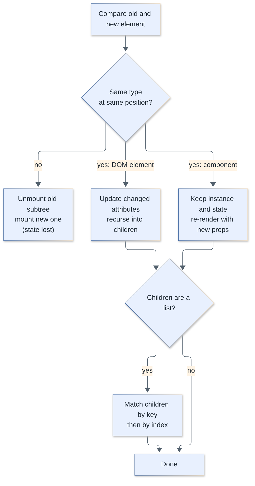
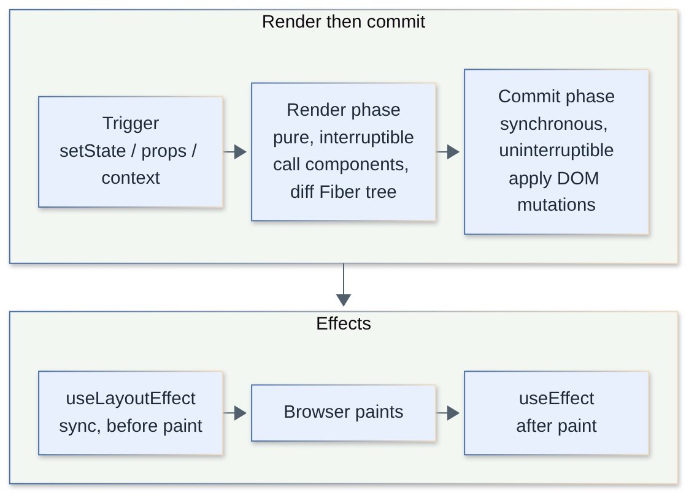
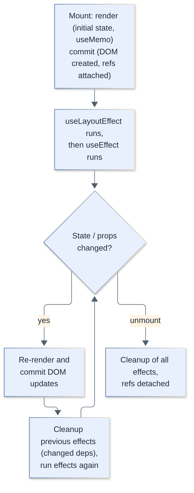
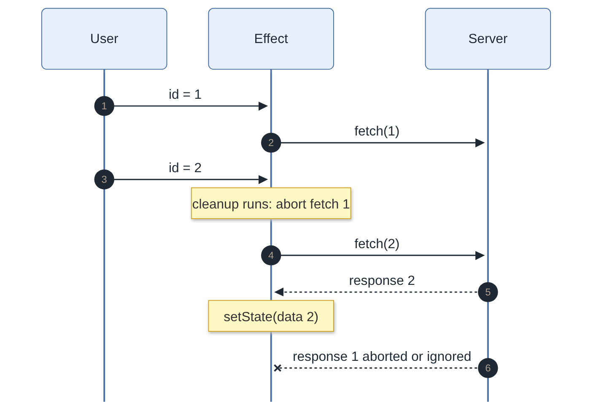
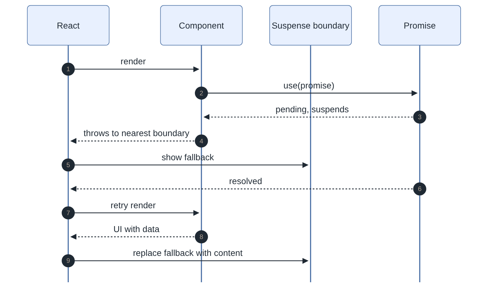
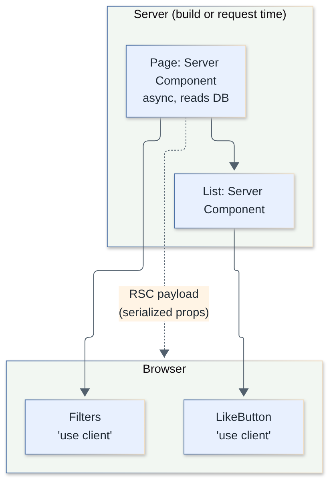
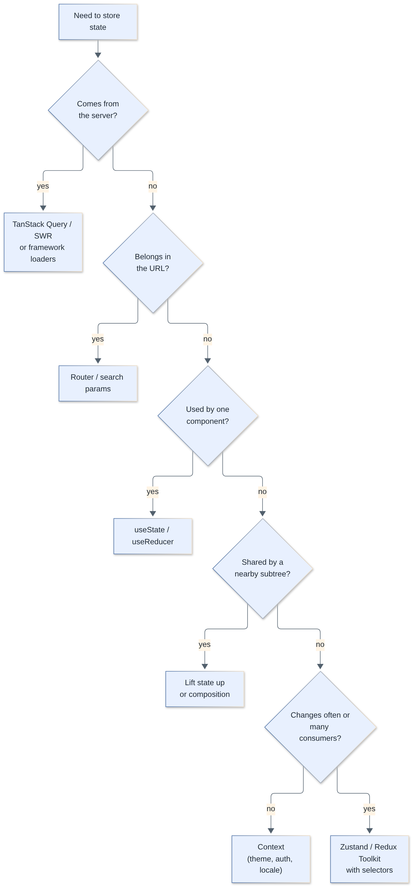

# React Interview Questions

Complete answers to 47 React interview questions, from fundamentals and hooks to React 19, Server Components, and performance. Each answer starts with a short version you can say aloud, followed by the deeper explanation.

**Levels:** `🟢 Junior` · `🟡 Middle` · `🔴 Senior`

## Table of contents


**Rendering & Reconciliation**

1. [What is the virtual DOM and why does React use it?](#1-what-is-the-virtual-dom-and-why-does-react-use-it)
2. [How does reconciliation work and what are the diffing rules?](#2-how-does-reconciliation-work-and-what-are-the-diffing-rules)
3. [Why do lists need keys, and why is using the array index a bad idea?](#3-why-do-lists-need-keys-and-why-is-using-the-array-index-a-bad-idea)
4. [What is React Fiber?](#4-what-is-react-fiber)
5. [What triggers a re-render, and what is the difference between render and commit?](#5-what-triggers-a-re-render-and-what-is-the-difference-between-render-and-commit)
6. [What is batching in React 18+?](#6-what-is-batching-in-react-18)

**State, Props & Forms**

7. [What is the difference between state and props?](#7-what-is-the-difference-between-state-and-props)
8. [Controlled vs uncontrolled components](#8-controlled-vs-uncontrolled-components)
9. [What is JSX and what does it compile to?](#9-what-is-jsx-and-what-does-it-compile-to)

**Core Hooks**

10. [How does `useState` work? What is the functional update form?](#10-how-does-usestate-work-what-is-the-functional-update-form)
11. [How does `useEffect` work? Explain dependencies and cleanup.](#11-how-does-useeffect-work-explain-dependencies-and-cleanup)
12. [`useEffect` vs `useLayoutEffect`](#12-useeffect-vs-uselayouteffect)
13. [What is `useRef` and when do you use it?](#13-what-is-useref-and-when-do-you-use-it)
14. [`useMemo` and `useCallback`: what do they do and when should you NOT use them?](#14-usememo-and-usecallback-what-do-they-do-and-when-should-you-not-use-them)
15. [`useReducer` vs `useState`: when to choose which?](#15-usereducer-vs-usestate-when-to-choose-which)
16. [What is the Context API and how does `useContext` work?](#16-what-is-the-context-api-and-how-does-usecontext-work)
17. [What is `useId` and why not use `Math.random()` or a counter?](#17-what-is-useid-and-why-not-use-mathrandom-or-a-counter)
18. [`useTransition` vs `useDeferredValue`](#18-usetransition-vs-usedeferredvalue)
19. [What is `useSyncExternalStore` and why does it exist?](#19-what-is-usesyncexternalstore-and-why-does-it-exist)
20. [What are the Rules of Hooks and why do they exist?](#20-what-are-the-rules-of-hooks-and-why-do-they-exist)
21. [What are custom hooks and when should you write one?](#21-what-are-custom-hooks-and-when-should-you-write-one)
22. [What is a stale closure in React and how do you fix it?](#22-what-is-a-stale-closure-in-react-and-how-do-you-fix-it)
23. [How do you handle effect cleanup and race conditions in data fetching?](#23-how-do-you-handle-effect-cleanup-and-race-conditions-in-data-fetching)
24. [What does Strict Mode do and why does it double-invoke things?](#24-what-does-strict-mode-do-and-why-does-it-double-invoke-things)

**Performance**

25. [What does `React.memo` do and when does it fail to help?](#25-what-does-reactmemo-do-and-when-does-it-fail-to-help)
26. [What are the performance pitfalls of Context and how do you avoid them?](#26-what-are-the-performance-pitfalls-of-context-and-how-do-you-avoid-them)
27. [What is the React Compiler and how does it change memoization?](#27-what-is-the-react-compiler-and-how-does-it-change-memoization)
28. [How do you render very long lists efficiently (virtualization)?](#28-how-do-you-render-very-long-lists-efficiently-virtualization)
29. [How do you find and fix performance problems in a React app?](#29-how-do-you-find-and-fix-performance-problems-in-a-react-app)
30. [What is concurrent rendering?](#30-what-is-concurrent-rendering)

**Suspense, Errors & React 19**

31. [How does Suspense work?](#31-how-does-suspense-work)
32. [What are error boundaries and what do they not catch?](#32-what-are-error-boundaries-and-what-do-they-not-catch)
33. [What is the `use` API in React 19?](#33-what-is-the-use-api-in-react-19)
34. [What are Actions in React 19? Explain `useActionState` and form actions.](#34-what-are-actions-in-react-19-explain-useactionstate-and-form-actions)
35. [How does `useOptimistic` work?](#35-how-does-useoptimistic-work)
36. [How do refs work for components? `forwardRef` and `ref` as a prop](#36-how-do-refs-work-for-components-forwardref-and-ref-as-a-prop)
37. [Server Components vs Client Components: what is the difference?](#37-server-components-vs-client-components-what-is-the-difference)
38. [What are portals and when do you use them?](#38-what-are-portals-and-when-do-you-use-them)

**Patterns & Architecture**

39. [HOCs vs render props vs hooks](#39-hocs-vs-render-props-vs-hooks)
40. [How do you choose a state management approach (local, context, Zustand/Redux, server state)?](#40-how-do-you-choose-a-state-management-approach-local-context-zustandredux-server-state)
41. [Why use TanStack Query (server state) instead of `useEffect` + `useState`?](#41-why-use-tanstack-query-server-state-instead-of-useeffect--usestate)
42. [How do you test React components with React Testing Library?](#42-how-do-you-test-react-components-with-react-testing-library)
43. [What are the most common React anti-patterns?](#43-what-are-the-most-common-react-anti-patterns)

**Build This Component**

44. [Implement `useDebounce`](#44-implement-usedebounce)
45. [Implement `useFetch` with abort, loading, and error states](#45-implement-usefetch-with-abort-loading-and-error-states)
46. [Implement infinite scroll](#46-implement-infinite-scroll)
47. [A large React page is janky when typing in a form field. How do you diagnose and fix it?](#47-a-large-react-page-is-janky-when-typing-in-a-form-field-how-do-you-diagnose-and-fix-it)

---

## Rendering & Reconciliation

### 1. What is the virtual DOM and why does React use it?

`🟢 Junior` · `#rendering` `#fundamentals`

The virtual DOM is a lightweight JavaScript description of the UI (a tree of plain objects called React elements). React renders to this description first, compares it with the previous one, and applies only the minimal real DOM changes.

The point is not that the virtual DOM is "faster than the DOM". It is a way to make UI a **function of state**: you describe what the screen should look like, and React works out how to get there. Direct DOM manipulation is cheap in isolation; the win is that you no longer hand-write the imperative update code, and React can batch and schedule updates.

```tsx
// JSX compiles to element objects, not DOM nodes
const el = <button className="btn" onClick={save}>Save</button>;
// roughly: { type: "button", props: { className: "btn", onClick: save, children: "Save" } }
```

| | Real DOM | Virtual DOM |
|---|---|---|
| What it is | Browser object tree | Plain JS objects |
| Creation cost | High (layout, style) | Very low |
| Updated by | Imperative calls | Re-rendering + diff |
| Lives in | Browser | React runtime (Fiber tree) |

> **Follow-up:** Is the virtual DOM always faster than hand-written DOM updates? No. A hand-tuned imperative update of one node beats render + diff. React's value is developer productivity and good-enough performance by default; Svelte and Solid avoid a virtual DOM entirely.

[↑ Back to top](#table-of-contents)

### 2. How does reconciliation work and what are the diffing rules?

`🟡 Middle` · `#rendering` `#reconciliation`

Reconciliation is the algorithm React uses to compare the previous element tree with the next one and compute the minimal set of changes. It uses two heuristics that make it O(n) instead of O(n³): elements of **different types** produce different trees, and **keys** identify stable children in lists.

Rules, in order:

1. **Different type at the same position** (`<div>` to `<span>`, or `<A>` to `<B>`): the old subtree is unmounted (state destroyed) and the new one mounted.
2. **Same DOM element type**: keep the node, update only changed attributes, recurse into children.
3. **Same component type**: keep the instance and its state, re-render with new props.
4. **Lists**: match children by `key`, falling back to index.

```tsx
function Page({ admin }: { admin: boolean }) {
  // Same type, same position: <Counter/> state is PRESERVED when `admin` flips
  return admin ? <Counter label="admin" /> : <Counter label="user" />;
}

function Page2({ admin }: { admin: boolean }) {
  // Different wrapper type at the same position: Counter state is RESET
  return admin ? <div><Counter /></div> : <section><Counter /></section>;
}
```

A practical consequence: you can **reset state on purpose** by changing `key`.

```tsx
<Profile key={userId} userId={userId} /> // new user => fresh state, no reset effect needed
```

Another gotcha: never define a component inside another component. Each render creates a new function identity, React sees a "different type", and unmounts/remounts the subtree every time.



> **Follow-up:** Why can't React detect that a list item moved without keys? Without keys it compares by index, so moving the first item to the end looks like "every item changed".

[↑ Back to top](#table-of-contents)

### 3. Why do lists need keys, and why is using the array index a bad idea?

`🟢 Junior` · `#rendering` `#lists`

`key` is a stable identity React uses to match list items between renders. Use a unique, stable ID from your data; use the index only for static lists that are never reordered, filtered, or inserted into.

With index keys, inserting an item at the top shifts every key, so React re-uses component instances for the wrong data. Visible symptoms: inputs keep the wrong text, focus jumps, animations replay, local state sticks to the wrong row, and extra re-renders occur.

```tsx
// Bad: index keys. Type in row 1's input, delete row 0: the text "moves" to the wrong item
{todos.map((t, i) => <TodoRow key={i} todo={t} />)}

// Good
{todos.map((t) => <TodoRow key={t.id} todo={t} />)}
```

Rules: keys must be unique **among siblings** (not globally), stable across renders (never `Math.random()` or `crypto.randomUUID()` in render, which remounts everything every time), and are not passed as a prop. Generate IDs when the data is created, not when it is rendered.

> **Follow-up:** Can `key` be used outside lists? Yes, on any element to force a remount (see Q2).

[↑ Back to top](#table-of-contents)

### 4. What is React Fiber?

`🔴 Senior` · `#internals` `#fiber` `#concurrent`

Fiber is React's reimplementation of the reconciler (since React 16): the component tree is represented as a linked list of "fiber" work units that React can pause, resume, prioritize, and abandon. It is the foundation that makes concurrent features possible.

The old stack reconciler recursed through the tree synchronously, so a big render blocked the main thread until done. A fiber is a plain object per component instance holding `type`, `props`, `state`, pointers (`child`, `sibling`, `return`), pending effects, and a **lane** (priority).

Key ideas:

- **Two trees**: `current` (on screen) and `workInProgress` (being built). On commit, React swaps the pointers (double buffering).
- **Render phase** (pure, can be interrupted or restarted) walks fibers one unit at a time and can yield to the browser between units.
- **Commit phase** (synchronous) applies DOM mutations and runs layout effects, then schedules passive effects.
- **Lanes** assign priorities: a click update (sync) can interrupt a transition render (low priority).

Why it matters in practice: render functions may be called multiple times or thrown away before commit, so they must be **pure**. This is also why Strict Mode double-invokes them (Q24).



> **Follow-up:** Is Fiber a public API? No. You never touch fibers directly, though DevTools and error stacks expose them.

[↑ Back to top](#table-of-contents)

### 5. What triggers a re-render, and what is the difference between render and commit?

`🟢 Junior` · `#rendering` `#state`

A component re-renders when its **state changes**, when its **parent re-renders** (even with identical props), or when a **context it consumes** changes. "Render" means calling your function to compute the next UI; "commit" means React applying the difference to the DOM. A render does not always cause DOM changes.

Common misconceptions:

- Changing props alone does not trigger anything; the parent re-rendering does. Changing a **ref** or a plain variable triggers nothing.
- `setState` with the same value (`Object.is`) usually bails out, though React may still render the component once more before bailing.
- A re-render re-runs the whole function, but React preserves state and only touches the DOM if output differs.

```tsx
function Parent() {
  const [n, setN] = useState(0);
  return (
    <>
      <button onClick={() => setN(n + 1)}>{n}</button>
      <Child />  {/* re-renders on every click, props never changed */}
    </>
  );
}
```

Ways to avoid unneeded child renders: move state down, pass children as props (composition), `React.memo`, or let the React Compiler memoize (Q27).

> **Follow-up:** Does a re-render mean the DOM is updated? No. If the output is identical, the commit phase has nothing to change.

[↑ Back to top](#table-of-contents)

### 6. What is batching in React 18+?

`🟡 Middle` · `#rendering` `#state`

Batching groups multiple state updates into a single re-render. Since React 18 it is **automatic everywhere** (event handlers, promises, `setTimeout`, native events); before, it only applied inside React event handlers.

```tsx
function Form() {
  const [a, setA] = useState(0);
  const [b, setB] = useState(0);
  console.log("render");

  async function onClick() {
    await fetch("/api");
    setA((x) => x + 1);
    setB((x) => x + 1);
    // React 17: 2 renders. React 18+: 1 render
  }
  return <button onClick={onClick}>{a}-{b}</button>;
}
```

Important details:

- State is a **snapshot**: after `setA(a + 1)`, `a` in the current closure is still the old value. Use the functional form `setA(x => x + 1)` when the next value depends on the previous one.
- Updates are flushed after the event handler finishes, not synchronously.
- To force a synchronous flush (rare, e.g. measure DOM right after), use `flushSync` from `react-dom`.

> **Follow-up:** What does `flushSync` cost? It opts out of batching and forces a synchronous render and commit, hurting performance; use it only for integrations like scroll-to-new-item.

[↑ Back to top](#table-of-contents)

## State, Props & Forms

### 7. What is the difference between state and props?

`🟢 Junior` · `#state` `#props`

Props are inputs passed **from a parent** and are read-only for the receiving component. State is data a component **owns** and can change over time, triggering re-renders.

| | Props | State |
|---|---|---|
| Owned by | Parent | The component itself |
| Mutable by the component | No | Yes, via setter |
| Triggers re-render | When parent re-renders with new values | When setter is called |
| Direction | Top-down | Local; shared via lifting up |

```tsx
function Counter({ step }: { step: number }) {   // prop: step
  const [count, setCount] = useState(0);          // state: count
  return <button onClick={() => setCount(count + step)}>{count}</button>;
}
```

Never mutate either. Derive values instead of duplicating: if something can be computed from props or state, compute it in render rather than storing it in another `useState` (copying props into state is a common bug because it never updates).

> **Follow-up:** What is "lifting state up"? Move state to the closest common ancestor of the components that need it and pass it down via props.

[↑ Back to top](#table-of-contents)

### 8. Controlled vs uncontrolled components

`🟢 Junior` · `#forms` `#state`

A **controlled** input has its value driven by React state (`value` + `onChange`). An **uncontrolled** input keeps its value in the DOM and you read it when needed (via a ref or `FormData`).

| | Controlled | Uncontrolled |
|---|---|---|
| Source of truth | React state | DOM |
| Re-render per keystroke | Yes | No |
| Instant validation / masking | Easy | Harder |
| Simple submit-only forms | Verbose | Ideal |
| File inputs | Not possible | Required |

```tsx
// Controlled
const [email, setEmail] = useState("");
<input value={email} onChange={(e) => setEmail(e.target.value)} />;

// Uncontrolled with FormData (works great with React 19 form actions, Q34)
function Login() {
  function onSubmit(e: React.FormEvent<HTMLFormElement>) {
    e.preventDefault();
    const data = new FormData(e.currentTarget);
    console.log(data.get("email"));
  }
  return <form onSubmit={onSubmit}><input name="email" defaultValue="" /><button>Go</button></form>;
}
```

Gotchas: passing `value` without `onChange` makes a read-only field; switching `undefined` to a defined `value` triggers the "uncontrolled to controlled" warning, so always initialize to `""`. For large forms, libraries like React Hook Form use uncontrolled inputs to avoid re-rendering on every keystroke.

> **Follow-up:** When would you pick uncontrolled? Large forms, file inputs, simple submit-only forms, or when integrating non-React widgets.

[↑ Back to top](#table-of-contents)

### 9. What is JSX and what does it compile to?

`🟢 Junior` · `#fundamentals` `#jsx`

JSX is a syntax extension that looks like HTML but is compiled to JavaScript function calls that create React elements. Browsers do not understand it; Babel, SWC, or TypeScript transform it.

```tsx
const a = <h1 className="t">Hi {name}</h1>;
// Modern automatic runtime compiles to:
// import { jsx as _jsx } from "react/jsx-runtime";
// const a = _jsx("h1", { className: "t", children: ["Hi ", name] });
```

Points to remember: attributes are camelCase (`className`, `htmlFor`, `onClick`); expressions go in `{}`; a component must return a single root (use `<>…</>` fragments); lowercase tags are DOM elements, capitalized ones are components; JSX escapes strings by default, which protects against XSS (the exception is `dangerouslySetInnerHTML`). With the automatic runtime you no longer need `import React` in every file.

> **Follow-up:** Is JSX required? No, you can call `createElement`/`jsx` directly; JSX is sugar.

[↑ Back to top](#table-of-contents)

## Core Hooks

### 10. How does `useState` work? What is the functional update form?

`🟢 Junior` · `#hooks` `#state`

`useState(initial)` returns `[value, setValue]`. React stores the value per component instance, outside your function, and returns it on each render. Calling the setter schedules a re-render with the new value.

```tsx
const [count, setCount] = useState(0);

setCount(count + 1);      // uses the value from THIS render's closure
setCount((c) => c + 1);   // functional update: uses the latest queued value

// Three calls in one handler:
setCount(count + 1); setCount(count + 1); setCount(count + 1); // +1 total
setCount((c) => c + 1); setCount((c) => c + 1); setCount((c) => c + 1); // +3 total
```

Things interviewers look for:

- **State is a snapshot.** `console.log(count)` right after `setCount` prints the old value.
- **Immutability.** Replace objects/arrays (`{...obj, x: 1}`, `[...arr, item]`); mutating in place means `Object.is` sees no change and no re-render happens.
- **Lazy initialization.** `useState(() => expensive())` runs the initializer only on mount; `useState(expensive())` runs it on every render (the result is just ignored).
- **Setter identity is stable**, so it is safe to omit from dependency arrays.

> **Follow-up:** Why does `setCount(count + 1)` in a `setInterval` stick at 1? Stale closure (Q22). Use the functional form.

[↑ Back to top](#table-of-contents)

### 11. How does `useEffect` work? Explain dependencies and cleanup.

`🟢 Junior` · `#hooks` `#effects`

`useEffect` runs code **after render has been committed and painted**, to synchronize your component with something outside React (network, subscriptions, timers, DOM APIs, third-party widgets). The dependency array tells React when to re-run it; the returned function cleans up the previous run.

```tsx
useEffect(() => {
  const id = setInterval(tick, 1000);
  return () => clearInterval(id); // cleanup: runs before the next effect and on unmount
}, [tick]);
```

| Deps | When it runs |
|---|---|
| omitted | After every render |
| `[]` | After mount only (and cleanup on unmount) |
| `[a, b]` | After mount and whenever `a` or `b` changed (`Object.is`) |

Rules: dependencies must list **every reactive value** the effect reads (props, state, values derived from them). Do not lie to the linter; fix the code instead (move the function inside the effect, use `useEffectEvent`, functional updates, or a ref). Effects are for synchronization, not for responding to user events: put "user clicked Buy, POST the order" in the **event handler**.

Order: cleanup of the previous effect runs before the next effect body, and child effects run before parent effects.

> **Follow-up:** Does `useEffect` run on the server? No. Effects run only in the browser, never during SSR.

[↑ Back to top](#table-of-contents)

### 12. `useEffect` vs `useLayoutEffect`

`🟡 Middle` · `#hooks` `#effects` `#rendering`

`useLayoutEffect` fires **synchronously after DOM mutations but before the browser paints**; `useEffect` fires **after paint**. Use `useLayoutEffect` only when you must measure or mutate the DOM and re-render before the user sees a frame (tooltips positioning, avoiding flicker).

| | `useEffect` | `useLayoutEffect` |
|---|---|---|
| Timing | After paint (async) | Before paint (sync) |
| Blocks painting | No | Yes |
| Typical use | Fetching, subscriptions, logging | Measuring layout, scroll position, positioning popovers |
| SSR | Not run | Not run, and warns in some setups; use `useEffect` or `useSyncExternalStore` for SSR-safe code |

```tsx
function Tooltip({ children }: { children: React.ReactNode }) {
  const ref = useRef<HTMLDivElement>(null);
  const [top, setTop] = useState(0);

  useLayoutEffect(() => {
    const h = ref.current!.getBoundingClientRect().height;
    setTop(-h - 8); // re-render happens BEFORE paint, so no flicker
  }, []);

  return <div ref={ref} style={{ position: "absolute", top }}>{children}</div>;
}
```

Because it blocks painting, a slow layout effect makes the page feel janky; default to `useEffect`.



> **Follow-up:** Why is there a flicker with `useEffect` here? The browser paints the first (wrong) position, then the effect runs and re-renders, so the user sees two frames.

[↑ Back to top](#table-of-contents)

### 13. What is `useRef` and when do you use it?

`🟢 Junior` · `#hooks` `#refs`

`useRef` returns a mutable object `{ current }` that persists across renders and **does not trigger a re-render when changed**. Use it for DOM element access and for mutable values that are not part of the rendered output (timer IDs, previous values, flags).

```tsx
function SearchBox() {
  const inputRef = useRef<HTMLInputElement>(null);
  const timer = useRef<number | undefined>(undefined);

  useEffect(() => inputRef.current?.focus(), []);

  function onChange() {
    window.clearTimeout(timer.current);
    timer.current = window.setTimeout(() => console.log("search"), 300);
  }
  return <input ref={inputRef} onChange={onChange} />;
}
```

| | `useState` | `useRef` |
|---|---|---|
| Change triggers render | Yes | No |
| Readable during render | Yes | Avoid (not reactive) |
| Use for | UI-affecting data | DOM nodes, timers, latest-value boxes |

Do not read or write `ref.current` during render (except lazy init); do it in handlers and effects. Callback refs (`ref={(node) => ...}`) run when the node attaches/detaches; in React 19 they can return a cleanup function.

> **Follow-up:** Why does `ref.current` change not update the UI? React does not track it; there is no setter and no render scheduled.

[↑ Back to top](#table-of-contents)

### 14. `useMemo` and `useCallback`: what do they do and when should you NOT use them?

`🟡 Middle` · `#hooks` `#performance`

`useMemo(fn, deps)` caches a computed **value**; `useCallback(fn, deps)` caches a **function identity** (it is `useMemo(() => fn, deps)`). They are optimizations, not semantic guarantees: React may discard the cache. Use them only when you can show they help.

Legitimate uses:

1. A genuinely expensive calculation (measure it; rule of thumb is more than ~1ms in the profiler).
2. A value or function passed to a **memoized child** (`React.memo`) so its props stay referentially stable.
3. A value used as a dependency of another hook, to avoid effect re-runs.

```tsx
const visible = useMemo(() => filterAndSort(items, query), [items, query]);

const onSelect = useCallback((id: string) => setSelected(id), []);
return <MemoizedList items={visible} onSelect={onSelect} />;
```

When NOT to use them:

- Cheap computations: the hook itself costs memory and comparison time.
- Props to **non-memoized** children: they re-render anyway, so `useCallback` achieves nothing.
- Wrapping everything "just in case": it adds noise and stale-dependency bugs.
- When restructuring fixes it: move state down, or pass `children`, which avoids the re-render without any memoization.
- When you use the **React Compiler** (Q27), which memoizes automatically; keep manual memoization mainly where you need precise control over effect dependencies.

> **Follow-up:** Does `useMemo` guarantee a stable reference? Not guaranteed by contract: React may throw the cache away (e.g. offscreen trees), so never rely on it for correctness.

[↑ Back to top](#table-of-contents)

### 15. `useReducer` vs `useState`: when to choose which?

`🟡 Middle` · `#hooks` `#state`

`useReducer(reducer, initial)` manages state through dispatched actions and a pure reducer `(state, action) => newState`. Prefer it when state has several related fields, the next state depends on complex transitions, or you want logic testable outside the component.

| | `useState` | `useReducer` |
|---|---|---|
| Best for | Independent, simple values | Related fields, state machines |
| Update logic | Scattered across handlers | Centralized in the reducer |
| Testing | Via component | Pure function unit test |
| Passing updates down | Many setters | One stable `dispatch` |

```tsx
type State = { status: "idle" | "loading" | "success" | "error"; data?: User[]; error?: string };
type Action =
  | { type: "fetch" }
  | { type: "success"; data: User[] }
  | { type: "error"; error: string };

function reducer(s: State, a: Action): State {
  switch (a.type) {
    case "fetch":   return { status: "loading" };
    case "success": return { status: "success", data: a.data };
    case "error":   return { status: "error", error: a.error };
  }
}

const [state, dispatch] = useReducer(reducer, { status: "idle" });
```

`dispatch` has a stable identity, so passing it through context does not cause consumers to re-render when state changes (a common pattern: separate `StateContext` and `DispatchContext`). Reducers must be pure: no fetching, no mutation; Strict Mode runs them twice to catch this.

> **Follow-up:** Is `useReducer` Redux? Same idea, but local to a component (or a context subtree) with no middleware, devtools, or global store.

[↑ Back to top](#table-of-contents)

### 16. What is the Context API and how does `useContext` work?

`🟢 Junior` · `#hooks` `#context`

Context lets a parent provide a value to any descendant without passing props through every level ("prop drilling"). `createContext` makes it, `<Ctx value={...}>` provides it, and `useContext(Ctx)` reads it; consumers re-render when the provided value changes.

```tsx
const ThemeContext = createContext<"light" | "dark">("light");

function App() {
  const [theme, setTheme] = useState<"light" | "dark">("dark");
  return (
    <ThemeContext value={theme}>   {/* React 19: <Context> works as a provider */}
      <Toolbar />
    </ThemeContext>
  );
}

function Button() {
  const theme = useContext(ThemeContext); // nearest provider above, else default value
  return <button className={theme}>OK</button>;
}
```

Notes: in React 19 you can render `<ThemeContext value=...>` directly (previously `<ThemeContext.Provider>`, which still works). `use(ThemeContext)` also reads context and, unlike `useContext`, can be called conditionally (Q33). Context is good for low-frequency, app-wide values (theme, locale, auth user); it is **not** a state-management library (see Q26 for performance issues).

> **Follow-up:** What is the default value used for? Only when there is no matching provider above the component; handy for tests.

[↑ Back to top](#table-of-contents)

### 17. What is `useId` and why not use `Math.random()` or a counter?

`🟡 Middle` · `#hooks` `#ssr` `#accessibility`

`useId` generates a unique, stable ID that is **identical on the server and the client**, so it is safe for SSR hydration. Use it to link labels, inputs, and ARIA attributes.

```tsx
function Field({ label }: { label: string }) {
  const id = useId();
  return (
    <>
      <label htmlFor={id}>{label}</label>
      <input id={id} />
    </>
  );
}
```

`Math.random()` or a module counter differ between server and client renders, causing hydration mismatches; they also change on every render unless stored. Rules: do not use `useId` for list `key`s (derive keys from data); one `useId` can be suffixed for several related IDs (`${id}-name`, `${id}-email`); the generated string contains characters like `:` (or similar), so avoid using it in CSS selectors.

> **Follow-up:** Why does hydration care? If server HTML has `id="a"` and the client renders `id="b"`, React warns and may have to patch or re-render the tree.

[↑ Back to top](#table-of-contents)

### 18. `useTransition` vs `useDeferredValue`

`🟡 Middle` · `#hooks` `#concurrent` `#performance`

Both mark work as **non-urgent** so React keeps the UI responsive. `useTransition` wraps a **state update** you control; `useDeferredValue` defers a **value** you receive (e.g. as a prop) and returns a lagging copy.

| | `useTransition` | `useDeferredValue` |
|---|---|---|
| You control | The `setState` call | Only the value (props, third-party) |
| Returns | `[isPending, startTransition]` | The deferred value |
| Pending flag | Built-in `isPending` | Compare `value !== deferred` |
| Typical use | Tab switch, navigation | Search input filtering a heavy list |

```tsx
function Search({ items }: { items: Item[] }) {
  const [query, setQuery] = useState("");
  const deferred = useDeferredValue(query);      // lags during heavy renders
  const stale = query !== deferred;

  return (
    <>
      <input value={query} onChange={(e) => setQuery(e.target.value)} /> {/* urgent */}
      <div style={{ opacity: stale ? 0.6 : 1 }}>
        <HeavyList query={deferred} />            {/* interruptible */}
      </div>
    </>
  );
}

function Tabs() {
  const [tab, setTab] = useState("home");
  const [isPending, startTransition] = useTransition();
  return (
    <button onClick={() => startTransition(() => setTab("reports"))}>
      Reports {isPending && "…"}
    </button>
  );
}
```

Caveats: transitions are interruptible, so they help with **rendering** cost, not network or a single long synchronous function. `HeavyList` should be memoized, otherwise the deferred render still re-renders it on urgent updates. In React 19, `startTransition` also accepts async functions (Actions, Q34). Controlled text inputs must not be inside the transition, or typing will lag.

> **Follow-up:** How is this different from debouncing? Debounce delays work by time; deferral does the work immediately but interruptibly, with no fixed delay and no wasted waiting on fast devices.

[↑ Back to top](#table-of-contents)

### 19. What is `useSyncExternalStore` and why does it exist?

`🔴 Senior` · `#hooks` `#concurrent` `#state-management`

`useSyncExternalStore(subscribe, getSnapshot, getServerSnapshot?)` is the official way to read from a store that lives **outside React** (Redux, Zustand, `window.matchMedia`, `navigator.onLine`) in a way that is safe under concurrent rendering. It prevents **tearing**: different components showing different values of the same store during one render.

```tsx
function useOnlineStatus() {
  return useSyncExternalStore(
    (cb) => {
      window.addEventListener("online", cb);
      window.addEventListener("offline", cb);
      return () => {
        window.removeEventListener("online", cb);
        window.removeEventListener("offline", cb);
      };
    },
    () => navigator.onLine,   // client snapshot
    () => true                // server snapshot (SSR + hydration)
  );
}
```

Requirements and gotchas:

- `getSnapshot` must return a **cached/immutable** value; returning a fresh object each call causes an infinite loop ("The result of getSnapshot should be cached"). Select primitives or memoize.
- `subscribe` must be a stable function (define outside the component or `useCallback`), otherwise it resubscribes on every render.
- Updates triggered through this hook are **synchronous**, so they cannot be deferred by transitions; this is the trade-off for consistency.
- Provide `getServerSnapshot` for SSR, matching the first client render to avoid hydration mismatch.

Zustand, Redux Toolkit (via `react-redux`), Jotai, and TanStack Query use this under the hood, which is why they are concurrent-safe. Hand-rolling `useState` + `useEffect` subscriptions is the older, tear-prone pattern.

> **Follow-up:** Why not `useEffect` + `useState` to subscribe? Between render and the effect subscribing, the store may change (missed update), and different components can read different values during a concurrent render.

[↑ Back to top](#table-of-contents)

### 20. What are the Rules of Hooks and why do they exist?

`🟢 Junior` · `#hooks` `#fundamentals`

Only call hooks **at the top level** of a function component or custom hook (never in loops, conditions, nested functions, or after an early return), and only from React functions. The reason: React identifies each hook by its **call order**, not by name.

React stores hooks of a component as a linked list. On render #1 the calls are `useState` (slot 0), `useEffect` (slot 1); on render #2 React walks the same list in order. If a hook is skipped conditionally, every later hook reads the wrong slot.

```tsx
function Bad({ show }: { show: boolean }) {
  if (show) {
    const [x, setX] = useState(0); // slot index shifts between renders
  }
  const [y, setY] = useState(1);   // reads the wrong slot when show flips
}

function Good({ show }: { show: boolean }) {
  const [x, setX] = useState(0);
  const [y, setY] = useState(1);
  if (!show) return null;          // early return AFTER all hooks
  return <p>{x + y}</p>;
}
```

Enforce with `eslint-plugin-react-hooks` (`rules-of-hooks` and `exhaustive-deps`). The one deliberate exception is `use` (Q33), which can be called conditionally because it does not rely on slot order. Need conditional behavior? Move the condition **inside** the hook, or split into a child component.

> **Follow-up:** Why can't you call hooks in classes or regular functions? There is no component fiber to attach the hook list to.

[↑ Back to top](#table-of-contents)

### 21. What are custom hooks and when should you write one?

`🟡 Middle` · `#hooks` `#patterns`

A custom hook is a function whose name starts with `use` and that calls other hooks, extracting **stateful logic** for reuse. Each call gets its own isolated state; hooks share logic, not state.

```tsx
function useLocalStorage<T>(key: string, initial: T) {
  const [value, setValue] = useState<T>(() => {
    try {
      const raw = localStorage.getItem(key);
      return raw ? (JSON.parse(raw) as T) : initial;
    } catch {
      return initial;
    }
  });

  useEffect(() => {
    try { localStorage.setItem(key, JSON.stringify(value)); } catch {}
  }, [key, value]);

  return [value, setValue] as const;
}
```

Guidelines:

- Write one when logic is reused, or when it makes a component read more clearly. Do not create `useMount`-style wrappers that hide the effect's real dependencies.
- Return a stable API (memoize returned callbacks if consumers put them in deps).
- Name by purpose (`useOnlineStatus`), not by lifecycle (`useMountEffect`).
- Compose small hooks; type generics and return tuples with `as const`.
- Test with `renderHook` from React Testing Library.

> **Follow-up:** Do two components using `useLocalStorage("x")` share state? No, each has its own `useState`; sharing needs a store, context, or `useSyncExternalStore`.

[↑ Back to top](#table-of-contents)

### 22. What is a stale closure in React and how do you fix it?

`🟡 Middle` · `#hooks` `#closures` `#bugs`

Every render creates new functions that **capture that render's props and state**. If an effect, timer, or callback outlives the render and is not re-created, it keeps seeing old values: a stale closure.

```tsx
function Counter() {
  const [count, setCount] = useState(0);

  useEffect(() => {
    const id = setInterval(() => {
      console.log(count);       // always 0: closure captured the first render
      setCount(count + 1);      // stuck at 1
    }, 1000);
    return () => clearInterval(id);
  }, []);                        // lint warning ignored
}
```

Fixes, from best to worst:

1. **Functional update** when you only need the previous state: `setCount((c) => c + 1)`.
2. **Declare the dependency** and let the effect re-subscribe: `[count]` (fine when cheap).
3. **`useEffectEvent`** (stable in React 19.2) for logic that should read the latest props/state without re-running the effect:
   ```tsx
   const onTick = useEffectEvent(() => console.log(count));
   useEffect(() => {
     const id = setInterval(() => onTick(), 1000);
     return () => clearInterval(id);
   }, []); // Effect Events are NOT listed in deps
   ```
4. **A ref holding the latest value** (the pre-19.2 workaround): `latest.current = count` updated in an effect.

Effect Events can only be called from inside effects (and only declared in the same component or hook); the lint plugin enforces this.

> **Follow-up:** Is a stale closure ever desirable? Yes: state as a snapshot is why an `alert` in a click handler shows the value at click time.

[↑ Back to top](#table-of-contents)

### 23. How do you handle effect cleanup and race conditions in data fetching?

`🟡 Middle` · `#effects` `#async` `#bugs`

When an effect fetches data keyed by a changing prop, responses can arrive **out of order**: the request for `id=1` resolves after `id=2` and overwrites newer data. Fix it by cancelling in the cleanup, either with `AbortController` (also cancels the network request) or an `ignore` flag.

```tsx
function User({ id }: { id: string }) {
  const [user, setUser] = useState<UserDto | null>(null);
  const [error, setError] = useState<Error | null>(null);

  useEffect(() => {
    const controller = new AbortController();
    setUser(null);
    setError(null);

    fetch(`/api/users/${id}`, { signal: controller.signal })
      .then((r) => {
        if (!r.ok) throw new Error(`HTTP ${r.status}`);
        return r.json();
      })
      .then(setUser)
      .catch((e) => {
        if (e.name !== "AbortError") setError(e); // aborts are expected, not errors
      });

    return () => controller.abort(); // runs when `id` changes or on unmount
  }, [id]);

  if (error) return <p>{error.message}</p>;
  return user ? <p>{user.name}</p> : <p>Loading…</p>;
}
```

The simpler flag version (works with any async API that cannot be aborted):

```tsx
useEffect(() => {
  let ignore = false;
  load(id).then((d) => { if (!ignore) setData(d); });
  return () => { ignore = true; };
}, [id]);
```



Production gotchas: this still lacks caching, deduplication, retries, and request waterfalls handling; for real apps use TanStack Query/SWR or framework data loading (Q41). Strict Mode double-runs this effect in development, which exposes missing cleanup (Q24). Remember that `AbortError` rejects the promise: handle it, otherwise you log noise.

> **Follow-up:** `ignore` flag vs `AbortController`? The flag only discards the result; abort also frees the connection and server work.

[↑ Back to top](#table-of-contents)

### 24. What does Strict Mode do and why does it double-invoke things?

`🟡 Middle` · `#strict-mode` `#effects` `#purity`

`<StrictMode>` is a **development-only** wrapper that surfaces bugs by running extra checks: components, state initializers, and reducers are called **twice**, and effects are **mounted, unmounted, and mounted again** once. Nothing changes in production.

Why: React 18+ may render a component multiple times, throw work away, or preserve state while hiding a tree (Activity/Offscreen). Code must tolerate that:

- **Render must be pure.** Double invocation reveals mutations of shared variables, `Math.random()`, or `Date.now()` used for output.
- **Effects must be symmetric.** The simulated unmount/remount verifies cleanup actually undoes setup.

```tsx
useEffect(() => {
  const conn = createConnection(roomId);
  conn.connect();
  return () => conn.disconnect(); // without this, Strict Mode shows two live connections
}, [roomId]);
```

Common misreads: "my effect runs twice, so it's a React bug" (no, it's a missing cleanup); "I'll add a `didRun` ref to skip the second run" (this hides the bug and breaks real remounts, such as navigating away and back). For "run once ever" work like analytics, put it in an event handler, at module level, or make it idempotent. For fetches, abort in cleanup (Q23) or use a data library.

> **Follow-up:** Does Strict Mode double-call event handlers? No, only render-phase code (render, initializers, updater functions, reducers) and effect setup/cleanup.

[↑ Back to top](#table-of-contents)

## Performance

### 25. What does `React.memo` do and when does it fail to help?

`🟡 Middle` · `#performance` `#memoization`

`React.memo(Component)` skips re-rendering a component when its props are **shallowly equal** (`Object.is` per prop) to the previous ones. It only helps if the parent re-renders often and the child's props are actually stable.

```tsx
const Row = memo(function Row({ item, onSelect }: { item: Item; onSelect: (id: string) => void }) {
  return <li onClick={() => onSelect(item.id)}>{item.name}</li>;
});

function List({ items }: { items: Item[] }) {
  const [selected, setSelected] = useState<string>();
  const onSelect = useCallback((id: string) => setSelected(id), []); // stable identity
  return <ul>{items.map((i) => <Row key={i.id} item={i} onSelect={onSelect} />)}</ul>;
}
```

Why it often fails:

- **Unstable props**: inline objects, arrays, and arrow functions are new each render (`style={{}}`, `onClick={() => ...}`), so shallow equality fails.
- **`children` JSX** is a new object every render.
- **Context**: a memoized component still re-renders when a context it uses changes.
- Comparison itself costs; for cheap components it is a net loss.

A custom comparer `memo(C, (prev, next) => ...)` is possible but error-prone (forgetting a prop causes stale UI). Prefer fixing the structure first: colocate state, split components, or pass `children`. With the React Compiler (Q27) most of this is automatic.

> **Follow-up:** Does `memo` prevent re-renders from the component's own state? No, only from parent re-renders with equal props.

[↑ Back to top](#table-of-contents)

### 26. What are the performance pitfalls of Context and how do you avoid them?

`🔴 Senior` · `#context` `#performance` `#architecture`

Every consumer of a context re-renders whenever the provider's `value` changes (by `Object.is`), and `React.memo` cannot stop it. There is no built-in selector, so a context holding a big object makes all consumers re-render when any field changes.

Classic bug: a new object each provider render.

```tsx
// Bad: new object every render => every consumer re-renders whenever App re-renders
<AuthContext value={{ user, login, logout }}>{children}</AuthContext>

// Better: memoize
const value = useMemo(() => ({ user, login, logout }), [user, login, logout]);
<AuthContext value={value}>{children}</AuthContext>
```

Strategies, roughly in order:

1. **Split contexts** by update frequency and by concern (`ThemeContext`, `UserContext`), and separate **state from dispatch** (dispatch is stable).
2. **Keep state close** to the consumers; a provider high in the tree that holds frequently changing state re-renders everything below that is not `children`-isolated.
3. **Pass `children`** through the provider component: `children` elements are created by the parent, so they are not re-rendered when the provider's own state changes.
4. **Use a store with selectors** (Zustand, Redux, Jotai, or `use-context-selector`) for hot or large state: components re-render only if their selected slice changes.
5. **Compiler/memo** do not fix this: consumption is subscription-based.

```tsx
// Zustand: re-renders only when `count` changes, not when other fields do
const count = useStore((s) => s.count);
```

Trade-off: context is the right tool for low-frequency, wide-reaching values (theme, locale, auth, feature flags). For high-frequency updates (cursor position, form fields, live data) use local state or a selector-based store.

> **Follow-up:** Is Redux "just context"? No. React-Redux uses a context only to pass the store; subscriptions with selectors go through `useSyncExternalStore`, so only affected components re-render.

[↑ Back to top](#table-of-contents)

### 27. What is the React Compiler and how does it change memoization?

`🔴 Senior` · `#compiler` `#performance` `#memoization`

The React Compiler is a build-time tool (a Babel plugin, with SWC and other bundler integrations) that analyzes your components and automatically memoizes values, functions, and JSX so you rarely need `useMemo`, `useCallback`, or `React.memo`. It has had a stable release; it is opt-in per project.

How it works: it relies on the **Rules of React** (pure render, no mutation of props/state, hooks at top level). It compiles each component to cache slots (`_c(n)`) and recomputes pieces only when their inputs change, even in places `useMemo` cannot reach (after conditionals/early returns).

```bash
npm install -D babel-plugin-react-compiler@latest
npm install -D eslint-plugin-react-hooks@latest   # reports code the compiler cannot optimize
```

```js
// babel.config.js: the compiler plugin must run first
module.exports = {
  plugins: ["babel-plugin-react-compiler" /* ...others after */],
};
```

```tsx
function Heavy({ items }: { items: Item[] }) {
  "use no memo"; // opt a single component out (useful to isolate a suspected compiler bug)
  // ...
}
```

Practical points and trade-offs:

- **Incremental adoption**: configure it per directory or per file, and use directives to opt out. Components that break the rules are skipped (not miscompiled) when detected; the ESLint plugin shows why.
- **Keep manual memoization when it matters semantically**: a `useMemo`/`useCallback` used as an effect dependency can change when the effect re-runs, so removing them blindly may change behavior. Existing manual memoization is safe to keep.
- **It does not fix**: expensive renders from a poor structure, context-wide re-renders (Q26), huge lists (Q28), or slow network.
- **Debugging**: React DevTools marks compiled components; compare with `"use no memo"` to isolate problems.
- Verify the version/support for your bundler and React version in the official docs before adopting; libraries can ship pre-compiled output too.

> **Follow-up:** Should I delete all `useMemo`/`useCallback` after adopting it? No need; write new code without them by default, and leave existing ones unless you have a reason.

[↑ Back to top](#table-of-contents)

### 28. How do you render very long lists efficiently (virtualization)?

`🟡 Middle` · `#performance` `#lists`

Render only the rows currently visible (plus a small overscan) in a scroll container, using absolute positioning or padding to keep the scrollbar the right size. This is **windowing/virtualization**: DOM size stays constant regardless of list length. Libraries: TanStack Virtual, `react-window`, `react-virtuoso`.

```tsx
import { useVirtualizer } from "@tanstack/react-virtual";

function BigList({ rows }: { rows: string[] }) {
  const parentRef = useRef<HTMLDivElement>(null);
  const v = useVirtualizer({
    count: rows.length,
    getScrollElement: () => parentRef.current,
    estimateSize: () => 36,
    overscan: 8,
  });

  return (
    <div ref={parentRef} style={{ height: 400, overflow: "auto" }}>
      <div style={{ height: v.getTotalSize(), position: "relative" }}>
        {v.getVirtualItems().map((vi) => (
          <div
            key={vi.key}
            style={{ position: "absolute", top: 0, left: 0, width: "100%",
                     height: vi.size, transform: `translateY(${vi.start}px)` }}
          >
            {rows[vi.index]}
          </div>
        ))}
      </div>
    </div>
  );
}
```

Trade-offs: breaks browser find-in-page and some a11y semantics (add `aria-rowcount`, roles); variable row heights need measurement; scroll-to-index and sticky headers add complexity; server rendering shows few rows. Before virtualizing consider **pagination**, **infinite scroll** (Q46), or CSS `content-visibility: auto` for moderately long lists.

> **Follow-up:** At what size do you need it? Roughly when you render thousands of nodes or rows are expensive; profile first, since a few hundred simple rows is usually fine.

[↑ Back to top](#table-of-contents)

### 29. How do you find and fix performance problems in a React app?

`🟡 Middle` · `#performance` `#profiling` `#devtools`

Measure first: reproduce the slow interaction, record it with the **React DevTools Profiler** (and Chrome Performance panel), identify which components render, how often, and why, then fix the specific cause. Do not sprinkle `memo` blindly.

Workflow:

1. **Record** an interaction in the Profiler; enable "Record why each component rendered" to see the reason (props changed, hook changed, parent rendered).
2. **Classify**: too many renders (wasted), one expensive render, or slow non-React work (layout, network, huge JS bundle).
3. **Apply the cheapest fix**:

| Symptom | Fix |
|---|---|
| Whole subtree re-renders on keystroke | Move state down / lift content up (`children`) |
| Child re-renders with same props | `memo` + stable props, or React Compiler |
| Expensive derived data | `useMemo`, or compute once upstream |
| Typing lags with heavy results | `useDeferredValue` / `useTransition` (Q18) |
| Thousands of DOM nodes | Virtualization (Q28) |
| Context-wide re-renders | Split context, selector store (Q26) |
| Large bundle / slow first load | Code-splitting (`lazy`, `Suspense`), tree-shaking |
| Layout thrash | Avoid reading/writing DOM interleaved |

4. **Verify** in production mode (development builds and Strict Mode are slower), and track Web Vitals (INP for interaction latency).

Additional tools: `why-did-you-render`, the `<Profiler onRender>` component for custom metrics, React Performance Tracks in the browser performance panel (available in newer React versions).

> **Follow-up:** Why are dev numbers misleading? Development builds do extra checks, and Strict Mode doubles renders; always profile a production build.

[↑ Back to top](#table-of-contents)

### 30. What is concurrent rendering?

`🔴 Senior` · `#concurrent` `#scheduling` `#internals`

Concurrent rendering means React can **start rendering, pause, resume, or discard** an update so urgent work (typing, clicks) is not blocked by non-urgent work (filtering, navigation). It is an implementation capability (Fiber + lanes), enabled by `createRoot`; you opt into specific non-blocking behavior with transitions, `useDeferredValue`, and Suspense.

Mental model: updates have priorities. A transition update renders in the background; if a high-priority update arrives, React interrupts, handles the urgent one, then restarts or continues the transition.

```tsx
startTransition(() => setResults(compute(query))); // low priority, interruptible
setQuery(query);                                   // urgent, committed first
```

Consequences to design for:

- **Render must be pure and idempotent**, since React may call it several times without committing (Q24).
- **No tearing**: external stores must use `useSyncExternalStore` (Q19).
- **Side effects belong in effects/handlers**, never in render.
- **A suspended transition keeps the old UI** on screen instead of showing the fallback (that is what `isPending` is for).
- **Time slicing** is not a guarantee of speed; total CPU work is the same or higher, but responsiveness improves.
- `Activity` (React 19.2) lets you hide parts of the UI while preserving state and deprioritizing their work.


> **Follow-up:** Is concurrent rendering multi-threaded? No. It is cooperative scheduling on the single main thread.

[↑ Back to top](#table-of-contents)

## Suspense, Errors & React 19

### 31. How does Suspense work?

`🟡 Middle` · `#suspense` `#async`

`<Suspense fallback={...}>` shows a fallback while something inside it is not ready (lazy-loaded code, or data read via `use()` or a Suspense-enabled library). A component "suspends" and React shows the nearest boundary's fallback, then retries rendering when the promise resolves.

```tsx
const Chart = lazy(() => import("./Chart"));

function Dashboard() {
  return (
    <Suspense fallback={<Skeleton />}>
      <Chart />
      <Suspense fallback={<RowsSkeleton />}>
        <Rows />   {/* nested boundary: loads independently */}
      </Suspense>
    </Suspense>
  );
}
```



Design notes:

- **Granularity**: wrap independent regions separately to avoid one slow child blocking the whole page, and to avoid waterfalls.
- **Transitions** avoid replacing visible content with a fallback: updates wrapped in `startTransition` keep showing the old UI with `isPending` instead of flashing a spinner.
- **Waterfalls**: sequential nested suspensions fetch one after another; start requests early (preload, parallel fetch, or fetch in a parent and pass the promise down).
- **Streaming SSR**: the server flushes HTML progressively, and Suspense boundaries define the streamable chunks.
- Don't create a promise during render of the suspending component (it re-creates every retry); cache it or receive it from above.
- Pair with an **error boundary** for rejected promises (Q32).

> **Follow-up:** Can you "just use Suspense for fetching" in a client-only app? You need a cache-aware library (TanStack Query with `useSuspenseQuery`, Relay) or a framework; raw promises created in render break.

[↑ Back to top](#table-of-contents)

### 32. What are error boundaries and what do they not catch?

`🟡 Middle` · `#errors` `#boundaries`

An error boundary catches errors thrown while **rendering, in lifecycle methods, and in constructors** of its descendants, and displays a fallback instead of unmounting the whole app. They must be class components (or use `react-error-boundary`), because they rely on `getDerivedStateFromError` and `componentDidCatch`.

```tsx
import { ErrorBoundary } from "react-error-boundary";

<ErrorBoundary
  fallbackRender={({ error, resetErrorBoundary }) => (
    <div role="alert">
      <p>Something went wrong: {error.message}</p>
      <button onClick={resetErrorBoundary}>Retry</button>
    </div>
  )}
  onError={(error, info) => reportToSentry(error, info.componentStack)}
  resetKeys={[userId]}   // reset automatically when this changes
>
  <Profile userId={userId} />
</ErrorBoundary>
```

Not caught:

- Errors in **event handlers** (use try/catch there; they do not affect rendering).
- **Async code** (`setTimeout`, un-awaited promises, `fetch` in effects), unless you rethrow in state: `setState(() => { throw err })`.
- **Server-side rendering** errors and errors in the boundary itself.

Placement strategy: one at the app root (last resort), plus granular boundaries around independent widgets and routes so a failing chart does not blank the page. A rejected promise read with `use` is caught by the nearest boundary, which is the standard pairing with Suspense. Log errors to a monitoring service and use `resetKeys` to recover on navigation.

> **Follow-up:** Why no hooks version? `getDerivedStateFromError` has no hook equivalent yet, so a class (usually wrapped by a library) is still required.

[↑ Back to top](#table-of-contents)

### 33. What is the `use` API in React 19?

`🟡 Middle` · `#react19` `#suspense` `#context`

`use(resource)` reads a **Promise** (suspending until it resolves) or a **Context**. Unlike regular hooks, it **can be called conditionally and in loops**, though still only inside components or hooks.

```tsx
import { use, Suspense } from "react";

function Comments({ commentsPromise }: { commentsPromise: Promise<Comment[]> }) {
  const comments = use(commentsPromise); // suspends until resolved; throws to error boundary if rejected
  return <ul>{comments.map((c) => <li key={c.id}>{c.text}</li>)}</ul>;
}

function Page({ commentsPromise }: { commentsPromise: Promise<Comment[]> }) {
  return (
    <ErrorBoundary fallback={<p>Failed</p>}>
      <Suspense fallback={<p>Loading…</p>}>
        <Comments commentsPromise={commentsPromise} />
      </Suspense>
    </ErrorBoundary>
  );
}

function Heading({ show }: { show: boolean }) {
  if (!show) return null;
  const theme = use(ThemeContext); // allowed after an early return, unlike useContext
  return <h1 className={theme}>Hi</h1>;
}
```

Key constraint: **do not create the promise inside the component that calls `use`** in a client component; a new promise each render restarts suspension forever. Create it in a parent, a cache, a Server Component (and pass it as a prop), or a data library. In Server Components, prefer `async/await`; `use` is for client components receiving a promise from the server.

> **Follow-up:** `use(promise)` vs `useEffect` + `useState` fetch? `use` integrates with Suspense and error boundaries and avoids effect waterfalls and manual loading states, but requires a stable promise source.

[↑ Back to top](#table-of-contents)

### 34. What are Actions in React 19? Explain `useActionState` and form actions.

`🔴 Senior` · `#react19` `#forms` `#actions`

In React 19 an **Action** is an async function run inside a transition: React tracks the pending state, handles errors, and keeps the UI responsive. You can pass a function to `<form action={...}>`; React calls it with the `FormData`, resets uncontrolled fields after success, and `useActionState` ties the result back into state.

```tsx
import { useActionState } from "react";

type State = { error?: string; ok?: boolean };

async function signup(prev: State, formData: FormData): Promise<State> {
  const email = String(formData.get("email"));
  const res = await fetch("/api/signup", { method: "POST", body: JSON.stringify({ email }) });
  return res.ok ? { ok: true } : { error: "Could not sign up" };
}

function SignupForm() {
  const [state, formAction, isPending] = useActionState(signup, {});
  return (
    <form action={formAction}>
      <input name="email" type="email" required />
      <button disabled={isPending}>{isPending ? "Sending…" : "Sign up"}</button>
      {state.error && <p role="alert">{state.error}</p>}
    </form>
  );
}
```

Related APIs:

- `useFormStatus()` (from `react-dom`) lets a child of a `<form>` read `pending`/`data` without prop drilling (great for reusable `SubmitButton`).
- `useOptimistic` shows an instant optimistic value during the action (Q35).
- With Server Functions (`"use server"`), the same `action` can run on the server; with a framework it supports progressive enhancement (works before hydration) via the optional `permalink`.

Trade-offs and gotchas: actions in `useActionState` run **sequentially**, so rapid submits queue; the reducer receives the previous state as its first argument (a common mix-up when migrating from a plain handler); uncontrolled form reset after success can surprise controlled-input users; for complex client validation you may still prefer React Hook Form and call the action manually inside `startTransition`.

| | Old pattern | Actions |
|---|---|---|
| Pending state | `useState(false)` + try/finally | `isPending` from the hook |
| Errors | Manual try/catch + state | Returned state or error boundary |
| Form data | Controlled inputs or refs | `FormData` |
| Optimistic UI | Manual rollback | `useOptimistic` auto-reverts |

> **Follow-up:** Why must `useActionState` initial state be serializable with Server Functions? Because the form can be submitted before hydration and state is carried across the server boundary.

[↑ Back to top](#table-of-contents)

### 35. How does `useOptimistic` work?

`🔴 Senior` · `#react19` `#optimistic-ui` `#actions`

`useOptimistic(value, reducer?)` returns `[optimisticValue, setOptimistic]`. While an Action is pending, `optimisticValue` shows what you set; when the Action settles, it **automatically reverts** to the real `value` (which you should have updated on success).

```tsx
function Todos({ todos, addTodo }: { todos: Todo[]; addTodo: (t: string) => Promise<void> }) {
  const [optimistic, addOptimistic] = useOptimistic(
    todos,
    (current, text: string) => [...current, { id: crypto.randomUUID(), text, sending: true }]
  );

  async function action(formData: FormData) {
    const text = String(formData.get("text"));
    addOptimistic(text);      // instant UI
    await addTodo(text);      // real work; parent updates `todos` on success
  }

  return (
    <form action={action}>
      <input name="text" />
      <ul>
        {optimistic.map((t) => (
          <li key={t.id} style={{ opacity: "sending" in t ? 0.5 : 1 }}>{t.text}</li>
        ))}
      </ul>
    </form>
  );
}
```

Rules and gotchas:

- `setOptimistic` must be called **inside an Action or transition**; otherwise React warns.
- Failure handling is "free" in that the UI reverts, but you must also tell the user (error state/toast), or the item silently vanishes.
- Optimistic items need temporary IDs; reconcile them with server IDs after success so keys do not cause a remount flash.
- Optimistic UI is wrong for operations that are frequently rejected or irreversible (payments, deletions with side effects); the revert would confuse users.
- TanStack Query offers an equivalent via `onMutate`/rollback with cache updates when you manage server state there (Q41).

> **Follow-up:** What happens when two optimistic actions overlap? The reducer is applied to each pending action in order on top of the current real value, so updates compose.

[↑ Back to top](#table-of-contents)

### 36. How do refs work for components? `forwardRef` and `ref` as a prop

`🟢 Junior` · `#refs` `#react19` `#components`

Function components cannot receive `ref` as a special prop in React 18; you had to wrap them in `forwardRef`. In **React 19**, `ref` is a regular prop for function components, so you read it directly and `forwardRef` is no longer needed for new code.

```tsx
// React 19
function TextInput({ ref, ...props }: React.ComponentProps<"input">) {
  return <input ref={ref} {...props} />;
}

// Usage
const inputRef = useRef<HTMLInputElement>(null);
<TextInput ref={inputRef} placeholder="Name" />;
inputRef.current?.focus();
```

```tsx
// React 18 and earlier
const TextInput = forwardRef<HTMLInputElement, React.ComponentProps<"input">>((props, ref) => (
  <input ref={ref} {...props} />
));
```

To expose a **restricted imperative API** rather than the raw DOM node, use `useImperativeHandle`:

```tsx
function Video({ ref }: { ref: React.Ref<{ play(): void }> }) {
  const el = useRef<HTMLVideoElement>(null);
  useImperativeHandle(ref, () => ({ play: () => el.current?.play() }), []);
  return <video ref={el} />;
}
```

Guidance: refs are an escape hatch; prefer props and state for anything declarative. Use refs for focus, scroll, media, measuring, and third-party DOM libraries.

> **Follow-up:** Is `forwardRef` removed? It still works, but it is no longer needed for function components in React 19 and is expected to be phased out; check the current docs for deprecation status.

[↑ Back to top](#table-of-contents)

### 37. Server Components vs Client Components: what is the difference?

`🔴 Senior` · `#rsc` `#architecture` `#react19`

**Server Components** render only on the server (at build or request time), can be `async`, access databases/files directly, and ship **zero JavaScript** for themselves to the browser. **Client Components** (marked with `"use client"`) are the familiar components that hydrate in the browser and can use state, effects, and event handlers. Server Components are a React feature; frameworks like Next.js implement the bundler and routing integration (see the `nextjs/` topic).

| | Server Component | Client Component |
|---|---|---|
| Runs | Server only | Server (SSR) + browser |
| Directive | default (no directive) | `"use client"` at top of file |
| State / effects / handlers | No | Yes |
| Browser APIs | No | Yes |
| Direct DB / secrets | Yes | No |
| Can be `async` | Yes | No |
| Bundle impact | None | Counted in client JS |

```tsx
// Server Component (default)
async function ProductPage({ id }: { id: string }) {
  const product = await db.product.findUnique({ where: { id } });
  return (
    <>
      <h1>{product.name}</h1>
      <AddToCart productId={id} />   {/* client island */}
    </>
  );
}
```

```tsx
// AddToCart.tsx
"use client";
export function AddToCart({ productId }: { productId: string }) {
  const [qty, setQty] = useState(1);
  return <button onClick={() => addToCart(productId, qty)}>Add</button>;
}
```



Rules and gotchas:

- `"use client"` marks a **boundary**: everything it imports becomes client code. Push it as far down the tree as possible.
- A Client Component **cannot import a Server Component**, but it can receive one as `children` or a prop (composition).
- Props crossing the boundary must be **serializable** (no functions, class instances; Server Functions are the exception).
- Server Components cannot use state, effects, or context consumers; context providers must be client components.
- Secrets leak if a client file imports server code; use `server-only` guards.
- Trade-offs: less JS and no client waterfalls vs a more complex mental model, caching/revalidation concerns, and a framework dependency.

> **Follow-up:** Are Server Components the same as SSR? No. SSR renders client components to HTML and then hydrates them; Server Components never hydrate and never ship their code.

[↑ Back to top](#table-of-contents)

### 38. What are portals and when do you use them?

`🟢 Junior` · `#portals` `#dom`

`createPortal(children, domNode)` renders children into a different DOM node (such as `document.body`) while keeping them in the **same place in the React tree**. Use it for modals, tooltips, dropdowns, and toasts that must escape `overflow: hidden`, `z-index`, or `transform` stacking contexts of their parent.

```tsx
import { createPortal } from "react-dom";

function Modal({ open, onClose, children }: { open: boolean; onClose: () => void; children: React.ReactNode }) {
  if (!open) return null;
  return createPortal(
    <div role="dialog" aria-modal="true" className="backdrop" onClick={onClose}>
      <div className="panel" onClick={(e) => e.stopPropagation()}>{children}</div>
    </div>,
    document.body
  );
}
```

Behavior to remember: context and state work as if the portal were inline; **events bubble through the React tree**, not the DOM tree (a click in a portaled modal reaches the React parent's `onClick`). Accessibility is on you: focus trapping, `Escape` to close, restore focus, `aria-modal`, scroll lock. The native `<dialog>` element or libraries (Radix, React Aria) handle much of this. For SSR, guard access to `document` (render the portal after mount).

> **Follow-up:** Why do events bubble to the React parent? React's synthetic event system follows the component tree, which makes portals transparent to logic like "click outside" handled at the parent.

[↑ Back to top](#table-of-contents)

## Patterns & Architecture

### 39. HOCs vs render props vs hooks

`🟡 Middle` · `#patterns` `#composition`

All three share logic between components. **Hooks** are the modern default; **HOCs** (functions that take a component and return an enhanced one) and **render props** (a prop that is a function returning JSX) are older patterns that still appear in libraries and legacy code.

| | HOC | Render prop | Custom hook |
|---|---|---|---|
| Shape | `withX(Component)` | `<X>{(data) => ...}</X>` | `const data = useX()` |
| Nesting ("wrapper hell") | Yes | Yes | No |
| Prop name collisions | Possible | No | No |
| TypeScript ergonomics | Awkward (generics) | OK | Excellent |
| Can wrap UI/behavior | Yes (e.g. auth gate) | Yes | Logic only |
| Works with classes | Yes | Yes | No |

```tsx
// HOC
function withAuth<P extends object>(C: React.ComponentType<P>) {
  return function Authed(props: P) {
    const user = useUser();
    return user ? <C {...props} /> : <Redirect to="/login" />;
  };
}

// Render prop
<MouseTracker>{({ x, y }) => <Dot x={x} y={y} />}</MouseTracker>

// Hook
const { x, y } = useMousePosition();
```

Use hooks for logic reuse. HOCs/render props remain reasonable when you need to **wrap rendering** (error boundaries, providers, layouts) or work with class components. Gotchas for HOCs: do not create them inside render (remounts everything, see Q2), hoist statics, forward refs, set `displayName`.

> **Follow-up:** What replaced most compound-component needs? Composition with context plus children, e.g. `<Tabs><Tabs.List/>…</Tabs>`.

[↑ Back to top](#table-of-contents)

### 40. How do you choose a state management approach (local, context, Zustand/Redux, server state)?

`🔴 Senior` · `#state-management` `#architecture` `#trade-offs`

Classify state by **where it comes from and who needs it**, then use the lightest tool that fits. Most apps need far less global client state than they think, because server data (cache) and URL state account for much of it.

| State kind | Examples | Tool |
|---|---|---|
| Server cache | Users, products, lists | TanStack Query / SWR / RSC / framework loaders |
| URL state | Filters, page, tab | Router / search params |
| Local UI state | Open/closed, input text | `useState` / `useReducer` |
| Shared nearby | Wizard step state | Lift up, composition |
| Low-frequency global | Theme, auth, locale | Context |
| High-frequency or large global client state | Editor, canvas, cart, live data | Zustand / Jotai / Redux Toolkit |
| Forms | Fields, validation | React Hook Form, form actions |



Comparison of the global-store options:

| | Context | Zustand | Redux Toolkit |
|---|---|---|---|
| Boilerplate | Low | Very low | Medium |
| Selectors (granular re-renders) | No | Yes | Yes |
| Devtools / time travel | No | Optional middleware | Excellent |
| Middleware / side-effect conventions | No | Light | Rich (thunks, listeners, RTK Query) |
| Best for | Config-like values | Small to mid apps, simple stores | Large teams wanting strict conventions |

```tsx
// Zustand store with selector
import { create } from "zustand";

const useCart = create<{ items: string[]; add: (id: string) => void }>((set) => ({
  items: [],
  add: (id) => set((s) => ({ items: [...s.items, id] })),
}));

const count = useCart((s) => s.items.length); // only re-renders when length changes
```

Production trade-offs: duplicating server data into a global store creates cache-invalidation bugs (let the query cache own it); a single giant store couples unrelated features; context-as-store causes broad re-renders (Q26); stores need SSR-safety (create per request, not a module singleton, in server-rendered apps). Decide per piece of state, and revisit when pain appears, not upfront.

> **Follow-up:** When is Redux still the right call? Large teams that benefit from enforced structure, time-travel debugging, and mature middleware/ecosystem.

[↑ Back to top](#table-of-contents)

### 41. Why use TanStack Query (server state) instead of `useEffect` + `useState`?

`🟡 Middle` · `#data-fetching` `#tanstack-query` `#server-state`

Server state is remote, shared, asynchronous, and can become stale; it is not the same as UI state. TanStack Query manages it with a cache keyed by query keys, giving you deduplication, caching, background refetching, retries, pagination, and mutations with invalidation, which hand-written effects rarely get right.

```tsx
import { useQuery, useMutation, useQueryClient } from "@tanstack/react-query";

function Todos() {
  const qc = useQueryClient();
  const { data, isPending, error } = useQuery({
    queryKey: ["todos"],
    queryFn: ({ signal }) => fetch("/api/todos", { signal }).then((r) => r.json() as Promise<Todo[]>),
    staleTime: 30_000,
  });

  const add = useMutation({
    mutationFn: (text: string) => fetch("/api/todos", { method: "POST", body: JSON.stringify({ text }) }),
    onSuccess: () => qc.invalidateQueries({ queryKey: ["todos"] }),
  });

  if (isPending) return <p>Loading…</p>;
  if (error) return <p>Error</p>;
  return <ul>{data.map((t) => <li key={t.id}>{t.text}</li>)}</ul>;
}
```

| Concern | `useEffect` + `useState` | TanStack Query |
|---|---|---|
| Race conditions | Manual abort/ignore | Handled |
| Caching / dedupe | None | Built in |
| Stale data refetch | Manual | `staleTime`, focus/reconnect refetch |
| Retries / backoff | Manual | Configurable |
| Optimistic updates | Manual | `onMutate` + rollback |
| Suspense support | No | `useSuspenseQuery` |

Gotchas: choose good **query keys** (include every variable the query depends on); understand `staleTime` (freshness) vs `gcTime` (how long unused data stays cached); do not copy query data into `useState`; prefetch on hover/route for speed. Check the library's current docs for v-specific option names, since APIs have changed across major versions.

> **Follow-up:** How does this interact with Server Components? RSC fetch on the server for initial data; TanStack Query hydrates/prefetches that data for client interactivity.

[↑ Back to top](#table-of-contents)

### 42. How do you test React components with React Testing Library?

`🟢 Junior` · `#testing` `#rtl`

React Testing Library tests components **the way users interact with them**: render, query by accessible role/text/label, interact with `user-event`, and assert on visible output rather than implementation details like state or component internals. It runs with Jest or Vitest and a jsdom environment.

```tsx
import { render, screen } from "@testing-library/react";
import userEvent from "@testing-library/user-event";
import { expect, test, vi } from "vitest";

test("submits the email", async () => {
  const onSubmit = vi.fn();
  const user = userEvent.setup();
  render(<SignupForm onSubmit={onSubmit} />);

  await user.type(screen.getByLabelText(/email/i), "a@b.co");
  await user.click(screen.getByRole("button", { name: /sign up/i }));

  expect(onSubmit).toHaveBeenCalledWith({ email: "a@b.co" });
  expect(await screen.findByText(/thanks/i)).toBeInTheDocument(); // async UI
});
```

Query priority: `getByRole` > `getByLabelText` > `getByText` > `getByTestId` (last resort). Use `getBy` (must exist), `queryBy` (assert absence), `findBy` (awaits appearance). Mock the network at the boundary (MSW) rather than mocking `fetch` calls inside components; wrap providers in a custom `render`. Test hooks with `renderHook`. For end-to-end flows use Playwright/Cypress.

Common mistakes: asserting on implementation details, snapshot-testing everything, using `fireEvent` instead of `user-event`, forgetting `await` on user actions, wrapping with manual `act` when RTL already does it.

> **Follow-up:** Why prefer `getByRole`? It verifies accessibility semantics and mirrors how assistive tech finds elements.

[↑ Back to top](#table-of-contents)

### 43. What are the most common React anti-patterns?

`🟢 Junior` · `#anti-patterns` `#best-practices`

Most React bugs come from a handful of mistakes: mutating state, misusing effects, unstable keys, and duplicating derived data. Spotting them quickly is a strong signal in interviews.

| Anti-pattern | Why it hurts | Do instead |
|---|---|---|
| Mutating state (`arr.push`, `obj.x = 1`) | No re-render, subtle bugs | Create new copies |
| Index as `key` in dynamic lists | Wrong state reuse | Stable IDs (Q3) |
| Deriving state in an effect (`useEffect(() => setFull(a + b))`) | Extra render, out-of-sync UI | Compute during render |
| Copying props into state | Never updates | Use props directly, or `key` to reset |
| Effects for event logic | Hard to reason, double-fire | Do it in the event handler |
| Components defined inside components | Remount each render | Define at module level |
| Prop drilling five levels | Brittle | Composition or context |
| Giant "god" component / giant context | Wide re-renders | Split by responsibility |
| Missing/lying dependency arrays | Stale closures | Fix deps, `useEffectEvent` |
| Fetching in effect without cleanup | Race conditions | Abort or a data library (Q23) |
| `useMemo`/`memo` everywhere | Complexity, no gain | Measure first (Q14) |
| Reading/writing refs in render | Impure render | Use handlers/effects |

```tsx
// Anti-pattern: derived state via effect
const [items, setItems] = useState<Item[]>([]);
const [count, setCount] = useState(0);
useEffect(() => setCount(items.length), [items]);

// Fix: derive
const count2 = items.length;
```

React's own guidance is "You Might Not Need an Effect": effects are for syncing with external systems only.

> **Follow-up:** How do you reset a form when `userId` changes without an effect? Give the component `key={userId}`.

[↑ Back to top](#table-of-contents)

## Build This Component

### 44. Implement `useDebounce`

`🟢 Junior` · `#coding` `#hooks`

Return a copy of a value that only updates after it has stopped changing for `delay` ms. Start a timer in an effect and clear it in cleanup, so each change cancels the previous timer.

```tsx
import { useEffect, useState } from "react";

export function useDebounce<T>(value: T, delay = 300): T {
  const [debounced, setDebounced] = useState(value);

  useEffect(() => {
    const id = setTimeout(() => setDebounced(value), delay);
    return () => clearTimeout(id); // cancel on every change and on unmount
  }, [value, delay]);

  return debounced;
}

// Usage: query the API only when the user pauses typing
function Search() {
  const [q, setQ] = useState("");
  const debouncedQ = useDebounce(q, 400);
  const { data } = useQuery({
    queryKey: ["search", debouncedQ],
    queryFn: ({ signal }) => fetch(`/api/search?q=${encodeURIComponent(debouncedQ)}`, { signal }).then((r) => r.json()),
    enabled: debouncedQ.length > 1,
  });
  return <input value={q} onChange={(e) => setQ(e.target.value)} />;
}
```

A **debounced callback** variant (for handlers, not values), keeping the latest function in a ref so the timer does not go stale:

```tsx
export function useDebouncedCallback<A extends unknown[]>(fn: (...a: A) => void, delay: number) {
  const fnRef = useRef(fn);
  useEffect(() => { fnRef.current = fn; });
  const timer = useRef<ReturnType<typeof setTimeout>>(undefined);

  useEffect(() => () => clearTimeout(timer.current), []);

  return useCallback((...args: A) => {
    clearTimeout(timer.current);
    timer.current = setTimeout(() => fnRef.current(...args), delay);
  }, [delay]);
}
```

Discussion points: debounce delays by time; throttle limits the rate; `useDeferredValue` (Q18) is better for CPU-bound rendering, debounce for network calls. Object/array values need stable references or the timer resets each render.

> **Follow-up:** Why clear the timeout on unmount? Otherwise `setState` fires on an unmounted component (a leak, and a stale call in Strict Mode).

[↑ Back to top](#table-of-contents)

### 45. Implement `useFetch` with abort, loading, and error states

`🟡 Middle` · `#coding` `#hooks` `#async`

A typed hook that fetches a URL, aborts the in-flight request when the URL changes or the component unmounts, and exposes a discriminated-union state. It must ignore `AbortError`.

```tsx
import { useEffect, useCallback, useState } from "react";

type State<T> =
  | { status: "idle" | "loading"; data?: undefined; error?: undefined }
  | { status: "success"; data: T; error?: undefined }
  | { status: "error"; error: Error; data?: undefined };

export function useFetch<T>(url: string | null, init?: RequestInit) {
  const [state, setState] = useState<State<T>>({ status: "idle" });
  const [nonce, setNonce] = useState(0); // bump to refetch
  const refetch = useCallback(() => setNonce((n) => n + 1), []);

  useEffect(() => {
    if (!url) return;
    const controller = new AbortController();
    setState({ status: "loading" });

    (async () => {
      try {
        const res = await fetch(url, { ...init, signal: controller.signal });
        if (!res.ok) throw new Error(`HTTP ${res.status}`);
        const data = (await res.json()) as T;
        setState({ status: "success", data });
      } catch (e) {
        if ((e as Error).name === "AbortError") return; // expected on cleanup
        setState({ status: "error", error: e as Error });
      }
    })();

    return () => controller.abort();
    // `init` is intentionally excluded: pass a stable object or memoize it
    // eslint-disable-next-line react-hooks/exhaustive-deps
  }, [url, nonce]);

  return { ...state, refetch };
}

// Usage
function Profile({ id }: { id: string }) {
  const { status, data, error, refetch } = useFetch<User>(`/api/users/${id}`);
  if (status === "loading") return <p>Loading…</p>;
  if (status === "error") return <button onClick={refetch}>Retry: {error.message}</button>;
  return status === "success" ? <h1>{data.name}</h1> : null;
}
```

Notes for the discussion: the `init` exclusion is a trade-off (an unstable object would refetch endlessly); we deliberately silence the linter and document why, or accept `init` pieces like `method` individually. What this hook still lacks versus TanStack Query (Q41): caching, deduplication, retries, stale-while-revalidate, and request sharing.

> **Follow-up:** How would you add caching? A module-level `Map` keyed by URL plus `useSyncExternalStore`, or just adopt a query library.

[↑ Back to top](#table-of-contents)

### 46. Implement infinite scroll

`🟡 Middle` · `#coding` `#hooks` `#dom`

Use an `IntersectionObserver` on a sentinel element at the bottom of the list; when it becomes visible, load the next page. Guard against concurrent loads and the end of data, and disconnect the observer in cleanup.

```tsx
import { useCallback, useEffect, useRef, useState } from "react";

type Page<T> = { items: T[]; nextCursor: string | null };

export function useInfinite<T>(fetchPage: (cursor: string | null) => Promise<Page<T>>) {
  const [items, setItems] = useState<T[]>([]);
  const [cursor, setCursor] = useState<string | null>(null);
  const [done, setDone] = useState(false);
  const [loading, setLoading] = useState(false);
  const loadingRef = useRef(false); // sync guard against double triggers

  const loadMore = useCallback(async () => {
    if (loadingRef.current || done) return;
    loadingRef.current = true;
    setLoading(true);
    try {
      const page = await fetchPage(cursor);
      setItems((prev) => [...prev, ...page.items]);
      setCursor(page.nextCursor);
      if (page.nextCursor === null) setDone(true);
    } finally {
      loadingRef.current = false;
      setLoading(false);
    }
  }, [cursor, done, fetchPage]);

  return { items, loading, done, loadMore };
}

function Feed() {
  const { items, loading, done, loadMore } = useInfinite<Post>(fetchPosts);
  const sentinel = useRef<HTMLDivElement>(null);

  useEffect(() => {
    const el = sentinel.current;
    if (!el) return;
    const io = new IntersectionObserver(
      (entries) => { if (entries[0].isIntersecting) loadMore(); },
      { rootMargin: "400px" } // prefetch before it is visible
    );
    io.observe(el);
    return () => io.disconnect();
  }, [loadMore]);

  return (
    <>
      <ul>{items.map((p) => <li key={p.id}>{p.title}</li>)}</ul>
      {!done && <div ref={sentinel}>{loading ? "Loading…" : null}</div>}
    </>
  );
}
```

Production considerations: with TanStack Query use `useInfiniteQuery` (`getNextPageParam`, `fetchNextPage`); for thousands of rows combine with virtualization (Q28); provide a "Load more" button for accessibility and keyboard users; deduplicate items by ID; preserve scroll position on back navigation; and make the initial load trigger even when the first page is shorter than the viewport (the observer fires on observe, which handles this).

> **Follow-up:** Why not listen to `scroll` events? They fire constantly on the main thread and need throttling; `IntersectionObserver` is asynchronous and cheaper.

[↑ Back to top](#table-of-contents)

### 47. A large React page is janky when typing in a form field. How do you diagnose and fix it?

`🔴 Senior` · `#performance` `#debugging` `#case-study`

Profile first: the typical cause is that each keystroke sets state in a high-level component, re-rendering a large subtree (a big table, charts, many fields). Confirm with the Profiler, then isolate the urgent update (the input) from expensive derived work.

Diagnosis checklist:

1. Record typing in the **React DevTools Profiler** (production build). Note which components render per keystroke and their render time ("why did this render" on).
2. Check the **Chrome Performance panel** and INP; separate React render cost from layout/paint and from JS elsewhere (analytics, handlers).
3. Look at where the state lives and what consumes it (context? a store without selectors?).

Fixes, in order of preference:

```tsx
// 1. Colocate state: the input owns its text, the parent only gets committed values
function SearchBar({ onSearch }: { onSearch: (q: string) => void }) {
  const [text, setText] = useState("");
  return <input value={text} onChange={(e) => { setText(e.target.value); onSearch(e.target.value); }} />;
}

// 2. Defer the expensive consumer, memoize it
const deferred = useDeferredValue(query);
<ExpensiveResults query={deferred} />;          // wrapped in memo
const ExpensiveResults = memo(function ExpensiveResults({ query }: { query: string }) {
  const rows = useMemo(() => filterRows(query), [query]); // genuinely heavy => measured
  return <Table rows={rows} />;
});
```

3. **Split context/selectors** so only the input's slice re-renders (Q26).
4. **Virtualize** big tables (Q28); move heavy computation to a **Web Worker** if it is CPU-bound beyond React's reach.
5. **Uncontrolled inputs** or a form library (React Hook Form) when fields are many.
6. Enable the **React Compiler** (Q27) to remove accidental re-renders broadly, then re-profile.

Trade-offs: deferral shows stale results briefly (communicate via a pending style); memoization adds maintenance; virtualization costs accessibility; a Worker adds serialization overhead. Add a **performance budget/regression check** (profiler snapshot or Playwright trace) so the problem does not return.

> **Follow-up:** How do you prove the fix worked? Compare Profiler commit durations and INP before and after on the same interaction and a throttled CPU (4x–6x slowdown).

[↑ Back to top](#table-of-contents)
