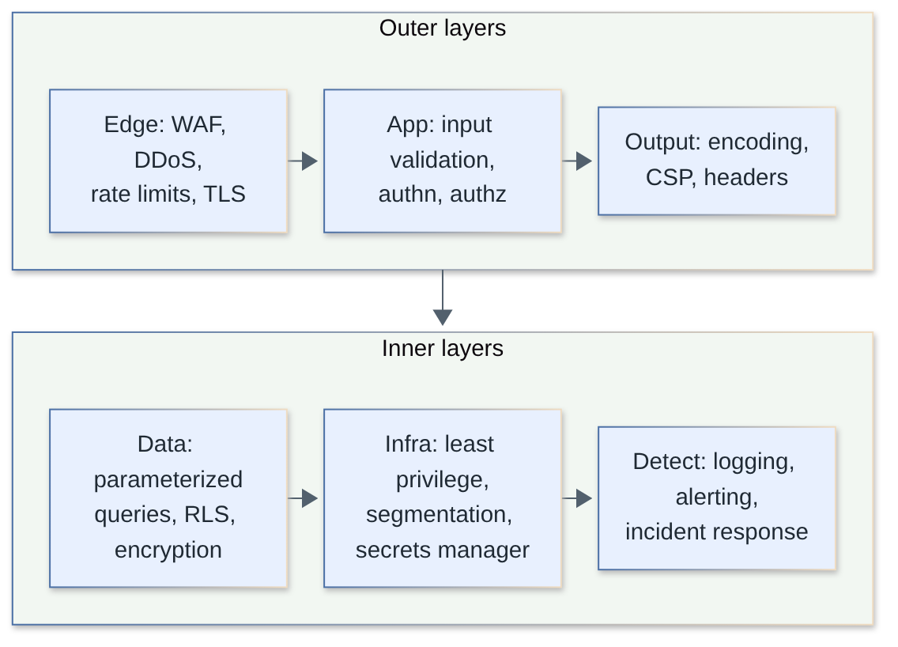
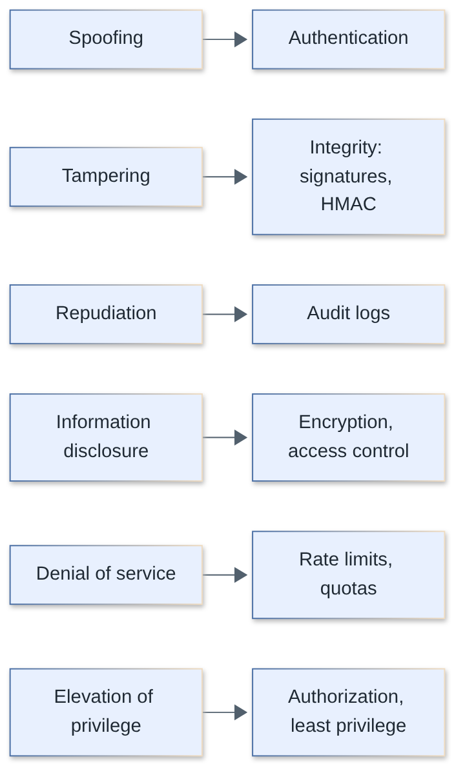
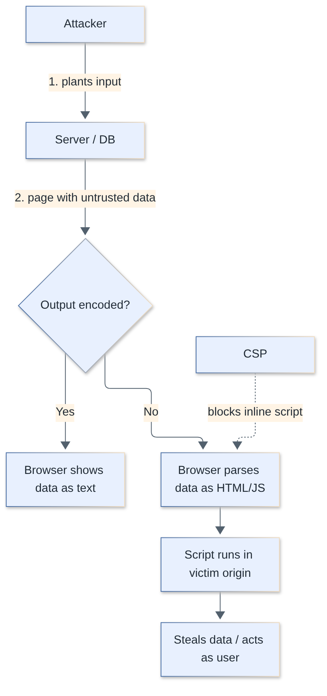
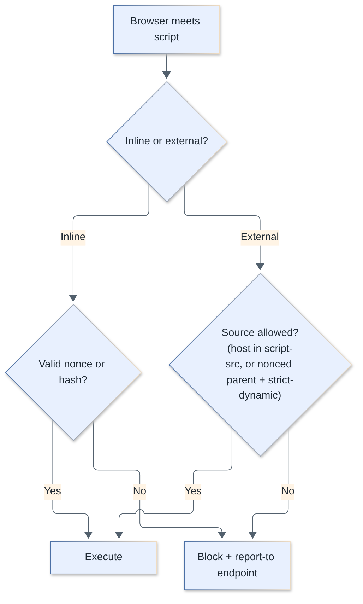
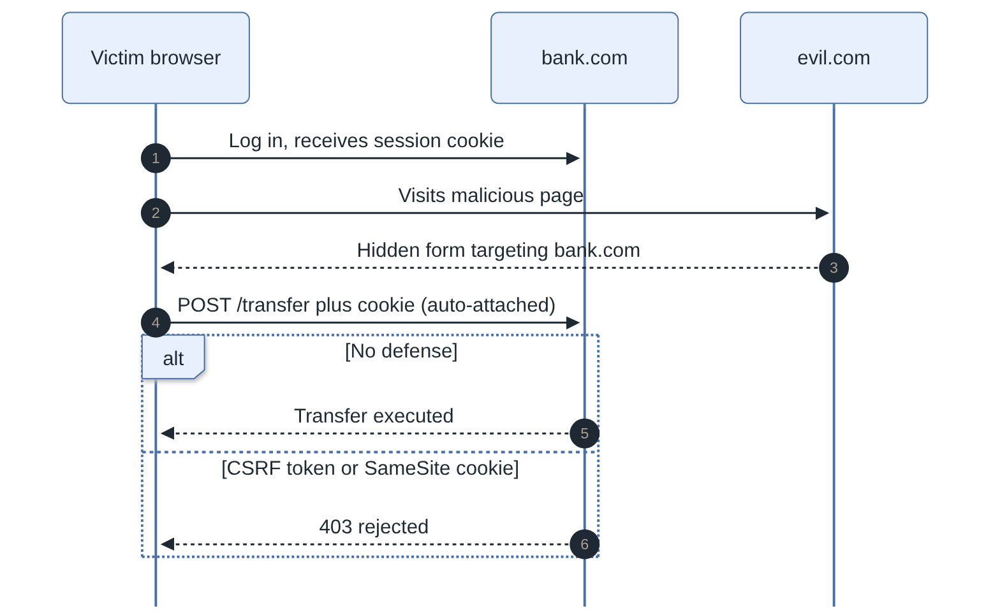
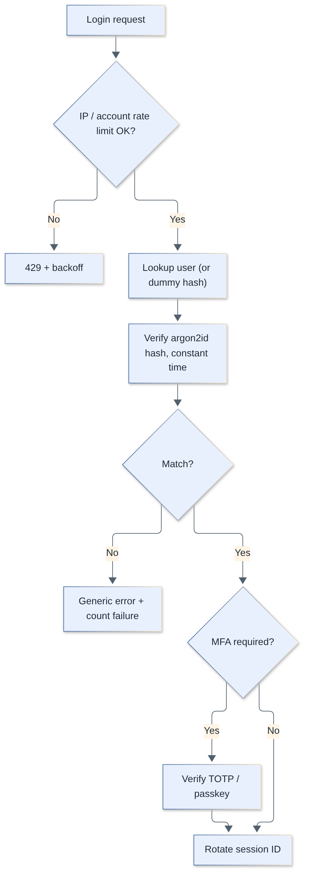
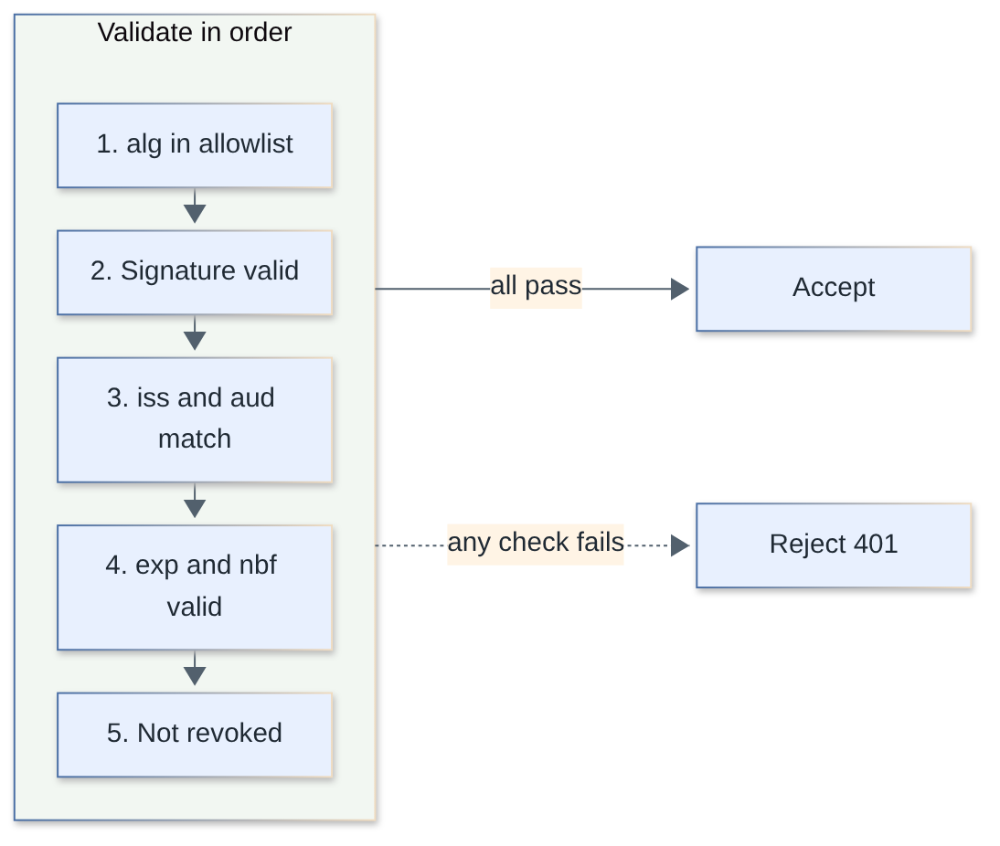
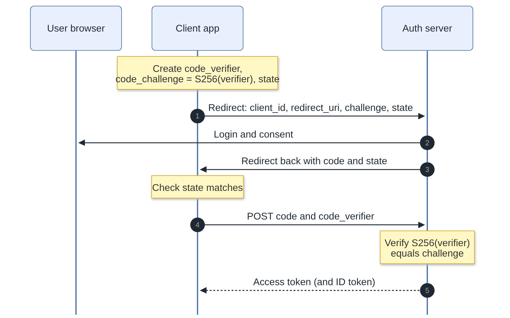
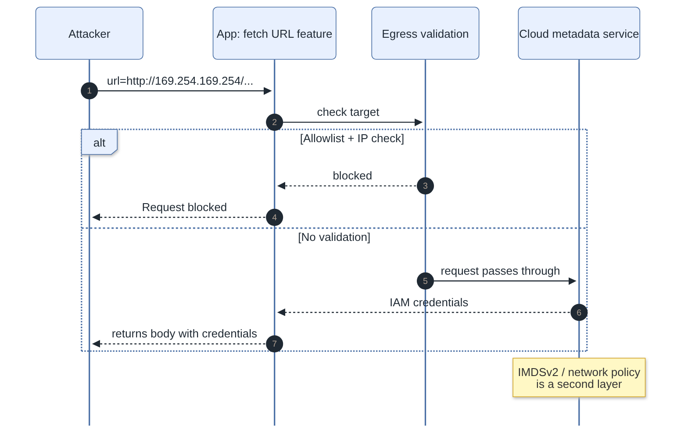

# Web Security Interview Questions

Web application security for fullstack developers, from a defensive perspective: how common attacks work conceptually and how to prevent them in TypeScript, Node.js, React, and SQL. Questions follow the current OWASP Top 10:2025.

**Levels:** `🟢 Junior` · `🟡 Middle` · `🔴 Senior`

## Table of contents

**Fundamentals & Threat Modeling**

1. [What is the OWASP Top 10, and what does the 2025 edition contain?](#1-what-is-the-owasp-top-10-and-what-does-the-2025-edition-contain)
2. [What is the difference between hashing, encryption, and encoding?](#2-what-is-the-difference-between-hashing-encryption-and-encoding)
3. [What are defense in depth and the principle of least privilege?](#3-what-are-defense-in-depth-and-the-principle-of-least-privilege)
4. [How do you do threat modeling? Explain STRIDE.](#4-how-do-you-do-threat-modeling-explain-stride)

**Injection & Input Handling**

5. [What is SQL injection and how do you prevent it?](#5-what-is-sql-injection-and-how-do-you-prevent-it)
6. [How do NoSQL injection and OS command injection differ from SQL injection, and how do you prevent them?](#6-how-do-nosql-injection-and-os-command-injection-differ-from-sql-injection-and-how-do-you-prevent-them)
7. [What is path traversal and how do you prevent it?](#7-what-is-path-traversal-and-how-do-you-prevent-it)
8. [What is insecure deserialization?](#8-what-is-insecure-deserialization)
9. [What is prototype pollution and how do you defend against it?](#9-what-is-prototype-pollution-and-how-do-you-defend-against-it)

**XSS, CSP & Browser Security**

10. [What is XSS? Explain stored, reflected, and DOM-based XSS.](#10-what-is-xss-explain-stored-reflected-and-dom-based-xss)
11. [How does React protect against XSS, and what are the escape hatches?](#11-how-does-react-protect-against-xss-and-what-are-the-escape-hatches)
12. [Output encoding vs. input validation vs. sanitization: what is each for?](#12-output-encoding-vs-input-validation-vs-sanitization-what-is-each-for)
13. [What is a Content Security Policy (CSP) and how does it help?](#13-what-is-a-content-security-policy-csp-and-how-does-it-help)
14. [How do you deploy a strict CSP with nonces and `strict-dynamic` without breaking the app?](#14-how-do-you-deploy-a-strict-csp-with-nonces-and-strict-dynamic-without-breaking-the-app)
15. [What is clickjacking and how do you prevent it?](#15-what-is-clickjacking-and-how-do-you-prevent-it)
16. [Which security headers should every web app set?](#16-which-security-headers-should-every-web-app-set)
17. [What is an open redirect and why does it matter?](#17-what-is-an-open-redirect-and-why-does-it-matter)

**CSRF & CORS**

18. [What is CSRF and how do you prevent it?](#18-what-is-csrf-and-how-do-you-prevent-it)
19. [How do SameSite cookies work, and are they enough against CSRF?](#19-how-do-samesite-cookies-work-and-are-they-enough-against-csrf)
20. [Are JSON APIs automatically safe from CSRF?](#20-are-json-apis-automatically-safe-from-csrf)
21. [What is CORS, and why is it not a security boundary for your server?](#21-what-is-cors-and-why-is-it-not-a-security-boundary-for-your-server)
22. [What are common CORS misconfigurations?](#22-what-are-common-cors-misconfigurations)

**Authentication & Sessions**

23. [How should passwords be stored?](#23-how-should-passwords-be-stored)
24. [How do you defend against brute force, credential stuffing, and account enumeration?](#24-how-do-you-defend-against-brute-force-credential-stuffing-and-account-enumeration)
25. [What MFA options exist and how do they compare?](#25-what-mfa-options-exist-and-how-do-they-compare)
26. [How do passkeys and WebAuthn work, and why are they phishing-resistant?](#26-how-do-passkeys-and-webauthn-work-and-why-are-they-phishing-resistant)
27. [Which cookie flags secure a session cookie?](#27-which-cookie-flags-secure-a-session-cookie)
28. [What is session fixation and how do you manage session lifecycle securely?](#28-what-is-session-fixation-and-how-do-you-manage-session-lifecycle-securely)
29. [What are the common JWT pitfalls and how do you validate a JWT correctly?](#29-what-are-the-common-jwt-pitfalls-and-how-do-you-validate-a-jwt-correctly)
30. [Where should you store a JWT, and how do you handle revocation?](#30-where-should-you-store-a-jwt-and-how-do-you-handle-revocation)
31. [How does the OAuth 2.0 authorization code flow with PKCE work, and what do `state` and `redirect_uri` protect?](#31-how-does-the-oauth-20-authorization-code-flow-with-pkce-work-and-what-do-state-and-redirect_uri-protect)
32. [What are common OAuth/OIDC implementation vulnerabilities in the wild?](#32-what-are-common-oauthoidc-implementation-vulnerabilities-in-the-wild)

**Access Control & SSRF**

33. [What is broken access control and why is it #1 on the OWASP list?](#33-what-is-broken-access-control-and-why-is-it-1-on-the-owasp-list)
34. [What are IDOR and BOLA, and how do you prevent them?](#34-what-are-idor-and-bola-and-how-do-you-prevent-them)
35. [How do you design authorization for a multi-tenant application?](#35-how-do-you-design-authorization-for-a-multi-tenant-application)
36. [What is SSRF and how do you defend against it?](#36-what-is-ssrf-and-how-do-you-defend-against-it)
37. [What is mass assignment (BOPLA) and how do you prevent it?](#37-what-is-mass-assignment-bopla-and-how-do-you-prevent-it)

**Data Protection, Transport & Secrets**

38. [How do TLS, HTTPS, and HSTS work together to protect traffic?](#38-how-do-tls-https-and-hsts-work-together-to-protect-traffic)
39. [Encryption at rest vs. in transit: what does each protect, and how do you manage keys?](#39-encryption-at-rest-vs-in-transit-what-does-each-protect-and-how-do-you-manage-keys)
40. [How do you manage secrets, and what do you do when one leaks?](#40-how-do-you-manage-secrets-and-what-do-you-do-when-one-leaks)
41. [How do you secure file uploads?](#41-how-do-you-secure-file-uploads)
42. [What should you log for security, and how do you avoid leaking PII or secrets in logs?](#42-what-should-you-log-for-security-and-how-do-you-avoid-leaking-pii-or-secrets-in-logs)

**Supply Chain, Abuse & Pipeline Security**

43. [How do you secure your npm supply chain?](#43-how-do-you-secure-your-npm-supply-chain)
44. [What is dependency confusion and how do you defend against it and similar package attacks?](#44-what-is-dependency-confusion-and-how-do-you-defend-against-it-and-similar-package-attacks)
45. [How do you implement rate limiting and bot protection?](#45-how-do-you-implement-rate-limiting-and-bot-protection)
46. [How do you secure a CI/CD pipeline?](#46-how-do-you-secure-a-cicd-pipeline)
47. [How would you design a secure authentication and session system for a new web app end to end?](#47-how-would-you-design-a-secure-authentication-and-session-system-for-a-new-web-app-end-to-end)

## Fundamentals & Threat Modeling

### 1. What is the OWASP Top 10, and what does the 2025 edition contain?

`🟢 Junior` · `#owasp` `#fundamentals`

The OWASP Top 10 is a consensus awareness list of the most critical web application security risks, used as a baseline for training and audits. The current edition is **OWASP Top 10:2025**, released in November 2025 (the previous edition was 2021).

| # | OWASP Top 10:2025 | Notes vs. 2021 |
|---|---|---|
| A01 | Broken Access Control | Still #1; SSRF is now folded in |
| A02 | Security Misconfiguration | Up from #5 |
| A03 | Software Supply Chain Failures | Broadened from "Vulnerable and Outdated Components" |
| A04 | Cryptographic Failures | Down from #2 |
| A05 | Injection | Down from #3 (includes XSS) |
| A06 | Insecure Design | Down from #4 |
| A07 | Authentication Failures | Renamed |
| A08 | Software or Data Integrity Failures | Unchanged position |
| A09 | Logging & Alerting Failures | Renamed to stress alerting |
| A10 | Mishandling of Exceptional Conditions | New (error handling, fail-open logic) |

It is a *risk awareness* document, not a checklist: passing "no Top 10 issues" does not mean "secure". For depth, pair it with the OWASP ASVS (a verifiable requirements standard) and the Cheat Sheet Series.

```ts
// A10 example: failing open is a vulnerability
async function isAllowed(user: User, resource: string): Promise<boolean> {
  try {
    return await policyService.check(user, resource);
  } catch {
    return true; // VULNERABLE: policy outage grants everyone access
  }
}
// Fixed: fail closed
//   catch { return false; }
```

> **Follow-up:** Which category would "an npm package with a malicious postinstall" fall under? A03 Software Supply Chain Failures.

[↑ Back to top](#table-of-contents)

### 2. What is the difference between hashing, encryption, and encoding?

`🟢 Junior` · `#crypto` `#fundamentals`

**Encoding** transforms data into another format for transport (no secrecy), **encryption** hides data reversibly with a key, **hashing** is a one-way fingerprint. Using the wrong one (e.g. Base64 "protecting" a password) is a classic vulnerability.

| | Encoding | Encryption | Hashing |
|---|---|---|---|
| Purpose | Representation / transport | Confidentiality | Integrity, fingerprint, password verification |
| Reversible | Yes, by anyone | Yes, with the key | No |
| Key | None | Yes | None (HMAC adds a key) |
| Examples | Base64, URL-encoding, UTF-8 | AES-256-GCM, ChaCha20-Poly1305, RSA-OAEP | SHA-256, argon2id, bcrypt |

```ts
import { createHash, createCipheriv, randomBytes } from "node:crypto";

Buffer.from("secret").toString("base64");            // encoding: anyone can decode
createHash("sha256").update("file contents").digest("hex"); // hash: integrity check

const key = randomBytes(32);                         // encryption: AES-256-GCM
const iv = randomBytes(12);
const c = createCipheriv("aes-256-gcm", key, iv);
const ct = Buffer.concat([c.update("secret"), c.final()]);
const tag = c.getAuthTag();                          // store iv + tag + ct together
```

Passwords need a *slow, salted, memory-hard password hash* (argon2id), not a plain SHA-256 — see question 23. Never reuse an IV/nonce with the same key in GCM.

> **Follow-up:** Hash vs HMAC? HMAC mixes in a secret key so only key holders can produce or verify the tag (webhook signatures); a plain hash can be recomputed by anyone.

[↑ Back to top](#table-of-contents)

### 3. What are defense in depth and the principle of least privilege?

`🟢 Junior` · `#architecture` `#fundamentals`

**Defense in depth** means layering independent controls so one failure does not cause a breach. **Least privilege** means every user, service, token, and DB role gets only the permissions it needs, for only as long as needed.



```sql
-- Least privilege for the app's database role
CREATE ROLE app_rw LOGIN PASSWORD '...';
GRANT SELECT, INSERT, UPDATE ON orders, order_items TO app_rw;
-- no DROP, no access to other schemas, no superuser
-- migrations run under a different, separately-held role
```

```yaml
# Least privilege in CI: GitHub Actions token is read-only by default
permissions:
  contents: read
```

Examples: SQL injection exists, but the DB role cannot read the `users` table; XSS exists, but HttpOnly cookies and CSP limit the damage; a leaked key exists, but it is scoped to one bucket and expires.

> **Follow-up:** Isn't layering redundant? No: layers are chosen so they fail differently. Redundancy of the *same* control (two copies of the same input filter) is not defense in depth.

[↑ Back to top](#table-of-contents)

### 4. How do you do threat modeling? Explain STRIDE.

`🔴 Senior` · `#threat-modeling` `#design`

Threat modeling is a structured, early-stage exercise answering four questions: *What are we building? What can go wrong? What will we do about it? Did we do a good enough job?* STRIDE is a mnemonic for the "what can go wrong" step, applied to each element and trust boundary of a data-flow diagram.



| Letter | Threat | Violates | Typical mitigation |
|---|---|---|---|
| S | Spoofing | Authenticity | Strong auth, mTLS, signed webhooks |
| T | Tampering | Integrity | TLS, signatures, DB constraints, checksums |
| R | Repudiation | Non-repudiation | Tamper-evident audit logs |
| I | Information disclosure | Confidentiality | Encryption, access control, no PII in logs |
| D | Denial of service | Availability | Rate limits, quotas, timeouts, autoscaling |
| E | Elevation of privilege | Authorization | Server-side authz checks, least privilege |

Process: (1) draw a data-flow diagram with processes, data stores, external actors, and **trust boundaries** (browser to API, API to DB, API to third party); (2) walk each flow/boundary with STRIDE; (3) rank threats (DREAD, CVSS, or simple likelihood x impact); (4) decide to mitigate, accept, transfer, or avoid; (5) record in tickets and revisit when the design changes.

Example: "File upload to S3 via presigned URL". Tampering: attacker uploads an HTML file served from our origin. Mitigation: restrict content-type in the presigned policy, serve from a separate cookieless domain, `Content-Disposition: attachment`. DoS: size limit in the policy.

> **Follow-up:** When do you do it? At design time and on significant change, not once a year. Cheap early; expensive after launch. Alternatives/complements: PASTA, attack trees, LINDDUN (privacy).

[↑ Back to top](#table-of-contents)

## Injection & Input Handling

### 5. What is SQL injection and how do you prevent it?

`🟢 Junior` · `#injection` `#sql`

SQL injection happens when untrusted input is concatenated into a query so the database parses data as SQL. The fix is **parameterized queries (prepared statements)**, which send the SQL text and values separately so values can never change query structure.

```ts
// VULNERABLE: string concatenation
app.get("/users", async (req, res) => {
  const rows = await db.query(
    `SELECT id, email FROM users WHERE email = '${req.query.email}'`
  );
  res.json(rows.rows);
});

// FIXED: parameterized (node-postgres)
app.get("/users", async (req, res) => {
  const rows = await db.query(
    "SELECT id, email FROM users WHERE email = $1",
    [String(req.query.email)]
  );
  res.json(rows.rows);
});
```

Things parameters cannot do: bind **identifiers** (table/column names), `ORDER BY` direction, or `LIMIT` in some drivers. For those, map user input to an allowlist:

```ts
const SORTABLE = { created: "created_at", name: "name" } as const;
const col = SORTABLE[req.query.sort as keyof typeof SORTABLE] ?? "created_at";
const dir = req.query.dir === "desc" ? "DESC" : "ASC";
await db.query(`SELECT * FROM posts ORDER BY ${col} ${dir}`);
```

| Defense | Role |
|---|---|
| Parameterized queries / ORM query builders | Primary fix |
| Allowlist for identifiers | Where binding is impossible |
| Least-privilege DB role | Limits blast radius |
| Input validation (types, length) | Defense in depth, not the fix |
| Escaping by hand | Fragile; avoid |

ORMs are safe by default but have raw escape hatches (`prisma.$queryRawUnsafe`, `sequelize.query` with interpolation, Knex `raw` with concatenation). Prisma's tagged `$queryRaw` template parameterizes values.

> **Follow-up:** Is validating input "no quotes allowed" enough? No: it breaks legitimate data (O'Brien) and filters are routinely bypassed. Fix the construction of the query, not the data.

[↑ Back to top](#table-of-contents)

### 6. How do NoSQL injection and OS command injection differ from SQL injection, and how do you prevent them?

`🟡 Middle` · `#injection` `#nosql` `#node`

Same root cause: untrusted data crosses into an interpreter as *code or structure*. In NoSQL, the "code" is query operators in a JSON object; in command injection, it is shell syntax.

**NoSQL (MongoDB):** if the body parser yields objects, `{ "password": { "$ne": null } }` becomes a query operator instead of a string.

```ts
// VULNERABLE: req.body.password may be an object like { $ne: null }
const user = await users.findOne({ email: req.body.email, password: req.body.password });

// FIXED: validate types at the boundary (zod) and never compare plaintext passwords
import { z } from "zod";
const Body = z.object({ email: z.string().email(), password: z.string().min(1) });
const { email, password } = Body.parse(req.body);          // rejects objects
const user = await users.findOne({ email });               // then verify hash separately
```

Also beware `$where` and server-side JavaScript evaluation: avoid them.

**Command injection:**

```ts
import { exec, execFile } from "node:child_process";

// VULNERABLE: the shell parses the string ("; rm -rf ..." etc.)
exec(`convert ${req.query.file} out.png`);

// FIXED: no shell, arguments passed as an array, validated input
execFile("convert", [safeFileName, "out.png"]);
```

| Injection | Interpreter | Primary fix |
|---|---|---|
| SQL | SQL engine | Parameterized queries |
| NoSQL | Query operators | Schema validation of types, strict query building |
| OS command | Shell | `execFile`/`spawn` without shell, or a library instead of a CLI |
| LDAP / XPath / template | respective parser | Parameterization / escaping / no user-controlled templates |

Even with `execFile`, an argument starting with `-` can be interpreted as an option by the program; pass `--` before user-controlled positional arguments where supported.

> **Follow-up:** Best fix for command injection? Don't shell out: use a native library (e.g. sharp for images).

[↑ Back to top](#table-of-contents)

### 7. What is path traversal and how do you prevent it?

`🟡 Middle` · `#injection` `#filesystem`

Path traversal (directory traversal) lets an attacker read or write files outside the intended directory by supplying sequences like `../` (or encoded variants) in a file name. Prevent it by resolving the final path and verifying it is still inside the allowed base directory, or better, never using user input as a path at all.

```ts
import path from "node:path";
import fs from "node:fs/promises";

const BASE = path.resolve("/srv/app/uploads");

// VULNERABLE
app.get("/files/:name", (req, res) =>
  res.sendFile(path.join(BASE, req.params.name)) // "../../etc/passwd" escapes
);

// FIXED
app.get("/files/:name", async (req, res) => {
  const resolved = path.resolve(BASE, req.params.name);
  if (!resolved.startsWith(BASE + path.sep)) return res.sendStatus(400);
  const real = await fs.realpath(resolved);              // defeat symlinks
  if (!real.startsWith(BASE + path.sep)) return res.sendStatus(400);
  res.sendFile(real);
});
```

Better design: store files under random IDs (UUID) with metadata in the DB, so the client never sends a path. Run the process with a filesystem user that can only read the upload directory. Also relevant for archive extraction ("zip slip"): validate each entry's resolved path before writing.

> **Follow-up:** Why `BASE + path.sep` and not just `BASE`? Otherwise `/srv/app/uploads-private` passes a `startsWith("/srv/app/uploads")` check.

[↑ Back to top](#table-of-contents)

### 8. What is insecure deserialization?

`🔴 Senior` · `#injection` `#serialization`

Insecure deserialization occurs when an application reconstructs objects from untrusted data using a format that can instantiate arbitrary types or run code during parsing, letting attackers trigger code execution, logic abuse, or DoS. In Java (`ObjectInputStream`), PHP (`unserialize`), Python (`pickle`), and .NET it can lead to remote code execution through "gadget chains" in existing classes.

In Node/TypeScript, `JSON.parse` is data-only and safe from code execution, but the dangers are:

- Libraries that eval or revive types: `node-serialize` (known RCE), `js-yaml` with unsafe schemas in old versions, `eval`/`new Function` for "JSON-ish" input.
- Trusting the *shape* of parsed data (type confusion, prototype pollution, mass assignment).
- Deserializing untrusted data inside signed-looking cookies or cache entries that aren't actually authenticated.
- Parser DoS: deeply nested JSON, XML entity expansion (billion laughs), zip bombs.

```ts
// VULNERABLE: trusting client-supplied state
const prefs = JSON.parse(Buffer.from(req.cookies.prefs, "base64").toString());
if (prefs.isAdmin) { /* ... */ }

// FIXED: validate shape, and keep authorization data server-side (or authenticated)
const Prefs = z.object({ theme: z.enum(["light", "dark"]) }).strict();
const prefs = Prefs.parse(JSON.parse(raw));
```

| Defense | Detail |
|---|---|
| Use data-only formats | JSON, Protobuf with schema validation |
| Never deserialize untrusted native object formats | pickle, Java serialization, PHP serialize |
| Authenticate before parsing | HMAC/AEAD-sealed blobs (verify before deserialize) |
| Limit size and depth | Body size limits, parser limits |
| Keep dependencies patched | Gadget libraries are the usual vector |

> **Follow-up:** Why does signing help? An attacker cannot craft a malicious blob without the key, but the signing key must stay secret and the check must precede deserialization.

[↑ Back to top](#table-of-contents)

### 9. What is prototype pollution and how do you defend against it?

`🔴 Senior` · `#injection` `#javascript`

Prototype pollution is when an attacker modifies `Object.prototype` (via keys like `__proto__` or `constructor.prototype`) through an unsafe recursive merge/set, so every object in the process inherits attacker-chosen properties. Impact ranges from logic bypass (`isAdmin` appears true on every object) to RCE when polluted values reach gadgets such as child-process options or template engines.

```ts
// VULNERABLE: naive deep merge
function merge(target: any, src: any) {
  for (const key in src) {
    if (typeof src[key] === "object" && src[key] !== null) {
      target[key] = merge(target[key] ?? {}, src[key]);
    } else target[key] = src[key];
  }
  return target;
}
// merge({}, JSON.parse('{"__proto__": {"isAdmin": true}}'))  -> ({}).isAdmin === true

// FIXED: block dangerous keys and avoid inheritance
const FORBIDDEN = new Set(["__proto__", "constructor", "prototype"]);
function safeMerge(target: Record<string, unknown>, src: Record<string, unknown>) {
  for (const key of Object.keys(src)) {
    if (FORBIDDEN.has(key)) continue;
    const v = src[key];
    if (v && typeof v === "object" && !Array.isArray(v)) {
      const cur = Object.hasOwn(target, key) ? target[key] : {};
      target[key] = safeMerge(cur as Record<string, unknown>, v as Record<string, unknown>);
    } else target[key] = v;
  }
  return target;
}
```

| Mitigation | Notes |
|---|---|
| Validate input against a schema (strict, no unknown keys) | Best first line |
| `Object.create(null)` or `Map` for dictionaries | No prototype to pollute |
| `Object.freeze(Object.prototype)` | Hardens, but can break libraries |
| Node `--disable-proto=delete` | Removes `__proto__` accessor |
| Use `Object.hasOwn` instead of `in` for checks | Avoids inherited values |
| Keep lodash, minimist, etc. patched | Many historical CVEs |

> **Follow-up:** Why can JSON.parse produce `__proto__` safely but merge doesn't? `JSON.parse` creates an *own* property named `__proto__`; the unsafe merge then assigns through it on the target, hitting the real prototype.

[↑ Back to top](#table-of-contents)

## XSS, CSP & Browser Security

### 10. What is XSS? Explain stored, reflected, and DOM-based XSS.

`🟢 Junior` · `#xss` `#browser`

Cross-site scripting (XSS) is when attacker-controlled data is rendered by the browser as executable script in your origin. The script then runs with the victim's session: it can read the DOM, call your APIs as the user, and exfiltrate anything not protected by HttpOnly. The core fix is **context-aware output encoding** plus CSP as a safety net.



| Type | Where the payload lives | Where it becomes code | Example source |
|---|---|---|---|
| Stored | Persisted in DB | Server renders it to every viewer | Comment, profile name |
| Reflected | In the request (query/form) | Server echoes it in the response | `?q=` shown on a search page |
| DOM-based | In URL/`postMessage`/storage | Client JS writes it into a sink | `location.hash` to `innerHTML` |

```ts
// DOM XSS: VULNERABLE
document.getElementById("welcome")!.innerHTML = "Hi " + new URLSearchParams(location.search).get("name");

// FIXED: text sink, no HTML parsing
document.getElementById("welcome")!.textContent = "Hi " + new URLSearchParams(location.search).get("name");
```

```ts
// Server-side reflected XSS: VULNERABLE
res.send(`<h1>Results for ${req.query.q}</h1>`);
// FIXED: use a template engine with auto-escaping (or escape-html)
import escapeHtml from "escape-html";
res.send(`<h1>Results for ${escapeHtml(String(req.query.q))}</h1>`);
```

Dangerous DOM sinks: `innerHTML`, `outerHTML`, `insertAdjacentHTML`, `document.write`, `eval`, `setTimeout(string)`, `element.setAttribute("onclick", ...)`, `href`/`src` with `javascript:` URLs.

> **Follow-up:** Does HttpOnly stop XSS? No, it only stops reading the cookie via JS. The attacker's script still makes authenticated requests as the user.

[↑ Back to top](#table-of-contents)

### 11. How does React protect against XSS, and what are the escape hatches?

`🟡 Middle` · `#xss` `#react`

React escapes values interpolated in JSX (`{value}`) as text, so strings cannot become markup. XSS in React appears when you bypass this: `dangerouslySetInnerHTML`, unsafe URLs in `href`/`src`, direct DOM access, server-rendered HTML strings, and third-party libraries.

```tsx
// SAFE: rendered as text even if comment contains ""
<p>{comment.body}</p>

// VULNERABLE: raw HTML injection
<div dangerouslySetInnerHTML={{ __html: comment.body }} />

// VULNERABLE: javascript: URL executes on click
<a href={user.website}>Website</a>

// FIXED: validate URL scheme
function safeUrl(raw: string): string {
  try {
    const u = new URL(raw);
    return ["http:", "https:"].includes(u.protocol) ? u.href : "#";
  } catch { return "#"; }
}
<a href={safeUrl(user.website)} rel="noopener noreferrer">Website</a>

// If HTML is truly required: sanitize first
import DOMPurify from "dompurify";
<div dangerouslySetInnerHTML={{ __html: DOMPurify.sanitize(comment.html) }} />
```

| Escape hatch | Risk | Mitigation |
|---|---|---|
| `dangerouslySetInnerHTML` | Raw HTML | Sanitize (DOMPurify) with a restrictive config, or render Markdown to React elements |
| `href`/`src` from user data | `javascript:` URLs | Allowlist `http(s)`/`mailto` |
| `ref.current.innerHTML = ...` | Raw HTML | Use `textContent` |
| Spreading untrusted props `{...obj}` | Attacker-supplied `dangerouslySetInnerHTML` | Pick props explicitly |
| SSR: injecting JSON into `<script>` | `</script>` breaks out | Serialize with escaping of `<` (e.g. `serialize-javascript`) |
| Markdown/rich-text libs | Embedded HTML | Disable raw HTML or sanitize output |

In Next.js, the same applies in server components; also never put secrets in props passed to client components, since they ship to the browser.

> **Follow-up:** Is "React is safe from XSS" true? Only for the default path. Most real React XSS is `dangerouslySetInnerHTML`, `javascript:` links, or vulnerable dependencies.

[↑ Back to top](#table-of-contents)

### 12. Output encoding vs. input validation vs. sanitization: what is each for?

`🟡 Middle` · `#xss` `#sanitization`

**Output encoding** converts data to be inert for the exact context it is output into (HTML body, attribute, JS string, URL, CSS). **Validation** rejects input that doesn't match expectations. **Sanitization** rewrites rich HTML to remove dangerous parts when you must allow some markup. Encode on output, validate on input, sanitize only when HTML is a requirement.

| Technique | When | Weakness |
|---|---|---|
| Output encoding | Always, at the point of output | Must match the context |
| Input validation | At trust boundaries (type, length, format) | Cannot make arbitrary text safe; "name" fields legitimately contain `<` |
| Sanitization (DOMPurify, sanitize-html) | User-provided HTML (WYSIWYG) | Bypasses via library bugs/mutation XSS; keep updated, use strict allowlists |
| CSP / Trusted Types | Defense in depth | Doesn't fix the bug itself |

Context matters: encoding for an HTML body is wrong inside a `<script>` or an unquoted attribute.

```ts
// Different contexts need different encoders
const html = `<p>${escapeHtml(name)}</p>`;                 // HTML text
const attr = `<input value="${escapeHtml(name)}">`;        // quoted attribute
const url  = `/search?q=${encodeURIComponent(name)}`;      // URL component
const js   = `<script>const cfg = ${JSON.stringify(cfg).replace(/</g, "\\u003c")};</script>`; // data in script
```

**Trusted Types** (Chromium, CSP `require-trusted-types-for 'script'`) forces DOM sinks like `innerHTML` to accept only values produced by a policy (e.g. DOMPurify's), turning DOM XSS audits into auditing a few policies. Browser support was not universal at the time of writing, so treat it as hardening.

```ts
// Sanitize on output (not only at save time), with a tight allowlist
DOMPurify.sanitize(dirty, { ALLOWED_TAGS: ["b", "i", "em", "strong", "a", "p", "ul", "li"], ALLOWED_ATTR: ["href"] });
```

> **Follow-up:** Why not sanitize on save? Rules and libraries change; storing raw and sanitizing at render lets you fix past data by upgrading the sanitizer. Many teams store sanitized and re-sanitize on render.

[↑ Back to top](#table-of-contents)

### 13. What is a Content Security Policy (CSP) and how does it help?

`🟡 Middle` · `#csp` `#headers`

CSP is a response header that tells the browser which sources of scripts, styles, frames, and connections are allowed. It is a **second line of defense against XSS**: even if an attacker injects markup, the browser refuses to run script that isn't allowed.



```http
Content-Security-Policy:
  default-src 'self';
  script-src 'self' 'nonce-r4nd0m';
  object-src 'none';
  base-uri 'self';
  frame-ancestors 'none';
  form-action 'self';
  report-to csp-endpoint
```

| Directive | Controls |
|---|---|
| `default-src` | Fallback for fetch directives |
| `script-src` | JS sources (the important one) |
| `object-src 'none'` | Plugins/legacy embeds |
| `base-uri` | `<base>` tag (prevents relative-URL hijack) |
| `frame-ancestors` | Who may frame you (clickjacking; replaces X-Frame-Options) |
| `form-action` | Where forms may submit |
| `connect-src` | fetch/XHR/WebSocket targets |

Allowlist-based policies (`script-src cdn.example.com`) are often bypassable through JSONP or hosted libraries on the allowed host; modern guidance favors nonce- or hash-based "strict" CSP (question 14). Avoid `'unsafe-inline'` and `'unsafe-eval'` in `script-src`.

> **Follow-up:** Does CSP replace output encoding? No; it limits impact when encoding is missed.

[↑ Back to top](#table-of-contents)

### 14. How do you deploy a strict CSP with nonces and `strict-dynamic` without breaking the app?

`🔴 Senior` · `#csp` `#nonce` `#rollout`

Generate a **fresh unguessable nonce per response**, put it on every legitimate `<script nonce>` tag, and use `'strict-dynamic'` so scripts loaded by a trusted (nonced) script are also trusted, without host allowlists. Roll out using `Content-Security-Policy-Report-Only` first.

```ts
// Next.js middleware: per-request nonce
import { NextResponse, type NextRequest } from "next/server";

export function middleware(req: NextRequest) {
  const nonce = Buffer.from(crypto.randomUUID()).toString("base64");
  const csp = [
    `default-src 'self'`,
    `script-src 'nonce-${nonce}' 'strict-dynamic'`,   // 'self' and hosts are ignored by strict-dynamic in modern browsers
    `style-src 'self' 'nonce-${nonce}'`,
    `object-src 'none'`,
    `base-uri 'none'`,
    `frame-ancestors 'none'`,
    `report-to csp-endpoint`,
  ].join("; ");
  const headers = new Headers(req.headers);
  headers.set("x-nonce", nonce);                        // read in layout to tag scripts
  headers.set("Content-Security-Policy", csp);
  const res = NextResponse.next({ request: { headers } });
  res.headers.set("Content-Security-Policy", csp);
  return res;
}
```

Rollout plan:

1. Ship `Content-Security-Policy-Report-Only` with a reporting endpoint; collect violations for 1-2 weeks.
2. Remove inline handlers/inline scripts, tag legitimate ones with the nonce, move third-party tags into a nonced loader.
3. Fix or drop violators (browser-extension noise will appear in reports).
4. Switch to enforcing `Content-Security-Policy`; keep a report-only policy for the *next* stricter version.

| Option | Pros | Cons |
|---|---|---|
| Nonce + strict-dynamic | Robust, works with dynamic loading | Needs per-request HTML (no static caching of the page); framework support required |
| Hash-based | Works for static pages | Must recompute on each change |
| Host allowlist | Easy to start | Often bypassable; large to maintain |

A nonce reused across responses (or cached by a CDN) is worthless. Pages served from a CDN cache must use hashes, or inject nonces at the edge.

> **Follow-up:** What does `strict-dynamic` do to `'self'` and `'unsafe-inline'`? Browsers that support it ignore host allowlists and `'unsafe-inline'`; older browsers fall back to them, which is why you can include them as a compatibility fallback.

[↑ Back to top](#table-of-contents)

### 15. What is clickjacking and how do you prevent it?

`🟡 Middle` · `#clickjacking` `#headers`

Clickjacking tricks users into clicking something on your site that is loaded in a transparent iframe on the attacker's page (UI redress). Prevent it by telling browsers not to let others frame your pages.

```http
Content-Security-Policy: frame-ancestors 'none'
X-Frame-Options: DENY
```

Use `frame-ancestors 'self'` (or an explicit list of partner origins) if you need to be framed by yourself or specific sites. `X-Frame-Options` is the legacy equivalent, kept for old browsers; if both are present, CSP `frame-ancestors` takes precedence in browsers that support it.

```ts
// Express with helmet
import helmet from "helmet";
app.use(helmet({
  contentSecurityPolicy: { directives: { frameAncestors: ["'none'"] } },
}));
```

Frame-busting JavaScript is unreliable (sandboxed iframes can disable it). Sensitive actions (delete account, payments) should also require re-authentication or confirmation, and `SameSite` cookies mean a framed cross-site page generally cannot use the user's session cookies anyway (Lax/Strict).

> **Follow-up:** Why does `frame-ancestors` not work in a `<meta>` tag? The spec doesn't allow it there; it must be an HTTP header.

[↑ Back to top](#table-of-contents)

### 16. Which security headers should every web app set?

`🟢 Junior` · `#headers` `#hardening`

At minimum: HSTS, a CSP, `X-Content-Type-Options: nosniff`, a framing policy, a `Referrer-Policy`, and a restrictive `Permissions-Policy`.

| Header | Typical value | Purpose |
|---|---|---|
| `Strict-Transport-Security` | `max-age=63072000; includeSubDomains; preload` | Force HTTPS |
| `Content-Security-Policy` | see Q13/Q14 | Limit script/resource sources; framing |
| `X-Content-Type-Options` | `nosniff` | Stop MIME sniffing (script served as text) |
| `Referrer-Policy` | `strict-origin-when-cross-origin` | Don't leak full URLs/tokens in Referer |
| `Permissions-Policy` | `camera=(), microphone=(), geolocation=()` | Disable unused browser features |
| `Cross-Origin-Opener-Policy` | `same-origin` | Isolate browsing context (helps against XS-Leaks, enables cross-origin isolation) |
| `Cross-Origin-Resource-Policy` | `same-site` / `same-origin` | Restrict who can embed your resources |
| `X-Frame-Options` | `DENY` | Legacy clickjacking protection |
| `Cache-Control` | `no-store` on sensitive responses | Avoid caching personal data |

Remove or minimize `Server`/`X-Powered-By` (`app.disable("x-powered-by")`): low value as security, but reduces fingerprinting. `X-XSS-Protection` is obsolete; omit it (or `0`).

```ts
import helmet from "helmet";
app.use(helmet()); // sets many of the above with sane defaults; tune CSP explicitly
```

Check your site with securityheaders.com or Mozilla Observatory.

> **Follow-up:** What's the risk of HSTS `preload`? Removal from the preload list is slow; every subdomain must support HTTPS permanently. Roll out with short `max-age` first.

[↑ Back to top](#table-of-contents)

### 17. What is an open redirect and why does it matter?

`🟢 Junior` · `#redirect` `#phishing`

An open redirect is an endpoint that redirects to a URL taken from user input without validating it (`/login?next=https://evil.com`). It enables phishing on a trusted domain and can leak OAuth codes/tokens when abused with redirect URIs. Fix: redirect only to relative paths or an allowlisted set of hosts.

```ts
// VULNERABLE
app.get("/login/done", (req, res) => res.redirect(String(req.query.next)));

// FIXED: only same-site relative paths
function safeNext(raw: unknown): string {
  const s = typeof raw === "string" ? raw : "/";
  // must start with a single "/" and not be protocol-relative ("//host") or "/\host"
  if (!s.startsWith("/") || s.startsWith("//") || s.startsWith("/\\")) return "/";
  const u = new URL(s, "https://app.example.com");
  return u.origin === "https://app.example.com" ? u.pathname + u.search : "/";
}
app.get("/login/done", (req, res) => res.redirect(safeNext(req.query.next)));
```

Parsing the URL with the platform's `URL` class and comparing `origin` is more robust than regexes. If external redirects are needed, use an allowlist of hosts, or an interstitial "you are leaving" page, or sign the target.

> **Follow-up:** Why is this a high risk with OAuth? If the authorization server accepts a redirect URI that includes an open redirect, the code or token can be forwarded to the attacker. Hence exact-match redirect URI validation.

[↑ Back to top](#table-of-contents)

## CSRF & CORS

### 18. What is CSRF and how do you prevent it?

`🟡 Middle` · `#csrf` `#cookies`

Cross-Site Request Forgery makes a victim's browser send an authenticated request to your site from another site, exploiting the fact that browsers automatically attach cookies. It affects cookie-authenticated, state-changing requests. Defenses: `SameSite` cookies, anti-CSRF tokens, and Origin/Fetch-Metadata checks.



```ts
// VULNERABLE: state change on GET, cookie-only auth
app.get("/transfer", requireSession, (req, res) => transfer(req.session.user, req.query));

// FIXED (1): state changes only via POST/PUT/DELETE
// FIXED (2): synchronizer token
import { randomBytes, timingSafeEqual } from "node:crypto";
app.get("/form", requireSession, (req, res) => {
  req.session.csrf ??= randomBytes(32).toString("hex");
  res.render("form", { csrf: req.session.csrf });
});
app.post("/transfer", requireSession, (req, res) => {
  const a = Buffer.from(String(req.body._csrf ?? ""));
  const b = Buffer.from(req.session.csrf ?? "");
  if (a.length !== b.length || !timingSafeEqual(a, b)) return res.sendStatus(403);
  transfer(req.session.user, req.body);
  res.sendStatus(204);
});
```

| Defense | How | Notes |
|---|---|---|
| Synchronizer token | Random per-session value in form, checked server-side | Classic, stateful |
| Double-submit cookie (signed) | Token in cookie and header; server compares (HMAC-bound to session) | Stateless; use signed variant, naive one is weak with subdomain control |
| SameSite=Lax/Strict cookies | Cookie not sent on cross-site requests | Primary modern defense, not sole |
| Origin / Referer check | Reject if `Origin` isn't yours | Cheap defense in depth |
| `Sec-Fetch-Site` check | Reject `cross-site` for state-changing | Supported by modern browsers |
| Custom header + CORS | Require `X-Requested-With`-like header | Works as cross-origin requests need preflight |

Token-based auth via the `Authorization` header (not cookies) is not vulnerable to CSRF because browsers don't attach it automatically.

> **Follow-up:** Is CSRF possible if the attacker can't read the response? Yes; CSRF is about the side effect, not reading data.

[↑ Back to top](#table-of-contents)

### 19. How do SameSite cookies work, and are they enough against CSRF?

`🟡 Middle` · `#csrf` `#cookies`

`SameSite` controls whether the browser sends a cookie on cross-site requests. `Strict` never sends it cross-site, `Lax` sends it only on top-level GET navigations (the default in modern browsers when unspecified), `None` always sends it (requires `Secure`). It's a strong defense but not a complete one.

| Value | Cross-site subrequests (img, fetch, form POST) | Cross-site top-level GET link click |
|---|---|---|
| `Strict` | Not sent | Not sent (user appears logged out on arrival) |
| `Lax` | Not sent | Sent |
| `None; Secure` | Sent | Sent |

Caveats:

- **"Site" is not "origin":** `a.example.com` and `b.example.com` are the *same site*. A vulnerable or attacker-controlled subdomain can send same-site requests; SameSite doesn't protect against that (subdomain takeover, XSS on a sibling).
- GET requests that change state remain exploitable under Lax.
- Some browsers apply a short "Lax+POST" grace window for cookies without an explicit SameSite attribute; set it explicitly.
- Older browsers ignore SameSite.
- Embedded/third-party flows (payments, SSO) may need `None`, losing protection.

```ts
res.cookie("sid", id, { httpOnly: true, secure: true, sameSite: "lax", path: "/" });
```

Combine with a CSRF token or Origin/Fetch-Metadata check for sensitive actions.

> **Follow-up:** What defines "same-site"? The registrable domain (eTLD+1) plus scheme (schemeful same-site): `example.com` and `example.co.uk` are different, `http://` and `https://` count as cross-site in modern browsers.

[↑ Back to top](#table-of-contents)

### 20. Are JSON APIs automatically safe from CSRF?

`🟡 Middle` · `#csrf` `#api`

No. A common myth: "we use `Content-Type: application/json`, so forms can't hit us". Safety comes from the API **not relying on ambient credentials** or from enforcing checks, not from the content type.

Why the myth fails:

- A cross-site HTML form can only send `application/x-www-form-urlencoded`, `multipart/form-data`, or `text/plain`. But if your server parses JSON regardless of the `Content-Type` header (lenient parsers, `express.json({ type: "*/*" })`), a `text/plain` form with a JSON-looking body still works with no preflight.
- `fetch` with `mode: "no-cors"` can send "simple" requests with cookies.
- GraphQL over GET, or APIs accepting both form and JSON bodies, widen the surface.
- A misconfigured CORS policy (`Allow-Origin: *` with reflected origins and credentials) lets attacker origins make *credentialed* JSON requests legitimately.

```ts
// VULNERABLE: accepts any content type as JSON, authenticated by cookie only
app.use(express.json({ type: () => true }));

// FIXED: strict content-type + SameSite cookie + Origin check
app.use(express.json({ type: "application/json" }));
app.use((req, res, next) => {
  if (["POST", "PUT", "PATCH", "DELETE"].includes(req.method)) {
    if (!req.is("application/json")) return res.sendStatus(415);
    const origin = req.get("origin");
    if (origin && origin !== "https://app.example.com") return res.sendStatus(403);
  }
  next();
});
```

| API style | CSRF-exposed? |
|---|---|
| Cookie session + JSON | Yes, unless protected |
| `Authorization: Bearer` from JS memory/storage | No (no ambient credential) |
| Cookie + custom header required + strict CORS | Largely protected (preflight enforces) |

> **Follow-up:** Does requiring a custom header like `X-CSRF: 1` help? Yes: a cross-origin request with a non-safelisted header triggers a preflight, which your CORS policy denies for foreign origins.

[↑ Back to top](#table-of-contents)

### 21. What is CORS, and why is it not a security boundary for your server?

`🟢 Junior` · `#cors` `#browser`

CORS (Cross-Origin Resource Sharing) is a **browser mechanism that relaxes** the Same-Origin Policy: it lets a page on one origin read responses from another origin if the server opts in with headers. It protects *users' browsers*, not your server. It does not stop curl, Postman, server-to-server calls, or attackers' scripts from calling your API.

Common misconceptions:

| Myth | Reality |
|---|---|
| "CORS blocks attackers from calling my API" | Only browsers enforce it; non-browser clients ignore it |
| "CORS prevents CSRF" | The request is still *sent*; only reading the response is blocked (simple requests aren't preflighted) |
| "`Access-Control-Allow-Origin: *` is dangerous because data leaks" | It's only dangerous if the data is protected by ambient credentials/network position; `*` can't be used with credentials |
| "My API is internal, so CORS isn't needed" | Browser on an intranet can still be used to reach it (see DNS rebinding/private network access) |

```ts
import cors from "cors";
app.use(cors({
  origin: ["https://app.example.com"],   // explicit allowlist
  credentials: true,
  methods: ["GET", "POST"],
}));
```

Authorization must always be enforced on the server by authentication and permission checks; CORS only decides which browser origins may *read* responses.

> **Follow-up:** What's a preflight? An automatic `OPTIONS` request the browser sends before "non-simple" cross-origin requests (custom headers, JSON content type, PUT/DELETE) to ask whether the real request is allowed.

[↑ Back to top](#table-of-contents)

### 22. What are common CORS misconfigurations?

`🟡 Middle` · `#cors` `#misconfiguration`

The dangerous patterns all let an untrusted origin make **credentialed** requests and read the response.

```ts
// VULNERABLE 1: reflect any Origin with credentials
app.use((req, res, next) => {
  res.set("Access-Control-Allow-Origin", req.get("origin") ?? "*");
  res.set("Access-Control-Allow-Credentials", "true");
  next();
});

// VULNERABLE 2: weak validation, bypassed by evil-example.com or example.com.evil.io
if (origin?.includes("example.com")) allow(origin);
if (origin?.endsWith("example.com")) allow(origin);

// FIXED: exact-match allowlist, add Vary
const ALLOWED = new Set(["https://app.example.com", "https://admin.example.com"]);
app.use((req, res, next) => {
  const origin = req.get("origin");
  if (origin && ALLOWED.has(origin)) {
    res.set("Access-Control-Allow-Origin", origin);
    res.set("Access-Control-Allow-Credentials", "true");
    res.append("Vary", "Origin");           // avoid cache poisoning across origins
  }
  next();
});
```

| Misconfiguration | Risk |
|---|---|
| Reflecting arbitrary `Origin` + credentials | Any site reads authenticated data |
| Trusting `null` origin | Sandboxed iframes / local files send `Origin: null` |
| Regex/substring checks | Lookalike domains pass |
| Trusting all subdomains | A takeover or XSS on one subdomain compromises the API |
| Missing `Vary: Origin` | Caches serve one origin's headers to another |
| `*` for private/intranet APIs | Public pages can read internal responses from a victim browser |

Browsers refuse `Access-Control-Allow-Origin: *` together with credentials, which is why developers "fix" it by reflecting the origin; that is the bug.

> **Follow-up:** How do you debug "CORS errors"? Check the actual response headers and preflight response in the Network tab; a missing header on an error response (500/401 without CORS headers) is a common cause of misleading CORS errors.

[↑ Back to top](#table-of-contents)

## Authentication & Sessions

### 23. How should passwords be stored?

`🟢 Junior` · `#auth` `#passwords` `#hashing`

Store only a **salted, slow, memory-hard hash** produced by a password-hashing function, with **argon2id** as the first choice. Never store plaintext, reversible encryption, or fast hashes (MD5, SHA-1, SHA-256) as the sole protection.

OWASP Password Storage Cheat Sheet guidance (verified against the current cheat sheet):

| Algorithm | When | Minimum recommended parameters |
|---|---|---|
| **Argon2id** | First choice | 19 MiB memory, 2 iterations, parallelism 1 (other equivalent tradeoffs exist, e.g. 46 MiB / 1 iteration) |
| scrypt | If argon2id unavailable | N = 2^17, r = 8, p = 1 |
| bcrypt | Legacy systems | Work factor 10 or more; input limited to 72 bytes |
| PBKDF2-HMAC-SHA256 | When FIPS-140 compliance is required | 600,000+ iterations |

Tune upward so one hash takes roughly 100 to 500 ms on your hardware.

```ts
import argon2 from "argon2";

// Register
const hash = await argon2.hash(password, {
  type: argon2.argon2id,
  memoryCost: 19456,   // KiB = 19 MiB (OWASP minimum)
  timeCost: 2,
  parallelism: 1,
});                    // salt generated per hash, encoded in the output string

// Login
const ok = await argon2.verify(storedHash, password);        // constant-time compare inside
if (ok && argon2.needsRehash(storedHash, { memoryCost: 19456, timeCost: 2, parallelism: 1 })) {
  // upgrade parameters transparently on successful login
  // (needsRehash compares against the options you pass; its defaults are t=3, m=65536, p=4, so always pass your own)
}

// VULNERABLE
// createHash("sha256").update(password).digest("hex")  // billions of guesses/sec on a GPU
```

Salts defeat rainbow tables and make identical passwords hash differently (modern libraries do this for you). An optional **pepper** (secret key held outside the DB, e.g. in a KMS/HSM) adds protection if only the DB leaks. Also: enforce long passwords (allow at least 64 chars), check against breached-password lists (e.g. Have I Been Pwned k-anonymity API), and don't force periodic rotation without cause (NIST SP 800-63B).

> **Follow-up:** Why is bcrypt's 72-byte limit a problem? Longer passphrases are silently truncated; some teams pre-hash with SHA-256 (base64-encoded) carefully, or just use argon2id.

[↑ Back to top](#table-of-contents)

### 24. How do you defend against brute force, credential stuffing, and account enumeration?

`🟡 Middle` · `#auth` `#rate-limiting` `#abuse`

Brute force guesses passwords for one account; **credential stuffing** replays username/password pairs leaked elsewhere across many accounts (the main real-world threat). **Enumeration** reveals which accounts exist through different responses, messages, or timing. Defend with layered throttling, uniform responses, MFA, and breached-password screening.



```ts
// VULNERABLE: distinguishable responses and timing
const user = await db.user.findUnique({ where: { email } });
if (!user) return res.status(404).json({ error: "No such user" });
if (!(await argon2.verify(user.hash, pw))) return res.status(401).json({ error: "Wrong password" });

// FIXED: same message, same work
const DUMMY_HASH = await argon2.hash("dummy-password", { type: argon2.argon2id });
const user = await db.user.findUnique({ where: { email } });
const ok = await argon2.verify(user?.hash ?? DUMMY_HASH, pw);   // always do the work
if (!user || !ok) return res.status(401).json({ error: "Invalid email or password" });
```

| Control | Targets | Notes |
|---|---|---|
| Per-IP **and** per-account rate limits | Brute force, stuffing | Per-IP alone fails against botnets; per-account alone allows lockout abuse |
| Progressive delays / CAPTCHA after failures | Bots | Prefer delays over hard lockout (lockout enables DoS of victims) |
| MFA | All password attacks | Biggest single win |
| Breached-password check | Stuffing | Block known-leaked passwords at signup/change |
| Generic error messages and equal timing | Enumeration | Also on "forgot password" ("If an account exists, we sent an email") and signup (email-based confirmation flow) |
| Device/IP reputation, anomaly detection, notify user on new login | Stuffing | Bot management products help |
| Credential-less alternatives (passkeys) | Everything | Question 26 |

> **Follow-up:** Why can account lockout be harmful? An attacker can lock out any victim by failing logins; use throttling with exponential backoff and out-of-band unlock instead.

[↑ Back to top](#table-of-contents)

### 25. What MFA options exist and how do they compare?

`🟡 Middle` · `#auth` `#mfa`

MFA requires two or more factor categories (knowledge, possession, inherence). Strength varies a lot: phishing-resistant methods (WebAuthn/passkeys) are far stronger than SMS codes.

| Method | Phishing-resistant? | Notes |
|---|---|---|
| SMS / voice OTP | No | SIM swap, SS7 interception; better than nothing |
| Email OTP / magic link | No | Only as strong as the mailbox |
| TOTP (RFC 6238, authenticator app) | No | Real-time phishing proxies relay codes |
| Push approval | No | MFA fatigue / prompt bombing; use number matching |
| WebAuthn security key / passkey | **Yes** | Origin-bound; nothing to type or relay |
| Recovery codes | n/a | Single-use, hashed at rest like passwords |

```ts
import { authenticator } from "otplib";

// Enrollment: generate secret, show QR, store the secret ENCRYPTED, verify one code first
const secret = authenticator.generateSecret();
// Login step 2
authenticator.options = { window: 1 };            // tolerate 1 step of clock drift
const valid = authenticator.check(code, decrypt(user.totpSecretEnc));
// Also: rate-limit attempts and reject reuse of a code already accepted in this window
```

Implementation gotchas: throttle the second step (6 digits is brute-forceable without limits), bind the pending-MFA state to the session after the password step, don't allow a downgrade through a weaker fallback (SMS recovery that bypasses a security key), and require re-authentication before changing MFA settings.

> **Follow-up:** What is MFA fatigue? An attacker triggers repeated push prompts hoping the user approves one; mitigate with number matching, rate limits, and alerts.

[↑ Back to top](#table-of-contents)

### 26. How do passkeys and WebAuthn work, and why are they phishing-resistant?

`🔴 Senior` · `#auth` `#webauthn` `#passkeys`

WebAuthn is a W3C standard where the user's authenticator (device, security key, password manager) creates a **per-site public/private key pair**. The server stores only the public key. Login is a signature over a server challenge; the browser binds the credential to the **relying party ID (your domain)**, so a lookalike site can't obtain a valid assertion. Passkeys are discoverable, often synced WebAuthn credentials that replace passwords.

Flow:

1. **Registration:** server sends a random challenge and RP ID; authenticator generates a key pair and returns the public key plus attestation/client data; server verifies the challenge and origin and stores the credential ID and public key.
2. **Authentication:** server sends a new challenge; authenticator (after user verification: biometric or PIN) signs `authenticatorData + hash(clientDataJSON)`; server verifies signature, challenge, origin, RP ID hash, and the **signature counter** where meaningful.

```ts
// Using @simplewebauthn/server
import { generateAuthenticationOptions, verifyAuthenticationResponse } from "@simplewebauthn/server";

const options = await generateAuthenticationOptions({ rpID: "example.com", userVerification: "required" });
req.session.challenge = options.challenge;      // single-use, short-lived

const v = await verifyAuthenticationResponse({
  response: body,
  expectedChallenge: req.session.challenge,
  expectedOrigin: "https://example.com",
  expectedRPID: "example.com",
  credential: storedCredential,                 // { id, publicKey, counter, transports? } (v10+/v13 API)
  requireUserVerification: true,                // default is true; keep it consistent with userVerification above
});
// on success: persist verification.authenticationInfo.newCounter back to the stored credential
```

| Property | Passwords + TOTP | Passkeys |
|---|---|---|
| Phishable | Yes | No (origin-bound) |
| Server breach impact | Hashes crackable | Public keys only, useless to attackers |
| Credential reuse | Common | Impossible (unique per site) |
| Recovery | Email reset | The hard problem: lost devices, cross-ecosystem sync |

Design concerns: **account recovery is the new weakest link** (a weak fallback negates the benefit), allow multiple passkeys per account, keep a deliberate fallback policy, and for high-assurance cases require device-bound credentials and attestation.

> **Follow-up:** What does an attacker on a phishing site get? A signature scoped to the wrong origin, rejected by the real server. The user has nothing secret to type.

[↑ Back to top](#table-of-contents)

### 27. Which cookie flags secure a session cookie?

`🟢 Junior` · `#sessions` `#cookies`

Set `HttpOnly`, `Secure`, `SameSite` (Lax or Strict), a sensible `Path`, short lifetimes, and where possible the `__Host-` prefix.

| Attribute | Effect |
|---|---|
| `HttpOnly` | Not readable by JS (`document.cookie`): limits theft via XSS |
| `Secure` | Sent only over HTTPS |
| `SameSite=Lax/Strict` | Mitigates CSRF (Q19) |
| `__Host-` prefix | Browser enforces `Secure`, `Path=/`, **no `Domain`**: cookie can't be set/overwritten by sibling subdomains or over HTTP |
| `__Secure-` prefix | Enforces `Secure` only |
| `Max-Age` / `Expires` | Limits lifetime; use idle + absolute timeouts server-side too |
| `Partitioned` (CHIPS) | Per-top-level-site storage for embedded cases |

```ts
res.cookie("__Host-sid", sessionId, {
  httpOnly: true,
  secure: true,
  sameSite: "lax",
  path: "/",            // required by __Host-
  // no "domain" attribute
  maxAge: 1000 * 60 * 60 * 8,
});
```

```http
Set-Cookie: __Host-sid=...; Path=/; Secure; HttpOnly; SameSite=Lax; Max-Age=28800
```

Session IDs must be long, random (CSPRNG, 128+ bits of entropy), opaque, and carry no data; the server stores the session state (Redis, DB).

> **Follow-up:** Does HttpOnly stop session hijack via XSS? It stops *stealing* the cookie, not *using* the session from within the page.

[↑ Back to top](#table-of-contents)

### 28. What is session fixation and how do you manage session lifecycle securely?

`🟡 Middle` · `#sessions` `#auth`

Session fixation: the attacker gets the victim to use a session ID the attacker already knows (planted via URL parameter, subdomain cookie, or cookie injection). If the app keeps that ID after login, the attacker's copy becomes authenticated. Fix: **issue a new session ID on any privilege change** (login, role elevation, MFA completion) and invalidate the old one.

```ts
// VULNERABLE: authenticates the existing session object
app.post("/login", async (req, res) => {
  const user = await verify(req.body);
  req.session.userId = user.id;       // same session ID as before login
  res.sendStatus(204);
});

// FIXED (express-session): regenerate on login
app.post("/login", async (req, res, next) => {
  const user = await verify(req.body);
  req.session.regenerate((err) => {
    if (err) return next(err);
    req.session.userId = user.id;
    req.session.save(() => res.sendStatus(204));
  });
});
app.post("/logout", (req, res) => req.session.destroy(() => res.clearCookie("__Host-sid").sendStatus(204)));
```

Lifecycle checklist:

- Accept session IDs only from cookies, never from URLs.
- Idle timeout and absolute timeout; server-side invalidation on logout (not just deleting the cookie).
- Revoke all sessions on password change or reported compromise; show "active sessions" to users.
- Re-authenticate for sensitive actions (change email, add payout).
- Consider binding to coarse device signals and alerting on anomalies, not hard-binding to IP (breaks mobile users).

> **Follow-up:** Does `__Host-` help? Yes: it prevents sibling subdomains or HTTP responses from planting the cookie.

[↑ Back to top](#table-of-contents)

### 29. What are the common JWT pitfalls and how do you validate a JWT correctly?

`🟡 Middle` · `#jwt` `#auth`

A JWT is a signed (JWS) or encrypted (JWE) claim set. Signing gives integrity, **not confidentiality**: the payload is only Base64url-encoded. Most JWT bugs come from trusting the token's own header and from skipping claim validation.



| Pitfall | Attack | Fix |
|---|---|---|
| `alg: none` accepted | Unsigned forged token passes | Server-side algorithm allowlist; reject `none` |
| Algorithm/key confusion | RS256 token re-signed as HS256 using the public key as HMAC secret | Pin the algorithm per key; don't let the token choose |
| Weak HMAC secret | Offline brute force | 256-bit random secret, or use asymmetric keys |
| No `exp`/`aud`/`iss` checks | Token replay across services/tenants | Validate all; short expiry |
| `kid`/`jku`/`x5u` header injection | Attacker points at own key/URL, or path/SQL injection via `kid` | Only trusted JWKS; never fetch URLs from the token |
| Sensitive data in payload | Disclosure | Treat as public; keep PII out |
| Using ID token as API token | Wrong audience | Use access tokens for APIs |

```ts
import jwt from "jsonwebtoken";
import { jwtVerify, createRemoteJWKSet } from "jose";

// VULNERABLE: decode without verifying, or trust whatever alg the token says
const claims = jwt.decode(token);

// FIXED (jose): pinned alg, issuer, audience from trusted JWKS
const JWKS = createRemoteJWKSet(new URL("https://auth.example.com/.well-known/jwks.json"));
const { payload } = await jwtVerify(token, JWKS, {
  issuer: "https://auth.example.com/",
  audience: "api://orders",
  algorithms: ["RS256"],
  clockTolerance: 5,
});
```

Prefer asymmetric signing (RS256/ES256/EdDSA) when many services verify tokens, so verifiers can't mint tokens. Do not use JWTs as sessions by default: a server-side session is simpler and trivially revocable.

> **Follow-up:** `jwt.decode` vs `jwt.verify`? `decode` only parses; never base authorization on it.

[↑ Back to top](#table-of-contents)

### 30. Where should you store a JWT, and how do you handle revocation?

`🔴 Senior` · `#jwt` `#storage` `#revocation`

Neither option is free. **localStorage** is readable by any script on the page (XSS exfiltrates the token for use anywhere, even after the tab closes), while **HttpOnly cookies** can't be read by JS but are automatically sent, so you need CSRF defenses. Recommended default for browser apps: **short-lived access token + rotating refresh token in an HttpOnly, Secure, SameSite cookie** (or a BFF pattern where tokens never reach the browser).

| Storage | XSS impact | CSRF exposure | Notes |
|---|---|---|---|
| `localStorage` / `sessionStorage` | Token stolen and reusable off-site | None | Persistent (localStorage); simple for SPAs |
| In-memory variable | XSS can still call APIs/steal live token, but token gone on reload | None | Needs silent refresh via cookie |
| HttpOnly + Secure + SameSite cookie | Can't be exfiltrated; can still be *used* in-page | Yes: mitigate with SameSite + CSRF checks | Best default |
| BFF (backend-for-frontend) holds tokens, browser gets session cookie | Tokens never in JS | As cookie sessions | Recommended in current OAuth browser-app guidance for high-security apps |

**Revocation** is the inherent weakness of stateless tokens:

- Keep access tokens short (5 to 15 minutes); revoke by letting them expire.
- Make **refresh tokens** stateful: store (hashed) server-side, **rotate on each use**, and detect reuse (a reused old refresh token means theft: revoke the whole token family).
- For instant kill: a denylist of `jti`s (or a per-user `token_version`/`sessions_valid_after` timestamp) checked on each request; that reintroduces state, so ask whether plain sessions are simpler.
- Revoke on logout, password change, MFA reset.

```ts
// Refresh rotation with reuse detection (sketch)
async function refresh(presented: string) {
  const rec = await db.refreshToken.findUnique({ where: { hash: sha256(presented) } });
  if (!rec) throw new Unauthorized();
  if (rec.usedAt) {                        // reuse => likely stolen
    await db.refreshToken.updateMany({ where: { familyId: rec.familyId }, data: { revokedAt: new Date() } });
    throw new Unauthorized();
  }
  await db.refreshToken.update({ where: { id: rec.id }, data: { usedAt: new Date() } });
  return issuePair(rec.userId, rec.familyId);   // new access + new refresh in same family
}
```

> **Follow-up:** Is "HttpOnly cookie = XSS-safe" true? No; XSS still acts as the user. HttpOnly just prevents long-term token theft.

[↑ Back to top](#table-of-contents)

### 31. How does the OAuth 2.0 authorization code flow with PKCE work, and what do `state` and `redirect_uri` protect?

`🟡 Middle` · `#oauth` `#pkce` `#oidc`

In the authorization code flow, the client redirects the user to the authorization server, gets back a short-lived **code**, and exchanges it at the token endpoint. **PKCE** (RFC 7636) binds that exchange to the client that started it: the client creates a random `code_verifier`, sends `code_challenge = BASE64URL(SHA256(verifier))` up front, and proves possession with the verifier when redeeming. A stolen code is useless without the verifier.



| Parameter | Protects against |
|---|---|
| `state` (random, bound to the user's session) | CSRF on the callback (attacker forces victim to log in as attacker or link attacker's account) |
| PKCE `code_verifier` / `code_challenge` | Authorization code interception/injection |
| Exact `redirect_uri` match (pre-registered) | Code/token delivery to attacker URLs, open-redirect chaining |
| `nonce` (OIDC) | ID token replay |
| `aud`/`iss` checks | Token substitution |

```ts
import { randomBytes, createHash } from "node:crypto";
const b64u = (b: Buffer) => b.toString("base64url");

const verifier = b64u(randomBytes(32));
const challenge = b64u(createHash("sha256").update(verifier).digest());
const state = b64u(randomBytes(16));
req.session.oauth = { verifier, state };

const url = new URL("https://auth.example.com/authorize");
url.search = new URLSearchParams({
  response_type: "code", client_id: CLIENT_ID, redirect_uri: "https://app.example.com/cb",
  scope: "openid profile", state, code_challenge: challenge, code_challenge_method: "S256",
}).toString();

// Callback
if (req.query.state !== req.session.oauth.state) return res.sendStatus(400);
// POST /token with grant_type=authorization_code, code, redirect_uri, code_verifier
```

PKCE was designed for public clients (SPAs, mobile), and current OAuth security guidance (BCP / OAuth 2.1 draft) recommends it for **all** clients, including confidential ones. Always use `S256`, not `plain`.

> **Follow-up:** Why is the Implicit flow discouraged? Tokens in URL fragments leak through history and referrers and can't be bound to a client; use code + PKCE.

[↑ Back to top](#table-of-contents)

### 32. What are common OAuth/OIDC implementation vulnerabilities in the wild?

`🔴 Senior` · `#oauth` `#oidc` `#design`

Beyond the basics, real incidents come from loose redirect URI matching, missing `state`, mishandled token audiences, and account-linking logic that trusts unverified identity data.

| Vulnerability | Description | Defense |
|---|---|---|
| Loose `redirect_uri` (wildcards, prefix match, open redirect on the client domain) | Code/token sent to attacker | Exact string match, registered per client |
| Missing/unchecked `state` | Login CSRF, forced account linking | Random, session-bound, single use |
| Missing PKCE | Code interception on mobile/custom-scheme redirects | Require PKCE `S256` |
| Account takeover via email linking | Provider returns an unverified email; you auto-link to the existing account | Require `email_verified`, link on stable `sub` + `iss`, not email alone |
| Wrong token type/audience | ID token accepted by an API; token for another API accepted | Validate `aud`, `iss`; separate ID vs access tokens |
| Scope over-granting | Over-privileged tokens | Minimal scopes, incremental consent |
| Token leakage | Tokens in URLs, logs, Referer, localStorage | Code flow, `Referrer-Policy`, BFF |
| Mix-up attacks (multiple IdPs) | Client confuses which AS issued the code | Per-IdP redirect URIs or the `iss` response parameter (RFC 9207) |
| Refresh token theft | Long-lived access | Rotation, reuse detection, sender-constrained tokens (DPoP/mTLS) |

```ts
// VULNERABLE: link by email from an untrusted claim
const user = await db.user.findUnique({ where: { email: idToken.email } });
// FIXED: key identity on (iss, sub); require verified email; require login to link
const identity = await db.identity.findUnique({ where: { iss_sub: { iss: idToken.iss, sub: idToken.sub } } });
if (!identity && idToken.email_verified !== true) throw new Error("Unverified email");
```

Prefer a mature library or managed IdP (Auth.js, Keycloak, Auth0, Cognito) over writing your own OAuth client or server.

> **Follow-up:** When do you use client credentials vs authorization code? Client credentials is for machine-to-machine without a user; there is no user context, so don't use it to act "as" a user.

[↑ Back to top](#table-of-contents)

## Access Control & SSRF

### 33. What is broken access control and why is it #1 on the OWASP list?

`🟢 Junior` · `#authz` `#owasp`

Broken access control means users can act outside their intended permissions: reading others' data, calling admin functions, or modifying records they don't own. It is #1 because authorization is **application-specific** (no framework can infer who may see what), must be enforced on every request, and is easy to forget on one endpoint.

Typical failures: missing authorization on an endpoint, checks only in the UI (hiding the button), trusting client-supplied roles/IDs, IDOR (Q34), forced browsing to `/admin`, CORS misconfiguration, and metadata tampering (changing a JWT claim or hidden field).

```ts
// VULNERABLE: authentication only, no authorization; role from the client
app.delete("/api/projects/:id", requireLogin, async (req, res) => {
  if (req.body.role === "admin") await db.project.delete({ where: { id: req.params.id } });
  res.sendStatus(204);
});

// FIXED: server-side check against trusted identity and resource ownership
app.delete("/api/projects/:id", requireLogin, async (req, res) => {
  const project = await db.project.findUnique({ where: { id: req.params.id } });
  if (!project) return res.sendStatus(404);
  if (!can(req.user, "project:delete", project)) return res.sendStatus(403);
  await db.project.delete({ where: { id: project.id } });
  res.sendStatus(204);
});
```

| Principle | Meaning |
|---|---|
| Deny by default | New endpoints are closed until a rule allows them |
| Enforce server-side, every request | Never rely on UI, hidden fields, or client-sent roles |
| Check object-level and function-level | "May call this endpoint" and "may touch *this* record" |
| Centralize | One policy layer/middleware, not scattered `if`s |
| Log denials | Spikes indicate probing |

> **Follow-up:** 401 vs 403 vs 404? 401 = not authenticated; 403 = authenticated but forbidden; some apps return 404 for resources the user may not know exist, to avoid leaking existence.

[↑ Back to top](#table-of-contents)

### 34. What are IDOR and BOLA, and how do you prevent them?

`🟡 Middle` · `#authz` `#idor` `#api`

IDOR (Insecure Direct Object Reference) / BOLA (Broken Object Level Authorization, #1 in the OWASP API Security Top 10) occurs when an API takes an object ID from the request and returns or modifies it without checking that the caller may access that specific object. Changing `/orders/1001` to `/orders/1002` exposes someone else's order.

```ts
// VULNERABLE
app.get("/api/orders/:id", requireLogin, async (req, res) => {
  res.json(await db.order.findUnique({ where: { id: req.params.id } }));
});

// FIXED A: scope the query to the owner so the wrong ID simply doesn't exist
app.get("/api/orders/:id", requireLogin, async (req, res) => {
  const order = await db.order.findFirst({ where: { id: req.params.id, userId: req.user.id } });
  if (!order) return res.sendStatus(404);
  res.json(order);
});
```

```sql
-- FIXED B: enforce in the database with Row-Level Security (PostgreSQL)
ALTER TABLE orders ENABLE ROW LEVEL SECURITY;
CREATE POLICY orders_owner ON orders
  USING (user_id = current_setting('app.user_id')::uuid);
-- app does: SET LOCAL app.user_id = '<authenticated user>' per transaction
```

| Approach | Notes |
|---|---|
| Ownership/tenant filter in every query | Simple; easy to forget on one query, so wrap in a repository layer |
| Central policy (`can(user, action, resource)`) | Consistent, testable |
| DB Row-Level Security | Strong backstop; ensure the app role doesn't bypass RLS (table owner and superusers do unless `FORCE ROW LEVEL SECURITY`) |
| Unguessable IDs (UUIDv4/ULID) | Reduces enumeration, **is not authorization** |
| Automated tests | For each endpoint: user A can't access user B's object |

Include nested and indirect references: list endpoints, bulk operations, file downloads, exports, GraphQL fields, WebSocket subscriptions, and background-job parameters.

> **Follow-up:** Do UUIDs fix IDOR? No: they make guessing hard, but IDs leak through logs, URLs, shares, and emails; the check is still required.

[↑ Back to top](#table-of-contents)

### 35. How do you design authorization for a multi-tenant application?

`🔴 Senior` · `#authz` `#multi-tenant` `#architecture`

Make tenant isolation a **structural invariant**, not something each developer remembers: derive the tenant from the authenticated identity (never from a request parameter), apply it automatically at the data layer, and add a database-level backstop.

Model choices:

| Model | Description | Use when |
|---|---|---|
| RBAC | Permissions via roles (admin, editor, viewer) | Simple, stable org structures |
| ABAC | Policies on attributes of user, resource, environment | Context-dependent rules (owner, department, time) |
| ReBAC (Zanzibar style: OpenFGA, SpiceDB) | Relationship graph (user is editor of folder containing doc) | Sharing, nested resources, Google-Docs-like permissions |

Isolation options:

| Strategy | Isolation | Cost |
|---|---|---|
| DB per tenant | Strongest | Operational overhead |
| Schema per tenant | Strong | Migrations x N |
| Shared tables + `tenant_id` + RLS | Good, with discipline | Cheapest; noisy-neighbor and bug risk |

```ts
// Tenant context from the verified token, set once per request, applied in the data layer
app.use(requireLogin, async (req, res, next) => {
  req.ctx = { userId: req.user.id, tenantId: req.user.tenantId };   // NOT from req.params/body
  next();
});

async function withTenant<T>(ctx: Ctx, fn: (tx: Tx) => Promise<T>): Promise<T> {
  return db.$transaction(async (tx) => {
    await tx.$executeRaw`SELECT set_config('app.tenant_id', ${ctx.tenantId}, true)`; // transaction-local, RLS reads it
    return fn(tx);
  });
}
```

Other rules: policy decisions in one service/library with an audit trail, permission checks on both the **action and the resource**, test matrices (tenant A cannot see tenant B), separate admin/support tooling with explicit, time-boxed, logged impersonation, and cache keys including the tenant ID (a classic leak).

> **Follow-up:** How do you prevent a forgotten `WHERE tenant_id`? RLS plus a lint/test that fails if a query on a tenant table lacks tenant context; ORMs' global filters/middleware.

[↑ Back to top](#table-of-contents)

### 36. What is SSRF and how do you defend against it?

`🔴 Senior` · `#ssrf` `#cloud` `#network`

Server-Side Request Forgery makes your server issue HTTP requests to a destination chosen by an attacker, typically to reach internal services or the **cloud metadata endpoint** (`169.254.169.254`) that hands out IAM credentials. Any feature that fetches a URL (webhooks, link previews, image import, PDF rendering, SSO metadata) is a candidate. OWASP 2025 folds SSRF into A01 Broken Access Control.



```ts
// VULNERABLE: fetches whatever the user supplies, returns the body
app.get("/preview", async (req, res) => {
  const r = await fetch(String(req.query.url));
  res.send(await r.text());
});

// FIXED: allowlist + resolve and validate the IP + no redirects + limits
import dns from "node:dns/promises";
import ipaddr from "ipaddr.js";

const ALLOWED_HOSTS = new Set(["images.partner.com", "cdn.example.org"]);

function isPublic(ip: string): boolean {
  const addr = ipaddr.parse(ip);
  return addr.range() === "unicast";        // rejects loopback, private, link-local (169.254.x), etc.
}

async function safeFetch(raw: string) {
  const url = new URL(raw);
  if (url.protocol !== "https:" || !ALLOWED_HOSTS.has(url.hostname)) throw new Error("blocked host");
  const { address } = await dns.lookup(url.hostname);
  if (!isPublic(address)) throw new Error("blocked ip");
  return fetch(url, { redirect: "error", signal: AbortSignal.timeout(3000) });
}
```

The code above still has a **DNS rebinding / TOCTOU gap**: the name could resolve differently when `fetch` connects. Robust implementations connect *to the validated IP* (custom agent/`lookup` hook that validates at connect time) or use an egress proxy.

| Layer | Control |
|---|---|
| Application | Allowlist of hosts/schemes; deny redirects (or revalidate each hop); validate resolved IPs at connect time; response size/time limits; don't return raw bodies |
| Cloud | **IMDSv2** on AWS (session token header, hop limit 1; blocks simple SSRF), disable IMDS if unused, least-privilege instance roles |
| Network | Egress filtering/firewall, dedicated egress proxy, no route from the app tier to internal admin networks |
| Platform | Run URL-fetching workers in a sandboxed, credential-less environment |

Bypass tricks that defeat naive blocklists include decimal/hex/octal IP forms, IPv6 mappings, URL-parser differences, redirects, and DNS rebinding. That is why you **allowlist** and validate the resolved address rather than blocklisting strings like `localhost`.

> **Follow-up:** Blind SSRF (no response returned) still matters: attackers can hit internal endpoints with side effects or probe ports by timing.

[↑ Back to top](#table-of-contents)

### 37. What is mass assignment (BOPLA) and how do you prevent it?

`🔴 Senior` · `#authz` `#api` `#validation`

Mass assignment happens when you bind the whole request body to a model/DB update, letting clients set fields they shouldn't (`role`, `isAdmin`, `balance`, `tenantId`). It's the object **property**-level cousin of BOLA (OWASP API3: Broken Object Property Level Authorization, which also covers excessive data exposure in responses).

```ts
// VULNERABLE: client sends { "name": "Bob", "role": "admin" }
app.patch("/api/me", requireLogin, async (req, res) => {
  const user = await db.user.update({ where: { id: req.user.id }, data: req.body });
  res.json(user);                      // also returns passwordHash, etc.
});

// FIXED: explicit schema for input AND an explicit output DTO
const UpdateMe = z.object({ name: z.string().min(1).max(100), avatarUrl: z.string().url().optional() }).strict();
app.patch("/api/me", requireLogin, async (req, res) => {
  const data = UpdateMe.parse(req.body);                       // unknown keys => 400
  const user = await db.user.update({
    where: { id: req.user.id }, data,
    select: { id: true, name: true, avatarUrl: true },         // allowlisted output
  });
  res.json(user);
});
```

| Defense | Detail |
|---|---|
| Input allowlist schemas (`.strict()`) | Reject unknown fields |
| Separate DTOs for create/update/read | Never reuse the DB model as the API contract |
| Field-level authorization | `role` only changeable by admins, through its own endpoint |
| Output allowlists (`select`) | Prevent leaking hashes, tokens, internal flags |
| GraphQL | Field-level resolvers/permissions; limit depth/complexity |

> **Follow-up:** How do you catch it in review? Search for `data: req.body`, `Object.assign(model, body)`, and `...req.body` spread in ORM calls.

[↑ Back to top](#table-of-contents)

## Data Protection, Transport & Secrets

### 38. How do TLS, HTTPS, and HSTS work together to protect traffic?

`🟢 Junior` · `#tls` `#https` `#hsts`

TLS encrypts and authenticates the connection between client and server (confidentiality, integrity, server identity via certificates); HTTPS is HTTP over TLS. **HSTS** tells browsers to *always* use HTTPS for your domain, preventing SSL-stripping and accidental plain-HTTP requests.

Simplified TLS 1.3 handshake: ClientHello (versions, cipher suites, key share) → ServerHello with key share + certificate + signature → both derive session keys (ephemeral Diffie-Hellman, giving forward secrecy) → encrypted application data. The browser validates the certificate chain, hostname, expiry, and revocation/CT status.

```ts
// Redirect HTTP to HTTPS, then HSTS
app.use((req, res, next) => {
  if (!req.secure) return res.redirect(308, `https://${req.headers.host}${req.originalUrl}`);
  res.set("Strict-Transport-Security", "max-age=63072000; includeSubDomains; preload");
  next();
});
// behind a proxy: app.set("trust proxy", 1) so req.secure reflects X-Forwarded-Proto
```

| Setting | Recommendation |
|---|---|
| Protocol versions | TLS 1.2 minimum, prefer 1.3; disable SSLv3/TLS 1.0/1.1 |
| Certificates | Automate with ACME (Let's Encrypt), alert on expiry |
| HSTS | `max-age` at least 1 year in production; `includeSubDomains`; `preload` after testing |
| Cookies | `Secure` flag |
| Mixed content | None (browsers block active mixed content) |
| Internal traffic | TLS or mTLS between services; don't assume the private network is safe |

HSTS only helps after the first secure visit (TOFU) unless the domain is on the preload list.

> **Follow-up:** Does HTTPS mean a site is trustworthy? No, it means the connection to that server is private and authenticated; phishing sites use HTTPS too.

[↑ Back to top](#table-of-contents)

### 39. Encryption at rest vs. in transit: what does each protect, and how do you manage keys?

`🔴 Senior` · `#encryption` `#kms` `#data-protection`

**In transit** (TLS) protects data moving across networks from eavesdropping and tampering. **At rest** protects stored data (disks, backups, snapshots, object storage) if media or backups are stolen. Neither protects against a compromised application that legitimately decrypts data, so key management and access control matter more than the algorithm.

| Layer | Example | Protects against | Doesn't protect against |
|---|---|---|---|
| Disk/volume | EBS/LUKS encryption | Lost disks, snapshot theft | SQL injection, app compromise |
| Database/TDE | Managed DB encryption | Storage-level theft | Anyone who can query |
| Application-level (field) | Encrypt SSN/card column before insert | DB admins, DB dump leaks, SQLi reads | App compromise with key access |
| Client-side/E2EE | Keys only on user device | Server compromise | Lost keys = lost data |

**Envelope encryption** is the standard pattern: data is encrypted with a per-record **data encryption key (DEK)**; the DEK is encrypted by a **key encryption key (KEK)** held in a KMS/HSM (AWS KMS, GCP KMS, Vault). Rotation re-wraps DEKs without re-encrypting all data.

```ts
import { randomBytes, createCipheriv, createDecipheriv } from "node:crypto";

async function encryptField(plaintext: string) {
  const dek = randomBytes(32);
  const iv = randomBytes(12);                         // unique per encryption
  const c = createCipheriv("aes-256-gcm", dek, iv);
  const ct = Buffer.concat([c.update(plaintext, "utf8"), c.final()]);
  const tag = c.getAuthTag();
  const wrappedDek = await kms.encrypt(dek);          // KEK never leaves the KMS
  return { ct, iv, tag, wrappedDek };                 // store together
}
```

Guidance: use authenticated encryption (AES-GCM, ChaCha20-Poly1305); never invent your own scheme; never hardcode keys or store them beside the data; restrict and audit `kms:Decrypt`; plan for rotation and key loss; classify data so you only encrypt (and pay for) what needs it.

> **Follow-up:** If the DB is encrypted at rest, does a SQL injection leak plaintext? Yes: the DB decrypts transparently for any authorized query, including the injected one.

[↑ Back to top](#table-of-contents)

### 40. How do you manage secrets, and what do you do when one leaks?

`🟢 Junior` · `#secrets` `#devops`

Never commit secrets (API keys, DB passwords, private keys, tokens) to source control or bake them into images or client bundles. Inject them at runtime from a secrets manager or the platform's secret store, scope them narrowly, rotate them, and scan for leaks. If one leaks, **revoke and rotate immediately**; deleting the commit is not enough because the history, forks, caches, and scrapers already have it.

```ts
// VULNERABLE
const stripe = new Stripe("sk_live_51H...");          // in the repo forever

// FIXED: read from environment, fail fast if missing
const key = process.env.STRIPE_SECRET_KEY;
if (!key) throw new Error("STRIPE_SECRET_KEY missing");
const stripe = new Stripe(key);
```

```tsx
// Frontend trap: anything prefixed NEXT_PUBLIC_ / VITE_ is shipped to every browser
// NEXT_PUBLIC_API_SECRET=...   <- not a secret anymore
```

| Practice | Why |
|---|---|
| Secrets manager (AWS Secrets Manager, Vault, Doppler, GCP Secret Manager) | Central, audited, rotatable |
| Short-lived credentials (OIDC from CI to cloud, IAM roles, workload identity) | No long-lived keys to leak |
| Pre-commit and CI secret scanning (gitleaks, trufflehog; GitHub secret scanning + push protection) | Catch before/after merge |
| `.env` in `.gitignore`; `.env.example` with placeholders | Avoid accidents |
| Separate secrets per environment and per service | Limit blast radius |
| Don't log secrets; redact | Logs are widely readable |

Leak response runbook: (1) revoke/rotate the credential at the provider, (2) review audit logs for use during the exposure window, (3) remove from code and rewrite history only as hygiene after rotation, (4) find the root cause (missing scanning, wrong env var prefix), (5) add a guard.

> **Follow-up:** Are environment variables a safe place? Better than code, but they appear in process listings, crash dumps, and child processes; for high sensitivity use a secrets manager with runtime fetch and short-lived tokens.

[↑ Back to top](#table-of-contents)

### 41. How do you secure file uploads?

`🟡 Middle` · `#uploads` `#validation`

Treat every uploaded file as hostile: its name, declared type, size, content, and metadata are all attacker-controlled. Validate by content, limit size, store outside the web root with generated names, and serve from a separate cookieless domain with safe headers.

Risks: stored XSS via HTML/SVG served from your origin, executable upload (webshell) in a script-executing directory, path traversal via the filename, zip bombs/decompression DoS, malware distribution, image-parser exploits, oversized uploads (DoS), SSRF through server-side processing (SVG/PDF with external references).

```ts
import multer from "multer";
import { fileTypeFromBuffer } from "file-type";
import { randomUUID } from "node:crypto";

const upload = multer({ storage: multer.memoryStorage(), limits: { fileSize: 5 * 1024 * 1024, files: 1 } });
const ALLOWED = new Map([["image/png", "png"], ["image/jpeg", "jpg"], ["image/webp", "webp"]]);

app.post("/avatar", requireLogin, upload.single("file"), async (req, res) => {
  const buf = req.file?.buffer;
  if (!buf) return res.sendStatus(400);
  const type = await fileTypeFromBuffer(buf);                 // magic bytes, NOT req.file.mimetype or extension
  const ext = type && ALLOWED.get(type.mime);
  if (!ext) return res.status(415).json({ error: "unsupported type" });
  const key = `${randomUUID()}.${ext}`;                       // never use the client filename
  await objectStore.put(`avatars/${key}`, buf, { contentType: type.mime });
  res.status(201).json({ key });
});
```

| Control | Detail |
|---|---|
| Allowlist by detected content type | Not extension, not client `Content-Type` |
| Size/count limits, request timeouts | At proxy and app |
| Random server-generated names | Prevent traversal and overwrite |
| Store in object storage (S3), not executable dirs | No server-side execution |
| Serve from a separate domain, `Content-Disposition: attachment` or `nosniff`, restrictive CSP | Stops stored XSS via uploaded content |
| Re-encode images (strip EXIF, scripts in polyglots) | Neutralize payloads, privacy |
| Malware scan for user-shared files (ClamAV, cloud scanners) | Distribution risk |
| Direct-to-S3 presigned uploads with size/type conditions | Keep large bodies off your servers |
| Treat SVG as code | Sanitize or disallow |

> **Follow-up:** Why is checking the extension useless? `shell.php.png`, case tricks, and double extensions; the client controls it entirely.

[↑ Back to top](#table-of-contents)

### 42. What should you log for security, and how do you avoid leaking PII or secrets in logs?

`🟡 Middle` · `#logging` `#privacy` `#monitoring`

Log security-relevant events (logins, failures, privilege changes, access denials, admin actions) with enough context to investigate, but **never** log secrets, tokens, full card numbers, passwords, or unnecessary personal data. Logs are copied to many systems with broader access than the production DB, so a log leak is a data breach.

Log: who (user/service ID), what (action, resource ID), when (UTC), where (IP, user agent, request ID), outcome. Don't log: passwords (even failed ones, since users mistype other passwords), `Authorization` headers, cookies, session IDs, API keys, reset tokens, full PAN, health data, raw request bodies by default.

```ts
import pino from "pino";

const logger = pino({
  redact: {
    paths: ["req.headers.authorization", "req.headers.cookie", "*.password", "*.token", "user.email", "*.ssn"],
    censor: "[REDACTED]",
  },
});

// VULNERABLE: dumps everything
logger.info({ body: req.body }, "login attempt");
// FIXED: structured, minimal, identifiers instead of data
logger.info({ event: "login_failed", userId: user?.id ?? null, ip: req.ip, reqId: req.id }, "auth");
```

| Concern | Practice |
|---|---|
| Log injection (CRLF in user data forging lines) | Structured JSON logging, don't concatenate raw input |
| Retention | Defined period; shorter for PII (GDPR data minimization) |
| Access | Restrict, audit; separate security logs from debug logs |
| Integrity | Append-only/immutable storage, central aggregation (SIEM) |
| Alerting | Spikes in 401/403, impossible travel, admin actions (OWASP A09: logging without alerting is not detection) |
| Error responses | Generic to clients, detailed in logs; no stack traces to users |
| Third-party tools | Error trackers and session-replay tools must mask inputs/PII |

> **Follow-up:** How do you correlate across services without PII? Request/trace IDs and opaque user IDs rather than emails.

[↑ Back to top](#table-of-contents)

## Supply Chain, Abuse & Pipeline Security

### 43. How do you secure your npm supply chain?

`🟡 Middle` · `#supply-chain` `#npm` `#dependencies`

Your app is mostly other people's code, so treat dependencies as an attack surface: pin them, verify them, update them continuously, and limit what install scripts can do. OWASP 2025 elevated this to A03 Software Supply Chain Failures.

Threats: known-vulnerable packages, **typosquatting** (`lodahs`), maintainer account takeover, malicious `postinstall` scripts, protestware, compromised build pipelines, and dependency confusion (Q44).

| Control | How |
|---|---|
| Lockfile committed and used in CI | `npm ci` fails on drift, installs exact resolved versions with integrity hashes |
| Vulnerability scanning | `npm audit`, Dependabot/Renovate security PRs, OSV-Scanner, Snyk; triage by reachability |
| Automated updates | Dependabot or Renovate with grouped PRs, review changelogs; consider a cool-down (min release age) before adopting brand-new versions |
| Reduce install-time execution | `npm ci --ignore-scripts` (then run needed builds explicitly); pnpm v10+ blocks dependency lifecycle scripts by default and you opt in per package (`allowBuilds`, added in 10.26 and replacing `onlyBuiltDependencies`) |
| Provenance & signatures | `npm audit signatures` verifies registry signatures and provenance attestations; publish with `--provenance` from CI |
| Vet new packages | Maintainers, download history, repo link, size; prefer fewer, well-maintained dependencies |
| Pin GitHub Actions to commit SHAs | Tags are mutable |
| SBOM | Generate (CycloneDX/SPDX) to know what you ship |
| 2FA/granular tokens for your own publishing | Prevent your own account takeover |

```bash
# CI install: reproducible, no lifecycle scripts, then verify
npm ci --ignore-scripts
npm audit --omit=dev --audit-level=high
npm audit signatures
```

```json
// Renovate: wait before adopting very new releases
{ "extends": ["config:recommended"], "minimumReleaseAge": "3 days" }
// or use the preset: "security:minimumReleaseAgeNpm". Not applied to lockFileMaintenance updates.
```

> **Follow-up:** Does `npm audit` find malicious packages? Mostly no: it matches known advisories; new malware needs behavior/reputation scanners and process controls.

[↑ Back to top](#table-of-contents)

### 44. What is dependency confusion and how do you defend against it and similar package attacks?

`🔴 Senior` · `#supply-chain` `#npm` `#registry`

Dependency confusion: your project uses an internal package name (`@acme-internal/utils` or an unscoped `acme-utils`); an attacker publishes a **public** package with the same name and a higher version, and a misconfigured resolver prefers the public registry, installing attacker code (often with a `postinstall` hook). 

Defenses:

```ini
# .npmrc: scope your private packages to the private registry
@acme:registry=https://npm.internal.acme.com/
# Everything else comes from the default registry; never mix unscoped internal names
```

| Defense | Detail |
|---|---|
| Use **scopes** for internal packages and map the scope to your registry | Public registry can't serve your scope unless you own it |
| Claim your org/scope on the public registry | Block squatting |
| Registry proxy (Artifactory/Verdaccio/Nexus) with explicit routing rules | Internal names never fall through to public |
| Lockfiles with integrity hashes + `npm ci` | Resolved URL and hash pinned |
| `--ignore-scripts` in CI, ephemeral build agents without prod secrets | Limits impact if something slips through |
| Egress controls on build hosts | Exfiltration blocked |
| Short-lived, scoped publish tokens; **trusted publishing** via OIDC (no long-lived npm token) | Reduces account/token takeover |
| Review lockfile diffs in PRs | New transitive packages, changed registry hosts |

Related attacks and mitigations: **typosquatting** (careful review, allowlist tooling like Socket/lockfile-lint), **maintainer takeover** (provenance, pin + delay updates), **malicious updates to popular packages** (cool-down period, SHA pinning, SBOM monitoring, fast revocation process).

> **Follow-up:** Why do lockfiles not fully solve it? They pin versions, but the *first* resolution or an update through a misconfigured registry can still pull the wrong package; lockfile-lint can enforce allowed hosts.

[↑ Back to top](#table-of-contents)

### 45. How do you implement rate limiting and bot protection?

`🟡 Middle` · `#rate-limiting` `#abuse` `#availability`

Rate limiting caps how often a client can perform an action to blunt brute force, scraping, enumeration, and resource exhaustion. Apply it at multiple layers with different keys (IP, user, API key, endpoint), stricter on sensitive endpoints (login, password reset, OTP, signup, search), and return `429` with `Retry-After`.

| Algorithm | Behavior | Notes |
|---|---|---|
| Fixed window | N per minute window | Simple; bursts at window edges |
| Sliding window | Smooth rolling count | More accurate, more state |
| Token bucket | Refill rate with burst capacity | Common default, permits controlled bursts |
| Leaky bucket | Constant output rate | Smooths traffic |

```ts
import { rateLimit, ipKeyGenerator } from "express-rate-limit";
import RedisStore from "rate-limit-redis";

const loginLimiter = rateLimit({
  windowMs: 15 * 60 * 1000,
  limit: 10,                              // per key per window
  standardHeaders: "draft-7",
  store: new RedisStore({ sendCommand: (...args: string[]) => redis.sendCommand(args) }), // shared across instances
  keyGenerator: (req) => `${ipKeyGenerator(req.ip ?? "")}:${String(req.body?.email ?? "").toLowerCase()}`, // ipKeyGenerator groups IPv6 by subnet
});
app.post("/login", loginLimiter, loginHandler);
// behind a proxy: set "trust proxy" correctly, or everyone shares the proxy's IP / attackers spoof X-Forwarded-For
```

Beyond limits: WAF and edge bot management (Cloudflare, etc.), CAPTCHA/proof-of-work challenges on suspicious flows, device fingerprint and behavioral signals, request size/time limits, pagination and query-cost limits (GraphQL depth/complexity), per-tenant quotas, and idempotency keys for expensive operations. Business-logic abuse (coupon farming, signup spam) needs domain-specific limits, not only per-IP throttling.

> **Follow-up:** Per-IP limits and CGNAT/shared IPs? They can block legitimate users; combine with per-account and per-token keys and challenge instead of hard blocking.

[↑ Back to top](#table-of-contents)

### 46. How do you secure a CI/CD pipeline?

`🔴 Senior` · `#cicd` `#supply-chain` `#devsecops`

CI/CD is a high-value target: it holds deploy credentials and can ship code to production. Secure it with least privilege, short-lived credentials, protected branches and review, pinned third-party actions, isolated runners, and automated security checks.

```yaml
# GitHub Actions: hardened workflow
name: ci
on:
  pull_request:
  push: { branches: [main] }

permissions:
  contents: read                     # default-deny; grant per job

jobs:
  test:
    runs-on: ubuntu-latest
    steps:
      - uses: actions/checkout@<full-commit-sha>        # pin to SHA, not a mutable tag
        with: { persist-credentials: false }
      - run: npm ci --ignore-scripts
      - run: npm test
      - run: npm audit --omit=dev --audit-level=high

  deploy:
    needs: test
    if: github.ref == 'refs/heads/main'
    environment: production          # required reviewers / protection rules
    permissions:
      id-token: write                # OIDC federation to cloud: no static cloud keys
      contents: read
    runs-on: ubuntu-latest
    steps:
      - uses: aws-actions/configure-aws-credentials@<full-commit-sha>
        with: { role-to-assume: arn:aws:iam::123456789012:role/gha-deploy, aws-region: eu-west-1 }
```

| Area | Practice |
|---|---|
| Secrets | OIDC to cloud instead of stored keys; environment-scoped secrets; never echo; secrets not exposed to PRs from forks |
| Workflow injection | Never interpolate untrusted values (`github.event.pull_request.title`, branch names) directly into `run:` scripts; pass via `env:` and quote. Avoid `pull_request_target` with checkout of PR code |
| Third-party actions | Pin to SHAs, review, use an allowlist, Dependabot to update |
| Runners | Ephemeral, isolated, minimal network; self-hosted runners never for public-repo PRs |
| Code integrity | Branch protection, required reviews, signed commits/tags, CODEOWNERS for workflow files |
| Security checks | SAST (CodeQL, Semgrep), dependency scan, secret scan, container/image scan (Trivy), IaC scan |
| Artifacts | Build once, sign (Sigstore/cosign), generate SBOM and provenance (SLSA), deploy by digest |
| Separation | Build and deploy credentials separated; prod deploy requires approval |

```yaml
# VULNERABLE: expression injection
- run: echo "PR title is ${{ github.event.pull_request.title }}"
# FIXED
- run: echo "PR title is $TITLE"
  env: { TITLE: "${{ github.event.pull_request.title }}" }
```

> **Follow-up:** What is SLSA? A framework of levels for build integrity: from "scripted build" to hermetic, reproducible builds with signed provenance that consumers can verify.

[↑ Back to top](#table-of-contents)

### 47. How would you design a secure authentication and session system for a new web app end to end?

`🔴 Senior` · `#architecture` `#auth` `#design`

Prefer buying or reusing proven components (an IdP such as Auth0/Cognito/Keycloak/Auth.js with passkey support) over building credentials handling yourself. If you do build it, combine the controls in this document into one coherent design.

Reference design for a first-party web app with an API:

| Concern | Decision |
|---|---|
| Primary credential | Passkeys (WebAuthn) with password + MFA fallback; argon2id (>= OWASP minimums) for passwords; breached-password check |
| Session | Server-side opaque session ID in `__Host-` cookie (`HttpOnly; Secure; SameSite=Lax`), idle + absolute timeouts, rotate on login/privilege change |
| SPA/API | Same-site cookie session or BFF; no tokens in localStorage; if using JWTs, short access tokens + rotating refresh with reuse detection |
| CSRF | SameSite + Origin/Fetch-Metadata check + token for sensitive routes; strict content types |
| XSS | Framework auto-escaping, sanitize rich text, strict nonce CSP, Trusted Types where possible |
| Authorization | Deny-by-default central policy, object-level checks, RLS backstop, tenant from identity |
| Abuse | Per-IP/per-account throttling, generic errors, bot challenges, alerting |
| Recovery | Email link with single-use, hashed, short-lived token; recovery codes; cooling-off and notifications; don't let recovery bypass MFA silently |
| Transport | TLS 1.2+/1.3, HSTS preload |
| Secrets/keys | KMS, rotation, OIDC from CI |
| Observability | Auth audit log, anomaly alerts, user-visible session list with revoke |
| Process | Threat model (STRIDE) at design, security tests (authz matrix), dependency and secret scanning in CI |

```ts
// Password reset token: random, single-use, stored hashed, short TTL
import { randomBytes, createHash } from "node:crypto";
const token = randomBytes(32).toString("base64url");
await db.resetToken.create({
  data: { userId, hash: createHash("sha256").update(token).digest("hex"), expiresAt: new Date(Date.now() + 15 * 60_000) },
});
// email: https://app.example.com/reset#token=...   (fragment keeps it out of server logs and Referer)
// On use: look up by hash, check expiry, mark used, revoke all sessions, notify user
```

Trade-offs to discuss: server sessions (simple, revocable, needs shared store) versus stateless tokens (scale across services, hard revocation); build vs buy; UX friction of MFA versus risk; recovery strength versus phishing-resistance.

> **Follow-up:** What would you test? Authorization matrix tests per role/tenant, session fixation and logout invalidation, rate-limit behavior, token expiry/rotation, and CSRF/CORS behavior from a foreign origin.

[↑ Back to top](#table-of-contents)
