# System Design Interview Questions

Concepts and building blocks first (questions 1–19), then full design case studies (20–32) with requirements, estimates, APIs, data models, architecture diagrams, deep dives and trade-offs. Numbers are order-of-magnitude estimates for practice, not claims about any specific company's systems.

**Levels:** `🟢 Junior` · `🟡 Middle` · `🔴 Senior`

## Table of contents

**Approach and Estimation**

- [1. How do you approach a system design interview?](#1-how-do-you-approach-a-system-design-interview)
- [2. How do you do back-of-the-envelope estimation?](#2-how-do-you-do-back-of-the-envelope-estimation)
- [3. How does availability math work (nines, SLA, redundancy)?](#3-how-does-availability-math-work-nines-sla-redundancy)

**Scalability Building Blocks**

- [4. Vertical vs horizontal scaling, and why stateless services?](#4-vertical-vs-horizontal-scaling-and-why-stateless-services)
- [5. How does load balancing work, and which algorithms exist?](#5-how-does-load-balancing-work-and-which-algorithms-exist)
- [6. What caching layers exist and how do you handle invalidation?](#6-what-caching-layers-exist-and-how-do-you-handle-invalidation)
- [7. SQL vs NoSQL: how do you choose a datastore?](#7-sql-vs-nosql-how-do-you-choose-a-datastore)
- [8. Replication and partitioning: how do they work and what are the trade-offs?](#8-replication-and-partitioning-how-do-they-work-and-what-are-the-trade-offs)
- [9. What is consistent hashing and why is it used?](#9-what-is-consistent-hashing-and-why-is-it-used)
- [10. What do CAP and PACELC mean in practice?](#10-what-do-cap-and-pacelc-mean-in-practice)

**Messaging, IDs and Reliability**

- [11. How do message queues and stream processing fit into a design?](#11-how-do-message-queues-and-stream-processing-fit-into-a-design)
- [12. How do you generate unique IDs in a distributed system?](#12-how-do-you-generate-unique-ids-in-a-distributed-system)
- [13. What is idempotency, and why is "exactly-once" an illusion?](#13-what-is-idempotency-and-why-is-exactly-once-an-illusion)
- [14. How do you design rate limiting at scale?](#14-how-do-you-design-rate-limiting-at-scale)
- [15. What are hot keys and the celebrity problem, and how do you mitigate them?](#15-what-are-hot-keys-and-the-celebrity-problem-and-how-do-you-mitigate-them)

**Global Scale and Storage**

- [16. How do you design for geo-distribution and multi-region?](#16-how-do-you-design-for-geo-distribution-and-multi-region)
- [17. How does search work (inverted index basics)?](#17-how-does-search-work-inverted-index-basics)
- [18. How should you store large files and blobs?](#18-how-should-you-store-large-files-and-blobs)
- [19. What is a Bloom filter and where is it used?](#19-what-is-a-bloom-filter-and-where-is-it-used)

**Design Case Studies**

- [20. Design a URL shortener](#20-design-a-url-shortener)
- [21. Design a distributed rate limiter service](#21-design-a-distributed-rate-limiter-service)
- [22. Design a news feed / timeline](#22-design-a-news-feed--timeline)
- [23. Design a chat application (WebSockets, presence, delivery receipts)](#23-design-a-chat-application-websockets-presence-delivery-receipts)
- [24. Design a notification system](#24-design-a-notification-system)
- [25. Design a file storage and sync service (Dropbox-like)](#25-design-a-file-storage-and-sync-service-dropbox-like)
- [26. Design a video streaming platform (upload, transcoding, adaptive bitrate, CDN)](#26-design-a-video-streaming-platform-upload-transcoding-adaptive-bitrate-cdn)
- [27. Design ride-sharing proximity search (geohash, quadtree)](#27-design-ride-sharing-proximity-search-geohash-quadtree)
- [28. Design a distributed job scheduler](#28-design-a-distributed-job-scheduler)
- [29. Design typeahead / autocomplete](#29-design-typeahead--autocomplete)
- [30. Design a real-time leaderboard (Redis sorted sets)](#30-design-a-real-time-leaderboard-redis-sorted-sets)
- [31. Design a payment system (idempotency, ledger, reconciliation)](#31-design-a-payment-system-idempotency-ledger-reconciliation)
- [32. Design a web crawler](#32-design-a-web-crawler)

---

## Approach and Estimation

### 1. How do you approach a system design interview?

`🟡 Middle` · `#process` `#interview`

Use a repeatable framework: clarify requirements, estimate scale, sketch the API, define the data model, draw the high-level design, deep-dive the hardest parts, then discuss trade-offs and failure modes. Drive the conversation, state assumptions out loud, and spend most of the time on 2–3 deep dives rather than on drawing every box.

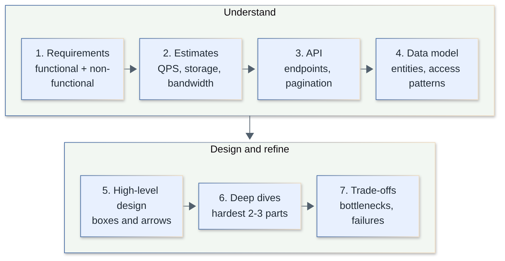

| Step | What to do | Time (45 min) |
|------|-----------|---------------|
| 1. Requirements | Functional (what it does), non-functional (latency, availability, consistency, durability, scale), out of scope | 5 min |
| 2. Estimates | DAU, read/write QPS, storage, bandwidth. Only what influences design | 3–5 min |
| 3. API | 3–6 core endpoints, pagination, auth, idempotency | 3 min |
| 4. Data model | Entities, keys, access patterns, SQL vs NoSQL choice | 5 min |
| 5. High-level design | Clients, LB, services, stores, queues, caches; follow one request end to end | 10 min |
| 6. Deep dives | The bottleneck or unusual part (fan-out, ID generation, geo index) | 10–15 min |
| 7. Trade-offs | Bottlenecks, failure modes, monitoring, what you would do with more time | 5 min |

Good habits:

- **Ask before drawing.** "Is it read-heavy? Do we need strong consistency for X? Global or one region? What is the acceptable staleness?"
- **Start simple, then evolve.** One server and one DB first; then name the exact limit that forces each added component.
- **Tie every box to a requirement or number.** "A cache because 10k read QPS on a 95% hot set"; not "a cache because caches are good".
- **Name trade-offs explicitly.** Every choice sacrifices something; say what.
- **Cover operations.** Metrics, alerts, deploys, backfills, capacity limits.

> **Follow-up:** *What if the interviewer changes a requirement mid-way?* Re-state the affected assumptions, say which components change (not all), and show how the design degrades or adapts. That is the point of the exercise.

[↑ Back to top](#table-of-contents)

### 2. How do you do back-of-the-envelope estimation?

`🟡 Middle` · `#estimation` `#capacity`

Convert user behavior into QPS, storage and bandwidth using round numbers and powers of ten: seconds per day ≈ 86,400 (round to ~10^5), peak ≈ 2–5× average, and keep units on every line. The goal is to decide *which architecture class* is needed (one box, a replicated DB, sharding, a CDN), not to be exact.

**Worked example: photo-sharing feed**

Assumptions: 50M DAU; each opens the feed 20 times/day; 10% of users post once/day; 20% of posts have a 500 KB photo; post metadata 1 KB; peak = 3× average.

| Quantity | Calculation | Result |
|----------|-------------|--------|
| Feed reads/day | 50M × 20 | 1B |
| Read QPS avg | 1B / 86,400 | ≈ 11.6k |
| Read QPS peak | 11.6k × 3 | ≈ 35k |
| Posts/day | 50M × 10% | 5M |
| Write QPS avg | 5M / 86,400 | ≈ 58 |
| Photos/day | 5M × 20% | 1M |
| Photo storage/day | 1M × 500 KB | 500 GB |
| Photo storage/year | 500 GB × 365 | ≈ 182 TB (×3 replicas ≈ 550 TB) |
| Metadata/year | 5M × 1 KB × 365 | ≈ 1.8 TB |
| Peak egress (50 KB avg response) | 35k × 50 KB | ≈ 1.75 GB/s ≈ 14 Gbit/s |

Conclusions that fall out: read:write ≈ 200:1, so cache and CDN heavily; 58 write QPS is trivial; the photo store needs blob storage (object store), not the DB; metadata at ~2 TB/year fits a sharded or even single large relational cluster with replicas.

**Latency numbers worth remembering** (order of magnitude; hardware varies):

| Operation | Approx. latency |
|-----------|-----------------|
| L1 cache reference | 0.5 ns |
| Main memory reference | 100 ns |
| Compress 1 KB | ~2–3 µs |
| SSD random read | 16–100 µs |
| Round trip in same datacenter | 0.5 ms |
| Read 1 MB sequentially from SSD | ~50 µs–1 ms |
| HDD seek | ~10 ms |
| Read 1 MB sequentially from HDD | ~20 ms |
| Round trip California ↔ Netherlands | ~150 ms |

Rules of thumb: memory is orders of magnitude faster than disk or network, hops dominate, cross-region calls cost ~100+ ms so never put them in a hot path loop.

Useful powers: 1 KB = 10^3, 1 MB = 10^6, 1 GB = 10^9, 1 TB = 10^12 bytes; 1 M req/day ≈ 12 QPS; 1 char ≈ 1 byte (ASCII) to 4 bytes (UTF-8 worst case); an int64 = 8 B.

> **Follow-up:** *How many servers?* Divide peak QPS by per-server capacity measured or assumed (e.g. 1–5k simple req/s for an API node), add headroom (target ≤ 50–60% utilization) and N+1 or N+2 redundancy.

[↑ Back to top](#table-of-contents)

### 3. How does availability math work (nines, SLA, redundancy)?

`🟡 Middle` · `#availability` `#sla`

Availability = uptime / total time. Each extra "nine" cuts allowed downtime by 10×. Components in series multiply availability (it drops); redundant components in parallel multiply *unavailability* (it improves), assuming independent failures.

| Availability | Downtime / year | Downtime / month (30.4 d) |
|--------------|-----------------|---------------------------|
| 99% | 3.65 days | 7.3 h |
| 99.9% | 8.76 h | 43.8 min |
| 99.95% | 4.38 h | 21.9 min |
| 99.99% | 52.6 min | 4.38 min |
| 99.999% | 5.26 min | 26 s |

```text
Series (all must work):     A = A1 × A2 × ... × An
  3 services at 99.9% each: 0.999^3 = 0.997  (≈ 26 h/year)

Parallel (any one works):   A = 1 − (1−A1) × (1−A2) × ...
  2 replicas at 99%:        1 − 0.01 × 0.01 = 99.99%
```

Practical points:

- A **chain of synchronous dependencies** erodes availability; hence timeouts, circuit breakers, caching and async decoupling.
- Redundancy only helps if failures are **independent**: spread over AZs, not just hosts; a shared deploy, config or DB is a common-mode failure.
- **SLI → SLO → SLA:** SLI is the measurement (e.g. % of requests < 300 ms and non-5xx), SLO is the internal target, SLA is the contractual promise (with credits) and is looser than the SLO. An **error budget** (1 − SLO) is what you spend on releases and risk.
- Measure availability from the user's side (request success ratio) rather than server uptime; partial degradation counts.
- MTTR matters as much as MTBF: availability = MTBF / (MTBF + MTTR). Fast detection and rollback beat rare failures.

> **Follow-up:** *Can you promise 99.99% on top of a cloud DB with a 99.95% SLA?* Not alone: 99.95% < 99.99%. You need multi-AZ/multi-region failover, caching or degraded modes so the user-facing path does not depend on that single dependency.

[↑ Back to top](#table-of-contents)

## Scalability Building Blocks

### 4. Vertical vs horizontal scaling, and why stateless services?

`🟢 Junior` · `#scalability` `#stateless`

Vertical scaling (scale up) means a bigger machine; horizontal scaling (scale out) means more machines behind a load balancer. Horizontal scaling needs **stateless** services: no request-specific state in process memory, so any instance can serve any request and instances can be added, killed or replaced freely.

| | Vertical | Horizontal |
|--|----------|-----------|
| Complexity | Low, no code change | Needs LB, stateless design, distributed data |
| Ceiling | Hardware limit, cost grows super-linearly | Practically unbounded |
| Failure | Single point of failure | Survives node loss |
| Downtime to scale | Often restart | None |
| Good for | Early stage, primary DB, tools with hard-to-shard state | Web/API tier, caches, workers |

Making a service stateless:

- Sessions in a shared store (Redis) or in signed tokens (JWT) rather than in-memory; or at least sticky sessions as a stopgap (they hurt balance and failover).
- Uploads go to blob storage, not local disk.
- Config from environment/config service; no local caches that must be consistent (or accept staleness).
- Background timers/cron run via a scheduler with leader election, not on every instance.

State does not vanish; it moves to dedicated stateful tiers (DB, cache, queue) that scale with their own techniques (replication, partitioning). Typical progression: single box → separate DB → LB + N app servers → cache + read replicas → CDN → queues/async → sharding → multi-region.

> **Follow-up:** *Is "just scale vertically" ever the right answer?* Yes: a single large Postgres primary with replicas handles a surprising amount; scale out only when measurements show the limit.

[↑ Back to top](#table-of-contents)

### 5. How does load balancing work, and which algorithms exist?

`🟡 Middle` · `#load-balancing` `#networking`

A load balancer spreads requests across healthy backends, removes unhealthy ones via health checks, and hides topology. Pick L4 (TCP/UDP, very fast, content-blind) or L7 (HTTP-aware: routing by path/header, TLS termination, retries, auth), and an algorithm that fits request cost variance.

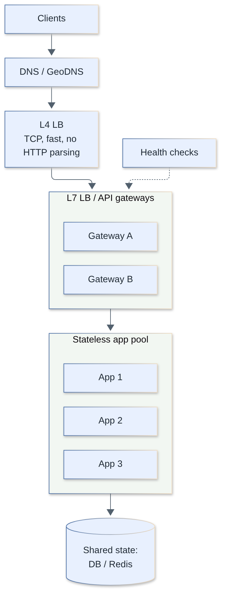

| Algorithm | How | Best for / caveat |
|-----------|-----|-------------------|
| Round robin | Rotate through backends | Uniform, short requests; ignores load |
| Weighted round robin | Proportional to capacity | Heterogeneous nodes |
| Least connections | Fewest open connections | Long-lived or variable requests |
| Least response time / EWMA | Lowest latency + connections | Variable backends; needs measurement |
| Power of two choices | Sample 2 random, pick the less loaded | Near-optimal balance with little state; used in large fleets and client-side LBs |
| IP / key hash | `hash(key) mod N` | Affinity; breaks on resize (use consistent hashing) |
| Consistent hashing | Ring (see Q9) | Cache servers, sharded backends |
| Random | Uniform random | Simple; fine at scale |

Deployment layers: **DNS / GeoDNS / anycast** to pick a region; **L4** (e.g. IPVS, cloud NLB) for raw throughput; **L7** (Envoy, NGINX, HAProxy, cloud ALB) for smart routing; optionally **client-side** balancing (gRPC, service mesh) removing a hop.

Details that matter:

- **Health checks:** active (probe `/healthz`) and passive (eject on errors/outlier detection). Separate liveness from readiness; do not mark all nodes down when a shared dependency blips.
- **LB itself is a SPOF:** run in active-active pairs/clusters behind anycast or a floating IP, or use managed LBs.
- **Connection draining** on deploy so in-flight requests finish.
- **Retries** only for idempotent requests, with budgets, or you amplify an outage (retry storms).
- **Sticky sessions** (cookie affinity) are a smell; prefer stateless services.
- **Slow start** for new instances so a cold node is not flooded.

> **Follow-up:** *Why "power of two choices" instead of "least loaded"?* Querying all backends is costly and herds traffic onto the single least-loaded node; picking the better of two random samples gets exponentially better balance than random with O(1) work.

[↑ Back to top](#table-of-contents)

### 6. What caching layers exist and how do you handle invalidation?

`🟡 Middle` · `#caching` `#cdn`

Cache at every tier where reads dominate: browser, CDN/edge, API gateway, in-process, distributed cache (Redis/Memcached), and the database's own buffer pool. Choose a write strategy (cache-aside, write-through, write-behind), set TTLs, and plan invalidation, which is the hard part.

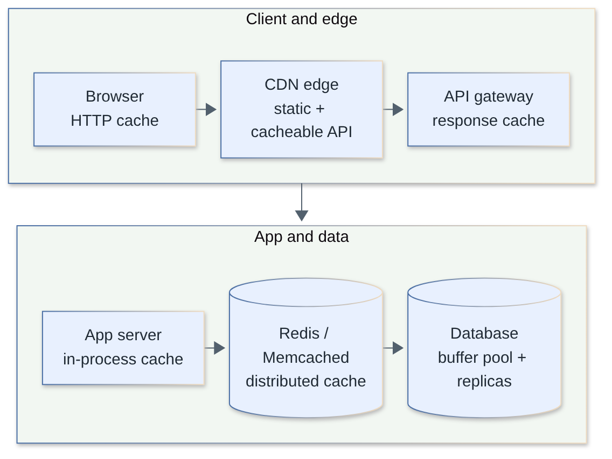

| Layer | Caches | Typical TTL / control | Gotcha |
|-------|--------|----------------------|--------|
| Browser | Static assets, GETs | `Cache-Control`, `ETag` | Cannot purge clients; use fingerprinted filenames |
| CDN / edge | Static files, media, cacheable API responses | `s-maxage`, purge API, `stale-while-revalidate` | Cache key must include what varies (language, auth) |
| App in-process | Hot config, small lookups | Seconds–minutes | Per-instance divergence; memory |
| Distributed cache | Query results, sessions, objects | TTL + explicit delete | Stampede, stale data, network hop |
| DB | Pages, plans | Automatic | Not controllable from app |

**Write strategies**

| Strategy | Flow | Trade-off |
|----------|------|-----------|
| Cache-aside (lazy) | App reads cache, on miss reads DB and fills | Simple, resilient; first read slow, staleness window |
| Read-through | Cache loads from DB itself | Cleaner app code; cache library needed |
| Write-through | Write cache and DB synchronously | Fresh reads; slower writes; caches unread data |
| Write-behind | Write cache, flush to DB async | Fast writes; data-loss risk, ordering complexity |

**Invalidation**: "There are only two hard things in computer science: cache invalidation and naming things."

- **TTL** bounds staleness; add random jitter so keys do not expire together.
- **Explicit delete on write** (`DEL key` after DB commit) — prefer delete over update to avoid races; still racy if a reader repopulates with an old value between your DB write and the delete. Mitigate with short TTL, versioned keys, or CDC-driven invalidation (binlog/WAL → invalidator).
- **Versioned/immutable keys:** `asset.8f3a.js`, `user:42:v17` — never invalidate, just switch the version.
- **Event-driven invalidation** via a stream of change events.

**Failure modes**

| Problem | Cause | Fix |
|---------|-------|-----|
| Stampede (dogpile) | Hot key expires, N requests hit DB | Single-flight/lock per key, probabilistic early refresh, stale-while-revalidate |
| Penetration | Requests for non-existent keys bypass cache | Cache negative results briefly, Bloom filter in front |
| Avalanche | Many keys expire together or cache dies | TTL jitter, replicas, rate-limit DB, warm-up |
| Hot key | One key overloads one shard | Local replica cache, key splitting (Q15) |
| Inconsistency | Race between DB and cache | Delete-after-write, TTL, versions |

```ts
// cache-aside with single-flight to prevent stampede (per process)
const inflight = new Map<string, Promise<unknown>>();

async function getUser(id: string) {
  const key = `user:${id}`;
  const hit = await redis.get(key);
  if (hit) return JSON.parse(hit);

  if (!inflight.has(key)) {
    inflight.set(key, (async () => {
      const row = await db.user.findById(id);
      // jitter: 5 min ± 30 s
      await redis.set(key, JSON.stringify(row), 'EX', 300 + Math.floor(Math.random() * 60 - 30));
      return row;
    })().finally(() => inflight.delete(key)));
  }
  return inflight.get(key);
}
```

> **Follow-up:** *Which eviction policy?* LRU is the default; LFU handles scan-resistant skew better; TTL-based expiry for correctness. Size the cache to the hot working set, not the whole dataset.

[↑ Back to top](#table-of-contents)

### 7. SQL vs NoSQL: how do you choose a datastore?

`🟡 Middle` · `#databases` `#data-model`

Choose by access pattern, consistency needs and scale shape, not by fashion. Relational databases give joins, transactions and flexible queries and scale a long way; NoSQL families trade query flexibility for horizontal scale, schema flexibility or specialized access patterns.

| Family | Examples | Strength | Use for | Weakness |
|--------|----------|----------|---------|----------|
| Relational | PostgreSQL, MySQL | ACID, joins, ad-hoc queries | Orders, payments, users, most CRUD | Write scaling needs sharding effort |
| Key-value | Redis, DynamoDB | Low latency, simple scaling | Sessions, counters, caches, URL maps | Only key lookups (plus limited secondary) |
| Wide-column | Cassandra, ScyllaDB, HBase | High write throughput, partitioned by design | Messages, time series, activity logs | Query by partition key; eventual consistency tunables |
| Document | MongoDB, Firestore | Nested flexible records | Catalogs, content, profiles | Cross-document transactions/joins are weaker |
| Search | Elasticsearch/OpenSearch | Inverted index, relevance | Full-text, facets | Not a source of truth |
| Graph | Neo4j | Relationship traversals | Social graph queries, fraud | Harder to shard |
| Time series / OLAP | ClickHouse, TimescaleDB | Aggregations over huge data | Metrics, analytics | Poor for point updates |
| Blob/object | S3-style | Cheap durable large objects | Media, backups | No queries |

Decision flow: (1) What are the top 3 queries and their QPS? (2) Do you need multi-row transactions or constraints? (3) Is the dataset beyond one node (> low TB, or > tens of k write QPS)? (4) What staleness is acceptable? Default to PostgreSQL and justify departures. **Polyglot persistence** is normal: Postgres as source of truth, Redis for caching/counters, Elasticsearch for search, blob store for files, fed by CDC/outbox events.

> **Follow-up:** *Does NoSQL mean no transactions?* No: DynamoDB, MongoDB and others support transactions with limits; the real question is the cost of cross-partition coordination.

[↑ Back to top](#table-of-contents)

### 8. Replication and partitioning: how do they work and what are the trade-offs?

`🟡 Middle` · `#replication` `#sharding`

**Replication** copies the same data to several nodes (availability, read scaling, durability). **Partitioning (sharding)** splits different data across nodes (write and storage scaling). Real systems combine both: each shard is replicated.

**Replication topologies**

| Topology | How | Trade-off |
|----------|-----|-----------|
| Single leader (primary/replica) | Writes to leader, replicated to followers | Simple, consistent writes; replica lag, failover complexity |
| Multi-leader | Several writable nodes (often one per region) | Low write latency locally; conflict resolution needed |
| Leaderless (Dynamo-style) | Any node accepts; quorum `W + R > N` | Highly available; tunable consistency, read repair, conflicts |

Sync vs async: synchronous replication gives no data loss on failover but adds latency and blocks on a slow replica; async is fast but can lose the latest writes and serves stale reads. Semi-sync (wait for 1 of N) is a common middle.

Replica lag problems: *read-your-writes* (route a user's reads to the leader for a short window or track the LSN/version), *monotonic reads* (pin a user to one replica), *causal consistency*.

**Partitioning strategies**

| Strategy | Pros | Cons |
|----------|------|------|
| Range (by key range) | Efficient range scans | Hot spots (e.g. time-based keys all hit the newest shard) |
| Hash (`hash(key) mod N` or consistent hashing) | Even distribution | No range scans; resharding cost (see Q9) |
| Directory/lookup table | Flexible placement | Lookup is a SPOF/bottleneck |
| Geo / tenant based | Data locality, compliance | Uneven sizes, cross-shard queries |

Hard parts of sharding: choose a shard key matching the dominant access pattern (e.g. `user_id`), **cross-shard queries and joins** (denormalize or scatter-gather), **cross-shard transactions** (avoid; use sagas or co-locate), **resharding** (use many logical shards mapped to fewer physical nodes, e.g. 1024 logical shards, so you move whole shards), globally unique IDs (Q12), and hot shards (Q15).

```text
Quorum: N replicas, write acked by W, read from R.
  N=3, W=2, R=2  -> W+R=4 > 3 : a read overlaps the latest write (strong-ish)
  N=3, W=1, R=1  -> fast, may read stale
```

> **Follow-up:** *Why not just `hash(key) % N`?* Changing N remaps most keys (growing 4 → 5 nodes keeps only ~20%); use consistent hashing or fixed logical shards.

[↑ Back to top](#table-of-contents)

### 9. What is consistent hashing and why is it used?

`🔴 Senior` · `#hashing` `#partitioning`

Consistent hashing maps both nodes and keys onto a circular hash space; a key belongs to the first node clockwise from its hash. When a node is added or removed, only the keys in the adjacent arc move (about 1/N of all keys), instead of nearly all keys as with `hash(key) mod N`.

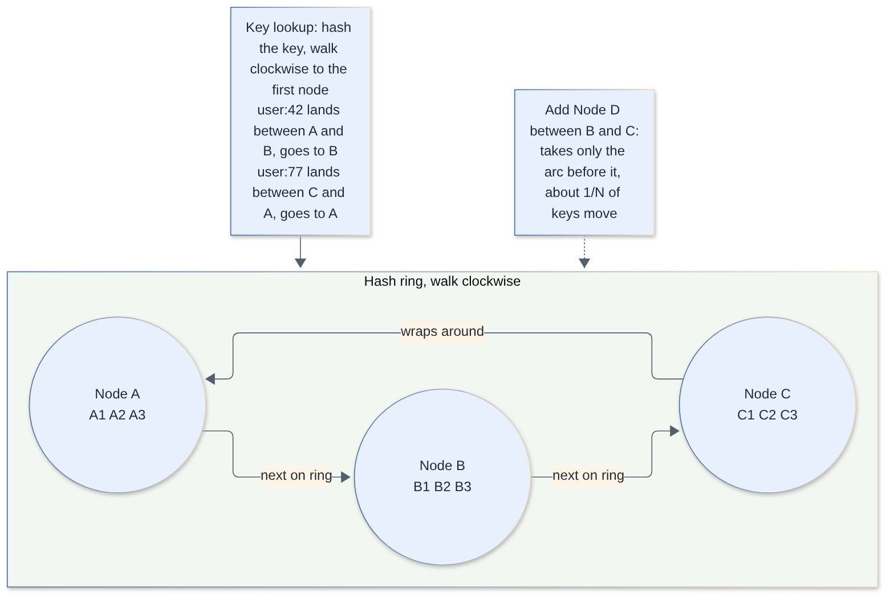

Why it matters: with `mod N`, going from 4 to 5 nodes keeps a key only if `h mod 4 == h mod 5`, which is true for 4 of every 20 residues, so ~80% of keys move: a cache stampede on the database. On a ring, adding one node moves ~1/(N+1).

Problems with a naive ring and the fix:

- Few nodes → uneven arcs and load. **Virtual nodes:** each physical node owns 100–256 points on the ring, which evens out load and lets stronger machines own more vnodes (weights).
- When a node dies, its load spreads across *many* neighbours (not one) thanks to vnodes.
- **Replication:** store each key on the next R distinct physical nodes clockwise (the "preference list", as in Dynamo-style stores).

```ts
import { createHash } from 'node:crypto';

const h = (s: string) => createHash('md5').update(s).digest().readUInt32BE(0);

class Ring {
  private ring: { pos: number; node: string }[] = [];
  constructor(private vnodes = 100) {}

  add(node: string) {
    for (let i = 0; i < this.vnodes; i++) this.ring.push({ pos: h(`${node}#${i}`), node });
    this.ring.sort((a, b) => a.pos - b.pos);
  }
  remove(node: string) {
    this.ring = this.ring.filter((e) => e.node !== node);
  }
  get(key: string): string {
    const p = h(key);
    let lo = 0, hi = this.ring.length;
    while (lo < hi) {                       // first position >= p
      const mid = (lo + hi) >> 1;
      if (this.ring[mid].pos < p) lo = mid + 1; else hi = mid;
    }
    return this.ring[lo % this.ring.length].node; // wrap around
  }
}
```

Used in: distributed caches (client-side sharding of Memcached), Dynamo-style stores (Cassandra tokens, Riak), CDN request routing, sharded LB affinity. Alternatives: **rendezvous (HRW) hashing** (pick the node with the highest `hash(key, node)`; simple, no ring) and **jump consistent hash** (no memory, but nodes must be numbered 0..N-1, only grow/shrink at the end). Redis Cluster uses a fixed 16,384 hash slots mapped to nodes, i.e. the "many logical shards" approach.

> **Follow-up:** *Does consistent hashing fix hot keys?* No. It balances key *counts*, not traffic; a single celebrity key still lands on one node (Q15).

[↑ Back to top](#table-of-contents)

### 10. What do CAP and PACELC mean in practice?

`🟡 Middle` · `#cap` `#consistency`

CAP: during a network **P**artition a distributed system must choose between **C**onsistency (every read sees the latest write, linearizability) and **A**vailability (every non-failed node answers). Partitions are not optional in a real network, so the real choice is CP vs AP *when the partition happens*. PACELC adds: **E**lse (no partition) you still trade **L**atency against **C**onsistency.

| Class | Behavior in partition | Else (normal operation) | Examples (typical configurations) |
|-------|----------------------|-------------------------|-----------------------------------|
| PC/EC | Refuse minority-side requests | Pay latency for consistency | Spanner-style systems, etcd/ZooKeeper, single-leader RDBMS with sync replication |
| PA/EL | Keep serving, reconcile later | Favor low latency | Dynamo-style stores (Cassandra, Riak) with low quorum |
| PA/EC | Available in partition | Consistent otherwise | Some multi-leader products |
| PC/EL | Consistent in partition | Low latency otherwise | Many leader-based async-replicated setups (leader reads fast; reads from followers stale) |

Classification depends on configuration (e.g. Cassandra `QUORUM` vs `ONE`), so say "configured as" in an interview.

Practical guidance:

- CAP is **per operation**, not per system: take balances need CP; a "like" count or feed is fine as AP.
- Consistency is a spectrum: linearizable → sequential → causal → read-your-writes → monotonic reads → eventual. Pick the weakest model that keeps the product correct.
- Latency is the everyday cost: a synchronous cross-region write costs ≥ one inter-region RTT (~100+ ms).
- Availability under partition for AP systems needs **conflict resolution**: last-write-wins (loses data), vector clocks, CRDTs, or app-level merge.
- "ACID C" (invariants) is different from "CAP C" (linearizability). Do not mix them up.

> **Follow-up:** *Where would you pick AP in a payment product?* Never for the money ledger; but for product catalog browsing, recommendations and view counters, serve stale data rather than error.

[↑ Back to top](#table-of-contents)

## Messaging, IDs and Reliability

### 11. How do message queues and stream processing fit into a design?

`🟡 Middle` · `#queues` `#kafka` `#streaming`

Queues decouple producers from consumers in time and rate: they absorb spikes, enable async work, retries and fan-out. A **queue** (SQS, RabbitMQ) delivers each message to one consumer and deletes it on ack; a **log** (Kafka, Pulsar, Kinesis) retains an ordered, replayable, partitioned record that many consumer groups read independently.

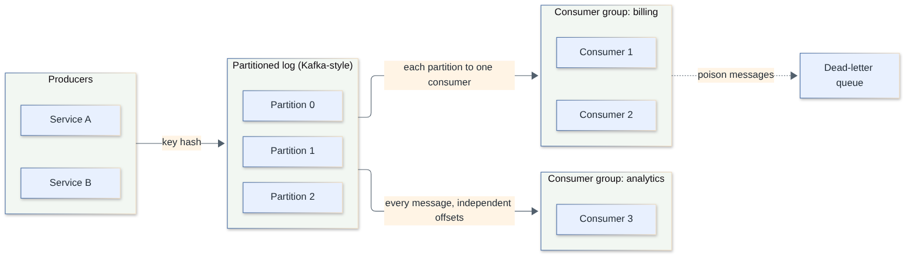

| | Queue (RabbitMQ/SQS) | Log (Kafka-style) |
|--|---------------------|-------------------|
| Retention | Until consumed | Time/size based, replayable |
| Consumers | Competing consumers | Multiple groups, each sees all |
| Ordering | Best effort / FIFO queue variants | Per partition |
| Scaling | Add consumers | Add partitions (bounds parallelism) |
| Use | Task/job distribution | Event streaming, CDC, analytics, event sourcing |

Key concepts:

- **Ordering** is guaranteed only within a partition; choose a partition key (e.g. `user_id`, `conversation_id`) so related events stay ordered. Parallelism ≤ number of partitions.
- **Delivery semantics:** at-most-once (ack before processing), at-least-once (ack after; duplicates on retry), exactly-once *effect* (at-least-once + idempotent consumer/transactional writes, Q13).
- **Backpressure and lag:** monitor consumer lag; scale consumers, or shed/slow producers.
- **Retries and DLQ:** retry with exponential backoff and jitter; after N attempts route to a dead-letter queue with the error, and alert. Separate a poison message from transient failure.
- **Outbox pattern:** write the event in the same DB transaction as the state change, relay it to the broker, which avoids dual-write inconsistency.
- **Stream processing** (Flink, Kafka Streams, Spark Streaming): stateful windows, joins and aggregations over events; handle **event time vs processing time**, watermarks and late data.
- **Batch vs stream:** streaming for low latency (seconds), batch for cheap, complete recomputation; many designs keep both (lambda/kappa) or rebuild views from the log.

> **Follow-up:** *Queue or direct RPC?* Use RPC when the caller needs the result now; a queue when the work can be deferred, must survive consumer outages or needs smoothing of bursts.

[↑ Back to top](#table-of-contents)

### 12. How do you generate unique IDs in a distributed system?

`🟡 Middle` · `#ids` `#uuid` `#snowflake`

Pick by requirements: uniqueness only (UUIDv4), uniqueness plus time-sortable (UUIDv7, Snowflake-style 64-bit IDs), or small sequential numbers (DB sequence/ticket server). For database primary keys, time-ordered IDs avoid random-insert B-tree fragmentation; for public IDs, avoid leaking counts.

| Scheme | Size | Sortable | Coordination | Notes |
|--------|------|----------|--------------|-------|
| Auto-increment / sequence | 64-bit | Yes | Single DB (bottleneck/SPOF) | Reveals volume; multi-master: step N with offsets |
| Ticket server | 64-bit | Yes | Dedicated DB(s) handing out IDs; hand out *ranges* to cut load | Two servers with odd/even avoids SPOF |
| UUIDv4 | 128-bit | No | None | 122 random bits; collisions negligible; poor index locality |
| UUIDv7 (RFC 9562, 2024) | 128-bit | Yes (ms) | None | 48-bit Unix ms timestamp + random bits; good DB keys |
| ULID | 128-bit | Yes | None | Timestamp + randomness, base32 text |
| Snowflake | 64-bit | Roughly (ms) | Machine ID assignment | Compact; needs clock discipline |

**Snowflake layout (classic):** 1 sign bit, 41 bits of milliseconds since a custom epoch (2^41 ms ≈ 69.7 years), 10 bits machine ID (1,024 workers), 12 bits sequence (4,096 IDs per ms per worker ≈ 4.1M/s per worker).

```ts
class Snowflake {
  private seq = 0n;
  private last = -1n;
  constructor(private machineId: bigint, private epoch = 1_700_000_000_000n) {} // machineId 0..1023

  next(): bigint {
    let now = BigInt(Date.now());
    if (now < this.last) throw new Error('clock moved backwards'); // or wait it out
    if (now === this.last) {
      this.seq = (this.seq + 1n) & 4095n;
      if (this.seq === 0n) while ((now = BigInt(Date.now())) <= this.last) {} // sequence exhausted: spin to next ms
    } else {
      this.seq = 0n;
    }
    this.last = now;
    return ((now - this.epoch) << 22n) | (this.machineId << 12n) | this.seq;
  }
}
```

Gotchas: **clock skew/rollback** (NTP steps) can emit duplicates, so refuse to issue or wait until the clock catches up; machine IDs must be unique (assign via ZooKeeper/etcd lease or config); IDs are only *roughly* ordered across machines; JavaScript clients lose precision above 2^53, so send 64-bit IDs as strings.

> **Follow-up:** *Hash-based short codes (URL shortener)?* Hashing and truncating needs collision handling; a counter or ID range encoded in base62 is collision-free by construction (see Q20).

[↑ Back to top](#table-of-contents)

### 13. What is idempotency, and why is "exactly-once" an illusion?

`🔴 Senior` · `#idempotency` `#reliability` `#delivery`

Networks can fail after the server did the work but before the client heard back, so clients must retry, which means the server will see duplicates. Exactly-once *delivery* is impossible in the general case (Two Generals problem); what you can build is **at-least-once delivery + idempotent processing = exactly-once effect**.

An operation is idempotent if applying it many times has the same effect as once. `PUT /x = 5` and `DELETE` are naturally idempotent; `POST /payments` and `balance += 10` are not, so make them so.

**Techniques**

| Technique | How |
|-----------|-----|
| Idempotency key | Client generates a UUID per logical operation, sends `Idempotency-Key`; server stores key → result and replays it for repeats |
| Natural dedupe key | Unique constraint on `(order_id, event_type)` or message ID |
| Conditional writes | `UPDATE ... WHERE version = $v` (optimistic concurrency), compare-and-set |
| Upserts | `INSERT ... ON CONFLICT DO NOTHING/UPDATE` |
| Dedupe table for consumers | Store processed message IDs in the same transaction as the side effect |
| Transactional outbox / inbox | Atomic state change + event record; consumer records inbox ID |
| Kafka idempotent producer / transactions | Dedupes producer retries per partition; transactions give atomic read-process-write *within Kafka* only |

```sql
-- server side of Idempotency-Key (Postgres)
CREATE TABLE idempotency_keys (
  key           text PRIMARY KEY,
  request_hash  text NOT NULL,
  status        text NOT NULL,         -- in_progress | done
  response      jsonb,
  created_at    timestamptz NOT NULL DEFAULT now()
);

-- 1) claim the key atomically
INSERT INTO idempotency_keys (key, request_hash, status)
VALUES ($1, $2, 'in_progress')
ON CONFLICT (key) DO NOTHING;           -- 0 rows => someone already claimed it
```

Handling the outcome: if inserted → do the work, then store `response` and set `done` (ideally in the same transaction as the business write); if conflict and `done` → return the stored response; if conflict and `in_progress` → return `409`/`Retry-After`; if the `request_hash` differs → `422` (key reused for a different request). Expire keys after 24h–7d.

Side effects outside your DB (calling a PSP, sending an email) cannot join your transaction. Pass the *same* idempotency key downstream so the downstream dedupes, or record intent first, call, then record the result, and reconcile on crash (Q31).

> **Follow-up:** *What does Kafka "exactly-once" actually guarantee?* Atomic consume-transform-produce within Kafka topics; any external side effect in your consumer still needs idempotency.

[↑ Back to top](#table-of-contents)

### 14. How do you design rate limiting at scale?

`🔴 Senior` · `#rate-limiting` `#redis`

Limit per identity (user, API key, IP, tenant) at the edge/gateway with a shared counter store, so all gateway instances see the same budget. The algorithm choice (token bucket is the common default) and the failure policy (fail-open vs fail-closed) are the interview points. The full service design is in Q21.

| Algorithm | Idea | Pros | Cons |
|-----------|------|------|------|
| Fixed window counter | Count per `floor(t / window)` | Trivial, cheap | 2× burst at window boundary |
| Sliding window log | Store timestamps, count within window | Exact | Memory O(requests) |
| Sliding window counter | Weighted sum of current + previous window | Cheap, smooth | Approximate |
| Token bucket | Tokens refill at rate r, capacity b; request costs 1 | Allows bursts up to b, steady rate r | Two values per key |
| Leaky bucket | Queue drains at constant rate | Smooth output | Bursts queue or drop, latency |

At scale:

- **Centralized store (Redis)** with an atomic script (read-refill-decrement in one step) to avoid races. Shard keys by `hash(key)` across a Redis cluster.
- **Local + global hybrid:** each node keeps a local budget slice and syncs periodically; trades accuracy for latency and Redis load. Fine when limits are soft.
- **Multiple dimensions/tiers:** per-second and per-day limits, per-endpoint costs, free vs paid plans.
- **Response:** HTTP `429 Too Many Requests` with `Retry-After` and `RateLimit-*` headers.
- **Failure policy:** if the limiter store is down, usually **fail-open** (protect availability), with local fallback limits for abuse-sensitive paths; login/payment endpoints may choose fail-closed.
- **Clock:** use the store's clock (`TIME`) not each client's.
- Distinguish **rate limiting** (fairness/abuse) from **load shedding** (protecting yourself when overloaded, priority-based drop) and **backpressure**.

> **Follow-up:** *Where do you enforce it?* Layered: CDN/WAF for volumetric abuse, gateway for per-key API quotas, and inside services (concurrency limits, bulkheads) for self-protection.

[↑ Back to top](#table-of-contents)

### 15. What are hot keys and the celebrity problem, and how do you mitigate them?

`🔴 Senior` · `#hot-keys` `#skew`

A hot key (or hot partition) is a single key receiving disproportionate traffic (a celebrity's profile, a viral post, a global counter), overloading the one shard that owns it even though the cluster overall has capacity. Hashing balances *keys*, not *load*, so you must handle skew explicitly.

Mitigations, from cheap to complex:

| Technique | How | Trade-off |
|-----------|-----|-----------|
| Replicate hot reads | Local in-process cache with 1–5 s TTL, or read from many replicas | Short staleness |
| CDN / edge cache | Serve celebrity content at the edge | Invalidation on change |
| Key splitting (salting) | `key#0..key#N-1`; writes pick a random suffix, reads aggregate all (e.g. counters) | Read cost ×N; only for aggregatable data |
| Request coalescing | Single-flight: one backend fetch serves all concurrent waiters | Needs per-key coordination |
| Hybrid fan-out | For the celebrity problem in feeds: pull their posts at read time instead of pushing to millions (Q22) | Read path complexity |
| Adaptive detection | Count-min sketch or sampling to detect hot keys, then promote them to special handling | Operational complexity |
| Isolate | Dedicated shard/tier for known hot entities | Capacity planning |
| Batch/aggregate writes | Buffer counter increments and flush every second | Slight delay, loss on crash |

```text
Counter with split keys:
  write: INCR  views:post42:{rand(0..15)}
  read : SUM of GET views:post42:{0..15}   (or a background job rolls up)
```

Also consider **write hot spots** from monotonic keys (timestamps/auto-increment in range-partitioned stores): prefix with a hash or bucket, or use hash partitioning.

> **Follow-up:** *How would you detect a hot key in production?* Per-key request sampling at the proxy/client, cache-node top-key stats (e.g. Redis `--hotkeys` with LFU policy) and alerts on per-partition throttling.

[↑ Back to top](#table-of-contents)

## Global Scale and Storage

### 16. How do you design for geo-distribution and multi-region?

`🔴 Senior` · `#multi-region` `#latency` `#disaster-recovery`

Go multi-region for latency (users near data), availability (survive a region outage) and data residency law. It is expensive in complexity, so first decide the goal: **DR only** (passive standby), **active-passive** (fast failover), or **active-active** (all regions serve writes), each with different RPO/RTO.

| Pattern | Writes | Failover | Costs / issues |
|---------|--------|----------|---------------|
| Backup/pilot light | One region | Hours, restore | Cheapest; high RTO |
| Warm standby (active-passive) | Primary region only, async replica | Minutes; some data loss (RPO > 0) | Replica lag defines RPO |
| Active-active, partitioned | Each user "homed" in a region | Reassign home on failure | Cross-region access for non-local users |
| Active-active, multi-leader | Any region | Seamless | Conflict resolution (LWW, CRDTs, app merge) |
| Globally consistent DB (Spanner-style, consensus across regions) | Any, strongly consistent | Seamless | Every commit pays cross-region RTT |

Design points:

- **Traffic routing:** GeoDNS or anycast + health checks to steer users; failover via DNS TTL (can be slow) or global load balancer.
- **Data placement:** keep a user's data in one *home* region (user-partitioned) and route by user ID, minimizing cross-region writes. Read-heavy global data (catalogs) replicates everywhere.
- **Static content and media:** CDN; the cheapest multi-region win.
- **Consistency:** accept eventual consistency across regions for most data; keep strongly consistent critical data (balances) single-homed or consensus-backed.
- **Conflict handling:** avoid with partitioning; otherwise LWW (lossy), vector clocks or CRDTs (counters, sets).
- **Failover safety:** avoid split brain (two regions both think they are primary): use fencing tokens/quorum and a witness region; test failovers regularly (game days).
- **Compliance:** GDPR-style residency may pin data to a region; design the data model with region tags early.
- **Cost:** inter-region egress is billed; replicate selectively.
- **RPO/RTO** (data loss tolerated / time to recover) drive the choice; write them down.

> **Follow-up:** *Why not active-active everywhere?* Because of write conflicts and cross-region latency for consistent writes; most products need it only for a few data types.

[↑ Back to top](#table-of-contents)

### 17. How does search work (inverted index basics)?

`🟡 Middle` · `#search` `#elasticsearch` `#indexing`

Full-text search uses an **inverted index**: a map from each term to the list of documents (and positions) containing it. A query looks up each term's posting list and intersects/unions them, then ranks results (TF-IDF, BM25) instead of scanning documents.

```text
Docs:   1: "red fast car"   2: "fast blue car"   3: "red bike"

Inverted index (term -> postings):
  red  -> [1, 3]
  fast -> [1, 2]
  car  -> [1, 2]
  blue -> [2]
  bike -> [3]

Query "red car"  -> red ∩ car = [1]
```

Pipeline: **analysis** (lowercase, tokenize, stop words, stemming/lemmatization, synonyms) at both index and query time → build postings (sorted doc IDs, compressed with delta/frame-of-reference encoding) → **ranking** (BM25 uses term frequency, inverse document frequency and length normalization) → return top-K via heap, usually with filters/facets from columnar "doc values".

Distributed search (Elasticsearch/OpenSearch/Solr, built on Lucene):

- Index is split into **shards** (by `hash(doc_id)`), each with replicas. A query is **scatter-gather**: broadcast to all shards, each returns its local top-K, the coordinator merges.
- Lucene writes **immutable segments**; new docs go into a memory buffer, flushed periodically (near-real-time visibility in ~1 s), background merges compact segments; deletes are tombstones.
- **Search is not the source of truth:** keep data in a primary DB and feed the index via CDC/outbox; be ready to reindex from scratch (use aliases for zero-downtime reindex).
- Trade-offs: eventual consistency of the index, expensive deep pagination (use `search_after`), shard count fixed at creation (plan capacity), mapping explosion.
- Beyond keywords: prefix/n-gram fields for autocomplete (Q29), vector (ANN) indexes for semantic search, hybrid ranking.

> **Follow-up:** *Why not `LIKE '%term%'` in SQL?* A leading wildcard cannot use a B-tree index, so it scans the table; use an inverted index (or Postgres `tsvector` + GIN for moderate scale).

[↑ Back to top](#table-of-contents)

### 18. How should you store large files and blobs?

`🟡 Middle` · `#blob-storage` `#s3` `#cdn`

Keep large binary objects in an object store (S3-style), not in the relational DB; store only metadata (key, size, owner, content type, checksum) in the DB. Upload directly from client to storage with **pre-signed URLs**, and serve downloads through a CDN.

Why not the DB: large rows bloat backups, replication and buffer cache, and DB bandwidth is expensive; object stores give cheap, highly durable storage (replication or erasure coding across AZs), unlimited scale and HTTP access.

Key patterns:

- **Pre-signed upload:** API authorizes and returns a time-limited URL; the client PUTs bytes straight to storage, so app servers never proxy large payloads. After upload, storage emits an event → your service marks the file `ready`.
- **Multipart / resumable uploads:** split into parts (e.g. 5–100 MB), upload in parallel, retry failed parts, assemble server-side.
- **Content-addressed storage:** key = hash of content; gives dedupe and immutability (used in file sync, Q25).
- **Durability vs availability:** replication (3×, simple, 200% overhead) vs erasure coding (e.g. 10+4: ~1.4× overhead, tolerates 4 losses; costlier repair/CPU).
- **Tiering:** hot (SSD/standard) → infrequent access → archive by lifecycle rules.
- **Security:** private buckets, signed URLs with short TTL, server-side encryption, malware scan, validate content type and size, avoid user-controlled keys (path traversal).
- **Delivery:** CDN in front with long TTL and immutable keys; range requests for video.
- **Cost drivers:** storage GB-months, requests, egress; small objects are request-heavy, so pack small files into larger blobs if needed.
- **Consistency:** modern S3 is strongly consistent for object reads after writes; other stores vary, so check the docs.

> **Follow-up:** *How do you handle a 5 GB upload over a flaky connection?* Multipart upload with per-part checksums; the client records completed parts and resumes only the missing ones.

[↑ Back to top](#table-of-contents)

### 19. What is a Bloom filter and where is it used?

`🟡 Middle` · `#bloom-filter` `#probabilistic`

A Bloom filter is a compact probabilistic set: `add(x)` and `might_contain(x)`. It never gives false negatives (a "no" is certain) but can give false positives (a "yes" may be wrong), using far less memory than storing the elements.

How: a bit array of `m` bits and `k` hash functions. `add` sets `k` bits; a lookup checks all `k` bits are set.

Sizing for `n` items and false-positive rate `p`:

```text
bits per element  m/n = -ln(p) / (ln 2)^2   ≈ 9.6 bits for p = 1%   (≈ 14.4 for 0.1%)
optimal k         = (m/n) × ln 2            ≈ 7 for p = 1%

Example: 10 billion URLs at 1% FP
  m = 10^10 × 9.585 bits ≈ 9.6 × 10^10 bits ≈ 12 GB   (vs ~500 GB+ storing the URLs)
```

```ts
class BloomFilter {
  private bits: Uint8Array;
  constructor(private m: number, private k: number) {
    this.bits = new Uint8Array(Math.ceil(m / 8));
  }
  private hashes(item: string): [number, number] {
    let h1 = 0x811c9dc5, h2 = 5381;                    // FNV-1a and djb2-style
    for (let i = 0; i < item.length; i++) {
      const c = item.charCodeAt(i);
      h1 = Math.imul(h1 ^ c, 0x01000193) >>> 0;
      h2 = (Math.imul(h2, 33) + c) >>> 0;
    }
    return [h1, h2 | 1];
  }
  add(item: string) {
    const [a, b] = this.hashes(item);                  // double hashing: a + i*b
    for (let i = 0; i < this.k; i++) {
      const pos = (a + i * b) % this.m;
      this.bits[pos >> 3] |= 1 << (pos & 7);
    }
  }
  mightContain(item: string): boolean {
    const [a, b] = this.hashes(item);
    for (let i = 0; i < this.k; i++) {
      const pos = (a + i * b) % this.m;
      if (!(this.bits[pos >> 3] & (1 << (pos & 7)))) return false;
    }
    return true;
  }
}
```

Limits: no deletes (use a **counting Bloom filter** or **cuckoo filter**), cannot enumerate, error rate rises as it fills past `n` (use scalable Bloom filters or rebuild), and it is only valuable when a false positive is cheap.

Uses: skip disk lookups for absent keys in LSM-tree stores (SSTable filters in Cassandra, RocksDB, HBase); cache-penetration guard (check the filter before the DB); crawler seen-URL set (Q32); "username taken" pre-check; malicious-URL screening (confirm positives with a slower exact check). Related structures: **HyperLogLog** (approximate distinct count, ~12 KB for ~1% error in Redis) and **Count-Min Sketch** (approximate frequencies, e.g. heavy hitters/hot keys).

> **Follow-up:** *Can Bloom filters be distributed or merged?* Filters with the same `m`/`k`/hash functions merge with bitwise OR, so you can build per-shard filters and union them.

[↑ Back to top](#table-of-contents)

## Design Case Studies

Each case study follows the same shape: requirements, estimates, API, data model, architecture, deep dives, trade-offs, and what a senior candidate adds.

### 20. Design a URL shortener

`🟡 Middle` · `#case-study` `#id-generation` `#caching`

Generate a short, unique code per long URL (base62 of a counter or ID range), store `code → long_url` in a key-value store, and serve redirects through a cache/CDN. It is a read-heavy system (~100:1) where the interesting parts are collision-free code generation, redirect semantics and caching.

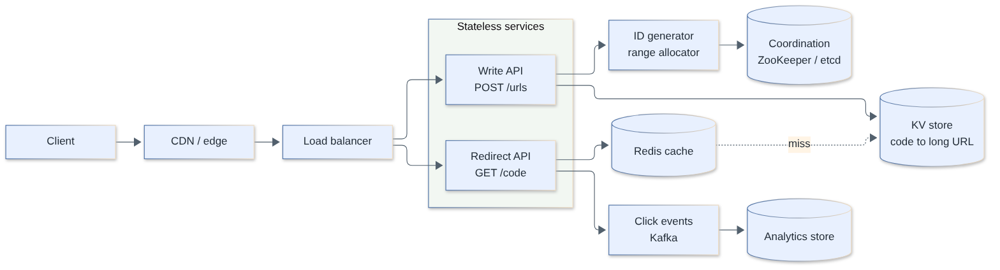

**Requirements**

- Functional: create short URL (optional custom alias, optional expiry), redirect, (optional) click analytics, delete/disable.
- Non-functional: redirect latency p99 < 50–100 ms, very high availability (redirects are the product), durable (links must not break), non-guessable enough where required.

**Estimates:** 100M new URLs/month → 100M / 2.592M s ≈ 39 writes/s (~40). Read:write 100:1 → ≈ 3.9k reads/s average, ~10k peak. 5 years: 100M × 12 × 5 = 6B URLs × ~500 B ≈ 3 TB, which is small. Code length: 62^6 ≈ 56.8B and 62^7 ≈ 3.5 trillion, so **7 chars** cover 6B with ample headroom.

**API**

```http
POST /v1/urls   {"url": "https://example.com/very/long", "alias": "promo", "expires_at": "2027-01-01T00:00:00Z"}
→ 201 {"short_url": "https://sho.rt/aZ3k9Qx"}
GET  /{code}   → 302 Location: https://example.com/very/long
DELETE /v1/urls/{code}
```

**Data model:** `urls(code PK, long_url, user_id, created_at, expires_at)`; point lookups by `code` only, so a KV/wide-column store (DynamoDB, Cassandra) or sharded Postgres works. Optional `clicks` events streamed to Kafka → analytics store.

**Deep dive 1: generating the code**

| Approach | Pros | Cons |
|----------|------|------|
| Hash (MD5/SHA of URL) and take 7 chars | Stateless, same URL → same code | Collisions on truncation; need check + retry; the same URL for different users shares a code |
| Random 7-char base62 | Unguessable | Collision check per insert (cheap with unique key; retry) |
| Global counter → base62 | No collisions, short | Counter is a bottleneck/SPOF; sequential = enumerable |
| **Range allocation** | Each app server leases a block (e.g. 1M IDs) from ZooKeeper/etcd/a DB row and issues locally with no per-request coordination | Gaps on crash (harmless); sequential codes are guessable, so permute with a bijective scramble (e.g. a keyed Feistel or multiplication by a coprime mod 62^7) if enumeration matters |

```ts
const ALPHABET = '0123456789ABCDEFGHIJKLMNOPQRSTUVWXYZabcdefghijklmnopqrstuvwxyz';
function toBase62(n: bigint): string {
  if (n === 0n) return '0';
  let s = '';
  while (n > 0n) { s = ALPHABET[Number(n % 62n)] + s; n /= 62n; }
  return s;
}
// toBase62(3_521_614_606_207n) === 'zzzzzzz' (largest 7-char code)
```

Custom aliases: insert with a unique constraint (`INSERT ... IF NOT EXISTS`) and return `409` if taken.

**Deep dive 2: redirect path and caching**

- Browser → CDN/edge (short TTL, cacheable) → app → Redis (`code → url`, LRU) → DB. A ~20% hot set of codes typically serves most traffic, so a few GB of cache absorbs the vast majority of reads.
- **301 vs 302:** `301` (permanent) lets browsers/CDNs cache and reduces load but you lose click counts and cannot change the target; `302`/`307` keeps every click flowing through you (analytics, edits, expiry).
- Negative caching for unknown codes plus a Bloom filter to resist scanning attacks.

**Deep dive 3: analytics:** do not write a counter row per click on the redirect path; emit an event to Kafka asynchronously, aggregate in a stream job, store in a columnar/OLAP store.

**Trade-offs and bottlenecks:** DB is a KV lookup, easily sharded by `hash(code)`; the ID allocator is the only coordination point (and is hit once per block); expiry via TTL attribute or a background sweeper.

**Senior extras:** abuse and phishing (URL reputation checks, rate limits per user/IP, interstitial warnings, takedown path), URL canonicalization and validation (block `javascript:` and internal IPs to avoid SSRF/open-redirect abuse), multi-region read replicas with a single-writer or per-region ID ranges, TTL/retention policy and cost, privacy of analytics (IP truncation).

> **Follow-up:** *Same long URL submitted twice, same code?* Optional: keep a `hash(long_url) → code` index and return the existing code; skip it if codes are per-user or carry per-link settings.

[↑ Back to top](#table-of-contents)

### 21. Design a distributed rate limiter service

`🔴 Senior` · `#case-study` `#rate-limiting` `#redis`

A gateway-side limiter checks a Redis-backed token bucket atomically (Lua script) per key, returns `429` with `Retry-After` when empty, loads rules from a config store, and degrades fail-open to a local limiter if Redis is unreachable. Concepts are in Q14; this is the full design.

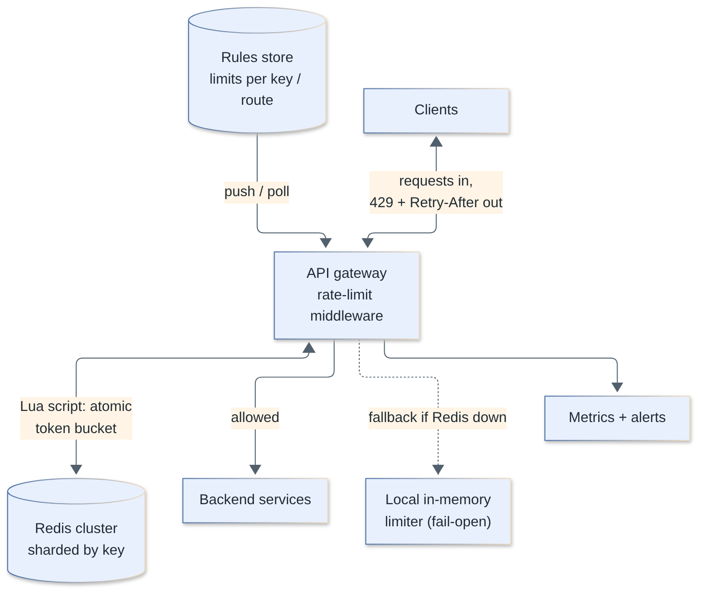

**Requirements**

- Functional: limit by user/API key/IP/tenant and endpoint; multiple rules (e.g. 100/s and 100k/day); configurable per plan; informative responses.
- Non-functional: adds < 2–5 ms to a request, highly available (must not take the API down), accurate enough (soft limits may be approximate), horizontally scalable, rules updatable without deploy.

**Estimates:** 1M API requests/s across the fleet → 1M limiter checks/s. One Redis node handles on the order of 100k simple ops/s, so ≥ 10 shards at full utilization; plan ~20 (50% headroom) plus replicas. Memory: 50M active keys × ~100 B ≈ 5 GB, trivial. The hot path is CPU/network, not memory.

**API / interface**

```http
# in-line middleware decision
check(key="user:42", rule="api:write", cost=1) -> {allowed: true, remaining: 57, reset_ms: 800}

# response when limited
HTTP/1.1 429 Too Many Requests
Retry-After: 2
RateLimit-Limit: 100
RateLimit-Remaining: 0
```

**Data model:** Redis hash per bucket `rl:{rule}:{key}` with `tokens`, `ts`; TTL ≈ 2× refill time so idle keys disappear. Rules in a config DB: `(rule_id, match, capacity, refill_per_sec, plan)`, cached at the gateways.

**Deep dive 1: atomic token bucket in Redis**

```lua
-- KEYS[1] = bucket key ; ARGV: capacity, refill_per_sec, cost
local cap, rate, cost = tonumber(ARGV[1]), tonumber(ARGV[2]), tonumber(ARGV[3])
local t = redis.call('TIME')
local now = t[1] * 1000 + math.floor(t[2] / 1000)           -- store clock, not client clock
local d = redis.call('HMGET', KEYS[1], 'tokens', 'ts')
local tokens, ts = tonumber(d[1]), tonumber(d[2])
if tokens == nil then tokens, ts = cap, now end
tokens = math.min(cap, tokens + (now - ts) / 1000 * rate)   -- refill lazily
local allowed = 0
if tokens >= cost then tokens = tokens - cost; allowed = 1 end
redis.call('HSET', KEYS[1], 'tokens', tokens, 'ts', now)
redis.call('PEXPIRE', KEYS[1], math.ceil(cap / rate * 1000) * 2)
return { allowed, math.floor(tokens) }
```

A script runs atomically on a single shard, so there are no read-modify-write races. All of one key's state lives on one shard (hash by key); use hash tags if a request touches several keys of the same user (`{user:42}:sec`, `{user:42}:day`).

**Deep dive 2: scaling and accuracy**

- *Latency:* one Redis round trip per request (~0.3–1 ms in-region). To cut it, keep a **local budget** per gateway node (e.g. lease 10% of the user's tokens, refill from Redis asynchronously); accuracy degrades by at most the leased amount.
- *Hot keys:* one abusive tenant sends 200k req/s on one key → one shard saturates. Block early with a local deny-list/short-lived "already limited" cache so repeated rejects never reach Redis.
- *Multi-region:* limits per region (simple, approximate globally), or a global limit via periodic sync of consumption between regions.

**Deep dive 3: failure modes:** Redis down or slow → timeout budget of a few ms, then **fail-open** with a coarse in-memory limiter per node; for sensitive endpoints (login, OTP) fail-closed or use a stricter local limit. Replica failover can lose recent counts (fine for soft limits). Protect the limiter from its own overload with client-side timeouts and circuit breaker.

**Trade-offs:** centralized exactness vs local speed; fixed window (cheap, burst at the edge) vs token bucket (burst-friendly, steady) vs sliding window counter (smooth, approximate); where to enforce (CDN, gateway, service).

**Senior extras:** limit identity choice (authenticated user over IP, since NAT/CGNAT shares IPs), cost-based limits (expensive endpoints cost more tokens), concurrency limits (in-flight cap) alongside rate, retry guidance with jittered backoff, observability (allow/deny rates per rule, top limited keys), dry-run mode when rolling out new rules, explicit client communication in docs.

> **Follow-up:** *Sliding window counter formula?* `count = current_window + previous_window × (1 − elapsed_fraction_of_current)`; two counters per key, with error typically small versus an exact log.

[↑ Back to top](#table-of-contents)

### 22. Design a news feed / timeline

`🔴 Senior` · `#case-study` `#fan-out` `#feed`

Hybrid fan-out: for most authors **push** (fan-out on write) the post ID into each follower's precomputed feed list in Redis, so reads are a cheap list fetch; for celebrities with millions of followers **pull** (fan-out on read) their posts and merge at read time. Rank and hydrate at the feed service.

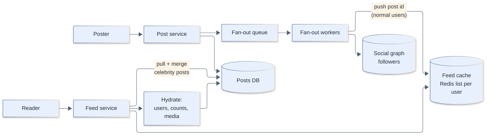

**Requirements**

- Functional: publish a post (text/media), follow/unfollow, view a home timeline (newest or ranked) with pagination, see likes/comments counts.
- Non-functional: feed load p99 < 200–300 ms, high availability, eventual consistency is fine (a post may appear seconds later), reads far outnumber writes, handle celebrity skew.

**Estimates (100M DAU, avg 200 followers):** feed refreshes 100M × 10 = 1B/day ≈ 11.6k QPS avg (~35k peak). Posts: 20M/day ≈ 231/s. Fan-out writes: 20M × 200 = 4B feed inserts/day ≈ 46k/s avg. Feed cache: 800 post IDs × 8 B ≈ 6.4 KB per user × 100M users ≈ 640 GB (≈ 1.3 TB with overhead), which is a modest Redis cluster. Store only IDs; hydrate content from a post cache.

**API**

```http
POST /v1/posts            {"text": "...", "media_ids": [..]}        → 201 {"post_id": "..."}
GET  /v1/feed?cursor=<opaque>&limit=20                               → {"items":[...], "next_cursor":"..."}
POST /v1/follow/{user_id}    DELETE /v1/follow/{user_id}
```

Use **cursor pagination** (post ID/score), not offset, so the feed does not shift as new items arrive.

**Data model:** `posts(post_id, author_id, text, media, created_at)` sharded by `post_id` (time-sortable ID); `follows(follower_id, followee_id)` indexed both directions (graph store or sharded SQL); feed cache `feed:{user_id}` = Redis list/sorted set of `(post_id, score)` capped at ~800; counters (likes) in a separate counter store.

**Deep dive 1: fan-out on write vs read**

| | Fan-out on write (push) | Fan-out on read (pull) |
|--|-------------------------|------------------------|
| Post cost | O(followers) writes | O(1) |
| Read cost | O(1) list fetch | O(followees) queries + merge |
| Latency (read) | Very low | Higher, grows with followees |
| Wasted work | Fans out to inactive users | None |
| Celebrity (10M followers) | A single post = 10M writes, delay and load spike | Cheap |
| Freshness | Lag while fan-out runs | Always fresh |

**Hybrid:** push for normal authors, *only to active followers* (skip users inactive > 30 days; rebuild their feed on return), and mark authors above a follower threshold (e.g. > 100k–1M) as "pull". On read: take the cached feed, fetch recent posts from the user's followed celebrities (small set), merge by score/time, rank, hydrate.

```text
publish(post):
  store(post); emit PostCreated(post_id, author_id)

fanout_worker(PostCreated):
  if author.followers > CELEB_THRESHOLD: return          # pulled at read time
  for batch in followers(author).active():               # paged, parallel by shard
      for u in batch: ZADD feed:{u} post.ts post.id; ZREMRANGEBYRANK feed:{u} 0 -801

read_feed(user):
  ids = ZREVRANGEBYSCORE feed:{user} ... LIMIT 0 20 (+ cursor)
  ids += recent_posts(celebs_followed(user))
  return hydrate(rank(merge(ids)))
```

**Deep dive 2: fan-out workers:** consume from Kafka partitioned by author for ordering; batch pipelined Redis writes; fan-out is **idempotent** (ZADD with the same member) so retries are safe; backlog and lag are the key SLO metrics; prioritize fan-out to recently active followers first. Deletes/edits: remove from caches lazily (hydration filters deleted posts) and async cleanup.

**Deep dive 3: ranking and hydration:** a ranked feed adds a scoring step (recency, affinity, engagement predictions), usually candidate generation (~hundreds of IDs) → light ranker → heavier ranker, with features from a feature store and a latency budget. Hydration batches multi-gets (users, counts, media URLs) from caches; failures degrade to partial items rather than failing the feed.

**Bottlenecks and trade-offs:** write amplification vs read latency; memory for feed caches (cap length, TTL, only active users); celebrity threshold tuning; consistency of follow/unfollow (new follower should see recent posts: backfill their feed from the followee's latest posts on follow).

**Senior extras:** cold start/inactive users, cache rebuild from the posts store after cache loss (and rate-limiting rebuilds), per-user feed versioning, abuse/blocked/muted filtering at read time, ads/recommendation injection, privacy changes, multi-region feeds (feed built in the user's home region), observability on fan-out lag.

> **Follow-up:** *What happens when a user follows someone new?* Backfill: pull the followee's latest N posts into the follower's feed (or let the read path merge them) so the feed is not empty of the new source.

[↑ Back to top](#table-of-contents)

### 23. Design a chat application (WebSockets, presence, delivery receipts)

`🔴 Senior` · `#case-study` `#websockets` `#messaging`

Clients keep a WebSocket to a gateway; a chat service assigns an ordered per-conversation sequence number, persists the message, and a router pushes it to recipients' gateways found via a session registry, falling back to push notifications for offline users. Presence uses heartbeats with TTL; receipts are small ack events.

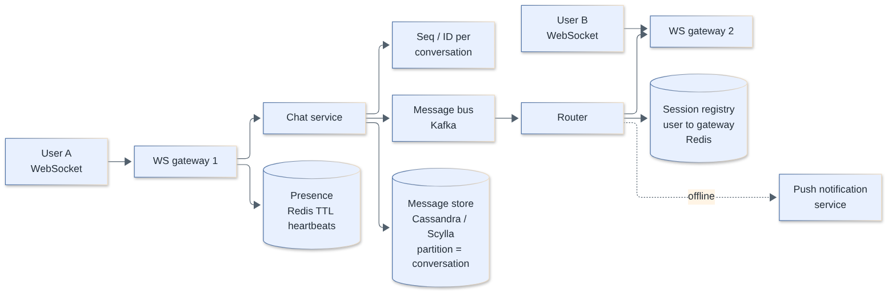

**Requirements**

- Functional: 1:1 and group chat, send/receive text and media (media via blob store + links), message history, online/last-seen, delivery and read receipts, multi-device sync, push when offline.
- Non-functional: low latency (< 200 ms delivery online), no message loss (durable before ack), per-conversation ordering, high availability, scale to tens of millions of concurrent connections.

**Estimates:** 50M DAU × 40 sent messages = 2B/day ≈ 23.1k msg/s average (~70k peak at 3×). 100 B per message stored → 200 GB/day → ≈ 73 TB/year (before replication). Connections: assume 20% of DAU concurrent at peak = 10M WebSockets; at ~50k connections per gateway node ≈ 200 gateways. Per-connection memory (~10s of KB) makes the gateway memory/FD-bound, not CPU-bound.

**API (client protocol over WebSocket, JSON/protobuf frames)**

```text
→ {"t":"send","cid":"c1","client_msg_id":"uuid","body":"hi"}
← {"t":"ack","client_msg_id":"uuid","msg_id":"...","seq":1042}          # persisted
← {"t":"msg","cid":"c1","seq":1043,"from":"u7","body":"yo"}
→ {"t":"read","cid":"c1","upto_seq":1043}
← {"t":"receipt","cid":"c1","user":"u7","delivered_seq":1043}
REST: GET /v1/conversations/{id}/messages?before_seq=1000&limit=50   (history, paging)
```

**Data model**

```text
messages:  PK (conversation_id, seq DESC)  -- partition by conversation; clustering by seq
           columns: msg_id, sender_id, body/media_ref, created_at
inbox:     (user_id, conversation_id) -> last_seq, last_read_seq, unread_count
members:   (conversation_id, user_id)
```

A wide-column store (Cassandra/Scylla) fits write-heavy time-ordered data partitioned by conversation (cap partition size by bucketing e.g. by month for huge groups). Relational stores work at smaller scale. Presence and sessions live in Redis.

**Deep dive 1: connection management and routing**

- WebSocket gateways are stateful (hold sockets) but contain no business logic. On connect: authenticate, register `user_id → gateway_id (+device)` in Redis with TTL refreshed by heartbeats.
- Sending: gateway → chat service validates, assigns `seq`, writes to the store, acks the sender (**persist-then-ack**), publishes to the bus (partition key = conversation id).
- Delivery: router resolves each member's gateway via the registry and forwards; offline → push notification (APNs/FCM) and the message waits in storage.
- Gateway deploys/crashes: clients reconnect with exponential backoff + jitter (avoid reconnection storms) and **sync from `last_seq`**: the server returns everything missed. Reliability comes from sync-by-sequence, not from the socket.
- Fallbacks: long polling/SSE if WebSockets are blocked; heartbeats (ping/pong) detect dead peers behind NATs.

**Deep dive 2: ordering, idempotency and groups**

- Per-conversation sequence number from the partition's single writer (the conversation's partition owner) or a counter (`INCR`/lightweight txn); ordering across conversations is not needed.
- Client sends `client_msg_id`; server dedupes retries so a resend after a timeout does not duplicate (Q13).
- Small groups: fan-out on write to each member's inbox and sockets; large groups/channels: store once, members pull by `seq`, push only a lightweight "new message" signal.

**Deep dive 3: presence and receipts**

- Presence: client heartbeat every ~30 s sets `presence:{user}` with TTL ~60 s; "online" = key exists; last-seen = last heartbeat. Don't broadcast every flap: publish presence only to users who are viewing that contact/conversation (subscribe on demand), and debounce short disconnects.
- Receipts: *sent* (server persisted) → *delivered* (recipient device received) → *read*. Implemented as per-user cursors (`delivered_seq`, `read_seq`) per conversation instead of per-message events; group receipts are aggregated or limited in large groups.

**Bottlenecks and trade-offs:** gateway connection limits and fan-out for large groups; storage hot partitions for busy conversations; push vs pull for large channels; consistency (ordering per conversation) vs availability across regions; message retention and cost.

**Senior extras:** end-to-end encryption (key distribution, multi-device, server cannot index content, group key rotation), multi-device sync via per-device cursors, media pipeline (upload to blob with pre-signed URL, thumbnails, virus scan), spam/abuse limits, message edit/delete/tombstones, regional gateways with a home region for each conversation, observability (delivery latency, ack ratio, reconnect rate), graceful gateway drain.

> **Follow-up:** *Why not route messages gateway-to-gateway directly?* Possible, but a bus gives buffering, replay, decoupled consumers (push, indexing, analytics) and avoids N² connections.

[↑ Back to top](#table-of-contents)

### 24. Design a notification system

`🟡 Middle` · `#case-study` `#notifications` `#queues`

An API accepts notification requests from services, validates and dedupes them, applies user preferences, renders templates, and enqueues to per-channel queues; channel workers call providers (APNs/FCM, email, SMS) with retries and rate limits and log delivery status. Queues isolate channels and absorb bursts.

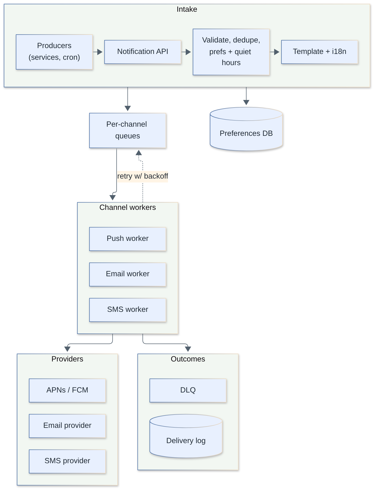

**Requirements**

- Functional: push, email, SMS (and in-app); transactional (OTP, receipts) and marketing/bulk; templates + localization; user preferences/opt-out, quiet hours; scheduled sends; delivery status.
- Non-functional: high throughput with bursts, transactional notifications low latency (seconds), at-least-once delivery with dedupe, no lost notifications, don't overload providers, respect legal opt-outs.

**Estimates:** 100M notifications/day ≈ 1,157/s average; a campaign to 10M users within 10 min = 10M/600 ≈ 16.7k/s burst, an order of magnitude above average, so queues and autoscaled workers are needed. Provider limits (APNs/FCM/ESP/SMS) usually bottleneck first.

**API**

```http
POST /v1/notifications
{ "idempotency_key": "order-991-shipped", "user_id": "u42", "type": "order_shipped",
  "channels": ["push","email"], "data": {"order_id": 991}, "priority": "high", "send_at": null }
→ 202 {"id": "n_123"}
GET /v1/notifications/{id}          # status per channel
PUT /v1/users/{id}/preferences
```

**Data model:** `notification(id, user_id, type, payload, created_at)`, `delivery(notification_id, channel, status, provider_msg_id, attempts, updated_at)`, `preferences(user_id, type, channel, enabled, quiet_hours, tz)`, `device_tokens(user_id, platform, token, last_seen)`, `templates(type, channel, locale, body)`.

**Deep dive 1: pipeline, priority and isolation**

- Separate queues by **channel** and **priority** (OTP never waits behind a marketing blast). Marketing flows via a throttled bulk path with its own workers.
- Fan-out of one event to many recipients (segment) is done by batch jobs that page through audiences and enqueue per-user tasks.
- Workers are stateless and autoscale on queue depth; provider-specific rate limiters (token bucket per provider/account) and circuit breakers prevent bans and cascading failures. Fail over between email/SMS vendors.

**Deep dive 2: reliability and dedupe**

- At-least-once: ack the queue message only after the provider accepts. Dedupe with the idempotency key plus a `(notification_id, channel)` unique record before sending to prevent duplicate pushes on retry.
- Retries: exponential backoff + jitter; permanent errors (invalid token, hard bounce) are not retried; they trigger cleanup (remove device token, suppress email address). After N attempts → DLQ for inspection.
- Provider callbacks/webhooks update status (delivered, bounced, complained, opened); verify signatures and handle them idempotently and out of order.
- Outbox pattern on the producing service so "order shipped" and "notify" cannot diverge.

**Deep dive 3: preferences, timing and anti-spam:** check opt-out and per-type channel settings at send time, not enqueue time (preferences may change); quiet hours by user timezone (delay, don't drop, except for critical alerts); frequency caps and digest/batching ("5 new comments"); collapse keys for push so a newer message replaces older ones; legal requirements (unsubscribe links, consent records, regional SMS rules).

**Bottlenecks and trade-offs:** provider throughput and cost (SMS is expensive; prefer push/email), template rendering CPU for bulk (pre-render per locale), exactly-once is impossible so accept rare duplicates for push, ordering generally best-effort.

**Senior extras:** multi-provider failover, per-tenant isolation in multi-tenant platforms, delivery analytics (funnels, open/click), device token hygiene, A/B templates, scheduled and recurring sends with the scheduler (Q28), security (do not put secrets/PII in push payloads, since lock-screens are visible), testing/sandbox mode and dry runs.

> **Follow-up:** *How to avoid notifying a user on 5 devices for something they already read on one?* Track read state centrally and re-check just before sending (delayed send for low priority), plus cancel/collapse keys on devices.

[↑ Back to top](#table-of-contents)

### 25. Design a file storage and sync service (Dropbox-like)

`🔴 Senior` · `#case-study` `#sync` `#blob-storage` `#dedupe`

Split files into chunks (e.g. 4 MB), hash each (SHA-256), upload only chunks the server lacks to a content-addressed blob store, and commit a new file version as an ordered list of chunk hashes in a metadata DB. Other devices are notified of changes and download only changed chunks.

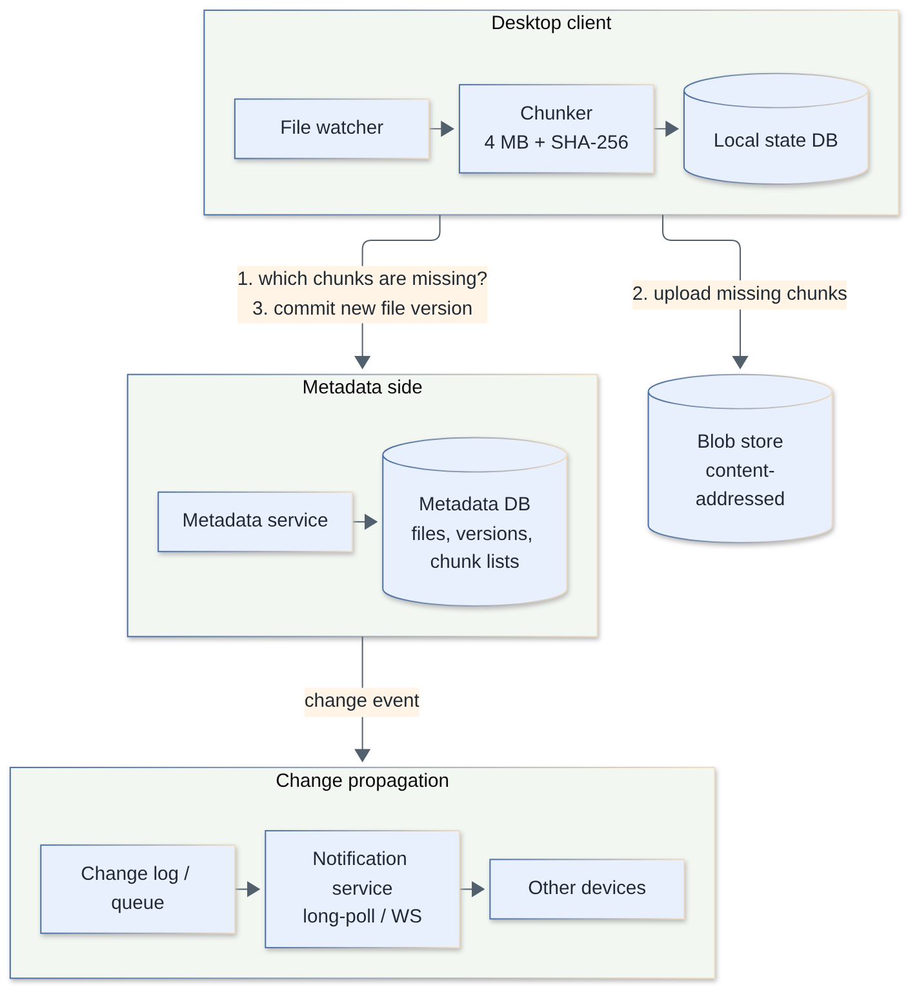

**Requirements**

- Functional: upload/download, automatic multi-device sync, version history/restore, folder sharing with permissions, offline edits, large files (GBs), resume interrupted transfers.
- Non-functional: durability (11 nines-class), efficient bandwidth (delta/dedup), eventual consistency of sync within seconds, conflict handling, security/encryption.

**Estimates:** 10M users × 5 GB average used ≈ 50 PB logical. With 4 MB chunks: 5×10^16 B / 4×10^6 ≈ 1.25×10^10 chunks; at ~100 B metadata per chunk ≈ 1.25 TB of chunk metadata (shardable). Dedup and compression reduce physical storage; replicate/erasure-code it for durability. If 5M users sync daily with ~50 file changes each: 250M changes/day ≈ 2.9k/s average, small compared with data bandwidth.

**API**

```http
POST /v1/files/commit/begin   {"path":"/a.pdf","base_version":7,"chunks":["h1","h2","h3"]}
                              → {"missing":["h2"],"upload_urls":{"h2":"https://blob/..."}}
PUT  <presigned-url>          (chunk bytes, direct to blob store)
POST /v1/files/commit         {"upload_id":"..."} → {"version":8}
GET  /v1/changes?cursor=<c>   → list of changed entries since cursor (long-poll/WebSocket "changed" hint)
GET  /v1/files/{id}/versions
```

**Data model:** `files(file_id, namespace_id, path, parent, is_dir, current_version)`, `file_versions(file_id, version, size, chunk_hashes[], modified_by, ts)`, `chunks(hash PK, size, refcount, location)`, `devices(device_id, cursor)`, `shares(namespace, user, permission)`. A per-namespace monotonically increasing **change log** (journal) drives sync: each device remembers the last journal cursor.

**Deep dive 1: chunking, dedup and delta**

- Fixed-size chunking is simple, but inserting a byte at the start shifts every chunk. **Content-defined chunking** (rolling hash, e.g. Rabin/FastCDC) picks boundaries from content so edits invalidate only nearby chunks.
- Content addressing makes upload idempotent and dedupes identical chunks across files and users (with caveats: cross-user dedup leaks existence of a file via timing/"already exists"; many systems dedupe only within an account or use convergent-encryption trade-offs).
- Upload flow: client hashes locally → asks which chunks are missing → uploads those in parallel with pre-signed URLs → commits metadata. A file version is visible only after commit, so no partial files. Resumable at chunk granularity.
- Garbage collection of unreferenced chunks via refcount or mark-and-sweep with a grace period.

**Deep dive 2: sync protocol and conflicts**

- Desktop client: file system watcher → local state DB (path, hash, version) → diff against server cursor. Push changes with the **base version** (optimistic concurrency).
- Notification: after a commit the metadata service appends to the namespace journal and signals subscribed devices (long poll/WebSocket) with "something changed"; the device then calls `changes?cursor=` to fetch deltas. Polling alone costs too much at scale; hints keep latency low.
- **Conflicts:** two devices edit the same base version → the second commit fails the version check; the server keeps one as winner and the client saves the other as a "conflicted copy" (user resolves). Directory-level operations (move/rename/delete) need careful ordering rules; treat renames as metadata operations without re-uploading data.

**Deep dive 3: metadata scale and consistency:** metadata needs strong consistency per namespace (transactions for commit and journal append), so use a sharded relational DB keyed by namespace/account; blob store is eventually fine because chunks are immutable and content-addressed. Hot shared folders with thousands of members make a hot namespace; limit fan-out through the journal (readers pull).

**Bottlenecks and trade-offs:** chunk size (small = better dedupe/delta, more metadata and requests; large = fewer requests), client CPU for hashing, bandwidth throttling, many tiny files (batch them), per-user quotas.

**Senior extras:** end-to-end/client-side encryption conflicts with server dedup, virus scanning, file-level permissions and sharing ACL inheritance, LAN sync/peer transfer, trash/retention policies, cold-tier storage for old versions, rate-limit abusive sync loops, observability (sync lag per device), integrity checks (verify hashes on read, scrub in the background).

> **Follow-up:** *How do you resume a 10 GB upload after a crash?* The client re-sends the chunk list; the server reports which hashes it already has; only the missing chunks are uploaded.

[↑ Back to top](#table-of-contents)

### 26. Design a video streaming platform (upload, transcoding, adaptive bitrate, CDN)

`🔴 Senior` · `#case-study` `#video` `#cdn` `#transcoding`

Uploaded video goes to blob storage; a queue-driven pipeline splits it into segments, transcodes each into multiple resolutions/bitrates in parallel, packages as HLS/DASH segments plus a manifest, and publishes to an origin fronted by a CDN. The player does adaptive bitrate (ABR) switching based on measured bandwidth.

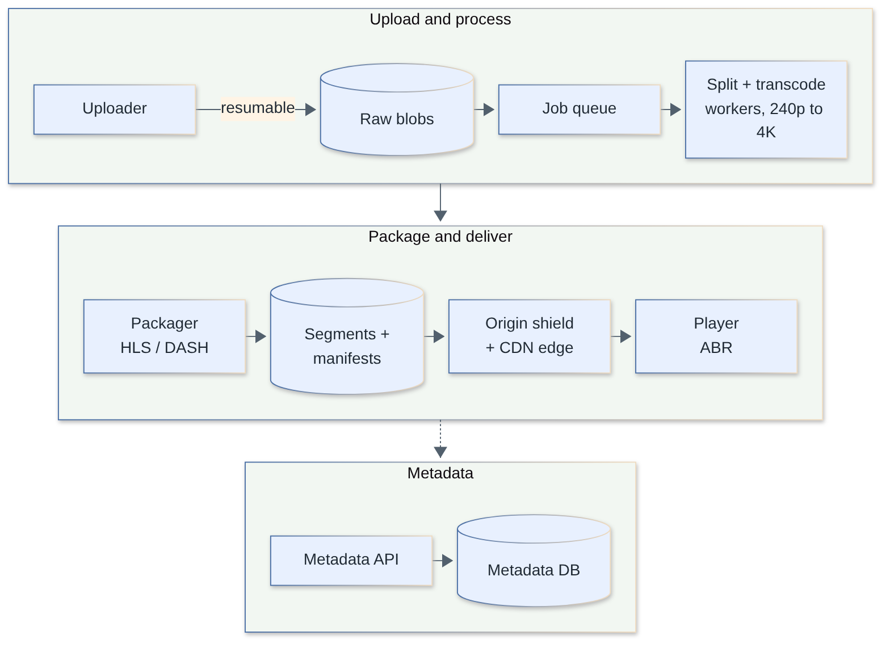

**Requirements**

- Functional: upload (large, resumable), process into playable formats, stream on any device/network, search/browse metadata, thumbnails, (optional) live.
- Non-functional: fast start (< 2 s), smooth playback, highly available playback path, cost-efficient storage/egress, upload processing in minutes, global reach.

**Estimates:** 500k uploads/day × 100 MB average = 50 TB/day raw ingest (≈ 18 PB/year). Transcoded ladder roughly 2–3× the source → ~100–150 TB/day stored. Streaming: 100M DAU × 1 h × 3 Mbps average. Per user: 3 Mbit/s × 3,600 s = 10.8 Gbit ≈ 1.35 GB/day → 135 PB/day total ≈ 1.56 TB/s ≈ 12.5 Tbit/s average egress (peak 2–3× higher). That volume is why a CDN (with ISP-embedded caches or many PoPs) is mandatory and why egress cost dominates.

**API**

```http
POST /v1/videos                 {"title":"..","size":734003200}  → {"video_id":"v1","upload_id":"u1"}
PUT  <presigned part URLs>      (multipart, resumable)
POST /v1/videos/{id}/complete   → 202 (processing)
GET  /v1/videos/{id}            → {"status":"ready","manifest":"https://cdn/v1/master.m3u8", ...}
GET  https://cdn/.../master.m3u8  and  .../720p/seg_00042.ts|m4s
```

**Data model:** `videos(video_id, owner, title, status, duration, created_at, renditions[])` in a relational/NoSQL DB; segments + manifests as immutable objects in blob storage under `video_id/rendition/segment_n`; view counts and watch progress in a counter/KV store fed by events.

**Deep dive 1: transcoding pipeline (a DAG)**

1. Validate and scan the upload; extract metadata.
2. **Split** the source on keyframe/GOP boundaries into chunks (e.g. 2–10 s).
3. **Parallel transcode** each chunk × each rendition (240p … 1080p/4K; codecs H.264 for compatibility, plus HEVC/VP9/AV1 where it pays off); workers are autoscaled, preemptible/spot-friendly, with chunk-level retry.
4. **Package** into HLS (`.m3u8` + `.ts`/fMP4) and/or MPEG-DASH, add audio tracks, subtitles, DRM encryption if needed.
5. Generate thumbnails/previews; write outputs; flip status to `ready` atomically; emit events (search index, notifications).

Orchestrate as a workflow/DAG (state machine) with idempotent tasks, retries and a DLQ; per-chunk parallelism cuts wall-clock time from hours to minutes. Cost trick: spend expensive encoding (better codec/slower presets) only on popular videos (encode a cheap ladder first, upgrade once views grow).

**Deep dive 2: adaptive bitrate and the CDN**

- The master manifest lists renditions (bandwidth, resolution); each rendition's playlist lists short segments. The player downloads segments over plain HTTP, measuring throughput and buffer level, and picks the next segment's rendition accordingly; start low for fast startup, ramp up.
- Because segments are static immutable files, they cache perfectly in the CDN: **edge** (PoPs near viewers) → **regional/mid-tier cache or origin shield** (collapses cache misses to the origin) → **origin** (blob store). Popular titles hit the edge; long-tail content misses more and is the cost driver.
- Cache key = path; long TTL for segments, short TTL for live manifests. Pre-warm/pre-position new popular releases at the edge during off-peak.
- Choose segment length (2–6 s): shorter = faster adaptation and lower live latency, more requests and slight overhead.

**Deep dive 3: upload reliability and live (optional):** resumable multipart uploads direct to blob storage via pre-signed URLs, with the app server only tracking state. For live, an ingest (RTMP/SRT/WebRTC) feeds a real-time transcoder/packager emitting short segments; latency 5–30 s (HLS/DASH) or low-latency variants; the same CDN delivers it.

**Bottlenecks and trade-offs:** egress cost vs quality (codec efficiency vs encode CPU and device support), storage of many renditions (prune unpopular ones), cache hit ratio on the long tail, hot content at premieres (pre-warm, multi-CDN), upload ingress.

**Senior extras:** multi-CDN with steering and failover, per-title encoding ladders, DRM and signed URLs/cookies for access control, content moderation and copyright fingerprinting pipeline, QoE metrics (startup time, rebuffer ratio, bitrate) feeding ABR tuning, recommendations being a separate system, data deletion/retention, cost model per hour streamed.

> **Follow-up:** *Why segments instead of one MP4 file?* Segmented delivery allows bitrate switching mid-stream, seeking without downloading everything, and caching small immutable objects at the CDN.

[↑ Back to top](#table-of-contents)

### 27. Design ride-sharing proximity search (geohash, quadtree)

`🔴 Senior` · `#case-study` `#geospatial` `#geohash` `#quadtree`

Index driver locations by a spatial key (geohash cell, S2/H3 cell, or quadtree node) in an in-memory store; to find nearby drivers, query the rider's cell plus its neighbours, filter by exact distance, rank by ETA, and offer the ride. Location writes are the heavy part.

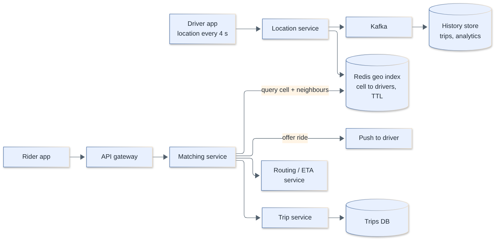

**Requirements**

- Functional: drivers report location; riders request a ride and see nearby drivers; match to the best driver; track the trip live; ETA and pricing (out of scope here).
- Non-functional: nearby search < 100–200 ms, location freshness within seconds, availability, handle city-scale density spikes, tolerate lost location pings.

**Estimates:** 1M online drivers pinging every 4 s → 1M / 4 = 250k location writes/s; at 100 B each ≈ 25 MB/s ingest. Ride requests: say 1M rides/hour peak ≈ 278 req/s (small); each runs a radius query (reads ≈ hundreds/s to a few k/s). The system is write-dominated on the location path; keep only the *latest* location in memory (1M × ~100 B ≈ 100 MB), and archive history asynchronously.

**API**

```http
PUT  /v1/drivers/{id}/location   {"lat":37.78,"lng":-122.41,"heading":90,"ts":..}   # often via WebSocket/UDP-like stream
GET  /v1/drivers/nearby?lat=..&lng=..&radius_m=2000&limit=10
POST /v1/rides                   {"pickup":{...},"dropoff":{...}} → {"ride_id":..}
```

**Data model:** hot index `cell_id → set(driver_id)` plus `driver:{id} → {lat, lng, ts, status}` in Redis (TTL ~30 s so dead drivers vanish); durable `trips(...)` in a transactional DB; location history to Kafka → object store/columnar.

**Deep dive 1: spatial indexing options**

| Approach | Idea | Pros | Cons |
|----------|------|------|------|
| Geohash | Interleave lat/lng bits → base32 string; shared prefix = nearby | Simple, works in KV/SQL/Redis; prefix queries | Cell edge problem (close points can have different prefixes), non-uniform cell shape/size by latitude |
| Quadtree | Recursively split a region into 4 until a cell holds ≤ K points | Adaptive to density (dense city = small cells) | In-memory tree needs rebalancing and dynamic updates; harder to shard |
| S2 / H3 | Hierarchical cell systems (S2 on a sphere, H3 hexagons) | Uniform neighbours, good coverage | Library dependency |
| Grid | Fixed lat/lng buckets | Easy | Poor for varying density |

Geohash precision: 5 chars ≈ 4.9 km × 4.9 km; 6 chars ≈ 1.2 km × 0.6 km; 7 chars ≈ 153 m × 153 m. For a 2 km search choose precision 5–6, then query the **target cell and its 8 neighbours** (handles the edge problem), filter by Haversine distance, then sort. Redis `GEOADD`/`GEOSEARCH` encodes locations as geohash scores in a sorted set and does this for you (best sharded by city/region because a single key lives on one node).

```text
update(driver, lat, lng):
  new = geohash(lat, lng, 6)
  if new != driver.cell:
      SREM cell:{driver.cell} driver ; SADD cell:{new} driver
  SET driver:{id} {lat,lng,ts} EX 30

nearby(lat, lng, r):
  cells = [cell(lat,lng)] + neighbors(cell)           # 9 cells
  cand = union(SMEMBERS cell:{c} for c in cells)
  return top_k(sorted(filter(cand, haversine(...) <= r)))
```

**Deep dive 2: scaling the write stream:** shard the index by geography (city/region/cell prefix) since queries are local; each shard handles its own drivers, so 250k writes/s spread across many Redis nodes. Reduce writes: send updates only when moved > N meters or on an adaptive interval (faster when on trip), batch via persistent connections. Do not write every ping to a durable DB; stream to Kafka for history. Handle hot cells (stadium, airport) with finer cells or sub-sharding.

**Deep dive 3: matching:** nearest by straight-line distance is not nearest by ETA, so take the top ~10 candidates and compute ETAs via the routing service; send the offer to the best driver with a timeout (~10–15 s), then cascade; lock a driver to a ride (atomic state transition `available → offered`) to avoid double-booking. Matching is idempotent and a ride/driver state machine in the transactional DB is the source of truth.

**Bottlenecks and trade-offs:** freshness vs write volume; cell size (larger = more candidates to filter; smaller = more cells queried); sharding by region and cross-boundary searches (query adjacent shards); stale locations (TTL); consistency of driver status across the index and trip DB.

**Senior extras:** surge/dynamic pricing as aggregation by cell, batched global matching (optimize riders and drivers together) vs greedy, GPS noise/map matching, ETA service design, driver state machine, safety/fraud, WebSocket/gRPC streaming to riders for live tracking, multi-region and cell-based failure domains.

> **Follow-up:** *Why query the 8 neighbours?* A point near a cell boundary has close neighbours in the adjacent cell whose geohash prefix may be completely different, so a single-cell query would miss them.

[↑ Back to top](#table-of-contents)

### 28. Design a distributed job scheduler

`🔴 Senior` · `#case-study` `#scheduler` `#leases`

Persist jobs with a `next_run_at`; scheduler instances atomically claim due jobs (lease/`SKIP LOCKED` or via a leader) and put them on a work queue; workers execute with heartbeats and lease expiry so crashed work is re-queued. Semantics are at-least-once, so jobs must be idempotent.

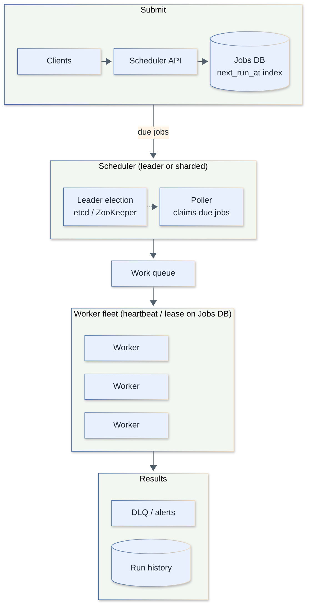

**Requirements**

- Functional: one-off and recurring (cron) jobs, delays, retries with backoff, priorities, cancel/pause, job history, dependencies (DAG, optional).
- Non-functional: no missed jobs, no (or minimal) duplicate runs, accurate to ~1 s, horizontally scalable, survive scheduler and worker failures, fair across tenants.

**Estimates:** 100M job executions/day ≈ 1,157/s average, but cron aligns on minute/hour boundaries: if 1M jobs fire at `:00` and must start within 60 s, that's ≈ 16.7k/s sustained for a minute (≈ 14× average), so size the claim path and queue for the spike. Storage: 10M scheduled definitions × 1 KB = 10 GB; run history 100M/day × 200 B = 20 GB/day (retain 30 days ≈ 600 GB, with TTL/partitioning).

**API**

```http
POST /v1/jobs   {"name":"report","schedule":"0 2 * * *","payload":{...},"timeout_s":600,"max_retries":5,"idempotency_key":".."}
POST /v1/jobs/{id}/cancel     GET /v1/jobs/{id}/runs
```

**Data model**

```sql
CREATE TABLE jobs (
  id            bigint PRIMARY KEY,
  tenant_id     bigint,
  schedule      text,                 -- cron or null for one-off
  payload       jsonb,
  status        text,                 -- scheduled | running | done | failed | paused
  next_run_at   timestamptz NOT NULL,
  attempts      int NOT NULL DEFAULT 0,
  lease_owner   text,
  lease_until   timestamptz
);
CREATE INDEX jobs_due ON jobs (next_run_at) WHERE status = 'scheduled';
```

**Deep dive 1: claiming due jobs without duplicates**

```sql
-- many schedulers can run this concurrently, rows are claimed exactly once
WITH due AS (
  SELECT id FROM jobs
  WHERE status = 'scheduled' AND next_run_at <= now()
  ORDER BY next_run_at
  LIMIT 500
  FOR UPDATE SKIP LOCKED
)
UPDATE jobs j
SET status = 'running', lease_owner = $1, lease_until = now() + interval '30 seconds'
FROM due WHERE j.id = due.id
RETURNING j.*;
```

Alternatives: a **single leader** (etcd/ZooKeeper election) does the polling and dispatches (simple, bottlenecked, needs fencing tokens so a deposed leader can't act), or **sharding** the job space (`hash(job_id) mod N`, each scheduler owns shards via leases) for scale. At very large scale use a time-bucketed structure (hierarchical timing wheel in memory, Redis sorted set by timestamp, or a delay queue) loaded from the DB for the next few minutes.

**Deep dive 2: execution, leases and failure**

- Worker renews the lease with heartbeats; if the lease expires (crash, GC pause, partition) a reaper sets the job back to `scheduled` (with `attempts + 1`). A slow-but-alive worker may still finish later, so completion must check the lease owner/fencing token (`UPDATE ... WHERE id=? AND lease_owner=?`) and the job body must be **idempotent**.
- Retries with exponential backoff + jitter, max attempts, then `failed` + alert/DLQ. Per-job timeouts. Distinguish "scheduler didn't enqueue" from "worker failed".
- Recurring jobs: compute and persist `next_run_at` in the same transaction that claims the current run (avoid drift and double-schedule); decide a **misfire policy** (skip, run once for the missed window, or run all) after downtime; handle time zones and DST for cron expressions.

**Deep dive 3: fairness and isolation:** per-tenant concurrency limits and weighted fair queues so one tenant's 1M jobs don't starve others; priority queues; separate worker pools for long vs short jobs; rate limits towards downstream systems; backpressure (stop claiming if the queue is deep).

**Bottlenecks and trade-offs:** DB polling load (index on `next_run_at`, claim in batches, partition by shard), top-of-minute thundering herd (add small random jitter to non-critical jobs), exactly-once is impossible (use idempotency), accuracy vs cost of polling interval.

**Senior extras:** dependency DAG (workflow engines such as Airflow/Temporal-style), long-running jobs with checkpoints, observability (queue lag = now − next_run_at, success rate, p99 start delay), dead-man's switch alerts for jobs that never ran, multi-region failover with a single active scheduler, security isolation for user code.

> **Follow-up:** *Why `SKIP LOCKED` rather than a plain `SELECT ... FOR UPDATE`?* Plain locking makes concurrent schedulers block on each other's rows; `SKIP LOCKED` lets each take a different batch without waiting.

[↑ Back to top](#table-of-contents)

### 29. Design typeahead / autocomplete

`🔴 Senior` · `#case-study` `#trie` `#search`

Serve the top-K completions for a prefix from a precomputed structure (a trie or prefix→top-K map) behind a cache/CDN, built offline from query logs with frequency + recency scoring and refreshed periodically. The read path must be in-memory and under ~50 ms; the write/update path is a batch/near-real-time pipeline, not in the request path.

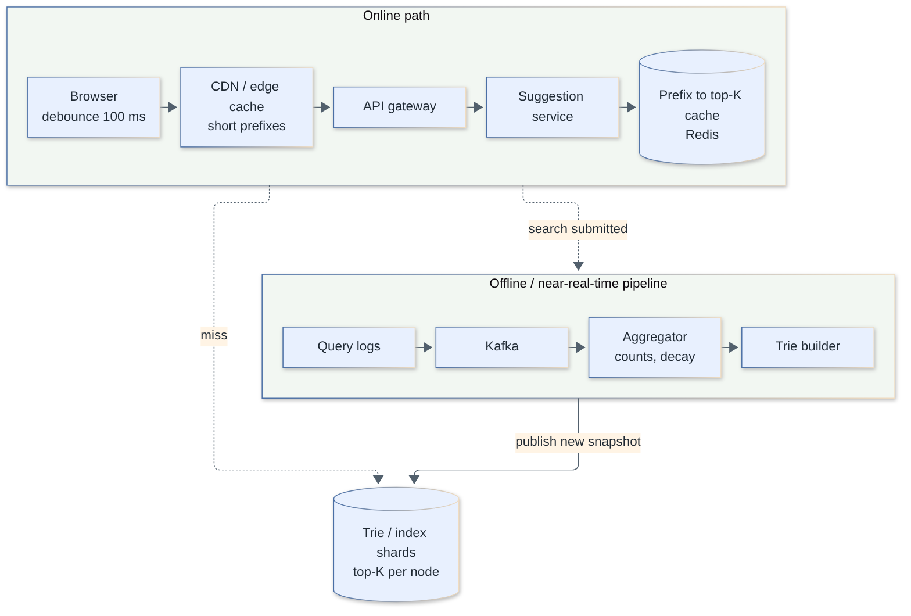

**Requirements**

- Functional: suggestions as the user types (top 5–10 by popularity/personalization), handle typos (optional), exclude offensive/blocked terms, multi-language.
- Non-functional: p99 < 50–100 ms end-to-end, very high QPS, high availability, suggestions fresh within minutes to hours (trending within minutes), eventual consistency acceptable.

**Estimates:** 100M DAU × 10 searches × ~5 suggestion requests (after debounce) = 5B requests/day ≈ 57.9k QPS average (~150k peak at ~2.5×). Data: top 10M distinct queries × ~50 B ≈ 500 MB of strings, so a full trie with top-K per node fits in memory on each serving node. CDN and browser caching handle short, popular prefixes.

**API**

```http
GET /v1/suggest?q=how%20to&limit=8&lang=en
→ {"suggestions":[{"text":"how to tie a tie","score":0.91}, ...]}
```

Client: debounce (~100–150 ms), cancel stale requests, cache results per prefix, ignore out-of-order responses.

**Data model:** a **trie** where each node stores the top-K completions for its prefix (precomputed), or an equivalent hash map `prefix → [top-K suggestions]` for every prefix up to some length (simple, memory-heavier, great for caching). Scores = f(frequency, recency decay, optional personalization). Source of truth: aggregated query counts in a store.

```text
Trie node: children{char->node}, top_k[(query, score)]  (K=5..10)

lookup(prefix): node = walk(prefix); return node.top_k      # O(len(prefix))
build:   for each (query, count): insert; then bottom-up merge children's top_k into each node
```

**Deep dive 1: serving at low latency:** (1) CDN/edge cache for the most common prefixes (1–3 chars have enormous hit rates) with short TTLs; (2) Redis/in-memory cache of `prefix → top-K`; (3) trie shards in memory on suggestion servers. Shard by prefix range (e.g. first 1–2 characters, with split of hot prefixes like "a" or "s") or replicate the full trie when it is small (500 MB) — replication is simplest and usually right. Return only top-K per node so lookups never traverse subtrees.

**Deep dive 2: the data pipeline**

- Log search queries (completed searches, not every keystroke) to Kafka → aggregate counts per time window (stream/batch) → apply time decay (so old hits fade) → filter (profanity, PII, low-count noise, "k-anonymity" threshold) → build a new trie snapshot → publish to blob storage → servers load it and **swap atomically** (immutable snapshot, blue/green). Rebuild every few hours; a small **trending overlay** updated every few minutes handles breaking news.
- Never update the serving trie in place under load; use versioned immutable snapshots with a rollback path.

**Deep dive 3: relevance:** ranking by popularity plus personalization (user history, locale), typo tolerance via edit distance/n-grams or a search engine's completion suggester (FST), and handling of multi-word queries (index query strings fully, not per word). Offensive/legal blocklists applied at build time *and* serve time.

**Bottlenecks and trade-offs:** freshness vs build cost; memory vs per-prefix precomputation; personalization breaks CDN cacheability (blend: cached global suggestions + a small per-user layer); shard hot prefixes; the cost of one request per keystroke (debounce, min prefix length 1–2, client cache).

**Senior extras:** privacy (never suggest rare queries that identify individuals, differential privacy/thresholds), abuse/manipulation (bots inflating counts, spam filtering), A/B testing of ranking, multi-language tokenization (CJK), search-engine-backed completion for typo tolerance, graceful degradation (serve stale snapshot if pipeline fails), metrics: suggestion CTR, keystrokes saved.

> **Follow-up:** *Why precompute top-K per node instead of traversing subtrees?* Traversing all completions of a short prefix like "a" touches millions of nodes; storing the top-K at each node makes lookup O(prefix length).

[↑ Back to top](#table-of-contents)

### 30. Design a real-time leaderboard (Redis sorted sets)

`🟡 Middle` · `#case-study` `#redis` `#sorted-set`

Use a Redis sorted set (`ZSET`) per leaderboard with user ID as member and score as score: `ZADD`/`ZINCRBY` update in O(log N), `ZREVRANGE` fetches the top N, and `ZREVRANK` returns a user's rank, all in memory. Persist scores in a durable DB so the ZSET can be rebuilt.

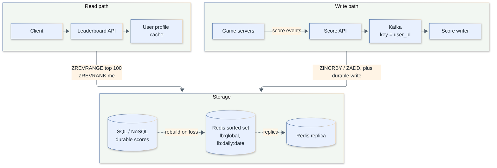

**Requirements**

- Functional: submit/update scores, top-N view, "my rank" and surrounding players, multiple boards (global, daily, weekly, per game/region), friends-only leaderboard.
- Non-functional: low latency (< 50 ms), near-real-time updates, correct ranks and tie handling, scalable to 100M users, durable scores.

**Estimates:** 50M DAU × 5 score events/day = 250M/day ≈ 2.9k/s average (~30k/s peak at 10× for event spikes). Reads (top-100, my rank) are higher, maybe 10× writes. A single ZSET with 100M members takes memory on the order of ~100 B per entry ≈ 10 GB (measure with `MEMORY USAGE`; depends on member size), which fits one large node, but sharding/replicas are needed for throughput and availability.

**API**

```http
POST /v1/scores            {"board":"global","user_id":"u42","delta":50}
GET  /v1/boards/global/top?limit=100
GET  /v1/boards/global/rank/{user_id}           → {"rank": 1532, "score": 9120}
GET  /v1/boards/global/around/{user_id}?n=5
```

**Data model and commands**

```text
ZINCRBY lb:global:2026-10 50 user:42          # add points (or ZADD GT for "best score only")
ZREVRANGE lb:global:2026-10 0 99 WITHSCORES   # top 100
ZREVRANK  lb:global:2026-10 user:42           # 0-based rank
ZSCORE    lb:global:2026-10 user:42
# players around me:
r = ZREVRANK key user:42 ;  ZREVRANGE key (r-5) (r+5) WITHSCORES
# expire old periodic boards: EXPIRE lb:daily:2026-10-07 604800
```

Durable store (SQL/NoSQL): `scores(user_id, board, score, updated_at)` written via a queue/stream; the DB is the source of truth, Redis is the serving index.

**Deep dive 1: ties and ordering:** Redis orders equal scores lexicographically by member. For "earlier achiever wins", encode the tiebreaker in the score: `score × 2^k + (MAX_TS − ts)` kept below 2^53 (doubles are exact to 2^53), or maintain tiebreak separately. Rank = number of members with a strictly higher score + 1 so tied players share a rank (`ZCOUNT` with an exclusive lower bound).

**Deep dive 2: scaling beyond one node**

- **Reads:** replicas for top-N queries (stale by milliseconds), and cache the top-100 for 1–5 s (a cheap trick because everyone asks for the same list).
- **Writes/size:** shard by *board* when you have many boards. For one giant board, shard users into S partitions by `hash(user)`, keep a sorted set per shard; **global top-N = merge of each shard's top-N** (scatter-gather, N small). A user's exact global rank = sum over shards of `ZCOUNT(score > mine)` (S queries); for huge boards, return approximate rank beyond the top (e.g. "top 5%") by score-bucket histograms instead of exact numbers.
- **Time-bucketed boards:** `lb:daily:YYYY-MM-DD`, `lb:weekly:...`; update all relevant boards per event; roll-ups and archival at period end. Windowed unions with `ZUNIONSTORE` are possible but expensive for large sets.
- **Friends leaderboard:** `ZINTERSTORE`/fetch scores of friend IDs via pipelined `ZMSCORE` and sort in the app (friend lists are small).

**Deep dive 3: durability and consistency:** ingest score events via Kafka keyed by user; a writer updates DB and Redis; idempotent by event ID (otherwise retries double-count with `ZINCRBY`). Redis persistence (AOF/RDB) and replicas reduce loss; on loss rebuild from the DB (batch `ZADD` pipelines). Accept brief inconsistency between DB and ZSET; reconcile periodically.

**Bottlenecks and trade-offs:** memory for very large boards; exact rank for every user is expensive at huge scale (approximate); hot board (global) on one shard (replicas + caching); single-threaded Redis commands on huge ranges (`ZREVRANGE` with large offsets is O(log N + M)); fairness/anti-cheat.

**Senior extras:** anti-cheat (server-authoritative scores, sanity checks, anomaly detection), tie-breaking policy, season resets and snapshots for rewards, per-region boards, leaderboard-as-a-service multi-tenancy, graceful degradation (serve cached top-N if Redis fails), alternatives (SQL with index for small scale, Cassandra counters plus periodic top-N materialization, in-memory order-statistic tree).

> **Follow-up:** *Why not `ORDER BY score DESC LIMIT 100` in SQL?* It works with an index at small scale, but rank of a given user needs `COUNT(*) WHERE score > x` (O(N) or index scan) per request; skip lists give O(log N).

[↑ Back to top](#table-of-contents)

### 31. Design a payment system (idempotency, ledger, reconciliation)

`🔴 Senior` · `#case-study` `#payments` `#ledger` `#idempotency`

Correctness over speed: an API with idempotency keys drives a payment state machine, calls external PSPs with the same key, records every money movement in an append-only **double-entry ledger**, and runs **reconciliation** against PSP/bank settlement files to catch any divergence. Never trust a single timeout response.

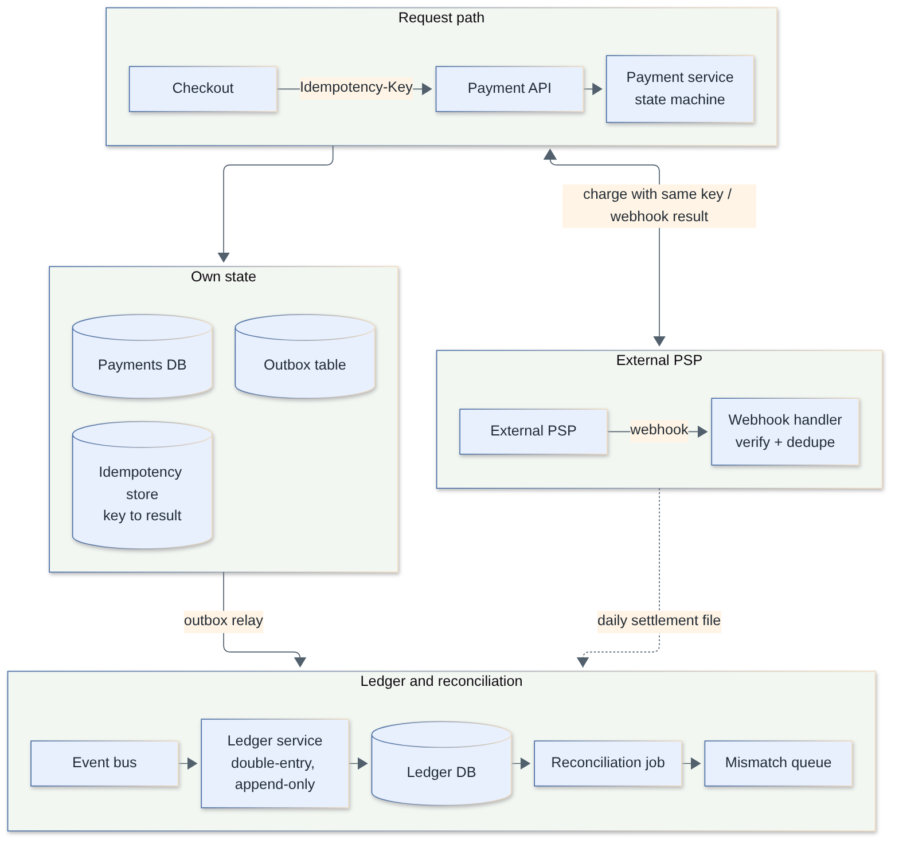

**Requirements**

- Functional: pay (authorize/capture), refund, payouts, multiple payment methods and currencies, webhooks/status, receipts, ledger/balances, reconciliation and reporting.
- Non-functional: **no double charges or lost money**, strong consistency for money state, full auditability, high availability for the pay path, security/compliance (PCI DSS: don't store raw card data; use PSP tokenization/hosted fields), tolerate PSP outages.

**Estimates:** 1M payments/day ≈ 11.6 TPS average; peak 10× (sale events) ≈ 120 TPS. That is low volume for a relational DB: complexity is in correctness, not throughput. Ledger: ≥ 2 entries per payment (more with fees) → ~3M rows/day ≈ 1.1B/year × ~200 B ≈ 220 GB/year, easily partitioned by time.

**API**

```http
POST /v1/payments
Idempotency-Key: 8f1c7f0e-...      # client-generated, one per logical payment attempt
{ "amount": 2500, "currency": "USD", "customer_id": "c1", "payment_method": "pm_tok_123", "order_id": "o9" }
→ 201 {"payment_id":"p1","status":"authorized"}   (replay of same key → same response)
POST /v1/payments/{id}/capture    POST /v1/payments/{id}/refund
POST /webhooks/psp               (signature verified; idempotent by event id)
```

Money as **integers in minor units** (cents) plus currency code. Never floating point.

**Data model**

```sql
CREATE TABLE payments (
  id uuid PRIMARY KEY, order_id text UNIQUE, amount bigint NOT NULL, currency char(3) NOT NULL,
  status text NOT NULL,            -- created|authorizing|authorized|captured|failed|refunded
  psp_ref text, version int NOT NULL DEFAULT 0, created_at timestamptz, updated_at timestamptz
);
-- append-only double-entry ledger: every transaction's entries sum to zero per currency
CREATE TABLE ledger_entries (
  id bigserial PRIMARY KEY, txn_id uuid NOT NULL, account_id text NOT NULL,
  amount bigint NOT NULL,          -- signed: debit negative, credit positive
  currency char(3) NOT NULL, created_at timestamptz DEFAULT now()
);
-- enforce in the app transaction (and by a constraint trigger / periodic check):
-- SELECT txn_id FROM ledger_entries GROUP BY txn_id, currency HAVING SUM(amount) <> 0;  -- must be empty
```

Charging $25.00: `customer_receivable −2500`, `merchant_payable +2400`, `fees_revenue +100` (sums to zero). Balances are derived (or cached as projections), history is never updated, only corrected by compensating entries.

**Deep dive 1: idempotency and the unknown outcome**

- Idempotency-key table (Q13) deduplicates client retries. Persist the payment row (`authorizing`) **before** calling the PSP, and send the PSP our own idempotency key so a retry cannot double-charge.
- The nasty case: PSP call **times out** → outcome unknown. Do not assume failure; mark `pending/unknown`, then resolve by querying the PSP by our reference, by the webhook, or by the reconciliation job. Retry-with-same-key is safe.
- Use a **state machine** with legal transitions enforced by optimistic locking (`UPDATE ... WHERE id=? AND status='authorizing' AND version=?`), so a late webhook can't regress a state.
- Keep external calls out of DB transactions. Use the **transactional outbox** to emit events (`PaymentAuthorized`) reliably to the ledger/order services, and the **saga** pattern (with compensations such as void/refund) for multi-step flows across services.

**Deep dive 2: ledger integrity:** double-entry means every movement has equal debits and credits, so a bug shows up as an imbalance. Append-only plus immutable audit trail; writes in a single DB transaction per business event; unique `(txn_id, account_id, ...)` for idempotent posting; balances via materialized projections with periodic recomputation; for hot accounts (a platform fee account touched by every payment) avoid row-lock contention by deferring aggregation (insert-only entries, periodic balance roll-up) or sharding the account. Serializable or carefully designed row-level locking where overdraft checks are needed (`SELECT ... FOR UPDATE` on the balance row or conditional update `WHERE balance >= amount`).

**Deep dive 3: reconciliation:** compare three sources daily (or intra-day): our payments/ledger, the PSP's settlement/transaction reports, and bank statements. Match by PSP reference/amount/currency; categorize breaks (missing at PSP, missing internally, amount/fee mismatch, duplicates); auto-resolve known patterns (e.g. late webhook) and queue the rest for ops with full audit. Reconciliation is the safety net that makes at-least-once messaging and unknown outcomes acceptable.

**Bottlenecks and trade-offs:** consistency vs availability: money state is CP; PSP latency/outages: multi-PSP routing and failover (careful with double-charging across PSPs: only fail over on definite failure), synchronous vs async confirmation (webhook-driven for 3-D Secure/redirect methods), sharding by merchant/customer when volume grows, retention and audit requirements.

**Senior extras:** PCI scope reduction (tokenization, hosted payment fields; never log PANs), SCA/3-D Secure, fraud scoring in the pipeline (rules + ML, with a fail-open/closed decision), webhook security (signature, replay window, idempotent handler), multi-currency (store original and settlement amounts, FX rate snapshots), chargebacks/disputes, rate limits, double-submit protection in the UI, runbooks for stuck payments, testing with PSP sandboxes and chaos tests on timeouts.

> **Follow-up:** *Why not store balance as a single mutable column?* It loses history and invites lost updates; an append-only ledger gives auditability, replay and detection of inconsistency, with balance as a derived value.

[↑ Back to top](#table-of-contents)

### 32. Design a web crawler

`🔴 Senior` · `#case-study` `#crawler` `#bloom-filter`

A crawler repeatedly takes URLs from a **frontier** (prioritized, per-host polite queues), fetches pages with a distributed fetcher fleet, extracts links, deduplicates URLs and content, and feeds new URLs back and content to the indexer. The hard parts are politeness, deduplication and scale/traps.

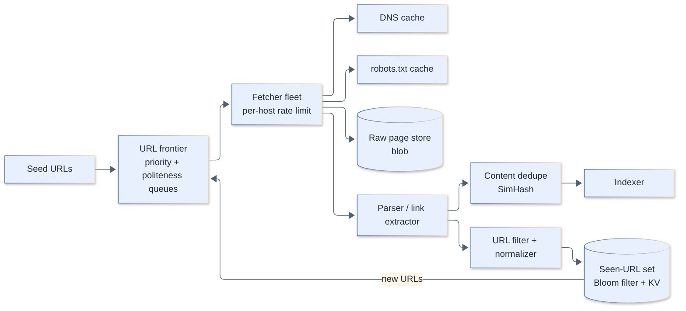

**Requirements**

- Functional: crawl from seed URLs, respect `robots.txt`, extract links and content, re-crawl for freshness, store raw pages and metadata, hand off to indexing.
- Non-functional: scalable (billions of pages), **polite** (don't DoS sites), robust to malformed pages and traps, extensible (new content types), fault-tolerant and resumable, priority by importance/freshness.

**Estimates:** 1B pages/month → 1×10^9 / 2.592×10^6 s ≈ 386 pages/s (~400). At 100 KB average HTML: 100 TB/month raw (1×10^9 × 10^5 B = 10^14), ~1.2 PB/year, before compression (often 3–5× smaller). Bandwidth: 400 × 100 KB = 40 MB/s ≈ 320 Mbit/s, modest. DNS and connection reuse matter more than raw bandwidth. Seen-URL set for 10B URLs: Bloom filter at 1% FP ≈ 12 GB (Q19) vs hundreds of GB for exact storage.

**API (internal)**

```text
frontier.next(host_shard)  -> [url, ...] respecting per-host delay
fetcher.fetch(url)         -> {status, headers, body, fetched_at}
POST /submit-url (optional public submission)
```

**Data model:** `url_state(url_hash, url, host, last_crawled, next_crawl_at, content_hash, status, depth, priority)` in a KV/wide-column store sharded by host hash; raw pages in blob storage (`WARC`-like containers); link graph (src → dst) for ranking; per-host metadata (robots rules, crawl delay, error rate).

**Deep dive 1: the URL frontier (priority + politeness)**

- Two-level queues: **front queues** by priority (page importance, change frequency) and **back queues**, one per host, so each host gets at most one in-flight request and a minimum delay (honour `Crawl-delay`, default ~1 s, adapt to response time and error rate).
- A heap keyed by "next allowed time" per host picks a ready back queue; assign hosts to fetcher workers by `hash(host)` (consistent hashing) so a host is only handled by one worker → politeness without distributed locks and good connection/DNS reuse.
- Frontier is persisted (disk-backed queue/Kafka partitions) for resumption; add fairness so huge sites don't starve others.

**Deep dive 2: deduplication**

- **URL dedupe:** normalize (lowercase host, strip fragments, sort/clean query params, resolve relative URLs, remove tracking params), then check `seen` with a Bloom filter in memory (false positive = a page missed; acceptable) backed by an exact KV store for confirmation if needed.
- **Content dedupe:** exact via content hash; near-duplicate via **SimHash/MinHash** to avoid indexing mirrors and boilerplate pages.
- **Crawler traps:** infinite calendars, session IDs in URLs, endless redirects: cap URL length and depth, cap pages per host/path pattern, detect repeating path segments, redirect limits, per-host budgets.

**Deep dive 3: freshness and fetching**

- Re-crawl scheduling by change rate: estimate per-URL change frequency from history (conditional requests with `If-Modified-Since`/`ETag`; sitemaps), crawl news front pages every minutes, static pages monthly. Priority = importance × expected staleness.
- Fetcher: async I/O with large connection pools, DNS cache (DNS is a classic bottleneck), timeouts and size caps (e.g. 10 MB), content-type filtering, handle gzip/charsets, follow redirects with limits, rotate user-agent identifying the bot with contact info, respect `robots.txt` (cached per host with TTL ~24 h).
- JavaScript-heavy pages need a headless-browser rendering tier, 10–100× more expensive, used selectively.

**Bottlenecks and trade-offs:** DNS and per-host rate limits not bandwidth; memory for the seen-set; breadth-first (good coverage) vs best-first (important pages first); freshness vs coverage; storage cost; legal/ethical limits.

**Senior extras:** crawl-budget allocation per domain, handling of soft 404s and spam farms, geographic distribution of fetchers (closer to targets, IP reputation and rotation within ethical bounds), idempotent worker design with checkpointing, observability (pages/s, error rates by host, frontier depth, duplicate ratio), partitioning by host for easy rebalancing, security (sandbox the parser; malicious content, zip bombs), honoring `noindex`/`nofollow` and removal requests.

> **Follow-up:** *Why partition the frontier by host?* Politeness is a per-host property; if one worker owns a host's queue it can enforce the delay locally without cross-worker coordination, and it reuses that host's connections and robots.txt cache.

[↑ Back to top](#table-of-contents)
