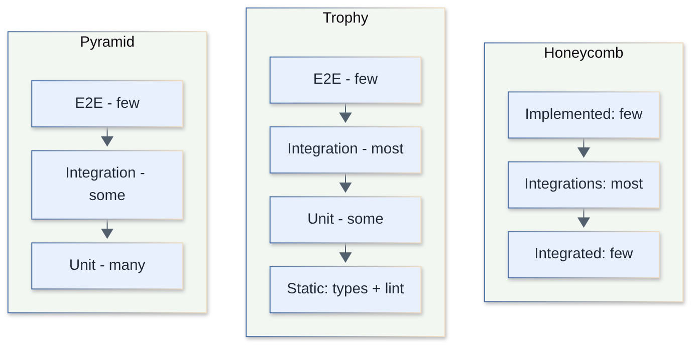
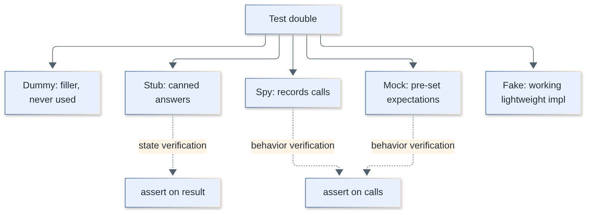
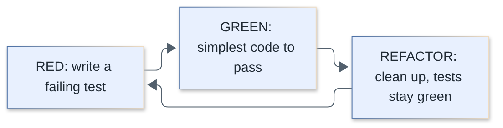
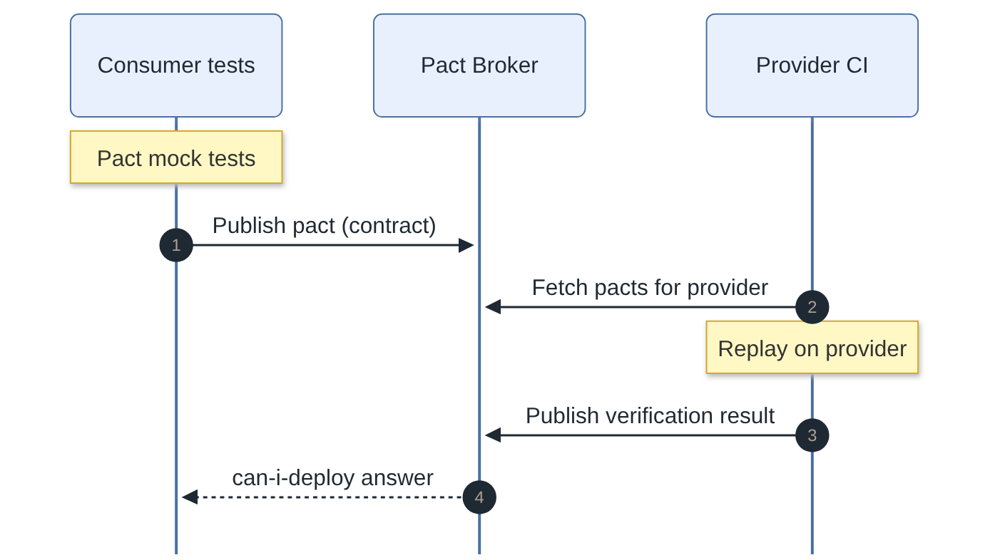
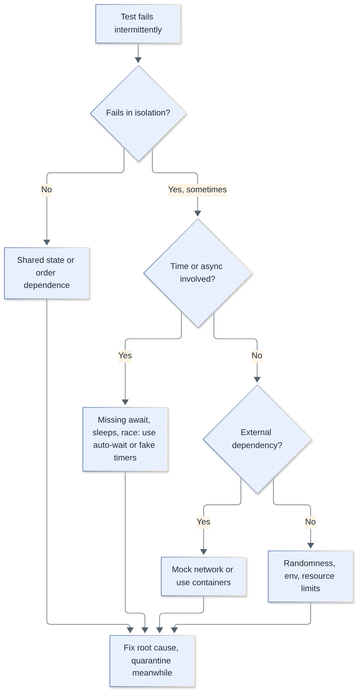
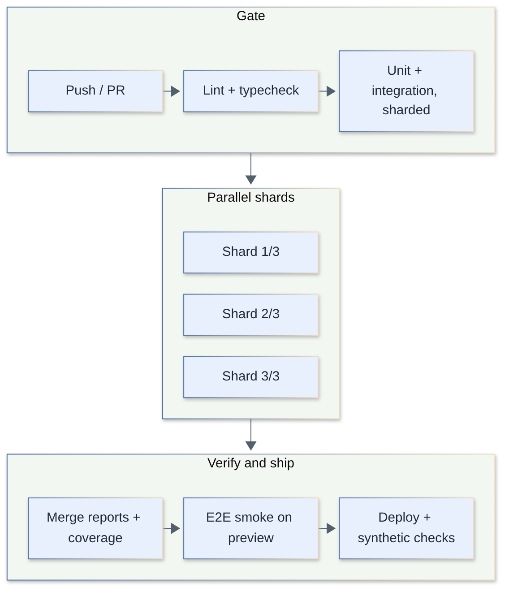

# Testing Interview Questions

Questions and complete answers on software testing for fullstack engineers: strategy, unit/integration/e2e testing, frontend and backend practices, CI and production testing. Code examples use Vitest/Jest, React Testing Library, MSW, supertest, Playwright, k6 and fast-check.

**Levels:** `🟢 Junior` · `🟡 Middle` · `🔴 Senior`

## Table of contents


**Fundamentals**

1. [Why do we write automated tests?](#1-why-do-we-write-automated-tests)
2. [What is the difference between unit, integration, e2e, contract, smoke and regression tests?](#2-what-is-the-difference-between-unit-integration-e2e-contract-smoke-and-regression-tests)
3. [Test pyramid vs testing trophy vs honeycomb: which one should you follow?](#3-test-pyramid-vs-testing-trophy-vs-honeycomb-which-one-should-you-follow)
4. [What makes a good test? Explain FIRST and Arrange-Act-Assert.](#4-what-makes-a-good-test-explain-first-and-arrange-act-assert)
5. [What should you test and what should you not test?](#5-what-should-you-test-and-what-should-you-not-test)
6. [Test behavior, not implementation: what does that mean?](#6-test-behavior-not-implementation-what-does-that-mean)
7. [Dummy, stub, spy, mock and fake: what is the difference?](#7-dummy-stub-spy-mock-and-fake-what-is-the-difference)
8. [What are the pitfalls of mocking and how do you avoid over-mocking?](#8-what-are-the-pitfalls-of-mocking-and-how-do-you-avoid-over-mocking)
9. [What is TDD? Explain red-green-refactor and when it helps or hurts.](#9-what-is-tdd-explain-red-green-refactor-and-when-it-helps-or-hurts)
10. [What is BDD and how does it differ from TDD?](#10-what-is-bdd-and-how-does-it-differ-from-tdd)
11. [How do you structure tests: setup, teardown and isolation?](#11-how-do-you-structure-tests-setup-teardown-and-isolation)
12. [How do you write parameterized tests and good assertions?](#12-how-do-you-write-parameterized-tests-and-good-assertions)

**Coverage, Tooling and Test Techniques**

13. [What is code coverage and why is 100 percent a bad target?](#13-what-is-code-coverage-and-why-is-100-percent-a-bad-target)
14. [What is mutation testing and how does it measure test quality?](#14-what-is-mutation-testing-and-how-does-it-measure-test-quality)
15. [Snapshot testing: pros, cons and when to use it](#15-snapshot-testing-pros-cons-and-when-to-use-it)
16. [How do property-based tests with fast-check differ from example-based tests?](#16-how-do-property-based-tests-with-fast-check-differ-from-example-based-tests)
17. [How do you test async code and timers (fake timers)?](#17-how-do-you-test-async-code-and-timers-fake-timers)
18. [Jest vs Vitest vs node:test: which test runner should you choose?](#18-jest-vs-vitest-vs-nodetest-which-test-runner-should-you-choose)
19. [How do you handle test data: factories, builders and fixtures?](#19-how-do-you-handle-test-data-factories-builders-and-fixtures)

**Frontend Testing**

20. [What is the React Testing Library philosophy and what is the query priority?](#20-what-is-the-react-testing-library-philosophy-and-what-is-the-query-priority)
21. [user-event vs fireEvent, and how do async utilities (findBy, waitFor) work?](#21-user-event-vs-fireevent-and-how-do-async-utilities-findby-waitfor-work)
22. [How do you test custom React hooks?](#22-how-do-you-test-custom-react-hooks)
23. [How does MSW mock APIs, and why is it better than mocking fetch?](#23-how-does-msw-mock-apis-and-why-is-it-better-than-mocking-fetch)
24. [How do you test Next.js server components and server actions?](#24-how-do-you-test-nextjs-server-components-and-server-actions)
25. [How do you test accessibility automatically?](#25-how-do-you-test-accessibility-automatically)
26. [What is visual regression testing and how do you keep it stable?](#26-what-is-visual-regression-testing-and-how-do-you-keep-it-stable)

**Backend Testing**

27. [How do you test HTTP APIs with supertest?](#27-how-do-you-test-http-apis-with-supertest)
28. [How do you write backend integration tests with a real database (Testcontainers)?](#28-how-do-you-write-backend-integration-tests-with-a-real-database-testcontainers)
29. [How do you isolate database state between integration tests?](#29-how-do-you-isolate-database-state-between-integration-tests)
30. [What is contract testing and how does Pact work?](#30-what-is-contract-testing-and-how-does-pact-work)

**End-to-End Testing**

31. [Playwright vs Cypress: how do they compare?](#31-playwright-vs-cypress-how-do-they-compare)
32. [How do Playwright locators and auto-waiting work?](#32-how-do-playwright-locators-and-auto-waiting-work)
33. [How do you use fixtures and reuse authentication state in Playwright?](#33-how-do-you-use-fixtures-and-reuse-authentication-state-in-playwright)
34. [How do you debug and speed up Playwright tests: trace viewer, parallelism, sharding?](#34-how-do-you-debug-and-speed-up-playwright-tests-trace-viewer-parallelism-sharding)
35. [What causes flaky tests and how do you fix them?](#35-what-causes-flaky-tests-and-how-do-you-fix-them)

**Non-Functional, CI and Production Testing**

36. [How do you do load testing with k6?](#36-how-do-you-do-load-testing-with-k6)
37. [How do you run tests efficiently in CI: sharding, caching and test impact analysis?](#37-how-do-you-run-tests-efficiently-in-ci-sharding-caching-and-test-impact-analysis)
38. [What is a sound retry and quarantine policy for tests in CI?](#38-what-is-a-sound-retry-and-quarantine-policy-for-tests-in-ci)
39. [What is testing in production and how do you do it safely?](#39-what-is-testing-in-production-and-how-do-you-do-it-safely)
40. [How would you design a test strategy for a new feature or service?](#40-how-would-you-design-a-test-strategy-for-a-new-feature-or-service)
41. [How do you add tests to a legacy codebase with no tests?](#41-how-do-you-add-tests-to-a-legacy-codebase-with-no-tests)

## Fundamentals

### 1. Why do we write automated tests?

`🟢 Junior` · `#fundamentals`

To get fast, repeatable feedback that the software still does what we think it does, so we can change code without fear. Tests are executable documentation and a safety net for refactoring; they are not proof of absence of bugs.

What tests buy you:

- **Regression protection**: a bug fixed once stays fixed.
- **Design feedback**: code that is hard to test is usually too coupled.
- **Confidence to refactor and deploy** often (the foundation of CI/CD).
- **Documentation** that cannot go stale (it fails when it lies).

What they cost: writing time, maintenance, CI minutes, and false confidence when they assert the wrong things. A test is worth writing when the cost of the bug it prevents (probability x impact) exceeds the cost of maintaining the test.

```ts
// A test that documents a rule AND guards it
import { expect, test } from 'vitest';
import { applyDiscount } from './pricing';

test('discount never produces a negative price', () => {
  expect(applyDiscount(10, 150)).toBe(0); // 150% off clamps to 0
});
```

> **Follow-up:** "Can tests prove there are no bugs?" No. Dijkstra: testing shows the presence, never the absence, of bugs.

[↑ Back to top](#table-of-contents)

---

### 2. What is the difference between unit, integration, e2e, contract, smoke and regression tests?

`🟢 Junior` · `#fundamentals` `#test-types`

They are classified along two axes: **scope** (how much of the system runs: unit, integration, e2e, contract) and **purpose** (why you run it: smoke, regression). One test can be both, e.g. an e2e test that is part of the regression suite.

| Type | Scope / purpose | Speed | Typical tool |
|---|---|---|---|
| **Unit** | One function/class/component in isolation, collaborators faked | ms | Vitest, Jest |
| **Integration** | Several real units together (service + real DB, component + store) | 10s-100s ms | Vitest + Testcontainers, supertest, RTL |
| **E2E** | Whole system through the real UI/entry point | seconds | Playwright, Cypress |
| **Contract** | The agreed request/response shape between two services, tested on each side separately | ms-s | Pact, OpenAPI validators |
| **Smoke** | Minimal "is it alive and are the critical paths up?" after a deploy | seconds | Playwright tag, curl, synthetic monitors |
| **Regression** | Any test that guards behavior that previously broke or must not change | any | the whole suite |

The boundary between unit and integration is fuzzy. A useful rule: *if it touches the network, filesystem, a real database or the clock, it is not a (pure) unit test.* Many teams call a component rendered with RTL a "unit" test; Kent C. Dodds calls it integration. Agree on definitions inside your team and do not argue about labels.

> **Follow-up:** "Where do sanity tests fit?" Sanity = a narrow check that one specific fix/feature works; smoke = broad shallow check that the build is not fundamentally broken.

[↑ Back to top](#table-of-contents)

---

### 3. Test pyramid vs testing trophy vs honeycomb: which one should you follow?

`🟡 Middle` · `#strategy` `#test-types`

All three answer "how should I distribute tests across levels?". The **pyramid** says many fast unit tests, fewer integration, very few e2e. The **trophy** (Kent C. Dodds) says most value comes from integration tests, backed by static analysis at the base. The **honeycomb** (Spotify, for microservices) says test mostly the *integrations* of a service with its neighbors, with few tests of internal implementation details.



| Model | Biggest layer | Rationale | Best for |
|---|---|---|---|
| Pyramid | Unit | Cheap, fast, precise failure location | Logic-heavy libraries, algorithms |
| Trophy | Integration | Confidence per test is highest when real pieces collaborate; mocks everywhere hide wiring bugs | UI apps, CRUD-ish products |
| Honeycomb | Integrations (service boundary) | Microservices have little internal logic; risk is at the seams | Microservice backends |

Practical answer: do not follow a shape dogmatically. Ask "what breaks in production in *my* system?" A pricing engine deserves a fat unit layer; a thin BFF that glues three APIs deserves integration and contract tests. Keep **static analysis (TypeScript, ESLint)** as the cheapest layer in every model. The real invariants are: fast tests run on every save, slow tests run in CI, and e2e covers only critical user journeys.

> **Follow-up:** "Ice-cream cone anti-pattern?" Inverted pyramid: mostly manual/e2e tests, few unit tests. It is slow, flaky and expensive.

[↑ Back to top](#table-of-contents)

---

### 4. What makes a good test? Explain FIRST and Arrange-Act-Assert.

`🟢 Junior` · `#fundamentals` `#best-practices`

A good test is fast, deterministic, readable, fails for exactly one reason, and tells you what broke from its name alone. **FIRST** is the checklist; **AAA** (a.k.a. Given-When-Then) is the structure.

**FIRST**

- **F**ast: milliseconds, so people actually run them.
- **I**ndependent: no order dependence, no shared mutable state.
- **R**epeatable: same result on every machine, any time (no real clock, network, randomness).
- **S**elf-validating: pass/fail without a human reading logs.
- **T**imely: written close to the code (ideally just before or with it).

**AAA**

```ts
import { expect, test } from 'vitest';
import { Cart } from './cart';

test('total includes VAT for each item', () => {
  // Arrange
  const cart = new Cart({ vatRate: 0.2 });
  cart.add({ sku: 'A', price: 100, qty: 2 });

  // Act
  const total = cart.total();

  // Assert
  expect(total).toBe(240);
});
```

Other traits: one logical assertion per test, names that read as a sentence (`rejects expired coupons`), no logic (`if`/loops) in tests, and failure messages that point at the cause.

> **Follow-up:** "Is multiple `expect`s in one test bad?" Not if they describe one behavior (e.g., several fields of one response). Bad is testing many unrelated behaviors in one test.

[↑ Back to top](#table-of-contents)

---

### 5. What should you test and what should you not test?

`🟢 Junior` · `#fundamentals` `#strategy`

Test **behavior that matters to users or callers**: business rules, edge cases, error paths, and integration points. Do not test the language, the framework, third-party libraries, trivial getters, or private implementation details.

| Worth testing | Usually not worth it |
|---|---|
| Business rules (pricing, permissions) | `expect(obj.name).toBe(obj.name)` style tautologies |
| Boundary values (0, 1, max, empty, null) | Library internals (`lodash.map` works) |
| Error handling and validation | Pure config/constants |
| Bug fixes (write the failing test first) | Private helpers (test through the public API) |
| Critical user journeys | Auto-generated code |

Heuristic: test the code that would hurt most if wrong and that changes often. Prioritize by risk, not by coverage numbers.

```ts
// Boundary values are where bugs live
test.each([
  [0, false], [17, false], [18, true], [120, true],
])('isAdult(%i) -> %s', (age, expected) => {
  expect(isAdult(age)).toBe(expected);
});
```

[↑ Back to top](#table-of-contents)

---

### 6. Test behavior, not implementation: what does that mean?

`🟡 Middle` · `#best-practices` `#refactoring`

A test should assert **what** the unit does (observable output, state visible to callers, side effects at the boundary), not **how** it does it (which private methods get called, in what order, internal state shape). Tests coupled to implementation break on every refactor while the behavior is unchanged, which destroys trust in the suite.

```ts
// Brittle: tied to implementation
test('adds user', () => {
  const spy = vi.spyOn(service as any, '_normalizeEmail'); // private!
  service.register({ email: 'A@B.com' });
  expect(spy).toHaveBeenCalledTimes(1);
});

// Robust: tied to behavior
test('registers a user with a normalized email', async () => {
  await service.register({ email: 'A@B.com' });
  expect(await repo.findByEmail('a@b.com')).toMatchObject({ email: 'a@b.com' });
});
```

Signals you test implementation: renaming a private function breaks tests; refactoring with identical behavior turns the suite red; you assert call counts of internal collaborators; in React, you read component state or use `shallow`/`instance()`.

Guideline: the public API is the test boundary. Mock only at the **system edges** (network, clock, DB when not testing it). "The more your tests resemble the way your software is used, the more confidence they can give you."

> **Follow-up:** "Then when is asserting a call okay?" When the call IS the behavior: sending an email, publishing an event, charging a card via a port.

[↑ Back to top](#table-of-contents)

---

### 7. Dummy, stub, spy, mock and fake: what is the difference?

`🟢 Junior` · `#test-doubles`

They are all **test doubles** (Gerard Meszaros' taxonomy): stand-ins for real collaborators. They differ by what they do and what you verify.



| Double | What it does | Verifies | Example |
|---|---|---|---|
| **Dummy** | Passed to satisfy a signature; never used | nothing | `new Service(null as any)` |
| **Stub** | Returns canned answers | state/result | `getRate = () => 1.1` |
| **Spy** | Real or stub behavior + records calls | calls (after the fact) | `vi.spyOn(mailer, 'send')` |
| **Mock** | Pre-programmed with expectations; fails if not met | calls (behavior) | `expect(send).toHaveBeenCalledWith(...)` |
| **Fake** | Working but simplified implementation | state | in-memory repository, SQLite, `memfs` |

```ts
import { expect, test, vi } from 'vitest';

type Mailer = { send(to: string, body: string): Promise<void> };
type Rates = { get(cur: string): Promise<number> };

test('doubles in action', async () => {
  const dummyLogger = {} as Console;                    // dummy
  const rates: Rates = { get: async () => 1.1 };         // stub
  const mailer: Mailer = { send: vi.fn(async () => {}) };// spy/mock (vi.fn)

  const invoice = new InvoiceService(rates, mailer, dummyLogger);
  await invoice.sendTotal('a@b.com', 100, 'EUR');

  expect(mailer.send).toHaveBeenCalledWith('a@b.com', expect.stringContaining('110')); // behavior check
});

// Fake: real logic, in memory
class InMemoryUserRepo {
  private rows = new Map<string, { id: string; email: string }>();
  async save(u: { id: string; email: string }) { this.rows.set(u.id, u); }
  async findById(id: string) { return this.rows.get(id) ?? null; }
}
```

In everyday JS, `vi.fn()` / `jest.fn()` is used as stub, spy and mock interchangeably; the distinction is how you use it. Prefer **fakes and stubs (state verification)** over **mocks (behavior verification)** where possible; they are less coupled to implementation.

> **Follow-up:** "London vs Chicago/Detroit school?" London (mockist) mocks all collaborators and verifies interactions; Chicago (classicist) uses real objects and only fakes slow/external things.

[↑ Back to top](#table-of-contents)

---

### 8. What are the pitfalls of mocking and how do you avoid over-mocking?

`🟡 Middle` · `#test-doubles` `#best-practices`

Mocks let you isolate code, but each mock is a *claim about how the real thing behaves*. If the claim is wrong or drifts, tests stay green while production breaks. Over-mocking produces tests that verify the mocks, not the system.

Common pitfalls:

1. **Mock drift**: the real API changed (new field, different error) and the mock didn't. Mitigate with contract tests, typed mocks (`vi.mocked`, `satisfies`), and shared fixtures generated from schemas (OpenAPI/Zod).
2. **Testing wiring, not behavior**: ten mocks and an assertion that function A called B. Refactoring breaks it.
3. **Mocking what you own** deep inside the module under test, rather than at the boundary.
4. **Mocking types you don't own** (e.g., Prisma client chains): the mock encodes a guess of the library semantics. Wrap third-party in a thin adapter you own, mock that, and test the adapter with an integration test.
5. **Module-level mocks leaking** between tests (`vi.mock` is hoisted and file-wide; forgetting `vi.restoreAllMocks()` / `mockReset`).
6. **Mocking time/randomness inconsistently**, making tests order-dependent.

```ts
// Smell: everything mocked, nothing real is exercised
vi.mock('./repo'); vi.mock('./mailer'); vi.mock('./logger'); vi.mock('./clock');
// ...test asserts only that mocks were called in sequence.

// Better: real service + fake repo, mock only the external edge (mailer)
const repo = new InMemoryUserRepo();
const mailer = { send: vi.fn() };
const svc = new SignupService(repo, mailer);
await svc.signup('a@b.com');
expect(await repo.findByEmail('a@b.com')).not.toBeNull();
expect(mailer.send).toHaveBeenCalledOnce();
```

Rules of thumb: mock at process boundaries (HTTP via MSW, not by mocking `fetch` call sites); prefer real DB via containers for data-access code; if a test needs >3 mocks, reconsider the design (too many dependencies).

> **Follow-up:** "How do you keep a mock honest?" Back it with a contract/integration test, or generate it from the same schema as the real implementation.

[↑ Back to top](#table-of-contents)

---

### 9. What is TDD? Explain red-green-refactor and when it helps or hurts.

`🟡 Middle` · `#tdd` `#practices`

TDD (Test-Driven Development) means writing a failing test **before** the production code, in tiny steps: **Red** (write a failing test), **Green** (write the simplest code that passes), **Refactor** (clean up while tests stay green). The tests drive the design.



```ts
// RED: fails because fizzbuzz does not exist
test('returns "Fizz" for multiples of 3', () => {
  expect(fizzbuzz(3)).toBe('Fizz');
});
// GREEN: simplest thing
export const fizzbuzz = (n: number) => (n % 3 === 0 ? 'Fizz' : String(n));
// next RED: 5 -> "Buzz", then 15 -> "FizzBuzz"; REFACTOR when duplication appears.
```

| Helps | Hurts / less useful |
|---|---|
| Well-understood logic, algorithms, parsers, domain rules | Exploratory work/spikes where the design is unknown |
| Bug fixes (reproduce first) | UI layout and visual polish |
| Forces small, decoupled, testable units | Heavy integration glue where tests need big setup |
| Gives a tight feedback loop and a built-in safety net | Teams treating it as dogma (100% test-first, mock-heavy, brittle tests) |

Pragmatic approach: use TDD where the *what* is clear, spike without tests when it is not, then write tests (or throw the spike away and redo it test-first). "Test-first" is a tool, not an identity.

> **Follow-up:** "Outside-in vs inside-out TDD?" Outside-in starts from an acceptance/integration test and mocks collaborators down the stack (London); inside-out builds small units bottom-up (Chicago).

[↑ Back to top](#table-of-contents)

---

### 10. What is BDD and how does it differ from TDD?

`🟡 Middle` · `#bdd` `#practices`

BDD (Behavior-Driven Development) is a collaboration practice: product, QA and developers specify behavior in shared, plain language examples (**Given-When-Then**) before building. TDD is a developer technique for driving code with tests; BDD is about *shared understanding* and naming tests after behavior. BDD tools (Cucumber/Gherkin) are optional; the mindset is not.

```gherkin
Feature: Coupon redemption
  Scenario: Expired coupon is rejected
    Given a coupon "SPRING" that expired yesterday
    When the customer applies "SPRING" to their cart
    Then the cart total is unchanged
    And the customer sees "Coupon expired"
```

You can get BDD benefits without Gherkin, using descriptive `describe/it` blocks:

```ts
describe('coupon redemption', () => {
  describe('given an expired coupon', () => {
    it('does not change the cart total and reports the reason', () => { /* ... */ });
  });
});
```

| | TDD | BDD |
|---|---|---|
| Audience | Developers | Whole team incl. business |
| Level | Unit / small component | Feature / acceptance behavior |
| Artifact | Test code | Living specification (examples) + automation |
| Risk | Over-specifying internals | Gherkin overhead if no business reader exists |

Gherkin pays off only when non-developers actually read and write the scenarios. Otherwise it is an extra indirection layer.

[↑ Back to top](#table-of-contents)

---

### 11. How do you structure tests: setup, teardown and isolation?

`🟢 Junior` · `#fundamentals` `#isolation`

Each test must be able to run alone and in any order. Use `beforeEach` to create fresh state, `afterEach` to clean up, and avoid sharing mutable variables between tests. Prefer small factory functions over big shared fixtures.

```ts
import { afterEach, beforeEach, describe, expect, it, vi } from 'vitest';

describe('ShoppingCart', () => {
  let cart: Cart;

  beforeEach(() => {
    cart = new Cart();           // fresh instance per test
  });

  afterEach(() => {
    vi.restoreAllMocks();        // undo spies
  });

  it('starts empty', () => expect(cart.items).toHaveLength(0));
  it('adds items', () => {
    cart.add({ sku: 'A', price: 5 });
    expect(cart.items).toHaveLength(1); // not affected by previous test
  });
});
```

| Hook | Runs | Use for |
|---|---|---|
| `beforeAll` / `afterAll` | once per file/describe | Expensive resources (server, DB container) |
| `beforeEach` / `afterEach` | around every test | Fresh state, restoring mocks |

Do not hide critical Arrange steps in distant hooks: readers should see the relevant setup inside the test. Test runners run files in parallel workers (separate module state), but tests within a file run sequentially by default.

[↑ Back to top](#table-of-contents)

---

### 12. How do you write parameterized tests and good assertions?

`🟢 Junior` · `#fundamentals` `#assertions`

Use `test.each` (Jest and Vitest) to run the same logic over a table of inputs, and pick the strictest matcher that expresses your intent.

```ts
test.each([
  { input: '', expected: false },
  { input: 'a@b.co', expected: true },
  { input: 'a@b', expected: false },
])('isEmail($input) -> $expected', ({ input, expected }) => {
  expect(isEmail(input)).toBe(expected);
});
```

| Matcher | Semantics | Use when |
|---|---|---|
| `toBe` | `Object.is` (reference/primitive) | primitives, same reference |
| `toEqual` | deep equality, ignores `undefined` props | plain objects/arrays |
| `toStrictEqual` | deep + types + `undefined` props | when class/`undefined` matters |
| `toMatchObject` | subset match | large objects, partial checks |
| `toThrow` | function throws | sync errors |
| `resolves` / `rejects` | promise outcome | async |

```ts
expect(() => parse('{')).toThrow(SyntaxError);
await expect(fetchUser('x')).rejects.toThrow('not found');
expect(0.1 + 0.2).toBeCloseTo(0.3); // floats
```

Common bug: forgetting `await` on `expect(...).rejects`, which makes the test pass without checking anything. Enable the lint rule `vitest/valid-expect` (or `jest/valid-expect`) and use `expect.assertions(n)` for callbacks.

[↑ Back to top](#table-of-contents)

---

## Coverage, Tooling and Test Techniques

### 13. What is code coverage and why is 100 percent a bad target?

`🟢 Junior` · `#coverage`

Coverage measures which code was *executed* by tests, not whether behavior was *verified*. It reliably tells you what is **not** tested, but high coverage does not prove quality. Treat it as a smoke detector, not a goal.

| Metric | Meaning |
|---|---|
| Line / statement | Was this line executed? |
| Branch | Was each side of every `if`/`?:`/`&&`/`switch` taken? |
| Function | Was each function called? |

Line coverage can be 100% with half the branches untested:

```ts
export const label = (n: number, vip: boolean) => (n > 0 && vip ? 'gold' : 'basic');

test('covers every line', () => {
  expect(label(1, true)).toBe('gold');   // 100% lines, but 50% branches
});
```

Why 100% as a *target* is harmful (Goodhart's law: a measure that becomes a target stops being a good measure):

- People write assertion-free tests just to touch lines.
- Effort goes into trivial code (getters, config) instead of risky logic.
- Tests of implementation details multiply and make refactoring painful.
- Gives false confidence: executed is not verified.

Sensible policy: a threshold floor (e.g., 70-80% on new code) enforced in CI, plus **branch** coverage on critical modules, plus mutation testing for the core domain.

```ts
// vitest.config.ts
import { defineConfig } from 'vitest/config';
export default defineConfig({
  test: {
    coverage: {
      provider: 'v8', // or 'istanbul'
      reporter: ['text', 'lcov'],
      include: ['src/**/*.ts'],
      thresholds: { lines: 80, branches: 70 },
    },
  },
});
```

> **Follow-up:** "v8 vs istanbul provider?" v8 uses native engine coverage (fast, no instrumentation); istanbul instruments source (works across more runtimes, can differ in branch counting).

[↑ Back to top](#table-of-contents)

---

### 14. What is mutation testing and how does it measure test quality?

`🔴 Senior` · `#coverage` `#mutation-testing`

Mutation testing automatically makes small changes ("mutants") to your source (flip `>` to `>=`, remove a statement, change `&&` to `||`) and re-runs the tests. If a test fails, the mutant is **killed**; if all tests still pass, it **survived**, which reveals an untested behavior even when line coverage is 100%. The **mutation score** is killed / total (excluding equivalent mutants).

```ts
export const isAdult = (age: number) => age >= 18;

// Weak test: coverage 100%, but...
test('adult', () => expect(isAdult(30)).toBe(true));
// Mutant `age > 18` survives. Add the boundary:
test('18 is adult', () => expect(isAdult(18)).toBe(true));
```

Tooling for JS/TS is Stryker (`@stryker-mutator/core` with the Jest or Vitest runner plugin):

```json
{
  "testRunner": "vitest",
  "mutate": ["src/domain/**/*.ts", "!src/**/*.test.ts"],
  "coverageAnalysis": "perTest",
  "thresholds": { "high": 80, "low": 60, "break": 50 }
}
```

Run with `npx stryker run`. Trade-offs: it is slow (many test runs), so run it on the critical domain, incrementally on changed files, or nightly rather than on every commit. Equivalent mutants (changes that do not alter behavior) cause noise.

> **Follow-up:** "Coverage vs mutation score?" Coverage says what ran; mutation score says whether your assertions would notice a change.

[↑ Back to top](#table-of-contents)

---

### 15. Snapshot testing: pros, cons and when to use it

`🟡 Middle` · `#snapshots` `#best-practices`

A snapshot test serializes a value (object, DOM tree, error message) to a file on first run and compares against it on later runs. It is cheap to write and good at catching *unintended* changes, but easy to abuse: big snapshots get rubber-stamped with `-u`.

```ts
import { expect, test } from 'vitest';

test('formats the API error', () => {
  expect(toApiError(new NotFound('user'))).toMatchInlineSnapshot(`
    {
      "code": "NOT_FOUND",
      "message": "user not found",
      "status": 404,
    }
  `);
});
```

| Pros | Cons |
|---|---|
| Very fast to write | Noisy diffs; reviewers approve blindly |
| Catches unintentional output changes | Does not state *intent*; unclear what is important |
| Good for stable serializable output (CLI output, generated code, error shapes) | Brittle for big DOM trees and anything with ids/dates |

Guidelines: keep snapshots **small and focused**, prefer `toMatchInlineSnapshot` (visible in the test), use property matchers for volatile fields (`expect.any(String)`), never snapshot whole React trees as your main UI test, and review snapshot diffs like code. For UI, prefer RTL assertions on roles/text and visual tests for appearance.

[↑ Back to top](#table-of-contents)

---

### 16. How do property-based tests with fast-check differ from example-based tests?

`🔴 Senior` · `#property-based` `#fast-check`

Instead of hand-picking examples, you state a **property** that must hold for *all* inputs, and the library generates hundreds of random inputs, then **shrinks** a failing input to a minimal counterexample. It finds edge cases you did not think of (empty strings, unicode, NaN, huge numbers).

```ts
import fc from 'fast-check';
import { expect, test } from 'vitest';

// Round-trip property
test('decode(encode(x)) === x', () => {
  fc.assert(
    fc.property(fc.string(), (s) => {
      expect(decode(encode(s))).toBe(s);
    }),
  );
});

// Invariant property
test('sort returns an ordered permutation', () => {
  fc.assert(
    fc.property(fc.array(fc.integer()), (arr) => {
      const out = [...arr].sort((a, b) => a - b);
      expect(out).toHaveLength(arr.length);
      for (let i = 1; i < out.length; i++) expect(out[i - 1]).toBeLessThanOrEqual(out[i]);
    }),
  );
});
```

Property patterns: round-trip (serialize/parse), idempotence (`f(f(x)) = f(x)`), invariants (sum preserved), oracle (compare to a slow, obviously-correct implementation), commutativity. On failure fast-check prints the seed so you can replay with `fc.assert(prop, { seed, path })`. It also supports model-based testing of stateful APIs (`fc.commands`).

Use it for parsers, serializers, money/date math, reducers, validation. It complements, not replaces, example tests, which document intent.

[↑ Back to top](#table-of-contents)

---

### 17. How do you test async code and timers (fake timers)?

`🟡 Middle` · `#async` `#timers`

For async code, always `await` (or return) the promise, and assert with `resolves`/`rejects`. For time-based code (debounce, retries, polling, TTL), use **fake timers** so tests run instantly and deterministically instead of `sleep`-ing.

```ts
import { afterEach, beforeEach, expect, test, vi } from 'vitest';

beforeEach(() => vi.useFakeTimers());
afterEach(() => vi.useRealTimers());

test('debounce fires once after the delay', () => {
  const fn = vi.fn();
  const debounced = debounce(fn, 300);

  debounced(); debounced(); debounced();
  expect(fn).not.toHaveBeenCalled();

  vi.advanceTimersByTime(300);
  expect(fn).toHaveBeenCalledTimes(1);
});

test('retry backs off 1s then 2s', async () => {
  const op = vi.fn().mockRejectedValueOnce(new Error('x')).mockResolvedValue('ok');
  const p = retry(op, { delays: [1000, 2000] });

  await vi.advanceTimersByTimeAsync(1000); // flushes promises between timers
  await expect(p).resolves.toBe('ok');
});

test('token expires', () => {
  vi.setSystemTime(new Date('2026-01-01T00:00:00Z')); // mocks Date too
  const t = issueToken({ ttlMs: 60_000 });
  vi.setSystemTime(new Date('2026-01-01T00:01:01Z'));
  expect(isExpired(t)).toBe(true);
});
```

Jest uses the same idea: `jest.useFakeTimers()`, `jest.advanceTimersByTime`, `jest.advanceTimersByTimeAsync`. Node's runner has `mock.timers.enable({ apis: ['setTimeout'] })` and `mock.timers.tick(ms)`.

Gotchas: fake timers with RTL `waitFor`/`findBy` (configure `userEvent.setup({ advanceTimers: vi.advanceTimersByTime })`); using the **sync** `advanceTimersByTime` when callbacks chain promises (use the `Async` variant); forgetting `useRealTimers()` so later tests hang; faking `Date` without restoring.

[↑ Back to top](#table-of-contents)

---

### 18. Jest vs Vitest vs node:test: which test runner should you choose?

`🟢 Junior` · `#tooling` `#runners`

Short answer: **Vitest** for Vite/modern ESM/TypeScript projects (fast, Jest-compatible API, native ESM and TS via esbuild/Oxc-based transforms); **Jest** for existing large codebases and React Native; **node:test** for dependency-free libraries and Node tools where you want zero config.

| Feature | Jest | Vitest | node:test |
|---|---|---|---|
| Install | `jest` + transformer (babel/ts-jest/swc) | `vitest` | built in (`node --test`) |
| ESM / TS | ESM experimental, needs transforms | Native ESM, TS out of the box | ESM native; TS needs a loader or type stripping on newer Node |
| API | `describe/it/expect/jest.fn` | Jest-compatible + `vi.*` | `describe/it` + `node:assert`; `mock.fn` |
| Watch mode | Yes | Instant, HMR-like, reruns affected tests | `--watch` |
| Snapshots, coverage | Built in | Built in (v8 / istanbul) | Basic; coverage flag |
| Browser mode | no (jsdom) | Browser Mode (Playwright/WebDriver provider) | no |
| Ecosystem | Largest | Large and growing | Small |

```ts
// Vitest: explicit imports (or globals: true)
import { describe, expect, it, vi } from 'vitest';
```

```js
// node:test
import { test, mock } from 'node:test';
import assert from 'node:assert/strict';

test('calls the callback', () => {
  const cb = mock.fn();
  run(cb);
  assert.equal(cb.mock.callCount(), 1);
});
// node --test
```

Migration Jest to Vitest is mostly: `jest.fn` -> `vi.fn`, `jest.mock` -> `vi.mock` (note the factory must be a function; hoisting rules differ slightly), config in `vite.config`/`vitest.config`. In monorepos, Vitest's `projects` config runs several configs (e.g., node and jsdom) in one run.

> **Follow-up:** "Why is Vitest faster?" Vite's on-demand transform and cache, worker threads/forks with module-level isolation, and smart watch that reruns only affected tests.

[↑ Back to top](#table-of-contents)

---

### 19. How do you handle test data: factories, builders and fixtures?

`🟡 Middle` · `#test-data` `#factories`

Create data with **factories/builders** that produce a valid object with sensible defaults, and let each test override only the fields it cares about. This keeps the test's intent visible and decouples tests from schema changes (add a column in one place).

```ts
import { faker } from '@faker-js/faker';

type User = { id: string; email: string; role: 'user' | 'admin'; createdAt: Date };

export const buildUser = (overrides: Partial<User> = {}): User => ({
  id: faker.string.uuid(),
  email: faker.internet.email(),
  role: 'user',
  createdAt: new Date('2026-01-01T00:00:00Z'), // deterministic where it matters
  ...overrides,
});

test('admins can delete posts', () => {
  const admin = buildUser({ role: 'admin' }); // only the relevant field is visible
  expect(canDelete(admin, post)).toBe(true);
});
```

| Approach | Good for | Watch out |
|---|---|---|
| Inline literals | tiny tests | repeated, breaks on schema change |
| Factory/builder | most tests | defaults hiding important data |
| Static fixture files (JSON/SQL) | realistic, large reference data | shared mutable state, opaque |
| Seeded DB per suite | integration tests | order dependence if not reset |
| Production snapshots (anonymized) | perf/e2e realism | PII, size |

Tips: seed Faker (`faker.seed(123)`) for reproducibility, avoid random data in assertions unless printed on failure, create data through the same domain code path as production (so invariants hold), and give each test unique data (unique emails/ids) so tests can run in parallel against a shared DB.

[↑ Back to top](#table-of-contents)

---

## Frontend Testing

### 20. What is the React Testing Library philosophy and what is the query priority?

`🟢 Junior` · `#react` `#rtl`

RTL tests components **the way users interact with them**: find elements by what users perceive (role, label, text), click and type, and assert on what appears. It deliberately gives you no access to component state or instances, so tests survive refactors.

Query priority (from the official docs):

1. **Accessible to everyone**: `getByRole` (with `name`), `getByLabelText`, `getByPlaceholderText`, `getByText`, `getByDisplayValue`
2. **Semantic**: `getByAltText`, `getByTitle`
3. **Last resort**: `getByTestId`

```tsx
import { render, screen } from '@testing-library/react';
import userEvent from '@testing-library/user-event';
import { expect, test } from 'vitest';
import { LoginForm } from './LoginForm';

test('shows an error for an empty password', async () => {
  const user = userEvent.setup();
  render(<LoginForm onSubmit={vi.fn()} />);

  await user.type(screen.getByLabelText(/email/i), 'a@b.com');
  await user.click(screen.getByRole('button', { name: /sign in/i }));

  expect(screen.getByRole('alert')).toHaveTextContent(/password is required/i);
});
```

Query variants: `getBy*` (throws if none, for elements that must exist), `queryBy*` (returns null, for asserting absence), `findBy*` (async, waits). `*AllBy*` for multiple. Using `getByRole` doubles as an accessibility check: if you cannot find a button by role/name, a screen reader user may not either.

Setup note: with Vitest add `environment: 'jsdom'` (or `happy-dom`) and `@testing-library/jest-dom` matchers (`toBeInTheDocument`, `toHaveTextContent`).

> **Follow-up:** "Why avoid `container.querySelector`?" It couples tests to markup and bypasses accessibility semantics.

[↑ Back to top](#table-of-contents)

---

### 21. user-event vs fireEvent, and how do async utilities (findBy, waitFor) work?

`🟡 Middle` · `#react` `#rtl` `#async`

`userEvent` simulates a full user interaction (focus, pointer events, keydown/keyup, input, change), while `fireEvent` dispatches a single DOM event. Prefer `userEvent`. For async UI updates use `findBy*` (a `getBy*` wrapped in `waitFor`) and `waitFor` for non-element assertions.

```tsx
test('loads and shows users', async () => {
  const user = userEvent.setup();           // v14: call setup() first
  render(<UserList />);

  expect(screen.getByText(/loading/i)).toBeInTheDocument();
  const items = await screen.findAllByRole('listitem'); // waits up to 1000 ms by default
  expect(items).toHaveLength(3);

  await user.click(screen.getByRole('button', { name: /refresh/i }));
  await waitFor(() => expect(fetchMock).toHaveBeenCalledTimes(2));
});

test('spinner disappears', async () => {
  render(<UserList />);
  await waitForElementToBeRemoved(() => screen.queryByText(/loading/i));
});
```

| Util | Use for |
|---|---|
| `findBy*` | element that appears later |
| `waitFor(cb)` | retrying any assertion until it passes/times out |
| `waitForElementToBeRemoved` | element that disappears |
| `act` | wrapping manual state updates (RTL wraps its own APIs already) |

Pitfalls: do not put side effects (clicks) inside `waitFor` (it re-runs the callback); do not use `waitFor` with `getBy` when `findBy` suffices; do not assert absence with `getBy`/`findBy` (use `queryBy` or `waitForElementToBeRemoved`); the "not wrapped in act(...)" warning usually means you asserted before an async update finished, so await the result instead of silencing it.

[↑ Back to top](#table-of-contents)

---

### 22. How do you test custom React hooks?

`🟡 Middle` · `#react` `#hooks`

Prefer testing hooks **through a component** that uses them, since that is how they are used. For reusable hooks with complex logic, use `renderHook` from RTL and wrap state updates in `act`.

```tsx
import { act, renderHook } from '@testing-library/react';
import { expect, test } from 'vitest';
import { useCounter } from './useCounter';

test('increments', () => {
  const { result } = renderHook(() => useCounter({ initial: 1 }));

  act(() => result.current.increment());

  expect(result.current.count).toBe(2);
});

// Hook that needs providers (React Query, router, theme)
test('useUser reads from the query client', async () => {
  const wrapper = ({ children }: { children: React.ReactNode }) => (
    <QueryClientProvider client={new QueryClient({ defaultOptions: { queries: { retry: false } } })}>
      {children}
    </QueryClientProvider>
  );
  const { result } = renderHook(() => useUser('42'), { wrapper });
  await waitFor(() => expect(result.current.isSuccess).toBe(true));
});
```

Tips: create a **new** `QueryClient` per test (shared cache leaks state) and disable retries; use `rerender` to test prop changes; use `unmount` to verify cleanup (listeners, timers). Do not assert on hook internals (refs, number of renders). Do not call hooks outside React; `renderHook` exists for that.

[↑ Back to top](#table-of-contents)

---

### 23. How does MSW mock APIs, and why is it better than mocking fetch?

`🟡 Middle` · `#msw` `#mocking`

MSW (Mock Service Worker) intercepts requests at the **network level** (service worker in the browser, request interception in Node), so your code uses real `fetch`/axios and real serialization while the network responds with mocks. You stop coupling tests to a specific HTTP client call site, and the same handlers work in unit tests, Storybook and local dev.

```ts
// src/mocks/handlers.ts  (MSW 3.x API)
import { http, HttpResponse } from 'msw/http';

export const handlers = [
  http.get('https://api.example.com/users/:id', ({ params }) =>
    HttpResponse.json({ id: params.id, name: 'Ada' }),
  ),
  http.post('https://api.example.com/orders', async ({ request }) => {
    const body = await request.json();
    return HttpResponse.json({ id: 'o1', ...(body as object) }, { status: 201 });
  }),
];

// src/mocks/node.ts
import { setupServer } from 'msw/node';
export const server = setupServer(...handlers);

// vitest.setup.ts
import { afterAll, afterEach, beforeAll } from 'vitest';
beforeAll(() => server.listen({ onUnhandledRequest: 'error' }));
afterEach(() => server.resetHandlers());   // drop per-test overrides
afterAll(() => server.close());

// in a test: override for the error path
test('shows an error banner when the API fails', async () => {
  server.use(http.get('https://api.example.com/users/:id', () => new HttpResponse(null, { status: 500 })));
  render(<Profile id="1" />);
  expect(await screen.findByRole('alert')).toHaveTextContent(/something went wrong/i);
});
```

| `vi.mock('axios')` / mocking `fetch` | MSW |
|---|---|
| Tied to the client library and call shape | Client-agnostic |
| Tests skip serialization, headers, URL building | Exercises the real request pipeline |
| Mock lives only in the test | Reusable across tests, Storybook, dev |

Notes: MSW 2.x+ uses the Fetch API primitives (`Request`, `Response`) and `HttpResponse`, replacing v1's `rest` and `res(ctx.json())`. Examples use 3.x imports (`msw/http`); in v2 import `http` and `HttpResponse` from `'msw'` instead (`setupServer` stays in `msw/node`). Use `onUnhandledRequest: 'error'` so forgotten endpoints fail loudly. Mock failures and slow responses too (`delay()`, `HttpResponse.error()`), not just the happy path.

[↑ Back to top](#table-of-contents)

---

### 24. How do you test Next.js server components and server actions?

`🔴 Senior` · `#nextjs` `#server-components`

Test **client components and plain logic** with Vitest + RTL, test **server actions** as ordinary async functions with Next APIs mocked, and cover **async Server Components** with e2e tests (Next's own docs note that unit-test tooling does not support async Server Components yet).

Strategy:

| Thing | How |
|---|---|
| Pure logic, data helpers (called by RSC) | Unit test; extract logic out of components |
| Client components (`'use client'`) | Vitest + RTL, `jsdom` |
| Sync server components (no `await`) | Can render in RTL like a normal component |
| Async server components, routing, caching, streaming | Playwright against `next build && next start` (or dev) |
| Server actions | Call directly; mock `next/headers`, `next/cache`, `next/navigation` |
| Route handlers | Call the exported `GET/POST` with a `Request`; or supertest-like e2e |

```ts
// app/actions.ts
'use server';
import { revalidatePath } from 'next/cache';
import { z } from 'zod';
import { db } from '@/lib/db';

const schema = z.object({ title: z.string().min(1) });
export async function createPost(formData: FormData) {
  const parsed = schema.safeParse({ title: formData.get('title') });
  if (!parsed.success) return { error: 'Title required' };
  await db.post.create({ data: parsed.data });
  revalidatePath('/posts');
  return { ok: true };
}

// app/actions.test.ts
import { expect, test, vi } from 'vitest';
vi.mock('next/cache', () => ({ revalidatePath: vi.fn() }));
vi.mock('@/lib/db', () => ({ db: { post: { create: vi.fn() } } }));
import { revalidatePath } from 'next/cache';
import { createPost } from './actions';

test('rejects an empty title', async () => {
  const fd = new FormData(); fd.set('title', '');
  expect(await createPost(fd)).toEqual({ error: 'Title required' });
});

test('creates and revalidates', async () => {
  const fd = new FormData(); fd.set('title', 'Hello');
  await createPost(fd);
  expect(revalidatePath).toHaveBeenCalledWith('/posts');
});
```

Remember that a server action is a **public HTTP endpoint**: test authorization and validation inside the action, not just the UI that calls it. Since mocking `db` here is a boundary mock, back it with at least one integration test against a real database.

> **Follow-up:** "How do you e2e a page that fetches in a server component?" Use Playwright, and mock *outbound* calls of the server with a mock server (MSW in Node/`instrumentation`, or a stub service), since `page.route` only sees browser requests.

[↑ Back to top](#table-of-contents)

---

### 25. How do you test accessibility automatically?

`🟡 Middle` · `#a11y` `#axe`

Automated tools (axe-core) catch roughly a third to half of WCAG issues (missing labels, bad contrast, invalid ARIA, duplicate ids), so combine them with RTL role-based queries, keyboard testing, and manual screen-reader checks. Automate what you can in unit and e2e tests.

```tsx
// Component level: jest-axe (also works with Vitest via expect.extend)
import { render } from '@testing-library/react';
import { axe, toHaveNoViolations } from 'jest-axe';
expect.extend(toHaveNoViolations);

test('form has no a11y violations', async () => {
  const { container } = render(<SignupForm />);
  expect(await axe(container)).toHaveNoViolations();
});
```

```ts
// E2E level: @axe-core/playwright
import { test, expect } from '@playwright/test';
import AxeBuilder from '@axe-core/playwright';

test('home page has no detectable a11y violations', async ({ page }) => {
  await page.goto('/');
  const results = await new AxeBuilder({ page })
    .withTags(['wcag2a', 'wcag2aa'])
    .analyze();
  expect(results.violations).toEqual([]);
});
```

Notes: jsdom cannot compute real layout or color contrast, so contrast rules only work in a real browser (Playwright). Test keyboard flows explicitly (`await page.keyboard.press('Tab')`, focus order, focus trap in modals). Run axe on key states (open menu, error state), not just the initial page. Treat violations as CI failures but allow documented exclusions.

[↑ Back to top](#table-of-contents)

---

### 26. What is visual regression testing and how do you keep it stable?

`🟡 Middle` · `#visual-regression` `#playwright`

Visual regression tests take screenshots of pages or components and diff them pixel-wise (or perceptually) against approved baselines to catch unintended CSS/layout changes that DOM assertions cannot see. Tools: Playwright `toHaveScreenshot`, Storybook + Chromatic/Percy, Lost Pixel.

```ts
import { test, expect } from '@playwright/test';

test('pricing page looks right', async ({ page }) => {
  await page.goto('/pricing');
  await expect(page).toHaveScreenshot('pricing.png', {
    fullPage: true,
    maxDiffPixelRatio: 0.01,
    mask: [page.getByTestId('live-chat'), page.locator('time')], // volatile regions
    animations: 'disabled',
  });
});
// First run / intentional change: npx playwright test --update-snapshots
```

Why they flake and the fixes:

| Cause | Fix |
|---|---|
| OS/browser font rendering differences | Generate baselines in the same Docker image as CI |
| Animations, carets, loaders | `animations: 'disabled'`, wait for stable state |
| Dynamic data (dates, ads, avatars) | Mask, mock the data, freeze the clock |
| Web fonts/images still loading | Await `document.fonts.ready`, wait for network idle on assets |
| Big full-page snapshots | Snapshot components/regions |

Pros: catches CSS regressions and cross-browser issues. Cons: baseline maintenance, review overhead, environment sensitivity. Use for design-system components and a few key pages, and review diffs in the PR.

[↑ Back to top](#table-of-contents)

---


## Backend Testing

### 27. How do you test HTTP APIs with supertest?

`🟡 Middle` · `#backend` `#supertest` `#api`

supertest drives your HTTP app **in-process**: it binds the Express/Fastify/Koa app to an ephemeral port, sends real HTTP requests and lets you assert on status, headers and body. It tests routing, middleware, validation, serialization and auth without deploying anything.

```ts
// app.ts must export the app WITHOUT calling listen()
import request from 'supertest';
import { beforeEach, describe, expect, it } from 'vitest';
import { createApp } from './app';

describe('POST /users', () => {
  const app = createApp({ userRepo: new InMemoryUserRepo() });

  it('creates a user', async () => {
    const res = await request(app)
      .post('/users')
      .send({ email: 'a@b.com', name: 'Ada' })
      .set('Authorization', 'Bearer test-token')
      .expect(201)
      .expect('Content-Type', /json/);

    expect(res.body).toMatchObject({ email: 'a@b.com', id: expect.any(String) });
  });

  it('returns 400 with field errors on invalid input', async () => {
    const res = await request(app).post('/users').send({ email: 'nope' }).expect(400);
    expect(res.body.errors).toContainEqual(expect.objectContaining({ path: 'email' }));
  });

  it('returns 401 without a token', async () => {
    await request(app).post('/users').send({}).expect(401);
  });
});
```

Tips:

- Separate `createApp()` from `server.listen()` so tests import the app and port conflicts disappear.
- For Fastify use `app.inject({ method, url, payload })` (built-in light-my-request, no port needed).
- Test the unhappy paths: 400/401/403/404/409/422/500 and the error response shape.
- Inject dependencies (DB, clock, mailer) so you can swap fakes or real containers.
- Assert on **contract** (status, shape, headers), not on implementation.

> **Follow-up:** "supertest vs e2e?" supertest has no browser or deployed infra: faster and more precise for API behavior; e2e verifies the real deployment wiring.

[↑ Back to top](#table-of-contents)

---

### 28. How do you write backend integration tests with a real database (Testcontainers)?

`🟡 Middle` · `#backend` `#integration` `#testcontainers`

Run the same database engine as production in a throwaway Docker container started from the test code (Testcontainers), apply migrations, and test your repositories/services against it. This catches SQL, constraint, transaction and index issues that in-memory fakes or mocked ORMs hide (SQLite is not Postgres).

```ts
// test/global-setup.ts (Vitest globalSetup: one container for the whole run)
import { PostgreSqlContainer, type StartedPostgreSqlContainer } from '@testcontainers/postgresql';
import { execSync } from 'node:child_process';

let container: StartedPostgreSqlContainer;

export async function setup() {
  container = await new PostgreSqlContainer('postgres:16-alpine').start();
  process.env.DATABASE_URL = container.getConnectionUri();
  execSync('npx prisma migrate deploy', { stdio: 'inherit', env: process.env });
}

export async function teardown() {
  await container.stop();
}
```

```ts
// orders.repo.test.ts
import { expect, test } from 'vitest';
import { OrderRepo } from './orders.repo';

test('enforces unique order number', async () => {
  const repo = new OrderRepo(pool);
  await repo.create({ number: 'A-1', total: 10 });
  await expect(repo.create({ number: 'A-1', total: 20 })).rejects.toThrow(/unique/i);
});
```

| Option | Fidelity | Speed | Notes |
|---|---|---|---|
| Mock the ORM | Low | Fastest | Verifies calls, not SQL |
| In-memory/SQLite | Medium | Fast | Dialect differences |
| Testcontainers (real engine) | High | Seconds to start; reuse per run | Needs Docker in CI |
| Shared staging DB | High | Slow | Flaky, shared state, avoid |

Performance tips: start the container **once per run** (global setup), not per test; pre-pull images in CI; use `tmpfs`/`fsync=off` settings for speed in test containers; run migrations once, then reset data between tests (next question). The same approach works for Redis, Kafka, Elasticsearch, LocalStack.

[↑ Back to top](#table-of-contents)

---

### 29. How do you isolate database state between integration tests?

`🔴 Senior` · `#backend` `#integration` `#isolation`

Options: **transaction rollback per test**, **truncate tables** between tests, or **a separate schema/database per worker**. The right pick depends on speed and on whether code under test manages its own transactions.

| Strategy | Speed | Parallel-safe | Caveat |
|---|---|---|---|
| Rollback a wrapping transaction per test | Fastest | Per connection | Code that commits/uses its own connection or `COMMIT` semantics, deferred constraints, sequences not rolled back |
| `TRUNCATE ... RESTART IDENTITY CASCADE` in `afterEach` | Fast | No (one DB) | Serialize or one DB per worker |
| Schema/DB per Vitest worker (`VITEST_POOL_ID`) | Fast + parallel | Yes | Migration cost per worker (use template DB: `CREATE DATABASE x TEMPLATE base`) |
| Unique data per test, no cleanup | Fast | Yes | Slow DB growth; tests must not assert on global counts |

```ts
// Rollback per test with node-postgres
import { Pool } from 'pg';
import { afterEach, beforeEach } from 'vitest';

const pool = new Pool({ connectionString: process.env.DATABASE_URL });
let client: import('pg').PoolClient;

beforeEach(async () => {
  client = await pool.connect();
  await client.query('BEGIN');
});
afterEach(async () => {
  await client.query('ROLLBACK');
  client.release();
});
// Inject `client` into the repository instead of the pool, so all queries share the transaction.
```

```ts
// Truncate approach
afterEach(async () => {
  await pool.query('TRUNCATE users, orders RESTART IDENTITY CASCADE');
});
```

Design implication: to use rollback, your data layer must accept an injected connection/transaction (unit-of-work / `AsyncLocalStorage`). If your app code opens its own transactions, use savepoints (nested `BEGIN` becomes `SAVEPOINT`) or fall back to truncation. Also test the transaction behavior itself (rollback on error, isolation anomalies) with *real* commits, in dedicated tests that clean up explicitly.

[↑ Back to top](#table-of-contents)

---

### 30. What is contract testing and how does Pact work?

`🔴 Senior` · `#contract-testing` `#pact` `#microservices`

Contract testing verifies that a **consumer** and a **provider** agree on the interface (requests and responses) without running both together. Each side is tested in isolation against a shared contract, so you catch breaking API changes in CI of the provider *before* deploy, without a slow, flaky integrated environment.



Consumer-driven flow with Pact:

1. The consumer test runs against a Pact **mock provider** and records the interactions it needs into a pact file.
2. The pact is published to a **Pact Broker** (or PactFlow).
3. The provider CI replays the recorded requests against the real provider and verifies the responses.
4. `can-i-deploy` asks the broker whether a given version pair is compatible before releasing.

```ts
// consumer.pact.test.ts  (@pact-foundation/pact, PactV3 API)
import { PactV3, MatchersV3 } from '@pact-foundation/pact';
const { like, eachLike } = MatchersV3;

const provider = new PactV3({ consumer: 'web-app', provider: 'orders-api' });

test('lists orders', async () => {
  provider
    .given('user 42 has orders')
    .uponReceiving('a request for orders')
    .withRequest({ method: 'GET', path: '/users/42/orders' })
    .willRespondWith({
      status: 200,
      headers: { 'Content-Type': 'application/json' },
      body: eachLike({ id: like('o1'), total: like(9.99) }),
    });

  await provider.executeTest(async (mock) => {
    const orders = await new OrdersClient(mock.url).list(42); // real client code
    expect(orders[0]).toHaveProperty('id');
  });
});
```

```ts
// provider.verify.test.ts
import { Verifier } from '@pact-foundation/pact';
await new Verifier({
  provider: 'orders-api',
  providerBaseUrl: 'http://localhost:3000',
  pactBrokerUrl: process.env.PACT_BROKER_URL,
  stateHandlers: { 'user 42 has orders': async () => seedOrdersFor(42) },
  publishVerificationResult: true,
  providerVersion: process.env.GIT_SHA,
}).verifyProvider();
```

| | Contract (Pact) | E2E | Schema-first (OpenAPI) |
|---|---|---|---|
| Who defines | Consumers (what they actually use) | Nobody, the whole system | Provider (full spec) |
| Speed | Fast | Slow | Fast |
| Detects | Breaking changes for real consumers | Anything, flakily | Spec drift (with validators) |

Pact verifies **shape and consumer needs**, not business correctness. Use loose matchers (`like`, regex) so contracts do not encode incidental values. It shines with many consumers/teams; for one team with one frontend, a typed shared schema (OpenAPI/tRPC/Zod) may be enough. Check the Pact docs for the API of your installed version.

> **Follow-up:** "Consumer-driven vs provider-driven?" CDC lets consumers declare needs so providers know what is safe to remove; provider-driven (OpenAPI + validation) is simpler when the provider owns a public API.

[↑ Back to top](#table-of-contents)

---

## End-to-End Testing

### 31. Playwright vs Cypress: how do they compare?

`🟡 Middle` · `#e2e` `#playwright` `#cypress`

Both are modern e2e tools with auto-waiting, good DX and time-travel debugging. **Playwright** drives browsers from outside via CDP/protocol-level control (Node process, multi-tab, multi-origin, multi-browser, free parallelism). **Cypress** runs *inside* the browser next to your app (great interactive runner, but historically one tab/origin limits).

| Aspect | Playwright | Cypress |
|---|---|---|
| Architecture | Out-of-process, controls browsers via protocol | Runs in the browser event loop |
| Browsers | Chromium, Firefox, WebKit | Chromium family, Firefox, WebKit (experimental) |
| Languages | TS/JS, Python, Java, .NET | JS/TS |
| Multi-tab / multi-origin / iframes | First-class | Supported with `cy.origin`, tab limits |
| Parallelism & sharding | Built in, free (`workers`, `--shard`) | Parallelization via Cypress Cloud (paid) or DIY |
| Async model | Standard `async/await` | Command queue (not real promises) |
| Debugging | Trace Viewer, UI Mode, codegen | Time-travel Test Runner (excellent) |
| API testing | `request` fixture built in | `cy.request` |
| Component testing | Experimental | Mature |

Choose Playwright for cross-browser, parallel CI speed, multi-user/multi-tab scenarios and API+UI mixes; choose Cypress if the team loves its interactive runner and component testing, or it is already deeply invested. Migration cost is real, so do not switch for its own sake.

[↑ Back to top](#table-of-contents)

---

### 32. How do Playwright locators and auto-waiting work?

`🟢 Junior` · `#e2e` `#playwright`

A **locator** is a lazy description of how to find an element, re-resolved on every action, so it never goes stale. Before each action, Playwright performs **actionability checks** (attached, visible, stable, enabled, receives events) and waits automatically. Web-first assertions (`expect(locator).toBeVisible()`) retry until they pass or time out.

```ts
import { test, expect } from '@playwright/test';

test('user can add a todo', async ({ page }) => {
  await page.goto('/todos');

  await page.getByPlaceholder('What needs to be done?').fill('Buy milk');
  await page.getByRole('button', { name: 'Add' }).click();   // auto-waits until clickable

  await expect(page.getByRole('listitem')).toHaveText(['Buy milk']); // retries
  await expect(page).toHaveURL(/todos/);
});
```

Locator priority mirrors RTL: `getByRole`, `getByLabel`, `getByPlaceholder`, `getByText`, `getByTestId`; avoid brittle CSS/XPath chains. Chain and filter: `page.getByRole('row').filter({ hasText: 'Ada' }).getByRole('button', { name: 'Delete' })`.

Anti-patterns:

```ts
await page.waitForTimeout(3000);               // arbitrary sleep: slow and still flaky
expect(await page.locator('.x').isVisible()).toBe(true); // one-shot, no retry
await expect(page.locator('.x')).toBeVisible();          // correct: retries
```

Use `expect.poll(() => fetchStatus()).toBe('done')` to retry arbitrary async checks. Strict mode: a locator that matches several elements throws on actions, which protects you from clicking the wrong one.

[↑ Back to top](#table-of-contents)

---

### 33. How do you use fixtures and reuse authentication state in Playwright?

`🟡 Middle` · `#e2e` `#playwright` `#auth`

Log in **once** in a setup project, save the cookies/localStorage to a `storageState` file, and reuse it in all tests so you do not pay for a UI login each time. **Fixtures** (`test.extend`) provide isolated, reusable setup (page objects, test users, API clients) with automatic teardown.

```ts
// playwright.config.ts
import { defineConfig, devices } from '@playwright/test';

export default defineConfig({
  fullyParallel: true,
  retries: process.env.CI ? 2 : 0,
  use: { baseURL: 'http://localhost:3000', trace: 'on-first-retry' },
  projects: [
    { name: 'setup', testMatch: /auth\.setup\.ts/ },
    {
      name: 'chromium',
      use: { ...devices['Desktop Chrome'], storageState: 'playwright/.auth/user.json' },
      dependencies: ['setup'],
    },
  ],
});
```

```ts
// tests/auth.setup.ts
import { test as setup, expect } from '@playwright/test';

setup('authenticate', async ({ page }) => {
  await page.goto('/login');
  await page.getByLabel('Email').fill(process.env.E2E_USER!);
  await page.getByLabel('Password').fill(process.env.E2E_PASSWORD!);
  await page.getByRole('button', { name: 'Sign in' }).click();
  await page.waitForURL('/dashboard');
  await page.context().storageState({ path: 'playwright/.auth/user.json' });
});
```

```ts
// fixtures.ts: custom fixture with an API-created user and auto cleanup
import { test as base } from '@playwright/test';

export const test = base.extend<{ account: { id: string; email: string } }>({
  account: async ({ request }, use) => {
    const res = await request.post('/api/test/users', { data: { plan: 'pro' } });
    const account = await res.json();
    await use(account);                       // test runs here
    await request.delete(`/api/test/users/${account.id}`); // teardown
  },
});
export { expect } from '@playwright/test';
```

Notes: add `playwright/.auth` to `.gitignore` (it contains session secrets); if tests mutate server state, use **one account per worker** (via `testInfo.parallelIndex`) to avoid collisions; for multiple roles save one storage state per role. Create preconditions through the **API**, not the UI, to keep tests fast and focused.

[↑ Back to top](#table-of-contents)

---

### 34. How do you debug and speed up Playwright tests: trace viewer, parallelism, sharding?

`🟡 Middle` · `#e2e` `#playwright` `#ci`

Use the **Trace Viewer** to debug CI failures (a timeline with DOM snapshots, network, console and source for each action) and scale with **workers** (parallel within a machine) and **sharding** (split across machines).

```ts
// playwright.config.ts
export default defineConfig({
  fullyParallel: true,            // parallelize tests inside files too
  workers: process.env.CI ? 4 : undefined,
  retries: process.env.CI ? 1 : 0,
  reporter: process.env.CI ? [['blob'], ['github']] : 'html',
  use: { trace: 'on-first-retry', screenshot: 'only-on-failure', video: 'retain-on-failure' },
});
```

```bash
npx playwright show-trace test-results/.../trace.zip   # open a trace locally
npx playwright test --ui                               # UI mode: watch, time travel
npx playwright test --debug                            # Inspector, step through
npx playwright test --shard=1/4                        # run 1st of 4 shards
npx playwright merge-reports ./all-blob-reports --reporter html
```

```yaml
# GitHub Actions matrix sharding (excerpt)
strategy:
  fail-fast: false
  matrix: { shard: [1, 2, 3, 4] }
steps:
  - run: npx playwright test --shard=${{ matrix.shard }}/4
  - uses: actions/upload-artifact@v4
    with: { name: blob-report-${{ matrix.shard }}, path: blob-report }
```

Speed levers: reuse auth state, create data via API, mock third parties with `page.route`, run against a production build, and use `fullyParallel` with isolated data. Set `trace: 'on-first-retry'` (not `'on'` everywhere) to limit overhead. Make tests independent so they can run in any order and in parallel.

[↑ Back to top](#table-of-contents)

---

### 35. What causes flaky tests and how do you fix them?

`🔴 Senior` · `#flaky` `#ci` `#reliability`

A flaky test passes and fails on the same code. Causes are almost always **non-determinism**: timing and async races, shared state or order dependence, uncontrolled external inputs (network, time, randomness), and resource limits. Fix the root cause; retrying only hides it.



| Cause | Symptom | Fix |
|---|---|---|
| Arbitrary `sleep`/fixed timeouts | passes locally, fails on slow CI | Wait for conditions (web-first assertions, `findBy`, `expect.poll`) |
| Missing `await` / unhandled promise | random "passes" or late failures | Lint (`no-floating-promises`), await everything |
| Shared state / order dependence | fails only in full run or parallel | Fresh state per test, unique data, isolate DB per worker |
| Real time, timezones, randomness | fails at midnight, on DST, 1 in N runs | Fake timers/clock, seed randomness, fixed TZ in CI |
| Real network/third parties | failures from outages, rate limits | MSW / mock server, containers for owned services |
| Animations, lazy loading, race with hydration | click lands before handler attached | Wait for stable/hydrated state, disable animations |
| Resource contention (CPU, ports, DB) | fails under load | Dynamic ports, limit workers, bigger runners |
| Test pollution through globals/mocks | later test fails | `restoreAllMocks`, reset module state, `--isolate` |

Process (the organizational part):

1. **Measure**: track flake rate per test from CI history (retry-pass = flaky signal).
2. **Reproduce**: run in a loop (`--repeat-each=50` in Playwright, `vitest --retry=0` repeated), under CPU throttling, in random order, or with the CI seed.
3. **Quarantine**: move it to a non-blocking job with a ticket and an owner and a deadline, so the main signal stays trustworthy.
4. **Fix or delete**: a test that is never trusted is worse than none.

```bash
npx playwright test tests/checkout.spec.ts --repeat-each=50 --workers=4
```

> **Follow-up:** "Should CI auto-retry flaky tests?" Limited retries (1-2) on e2e can protect throughput, but always report retried-then-passed tests as flaky and track them; never let retries become the fix.

[↑ Back to top](#table-of-contents)

---

## Non-Functional, CI and Production Testing

### 36. How do you do load testing with k6?

`🟡 Middle` · `#performance` `#k6`

k6 runs JavaScript test scripts that simulate virtual users (VUs) against your system, collects metrics (latency percentiles, error rate, throughput), and fails the run when **thresholds** (your SLOs) are violated. It is written in Go, so a single machine can generate large load.

```js
// load-test.js   (run: k6 run load-test.js)
import http from 'k6/http';
import { check, sleep } from 'k6';

export const options = {
  stages: [
    { duration: '1m', target: 50 },   // ramp up
    { duration: '3m', target: 50 },   // steady
    { duration: '30s', target: 0 },   // ramp down
  ],
  thresholds: {
    http_req_failed: ['rate<0.01'],              // <1% errors
    http_req_duration: ['p(95)<500', 'p(99)<1000'], // latency SLO
  },
};

export default function () {
  const res = http.get('https://staging.example.com/api/products');
  check(res, {
    'status is 200': (r) => r.status === 200,
    'has items': (r) => r.json('items').length > 0,
  });
  sleep(1); // think time
}
```

| Test type | Shape | Goal |
|---|---|---|
| Smoke | 1-2 VUs, short | Script and system work |
| Load | Expected traffic, sustained | Meets SLO at normal load |
| Stress | Beyond capacity, ramping | Find breaking point, how it fails |
| Spike | Sudden surge | Autoscaling, queue behavior |
| Soak | Normal load for hours | Memory leaks, connection exhaustion |

Practices: test a production-like environment with realistic data volumes, use percentiles (p95/p99) not averages, model realistic user journeys and think time, use the **open model** (`constant-arrival-rate` executor) when you care about requests per second instead of closed-loop VUs (avoids coordinated omission), watch server-side metrics (CPU, DB, queue depth) alongside client metrics, and run a small version in CI as a performance gate.

[↑ Back to top](#table-of-contents)

---

### 37. How do you run tests efficiently in CI: sharding, caching and test impact analysis?

`🔴 Senior` · `#ci` `#performance` `#strategy`

Order work from cheapest to most expensive and fail fast, run independent work in parallel (sharding), skip work that cannot be affected (impact analysis/caching), and merge reports and coverage at the end.



| Technique | What it does | Tooling |
|---|---|---|
| Fail-fast ordering | Lint/types first, then unit, then e2e | CI stages |
| Sharding | Split one suite across N machines | `vitest --shard=1/3`, `jest --shard=1/3`, `playwright --shard=1/3` |
| Parallel workers | Use all cores per machine | `--pool`, `workers` |
| Caching | Dependencies, build output, Playwright browsers | CI cache, Nx/Turborepo remote cache |
| Test impact analysis | Run only tests affected by the diff | `vitest --changed`, `jest --onlyChanged`, `nx affected`, `turbo --filter` |
| Merge reports | One coverage/report across shards | `vitest --reporter=blob` + `--mergeReports`, Playwright `merge-reports` |

```yaml
# GitHub Actions excerpt
unit:
  strategy: { fail-fast: false, matrix: { shard: [1, 2, 3] } }
  steps:
    - run: npx vitest run --shard=${{ matrix.shard }}/3 --reporter=blob --coverage
    - uses: actions/upload-artifact@v4
      with: { name: blob-${{ matrix.shard }}, path: .vitest-reports }
```

Balance shards by **duration**, not file count (some runners can use timing data; otherwise random distribution evens out). Impact analysis is risky if the dependency graph is incomplete (config changes, shared globals), so still run the **full suite** on the main branch or nightly. Keep PR feedback under ~10 minutes: slower than that and developers stop waiting.

> **Follow-up:** "What do you do when e2e is the bottleneck?" Smoke subset on PRs (tagged), full suite on merge/nightly, shard, create state via API, and move scenario coverage down to integration tests.

[↑ Back to top](#table-of-contents)

---

### 38. What is a sound retry and quarantine policy for tests in CI?

`🔴 Senior` · `#ci` `#flaky` `#strategy`

Retry sparingly and visibly: allow 1-2 retries only for e2e (where infrastructure noise is real), none for unit/integration (a flaky unit test is a bug), always surface "passed on retry" as a signal, and **quarantine** repeat offenders with an owner and an expiry.

Policy outline:

| Level | Retries | Rationale |
|---|---|---|
| Unit | 0 | Deterministic by design; flake = bug in test or code |
| Integration | 0-1 | Containers can hiccup; investigate rises |
| E2E | 1-2 in CI, 0 locally | Real browser and network noise |
| Whole-job rerun | Never automatic | Hides systemic problems |

```ts
// Playwright: retry in CI only, collect trace on first retry
export default defineConfig({ retries: process.env.CI ? 2 : 0, use: { trace: 'on-first-retry' } });

// Playwright marks retried-and-passed tests as "flaky" in reports; fail the pipeline on a flake budget
// Vitest: per-test retry, use as a stopgap only
test('talks to a slow service', { retry: 2 }, async () => { /* ... */ });
```

Quarantine mechanics: tag the test (`@quarantine`, `test.fixme`, `it.skip` with ticket link), run quarantined tests in a separate non-blocking job so you keep collecting data, auto-open an issue with owner, and enforce an SLA (fixed or deleted in N days). Dashboards: flake rate by test, time-to-fix, retry volume. Culture rule: a red main branch is the team's top priority.

Risk of retries: a real intermittent production bug (a race condition) looks exactly like a flaky test. Do not dismiss flakes without checking whether the *application* is nondeterministic.

[↑ Back to top](#table-of-contents)

---

### 39. What is testing in production and how do you do it safely?

`🔴 Senior` · `#production` `#observability` `#release`

Pre-production tests cannot reproduce real traffic, data and integrations, so mature teams also verify behavior **in production** with controls that limit blast radius: feature flags, canary/progressive rollouts, synthetic monitoring, and observability with automatic rollback.

| Technique | How it works | Guards against |
|---|---|---|
| Feature flags | Deploy dark, enable per user/segment/percent | Big-bang launches; instant kill switch |
| Canary / blue-green | Route 1-5% of traffic to the new version, compare metrics, then ramp | Bad deploys |
| Synthetic monitoring | Scheduled scripted journeys (Playwright, k6, Checkly) against prod | Outages and broken critical paths before users report them |
| Shadow traffic / dark launch | Duplicate real requests to the new system, discard responses, diff | Migration regressions |
| A/B experiments | Statistically compare variants | Product risk |
| Chaos engineering | Inject failures deliberately | Resilience gaps |
| Real-user monitoring and error tracking | Core Web Vitals, JS errors, logs/traces/SLO burn alerts | Issues only real devices expose |

```ts
// Synthetic check: a tagged, read-only smoke journey run every 5 minutes against prod
import { test, expect } from '@playwright/test';

test('@synthetic checkout page loads and shows prices', async ({ page }) => {
  await page.goto('https://www.example.com/pricing');
  await expect(page.getByRole('heading', { name: /pricing/i })).toBeVisible();
  await expect(page.getByTestId('plan-price').first()).toContainText(/\d/);
});
```

Safety rules: synthetic users and test data must be **isolated and clearly marked** (excluded from analytics, billing, emails), tests in prod must be **read-only or idempotent/cleaned up**, define rollback criteria (error rate, p95, business KPI) before the rollout, and make every flag removable (flag debt is tech debt). This complements, never replaces, pre-merge testing.

> **Follow-up:** "How does a canary decide to auto-rollback?" It compares SLIs (error rate, latency, saturation) of canary vs baseline over a window, with statistical thresholds, and the controller (Argo Rollouts, Flagger) aborts when exceeded.

[↑ Back to top](#table-of-contents)

---

### 40. How would you design a test strategy for a new feature or service?

`🔴 Senior` · `#strategy` `#architecture`

Start from **risk**, not from a template: list what can go wrong (money, data loss, security, availability), decide the cheapest test level that gives confidence for each risk, and define how the suite stays fast and trustworthy over time.

Approach:

1. **Clarify requirements and risks**: critical paths, failure impact, integrations, non-functional needs (latency SLO, throughput, a11y).
2. **Make the design testable**: pure domain logic separated from I/O, ports/adapters, injectable clock/ids/config.
3. **Map risks to levels**:
   - Domain rules and edge cases -> unit tests (plus property tests for parsers/math).
   - Persistence and queries -> integration tests against a real DB (Testcontainers).
   - HTTP surface, auth, validation -> API tests (supertest).
   - Service boundaries -> contract tests (Pact) or schema validation.
   - UI components -> RTL with MSW; critical journeys -> a handful of Playwright tests.
   - Performance/SLO -> k6 smoke in CI, load test before launches.
   - Security/a11y -> axe, dependency/SAST scans.
4. **Define pipeline**: fast checks on every PR (lint, types, unit, integration, e2e smoke), full e2e/load nightly or pre-release, post-deploy synthetic monitoring, flags and canaries for rollout.
5. **Define quality gates**: coverage floors on changed code, mutation testing on core domain, flake budget, and test-duration budget.
6. **Plan for data and environments**: factories, isolated state per test, ephemeral environments per PR.
7. **Ownership**: tests live with the code, failures are triaged by the owning team, flaky tests get quarantined with SLAs.

Show trade-off thinking in the interview: "For a payment service I would invest heavily in unit and property tests of money math, integration tests with the real DB for idempotency and concurrency, contract tests with the gateway, and very few e2e tests; for a marketing site, mostly visual regression and Lighthouse."

[↑ Back to top](#table-of-contents)

---

### 41. How do you add tests to a legacy codebase with no tests?

`🔴 Senior` · `#legacy` `#refactoring` `#strategy`

Do not try to retrofit full coverage. Add **characterization tests** that pin down current behavior around the code you are about to change, create **seams** to break dependencies, then refactor safely (Michael Feathers, *Working Effectively with Legacy Code*).

Steps:

1. **Pick the change**: test only the area you must modify (and the bugs you fix).
2. **Characterize**: call the code with realistic inputs, record the actual output, and assert on it (golden master/snapshot), even when the behavior looks wrong. The goal is detecting *change*, not endorsing correctness.
3. **Find seams** to inject dependencies: extract function, parameterize the constructor, wrap the global (`Date.now`, `fetch`, `db`) behind a small interface.
4. **Test at a coarse level first**: a few integration/e2e tests around the feature give a net cheap to build, since unit-testing tangled code is hard.
5. **Refactor in small steps** while green, then add finer unit tests on the extracted pieces.
6. **Ratchet**: enforce that coverage on *changed* lines does not decrease; every bug gets a regression test.

```ts
// Characterization test: lock in what the legacy function does today
import { calculateInvoice } from './legacy/invoice';

test.each(loadRecordedCases('fixtures/invoice-cases.json'))('golden master: %#', (input, expected) => {
  expect(calculateInvoice(input)).toEqual(expected);
});
```

Tools that help: snapshot tests as golden masters, recording real production inputs (sanitized) as fixtures, MSW to freeze external calls, approval testing, and mutation testing later to find weak spots. Pair this with the "strangler fig" approach for larger rewrites.

[↑ Back to top](#table-of-contents)

