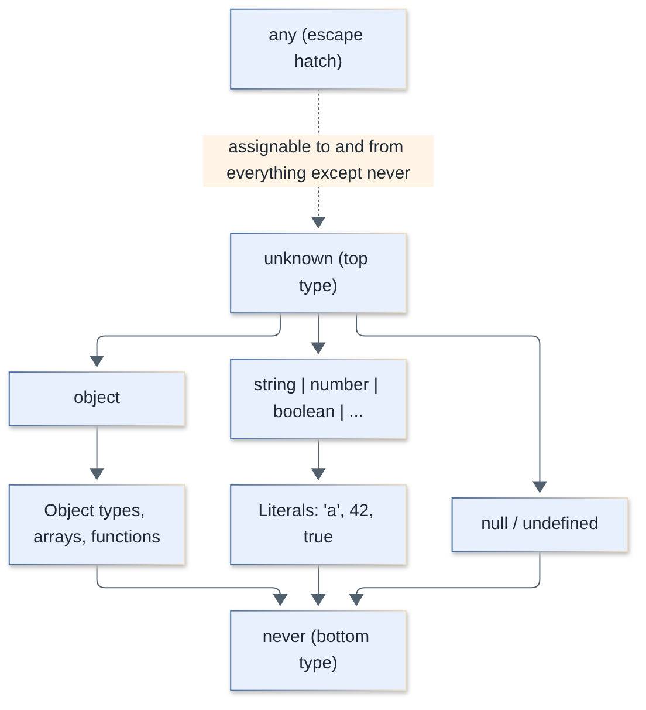
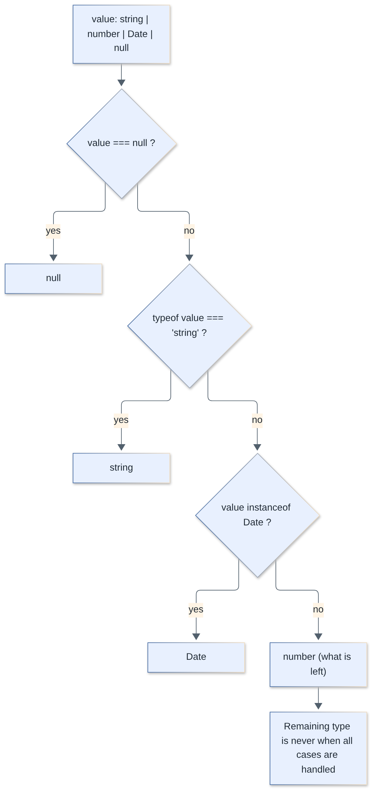
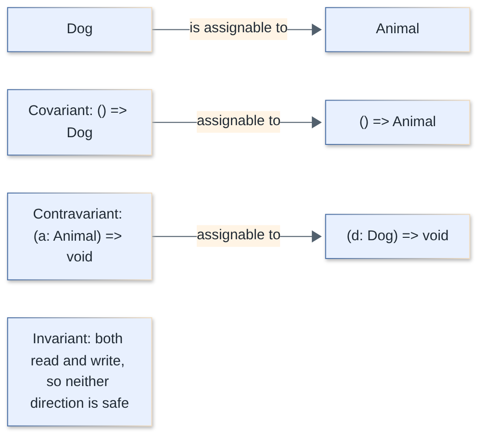
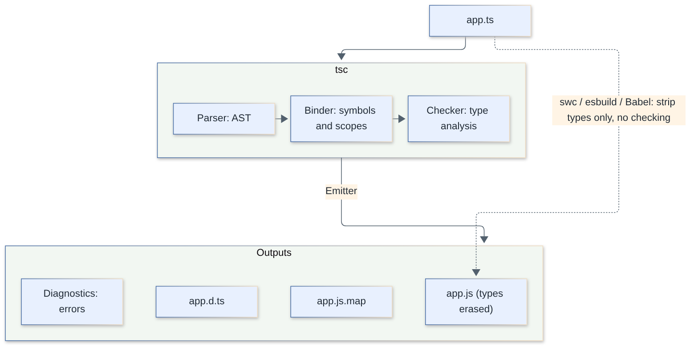

# TypeScript Interview Questions

Core TypeScript for fullstack interviews: the type system, generics and type-level programming, tooling and real-world patterns. Every question has a short answer first, then the details, code and follow-ups.

**Levels:** `🟢 Junior` — fundamentals · `🟡 Middle` — day-to-day depth · `🔴 Senior` — type-level design, internals, trade-offs

## Table of contents


**Fundamentals**

1. [`type` vs `interface`: what is the difference and which should you use?](#1-type-vs-interface-what-is-the-difference-and-which-should-you-use)
2. [What is structural typing and what are excess property checks?](#2-what-is-structural-typing-and-what-are-excess-property-checks)
3. [`any` vs `unknown` vs `never`: what are they and when do you use each?](#3-any-vs-unknown-vs-never-what-are-they-and-when-do-you-use-each)
4. [How does type inference work, and when should you annotate explicitly?](#4-how-does-type-inference-work-and-when-should-you-annotate-explicitly)
5. [What are union and intersection types?](#5-what-are-union-and-intersection-types)
6. [Enums vs union literal types: which should you use?](#6-enums-vs-union-literal-types-which-should-you-use)
7. [How do tuples, `readonly`, optional properties and index signatures work?](#7-how-do-tuples-readonly-optional-properties-and-index-signatures-work)
8. [What is the difference between type assertions (`as`), the non-null operator (`!`) and type annotations?](#8-what-is-the-difference-between-type-assertions-as-the-non-null-operator--and-type-annotations)
9. [How do classes work in TypeScript: access modifiers, `abstract`, parameter properties, `private` vs `#private`?](#9-how-do-classes-work-in-typescript-access-modifiers-abstract-parameter-properties-private-vs-private)

**Narrowing and Type Guards**

10. [What is type narrowing and which techniques does TypeScript support?](#10-what-is-type-narrowing-and-which-techniques-does-typescript-support)
11. [What are user-defined type guards and assertion functions?](#11-what-are-user-defined-type-guards-and-assertion-functions)
12. [What are discriminated unions and how do you enforce exhaustiveness?](#12-what-are-discriminated-unions-and-how-do-you-enforce-exhaustiveness)
13. [How do you type `catch` clauses and handle errors safely?](#13-how-do-you-type-catch-clauses-and-handle-errors-safely)

**Generics**

14. [What are generics and constraints?](#14-what-are-generics-and-constraints)
15. [How do `keyof`, `typeof` and indexed access types work?](#15-how-do-keyof-typeof-and-indexed-access-types-work)
16. [How does generic inference work, and what are `const` type parameters, defaults and `NoInfer`?](#16-how-does-generic-inference-work-and-what-are-const-type-parameters-defaults-and-noinfer)
17. [Overloads vs generics vs union parameters: how do you choose?](#17-overloads-vs-generics-vs-union-parameters-how-do-you-choose)
18. [What are conditional types and distributive behavior?](#18-what-are-conditional-types-and-distributive-behavior)
19. [How does `infer` work? Implement `ReturnType`, `Parameters` and `Awaited`-like types.](#19-how-does-infer-work-implement-returntype-parameters-and-awaited-like-types)
20. [What are mapped types and key remapping with `as`?](#20-what-are-mapped-types-and-key-remapping-with-as)
21. [What are template literal types?](#21-what-are-template-literal-types)
22. [How do recursive types work? Implement `DeepPartial` and `DeepReadonly`.](#22-how-do-recursive-types-work-implement-deeppartial-and-deepreadonly)

**Utility Types**

23. [What are the most useful built-in utility types?](#23-what-are-the-most-useful-built-in-utility-types)
24. [Implement `Partial`, `Required`, `Readonly`, `Pick`, `Omit` and `Record` yourself](#24-implement-partial-required-readonly-pick-omit-and-record-yourself)
25. [Implement `ReturnType`, `Parameters`, `InstanceType`, `Awaited` and `Uncapitalize`-style helpers](#25-implement-returntype-parameters-instancetype-awaited-and-uncapitalize-style-helpers)
26. [Type challenges: implement `UnionToIntersection`, `IsUnion` and tuple helpers](#26-type-challenges-implement-uniontointersection-isunion-and-tuple-helpers)
27. [How would you type a strongly-typed event emitter?](#27-how-would-you-type-a-strongly-typed-event-emitter)

**Advanced Features**

28. [What is `satisfies` and how does it differ from a type annotation and `as`?](#28-what-is-satisfies-and-how-does-it-differ-from-a-type-annotation-and-as)
29. [What does `as const` do?](#29-what-does-as-const-do)
30. [What are covariance, contravariance and invariance in TypeScript?](#30-what-are-covariance-contravariance-and-invariance-in-typescript)
31. [What are branded (opaque) types and how do you implement them?](#31-what-are-branded-opaque-types-and-how-do-you-implement-them)
32. [What is declaration merging and module augmentation?](#32-what-is-declaration-merging-and-module-augmentation)
33. [What are `.d.ts` files, `@types` packages and `declare`?](#33-what-are-dts-files-types-packages-and-declare)
34. [How do decorators work in TypeScript?](#34-how-do-decorators-work-in-typescript)

**Configuration and Tooling**

35. [What does `strict` enable, and which tsconfig options matter most?](#35-what-does-strict-enable-and-which-tsconfig-options-matter-most)
36. [What are `target`, `module` and `moduleResolution`, and which values should you choose?](#36-what-are-target-module-and-moduleresolution-and-which-values-should-you-choose)
37. [What are type-only imports, and why do `isolatedModules` and `verbatimModuleSyntax` exist?](#37-what-are-type-only-imports-and-why-do-isolatedmodules-and-verbatimmodulesyntax-exist)
38. [How does the TypeScript compiler work, and what is type erasure?](#38-how-does-the-typescript-compiler-work-and-what-is-type-erasure)

**Practical TypeScript**

39. [How do you type React props, state, events and hooks?](#39-how-do-you-type-react-props-state-events-and-hooks)
40. [Zod vs compile-time types: why do you need runtime validation?](#40-zod-vs-compile-time-types-why-do-you-need-runtime-validation)
41. [What are the most common TypeScript pitfalls?](#41-what-are-the-most-common-typescript-pitfalls)
42. [How would you migrate a large JavaScript codebase to TypeScript incrementally?](#42-how-would-you-migrate-a-large-javascript-codebase-to-typescript-incrementally)

**What's New**

43. [What changed in TypeScript 6 and 7?](#43-what-changed-in-typescript-6-and-7)

---

## Fundamentals

### 1. `type` vs `interface`: what is the difference and which should you use?

`🟢 Junior` · `#types` `#interfaces`

Both describe the shape of data and are interchangeable for plain object types. `interface` can be extended and **merged** (declaration merging); `type` is more general — it can name unions, tuples, primitives, mapped and conditional types. Pick one convention per codebase: commonly `interface` for public object contracts and `type` for everything else.

```ts
interface User { id: number; name: string }
interface Admin extends User { role: "admin" }          // extends

type Id = string | number;                              // union: only `type`
type Pair = [string, number];                           // tuple
type Nullable<T> = T | null;                            // generic alias
type Admin2 = User & { role: "admin" };                 // intersection
```

| | `interface` | `type` |
|---|---|---|
| Object shapes | yes | yes |
| Unions, tuples, primitives, conditional/mapped types | no | yes |
| Extending | `extends` (errors on incompatible members) | `&` (silently produces `never` members on conflict) |
| Declaration merging | yes (same name merges) | no (duplicate identifier error) |
| `implements` by a class | yes | yes (if it is an object type) |
| Error messages / perf | cached by name, often faster in large hierarchies | expanded structurally, can be verbose |
| Computed/mapped keys | no | yes |

```ts
interface Window { appVersion: string }   // merges with the global Window — used for augmentation
type T = { a: 1 };
// type T = { b: 2 };                     // error: Duplicate identifier 'T'
```

Gotcha: type aliases of object literal types are implicitly assignable to index-signature types (`Record<string, unknown>`), interfaces are not, because an interface could be extended elsewhere.

```ts
type A = { x: number };
interface B { x: number }
const a: Record<string, unknown> = {} as A;
const b: Record<string, unknown> = {} as B; // error: Index signature for type 'string' is missing in type 'B'
```

> **Follow-up:** Why does `interface extends` give better errors than `&`? — `extends` checks compatibility at the declaration and reports a conflict immediately, whereas an intersection with conflicting property types just collapses that property to `never`.

[↑ Back to top](#table-of-contents)

### 2. What is structural typing and what are excess property checks?

`🟢 Junior` · `#types` `#structural-typing`

TypeScript is **structurally typed**: a value is assignable to a type if it has *at least* the required members with compatible types — names of types do not matter (unlike nominal systems such as Java/C#). The one exception is **excess property checks**, which apply only to *fresh object literals* assigned directly to a typed target.

```ts
interface Point { x: number; y: number }
class Vec { constructor(public x: number, public y: number, public z = 0) {} }

const p: Point = new Vec(1, 2);      // OK: Vec has x and y, extra z is fine

const fresh: Point = { x: 1, y: 2, z: 3 };   // error: object literal may only specify known properties

const tmp = { x: 1, y: 2, z: 3 };
const ok: Point = tmp;               // OK: not a fresh literal, no excess check
```

Why it matters:

- Duck typing makes mocking and structural interop easy (any object with the right shape works).
- It also means two unrelated types with the same shape are interchangeable, e.g. `UserId` and `OrderId` as plain `string` — see [branded types](#31-what-are-branded-opaque-types-and-how-do-you-implement-them) for a workaround.
- Excess property checks catch typos in literals (`{ colour: "red" }` for `{ color: string }`) but are bypassed by intermediate variables, spreads and type assertions.

> **Follow-up:** How do you get nominal-like behavior? — Brand the type with a phantom property (`string & { __brand: "UserId" }`) or use a class with a `#private` field, which makes the class itself incompatible with look-alikes.

[↑ Back to top](#table-of-contents)

### 3. `any` vs `unknown` vs `never`: what are they and when do you use each?

`🟢 Junior` · `#types` `#type-system`

`any` turns type checking **off**; `unknown` is the **type-safe top type** (anything can be assigned to it, but you must narrow before use); `never` is the **bottom type** (no value exists — used for functions that never return and for exhaustiveness checks). Prefer `unknown` over `any` for values whose type you do not know.



| | `any` | `unknown` | `never` |
|---|---|---|---|
| Assign *to* it | anything | anything | nothing (only `never`) |
| Assign *from* it | to anything | only to `unknown`/`any` | to anything |
| Property access / call | allowed, unchecked | error until narrowed | n/a (unreachable) |
| Role | opt-out of the type system | top type | bottom type |
| Spreads through code | yes — "infects" inferred types | no | collapses unions (`T \| never` = `T`) |

```ts
function parse(json: string): unknown { return JSON.parse(json); }

const v = parse('{"a":1}');
v.a;                                    // error: 'v' is of type 'unknown'
if (typeof v === "object" && v !== null && "a" in v) {
  console.log(v.a);                     // OK: narrowed to object & Record<"a", unknown>
}

function fail(msg: string): never { throw new Error(msg); }   // never returns

type Flatten<T> = T extends never ? "yes" : "no";
type X = string | never;                // string — never disappears from unions
```

`never` also appears when a union is narrowed away completely, and in `string & number` (an impossible intersection). `any` is occasionally legitimate (generic constraints like `(...args: any[]) => any`, where `unknown` would break assignability of parameters), but each use should be deliberate. Lint with `@typescript-eslint/no-explicit-any`.

> **Follow-up:** What is `{}` vs `object` vs `Object`? — `{}` is any non-nullish value (including primitives), `object` is any non-primitive, `Object` is the wrapper interface — avoid `Object` and `{}`.

[↑ Back to top](#table-of-contents)

### 4. How does type inference work, and when should you annotate explicitly?

`🟢 Junior` · `#inference` `#types`

TypeScript infers types from initializers, return statements and contextual typing, so you rarely need annotations on local variables. Annotate **boundaries**: function parameters (never inferred), exported function return types, and anywhere you want to widen or constrain the type.

```ts
let a = "hi";            // string (widened — it is mutable)
const b = "hi";          // "hi"   (literal type — it cannot change)
let c = [1, "x"];        // (string | number)[]
const d = { n: 1 };      // { n: number } — properties are mutable, so widened

const nums = [1, 2, 3].map(n => n * 2);   // n inferred contextually from the array

function add(x: number, y: number) { return x + y; }   // return type inferred: number
```

Guidelines:

- **Parameters** need annotations (unless contextually typed by a callback signature).
- **Exported/public functions**: annotate the return type — it documents intent, catches accidental changes and speeds up the compiler.
- **Empty collections** need help: `const xs = []` is `any[]` evolving; write `const xs: string[] = []`.
- Use `as const` or `satisfies` to keep literal types ([see Q29](#29-what-does-as-const-do), [Q28](#28-what-is-satisfies-and-how-does-it-differ-from-a-type-annotation-and-as)).

```ts
const xs: string[] = [];
xs.push("a");

function id<T>(x: T) { return x; }
const r = id("a");       // T inferred as string; use id<"a">("a") or a const type parameter for the literal
```

> **Follow-up:** What is *best common type* vs *contextual typing*? — Best common type unions the element types for array literals; contextual typing flows type info *from* the expected type *into* an expression (e.g. callback parameters).

[↑ Back to top](#table-of-contents)

### 5. What are union and intersection types?

`🟢 Junior` · `#types` `#unions`

A **union** `A | B` is a value that is *either* A or B — you may only use members common to both until you narrow. An **intersection** `A & B` is a value that is *both* — it has all members of A and B. Unions model "one of several alternatives"; intersections model composition/mixins.

```ts
type Id = string | number;
function show(id: Id) {
  id.toString();          // OK: common to both
  id.toUpperCase();       // error: not on number
  if (typeof id === "string") id.toUpperCase(); // OK after narrowing
}

type Timestamped = { createdAt: Date };
type Named = { name: string };
type Entity = Named & Timestamped;   // must have both
const e: Entity = { name: "x", createdAt: new Date() };
```

Mind-bending-but-useful facts:

- Unions of objects only expose **shared** keys; intersections of objects expose the **union** of keys.
- Intersecting primitives or conflicting literals gives `never`: `string & number`, `{ k: 1 } & { k: 2 }` (property `k` becomes `never`, and the whole type reduces to `never` for discriminant properties).
- Intersection distributes over union: `(A | B) & C` = `(A & C) | (B & C)`.
- Function intersections create overloads: `((a: string) => 1) & ((a: number) => 2)`.

```ts
type R = { k: 1 } & { k: 2 };   // reduces to never (discriminant conflict)
type S = string & number;       // never
```

> **Follow-up:** `keyof (A | B)` vs `keyof (A & B)`? — `keyof (A | B)` is the *common* keys (`keyof A & keyof B`), `keyof (A & B)` is *all* keys (`keyof A | keyof B`).

[↑ Back to top](#table-of-contents)

### 6. Enums vs union literal types: which should you use?

`🟢 Junior` · `#enums` `#types`

Prefer **string literal unions** (optionally derived from an `as const` object) — they have zero runtime cost, are plain JS values, and work with erasable-syntax-only tooling. Use `enum` when you need a runtime object with reverse mapping (numeric enums) or an established codebase convention.

```ts
// Union literal
type Status = "idle" | "loading" | "done";

// as const object + derived union: runtime values AND a type
const Phase = { Idle: "idle", Loading: "loading", Done: "done" } as const;
type Phase = typeof Phase[keyof typeof Phase];       // "idle" | "loading" | "done"

// enum
enum Direction { Up, Down }          // numeric: 0, 1 with reverse mapping
enum Color { Red = "RED", Blue = "BLUE" }   // string enum: nominal-ish, no reverse mapping
const enum E { A }                   // inlined at compile time (problematic with isolatedModules)
```

| | union literal / `as const` | `enum` | `const enum` |
|---|---|---|---|
| Runtime code | none (union) / plain object | IIFE-generated object | none (inlined) |
| Erasable syntax (type stripping, Node `--experimental-strip-types`) | yes | **no** | no |
| Assignability | any matching string | string enum only accepts enum members | same |
| Reverse mapping | manual | numeric only | no |
| Tree-shaking | excellent | poor (IIFE) | n/a |
| Works with `isolatedModules` | yes | yes | restricted (use `preserveConstEnums`/avoid) |

Numeric enums are loosely typed in older TS (any number assignable); string enums are safer but nominal: `Color.Red` is not interchangeable with `"RED"`, which surprises callers and test code.

> **Follow-up:** Why do many teams ban enums? — They are a non-erasable TS feature (emit code), awkward for bundlers/transpilers that only strip types (`erasableSyntaxOnly` flags them), and `as const` objects give the same ergonomics.

[↑ Back to top](#table-of-contents)

### 7. How do tuples, `readonly`, optional properties and index signatures work?

`🟢 Junior` · `#types` `#objects`

A **tuple** is a fixed-length array with per-position types; `readonly` prevents reassignment at compile time only; `?` makes a property possibly `undefined` (and omittable); an **index signature** types arbitrary keys.

```ts
type Entry = [key: string, value: number];            // labeled tuple
const e: Entry = ["a", 1];
type Rest = [first: string, ...rest: number[]];       // variadic tail
type Opt = [string, number?];                         // optional element

interface Config {
  readonly id: string;           // cannot reassign after creation
  retries?: number;              // number | undefined, may be missing
  [key: string]: unknown;        // any other string key
}

const cfg: Config = { id: "x" };
cfg.id = "y";                    // error: read-only property

const arr: readonly number[] = [1, 2];
arr.push(3);                     // error: push does not exist on readonly number[]

const dict: Record<string, number> = { a: 1 };
const n = dict["missing"];       // typed number, actually undefined at runtime!
```

Notes:

- `readonly` is **shallow** and erased — it does not freeze at runtime (`Object.freeze` does, shallowly).
- With `exactOptionalPropertyTypes`, `retries?: number` forbids explicit `undefined`; without it, `{ retries: undefined }` is allowed.
- With `noUncheckedIndexedAccess`, `dict["x"]` becomes `number | undefined` — recommended for safety.
- Prefer `Map` or `Record<K, V | undefined>` when keys may be absent.

> **Follow-up:** `T[]` vs `Array<T>` vs `[T]`? — The first two are identical (any length); `[T]` is a 1-tuple.

[↑ Back to top](#table-of-contents)

### 8. What is the difference between type assertions (`as`), the non-null operator (`!`) and type annotations?

`🟢 Junior` · `#types` `#assertions`

An **annotation** (`const x: T = v`) asks the compiler to *check* that `v` is assignable to `T`. An **assertion** (`v as T`) *overrides* the compiler: "trust me" — no runtime check or conversion. `!` is a shorthand assertion removing `null`/`undefined`. Assertions can hide bugs, so prefer narrowing, type guards or `satisfies`.

```ts
const el = document.getElementById("app");   // HTMLElement | null
el.focus();                                  // error: possibly null
el!.focus();                                 // asserts non-null (throws at runtime if wrong)
if (el) el.focus();                          // safe: narrowing

const a = "5" as unknown as number;          // double assertion bypasses checks — a code smell
const b = <string>"x";                       // angle-bracket form: not allowed in .tsx

const user = { id: 1 } as { id: number; name: string };   // compiles! name is missing at runtime
const user2: { id: number; name: string } = { id: 1 };    // error: name missing
```

Rules of thumb:

- `as` only allows assertions between *sufficiently overlapping* types; `as unknown as T` bypasses even that.
- Annotation catches missing properties; assertion does not.
- `as const` is not a real assertion, it narrows literals ([Q29](#29-what-does-as-const-do)).
- Use `!` sparingly (e.g. after a check TS cannot see); the ESLint rule `no-non-null-assertion` flags it.
- For external data, validate at runtime ([Q40](#40-zod-vs-compile-time-types-why-do-you-need-runtime-validation)) instead of asserting.

> **Follow-up:** What is the definite assignment assertion `x!: T`? — On class fields/variables it tells the compiler the property will be initialized before use (e.g. by a DI framework) even though it cannot prove it.

[↑ Back to top](#table-of-contents)

### 9. How do classes work in TypeScript: access modifiers, `abstract`, parameter properties, `private` vs `#private`?

`🟡 Middle` · `#classes` `#oop`

TS adds `public`/`protected`/`private`/`readonly`, `abstract` classes and constructor **parameter properties** to JS classes. TS `private` is **compile-time only**; `#private` is real JavaScript runtime privacy.

```ts
abstract class Shape {
  protected constructor(public readonly name: string) {}   // parameter property: declares + assigns
  abstract area(): number;                                  // must be implemented
  describe() { return `${this.name}: ${this.area()}`; }
}

class Circle extends Shape {
  #secret = 42;                      // hard private (ES2022)
  private cache?: number;            // soft private (TS only)
  constructor(private r: number) { super("circle"); }
  area() { return (this.cache ??= Math.PI * this.r ** 2); }
}

const c = new Circle(2);
c.r;                                 // error (compile-time only)
(c as any).r;                        // works at runtime — TS private is erased
new Shape("x");                      // error: cannot instantiate abstract / protected ctor
```

| | `private` | `#private` |
|---|---|---|
| Enforced | compile time only | runtime (SyntaxError / TypeError) |
| Accessible via `obj["x"]` / `any` | yes | no |
| Visible in `JSON.stringify`/`Object.keys` | yes (it is a normal property) | no |
| Subclass can redeclare name | no (error) | yes (distinct slot) |
| Needs target | any | ES2015+ (WeakMap downlevel) |

Other points: `implements` only checks shape and emits nothing; `override` keyword (with `noImplicitOverride`) catches typos in overridden methods; class types are structural, so a class with `#private` fields becomes effectively nominal.

> **Follow-up:** Why can parameter properties be a problem? — They are not erasable syntax (code is emitted), so they conflict with `erasableSyntaxOnly` and type-stripping runtimes.

[↑ Back to top](#table-of-contents)

## Narrowing and Type Guards

### 10. What is type narrowing and which techniques does TypeScript support?

`🟡 Middle` · `#narrowing` `#control-flow`

Narrowing is the compiler refining a variable's type from a wide declared type to a more specific one inside a branch, using **control-flow analysis**. Built-in narrowing constructs: `typeof`, `instanceof`, `in`, equality / truthiness checks, discriminant property checks, assignment, and user-defined type guards.



```ts
function f(v: string | number | Date | null | string[]) {
  if (v === null) return;                     // equality: removes null
  if (typeof v === "string") return v.trim(); // typeof: string
  if (v instanceof Date) return v.getTime();  // instanceof: Date
  if (Array.isArray(v)) return v.length;      // built-in guard: string[]
  return v.toFixed(2);                        // number: what is left
}

type Fish = { swim(): void };
type Bird = { fly(): void };
function move(a: Fish | Bird) {
  if ("swim" in a) a.swim();                  // `in` narrowing
  else a.fly();
}

function g(x?: string) {
  if (x) x.length;                            // truthiness (also excludes "")
  x?.length;                                  // optional chaining
  const len = x ?? "default";                 // nullish coalescing
}
```

Gotchas:

- Narrowing of a `let` variable or mutable property is **lost inside callbacks** if the variable may be reassigned after the callback is created (the callback can run later). `const` variables and parameters that are never reassigned keep narrowing; recent TS versions (5.4+) also keep it for `let` variables that are not assigned after the closure is created.
- Truthiness narrowing excludes `0`, `""`, `NaN` too — use `!== undefined` / `!= null` when those are valid.
- Narrowing by assignment: `let x: string | number = 5` narrows `x` to `number` until reassigned.
- Since TS 5.5, inferred type predicates are produced automatically for simple filter callbacks (e.g. `arr.filter(x => x !== undefined)`).

```ts
let x: string | undefined = Math.random() > 0.5 ? "a" : undefined;
if (x) {
  setTimeout(() => x.length, 0);   // error: x is reassigned below, so narrowing is not trusted in the callback
}
x = undefined;
```

> **Follow-up:** Why does `typeof null === "object"` matter? — `typeof v === "object"` leaves `null` in the type; add `v !== null`.

[↑ Back to top](#table-of-contents)

### 11. What are user-defined type guards and assertion functions?

`🟡 Middle` · `#narrowing` `#type-guards`

A **type predicate** (`x is T`) return type lets a boolean function narrow its argument at the call site; an **assertion function** (`asserts x is T` / `asserts cond`) narrows by *throwing* if the condition fails. The compiler **trusts** your implementation — a wrong predicate silently unsounds types.

```ts
interface Cat { meow(): void }
interface Dog { bark(): void }

function isCat(a: Cat | Dog): a is Cat {
  return "meow" in a;
}
declare const pet: Cat | Dog;
if (isCat(pet)) pet.meow(); else pet.bark();          // else branch narrowed to Dog

function assertString(v: unknown): asserts v is string {
  if (typeof v !== "string") throw new TypeError("expected string");
}
function assert(cond: unknown, msg = "Assertion failed"): asserts cond {
  if (!cond) throw new Error(msg);
}

declare const input: unknown;
assertString(input);
input.toUpperCase();                                  // input is string below this line

// Filtering with a guard
const xs: (string | null)[] = ["a", null];
const strs = xs.filter((x): x is string => x !== null);   // string[]

// Guard over unknown JSON: validate every field you claim
function isUser(v: unknown): v is { id: number; name: string } {
  return typeof v === "object" && v !== null
    && typeof (v as Record<string, unknown>).id === "number"
    && typeof (v as Record<string, unknown>).name === "string";
}
```

Details:

- Assertion functions must be declared with an **explicit type annotation** on the called reference (a function declaration or a `const f: typeof ...`), otherwise TS cannot use them for control flow (error TS2775).
- A predicate returning `false` narrows the argument to *exclude* `T` in the else branch — a "lying" guard (returns `true` too rarely) makes the else branch wrong.
- `this is T` predicates narrow `this` in classes (fluent state checks).
- For large shapes prefer a schema library ([Q40](#40-zod-vs-compile-time-types-why-do-you-need-runtime-validation)) over hand-rolled guards.

> **Follow-up:** Guard vs assertion function — which when? — Guards for branching logic; assertion functions for validating preconditions at the top of a function (fail fast, no `else`).

[↑ Back to top](#table-of-contents)

### 12. What are discriminated unions and how do you enforce exhaustiveness?

`🟡 Middle` · `#unions` `#narrowing` `#patterns`

A discriminated (tagged) union is a union of object types that share a **literal-typed property** (the discriminant). Checking that property narrows the whole object. Exhaustiveness is enforced by assigning the leftover value to `never` in the default branch — adding a new variant then produces a compile error everywhere it is not handled.

```ts
type Shape =
  | { kind: "circle"; radius: number }
  | { kind: "rect"; w: number; h: number }
  | { kind: "tri"; base: number; height: number };

function assertNever(x: never): never {
  throw new Error(`Unexpected: ${JSON.stringify(x)}`);
}

function area(s: Shape): number {
  switch (s.kind) {
    case "circle": return Math.PI * s.radius ** 2;
    case "rect":   return s.w * s.h;
    case "tri":    return (s.base * s.height) / 2;
    default:       return assertNever(s);   // compile error if a variant is missing
  }
}

// Real-world: async state modelling instead of { loading: boolean; data?: T; error?: Error }
type Remote<T> =
  | { status: "idle" }
  | { status: "loading" }
  | { status: "success"; data: T }
  | { status: "error"; error: Error };
```

Why it beats optional fields: impossible states (`loading` with `data`) become unrepresentable. The discriminant can be a string, number, boolean, `null` or `undefined` literal. Alternatives to the `never` trick: `noImplicitReturns` with a switch that must return, a `satisfies never` check, or lint rule `switch-exhaustiveness-check`.

```ts
type Shape = { kind: "circle" } | { kind: "rect" } | { kind: "tri" };
function label(s: Shape) {
  switch (s.kind) {
    case "circle": return "c";
    case "rect": return "r";
    case "tri": return "t";
    default: { const _exhaustive: never = s; return _exhaustive; }
  }
}
```

> **Follow-up:** How do you extract one variant? — `Extract<Shape, { kind: "rect" }>`, or a generic `Variant<K> = Extract<Shape, { kind: K }>`.

[↑ Back to top](#table-of-contents)

### 13. How do you type `catch` clauses and handle errors safely?

`🟡 Middle` · `#errors` `#unknown`

Anything can be thrown in JavaScript, so a caught value is `unknown` under `useUnknownInCatchVariables` (part of `strict`); otherwise it is `any`. Narrow it with `instanceof` before use, or wrap in a helper. For *expected* failures consider returning a `Result` union instead of throwing.

```ts
try {
  JSON.parse("{");
} catch (e) {                         // e: unknown (strict)
  if (e instanceof SyntaxError) console.error(e.message);
  else throw e;                       // rethrow what you cannot handle
}

function toError(e: unknown): Error {
  return e instanceof Error ? e : new Error(String(e));
}

// Result type: failures visible in the signature, forced handling via narrowing
type Result<T, E = Error> = { ok: true; value: T } | { ok: false; error: E };

function safeParse(s: string): Result<unknown, SyntaxError> {
  try { return { ok: true, value: JSON.parse(s) }; }
  catch (e) { return { ok: false, error: e as SyntaxError }; }
}

const r = safeParse("{}");
if (r.ok) console.log(r.value); else console.error(r.error.message);
```

TypeScript has no checked exceptions: a function's type does not say what it throws, which is why the `Result` pattern (or libraries such as neverthrow) is popular. Custom error classes need `Object.setPrototypeOf(this, new.target.prototype)` only when targeting ES5 (deprecated in TS 6); set `name` for clearer logs and use `cause` (`new Error(msg, { cause })`).

> **Follow-up:** Can you annotate `catch (e: Error)`? — No; only `any` or `unknown` are allowed because the thrown value is not guaranteed.

[↑ Back to top](#table-of-contents)

## Generics

### 14. What are generics and constraints?

`🟢 Junior` · `#generics`

Generics are type parameters that let one function/class/type work over many types while keeping the relationship between input and output types. A **constraint** (`T extends U`) limits what `T` can be, giving you access to `U`'s members inside the body.

```ts
function first<T>(xs: T[]): T | undefined { return xs[0]; }
const n = first([1, 2, 3]);              // number | undefined — inferred

function longest<T extends { length: number }>(a: T, b: T): T {
  return a.length >= b.length ? a : b;   // .length allowed thanks to the constraint
}
longest("abc", "de");                    // OK
longest(1, 2);                           // error: number has no 'length'

function getProp<T, K extends keyof T>(obj: T, key: K): T[K] { return obj[key]; }
getProp({ a: 1, b: "x" }, "b");          // string
getProp({ a: 1 }, "z");                  // error: "z" is not keyof { a: number }

class Stack<T> {
  private items: T[] = [];
  push(x: T) { this.items.push(x); }
  pop(): T | undefined { return this.items.pop(); }
}
interface ApiResponse<T = unknown> { data: T; status: number }   // default type param
```

Rules of thumb: a type parameter should appear **at least twice** (input and output) — otherwise it is just a disguised `unknown`/`any` (`function f<T>(x: T): void` adds nothing). Prefer inference over explicit type arguments. Do not use generics where a union or overload expresses the contract more simply.

> **Follow-up:** Why `K extends keyof T` instead of `key: string`? — It preserves the exact key literal so the return type `T[K]` is precise and invalid keys are rejected at compile time.

[↑ Back to top](#table-of-contents)

### 15. How do `keyof`, `typeof` and indexed access types work?

`🟡 Middle` · `#generics` `#type-operators`

`keyof T` yields the union of T's property names; `typeof expr` (in a type position) gets the type of a *value*; `T[K]` (indexed access) looks up a property's type. Together they let you derive types from existing values and shapes rather than duplicating them.

```ts
const config = { host: "localhost", port: 5432, tls: false };

type Config = typeof config;                 // { host: string; port: number; tls: boolean }
type ConfigKey = keyof Config;               // "host" | "port" | "tls"
type Port = Config["port"];                  // number
type Vals = Config[keyof Config];            // string | number | boolean

type Arr = string[];
type Elem = Arr[number];                     // string — index by number

const routes = ["home", "about"] as const;
type Route = typeof routes[number];          // "home" | "about"

function makeUser() { return { id: 1, name: "a" }; }
type User = ReturnType<typeof makeUser>;     // typeof on a function value + utility

type Fn = (a: string) => void;
type P0 = Parameters<Fn>[0];                 // string

type Dict = { [k: string]: number };
type DK = keyof Dict;                        // string | number (numeric keys are strings in JS)
```

Notes:

- `typeof` here is the **type query** operator, not the runtime one; it only works on identifiers/property accesses, not arbitrary expressions (`typeof foo()` is invalid — use `ReturnType<typeof foo>`).
- `keyof any` is `string | number | symbol`.
- Indexed access with a union key returns a union: `User["id" | "name"]`.
- `T[number]` works on arrays and tuples to get element union.

> **Follow-up:** How do you get the values of an object as a union of literals? — `as const` the object and use `(typeof obj)[keyof typeof obj]`.

[↑ Back to top](#table-of-contents)

### 16. How does generic inference work, and what are `const` type parameters, defaults and `NoInfer`?

`🔴 Senior` · `#generics` `#inference`

TypeScript infers type arguments from **candidates** at call sites and picks a best common type (widening literals unless the parameter is constrained to a primitive). Constructs that steer inference: constraints, default type parameters, `const T` (literal preservation), and `NoInfer<T>` (block a position from contributing candidates).

```ts
function pick<T>(a: T, b: T): T { return a; }
pick("a", "b");                // T = string
pick(1, "b");                  // error: string not assignable to number (candidates 1 and "b" conflict)

function lit<T extends string>(x: T): T { return x; }
const l = lit("hi");           // T = "hi" (constraint to string keeps the literal)

// const type parameters (TS 5.0): infer as if `as const`
function tuple<const T extends readonly unknown[]>(xs: T): T { return xs; }
const t = tuple([1, "a"]);     // readonly [1, "a"] instead of (string | number)[]

// NoInfer (TS 5.4): `initial` must match what `options` established, not widen it
function createState<T extends string>(options: T[], initial: NoInfer<T>) {
  return { options, initial };
}
createState(["a", "b"], "a");  // OK
createState(["a", "b"], "z");  // error: "z" is not assignable to "a" | "b"

// Default type parameter
function make<T = string>(): T[] { return []; }
const strings = make();        // string[]
const numbers = make<number>();// number[]

// Explicit type args are all-or-nothing (no partial inference)
function two<A, B>(a: A, b: B) { return [a, b] as const; }
two<string, number>("a", 1);
```

Key points: inference sites are the *parameter positions*; **return-type inference** can also supply candidates from the contextual type (`const x: Set<string> = new Set()`). Without `NoInfer`, a second parameter would contribute `"z"` as a candidate and widen `T`. Inference limitations: no partial type-argument inference (workaround: currying or a class/builder), and inference through complex conditional types may give `unknown`.

> **Follow-up:** When do you reach for the "curried generic" trick? — To specify some type arguments explicitly while inferring others: `f<A>()<B>(...)` split into two calls.

[↑ Back to top](#table-of-contents)

### 17. Overloads vs generics vs union parameters: how do you choose?

`🟡 Middle` · `#functions` `#overloads`

Use a **union parameter** when the function does the same thing for each type and returns the same type; a **generic** when output type depends on input type uniformly; **overloads** when different input shapes map to *unrelated* return types. Overloads are order-sensitive and the implementation signature is not visible to callers.

```ts
// Overloads: output depends on input shape in a non-uniform way
function parse(x: string): number;
function parse(x: string[]): number[];
function parse(x: string | string[]): number | number[] {
  return typeof x === "string" ? Number(x) : x.map(Number);
}
parse("1");            // number
parse(["1"]);          // number[]
const u: string | string[] = Math.random() > 0.5 ? "1" : ["1"];
parse(u);              // error: no overload accepts the union

// Generic with conditional type: also works with unions, but more complex
function parse2<T extends string | string[]>(x: T): T extends string ? number : number[] {
  return (typeof x === "string" ? Number(x) : (x as string[]).map(Number)) as never;
}

// Simple case: a union is enough
function len(x: string | unknown[]) { return x.length; }
```

Guidelines: put **more specific overloads first**; do not write overloads that differ only by trailing optional params (use optional params); the implementation signature must be compatible with all overloads but is hidden; for callbacks with `this` or different arities, use `this` parameters. Overloads can also be declared in interfaces and as intersections of function types.

> **Follow-up:** Why did `parse(u)` fail? — Overload resolution tests each signature against the argument as a whole; a union is not assignable to either `string` or `string[]` — add a third overload that accepts the union.

[↑ Back to top](#table-of-contents)

### 18. What are conditional types and distributive behavior?

`🟡 Middle` · `#conditional-types` `#type-level`

A conditional type `T extends U ? X : Y` picks a type based on assignability. When `T` is a **naked type parameter** and you pass a union, the conditional **distributes**: it is applied to each member and the results are unioned.

```ts
type IsString<T> = T extends string ? true : false;
type A = IsString<"a">;                 // true
type B = IsString<number>;              // false

// Distribution over unions
type ToArray<T> = T extends unknown ? T[] : never;
type C = ToArray<string | number>;      // string[] | number[]   (distributes)

// Disable distribution by wrapping in a tuple
type ToArrayND<T> = [T] extends [unknown] ? T[] : never;
type D = ToArrayND<string | number>;    // (string | number)[]

// Implementing Exclude / Extract: they rely on distribution
type MyExclude<T, U> = T extends U ? never : T;
type E = MyExclude<"a" | "b" | "c", "a">;   // "b" | "c"

// never is the empty union: distribution over never yields never
type F = IsString<never>;               // never
type G = [never] extends [string] ? true : false;  // true
```

Points to remember:

- Distribution happens only when the checked type is a *bare* type parameter; `T[] extends ...`, `[T] extends ...` do not distribute.
- Deferred evaluation: while `T` is generic, the conditional stays unresolved — you cannot assign values to it without a cast.
- Conditional types can be **nested** to build lookup logic and **recursive** (e.g., `Awaited`).
- `boolean` is `true | false`, so `IsString<boolean>`-style checks distribute over it, a common surprise.

> **Follow-up:** How do you check for `any`? — `0 extends 1 & T ? true : false`: `1 & any` is `any`, so `0 extends any` holds only for `any` (an intersection with any other type reduces to `never` or a literal).

[↑ Back to top](#table-of-contents)

### 19. How does `infer` work? Implement `ReturnType`, `Parameters` and `Awaited`-like types.

`🔴 Senior` · `#conditional-types` `#infer`

`infer X` inside the `extends` clause of a conditional type **declares a type variable** that the compiler fills in by pattern matching against the checked type. It is how you "extract" pieces — return types, element types, promise results, tuple heads.

```ts
type MyReturnType<F> = F extends (...args: any[]) => infer R ? R : never;
type MyParameters<F> = F extends (...args: infer P) => any ? P : never;
type ElementOf<T> = T extends readonly (infer E)[] ? E : never;
type Head<T extends unknown[]> = T extends [infer H, ...unknown[]] ? H : never;
type Last<T extends unknown[]> = T extends [...unknown[], infer L] ? L : never;

// Recursive unwrap of promises (what Awaited does, simplified)
type MyAwaited<T> = T extends PromiseLike<infer U> ? MyAwaited<U> : T;

type R1 = MyReturnType<() => Promise<number>>;   // Promise<number>
type R2 = MyAwaited<Promise<Promise<string>>>;   // string
type P1 = MyParameters<(a: string, b: number) => void>;   // [a: string, b: number]
type H1 = Head<[1, 2, 3]>;                       // 1
type L1 = Last<[1, 2, 3]>;                       // 3

// infer with constraint (TS 4.7+): only match if the inferred part is a string
type FirstString<T> = T extends [infer S extends string, ...unknown[]] ? S : never;
type FS = FirstString<["a", 1]>;                 // "a"

// Parse a string at the type level
type Trim<S extends string> = S extends ` ${infer R}` | `${infer R} ` ? Trim<R> : S;
type Tr = Trim<"  hi ">;                         // "hi"
```

Behavior worth knowing:

- Multiple `infer` sites for the same variable in **covariant** positions are unioned; in **contravariant** positions (function parameters) they are intersected — this is the basis of `UnionToIntersection` ([Q26](#26-type-challenges-implement-uniontointersection-isunion-and-tuple-helpers)).
- `infer` can only appear in the `extends` clause of the true branch.
- With overloaded functions, `ReturnType` / `Parameters` infer from the **last** signature.
- Recursion is bounded (tail-recursive conditional types get a much higher limit than ordinary ones), so very long tuples/strings can hit "excessively deep" errors.

> **Follow-up:** Why `(...args: any[]) => any` as the constraint rather than `unknown`? — Parameter positions are contravariant: a function `(a: string) => void` is only assignable to `(...args: any[]) => any`, not to `(...args: unknown[]) => unknown`.

[↑ Back to top](#table-of-contents)

### 20. What are mapped types and key remapping with `as`?

`🟡 Middle` · `#mapped-types` `#type-level`

A mapped type iterates over a union of keys to build a new object type: `{ [K in Keys]: ... }`. Modifiers `readonly`/`?` can be added or removed with `+`/`-`. Since TS 4.1, `as` lets you **rename or filter keys** during the mapping.

```ts
type Optional<T> = { [K in keyof T]?: T[K] };
type Mutable<T> = { -readonly [K in keyof T]: T[K] };
type RequiredAll<T> = { [K in keyof T]-?: T[K] };

// Key remapping: getters
type Getters<T> = {
  [K in keyof T as `get${Capitalize<string & K>}`]: () => T[K];
};
type G = Getters<{ name: string; age: number }>;
// { getName: () => string; getAge: () => number }

// Filtering keys by value type: map key to never to drop it
type OnlyStrings<T> = {
  [K in keyof T as T[K] extends string ? K : never]: T[K];
};
type OS = OnlyStrings<{ a: string; b: number; c: string }>;   // { a: string; c: string }

// Mapping over a union of literals (not keyof)
type Flags = { [K in "read" | "write"]: boolean };

// Union-of-events from a discriminated union
type EventHandlers<E extends { type: string }> = {
  [T in E["type"] as `on${Capitalize<T>}`]: (e: Extract<E, { type: T }>) => void;
};
```

Key points: a mapped type over `keyof T` is **homomorphic** — it preserves `readonly`/optional modifiers of `T` and distributes over unions/arrays/tuples (mapping a tuple type yields a tuple). Non-homomorphic ones (`[K in "a" | "b"]`) do not copy modifiers. `string & K` is needed because `keyof T` may include `number | symbol`, which template literals reject.

> **Follow-up:** How do you map to a type that depends on the key's value? — Use `as` plus an indexed lookup, or iterate over a union and `Extract` the matching member as in `EventHandlers` above.

[↑ Back to top](#table-of-contents)

### 21. What are template literal types?

`🟡 Middle` · `#template-literal-types` `#type-level`

Template literal types build string types from other string types using backtick syntax; combined with unions they produce **cartesian products**, and with `infer` they can **parse** strings at the type level. Intrinsic helpers: `Uppercase`, `Lowercase`, `Capitalize`, `Uncapitalize`.

```ts
type Size = "sm" | "lg";
type Color = "red" | "blue";
type ClassName = `${Size}-${Color}`;        // "sm-red" | "sm-blue" | "lg-red" | "lg-blue"

type EventName<T extends string> = `on${Capitalize<T>}`;
type E = EventName<"click" | "hover">;      // "onClick" | "onHover"

// Parsing
type Params<S extends string> =
  S extends `${string}:${infer P}/${infer Rest}` ? P | Params<`/${Rest}`>
  : S extends `${string}:${infer P}` ? P
  : never;
type RouteParams = Params<"/users/:userId/posts/:postId">;   // "userId" | "postId"

// Split
type Split<S extends string, D extends string> =
  S extends `${infer A}${D}${infer B}` ? [A, ...Split<B, D>] : [S];
type Parts = Split<"a-b-c", "-">;           // ["a", "b", "c"]

// Typed route builder / typed i18n keys / typed CSS-in-JS properties
declare function route<P extends string>(path: P): (params: Record<Params<P>, string>) => string;
route("/users/:userId")({ userId: "1" });   // OK
```

Caveats: unions multiply (3 × 3 × 3 = 27 members) — very large products hit the 100k union-size limit; template types with `number`/`string` placeholders (`` `id-${number}` ``) describe *patterns*, not finite sets; they are erased and give no runtime validation.

> **Follow-up:** Can you use them in mapped-type keys? — Yes, via key remapping (`[K in keyof T as \`get${Capitalize<K & string>}\`]`).

[↑ Back to top](#table-of-contents)

### 22. How do recursive types work? Implement `DeepPartial` and `DeepReadonly`.

`🔴 Senior` · `#recursive-types` `#mapped-types`

A type can refer to itself, which lets you transform nested structures. The two classic exercises are `DeepPartial` and `DeepReadonly`: a homomorphic mapped type that recurses into object-valued properties, with special handling for functions, arrays and primitives.

```ts
type DeepPartial<T> =
  T extends (...args: any[]) => unknown ? T :           // keep functions as-is
  T extends readonly (infer U)[] ? DeepPartial<U>[] :   // arrays
  T extends object ? { [K in keyof T]?: DeepPartial<T[K]> } :
  T;                                                    // primitives

type DeepReadonly<T> =
  T extends (...args: any[]) => unknown ? T :
  T extends object ? { readonly [K in keyof T]: DeepReadonly<T[K]> } : T;

interface Settings {
  ui: { theme: "dark" | "light"; sidebar: { width: number } };
  tags: string[];
  onSave(): void;
}

const patch: DeepPartial<Settings> = { ui: { sidebar: { width: 300 } } };   // OK
const ro: DeepReadonly<Settings> = { ui: { theme: "dark", sidebar: { width: 1 } }, tags: [], onSave() {} };
ro.ui.sidebar.width = 2;   // error: read-only property

// Recursive JSON type
type Json = string | number | boolean | null | Json[] | { [k: string]: Json };
```

Considerations:

- Homomorphic mapped types already distribute over arrays and tuples, so for `DeepReadonly` the array branch is often unnecessary; keep explicit handling when you want `readonly U[]`.
- `Date`, `Map`, `Set`, class instances are `object` — decide whether to recurse into them (usually add `T extends Date | Map<any, any> ... ? T`).
- Recursion limits: the compiler caps instantiation depth (on the order of a hundred levels for non-tail-recursive types); deeply recursive types slow the checker and IDE.
- Use the recursive form of a utility for **runtime-merging** operations (`merge(target, patch)`), where `DeepPartial<T>` is the patch parameter type.

> **Follow-up:** Why does `DeepPartial<string>` stay `string`? — The `T extends object` check is false for primitives, so the final branch returns `T` unchanged.

[↑ Back to top](#table-of-contents)

## Utility Types

### 23. What are the most useful built-in utility types?

`🟢 Junior` · `#utility-types`

Utility types are generic helpers shipped with TypeScript that transform existing types, so you derive variants instead of rewriting them.

| Utility | Result | Example |
|---|---|---|
| `Partial<T>` | all props optional | patch/update payloads |
| `Required<T>` | all props required | after applying defaults |
| `Readonly<T>` | all props readonly | immutable config |
| `Pick<T, K>` | only keys K | public view of an entity |
| `Omit<T, K>` | everything except K | create-DTO without `id` |
| `Record<K, V>` | object with keys K and values V | lookup tables |
| `Exclude<U, X>` / `Extract<U, X>` | remove / keep union members | filter unions |
| `NonNullable<T>` | remove `null`/`undefined` | after a check |
| `ReturnType<F>` / `Parameters<F>` | function return / params tuple | wrap functions |
| `ConstructorParameters<C>` / `InstanceType<C>` | class ctor params / instance | factories |
| `Awaited<T>` | unwrap Promise recursively | `await` result type |
| `NoInfer<T>` | block inference at a position | generics |
| `ThisParameterType`, `OmitThisParameter`, `ThisType` | `this` helpers | object-literal methods |
| `Uppercase`, `Lowercase`, `Capitalize`, `Uncapitalize` | string intrinsics | template literal types |

```ts
interface User { id: number; name: string; email: string; password: string }

type PublicUser = Omit<User, "password">;
type CreateUser = Omit<User, "id">;
type UpdateUser = Partial<Omit<User, "id">>;
type UserPreview = Pick<User, "id" | "name">;
type ById = Record<User["id"], User>;
type Role = Extract<"admin" | "user" | "guest", "admin" | "user">;   // "admin" | "user"

async function load() { return [{ id: 1 }]; }
type Loaded = Awaited<ReturnType<typeof load>>;   // { id: number }[]
```

`Omit<T, K>` does not constrain `K` to `keyof T` (typos silently pass) and does not distribute over unions — see [Q24](#24-implement-partial-required-readonly-pick-omit-and-record-yourself).

> **Follow-up:** `Omit` on a union? — It collapses to common keys; write a distributive version: `type DOmit<T, K extends PropertyKey> = T extends unknown ? Omit<T, K> : never`.

[↑ Back to top](#table-of-contents)

### 24. Implement `Partial`, `Required`, `Readonly`, `Pick`, `Omit` and `Record` yourself

`🟡 Middle` · `#utility-types` `#mapped-types` `#coding`

All of them are small mapped types. Knowing the definitions shows you understand `keyof`, homomorphic mapped types and modifiers.

```ts
type MyPartial<T> = { [K in keyof T]?: T[K] };
type MyRequired<T> = { [K in keyof T]-?: T[K] };
type MyReadonly<T> = { readonly [K in keyof T]: T[K] };
type MyPick<T, K extends keyof T> = { [P in K]: T[P] };
type MyRecord<K extends keyof any, V> = { [P in K]: V };

// Exclude and Extract are distributive conditional types
type MyExclude<T, U> = T extends U ? never : T;
type MyExtract<T, U> = T extends U ? T : never;
type MyNonNullable<T> = T & {};            // modern definition (older: T extends null | undefined ? never : T)

// Omit = Pick over the remaining keys
type MyOmit<T, K extends keyof any> = Pick<T, Exclude<keyof T, K>>;
// Stricter / modern variant using key remapping (preserves modifiers):
type MyOmit2<T, K extends keyof T> = { [P in keyof T as P extends K ? never : P]: T[P] };

interface Todo { title: string; done?: boolean; readonly id: number }

type A = MyPartial<Todo>;                  // { title?: string; done?: boolean; readonly id?: number }
type B = MyRequired<Todo>;                 // { title: string; done: boolean; readonly id: number }
type C = MyPick<Todo, "title" | "id">;     // { title: string; readonly id: number }
type D = MyOmit<Todo, "id">;               // { title: string; done?: boolean }
type E = MyRecord<"a" | "b", number>;      // { a: number; b: number }

// Type-level tests: Equal is the standard helper
type Equal<X, Y> =
  (<T>() => T extends X ? 1 : 2) extends (<T>() => T extends Y ? 1 : 2) ? true : false;
type Check = Equal<MyPick<Todo, "title">, { title: string }>;   // true
```

Notes:

- `Pick` is **homomorphic** because `K extends keyof T` (modifiers preserved); `Record` is not.
- In the standard library, `Omit<T, K extends keyof any>` is deliberately loose so omitting a non-existent key is allowed; the stricter `K extends keyof T` catches typos but breaks generic code that omits optional/unknown keys.
- The `Equal` trick compares types by identity (two generic function types are only mutually assignable if their conditional types are identical) — far more reliable than `A extends B`, which treats `any` and subtype relations loosely.

> **Follow-up:** Why `-?` and not `Required` recursion for `MyRequired`? — `-?` removes the optional modifier (and `undefined` from the property type under `strictNullChecks`) in a single homomorphic pass.

[↑ Back to top](#table-of-contents)

### 25. Implement `ReturnType`, `Parameters`, `InstanceType`, `Awaited` and `Uncapitalize`-style helpers

`🔴 Senior` · `#utility-types` `#infer` `#coding`

They are all `infer`-based conditional types over function / constructor / promise shapes — covered in depth in [Q19](#19-how-does-infer-work-implement-returntype-parameters-and-awaited-like-types); here is the extended set interviewers ask for.

```ts
type MyReturnType<T extends (...args: any) => any> = T extends (...args: any) => infer R ? R : never;
type MyParameters<T extends (...args: any) => any> = T extends (...args: infer P) => any ? P : never;
type MyConstructorParameters<T extends abstract new (...args: any) => any> =
  T extends abstract new (...args: infer P) => any ? P : never;
type MyInstanceType<T extends abstract new (...args: any) => any> =
  T extends abstract new (...args: any) => infer R ? R : never;

// Awaited: recursion + thenable check
type MyAwaited<T> =
  T extends null | undefined ? T :
  T extends object & { then(onfulfilled: infer F, ...args: infer _): unknown }
    ? F extends (value: infer V, ...args: infer _) => unknown ? MyAwaited<V> : never
    : T;

// Practical derivations
type Unpromisify<T> = T extends (...a: any[]) => Promise<infer R> ? R : never;
type FirstArg<F extends (...a: any[]) => any> = Parameters<F> extends [infer A, ...unknown[]] ? A : never;

// Prepend a parameter to any function
type WithCtx<F extends (...a: any[]) => any> =
  (ctx: { requestId: string }, ...args: Parameters<F>) => ReturnType<F>;

class Svc { constructor(public url: string, public retries: number) {} }
type Ctor = MyConstructorParameters<typeof Svc>;     // [url: string, retries: number]
type Inst = MyInstanceType<typeof Svc>;              // Svc
type Aw = MyAwaited<Promise<Promise<number>>>;       // number

declare function fetchUser(id: string): Promise<{ name: string }>;
type Handler = WithCtx<typeof fetchUser>;            // (ctx, id: string) => Promise<{ name: string }>
```

Important details: `typeof Svc` (the constructor function type) vs `Svc` (the instance type) — `InstanceType` needs the former; `abstract new` makes the helper work for abstract classes too; `Awaited` handles *thenables*, not only `Promise`, and `Awaited<Promise<number> | string>` distributes.

> **Follow-up:** Why does `ReturnType<typeof overloaded>` pick the last overload? — Inference against an overloaded type uses the last call signature.

[↑ Back to top](#table-of-contents)

### 26. Type challenges: implement `UnionToIntersection`, `IsUnion` and tuple helpers

`🔴 Senior` · `#type-level` `#coding` `#variance`

These "type gymnastics" questions test understanding of distribution, `infer` in contravariant positions and tuple types. Always explain *why* the trick works.

```ts
// 1. UnionToIntersection: wrap each member in a function parameter (contravariant)
//    and infer a single parameter — the candidates get intersected.
type UnionToIntersection<U> =
  (U extends unknown ? (arg: U) => void : never) extends (arg: infer I) => void ? I : never;
type UI = UnionToIntersection<{ a: 1 } | { b: 2 }>;   // { a: 1 } & { b: 2 }

// 2. IsUnion: distribute U, compare the distributed copy against the whole
type IsUnion<T, U = T> = [T] extends [never] ? false
  : T extends unknown ? ([U] extends [T] ? false : true) : never;
type U1 = IsUnion<string | number>;   // true
type U2 = IsUnion<string>;            // false
type U3 = IsUnion<never>;             // false

// 3. Tuple helpers
type Length<T extends readonly unknown[]> = T["length"];
type Push<T extends unknown[], V> = [...T, V];
type Unshift<T extends unknown[], V> = [V, ...T];
type Concat<A extends unknown[], B extends unknown[]> = [...A, ...B];
type Reverse<T extends unknown[]> = T extends [infer H, ...infer R] ? [...Reverse<R>, H] : [];
type TupleToUnion<T extends readonly unknown[]> = T[number];
type Includes<T extends readonly unknown[], X> =
  T extends [infer H, ...infer R] ? (Equal<H, X> extends true ? true : Includes<R, X>) : false;

type Equal<X, Y> =
  (<T>() => T extends X ? 1 : 2) extends (<T>() => T extends Y ? 1 : 2) ? true : false;

type R = Reverse<[1, 2, 3]>;          // [3, 2, 1]
type In = Includes<[1, 2, 3], 2>;     // true

// 4. Object -> union of entries / tuple-from-union ordering is NOT guaranteed
type Entries<T> = { [K in keyof T]: [K, T[K]] }[keyof T];
type En = Entries<{ a: number; b: string }>;   // ["a", number] | ["b", string]

// 5. Fixed-length tuple via recursion
type TupleOf<T, N extends number, R extends T[] = []> =
  R["length"] extends N ? R : TupleOf<T, N, [...R, T]>;
type Three = TupleOf<string, 3>;      // [string, string, string]

// 6. Get keys whose values are functions
type FunctionKeys<T> = { [K in keyof T]-?: T[K] extends (...a: any[]) => any ? K : never }[keyof T];
type FK = FunctionKeys<{ a: () => void; b: number }>;   // "a"
```

Why `UnionToIntersection` works: `U extends unknown ? (arg: U) => void : never` distributes, producing a union of functions `((arg: A) => void) | ((arg: B) => void)`. Inferring one `I` from a *union of function types* in a contravariant position requires `I` to be assignable to *all* parameter types, so TypeScript intersects the candidates.

> **Follow-up:** Can you convert a union to a tuple? — Technically via repeated `UnionToIntersection` of overloads, but union member order is an implementation detail; do not rely on it in production.

[↑ Back to top](#table-of-contents)

### 27. How would you type a strongly-typed event emitter?

`🔴 Senior` · `#generics` `#mapped-types` `#patterns`

Define an **event map** (event name -> payload) and make `on`/`emit` generic over the key, so handler argument types and `emit` payloads are checked and inferred from the event name.

```ts
type Handler<P> = (payload: P) => void;

class TypedEmitter<Events extends Record<string, unknown>> {
  private handlers: { [K in keyof Events]?: Set<Handler<Events[K]>> } = {};

  on<K extends keyof Events>(event: K, fn: Handler<Events[K]>): () => void {
    (this.handlers[event] ??= new Set()).add(fn);
    return () => this.handlers[event]?.delete(fn);     // unsubscribe function
  }

  emit<K extends keyof Events>(
    event: K,
    ...args: Events[K] extends void ? [] : [payload: Events[K]]   // omit payload for void events
  ): void {
    this.handlers[event]?.forEach(fn => fn(args[0] as Events[K]));
  }
}

type AppEvents = {
  login: { userId: string };
  logout: void;
  error: Error;
};

const bus = new TypedEmitter<AppEvents>();
bus.on("login", p => console.log(p.userId));    // p inferred as { userId: string }
bus.emit("login", { userId: "42" });
bus.emit("logout");                             // no payload needed
bus.emit("login", { id: 1 });                   // error: wrong payload
bus.on("nope", () => {});                       // error: unknown event
```

Why this design: the generic key `K` links the event name with its payload type; the conditional rest-tuple makes payload optional only for `void` events; the map is the **single source of truth**, so renaming an event is a compile-time refactor. The same pattern types `addEventListener` (`HTMLElementEventMap`), Redux action creators, RPC clients (`method name -> { params, result }`) and typed `fetch` wrappers.

> **Follow-up:** How would you also type a request/response API client from the same idea? — A route map `{ "GET /users/:id": { params: {id: string}; response: User } }` plus `K extends keyof Routes` and indexed access on `Routes[K]["response"]`.

[↑ Back to top](#table-of-contents)

## Advanced Features

### 28. What is `satisfies` and how does it differ from a type annotation and `as`?

`🟡 Middle` · `#satisfies` `#inference`

`expr satisfies T` (TS 4.9) **validates** that `expr` is assignable to `T` but keeps the expression's own, more specific inferred type. An annotation (`const x: T`) widens the variable to `T`; `as T` skips validation. Use `satisfies` for config objects and lookup tables where you want both checking and precise inference.

```ts
type Colors = Record<string, string | [number, number, number]>;

const a: Colors = { red: [255, 0, 0], green: "#0f0" };
a.red.map(x => x);              // error: string | [number,number,number] — annotation widened it

const b = { red: [255, 0, 0], green: "#0f0" } satisfies Colors;
b.red.map(x => x * 2);          // OK: still [number, number, number]
b.green.toUpperCase();          // OK: string
b.blue;                         // error: unknown key (typos caught on `b`'s precise type)

const c = { red: [255, 0, 0] } as Colors;   // no excess/missing checks; type widened to Colors
```

| | annotation `: T` | `satisfies T` | assertion `as T` |
|---|---|---|---|
| Checks assignability | yes | yes | only loosely (overlap) |
| Resulting type | `T` | the expression's own type | `T` |
| Excess property check | yes | yes | no |
| Contextual typing of callbacks | yes | yes | yes |

```ts
// Combine with as const for readonly literal config + validation
const routes = {
  home: "/",
  user: "/users/:id",
} as const satisfies Record<string, `/${string}`>;
type Route = keyof typeof routes;       // "home" | "user"
```

Typical uses: exhaustive keyed maps (`satisfies Record<Status, ...>` errors if you miss a key but keeps literal types), theme/config objects, route tables, and form definitions.

> **Follow-up:** Annotation vs `satisfies` for exported API types? — Annotate public contracts (stable, readable types); use `satisfies` for internal constants where inference is valuable.

[↑ Back to top](#table-of-contents)

### 29. What does `as const` do?

`🟡 Middle` · `#const-assertion` `#inference`

`as const` makes an expression's type as narrow as possible: literals stay literal, arrays become **readonly tuples**, object properties become **readonly** (deeply). It is erased at runtime — no freezing.

```ts
const a = ["x", "y"];                    // string[]
const b = ["x", "y"] as const;           // readonly ["x", "y"]
type B = typeof b[number];               // "x" | "y"

const conf = { mode: "dev", retries: 3 } as const;
// { readonly mode: "dev"; readonly retries: 3 }
conf.mode = "prod";                      // error: read-only

// Great for deriving unions from a single source of truth
const ROLES = ["admin", "editor", "viewer"] as const;
type Role = typeof ROLES[number];
const isRole = (x: string): x is Role => (ROLES as readonly string[]).includes(x);

// Discriminant literals when returning object literals
function ok() { return { ok: true, value: 1 } as const; }   // { readonly ok: true; readonly value: 1 }

// Tuples returned from functions (custom hooks!)
function useToggle() { return [false, () => {}] as const; } // readonly [false, () => void]

// Only literal expressions can be `as const`
let s = "hi";
const bad = s as const;                  // error: must be applied to a literal
```

Pitfalls: `readonly` tuples are not assignable to mutable `T[]` parameters (`function f(xs: string[])` rejects `readonly ["a"]` — declare params as `readonly string[]`). `as const` on large literal data can make editor type display huge. `const` type parameters (TS 5.0) bring the same effect to generic calls ([Q16](#16-how-does-generic-inference-work-and-what-are-const-type-parameters-defaults-and-noinfer)).

> **Follow-up:** `Object.freeze` vs `as const`? — `Object.freeze` is runtime and shallow (typed `Readonly<T>`); `as const` is compile-time only but deep.

[↑ Back to top](#table-of-contents)

### 30. What are covariance, contravariance and invariance in TypeScript?

`🔴 Senior` · `#variance` `#type-system`

Variance describes how subtyping of type arguments affects subtyping of the generic type. **Covariant** (output positions): `Dog <: Animal` implies `Box<Dog> <: Box<Animal>`. **Contravariant** (input positions, e.g. function parameters): the relationship flips. **Invariant** (both): neither direction is allowed. TypeScript is intentionally *unsound* in a few places for ergonomics.



```ts
class Animal { name = "" }
class Dog extends Animal { bark() {} }

// Covariant: producing T
const getDog: () => Dog = () => new Dog();
const getAnimal: () => Animal = getDog;               // OK

// Contravariant: consuming T (needs strictFunctionTypes, included in `strict`)
const feedAnimal: (a: Animal) => void = a => {};
const feedDog: (d: Dog) => void = feedAnimal;         // OK: handler of Animal handles Dogs
const feedDog2: (d: Dog) => void = d => d.bark();
const feedAnimal2: (a: Animal) => void = feedDog2;    // error under strictFunctionTypes

// Arrays are (unsoundly) covariant in TS
const dogs: Dog[] = [new Dog()];
const animals: Animal[] = dogs;                       // allowed
animals.push(new Animal());                           // dogs now contains a non-Dog at runtime!

// Method shorthand is bivariant (an intentional hole)
interface Cmp { compare(a: Animal): void }            // method: bivariant
interface Cmp2 { compare: (a: Animal) => void }       // property: contravariant (strict)

// Explicit variance annotations (TS 4.7)
interface Producer<out T> { get(): T }
interface Consumer<in T> { set(v: T): void }
interface Both<in out T> { get(): T; set(v: T): void }
```

| Position | Variance | Example |
|---|---|---|
| Return type, readonly property | covariant | `() => T`, `ReadonlyArray<T>` |
| Function parameter (with `strictFunctionTypes`) | contravariant | `(x: T) => void` |
| Mutable property / both | invariant (in theory) | `{ value: T }` is treated covariantly in practice |
| Method parameters | bivariant | `{ m(x: T): void }` |

Why it matters: it explains why `Promise<Dog>` fits `Promise<Animal>`, why callbacks accept *wider* parameter types, why `infer` in parameter positions intersects, and why `in`/`out` annotations can speed up type-checking of large generic types.

> **Follow-up:** Why does TS allow `Dog[]` to `Animal[]`? — Pragmatism: sound invariance would reject many common patterns; use `readonly Animal[]` to make the covariance safe.

[↑ Back to top](#table-of-contents)

### 31. What are branded (opaque) types and how do you implement them?

`🔴 Senior` · `#branded-types` `#nominal-typing`

Branded types add a phantom marker to a base type so structurally identical values become **incompatible** — emulating nominal typing. Use them for IDs, validated strings (`Email`), units (`Meters`) and sanitized values (`SafeHtml`), constructing them only via a validating function.

```ts
declare const brand: unique symbol;
type Brand<T, B extends string> = T & { readonly [brand]: B };

type UserId = Brand<string, "UserId">;
type OrderId = Brand<string, "OrderId">;
type Email = Brand<string, "Email">;

const asUserId = (s: string) => s as UserId;           // single, auditable cast point
function parseEmail(s: string): Email {
  if (!/^[^@\s]+@[^@\s]+$/.test(s)) throw new Error("invalid email");
  return s as Email;
}

function getUser(id: UserId) { return id; }
const uid = asUserId("u1");
const oid = "o1" as OrderId;
getUser(uid);                                          // OK
getUser(oid);                                          // error: OrderId is not assignable to UserId
getUser("raw");                                        // error: string is not assignable to UserId
const len = uid.length;                                // still usable as a string

// Units
type Meters = Brand<number, "Meters">;
type Feet = Brand<number, "Feet">;
const toFeet = (m: Meters) => (m * 3.28084) as Feet;

// Smart-constructor with a type predicate
const isEmail = (s: string): s is Email => /^[^@\s]+@[^@\s]+$/.test(s);
```

Properties: the brand exists **only in the type system** (zero runtime cost; the string is still a plain string); the unique-symbol key prevents accidental collisions and keeps the brand out of autocomplete. Combine with zod: `z.string().email().brand<"Email">()` — validation at the boundary yields a branded type. Trade-offs: casts needed at construction; serialization (`JSON.parse`) loses brands, so re-validate on input; library signature friction.

> **Follow-up:** Alternative nominal approach? — A class with a `#private` field, which is structurally unique per class but allocates an object.

[↑ Back to top](#table-of-contents)

### 32. What is declaration merging and module augmentation?

`🔴 Senior` · `#declaration-merging` `#modules`

**Declaration merging** means the compiler combines multiple declarations with the same name into one definition: interfaces merge their members, namespaces merge with classes/functions/enums, and enums merge with enums. **Module augmentation** (`declare module "x" { ... }`) and **global augmentation** (`declare global { ... }`) use this to extend third-party or global types without touching their source.

```ts
// 1. Interface merging (same scope)
interface Box { height: number }
interface Box { width: number }
const b: Box = { height: 1, width: 2 };

// 2. Function + namespace = function with static members
function greet(n: string) { return `hi ${n}`; }
namespace greet { export const version = "1.0"; }
greet.version;

// 3. Module augmentation (the file must be a module: have an import/export)
import "express";
declare module "express-serve-static-core" {
  interface Request { user?: { id: string; roles: string[] } }
}

// 4. Global augmentation
export {};
declare global {
  interface Window { analytics: { track(e: string): void } }
  interface Array<T> { last(): T | undefined }          // extending built-ins (also needs a runtime polyfill!)
}

// 5. Extending a library's typed map (common in Fastify/Vue/Next/zod ecosystems)
declare module "vue" {
  interface ComponentCustomProperties { $translate: (k: string) => string }
}
```

Rules and caveats:

- Only **interfaces**, namespaces and enums merge; `type` aliases and classes do not (class + interface merging works, e.g. mixins).
- Later interface declarations take precedence for **overloads**; non-function members with the same name must have identical types.
- Augmentation can **add** members and new declarations, but cannot change or remove existing ones, and you cannot add new top-level default exports.
- The augmenting file must be included in the compilation (`include`/`files`) or the declaration silently does nothing — the #1 reason "my augmentation doesn't work". Name the module by its **resolved** specifier, e.g. `express-serve-static-core`, not always `express`.
- Types only: you must still implement runtime behavior (e.g. polyfills for `Array.prototype.last`).

> **Follow-up:** Why must the augmenting file be a module? — Without top-level `import`/`export` the file is a script, and `declare module "x"` then *declares a new ambient module* instead of augmenting the existing one.

[↑ Back to top](#table-of-contents)

### 33. What are `.d.ts` files, `@types` packages and `declare`?

`🟡 Middle` · `#declaration-files` `#tooling`

A `.d.ts` file contains **only type declarations** (no runtime code) that describe JavaScript. `declare` states "this exists at runtime, trust me". Libraries ship types via the `types`/`exports` fields in `package.json`, or via the community **DefinitelyTyped** packages `@types/<name>`.

```ts
// global.d.ts — ambient declarations
declare const __APP_VERSION__: string;                 // injected by the bundler
declare function legacyTrack(event: string): void;     // global provided by a <script>

declare module "*.svg" {                               // wildcard module for asset imports
  const url: string;
  export default url;
}
declare module "untyped-lib";                          // shorthand ambient module: everything is any

// my-lib.d.ts — describing a CommonJS module
declare module "cjs-lib" {
  function parse(s: string): number;
  export = parse;                                      // `module.exports = parse`
}
```

```jsonc
// package.json of a TS library
{
  "types": "./dist/index.d.ts",
  "exports": { ".": { "types": "./dist/index.d.ts", "import": "./dist/index.js" } }
}
```

How they are produced and found:

- `tsc --declaration` (or `declaration: true`) emits `.d.ts` from `.ts` sources; `emitDeclarationOnly` pairs with bundlers that transpile.
- Resolution order for `import "foo"`: local files, `node_modules/foo` (its `types` / `exports`), then `node_modules/@types/foo`.
- `skipLibCheck: true` skips type-checking **all** `.d.ts` files — speeds builds and hides conflicts in dependencies, but also hides errors in your own `.d.ts`.
- `typeRoots` / `types` control which global `@types/*` packages are included automatically — `types: []` (the default since TS 6) stops, e.g., `@types/node` globals leaking into browser code — list what you need, like `"types": ["node"]`.

> **Follow-up:** Triple-slash directives? — `/// <reference types="node" />` pulls in a type package; mostly superseded by imports and `tsconfig`, still used in `.d.ts` files.

[↑ Back to top](#table-of-contents)

### 34. How do decorators work in TypeScript?

`🔴 Senior` · `#decorators` `#classes`

A decorator is a function that wraps or annotates a class or class member (`@log method() {}`). TypeScript 5.0+ supports the **standard (TC39 Stage 3) decorators** by default; the older **`experimentalDecorators`** implementation (used by Angular, NestJS, TypeORM, with `emitDecoratorMetadata`) is a different, legacy semantics selected by a compiler flag.

```ts
// Standard decorators (no flags needed; do not enable experimentalDecorators)
function logged<This, Args extends unknown[], R>(
  target: (this: This, ...args: Args) => R,
  context: ClassMethodDecoratorContext<This, (this: This, ...args: Args) => R>,
) {
  const name = String(context.name);
  return function (this: This, ...args: Args): R {
    console.log(`-> ${name}`, args);
    const result = target.call(this, ...args);
    console.log(`<- ${name}`, result);
    return result;
  };
}

class Calc {
  @logged
  add(a: number, b: number) { return a + b; }
}
new Calc().add(1, 2);
```

| | Standard (TS 5+) | `experimentalDecorators` |
|---|---|---|
| Spec | TC39 stage 3 | pre-standard, TS-specific |
| Signature | `(value, context)` | `(target, key, descriptor)` |
| Parameter decorators | no | yes |
| `emitDecoratorMetadata` (reflect-metadata, DI) | no | yes |
| Used by | new code / libraries | Angular, NestJS, TypeORM, class-validator |
| Flag | none | `"experimentalDecorators": true` |

Class decorators receive the class and a context (`ClassDecoratorContext`) and may return a replacement class; accessor/field decorators can use `context.addInitializer` and `accessor` keyword for auto-accessors. Decorators run at **class definition time**, are not erased syntax (they emit code), and their order is bottom-up for evaluation of the returned functions (applied inner first) but top-down for expression evaluation.

> **Follow-up:** Why do NestJS-style DI containers need `emitDecoratorMetadata`? — They read `design:paramtypes` emitted by the compiler to know constructor dependency types at runtime; types are otherwise erased.

[↑ Back to top](#table-of-contents)

## Configuration and Tooling

### 35. What does `strict` enable, and which tsconfig options matter most?

`🟡 Middle` · `#tsconfig` `#strictness`

`"strict": true` turns on a family of checks: `strictNullChecks`, `noImplicitAny`, `strictFunctionTypes`, `strictBindCallApply`, `strictPropertyInitialization`, `noImplicitThis`, `useUnknownInCatchVariables` and `alwaysStrict` (the exact set can grow in new TS versions). Always start new projects strict (in TypeScript 6+ `strict` already defaults to `true`; on older versions set it explicitly); migrate old ones flag by flag.

| Flag | Effect |
|---|---|
| `strictNullChecks` | `null`/`undefined` are separate types — biggest safety win |
| `noImplicitAny` | error when a type would silently be `any` |
| `strictFunctionTypes` | contravariant function parameters (not method shorthand) |
| `strictPropertyInitialization` | class fields must be assigned in the constructor |
| `useUnknownInCatchVariables` | `catch (e)` is `unknown` |
| **Not in `strict`:** `noUncheckedIndexedAccess` | `arr[i]` / `dict[k]` include `undefined` |
| `exactOptionalPropertyTypes` | `x?: T` forbids explicit `undefined` |
| `noImplicitOverride` | require `override` keyword |
| `noImplicitReturns`, `noFallthroughCasesInSwitch` | catch missing returns / fall-through |
| `noUnusedLocals/Parameters` | usually left to the linter |
| `skipLibCheck` | skip checking `.d.ts` files (faster builds) |
| `isolatedModules` / `verbatimModuleSyntax` | single-file transpile safety ([Q37](#37-what-are-type-only-imports-and-why-do-isolatedmodules-and-verbatimmodulesyntax-exist)) |

```jsonc
{
  "compilerOptions": {
    "strict": true,
    "noUncheckedIndexedAccess": true,
    "noImplicitOverride": true,
    "exactOptionalPropertyTypes": true,
    "skipLibCheck": true,
    "verbatimModuleSyntax": true,
    "noEmit": true            // when a bundler/swc/esbuild does the emit
  },
  "include": ["src"]
}
```

```ts
// strictNullChecks in action
function len(s: string | null) { return s.length; }   // error without a null check

// strictPropertyInitialization
class A { name: string; }                             // error: not definitely assigned
class B { name!: string; }                            // definite assignment assertion (use sparingly)
```

Migration tip: enable `strict` per-directory using project references / extended configs, or turn flags on one at a time (`noImplicitAny` first). `// @ts-expect-error` is better than `// @ts-ignore` because it fails when the error disappears.

> **Follow-up:** Why is `noUncheckedIndexedAccess` not part of `strict`? — It is noisy for array loops and would break many existing codebases; it is recommended anyway.

[↑ Back to top](#table-of-contents)

### 36. What are `target`, `module` and `moduleResolution`, and which values should you choose?

`🔴 Senior` · `#tsconfig` `#modules`

`target` selects the **JS language level** emitted (what syntax gets downleveled, default `lib`), `module` selects the **module format** of the output (ESM vs CommonJS), and `moduleResolution` decides **how import specifiers are resolved to files** for type-checking. They must match how your runtime or bundler actually behaves, otherwise you get errors that pass the compiler but fail at runtime.

| Scenario | `module` | `moduleResolution` | Notes |
|---|---|---|---|
| Node.js app/library (ESM or CJS by `package.json` `"type"`) | `nodenext` | `nodenext` | Follows Node rules: relative ESM imports need the **`.js` extension**, honors `exports` |
| App built by a bundler (Vite, webpack, esbuild, Next.js) | `esnext` / `preserve` | `bundler` | Extensionless imports allowed, honors `exports`; TS does not emit |
| Legacy CJS Node | `commonjs` | `node10` (alias `node`) | **Deprecated in TS 6** (errors unless `ignoreDeprecations: "6.0"`, gone in 7); migrate to `nodenext` or `bundler` |

```jsonc
// Node (ESM/CJS aware)
{ "compilerOptions": { "target": "es2022", "module": "nodenext", "moduleResolution": "nodenext", "lib": ["es2023"], "types": ["node"] } }

// Bundled web app
{ "compilerOptions": { "target": "es2022", "module": "preserve", "moduleResolution": "bundler",
                       "lib": ["dom", "dom.iterable", "es2023"], "jsx": "react-jsx", "noEmit": true } }
```

Details:

- **`target`** affects syntax (class fields, `?.`, async/await downleveling) and the default `lib`; it does not polyfill APIs — `lib` only controls which global *types* exist. Choose the lowest level your runtime supports (e.g. `es2022` for modern Node/browsers).
- **`nodenext`** makes TS decide per file whether it is ESM or CJS (from `package.json` `"type"` and `.mts`/`.cts` extensions), mirroring Node. In ESM files write `import "./x.js"` even though the source is `x.ts`.
- **`bundler`** is for code that will never run unbundled; it allows extensionless and directory imports but is *incorrect* for raw Node execution.
- `paths` mappings only affect type resolution; the bundler/runtime needs the same alias configured.
- `esModuleInterop` / `allowSyntheticDefaultImports` smooth `import fs from "fs"`-style default imports of CJS modules; with `module: nodenext` interop is always on. Setting either to `false` is deprecated in TS 6.
- Removed/deprecated in TS 6 and gone in 7: `moduleResolution: classic` (removed), `node10`, `target: es5`, `baseUrl`, `outFile`, and `module: amd | umd | systemjs | none` — do not use them in new configs ([Q43](#43-what-changed-in-typescript-6-and-7)). `paths` works without `baseUrl` (use relative path targets).
- TS 6 defaults: `module: esnext`, `target: es2025`, `types: []`, `rootDir` = the tsconfig directory — so list globals explicitly, e.g. `"types": ["node"]`.
- `lib` must include `dom` for browser code and should not for Node-only code.

> **Follow-up:** Why does `import "./util"` fail in `nodenext`? — Node's ESM resolver requires full file extensions; TS reproduces that, so write `./util.js` (resolved to `util.ts` at compile time).

[↑ Back to top](#table-of-contents)

### 37. What are type-only imports, and why do `isolatedModules` and `verbatimModuleSyntax` exist?

`🟡 Middle` · `#modules` `#tsconfig`

`import type { X }` (and `export type`) are erased completely at emit and guarantee no runtime import is generated. Fast single-file transpilers (swc, esbuild, Babel, Node type-stripping) cannot know whether an imported name is a type or a value, so TS offers flags that make your code **safe to transpile one file at a time**.

```ts
import type { User } from "./user";             // always erased
import { type Role, fetchUser } from "./user";  // inline type modifier: only `fetchUser` kept at runtime
export type { User };                           // re-export a type (required under isolatedModules)

class Service {
  constructor(private repo: import("./repo").Repo) {}   // import type in-line
}
```

| Flag | What it does |
|---|---|
| `isolatedModules` | errors on constructs that cannot be transpiled per-file: re-exporting a type without `export type`, `const enum` ambient use, files without import/export (as scripts) |
| `verbatimModuleSyntax` | imports/exports are emitted **exactly as written**; anything without the `type` modifier is kept, so you must mark types with `type`. Replaces `importsNotUsedAsValues` / `preserveValueImports` |
| `importsNotUsedAsValues` (deprecated) | old mechanism, superseded by the above |
| `erasableSyntaxOnly` | errors on syntax that is not purely type annotations: `enum`, `namespace` with runtime code, parameter properties, `import x = require()` — needed for Node's built-in type stripping |

Why it matters: without `type`, a bundler may keep a side-effect import of a module that only exported types (bloat, circular-import cycles, runtime error when the module does not exist at runtime); with decorators/`emitDecoratorMetadata`, a type-only import can wrongly be elided and break DI — use value imports there.

```ts
// Runtime error under swc/esbuild if "./types" has no runtime export "User":
import { User } from "./types";          // ambiguous: type or value?
export { User };                         // isolatedModules error: re-exporting a type

// Fix
import type { User } from "./types";
export type { User };
```

> **Follow-up:** `import type` vs `import()` type? — `import("./x").T` is an inline type-position import (useful in `.d.ts` and JSDoc), `import type` is a normal declaration.

[↑ Back to top](#table-of-contents)

### 38. How does the TypeScript compiler work, and what is type erasure?

`🟡 Middle` · `#compiler` `#tooling`

`tsc` parses source into an AST, binds symbols, runs the type **checker**, and **emits** JavaScript (plus optional `.d.ts` and source maps). Types exist only at compile time: the emitted JS contains no type information (**type erasure**), so you cannot use an interface at runtime (`x instanceof MyInterface` is an error).



```ts
interface Dog { bark(): void }
const d: unknown = {};
if (d instanceof Dog) {}            // error: 'Dog' only refers to a type
if (typeof d === "object" && d !== null && "bark" in d) {}   // runtime check

function f<T>(x: T) {
  return typeof x === T;            // error: T is a type, not a value; types cannot be inspected at runtime
}
```

Consequences:

- Type checking and emit are **separate concerns**: `noEmit` + a fast transpiler (swc, esbuild, Vite, Babel) for output, `tsc --noEmit` (or `tsc -b`) in CI for type errors. Transpilers do **not** type-check.
- The few constructs that *do* generate code: `enum`, `namespace` (non-type-only), parameter properties, decorators, `import x = require()`.
- Overloads and generics vanish; to dispatch on a type at runtime you need a **discriminant value** or runtime schema ([Q40](#40-zod-vs-compile-time-types-why-do-you-need-runtime-validation)).
- `target`/`lib` decide syntax downleveling and which built-in types exist; polyfills are your job.
- `incremental` / `composite` + project references (`tsc -b`) speed up monorepos by caching `.tsbuildinfo`; the language service (tsserver) powers the IDE separately from `tsc`.
- Node can run `.ts` files directly by stripping types for erasable syntax only (no type checking).

> **Follow-up:** Does TS change JavaScript semantics? — No: valid JS is valid TS, and emit preserves runtime behavior; types are purely additive checks (aside from the few emitting constructs above).

[↑ Back to top](#table-of-contents)

## Practical TypeScript

### 39. How do you type React props, state, events and hooks?

`🟡 Middle` · `#react` `#generics`

Type props with an interface/type on the function parameter (no need for `React.FC`), let `useState` infer from the initial value or pass a generic when the initial value is `null`/empty, and use React's event and ref types for DOM interaction. Generic components and discriminated-union props model variants.

```tsx
import { useState, useRef, useReducer, type ReactNode, type ChangeEvent, type ComponentProps } from "react";

interface ButtonProps extends ComponentProps<"button"> {   // inherit all native button props
  variant?: "primary" | "ghost";
  children: ReactNode;
}
export function Button({ variant = "primary", children, ...rest }: ButtonProps) {
  return <button data-variant={variant} {...rest}>{children}</button>;
}

// Discriminated union props: either `href` or `onClick`, not both
type ActionProps =
  | { href: string; onClick?: never }
  | { onClick: () => void; href?: never };

// Generic component: item type flows into renderItem
export function List<T>({ items, render }: { items: T[]; render: (item: T) => ReactNode }) {
  return <ul>{items.map((it, i) => <li key={i}>{render(it)}</li>)}</ul>;
}

export function Form() {
  const [user, setUser] = useState<{ id: number } | null>(null);   // generic: initial is null
  const [count, setCount] = useState(0);                           // inferred number
  const inputRef = useRef<HTMLInputElement>(null);                 // RefObject for DOM

  const onChange = (e: ChangeEvent<HTMLInputElement>) => setCount(Number(e.target.value));

  type Action = { type: "inc" } | { type: "set"; value: number };
  const [state, dispatch] = useReducer(
    (s: number, a: Action) => (a.type === "inc" ? s + 1 : a.value),   // discriminated union
    0,
  );
  return <input ref={inputRef} onChange={onChange} value={count + state} />;
}
```

Practical notes: use `ComponentProps<typeof Comp>` / `React.ComponentPropsWithoutRef<"div">` to derive props; custom hooks returning tuples need `as const` (or an explicit return type) so they are not inferred as arrays; `useContext` with a `null` default is usually wrapped in a hook that throws; event handler props are typed with `React.MouseEventHandler<HTMLButtonElement>`; with React 19 `ref` is a normal prop for function components, and `forwardRef` is no longer needed — check your React version's types.

> **Follow-up:** `React.FC` or plain function? — Plain function with typed props: it avoids implicit-`children` baggage and works better with generics and defaults.

[↑ Back to top](#table-of-contents)

### 40. Zod vs compile-time types: why do you need runtime validation?

`🟡 Middle` · `#zod` `#validation` `#runtime`

TypeScript types are **erased** and only check code *you* control; data crossing a trust boundary (HTTP bodies, `JSON.parse`, env vars, `localStorage`, third-party APIs) is unchecked at runtime. A schema library such as **zod** validates the data at runtime *and* derives the static type from the same schema (`z.infer`), giving one source of truth.

```ts
import { z } from "zod";

const User = z.object({
  id: z.number().int().positive(),
  email: z.string().email(),
  role: z.enum(["admin", "user"]),
  tags: z.array(z.string()).default([]),
  createdAt: z.coerce.date(),                 // "2026-01-01" -> Date
});
type User = z.infer<typeof User>;             // static type derived from the schema
type UserInput = z.input<typeof User>;        // type BEFORE defaults/coercion

const res = User.safeParse(JSON.parse('{"id":1,"email":"a@b.co","role":"admin","createdAt":"2026-01-01"}'));
if (res.success) {
  res.data.role;                              // "admin" | "user"
} else {
  console.error(res.error.issues);            // structured errors with paths
}

// Unsafe: compile-time only
const bad = JSON.parse("{}") as User;         // compiles, wrong at runtime
```

| | Compile-time types | Runtime schema (zod/valibot/ArkType) |
|---|---|---|
| Exists at runtime | no | yes |
| Validates external data | no | yes |
| Cost | none | CPU/bundle size |
| Transform / coerce / default | no | yes |
| Error messages | compile errors | structured, user-facing |
| Single source of truth | types only | schema -> `z.infer` |

Where to validate: API request/response boundaries (tRPC, route handlers, server actions), environment variables at startup, persisted/queued data, and `unknown` inputs. Inside the trusted core rely on static types. Always use `safeParse` (or catch) on untrusted input and keep schemas in a shared package for client/server consistency. The same idea applies to Standard Schema-compatible libraries; API details (e.g. string format helpers) differ by zod major version, so check the docs of the version you use.

> **Follow-up:** `z.infer` vs `z.input`/`z.output`? — With transforms/defaults/coercion the type after parsing (`output`, what `infer` returns) differs from what callers may pass (`input`).

[↑ Back to top](#table-of-contents)

### 41. What are the most common TypeScript pitfalls?

`🔴 Senior` · `#pitfalls` `#gotchas`

Most pitfalls come from the same root causes: types are erased, TS is structural, and some deliberate unsoundness exists for ergonomics. Know these and you can spot real bugs in review.

```ts
// 1. Object.keys returns string[] (not (keyof T)[]) because objects may have extra keys
const o = { a: 1, b: 2 };
Object.keys(o).forEach(k => o[k]);                  // error: string can't index {a, b}
(Object.keys(o) as (keyof typeof o)[]).forEach(k => o[k]);   // OK if you know it is safe

// 2. Index access lies without noUncheckedIndexedAccess
const arr = [1, 2, 3];
const x: number = arr[10];                          // compiles; undefined at runtime

// 3. Array covariance / bivariant methods (see Q30)

// 4. `{}` and `Object` accept almost everything (including 0 and "")
const z: {} = 0;                                    // OK!

// 5. Excess property check bypass
interface Opts { color: string }
const tmp = { color: "red", colour: "blue" };
const opts: Opts = tmp;                             // OK: not a fresh literal

// 6. Type assertions on external data
const data = JSON.parse("{}") as { id: number };    // never validated

// 7. Spreading / optional properties produce unions
type A = { x?: number };
const a: A = {};
const n: number = a.x;                              // error: number | undefined

// 8. Truthiness narrowing removes 0 and ""
function f(n?: number) { if (n) return n; return "none"; }   // n === 0 treated as missing

// 9. enum / const enum / namespaces emit code (breaks type-strip-only toolchains)

// 10. Optional vs `| undefined`
function g(x?: number) {}      // may be omitted
function h(x: number | undefined) {}
h();                            // error: expected 1 argument

// 11. `this` lost on method extraction
class C { n = 1; get() { return this.n; } }
const get = new C().get;       // `this` is undefined at call time; typing does not stop you (use arrow fields / bind)

// 12. Unsound type predicates: compiler trusts you
const isNum = (v: unknown): v is number => true;     // lies

// 13. Promise<void> callbacks: async function assignable to () => void
[1, 2].forEach(async n => { await Promise.resolve(n); });   // errors become unhandled rejections
```

More: `Array.prototype.includes` on a `readonly ["a", "b"]` rejects wider arguments (cast the tuple to `readonly string[]`), `any` leaking through `JSON.parse`/`Response.json()`/untyped libs/`catch` (without strict), `as` hiding missing properties, `keyof` on index signatures giving `string | number`, enums being non-erasable, and `ReturnType<typeof f>` on overloaded functions. Mitigations: `strict` + `noUncheckedIndexedAccess`, ESLint `typescript-eslint` (`no-explicit-any`, `no-floating-promises`, `no-misused-promises`, `no-unnecessary-type-assertion`), schema validation at boundaries, and `satisfies` over `as`.

> **Follow-up:** Which lint rule catches the `async` callback issue? — `@typescript-eslint/no-misused-promises` (and `no-floating-promises` for un-awaited promises).

[↑ Back to top](#table-of-contents)

### 42. How would you migrate a large JavaScript codebase to TypeScript incrementally?

`🔴 Senior` · `#migration` `#tooling` `#architecture`

Migrate **incrementally and continuously**, never as a big-bang rewrite: allow JS and TS to coexist, start with the lowest-strictness config, convert leaf modules first, ratchet strictness up, and enforce "no regression" in CI.

Step-by-step plan:

1. **Setup:** add `typescript`, `@types/*`, and a `tsconfig.json` with `allowJs: true`, `checkJs: false`, `noEmit: true`, `strict: false`; keep the existing build/bundler (swc/esbuild/Babel strip types). Add `tsc --noEmit` to CI.
2. **Quick wins without renaming:** enable `checkJs` on selected files with `// @ts-check` and JSDoc types (`/** @param {string} id */`) — useful for config and scripts.
3. **Convert bottom-up:** leaf modules (utils, constants, models, API clients) first, so dependents get types from the start. Rename `.js` -> `.ts` file by file; type the boundaries (function signatures, shared domain models, API DTOs).
4. **Ratchet strictness:** enable flags one at a time: `noImplicitAny` -> `strictNullChecks` -> the rest of `strict`; use per-folder configs/project references to make new and migrated code strict while legacy stays lenient.
5. **Prevent regressions:** forbid new `.js` files, track `any` and `@ts-expect-error` counts (e.g. `type-coverage`, `typescript-eslint` rules), codemods and a baseline of suppressed errors.
6. **Generate types where possible:** from OpenAPI/GraphQL/DB schemas (openapi-typescript, GraphQL Codegen, Prisma/Drizzle) and validate boundaries with zod instead of hand-writing DTOs.
7. **Avoid overengineering:** prefer simple structural types over clever type-level code; use `unknown` + narrowing instead of `any`; use `// @ts-expect-error` with a ticket reference for known gaps.

```jsonc
// tsconfig.json — phase 1
{
  "compilerOptions": {
    "allowJs": true, "checkJs": false, "noEmit": true,
    "strict": false, "noImplicitAny": false,
    "moduleResolution": "bundler", "module": "esnext", "target": "es2022",
    "skipLibCheck": true, "esModuleInterop": true
  },
  "include": ["src"]
}
```

Team-level: agree on conventions (`type` vs `interface`, no enums, naming), share a base `tsconfig` package in the monorepo, and measure progress (percentage typed files, `any` count) so the migration does not stall.

> **Follow-up:** How do you handle missing types for an old npm package? — Check `@types/<pkg>`, else add `declare module "pkg";` (everything `any`) in a `.d.ts`, then progressively write real declarations or upstream them to DefinitelyTyped.

[↑ Back to top](#table-of-contents)

## What's New

### 43. What changed in TypeScript 6 and 7?

`🔴 Senior` · `#typescript-6` `#typescript-7` `#tooling`

TypeScript 6.0 is a **bridge release** that changes defaults and deprecates legacy options; TypeScript 7.0 is the **native port of the compiler written in Go** (Microsoft calls it about 10x faster) and removes what 6.0 deprecated. Facts below come from the official TS 6.0 and 7.0 announcements (verified Oct 2026).

**TypeScript 6.0 — new defaults**

| Option | New default |
|---|---|
| `strict` | `true` |
| `module` | `esnext` |
| `target` | `es2025` (a floating target for the current ECMAScript year) |
| `types` | `[]` (no automatic inclusion of every `@types/*`) |
| `rootDir` | the directory containing `tsconfig.json` |
| `noUncheckedSideEffectImports` | `true` |
| `libReplacement` | `false` |

**TypeScript 6.0 — removed or deprecated**

- Removed: `moduleResolution: classic`, `outFile`, legacy `module Foo {}` syntax (use `namespace`), `no-default-lib` directives.
- Deprecated (an error unless `"ignoreDeprecations": "6.0"`, and not supported in 7.0): `target: es5`, `downlevelIteration`, `moduleResolution: node` (node10), `module: amd | umd | systemjs | none`, `baseUrl`, `esModuleInterop: false`, `allowSyntheticDefaultImports: false`, `alwaysStrict: false`, `import ... assert` (use `with`).

**TypeScript 7.0**

- Native Go port: parallel type-checking, new flags `--checkers`, `--builders`, `--singleThreaded`, and a rebuilt `--watch`. The announcement reports 7.7x to 11.9x faster full builds on large real projects (VS Code, Sentry, Playwright and others), with memory use down 6 to 26 percent. Treat these as vendor numbers and benchmark your own repo.
- Install: `npm install -D typescript`; to run 6 and 7 side by side use `typescript@npm:@typescript/typescript6`. Before the release the preview was the `@typescript/native-preview` package (`tsgo`).
- **No stable programmatic API in 7.0**; it is promised for 7.1. Tools that import the `typescript` package (typescript-eslint, webpack loaders, Vue/Svelte/Astro/MDX/Angular template tooling) must wait or use TS 6 alongside. Editor support goes through the language server protocol.

```jsonc
// A tsconfig that works on both 6 and 7
{
  "compilerOptions": {
    "target": "es2022",
    "module": "nodenext",
    "moduleResolution": "nodenext",
    "types": ["node"],
    "paths": { "@/*": ["./src/*"] },   // no baseUrl needed
    "noEmit": true
  }
}
```

Migration: upgrade to 6.0 first, fix deprecation errors (do not rely on `ignoreDeprecations` long term), list `types` explicitly, replace `baseUrl` with relative `paths`, and move off ES5, AMD/UMD/SystemJS and `node10` resolution. Then try 7.0 in CI with `tsc` while keeping TS 6 for tools that need the API.

> **Follow-up:** Does the Go port change the type system? — The announcement describes a structurally faithful port, so type-checking behavior is meant to match; the changes are the defaults and removals above and tooling/API availability.

[↑ Back to top](#table-of-contents)
